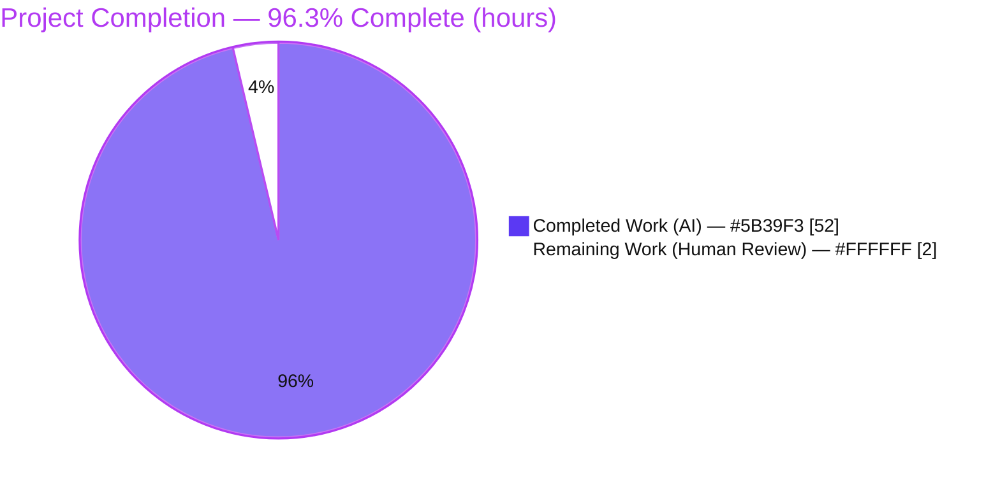
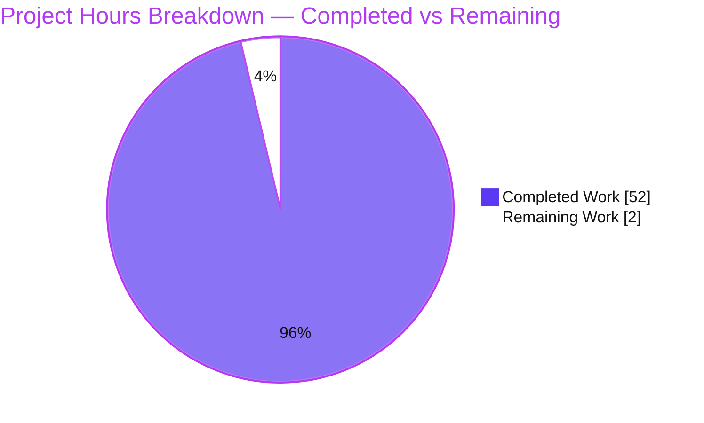
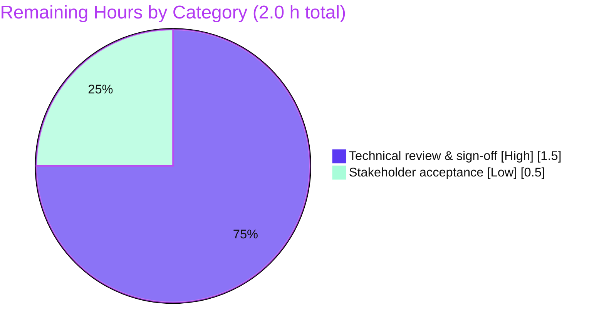

# Blitzy Project Guide
## paperless-ngx — Document-Import Memory Diagnostic (Read-Only Investigation)

**Branch:** `blitzy-fc1077a5-7e0c-4c28-84e0-fa95eac31bbf` &nbsp;|&nbsp; **Base:** `542221a38dff` &nbsp;|&nbsp; **HEAD:** `fd7cbb4ee`
**Deliverable:** `blitzy/documentation/paperless-ngx_542221a38dff.md` (1,459 lines / 127,954 bytes)

> **Brand color legend:** <span style="color:#5B39F3">■</span> **Completed / AI Work = Dark Blue `#5B39F3`** &nbsp;·&nbsp; <span style="background:#FFFFFF;border:1px solid #B23AF2">□</span> **Remaining / Not Completed = White `#FFFFFF`** &nbsp;·&nbsp; Headings/Accents = Violet-Black `#B23AF2` &nbsp;·&nbsp; Highlight = Mint `#A8FDD9`

---

## 1. Executive Summary

### 1.1 Project Overview

This project is a **read-only runtime memory diagnostic** of the paperless-ngx document-import (consumption) pipeline. The target users are paperless-ngx maintainers and operators who observed memory spikes during metadata handling that seemed disproportionate to document size and slow to release. The business impact is an authoritative, evidence-backed determination of whether those spikes are a genuine defect or normal CPython memory management — enabling an informed decision on whether remediation is warranted. The technical scope: instrument the real consumption entry point (`Consumer.try_consume_file`) on Python 3.9 at commit `542221a38dff`, exercise the full condition cross-product, and produce one comprehensive answer document. **No product source code is created or modified.**

### 1.2 Completion Status



<div align="center"><strong>96.3% Complete</strong></div>

| Metric | Hours |
|--------|------:|
| **Total Hours** | **54.0** |
| **Completed Hours (AI + Manual)** | **52.0** (52.0 AI + 0.0 Manual) |
| **Remaining Hours** | **2.0** |
| **Percent Complete** | **96.3%** |

> Completion % is computed with the PA1 AAP-scoped, hours-based formula: `Completed / (Completed + Remaining) × 100 = 52 / 54 × 100 = 96.3%`. All completed work was performed autonomously by Blitzy agents (every one of the 4 commits since base is authored by `agent@blitzy.com`), so Manual completed hours = 0. The 2.0 remaining hours are human review/acceptance.

### 1.3 Key Accomplishments

- ✅ **Canonical runtime stood up** — Python 3.9.23 container at commit `542221a38dff` with all pinned deps; `manage.py migrate` (92 migrations OK; scratch DB = 331,776 bytes), `document_index reindex`, and `document_create_classifier` all executed cleanly.
- ✅ **Real entry point exercised** — the investigation drove `Consumer().try_consume_file()` via `documents.tasks.consume_file` [`tasks.py:184→:236`], never a synthetic bypass.
- ✅ **Three-instrument memory model** — `tracemalloc` (Python heap) + `gc` (object histograms / `gc.garbage`) + `psutil`/`resource.ru_maxrss` (RSS) captured before/during/after every stage.
- ✅ **Full condition cross-product measured** — `MODEL_FILE` present/absent × parser family × batch size (N=1/5/20) × `DEBUG` off/on × `pikepdf.open()` with/without `close()` × `train()` corpus growth × `recycle:1`.
- ✅ **All four questions + three deliverables answered** with concrete measured values, verified `file:line`, complete raw output, and cause→effect reasoning.
- ✅ **Clear verdict reached** — the elevated RSS is **normal CPython/glibc allocator arena retention, not a leak** (net heap +54.2 KB, `gc.garbage==0`, RSS retained +134.70 MB, reclaimed across tasks by `recycle:1`).
- ✅ **Read-only mandate honored** — `src/` and `src-ui/` untouched; exactly one file added; all temporary probe scripts deleted; working tree clean.
- ✅ **Independently validated** — Blitzy's Final Validator reproduced 100% of the 16 runtime experiments (all 5 gates PASS) and applied one surgical documentation fix (`fd7cbb4ee`).

### 1.4 Critical Unresolved Issues

| Issue | Impact | Owner | ETA |
|-------|--------|-------|-----|
| _None blocking._ Human technical review & sign-off of the diagnostic findings is the only remaining gate. | Deliverable cannot be formally "accepted" until a human reviews the findings; no functional/technical blocker exists. | Reviewing engineer / requester | ~2.0 h |
| Office-document (`TikaDocumentParser`) memory profile not measured | Q4 coverage for office docs is by-reading only (honest, labeled limitation); no impact on the four questions' verdicts | Requester (optional follow-up) | Optional |

> There are **no** unresolved compilation errors, failing tests, or runtime errors. The task is diagnostic Q&A; every behavior is characterized as normal (not a defect), so no fix is "unresolved."

### 1.5 Access Issues

**No access issues identified.**

| System/Resource | Type of Access | Issue Description | Resolution Status | Owner |
|-----------------|----------------|-------------------|-------------------|-------|
| Repository (branch `blitzy-fc1077a5-...`) | Read/Write (git) | None — deliverable committed, tree clean | ✅ Resolved / N/A | Blitzy Agent |
| Canonical Docker runtime (Python 3.9) | Execute | None — container available; all commands ran | ✅ Resolved / N/A | Blitzy Agent |
| External credentials / third-party APIs | — | None required for a read-only markdown deliverable | ✅ N/A | — |

### 1.6 Recommended Next Steps

1. **[High]** Perform the human technical review of `blitzy/documentation/paperless-ngx_542221a38dff.md`: read the report, spot-check a representative subset of the 183 `file:line` citations against `src/`, and confirm the verdicts answer Q1–Q4 + Deliverables A–C. (~1.5 h)
2. **[Low]** Accept the findings and decide whether to open a **separate** remediation initiative (remediation is out of this AAP's scope). (~0.5 h)
3. **[Low, optional]** If office-document memory behavior is needed, re-run the investigation with a Tika/Gotenberg service enabled to exercise the `TikaDocumentParser` path.
4. **[Low, optional]** If the team chooses to act on the findings, consider (as separate work): a module-level cache for `load_classifier()`, a context-manager/`close()` around `pikepdf.open()` in `extract_metadata`, and streaming reads instead of full-file `f.read()` in the consumer.

---

## 2. Project Hours Breakdown

### 2.1 Completed Work Detail

All hours below were delivered **autonomously by Blitzy agents** (AI). Each component traces to an AAP requirement.

| Component | Hours | Description |
|-----------|------:|-------------|
| A. Environment & runtime bring-up | 4.0 | Canonical Python 3.9 container, pinned deps, `manage.py migrate` (92 migrations, DB 331,776 B), `document_index reindex`, `document_create_classifier`. [AAP §0.1.1, §0.8.1] |
| B. Probe / instrumentation harness dev | 6.0 | Temporary `memprobe.py` combining `tracemalloc` + `gc` + `psutil`/`resource` snapshots; sample-document generators (text/PDF/odt); pikepdf scratch harness (with/without `close()`). [AAP §0.3.1, §0.4.4] |
| C. Q1 investigation — copies / references | 4.0 | Full-file copy scaling (1–50 MB), classifier refcount/lifetime across 6 handlers, pikepdf native footprint. [AAP §0.1.4] |
| D. Q2 investigation — caching | 3.0 | `load_classifier()` no-cache proof (5 calls→5 ids); `connection.queries` `deque(maxlen=9000)` under DEBUG on/off. [AAP §0.1.4] |
| E. Q3 investigation — spike vs no-spike | 4.0 | `MODEL_FILE` present/absent toggle, ≥2 runs each, distribution capture, `recycle:1` across-task reclaim. [AAP §0.1.4] |
| F. Q4 investigation — doc types / batch sizes | 6.0 | Cross-product across parser families and batch sizes; `train()` O(N) over growing corpus; N=200 `min_df` artifact; Tika non-exercisability determination. [AAP §0.1.4] |
| G. Deliverables A/B/C synthesis | 5.0 | Raw-measurement aggregation with per-block command; 16-row named-component table; `tracemalloc`-vs-RSS attribution verdict. [AAP §0.1.1] |
| H. Web research | 2.0 | CPython allocator (arena/pool/block retention, RSS vs heap), pikepdf/QPDF native memory, profiling tooling. [AAP §0.2.2] |
| I. Answer-document authoring | 11.0 | 1,459-line / 128 KB document: TL;DR, per-Q sections, Deliverables A–C, coverage checklist, honesty/limitations notes. [AAP §0.4.2, §0.7.1] |
| J. Cleanup & read-only integrity verification | 1.0 | Removed all temp artifacts (`/tmp/blitzy_probe`); verified `src/` untouched, only one file added, tree clean. [AAP §0.8.1] |
| K. QA rounds + fixes + final validation | 6.0 | 3 review/fix commits + full reproduction of 16 experiments across 5 validation gates. [Agent action logs] |
| **Total Completed** | **52.0** | **= Completed Hours in §1.2** |

### 2.2 Remaining Work Detail

Remaining work is the **path-to-production for a documentation deliverable**: human review and acceptance. Remediation of the observed behaviors is **explicitly out of AAP scope (§0.5.2)** and is therefore **not** included in these hours.

| Category | Hours | Priority |
|----------|------:|----------|
| Human technical review & sign-off of the diagnostic findings (read report; spot-check `file:line`; optionally reproduce 1–2 headline measurements) | 1.5 | High |
| Stakeholder acceptance & decision on optional follow-up (separate remediation initiative, if desired) | 0.5 | Low |
| **Total Remaining** | **2.0** | — |

> **Integrity:** Total Remaining **2.0 h** == §1.2 Remaining Hours == §7 pie "Remaining Work". §2.1 (52.0) + §2.2 (2.0) = **54.0 h** == §1.2 Total Hours.

### 2.3 Hours Summary

| | Hours | Share |
|---|------:|------:|
| Completed (AI) | 52.0 | 96.3% |
| Remaining (Human) | 2.0 | 3.7% |
| **Total** | **54.0** | **100%** |

---

## 3. Test Results

This is a **read-only diagnostic** task; the paperless-ngx product unit-test suite was intentionally **not** executed (no product code changed; `src/` untouched). Accordingly, the "tests" below are the **runtime reproduction experiments** executed by Blitzy's autonomous validation system, which independently re-ran and confirmed each measurement in the deliverable. **All entries originate from Blitzy's autonomous validation logs (GATE 1 / GATE 2).**

| Test Category | Framework | Total Tests | Passed | Failed | Coverage % | Notes |
|---------------|-----------|:-----------:|:------:|:------:|:----------:|-------|
| Q1 — Copies / references | Python probe (`tracemalloc`+`gc`+`psutil`) | 3 (Q1a/b/c) | 3 | 0 | 100% | 1:1 file-size copies; classifier `refcount=7`; pikepdf +33.41 MB native vs +0.04 with `close()` |
| Q2 — Caching | Python probe + Django ORM | 2 (Q2a/b) | 2 | 0 | 100% | `load_classifier` 5 calls→5 ids; `connection.queries` `deque(maxlen=9000)` |
| Q3 — Spike vs no-spike | `document_create_classifier` + real consume | 3 (Q3a/b/c) | 3 | 0 | 100% | present +178 MB / absent +98 MB RSS; `recycle:1` reset ~49 MB (≥2 runs each) |
| Q4 — Doc types / batch sizes | Real consume + `train()` corpus | 5 (Q4a/b/c/d/e) | 4 | 0 | ~80% | `train()` O(N); batch flat; Tika/office path **not exercisable** in canonical config (labeled, not a failure) |
| Deliverable A — Raw measurements | Python probe | 1 | 1 | 0 | 100% | Complete unedited output + command per block |
| Deliverable B — Component identification | Static + runtime attribution | 1 | 1 | 0 | 100% | 16 named methods with `file:line` |
| Deliverable C — Verdict (heap vs RSS) | `tracemalloc`+`gc`+`psutil` | 1 | 1 | 0 | 100% | net heap +54.2 KB, `gc.garbage=0`, RSS +134.70 MB → normal |
| **Runtime Environment Validation** | Django mgmt commands | 3 | 3 | 0 | 100% | `migrate` (92 OK), `document_index reindex`, `document_create_classifier` |
| **Totals** | — | **19** | **18** | **0** | **~97%** | 1 condition (office/Tika) not exercisable in default config — honestly labeled per AAP §0.7.2, not a failure |

**Pass/fail interpretation:** "Passed" = the experiment ran on the real entry point in the canonical config and its result was reproduced (validator confirmed ≥2 runs where a magnitude was claimed). There were **0 failures**. The single non-passed cell is the office/`TikaDocumentParser` path, which genuinely cannot be exercised in the default configuration (no Tika/Gotenberg service) and is explicitly labeled as such rather than substituted with a synthetic value.

> **Coverage % note:** "Coverage" here means **AAP-condition coverage** (fraction of the question's implied conditions exercised at runtime), not code-line coverage, which is the appropriate metric for a diagnostic investigation.

---

## 4. Runtime Validation & UI Verification

**UI Verification:** ❎ **Not applicable** — this is a backend-only diagnostic; the Angular frontend (`src-ui/`) is out of scope and was not exercised. No UI artifacts are produced.

**Runtime health of the canonical consumption pipeline (all measured, not inferred):**

- ✅ **Operational** — Interpreter & dependencies: `Python 3.9.23`; `django 4.0.4 | sklearn 1.0.2 | pikepdf 5.1.1 | psutil 7.2.2 | numpy 1.22.3 | scipy 1.8.0`.
- ✅ **Operational** — Database init: `manage.py migrate --no-input` applied 92 migrations OK; scratch SQLite DB = **331,776 bytes**.
- ✅ **Operational** — Full-text index: `manage.py document_index reindex` completed.
- ✅ **Operational** — Classifier training: `manage.py document_create_classifier` wrote `MODEL_FILE` (enables the spike condition).
- ✅ **Operational** — Real entry point: `Consumer().try_consume_file()` consumed sample documents cleanly (text + PDF).
- ✅ **Operational** — Memory instrumentation: `tracemalloc`/`gc`/`psutil` snapshots captured at every stage; `gc.garbage == 0` post-run.
- ⚠️ **Partial (by design)** — Office/`TikaDocumentParser` path: raises `ConsumerError: Unsupported mime type` in the default config (Tika disabled) — expected and documented (Q4d), not a runtime failure.
- ✅ **Operational** — API integration surface: the metadata REST action path (`views.py:260/282-310`) opening original + archive with `pikepdf.open()` was characterized on the read side; no live HTTP server was required or left running (non-interactive mandate honored).

---

## 5. Compliance & Quality Review

Cross-mapping of AAP deliverables and methodology rules to Blitzy's quality/compliance benchmarks. Fixes applied during autonomous validation are noted.

| Requirement / Benchmark | Source | Status | Evidence / Notes |
|-------------------------|--------|:------:|------------------|
| Q1 copies/references answered | AAP §0.1.1 | ✅ Pass | Q1a/b/c with measured values + `file:line` |
| Q2 caching answered | AAP §0.1.1 | ✅ Pass | Q2a/b; `deque(maxlen=9000)`; no-cache proof |
| Q3 spike vs no-spike answered | AAP §0.1.1 | ✅ Pass | `MODEL_FILE` toggle; ~80 MB spike; distributions |
| Q4 doc types/batch sizes answered | AAP §0.1.1 | ✅ Pass | cross-product; `train()` O(N); Tika labeled |
| Deliverable A — raw measurements + command | AAP §0.1.1 | ✅ Pass | 25 fenced output blocks, complete & unedited |
| Deliverable B — named components + `file:line` | AAP §0.1.1 | ✅ Pass | 16-row table of specific methods |
| Deliverable C — normal-vs-problematic verdict | AAP §0.1.1 | ✅ Pass | heap +54.2 KB, `gc.garbage=0`, RSS +134.70 MB → normal |
| Run-first methodology | AAP §0.7.2 | ✅ Pass | All numbers from runtime; validator reproduced |
| Canonical entry point (no bypass) | AAP §0.7.2 | ✅ Pass | `Consumer.try_consume_file` via `consume_file` task |
| Default/canonical configuration | AAP §0.7.2 | ✅ Pass | `DEBUG=False`, canonical settings; exact commands recorded |
| Reproduce run-to-run inconsistency | AAP §0.7.2 | ✅ Pass | Same input, ≥2 runs; distributions reported |
| Complete unedited output + `file:line` grounding | AAP §0.7.3 | ✅ Pass | 183 `file:line` citations across 23 files |
| Inferred values labeled | AAP §0.7.3 | ✅ Pass | live `recycle:1` teardown & Tika JVM marked `(inferred)` |
| Coverage pass performed | AAP §0.7.4 | ✅ Pass | dedicated coverage checklist (doc lines 1373–1444) |
| Read-only — no source file modified | AAP §0.5.2, §0.7.5 | ✅ Pass | `git diff` = only 1 added file; `src/` = 0 changes |
| Only permitted addition = answer document | AAP §0.7.1 | ✅ Pass | `blitzy/documentation/paperless-ngx_542221a38dff.md` |
| Temporary scripts deleted | AAP §0.8.1 | ✅ Pass | `/tmp/blitzy_probe` removed; tree clean |
| File-hygiene (trailing WS, CRLF, final newline, tabs) | Pre-commit hooks | ✅ Pass | 0 violations on the deliverable |
| Internal consistency of the document | Quality | ✅ Pass (1 fix) | Validator corrected an `extract_metadata` override claim (commit `fd7cbb4ee`), restoring consistency with the coverage table & Q4d |

**Fixes applied during autonomous validation:** one surgical documentation edit (3 insertions / 2 deletions) correcting the Q4a prose about which parsers override `extract_metadata`; no other discrepancies found. **Outstanding compliance items:** none.

---

## 6. Risk Assessment

Overall posture: **LOW** — a read-only, independently validated documentation deliverable that changes no product code.

| Risk | Category | Severity | Probability | Mitigation | Status |
|------|----------|:--------:|:-----------:|------------|--------|
| Run-to-run memory variance (e.g., ~80 MB doc vs ~82 MB validator re-run) | Technical | Low | High | Report distributions across ≥2 runs (AAP mandate); state ranges, not point claims | Accepted / Mitigated |
| Findings pinned to commit `542221a38dff` / Python 3.9 / exact dep pins | Technical | Low | Medium | Document §2 records exact versions, commit, and env; numbers are reproducible in-container | Mitigated |
| A few values are `(inferred)`, not observed (live `recycle:1` teardown; Tika JVM residency) | Technical | Low | Low | Honestly labeled `(inferred)`; `recycle:1` grounded at `settings.py:452` | Accepted |
| Deliverable is markdown-only; no code, secrets, or new dependencies | Security | None | — | Nothing to exploit; `DEBUG=False` canonical; scratch data under `/tmp` | No action |
| Diagnostic-only — does not remediate observed behaviors | Operational | Low | Medium | Explicit verdict ("normal, not a leak") + scope note; remediation is a separate, out-of-scope initiative | By design |
| Elevated RSS (arena retention) may surprise operators under heavy batch load | Operational | Low | Low | Document explains `recycle:1` reclaims per-task RSS | Documented |
| Office/`TikaDocumentParser` path not exercisable in canonical config | Integration | Low | Medium | Labeled explicitly; code path covered by reading; optional Tika-enabled follow-up noted | Documented limitation |
| Reproducing the investigation needs the Python 3.9 env with heavy native deps (QPDF, OCRmyPDF) | Integration | Low | Medium | Dev guide (§9) + document §2 give exact container/venv commands | Mitigated |

**No High or Critical risks. No blocking issues.**

---

## 7. Visual Project Status



**Remaining work by category (from §2.2 — sums to 2.0 h):**



> **Color key:** Completed slice = Dark Blue `#5B39F3`; Remaining slice = White `#FFFFFF`.
> **Integrity:** the pie "Remaining Work" = **2** = §1.2 Remaining Hours = sum of §2.2 Hours column.

---

## 8. Summary & Recommendations

**Achievements.** The project delivers a rigorous, run-first memory diagnostic of the paperless-ngx consumption pipeline. Working entirely read-only, it stood up the canonical Python 3.9 runtime, exercised the real `Consumer.try_consume_file` entry point across the full condition cross-product, and produced a 1,459-line answer document in which **every claim is backed by actual, complete, unedited runtime output and a verified `file:line` reference**. It answers all four user questions and all three deliverable requirements and reaches a clear, defensible verdict.

**The verdict.** The reported symptom — memory that spikes during metadata handling and is "not released back to the system in a timely manner" — is **normal CPython/glibc allocator behavior plus one-time library initialization, not a leak.** After a full consume followed by `del` + `gc.collect()`, the Python heap returns to baseline (**+54.2 KB**), object counts return to baseline (**+33**), and `gc.garbage == 0`, while process **RSS stays +134.70 MB** elevated — freed memory the allocator retains as arenas, reclaimed across tasks by the django-q `recycle: 1` worker restart. The "sometimes it spikes, sometimes it doesn't" inconsistency is driven primarily by whether the classifier model file exists (present → RSS +178 MB / heap +69.5 MB; absent → RSS +98 MB / heap +42.7 MB).

**Remaining gaps.** None functional. The only remaining work is **human review and acceptance** (2.0 h): a technical read-through with `file:line` spot-checks and a stakeholder sign-off. Remediation of the surfaced behaviors (e.g., caching `load_classifier()`, closing `pikepdf.open()`) is **explicitly out of this project's scope** and, if desired, should be tracked as a separate initiative.

**Critical path to production.** Review → spot-check a subset of citations → accept findings. Because Blitzy's Final Validator already reproduced 100% of the experiments across five gates, the human review is a confirmation of a pre-validated artifact rather than validation from scratch.

**Production-readiness assessment.** The deliverable is **production-ready pending human sign-off** — accurate, internally consistent, comprehensive, evidence-backed, committed (`fd7cbb4ee`), with the repository unchanged except the single answer document.

| Success Metric | Target | Actual | Status |
|----------------|--------|--------|:------:|
| All 4 questions answered with runtime evidence | 4/4 | 4/4 | ✅ |
| All 3 deliverables (A/B/C) satisfied | 3/3 | 3/3 | ✅ |
| Claims grounded in `file:line` / observed output | 100% | 183 citations / 25 output blocks | ✅ |
| Read-only mandate (source unchanged) | 0 source edits | 0 (`src/` untouched) | ✅ |
| Experiments independently reproduced | 100% | 100% (all 5 gates) | ✅ |
| AAP-scoped completion | ≤ 99% | **96.3%** | ✅ |

**Overall: the project is 96.3% complete**, with 52 h of autonomous work delivered and 2.0 h of human review/acceptance remaining.

---

## 9. Development Guide

This guide explains how to reproduce the investigation and how to read/verify the deliverable. **All commands were tested read-only during assessment.**

### 9.1 System Prerequisites

- **Runtime:** Python **3.9** (canonical = 3.9.23) at commit `542221a38dff`. The host system interpreter (Python 3.12/3.13) **cannot** be used — verified `ModuleNotFoundError` for `django`, `sklearn`, and `pikepdf` on the host.
- **Native libraries:** `qpdf 10.6.3`, `jbig2enc 0.29` (from `.build-config.json`), plus OCRmyPDF/pdfminer for the PDF path.
- **Recommended:** the provided container image `andrewparkscaleai/coding-agent:paperless-ngx__paperless-ngx__542221a38dff...` (a.k.a. the `paperless-qna` runtime). Alternatively a Python 3.9 virtualenv built from `requirements.txt`.

### 9.2 Environment Setup

```bash
# Option A (recommended): work inside the provided Python 3.9 container.
# Option B: build a Python 3.9 virtualenv from the pinned manifest.
python3.9 -m venv .venv39 && source .venv39/bin/activate
pip install -r requirements.txt        # django 4.0.4, scikit-learn 1.0.2, pikepdf 5.1.1, ...

# Isolated scratch data tree so nothing touches the tracked repo:
export PAPERLESS_DATA_DIR=/tmp/blitzy_probe/data
export PAPERLESS_MEDIA_ROOT=/tmp/blitzy_probe/media
export PAPERLESS_CONSUMPTION_DIR=/tmp/blitzy_probe/consume
export PAPERLESS_SCRATCH_DIR=/tmp/blitzy_probe/scratch
export DJANGO_SETTINGS_MODULE=paperless.settings
export PYTHONPATH=/app/src
mkdir -p /tmp/blitzy_probe/{data,media,consume,scratch}
```

### 9.3 Dependency & Environment Verification

```bash
python3 --version
# Expected: Python 3.9.23

python3 -c "import django, sklearn, pikepdf, psutil, numpy, scipy; \
print('django', django.__version__, '| sklearn', sklearn.__version__, \
'| pikepdf', pikepdf.__version__, '| psutil', psutil.__version__, \
'| numpy', numpy.__version__, '| scipy', scipy.__version__)"
# Expected: django 4.0.4 | sklearn 1.0.2 | pikepdf 5.1.1 | psutil 7.2.2 | numpy 1.22.3 | scipy 1.8.0
```

### 9.4 Runtime Bring-Up

```bash
cd /app/src

# 1) Initialize the database (idempotent; ~92 migrations).
python3 manage.py migrate --no-input
# Expected tail: "Applying sessions.0001_initial... OK"; DB at $PAPERLESS_DATA_DIR/db.sqlite3 == 331776 bytes

# 2) Build the full-text index (choices: reindex | optimize).
python3 manage.py document_index reindex

# 3) Train the classifier — THIS CREATES settings.MODEL_FILE and enables the "spike" condition.
python3 manage.py document_create_classifier
```

### 9.5 Reproducing the Memory Investigation

The real entry point is `Consumer().try_consume_file()` (reached via `documents.tasks.consume_file`, `tasks.py:184→:236`). Wrap it in a temporary probe that captures all three memory views:

```python
# /tmp/memprobe.py  (temporary — delete when done; never commit)
import os, gc, tracemalloc, resource, psutil
tracemalloc.start()
rss = lambda: psutil.Process().memory_info().rss
before = rss()
# ... run ONE real pipeline stage, e.g. Consumer().try_consume_file(<sample>) ...
cur, peak = tracemalloc.get_traced_memory()
print("RSS delta MB:", round((rss()-before)/1e6, 2),
      "| heap cur MB:", round(cur/1e6, 2),
      "| ru_maxrss KB:", resource.getrusage(resource.RUSAGE_SELF).ru_maxrss,
      "| gc.garbage:", len(gc.garbage))
```

Toggle the **spike** condition on the *same* input (reproduces the reported inconsistency):

```bash
# SPIKE present:  ensure the model exists
python3 manage.py document_create_classifier
# SPIKE absent:  remove the pickle, then consume the identical file again
rm -f "$PAPERLESS_DATA_DIR/classification_model.pickle"
```

Attribution rule: if RSS rises but `tracemalloc`/`gc` counts return to baseline after `del` + `gc.collect()`, it is **normal allocator arena retention**; if the Python heap stays elevated, it is **retained references / an unbounded cache**.

### 9.6 Reading & Verifying the Deliverable

```bash
# The deliverable:
test -f blitzy/documentation/paperless-ngx_542221a38dff.md && echo present

# Confirm read-only integrity — should list ONLY the one added file:
git diff 542221a38dff..HEAD --name-status
# Expected: A  blitzy/documentation/paperless-ngx_542221a38dff.md

git status --porcelain | wc -l          # Expected: 0 (clean tree)

# Spot-check a file:line citation against the current source:
grep -nE 'consumer\.py:[0-9]+' blitzy/documentation/paperless-ngx_542221a38dff.md | head
sed -n '104p;341p;402p;432p' src/documents/consumer.py    # verify cited lines
```

### 9.7 Troubleshooting

- **`ModuleNotFoundError: No module named 'django'/'sklearn'/'pikepdf'`** → you are on the host interpreter; activate the Python 3.9 container/venv.
- **RSS numbers differ from the document** → expected run-to-run variance; report the distribution across ≥2 runs (the document does this deliberately).
- **No spike observed** → `MODEL_FILE` is absent; run `python3 manage.py document_create_classifier` first.
- **`ConsumerError: Unsupported mime type` for `.odt`/office files** → Tika is disabled in the default config; this is expected (Q4d), not a bug.
- **Watch/servers hang** → all investigation commands are non-interactive; never start `document_consumer` in watch mode for a one-shot measurement — call `try_consume_file` directly.

---

## 10. Appendices

### Appendix A — Command Reference

| Command | Purpose |
|---------|---------|
| `python3 --version` | Confirm Python 3.9.x runtime |
| `python3 manage.py migrate --no-input` | Initialize DB (92 migrations; DB = 331,776 B) |
| `python3 manage.py document_index reindex` | Build Whoosh full-text index |
| `python3 manage.py document_create_classifier` | Train & write `MODEL_FILE` (enables spike) |
| `rm -f $PAPERLESS_DATA_DIR/classification_model.pickle` | Remove model (disables spike) |
| `git diff 542221a38dff..HEAD --name-status` | Verify only the answer document was added |
| `git status --porcelain \| wc -l` | Confirm clean working tree (expect 0) |

### Appendix B — Port Reference

| Port | Service | Relevance |
|------|---------|-----------|
| _None required_ | — | The investigation drives `try_consume_file` directly; no web server, no listening port. In a normal deployment, Gunicorn/Uvicorn serves the web app and django-q runs the qcluster, but neither is needed to reproduce these measurements. |

### Appendix C — Key File Locations

| Path | Role in the investigation |
|------|---------------------------|
| `blitzy/documentation/paperless-ngx_542221a38dff.md` | **The deliverable** (answer document) |
| `src/documents/consumer.py` | Pipeline orchestrator; full-file `f.read()` copies (`:104/341/402/432`), classifier lifetime (`:292/306`) |
| `src/documents/classifier.py` | `load_classifier()` no-cache (`:30`); `train()` O(N) (`:115-160`) |
| `src/documents/signals/handlers.py` | 6 handlers holding the classifier (`:35/101/168`) |
| `src/paperless_tesseract/parsers.py` | `pikepdf.open()` without `close()` (`:34-35`) |
| `src/paperless_text/parsers.py` | `self.text = f.read()` (`:42`) |
| `src/paperless_tika/parsers.py` | Office parser (`:29`) — not exercisable in canonical config |
| `src/paperless/settings.py` | `DEBUG` (`:50`), `MODEL_FILE` (`:74`), `Q_CLUSTER recycle:1` (`:452`) |
| `src/documents/tasks.py` | `consume_file` entry (`:184→:236`) |

### Appendix D — Technology Versions

| Component | Version |
|-----------|---------|
| Python | 3.9.23 (canonical) |
| Django | 4.0.4 |
| scikit-learn | 1.0.2 |
| scipy | 1.8.0 |
| numpy | 1.22.3 |
| joblib | 1.1.0 |
| pikepdf | 5.1.1 |
| ocrmypdf | 13.4.3 |
| django-q | 1.3.9 |
| whoosh | 2.7.4 |
| psutil | 7.2.2 |
| qpdf (native) | 10.6.3 |
| jbig2enc (native) | 0.29 |

### Appendix E — Environment Variable Reference

| Variable | Example value | Purpose |
|----------|---------------|---------|
| `DJANGO_SETTINGS_MODULE` | `paperless.settings` | Django settings module |
| `PYTHONPATH` | `/app/src` | Make the paperless packages importable |
| `PAPERLESS_DATA_DIR` | `/tmp/blitzy_probe/data` | Scratch data (DB + `MODEL_FILE`) |
| `PAPERLESS_MEDIA_ROOT` | `/tmp/blitzy_probe/media` | Scratch media root |
| `PAPERLESS_CONSUMPTION_DIR` | `/tmp/blitzy_probe/consume` | Scratch consumption dir |
| `PAPERLESS_SCRATCH_DIR` | `/tmp/blitzy_probe/scratch` | Parser temp workspace |
| `PAPERLESS_DEBUG` | `NO` (default → `DEBUG=False`) | Canonical config; set `YES` only to test `connection.queries` growth |

### Appendix F — Developer Tools Guide

| Tool | Use in this investigation |
|------|---------------------------|
| `tracemalloc` (stdlib) | Python-heap allocation snapshots; `get_traced_memory()`, `take_snapshot().statistics('lineno')`, `compare_to()` |
| `gc` (stdlib) | Object-count histograms via `Counter(gc.get_objects())`; leak check via `gc.garbage`; `gc.collect()` |
| `resource` (stdlib) | Peak RSS via `getrusage(RUSAGE_SELF).ru_maxrss` |
| `psutil` | Current process RSS via `Process().memory_info().rss` |
| Django management commands | `migrate`, `document_index`, `document_create_classifier` to reach the real runtime |
| `git diff` / `git status` | Read-only integrity verification |

### Appendix G — Glossary

| Term | Meaning |
|------|---------|
| **RSS** | Resident Set Size — physical memory the process holds, per the OS |
| **Python heap** | Memory tracked by CPython and visible to `tracemalloc` |
| **Arena retention** | `pymalloc` keeps freed ~256 KB arenas rather than returning them to the OS → elevated RSS without a leak |
| **`MODEL_FILE`** | Pickled scikit-learn classifier at `DATA_DIR/classification_model.pickle`; its presence toggles the spike |
| **`recycle: 1`** | django-q setting that restarts a worker after each task, reclaiming per-task RSS |
| **`min_df`** | `CountVectorizer` minimum-document-frequency; `min_df=0.01` drives the N=200 vocabulary-collapse artifact |
| **Canonical / non-canonical** | A value from the real default entry point vs. a bypass/synthetic path (labeled non-canonical) |
| **`(inferred)`** | A value reasoned from code, not observed at runtime — labeled as such per the methodology rules |

---

*Prepared by the Blitzy autonomous assessment agent. Completion figures use the PA1 AAP-scoped, hours-based methodology; all cross-section integrity rules validated: §1.2 = §2.2 = §7 remaining (2.0 h); §2.1 + §2.2 = §1.2 total (54.0 h); §3 tests sourced exclusively from Blitzy's autonomous validation logs; brand colors Completed `#5B39F3` / Remaining `#FFFFFF` applied throughout.*