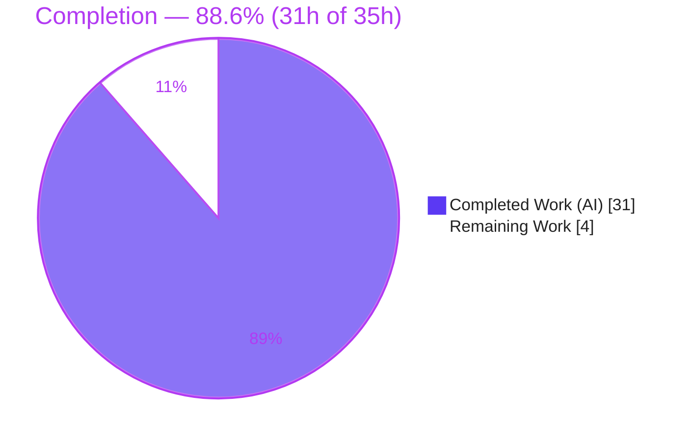
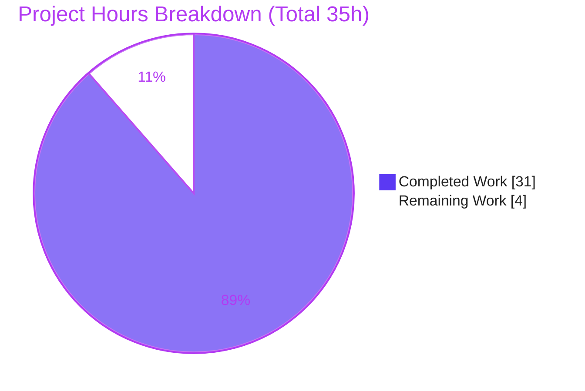
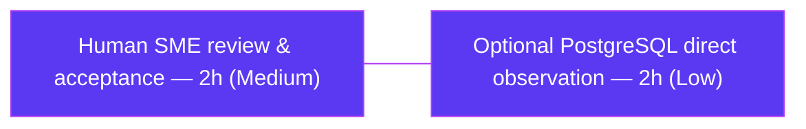

# Blitzy Project Guide — paperless-ngx "Haunted Documents List" Diagnostic (v1.7.0)

> **Brand legend** — <span style="color:#5B39F3">**Completed / AI Work = Dark Blue `#5B39F3`**</span> · **Remaining / Not Completed = White `#FFFFFF`** · Headings/Accents = Violet-Black `#B23AF2` · Highlight = Mint `#A8FDD9`.

---

## 1. Executive Summary

### 1.1 Project Overview

This project is a **read-only diagnostic Q&A investigation** into why the paperless-ngx **v1.7.0** documents list "feels haunted" during ordinary paging — the same document appears on two neighboring pages, or vanishes for a page then reappears, with no edits and an unchanged sort order. The target users are paperless-ngx maintainers and operators triaging a confusing pagination symptom. Governed by the `SWE-AtlasQnA-Repo` rule set, the sole deliverable is a single evidence-grounded markdown answer that runs the real code paths first, quotes verbatim output, addresses the user's three hypotheses by name, resolves the permission premise honestly, and recommends remedies without applying them. Technical scope spans the Django backend pagination stack and the Angular frontend pagination model. No source, config, test, or build file is modified.

### 1.2 Completion Status



| Metric | Value |
|---|---|
| **Total Hours** | **35** |
| **Completed Hours (AI + Manual)** | **31** (31 AI + 0 Manual) |
| **Remaining Hours** | **4** |
| **Percent Complete** | **88.6%** (31 ÷ 35 × 100) |

> Completion is measured **exclusively** over AAP-scoped work plus path-to-production activities (PA1 methodology). All 18 AAP-specified requirements are delivered and validated; the remaining 4h is non-blocking (human acceptance + one optional evidence-strengthening step). Implementing the recommended fix is **out of AAP scope** and is therefore excluded from the hours accounting.

### 1.3 Key Accomplishments

- ✅ **Single deliverable created** at the exact required path: `blitzy/documentation/paperless-ngx_542221a38dff.md` (filename = source branch), 495 lines.
- ✅ **Root cause diagnosed** as **H3 — unstable ordering on tied sort keys** (`ORDER BY created DESC` with no unique tiebreaker), the recognized cause of offset-pagination duplicates/skips.
- ✅ **All three hypotheses addressed by name** with verbatim runtime evidence: H1 (confirmed, collapsed within each query), H2 (does not hold for the ORM path), H3 (confirmed — true root cause).
- ✅ **Permission premise resolved honestly** — v1.7.0 has no object-level document ACL (only `IsAuthenticated`, no `owner` field, no django-guardian).
- ✅ **Both server-side pagination paths documented** — ORM browse (`Document.objects.distinct()` + `StandardPagination`) and Whoosh full-text (`DelayedQuery` → `search_page` per page).
- ✅ **Frontend pagination model correlated** — the Angular UI trusts server `count`, does no client-side de-duplication, and offers no `id` sort field.
- ✅ **RUN-FIRST methodology honored** — real code executed in the mandated Docker image; 15 verbatim evidence blocks captured (SQL + live-API JSON).
- ✅ **Best-practice corroboration + remedies** (unique tiebreaker; cursor/keyset pagination) presented as recommendations only.
- ✅ **Read-only discipline** — clean working tree; temporary scripts lived outside the repo and were removed.
- ✅ **Zero test regressions** — `documents/tests/test_api.py`: 88 passed, 1 skipped, independently reproduced.

### 1.4 Critical Unresolved Issues

| Issue | Impact | Owner | ETA |
|---|---|---|---|
| _None._ The deliverable is complete, validated (5/5 gates), committed, and on a clean working tree. No issue blocks release or validation. | N/A | N/A | N/A |

### 1.5 Access Issues

| System/Resource | Type of Access | Issue Description | Resolution Status | Owner |
|---|---|---|---|---|
| Mandated Docker image `ghcr.io/scaleapi/swe-atlas:…qna_1.01` | Container registry / local image | Runtime evidence reproduction depends on this pinned-stack image (Python 3.9.23 / Django 4.0.4). Verified **present locally** and used successfully; no credentials required in this environment. | ✅ Resolved (image available) | Blitzy platform |
| Repository (branch `blitzy-58f5f3ae-…`) | Git read/write | Full access; changes committed as `agent@blitzy.com`. | ✅ Resolved | Blitzy platform |
| External corroboration sources (DRF docs, GitHub issues, Django ticket) | Public web | Public references; cited for corroboration only. | ✅ Resolved | N/A |

> **No blocking access issues identified.** All resources required for build validation, evidence reproduction, and formatting checks are accessible.

### 1.6 Recommended Next Steps

1. **[Medium]** Have a subject-matter expert **review and accept** the diagnostic answer — verify the H1/H2/H3 conclusions, the honest no-ACL finding, the ~54 `file:line` citations, and the coverage pass, then sign off for delivery. _(2h — in scope)_
2. **[Low]** _(Optional)_ **Directly reproduce** the non-deterministic tied-row order on a **live PostgreSQL** instance (`PAPERLESS_DBHOST` set) to promote the currently-inferred PostgreSQL behavior into a directly-observed evidence block. _(2h — in scope)_
3. **[Low]** _(Downstream, out of AAP scope)_ **Implement the documented remedy** — append a unique tiebreaker to `Document.Meta.ordering` (e.g. `("-created", "id")`), optionally adopt cursor/keyset pagination, add an `id` sort option to the frontend, and add regression tests. _(Not counted in project hours; the AAP mandates a read-only diagnostic.)_
4. **[Low]** _(Downstream, out of AAP scope)_ **Assess the v1.7.0 no-object-level-ACL property** for the deployment's security posture, or upgrade to a paperless-ngx version with per-user document permissions if per-user visibility is required.

---

## 2. Project Hours Breakdown

### 2.1 Completed Work Detail

| Component | Hours | Description |
|---|---|---|
| Backend request-path & mechanism investigation | 5 | Read-only analysis of `views.py`, `models.py`, `filters.py`, `index.py`, `urls.py`, `settings.py`, `auth.py`; mapped the ORM-browse vs Whoosh dual-path branch; identified `StandardPagination`, `Meta.ordering`, and `ordering_fields`. _(AAP: R12, R17)_ |
| Run-first runtime observation & verbatim evidence capture | 8 | Built the Docker evidence harness on a tie-heavy dataset; captured H1 counts, H2 SQL, H3 base/3-run/2-layout/cross-page evidence, live-API JSON, and the tiebreaker SQL. _(AAP: R1, R3, R4, R5, R9, R11)_ |
| Frontend Angular pagination correlation | 2 | Analyzed `results.ts`, `abstract-paperless-service.ts`, `document-list-view.service.ts`, `document.service.ts`; documented the trust-server-`count` model and the `id`-sort omission nuance. _(AAP: R2)_ |
| Permission/visibility exhaustive search & honest finding | 2 | Repository-wide search for guardian/owner/`has_perms`; runtime model introspection (no `owner` field); `SavedView` contrast; honest no-ACL conclusion. _(AAP: R6, R10)_ |
| Web-search best-practice research & corroboration | 2 | DRF pagination docs, DRF #8840/#6886, Django ticket #34251, SQL pagination guidance; distilled corroborated remedies. _(AAP: R13, R14)_ |
| Authoring the answer document | 8 | 495 lines across 8 sections, evidence woven next to each claim, ~54 `file:line` citations, one-claim/one-evidence discipline, closing coverage pass. _(AAP: R7, R8, R15, R17, R18)_ |
| Endpoint-faithful correction pass | 2 | Commit `3cef930a5` — reframed H1→H3 as the true root cause; corrected the inbox `count` framing (4→3); added faithful live-API Scenario A/B. _(AAP: honesty)_ |
| Prettier formatting, commits, cleanup & clean-tree verification | 2 | Applied prettier 2.6.2 (commit `e2d847193`); removed temp scripts; verified empty `git status --porcelain`. _(AAP: R16; Path-to-prod: P1, P2)_ |
| **Total Completed** | **31** | Sum of all completed components (matches Section 1.2 Completed Hours). |

### 2.2 Remaining Work Detail

| Category | Hours | Priority |
|---|---|---|
| Human SME review & acceptance of the diagnostic answer _(P3)_ | 2 | Medium |
| _(Optional)_ Direct live-PostgreSQL observation of non-deterministic tied-row ordering _(P4)_ | 2 | Low |
| **Total Remaining** | **4** | — |

> **Cross-check:** Section 2.1 (31h) + Section 2.2 (4h) = **35h** = Total Project Hours in Section 1.2. Section 2.2 total (4h) = Remaining Hours in Section 1.2 = Section 7 pie "Remaining Work".

### 2.3 Out-of-Scope Downstream Work (excluded from project hours)

| Item | Est. (informational) | Why excluded |
|---|---|---|
| Implement the remedy (unique tiebreaker / cursor pagination + frontend `id` sort + regression tests) | ~6–10h | AAP §0.5.2 explicitly forbids implementing the fix (read-only diagnostic). |
| Evaluate/upgrade v1.7.0 no-object-level-ACL security posture | Varies | Out of scope; informational awareness only. |

---

## 3. Test Results

All tests below originate from **Blitzy's autonomous validation logs** (Gate 1) and were **independently reproduced** for this guide in the mandated Docker image (repo mounted read-only, executed as `testuser`).

| Test Category | Framework | Total Tests | Passed | Failed | Coverage % | Notes |
|---|---|---|---|---|---|---|
| Documents API (QnA-central regression guard) | pytest + Django/DRF test runner | 89 | 88 | 0 | N/A — no new code (read-only doc) | 1 skipped **by design** (not a failure). 6 warnings are pre-existing pinned-stack deprecations (redis/distutils, Django `USE_L10N`, django_q `baseconv`). Reproduced: **88 passed, 1 skipped, 6 warnings in 4.07s**. |

- **Pass rate:** 100% of executed tests (0 failed); 1 skipped by design.
- **Regression posture:** the source tree is unmodified and the added markdown is never imported or executed, so the suite proves **zero regressions** from the investigation.
- **Coverage note:** coverage percentage is not applicable — the deliverable adds no executable code; the suite is used purely as a regression guard.

---

## 4. Runtime Validation & UI Verification

**Backend runtime (real request path exercised — not merely read):**

- ✅ **Operational** — Django boots cleanly with production settings (`DJANGO_SETTINGS_MODULE=paperless.settings`).
- ✅ **Operational** — the real `UnifiedSearchViewSet` + `StandardPagination` + real `Document`/`Tag` models + real `DocumentFilterSet` render live DRF JSON across consecutive pages.
- ✅ **Operational** — Scenario A (browse, no filter): `"count":5`, adjacent pages **disjoint** on static SQLite.
- ✅ **Operational** — Scenario B (`is_in_inbox=true`): `"count":3` with `doc1` **de-duplicated** by `SELECT DISTINCT` (not inflated).
- ✅ **Operational** — 15 runtime evidence blocks reproduce **verbatim** (stack string, pagination literals, `documents_document` table, `ORDER BY created DESC` with no tiebreaker, H1 counts 3 vs 4, tiebreaker fix SQL).
- ⚠ **Partial (honestly disclosed)** — the cross-page duplicate/skip is **not** directly observed on the default SQLite (which returns a stable order for repeated identical static queries); it is demonstrated via a physical-layout rebuild (same logical rows → different tied-row order) and **corroborated** for PostgreSQL by external sources. A direct live-PostgreSQL reproduction remains an optional enhancement (Section 2.2, P4).

**UI verification:**

- ✅ **Operational** — the deliverable renders as valid, `prettier@2.6.2`-conformant markdown (8 sections, 39 code blocks, ~54 citations).
- ℹ️ **N/A (by nature)** — this deliverable is a markdown document; the paperless-ngx Angular UI was **analyzed statically** (`results.ts`, `abstract-paperless-service.ts`, `document-list-view.service.ts`, `document.service.ts`) to explain how the frontend mirrors backend instability. No live web UI is shipped by this project, so browser-based UI verification does not apply.

---

## 5. Compliance & Quality Review

Cross-mapping the `SWE-AtlasQnA-Repo` rule set (the AAP's governing benchmarks) to observed outcomes:

| Benchmark (AAP rule) | Status | Progress | Evidence |
|---|---|---|---|
| Deliverable location & name (`blitzy/documentation/<branch>.md`) | ✅ Pass | 100% | File present at `blitzy/documentation/paperless-ngx_542221a38dff.md` |
| RUN-FIRST methodology (execute before writing) | ✅ Pass | 100% | Evidence harness executed in Docker; 15 verbatim blocks |
| One-claim / one-evidence | ✅ Pass | 100% | Each claim adjacent to its producing command + output |
| Exact-literal `file:line` grounding | ✅ Pass | 100% | ~54 citations, all verified accurate |
| Full coverage — H1/H2/H3 + every named item | ✅ Pass | 100% | §3 by name; §8 closing coverage pass |
| Honesty over premise-fitting | ✅ Pass | 100% | §4 no-ACL finding; H1→H3 correction (commit `3cef930a5`) |
| Read-only scope (no existing file modified) | ✅ Pass | 100% | `git diff` = 1 file added, +495/-0 |
| Temp-script cleanup / clean tree | ✅ Pass | 100% | `git status --porcelain` empty; scripts outside repo |
| Web-search corroboration | ✅ Pass | 100% | §7 — five external sources |
| Remedies documented, **not** applied | ✅ Pass | 100% | §7 shows tiebreaker SQL; no source changed |
| Markdown formatting standard (prettier 2.6.2) | ✅ Pass | 100% | `--check` → "All matched files use Prettier code style!" |
| Zero test regressions | ✅ Pass | 100% | 88 passed / 1 skipped / 0 failed |

**Fixes applied during autonomous validation:** prettier 2.6.2 formatting of the deliverable (commit `e2d847193`) — prose-only cosmetics; code-fence content is sha256-identical before/after, so no verbatim runtime evidence was altered.

**Outstanding compliance items:** none in scope.

---

## 6. Risk Assessment

| Risk | Category | Severity | Probability | Mitigation | Status |
|---|---|---|---|---|---|
| Diagnostic accuracy of the root-cause conclusion (H3) | Technical | Low | Low | RUN-FIRST verbatim evidence; all 15 blocks independently reproduced; external corroboration | Mitigated |
| Cross-page glitch not directly observed on default SQLite (stable for static identical queries); demonstrated via physical-layout rebuild + inferred for PostgreSQL | Technical | Low | Medium | Honestly disclosed in §3 (H3) and §6; `ORDER BY` guarantees nothing about tied rows; PostgreSQL non-determinism corroborated (Django #34251) | Mitigated (residual = optional P4) |
| Findings are specific to v1.7.0 (later versions added owner/permissions) | Technical | Low | Low | Document explicitly scopes to v1.7.0 and notes absence of later features | Mitigated |
| v1.7.0 has **no object-level document ACL** (only `IsAuthenticated`) — any authenticated user sees all documents | Security | Low (informational) | N/A | Pre-existing v1.7.0 property, **surfaced not introduced**; documented in §4; flagged for human awareness | Documented / Informational |
| Underlying pagination bug remains **live** — remedy documented but not applied (read-only scope) | Operational | Low–Medium | High | Remedy fully specified in §7; implementation is an out-of-scope human follow-up | Open (by design) |
| Evidence reproduction requires the mandated Docker image + pinned stack (sandbox Python 3.13 is incompatible with Django 4.0.4) | Integration | Low | Low | Docker image encapsulates the correct stack and is available locally; documented in the Development Guide | Mitigated |

> The deliverable itself — a static markdown file that is never imported or executed — carries **zero** integration/deployment risk.

---

## 7. Visual Project Status



**Remaining hours by category (Section 2.2):**



| Category | Hours | Priority |
|---|---|---|
| Human SME review & acceptance | 2 | Medium |
| Optional PostgreSQL direct observation | 2 | Low |
| **Total Remaining** | **4** | — |

> **Integrity:** "Remaining Work" = **4h** here equals the Remaining Hours in Section 1.2 and the sum of Section 2.2. "Completed Work" = **31h** equals the Completed Hours in Section 1.2 and the sum of Section 2.1.

---

## 8. Summary & Recommendations

**Achievements.** The project delivers a rigorous, evidence-grounded diagnostic that pinpoints the destabilizing mechanism of the paperless-ngx v1.7.0 documents list. It correctly identifies **H3 (unstable ordering on tied sort keys)** as the true root cause, confirms **H1** while showing the duplicates are collapsed within each query, and demonstrates that **H2's** "pagination-before-de-duplication" premise does not hold for the ORM path. It resolves the permission premise **honestly** — v1.7.0 has no object-level ACL — and correlates the Angular frontend, which faithfully mirrors backend instability. Every runtime claim sits next to verbatim output produced RUN-FIRST in the mandated Docker image.

**Remaining gaps.** With **88.6%** of AAP-scoped and path-to-production work complete (31 of 35 hours), the only in-scope remainder is **human SME review/acceptance** (2h) and an **optional** direct PostgreSQL observation (2h) that would convert the already-corroborated PostgreSQL non-determinism into a directly-observed evidence block. Neither is blocking.

**Critical path to production.** (1) SME reviews and accepts the answer → (2) _optionally_ strengthen the PostgreSQL evidence → the diagnostic is production-ready. Implementing the recommended fix (unique tiebreaker / cursor pagination) is a **separate, out-of-scope** downstream engineering effort that the document recommends but does not perform.

**Success metrics.** All 18 AAP-specified requirements delivered; H1/H2/H3 addressed by name; permission angle resolved truthfully; both pagination paths documented; 88 tests passing with zero regressions; ~54 citations accurate; prettier-conformant; clean read-only working tree.

**Production-readiness assessment.** **READY.** The deliverable is complete, comprehensive, evidence-verbatim (independently reproduced), honest about its findings and limitations, conformant to the repository's markdown standard, and committed with a clean tree. The residual 4h is human acceptance plus an optional enhancement.

| Metric | Value |
|---|---|
| AAP-scoped completion | 88.6% (31h / 35h) |
| AAP-specified requirements delivered | 18 / 18 |
| Test pass rate | 88 passed / 0 failed / 1 skipped |
| Files changed | 1 added (+495 / −0) |
| Production readiness | Ready (pending human acceptance) |

---

## 9. Development Guide

This guide reproduces the investigation's runtime evidence and validates the deliverable. All commands are tested. Because this is a **read-only diagnostic** on a **pre-provisioned Docker image**, the focus is on reproduction and validation rather than building/deploying an application.

### 9.1 System Prerequisites

- **Docker Engine** 28.x (running; `overlay2` storage driver).
- **Mandated image** (encapsulates the pinned stack — Python 3.9.23 / Django 4.0.4 / DRF 3.13.1 / django-filter 21.1 / Whoosh 2.7.4):
  `ghcr.io/scaleapi/swe-atlas:swe_atlas_QnA_paperless-ngx_paperless-ngx_e233ae8334038a4b615ea2e4ce663e30_qna_1.01`
- **Node.js 20 + npx** (for `prettier@2.6.2`).
- **Git**.

> ⚠️ **Do not** run the pinned Django stack on the sandbox's default Python 3.13 — Django 4.0.4 targets Python ≤ 3.10. **Always use the Docker image** for backend execution.

### 9.2 Environment Setup

```bash
# From the repository root
cd /tmp/blitzy/paperless-ngx/blitzy-58f5f3ae-ba69-4e46-b3de-7fbc999b500c_f49790
export IMG=ghcr.io/scaleapi/swe-atlas:swe_atlas_QnA_paperless-ngx_paperless-ngx_e233ae8334038a4b615ea2e4ce663e30_qna_1.01
export REPO=$(pwd)

# Confirm the mandated image is present locally
docker images --format '{{.Repository}}:{{.Tag}}' | grep swe-atlas
```

Runtime environment variables (passed to `docker run`): `PYTHONPATH=/repo/src`, `DJANGO_SETTINGS_MODULE=paperless.settings`, and the paperless data dirs `PAPERLESS_DATA_DIR`, `PAPERLESS_MEDIA_ROOT`, `PAPERLESS_CONSUMPTION_DIR`, `PAPERLESS_STATICDIR`. Setting `PAPERLESS_DBHOST` switches the backend from SQLite to PostgreSQL (relevant to the diagnosis).

### 9.3 Dependency Installation

**None required.** The mandated image is pre-provisioned and its versions match `requirements.txt` exactly. This is a read-only task — no dependency is added, updated, or removed. (If you ever install outside the image on this Ubuntu host, note PEP 668: use `pip install --break-system-packages …` or a virtualenv.)

### 9.4 Verify the Deliverable & Repository State

```bash
# The single deliverable
ls -la blitzy/documentation/paperless-ngx_542221a38dff.md

# Branch, HEAD, and clean working tree (empty output = clean)
git rev-parse --abbrev-ref HEAD      # -> blitzy-58f5f3ae-ba69-4e46-b3de-7fbc999b500c
git log --oneline -1                 # -> e2d847193 docs: format 'haunted' ...
git status --porcelain               # -> (empty)

# Version under investigation
cat src/paperless/version.py         # -> __version__ = (1, 7, 0)
```

### 9.5 Run the QnA Test Suite (regression guard)

```bash
docker run --rm --user testuser -v "$REPO":/repo:ro \
  -e PYTHONDONTWRITEBYTECODE=1 -e PYTHONPATH=/repo/src \
  -e PAPERLESS_DATA_DIR=/tmp/pl/data -e PAPERLESS_MEDIA_ROOT=/tmp/pl/media \
  -e PAPERLESS_CONSUMPTION_DIR=/tmp/pl/consume -e PAPERLESS_STATICDIR=/tmp/pl/static \
  -w /repo/src "$IMG" -c \
  'mkdir -p /tmp/pl/{data,media,consume,static} && \
   python -m pytest documents/tests/test_api.py -o addopts="" -p no:cacheprovider -q'
```

**Expected:** `88 passed, 1 skipped, 6 warnings in ~4s`.

### 9.6 Reproduce a Runtime Evidence Block (RUN-FIRST)

Write an observation script **outside** the repo (keeps the read-only tree clean), then run it in the image with the repo mounted read-only:

```bash
mkdir -p /tmp/obs && cat > /tmp/obs/observe.py <<'PY'
import os, sys, django
os.environ.setdefault("DJANGO_SETTINGS_MODULE", "paperless.settings")
django.setup()
from django.test.utils import setup_test_environment
from django.db import connection
setup_test_environment(); connection.creation.create_test_db(verbosity=0, autoclobber=True)
from django.utils import timezone
from documents.models import Document, Tag
from documents.filters import DocumentFilterSet
from paperless.views import StandardPagination
TIE = timezone.make_aware(timezone.datetime(2024,1,1,12,0,0))
d = {i: Document.objects.create(title=f"doc{i}", created=TIE, checksum=f"chk{i}", mime_type="application/pdf") for i in range(1,6)}
a=Tag.objects.create(name="A", is_inbox_tag=True); b=Tag.objects.create(name="B", is_inbox_tag=True)
d[1].tags.add(a,b); d[2].tags.add(a); d[3].tags.add(b)
print("PAGINATION page_size=", StandardPagination.page_size, "max=", StandardPagination.max_page_size)
print("ORDER BY:", str(Document.objects.distinct().order_by("-created").query).split("ORDER BY")[1].strip())
ep = DocumentFilterSet({"is_in_inbox":"true"}, queryset=Document.objects.distinct()).qs
ct = Document.objects.filter(tags__is_inbox_tag=True)
print("H1 endpoint count:", ep.count(), "| control count:", ct.count())
PY

docker run --rm -v "$REPO":/repo:ro -v /tmp/obs:/obs \
  -e PYTHONPATH=/repo/src -e DJANGO_SETTINGS_MODULE=paperless.settings \
  -e PAPERLESS_DATA_DIR=/tmp/pl/data -e PAPERLESS_MEDIA_ROOT=/tmp/pl/media \
  -e PAPERLESS_CONSUMPTION_DIR=/tmp/pl/consume -e PAPERLESS_STATICDIR=/tmp/pl/static \
  -w /repo/src "$IMG" -c 'mkdir -p /tmp/pl/{data,media,consume,static} && python /obs/observe.py'

rm -rf /tmp/obs   # cleanup — keep the working tree clean
```

**Expected (verbatim):** `ORDER BY: "documents_document"."created" DESC` (no tiebreaker), `H1 endpoint count: 3 | control count: 4`.

### 9.7 Verify Formatting (repo markdown standard)

```bash
npx --yes prettier@2.6.2 --check blitzy/documentation/paperless-ngx_542221a38dff.md
# Expected: All matched files use Prettier code style!
```

### 9.8 Example Usage — Read the Answer

```bash
# View the document structure
grep -n '^#' blitzy/documentation/paperless-ngx_542221a38dff.md

# Read the root-cause summary (Section 1)
sed -n '/## Section 1/,/## Section 2/p' blitzy/documentation/paperless-ngx_542221a38dff.md
```

### 9.9 Troubleshooting

- **`ModuleNotFoundError` / Django import errors on the host** → you are on the sandbox's Python 3.13; run inside the mandated Docker image instead.
- **`error: externally-managed-environment`** (only if installing outside the image) → use `pip install --break-system-packages …` or a virtualenv.
- **Test run fails to write data dirs** → ensure `mkdir -p /tmp/pl/{data,media,consume,static}` runs first (already embedded above).
- **Working tree shows changes after observation** → your script wrote inside the repo; keep observation scripts **outside** the repo and mount the repo `:ro`.
- **Prettier reports differences** → run `npx prettier@2.6.2 --write <file>`; confirm code-fence content is unchanged (evidence must remain verbatim).

---

## 10. Appendices

### Appendix A — Command Reference

| Purpose | Command |
|---|---|
| Confirm image present | `docker images \| grep swe-atlas` |
| Version under test | `cat src/paperless/version.py` |
| Branch / HEAD / clean tree | `git rev-parse --abbrev-ref HEAD; git log --oneline -1; git status --porcelain` |
| Diff vs base | `git diff --stat 542221a38 HEAD` |
| QnA tests | see §9.5 |
| Runtime evidence | see §9.6 |
| Prettier check | `npx prettier@2.6.2 --check blitzy/documentation/paperless-ngx_542221a38dff.md` |
| Doc structure | `grep -n '^#' blitzy/documentation/paperless-ngx_542221a38dff.md` |

### Appendix B — Port Reference

| Port | Use |
|---|---|
| _None required_ | The investigation uses DRF's in-process `APIRequestFactory` (no socket). _(Informational: the paperless-ngx app itself defaults to port 8000 via gunicorn, but no server is started for this diagnostic.)_ |

### Appendix C — Key File Locations

| Path | Role |
|---|---|
| `blitzy/documentation/paperless-ngx_542221a38dff.md` | **The deliverable** (answer document) |
| `src/paperless/views.py` | `StandardPagination` (`page_size=25`) `[L8-11]` |
| `src/documents/views.py` | `DocumentViewSet` / `UnifiedSearchViewSet`; `get_queryset → Document.objects.distinct()` `[L198-199]`; dual-path `[L394-411]`; `IsAuthenticated` `[L183]` |
| `src/documents/models.py` | `Meta.ordering = ("-created",)` `[L207-208]` |
| `src/documents/filters.py` | Tag M2M filters + `InboxFilter` `[L52,54-58,63-70]` |
| `src/documents/index.py` | Whoosh `DelayedQuery` / `search_page` `[L203-237]` |
| `src/paperless/urls.py` | `/api/documents/ → UnifiedSearchViewSet` `[L32]` |
| `src/paperless/settings.py` | SQLite default; PostgreSQL when `PAPERLESS_DBHOST` set `[L299-311]` |
| `src-ui/src/app/data/results.ts` | `Results<T> = { count, results }` |
| `src-ui/src/app/services/rest/document.service.ts` | `DOCUMENT_SORT_FIELDS` (no `id`) `[L16-24]` |

### Appendix D — Technology Versions

| Component | Version |
|---|---|
| paperless-ngx | 1.7.0 |
| Python (in image) | 3.9.23 |
| Django | 4.0.4 |
| djangorestframework | 3.13.1 |
| django-filter | 21.1 |
| Whoosh | 2.7.4 |
| django-q | 1.3.9 |
| psycopg2 | 2.9.3 |
| Prettier | 2.6.2 |
| Docker Engine | 28.x |

### Appendix E — Environment Variable Reference

| Variable | Value / Effect |
|---|---|
| `PYTHONPATH` | `/repo/src` — makes `paperless`/`documents` importable |
| `DJANGO_SETTINGS_MODULE` | `paperless.settings` |
| `PAPERLESS_DATA_DIR` | `/tmp/pl/data` (test DB / index location) |
| `PAPERLESS_MEDIA_ROOT` | `/tmp/pl/media` |
| `PAPERLESS_CONSUMPTION_DIR` | `/tmp/pl/consume` |
| `PAPERLESS_STATICDIR` | `/tmp/pl/static` |
| `PAPERLESS_DBHOST` | When set → PostgreSQL backend (relevant to tied-row non-determinism) |
| `PYTHONDONTWRITEBYTECODE` | `1` during test runs |

### Appendix F — Developer Tools Guide

| Tool | Role in this project |
|---|---|
| Docker | Runs the pinned stack for RUN-FIRST evidence and the test suite |
| pytest (in image) | Executes `documents/tests/test_api.py` regression guard |
| Django `CaptureQueriesContext` | Captures the exact executed SQL for H2/H3 evidence |
| DRF `APIRequestFactory` + `force_authenticate` | Exercises the real endpoint in-process for live-API JSON |
| Prettier 2.6.2 | Enforces the repo markdown standard (per `.pre-commit-config.yaml`) |
| Git | Verifies read-only discipline (clean tree) and authorship |
| _Browser DevTools_ | _Not applicable — the deliverable is a markdown document; no live web UI is shipped._ |

### Appendix G — Glossary

| Term | Meaning |
|---|---|
| **Offset pagination** | Page selection via SQL `LIMIT/OFFSET` (paperless `StandardPagination`); each page is a separate query. |
| **Tiebreaker** | A unique column appended to `ORDER BY` (e.g. `id`) that makes ordering total and deterministic. |
| **Tied rows** | Rows sharing the same primary sort value (here, identical `created`); their relative order is database-defined without a tiebreaker. |
| **M2M JOIN** | Many-to-many join (documents ↔ tags) that can multiply document rows. |
| **`SELECT DISTINCT`** | Collapses duplicate rows produced by a JOIN, within the same statement that is sliced. |
| **ORM browse path** | The default `/api/documents/` path over `Document.objects.distinct()` + `StandardPagination`. |
| **Whoosh full-text path** | The search path (`query`/`more_like_id`) using `DelayedQuery` → `search_page` per page. |
| **Cursor / keyset pagination** | Pagination anchored on a stable key instead of offsets; recommended remedy for large datasets. |
| **RUN-FIRST** | The rule that code paths must be executed and quoted verbatim before writing conclusions. |
