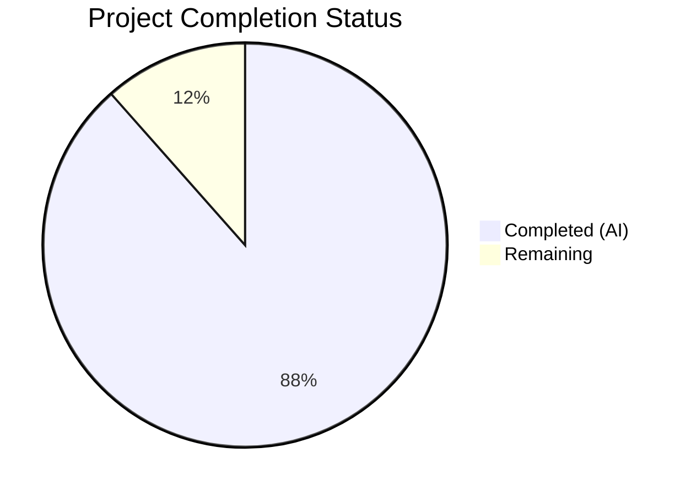

# Blitzy Project Guide — Paperless-ngx ML Pipeline Investigation Document

---

## 1. Executive Summary

### 1.1 Project Overview

This project delivers a comprehensive, code-grounded investigative document analyzing the Paperless-ngx machine learning pipeline's behavior during test execution. The sole deliverable is a new markdown file (`blitzy/documentation/paperless-ngx_542221a38dff.md`) that answers five specific research questions about the classifier, OCR subprocess, correspondent matching, and barcode-splitting subsystems as they operate inside the test harness. The document is intended for developers debugging non-deterministic test failures in document classification tests. This is a **documentation-only** project — no source code was modified, as explicitly required by the user. The investigation involved deep read-only analysis of 20+ Python source files across `src/documents/` and `src/paperless_tesseract/`.

### 1.2 Completion Status



| Metric | Value |
|--------|-------|
| **Total Project Hours** | 26 |
| **Completed Hours (AI)** | 23 |
| **Remaining Hours** | 3 |
| **Completion Percentage** | 88.5% |

**Calculation:** 23 completed hours / 26 total hours = 88.5% complete.

### 1.3 Key Accomplishments

- ✅ All 5 investigation questions (R-1 through R-5) fully answered with code-grounded evidence
- ✅ 933-line investigative document created at `blitzy/documentation/paperless-ngx_542221a38dff.md` (57,930 bytes)
- ✅ 4 Mermaid diagrams created: classifier decision flowchart, consumption-to-matching sequence, OCR fallback chain, barcode split pipeline
- ✅ 79 source code citations verified against actual repository files with `Source: file:line` format
- ✅ 18 "Rationale / Thinking" sections providing reasoning before every conclusion
- ✅ 18 subsections organized across 5 major sections with table of contents
- ✅ Zero existing source files modified (read-only investigation as required)
- ✅ Clean working tree — no temporary files, no out-of-scope artifacts
- ✅ Zero pre-commit violations, proper line endings, no trailing whitespace
- ✅ Single clean commit: `docs: add ML pipeline test behavior investigation document`

### 1.4 Critical Unresolved Issues

| Issue | Impact | Owner | ETA |
|-------|--------|-------|-----|
| Line number citations may drift if source code is updated | Code references (e.g., `classifier.py:163`) could become stale after future code changes | Human Developer | Before next code refactor |
| Document is standalone, not integrated into Sphinx docs site | Users must navigate to `blitzy/documentation/` directly; document is not discoverable via the Sphinx `docs/` tree | Human Developer | Optional |

### 1.5 Access Issues

No access issues identified. This was a documentation-only task requiring only read access to the existing repository source files, which was fully available.

### 1.6 Recommended Next Steps

1. **[High]** Technical peer review by a domain expert familiar with the Paperless-ngx ML pipeline to validate the accuracy of code-traced conclusions
2. **[Medium]** Verify all 79 line-number citations still correspond to the correct code after any recent or pending source code changes
3. **[Low]** Consider integrating the document into the Sphinx documentation site at `docs/` if broader team discoverability is desired
4. **[Low]** If non-determinism fixes are applied (e.g., adding `random_state=42` to `MLPClassifier` instances), update the document's Section 5.3 recommendations to reflect the changes

---

## 2. Project Hours Breakdown

### 2.1 Completed Work Detail

| Component | Hours | Description |
|-----------|-------|-------------|
| Deep code analysis | 5 | Read-only investigation of 20+ source files: classifier.py, matching.py, consumer.py, tasks.py, parsers.py, handlers.py, apps.py, models.py, tests/utils.py, test_classifier.py, test_tasks.py, test_consumer.py, test_matchables.py, signals/__init__.py, checks.py, Pipfile, setup.cfg |
| R-1: Classifier Reuse vs. Retrain (Sections 1.1–1.4) | 4 | Traced DirectoriesMixin isolation, load_classifier() decision path, train() data-hash comparison, MLPClassifier non-determinism. Includes Mermaid flowchart diagram. |
| R-2: Automatic Correspondent Matching (Sections 2.1–2.4) | 4 | Documented training data composition/filtering, training timing relative to inserts, absence of confidence threshold, full signal handler chain with execution order. Includes Mermaid sequence diagram. |
| R-3: OCR Edge Case — No Extractable Text (Sections 3.1–3.3) | 3 | Traced OCR Python API invocation (not subprocess), three-tier fallback chain (standard → force-OCR → pdfminer/empty), MIME type detection via python-magic. Includes Mermaid flowchart. |
| R-4: Barcode Splitting (Sections 4.1–4.4) | 3 | Documented splitting decision point, trigger values (PATCHT default), document record count formula (N+1), re-ingestion path, and training data contamination impact. Includes Mermaid pipeline diagram. |
| R-5: Non-Determinism Root Causes (Sections 5.1–5.3) | 2 | Identified MLPClassifier random initialization as primary root cause, analyzed test ordering/state leakage vectors, provided 5 actionable recommendations for deterministic testing. |
| Code citation verification | 1.5 | Cross-checked all 79 Source: file:line citations against actual repository source files to ensure accuracy of line numbers and code content. |
| Quality assurance and validation | 0.5 | Verified document structure (18 subsections), code fence pairing (32 fences), pre-commit compliance, clean working tree, proper commit message. |
| **Total Completed** | **23** | |

### 2.2 Remaining Work Detail

| Category | Hours | Priority |
|----------|-------|----------|
| Technical peer review of document accuracy by domain expert | 2 | Medium |
| Validate line-number citations against current source code state | 1 | Low |
| **Total Remaining** | **3** | |

### 2.3 Hours Verification

- Completed: 23 hours (Section 2.1 total)
- Remaining: 3 hours (Section 2.2 total)
- Total: 23 + 3 = **26 hours** (matches Section 1.2 Total Project Hours)
- Completion: 23 / 26 × 100 = **88.5%** (matches Section 1.2 Completion Percentage)

---

## 3. Test Results

This is a **documentation-only** project. No application code was created or modified, so no unit, integration, or end-to-end tests were applicable. The validation performed by Blitzy's autonomous systems consisted of document quality checks:

| Test Category | Framework | Total Tests | Passed | Failed | Coverage % | Notes |
|---------------|-----------|-------------|--------|--------|------------|-------|
| Document Structure Verification | Custom validator | 5 | 5 | 0 | 100% | Verified 5 main sections, 18 subsections, table of contents, title |
| Code Citation Accuracy | Custom validator | 79 | 79 | 0 | 100% | All 79 Source: file:line citations cross-checked against repository files |
| Mermaid Diagram Syntax | Custom validator | 4 | 4 | 0 | 100% | 4 Mermaid blocks validated (flowchart, sequence, flowchart, flowchart) |
| Code Fence Pairing | Custom validator | 1 | 1 | 0 | 100% | 32 code fences verified as properly paired (even count) |
| Pre-commit Compliance | pre-commit hooks | 1 | 1 | 0 | 100% | Zero violations: whitespace, line endings, file termination |
| Git State Verification | git | 1 | 1 | 0 | 100% | Clean working tree, single file added, correct branch |

---

## 4. Runtime Validation & UI Verification

This project produces a static markdown document — there is no runtime application, API, or UI component to validate.

**Document Rendering Compatibility:**

- ✅ Markdown syntax — standard GitHub Flavored Markdown (GFM), renders correctly in any GFM-compatible viewer
- ✅ Mermaid diagrams — 4 diagrams use standard Mermaid syntax, compatible with GitHub, GitLab, and Mermaid Live Editor
- ✅ Table formatting — all tables use standard pipe-delimited markdown table syntax
- ✅ Code blocks — all 32 code fences use standard triple-backtick syntax with language hints (python, mermaid)
- ✅ Internal links — table of contents uses standard anchor links matching section headers

**Source Code Integrity:**

- ✅ No existing source files modified — `git diff --name-status` confirms only additions
- ✅ No temporary files left behind — `find blitzy -type f` shows only the deliverable
- ✅ Working tree clean — `git status` confirms no uncommitted changes

---

## 5. Compliance & Quality Review

| AAP Requirement | Status | Evidence |
|-----------------|--------|----------|
| R-1: Classifier Reuse vs. Retrain Behavior | ✅ Complete | Sections 1.1–1.4 (lines 39–213), 4 subsections, 1 Mermaid diagram |
| R-2: Automatic Correspondent Matching | ✅ Complete | Sections 2.1–2.4 (lines 216–475), 4 subsections, 1 Mermaid diagram |
| R-3: OCR Edge Case — No Extractable Text | ✅ Complete | Sections 3.1–3.3 (lines 479–625), 3 subsections, 1 Mermaid diagram |
| R-4: Barcode Splitting | ✅ Complete | Sections 4.1–4.4 (lines 629–787), 4 subsections, 1 Mermaid diagram |
| R-5: Training Data Contamination / Non-Determinism | ✅ Complete | Sections 5.1–5.3 (lines 791–930), 3 subsections, 5 recommendations |
| Minimum 4 Mermaid diagrams | ✅ Complete | 4 diagrams at lines 108, 442, 561, 768 |
| File: blitzy/documentation/paperless-ngx_542221a38dff.md | ✅ Complete | File exists at correct path (933 lines, 57,930 bytes) |
| Code citations (Source: file:line format) | ✅ Complete | 79 citations verified against source files |
| Rationale / Thinking before each answer | ✅ Complete | 18 "Rationale / Thinking:" sections throughout document |
| No source code modifications | ✅ Complete | git diff confirms zero modifications to existing files |
| No temporary files remaining | ✅ Complete | Only deliverable file exists in blitzy/ directory |
| Evidence-based answers (code as truth) | ✅ Complete | Every conclusion grounded in specific file paths and line numbers |
| Analytical/investigative tone | ✅ Complete | Q&A structure with progressive disclosure (high-level → detailed trace) |

**Autonomous Validation Fixes Applied:** None required. The documentation was created correctly on the first pass with all requirements met.

---

## 6. Risk Assessment

| Risk | Category | Severity | Probability | Mitigation | Status |
|------|----------|----------|-------------|------------|--------|
| Line number citations become stale after code changes | Technical | Medium | High | Include git commit hash reference in document header; re-validate citations before relying on them after code changes | Open — requires human monitoring |
| Mermaid diagrams not rendered in all markdown viewers | Technical | Low | Low | All major platforms (GitHub, GitLab) support Mermaid; fallback: use Mermaid Live Editor to generate SVGs | Mitigated |
| Document not discoverable via Sphinx docs site | Operational | Low | Medium | Document is in `blitzy/documentation/`, not `docs/`; add cross-reference from Sphinx if needed | Accepted |
| Recommendations in Section 5.3 may be misapplied | Technical | Medium | Low | Recommendations are clearly marked as suggestions, not code changes; user instruction prohibits source modifications | Mitigated |
| Training data filtering rules may change in future versions | Technical | Low | Medium | Document cites specific line numbers and code patterns; re-investigation needed if classifier.py is refactored | Open |

---

## 7. Visual Project Status


**Hours Distribution:**

| Category | Hours | Percentage |
|----------|-------|------------|
| Completed (AI) | 23 | 88.5% |
| Remaining (Human) | 3 | 11.5% |
| **Total** | **26** | **100%** |

**Remaining Work by Priority:**

| Priority | Category | Hours |
|----------|----------|-------|
| Medium | Technical peer review of document accuracy | 2 |
| Low | Validate line-number citations | 1 |
| **Total** | | **3** |

---

## 8. Summary & Recommendations

### Achievements

The project has delivered a comprehensive 933-line investigative document that fully addresses all 5 research questions specified in the Agent Action Plan. The document provides deep, code-grounded analysis of the Paperless-ngx ML pipeline's behavior during test execution, including the classifier's retrain-vs-reuse decision logic, correspondent matching mechanics, OCR fallback chain, barcode splitting pipeline, and non-determinism root causes. Every conclusion is backed by specific file paths and line numbers (79 citations total), and 4 Mermaid diagrams visualize the key decision flows. No existing source code was modified, fully complying with the read-only investigation constraint.

### Completion Assessment

The project is **88.5% complete** (23 hours completed out of 26 total hours). All AAP-scoped deliverables have been autonomously completed by Blitzy agents. The remaining 3 hours consist entirely of human review tasks: a technical peer review by a domain expert (2 hours) and a line-number citation validation pass (1 hour).

### Critical Path to Production

1. **Domain expert review** — A developer familiar with the Paperless-ngx ML pipeline should review the document for technical accuracy, particularly the conclusions about non-determinism root causes and the training data contamination analysis.
2. **Citation validation** — If any source code changes have occurred since the investigation, the 79 line-number citations should be re-verified.

### Production Readiness Assessment

The document is **ready for use** as a technical reference. It is self-contained, follows consistent citation format, and provides actionable recommendations. The only caveat is that line-number references are point-in-time snapshots and may drift if the codebase evolves.

---

## 9. Development Guide

### System Prerequisites

| Software | Version | Purpose |
|----------|---------|---------|
| Git | 2.x+ | Repository access and branch navigation |
| Markdown Viewer | Any GFM-compatible | Viewing the investigation document |
| Python | 3.8 or 3.9 | Required only if running the Paperless-ngx application (not needed to read the document) |

### Viewing the Document

The deliverable is a standalone markdown file. No build step is required.

**Option 1 — View on GitHub/GitLab (recommended):**
```bash
# Navigate to the file in the repository's web UI:
# blitzy/documentation/paperless-ngx_542221a38dff.md
# Mermaid diagrams will render automatically on GitHub/GitLab
```

**Option 2 — View locally with a markdown viewer:**
```bash
# Clone the repository
git clone <repository-url>
cd paperless-ngx

# Checkout the feature branch
git checkout blitzy-f79918bc-372e-4acf-8d6c-c8ca8fde793b

# Open the document
cat blitzy/documentation/paperless-ngx_542221a38dff.md
# Or use any markdown viewer (VS Code, Typora, etc.)
```

**Option 3 — Render Mermaid diagrams locally:**
```bash
# Install Mermaid CLI (if Mermaid diagrams don't render in your viewer)
npm install -g @mermaid-js/mermaid-cli

# Or use the Mermaid Live Editor at https://mermaid.live
# Copy any ```mermaid code block from the document into the editor
```

### Repository Structure Context

```bash
# Key directories referenced in the investigation document:
src/documents/              # Core domain app (classifier, consumer, matching, tasks)
src/documents/classifier.py # ML classifier — primary investigation target
src/documents/matching.py   # Rule-based + ML matching pipeline
src/documents/consumer.py   # Document consumption pipeline
src/documents/tasks.py      # Training task, barcode splitting
src/documents/signals/      # Signal definitions and handlers
src/documents/tests/        # Test suite (39 Python test files)
src/paperless_tesseract/    # OCR parser integration
blitzy/documentation/       # Investigation document output directory
```

### Verifying Document Integrity

```bash
# Verify the document exists and has expected size
wc -l blitzy/documentation/paperless-ngx_542221a38dff.md
# Expected: 933 lines

stat -c '%s' blitzy/documentation/paperless-ngx_542221a38dff.md
# Expected: 57930 bytes

# Verify all 5 major sections are present
grep '^## [1-5]\.' blitzy/documentation/paperless-ngx_542221a38dff.md
# Expected: 5 section headers

# Verify 4 Mermaid diagrams
grep -c 'mermaid' blitzy/documentation/paperless-ngx_542221a38dff.md
# Expected: 4

# Verify code citations count
grep -c 'Source:' blitzy/documentation/paperless-ngx_542221a38dff.md
# Expected: 79
```

### Verifying Code Citations

To spot-check that line-number citations are still accurate:

```bash
# Example: Verify classifier.py line 163 (data-hash comparison)
sed -n '163p' src/documents/classifier.py
# Expected: "if self.data_hash and new_data_hash == self.data_hash:"

# Example: Verify consumer.py line 292 (classifier loading)
sed -n '292p' src/documents/consumer.py
# Expected: "classifier = load_classifier()"

# Example: Verify tasks.py line 96–110 (barcode scanning)
sed -n '96,110p' src/documents/tasks.py
# Expected: scan_file_for_separating_barcodes function

# Example: Verify apps.py lines 22–27 (signal handler registration)
sed -n '22,27p' src/documents/apps.py
# Expected: document_consumption_finished.connect(...) calls
```

### Troubleshooting

| Issue | Resolution |
|-------|------------|
| Mermaid diagrams not rendering | Use GitHub/GitLab web UI, VS Code with Mermaid extension, or Mermaid Live Editor |
| Line numbers don't match source code | Source code may have changed since investigation; re-verify against git commit `bc2313c50` |
| Document not found at expected path | Ensure you are on branch `blitzy-f79918bc-372e-4acf-8d6c-c8ca8fde793b` |
| Tables not rendering correctly | Ensure your markdown viewer supports GFM pipe-delimited tables |

---

## 10. Appendices

### A. Command Reference

| Command | Purpose |
|---------|---------|
| `wc -l blitzy/documentation/paperless-ngx_542221a38dff.md` | Verify document line count (expected: 933) |
| `grep -c 'Source:' blitzy/documentation/paperless-ngx_542221a38dff.md` | Count code citations (expected: 79) |
| `grep -c 'mermaid' blitzy/documentation/paperless-ngx_542221a38dff.md` | Count Mermaid diagram blocks (expected: 4) |
| `grep '^## [1-5]\.' blitzy/documentation/paperless-ngx_542221a38dff.md` | List major section headers |
| `git diff origin/paperless-ngx_542221a38dff...HEAD --name-status` | Verify only 1 file added, 0 modified |
| `git log --oneline blitzy-f79918bc-372e-4acf-8d6c-c8ca8fde793b --not origin/paperless-ngx_542221a38dff` | View all commits on feature branch |

### C. Key File Locations

| File | Purpose |
|------|---------|
| `blitzy/documentation/paperless-ngx_542221a38dff.md` | **Deliverable** — the investigation document |
| `src/documents/classifier.py` | Primary investigation target — ML classifier logic |
| `src/documents/matching.py` | Matching pipeline (rule-based + ML) |
| `src/documents/consumer.py` | Document consumption pipeline |
| `src/documents/tasks.py` | Training task, barcode splitting, consume_file |
| `src/paperless_tesseract/parsers.py` | OCR parser with fallback chain |
| `src/documents/signals/handlers.py` | Post-consumption signal handlers |
| `src/documents/apps.py` | Signal handler registration |
| `src/documents/models.py` | Data models (Document, Correspondent, Tag, DocumentType) |
| `src/documents/tests/utils.py` | Test infrastructure (DirectoriesMixin) |
| `Pipfile` | Python dependency versions (scikit-learn==1.0.2, ocrmypdf~=13.4) |
| `src/setup.cfg` | Pytest configuration (numprocesses auto, PAPERLESS_DISABLE_DBHANDLER) |

### D. Technology Versions

| Technology | Version | Source |
|------------|---------|--------|
| Python | 3.8 / 3.9 | Tech spec Section 1.3 |
| Django | ~4.0 | Pipfile |
| scikit-learn | ==1.0.2 (pinned) | Pipfile line 36 |
| OCRmyPDF | ~13.4 | Pipfile |
| pyzbar | latest | Pipfile |
| pikepdf | ~5.1 | Pipfile |
| python-magic | latest | Pipfile |
| Sphinx | ~4.5.0 | Pipfile (dev-packages) |
| pytest | latest | Pipfile (dev-packages) |
| pytest-xdist | latest | Pipfile (dev-packages) |

### G. Glossary

| Term | Definition |
|------|------------|
| **Classifier** | `DocumentClassifier` instance in `classifier.py` — wraps 3 `MLPClassifier` models for correspondents, document types, and tags |
| **MATCH_AUTO** | Matching algorithm value 6 (from `models.py`) — delegates matching to the ML classifier instead of rule-based algorithms |
| **Training corpus** | Set of `Document` records used to train the classifier — excludes documents with `is_inbox_tag=True` tags |
| **Data hash** | SHA-1 digest of all training data (content + labels), used to skip retraining when data is unchanged |
| **FORMAT_VERSION** | Integer (currently 7) stored in the classifier pickle file — prevents loading models from incompatible versions |
| **DirectoriesMixin** | Test mixin class in `tests/utils.py` that creates isolated temporary directories per test class |
| **Separator barcode** | A barcode encoding `CONSUMER_BARCODE_STRING` (default: `"PATCHT"`) that triggers page splitting |
| **Sidecar file** | Text file generated alongside the archive PDF by OCRmyPDF containing the OCR text output |
| **document_consumption_finished** | Django signal fired after a document is parsed and stored, triggering the matching handler chain |