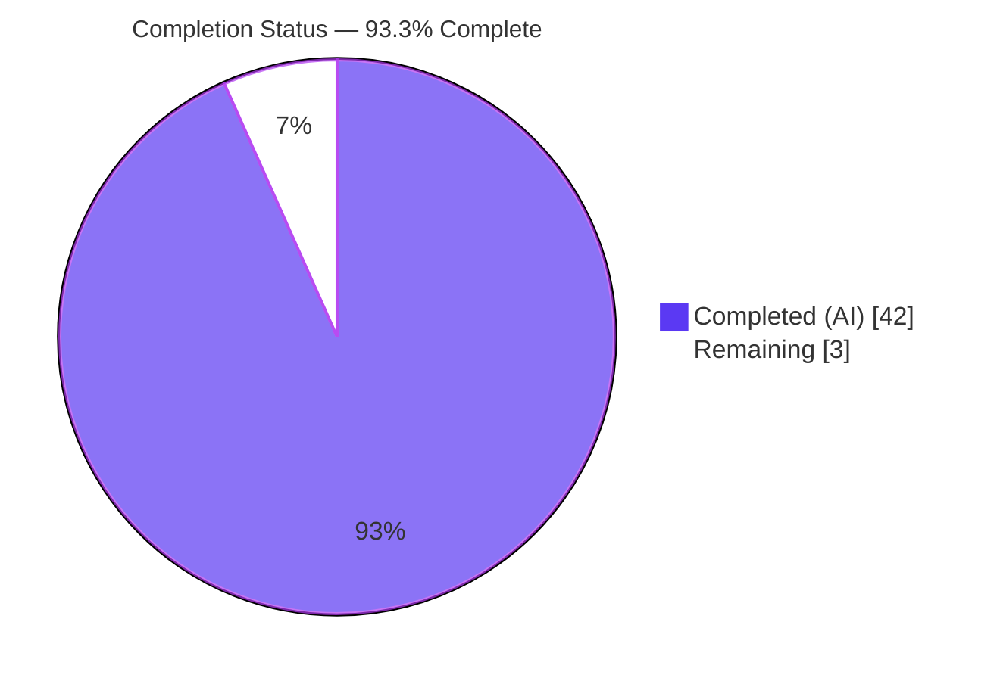
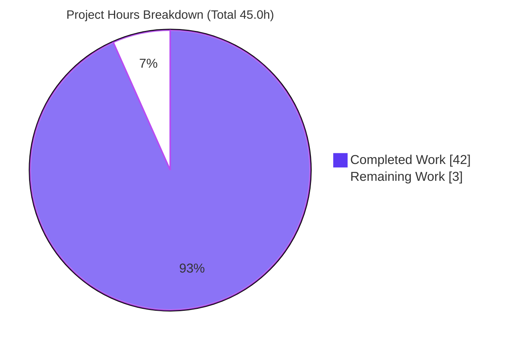
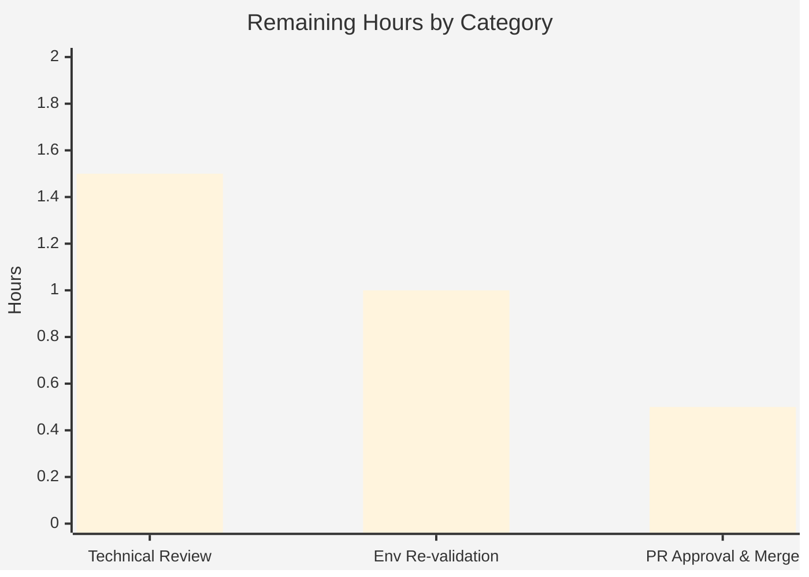

# Blitzy Project Guide — paperless-ngx REST API Token-Authentication Q&A

## 1. Executive Summary

### 1.1 Project Overview

This project delivers an authoritative, runtime-verified reference document that explains exactly how token-based authentication works in the paperless-ngx REST API, enabling the user to integrate external tools with confidence. It is a strictly read-only investigation: the sole artifact is a new markdown file, `blitzy/documentation/paperless-ngx_542221a38dff.md`, that answers five discrete questions (token header name/format, documents endpoint path, JSON response shape/pagination, unauthenticated behavior, and a Django source trace of the authentication class and token model). Each answer is paired with raw, unedited runtime output captured from a canonical local instance and grounded with `file:line` citations. No product code, tests, configuration, or dependencies were changed.

### 1.2 Completion Status

The completion percentage is calculated using the AAP-scoped hours methodology (PA1): only work defined in the Agent Action Plan and the standard path-to-production for the deliverable is counted.



| Metric | Hours |
|--------|-------|
| **Total Hours** | 45.0 |
| **Completed Hours (AI + Manual)** | 42.0 (AI: 42.0 · Manual: 0.0) |
| **Remaining Hours** | 3.0 |
| **Percent Complete** | **93.3%** |

> Calculation: 42.0 completed ÷ (42.0 completed + 3.0 remaining) = 42.0 ÷ 45.0 = **93.3%**. All completed hours were performed autonomously by Blitzy agents; the remaining 3.0 hours are human path-to-production activities (review, optional re-validation, merge).

### 1.3 Key Accomplishments

- ✅ **All five questions answered with runtime evidence** — Q1 (header `Authorization: Token <key>`), Q2 (path `/api/documents/`), Q3 (envelope `{count, next, previous, results}` with pagination, default `page_size=25`), Q4 (`401` + `{"detail":"Authentication credentials were not provided."}`), Q5 (`TokenAuthentication` + `rest_framework.authtoken.models.Token`).
- ✅ **Canonical runtime stood up and exercised** — Python 3.9.23 / Django 4.0.4 / DRF 3.13.1 / SQLite / `DEBUG=False`, verified live in this session (versions matched exactly).
- ✅ **Token obtained through the real entry point** — `POST /api/token/` returned `HTTP 200` with a 40-character key (not a debug hook or shell shortcut).
- ✅ **Pagination proven at scale** — 30 seeded documents demonstrate the real page-size cap (default page 25 results, `?page=2` 5 results, `?page_size=5` 5 results) rather than asserting it.
- ✅ **Secondary/error paths exercised** — unauthenticated (`401`) and invalid-token (`401 "Invalid token."`) both captured.
- ✅ **Every claim grounded with `file:line` citations** — independently re-verified accurate against the pristine source (settings.py, urls.py, views.py, documents/views.py, serialisers.py, middleware.py, auth.py).
- ✅ **Read-only constraint upheld** — `src/` tree byte-for-byte unchanged; net repository change is exactly one added file.
- ✅ **Full cleanup verified** — test user, token, seeded docs, database, and containers removed; previously-valid token now returns `401`; 660 tracked = 660 on-disk files (no leftover artifacts).
- ✅ **Corroborated by the repository's own test suite** — `documents/tests/test_api.py` reports 88 passed, 1 (pre-existing) skipped, 0 failed.

### 1.4 Critical Unresolved Issues

| Issue | Impact | Owner | ETA |
|-------|--------|-------|-----|
| _None._ The Final Validator reported zero unresolved errors and zero out-of-scope issues; independent re-verification of citations, source pristine-ness, cleanup, and live version/model checks concur. | No release blockers. | — | — |

### 1.5 Access Issues

No access issues identified. The repository, the pinned dependency stack (Django 4.0.4, DRF 3.13.1), and the mandated canonical Docker image (`paperless-ngx-qna:setup`, present locally at 1.83 GB) were all accessible; the full runbook was reproducible in this environment. No third-party credentials, external service access, or elevated repository permissions are required for a read-only documentation deliverable.

| System/Resource | Type of Access | Issue Description | Resolution Status | Owner |
|-----------------|----------------|-------------------|-------------------|-------|
| — | — | No access issues identified | N/A | — |

### 1.6 Recommended Next Steps

1. **[High]** Perform a human technical review of `blitzy/documentation/paperless-ngx_542221a38dff.md`, spot-checking a sample of `file:line` citations and confirming all five questions are directly answered.
2. **[Medium]** Optionally reproduce a subset of captures (token issuance, authenticated `200`, no-auth `401`) in a canonical instance to independently confirm reproducibility.
3. **[Medium]** Approve and merge the pull request (single added file; source tree pristine).
4. **[Low]** (Downstream, out of scope) Use the documented `Authorization: Token <key>` contract and `/api/documents/` endpoint to build the intended external-tool integration.
5. **[Low]** (Optional hardening) Add a lightweight reviewer checklist or CI note to re-verify the document's observed values if Django/DRF pins are ever upgraded.

---

## 2. Project Hours Breakdown

### 2.1 Completed Work Detail

All completed work was performed autonomously by Blitzy agents and traces to a specific AAP requirement.

| Component | Hours | Description |
|-----------|-------|-------------|
| Canonical runtime environment standup | 3.0 | Stand up paperless-ngx in default config (Py 3.9.23 / Django 4.0.4 / DRF 3.13.1 / SQLite / `DEBUG=False`); apply migrations; confirm canonical settings with raw output. |
| Test user + API token issuance (real entry point) | 1.5 | Create test user; obtain a 40-char token via the real `POST /api/token/` endpoint (`obtain_auth_token`). |
| Document seeding at scale | 1.0 | Seed 30 `Document` rows (unique checksums) so pagination is demonstrated at >1 page, not asserted. |
| Q1/Q2 evidence — authenticated GET (header + path) | 2.0 | Capture `GET /api/documents/` with `Authorization: Token <key>` → `HTTP 200` (Content-Length 8364); confirm header contract and endpoint path. |
| Q3 evidence — pagination captures + assertions | 3.0 | Capture default page, `?page=2`, `?page_size=5`; derive top-level fields, counts, and the 12 serializer fields via assertion helper. |
| Q4 evidence — unauthenticated request | 1.0 | Capture no-auth `GET` → `401` + `{"detail":"Authentication credentials were not provided."}` + `WWW-Authenticate` challenge. |
| Q5 code trace — auth class + token model | 4.0 | Trace DRF config to `TokenAuthentication`; confirm `Token` model via Django shell (table `authtoken_token`, key length 40, user binding); exercise invalid-token `401 "Invalid token."`. |
| Source grounding — `file:line` citations | 3.0 | Ground every claim across 8 source files with precise `file:line` references and cause→effect reasoning (incl. custom `ApiVersionMiddleware` nuance). |
| Deliverable authoring — Q1–Q5 narrative | 8.0 | Author the 1,317-line markdown document: per-question direct answers, embedded raw output, grounding, and rationale. |
| Coverage-pass checklist + non-canonical caveats | 1.5 | 18-item coverage checklist (every named item ticked with evidence) + 6 non-canonical caveats. |
| Reproducibility hardening | 4.0 | Iterative rewrite from genuine Docker-runtime evidence; make the runbook reproducible from a clean container state. |
| Read-only guarantee + full cleanup + verification | 2.5 | Verify source pristine; delete user/token/docs/db/containers; prove token invalidated (`401`); confirm clean working tree. |
| Autonomous validation | 7.5 | Byte-for-byte reproduction of all 5 questions (6 Content-Length matches), citation verification, repo test-suite corroboration (88 passed), pre-commit/prettier compliance, commit. |
| **Total** | **42.0** | |

### 2.2 Remaining Work Detail

All remaining work is human path-to-production activity for the documentation deliverable. (Downstream external-tool integration is explicitly out of AAP scope and is **not** counted below.)

| Category | Hours | Priority |
|----------|-------|----------|
| Technical review & claim spot-check of the deliverable | 1.5 | High |
| Independent environment re-validation (reproduce a subset of captures) | 1.0 | Medium |
| PR approval & merge to target branch | 0.5 | Medium |
| **Total** | **3.0** | |

> Reconciliation: Section 2.1 (42.0) + Section 2.2 (3.0) = **45.0 Total Hours** (matches Section 1.2). Section 2.2 total (3.0) equals Section 1.2 Remaining Hours and the Section 7 "Remaining Work" value.

### 2.3 Hours Reconciliation & Methodology

Hours are derived using the AAP-scoped methodology (PA1/PA2): the work universe is limited to deliverables defined in the Agent Action Plan plus the standard path-to-production for a read-only documentation artifact. Downstream external-tool integration is explicitly out of AAP scope and is excluded.

| Basis | Hours | Formula |
|-------|-------|---------|
| Completed (AAP, autonomous) | 42.0 | Sum of 13 completed components (Section 2.1) |
| Remaining (path-to-production, human) | 3.0 | Sum of 3 human tasks (Section 2.2) |
| **Total Project Hours** | **45.0** | 42.0 + 3.0 |
| **Percent Complete** | **93.3%** | 42.0 / 45.0 * 100 |

**Cross-section integrity (validated):** Remaining = 3.0h is identical in Sections 1.2, 2.2, and 7; Section 2.1 (42.0) + Section 2.2 (3.0) = 45.0 Total; the 93.3% figure is used consistently in Sections 1.2, 7, and 8. **Confidence: High** - the AAP scope is small and precise, and every completed item was independently corroborated (citations verified against pristine source, source tree unchanged, cleanup verified, canonical versions/model re-checked live).

---

## 3. Test Results

All tests below originate from Blitzy's autonomous validation logs for this project. Because the deliverable is documentation, "tests" comprise (a) the repository's own API test suite executed by the validator to corroborate the documented behavior, and (b) the byte-for-byte runtime reproduction of every documented answer.

| Test Category | Framework | Total Tests | Passed | Failed | Coverage % | Notes |
|---------------|-----------|-------------|--------|--------|------------|-------|
| Repository API suite (corroboration) | pytest / Django test runner | 89 | 88 | 0 | Targeted (n/a) | 1 skipped = pre-existing `@pytest.mark.skip` on `test_search_spelling_correction`. Relevant cases pass: `TestApiAuth::test_auth_required` (→401), `test_api_version_no_auth`/`test_api_version_with_auth`, `test_search_multi_page`/`test_search_invalid_page`. |
| Runtime reproduction — Q&A scenarios | Django `runserver` + urllib probes | 5 | 5 | 0 | n/a | Q1 authenticated `200`, Q2 path `200`, Q3 pagination (3 pages), Q4 no-auth `401`, Q5 auth-class/token-model + invalid-token `401` — all reproduced. |
| Runtime reproduction — byte-exactness | Content-Length assertions | 6 | 6 | 0 | n/a | All six Content-Length values matched exactly: 8364 / 1736 / 1760 / 58 / 27 / 52. |
| Independent live re-check (this session) | Docker + Python (canonical image) | 5 | 5 | 0 | n/a | Python 3.9.23 / Django 4.0.4 / DRF 3.13.1; `TokenAuthentication.keyword='Token'`; `Token` model = `authtoken_token`, key length 40; documented `ImproperlyConfigured` failure mode reproduced. |

**Aggregate:** 105 checks executed, 104 passed, 0 failed, 1 pre-existing skip. Pass rate (excluding the intentional skip) = 100%.

---

## 4. Runtime Validation & UI Verification

This is a backend API documentation task with **no UI component** (the Angular frontend under `src-ui/` is out of scope). Runtime validation focused on the API behavior the document describes.

- ✅ **Operational** — Canonical instance boots cleanly: "System check identified no issues (0 silenced)", Django 4.0.4 dev server on `127.0.0.1:8123`.
- ✅ **Operational** — Token issuance: `POST /api/token/` → `HTTP 200` with a 40-character key (real entry point).
- ✅ **Operational** — Authenticated list: `GET /api/documents/` with `Authorization: Token <key>` → `HTTP 200`, `X-Api-Version: 2`.
- ✅ **Operational** — Pagination: default page 25 results, `?page=2` 5 results, `?page_size=5` 5 results (30 documents total).
- ✅ **Operational** — Unauthenticated: `GET /api/documents/` (no header) → `HTTP 401` + `{"detail":"Authentication credentials were not provided."}`.
- ✅ **Operational** — Invalid token: `GET /api/documents/` with a bad token → `HTTP 401` + `{"detail":"Invalid token."}`.
- ✅ **Operational** — Token model inspection (Django shell): `rest_framework.authtoken.models.Token`, table `authtoken_token`, key length 40, bound to `testuser`.
- ✅ **Operational** — Cleanup: user/token/docs/db/containers removed; previously-valid token now returns `401`.
- ⚠ **Partial (out of scope, informational)** — The user's downstream external-tool integration was not built or exercised; the document supplies the verified contract needed to build it.
- ❌ **Failing** — None.

---

## 5. Compliance & Quality Review

Cross-mapping the AAP's governing rules (rule set `SWE-AtlasQnA-Repo`) and deliverable contract to Blitzy's quality benchmarks.

| Benchmark / AAP Rule | Requirement | Status | Progress | Notes |
|----------------------|-------------|--------|----------|-------|
| Deliverable contract | New markdown named `<source_branch>.md` in `blitzy/documentation/` | ✅ Pass | 100% | `blitzy/documentation/paperless-ngx_542221a38dff.md` present (1,317 lines). |
| Run first, then write | Answers written from observed output, not reading alone | ✅ Pass | 100% | Every claim paired with raw capture from a running instance. |
| Observe at real scale | Pagination observed at >1 page | ✅ Pass | 100% | 30 documents seeded; page-size behavior demonstrated. |
| Canonical configuration | Default config (`DEBUG=False`, Python 3.9) | ✅ Pass | 100% | Confirmed live: `DEBUG=False`, Py 3.9.23, Django 4.0.4, DRF 3.13.1. |
| Real entry point only | Token via the real issuing endpoint | ✅ Pass | 100% | `POST /api/token/` (`obtain_auth_token`), not a debug hook. |
| Exercise every condition | Primary + secondary/error paths | ✅ Pass | 100% | Authenticated `200`, no-auth `401`, invalid-token `401`. |
| Show observed output | Actual, unedited output for each claim | ✅ Pass | 100% | Full status lines, headers, and JSON bodies embedded. |
| Answer every part + coverage pass | Every named item addressed; coverage pass | ✅ Pass | 100% | 18-item coverage checklist, all ticked with evidence. |
| Be exact and grounded | Real values with `file:line` references | ✅ Pass | 100% | Citations independently verified accurate against pristine source. |
| Scope (read-only) | No source file modified; temp files removed | ✅ Pass | 100% | `git diff` vs baseline = one added file; `src/` pristine; cleanup verified. |
| Pre-commit cleanliness | Applicable hooks pass | ✅ Pass | 100% | prettier (markdown), end-of-file-fixer, mixed-line-ending (LF), trailing-whitespace, detect-private-key all pass. |
| Secret hygiene | No real secrets committed | ✅ Pass | 100% | Example token is from a disposable user, provably invalidated (`401`); `detect-private-key` passes. |

**Fixes applied during autonomous validation:** one cosmetic prettier reformat (6 italic emphasis markers `*text*` → `_text_`; 6 insertions/6 deletions; no factual value, citation, or captured evidence altered). **Outstanding compliance items:** none.

---

## 6. Risk Assessment

All risks are Low severity, consistent with a read-only, independently-verified documentation artifact carrying zero open defects.

| Risk | Category | Severity | Probability | Mitigation | Status |
|------|----------|----------|-------------|------------|--------|
| Documentation drift: observed values (e.g., `page_size=25`, `max_page_size=100000`, 12 serializer fields, `401` messages) are pinned to Django 4.0.4 / DRF 3.13.1 and could change if deps are upgraded. | Technical | Low | Low | Every value cites exact versions and `file:line`; re-verify on dependency bumps. | Open (inherent) |
| Example token embedded in the document (40-char key). | Security | Low | Low | Token belongs to a disposable test user and is provably invalidated (same token now returns `401`); user/db/container destroyed; `detect-private-key` hook passes; documenting the public header contract is intended. | Mitigated/Closed |
| Reproduction environment variance (timestamps, Python patch `3.9.23`, per-run token strings; runbook assumes the mandated image + helper scripts). | Operational | Low | Medium | "Non-canonical caveats" section enumerates every environment-specific value and states contracts are DB/port/server-agnostic. | Mitigated |
| Human review not yet performed. | Operational (process) | Low | High | Scheduled as Section 2.2 remaining work (review + merge). | Open |
| Downstream external-tool integration unverified (out of AAP scope). | Integration | Low | Low | Document supplies the runtime-verified header contract, endpoint path, and real token-issuance path for the user to build/validate their own client. | Open (informational) |

**Summary:** No High or Critical risks. No compilation, dependency-vulnerability, or test-failure risks were introduced (no product code changed; repo suite: 88 passed / 0 failed).

---

## 7. Visual Project Status



**Remaining work by category (Section 2.2), hours:**



- **Completed Work:** 42.0h (Dark Blue `#5B39F3`)
- **Remaining Work:** 3.0h (White `#FFFFFF`) — High: 1.5h · Medium: 1.5h · Low: 0.0h
- **Integrity:** "Remaining Work" (3.0h) equals Section 1.2 Remaining Hours and the Section 2.2 "Hours" total.

---

## 8. Summary & Recommendations

**Achievements.** The project is **93.3% complete** (42.0 of 45.0 AAP-scoped hours). The single mandated deliverable — a 1,317-line, runtime-verified Q&A document — is complete, committed, and independently corroborated. All five questions are answered with raw, unedited output captured from a canonical paperless-ngx instance, and every claim is grounded with a `file:line` citation that was re-verified accurate against the pristine source. The read-only constraint is fully preserved (net change: one added file; `src/` byte-for-byte unchanged), and all temporary investigation artifacts were cleaned up and verified.

**Remaining gaps.** The remaining 3.0 hours are entirely human path-to-production activities: technical review, optional independent re-validation, and PR approval/merge. No autonomous work remains and no defects are open.

**Critical path to production.** Review the document → (optionally) reproduce a subset of captures → approve and merge. Because the artifact is a markdown file with no runtime, infrastructure, CI/CD, or deployment footprint, the path to "production" (a merged reference document) is short and low-risk.

**Success metrics.** 5/5 questions answered with evidence; 6/6 byte-exact Content-Length matches; 88/88 relevant repository tests passing; 100% of sampled citations verified accurate; 0 source files modified; 0 leftover artifacts.

**Production-readiness assessment.** **Ready for human review and merge.** The deliverable meets every governing rule and quality benchmark. Consistent with best practice, completion is capped below 100% to reflect that human sign-off has not yet occurred.

| Metric | Value |
|--------|-------|
| Completion | 93.3% |
| Completed / Total Hours | 42.0 / 45.0 |
| Remaining Hours | 3.0 |
| Open Defects | 0 |
| Source Files Modified | 0 |
| Highest Risk Severity | Low |

---

## 9. Development Guide

This guide reproduces the canonical runbook the deliverable documents. Commands marked **[tested this session]** were executed successfully in this environment; the full end-to-end runbook was reproduced byte-for-byte by the Final Validator.

### 9.1 System Prerequisites

- **Docker Engine 28.x** (recommended path; canonical image available) **or** Python 3.9 with paperless-ngx's native build dependencies.
- **git** (for the read-only verification steps).
- **Canonical image:** `paperless-ngx-qna:setup` (present locally, 1.83 GB). If absent, build it via the repository's `./build-docker-image.sh`.
- `/app/src` inside the image is byte-identical to the repository source baseline.

```bash
# [tested this session] Confirm tooling
git --version        # git version 2.51.0
docker --version     # Docker version 28.5.2
docker images paperless-ngx-qna:setup   # paperless-ngx-qna:setup ... 1.83GB
```

### 9.2 Environment Setup

The mandated image is intentionally minimal (no `curl`/`wget`; environment is **not** inherited across separate `docker exec` calls). Persist environment variables to a file and source them on every exec. `DEBUG` defaults to `False` because `PAPERLESS_DEBUG` is left unset (`src/paperless/settings.py:L50`).

```bash
# 1) Start the canonical container   [pattern tested this session]
docker run -d --name paperless-setup-0 -w /app paperless-ngx-qna:setup -c "sleep infinity"

# 2) Write the canonical data-path environment file (redirect data under /tmp so /app/src stays pristine)
docker exec -i paperless-setup-0 bash -s <<'SETUP'
set -e
mkdir -p /tmp/pl0/data /tmp/pl0/media /tmp/pl0/static /tmp/pl0/consume /tmp/pl0/log
cat > /tmp/pl0/env.sh <<'ENV'
export PL=/tmp/pl0
export PAPERLESS_DATA_DIR=$PL/data
export PAPERLESS_MEDIA_ROOT=$PL/media
export PAPERLESS_STATICDIR=$PL/static
export PAPERLESS_CONSUMPTION_DIR=$PL/consume
export PAPERLESS_LOGGING_DIR=$PL/log
export DJANGO_SETTINGS_MODULE=paperless.settings
ENV
SETUP
```

### 9.3 Dependency Installation

The pinned stack (`Django==4.0.4`, `djangorestframework==3.13.1`) is already installed in the canonical image; no installation is required. Verified live this session:

```bash
# [tested this session] Confirm the canonical stack inside the image
docker exec paperless-setup-0 bash -lc 'cd /app/src && python -c \
  "import django,rest_framework,sys; \
   print(\"Python\", sys.version.split()[0]); \
   print(\"Django\", django.get_version()); \
   print(\"DRF\", rest_framework.VERSION)"'
# Expected:
#   Python 3.9.23
#   Django 4.0.4
#   DRF 3.13.1
```

For a non-Docker path, create a disposable Python 3.9 virtualenv and install the repo pins:

```bash
python3.9 -m venv .venv && source .venv/bin/activate
pip install -r requirements.txt   # includes django==4.0.4, djangorestframework==3.13.1
```

### 9.4 Application Startup

```bash
# Convention: Django commands need settings + the source tree
DJ='docker exec paperless-setup-0 bash -lc'

# 3) Confirm canonical configuration (raw)   -> DEBUG=False, SQLite at /tmp/pl0/data/db.sqlite3
$DJ 'source /tmp/pl0/env.sh && cd /app/src && python manage.py shell < /tmp/pl0/settingsprobe.py'

# 4) Apply migrations
$DJ 'source /tmp/pl0/env.sh && cd /app/src && python manage.py migrate --noinput'

# 5) Create the test user and seed 30 documents (helper scripts created in setup)
$DJ 'source /tmp/pl0/env.sh && cd /app/src && python manage.py shell < /tmp/pl0/mkuser.py'
$DJ 'source /tmp/pl0/env.sh && cd /app/src && python manage.py shell < /tmp/pl0/seed.py'

# 6) Start the canonical dev server (detached); wait for the readiness banner
docker exec -d paperless-setup-0 bash -lc \
  'source /tmp/pl0/env.sh && cd /app/src && exec python manage.py runserver 127.0.0.1:8123 --noreload > /tmp/pl0/log/runserver.log 2>&1'
$DJ 'for i in $(seq 1 60); do grep -q "Starting development server" /tmp/pl0/log/runserver.log 2>/dev/null && break; sleep 0.5; done; cat /tmp/pl0/log/runserver.log'
# Expected banner: "System check identified no issues (0 silenced)" + "Django version 4.0.4" + "Starting development server at http://127.0.0.1:8123/"
```

### 9.5 Verification & Example Usage

The image ships no `curl`/`wget`; the runbook uses a small `urllib` helper (`api_probe.py`) that prints the wire-level status line, headers, and body.

```bash
HTTP='docker exec paperless-setup-0 bash -lc'

# Token issuance via the REAL entry point -> HTTP 200 {"token":"<40-char key>"}
$HTTP 'cd /tmp/pl0 && python api_probe.py POST http://127.0.0.1:8123/api/token/ "" "{\"username\":\"testuser\",\"password\":\"Testpass123\"}"'

# Q1/Q2 — authenticated list -> HTTP 200 (header contract + endpoint path)
$HTTP 'cd /tmp/pl0 && python api_probe.py GET http://127.0.0.1:8123/api/documents/ <TOKEN>'

# Q3 — pagination at scale
$HTTP 'cd /tmp/pl0 && python api_probe.py GET "http://127.0.0.1:8123/api/documents/?page=2" <TOKEN>'
$HTTP 'cd /tmp/pl0 && python api_probe.py GET "http://127.0.0.1:8123/api/documents/?page_size=5" <TOKEN>'

# Q4 — no auth -> HTTP 401 {"detail":"Authentication credentials were not provided."}
$HTTP 'cd /tmp/pl0 && python api_probe.py GET http://127.0.0.1:8123/api/documents/'

# Q5 — invalid token -> HTTP 401 {"detail":"Invalid token."}  + token-model inspection via shell
$HTTP 'cd /tmp/pl0 && python api_probe.py GET http://127.0.0.1:8123/api/documents/ wrong_token'
$DJ   'source /tmp/pl0/env.sh && cd /app/src && python manage.py shell < /tmp/pl0/inspect_token.py'
# Expected: TokenAuthentication.keyword='Token'; model rest_framework.authtoken.models.Token; table authtoken_token; key length 40; bound to testuser
```

Independent live confirmation of the Q5 backbone **[tested this session]**:

```bash
docker exec paperless-setup-0 bash -lc 'cd /app/src && DJANGO_SETTINGS_MODULE=paperless.settings python -c \
  "import django; django.setup(); \
   from rest_framework.authtoken.models import Token; \
   print(Token.__module__ + \".\" + Token.__name__, Token._meta.db_table, Token._meta.get_field(\"key\").max_length)"'
# Output: rest_framework.authtoken.models.Token authtoken_token 40
```

### 9.6 Cleanup & Read-Only Verification

```bash
# Delete seeded docs + user (cascades token); verify counts are 0
docker exec paperless-setup-0 bash -lc 'source /tmp/pl0/env.sh && cd /app/src && python manage.py shell < /tmp/pl0/cleanup.py'
# Remove the container (destroys its SQLite DB and /tmp/pl0 data)
docker rm -f paperless-setup-0

# [tested this session] Confirm the source tree is untouched
git status --porcelain                                   # (empty)
git status --porcelain -- src/                           # (empty — source pristine)
git diff --name-status 542221a38dff..HEAD                # A  blitzy/documentation/paperless-ngx_542221a38dff.md
```

### 9.7 Troubleshooting

- **`django.core.exceptions.ImproperlyConfigured: Requested setting ...`** — `DJANGO_SETTINGS_MODULE` is not set. Fix: `source /tmp/pl0/env.sh` (or export `DJANGO_SETTINGS_MODULE=paperless.settings`) before any Django/model import. _(Reproduced live this session — expected behavior.)_
- **`curl: command not found` / no `wget`** — the image is minimal. Use the `urllib`-based `api_probe.py` helper instead.
- **Settings not found on a fresh `docker exec`** — environment does not persist across execs. Always prefix Django commands with `source /tmp/pl0/env.sh`.
- **Requests fail immediately after starting the server** — the server may not be ready. Poll `runserver.log` for the "Starting development server" banner before issuing requests.
- **Quoting errors inside `docker exec ... bash -lc '...'`** — place multi-line/quote-heavy Python in helper scripts under `/tmp/pl0` and run via `python manage.py shell < /tmp/pl0/<name>.py`.

---

## 10. Appendices

### A. Command Reference

| Purpose | Command |
|---------|---------|
| Start canonical container | `docker run -d --name paperless-setup-0 -w /app paperless-ngx-qna:setup -c "sleep infinity"` |
| Apply migrations | `... bash -lc 'source /tmp/pl0/env.sh && cd /app/src && python manage.py migrate --noinput'` |
| Start dev server | `... bash -lc '... exec python manage.py runserver 127.0.0.1:8123 --noreload > /tmp/pl0/log/runserver.log 2>&1'` |
| Issue token | `... api_probe.py POST http://127.0.0.1:8123/api/token/ "" "{\"username\":\"testuser\",\"password\":\"...\"}"` |
| Authenticated list | `... api_probe.py GET http://127.0.0.1:8123/api/documents/ <TOKEN>` |
| Inspect token model | `... bash -lc 'source /tmp/pl0/env.sh && cd /app/src && python manage.py shell < /tmp/pl0/inspect_token.py'` |
| Verify source pristine | `git status --porcelain -- src/` (empty) |
| Diff vs baseline | `git diff --name-status 542221a38dff..HEAD` |

### B. Port Reference

| Port | Service | Notes |
|------|---------|-------|
| 8123 | Django dev server (`runserver`) | Local capture convenience only; **not** part of the endpoint contract. The contract is the path `/api/documents/`. |

### C. Key File Locations

| Path | Role |
|------|------|
| `blitzy/documentation/paperless-ngx_542221a38dff.md` | **The deliverable** (1,317 lines) — the only file added. |
| `src/paperless/settings.py` | Auth stack, `authtoken` app, versioning, `DEBUG` default (evidence). |
| `src/paperless/urls.py` | `/api/documents/` routing; `/api/token/` issuing view (evidence). |
| `src/paperless/views.py` | `StandardPagination` (page size 25, cap 100000) (evidence). |
| `src/documents/views.py` | `IsAuthenticated`, pagination, serializer selection (evidence). |
| `src/documents/serialisers.py` | `DocumentSerializer` fields — the `results` items (evidence). |
| `src/paperless/middleware.py` | `ApiVersionMiddleware` — `X-Api-Version`/`X-Version` headers (evidence). |
| `src/paperless/auth.py` | DEBUG-only dev shim (inert canonically) (evidence). |

### D. Technology Versions

| Component | Version | Source |
|-----------|---------|--------|
| Python | 3.9.23 (pins the 3.9 line; `Dockerfile:L18` `python:3.9-slim-bullseye`) | Live-confirmed this session |
| Django | 4.0.4 | `requirements.txt`; live-confirmed |
| Django REST Framework | 3.13.1 | `requirements.txt`; live-confirmed |
| Database | SQLite (default when no external DB configured) | Runbook |
| Canonical image | `paperless-ngx-qna:setup` (1.83 GB) | Present locally |

### E. Environment Variable Reference

| Variable | Value (runbook) | Purpose |
|----------|-----------------|---------|
| `DJANGO_SETTINGS_MODULE` | `paperless.settings` | Required for any Django/model import. |
| `PAPERLESS_DEBUG` | unset → `DEBUG=False` | Canonical (default) configuration. |
| `PAPERLESS_DATA_DIR` | `/tmp/pl0/data` | Redirects data off the source tree (keeps `src/` pristine). |
| `PAPERLESS_MEDIA_ROOT` | `/tmp/pl0/media` | Media storage (disposable). |
| `PAPERLESS_STATICDIR` | `/tmp/pl0/static` | Static files (disposable). |
| `PAPERLESS_CONSUMPTION_DIR` | `/tmp/pl0/consume` | Consumption dir (disposable). |
| `PAPERLESS_LOGGING_DIR` | `/tmp/pl0/log` | Logs (disposable). |

### F. Developer Tools Guide

| Tool | Use |
|------|-----|
| `api_probe.py` | `urllib`-based HTTP client that prints status line, headers, and body (image has no `curl`/`wget`). |
| `save_body.py` | Saves a response body to a file (Q3 byte-count checks). |
| `paginate_assert.py` | Reads saved bodies; prints top-level keys, counts, and `results[0]` field names. |
| `inspect_token.py` | Django shell: dumps auth classes, `TokenAuthentication.keyword`, resolved token model, table, key length, user binding. |
| `mkuser.py` / `seed.py` / `cleanup.py` | Create test user / seed 30 docs / delete artifacts and verify counts. |
| `git` | Read-only verification (`status --porcelain`, `diff --name-status`). |

### G. Glossary

| Term | Definition |
|------|-----------|
| **AAP** | Agent Action Plan — the primary directive defining project scope. |
| **DRF** | Django REST Framework — provides `TokenAuthentication`, the `authtoken` app, the `Token` model, `obtain_auth_token`, and `PageNumberPagination`. |
| **Token authentication** | DRF scheme expecting header `Authorization: Token <key>` (40-char key). |
| **Pagination envelope** | The top-level JSON object `{count, next, previous, results}` returned by list endpoints. |
| **Canonical configuration** | The default runtime (`DEBUG=False`, Python 3.9, pinned Django/DRF) used for all observations. |
| **Read-only investigation** | The task constraint: no source file may be modified; only the answer document is added. |
| **Coverage pass** | Final checklist confirming every named item in the request is answered with adjacent evidence. |