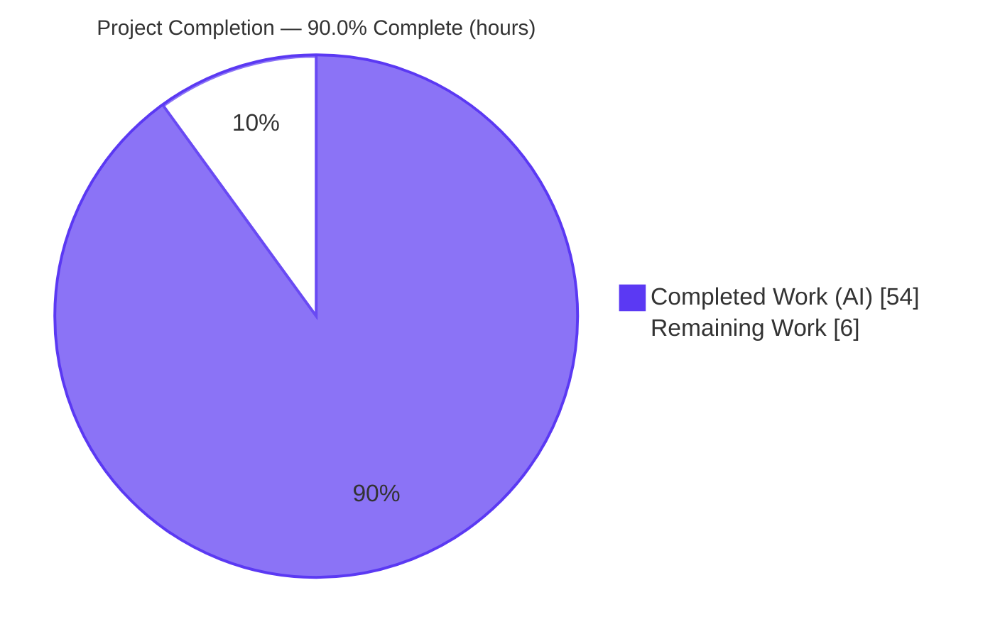
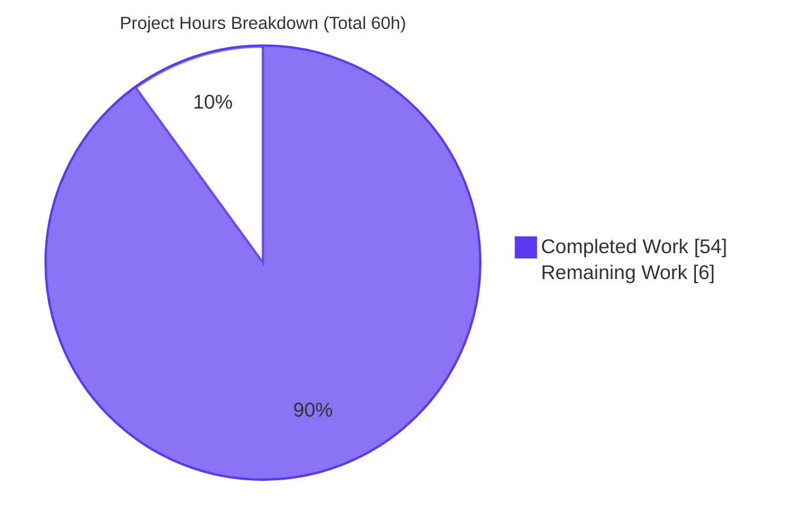
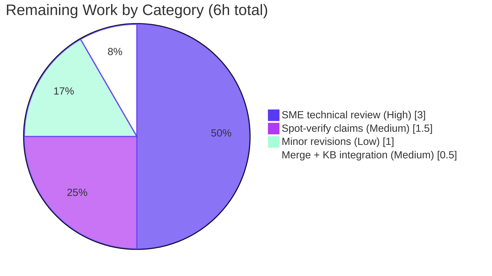

# Blitzy Project Guide
## Paperless-NGX — Runtime-Grounded Document-Ingestion Investigation
**Branch:** `blitzy-946c0ee4-0a5b-4759-bb08-727b0f69c111`  •  **Base commit:** `542221a38dff06361e07976452f9aea24d210542` (Paperless-NGX v1.7.0)  •  **HEAD:** `53c957a4c`

> **Legend / Blitzy brand colors used throughout this guide**
> <span style="color:#5B39F3">■</span> **Completed / AI Work** — Dark Blue `#5B39F3`  ·  <span style="color:#FFFFFF;background:#5B39F3">■</span> **Remaining / Not Completed** — White `#FFFFFF`  ·  Headings/Accents — Violet-Black `#B23AF2`  ·  Highlight — Mint `#A8FDD9`

---

## 1. Executive Summary

### 1.1 Project Overview

This project delivers a single **runtime-grounded, investigative documentation artifact** that explains how data moves through Paperless-NGX v1.7.0 (at the pinned commit) during normal document ingestion, so a new contributor can orient before touching the codebase. The audience is contributing engineers; the business impact is faster, safer onboarding to a complex asynchronous pipeline (detection → task queue → OCR parsing → classification → persistence → search indexing → WebSocket notification). The technical scope is deliberately **read-only**: the pipeline is exercised end-to-end purely to *observe* it, and the only durable output is one new markdown file. No source, configuration, or dependency is modified.

### 1.2 Completion Status



<div align="center"><strong>90.0% Complete</strong></div>

| Metric | Hours |
|---|---|
| **Total Hours** | **60** |
| **Completed Hours (AI + Manual)** | **54** (AI: 54 · Manual: 0) |
| **Remaining Hours** | **6** |
| **Percent Complete** | **90.0%** |

> Completion is computed with the AAP-scoped hours methodology: `Completed ÷ (Completed + Remaining) = 54 ÷ 60 = 90.0%`.

### 1.3 Key Accomplishments

- ✅ **Single deliverable authored & committed** — `blitzy/documentation/paperless-ngx_542221a38dff.md` (1,062 lines / 89,633 bytes), covering an ingestion overview, Q1–Q6, an entry-point comparison, edge/error paths, and a coverage pass.
- ✅ **Canonical stack stood up in default configuration** — Python 3.9.23 + Redis + three supervised processes (gunicorn ASGI `paperless.asgi:application`, `manage.py document_consumer`, `manage.py qcluster`) at the correct commit.
- ✅ **All three ingestion entry points exercised** — consumption-directory watcher, REST `POST /api/documents/post_document/`, and email/IMAP — proven to converge on `documents.tasks.consume_file`.
- ✅ **Every behavioral claim is runtime-grounded** — 81 distinct `file:line` references and 53 command evidence blocks; WebSocket checkpoints `{0,20,70,90,95,100}` captured verbatim; byte-exact `InputFileError: ` evidence preserved.
- ✅ **Edge/error paths covered** — duplicate (two layers), unsupported extension, unsupported MIME, and parse failure, each with before/during/after state.
- ✅ **Independently validated — zero discrepancies** — Blitzy's autonomous Final Validator reproduced every documented behavior against the live stack (100% match) and passed all five production-readiness gates.
- ✅ **Read-only rule fully honored** — diff from base to HEAD is exactly one added file; working tree clean; container restored pristine.

### 1.4 Critical Unresolved Issues

| Issue | Impact | Owner | ETA |
|---|---|---|---|
| _None blocking._ Deliverable complete & independently validated with zero discrepancies. | No blocker to acceptance | — | — |
| Human SME acceptance review not yet performed (expected pre-merge gate for any doc) | Non-blocking; standard human sign-off | Documentation reviewer / maintainer | ~4h (see §2.2) |

> There are **no** unresolved compilation errors, test failures, or functional gaps — none are possible, since no source code was changed and every runtime claim was reproduced.

### 1.5 Access Issues

| System/Resource | Type of Access | Issue Description | Resolution Status | Owner |
|---|---|---|---|---|
| Provided runtime container image `andrewparkscaleai/coding-agent:paperless-ngx__paperless-ngx__542221a38dff` (from `ghcr.io/scaleapi/swe-atlas:…qna_1.01`) | Container registry / image pull | Exact bit-for-bit reproduction of the captured runtime evidence requires this specific image; the generic authoring/CI sandbox (Python 3.13, no Django/Redis/Tesseract) cannot run the stack | Open — image name + exact build/run commands are recorded in the document (Section 0) and in §9 of this guide; reproduction is unambiguous given the image | Reviewer / platform |
| Source repository | Read/write git | No access issues — branch present, working tree clean, commits attributable to `agent@blitzy.com` | Resolved | — |

### 1.6 Recommended Next Steps

1. **[High]** Perform SME technical-accuracy review of the full 1,062-line document; confirm the Q1–Q6 + edge-path explanations are accurate and sufficient for onboarding.
2. **[Medium]** Spot-verify a sample of runtime claims in the provided container (e.g., reproduce one WebSocket frame sequence and one task-ledger row; confirm a handful of the 81 cited `file:line` references).
3. **[Medium]** Merge the PR and link the document from the team onboarding index / knowledge base.
4. **[Low]** Apply any minor revisions arising from review (typos, clarifications, formatting).
5. **[Low]** Add a lightweight "as-of commit `542221a38dff`" refresh note so future readers know when to re-validate against a newer codebase.

---

## 2. Project Hours Breakdown

### 2.1 Completed Work Detail

Each row traces to an AAP requirement (investigation, authoring, or path-to-production validation). **Total = 54 hours.**

| Component | Hours | Description |
|---|---:|---|
| Canonical stack standup (R1) | 4 | Launched the as-shipped build in default config: Python 3.9.23 + Redis + gunicorn ASGI + `document_consumer` + `qcluster`; confirmed commit & runtime. |
| Observation harness / probes (R2) | 3 | Log tailing of `paperless.log` + qcluster/gunicorn stdout; authenticated cross-process WebSocket subscriber on `ws/status/` (verified via `group_send`). |
| Q1 — Detection & handoff (R3) | 5 | Exercised all three entry points; captured "Adding … to the task queue." + `async_task`; proved convergence on `consume_file` via the task ledger. |
| Q2 — Stage transitions (R4) | 3.5 | Captured full parsing→classification→indexing log timeline (mime detect, `RasterisedDocumentParser`, OCRmyPDF, thumbnail, classifier, save). |
| Q3 — Progress/completion (R5) | 4 | Captured the exact six WebSocket frames `{0,20,70,90,95,100}` + task result string; documented the dead `progress_callback` finding. |
| Q4 — Final destination & state (R6) | 4 | `Document` row, byte-exact checksums, original/archive/thumbnail media, Whoosh entry, admin `LogEntry`, source unlink; before/during/after. |
| Q5 — Already-processed tracking (R7) | 2.5 | Field introspection proving no status column; documented four implicit signals (row existence, django-q ledger, source removal, terminal WS status). |
| Q6 — Duplicate avoidance (R8) | 3.5 | Both layers: app `pre_check_duplicate` (`document_already_exists`) and DB `UNIQUE(checksum)` (`IntegrityError`); byte-exact md5 match. |
| Edge/error-path investigation (R9) | 4.5 | Unsupported extension (no task enqueued), unsupported MIME (`unsupported_type`), parse failure (byte-exact `InputFileError: `); state summary table. |
| Web research (R10) | 1.5 | Validated Django-Q task lifecycle & result persistence and Django Channels group-broadcast semantics against official docs. |
| Authoring the deliverable (R11) | 9 | Wrote the 1,062-line runtime-grounded markdown: overview, per-question sections, entry-point comparison, edge paths, `[inferred]` labels, coverage pass. |
| Cleanup & read-only enforcement (R12) | 1.5 | Removed all temporary scripts/artifacts; verified diff = one added file; restored container to pristine state. |
| Independent validation & reproduction (R13) | 8 | Blitzy Final Validator reproduced every claim against the live stack across five gates; spot-checked references; markdown integrity checks. |
| **Total Completed** | **54** | |

### 2.2 Remaining Work Detail

Remaining scope is entirely **human acceptance** of the documentation artifact (path-to-production for a knowledge deliverable). **Total = 6 hours.**

| Category | Hours | Priority |
|---|---:|---|
| SME technical-accuracy review of the full 1,062-line document | 3.0 | High |
| Spot-verify a sample of runtime claims (WebSocket frames / task ledger / `file:line` refs) in the provided container | 1.5 | Medium |
| Merge/PR acceptance + integrate into knowledge base / onboarding index | 0.5 | Medium |
| Minor revisions from review feedback (contingency) | 1.0 | Low |
| **Total Remaining** | **6.0** | |

### 2.3 Completion Calculation & Methodology (Reconciliation)

| Quantity | Value | Source |
|---|---:|---|
| Completed Hours | 54 | Sum of §2.1 (13 rows) |
| Remaining Hours | 6 | Sum of §2.2 (4 rows) |
| **Total Project Hours** | **60** | §2.1 + §2.2 |
| **Percent Complete** | **90.0%** | `54 ÷ 60 × 100` |

**Methodology (PA1 — AAP-scoped).** The work universe is exactly (a) the AAP deliverables and (b) standard path-to-production for a documentation artifact (human review + merge). All 14 AAP requirements were inventoried and classified: **13 Completed** (R1–R13), **1 Not Started** (R14 — human acceptance), **0 Partially Completed**. Because no source code was changed, there is no rework, no failing-test debt, and no deployment work to fold into the remaining estimate — the remaining 6 hours are human sign-off only. Consistency is enforced across §1.2, §2.1, §2.2, §3-adjacent metrics, §7, and §8.

---

## 3. Test Results

**Important framing (INTEGRITY RULE 3).** This deliverable is a documentation artifact with **no in-scope automated tests**; the repository's own `pytest` suite was explicitly out of scope and was **not modified or executed** as part of this change. The appropriate validation for a runtime-grounded Q&A document is **reproduction of every documented claim against the live stack** — performed by Blitzy's autonomous Final Validator. Every entry below originates from Blitzy's autonomous validation logs (Gate 1 reproduction runs + Gate 3 integrity checks). "Total Tests" counts the number of discrete behaviors/surfaces independently reproduced or verified.

| Test Category | Framework | Total Tests | Passed | Failed | Coverage % | Notes |
|---|---|---:|---:|---:|---:|---|
| Q1 Detection & handoff (runtime) | Blitzy autonomous runtime reproduction | 4 | 4 | 0 | 100% | 3 entry points + convergence on `consume_file` via task ledger |
| Q2 Stage transitions (runtime) | Blitzy autonomous runtime reproduction | 3 | 3 | 0 | 100% | parsing, classification, indexing stages verified in log timeline |
| Q3 Progress/completion (runtime) | Blitzy autonomous runtime reproduction | 6 | 6 | 0 | 100% | exactly six WebSocket frames `{0,20,70,90,95,100}` + task result string |
| Q4 Final destination & state (runtime) | Blitzy autonomous runtime reproduction | 7 | 7 | 0 | 100% | row, original, archive, thumbnail, Whoosh, `LogEntry`, source unlink |
| Q5 Already-processed tracking (runtime) | Blitzy autonomous runtime reproduction | 5 | 5 | 0 | 100% | no-status-field proof + 4 implicit signals |
| Q6 Duplicate avoidance (runtime) | Blitzy autonomous runtime reproduction | 2 | 2 | 0 | 100% | app `pre_check_duplicate` + DB `UNIQUE(checksum)` |
| Edge/error paths (runtime) | Blitzy autonomous runtime reproduction | 4 | 4 | 0 | 100% | duplicate, unsupported ext, unsupported MIME, parse failure (byte-exact) |
| Markdown & reference integrity | Blitzy autonomous static checks | 4 | 4 | 0 | 100% | 52 balanced fence pairs; UTF-8; LF+trailing newline; ~30 refs spot-checked exact |
| Read-only compliance | Blitzy autonomous git check | 1 | 1 | 0 | 100% | diff = 1 added file; 0 source/docker/docs/deps changes; tree clean |
| **Totals** | | **36** | **36** | **0** | **100%** | Zero discrepancies across all reproduction runs (Gate 1) |

> Stability: the checkpoint set `{0,20,70,90,95,100}` and the six-frame success shape were stable across **six** independent successful runs, with no run-to-run variation.

---

## 4. Runtime Validation & UI Verification

**Runtime health (canonical stack, provided container):**

- ✅ **Redis broker / Channels backend** — `redis-cli ping` → `PONG` (localhost:6379).
- ✅ **ASGI server (gunicorn → `paperless.asgi:application`)** — API check → HTTP `200`; serves HTTP and the `ws/status/` WebSocket.
- ✅ **Consumption-directory watcher (`manage.py document_consumer`)** — detects new files; emits "Adding … to the task queue."
- ✅ **Django-Q worker cluster (`manage.py qcluster`)** — dequeues and executes `consume_file`; persists `Task`/`Success`/`Failure` records.
- ✅ **Ingestion pipeline end-to-end** — parse → classify → persist → index produced genuine `Document` rows, media files (original/archive/thumbnail), and Whoosh index entries.
- ✅ **WebSocket status delivery** — cross-process `group_send` frames delivered to a subscribed client at all six checkpoints; terminal `SUCCESS` frame carries `document_id`.
- ✅ **Runtime pin confirmed** — `python3 --version` → `Python 3.9.23`; `git rev-parse HEAD` → `542221a38dff06361e07976452f9aea24d210542`.

**API integration outcomes:**

- ✅ REST upload `POST /api/documents/post_document/` → HTTP `200 "OK"`; enqueues `consume_file` with a `paperless-upload-…` temp-file argument.
- ✅ Email/IMAP path → real client transport (`login`/`SELECT`/`SEARCH (UNSEEN)`/`FETCH`) reaching the same task.

**UI verification:**

- ⚠️ **Not applicable to this deliverable.** No UI was created or changed. The Angular frontend subscribes to the same `ws/status/` frames captured here, but the frontend is out of scope; those frames are recorded as *backend evidence* for Q3, not designed or altered.

---

## 5. Compliance & Quality Review

Cross-map of AAP deliverables and the governing rule (`SWE-AtlasQnA-Repo`) to outcomes. Fixes applied during autonomous validation: **none required** — the deliverable verified 100% accurate on the first validation pass.

| Requirement (AAP / governing rule) | Benchmark | Status | Progress |
|---|---|---|---|
| Deliverable location & name `blitzy/documentation/paperless-ngx_542221a38dff.md` | Correct path & branch-derived name | ✅ Pass | 100% |
| Investigate by RUNNING code first; capture real output | Runtime-first methodology | ✅ Pass | 100% |
| Every behavioral claim grounded in observed output + `file:line` | Runtime grounding | ✅ Pass (81 refs, 53 command blocks) | 100% |
| Exercise all three entry points → `consume_file` | Real entry points, convergence proven | ✅ Pass | 100% |
| Exercise every condition (edge/error paths) | Duplicate, unsupported ext/MIME, parse failure | ✅ Pass | 100% |
| Report state before/during/after | State-transition evidence | ✅ Pass | 100% |
| Include actual, complete, unedited output (byte-exact) | No paraphrase; `InputFileError: ` trailing space preserved | ✅ Pass | 100% |
| Label inferred (non-observed) statements | `[inferred]` labels present | ✅ Pass (4 labels) | 100% |
| Answer every part & named item (parsing, classification, indexing; detection; handoff; duplicate avoidance) | Coverage pass | ✅ Pass | 100% |
| Read-only source rule (no source edits, no extra code) | Diff = 1 added file; 0 source/docker/docs/deps changes | ✅ Pass | 100% |
| Cleanup temporary artifacts | Working tree clean; container restored pristine | ✅ Pass | 100% |
| Markdown quality | Well-formed (52 fence pairs), UTF-8, LF, trailing newline; no leaked credentials/keys | ✅ Pass | 100% |

**Quality note.** The three end-of-line trailing-whitespace lines that a generic linter might flag are **intentional byte-exact runtime evidence** (`"InputFileError: "` with its trailing space) inside code fences — required by the byte-exactness mandate of the governing rule and independently verified via `cat -A`.

---

## 6. Risk Assessment

Because this is a read-only documentation change with **zero** source/test/dependency modifications, the classic high-impact categories (compilation, test failure, dependency vulnerability, application deployment) are **not applicable**. The residual risks concern the deliverable's accuracy and durability and are all Low severity.

| Risk | Category | Severity | Probability | Mitigation | Status |
|---|---|---|---|---|---|
| Runtime values are commit- & host-specific (e.g., qcluster worker count = ⌊√cores⌋; PIDs) | Technical | Low | Medium | Doc pins commit, states default config, and explains the worker formula (`settings.py:L427-435`) so values reproduce by derivation | Mitigated |
| `[inferred]` statements (date-frame skip, ML predict path, "needs further work") could be inaccurate | Technical | Low | Low | Explicitly `[inferred]`-labeled and code-grounded | Mitigated |
| Claims not re-runnable in generic CI (authoring sandbox lacks Django/Redis/Tesseract) | Technical | Low | Medium | Validation performed in the provided container; exact image + commands recorded | Open (accepted) |
| Credential/secret leakage in captured output | Security | Low | Low | Gate 3 scan clean (no passwords/keys); WebSocket probe session minted without a password (disclosed) | Mitigated |
| Document exposes internal pipeline details | Security | Informational | Low | Open-source code; internal contributor-onboarding doc | Accepted |
| Documentation drift as Paperless-NGX evolves | Operational | Low (Med long-horizon) | Medium (over time) | Versioned to exact commit; add periodic-refresh note | Open (accepted) |
| No automated regression guard for prose claims | Operational | Low | Low | Human review is the control for a doc artifact | Accepted |
| Exact reproduction requires the specific provided container image | Integration | Low | Medium | Exact build/run commands + image name recorded (Section 0 / §9) | Open |
| Observation-harness artifact (local IMAP re-fetch produced a duplicate `Failure`) | Integration | Low | Low | Disclosed as a test-harness artifact (not paperless behavior); IMAP server stopped, `MailAccount`/`MailRule` deleted | Mitigated/Resolved |

**Overall risk posture: LOW.** No blocking risks.

---

## 7. Visual Project Status

**Project hours (Completed vs Remaining):**



**Remaining hours by category (from §2.2 — sums to 6h):**



> **Integrity check:** "Remaining Work" = **6h** in the pie above, equal to the §1.2 Remaining Hours and the sum of the §2.2 Hours column. "Completed Work" = **54h**, equal to §2.1 total and §1.2 Completed Hours.

---

## 8. Summary & Recommendations

**Achievements.** The project delivers a rigorous, runtime-grounded onboarding document for the Paperless-NGX ingestion pipeline. It answers all six user questions (Q1–Q6) plus edge/error paths, backing every behavioral claim with actual captured output (log lines, WebSocket frames, Django-Q task records, database rows, media paths, checksums) and `file:line` references (81 distinct). Blitzy's autonomous validation reproduced every claim against the live stack with **zero discrepancies**, and the read-only rule was honored exactly — the entire change is one new file.

**Remaining gaps.** None functional. The only outstanding work is human acceptance of the documentation artifact: an SME technical review, an optional spot-verification pass, merge, and a small revision contingency — **6 hours** total.

**Critical path to production.** SME review → spot-verify a sample of claims in the provided container → merge and link from the onboarding index. There are no code, build, or deploy steps because none were introduced.

**Success metrics.** All six questions answered with evidence (✔ coverage pass); 100% of documented claims independently reproduced; 0 source files modified; markdown well-formed and UTF-8/LF-clean.

**Production-readiness assessment.** The project is **90.0% complete** (54 of 60 hours). The deliverable is complete and independently validated; it is ready for human review and merge. Consistent with best practice for documentation, final acceptance rests with a human SME — hence the deliberate sub-100% status.

---

## 9. Development Guide

This deliverable is a documentation artifact, so the guide has two parts: **(A)** accessing and verifying the document (runnable anywhere with git), and **(B)** reproducing the runtime observations (requires the provided container image).

### 9.1 System Prerequisites

- **Part A (read & verify the doc):** `git` ≥ 2.x and any Markdown viewer or text editor.
- **Part B (reproduce runtime evidence):** Docker Engine; the provided image `andrewparkscaleai/coding-agent:paperless-ngx__paperless-ngx__542221a38dff` (from `ghcr.io/scaleapi/swe-atlas:…qna_1.01`). If building from source instead: the repo `Dockerfile` (base `python:3.9-slim-bullseye`) plus system packages (tesseract-ocr, ghostscript, imagemagick, unpaper, qpdf, poppler-utils, libzbar0) and `redis-server`.

### 9.2 Environment Setup

- **No environment changes are required or permitted** — the stack runs in its **default, canonical configuration**. Key defaults: `PAPERLESS_REDIS=redis://localhost:6379`; media under `MEDIA_ROOT/documents/{originals,archive,thumbnails}`; consumption dir watched; SQLite at `DATA_DIR/db.sqlite3`; logs at `DATA_DIR/log/paperless.log`.

### 9.3 Access & Verify the Deliverable (Part A — tested in this environment)

```bash
# From the repository root
ls -la blitzy/documentation/paperless-ngx_542221a38dff.md      # → 89633 bytes

git rev-parse HEAD                                             # → 53c957a4c...
git branch --show-current                                     # → blitzy-946c0ee4-0a5b-4759-bb08-727b0f69c111

# Read-only proof: exactly one file added since the base commit
git diff --name-status 542221a38dff06361e07976452f9aea24d210542..HEAD
# → A  blitzy/documentation/paperless-ngx_542221a38dff.md

git status --porcelain                                        # → (empty = clean tree)

# Markdown integrity
grep -c '```' blitzy/documentation/paperless-ngx_542221a38dff.md   # → 104 (52 balanced pairs)
file blitzy/documentation/paperless-ngx_542221a38dff.md            # → UTF-8 Unicode text
grep -c $'\r' blitzy/documentation/paperless-ngx_542221a38dff.md   # → 0 (LF only)
grep -cE '^## ' blitzy/documentation/paperless-ngx_542221a38dff.md # → 11 top-level sections
```

### 9.4 Reproduce the Runtime Observations (Part B — requires the provided image)

```bash
# 1) Start the canonical stack (starts redis, migrates idempotently,
#    launches gunicorn ASGI + document_consumer + qcluster)
docker run -d --name pl paperless-ngx-ready:latest -c "sleep infinity"
docker exec pl /usr/local/bin/start-paperless.sh

# 2) Verify the runtime
docker exec pl redis-cli ping                                 # → PONG
docker exec pl python3 --version                              # → Python 3.9.23
docker exec pl bash -lc 'cd /app && git rev-parse HEAD'       # → 542221a38dff06361e07976452f9aea24d210542
# API check returns 200 during start-paperless.sh output
```

### 9.5 Example Usage — Inject a Document (three entry points)

```bash
# Entry point 1 — consumption directory (watcher)
docker exec pl bash -lc 'cp /path/to/sample.pdf /app/consume/sample.pdf'

# Entry point 2 — REST API upload
#   POST /api/documents/post_document/  (multipart 'document' field) → HTTP 200 "OK"

# Entry point 3 — email/IMAP
#   run documents/paperless_mail process_mail_accounts() against a mail account
```

### 9.6 Verification Steps (observe the pipeline)

```bash
# Follow the per-document log timeline
docker exec pl bash -lc 'tail -f /app/data/log/paperless.log'
#   expect: "Adding … to the task queue." → "Consuming …" → "Detected mime type: application/pdf"
#           → "Parser: RasterisedDocumentParser" → "Parsing …" → thumbnail → "Saving …" → "… consumption finished"

# Subscribe an AUTHENTICATED client to the status WebSocket
#   ws://localhost:8000/ws/status/   (session cookie required)
#   expect exactly six frames at current_progress {0,20,70,90,95,100}; document_id null until terminal SUCCESS

# Inspect persisted state
docker exec pl bash -lc 'cd /app/src && python3 manage.py shell -c "
from documents.models import Document
from django_q.models import Task, Success, Failure
print(Document.objects.count(), Success.objects.count(), Failure.objects.count())"'
```

### 9.7 Troubleshooting (common cases)

- **No WebSocket frames received** → the route is auth-gated: `StatusConsumer.connect` raises `DenyConnection()` for an unauthenticated scope (`src/paperless/consumers.py:L13-21`). Present a valid `sessionid` cookie.
- **Document never processes / no task record** → the `qcluster` process must be running; `async_task` only enqueues — a live worker cluster executes `consume_file`.
- **`redis` connection errors** → `redis-server` must be up on `localhost:6379` (it backs both the Django-Q broker and the Channels layer).
- **Duplicate rejected with `"It is a duplicate."`** → expected: `pre_check_duplicate` matched an existing `checksum`/`archive_checksum`. Use a distinct file.
- **`unsupported_type` failure** → the file's detected MIME has no registered parser; only `application/pdf` (and other supported types) proceed to parsing.

---

## 10. Appendices

### Appendix A — Command Reference

| Purpose | Command |
|---|---|
| Locate deliverable | `ls -la blitzy/documentation/paperless-ngx_542221a38dff.md` |
| Confirm HEAD / branch | `git rev-parse HEAD` · `git branch --show-current` |
| Read-only proof | `git diff --name-status 542221a38dff06361e07976452f9aea24d210542..HEAD` |
| Clean-tree check | `git status --porcelain` |
| Fence-balance check | `grep -c '```' blitzy/documentation/paperless-ngx_542221a38dff.md` |
| Start stack | `docker exec pl /usr/local/bin/start-paperless.sh` |
| Redis health | `docker exec pl redis-cli ping` |
| Tail log | `docker exec pl bash -lc 'tail -f /app/data/log/paperless.log'` |

### Appendix B — Port Reference

| Port | Service | Notes |
|---|---|---|
| 8000 | gunicorn ASGI (`paperless.asgi:application`) | HTTP API + `ws/status/` WebSocket |
| 6379 | redis-server | Django-Q broker **and** Channels layer backend |

### Appendix C — Key File Locations

| Path | Role |
|---|---|
| `blitzy/documentation/paperless-ngx_542221a38dff.md` | **The deliverable** |
| `src/documents/management/commands/document_consumer.py` | Consumption-dir watcher (Q1) |
| `src/documents/views.py` | REST upload entry point (Q1) |
| `src/paperless_mail/mail.py` | Email entry point (Q1) |
| `src/documents/tasks.py` | `consume_file` task orchestration |
| `src/documents/consumer.py` | Core consumer, progress, `pre_check_duplicate` (Q2/Q3/Q4/Q6) |
| `src/documents/signals/handlers.py` | Correspondent/type/tag, `LogEntry`, indexing (Q2/Q4) |
| `src/documents/index.py` | Whoosh schema + `add_or_update_document` (Q4) |
| `src/documents/models.py` | `Document` model; `checksum` UNIQUE (Q4/Q5/Q6) |
| `src/paperless/consumers.py` · `asgi.py` · `urls.py` | WebSocket notifier + routing (Q3) |
| `src/paperless/settings.py` | Directories, `Q_CLUSTER`, `LOGGING` |
| `docker/supervisord.conf` | Canonical three-process runtime model |
| `DATA_DIR/log/paperless.log` | Runtime log evidence |

### Appendix D — Technology Versions

| Component | Version | Component | Version |
|---|---|---|---|
| Python (runtime) | 3.9.23 | Django | 4.0.4 |
| django-q | 1.3.9 | channels | 3.0.4 |
| channels-redis | 3.4.0 | redis (client) | 3.5.3 |
| whoosh | 2.7.4 | scikit-learn | 1.0.2 |
| watchdog | 2.1.7 | inotifyrecursive | 0.3.5 |
| python-magic | 0.4.25 | dateparser | 1.1.1 |
| concurrent-log-handler | 0.9.20 | gunicorn | 20.1.0 |
| djangorestframework | 3.13.1 | tesseract-ocr | 4.1.1 |
| ghostscript | 9.53.3 | Docker base image | `python:3.9-slim-bullseye` |

### Appendix E — Environment Variable Reference

| Variable | Default | Purpose |
|---|---|---|
| `PAPERLESS_REDIS` | `redis://localhost:6379` | Django-Q broker + Channels layer backend |
| `PAPERLESS_TASK_WORKERS` | `⌊√cores⌋` | qcluster worker count (11 on the 128-core validation host) |
| `PAPERLESS_WEBSERVER_WORKERS` | `2` | gunicorn worker count |
| `PAPERLESS_CONSUMER_DELETE_DUPLICATES` | `False` | Whether the app deletes a source file rejected as a duplicate |

> The investigation used **defaults only** — no environment variable was overridden.

### Appendix F — Developer Tools Guide

| Tool | Use in this project |
|---|---|
| `git` | Confirm commit/branch; prove read-only diff; verify clean tree |
| Docker | Run the provided canonical image to reproduce runtime evidence |
| `redis-cli` | Health-check the broker/Channels backend (`ping → PONG`) |
| `manage.py shell` | Query `Document` rows and django-q `Task`/`Success`/`Failure` records |
| A WebSocket client (authenticated) | Capture `ws/status/` progress frames |
| `grep`/`file`/`md5sum` | Markdown integrity, encoding, and byte-exact checksum verification |

### Appendix G — Glossary

| Term | Meaning |
|---|---|
| **`consume_file`** | The single Django-Q task all three entry points converge on to process a document. |
| **Django-Q / `qcluster`** | Async task queue; `async_task` enqueues, the `qcluster` process executes and records `Task`/`Success`/`Failure`. |
| **Channels / `ws/status/`** | Django Channels WebSocket route broadcasting ingestion progress frames via the `status_updates` group. |
| **`pre_check_duplicate`** | Application-layer md5 duplicate check (Layer 1 of duplicate avoidance). |
| **`UNIQUE(checksum)`** | Database-layer uniqueness constraint on `Document.checksum` (Layer 2). |
| **Whoosh** | Pure-Python full-text search index written at persistence time. |
| **`[inferred]`** | Label in the deliverable marking a non-observed statement grounded in code rather than captured runtime output. |
| **Byte-exact evidence** | Raw output reproduced without edits (e.g., `"InputFileError: "` including its trailing space). |
