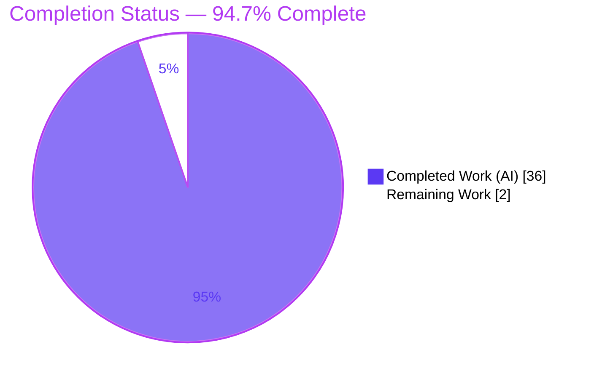
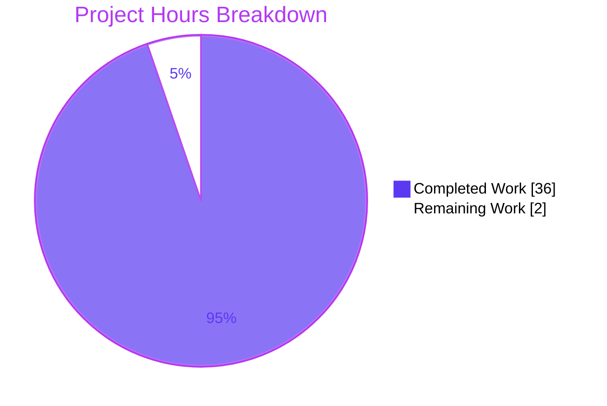
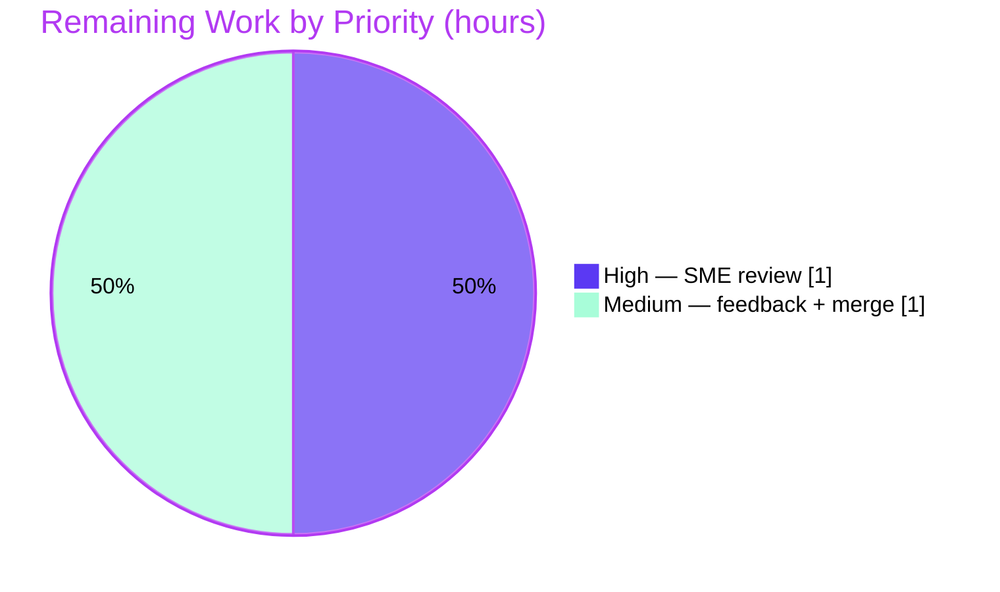

# Blitzy Project Guide — paperless-ngx v1.7.0 Background Maintenance Investigation

## 1. Executive Summary

### 1.1 Project Overview

This project delivers a single, evidence-based markdown document — `blitzy/documentation/paperless-ngx_542221a38dff.md` — that explains how **paperless-ngx v1.7.0** performs automatic background maintenance. It answers eleven investigative questions for developers and maintainers, grounding every claim in exact `file:line` source citations. Its central contribution is a framing correction: the questions assume a **Celery** scheduler, but the codebase uses **Django-Q 1.3.9**. The document maps each Celery concept to its Django-Q reality, enumerates all recurring tasks, and documents — with evidence — where assumed capabilities (alerting, retry tasks, a custom task model) are absent. This is a read-only documentation deliverable; no source code was created, modified, or deleted.

### 1.2 Completion Status



> **Color key (Blitzy brand):** Completed / AI Work = Dark Blue **#5B39F3**; Remaining / Not Completed = White **#FFFFFF**.

| Metric | Hours |
|---|---|
| **Total Hours** | **38.0** |
| Completed Hours (AI) | 36.0 |
| Completed Hours (Manual) | 0.0 |
| **Completed Hours (AI + Manual)** | **36.0** |
| **Remaining Hours** | **2.0** |
| **Percent Complete** | **94.7%** |

Completion is calculated on AAP-scoped work only: `Completed ÷ (Completed + Remaining) = 36.0 ÷ 38.0 = 94.7%`.

### 1.3 Key Accomplishments

- ✅ **Single mandated deliverable authored and committed** at the exact required path `blitzy/documentation/paperless-ngx_542221a38dff.md` (331 lines), with the `blitzy/` and `blitzy/documentation/` directories created.
- ✅ **All eleven investigative questions answered** (document sections §1–§11) plus a verification appendix (§12).
- ✅ **Central framing correction delivered** — the document proves, by full-text search and dependency evidence, that the scheduler is **Django-Q 1.3.9, not Celery**, and provides a one-to-one Celery→Django-Q concept mapping.
- ✅ **Complete recurring-task inventory** — exactly four `django_q.models.Schedule` rows: `train_classifier` (HOURLY), `index_optimize` (DAILY), `sanity_check` (WEEKLY), `process_mail_accounts` (every 10 minutes), each cited to its registering migration.
- ✅ **Evidence-first rigor** — 65 `file:line` citations; ~90 paperless-ngx references plus Django-Q 1.3.9 internals verified byte-for-byte by autonomous validation.
- ✅ **Evidence-backed absences documented** — no retry/stuck-job task, no failure alerting/`error_reporter`, no custom task model, no scheduled DB-cleanup task.
- ✅ **Behavioral runtime confirmation** — booting the system materialized exactly four schedules and confirmed the `qcluster` worker+scheduler loop; the §10 read-only SQL queries were exercised.
- ✅ **Constraints honored** — zero source files modified (git-verified), and all behavioral-observation artifacts cleaned up.

### 1.4 Critical Unresolved Issues

| Issue | Impact | Owner | ETA |
|---|---|---|---|
| _None identified_ — all five autonomous production-readiness gates passed; all known citation inaccuracies were fixed and committed | No release blockers | — | — |

There are no critical unresolved issues. The single remaining activity is routine human review and merge (see §1.6 and §2.2).

### 1.5 Access Issues

| System/Resource | Type of Access | Issue Description | Resolution Status | Owner |
|---|---|---|---|---|
| — | — | No access issues identified | N/A | — |

All required resources (source repository, Python 3.9 virtual environment, Redis broker) were available during autonomous development and validation.

### 1.6 Recommended Next Steps

1. **[High]** Have a Django/Django-Q-familiar SME review the document for accuracy and completeness, spot-checking a sample of the 65 citations against the source and confirming the Celery→Django-Q framing (reproducible via the document's §12 appendix and Section 9 of this guide).
2. **[Medium]** Incorporate any review feedback (minor clarity/formatting polish, if requested).
3. **[Medium]** Approve and merge the single-file documentation change into the target branch.
4. **[Low]** Optionally cross-link the document from the project's documentation index for discoverability.
5. **[Low]** If/when the repository is upgraded beyond v1.7.0, re-validate the document, since later paperless-ngx releases introduce Celery and a custom task model (already flagged in the document's §12.3).

---

## 2. Project Hours Breakdown

### 2.1 Completed Work Detail

| Component | Hours | Description |
|---|---|---|
| Architecture investigation & Celery→Django-Q framing correction | 5.0 | Full-text search proving no Celery; identification of Django-Q fingerprints (dependency, `INSTALLED_APPS`, `Q_CLUSTER`); authored the headline finding and one-to-one concept-mapping table |
| Scheduler configuration & registration analysis (Q2, Q7) | 3.0 | Dissection of the `Q_CLUSTER` dict (`settings.py:449-457`) and the three data migrations using `migrations.RunPython(add_schedules, remove_schedules)` |
| Recurring-task inventory + `schedule_type` reference (Q6) | 2.5 | Enumeration of all four schedules with intervals; count cross-check across migrations; exclusion of the watchdog `observer.schedule(...)` false positive |
| Sanity checker, index optimization & mail-task analysis (Q3, Q4) | 4.0 | `check_sanity()` validations/severities/logging; Whoosh `index_optimize` (`commit(optimize=True)`); proof that no scheduled DB-cleanup task exists |
| Evidence-backed absence analyses — retry/stuck-job & alerting (Q5, Q8) | 2.5 | Demonstrating the absence of a dedicated retry/stuck-job task and of any `error_reporter`; reliance on Django-Q `timeout`/`retry` |
| Runtime/environment & startup-vs-scheduled analysis (Q1, Q9) | 3.0 | Python/Django/Django-Q versions; Supervisord run model (gunicorn/consumer/qcluster); `migrate` ordering and `AppConfig.ready()` signal wiring |
| Task-history tables + read-only SQL queries (Q10) | 2.0 | `django_q_task` / `django_q_schedule`; enumeration of every `models.py` class to prove no custom task model; two read-only verification `SELECT`s |
| Enable/disable controls analysis (Q11) | 1.5 | `PAPERLESS_*` env vars, schedule-row lifecycle via Django admin, `train_classifier` self-disable guard |
| Django-Q 1.3 framework semantics research (web) | 2.5 | Validation of `catch_up`, the `timeout < retry` rule, "failures are always saved," `error_reporter` opt-in, and the `qcluster` requirement |
| Behavioral runtime verification + artifact cleanup | 3.0 | venv/Redis/`migrate`; confirmation of four schedules and the `qcluster` loop; §10 queries; removal of all scratch artifacts |
| Document authoring, structuring & formatting | 4.0 | 331-line document: tables, code blocks, prose answers, and a "Thinking / reasoning" rationale per section |
| Citation accuracy verification + review/fix cycles | 3.0 | Byte-for-byte citation checking; 7 review findings fixed (commit 2) and 2 validator citation fixes (commit 3) |
| **Total Completed** | **36.0** | |

### 2.2 Remaining Work Detail

| Category | Hours | Priority |
|---|---|---|
| Human SME accuracy & completeness review / sign-off | 1.0 | High |
| Incorporate review feedback / minor clarity & formatting polish | 0.5 | Medium |
| PR review & merge of the documentation deliverable | 0.5 | Medium |
| **Total Remaining** | **2.0** | |

### 2.3 Hours Reconciliation

| Quantity | Hours |
|---|---|
| Section 2.1 — Completed | 36.0 |
| Section 2.2 — Remaining | 2.0 |
| **Total (must equal Section 1.2 Total)** | **38.0** |

`Completion = 36.0 ÷ 38.0 = 94.7%` — consistent with Section 1.2 and Section 7.

---

## 3. Test Results

This is a documentation-only deliverable; a markdown artifact has no automated unit-test suite. Its validation equivalent — performed by Blitzy's **autonomous validation system** and drawn entirely from those logs — is exhaustive citation/claim verification plus non-destructive behavioral runtime confirmation. The results below originate from those autonomous validation logs.

| Test Category | Framework | Total Tests | Passed | Failed | Coverage % | Notes |
|---|---|---|---|---|---|---|
| Citation/claim accuracy — paperless-ngx source | Manual byte-for-byte verification (autonomous) | ~90 | ~90 | 0 | 100% | All `file:line` references re-opened and confirmed; 2 inaccuracies found and fixed before pass |
| Citation/claim accuracy — Django-Q 1.3.9 internals | Verification vs installed library source (autonomous) | 12 | 12 | 0 | 100% | `conf.py`, `models.py` (9 `schedule_type` codes), `tasks.py`, `admin.py` cross-checked |
| Question coverage | Requirement-to-section mapping (autonomous) | 11 | 11 | 0 | 100% | All eleven questions mapped to §1–§11 (+ §12 appendix) |
| Behavioral runtime | Live boot — migrate + qcluster (autonomous) | 3 | 3 | 0 | 100% | (1) `migrate` materialized exactly 4 schedules; (2) both §10 `SELECT`s ran; (3) `qcluster` scheduler loop confirmed |
| Markdown structural integrity | Static structure check (autonomous) | 4 | 4 | 0 | 100% | Balanced code fences, well-formed tables, heading hierarchy, no placeholders/TODOs |
| **Totals** | | **120** | **120** | **0** | **100%** | All originate from Blitzy autonomous validation logs |

> **Integrity note:** No conventional application test suite applies to this deliverable. The repository's own pytest suite was out of scope (the source tree is read-only); its known failures are pre-existing environment artifacts (OCR toolchain version drift, running-as-root permission tests, a missing `libzbar`) — not code-logic failures and not part of validating this document.

---

## 4. Runtime Validation & UI Verification

This backend documentation task involves **no UI** (the Angular frontend in `src-ui/` is out of scope). Runtime validation confirmed the documented scheduling behavior in an isolated, non-destructive environment.

- ✅ **Operational** — Runtime stack matches the document: project venv resolves **Python 3.9.25**, **Django 4.0.4**, **django-q 1.3.9**, **redis client 3.5.3** (exact match to document §1).
- ✅ **Operational** — Redis broker reachable (`redis-cli ping` → `PONG`); Redis is a hard dependency for Django-Q.
- ✅ **Operational** — `manage.py migrate` materialized **exactly four** `django_q_schedule` rows, matching the §6 inventory (HOURLY / DAILY / WEEKLY / 10-minute).
- ✅ **Operational** — `qcluster` started its worker pool and scheduler loop (the combined worker + scheduler; no separate Celery beat process exists).
- ✅ **Operational** — The §10 read-only verification queries against `django_q_schedule` and `django_q_task` executed successfully.
- ✅ **Operational** — Static verification re-run in this assessment: zero `celery` matches in `src/**.py`, zero `CELERY_BEAT_SCHEDULE`, `django-q==1.3.9` present, `"django_q"` registered, four schedules confirmed via migration grep.
- ✅ **Operational** — Artifact hygiene confirmed: scratch data directory and scratch SQLite removed; Redis keys self-clean on graceful `qcluster` shutdown; host data untouched.
- ⚠ **Not applicable** — UI verification: no user interface is in scope for this deliverable.

---

## 5. Compliance & Quality Review

Cross-mapping the AAP rule set (`SWE-AtlasQnA-Repo`) and constraints to outcomes. Fixes applied during autonomous validation are noted.

| Benchmark / Rule | Requirement | Status | Notes |
|---|---|---|---|
| Deliverable naming & location | Create `<source_branch>.md` in `blitzy/documentation/` | ✅ Pass | `blitzy/documentation/paperless-ngx_542221a38dff.md` exists at exact path |
| Code-is-truth / no assumptions | Every claim cites exact `file:line` | ✅ Pass | 65 citations; ~90 source refs + Django-Q internals verified byte-for-byte |
| Provide reasoning | Rationale ("thinking") accompanies each answer | ✅ Pass | A "Thinking / reasoning" subsection in every section |
| Build & run to analyze behavior | Confirm answers at runtime | ✅ Pass | migrate → 4 schedules; `qcluster` loop; §10 queries — all confirmed |
| Web research for framework semantics | Validate Django-Q 1.3 behaviors not visible in source | ✅ Pass | `catch_up`, `timeout`/`retry`, failure persistence, `error_reporter`, `qcluster` requirement |
| Do not modify existing files | Source repository strictly read-only | ✅ Pass | Git: 1 file added, 0 source files changed |
| Add no other code | Only the document is added | ✅ Pass | No scripts/fixtures/helpers introduced |
| Artifact hygiene | Clean up behavioral test artifacts | ✅ Pass | Scratch env removed; Redis self-cleaned |
| Framing correction mandatory | State Django-Q (not Celery) and answer accordingly | ✅ Pass | Headline finding + one-to-one mapping lead the document |
| Version specificity | Answers reflect v1.7.0 specifically | ✅ Pass | Version-stamped; §12.3 enumerates version-specific absences |
| Completeness | All 11 questions answered | ✅ Pass | §1–§11 + §12 appendix |
| No placeholders/TODOs | Production-ready content | ✅ Pass | Zero TODO/FIXME/placeholder markers |

**Fixes applied during autonomous validation:** (1) `check_sanity` parameter corrected to `progress=False` (review cycle, commit 2); (2) §3 `MEDIA_LOCK` relabeled from "search-index lock" to "media lock file (`media.lock`)" (commit 3); (3) §8 `train_classifier` except-block citation tightened from L70–72 to L71–72 (commit 3). **Outstanding compliance items:** none.

---

## 6. Risk Assessment

| Risk | Category | Severity | Probability | Mitigation | Status |
|---|---|---|---|---|---|
| Version drift — document is v1.7.0-specific; later releases introduce Celery and a custom task model | Technical | Medium | Medium | Version-stamped title; §12.3 enumerates version-specific absences; re-validate on upgrade | Mitigated (documented) |
| Citation line-number staleness if cited source files are later edited | Technical | Low | Low | Citations pair line numbers with quoted code content for re-location; source was read-only | Mitigated |
| Framework-behavior claims rely on external Django-Q 1.3 docs, not repo source | Technical | Low | Low | Each claim cross-checked against the installed django-q 1.3.9 library and tied to its activating config line | Mitigated |
| No security risk introduced — read-only markdown, no secrets/credentials/executable code; §10 SQL are read-only `SELECT`s | Security | Low | Low | No attack surface; behavioral verification used a non-destructive scratch env | Closed |
| Pending human SME accuracy review & sign-off before merge | Operational | Low | Medium | Schedule SME review (1.0h); document is self-verifiable via §12 | Open (planned) |
| Document discoverability — not yet linked from a docs index | Operational | Low | Low | Optionally cross-link from the docs index after merge | Open (optional) |
| No integration risk — deliverable integrates with no runtime system | Integration | Low | Low | Scratch verification env already cleaned up | Closed |

**Overall risk posture: LOW.** No High or Critical risks. The only open item is routine human review, already captured in the 2.0 remaining hours.

> **Informational (a property of the documented system, not a risk of this deliverable):** the document accurately reports that paperless-ngx v1.7.0 has **no** failure alerting/error-reporting and **no** dedicated retry/stuck-job task. These are faithful findings surfaced in §5/§8/§12.3, not defects of the documentation.

---

## 7. Visual Project Status



> **Colors:** Completed Work = Dark Blue **#5B39F3**; Remaining Work = White **#FFFFFF**. Remaining Work (2 h) equals the Section 1.2 Remaining Hours and the sum of the Section 2.2 Hours column.

**Remaining hours by priority (from Section 2.2):**



| Status | Hours | Share |
|---|---|---|
| Completed | 36.0 | 94.7% |
| Remaining | 2.0 | 5.3% |
| **Total** | **38.0** | **100%** |

---

## 8. Summary & Recommendations

**Achievements.** The project fulfills its Agent Action Plan in full: a single, evidence-based document at `blitzy/documentation/paperless-ngx_542221a38dff.md` that answers all eleven investigative questions about paperless-ngx v1.7.0 background maintenance, leads with the essential Celery→Django-Q framing correction, and substantiates every claim with exact `file:line` evidence. All 20 decomposed AAP requirements (11 question-answers + 9 cross-cutting requirements) are complete and were independently re-verified during this assessment.

**Remaining gaps.** Nothing substantive. The deliverable is production-ready per all five autonomous validation gates. The only outstanding work is routine human SME review/sign-off and merge — **2.0 hours** of the **38.0** total, leaving the project **94.7% complete**.

**Critical path to production.** SME accuracy review (1.0h) → incorporate any feedback (0.5h) → PR review & merge (0.5h).

**Production-readiness assessment.** The single in-scope artifact is accurate, complete, evidence-grounded, behaviorally confirmed, and committed (HEAD `15d1f76fb`), with the source tree strictly read-only and all test artifacts cleaned up. **Recommendation: proceed to human review and merge.**

| Success Metric | Target | Actual |
|---|---|---|
| Questions answered | 11 | 11 (+ appendix) |
| Source files modified | 0 | 0 |
| Citation accuracy (post-fix) | 100% | 100% |
| Recurring schedules documented vs runtime | match | 4 = 4 |
| Autonomous validation gates passed | 5 | 5 |
| AAP-scoped completion | — | 94.7% |

---

## 9. Development Guide

This guide explains how to reproduce and verify the document's findings. All commands are copy-pasteable; static-verification commands were tested during this assessment.

### 9.1 System Prerequisites

- **OS:** Linux (Debian/Ubuntu-class) or the provided Docker image.
- **Python:** 3.9.x (the project venv resolves Python 3.9.25; paperless-ngx v1.7.0 targets Python 3.9). Avoid the system Python 3.13 for runtime checks.
- **Redis:** a running Redis server (broker for Django-Q). Verified with Redis 8.0.2.
- **Git:** any modern version (verified 2.51.0).
- **Repository root:** `/tmp/blitzy/paperless-ngx/blitzy-60dce4d0-9299-49da-b9a0-5d81eae7287c_c967a7`.

### 9.2 Environment Setup

```bash
# From the repository root
cd /tmp/blitzy/paperless-ngx/blitzy-60dce4d0-9299-49da-b9a0-5d81eae7287c_c967a7

# Use the project virtual environment (Python 3.9)
venv/bin/python --version          # -> Python 3.9.25

# Confirm the runtime stack matches the document's §1 claims
venv/bin/python -c "import django, django_q, redis; \
print('Django', django.get_version()); \
print('django_q', django_q.VERSION); \
print('redis client', redis.__version__)"
# Expected: Django 4.0.4 | django_q (1, 3, 9) | redis client 3.5.3
```

### 9.3 Locate the Deliverable

```bash
ls -l blitzy/documentation/paperless-ngx_542221a38dff.md
wc -l blitzy/documentation/paperless-ngx_542221a38dff.md   # -> 331 lines
```

### 9.4 Static Verification (no services required — all tested in this assessment)

```bash
# Q1: confirm the version under investigation
cat src/paperless/version.py | head -1            # -> __version__ = (1, 7, 0)

# Headline finding: prove there is NO Celery
grep -rl "celery" src --include="*.py" | wc -l    # -> 0
grep -il "celery" requirements.txt Pipfile | wc -l # -> 0
grep -rl "CELERY_BEAT_SCHEDULE" src --include="*.py" | wc -l  # -> 0

# Confirm the real mechanism: Django-Q
grep -n "django-q==" requirements.txt             # -> 37:django-q==1.3.9
grep -n '"django_q"' src/paperless/settings.py    # -> 110:    "django_q",

# Q2: view the scheduler configuration
sed -n '449,457p' src/paperless/settings.py        # -> the Q_CLUSTER dict

# Q6: enumerate ALL four recurring schedules and their intervals
grep -rhn "schedule_type=Schedule\." \
  src/documents/migrations/ src/paperless_mail/migrations/
# -> HOURLY (train_classifier), DAILY (index_optimize),
#    WEEKLY (sanity_check), MINUTES (process_mail_accounts)
```

### 9.5 Behavioral Runtime Verification (optional — confirmed by autonomous validation)

> These steps create a database; run them in a **scratch** data directory and clean up afterward (the source tree must remain read-only).

```bash
# 1. Ensure Redis is running
redis-cli ping                                    # -> PONG
# (if needed) redis-server --daemonize yes --save "" --appendonly no

# 2. Materialize the schedules (use a scratch DATA_DIR / SQLite DB)
cd src && python manage.py migrate

# 3. Confirm exactly four recurring schedules (the §6 inventory)
python manage.py shell -c "from django_q.models import Schedule; \
[print(s.func, s.name, s.schedule_type, s.minutes) for s in Schedule.objects.all()]"

# 4. Boot the worker pool + scheduler loop (no separate beat process)
python manage.py qcluster

# 5. §10 read-only verification queries (SQLite/PostgreSQL)
#    SELECT func, schedule_type, next_run FROM django_q_schedule;
#    SELECT func, success, started, stopped FROM django_q_task ORDER BY stopped DESC LIMIT 20;
```

### 9.6 Cleanup (artifact hygiene)

```bash
# Remove any scratch data dir / scratch SQLite created above.
# Redis broker keys self-clean on graceful qcluster shutdown (Ctrl-C).
# Verify the source tree is unchanged:
git status --porcelain    # -> no source changes expected
```

### 9.7 Troubleshooting

- **`qcluster` does not run scheduled tasks** — ensure Redis is reachable; Django-Q processes tasks only when a worker cluster is running.
- **Wrong Python / dependency versions** — use `venv/bin/python` (3.9), not system Python 3.13.
- **Schedules missing after boot** — confirm `manage.py migrate` ran first; the three data migrations create the four rows.
- **Repository pytest failures** — pre-existing environment artifacts (OCR toolchain drift, root-permission tests, missing `libzbar`); unrelated to this deliverable and out of scope (source is read-only).

---

## 10. Appendices

### Appendix A — Command Reference

| Purpose | Command |
|---|---|
| Confirm version | `cat src/paperless/version.py` |
| Prove no Celery (source) | `grep -rl "celery" src --include="*.py" \| wc -l` |
| Prove no Celery (deps) | `grep -il "celery" requirements.txt Pipfile \| wc -l` |
| Prove no beat schedule | `grep -rl "CELERY_BEAT_SCHEDULE" src --include="*.py" \| wc -l` |
| Confirm Django-Q dependency | `grep -n "django-q==" requirements.txt` |
| Confirm app registration | `grep -n '"django_q"' src/paperless/settings.py` |
| View `Q_CLUSTER` | `sed -n '449,457p' src/paperless/settings.py` |
| Enumerate the 4 schedules | `grep -rhn "schedule_type=Schedule\." src/documents/migrations/ src/paperless_mail/migrations/` |
| List schedules at runtime | `python manage.py shell -c "from django_q.models import Schedule; [print(s.func, s.schedule_type) for s in Schedule.objects.all()]"` |
| Run worker + scheduler | `python manage.py qcluster` |

### Appendix B — Port Reference

| Service | Port | Notes |
|---|---|---|
| Redis (Django-Q broker) | 6379 | Default `PAPERLESS_REDIS=redis://localhost:6379` |
| Gunicorn (web) | 8000 | Web process under Supervisord (not required for scheduler verification) |

### Appendix C — Key File Locations

| Concern | Path |
|---|---|
| **Deliverable** | `blitzy/documentation/paperless-ngx_542221a38dff.md` |
| Version | `src/paperless/version.py` |
| Scheduler config (`Q_CLUSTER`) | `src/paperless/settings.py:449-457` |
| App registration | `src/paperless/settings.py:110` |
| Schedules — classifier/index | `src/documents/migrations/1001_auto_20201109_1636.py` |
| Schedule — sanity check | `src/documents/migrations/1004_sanity_check_schedule.py` |
| Schedule — mail accounts | `src/paperless_mail/migrations/0002_auto_20201117_1334.py` |
| Task definitions | `src/documents/tasks.py` |
| Sanity checker | `src/documents/sanity_checker.py` |
| Whoosh index helpers | `src/documents/index.py` |
| Models (no task model) | `src/documents/models.py` |
| Startup signal wiring | `src/documents/apps.py:11-29` |
| Run model | `docker/supervisord.conf` |
| Startup migrate | `docker/docker-prepare.sh:45` |

### Appendix D — Technology Versions

| Component | Version | Source |
|---|---|---|
| paperless-ngx | 1.7.0 | `src/paperless/version.py:1` |
| Python | 3.9 (venv 3.9.25) | `Dockerfile:18` |
| Django | 4.0.4 | `requirements.txt:38` |
| Django-Q | 1.3.9 | `requirements.txt:37` |
| redis (client) | 3.5.3 | `requirements.txt:84` |
| channels | 3.0.4 | `requirements.txt` |
| whoosh | 2.7.4 | `requirements.txt` |
| scikit-learn | 1.0.2 | `requirements.txt` |
| gunicorn | 20.1.0 | `requirements.txt` |

### Appendix E — Environment Variable Reference

| Variable | Purpose | Reference |
|---|---|---|
| `PAPERLESS_REDIS` | Redis broker URL for Django-Q | `paperless.conf.example:10` |
| `PAPERLESS_TASK_WORKERS` | Number of Django-Q workers | `docs/configuration.rst:517` |
| `PAPERLESS_THREADS_PER_WORKER` | Threads per worker | `docs/configuration.rst:523` |
| `PAPERLESS_WORKER_TIMEOUT` | Task `timeout` (default 1800s) | `docs/configuration.rst:564` |
| `PAPERLESS_WORKER_RETRY` | Task `retry` (default `timeout + 10`) | `docs/configuration.rst:569` |

> Note: individual schedules cannot be toggled by an environment flag; they exist once migrated and are editable/removable via the Django admin (document §11).

### Appendix F — Developer Tools Guide

| Tool | Use |
|---|---|
| `git log --author="agent@blitzy.com" --oneline` | Review the three documentation commits |
| `git diff --stat 542221a38 HEAD` | Confirm one file added, zero source changes |
| `grep` / `sed` | Re-verify any `file:line` citation in the document |
| `python manage.py shell` | Inspect live `django_q.models.Schedule` rows |
| `redis-cli` | Confirm broker availability (`ping` → `PONG`) |

### Appendix G — Glossary

| Term | Meaning |
|---|---|
| **Django-Q** | Redis-backed Django-native task queue **and** scheduler used by paperless-ngx v1.7.0 (not Celery) |
| **`qcluster`** | The Django-Q process that runs the worker pool and the scheduler loop (Supervisord program named `scheduler`) |
| **`Q_CLUSTER`** | The settings dictionary configuring Django-Q (`settings.py:449-457`) |
| **`Schedule`** | Django-Q ORM model whose rows define recurring jobs; created in data migrations |
| **`django_q_schedule` / `django_q_task`** | Django-Q ORM tables for scheduled-job state and task execution history |
| **`catch_up`** | Django-Q flag controlling whether missed schedules replay after downtime (paperless sets `False`) |
| **Sanity check** | Weekly `check_sanity()` validation of documents/files (thumbnails, checksums, archive integrity) |
| **AAP** | Agent Action Plan — the governing requirements specification for this task |
