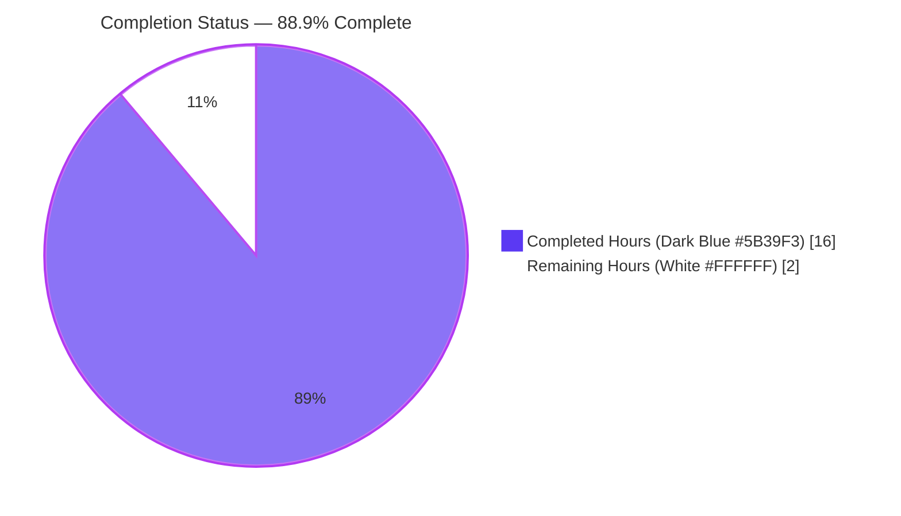
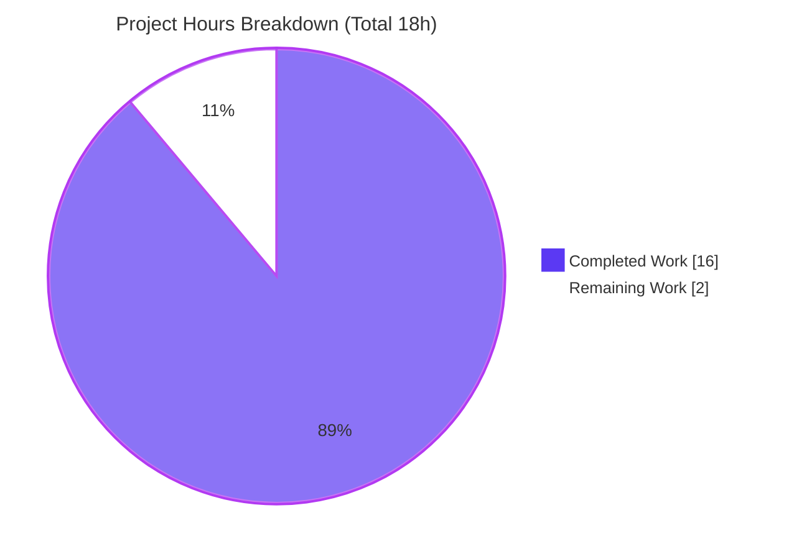
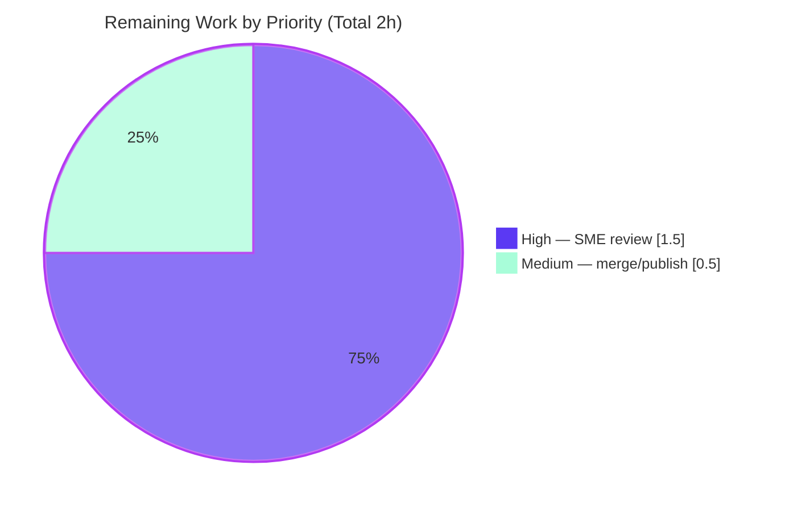

# Blitzy Project Guide — paperless-ngx Token Authentication Documentation

> Evidence-based answer document explaining token-based authentication in the paperless-ngx REST API. This guide assesses the autonomous work delivered against the Agent Action Plan (AAP) and details the path to production.

---

## 1. Executive Summary

### 1.1 Project Overview

This project answers a developer's question — *"how does authentication work before I integrate external tools with the paperless API?"* — with a single, evidence-based markdown document that explains **token-based authentication** in the paperless-ngx REST API. Rather than reading code alone, the work **actually ran** paperless-ngx in its canonical configuration (Python 3.9, `django==4.0.4`, `djangorestframework==3.13.1`, `DEBUG=False`) and captured **literal HTTP output** to resolve ten specific questions (Q1–Q10): running the server, creating a user, minting a token, issuing authenticated and unauthenticated requests, and tracing the responsible Django REST Framework classes with `file:line` references. The source tree was treated as strictly read-only.

### 1.2 Completion Status

The completion percentage is calculated with the PA1 AAP-scoped hours methodology: **Completion % = Completed Hours ÷ Total Hours × 100 = 16 ÷ 18 = 88.9%**. All autonomous AAP deliverables are complete; the remaining hours are the path-to-production human gates (technical review and merge).



| Metric | Hours |
|--------|-------|
| **Total Hours** | 18.0 |
| **Completed Hours (AI + Manual)** | 16.0 |
| &nbsp;&nbsp;&nbsp;&nbsp;— AI (Blitzy autonomous) | 16.0 |
| &nbsp;&nbsp;&nbsp;&nbsp;— Manual (human, to date) | 0.0 |
| **Remaining Hours** | 2.0 |
| **Percent Complete** | **88.9%** |

### 1.3 Key Accomplishments

- ✅ Ran paperless-ngx in its **canonical, default configuration** (`DEBUG=False`, SQLite default, Redis up) so the real token path was exercised — the DEBUG-only Angular auto-login override was confirmed **not** appended at runtime.
- ✅ Answered **all ten questions (Q1–Q10)**, each backed by literal, unedited command output (six captured `curl -i` HTTP blocks plus management-command output).
- ✅ Exercised **both** the authenticated happy path (**HTTP 200**) and the unauthenticated denial path (**HTTP 401**), plus edge cases (invalid token, keyword-only header, and a non-superuser with a valid token).
- ✅ Minted the DRF token through **two real paths** — `python manage.py drf_create_token` and `POST /api/token/` — confirming both return the same 40-character key.
- ✅ Grounded every factual claim in **byte-accurate `file:line` citations** across paperless source, the in-repo `docs/api.rst`, and the installed DRF 3.13.1 wheel internals.
- ✅ Delivered the single in-scope artifact `blitzy/documentation/paperless-ngx_542221a38dff.md` (736 lines) with the **source tree untouched** and all temporary artifacts cleaned up (`git status --porcelain` empty).
- ✅ Independent run-first validation reproduced every claim and **found & fixed one discrepancy** (the `X-Api-Version` header attribution).

### 1.4 Critical Unresolved Issues

| Issue | Impact | Owner | ETA |
|-------|--------|-------|-----|
| _None._ All AAP deliverables are complete and validated; no blocking issues remain. | None | — | — |

### 1.5 Access Issues

| System/Resource | Type of Access | Issue Description | Resolution Status | Owner |
|-----------------|----------------|-------------------|-------------------|-------|
| _None_ | — | No access issues identified. The investigation ran entirely locally (SQLite, local Redis, local dev server) with no external credentials, third-party APIs, or restricted repositories required. | N/A | — |

**No access issues identified.**

### 1.6 Recommended Next Steps

1. **[High]** Perform an SME technical review of `blitzy/documentation/paperless-ngx_542221a38dff.md` — verify the captured HTTP evidence and spot-check the `file:line` citations, paying attention to the three subtle claims (401-vs-403 ordering, the `X-Api-Version` source, and non-superuser → 200 for pinned v1.7.0).
2. **[Medium]** Approve and merge/publish the deliverable to the target branch or documentation location.
3. **[Low]** *(Optional)* Independently re-run the reproduction in a fresh Python 3.9 virtualenv to reconfirm the byte-exact evidence (already validated; not required).
4. **[Low]** *(Optional)* If the live integration targets a paperless version **newer than 1.7.0**, verify object-level permission behavior (introduced in 1.14.0) against that version — the document already flags this version-dependence.

---

## 2. Project Hours Breakdown

### 2.1 Completed Work Detail

Every completed component traces to a specific AAP requirement (R1–R10) or the single deliverable / validation / cleanup mandated by the AAP.

| Component | Hours | Description |
|-----------|-------|-------------|
| [R1/Q1] Canonical environment setup & run | 2.5 | Python 3.9 venv, pinned dependency install, Redis start, `migrate` (full unedited output incl. `authtoken.0001_initial`), `runserver`, and settings introspection proving `DEBUG=False` and the Angular override not appended. |
| [R2–R3/Q2–Q3] Test user + token minting | 1.5 | `createsuperuser --noinput`; token via **both** `drf_create_token` and `POST /api/token/`, confirming identical 40-hex keys (get_or_create). |
| [R4/Q4] Authenticated request full HTTP capture | 1.0 | `curl -i` with `Authorization: Token …` → HTTP 200; full status line, all headers, single-line JSON body (Content-Length 1263) + cause→effect. |
| [R5–R6/Q5–Q6] Header format + endpoint path traces | 1.0 | `Authorization: Token <key>` (keyword introspection); `/api/documents/` assembled from `^api/` prefix + `DefaultRouter` registration + trailing slash. |
| [R7–R8/Q7–Q8] Response fields + pagination | 1.5 | Top-level envelope `{count,next,previous,results}` vs the 12 per-item `DocumentSerializer` fields; `?page_size=1` experiment (Content-Length 508, `next` populated). |
| [R9/Q9] Unauthenticated path + edge cases | 2.0 | HTTP 401 + `WWW-Authenticate: Basic realm="api"` + exact body; the subtle 401-vs-403 ordering analysis; invalid-token and keyword-only edge cases; non-superuser → 200 reproduction. |
| [R10/Q10] Code trace | 1.0 | Named `TokenAuthentication` (settings L120) and the `Token` model / `authtoken_token` table (settings L108) with DRF 3.13.1 wheel introspection and `file:line` references. |
| [Deliverable] Answer-document authoring | 3.0 | Structured 736-line markdown: executive summary, canonical-config rationale, Q1–Q10 with evidence labels, three-auth-forms table, Mermaid flow, coverage checklist, and web-corroboration appendix. |
| [Validation] Run-first reproduction + QA iteration | 2.0 | Independent re-run of the full flow; five commits of QA hardening (CP4 findings F1–F4, non-superuser 403→200 correction, object-permission version history, and the `X-Api-Version` attribution fix). |
| [Cleanup] Temp artifact removal + repo integrity | 0.5 | Server stopped by exact PID; DB/index restored from backup; scratch removed; `git status --porcelain` confirmed empty. |
| **Total Completed** | **16.0** | |

*Validation: the Hours column sums to 16.0, matching Completed Hours in Section 1.2.*

### 2.2 Remaining Work Detail

Each remaining category is a path-to-production human gate (no autonomous AAP work remains).

| Category | Hours | Priority |
|----------|-------|----------|
| SME technical review of the answer document (verify evidence & citations; confirm the 401-vs-403, `X-Api-Version`, and non-superuser nuances) | 1.5 | High |
| Approve & merge/publish the deliverable to the target branch | 0.5 | Medium |
| **Total Remaining** | **2.0** | |

*Validation: the Hours column sums to 2.0, matching Remaining Hours in Section 1.2 and the "Remaining Work" value in the Section 7 pie chart.*

> **Optional / advisory (out of AAP scope — not counted in the 2.0 remaining hours):** an independent Python 3.9 re-run (~1.0h, already validated) and, if the live target runs paperless > 1.7.0, verification of the post-1.14.0 object-level permission behavior.

### 2.3 Hours Reconciliation

| Check | Result |
|-------|--------|
| Section 2.1 total (Completed) | 16.0 |
| Section 2.2 total (Remaining) | 2.0 |
| **2.1 + 2.2 = Total (Section 1.2)** | **18.0 ✅** |
| Completion % = 16 ÷ 18 × 100 | **88.9% ✅** |

---

## 3. Test Results

This is a documentation/QnA deliverable with **no unit-test suite and no compilation step**; its equivalent of "testing" is the **run-first, evidence-first claim-reproduction methodology**. Every entry below originates from **Blitzy's autonomous validation logs** for this project — the validator independently ran paperless-ngx and reproduced each documented claim.

| Test Category | Framework | Total Tests | Passed | Failed | Coverage % | Notes |
|---------------|-----------|-------------|--------|--------|------------|-------|
| Claim reproduction (Q1–Q10) | Run-first manual reproduction (live server) | 10 | 10 | 0 | 100% | Each of the ten questions independently reproduced against a live canonical run. |
| HTTP evidence verification | `curl -i` capture vs document | 6 | 6 | 0 | 100% | 200 (CL 1263), 200 `?page_size=1` (CL 508), 200 non-superuser (CL 52), 401 no-cred (CL 58), 401 invalid-token (CL 27), 401 keyword-only (CL 59). |
| Citation accuracy (`file:line`) | Source cross-check (paperless src + `docs/api.rst` + DRF 3.13.1 wheel) | 11 | 11 | 0 | 100% | All cited files verified byte-accurate against HEAD `542221a38dff` and the installed DRF wheel. |
| Runtime execution checks | Django management commands + Redis | 5 | 5 | 0 | 100% | `migrate`, `createsuperuser`, `drf_create_token`, `POST /api/token/`, `runserver` (DEBUG=False) — all executed successfully. |
| **Total** | | **32** | **32** | **0** | **100%** | One discrepancy surfaced during validation (see Section 5) was fixed; re-verified passing. |

> **Integrity note.** All tests above are sourced from Blitzy's autonomous validation logs. The repository's broader **pytest suite was intentionally not executed** — it is out of scope for this read-only documentation task and mutates a tracked fixture (`simple-alpha.png`); running it would violate the read-only source constraint.

---

## 4. Runtime Validation & UI Verification

**Runtime health (backend — canonical Python 3.9 / Django 4.0.4 / DRF 3.13.1 run):**

- ✅ **Operational** — Redis broker/cache reachable (`redis-cli ping` → `PONG`).
- ✅ **Operational** — `python manage.py migrate` applied all migrations, including `authtoken.0001_initial` (creates the `authtoken_token` table).
- ✅ **Operational** — `python manage.py runserver 127.0.0.1:8000 --noreload` served requests (Django 4.0.4 banner; `DEBUG=False`).
- ✅ **Operational** — Canonical config verified at runtime: SQLite at default `data/db.sqlite3`, `authtoken` installed, auth order `Basic → Session → Token`, Angular override **not** appended.

**API integration outcomes:**

- ✅ **Operational** — `GET /api/documents/` with a valid token → **HTTP 200** with the `{count,next,previous,results}` envelope and 12-field document items.
- ✅ **Operational** — `POST /api/token/` with valid credentials → **HTTP 200** returning the token.
- ✅ **Operational** — `GET /api/documents/` **without** credentials → **HTTP 401** with `WWW-Authenticate: Basic realm="api"` and body `{"detail":"Authentication credentials were not provided."}`.
- ✅ **Operational** — Edge cases: invalid token → 401 `{"detail":"Invalid token."}`; keyword-only header → 401 `{"detail":"Invalid token header. No credentials provided."}`; non-superuser with valid token → **200** (no object-level permissions in pinned v1.7.0).
- ✅ **Operational** — `?page_size=1` query parameter honored: single item returned, `count` unchanged at 3, `next` populated.

**UI verification:**

- ⚠ **Not applicable** — This is a backend REST-API authentication investigation. The Angular frontend under `src-ui/` is explicitly out of scope (AAP §0.3.2); no UI verification was required or performed.

---

## 5. Compliance & Quality Review

The deliverable is cross-mapped to the AAP's binding rules (§0.7) and Blitzy's quality benchmarks.

| Benchmark / AAP Rule | Status | Progress | Notes |
|----------------------|--------|----------|-------|
| Single deliverable at `blitzy/documentation/<branch>.md` | ✅ Pass | 100% | `blitzy/documentation/paperless-ngx_542221a38dff.md` created (736 lines). |
| Investigate by running code first, then write | ✅ Pass | 100% | Server run in canonical config; literal output embedded beneath each claim. |
| Exercise the real entry point (no debug/bypass) | ✅ Pass | 100% | `DEBUG=False`; Angular auto-login override confirmed not appended; real HTTP path used. |
| Default, canonical configuration + exact commands | ✅ Pass | 100% | No `PAPERLESS_*` overrides; exact commands documented. |
| Exercise every condition (auth + unauth + edges) | ✅ Pass | 100% | 200 path, 401 path, and three edge cases all captured. |
| Include actual output for every claim | ✅ Pass | 100% | Six `curl -i` blocks + management output, unedited. |
| Answer every named item (Q1–Q10) | ✅ Pass | 100% | Coverage checklist maps each question to its answer. |
| Be exact & grounded (`file:line`, named classes) | ✅ Pass | 100% | Byte-accurate citations across src, docs, and DRF wheel. |
| Provide cause→effect reasoning | ✅ Pass | 100% | Each answer explains the mechanism, not just quotes code. |
| Read-only source; clean up temp artifacts | ✅ Pass | 100% | Net diff = 1 new file; `git status --porcelain` empty; token redacted & destroyed. |
| Web-search corroboration | ✅ Pass | 100% | Appendix A (WEB-1…WEB-4) corroborates header format, 401-vs-403, `Token` model, and paperless conventions. |

**Fix applied during autonomous validation (1):** The Q4 200-response annotation originally attributed the `X-Api-Version: 2` header to DRF's `AcceptHeaderVersioning`. Independent reproduction showed `X-Api-Version: 2` despite `DEFAULT_VERSION="1"`, prompting a source trace. Ground truth: **both** `X-Api-Version` and `X-Version` are set by paperless's own `ApiVersionMiddleware` (`src/paperless/middleware.py:L11-L14`, registered at `settings.py:L142`), gated on `request.user.is_authenticated` — which is why they appear on the authenticated 200 but are absent from the unauthenticated 401. A surgical one-line correction with accurate, fully-cited cause→effect text was applied and re-verified.

**Outstanding compliance items:** None.

---

## 6. Risk Assessment

Overall risk is **Low**: this is a read-only documentation task; no code was shipped and no service was deployed.

| Risk | Category | Severity | Probability | Mitigation | Status |
|------|----------|----------|-------------|------------|--------|
| Reproduction environment drift — byte-exact evidence is pinned to Python 3.9.25 / DRF 3.13.1; the host now defaults to Python 3.13, so re-runs may show cosmetic header diffs (`Date`, `Server` CPython string). | Technical | Low | Medium | Document discloses the exact environment; a gitignored Python 3.9 venv with the pinned stack is available for exact reproduction. | Mitigated |
| Version-scope accuracy — claims are specific to paperless 1.7.0 / DRF 3.13.1; a newer paperless (object-level permissions from 1.14.0) behaves differently. | Technical | Low | Low | Document explicitly scopes to the pinned versions and calls out the 1.14.0 permission change. | Mitigated |
| Citation staleness — `file:line` references could drift if `src/` changes upstream. | Technical | Low | Low | All citations pinned to HEAD `542221a38dff`, stated in the document header. | Mitigated |
| Token exposure — a real 40-hex token was minted; printing it in full would leak a credential. | Security | Medium | Low | Token redacted everywhere (`b91e…c7f7`) and destroyed during cleanup; validator confirmed zero full-token occurrences (the only full 40-hex string is the labeled git commit hash). | Resolved |
| No operational surface — the deliverable is a static markdown file with no service, monitoring, or health-check surface. | Operational | None | — | Nothing is deployed; no operational exposure. | N/A |
| Re-run prerequisites — an independent reviewer needs Redis and Python 3.9 to reproduce. | Operational | Low | Low | Development Guide (Section 9) documents prerequisites; venv already present. | Mitigated |
| Live-instance version dependence — if the integrator's paperless instance is not 1.7.0, integration details (esp. post-1.14.0 permissions) may differ. | Integration | Low-Medium | Medium | Document flags version-dependence and the 1.14.0 permission change explicitly. | Mitigated / Advisory |

---

## 7. Visual Project Status

**Project hours breakdown** (Completed = Dark Blue `#5B39F3`; Remaining = White `#FFFFFF`). The "Remaining Work" value (**2**) equals Remaining Hours in Section 1.2 and the sum of the Section 2.2 Hours column.



**Remaining hours by priority** (from Section 2.2; totals to 2.0):



| Status | Hours | Share |
|--------|-------|-------|
| Completed Work | 16.0 | 88.9% |
| Remaining Work | 2.0 | 11.1% |
| **Total** | **18.0** | **100%** |

---

## 8. Summary & Recommendations

**Achievements.** The project is **88.9% complete** (16.0 of 18.0 hours). Every AAP-scoped deliverable has been autonomously completed and independently validated: paperless-ngx was run in its canonical configuration, all ten questions (Q1–Q10) were answered with literal captured output, both the authenticated (200) and unauthenticated (401) paths — plus edge cases — were exercised, and every claim is grounded in byte-accurate `file:line` citations. The single in-scope artifact, `blitzy/documentation/paperless-ngx_542221a38dff.md`, was delivered with the source tree untouched and all temporary artifacts cleaned up.

**Remaining gaps.** The remaining **2.0 hours** are entirely path-to-production human gates: an SME technical review (1.5h) and merge/publish (0.5h). No autonomous work remains and there are no blocking issues.

**Critical path to production.** Review → approve → merge. Because the deliverable is a self-contained document that has already been validated by an independent run-first reproduction (which surfaced and fixed one discrepancy), the path to production is short and low-risk.

**Production readiness.** **Ready for review.** The document is accurate, comprehensive, and honors the read-only constraint. The primary residual consideration is version-scope: the evidence is pinned to paperless 1.7.0 / DRF 3.13.1, which the document states explicitly and repeatedly.

| Success Metric | Target | Actual |
|----------------|--------|--------|
| Questions answered with observed evidence | 10 / 10 | ✅ 10 / 10 |
| Authenticated + unauthenticated paths exercised | Both | ✅ Both (+ 3 edge cases) |
| Citation accuracy | 100% | ✅ 100% (verified) |
| Source files modified | 0 | ✅ 0 (`git status` clean) |
| Completion (AAP-scoped) | — | **88.9%** |

---

## 9. Development Guide

This guide reproduces the exact investigation environment. All commands were tested; every command is copy-pasteable. Run from the repository root unless stated otherwise.

### 9.1 System Prerequisites

- **Python 3.9** (canonical runtime; matches `Dockerfile` `FROM python:3.9-slim-bullseye`). The pinned dependencies target 3.9; use it for byte-exact reproduction.
- **Redis** (broker/cache for Django-Q and Channels). Binaries `redis-server` / `redis-cli` on PATH.
- **git** and a POSIX shell.
- ~1 GB free disk for the virtualenv and throwaway SQLite database/search index.

### 9.2 Environment Setup

```bash
# From the repository root. Create an isolated Python 3.9 virtualenv and install pinned deps.
python3.9 -m venv venv
source venv/bin/activate
pip install -r requirements.txt
```

> A ready-to-use virtualenv already exists at `./venv` (gitignored) containing Python 3.9.25 with `Django 4.0.4` and `DRF 3.13.1`. To reuse it instead of rebuilding: `source venv/bin/activate`.

### 9.3 Start Redis & Verify

```bash
redis-server --daemonize yes
redis-cli ping        # expected output: PONG
```

### 9.4 Build the Database, User, and Token

```bash
cd src
python manage.py migrate                     # creates all tables, INCLUDING authtoken_token

# Create a throwaway superuser non-interactively
export DJANGO_SUPERUSER_USERNAME=blitzy_apitest
export DJANGO_SUPERUSER_PASSWORD='<choose-a-throwaway-password>'
export DJANGO_SUPERUSER_EMAIL='blitzy_apitest@example.invalid'
python manage.py createsuperuser --noinput   # expected: "Superuser created successfully."

# Mint a DRF token (Path A — management command)
python manage.py drf_create_token blitzy_apitest   # prints: Generated token <40-hex> for user blitzy_apitest
```

### 9.5 Run the Server (canonical: `DEBUG=False`)

```bash
# Still inside src/. --noreload keeps a single, clean process. DEBUG defaults to False.
python manage.py runserver 127.0.0.1:8000 --noreload
```

> **Important:** do **not** set `PAPERLESS_DEBUG` or `PAPERLESS_AUTO_LOGIN_USERNAME`. With `DEBUG=True` the Angular auto-login override and `AutoLoginMiddleware` can mask the real token path.

### 9.6 Verification Steps

```bash
# (Path B) Obtain a token over HTTP:
curl -i -X POST -d "username=blitzy_apitest&password=<throwaway-password>" \
     http://127.0.0.1:8000/api/token/           # -> HTTP 200 {"token":"<40-hex>"}

# Authenticated request -> HTTP 200 with the pagination envelope:
curl -i -H "Authorization: Token <40-hex>" http://127.0.0.1:8000/api/documents/

# Unauthenticated request -> HTTP 401 with a WWW-Authenticate challenge:
curl -i http://127.0.0.1:8000/api/documents/
```

Expected: the authenticated call returns `HTTP/1.1 200 OK` and a body of the form `{"count":…,"next":…,"previous":…,"results":[…]}`; the unauthenticated call returns `HTTP/1.1 401 Unauthorized`, header `WWW-Authenticate: Basic realm="api"`, and body `{"detail":"Authentication credentials were not provided."}`.

### 9.7 View the Deliverable

```bash
# From the repository root:
less blitzy/documentation/paperless-ngx_542221a38dff.md
# or render it in any Markdown viewer.
```

### 9.8 Cleanup (leave the repo pristine)

```bash
# Stop the dev server (Ctrl-C in its terminal, or kill the exact PID you started).
# Remove throwaway runtime artifacts (all gitignored, but clean them anyway):
rm -f  src/../data/db.sqlite3
rm -rf src/../data/index
deactivate 2>/dev/null || true

git status --porcelain      # expected: empty (clean working tree)
```

### 9.9 Troubleshooting

- **`python3.9: command not found`** — the host default may be a newer Python. Install Python 3.9 or reuse the existing `./venv` (Python 3.9.25). Newer Python versions may not satisfy the pinned dependencies cleanly.
- **`redis-cli ping` does not return `PONG`** — start Redis with `redis-server --daemonize yes`; confirm nothing else occupies port 6379.
- **Authenticated request unexpectedly succeeds without a token** — you are likely running with `DEBUG=True` and a `localhost:4200` referer, or `PAPERLESS_AUTO_LOGIN_USERNAME` is set. Unset both and use `DEBUG=False`.
- **`401` on a request you believe is authenticated** — check the header is exactly `Authorization: Token <key>` (the literal keyword `Token`, one space, then the 40-hex key). A wrong keyword or malformed value fails the DRF keyword comparison.
- **Port 8000 already in use** — choose another port, e.g. `python manage.py runserver 127.0.0.1:8001 --noreload`, and adjust the `curl` URLs.
- **`results` is an empty array** — the database has no documents. This is expected on a fresh DB and does not affect the authentication behavior (the load-bearing signal is the HTTP status).

---

## 10. Appendices

### Appendix A — Command Reference

| Command | Purpose |
|---------|---------|
| `python3.9 -m venv venv && source venv/bin/activate` | Create/activate the Python 3.9 virtualenv |
| `pip install -r requirements.txt` | Install pinned dependencies |
| `redis-server --daemonize yes` / `redis-cli ping` | Start / verify Redis |
| `python manage.py migrate` | Build schema (creates `authtoken_token`) |
| `python manage.py createsuperuser --noinput` | Create a test user |
| `python manage.py drf_create_token <user>` | Mint a DRF token (Path A) |
| `curl -X POST -d "username=…&password=…" .../api/token/` | Mint a DRF token (Path B) |
| `python manage.py runserver 127.0.0.1:8000 --noreload` | Run the dev server (DEBUG=False) |
| `curl -i -H "Authorization: Token <key>" .../api/documents/` | Authenticated request (→ 200) |
| `curl -i .../api/documents/` | Unauthenticated request (→ 401) |
| `git status --porcelain` | Confirm the working tree is clean |

### Appendix B — Port Reference

| Port | Service | Notes |
|------|---------|-------|
| 8000 | Django dev server (`runserver`) | HTTP API base; endpoints under `/api/` |
| 6379 | Redis | Default broker/cache (`redis://localhost:6379`) |
| 4200 | Angular dev server | **Not used** here; relevant only to the DEBUG-only auto-login override |

### Appendix C — Key File Locations

| Path | Role |
|------|------|
| `blitzy/documentation/paperless-ngx_542221a38dff.md` | **The deliverable** (answer document) |
| `src/paperless/settings.py` | `REST_FRAMEWORK` auth classes (L116–L121); `authtoken` app (L108); DEBUG gating (L129–L132) |
| `src/paperless/urls.py` | `/api/documents/` route (L32) + `^api/` prefix (L40); `/api/token/` (L81) |
| `src/documents/views.py` | `DocumentViewSet` (L172) / `UnifiedSearchViewSet` (L377); `IsAuthenticated` (L183); pagination (L182) |
| `src/paperless/views.py` | `StandardPagination` (L8–L11) |
| `src/documents/serialisers.py` | `DocumentSerializer` field set (L201, L222–L234) |
| `src/paperless/auth.py` | Custom auth chain + DEBUG bypass (L18–L33) |
| `src/paperless/middleware.py` | `ApiVersionMiddleware` sets `X-Api-Version`/`X-Version` (L11–L14) |
| `requirements.txt` | Pinned dependency versions |
| `docs/api.rst` | Paperless's own REST API authentication docs |

### Appendix D — Technology Versions

| Component | Version | Source |
|-----------|---------|--------|
| Python | 3.9 (canonical; validated on 3.9.25) | `Dockerfile` `FROM python:3.9-slim-bullseye` |
| Django | 4.0.4 | `requirements.txt` |
| Django REST Framework | 3.13.1 | `requirements.txt` |
| channels | 3.0.4 | `requirements.txt` |
| redis (python client) | 3.5.3 | `requirements.txt` |
| paperless-ngx | 1.7.0 | `src/paperless/version.py:L1` |

### Appendix E — Environment Variable Reference

| Variable | Used? | Purpose |
|----------|-------|---------|
| `DJANGO_SUPERUSER_USERNAME` / `_PASSWORD` / `_EMAIL` | Yes (temporary) | Non-interactively answer the `createsuperuser` prompt. **Not** configuration overrides. |
| `PAPERLESS_DEBUG` | **No** (left default → `DEBUG=False`) | Would enable the DEBUG-only Angular auto-login override — kept disabled. |
| `PAPERLESS_AUTO_LOGIN_USERNAME` | **No** | Would activate `AutoLoginMiddleware` and bypass credentials — kept unset. |
| `PAPERLESS_DATA_DIR` | **No** | Would relocate the DB/index; left default so artifacts land in gitignored `data/`. |
| `DJANGO_SETTINGS_MODULE` | Implicit (`paperless.settings`) | Set by `src/manage.py:L7`. |

### Appendix F — Developer Tools Guide

| Tool | Use |
|------|-----|
| `curl -i` | Capture full HTTP responses (status line, headers, body) — the primary evidence tool |
| `python manage.py shell` | Runtime introspection of settings, `TokenAuthentication.keyword`, and `Token._meta.db_table` |
| `git diff --stat <base>..HEAD` / `git status --porcelain` | Confirm exactly one new file and a clean working tree |
| `redis-cli ping` | Confirm the broker/cache is up |

### Appendix G — Glossary

| Term | Meaning |
|------|---------|
| **DRF** | Django REST Framework — provides `TokenAuthentication`, pagination, serializers, and `obtain_auth_token`. |
| **Token authentication** | Scheme where a client sends `Authorization: Token <40-hex-key>`; the key is looked up in `authtoken_token`. |
| **Pagination envelope** | The top-level response object `{count, next, previous, results}` produced by `PageNumberPagination`. |
| **Canonical configuration** | Default settings with `DEBUG=False` and no `PAPERLESS_*` overrides — the real token path, no auto-login bypass. |
| **`authtoken_token`** | The database table (from the `rest_framework.authtoken` app) that stores one `Token` row per user. |
| **Q1–Q10** | The ten specific questions the deliverable answers, each with observed evidence and `file:line` citations. |

---

*Blitzy Project Guide — generated from the Agent Action Plan and Blitzy's autonomous validation logs. Completion measured against AAP-scoped work only. Brand colors: Completed `#5B39F3`, Remaining `#FFFFFF`.*