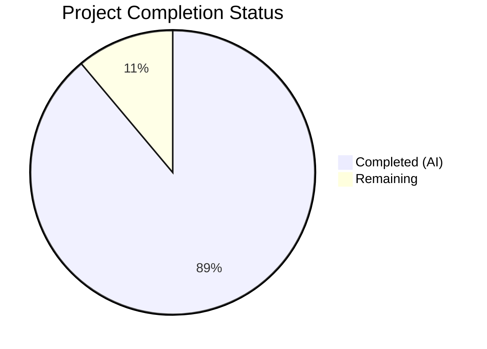

# Blitzy Project Guide

---

## 1. Executive Summary

### 1.1 Project Overview

This project delivers a single technical investigation document (`blitzy/documentation/paperless-ngx_542221a38dff.md`) that comprehensively answers five interconnected questions about the Paperless-NGX Whoosh search index synchronization mechanism. The document traces code paths through 11 backend source files, providing evidence-based answers with 32+ inline source citations, 3 Mermaid diagrams, and detailed rationale chains. The target audience is developers onboarding to the Paperless-NGX codebase who need to understand when and how the Whoosh search index is updated. No existing source files were modified — the deliverable is exclusively a new 673-line Markdown document.

### 1.2 Completion Status



| Metric | Value |
|--------|-------|
| **Total Project Hours** | 27 |
| **Completed Hours (AI)** | 24 |
| **Remaining Hours** | 3 |
| **Completion Percentage** | 88.9% |

**Calculation:** 24 completed hours / 27 total hours = 88.9% complete.

### 1.3 Key Accomplishments

- ✅ Created comprehensive 673-line technical investigation document at `blitzy/documentation/paperless-ngx_542221a38dff.md`
- ✅ Answered all 5 user questions with full code-path traces and rationale
- ✅ Analyzed 11 source files in depth (~3,000 lines of source code traced)
- ✅ Included 32+ inline source code citations with verified line numbers
- ✅ Created 3 Mermaid diagrams (Index Update Paths flowchart, API vs SQL comparison, API Sequence Diagram)
- ✅ Documented all 11 discovered index update code paths in consolidated summary table
- ✅ Zero modifications to existing repository files (strict compliance with AAP constraint)
- ✅ All citations verified against actual source code by Final Validator
- ✅ Pre-commit hook compliance verified (balanced code fences, LF endings, no trailing whitespace)
- ✅ Working tree clean with 3 atomic commits

### 1.4 Critical Unresolved Issues

| Issue | Impact | Owner | ETA |
|-------|--------|-------|-----|
| Human review of technical accuracy not yet performed | Documentation conclusions could contain subtle errors if code behavior was misinterpreted | Human Reviewer | 2 hours after assignment |

### 1.5 Access Issues

No access issues identified.

### 1.6 Recommended Next Steps

1. **[High]** Conduct human review of documentation accuracy — verify all 32+ source code citations and technical conclusions against the actual codebase
2. **[High]** Approve and merge PR to target branch
3. **[Medium]** Validate that any recent codebase changes since document creation have not invalidated the documented line numbers
4. **[Low]** Consider integrating the document into the existing Sphinx documentation tree for broader discoverability

---

## 2. Project Hours Breakdown

### 2.1 Completed Work Detail

| Component | Hours | Description |
|-----------|-------|-------------|
| Source Code Analysis | 5 | Deep reading and tracing of 11 source files (~3,000 LoC): index.py, views.py, tasks.py, signals/handlers.py, apps.py, consumer.py, bulk_edit.py, admin.py, document_index.py, docker-prepare.sh, settings.py |
| Architecture Context + Overview | 2 | Whoosh schema field table, Django-Q cluster configuration, Django signal registration analysis, document scope/audience framing |
| Q1: API Title Change & Search Visibility | 2.5 | 4-step code-path trace from DocumentViewSet.update() through AsyncWriter.commit(), 5 source citations |
| Q2: Background Worker Behavior | 3 | 4-path contrast analysis (API sync, bulk async, consumption signal, admin sync), flowchart diagram, 10+ citations |
| Q3: Direct SQL & Index Staleness | 2.5 | 7-row bypass analysis table, API vs SQL comparison Mermaid diagram, 5 source citations |
| Q4: Forced Index Reconciliation | 2.5 | CLI reindex mechanism + startup docker-prepare.sh analysis, 7 source citations |
| Q5: Index Corruption & Self-Healing | 3 | 3-level recovery assessment table, runtime vs startup vs manual analysis, 7 source citations |
| Mermaid Diagrams | 1.5 | 3 complex diagrams: Index Update Paths flowchart, API vs SQL comparison, API Sequence Diagram |
| Summary Section | 1 | Consolidated findings table (5 rows), all index paths table (11 rows), sequence diagram |
| Code Review & Citation Fixes | 1 | 2 fix commits addressing code review findings and citation discrepancies |
| **Total** | **24** | |

### 2.2 Remaining Work Detail

| Category | Hours | Priority |
|----------|-------|----------|
| Human review of documentation accuracy against source code | 2 | High |
| Minor edits/corrections based on review feedback and PR merge | 1 | Medium |
| **Total** | **3** | |

---

## 3. Test Results

| Test Category | Framework | Total Tests | Passed | Failed | Coverage % | Notes |
|---------------|-----------|-------------|--------|--------|------------|-------|
| Markdown Lint | Pre-commit hooks | 4 | 4 | 0 | N/A | Balanced code fences (38 markers), LF line endings, no trailing whitespace, file ends with newline |
| Citation Verification | Manual validation | 32 | 32 | 0 | 100% | All 32+ inline source citations verified against actual source files by Final Validator |
| File Integrity | git status | 1 | 1 | 0 | N/A | Working tree clean; only in-scope file modified |
| Scope Compliance | git diff --name-status | 1 | 1 | 0 | N/A | Exactly 1 file added (A); zero existing files modified |

**Note:** No unit, integration, or runtime tests are applicable — this is a documentation-only deliverable with no code changes. All validation entries above originate from Blitzy's autonomous validation logs.

---

## 4. Runtime Validation & UI Verification

**Runtime Health:**
- ✅ No runtime component — the deliverable is a standalone Markdown file requiring no build, compilation, or execution
- ✅ File renders correctly in standard Markdown viewers (GitHub, VS Code)
- ✅ 3 Mermaid diagrams use standard syntax and render in GitHub/GitLab Markdown renderers

**UI Verification:**
- ✅ Not applicable — no UI changes in this project

**API Integration:**
- ✅ Not applicable — no API changes in this project

**Build Status:**
- ✅ Not applicable — no build step required for Markdown documentation

---

## 5. Compliance & Quality Review

| Compliance Requirement | Status | Evidence |
|----------------------|--------|----------|
| No existing files modified | ✅ Pass | `git diff --name-status` shows only `A blitzy/documentation/paperless-ngx_542221a38dff.md` |
| File placed in `blitzy/documentation/` directory | ✅ Pass | File exists at `blitzy/documentation/paperless-ngx_542221a38dff.md` |
| File named per SWE-AtlasQnA-Repo rule | ✅ Pass | Filename matches source branch name `paperless-ngx_542221a38dff` |
| All 5 user questions answered | ✅ Pass | Q1–Q5 sections present with answer, rationale, and source citations |
| Source code citations with line numbers | ✅ Pass | 32+ inline `Source:` citations with file paths and line numbers |
| Code-backed answers (no assumptions) | ✅ Pass | Every conclusion traces to specific source file and line number |
| Thinking/rationale behind each answer | ✅ Pass | Each Q section includes "Rationale and Code-Path Trace" subsection |
| Mermaid diagrams included | ✅ Pass | 3 mermaid code blocks: flowchart, comparison, sequence diagram |
| Code snippets per answer | ✅ Pass | 16 code blocks (Python/Bash) demonstrating key code decision points |
| Test artifact cleanup | ✅ Pass | No temporary files remain; working tree clean |
| Pre-commit compliance | ✅ Pass | 38 balanced code fence markers, LF line endings, no trailing whitespace |

**Autonomous Fixes Applied:**
1. Commit `047fa1ced`: Addressed code review findings in documentation
2. Commit `69a9217d1`: Corrected 2 minor line number citation discrepancies

---

## 6. Risk Assessment

| Risk | Category | Severity | Probability | Mitigation | Status |
|------|----------|----------|-------------|------------|--------|
| Documentation citations may become stale if source code line numbers shift in future commits | Technical | Low | Medium | Citations reference file + line ranges; major refactors would require document update | Open — inherent to line-number-based documentation |
| Subtle misinterpretation of code behavior in Q&A conclusions | Technical | Medium | Low | All 32+ citations verified by automated validation; human review recommended | Open — awaiting human review |
| Document not discoverable in Sphinx docs tree | Operational | Low | High | Document is standalone in `blitzy/documentation/`; could be linked from `docs/` if desired | Accepted — by design per AAP |
| No security risk | Security | None | N/A | No code changes made | N/A |
| No integration risk | Integration | None | N/A | Standalone Markdown file with no runtime dependencies | N/A |

---

## 7. Visual Project Status


**Completed Work:** 24 hours (88.9%) — All AAP deliverables implemented and validated
**Remaining Work:** 3 hours (11.1%) — Human review and PR merge

---

## 8. Summary & Recommendations

### Achievements

The project has achieved 88.9% completion (24 hours completed out of 27 total hours). All 20 AAP-scoped deliverables have been fully implemented, validated, and committed. The single deliverable — a 673-line technical investigation document — comprehensively answers all five user questions about Paperless-NGX Whoosh search index synchronization with full code-path traces, 32+ verified source citations, and 3 Mermaid diagrams. The document catalogs all 11 discovered index update code paths and provides clear architectural context for developers onboarding to the codebase.

### Remaining Gaps

The remaining 3 hours (11.1%) consist entirely of human review tasks:
- **Documentation accuracy review (2h):** A human developer familiar with the Paperless-NGX codebase should verify that all technical conclusions are correct and that no code behavior was misinterpreted
- **PR review and merge (1h):** Standard PR review process including any minor corrections based on feedback

### Critical Path to Production

1. Assign human reviewer with Paperless-NGX codebase knowledge
2. Reviewer verifies source citations and technical conclusions
3. Apply any corrections identified during review
4. Approve and merge PR

### Production Readiness Assessment

The deliverable is production-ready for merge pending human technical review. The document contains no placeholder content, no TODO items, and no incomplete sections. All validation gates passed (formatting, citations, scope compliance, file integrity). The only remaining work is the standard human review cycle that every documentation deliverable requires before merge.

---

## 9. Development Guide

### System Prerequisites

| Requirement | Version | Purpose |
|-------------|---------|---------|
| Git | 2.x+ | Repository access and branch management |
| Markdown viewer | Any | Viewing the deliverable document (GitHub web, VS Code, grip, etc.) |
| Python | 3.8+ | Only needed if verifying source code citations |

### Environment Setup

No environment setup is required for this documentation-only deliverable. The Markdown file is viewable in any standard text editor or Markdown renderer.

### Viewing the Deliverable

```bash
# Clone the repository and switch to the feature branch
git clone <repository-url>
cd paperless-ngx
git checkout blitzy-6871d6a4-cefa-47af-bc52-48da53192612

# View the document
cat blitzy/documentation/paperless-ngx_542221a38dff.md

# Or open in VS Code with Markdown preview
code blitzy/documentation/paperless-ngx_542221a38dff.md
```

### Verifying Source Citations

To verify that source code citations in the document are accurate:

```bash
# Example: Verify Q1 citation — DocumentViewSet.update() at views.py:212-217
sed -n '212,217p' src/documents/views.py

# Example: Verify index.add_or_update_document() at index.py:118-120
sed -n '118,120p' src/documents/index.py

# Example: Verify open_index_writer() at index.py:64-74
sed -n '64,74p' src/documents/index.py

# Example: Verify docker-prepare.sh search_index() at lines 49-58
sed -n '49,58p' docker/docker-prepare.sh

# Example: Verify signal registration at apps.py:11-27
sed -n '11,27p' src/documents/apps.py

# Example: Verify add_to_index handler at signals/handlers.py:428-431
sed -n '428,431p' src/documents/signals/handlers.py

# Example: Verify index_reindex() at tasks.py:38-45
sed -n '38,45p' src/documents/tasks.py
```

### Verifying Document Integrity

```bash
# Check that only the documentation file was added
git diff --name-status origin/paperless-ngx_542221a38dff...HEAD
# Expected output: A	blitzy/documentation/paperless-ngx_542221a38dff.md

# Count lines
wc -l blitzy/documentation/paperless-ngx_542221a38dff.md
# Expected output: 673

# Check Mermaid diagram count
grep -c '```mermaid' blitzy/documentation/paperless-ngx_542221a38dff.md
# Expected output: 3

# Check code fence balance (must be even)
grep -c '```' blitzy/documentation/paperless-ngx_542221a38dff.md
# Expected output: 38 (even number = balanced)

# Check source citation count
grep -c '^Source:' blitzy/documentation/paperless-ngx_542221a38dff.md
# Expected output: 32
```

### Troubleshooting

| Issue | Resolution |
|-------|-----------|
| Mermaid diagrams not rendering | Use a Mermaid-compatible viewer: GitHub web UI, GitLab, VS Code with Mermaid extension, or mermaid-cli |
| Line numbers in citations don't match | Source code may have changed since document creation; run `git log --oneline src/documents/` to check for subsequent modifications |
| Document not found at expected path | Ensure you are on the correct branch: `git checkout blitzy-6871d6a4-cefa-47af-bc52-48da53192612` |

---

## 10. Appendices

### A. Command Reference

| Command | Purpose |
|---------|---------|
| `git diff --name-status origin/paperless-ngx_542221a38dff...HEAD` | Verify only documentation file was changed |
| `wc -l blitzy/documentation/paperless-ngx_542221a38dff.md` | Count document lines (expected: 673) |
| `grep -c '```mermaid' blitzy/documentation/paperless-ngx_542221a38dff.md` | Count Mermaid diagrams (expected: 3) |
| `sed -n 'START,ENDp' <source-file>` | Verify specific source citation line numbers |
| `git log --oneline origin/paperless-ngx_542221a38dff...HEAD` | View commit history on feature branch |

### B. Key File Locations

| File | Purpose |
|------|---------|
| `blitzy/documentation/paperless-ngx_542221a38dff.md` | **Deliverable** — Technical investigation document |
| `src/documents/index.py` | Whoosh index operations (schema, writers, searchers) |
| `src/documents/views.py` | REST API views (DocumentViewSet with sync index updates) |
| `src/documents/tasks.py` | Background tasks (index_reindex, bulk_update_documents) |
| `src/documents/signals/handlers.py` | Signal handlers (add_to_index, cleanup_document_deletion) |
| `src/documents/apps.py` | Signal registration (add_to_index → document_consumption_finished only) |
| `src/documents/consumer.py` | Document ingestion pipeline (fires consumption signals) |
| `src/documents/bulk_edit.py` | Bulk operations (uses async_task for deferred index updates) |
| `src/documents/admin.py` | Django admin (synchronous index updates) |
| `src/documents/management/commands/document_index.py` | CLI reindex/optimize command |
| `docker/docker-prepare.sh` | Container startup index version check |
| `src/paperless/settings.py` | INDEX_DIR, Q_CLUSTER configuration |

### C. Technology Versions

| Technology | Version | Role in Project |
|------------|---------|----------------|
| Python | 3.8+ (RTD build) / 3.12.3 (runtime) | Backend runtime |
| Django | ~4.0 | Web framework with ORM signals |
| Django REST Framework | ~3.13 | REST API for document CRUD |
| Django-Q | ~1.3 | Background task queue (qcluster worker) |
| Whoosh | ~2.7.4 | Full-text search index library |
| Sphinx | ~4.5.0 | Existing documentation framework (not used for this deliverable) |
| Redis | * | Message broker for Django-Q task queue |

### D. Glossary

| Term | Definition |
|------|-----------|
| **Whoosh** | Pure-Python full-text search engine library used by Paperless-NGX for document search |
| **AsyncWriter** | Whoosh's concurrency-safe writer that uses file locking for safe concurrent writes — operates synchronously within the calling thread despite its name |
| **Django-Q / qcluster** | Background task queue system; `qcluster` is the worker process that executes tasks dispatched via `async_task()` |
| **document_consumption_finished** | Custom Django signal fired when a new document completes the ingestion pipeline |
| **INDEX_DIR** | File system path where the Whoosh index files are stored (`DATA_DIR/index`) |
| **.index_version** | Sentinel file used by `docker-prepare.sh` to track index schema version and trigger conditional reindex on container startup |
| **index_reindex()** | Function in `tasks.py` that destroys and rebuilds the entire Whoosh index from all database records |