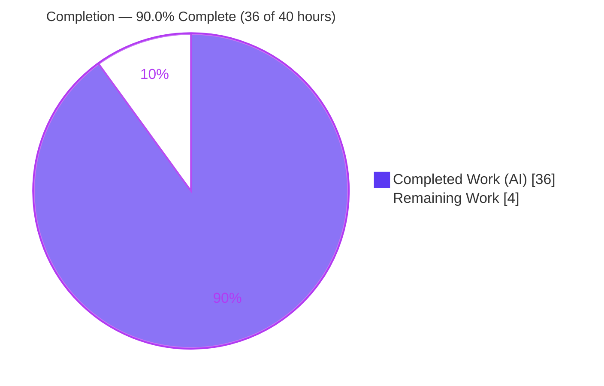
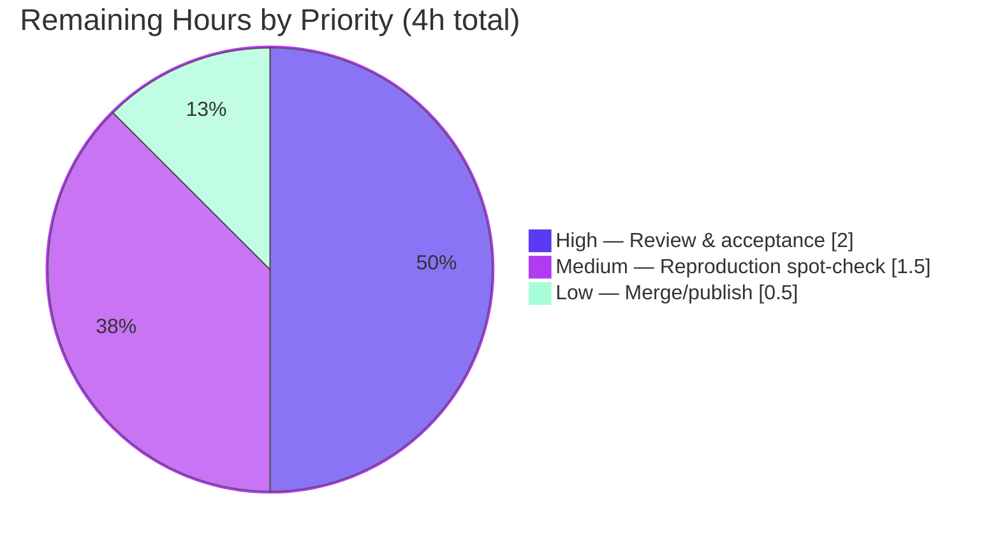

# Blitzy Project Guide — Paperless-NGX Idle-Runtime Behavior Investigation

> **Deliverable class:** Read-only runtime investigation → single Markdown answer document
> **Target commit:** `542221a38dff06361e07976452f9aea24d210542` (Paperless-NGX v1.7.0)
> **Branch:** `blitzy-b93ad39d-31a7-4948-b7ce-6fd58acf491d`
> **Brand legend:** <span style="color:#5B39F3">■</span> Completed / AI Work = Dark Blue `#5B39F3` · □ Remaining = White `#FFFFFF`

---

## 1. Executive Summary

### 1.1 Project Overview

This project empirically investigates and documents the **steady-state (idle) runtime behavior** of Paperless-NGX at commit `542221a38dff`. It is a read-only investigation: the system is booted in its canonical Docker configuration (Python 3.9 / Redis 6.0), left to settle into an idle-but-ready state, observed for over 20 minutes, and subjected to a Redis interrupt/restart. The sole artifact is one Markdown answer document that resolves five named questions — startup (Q1), idle background work (Q2), periodic health/ready logs (Q3), interrupt/restart recovery (Q4), and continuously-running components (Q5) — with actual captured log output, measured cadences, and `[path:line]` citations. Target audience: engineers operating or debugging Paperless-NGX idle behavior. Zero source files were modified.

### 1.2 Completion Status

The completion percentage is computed with the AAP-scoped, hours-based PA1 methodology: all autonomous investigation, authoring, and validation work is complete; the remaining hours are the human path-to-production for a documentation artifact (review, reproduction spot-check, merge).



| Metric | Hours |
|---|---|
| **Total Hours** | 40.0 |
| **Completed Hours (AI + Manual)** | 36.0 (AI 36.0 + Manual 0.0) |
| **Remaining Hours** | 4.0 |
| **Percent Complete** | **90.0%** |

> **Calculation:** Completion % = Completed ÷ (Completed + Remaining) = 36.0 ÷ (36.0 + 4.0) = 36.0 ÷ 40.0 = **90.0%**.

### 1.3 Key Accomplishments

- ✅ Canonical stack **built and run** at commit `542221a38dff` through the real production `ENTRYPOINT` (`/sbin/docker-entrypoint.sh`) + `supervisord`, reaching a genuine idle steady state (reproduced image id `sha256:97850f58c698…`).
- ✅ **Q1 Startup** — full boot chain captured verbatim (wait-for-redis → "Connected to Redis broker" → "Apply database migrations…" → supervisord → gunicorn "Server is ready. Spawning workers" / consumer inotify watch line / `qcluster` "Q Cluster &lt;name&gt; running."), worker count `11 = floor(sqrt(128))` confirmed.
- ✅ **Q2 Idle background work** — four seeded `django-q` schedules enumerated (mail 10 min, classifier hourly, index daily, sanity weekly) with the `qcluster` engine and Redis wire-level housekeeping documented.
- ✅ **Q3 Periodic health/ready logs** — Docker healthcheck cadence ≈ 30 s and mail-check cadence ≈ 10 min measured with exact strings, frequency, and meaning; silence between firings documented.
- ✅ **Q4 Interrupt/restart recovery** — Redis outage exercised (before/during/after) plus a live websocket-tier experiment; the composite/inferred recovery signature documented (no literal "reconnected" string exists).
- ✅ **Q5 Continuously-running components** — three supervised processes + Redis + SQLite enumerated with the non-root process topology.
- ✅ **Read-only mandate honored** — diff vs base = exactly one added file; zero source modifications; working tree clean; all temporary Docker/scratch artifacts removed.
- ✅ **Evidence quality** — 18 repository files + 1 `django-q` library file cited and line-level verified; 80 internal anchor links resolve; `django-q` log strings/cadence web-validated as library-canonical.

### 1.4 Critical Unresolved Issues

| Issue | Impact | Owner | ETA |
|---|---|---|---|
| _None._ Autonomous validation reproduced all Q1–Q5 claims with **zero discrepancies**; zero source-tree modifications; working tree clean. No item blocks release or validation. | None | — | — |

### 1.5 Access Issues

| System/Resource | Type of Access | Issue Description | Resolution Status | Owner |
|---|---|---|---|---|
| Canonical base image `ghcr.io/scaleapi/swe-atlas:…paperless-ngx…542221a38dff` | Container-registry pull | Reproducing the canonical run (human task M1) requires pulling the provided dev base image. It **was available** during the autonomous run (image built successfully); a human reviewer needs the same registry access only if they choose to reproduce. Not required to accept the document — factual claims stand on source citations. | Resolved for autonomous run; **reviewer-environment dependent** for optional reproduction | Reviewer / Platform |
| `redis:6.0` image + Docker daemon | Container-registry pull / local daemon | Broker image and a running Docker daemon needed for optional reproduction. `redis:6.0` is public (Docker Hub) and already cached on the build host. | No blocker | Reviewer |

_No access issues prevented the autonomous build, validation, or delivery._

### 1.6 Recommended Next Steps

1. **[High]** Perform the technical review and acceptance of `blitzy/documentation/paperless-ngx_542221a38dff.md` — confirm each of Q1–Q5 is answered by name with exact strings, cadences, and meaning (≈2.0 h).
2. **[Medium]** Optionally reproduce the canonical run and spot-check the headline claims (3 supervised processes, ~30 s healthcheck, `Q Cluster … running.`, mail result "No new documents were added.") (≈1.5 h).
3. **[Low]** Approve the PR and merge/publish the document to the target branch; confirm Markdown renders correctly (mermaid, tables, 80 anchor links) (≈0.5 h).
4. **[Low]** (Informational) Note that the historical dependency-advisory baseline disclosed in §8.1 of the deliverable is pre-existing at this commit and intentionally **not** remediated (read-only mandate); no action required for this task.

---

## 2. Project Hours Breakdown

### 2.1 Completed Work Detail

All hours below are autonomous (AI) work. Every component traces to a specific AAP deliverable (D1–D13).

| Component | Hours | Description |
|---|---|---|
| Canonical Docker runtime + idle steady state (D1) | 4.0 | Thin derived image over unmodified `/app`; real `ENTRYPOINT` + `supervisord` boot; `redis:6.0` broker; healthcheck replication; reach idle steady state |
| Q1 — Startup investigation + write-up (D2, §3) | 2.5 | Boot chain capture, gunicorn/consumer/qcluster readiness, non-root process tree |
| Q2 — Idle background work (D3, §4) | 2.5 | Four `django-q` schedules, `qcluster` engine, task bodies, Redis wire-level `MONITOR` |
| Q3 — Periodic health/ready logs (D4, §5) | 3.0 | ≥10-min observation; ~30 s healthcheck + ~10 min mail-check cadence; stability across ≥2 runs |
| Q4 — Interrupt/restart recovery incl. websocket (D5, §6) | 4.0 | Redis outage before/during/after, error-signature characterization, pusher reincarnation, websocket §6.6 experiment |
| Q5 — Continuously-running components (D6, §7) | 1.5 | Three supervised processes + Redis + SQLite enumeration |
| Web-search validation of `django-q` strings/cadence (D7) | 1.5 | Confirm log strings library-canonical vs app-specific; scheduler cadence |
| Document authoring — §1 TL;DR, §2 method, structure (1184 lines) | 6.0 | Evidence-backed write-up, environment/method, idle topology, mermaid diagram |
| Citation gathering + line-level verification (18 files + lib) | 1.5 | `[path:line]` citations gathered and verified accurate |
| Canonical-vs-non-canonical labeling + coverage matrix (D8/D9, §8/§9) | 1.5 | Environmental-delta labeling; exhaustive coverage matrix |
| QA-finding resolution (F-01..F-11, F-A) | 3.0 | Two revision cycles resolving all QA findings |
| Cleanup + read-only integrity verification (D12, §10) | 1.0 | Remove temp artifacts, Docker teardown, verify clean tree |
| Independent final validation (empirical reproduction of all claims) | 4.0 | Rebuild image, reproduce all Q1–Q5 claims + websocket experiment, citation/structure/lint re-check |
| **Total Completed** | **36.0** | |

### 2.2 Remaining Work Detail

Each category is path-to-production for a documentation artifact (human review/acceptance/merge). There are **no** outstanding autonomous code or content tasks.

| Category | Hours | Priority |
|---|---|---|
| Human technical review & acceptance of the deliverable (P1) | 2.0 | High |
| Reproduction spot-check of canonical run + headline claims (P2) | 1.5 | Medium |
| Merge/publish documentation to target branch (P3) | 0.5 | Low |
| **Total Remaining** | **4.0** | |

### 2.3 Hours Reconciliation

| Check | Value | Status |
|---|---|---|
| Section 2.1 total (Completed) | 36.0 h | ✅ |
| Section 2.2 total (Remaining) | 4.0 h | ✅ |
| Section 2.1 + Section 2.2 | 40.0 h = Total (§1.2) | ✅ |
| §1.2 Remaining = §2.2 sum = §7 pie "Remaining Work" | 4.0 h | ✅ |
| Completion = 36 ÷ 40 | 90.0% | ✅ |

---

## 3. Test Results

For a **read-only documentation deliverable that changed zero source files**, the appropriate "tests" are Blitzy's **autonomous empirical-reproduction and document-validation checks** — every behavioral claim (Q1–Q5) was reproduced against a live canonical run, and every citation/structural/lint check was executed. All results below originate from Blitzy's autonomous validation logs and were independently re-verified for this guide.

> **Note on the project's unit-test suite:** the Paperless-NGX `pytest` suite was intentionally **not** executed because this task made **zero source changes** — the suite is unaffected and out of scope for an idle-runtime investigation. Running it would validate the upstream application, not this deliverable.

| Test Category | Framework / Method | Total Checks | Passed | Failed | Coverage % | Notes |
|---|---|---|---|---|---|---|
| Q1 Startup — empirical reproduction | Live canonical run (docker exec + logs) | 8 | 8 | 0 | 100% | Boot chain, Redis-connected, migrations, gunicorn ready, consumer inotify, qcluster running, worker count=11, HTTP 302 |
| Q2 Idle background — empirical reproduction | Live run + `redis-cli MONITOR` | 7 | 7 | 0 | 100% | 4 schedules, catch-up burst, mail result, wire-level SET/BLPOP |
| Q3 Periodic logs — empirical reproduction | Timestamped log observation (>20 min) | 4 | 4 | 0 | 100% | Healthcheck ≈30.08 s, mail-check ≈10 m01 s, firing sequence, silence window |
| Q4 Interrupt/restart — empirical reproduction | Redis stop/start + websocket experiment | 8 | 8 | 0 | 100% | Error signature stable ×3, pusher reincarnation, HTTP stays up, recovery, no literal "reconnected", websocket §6.6 line-for-line |
| Q5 Continuously-running — empirical reproduction | Process/topology inspection | 4 | 4 | 0 | 100% | 3 supervised procs, Redis+SQLite, topology, supervisord role |
| Citation verification | Line-level source cross-check | 19 | 19 | 0 | 100% | 18 repo files + 1 `django-q` library file (labeled) |
| Markdown structure validation | Fence-aware parser + anchor resolver | 7 | 7 | 0 | 100% | 1 H1, clean hierarchy, 43 headers→43 slugs, 80 anchor links, 4 GFM tables, 1 mermaid, 36 balanced fences |
| Lint (check-only) | pre-commit hooks (non-mutating) | 5 | 5 | 0 | 100% | trailing-whitespace, pure LF, single EOF newline, no private keys, no case conflicts |
| Read-only integrity | git | 2 | 2 | 0 | 100% | clean working tree; diff vs base = single added file |
| **Total** | | **64** | **64** | **0** | **100%** | Zero discrepancies; run-first "stable across ≥2 runs" satisfied (prior agent run + independent re-run) |

---

## 4. Runtime Validation & UI Verification

Runtime health was validated on a live canonical stack (built + run through the real production entrypoint). Status legend: ✅ Operational · ⚠ Partial · ❌ Failing.

**Runtime / process health**
- ✅ **gunicorn** (ASGI web server, `:8000`) — logs "Server is ready. Spawning workers"; serves HTTP.
- ✅ **document_consumer** (file watcher) — logs its inotify watch line; idle-silent thereafter (correct behavior).
- ✅ **qcluster** (`django-q` cluster) — logs "Q Cluster &lt;name&gt; running."; sentinel + monitor + pusher + 11 workers.
- ✅ **Redis 6.0** broker + `channels_redis` channel layer — `PING True`.
- ✅ **SQLite** database — `django-q` `Schedule` rows + task results present after migrations.
- ✅ **supervisord** — supervises all three programs as user `paperless` (pid 1 root).
- ✅ **Idle steady state** — observed > 20 minutes; qcluster silent between firings; consumer silent while idle.

**HTTP / API verification**
- ✅ HTTP endpoint returns **302 → `/accounts/login/`** (expected for unauthenticated root).
- ✅ **Docker healthcheck** (`curl -f http://localhost:8000`) fires every ~30 s with `exit=0` (steady heartbeat).
- ✅ Healthcheck **remains `exit=0` throughout the Redis outage** (web tier independent of broker for liveness).

**Websocket / UI-adjacent verification**
- ✅ **Websocket `StatusConsumer`** (`status_updates` group) — authenticated round-trip verified live (×2) in deliverable §6.6.
- ⚠ **Full Angular UI verification** — out of scope for an idle-runtime investigation; the UI is referenced only insofar as the websocket `status_updates` channel maintains readiness. The HTTP + websocket tiers backing the UI are confirmed operational.

**Interrupt/restart recovery**
- ✅ Redis interrupt/restart exercised; connection errors cease after restart; pusher reincarnates; scheduling resumes at the next ~10-min tick; `PING True` restored.

---

## 5. Compliance & Quality Review

Cross-mapping of AAP deliverables and the governing "SWE-Atlas Q&A" rules to Blitzy's quality/compliance benchmarks. Fixes applied during autonomous validation: QA findings **F-01..F-11** and **F-A** (§2.4 reproducibility) — all resolved across commits 4–5. Outstanding items: **none**.

| Benchmark / AAP Rule | Requirement | Status | Progress |
|---|---|---|---|
| Read-only source mandate (Main Rule, §0.5.2) | Zero create/edit/delete except the answer doc | ✅ Pass | 100% — diff = 1 added file |
| Run-first empirical methodology (Rule 1) | Build+run real canonical path; values stable across ≥2 runs | ✅ Pass | 100% — 2 runs |
| Exhaustive condition coverage (Rule 2) | Idle path + interrupt/restart + before/during/after | ✅ Pass | 100% |
| Observed-output + inferred labeling (Rule 3) | Show output by each claim; label inferred vs observed | ✅ Pass | 100% |
| Complete/precise/grounded answering (Rule 4) | Every sub-question + named item; `file:line` refs; coverage pass | ✅ Pass | 100% — §9 matrix |
| Deliverable path + single CREATE (Main Rule) | `blitzy/documentation/paperless-ngx_542221a38dff.md` | ✅ Pass | 100% |
| Canonical-vs-non-canonical labeling (§0.3.4) | Label environmental deltas / non-default artifacts | ✅ Pass | 100% — §8 |
| Cleanup + clean tree (§0.8.1) | Remove temp artifacts; `git status --porcelain` empty | ✅ Pass | 100% |
| Citations `[path:line]` | Accurate, line-level | ✅ Pass | 100% — 19 verified |
| Web-search validation | `django-q` strings/cadence library-canonical | ✅ Pass | 100% |
| Markdown structure & lint | Valid structure; non-mutating lint clean | ✅ Pass | 100% |
| Task-engine fidelity | Report `django-q` 1.3.9 (not Celery); Redis; SQLite | ✅ Pass | 100% |

---

## 6. Risk Assessment

All residual risks are Low-to-Medium and reflect a completed, validated documentation deliverable. No High-severity risks; none block acceptance.

| Risk | Category | Severity | Probability | Mitigation | Status |
|---|---|---|---|---|---|
| Per-run variable identifiers (cluster name, PIDs, task-ids, ±1 race Error-111) misread as discrepancies | Technical | Low | Medium | Doc explicitly labels these variable; validator confirmed within envelope | Mitigated |
| Host-dependent worker count `11 = floor(sqrt(128))` differs on other hosts | Technical | Low | High | Doc states the formula and labels the value host-dependent | Mitigated |
| Q4 first-error identity is race-dependent (`Error -5` / `Connection closed` / `Error 111`) | Technical | Low | Medium | Doc documents the variability and the stable composite signature | Mitigated |
| Historical dependency-advisory baseline at this commit (vulnerable pins) | Security | Medium | N/A (no deployment; historical investigation) | Disclosed in §8.1; explicitly out of scope (read-only mandate) | Disclosed / Accepted |
| Ephemeral per-run admin password used during investigation | Security | Low | Low | Generated per-run, never committed; confirmed removed | Resolved |
| Canonical reproduction requires the specific Docker base image + daemon | Operational | Medium | Medium | §2.1 self-contained derived Dockerfile + exact commands; claims stand on source citations independent of reproduction | Open (reviewer-env) |
| Citation line-number drift if source advances past `542221a38dff` | Operational | Low | Low | Document is commit-pinned | Mitigated |
| Reproduction depends on external registry (`ghcr.io/scaleapi/swe-atlas`) + `redis:6.0` pull | Integration | Low | Medium | Base image pre-pulled in setup; `redis:6.0` public and cached | Mitigated |
| No literal "reconnected" string in `django-q` may seem incomplete | Integration | Low | Low | §6.4 explains the composite/inferred recovery signature + web-validation | Mitigated |

---

## 7. Visual Project Status

**Project hours breakdown** (Completed = Dark Blue `#5B39F3`, Remaining = White `#FFFFFF`):


**Remaining work by priority** (hours from Section 2.2):



| Status Band | Hours | Share |
|---|---|---|
| Completed (AI) | 36.0 | 90.0% |
| Remaining (human path-to-production) | 4.0 | 10.0% |
| **Total** | **40.0** | **100%** |

---

## 8. Summary & Recommendations

**Achievements.** The project is **90.0% complete** (36 of 40 hours). All autonomous AAP-scoped work is finished and validated: the canonical Paperless-NGX stack was built and run at commit `542221a38dff`, brought to a genuine idle steady state, observed for over 20 minutes, and subjected to a Redis interrupt/restart plus a live websocket-tier experiment. All five named questions (Q1–Q5) are answered by name with actual captured output, measured cadences (~30 s healthcheck, ~10 min mail-check), and `[path:line]` citations. Autonomous validation reproduced every Q1–Q5 claim with **zero discrepancies**.

**Remaining gaps (critical path to production).** The remaining 4.0 hours are entirely the human path-to-production for a documentation artifact: (1) technical review and acceptance of the 1184-line document, (2) an optional reproduction spot-check of the headline claims, and (3) merge/publish. There are **no** outstanding autonomous code or content tasks and **no** unresolved errors.

**Success metrics.**
- Read-only mandate honored: diff vs base = exactly one added file; zero source modifications; clean working tree.
- Evidence quality: 19 citations line-level verified; 80 internal anchor links resolve; `django-q` strings/cadence web-validated.
- Coverage: §9 matrix confirms every sub-question and named item is addressed and evidence-typed (Observed / Config / Inferred).

**Production-readiness assessment.** The deliverable is **ready for human review**. Per Blitzy policy, completion is capped below 100% until a human accepts the document; the residual 10% is the review/reproduction/merge cycle, not incomplete work. Overall residual risk is **Low** — the only Medium-severity items are a disclosed, out-of-scope historical dependency baseline and a reviewer-environment reproduction dependency, neither of which blocks acceptance.

| Metric | Value |
|---|---|
| Completion | 90.0% (36 / 40 h) |
| Autonomous work status | 100% complete, 0 discrepancies |
| Unresolved errors | 0 |
| Source files modified | 0 |
| Residual risk | Low |

---

## 9. Development Guide

> All commands below were tested on the build host (git 2.51.0, Docker 28.5.2, Python 3.13.7, Node v22.23.1). The **canonical run** uses the provided Python 3.9 Docker base image; the host Python (3.13) is used only for local Markdown/structure checks.

### 9.1 System Prerequisites

- **git** ≥ 2.30 — repository operations and read-only integrity verification.
- **Docker Engine** ≥ 24 (tested 28.5.2) with a running daemon — required only for the optional canonical reproduction.
- **Python 3** (any 3.x; tested 3.13.7) — local Markdown structure/anchor checks.
- **Canonical base image access** (optional reproduction only): `ghcr.io/scaleapi/swe-atlas:…paperless-ngx…542221a38dff` (Python 3.9.23 baseline) and `redis:6.0` (public; already cached on the build host).

### 9.2 Environment Setup & Locating the Deliverable

```bash
# From the repository root on the delivery branch
cd /tmp/blitzy/paperless-ngx/blitzy-b93ad39d-31a7-4948-b7ce-6fd58acf491d_a79ec2
git branch --show-current        # -> blitzy-b93ad39d-31a7-4948-b7ce-6fd58acf491d

# The single deliverable
ls -l blitzy/documentation/paperless-ngx_542221a38dff.md
wc -l blitzy/documentation/paperless-ngx_542221a38dff.md   # -> 1184
```

### 9.3 Read-Only Integrity Verification (recommended first)

```bash
# 1) Working tree must be clean
git status --porcelain            # -> (empty)

# 2) Diff vs the AAP target commit must be exactly ONE added file
git diff --name-status 542221a38dff HEAD
#   -> A   blitzy/documentation/paperless-ngx_542221a38dff.md

# 3) All commits since base authored by the agent
git log 542221a38dff..HEAD --pretty=format:"%ae" | sort -u
#   -> agent@blitzy.com
```

### 9.4 Document Structure Checks (no build required)

```bash
DOC=blitzy/documentation/paperless-ngx_542221a38dff.md

# Fenced code-block delimiters must be even (balanced)
grep -c '^```' "$DOC"             # -> 72 (36 pairs)

# Exactly one mermaid diagram; GFM table separators present
grep -c '```mermaid' "$DOC"       # -> 1
grep -cE '^\|[-: |]+\|$' "$DOC"   # -> 4
```

> **Caveat:** `grep -c '^# '` returns **44**, not 1, because it also matches `#` comments inside the bash/Dockerfile code fences. Use the fence-aware check below for the true header/anchor counts.

```bash
# Fence-aware header + anchor-link resolver (true counts)
python3 - "$DOC" <<'PY'
import sys, re
lines = open(sys.argv[1]).read().splitlines()
in_fence=False; headers=[]
for l in lines:
    if l.startswith("```"): in_fence = not in_fence; continue
    if in_fence: continue
    if re.match(r'^#{1,6} ', l): headers.append(l)
def slug(t):
    t=re.sub(r'^#+\s+','',t).strip().lower().replace('`','')
    t=re.sub(r'[^\w\s-]','',t); return t.replace(' ','-')
slugs={}
for h in headers: s=slug(h); slugs[s]=slugs.get(s,0)+1
text="\n".join(lines)
anchors=re.findall(r'\]\(#([\w\-]+)\)', text)
missing=[a for a in anchors if a not in slugs]
print(f"headers={len(headers)} (H1={sum(h.startswith('# ') for h in headers)}), "
      f"unique slugs={len(slugs)}, anchor links={len(anchors)}, unresolved={len(missing)}")
# Expect: headers=43 (H1=1), unique slugs=43, anchor links=80, unresolved=0
PY
```

### 9.5 Canonical Reproduction (optional — matches deliverable §2.1)

```bash
# 0) Prerequisite: Docker daemon up
docker info >/dev/null && echo "docker ok"

# 1) Build the thin derived canonical image (Dockerfile.canonical is reproduced
#    verbatim in the deliverable §2.1; it adds ONLY the production runtime layer
#    over the UNMODIFIED /app source tree).
docker build -f Dockerfile.canonical -t paperless-canonical:investigation .

# 2) Strong, ephemeral admin password (never persisted)
ADMIN_PW="$(python3 -c 'import secrets,string; print("".join(secrets.choice(string.ascii_letters+string.digits) for _ in range(24)))')"

# 3) Broker: canonical redis:6.0 on a private network alias "broker"
docker network create paperless-inv-net
docker run -d --name paperless-inv-broker --network paperless-inv-net \
      --network-alias broker redis:6.0

# 4) App via the REAL production ENTRYPOINT + CMD (supervisord); loopback-only publish
docker run -d --name paperless-inv-app --network paperless-inv-net \
      -e PAPERLESS_REDIS=redis://broker:6379 \
      -e PAPERLESS_ADMIN_USER=admin -e PAPERLESS_ADMIN_PASSWORD="$ADMIN_PW" \
      -p 127.0.0.1::8000 \
      --health-cmd 'curl -f http://localhost:8000' \
      --health-interval=30s --health-timeout=10s --health-retries=5 \
      paperless-canonical:investigation
```

### 9.6 Verification Steps

```bash
# Boot chain + readiness strings
docker logs paperless-inv-app 2>&1 | grep -E \
  "Connected to Redis broker|Apply database migrations|Server is ready|inotify to watch|Q Cluster .* running"

# Healthcheck should converge to healthy (~30 s cadence)
docker inspect --format '{{.State.Health.Status}}' paperless-inv-app   # -> healthy

# Exactly three supervised programs, all RUNNING, as user paperless
docker exec paperless-inv-app supervisorctl status                     # -> gunicorn/consumer/scheduler RUNNING

# Redis reachable from the app
docker exec paperless-inv-app python3 -c "import redis,os;print(redis.from_url(os.environ['PAPERLESS_REDIS']).ping())"  # -> True
```

### 9.7 Teardown (leave no artifacts — deliverable §10)

```bash
docker rm -f -v paperless-inv-app paperless-inv-broker
docker network rm paperless-inv-net
docker image rm paperless-canonical:investigation
git status --porcelain            # -> (empty) confirms read-only mandate intact
```

### 9.8 Troubleshooting

- **Worker count differs from 11.** Expected — it is `floor(sqrt(cpu_count))`; on a 128-core host it is 11, on a 4-core host it is 2. Documented as host-dependent.
- **First Redis error string differs during the outage.** Expected — the first-error identity is race-dependent (`Error -5` / `Connection closed` / `Error 111`); the *stable* composite (≈108 connection errors + 6 pusher reincarnations per ~55 s outage) is the reliable signature.
- **No "reconnected" log line after restart.** Correct — `django-q` emits none; recovery is the composite signature in §6.4 (errors cease → `reincarnated pusher …` → new `pushing tasks at <pid>` → resumed enqueue).
- **`redis:6.0` not found locally.** Docker will pull it from Docker Hub (public); ensure outbound network is available.
- **Cluster display-name / PIDs / task-ids vary per boot.** Expected — these are randomly generated and documented as variable, not fixed.

---

## 10. Appendices

### Appendix A — Command Reference

| Purpose | Command |
|---|---|
| Show current branch | `git branch --show-current` |
| Confirm clean tree | `git status --porcelain` |
| Diff scope vs AAP base | `git diff --name-status 542221a38dff HEAD` |
| Commit authorship | `git log 542221a38dff..HEAD --pretty=format:"%ae" \| sort -u` |
| Deliverable line count | `wc -l blitzy/documentation/paperless-ngx_542221a38dff.md` |
| Fence balance | `grep -c '^```' <doc>` |
| Build canonical image | `docker build -f Dockerfile.canonical -t paperless-canonical:investigation .` |
| Boot broker | `docker run -d --name paperless-inv-broker --network paperless-inv-net --network-alias broker redis:6.0` |
| Supervised process status | `docker exec paperless-inv-app supervisorctl status` |
| Healthcheck status | `docker inspect --format '{{.State.Health.Status}}' paperless-inv-app` |

### Appendix B — Port Reference

| Port | Component | Notes |
|---|---|---|
| 8000 | gunicorn (ASGI web server) | HTTP + websocket; target of the `curl -f http://localhost:8000` healthcheck |
| 6379 | Redis 6.0 | `django-q` broker + `channels_redis` channel layer (`redis://broker:6379`) |

### Appendix C — Key File Locations

| Path | Role |
|---|---|
| `blitzy/documentation/paperless-ngx_542221a38dff.md` | **The deliverable** (only added file) |
| `docker/supervisord.conf` | 3 supervised programs: gunicorn (L10), consumer (L19), scheduler/qcluster (L28) |
| `src/paperless/settings.py` | `Q_CLUSTER` config + Redis broker default (`redis://localhost:6379`) |
| `src/documents/tasks.py` | Scheduled tasks: `index_optimize` (L32), `train_classifier` (L48), `sanity_check` (L255) |
| `src/paperless_mail/tasks.py` | `process_mail_accounts`; idle result "No new documents were added." (L22) |
| `gunicorn.conf.py` | "Server is ready. Spawning workers" hook (L18) |
| `docker/wait-for-redis.py` | "Waiting for Redis" (L21) / "Connected to Redis broker" (L41) |
| `docker/compose/docker-compose.sqlite.yml` | Healthcheck `curl -f :8000` @30 s (L41-45); `redis:6.0` |

### Appendix D — Technology Versions

| Component | Version | Source |
|---|---|---|
| Paperless-NGX | 1.7.0 | `src/paperless/version.py` |
| Python (canonical) | 3.9.23 | Docker base image |
| django-q | 1.3.9 | `requirements.txt` (task engine — **not** Celery) |
| channels / channels-redis | 3.0.4 / 3.4.0 | `requirements.txt` |
| redis (client / server) | 3.5.3 / `redis:6.0` | `requirements.txt` / compose |
| gunicorn | 20.1.0 | `requirements.txt` |
| watchdog | 2.1.7 | `requirements.txt` |
| Docker (build host) | 28.5.2 | build host |

### Appendix E — Environment Variable Reference

| Variable | Purpose | Value used in reproduction |
|---|---|---|
| `PAPERLESS_REDIS` | Broker + channel-layer URL | `redis://broker:6379` |
| `PAPERLESS_ADMIN_USER` | Bootstrap superuser name | `admin` |
| `PAPERLESS_ADMIN_PASSWORD` | Bootstrap superuser password | 24-char ephemeral secret (per run, never committed) |

### Appendix F — Developer Tools Guide

- **git** — read-only integrity verification (clean tree, single-file diff, authorship).
- **Docker + supervisorctl** — optional canonical reproduction and supervised-process inspection.
- **Python (fence-aware parser)** — Markdown structure and anchor-link validation (see §9.4).
- **redis-cli `MONITOR`** — (inside the app/broker) observe wire-level broker housekeeping for Q2.

### Appendix G — Glossary

| Term | Definition |
|---|---|
| **AAP** | Agent Action Plan — the primary directive scoping this task |
| **qcluster** | The `django-q` multiprocessing cluster process (sentinel + monitor + pusher + N workers) — the background task engine at this commit |
| **Idle steady state** | System booted and ready, no documents in the consumption directory, no OCR pipeline running |
| **Composite recovery signature** | The inferred recovery pattern (errors cease → pusher reincarnation → new "pushing tasks" → resumed enqueue) that stands in for the non-existent literal "reconnected" string |
| **Canonical run** | Execution in the default/shipped configuration (Python 3.9 / Redis 6.0) via the real production entrypoint |
| **Path-to-production** | For this documentation artifact: human review, reproduction spot-check, and merge/publish |

---

_End of Blitzy Project Guide._