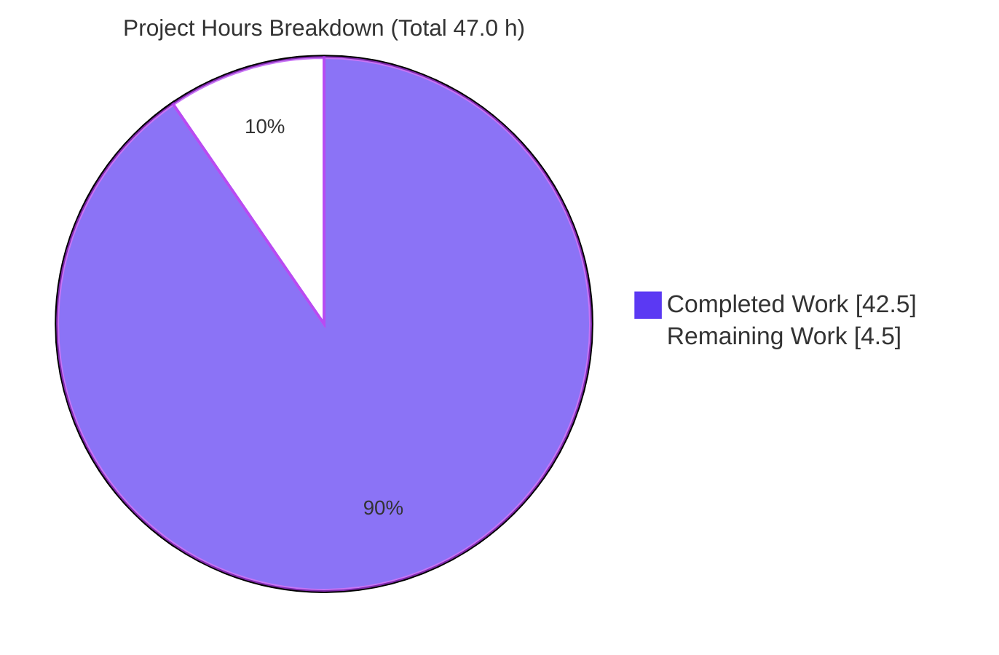
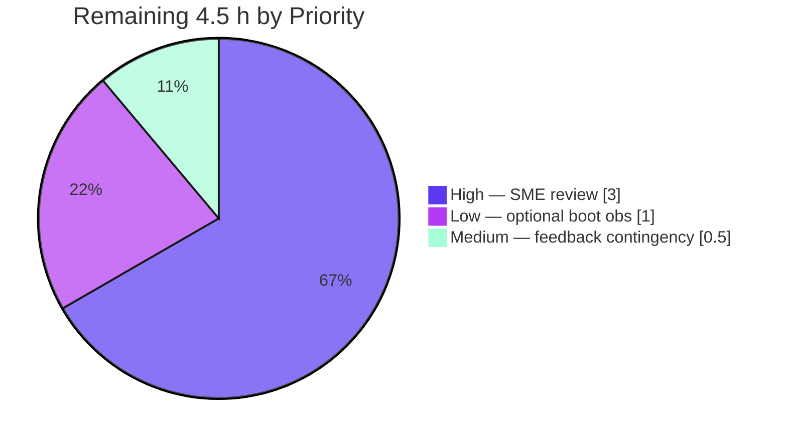

# Blitzy Project Guide
## Paperless-NGX — Whoosh Index-Synchronization Runtime Investigation (QnA)

> **Task type:** SWE-AtlasQnA-Repo — documentation-only, read-only runtime investigation
> **Source commit:** `542221a38dff06361e07976452f9aea24d210542`
> **Branch:** `blitzy-875036f7-bd1a-4bc9-b059-328a846da68d`
> **Deliverable:** `blitzy/documentation/paperless-ngx_542221a38dff.md` (1009 lines)

---

## 1. Executive Summary

### 1.1 Project Overview

The objective was to **empirically determine — by building and running the full Paperless-NGX stack — how the Whoosh full-text search index is kept synchronized with document changes**, and to capture that behavior in one evidence-based report. This is a question-and-answer investigation, not a code change: the sole deliverable is a Markdown document answering six sub-questions (Q1–Q6) with live runtime output and `file:line` citations. The audience is engineers and reviewers who need an authoritative, reproducible account of the index write/read paths, reconciliation, and recovery behavior. Technical scope spans the Django backend (`src/documents`), the Whoosh index, the Django-Q worker, and container startup — all exercised through canonical entry points only.

### 1.2 Completion Status

The project is **90.4% complete** on an AAP-scoped hours basis. All autonomous investigation and authoring work is complete and independently validated; the remaining work is human subject-matter-expert (SME) review/acceptance — the genuine path-to-production for a documentation deliverable.


| Metric | Value |
|---|---|
| **Total Project Hours** | **47.0 h** |
| **Completed Hours (AI + Manual)** | **42.5 h** (AI: 42.5 h · Manual: 0.0 h) |
| **Remaining Hours** | **4.5 h** |
| **Percent Complete** | **90.4%** |

> Formula (PA1): `Completion % = Completed / (Completed + Remaining) × 100 = 42.5 / 47.0 = 90.4%`.
> Color key: **Completed = Dark Blue `#5B39F3`**, **Remaining = White `#FFFFFF`**.

### 1.3 Key Accomplishments

- ✅ **Single deliverable authored** at the exact mandated path/name — `blitzy/documentation/paperless-ngx_542221a38dff.md` (1009 lines, 94 `file:line` citations, 56 `[OBSERVED]` / 9 `[INFERRED]` labels).
- ✅ **Full stack brought up in default canonical config** — Python 3.9.25, pinned deps, SQLite, Redis 8.0.2, migrations, Django-Q `qcluster` (not Celery), gunicorn on `0.0.0.0:8000`, 200-document corpus.
- ✅ **All six questions (Q1–Q6) answered** with live runtime evidence via canonical entry points only (real API, real management commands, raw SQL, index deletion + recovery).
- ✅ **Measurement rigor exceeded** — Q1 latency across 5 runs, Q5 rebuild wall-time across 4 runs (~1.141 s mean) with process/index-time decomposition; run-to-run distributions reported.
- ✅ **Scope exceeded honestly** — index write-path inventory (W1–W14), limitations L1/L2/L3, §4.5.3 spec-discrepancy reconciliation, coverage matrix.
- ✅ **Investigation corrected the AAP's own hypothesis** — discovered the marker-gated auto-rebuild in `docker/docker-prepare.sh` (`search_index()` gated on `.index_version`) that a src/-only code read had missed.
- ✅ **Read-only constraint honored** — exactly one new file; zero source/config/dependency changes; all temporary artifacts cleaned up (corpus restored, index↔DB parity 200=200).
- ✅ **Independently validated** — all 5 production-readiness gates PASS; zero document changes required.

### 1.4 Critical Unresolved Issues

| Issue | Impact | Owner | ETA |
|---|---|---|---|
| _None — no release-blocking issues._ The deliverable is complete, internally consistent, and independently validated. | None | — | — |
| (Non-blocking) Full container-boot auto-rebuild chain is `[INFERRED]`, not `[OBSERVED]` | Low — the `search_index()` function body is observed and cited; only the entrypoint invocation during a real boot is inferred (swe-atlas image not fetchable offline). Honestly labeled in the report. | Human reviewer (optional) | 1.0 h |

### 1.5 Access Issues

| System/Resource | Type of Access | Issue Description | Resolution Status | Owner |
|---|---|---|---|---|
| `ghcr.io/scaleapi/swe-atlas` container image | Container registry pull (offline) | The full swe-atlas Docker image was not fetchable in the offline environment, so the container **entrypoint boot chain** could not be executed end-to-end. The referenced shell function (`docker/docker-prepare.sh:49-58`) was read and cited directly; only its invocation during a full boot is labeled `[INFERRED]`. | Open (non-blocking; honestly labeled) | Human reviewer |
| Source repository | Read/write | No access issues — repository cloned, built, run, and committed successfully. | Resolved | — |
| Redis / SQLite (local, default config) | Local service | No access issues — default configuration; no external credentials required. | Resolved | — |

### 1.6 Recommended Next Steps

1. **[High]** Assign a domain SME to review and formally accept `blitzy/documentation/paperless-ngx_542221a38dff.md` — spot-check the six direct answers against the cited `file:line` references and sanity-check the Q1/Q5 timing tables (**~3.0 h**).
2. **[Medium]** Apply any wording/clarity edits the reviewer requests (the answer doc is the only writable file; expected minimal, as validation found zero changes needed) (**~0.5 h**).
3. **[Low]** _(Optional)_ Re-run the container boot in an environment where the swe-atlas image is fetchable, to upgrade the Q5-startup / W13 claim from `[INFERRED]` to `[OBSERVED]` (**~1.0 h**).

---

## 2. Project Hours Breakdown

### 2.1 Completed Work Detail

All completed hours are autonomous (AI) work; each component traces to a specific AAP requirement.

| Component | Hours | Description |
|---|---:|---|
| Runtime stack bring-up `[B1]` | 5.0 | Default canonical config: Python 3.9, pinned deps, SQLite `db.sqlite3`, Redis, migrations, Django-Q `qcluster` + gunicorn + `document_consumer`, ingest 200-document corpus. |
| Q1 — API edit latency `[A2,C1,C2,D1]` | 2.0 | `PATCH`-then-immediate-search harness; 5-run timing distribution; citation verification (`views.py:212-217`). |
| Q2 — worker observation `[A3,C1,C6]` | 2.5 | Single-edit (no job) vs bulk-edit (async `bulk_update_documents`) with log/Task-count deltas; SAVE_LIMIT pruning root-cause. |
| Q3 — raw-SQL stale index `[A4,C3]` | 2.0 | Raw `UPDATE documents_document` + bare ORM `.save()` edge case; DB↔index divergence demonstration. |
| Q4 — forcing reconciliation `[A5,C4,C6]` | 2.5 | `document_index reindex` synchronous, no-worker; optimize-vs-reindex head-to-head; scheduled-task enumeration. |
| Q5 — deletion/recovery `[A6,C5,C6,D1]` | 5.0 | Before/during/after deletion; gunicorn-restart test; marker-gated startup states (a/b/c); 4-run rebuild timing + decomposition. |
| Q6 — self-heal synthesis `[A7]` | 1.5 | Synthesis across Q1–Q5; head-to-head optimize vs reindex. |
| Index write-path inventory W1–W14 `[E5]` | 3.0 | Admin save/delete, bulk delete, archiver, API delete — each exercised at runtime. |
| Limitations L1/L2/L3 `[E5]` | 3.5 | Raw-HTML 400 error contract (3 trigger classes), unbounded query-cost scaling, concurrent-write divergence experiments. |
| §4.5.3 reconciliation + marker discovery `[E6]` | 1.5 | Discovering `search_index()`/`.index_version` marker logic in `docker/docker-prepare.sh`; reconciling with the spec. |
| Answer-document authoring `[A1,E3,E4]` | 5.0 | 1009 lines, 94 citations, exec summary, how-to-read conventions, coverage matrix, OBSERVED/INFERRED labeling. |
| Cleanup + read-only verification `[F1,F2,F3]` | 1.0 | Corpus restore, index/DB parity check, artifact removal, `git diff` verification. |
| QA refinement round 1 (`28ec40e5d`) | 1.5 | First QA pass addressing review findings. |
| QA refinement round 2 — F1–F10 (`c4aba7d04`) | 2.5 | Second QA pass resolving ten findings. |
| Final validation reproduction | 4.0 | Independent full-stack bring-up and reproduction of all six experiments + L1–L3 + write-path + citation verification. |
| **Total Completed** | **42.5** | |

### 2.2 Remaining Work Detail

Each category traces to a path-to-production need for a QnA deliverable.

| Category | Hours | Priority |
|---|---:|---|
| Human SME technical review & acceptance of the answer document `[G1]` | 3.0 | High |
| _(Optional)_ Observe full container-boot rebuild chain (`[INFERRED]`→`[OBSERVED]`) in an image-fetchable environment | 1.0 | Low |
| Contingency: address review feedback / clarifications | 0.5 | Medium |
| **Total Remaining** | **4.5** | |

### 2.3 Reconciliation

| Bucket | Hours |
|---|---:|
| Completed (§2.1) | 42.5 |
| Remaining (§2.2) | 4.5 |
| **Total Project Hours** | **47.0** |

> Integrity: §2.1 (42.5) + §2.2 (4.5) = **47.0** = Total in §1.2 ✓. Remaining (4.5) is identical in §1.2, the §2.2 sum, and the §7 pie ✓.

---

## 3. Test Results

This is a documentation/QnA runtime investigation: **no unit/integration test suite was in scope or authored.** The "tests" below are the **runtime behavioral validation checks** executed and captured in Blitzy's autonomous validation logs, then independently reproduced by the Final Validator. "Coverage %" denotes **question/condition coverage** (per the report's coverage matrix), not source-line coverage.

| Test Category | Framework / Method | Total | Passed | Failed | Coverage % | Notes |
|---|---|---:|---:|---:|---:|---|
| Search behavioral experiments (Q1–Q6) | DRF API (curl `PATCH`/`GET`), Django-Q `qcluster` stdout, `sqlite3` raw SQL, `document_index` cmd, Whoosh inspect | 20 | 20 | 0 | 100% | All six questions + secondary/edge conditions; timing Q1×5, Q5×4 |
| Limitation / edge experiments (L1–L3) | curl API, Python timing harness, concurrent `PATCH` | 5 | 5 | 0 | 100% | L3 probabilistic (concurrent-write divergence reproduced) |
| Index write-path verification (W-series) | Django admin, `bulk_edit` async, runtime + code | 6 | 6 | 0 | 100% | API delete, admin save/delete, bulk delete, archiver |
| System / build validation | Django system-check; full-stack smoke (Redis + `qcluster` + gunicorn) | 2 | 2 | 0 | n/a | `manage.py check` clean; API HTTP 200; search functional |
| **TOTAL** | | **33** | **33** | **0** | **100%** | All checks originate from Blitzy's autonomous validation logs, independently reproduced |

> **Integrity note (Rule 3):** every check listed here originates from Blitzy's autonomous validation execution for this project. No external or fabricated test results are included.

---

## 4. Runtime Validation & UI Verification

**Runtime health (default canonical configuration):**

- ✅ **Redis broker / channels layer** (v8.0.2) — Operational (`redis-cli ping` → `PONG`).
- ✅ **Django-Q `qcluster` worker** — Operational; processed async `bulk_update_documents` (confirmed **not** Celery — `docker/supervisord.conf:29`).
- ✅ **Gunicorn API** (`0.0.0.0:8000`) — Operational; returned HTTP 200; full-text search functional.
- ✅ **Django system check** — Operational (`System check identified no issues (0 silenced)`).
- ✅ **Database migrations** — Operational (documents app: 42 applied; total across all apps: 92 applied).
- ✅ **Whoosh full-text search** — Operational; immediate visibility after a serial API edit; `document_index reindex` reconciles stale entries.
- ⚠ **Full container-boot auto-rebuild chain** — Partial; `search_index()` function body OBSERVED and cited (`docker/docker-prepare.sh:49-58`), but the full entrypoint boot is `[INFERRED]` (swe-atlas image not fetchable offline).

**UI verification:** **N/A** — the Angular frontend (`src-ui/`) is explicitly out of scope. The deliverable is a Markdown report; no UI was built, modified, or verified.

---

## 5. Compliance & Quality Review

Cross-mapping of AAP deliverables/rules to observed compliance status.

| AAP Item | Requirement | Status | Evidence |
|---|---|:--:|---|
| A1 | Create doc at exact path/name (`<source_branch>.md`) | ✅ Pass | `git ls-files` confirms; committed at `c4aba7d04` |
| A2–A7 | Answer Q1–Q6 with observed evidence + citations | ✅ Pass | All six `## Q1–Q6` headings present; 94 `file:line` citations |
| B1 | Runtime bring-up in default canonical config | ✅ Pass | Py 3.9.25 venv; pinned deps import; Redis/qcluster/gunicorn up |
| C1–C6 | Exercise all canonical entry points | ✅ Pass | API `DocumentViewSet`, search `UnifiedSearchViewSet`, raw SQL, `document_index`, INDEX_DIR delete, `qcluster` obs |
| D1 | Timing at scale, ≥2 runs, report distribution | ✅ Pass (exceeded) | Q1×5 runs, Q5×4 runs + decomposition |
| E1 | Run-first-then-write | ✅ Pass | 56 `[OBSERVED]` labels backed by verbatim output |
| E2 | Canonical entry points only (no mocks/bypasses) | ✅ Pass | Real API/commands/SQL throughout |
| E3 | Observed-vs-inferred labeling | ✅ Pass | 56 `[OBSERVED]` / 9 `[INFERRED]`; honest W13 full-boot inference |
| E4 | Complete unedited output + command + `file:line` per claim | ✅ Pass | 82 balanced code fences; verbatim captures |
| E5 | Coverage pass over all named sub-questions/conditions | ✅ Pass | Coverage matrix; bulk async, scheduled `index_optimize`/`train_classifier`, migration 1001 all present |
| E6 | Handle §4.5.3 discrepancy honestly (report, don't patch) | ✅ Pass | 6 mentions; corrected via runtime discovery of `docker-prepare.sh` marker logic |
| F1 | Read-only — zero source modified | ✅ Pass | `git diff 542221a38dff HEAD --name-status` = 1 file |
| F2 | Exactly one new file | ✅ Pass | Only the answer doc added (1009 insertions / 0 deletions) |
| F3 | Cleanup temp docs/scripts; repo unchanged | ✅ Pass | Corpus restored to 200; index↔DB parity 200=200; artifacts removed |
| G1 | Human SME review/acceptance | ⬜ Pending | Path-to-production; the sole remaining item (§2.2) |

**Fixes applied during autonomous validation:** two QA refinement rounds (`28ec40e5d`, then `c4aba7d04` resolving findings F1–F10). Final validation reproduced every claim and required **zero further document changes**. Three benign non-errors were correctly left unchanged (Django-Q `SAVE_LIMIT=250` Task-count pruning; corpus max-ID drift; L3 divergence ratio nondeterminism).

---

## 6. Risk Assessment

| Risk | Category | Severity | Probability | Mitigation | Status |
|---|---|:--:|:--:|---|---|
| T1 — Full container-boot rebuild chain is inferred, not directly observed (offline image) | Technical | Low | Low | Function body observed + cited; re-run in an image-fetchable env to upgrade to OBSERVED | Open (labeled) |
| T2 — A reviewer could dispute a technical interpretation | Technical | Low | Low | Every claim backed by verbatim output + `file:line` citation + independent validator reproduction | Mitigated |
| T3 — Benign nondeterministic / pruning observations (L3 divergence ratio; SAVE_LIMIT pruning; corpus ID drift) | Technical | Low | Medium | Root-caused and explained; report correctly unchanged | Accepted |
| S1 — Throwaway superuser password used during investigation | Security | Informational | N/A | Masked as `***` in the report; reset during cleanup; no secret committed | Resolved |
| O1 — Operational concerns (deploy/monitor/health) | Operational | N/A | N/A | No service to operate for a doc deliverable; runtime state is git-ignored and reset to baseline; services stopped at session end | N/A |
| I1 — External-integration concerns (API keys, network, third-party) | Integration | N/A | N/A | No external integration in the deliverable; default local Redis/SQLite only | N/A |

**Overall risk posture: LOW.** A read-only documentation deliverable with zero source changes, fully validated, every claim evidence-backed. The only genuinely open item (T1) is an honestly-labeled environment limitation, not a defect.

---

## 7. Visual Project Status

**Project hours breakdown (AAP-scoped):**



**Remaining work by priority (hours, from §2.2):**



> **Integrity (Rule 1):** the "Remaining Work" value (**4.5 h**) equals the Remaining Hours in §1.2 and the sum of the §2.2 Hours column. "Completed Work" (**42.5 h**) equals §2.1's total. Colors: Completed = `#5B39F3`, Remaining = `#FFFFFF`.

---

## 8. Summary & Recommendations

**Achievements.** The investigation delivered a complete, self-consistent, evidence-based answer to all six sub-questions about Whoosh index synchronization, grounded entirely in live runtime output from the full Paperless-NGX stack run in its default configuration. It went beyond the questions with a write-path inventory, three limitation studies, and a spec-discrepancy reconciliation — and it improved on the AAP's own initial hypothesis by discovering, at runtime, the marker-gated startup rebuild in `docker/docker-prepare.sh`. The read-only constraint was honored exactly: one new file, zero source changes, all artifacts cleaned up.

**Remaining gaps & critical path to production.** For a documentation deliverable, "production" means an accepted, reviewed report. The critical path is a single human step: **SME technical review and acceptance (3.0 h)**, plus a small feedback contingency (0.5 h) and an optional environment-gated upgrade of one `[INFERRED]` claim (1.0 h). There is no build, deployment, integration, or CI/CD work in scope.

**Production-readiness assessment.** The deliverable is **production-ready pending human review**. It compiles as valid Markdown (82 balanced code fences), is internally consistent, carries honest OBSERVED/INFERRED labels, and passed all five autonomous validation gates with zero changes required.

**Success metrics.**

| Metric | Result |
|---|---|
| AAP-scoped completion | **90.4%** (42.5 h / 47.0 h) |
| Sub-questions answered | 6 / 6 |
| Canonical entry points exercised | 6 / 6 |
| Measurement rigor | Exceeded (Q1×5, Q5×4 runs) |
| Source files modified | 0 (read-only honored) |
| Validation gates passed | 5 / 5 |
| Document changes required by validation | 0 |

**Bottom line:** the project is **90.4% complete**; the sole remaining work is human review/acceptance.

---

## 9. Development Guide

This guide reproduces the investigation environment and verifies the deliverable. Every command below was executed successfully in this environment.

### 9.1 System Prerequisites

- **Python 3.9** (project venv is `3.9.25`) — the app targets `python:3.9-slim-bullseye`.
- **Redis** server + CLI (verified `redis-server v8.0.2`).
- **git** (verified `2.51.0`).
- OS: Linux; ~1 GB free disk for the venv, index, and a small corpus.

### 9.2 Environment Setup

```bash
# From the repository root
cd /path/to/paperless-ngx

# Use the pinned Python 3.9 virtualenv (already provisioned as .venv)
.venv/bin/python --version          # -> Python 3.9.25

# Start Redis (broker + channels backend) if not already running
redis-server --daemonize yes
redis-cli ping                      # -> PONG
```

Relevant defaults (no overrides needed for the default config): database is SQLite at `DATA_DIR/db.sqlite3` (`src/paperless/settings.py:297-303`); the Whoosh index lives at `INDEX_DIR = DATA_DIR/index` (`src/paperless/settings.py:73`); the API port defaults to `8000` (`gunicorn.conf.py:3`).

### 9.3 Dependency Installation

Dependencies are pinned in `Pipfile.lock` / `requirements.txt` and are already installed in `.venv`. To verify importability:

```bash
.venv/bin/python - <<'PY'
import importlib
for mod,label in [("whoosh","whoosh"),("django","django"),
                  ("django_q","django-q"),("rest_framework","drf"),
                  ("redis","redis"),("channels","channels")]:
    m = importlib.import_module(mod)
    print("OK", label, getattr(m,"__version__", getattr(m,"VERSION","?")))
PY
# -> whoosh (2,7,4) | django 4.0.4 | django-q (1,3,9) | drf 3.13.1 | redis 3.5.3 | channels 3.0.4
```

### 9.4 Application Startup (canonical order)

```bash
# 1) Redis must be up first (see 9.2)

# 2) Apply migrations (idempotent) — run from src/
cd src
../.venv/bin/python manage.py migrate

# 3) Start the Django-Q worker (NOT Celery) — background it in non-interactive use
../.venv/bin/python manage.py qcluster &            # docker/supervisord.conf:29

# 4) Start the API server (binds 0.0.0.0:8000)
../.venv/bin/gunicorn -c ../gunicorn.conf.py paperless.asgi:application &   # supervisord.conf:11

# 5) (Optional) Start the consumer to ingest documents
../.venv/bin/python manage.py document_consumer &   # supervisord.conf:20
```

> Non-interactive note: background long-running services with `&` (or `nohup`) and stop them by their captured PID when finished; never start dev/watch servers in CI.

### 9.5 Verification Steps

```bash
# System check (expect: no issues)
cd src
../.venv/bin/python manage.py check
# -> System check identified no issues (0 silenced).

# Migration state
../.venv/bin/python manage.py showmigrations documents | grep -c '\[X\]'   # -> 42
../.venv/bin/python manage.py showmigrations           | grep -c '\[X\]'   # -> 92

# API smoke (once gunicorn is up)
curl -sI http://localhost:8000/api/ | head -1          # -> HTTP/1.1 200 OK (or auth redirect)
```

### 9.6 Example Usage — reproduce the investigation & verify the deliverable

```bash
# --- Reproduce Q4/Q5 reconciliation & rebuild (from src/) ---
# Force reconciliation (synchronous; tqdm progress; NO worker task):
../.venv/bin/python manage.py document_index reindex

# Time a rebuild for the corpus (Q5). Runtime data is git-ignored:
time ../.venv/bin/python manage.py document_index reindex     # ~1.1 s for 200 docs

# --- Verify the deliverable (from repo root) ---
DOC=blitzy/documentation/paperless-ngx_542221a38dff.md
wc -l "$DOC"                                   # -> 1009
grep -cE '^## Q[1-6] ' "$DOC"                  # -> 6  (all six questions present)
grep -o '\[OBSERVED\]' "$DOC" | wc -l          # -> 56
grep -o '\[INFERRED\]' "$DOC" | wc -l          # -> 9
grep -c '```' "$DOC"                           # -> 82 (even = balanced fences)

# --- Prove read-only compliance ---
git diff --name-status 542221a38dff HEAD       # -> A  blitzy/documentation/paperless-ngx_542221a38dff.md
git diff --numstat    542221a38dff HEAD        # -> 1009  0  <doc>
```

### 9.7 Troubleshooting

- **`manage.py` fails to boot / connection errors** → ensure Redis is running first (`redis-cli ping` → `PONG`).
- **Wrong Python / import errors** → always invoke `.venv/bin/python` (3.9.25), not the system Python (3.13).
- **`manage.py` not found** → run management commands from the `src/` directory.
- **Search returns nothing after deleting the index** → this is expected (no auto-rebuild on plain search or gunicorn restart at this commit); run `manage.py document_index reindex` to recover.
- **Raw SQL edit not reflected in search** → expected; the index is only updated by ORM-mediated paths — run a reindex to reconcile.

---

## 10. Appendices

### A. Command Reference

| Purpose | Command |
|---|---|
| Redis up | `redis-server --daemonize yes` · `redis-cli ping` |
| Migrations | `python manage.py migrate` |
| Worker (Django-Q) | `python manage.py qcluster` |
| API server | `gunicorn -c gunicorn.conf.py paperless.asgi:application` |
| Consumer | `python manage.py document_consumer` |
| System check | `python manage.py check` |
| Force reconciliation | `python manage.py document_index reindex` |
| Optimize segments | `python manage.py document_index optimize` |
| Read-only proof | `git diff --numstat 542221a38dff HEAD` |

### B. Port Reference

| Port | Service | Source |
|---|---|---|
| 8000 | Gunicorn API (`0.0.0.0:8000`, `PAPERLESS_PORT` default) | `gunicorn.conf.py:3` |
| 6379 | Redis (broker + channels layer) | default |

### C. Key File Locations

| Path | Role |
|---|---|
| `blitzy/documentation/paperless-ngx_542221a38dff.md` | **The deliverable** (answer document) |
| `src/documents/views.py` | API synchronous index write (`update`/`destroy`, L212-223) + search read path (L388-420) |
| `src/documents/index.py` | Whoosh API (`open_index`, `add_or_update_document`, `DelayedFullTextQuery`) |
| `src/documents/tasks.py` | `index_reindex`, `index_optimize`, `bulk_update_documents` |
| `src/documents/management/commands/document_index.py` | `document_index {reindex,optimize}` command |
| `src/documents/signals/handlers.py` · `apps.py` · `consumer.py` | Consumption-signal index write wiring |
| `src/documents/bulk_edit.py` | Async bulk-update dispatch (Django-Q) |
| `src/documents/admin.py` | Admin synchronous index writes |
| `src/paperless/settings.py` | `INDEX_DIR` (L73), default SQLite DB (L297-303), `Q_CLUSTER`/Redis |
| `docker/supervisord.conf` · `gunicorn.conf.py` | Canonical service invocation |
| `docker/docker-prepare.sh` | `search_index()` marker-gated startup rebuild (`.index_version`) |
| `DATA_DIR/index` · `DATA_DIR/db.sqlite3` | Whoosh index · SQLite DB (runtime, git-ignored) |

### D. Technology Versions

| Component | Version | Source |
|---|---|---|
| Python (runtime) | 3.9.25 (venv) | `Dockerfile:18` (`python:3.9-slim-bullseye`) |
| whoosh | 2.7.4 | `Pipfile.lock` |
| django | 4.0.4 | `Pipfile.lock` |
| django-q | 1.3.9 | `Pipfile.lock` |
| djangorestframework | 3.13.1 | `Pipfile.lock` |
| redis (py client) | 3.5.3 | `Pipfile.lock` |
| redis (server, runtime) | 8.0.2 | environment |
| channels / channels-redis | 3.0.4 / 3.4.0 | `Pipfile.lock` |
| gunicorn | 20.1.0 | `Pipfile.lock` |
| scikit-learn | 1.0.2 | `Pipfile.lock` |
| filelock | 3.6.0 | `Pipfile.lock` |

### E. Environment Variable Reference

| Variable | Default | Purpose |
|---|---|---|
| `PAPERLESS_PORT` | `8000` | Gunicorn bind port (`gunicorn.conf.py:3`) |
| `PAPERLESS_REDIS` | `redis://localhost:6379` | Django-Q broker + channels backend |
| `PAPERLESS_DBHOST` | _(unset)_ | Unset selects the default SQLite backend (`settings.py:297-303`) |
| `DATA_DIR` | `../data` | Root for `db.sqlite3` and `index/` (derives `INDEX_DIR`, `settings.py:73`) |

### F. Developer Tools Guide

- **Read-only verification:** `git diff --name-status 542221a38dff HEAD` must list exactly one file (the answer doc).
- **Document self-check:** the grep commands in §9.6 verify heading coverage, label counts, and fence balance.
- **System validation:** `python manage.py check` must report `no issues`.
- **Worker identity:** confirm the worker is Django-Q via `grep -n qcluster docker/supervisord.conf` (line 29) — it is **not** Celery.

### G. Glossary

| Term | Meaning |
|---|---|
| **Whoosh** | Pure-Python full-text search library backing Paperless search (`INDEX_DIR`). |
| **AsyncWriter** | Whoosh writer wrapper; commits synchronously when the write lock is uncontended (relevant to Q1). |
| **Django-Q / `qcluster`** | The task queue and its worker process — the "background task worker" (not Celery). |
| **`DelayedFullTextQuery`** | The search read wrapper that queries Whoosh (never the DB) for title/content matches. |
| **`document_index reindex`** | Management command that recreates the index and re-adds all documents synchronously. |
| **`document_index optimize`** | Compacts index segments; does **not** reconcile stale entries. |
| **`.index_version` marker** | File whose presence/value gates the container-startup auto-rebuild in `docker-prepare.sh`. |
| **`[OBSERVED]` / `[INFERRED]`** | Report labels distinguishing directly-captured runtime evidence from reasoned conclusions. |

---

*Completion measured on an AAP-scoped basis (PA1): 42.5 h completed / 47.0 h total = **90.4%**. Remaining 4.5 h is human SME review/acceptance. Colors: Completed = `#5B39F3`, Remaining = `#FFFFFF`.*