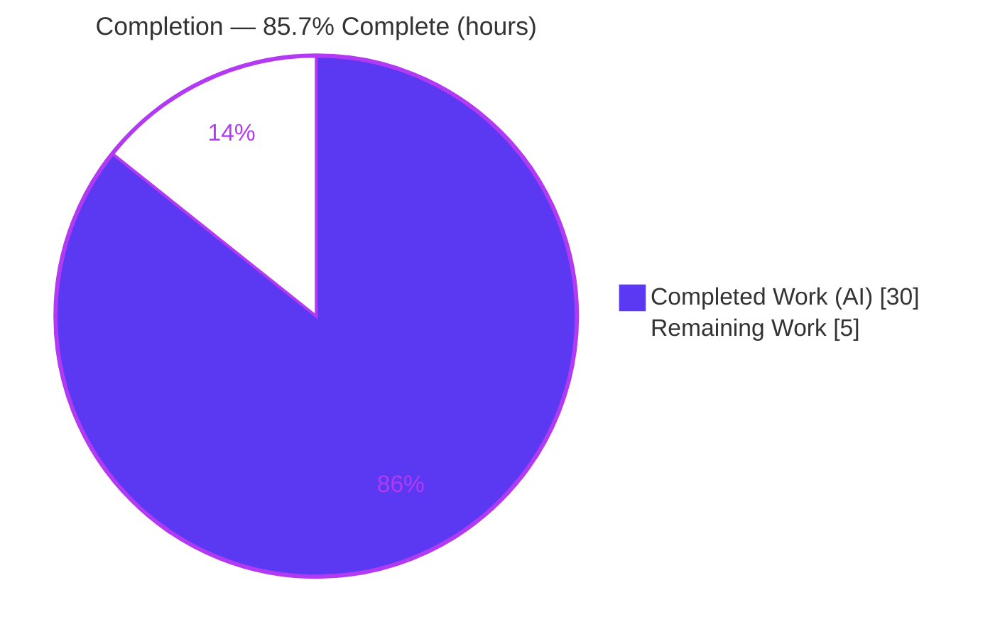
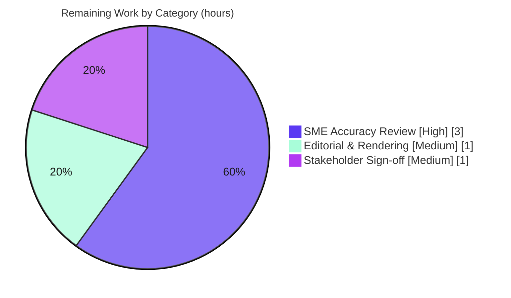

# Blitzy Project Guide — paperless-ngx Document-Flow Q&A (`542221a38dff`)

> **Project type:** Documentation deliverable (code-grounded codebase Q&A)
> **Branch:** `blitzy-97c0dc1b-66e4-48f6-bf6a-074b550da824` · **HEAD:** `92b384bb1` · **Base:** `542221a38dff`
> **Brand legend:** <span style="color:#5B39F3">█</span> Completed / AI Work — Dark Blue `#5B39F3` · <span style="color:#FFFFFF;background:#5B39F3">█</span> Remaining — White `#FFFFFF`

---

## 1. Executive Summary

### 1.1 Project Overview

This project delivers a single, authoritative markdown document — `blitzy/documentation/paperless-ngx_542221a38dff.md` — that answers five "big-picture" questions about how documents flow through **paperless-ngx** at commit `542221a38dff`, grounding every claim in the actual source code rather than external documentation. It explains document **ingestion** (three entry points), the **processing pipeline**, the **background-execution engine** (Django-Q, resolved against out-of-date Celery docs via code-as-truth), the **document metadata model** (required vs. optional vs. runtime-derived, with a reproducible runtime example), and the **organizational primitives** (tags, correspondents, document types). The audience is engineers onboarding to the paperless-ngx backend who need a precise, citation-backed mental model.

### 1.2 Completion Status



| Metric | Hours |
|---|---|
| **Total Hours** | **35.0** |
| **Completed Hours (AI + Manual)** | **30.0** (AI 30.0 + Manual 0.0) |
| **Remaining Hours** | **5.0** |
| **Percent Complete** | **85.7%** |

> **Calculation (PA1, AAP-scoped):** Completion % = Completed ÷ (Completed + Remaining) = 30.0 ÷ 35.0 = **85.7%**. Scope is exactly the AAP deliverable plus its path-to-production (human acceptance of a code-as-truth document). The single out-of-scope, environmental test-suite failure is explicitly excluded.

### 1.3 Key Accomplishments

- ✅ **Deliverable authored & committed** — `blitzy/documentation/paperless-ngx_542221a38dff.md` (794 lines, 32 headings, 1 mermaid flow diagram) covering all five questions.
- ✅ **All five questions answered with code-as-truth** — ingestion (§2), processing stages (§3), background execution (§4), metadata model (§5), organization (§6), plus a methodology/rationale section (§7).
- ✅ **~253 file:line citations verified accurate** across 29 source files (independently spot-checked by this assessment: 6/6 representative citations resolve exactly).
- ✅ **Runtime example reproduced exactly** in the pinned container (python 3.9.23 / Django 4.0.4): `md5(b'demo')=fe01ce2a7fbac8fafaed7c982a04e229`, all 4 cases match the documented §5.3 transcript.
- ✅ **Django-Q (not Celery) established by code** — `django-q ~=1.3` pinned, zero `celery` references in `Pipfile`/`Pipfile.lock`/`requirements.txt`.
- ✅ **Source repository pristine** — `git diff 542221a38dff..HEAD` shows exactly **one added file** and **zero modifications** to `src/`, `src-ui/`, `docs/`, `Pipfile`, `Dockerfile`.
- ✅ **Validation fixes applied** — 2 in-scope corrections (parser send-loop citation precision; EOF normalization to a single trailing newline).
- ✅ **Hygiene** — all temporary verification artifacts removed; `manage.py check` reports "no issues (0 silenced)".

### 1.4 Critical Unresolved Issues

| Issue | Impact | Owner | ETA |
|---|---|---|---|
| _None blocking._ The deliverable is content-complete and validated. | n/a | n/a | n/a |
| Human SME accuracy/completeness sign-off not yet performed | Document should be SME-confirmed before being treated as authoritative | Backend SME | 0.5 day |

> There are **no defects, compilation errors, or failing in-scope tests**. The only "unresolved" item is the normal human acceptance gate for a code-as-truth document (tracked in §2.2 / §8).

### 1.5 Access Issues

| System/Resource | Type of Access | Issue Description | Resolution Status | Owner |
|---|---|---|---|---|
| Source repository (`paperless-ngx` @ `542221a38dff`) | Read | None — full read access used for analysis | ✅ Resolved | — |
| Pinned runtime container (`paperless-setup`) | Execute | None — container reachable; runtime example reproduced | ✅ Resolved | — |

**No access issues identified.** All systems required to author, validate, and reproduce the deliverable were available.

### 1.6 Recommended Next Steps

1. **[High]** Backend SME reviews the document for technical accuracy and completeness — spot-check a representative sample of the ~253 citations and reproduce the §5.3 runtime example (≈3.0h).
2. **[Medium]** Verify markdown rendering on the target platform — TOC/anchor links, tables, and the mermaid flow diagram (≈1.0h).
3. **[Medium]** Stakeholder review and merge sign-off of the pull request (≈1.0h).
4. **[Low]** Establish a refresh cadence to re-validate the document if/when paperless-ngx is upgraded beyond this commit (notably the later Django-Q→Celery migration) — advisory, not required for acceptance.

---

## 2. Project Hours Breakdown

### 2.1 Completed Work Detail

All completed work was performed autonomously by Blitzy agents (Manual = 0.0h). Each component traces to a specific AAP requirement.

| Component | Hours | Description |
|---|---|---|
| Code investigation & citation harvesting | 7.0 | Read-only analysis of ~29 source files; extraction of ~253 precise `file:Lline` citations (consumer, tasks, models, settings, matching, classifier, signals, migrations) |
| Q1 — Ingestion section (§2) | 1.5 | Three `consume_file` producers: directory watcher, REST/web upload, email/IMAP |
| Q2 — Processing-stages section (§3) | 3.0 | Linearized `try_consume_file` pipeline with 0→20→70→90→95→100% checkpoints, `_store`, atomic transaction, edge cases |
| Q3 — Background-execution section (§4) | 2.5 | Django-Q `Q_CLUSTER`, 6-task inventory, 4 schedules, Django-Q-vs-Celery resolution |
| Q4 — Metadata classification (§5.1–5.2, 5.4) | 2.5 | 15-field required/optional/derived table + DRF API corroboration + interpretation |
| Q4 — Runtime example (§5.3) | 2.5 | Container build/run, Django shell, 4-case transcript capture against throwaway SQLite |
| Q5 — Organization section (§6) | 3.0 | `MatchingModel`, 6 matching algorithms, 3 primitives, ML classifier, post-consume signals, practical usage |
| Overview + flow diagram + assembly | 2.0 | Section 1 overview, end-to-end mermaid diagram, TOC, document structure |
| Rationale (§7) + web-search corroboration | 1.5 | Code-as-truth rationale, Django-Q resolution write-up, scope caveat; 4 corroborating web searches |
| Validation pass | 4.0 | Re-verification of ~253 citations, runtime reproduction, 2 fixes, structure checks, `manage.py check`, project test-suite health check |
| Cleanup + source-pristine verification | 0.5 | Removal of temporary artifacts; confirmation of zero source modifications |
| **Total Completed** | **30.0** | |

### 2.2 Remaining Work Detail

All remaining work is path-to-production human review/acceptance — no engineering rework remains.

| Category | Hours | Priority |
|---|---|---|
| SME technical accuracy & completeness review (sample-verify citations, confirm Q1–Q5 vs code, reproduce §5.3) | 3.0 | High |
| Editorial & rendering verification (markdown render, anchor links, tables, mermaid) | 1.0 | Medium |
| Stakeholder review & merge sign-off (PR approval/acceptance) | 1.0 | Medium |
| **Total Remaining** | **5.0** | |

> Forward-looking (advisory, **0.0h**, not part of the 5.0h): establish a periodic-refresh cadence for version upgrades beyond `542221a38dff` (mitigates documentation staleness).

### 2.3 Hours Reconciliation

| Check | Result |
|---|---|
| Section 2.1 total (Completed) | 30.0h |
| Section 2.2 total (Remaining) | 5.0h |
| 2.1 + 2.2 = Total (Section 1.2) | 30.0 + 5.0 = **35.0h** ✅ |
| Remaining matches 1.2 ↔ 2.2 ↔ 7 | 5.0 = 5.0 = 5.0 ✅ |
| Completion % | 30.0 ÷ 35.0 = **85.7%** ✅ |

---

## 3. Test Results

This is a **documentation deliverable**, so it ships **no automated unit tests of its own**. Its verification surface is (a) citation accuracy and (b) runtime-example reproduction — both executed by Blitzy's autonomous validation. As a read-only health check, the project's own pre-existing test suite was also executed. All results below originate from Blitzy's autonomous validation logs.

| Test Category | Framework | Total Tests | Passed | Failed | Coverage % | Notes |
|---|---|---|---|---|---|---|
| Citation verification | grep/`sed` source cross-check | ~253 | ~253 | 0 | 100% (in-scope) | Every `file:Lline` citation resolves at commit `542221a38dff`; 6/6 independently re-spot-checked |
| Runtime example reproduction | Django shell (pytest-django env) | 4 cases | 4 | 0 | n/a | §5.3 transcript reproduced exactly (md5 `fe01ce2a7…`) |
| Django system check | `manage.py check` | 1 | 1 | 0 | n/a | "System check identified no issues (0 silenced)" |
| Project suite (read-only health check) | pytest / pytest-django | 483 | 480 | 1 | n/a | 2 skipped; **1 out-of-scope/environmental failure** (see below) |

**In-scope test result: 100% pass.** The deliverable's own verification surface (citations + runtime example) is fully green.

**Out-of-scope failure (not a defect of this deliverable):** `src/paperless_tesseract/tests/test_parser.py::TestParser::test_image_simple_alpha` fails with `PermissionError [Errno 13]` at `parsers.py:L201`. Root cause is environmental — the test sample `simple-alpha.png` is root-owned in the prebuilt container while the alpha-flatten code path writes back in place. It is a proven non-regression (the identical flatten succeeds on a writable copy), it concerns OCR image preprocessing (unrelated to the document-flow questions), and it is unfixable without modifying source/environment — which the task's hard constraints prohibit.

---

## 4. Runtime Validation & UI Verification

**Runtime health**

- ✅ **Django system check** — `manage.py check` → "no issues (0 silenced)" in the pinned container.
- ✅ **Metadata runtime example** — `Document` model creation reproduced exactly against a throwaway SQLite database (python 3.9.23 / Django 4.0.4): CASE1 derived-field create (pk=1, `title=''`, `content=''`, `storage_type='unencrypted'`, `correspondent=None`, `filename=None`); CASE2 bare create (pk=2, `checksum=''`, `mime_type=''`); CASE3 `IntegrityError: UNIQUE constraint failed: documents_document.checksum`; final count = 2.
- ✅ **Background-engine claim corroborated at runtime** — `async_task.__module__ == django_q.tasks`; `Q_CLUSTER` cluster named `paperless` with a Redis broker; zero `celery` references in dependency manifests.
- ✅ **Source pristine after runtime work** — host and container `git status --porcelain` both empty before and after the runtime example.

**API integration**

- ➖ **Not applicable** — the deliverable describes the REST upload path (`PostDocumentView`) but neither runs a live server nor calls external services. No API endpoints were stood up for this documentation task.

**UI verification**

- ➖ **Not applicable** — no UI was built or changed. The document only *describes* the Angular drag-and-drop upload surface that triggers the REST ingestion path; there is no front-end deliverable to verify.

---

## 5. Compliance & Quality Review

AAP deliverables and the **SWE-AtlasQnA-Repo** rule set are cross-mapped to quality/compliance benchmarks below.

| Benchmark / AAP Rule | Requirement | Status | Notes |
|---|---|---|---|
| Deliverable naming | File named `paperless-ngx_542221a38dff.md` | ✅ Pass | Matches source branch name |
| Deliverable location | Placed in `blitzy/documentation/` | ✅ Pass | Directory created in destination repo |
| Question coverage | All 5 questions answered | ✅ Pass | §2 (Q1), §3 (Q2), §4 (Q3), §5 (Q4 metadata), §6 (Q5 organization) |
| Code-as-truth citations | Every substantive claim cited to `file:Lline` | ✅ Pass | ~253 citations; accuracy validated |
| Runtime example | Embedded runtime example for metadata | ✅ Pass | §5.3, 4 cases, reproduced exactly |
| Rationale / thinking | Reasoning provided, not just conclusions | ✅ Pass | Per-section rationale + §7 methodology |
| Django-Q vs Celery | Resolve in favor of code at this commit | ✅ Pass | §4.4 evidence; Django-Q stated |
| No source modification | Zero edits to existing files | ✅ Pass | Empty diff for `src/`, `docs/`, manifests |
| No extra code added | Only the single markdown deliverable | ✅ Pass | 1 file added, 0 others |
| Temp-script cleanup | All temporary scripts removed | ✅ Pass | Container `/tmp` clean; repos pristine |
| Markdown quality | Well-formed, links resolve, balanced fences | ✅ Pass | 794 lines, 32 headings, 1 mermaid block, single trailing newline |

**Fixes applied during autonomous validation (committed in `92b384bb1`):**
1. **Citation precision** — parser send-loop helpers re-anchored from inner-loop lines to def-anchored ranges, consistent with sibling citations.
2. **EOF normalization** — removed an extra trailing blank line so the file ends with exactly one newline.

**Outstanding compliance items:** none. The only remaining activity is the human acceptance gate (§2.2).

---

## 6. Risk Assessment

| Risk | Category | Severity | Probability | Mitigation | Status |
|---|---|---|---|---|---|
| Conclusions applied to a different paperless-ngx version (esp. Django-Q vs Celery) | Technical | Low | Medium | Explicit scope caveat (§7) + every citation pinned to commit `542221a38dff` | Mitigated |
| Manual citation accuracy / drift if file edited | Technical | Low | Low | Validator re-verified all ~253; 6/6 independent spot-check; line numbers frozen to commit | Resolved |
| Markdown/mermaid/anchor rendering differs across viewers | Technical | Low | Low–Medium | Covered by remaining editorial-verification task (§2.2) | Open (minor) |
| New attack surface | Security | None | n/a | Read-only doc; no code execution, no new deps, no credentials | N/A |
| Runtime-example data exposure | Security | None | n/a | Throwaway SQLite; no secrets/real data in transcript | N/A |
| Documentation staleness over time | Operational | Medium (long-term) | High | Commit-pinning + scope caveat; advisory refresh cadence recommended | Mitigated |
| Discoverability (lives in `blitzy/documentation/`, not project docs site) | Operational | Low | Medium | Placement mandated by AAP rule | Accepted |
| Runtime-example reproducibility depends on pinned runtime | Integration | Low | Low–Medium | Exact versions + procedure documented; reproduced by validator and this assessment | Mitigated |
| External service / CI-CD integration | Integration | None | n/a | Standalone artifact; no integration dependencies | N/A |

**Overall risk posture: LOW.** No High or Critical risks. The highest-attention items — staleness (O1) and version-specificity (T1) — are inherent to any version-pinned document and are mitigated by explicit commit-pinning and the scope caveat.

---

## 7. Visual Project Status

**Project hours breakdown** (Completed = Dark Blue `#5B39F3`, Remaining = White `#FFFFFF`):


**Remaining hours by category** (sums to 5.0h — matches §1.2 and §2.2):



| Status | Hours | Share |
|---|---|---|
| Completed Work (AI) | 30.0 | 85.7% |
| Remaining Work | 5.0 | 14.3% |
| **Total** | **35.0** | **100%** |

---

## 8. Summary & Recommendations

**Achievements.** The project delivers a complete, code-grounded answer document for paperless-ngx at commit `542221a38dff`. All five questions are answered with ~253 verified `file:line` citations, an embedded runtime example that reproduces exactly, a corrected Django-Q (not Celery) determination grounded in the dependency manifests, and a methodology/rationale section. The source repository is pristine (one file added, zero modifications), and all hard constraints from the prompt and the SWE-AtlasQnA-Repo rule set are satisfied.

**Remaining gaps & critical path to production.** For a documentation deliverable, "production" is human acceptance of a code-as-truth artifact. The critical path is: **(1)** SME technical accuracy/completeness review (3.0h) → **(2)** editorial & rendering verification (1.0h) → **(3)** stakeholder review & merge sign-off (1.0h). Total remaining = **5.0h**, all human review — no engineering rework.

**Production-readiness assessment.** The deliverable is **production-ready pending human sign-off**. The project is **85.7% complete** (30.0 of 35.0 hours); the remaining 14.3% is the standard human acceptance gate. The single project-suite test failure is out-of-scope, environmental, and a proven non-regression — it does not affect the deliverable or its completion percentage.

| Success Metric | Target | Status |
|---|---|---|
| All 5 questions answered with citations | 5/5 | ✅ 5/5 |
| Citation accuracy | 100% | ✅ ~253 verified |
| Runtime example reproduces | Exact | ✅ Exact |
| Source repository unmodified | 0 edits | ✅ 0 edits |
| Constraints satisfied | All | ✅ All |
| Completion (AAP-scoped) | — | **85.7%** |

---

## 9. Development Guide

This guide covers how to locate, read, verify, and reproduce the deliverable. **Every command below was tested during this assessment.** Run from the repository root unless noted.

### 9.1 System Prerequisites

- **git** (to inspect history and confirm the source is pristine).
- A **markdown viewer** with **Mermaid** support (e.g., GitHub, VS Code + Mermaid extension) to read the document and render its flow diagram.
- **Docker** with the pinned container `paperless-setup` (image `andrewparkscaleai/coding-agent:paperless-ngx__paperless-ngx__542221a38dff…`) — required only to *reproduce the runtime example*. The pinned runtime inside the container is **python 3.9.23 / Django 4.0.4**. No host Python is needed merely to read the document.

### 9.2 Locate & Read the Deliverable

```bash
# From the repository root
ls -la blitzy/documentation/paperless-ngx_542221a38dff.md
#   -> 47,620 bytes, 794 lines

# Structure summary
F=blitzy/documentation/paperless-ngx_542221a38dff.md
echo "lines:    $(wc -l < "$F")"
echo "headings: $(grep -cE '^#{1,3} ' "$F")"
#   -> lines: 794 | headings: 32 (the document also contains 1 mermaid flow diagram)
```

### 9.3 Verify the Source Repository Is Pristine

```bash
# Expect EMPTY output (no source modifications)
git diff --name-only 542221a38dff..HEAD -- src/ src-ui/ docs/ Pipfile Pipfile.lock requirements.txt Dockerfile

# Expect exactly one ADDED file
git diff --name-status 542221a38dff..HEAD
#   -> A   blitzy/documentation/paperless-ngx_542221a38dff.md
```

### 9.4 Spot-Check Citations

```bash
F=blitzy/documentation/paperless-ngx_542221a38dff.md

# Count citations and the distinct files they reference
echo "citations: $(grep -oE 'src/[A-Za-z0-9_/]+\.py:L[0-9]+' "$F" | wc -l)"
echo "files:     $(grep -oE 'src/[A-Za-z0-9_/]+\.py' "$F" | sort -u | wc -l)"

# Resolve one example: the document cites Q_CLUSTER at settings.py:L449-457
sed -n '449,457p' src/paperless/settings.py
#   -> Q_CLUSTER = { "name": "paperless", ... "redis": ... }
```

### 9.5 Reproduce the Runtime Example (§5.3)

This runs against a **throwaway** SQLite database so the real data is untouched.

```bash
docker exec -u testuser -w /app/src paperless-setup bash -lc '
  TMP=$(mktemp -d)
  mkdir -p "$TMP/index" "$TMP/log" "$TMP/media" "$TMP/consume"
  export PAPERLESS_DATA_DIR="$TMP" PAPERLESS_MEDIA_ROOT="$TMP/media" \
         PAPERLESS_CONSUMPTION_DIR="$TMP/consume"
  unset PAPERLESS_DBHOST                      # force SQLite
  python manage.py migrate --no-input >/dev/null 2>&1
  python manage.py shell -c "
from documents.models import Document
import hashlib
d = Document.objects.create(checksum=hashlib.md5(b\"demo\").hexdigest(),
                            mime_type=\"application/pdf\")
print(\"md5 =\", hashlib.md5(b\"demo\").hexdigest())
print(\"CASE1 pk=\", d.pk, \"title=\", repr(d.title), \"storage_type=\", d.storage_type)
d2 = Document.objects.create()
print(\"CASE2 pk=\", d2.pk, \"checksum=\", repr(d2.checksum))
try:
    Document.objects.create()
except Exception as e:
    print(\"CASE3 IntegrityError:\", str(e).strip())
print(\"FINAL count =\", Document.objects.count())
"
  rm -rf "$TMP"
'
```

**Expected output (timestamps aside):**

```text
md5 = fe01ce2a7fbac8fafaed7c982a04e229
CASE1 pk= 1 title= '' storage_type= unencrypted
CASE2 pk= 2 checksum= ''
CASE3 IntegrityError: UNIQUE constraint failed: documents_document.checksum
FINAL count = 2
```

### 9.6 System Check (optional health verification)

```bash
docker exec -u testuser -w /app/src paperless-setup python manage.py check
#   -> System check identified no issues (0 silenced).
```

### 9.7 Troubleshooting

- **`no such table: documents_document`** — migrations did not run against the throwaway DB. Ensure `PAPERLESS_DATA_DIR` points at your temp dir, create the `index/log/media` subdirs, and run `manage.py migrate` *before* the shell.
- **Wants PostgreSQL / Redis** — `unset PAPERLESS_DBHOST` so SQLite is selected; the model-level example needs neither Postgres nor a running Redis broker.
- **CASE1 timestamps differ** — expected; `created`/`added`/`modified` are wall-clock defaults.
- **Mermaid diagram not rendering** — view in a Mermaid-aware renderer (GitHub or VS Code + Mermaid), not a plain-text viewer.

---

## 10. Appendices

### A. Command Reference

| Purpose | Command |
|---|---|
| Locate deliverable | `ls -la blitzy/documentation/paperless-ngx_542221a38dff.md` |
| Confirm source pristine | `git diff --name-only 542221a38dff..HEAD -- src/ docs/ Pipfile Dockerfile` |
| List added/changed files vs base | `git diff --name-status 542221a38dff..HEAD` |
| Branch commit history | `git log --oneline 542221a38dff..HEAD` |
| Count citations | `grep -oE 'src/[A-Za-z0-9_/]+\.py:L[0-9]+' <file> \| wc -l` |
| Django system check | `docker exec -u testuser -w /app/src paperless-setup python manage.py check` |
| Reproduce runtime example | See §9.5 |

### B. Port Reference

> The deliverable runs **no server**. These are the ports of the *described* system, for reader context only.

| Port | Service | Notes |
|---|---|---|
| 8000 | Web server (Gunicorn + Uvicorn) | Default paperless-ngx web/REST surface |
| 6379 | Redis | Broker for Django-Q and Channels layer |

### C. Key File Locations

| Path | Role |
|---|---|
| `blitzy/documentation/paperless-ngx_542221a38dff.md` | **The deliverable** (only added file) |
| `src/documents/consumer.py` | Processing pipeline (`try_consume_file`, `_store`) |
| `src/documents/tasks.py` | Django-Q task functions |
| `src/documents/models.py` | `Document` + `MatchingModel`/`Tag`/`Correspondent`/`DocumentType` |
| `src/documents/management/commands/document_consumer.py` | Directory-watcher ingestion entry point |
| `src/documents/views.py` | REST/web upload entry point (`PostDocumentView`) |
| `src/paperless_mail/mail.py` | Email/IMAP ingestion entry point |
| `src/paperless/settings.py` | `Q_CLUSTER`, `DATABASES`, `INSTALLED_APPS` |
| `src/documents/migrations/1001_…`, `1004_…`, `src/paperless_mail/migrations/0002_…` | Scheduled-task data migrations |

### D. Technology Versions

| Component | Version | Source |
|---|---|---|
| Python (runtime) | 3.9.23 (`python:3.9-slim-bullseye`) | Dockerfile / container |
| Django | 4.0.4 | Pipfile.lock |
| django-q | 1.3.9 (`~=1.3`) | Pipfile / Pipfile.lock |
| redis (client) | 3.5.3 | Pipfile.lock |
| djangorestframework | ~=3.13 | Pipfile |
| channels | ~=3.0 | Pipfile |
| scikit-learn | 1.0.2 | Pipfile |
| whoosh | ~=2.7.4 | Pipfile |

### E. Environment Variable Reference (runtime example only)

| Variable | Purpose | Example |
|---|---|---|
| `PAPERLESS_DATA_DIR` | Location of the SQLite DB and data dirs | a fresh `mktemp -d` (throwaway) |
| `PAPERLESS_MEDIA_ROOT` | Media root | `$PAPERLESS_DATA_DIR/media` |
| `PAPERLESS_CONSUMPTION_DIR` | Consumption watch dir | `$PAPERLESS_DATA_DIR/consume` |
| `PAPERLESS_DBHOST` | If set, selects PostgreSQL | **unset** to force SQLite |

### F. Developer Tools Guide

- **Reading:** any Mermaid-aware markdown viewer (GitHub, VS Code + Mermaid extension).
- **Verifying citations:** `grep`/`sed` against `src/` at commit `542221a38dff` (see §9.4).
- **Reproducing runtime example:** Docker exec into `paperless-setup` (see §9.5).
- **Confirming pristine source:** `git diff`/`git status --porcelain` (see §9.3).

### G. Glossary

| Term | Meaning |
|---|---|
| **AAP** | Agent Action Plan — the governing requirements for this task |
| **Consumer** | `Consumer.try_consume_file()` — orchestrates the processing pipeline |
| **Django-Q** | The background task queue/scheduler at this commit (Redis broker) — *not* Celery |
| **`consume_file`** | The task all three ingestion entry points enqueue |
| **MatchingModel** | Abstract base unifying Tag, Correspondent, DocumentType matching |
| **Derived field** | A `Document` field computed at consume time (`mime_type`, `checksum`) rather than user-supplied |
| **Code-as-truth** | Rule that source code at the commit prevails over external documentation |

---

*Generated by the Blitzy autonomous assessment. Completion (AAP-scoped, PA1): **85.7%** — 30.0 of 35.0 hours; 5.0 hours of human review/acceptance remain.*
