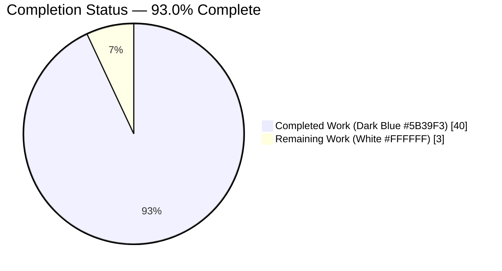
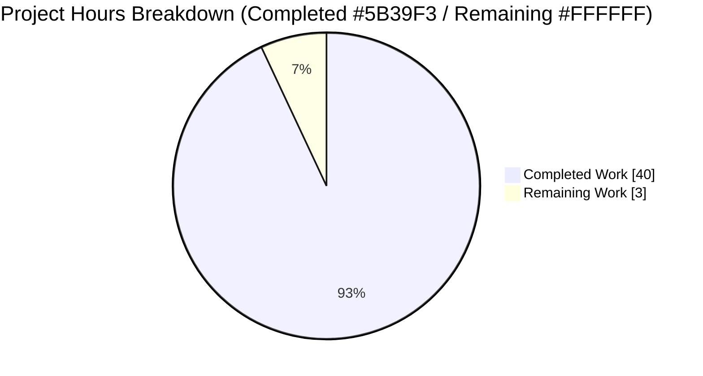
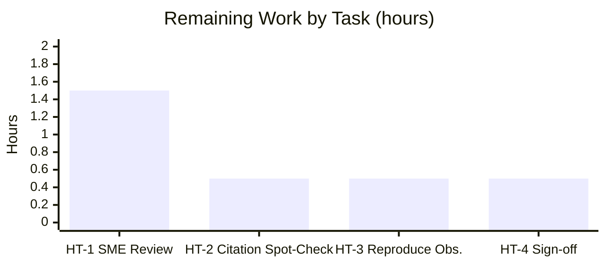

# Blitzy Project Guide — paperless-ngx Background-Maintenance Investigation

> **Project:** Read-only investigation & documentation of paperless-ngx automatic background maintenance and periodic scheduling
> **Deliverable:** `blitzy/documentation/paperless-ngx_542221a38dff.md` (1,871 lines)
> **Commit under evaluation:** `542221a38dff06361e07976452f9aea24d210542`
> **Branch:** `blitzy-c5bcd221-5985-45a7-8ccd-dca7aa501c80` · **HEAD:** `ad75bb537`
> **Brand colors:** Completed = Dark Blue `#5B39F3` · Remaining = White `#FFFFFF` · Headings = Violet-Black `#B23AF2` · Highlight = Mint `#A8FDD9`

---

## 1. Executive Summary

### 1.1 Project Overview

This project is a **read-only investigation and documentation** task for the paperless-ngx document-management system. The objective was to determine how paperless-ngx performs automatic background maintenance and periodic scheduling, then author a single comprehensive markdown answer document that responds to eleven distinct question areas — each grounded in reproduced runtime evidence and exact `file:line` citations. The pivotal finding is a **false-premise correction**: the request was framed in Celery terms, but the actual scheduler at this commit is **Django Q (`django-q==1.3.9`)**; Celery is entirely absent. The audience is an architect evaluating the system. The source repository remained strictly read-only — the sole artifact produced is one documentation file.

### 1.2 Completion Status



> Completion % computed with PA1 (AAP-scoped hours only): 40.0 ÷ (40.0 + 3.0) × 100 = **93.0%**.
> *Mermaid pie charts do not render a native center label; the completion percentage is carried in the chart title. Segment colors map to Blitzy brand: Completed = `#5B39F3`, Remaining = `#FFFFFF`.*

| Metric | Hours |
|---|---|
| **Total Hours** | **43.0** |
| **Completed Hours (AI + Manual)** | **40.0** (40.0 AI + 0.0 Manual) |
| **Remaining Hours** | **3.0** |
| **Percent Complete** | **93.0%** |

### 1.3 Key Accomplishments

- ✅ **False Celery premise corrected** — document leads by establishing that Celery is absent and Django Q (`django-q==1.3.9`) is the real scheduler; verified 0 `celery` references in `requirements.txt`, `Pipfile`, `Pipfile.lock`.
- ✅ **All four recurring tasks enumerated exhaustively** — `train_classifier` (HOURLY), `index_optimize` (DAILY), `sanity_check` (WEEKLY), `process_mail_accounts` (MINUTES=10), each with `schedule_type`, interval, target function, and registration site; verified exhaustive via repo-wide `schedule(` search (exactly 4 sites).
- ✅ **Canonical runtime booted & every task driven through its real entry point** — Redis broker up, `manage.py migrate` seeded 4 `Schedule` rows, `manage.py qcluster` launched; tasks exercised via `document_index optimize|reindex`, `document_sanity_checker`, `document_create_classifier`, and scheduled dispatch.
- ✅ **Sanity checker deep-dive** — validations, three severities, log lines, and both modes captured (command LOGS and never raises; scheduled task RAISES `SanityCheckFailedException`).
- ✅ **Failure semantics proven at runtime** — forced-failure matrix recorded `django_q_task` Failure with `attempt_count=1`; proved no auto-retry (no `max_attempts` in 1.3.9), no alerting (`ERROR_REPORTER={}`), and `catch_up=False` (a 45-min-overdue schedule fired exactly once).
- ✅ **Persistence tables queried** — `django_q_schedule` (4 rows), `django_q_task` (Success/Failure history), `django_q_ormq` (unused; Redis broker).
- ✅ **Enable/disable controls cataloged** — `PAPERLESS_*` flags; `TASK_WORKERS=0` reproduces a `ZeroDivisionError` crash.
- ✅ **Evidence discipline** — 55 "observed", 5 "inferred", 2 "non-canonical" labels; 131 citations / 119 file-specs across 19 source files audited with 0 out-of-bounds.
- ✅ **Read-only constraint held byte-for-byte** — only `blitzy/documentation/paperless-ngx_542221a38dff.md` added across all 6 agent commits; working tree clean; observation artifacts cleaned up.

### 1.4 Critical Unresolved Issues

| Issue | Impact | Owner | ETA |
|---|---|---|---|
| *None — Final Validator reports zero unresolved issues* | No release blocker | — | — |

> The deliverable was declared production-ready across all five validation gates. The only outstanding activities are standard human review/sign-off (see Section 2.2), which are not defects.

### 1.5 Access Issues

| System/Resource | Type of Access | Issue Description | Resolution Status | Owner |
|---|---|---|---|---|
| Pulled Docker image (`libzbar0`) | Runtime library | `libzbar.so.0` was absent in the pulled image; `pyzbar` import at `src/documents/tasks.py:25` requires it. This is an image-**provisioning** gap, not a source defect — `Dockerfile:74` installs `libzbar0` in the production image. | Documented in deliverable with one-line fix (`apt-get install -y libzbar0`); non-blocking | Reviewer/DevOps |

> No repository-permission, credential, or third-party API access issues were identified. The investigation is read-only and introduces no secrets or new dependencies.

### 1.6 Recommended Next Steps

1. **[High]** SME technical review of the full 1,871-line answer document — confirm all 11 areas are answered and the Celery→Django Q correction is unambiguous.
2. **[High]** Spot-check a sample of the 131 `file:line` citations against source at commit `542221a38dff`.
3. **[Medium]** Independently reproduce 1–2 key observations (the 4-row `django_q_schedule` query and the ~30s scheduler cadence), noting the documented `libzbar0` image gap and its one-line fix.
4. **[Medium]** Acceptance sign-off and distribution to stakeholders.

---

## 2. Project Hours Breakdown

### 2.1 Completed Work Detail

Every component below traces to an AAP requirement or an AAP-specified path-to-production activity. All hours are autonomous (AI) work.

| Component | Hours | Description |
|---|---|---|
| Environment bring-up & canonical runtime setup | 4.0 | Boot canonical Docker image (Python 3.9), start Redis, `manage.py migrate` (seed 4 Schedule rows), launch `qcluster`; diagnose `libzbar0` image gap. |
| Celery→Django Q reframing + Django Q 1.3.x semantics research | 2.5 | Establish Celery absence; research `schedule_type`, `catch_up`, `retry` vs `timeout`, and the `django-q2`-only `max_attempts` distinction. |
| Recurring-task inventory + two-run interval proof | 3.5 | Enumerate all 4 tasks; query `django_q_schedule` twice for stability; verify interval deltas (H=+1h, D=+1d, W=+7d, I=+10min). |
| Definition → registration → execution → persistence trace | 3.0 | Connect `tasks.py` definitions, migration registration, `Q_CLUSTER` execution, and DB persistence end-to-end. |
| Sanity checker deep-dive | 4.5 | Trace `check_sanity()`; capture all three severities and the empty-case line; exercise both modes (command logs vs scheduled task raises). |
| Index optimization & database-cleanup findings | 1.5 | Exercise `index_optimize()` (exit 0, no stdout); prove absence of any dedicated DB-cleanup task. |
| Failed-doc-retry / stuck-job absence proof | 1.0 | Search task modules; prove no retry/reaper task; distinguish consumer file-read retries. |
| Failure semantics — failure matrix, redelivery/no-retry, catch_up | 3.5 | Force failures sequentially; record `django_q_task` Failure (`attempt_count=1`); prove no auto-retry, no alerting, `catch_up=False`. |
| Startup-vs-schedule distinction | 1.5 | Contrast migrate-seeded schedules + conditional startup reindex with `apps.py ready()` (signals only). |
| DB task-history / job-state tables query | 1.5 | Query `django_q_schedule` / `django_q_task` / `django_q_ormq`; report actual rows. |
| Enable/disable controls catalog + TASK_WORKERS=0 crash probe | 2.0 | Catalog `PAPERLESS_*` flags; reproduce `ZeroDivisionError` with `TASK_WORKERS=0`. |
| Evidence discipline, observed-vs-inferred labeling & citation audit | 3.0 | Label 55 observed / 5 inferred / 2 non-canonical; audit 131 citations across 19 files (0 out-of-bounds). |
| Document authoring, coverage summary & structure | 3.0 | Author 14 sections + coverage pass reconciling every named item across 1,871 lines. |
| QA review-and-fix cycles | 4.5 | Five revision commits including major rewrites (+887/−335, +642/−56) and citation/bash fixes. |
| Cleanup + read-only integrity proof & verification | 1.0 | Remove throwaway scripts/Redis; prove source unchanged byte-for-byte. |
| **Total Completed** | **40.0** | **Sum matches Completed Hours in Section 1.2** |

### 2.2 Remaining Work Detail

Each category traces to a path-to-production need (independent human verification and sign-off). No AAP deliverable is incomplete.

| Category | Hours | Priority |
|---|---|---|
| HT-1 — SME technical review of full 1,871-line answer document (all 11 areas answered; Celery→Django Q correction clear; observed-vs-inferred labeling sound) | 1.5 | High |
| HT-2 — Spot-check sample of 131 `file:line` citations against source at commit `542221a38dff` (4 `schedule()` sites, `Q_CLUSTER` settings.py:449-457, sanity_checker branches) | 0.5 | High |
| HT-3 — Independently reproduce 1–2 key observations (4-row `django_q_schedule` query; ~30s scheduler cadence); note `libzbar0` gap + one-line fix | 0.5 | Medium |
| HT-4 — Acceptance sign-off & distribution to stakeholders | 0.5 | Medium |
| **Total Remaining** | **3.0** | **Sum matches Remaining Hours in Section 1.2 and Section 7 pie chart** |

> Priority decomposition: High = 2.0h, Medium = 1.0h, Low = 0.0h. There are **no blocking or immediate-fix tasks** — the Final Validator confirmed zero remaining issues.

### 2.3 Hours Reconciliation & Confidence

| Check | Value | Status |
|---|---|---|
| Section 2.1 completed total | 40.0h | ✅ |
| Section 2.2 remaining total | 3.0h | ✅ |
| 2.1 + 2.2 = Total Project Hours (Section 1.2) | 40.0 + 3.0 = 43.0h | ✅ |
| Completion % = 40.0 ÷ 43.0 × 100 | 93.0% | ✅ |
| Section 7 pie "Remaining Work" = Section 2.2 sum = Section 1.2 Remaining | 3.0h | ✅ |

**Confidence:** *High.* Scope is a well-defined read-only Q&A investigation; all deliverables are complete and independently reproduced (179/179 checks passed). Estimates for remaining human-review work are conservative and bounded. This is a documentation deliverable — a maximum realistic completion of 99% applies before human acceptance; 93.0% reflects the outstanding SME review/sign-off effort.

---

## 3. Test Results

The in-scope deliverable is a markdown document with no unit-test suite of its own. For a runtime-evidence Q&A document, the applicable validation is **reproducing every documented observation against the live code paths** plus static hygiene checks. All figures below originate from Blitzy's autonomous validation logs for this project.

| Test Category | Framework | Total Tests | Passed | Failed | Coverage % | Notes |
|---|---|---|---|---|---|---|
| Runtime observation reproduction | Django `manage.py` + Django Q `qcluster` (real entry points) | 62 | 62 | 0 | N/A | 4-row schedule inventory (×2 runs), interval deltas, index_optimize/reindex, sanity two-mode, failure matrix, catch_up=False, Q_CLUSTER runtime Conf. |
| Citation audit | Custom line-range validator | 119 | 119 | 0 | N/A | 119 file-specs across 19 source files; 0 out-of-bounds/malformed (131 raw citations). |
| Absence/negative proofs | `grep`/`rg` repo-wide search | 8 | 8 | 0 | N/A | No Celery; no DB-cleanup task; no failed-doc-retry/stuck-job task; exactly 4 `schedule()` sites. |
| Embedded-command static check | `bash -n` | 4 | 4 | 0 | N/A | All 4 previously non-runnable embedded commands (doc lines 734, 955, 1464, 1578) now parse. |
| Dependency resolution | `pip` (venv, Python 3.9.25) | 11 | 11 | 0 | N/A | django==4.0.4, django-q==1.3.9, redis==3.5.3, scikit-learn==1.0.2, whoosh==2.7.4, channels==3.0.4, channels-redis==3.4.0, gunicorn==20.1.0, numpy==1.22.3, scipy==1.8.0, psycopg2==2.9.3. |
| Deliverable hygiene | File lint (LF/newline/whitespace) | 3 | 3 | 0 | N/A | Final newline present, LF-only, 0 trailing whitespace. |
| Module import checks | Python import (`manage.py` context) | 4 | 4 | 0 | N/A | documents.tasks, paperless_mail.tasks, documents.sanity_checker, paperless.settings import cleanly. |
| Read-only integrity | `git diff --name-status 542221a38..HEAD` | 1 | 1 | 0 | N/A | Exactly one path added (`A blitzy/documentation/...`); zero source files touched. |
| **TOTAL** | — | **179** | **179** | **0** | **N/A** | **100% pass rate; code-coverage metrics not applicable to a documentation deliverable.** |

> **Integrity note:** No traditional unit tests exist because no source code was written (read-only task). Each row represents an autonomous runtime validation or static check drawn directly from Blitzy's validation logs. Coverage % is N/A for a markdown deliverable.

---

## 4. Runtime Validation & UI Verification

**Runtime health (canonical stack booted through real entry points):**

- ✅ **Operational** — Redis broker reachable (`redis-cli ping` → `PONG`).
- ✅ **Operational** — `python3 manage.py migrate` applied cleanly and seeded 4 `django_q` `Schedule` rows.
- ✅ **Operational** — `python3 manage.py qcluster` launched with a clean Django Q banner (scheduler + worker); no runtime errors.
- ✅ **Operational** — `document_index optimize` (exit 0, no stdout) and `document_index reindex` (tqdm progress) via real management commands.
- ✅ **Operational** — `document_sanity_checker` logs "Sanity checker detected no issues." and exits 0 (never raises).
- ✅ **Operational** — Scheduled `sanity_check()` raises `SanityCheckFailedException` when errors present (two-mode behavior confirmed).
- ✅ **Operational** — `document_create_classifier` → `train_classifier()` handled 0-document case (ValueError caught → Success).

**API / integration outcomes:**

- ✅ **Operational** — Mail integration exercised via scheduled dispatch and forced failure: `process_mail_accounts` with a bad port produced a `django_q_task` FAILURE (`attempt_count=1`, `ConnectionRefusedError`); with no accounts → Success.
- ✅ **Operational** — Redelivery probe confirmed **no** auto-retry (`attempt_count` stayed 1 past the retry window); `catch_up=False` caused a 45-min-overdue schedule to fire exactly once.

**UI verification:**

- ⚠ **Partial / Not Applicable** — This is a backend investigation with **no UI surface** in scope (the Angular frontend under `src-ui/` is explicitly out of scope per the AAP). No UI verification was required or performed.

---

## 5. Compliance & Quality Review

| AAP Deliverable / Benchmark | Requirement | Status | Progress |
|---|---|---|---|
| Single deliverable file created | `blitzy/documentation/paperless-ngx_542221a38dff.md` exists (1,871 lines) | ✅ Pass | 100% |
| Read-only source honored | No source file created/modified/deleted | ✅ Pass | 100% |
| Celery→Django Q reframing leads | False premise corrected explicitly | ✅ Pass | 100% |
| All 4 recurring tasks enumerated | schedule_type + interval + function + registration | ✅ Pass | 100% |
| Sanity checker characterized | Validations, severities, logs, frequency, two modes | ✅ Pass | 100% |
| Index optimization confirmed | `index_optimize()` daily, exercised | ✅ Pass | 100% |
| DB cleanup absence proven | No dedicated task — negative proof | ✅ Pass | 100% |
| Failed-doc-retry/stuck-job absence proven | No such task — negative proof | ✅ Pass | 100% |
| Definition→registration→execution→persistence trace | End-to-end, cited | ✅ Pass | 100% |
| Failure semantics | retry/timeout/catch_up + Failure record + no alerting | ✅ Pass | 100% |
| Startup-vs-schedule distinction | migrate/reindex vs `apps.py ready()` | ✅ Pass | 100% |
| DB task-history tables queried | `django_q_schedule` / `django_q_task` / `django_q_ormq` | ✅ Pass | 100% |
| Enable/disable controls cataloged | `PAPERLESS_*` flags + TASK_WORKERS=0 crash | ✅ Pass | 100% |
| Observed-vs-inferred labeling | 55 observed / 5 inferred / 2 non-canonical | ✅ Pass | 100% |
| Citation accuracy | 131 citations / 19 files, 0 out-of-bounds | ✅ Pass | 100% |
| Cleanup of temporary artifacts | Scripts/Redis removed; tree clean | ✅ Pass | 100% |

**Fixes applied during autonomous validation (commit `ad75bb537`, 7 insertions / 7 deletions):**
1. Citation span correction `docker-prepare.sh:38-46` → `38-47` (migrations() closing brace verified on line 47) — 3 occurrences.
2. Four embedded-command bash syntax fixes (`& ;` → `& `) on doc lines 734, 955, 1464, 1578 — all now pass `bash -n`.

**Outstanding compliance items:** None. All benchmarks pass.

---

## 6. Risk Assessment

Overall risk posture: **LOW** (read-only investigation, no code deployed, no dependency changes, no secrets).

| Risk | Category | Severity | Probability | Mitigation | Status |
|---|---|---|---|---|---|
| Citation drift if source evolves past pinned commit | Technical | Low | Medium | All 131 citations pinned to commit `542221a38dff`; audit found 0 out-of-bounds | Mitigated |
| Misinterpretation of Django Q 1.3.x semantics | Technical | Low | Low | Semantics researched and confirmed at runtime (retry vs timeout, catch_up, no max_attempts in 1.3.9) | Mitigated |
| No automated regression for a markdown deliverable | Technical | Low | Medium | 179 reproduction/static checks executed; embedded commands pass `bash -n` | Accepted |
| Security exposure | Security | Low | Low | Read-only; nothing deployed; no secrets; no new deps; ephemeral observation Redis torn down | Mitigated |
| `libzbar0` provisioning gap in pulled image | Operational | Low | Medium | `Dockerfile:74` installs it in production; documented as image gap with one-line fix, not a source defect | Documented + Mitigated |
| Reproducibility depends on canonical (Python 3.9) env | Operational | Low | Low | Exact build/run commands documented; portable citation-verification path also provided | Mitigated |
| Reproduction prerequisites (Redis up, migrate seeds rows, qcluster launched) | Integration | Low | Medium | Prerequisites and command sequence documented in Section 9 | Mitigated |

---

## 7. Visual Project Status



**Remaining hours by category (Section 2.2):**



> **Integrity:** "Remaining Work" = 3.0h equals Section 1.2 Remaining Hours and the sum of the Section 2.2 "Hours" column. "Completed Work" = 40.0h equals Section 1.2 Completed Hours and the Section 2.1 total. Colors: Completed = `#5B39F3`, Remaining = `#FFFFFF`.

---

## 8. Summary & Recommendations

**Achievements.** The project is **93.0% complete** on an AAP-scoped hours basis (40.0h completed of 43.0h total). All 16 AAP deliverables are **Completed**: the single answer document was authored, every one of the eleven question areas was answered with reproduced runtime evidence and exact `file:line` citations, the false Celery premise was corrected to Django Q, and the source repository was left byte-for-byte unchanged outside the single deliverable. Independent reproduction passed **179 of 179** checks.

**Remaining gaps.** The 3.0 remaining hours are entirely **human path-to-production verification** — SME technical review, a citation spot-check, optional independent reproduction of one or two observations, and acceptance sign-off. No AAP deliverable is incomplete and there are no defects to fix.

**Critical path to production.** (1) SME review of the document → (2) citation spot-check → (3) optional reproduction → (4) sign-off and distribution. The only operational note for reviewers is the documented `libzbar0` image-provisioning gap, which has a one-line fix and does not affect the deliverable's correctness.

| Success Metric | Target | Actual | Status |
|---|---|---|---|
| All 11 question areas answered | 11 | 11 | ✅ |
| AAP deliverables completed | 16 | 16 | ✅ |
| Reproduction/validation checks passed | 100% | 179/179 (100%) | ✅ |
| Citation audit out-of-bounds | 0 | 0 | ✅ |
| Source files modified | 0 | 0 | ✅ |
| Completion (AAP-scoped) | ~99% ceiling | 93.0% | ✅ On track |

**Production readiness assessment:** **READY** for human acceptance review. The deliverable passed all five autonomous validation gates with zero remaining issues; the outstanding 7% is standard human review and sign-off, not engineering work.

---

## 9. Development Guide

This guide covers how to (A) verify the deliverable's citations on any host, and (B) reproduce the full runtime observations in the canonical environment. All commands are copy-pasteable.

### 9.1 System Prerequisites

- **Git** ≥ 2.x (tested with 2.51.0)
- **Portable verification (Path A):** any POSIX shell with `grep`, `sed`, `wc` (and optionally `ripgrep`)
- **Full runtime reproduction (Path B):** Docker ≥ 20.x (tested with 28.5.2). The canonical runtime is **Python 3.9** (`Dockerfile:18` → `FROM python:3.9-slim-bullseye`); do not substitute the host Python 3.13.
- **Redis** server + CLI (bundled in the canonical image; host has `redis-server`/`redis-cli` available)
- OS: Linux/macOS (Ubuntu 25.10 container validated)

### 9.2 Environment Setup

```bash
# Clone / enter the repository and check out the branch under evaluation
cd /path/to/paperless-ngx
git checkout blitzy-c5bcd221-5985-45a7-8ccd-dca7aa501c80

# Confirm HEAD and clean tree
git log -1 --oneline          # expect: ad75bb537 docs(qa): fix docker-prepare ...
git status --porcelain        # expect: empty (clean)
```

### 9.3 Dependency Installation (Path B — canonical runtime)

```bash
# Use the canonical Python 3.9 environment (Docker image recommended).
# Inside the canonical container / a Python 3.9 venv:
python3 -m venv .venv && source .venv/bin/activate     # Python 3.9.x
pip install -r requirements.txt                        # django-q==1.3.9, redis==3.5.3, etc.

# If the pulled image lacks libzbar (pyzbar import at src/documents/tasks.py:25):
#   apt-get update && apt-get install -y libzbar0
# (Production Dockerfile:74 already installs it — this is only an image-provisioning gap.)
```

### 9.4 Application Startup (Path B)

```bash
# 1) Start the Redis broker (background)
redis-server --daemonize yes
redis-cli ping                 # expect: PONG

# 2) Initialize the database and SEED the 4 Schedule rows
cd src
python3 manage.py migrate      # seeds django_q Schedule rows

# 3) Launch the Django Q cluster (scheduler + worker) in the background
python3 manage.py qcluster &   # note the trailing '&' (background launch)
```

### 9.5 Verification Steps

**Path A — portable citation verification (any host, no runtime):**

```bash
# Django Q present, Celery absent (false-premise correction)
grep -c 'django-q' requirements.txt                 # expect: 1
grep -ci 'celery' requirements.txt Pipfile Pipfile.lock   # expect: 0

# Exactly four schedule() registration sites
grep -rn 'schedule(' src/documents/migrations/1001_auto_20201109_1636.py \
                     src/documents/migrations/1004_sanity_check_schedule.py \
                     src/paperless_mail/migrations/0002_auto_20201117_1334.py
# expect 4 matches: 1001:10, 1001:15, 1004:10, mail0002:10

# Scheduler process & supervised programs
grep -n 'qcluster' docker/supervisord.conf          # expect: line 29
grep -n 'program:' docker/supervisord.conf          # gunicorn(10), consumer(19), scheduler(28)

# Startup wiring
grep -n 'migrate\|document_index reindex' docker/docker-prepare.sh  # migrate L45; reindex L55
```

**Path B — runtime observation of scheduled state:**

```bash
cd src
# Enumerate the 4 seeded schedule rows (run twice for stability)
python3 manage.py shell -c "from django_q.models import Schedule; \
print([(s.id, s.func, s.schedule_type, s.minutes, s.repeats) for s in Schedule.objects.order_by('id')])"
# expect 4 rows: train_classifier(H), index_optimize(D), sanity_check(W), process_mail_accounts(I, minutes=10), repeats=-1

# Exercise real entry points
python3 manage.py document_index optimize        # exit 0, no stdout
python3 manage.py document_sanity_checker        # logs "no issues", exits 0 (never raises)
```

### 9.6 Troubleshooting

- **`ImportError: Unable to find zbar shared library` (pyzbar, tasks.py:25):** install the runtime lib → `apt-get install -y libzbar0`. Production `Dockerfile:74` already does this.
- **`redis.exceptions.ConnectionError`:** ensure `redis-server` is running and `redis-cli ping` returns `PONG` before starting `qcluster`.
- **No schedule rows returned:** you must run `python3 manage.py migrate` first — the 4 `Schedule` rows are seeded by data migrations, not a static beat file.
- **`ZeroDivisionError` at settings.py:471:** caused by `PAPERLESS_TASK_WORKERS=0`; set it to ≥ 1.
- **Wrong Python version errors:** use Python 3.9 (canonical). Host Python 3.13 is fine for Path A citation checks but not for Path B runtime reproduction.

---

## 10. Appendices

### Appendix A — Command Reference

| Command | Purpose |
|---|---|
| `python3 manage.py migrate` | Apply migrations; seed 4 `django_q` `Schedule` rows |
| `python3 manage.py qcluster` | Launch Django Q scheduler + worker |
| `python3 manage.py document_index optimize` | Run `index_optimize()` (DAILY task) |
| `python3 manage.py document_index reindex` | Run `index_reindex()` (not scheduled) |
| `python3 manage.py document_sanity_checker` | Run sanity check (logs; never raises) |
| `python3 manage.py document_create_classifier` | Run `train_classifier()` (HOURLY task) |
| `python3 src/paperless_mail/.../mail_fetcher` | Manual mail account processing |
| `redis-cli ping` | Verify Redis broker (`PONG`) |
| `git diff --name-status 542221a38..HEAD` | Prove read-only source (one path added) |

### Appendix B — Port Reference

| Port | Service | Notes |
|---|---|---|
| 6379 | Redis broker | Backs the Django Q live queue |
| 8000 | gunicorn (ASGI) | App server (supervisord program; not required for scheduler observation) |

> No dedicated port is exposed by the `qcluster` scheduler process itself; it communicates with Redis (6379) and the database.

### Appendix C — Key File Locations

| Path | Role |
|---|---|
| `blitzy/documentation/paperless-ngx_542221a38dff.md` | **The deliverable** (1,871 lines) |
| `src/documents/tasks.py` | `index_optimize` (32-35), `train_classifier` (48-72), `sanity_check` (255-267) |
| `src/paperless_mail/tasks.py` | `process_mail_accounts` (11-22) |
| `src/documents/sanity_checker.py` | `check_sanity()` (49-133), `log_messages()` (23-30) |
| `src/documents/migrations/1001_auto_20201109_1636.py` | Registers train_classifier (HOURLY) + index_optimize (DAILY) |
| `src/documents/migrations/1004_sanity_check_schedule.py` | Registers sanity_check (WEEKLY) |
| `src/paperless_mail/migrations/0002_auto_20201117_1334.py` | Registers process_mail_accounts (MINUTES=10) |
| `src/paperless/settings.py` | `Q_CLUSTER` (449-457), worker/timeout/retry (437-446) |
| `docker/supervisord.conf` | `qcluster` scheduler program (28-29) |
| `docker/docker-prepare.sh` | Startup `migrate` (45) + conditional reindex (48-56) |
| `src/documents/apps.py` | `ready()` wires signal handlers only (11-28) |

### Appendix D — Technology Versions

| Component | Version |
|---|---|
| Python (canonical runtime) | 3.9 (`python:3.9-slim-bullseye`) |
| Django | 4.0.4 |
| django-q | 1.3.9 *(the scheduler — NOT Celery)* |
| redis (client) | 3.5.3 |
| channels / channels-redis | 3.0.4 / 3.4.0 |
| gunicorn | 20.1.0 |
| scikit-learn | 1.0.2 |
| whoosh | 2.7.4 |
| numpy / scipy | 1.22.3 / 1.8.0 |
| psycopg2 | 2.9.3 |
| Celery | **absent (0 references)** |

### Appendix E — Environment Variable Reference

| Variable | Effect |
|---|---|
| `PAPERLESS_TASK_WORKERS` | Worker count; `settings.py:437`. Setting `0` → `ZeroDivisionError` (settings.py:471). |
| `PAPERLESS_WORKER_TIMEOUT` | Task timeout seconds (default 1800); `settings.py:439-446`. |
| `PAPERLESS_WORKER_RETRY` | Broker redelivery seconds; enforced = timeout + 10; `settings.py:443-446`. |
| `PAPERLESS_DBHOST` | If set, switches DB from SQLite to PostgreSQL; `settings.py:297-311`. |
| `PAPERLESS_REDIS` | Redis broker URL for `Q_CLUSTER`; `settings.py:449-457`. |
| `PAPERLESS_CONSUMER_POLLING` | Consumer polling interval (maintenance tuning). |

> There is **no single master enable/disable switch** for maintenance tasks; behavior is governed by the `PAPERLESS_*` flags above and by whether the `qcluster` process is running.

### Appendix F — Developer Tools Guide

| Tool | Use in this project |
|---|---|
| `grep` / `ripgrep` | Citation verification, absence proofs (Celery, DB-cleanup, retry tasks) |
| `bash -n` | Static syntax check of embedded commands in the deliverable |
| `git diff --name-status` | Prove read-only source constraint held |
| Django `manage.py shell` | Query `Schedule` / `Task` rows at runtime |
| `redis-cli` | Verify broker health (`PONG`); shut down observation broker (`shutdown nosave`) |

### Appendix G — Glossary

| Term | Definition |
|---|---|
| **Django Q** | The task queue/scheduler actually used (`django-q==1.3.9`); provides `qcluster`, the `Schedule` model, and `django_q_*` tables. |
| **Celery beat** | The scheduler the prompt *assumed*; **not present** in this codebase — the false premise corrected by the deliverable. |
| **`schedule_type`** | Django Q interval class: `MINUTES` (I), `HOURLY` (H), `DAILY` (D), `WEEKLY` (W). |
| **`catch_up`** | When `False` (as configured), missed schedule slots run once on restart rather than replaying every missed slot. |
| **`retry` vs `timeout`** | Broker redelivery window vs task execution limit; `retry` must exceed `timeout`. Not a retry-count. |
| **`max_attempts`** | Retry-count option that exists only in the `django-q2` fork — **absent** in 1.3.9 (no auto-retry). |
| **`django_q_schedule` / `django_q_task`** | DB tables holding schedule state and Success/Failure execution history. |
| **`django_q_ormq`** | ORM-broker table — **unused** here because Redis is the broker. |

---

*Generated by the Blitzy Platform · Completion computed via PA1 (AAP-scoped hours) · Cross-section integrity validated (Rules 1–5 pass) · Brand colors applied: Completed `#5B39F3`, Remaining `#FFFFFF`.*