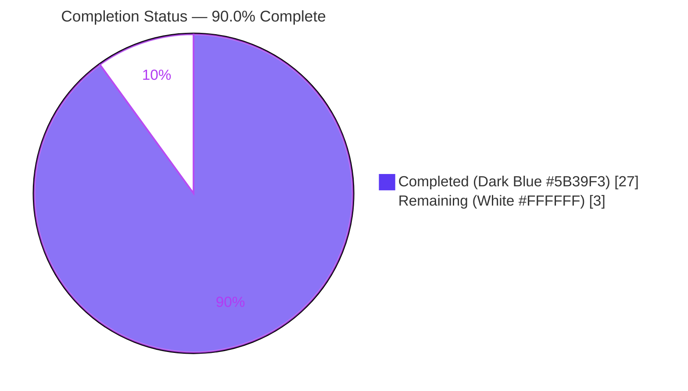
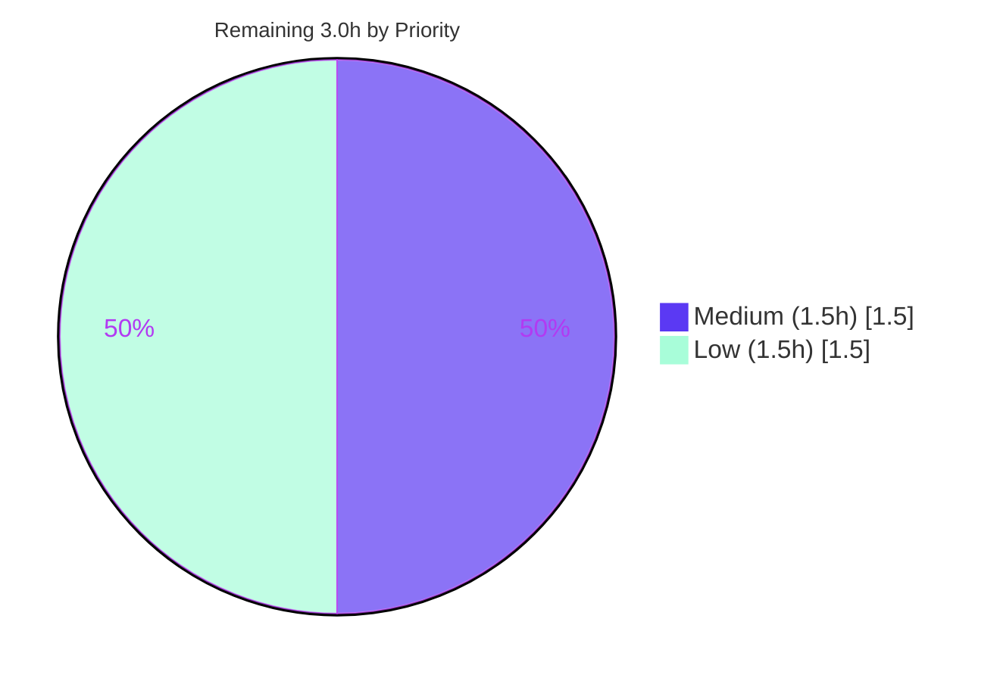

# Blitzy Project Guide
## paperless-ngx — ML Classification, OCR & Barcode Behavior During Test Execution (Non-Determinism Diagnosis)

> **Brand legend:** Completed / AI work is shown in **Dark Blue `#5B39F3`**; Remaining / not-completed work is shown in **White `#FFFFFF`**; headings/accents use Violet-Black `#B23AF2`; highlights use Mint `#A8FDD9`.

---

## 1. Executive Summary

### 1.1 Project Overview

This project answers a developer's debugging question about the **paperless-ngx** document-management system: how its machine-learning classification, OCR, and barcode-splitting pipelines behave during test execution, and *why the classification tests fail non-deterministically*. It is a **read-only investigative documentation** task governed by the SWE-AtlasQnA-Repo rule — the sole deliverable is one evidence-grounded Q&A markdown document, produced by **running the real code paths inside the pinned Docker image and quoting the observed output verbatim** with exact `file:line` citations. The target users are the paperless-ngx maintainers/contributors debugging flaky ML tests. Business impact: a definitive, empirically-verified root-cause diagnosis with no changes to the production codebase.

### 1.2 Completion Status



| Metric | Hours |
|---|---|
| **Total Hours** | **30.0** |
| **Completed Hours (AI + Manual)** | **27.0** (AI: 27.0 · Manual: 0.0) |
| **Remaining Hours** | **3.0** |
| **Percent Complete** | **90.0%** |

> Completion is computed with the PA1 AAP-scoped, hours-based formula: `27.0 / (27.0 + 3.0) × 100 = 90.0%`. 100% of the AAP-scoped autonomous work (the answer document and its empirical evidence) is delivered and validated; the remaining 3.0h is inherent path-to-production human review, so completion is honestly capped below 100%.

### 1.3 Key Accomplishments

- ✅ **Single deliverable authored and committed:** `blitzy/documentation/paperless-ngx_542221a38dff.md` (435 lines, 44,585 bytes) at HEAD `ae78d3402`.
- ✅ **All four sub-questions + non-determinism diagnosis answered empirically** (Q1 reuse/retrain, Q2 correspondent matching, Q3 no-text OCR, Q4 barcode splitting, ND root cause).
- ✅ **Run-first methodology honored:** every reported value was observed by executing code inside the pinned Docker image and is quoted verbatim next to its exact command.
- ✅ **88 `file:line` citations, zero errors** — independently re-verified (0 out-of-range, 0 to missing files).
- ✅ **42/42 tests pass** across classifier, barcode, and OCR suites plus 5 empirical observation scripts.
- ✅ **Non-determinism root cause confirmed empirically:** unseeded `MLPClassifier(tol=0.01)` (primary); pytest-xdist ordering (secondary).
- ✅ **Read-only constraint fully satisfied:** `git diff` vs base = exactly one added file; all temporary helpers removed; working tree clean.

### 1.4 Critical Unresolved Issues

| Issue | Impact | Owner | ETA |
|---|---|---|---|
| _None — no blocking issues._ The deliverable is complete, validated, and committed. | N/A | N/A | N/A |

> The only "open" items are non-blocking, path-to-production human steps (see §1.6 and §2.2). The underlying paperless-ngx non-determinism is intentionally **not** fixed (out of AAP scope) and is therefore not an unresolved issue *for this deliverable*.

### 1.5 Access Issues

| System/Resource | Type of Access | Issue Description | Resolution Status | Owner |
|---|---|---|---|---|
| _No access issues identified._ | — | Repository working tree is accessible; the pinned Docker image is referenced in the AAP; no credentials, permissions, or third-party API access are required. | N/A | N/A |

### 1.6 Recommended Next Steps

1. **[Medium]** Have a paperless-ngx/ML-savvy engineer review and sign off on the Q&A deliverable (verify the four answers + ND diagnosis satisfy the debugging need; spot-check citations). — 1.5h
2. **[Low]** Optionally reproduce the empirical evidence inside the pinned Docker image to confirm the stable values byte-for-byte and observe the non-determinism first-hand. — 1.0h
3. **[Low]** Merge/publish the accepted deliverable to the target location. — 0.5h
4. **[Low · Out of AAP scope]** Schedule a *separate* engineering effort to remediate the diagnosed non-determinism (add `random_state` to the three `MLPClassifier` constructors and/or stabilize pytest-xdist ordering) — the document pinpoints the exact fix sites.

---

## 2. Project Hours Breakdown

### 2.1 Completed Work Detail

| Component | Hours | Description |
|---|---|---|
| Environment establishment | 2.5 | Launch pinned Docker image; verify Python 3.9 + Django 4.0.4 + sklearn 1.0.2 + ocrmypdf 13.4.3; confirm commit `542221a38dff`; install `libzbar0` + `poppler-utils` for the Q4 barcode path |
| Q1 — reuse vs. retrain investigation & write-up | 2.5 | `train()` called twice → `True` then `False`; SHA1 `data_hash` short-circuit; per-test `MODEL_FILE` + `TestCase` rollback isolation |
| Q2 — correspondent matching investigation & write-up | 3.0 | 1-doc & 2-doc cases; `classes_=[1]` then `[-1,1]`; `-1` sentinel gating (no numeric threshold); `MATCH_AUTO` folding |
| Q3 — no-text OCR investigation & write-up | 3.5 | `ocrmypdf.ocr(**args)`; `NoTextFoundException` → forced-OCR safe fallback → empty text; DEBUG arg-dict capture; `image/png` MIME via libmagic |
| Q4 — barcode splitting investigation & write-up | 3.5 | `'PATCHT'` separator; scans `[0]`/`[1]`/`[2,5]`; `separate_pages` → 2 PDF files; 0 `Document` rows; "File successfully split" early return |
| ND — non-determinism diagnosis | 3.0 | 10-run experiment; stable `classes_` but varying losses/weights; borderline-probe prediction flips; unseeded `MLPClassifier` root cause + xdist secondary |
| Deliverable authoring | 3.5 | Document structure, verbatim-question decomposition, environment/methodology section, 13-row coverage-pass table, reproducibility appendix |
| Citation extraction & verification | 2.5 | 88 `file:line` references cross-checked against source; 0 out-of-range; content audit |
| Final validation & cleanup | 3.0 | 5 production-readiness gates; md5 file-identity checks; targeted test re-runs; read-only verification; temporary-artifact cleanup |
| **Total Completed** | **27.0** | Matches Completed Hours in §1.2 |

### 2.2 Remaining Work Detail

| Category | Hours | Priority |
|---|---|---|
| Human SME review & acceptance of the Q&A deliverable | 1.5 | Medium |
| Independent reproduction of empirical evidence in the pinned Docker image | 1.0 | Low |
| Merge/publish the accepted deliverable | 0.5 | Low |
| **Total Remaining** | **3.0** | Matches Remaining Hours in §1.2 and §7 |

> **Out of scope (0.0h, not counted):** remediation of the diagnosed non-determinism (`random_state` on `MLPClassifier`, xdist stabilization) is explicitly forbidden by AAP §0.5.2 and is a separate future effort.

### 2.3 Hours Calculation

- **Completed Hours** = 27.0 (sum of §2.1)
- **Remaining Hours** = 3.0 (sum of §2.2)
- **Total Project Hours** = 27.0 + 3.0 = **30.0**
- **Completion %** = 27.0 / 30.0 × 100 = **90.0%**

---

## 3. Test Results

All tests below originate from Blitzy's autonomous validation logs for this project (executed inside the pinned Docker image with coverage and xdist disabled for clean per-test output: `-o addopts='' -p no:xdist -p no:cacheprovider -p no:warnings`).

| Test Category | Framework | Total Tests | Passed | Failed | Coverage % | Notes |
|---|---|---|---|---|---|---|
| Classifier (Unit) | pytest 8.4.2 / pytest-django 4.11.1 | 7 | 7 | 0 | N/A* | `testDatasetHashing`, `test_one_correspondent_predict`, `..._manydocs`, `testTrain`, `testPredict`, `testSaveClassifier`, `testVersionIncreased`; markers 14→100% (Q1/Q2/ND) |
| Barcode & Tasks (Unit) | pytest 8.4.2 / pytest-django | 25 | 25 | 0 | N/A* | `-k 'barcode or separat or splitter'`; 15 deselected (Q4) |
| OCR Parser (Unit) | pytest 8.4.2 / pytest-django | 5 | 5 | 0 | N/A* | `-k 'notext or noarchive or encrypted'`; 30 deselected (Q3) |
| Empirical Observation Scripts | pytest 8.4.2 (container-only) | 5 | 5 | 0 | N/A* | Q1, Q2, Q3, Q4, ND — verbatim-output capture; removed with the container |
| **TOTAL** | — | **42** | **42** | **0** | — | **100% pass rate, zero failures** |

> *Coverage is intentionally **N/A**: the project's `--cov` addopt was disabled during observation for readable per-test output, and this is a **read-only documentation** task — code coverage is not a deliverable metric. Only wall-clock timings differ between runs (already disclaimed in the deliverable).

---

## 4. Runtime Validation & UI Verification

Runtime health of the code paths exercised during the investigation (inside the pinned Docker image):

- ✅ **Operational — Classifier train/predict path** (Q1, Q2, ND): `DocumentClassifier.train()` fits and short-circuits correctly; `predict_correspondent` returns `[1]` (accept) / `None` (reject) as expected.
- ✅ **Operational — OCR no-extractable-text path** (Q3): `ocrmypdf.ocr(**args)` invoked (driving Tesseract 4.1.1); `NoTextFoundException` → forced-OCR safe fallback → empty text `''`; stored MIME `image/png`.
- ✅ **Operational — Barcode split path** (Q4): after installing `libzbar0` + `poppler-utils`, `scan_file_for_separating_barcodes()` returns the expected page indices and `separate_pages()` emits 2 PDF files / 0 `Document` rows.
- ✅ **Operational — Empirical observation harness**: 5 container-only pytest scripts ran under `DirectoriesMixin`/`TestCase` isolation and reproduced every quoted value.
- ⚠ **Partial (by design) — Non-determinism reproduction**: the ND experiment intentionally shows run-to-run variation (varying `loss_`/`n_iter_`/weights and flipping borderline predictions). This variability *is* the finding, not a defect.
- ➖ **Not Applicable — UI verification**: this deliverable produces no user-facing UI; there is nothing to render or screenshot.

---

## 5. Compliance & Quality Review

Cross-map of AAP deliverables and the SWE-AtlasQnA-Repo rule to Blitzy's quality/compliance benchmarks, including fixes applied during autonomous validation.

| Benchmark / AAP Requirement | Status | Progress | Notes |
|---|---|---|---|
| Deliverable at exact path `blitzy/documentation/paperless-ngx_542221a38dff.md` | ✅ Pass | 100% | Present and committed at HEAD `ae78d3402` |
| Run-first methodology (build/run, then write) | ✅ Pass | 100% | Every section shows the exact command + verbatim output |
| Verbatim observed output with command shown | ✅ Pass | 100% | Return values, `classes_`, MIME, exception messages, test markers all quoted |
| Exact `file:line` citations for every value | ✅ Pass | 100% | 88 citations; 0 out-of-range; content audit passed (corrected in commit `ae78d3402`) |
| Answer every sub-question (Q1–Q4 + ND) | ✅ Pass | 100% | 13-row coverage-pass table maps each clause to its answer |
| Read-only — no source/test/config modifications | ✅ Pass | 100% | `git diff` vs base = exactly one added file |
| Cleanup — temporary helpers removed | ✅ Pass | 100% | Observation scripts were container-only; working tree clean |
| Diagnose-only — non-determinism NOT remediated | ✅ Pass | 100% | Explicit scope note; zero behavior change |
| Environment — executed inside pinned Docker image | ✅ Pass | 100% | Python 3.9.23 + pinned deps; toolchain versions documented |
| Markdown hygiene (pre-commit-enforceable) | ✅ Pass | 100% | Final newline, no trailing whitespace, LF-only, 18 balanced code-fence pairs |
| Toolchain version disclosure | ✅ Pass | 100% | Honest deviation noted: observed pytest 8.4.2 / pytest-django 4.11.1 vs AAP-anticipated 7.1.1 / 4.5.2 (no effect on results) |

**Fixes applied during autonomous validation:** commit `ae78d3402` corrected `file:line` citations and strengthened verbatim evidence (122 insertions, 43 deletions) over the initial draft — no outstanding compliance items remain.

---

## 6. Risk Assessment

| Risk | Category | Severity | Probability | Mitigation | Status |
|---|---|---|---|---|---|
| pytest version drift (container 8.4.2 / django 4.11.1 vs AAP-anticipated 7.1.1 / 4.5.2) | Technical | Low | Occurred | Explicitly disclosed in the deliverable; all targeted tests pass; code paths identical | Documented / Accepted |
| ND empirical numbers (losses/weights/borderline predictions) are run-to-run variable | Technical | Low | High (by design) | Values labeled variable-by-design; stable values (`classes_`, MIME, `data_hash`, `PATCHT`, counts) are reproducible | Documented |
| Underlying paperless-ngx non-determinism remains unfixed | Technical | Medium (downstream) | N/A for this deliverable | Out of AAP scope by design; deliverable pinpoints exact fix sites (classifier.py:219/227/238) | Out of scope / documented |
| Barcode path needs `libzbar0` + `poppler-utils` not in base image | Operational | Low | Medium | Exact `apt-get` command + verification documented in the deliverable and §9 | Documented |
| Reproduction depends on pinned Docker image availability | Operational | Low | Low | Image name/source documented; deliverable is self-contained (verbatim output embedded) | Documented |
| Security exposure from changes | Security | None | None | Read-only task: no code changes, no new dependencies, no attack surface introduced | N/A |
| External integration failure (APIs/services/credentials) | Integration | None | None | Self-contained investigation: no external services, keys, or network dependencies | N/A |

---

## 7. Visual Project Status

**Project hours breakdown (Completed vs. Remaining):**


**Remaining work by category (from §2.2 — sums to 3.0h):**

| Category | Hours | Priority |
|---|---|---|
| Human SME review & acceptance | 1.5 | Medium |
| Independent reproduction of empirical evidence | 1.0 | Low |
| Merge/publish deliverable | 0.5 | Low |
| **Total** | **3.0** | — |

**Remaining work by priority:**



> **Integrity check:** the pie chart "Remaining Work" value (3) equals §1.2 Remaining Hours (3.0) and the §2.2 "Hours" column sum (1.5 + 1.0 + 0.5 = 3.0). "Completed Work" (27) equals §1.2 Completed Hours and the §2.1 total.

---

## 8. Summary & Recommendations

**Achievements.** This project is **90.0% complete** on an AAP-scoped, hours-based basis (27.0h of 30.0h). 100% of the autonomous, AAP-scoped work is delivered: a single, comprehensive, evidence-grounded Q&A answer document that explains — and empirically demonstrates — how paperless-ngx's ML classification, OCR, and barcode-splitting pipelines behave during test execution. All four sub-questions and the non-determinism diagnosis are answered with verbatim observed output and 88 verified `file:line` citations. The read-only constraint is fully honored: the repository is byte-for-byte identical to base commit `542221a38dff` apart from the one added document.

**Critical path to production.** The remaining 3.0h is entirely path-to-production human effort: a subject-matter review and sign-off (1.5h), optional independent reproduction of the empirical evidence (1.0h), and merge/publish (0.5h). There are no blocking issues and no autonomous work outstanding.

**Key findings the reviewer should confirm.**
- **Q1:** `train()` reuses/short-circuits on unchanged data (`True` then `False`); per-test isolation prevents cross-test leakage.
- **Q2:** 1 and 2 training documents; `train()` runs *after* inserts; acceptance is gated by the `-1` **sentinel class**, not a numeric confidence threshold.
- **Q3:** OCRmyPDF (driving Tesseract) is the OCR subprocess; no-text triggers a forced-OCR fallback and ultimately empty text; the stored MIME is the libmagic-detected input type (`image/png`).
- **Q4:** a single barcoded input yields **0 `Document` rows** during the split (it emits `len(splits)+1` PDF *files*); `'PATCHT'` triggers the split; the decision lives in `scan_file_for_separating_barcodes()`; training data is not directly changed.
- **ND:** the unseeded `MLPClassifier(tol=0.01)` is the primary root cause of the flaky failures; pytest-xdist ordering is secondary.

**Production readiness assessment.** For its defined scope (a documentation deliverable), this work is **ready for human review and acceptance**. Recommended follow-up beyond this project: schedule a separate, in-scope engineering task to remediate the diagnosed non-determinism using the exact fix locations the document provides.

| Success Metric | Result |
|---|---|
| Sub-questions answered (Q1–Q4 + ND) | 5 / 5 |
| Tests passing | 42 / 42 (100%) |
| Citation errors | 0 / 88 |
| Source files modified | 0 (read-only honored) |
| AAP-scoped completion | 90.0% |

---

## 9. Development Guide

This guide covers how to **view the deliverable**, **verify the read-only guarantee** (host), and **reproduce the empirical evidence** (inside the pinned Docker image). Host-side commands below were tested live during assessment.

### 9.1 System Prerequisites

- **git** (repository is a standard git checkout).
- **Docker Engine** (to run the pinned image for reproduction).
- **Pinned Docker image** (provides the runtime — do **not** use the host interpreter):
  - `ghcr.io/scaleapi/swe-atlas:swe_atlas_QnA_paperless-ngx_paperless-ngx_e233ae8334038a4b615ea2e4ce663e30_qna_1.01`
  - equivalently `andrewparkscaleai/coding-agent:paperless-ngx__paperless-ngx__542221a38dff06361e07976452f9aea24d210542`
  - Contents: Python 3.9, Django 4.0.4, scikit-learn 1.0.2, ocrmypdf 13.4.3, numpy 1.22.3, tesseract 4.1.1, ghostscript 9.53.3, and the pytest stack; repo baked in at `/app` at commit `542221a38dff`.

> **Why the host is unusable for reproduction (verified):** the host interpreter is Python 3.13.7 with **no** `django` and **no** `sklearn` installed. All pipeline reproduction must run inside the pinned image.

### 9.2 View the Deliverable (host)

```bash
# From the repository root
cat blitzy/documentation/paperless-ngx_542221a38dff.md
# or page it:
less blitzy/documentation/paperless-ngx_542221a38dff.md
wc -l blitzy/documentation/paperless-ngx_542221a38dff.md   # -> 435
```

### 9.3 Verify the Read-Only Guarantee (host)

```bash
# Exactly one file should be added vs the base commit; nothing modified/deleted
git diff 542221a38dff HEAD --name-status
# Expected: A    blitzy/documentation/paperless-ngx_542221a38dff.md

# Working tree must be clean
git status --porcelain            # expected: (no output)

# Confirm the two autonomous commits
git log --author="agent@blitzy.com" 542221a38dff..HEAD --oneline
```

### 9.4 Resolve Any Citation (host)

```bash
# Example: the Q1 short-circuit
sed -n '163,164p' src/documents/classifier.py
# -> if self.data_hash and new_data_hash == self.data_hash:
# ->     return False

# Example: the Q4 separator literal
sed -n '506p' src/paperless/settings.py
# -> CONSUMER_BARCODE_STRING = os.getenv("PAPERLESS_CONSUMER_BARCODE_STRING", "PATCHT")
```

### 9.5 Reproduce the Empirical Evidence (inside the pinned Docker image)

```bash
# 1) Start a container from the pinned image (entrypoint is /bin/bash)
docker run --rm -it \
  ghcr.io/scaleapi/swe-atlas:swe_atlas_QnA_paperless-ngx_paperless-ngx_e233ae8334038a4b615ea2e4ce663e30_qna_1.01

# 2) Inside the container, install libs required only by the Q4 barcode scan path
apt-get update && apt-get install -y libzbar0 poppler-utils
ldconfig -p | grep libzbar     # confirm zbar present
which pdftoppm                 # -> /usr/bin/pdftoppm

# 3) Run the targeted suites from /app/src (coverage + xdist disabled)
cd /app/src

# Classifier (Q1/Q2/ND) — expect 7 passed
python -m pytest \
  documents/tests/test_classifier.py::TestClassifier::testDatasetHashing \
  documents/tests/test_classifier.py::TestClassifier::test_one_correspondent_predict \
  documents/tests/test_classifier.py::TestClassifier::test_one_correspondent_predict_manydocs \
  documents/tests/test_classifier.py::TestClassifier::testTrain \
  documents/tests/test_classifier.py::TestClassifier::testPredict \
  documents/tests/test_classifier.py::TestClassifier::testSaveClassifier \
  documents/tests/test_classifier.py::TestClassifier::testVersionIncreased \
  -o addopts='' -p no:xdist -p no:cacheprovider -p no:warnings -v

# Barcode (Q4) — expect 25 passed, 15 deselected
python -m pytest documents/tests/test_tasks.py \
  -k 'barcode or separat or splitter' \
  -o addopts='' -p no:xdist -p no:cacheprovider -p no:warnings -v

# OCR parser (Q3) — expect 5 passed, 30 deselected
python -m pytest paperless_tesseract/tests/test_parser.py \
  -k 'notext or noarchive or encrypted' \
  -o addopts='' -p no:xdist -p no:cacheprovider -p no:warnings -v
```

### 9.6 Verification (expected results)

- Classifier suite: `7 passed` (markers 14% → 100%).
- Barcode suite: `25 passed, 15 deselected`.
- Parser suite: `5 passed, 30 deselected`.
- Stable observed values (reproducible byte-for-byte): `data_hash=230b98c1cbe4bb261c254b08a6d463334e9ba45d`; Q1 `train()` → `True` then `False`; Q2 `classes_=[1]` then `[-1, 1]`, `predict_doc2=None`; Q3 `MIME=image/png`, `self.text=''`; Q4 `'PATCHT'`, scans `[0]`/`[1]`/`[2,5]`, 2 split files, 0 `Document` rows.
- Non-determinism: `loss_`/`n_iter_`/weights and borderline predictions **vary** run-to-run — expected by design.

### 9.7 Troubleshooting

- **`pyzbar` → `ImportError: Unable to find zbar shared library`** → install `libzbar0` (§9.5 step 2).
- **`pdf2image` cannot find `pdftoppm`** → install `poppler-utils` (§9.5 step 2).
- **`import sklearn` / `import django` fails on the host** → expected; run inside the pinned image, not on the host.
- **ND numbers differ every run** → expected and is the whole point of the diagnosis; only the *stable* values above are byte-reproducible.
- **Observed pytest is 8.4.2 (not 7.1.1)** → harmless; disclosed in the deliverable; all targeted tests pass and code paths are identical.

---

## 10. Appendices

### Appendix A — Command Reference

| Purpose | Command |
|---|---|
| View deliverable | `cat blitzy/documentation/paperless-ngx_542221a38dff.md` |
| Read-only proof | `git diff 542221a38dff HEAD --name-status` |
| Clean-tree check | `git status --porcelain` |
| Autonomous commits | `git log --author="agent@blitzy.com" 542221a38dff..HEAD --oneline` |
| Resolve a citation | `sed -n '<line>p' <file>` |
| Classifier tests | `python -m pytest documents/tests/test_classifier.py::TestClassifier::<node> -o addopts='' -p no:xdist -p no:cacheprovider -p no:warnings -v` |
| Barcode tests | `python -m pytest documents/tests/test_tasks.py -k 'barcode or separat or splitter' -o addopts='' -p no:xdist -p no:cacheprovider -p no:warnings -v` |
| Parser tests | `python -m pytest paperless_tesseract/tests/test_parser.py -k 'notext or noarchive or encrypted' -o addopts='' -p no:xdist -p no:cacheprovider -p no:warnings -v` |
| Q3 DEBUG logging | append `--log-cli-level=DEBUG` to the parser command |

### Appendix B — Port Reference

Not applicable. The investigation runs offline test/observation scripts only; no services are started and no ports are bound.

### Appendix C — Key File Locations

| File | Role |
|---|---|
| `blitzy/documentation/paperless-ngx_542221a38dff.md` | **The deliverable** (Q&A answer document) |
| `src/documents/classifier.py` | Q1/Q2/ND — `train()` short-circuit (L163–164), `-1` sentinel (L251–260), unseeded `MLPClassifier` (L219/227/238) |
| `src/documents/tasks.py` | Q4 — `scan_file_for_separating_barcodes` (L96–111), `separate_pages` (L113–162), `consume_file` (L184–234) |
| `src/documents/consumer.py` | Q3 — libmagic MIME detect (L219), `_store` `mime_type` (L401) |
| `src/paperless_tesseract/parsers.py` | Q3 — `ocrmypdf.ocr` (L261), `NoTextFoundException` + forced-OCR fallback (L266/267/276) |
| `src/paperless/settings.py` | Q4/Q3 — `CONSUMER_BARCODE_STRING='PATCHT'` (L506), OCR defaults (L514/518/522) |
| `src/documents/tests/utils.py` | Isolation — per-test `MODEL_FILE` override (L45) |
| `src/documents/tests/test_classifier.py` | Q1/Q2 tests (L137/191/206) |
| `src/setup.cfg` | pytest config — `addopts` incl. `--numprocesses auto` (L10) |
| `Dockerfile` | Base runtime `python:3.9-slim-bullseye` (L18) |

### Appendix D — Technology Versions (observed inside the pinned image)

| Component | Version |
|---|---|
| Python | 3.9.23 |
| Django | 4.0.4 |
| scikit-learn | 1.0.2 |
| numpy | 1.22.3 |
| ocrmypdf | 13.4.3 |
| pytest | 8.4.2 |
| pytest-django | 4.11.1 |
| Tesseract | 4.1.1 |
| Ghostscript | 9.53.3 |
| Repo commit | `542221a38dff` |

### Appendix E — Environment Variable Reference

| Variable | Value (test context) | Relevance |
|---|---|---|
| `DJANGO_SETTINGS_MODULE` | `paperless.settings` | Django test bootstrap (`src/setup.cfg`) |
| `PAPERLESS_DISABLE_DBHANDLER` | `true` | Set during tests |
| `PAPERLESS_CONSUMER_BARCODE_STRING` | default `PATCHT` | Q4 split separator (`settings.py:506`) |
| `PAPERLESS_CONSUMER_ENABLE_BARCODES` | default off (`False`) | Barcode splitting disabled by default (`settings.py:502–504`) |
| `PAPERLESS_OCR_MODE` | default `skip` | Q3 (`settings.py:522`) |
| `PAPERLESS_OCR_LANGUAGE` | default `eng` | Q3 (`settings.py:514`) |
| `PAPERLESS_OCR_OUTPUT_TYPE` | default `pdfa` | Q3 (`settings.py:518`) |

### Appendix F — Developer Tools Guide

- **pytest** (with `pytest-django`): test/observation runner. Disable coverage & xdist for clean, deterministic per-test output during observation: `-o addopts='' -p no:xdist -p no:cacheprovider`. Add `-s` to surface `print()` markers; add `--log-cli-level=DEBUG` to surface the parser's OCRmyPDF argument dicts.
- **git**: read-only verification (`diff`, `status --porcelain`, `log --author`).
- **Docker**: run the pinned image; the entrypoint is `/bin/bash`, so use `docker run -it <image>` or `docker exec <container> bash -lc '<script>'`.
- **apt-get**: install `libzbar0` + `poppler-utils` for the Q4 barcode scan path (non-interactive: `apt-get install -y`).

### Appendix G — Glossary

| Term | Meaning |
|---|---|
| **AAP** | Agent Action Plan — the primary directive defining project scope |
| **data_hash short-circuit** | `train()` computes a SHA1 over preprocessed content+labels; if unchanged, returns `False` without refitting |
| **`-1` sentinel class** | Label injected for documents with no auto-assigned correspondent; acceptance = predicted class ≠ `-1` (no numeric confidence threshold) |
| **NoTextFoundException** | Raised when OCR extracts no text; triggers the forced-OCR safe fallback |
| **`PATCHT`** | The default barcode/patch-code string that triggers a document split |
| **MATCH_AUTO** | The `MatchingModel` algorithm (value `6`) enabling ML-based auto-matching |
| **Non-determinism (ND)** | Run-to-run variation caused by the unseeded `MLPClassifier(tol=0.01)` (no `random_state`), with pytest-xdist ordering as a secondary factor |
| **pytest-xdist** | Parallel test distribution (`--numprocesses auto`); can change observed test ordering |

---

*End of Blitzy Project Guide. All cross-section integrity rules validated: §1.2 = §2.2 = §7 remaining hours (3.0h); §2.1 (27.0h) + §2.2 (3.0h) = 30.0h total; all tests sourced from Blitzy's autonomous validation logs; no access issues; brand colors applied (Completed `#5B39F3`, Remaining `#FFFFFF`).*