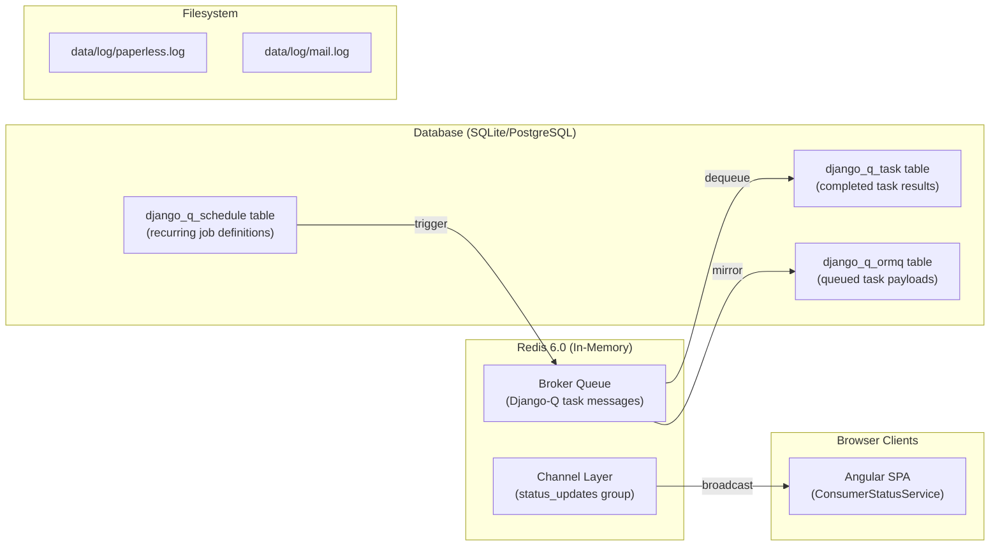
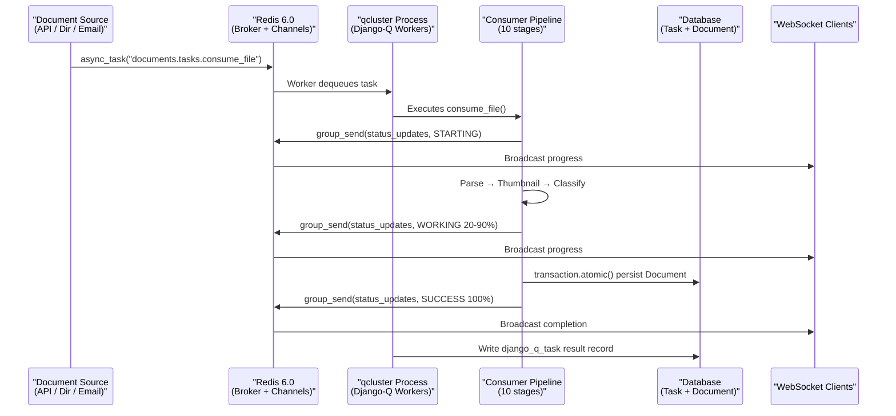

# Technical Specification

# 0. Agent Action Plan

## 0.1 Intent Clarification

### 0.1.1 Core Feature Objective

Based on the prompt, the Blitzy platform understands that the new feature requirement is to produce a comprehensive investigative documentation artifact that maps the complete background processing architecture of paperless-ngx during document ingestion — tracing every layer from the runtime services orchestrated by Supervisord, through the Django-Q task queue backed by Redis, down to the individual Python callsites that enqueue work.

The specific requirements are:

- **Runtime Service Topology**: Identify and explain every service involved in background processing at runtime — the Gunicorn/Uvicorn ASGI web server, the `document_consumer` directory watcher, and the `qcluster` Django-Q worker cluster — and how they coordinate through shared Redis and database infrastructure.
- **Background Job Lifecycle Visibility**: Document how a background job materializes after creation — what data structures represent it in Redis, what Django-Q ORM models track it, and how it transitions through its lifecycle states.
- **Waiting vs. Active Work Differentiation**: Explain the mechanism by which the system distinguishes between tasks that are queued (waiting in Redis) and tasks that are actively being executed by a Django-Q worker process.
- **Task State Persistence and Storage**: Map the precise locations where task state is persisted — the Redis broker for in-flight queue state, the `django_q.models.Task` and `django_q.models.OrmQ` ORM tables for result and schedule tracking, and the `django_q.models.Schedule` table for recurring jobs.
- **Post-Mortem Job Inspection**: Document how an operator can determine, after the fact, what happened to a given job — including the Django-Q `Task` model's `success`, `result`, `started`, `stopped`, and `attempt_count` fields, as well as the application-level log files (`paperless.log`, `mail.log`) and WebSocket status broadcasts.
- **Code-Level Task Origin Mapping**: Trace the exact Python callsites where `django_q.tasks.async_task` is invoked to enqueue background work — in `src/documents/views.py` (API uploads), `src/documents/management/commands/document_consumer.py` (filesystem watcher), `src/paperless_mail/mail.py` (email ingestion), and `src/documents/bulk_edit.py` (bulk operations).
- **Output Artifact**: A single Markdown document named `paperless-ngx_542221a38dff.md` placed in the `blitzy/documentation` directory, containing the complete analysis with rationale grounded in source code evidence.

Implicit requirements detected:

- The analysis must cover the **scheduled task infrastructure** — specifically the recurring `paperless_mail.tasks.process_mail_accounts` schedule registered via the `0002_auto_20201117_1334` migration in `src/paperless_mail/migrations/`.
- The documentation must address the **WebSocket real-time notification layer** (`src/paperless/consumers.py` and the `status_updates` channel group) since it is the primary mechanism by which background processing status is surfaced to end users.
- The investigation must cover Django-Q's `Q_CLUSTER` configuration in `src/paperless/settings.py` (lines 449–457), including the `recycle`, `retry`, `timeout`, and `workers` parameters that govern worker behavior at runtime.
- The document must explain how the `CHANNEL_LAYERS` Redis configuration (capacity: 2000, expiry: 15s) interacts with progress broadcasting from background workers.

### 0.1.2 Special Instructions and Constraints

- **Read-Only Codebase Constraint**: The user explicitly states: "Don't modify any repository source files." No existing files in the source repository shall be altered. The only permitted write operation is the creation of the `paperless-ngx_542221a38dff.md` documentation artifact in `blitzy/documentation`.
- **Temporary Artifact Permission**: If temporary scripts or diagnostic artifacts are needed to observe behavior, they may be created but must be cleaned up afterward, leaving the codebase unchanged.
- **Implementation Rule — SWE-AtlasQnA-Repo**: The implementation rules specify that a new Markdown document named after the source branch (`paperless-ngx_542221a38dff.md`) must be created in the `blitzy/documentation` directory. The document must comprehensively answer the questions posed and provide thinking/rationale behind the answers, grounded in the code as the source of truth, with no assumptions.
- **Evidence-Based Analysis**: All conclusions must be traced back to specific file paths and line ranges in the repository. No assumptions about behavior are permitted — only observations derived from reading the source code.

### 0.1.3 Technical Interpretation

These feature requirements translate to the following technical implementation strategy:

- To **map the runtime service topology**, we will analyze `docker/supervisord.conf` (which defines the three managed processes), `src/paperless/settings.py` (which configures the `Q_CLUSTER` and `CHANNEL_LAYERS`), and `docker/docker-prepare.sh` (which gates startup on Redis and database readiness).
- To **explain background job lifecycle visibility**, we will trace the Django-Q task queue flow from `async_task()` invocation through Redis enqueueing, worker dequeue, execution, and result persistence in the `django_q` ORM tables (`Task`, `OrmQ`, `Schedule`).
- To **differentiate waiting vs. active work**, we will document how Django-Q's sentinel/pusher/worker architecture uses Redis lists and the `OrmQ` model to track queued vs. executing tasks.
- To **map task state persistence**, we will catalog every storage location: Redis (broker queue), the `django_q_task` database table (completed task results), the `django_q_schedule` table (recurring schedules), `paperless.log` and `mail.log` (application-level diagnostics), and WebSocket broadcasts (real-time client notifications).
- To **enable post-mortem inspection**, we will document the `Task` model fields, the log file structure, and the `LogViewSet` REST API endpoint at `/api/logs/`.
- To **trace code-level task origins**, we will map every `async_task()` callsite across the codebase with its exact function reference string, arguments, and triggering context.
- To **produce the output artifact**, we will create `blitzy/documentation/paperless-ngx_542221a38dff.md` containing the complete analysis.

## 0.2 Repository Scope Discovery

### 0.2.1 Comprehensive File Analysis

The following files have been identified as directly relevant to understanding background processing behavior in paperless-ngx. Every file has been inspected via `read_file` or `get_source_folder_contents` to confirm its role.

**Core Background Task Infrastructure**

| File Path | Role in Background Processing | Status |
|---|---|---|
| `src/documents/tasks.py` | Defines all background task functions: `consume_file`, `index_optimize`, `index_reindex`, `train_classifier`, `sanity_check`, `bulk_update_documents`, and barcode-splitting helpers | Analyzed |
| `src/paperless/settings.py` (lines 414–472) | Configures `Q_CLUSTER` (name, catch_up, recycle, retry, timeout, workers, redis), `TASK_WORKERS` dynamic scaling, `THREADS_PER_WORKER`, and `CHANNEL_LAYERS` for WebSocket | Analyzed |
| `docker/supervisord.conf` | Defines the three Supervisord-managed processes: `gunicorn`, `consumer` (document_consumer), and `scheduler` (qcluster) | Analyzed |
| `docker/docker-prepare.sh` | Startup sequence gating on PostgreSQL and Redis readiness, `flock`-protected migrations, index rebuild | Analyzed |
| `docker/wait-for-redis.py` | Redis readiness probe using `redis.ping()` with 5 retries × 5s delay | Analyzed |

**Task Dispatch Callsites (where `async_task` is invoked)**

| File Path | Dispatch Context | Target Task |
|---|---|---|
| `src/documents/views.py` (lines 523–533) | `PostDocumentView.post()` — API document upload | `documents.tasks.consume_file` |
| `src/documents/management/commands/document_consumer.py` (lines 86–91) | `_consume()` — filesystem watcher detects new file | `documents.tasks.consume_file` |
| `src/paperless_mail/mail.py` (lines 336–349) | `MailAccountHandler.handle_message()` — email attachment extraction | `documents.tasks.consume_file` |
| `src/documents/bulk_edit.py` (lines 18, 31, 47, 63, 87) | `set_correspondent`, `set_document_type`, `add_tag`, `remove_tag`, `modify_tags` | `documents.tasks.bulk_update_documents` |

**Scheduled Task Registration**

| File Path | Schedule Configuration |
|---|---|
| `src/paperless_mail/migrations/0002_auto_20201117_1334.py` | Registers recurring Django-Q `Schedule` for `paperless_mail.tasks.process_mail_accounts` — runs every 10 minutes |

**WebSocket Status Broadcasting**

| File Path | Role |
|---|---|
| `src/paperless/consumers.py` | `StatusConsumer` WebSocket handler — joins `status_updates` group, serializes events to JSON |
| `src/paperless/asgi.py` | `ProtocolTypeRouter` dispatching WebSocket to `AuthMiddlewareStack` + `URLRouter` |
| `src/paperless/urls.py` (line 137) | WebSocket URL pattern: `ws/status/` mapped to `StatusConsumer.as_asgi()` |
| `src/documents/consumer.py` (lines 56–76, 226–232) | `_send_progress()` method and barcode-split status broadcast via `get_channel_layer().group_send()` |
| `src/documents/tasks.py` (lines 216–232) | Barcode-split success notification broadcast to `status_updates` group |

**Consumer Pipeline (ingestion orchestration)**

| File Path | Role |
|---|---|
| `src/documents/consumer.py` | 10-stage ingestion pipeline: file validation → duplicate check → MIME detection → parser selection → pre-consume hook → parsing → thumbnail → classification → atomic persist → post-consume hook |
| `src/documents/signals/__init__.py` | Defines three domain signals: `document_consumption_started`, `document_consumption_finished`, `document_consumer_declaration` |
| `src/documents/signals/handlers.py` | Post-consumption handlers: inbox tagging, correspondent matching, document type matching, tag matching, admin logging, search indexing |
| `src/documents/apps.py` | Registers six signal handlers on `document_consumption_finished` during `ready()` |

**Mail Ingestion Task Layer**

| File Path | Role |
|---|---|
| `src/paperless_mail/tasks.py` | `process_mail_accounts()` — iterates all `MailAccount` objects and delegates to `MailAccountHandler` |
| `src/paperless_mail/mail.py` | `MailAccountHandler` — IMAP connection, rule evaluation, attachment extraction, `async_task` dispatch |
| `src/paperless_mail/models.py` | `MailAccount` and `MailRule` ORM models defining account credentials, IMAP settings, and processing rules |

**Logging Infrastructure**

| File Path | Role |
|---|---|
| `src/paperless/settings.py` (lines 366–412) | Logging configuration: `paperless.log` and `mail.log` via `ConcurrentRotatingFileHandler`, console handler |
| `src/documents/loggers.py` | `LoggingMixin` providing correlation-group support for per-document log grouping |
| `src/documents/views.py` (lines 429–450) | `LogViewSet` — REST API for reading `paperless.log` and `mail.log` at `/api/logs/` |

**Docker Compose Deployment Topology**

| File Path | Role |
|---|---|
| `docker/compose/docker-compose.postgres.yml` | Defines three services: `broker` (Redis 6.0), `db` (PostgreSQL 13), `webserver` (Paperless-ngx) |
| `docker/compose/docker-compose.sqlite.yml` | Minimal topology: Redis + Paperless (SQLite embedded) |
| `docker/compose/docker-compose.postgres-tika.yml` | Full topology: Redis + PostgreSQL + Paperless + Tika + Gotenberg |

**Configuration and Runtime Settings**

| File Path | Role |
|---|---|
| `gunicorn.conf.py` | Gunicorn ASGI server: bind address, 2 workers, 120s timeout, `ConfigurableWorker` class |
| `src/paperless/workers.py` | `ConfigurableWorker` extending Uvicorn worker for `FORCE_SCRIPT_NAME` support |
| `Pipfile` | Declares `django-q ~=1.3`, `redis`, `channels ~=3.0`, `channels-redis` as runtime dependencies |
| `requirements.txt` | Pins `django-q==1.3.9`, `redis==3.5.3`, `channels==3.0.4`, `channels-redis==3.4.0` |

### 0.2.2 Web Search Research Conducted

No external web search was required for this analysis. The questions posed by the user are entirely answerable from the source code. The Django-Q library's behavior (task lifecycle, ORM models, Redis broker interaction) is well-documented through its presence in `Pipfile` (version `~=1.3`), `requirements.txt` (pinned at `1.3.9`), and its usage patterns across the codebase.

### 0.2.3 New File Requirements

A single new file is required per the implementation rules:

- **CREATE**: `blitzy/documentation/paperless-ngx_542221a38dff.md` — Comprehensive Markdown document answering all questions about background processing behavior, with code-grounded rationale. This file covers:
  - Runtime service topology and Supervisord process model
  - Django-Q task queue lifecycle (enqueue → execute → persist result)
  - Task state storage locations (Redis, `django_q_task`, `django_q_schedule`, log files)
  - Waiting vs. active work differentiation via Django-Q's internal sentinel/pusher/worker architecture
  - Post-mortem inspection mechanisms (Task ORM, log files, WebSocket history)
  - Complete `async_task()` callsite mapping with file paths, line numbers, and triggering contexts
  - Signal-driven post-consumption handler chain

## 0.3 Dependency Inventory

### 0.3.1 Private and Public Packages

The following packages are directly relevant to background processing behavior in paperless-ngx. All names and versions are extracted from `Pipfile` and `requirements.txt` (the pinned install manifest).

| Registry | Package Name | Version | Purpose in Background Processing |
|---|---|---|---|
| PyPI | `django-q` | `1.3.9` | Task queue framework: `async_task()` dispatch, `qcluster` management command, `Task`/`OrmQ`/`Schedule` ORM models, Redis broker integration |
| PyPI | `redis` | `3.5.3` | Python Redis client used by both Django-Q (broker transport) and Django Channels (WebSocket channel layer) |
| PyPI | `channels` | `3.0.4` | Django Channels ASGI framework: WebSocket protocol handling, `channel_layer.group_send()` for status broadcasts |
| PyPI | `channels-redis` | `3.4.0` | Redis-backed channel layer backend (`channels_redis.core.RedisChannelLayer`) for cross-process WebSocket message routing |
| PyPI | `django` | `4.0.4` | Web framework: ORM, signals, management commands, middleware pipeline, ASGI application |
| PyPI | `djangorestframework` | `3.13.1` | REST API framework: `PostDocumentView` upload endpoint that triggers `async_task()` |
| PyPI | `gunicorn` | `20.1.0` | ASGI web server running as Supervisord-managed process |
| PyPI | `uvicorn` | `0.17.6` | ASGI worker class underlying Gunicorn via `ConfigurableWorker` |
| PyPI | `asgiref` | `3.5.0` | `async_to_sync` adapter used in `consumer.py` and `tasks.py` to bridge sync-to-async channel layer calls |
| PyPI | `watchdog` | `2.1.7` | Filesystem polling observer used by `document_consumer` management command when inotify is unavailable |
| PyPI | `inotifyrecursive` | `0.3.5` | Linux inotify bindings for native filesystem event monitoring in the `document_consumer` |
| PyPI | `concurrent-log-handler` | `0.9.20` | `ConcurrentRotatingFileHandler` for safe multi-process log writes to `paperless.log` and `mail.log` |
| PyPI | `imap-tools` | `0.54.0` | IMAP client library used by `MailAccountHandler` for email scanning and attachment extraction |
| Docker | `redis` | `6.0` | Redis server container image used as both Django-Q broker and Channels layer backend |
| Docker | `postgres` | `13` | PostgreSQL database container (optional; SQLite is the default) |

### 0.3.2 Dependency Updates

No dependency updates are required for this task. The feature consists solely of producing a documentation artifact (`paperless-ngx_542221a38dff.md`) that analyzes existing behavior. No new packages need to be installed, no import changes are needed, and no configuration files require modification.

**Import analysis for existing `async_task` usage across the codebase:**

| File | Import Statement | Usage |
|---|---|---|
| `src/documents/views.py` (line 28) | `from django_q.tasks import async_task` | Used in `PostDocumentView.post()` at line 523 |
| `src/documents/management/commands/document_consumer.py` (line 13) | `from django_q.tasks import async_task` | Used in `_consume()` at line 86 |
| `src/documents/bulk_edit.py` (line 4) | `from django_q.tasks import async_task` | Used in 5 bulk edit functions |
| `src/paperless_mail/mail.py` (line 11) | `from django_q.tasks import async_task` | Used in `MailAccountHandler.handle_message()` at line 336 |
| `src/paperless_mail/migrations/0002_auto_20201117_1334.py` (line 6) | `from django_q.tasks import schedule` | Used to register recurring mail check schedule |

## 0.4 Integration Analysis

### 0.4.1 Existing Code Touchpoints

The background processing system in paperless-ngx involves six major integration points that the documentation artifact must thoroughly explain. Each touchpoint is identified below with the exact file, function, and approximate line range.

**Task Enqueueing Touchpoints (producers of background work)**

- **`src/documents/views.py` — `PostDocumentView.post()` (lines 497–535)**: When a user uploads a document via `POST /api/documents/post_document/`, the view writes the upload to a temporary file in `SCRATCH_DIR`, generates a `task_id` via `uuid.uuid4()`, and calls `async_task("documents.tasks.consume_file", ...)` with the temp file path, override metadata (filename, title, correspondent, document type, tags), and the task ID. This is the primary API-driven entry point for background ingestion.

- **`src/documents/management/commands/document_consumer.py` — `_consume()` (lines 46–97)**: The filesystem watcher (either inotify or polling-based) detects new files in `CONSUMPTION_DIR`, validates the file extension, optionally derives tags from subdirectory paths, and calls `async_task("documents.tasks.consume_file", filepath, ...)`. This is the filesystem-driven entry point.

- **`src/paperless_mail/mail.py` — `MailAccountHandler.handle_message()` (lines 272–361)**: For each qualifying email attachment, the handler writes the payload to a temp file in `SCRATCH_DIR`, then calls `async_task("documents.tasks.consume_file", path=temp_filename, ...)` with rule-derived overrides (filename, title, correspondent, document type, tags). This is the email-driven entry point.

- **`src/documents/bulk_edit.py` — Five bulk functions (lines 10–101)**: After performing bulk metadata updates (`set_correspondent`, `set_document_type`, `add_tag`, `remove_tag`, `modify_tags`), each function calls `async_task("documents.tasks.bulk_update_documents", document_ids=affected_docs)` to trigger index and signal-handler updates on modified documents.

**Task Execution Touchpoints (consumers of background work)**

- **`src/documents/tasks.py` — `consume_file()` (lines 184–252)**: The primary task function. It optionally scans for barcode separators, splits PDFs, and then delegates to `Consumer().try_consume_file()` for the full 10-stage pipeline. On completion, it returns a success string or raises `ConsumerError`.

- **`src/documents/tasks.py` — `bulk_update_documents()` (lines 270–280)**: Receives a list of document IDs, fires `post_save` signals for each document (triggering file rename logic), and updates the Whoosh search index via `AsyncWriter`.

**Scheduled Task Touchpoint**

- **`src/paperless_mail/migrations/0002_auto_20201117_1334.py` — `add_schedules()` (lines 9–15)**: Registers a recurring `Schedule` in Django-Q that calls `paperless_mail.tasks.process_mail_accounts` every 10 minutes. The `qcluster` process picks up this schedule and executes it on the configured interval.

**WebSocket Broadcasting Touchpoints**

- **`src/documents/consumer.py` — `_send_progress()` (lines 56–76)**: During ingestion, the `Consumer` class broadcasts progress updates to the `status_updates` channel group via `async_to_sync(self.channel_layer.group_send)()`. The payload includes `filename`, `task_id`, `current_progress`, `max_progress`, `status` (STARTING/WORKING/FAILED/SUCCESS), `message`, and `document_id`.

- **`src/documents/tasks.py` — barcode split notification (lines 216–232)**: After successfully splitting a barcode-separated PDF, the task broadcasts a `SUCCESS` status update directly to the `status_updates` group.

- **`src/paperless/consumers.py` — `StatusConsumer` (lines 9–33)**: The WebSocket endpoint at `ws/status/` that receives channel layer messages and forwards them as JSON to authenticated browser clients.

### 0.4.2 Task State Storage Architecture

Background task state is persisted across multiple locations:

- **Redis Broker Queue**: Tasks enqueued via `async_task()` are serialized and pushed into a Redis list managed by Django-Q. This is the transient, in-flight state.
- **`django_q_ormq` table**: Django-Q optionally mirrors queued tasks to the ORM for visibility; tasks appear here while waiting.
- **`django_q_task` table**: After a task completes (success or failure), Django-Q writes a `Task` record containing the function name, arguments, result, success boolean, start time, stop time, and attempt count.
- **`django_q_schedule` table**: Recurring schedules (like the 10-minute mail fetch) are stored here with their function reference, schedule type, interval, and last-run timestamp.
- **Log files**: Application-level logs in `paperless.log` and `mail.log` capture per-document ingestion progress, errors, and warnings with UUID-based correlation groups.
- **WebSocket channel layer**: Real-time status updates are broadcast through Redis-backed channels to connected browser clients but are not persisted (15-second message expiry).

## 0.5 Technical Implementation

### 0.5.1 File-by-File Execution Plan

Since the user's directive is to produce a documentation artifact without modifying existing files, the execution plan consists of a single file creation that synthesizes the analysis of all background processing code paths.

**Group 1 — Output Artifact**

- **CREATE**: `blitzy/documentation/paperless-ngx_542221a38dff.md`
  - Purpose: Comprehensive investigative document answering all user questions about background processing
  - Content structure: runtime service topology → task queue lifecycle → task state storage → waiting vs. active differentiation → post-mortem inspection → code-level dispatch mapping
  - Evidence basis: All claims grounded in specific source file paths and line numbers

**Group 2 — Files Analyzed (read-only, no modifications)**

| File | Analysis Focus |
|---|---|
| `docker/supervisord.conf` | Three-process runtime model (gunicorn, consumer, scheduler) |
| `src/paperless/settings.py` | `Q_CLUSTER` config (lines 449–457), `CHANNEL_LAYERS` (lines 178–187), worker scaling (lines 427–472) |
| `src/documents/tasks.py` | All task function definitions: `consume_file`, `bulk_update_documents`, `train_classifier`, `index_reindex`, `index_optimize`, `sanity_check` |
| `src/documents/views.py` | `PostDocumentView.post()` — API upload task dispatch (lines 497–535) |
| `src/documents/management/commands/document_consumer.py` | Filesystem watcher `_consume()` dispatch (lines 46–97), polling/inotify strategy selection (lines 156–240) |
| `src/documents/consumer.py` | 10-stage ingestion pipeline, `_send_progress()` WebSocket broadcasts, `Consumer.try_consume_file()` |
| `src/documents/bulk_edit.py` | Five bulk operation functions dispatching `bulk_update_documents` |
| `src/paperless_mail/mail.py` | `MailAccountHandler.handle_message()` email attachment dispatch (lines 272–361) |
| `src/paperless_mail/tasks.py` | `process_mail_accounts()` scheduled task function |
| `src/paperless_mail/migrations/0002_auto_20201117_1334.py` | Recurring schedule registration |
| `src/paperless/consumers.py` | `StatusConsumer` WebSocket handler |
| `src/paperless/asgi.py` | ASGI `ProtocolTypeRouter` multiplexing HTTP and WebSocket |
| `src/paperless/urls.py` | URL configuration including `ws/status/` WebSocket route |
| `src/documents/signals/__init__.py` | Three domain signal definitions |
| `src/documents/signals/handlers.py` | Post-consumption signal handlers: tagging, classification, indexing |
| `src/documents/apps.py` | Signal handler registration in `DocumentsConfig.ready()` |
| `src/documents/loggers.py` | `LoggingMixin` with UUID correlation group |
| `src/documents/models.py` | `Document` model, `Log` model |
| `gunicorn.conf.py` | ASGI server configuration: workers, timeout, lifecycle hooks |
| `src/paperless/workers.py` | `ConfigurableWorker` extending Uvicorn |
| `docker/docker-prepare.sh` | Startup readiness probes and migration locking |
| `docker/wait-for-redis.py` | Redis readiness probe |
| `docker/compose/docker-compose.postgres.yml` | Service topology: Redis, PostgreSQL, Paperless |
| `Pipfile` | Package declarations with version constraints |
| `requirements.txt` | Pinned dependency versions |

### 0.5.2 Implementation Approach

The implementation follows a structured analytical approach:

- **Establish the runtime foundation** by documenting the three Supervisord-managed processes and their startup sequence via `docker-prepare.sh`
- **Trace the task dispatch paths** by mapping every `async_task()` callsite, its arguments, the triggering user action, and the target task function
- **Explain the task queue internals** by documenting Django-Q's broker interaction with Redis, the `Q_CLUSTER` configuration parameters, and the worker lifecycle
- **Map task state persistence** by cataloging the `django_q_task`, `django_q_ormq`, and `django_q_schedule` database tables, the Redis transient state, and the application log files
- **Document the real-time feedback loop** by tracing WebSocket status broadcasts from `Consumer._send_progress()` through the Redis channel layer to `StatusConsumer` and the Angular SPA
- **Provide post-mortem inspection guidance** by explaining how the `Task` model, log files, and the `/api/logs/` REST endpoint can be used to audit completed jobs

### 0.5.3 Key Runtime Behavior Summary

The documentation artifact will explain the following runtime flow:

## 0.6 Scope Boundaries

### 0.6.1 Exhaustively In Scope

The following files, patterns, and topics are exhaustively in scope for the documentation artifact:

**Background Task Infrastructure**
- `src/documents/tasks.py` — All task function definitions
- `src/paperless/settings.py` — `Q_CLUSTER` (lines 449–457), `CHANNEL_LAYERS` (lines 178–187), worker scaling (lines 414–472), logging (lines 366–412)
- `docker/supervisord.conf` — Process topology
- `docker/docker-prepare.sh` — Startup readiness and migration locking
- `docker/wait-for-redis.py` — Redis probe

**Task Dispatch Callsites**
- `src/documents/views.py` — `PostDocumentView` (lines 491–535)
- `src/documents/management/commands/document_consumer.py` — `_consume()` (lines 46–97), `_consume_wait_unmodified()` (lines 99–125), `Command.handle()` (lines 156–240)
- `src/paperless_mail/mail.py` — `MailAccountHandler.handle_message()` (lines 272–361)
- `src/documents/bulk_edit.py` — All five bulk functions (lines 10–101)
- `src/paperless_mail/tasks.py` — `process_mail_accounts()` and `process_mail_account()`
- `src/paperless_mail/migrations/0002_auto_20201117_1334.py` — Recurring schedule registration

**Ingestion Pipeline**
- `src/documents/consumer.py` — Full `Consumer` class with `try_consume_file()`, `_send_progress()`, `_store()`, `_fail()`
- `src/documents/signals/__init__.py` — Signal definitions
- `src/documents/signals/handlers.py` — Post-consumption handlers
- `src/documents/apps.py` — Signal handler registration

**WebSocket and Real-Time Status**
- `src/paperless/consumers.py` — `StatusConsumer`
- `src/paperless/asgi.py` — ASGI protocol routing
- `src/paperless/urls.py` — WebSocket URL pattern (line 137)

**Logging and Post-Mortem Inspection**
- `src/documents/loggers.py` — `LoggingMixin`
- `src/documents/views.py` — `LogViewSet` (lines 429–450)
- `src/documents/models.py` — `Log` model (lines 285–313)

**Docker Deployment**
- `docker/compose/docker-compose.postgres.yml` — PostgreSQL topology
- `docker/compose/docker-compose.sqlite.yml` — Minimal topology
- `gunicorn.conf.py` — ASGI server config
- `src/paperless/workers.py` — Uvicorn worker

**Dependency Manifests**
- `Pipfile` — Package declarations
- `requirements.txt` — Pinned versions

**Output File**
- `blitzy/documentation/paperless-ngx_542221a38dff.md` — The sole file to be created

### 0.6.2 Explicitly Out of Scope

- **Modification of any existing repository file** — The user's directive is explicit: no changes to source files
- **Angular frontend implementation details** — The SPA's `ConsumerStatusService` internals are referenced only to explain the WebSocket consumer endpoint's purpose; detailed frontend code analysis is not requested
- **OCR parser internals** (`src/paperless_tesseract/`, `src/paperless_text/`, `src/paperless_tika/`) — Parser behavior is referenced only as pipeline stages; detailed OCR configuration and fallback chains are outside the scope of the background processing investigation
- **Database schema migrations** — Beyond the mail schedule migration, individual schema evolution history is not relevant
- **Search indexing internals** (`src/documents/index.py`) — Referenced only in the context of `bulk_update_documents` and post-consumption signal handlers
- **ML classifier training** (`src/documents/classifier.py`) — Referenced only as a post-consumption hook; training internals are not in scope
- **Security and authentication** — Referenced only in the context of WebSocket connection gating in `StatusConsumer`
- **Performance optimization** — Not requested; the investigation focuses on understanding existing behavior
- **CI/CD and GitHub workflows** (`.github/`) — Not relevant to runtime background processing
- **Frontend build and localization** (`src-ui/`) — Not relevant to backend task architecture

## 0.7 Rules for Feature Addition

### 0.7.1 User-Specified Rules

The following rules have been explicitly stated by the user and in the project's implementation rule configuration:

- **SWE-AtlasQnA-Repo Rule**: Create a new markdown document named `paperless-ngx_542221a38dff.md` that comprehensively answers the questions posed in the prompt. Provide thinking/rationale behind the answers. Do not make assumptions — base answers on the code as the truth. Do not modify any existing files in the source repository. Do not add any other code in the source repository (besides the requested document). Place the generated document in the `blitzy/documentation` directory.

- **No Source Modification Rule**: The user explicitly states: "Don't modify any repository source files. If you need to create temporary scripts or artifacts to observe behavior, that's fine, but clean them up afterward and leave the codebase unchanged."

- **Evidence-Based Analysis Rule**: All conclusions must be traceable to specific files and line ranges in the repository. The user wants to "connect that runtime behavior back to its origin" and understand "where in the code" tasks are triggered. This requires precise file-path and line-number citations.

- **Comprehensiveness Rule**: The user's questions span multiple dimensions of background processing — services involved, job lifecycle, state storage, waiting vs. active differentiation, post-mortem analysis, and code-level origins. The documentation artifact must address every dimension without omission.

### 0.7.2 Conventions Derived from Repository Analysis

The following conventions are observed in the codebase and should be reflected in the documentation:

- **Task reference strings**: All `async_task()` calls use dotted-path strings (e.g., `"documents.tasks.consume_file"`) rather than direct function references, per Django-Q convention
- **Task naming**: The `task_name` parameter is consistently set to the truncated filename (up to 100 characters) for human-readable identification in the Django-Q admin and result tables
- **Correlation grouping**: The `LoggingMixin` uses UUID-based `logging_group` identifiers to correlate all log messages belonging to a single document's processing lifecycle
- **WebSocket payload structure**: All status broadcasts follow a consistent schema: `{filename, task_id, current_progress, max_progress, status, message, document_id}`
- **Progress status values**: The defined status vocabulary is `STARTING`, `WORKING`, `FAILED`, and `SUCCESS`

## 0.8 References

### 0.8.1 Files and Folders Searched

The following files and folders were systematically retrieved and analyzed to derive the conclusions in this Agent Action Plan:

**Root-Level Files**
- `Pipfile` — Python dependency declarations (runtime and dev packages)
- `requirements.txt` — Pinned dependency manifest (113 packages)
- `gunicorn.conf.py` — ASGI server configuration
- `Dockerfile` — Production container image recipe (folder summary only)
- `paperless.conf.example` — Configuration variable documentation (folder summary only)

**`src/` Directory Tree**
- `src/paperless/settings.py` — Django settings including Q_CLUSTER, CHANNEL_LAYERS, logging, worker scaling
- `src/paperless/consumers.py` — StatusConsumer WebSocket handler
- `src/paperless/asgi.py` — ASGI ProtocolTypeRouter for HTTP and WebSocket
- `src/paperless/urls.py` — URL configuration including WebSocket route
- `src/paperless/workers.py` — ConfigurableWorker Uvicorn extension
- `src/documents/tasks.py` — All background task function definitions
- `src/documents/views.py` — REST API views including PostDocumentView and LogViewSet
- `src/documents/consumer.py` — 10-stage ingestion pipeline orchestrator
- `src/documents/bulk_edit.py` — Bulk operation functions with async_task dispatch
- `src/documents/models.py` — Document, Log, Tag, Correspondent, DocumentType ORM models
- `src/documents/signals/__init__.py` — Domain signal definitions
- `src/documents/signals/handlers.py` — Post-consumption signal handlers
- `src/documents/apps.py` — Signal handler registration
- `src/documents/loggers.py` — LoggingMixin with UUID correlation groups
- `src/documents/management/commands/document_consumer.py` — Filesystem watcher management command
- `src/paperless_mail/mail.py` — IMAP mail processing and async_task dispatch
- `src/paperless_mail/tasks.py` — Mail account processing task functions
- `src/paperless_mail/models.py` — MailAccount and MailRule ORM models
- `src/paperless_mail/migrations/0002_auto_20201117_1334.py` — Recurring schedule registration

**`docker/` Directory Tree**
- `docker/supervisord.conf` — Supervisord process definitions
- `docker/docker-prepare.sh` — Startup readiness probes and migration locking
- `docker/wait-for-redis.py` — Redis readiness probe script
- `docker/compose/docker-compose.postgres.yml` — PostgreSQL deployment topology
- `docker/compose/docker-compose.sqlite.yml` — Minimal deployment topology (folder summary)
- `docker/compose/docker-compose.env` — Environment variable template

**Folder Summaries Retrieved**
- Root folder (`""`)
- `src/`
- `src/documents/`
- `src/paperless/`
- `src/paperless_mail/`
- `src/documents/signals/`
- `src/documents/management/`
- `src/documents/management/commands/`
- `docker/`
- `docker/compose/`

### 0.8.2 Technical Specification Sections Referenced

- **Section 1.1 — Executive Summary**: Project overview, core business problem, value proposition
- **Section 5.2 — Component Details**: Documents Engine architecture, parser subsystem, mail ingestion, Docker infrastructure, document upload sequence diagram, lifecycle state transitions
- **Section 6.1 — Core Services Architecture**: Multi-process container architecture, logical service components, inter-process communication patterns, Redis as central hub, deployment topology variants, scalability design, resilience patterns, monitoring and observability

### 0.8.3 Attachments

No attachments were provided for this project. No Figma designs, external documents, or supplementary materials were included.

