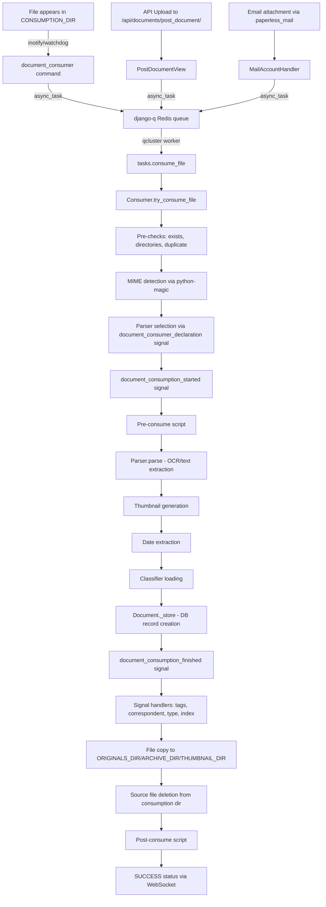

# Technical Specification

# 0. Agent Action Plan

## 0.1 Intent Clarification

### 0.1.1 Core Feature Objective

Based on the prompt, the Blitzy platform understands that the new feature requirement is to produce a comprehensive runtime-observability guide for the Paperless-NGX document ingestion pipeline. This is an investigative, documentation-only task — no source code in the repository is to be modified. Specifically, the requirements are:

- **Document Detection Analysis**: Determine and document what observable runtime behavior (log messages, task names, filesystem events) occurs when a new document appears in the Paperless-NGX system — whether dropped into the consumption directory, uploaded via the REST API, or ingested through email.
- **Processing Stage Tracing**: Identify and catalog every distinct stage a document passes through during ingestion — detection, pre-checks, parsing/OCR, thumbnail generation, date extraction, classification, tagging, indexing — and the specific log messages, progress status codes, and task names that mark each transition.
- **Final State Observation**: Document where a processed document's data ultimately resides at rest (database records, filesystem paths for originals/archives/thumbnails, Whoosh search index) and how completion is recorded.
- **Duplicate Prevention Mechanism**: Explain how Paperless-NGX avoids reprocessing documents, grounded in the MD5 checksum deduplication logic and the consumption directory cleanup behavior observable at runtime.
- **Output Artifact**: Create a new markdown document named `paperless-ngx_542221a38dff.md` placed in the `blitzy/documentation` directory that comprehensively answers all the above questions, with rationale derived directly from the code.

Implicit requirements detected:
- The analysis must cover all three ingestion entry points (filesystem consumer, API upload, email ingestion) since each triggers the same downstream pipeline via `django-q` async tasks.
- The explanation must reference actual logger names, message constants, and WebSocket status update payloads since those are the observable runtime artifacts.
- No source files may be modified; only the output documentation file may be added.
- Any temporary test files created during investigation must be cleaned up.

### 0.1.2 Special Instructions and Constraints

- **Read-Only Constraint**: Per the user's explicit directive: "don't modify any source files and clean up any temporary artifacts when you're done." This means the investigation must use code-reading and static analysis rather than modifying runtime behavior.
- **Implementation Rule `SWE-AtlasQnA-Repo`**: A new markdown document named `paperless-ngx_542221a38dff.md` must be created in the `blitzy/documentation` directory in the destination repo. It must comprehensively answer the posed questions, provide thinking/rationale, base answers on the code (not assumptions), and not modify any existing files.
- **Runtime Grounding**: The user specifically requests answers "grounded in runtime observations rather than assumptions from reading the code alone." This means the documentation must reference concrete log output patterns, task queue entries, WebSocket payloads, and database state changes that an operator could directly observe.
- **Commit Reference**: The repository is at commit `542221a38dff` (branch `paperless-ngx_542221a38dff`), corresponding to Paperless-NGX version **1.7.0**.

### 0.1.3 Technical Interpretation

These feature requirements translate to the following technical implementation strategy:

- To **document detection behavior**, we will trace the `document_consumer` management command (`src/documents/management/commands/document_consumer.py`) which uses either `inotify` or `watchdog` polling to detect files in the consumption directory, and the `PostDocumentView` in `src/documents/views.py` (line 491) and `paperless_mail` module for API/email ingestion. All three paths converge on `django_q.tasks.async_task("documents.tasks.consume_file", ...)`.
- To **document processing stage transitions**, we will catalog the log messages emitted by the `Consumer` class in `src/documents/consumer.py` (logger: `paperless.consumer`) and the `_send_progress()` WebSocket status updates that emit `STARTING`, `WORKING`, `SUCCESS`, and `FAILED` statuses with specific message constants (e.g., `MESSAGE_NEW_FILE`, `MESSAGE_PARSING_DOCUMENT`, `MESSAGE_GENERATING_THUMBNAIL`, `MESSAGE_PARSE_DATE`, `MESSAGE_SAVE_DOCUMENT`, `MESSAGE_FINISHED`).
- To **document the final state**, we will analyze the `_store()` method that creates `Document` ORM records, the `document_consumption_finished` signal handlers registered in `src/documents/apps.py` (add_inbox_tags, set_correspondent, set_document_type, set_tags, set_log_entry, add_to_index), and the filesystem write operations that place files into `ORIGINALS_DIR`, `ARCHIVE_DIR`, and `THUMBNAIL_DIR`.
- To **explain duplicate prevention**, we will trace the `pre_check_duplicate()` method's MD5-based checksum comparison against both `checksum` and `archive_checksum` fields, plus the consumption directory cleanup (file deletion after successful processing).
- To **produce the output**, we will create a single markdown file at `blitzy/documentation/paperless-ngx_542221a38dff.md` containing the complete Q&A analysis.

## 0.2 Repository Scope Discovery

### 0.2.1 Comprehensive File Analysis

Since this is a documentation-only task (no code modification), the file analysis below catalogs every file and module examined to derive the runtime-behavior answers. These files form the evidence base for the output documentation.

**Core Ingestion Pipeline Files Examined:**

| File Path | Purpose | Relevance |
|---|---|---|
| `src/documents/consumer.py` | Central ingestion coordinator (Consumer class) | Primary — all log messages, progress updates, and processing stages |
| `src/documents/tasks.py` | Background task functions (consume_file, train_classifier, index_reindex) | Primary — django-q task entry point; barcode splitting logic |
| `src/documents/management/commands/document_consumer.py` | Filesystem watcher (inotify/watchdog polling) | Primary — file detection, stabilization waiting, task queueing |
| `src/documents/signals/__init__.py` | Signal definitions (document_consumption_started, _finished, _declaration) | Primary — event bus for lifecycle hooks |
| `src/documents/signals/handlers.py` | Signal receivers (set_correspondent, set_tags, set_document_type, add_inbox_tags, set_log_entry, add_to_index, update_filename_and_move_files) | Primary — post-consumption automation |
| `src/documents/apps.py` | App configuration connecting signal handlers at startup | Primary — wiring of consumption_finished handlers |
| `src/documents/models.py` | Document, Tag, Correspondent, DocumentType, Log, FileInfo models | Primary — database schema and final state |
| `src/documents/parsers.py` | Parser base class, MIME type routing, date extraction | Primary — parser discovery via signal, text/date parsing |
| `src/documents/classifier.py` | ML classifier (scikit-learn MLPClassifier) for auto-matching | Supporting — classification during consumption |
| `src/documents/matching.py` | Rule-based and classifier-assisted matching | Supporting — how correspondents/tags/types are assigned |
| `src/documents/index.py` | Whoosh full-text search index management | Supporting — how documents enter the search index |
| `src/documents/file_handling.py` | Filename generation, directory management | Supporting — where files end up on disk |
| `src/documents/loggers.py` | LoggingMixin with correlation group support | Supporting — how log entries are grouped per document |
| `src/documents/sanity_checker.py` | Integrity verification (checksums, orphan detection) | Supporting — post-processing verification |

**Parser Registration Files Examined:**

| File Path | Purpose |
|---|---|
| `src/paperless_tesseract/signals.py` | Registers RasterisedDocumentParser for PDF, JPEG, PNG, TIFF, GIF, BMP (weight: 0) |
| `src/paperless_tesseract/parsers.py` | OCRmyPDF-based parsing, text extraction, thumbnail generation |
| `src/paperless_text/signals.py` | Registers TextDocumentParser for TXT, CSV (weight: 10) |
| `src/paperless_tika/signals.py` | Registers TikaDocumentParser for Office formats (weight: 10) |

**Ingestion Entry Points Examined:**

| File Path | Entry Point | Mechanism |
|---|---|---|
| `src/documents/management/commands/document_consumer.py` | Filesystem watcher | inotify/watchdog → `_consume()` → `async_task("documents.tasks.consume_file", ...)` |
| `src/documents/views.py` (line 491–535) | REST API upload | `PostDocumentView.post()` → `async_task("documents.tasks.consume_file", ...)` |
| `src/paperless_mail/mail.py` (line 336–349) | Email ingestion | Mail rule processing → `async_task("documents.tasks.consume_file", ...)` |

**Configuration and Infrastructure Files Examined:**

| File Path | Purpose |
|---|---|
| `src/paperless/settings.py` | All Django/Paperless settings, Q_CLUSTER config, directory paths, logging config |
| `src/paperless/consumers.py` | WebSocket StatusConsumer for real-time progress updates |
| `src/paperless/urls.py` | URL routing including `ws/status/$` WebSocket endpoint |
| `docker/supervisord.conf` | Process supervision: gunicorn, document_consumer, qcluster |
| `docker/docker-prepare.sh` | Startup sequence: wait for DB/Redis, migrate, reindex, superuser |
| `Pipfile` | Python dependency specifications |
| `requirements.txt` | Pinned dependency versions |

### 0.2.2 Integration Point Discovery

- **Task Queue Integration**: All three ingestion entry points converge on `django_q.tasks.async_task("documents.tasks.consume_file", ...)`. The `Q_CLUSTER` configuration in `src/paperless/settings.py` (lines 449–457) uses Redis as the broker and configures worker count, timeout, and retry settings.
- **WebSocket Integration**: The `Consumer._send_progress()` method in `src/documents/consumer.py` (lines 56–76) sends status updates to the `"status_updates"` channel group via Django Channels/Redis. The `StatusConsumer` WebSocket handler in `src/paperless/consumers.py` relays these to connected frontend clients.
- **Signal-Driven Post-Processing**: The `document_consumption_finished` signal is fired inside a database transaction in `consumer.py` (line 306), triggering six handlers wired in `apps.py`: inbox tagging, correspondent assignment, document type assignment, tag matching, admin log entry, and search index update.
- **Filesystem Integration**: Files flow from `CONSUMPTION_DIR` (or a temp file in `SCRATCH_DIR`) through the parser's `tempdir`, then to `ORIGINALS_DIR`, `ARCHIVE_DIR`, and `THUMBNAIL_DIR` under `MEDIA_ROOT`, protected by `FileLock(settings.MEDIA_LOCK)`.
- **Database Integration**: SQLite (default) or PostgreSQL stores `Document` records with checksums, content text, metadata, and relationships to `Correspondent`, `DocumentType`, and `Tag` models.

### 0.2.3 New File Requirements

A single new file is to be created:

| File Path | Purpose |
|---|---|
| `blitzy/documentation/paperless-ngx_542221a38dff.md` | Comprehensive Q&A document answering all ingestion pipeline runtime-behavior questions |

No other files are created or modified. This aligns with the `SWE-AtlasQnA-Repo` rule.

## 0.3 Dependency Inventory

### 0.3.1 Key Packages Relevant to Document Ingestion

The following packages are directly involved in the document ingestion pipeline and are referenced throughout the runtime-behavior analysis. Versions are sourced from `Pipfile` and `requirements.txt`.

| Registry | Package | Version | Purpose in Ingestion Pipeline |
|---|---|---|---|
| PyPI | django | 4.0.4 | Core web framework, ORM, signals, management commands |
| PyPI | django-q | 1.3.9 | Asynchronous task queue (consume_file tasks) using Redis broker |
| PyPI | channels | 3.0.4 | WebSocket support for real-time progress updates (StatusConsumer) |
| PyPI | channels-redis | 3.4.0 | Redis-backed channel layer for WebSocket group messaging |
| PyPI | redis | (transitive) | Broker for django-q task queue and channels layer |
| PyPI | watchdog | 2.1.0 | Filesystem polling observer for document_consumer command |
| PyPI | inotifyrecursive | 0.3.x | Linux inotify-based file watching (preferred over watchdog polling) |
| PyPI | python-magic | (latest) | MIME type detection for incoming documents |
| PyPI | ocrmypdf | 13.4.x | OCR processing of PDF and raster image documents |
| PyPI | pillow | 9.1.x | Image manipulation for thumbnails and alpha-channel handling |
| PyPI | pikepdf | 5.1.x | PDF metadata extraction and barcode-based page splitting |
| PyPI | pdfminer.six | (latest) | PDF text extraction fallback |
| PyPI | scikit-learn | 1.0.2 | MLPClassifier for automatic document classification |
| PyPI | whoosh | 2.7.4 | Full-text search indexing and querying |
| PyPI | filelock | 3.6.0 | Cross-process file locking for media directory operations |
| PyPI | dateparser | 1.1.1 | Natural language date parsing from document content |
| PyPI | fuzzywuzzy | (latest) | Fuzzy string matching for document tag/correspondent matching |
| PyPI | tqdm | (latest) | Progress bar for batch operations |
| PyPI | pyzbar | (latest) | Barcode reading for page separator detection |
| PyPI | pdf2image | (latest) | PDF-to-image conversion for barcode scanning |
| PyPI | concurrent-log-handler | 0.9.20 | Thread-safe rotating log file handler |
| PyPI | gunicorn | (latest) | WSGI/ASGI server for the web application |

### 0.3.2 Dependency Updates

No dependency changes are required for this task. The documentation-only output does not alter any dependency manifests (`Pipfile`, `requirements.txt`, `package.json`) or import statements. All analysis is performed against the existing dependency set at the pinned versions present in the repository at commit `542221a38dff`.

## 0.4 Integration Analysis

### 0.4.1 Existing Code Touchpoints

Since this is a documentation-only task, no direct modifications are made. However, the following integration touchpoints were thoroughly analyzed to derive the runtime-behavior documentation:

**Ingestion Entry Points (all converge on django-q async_task):**

- `src/documents/management/commands/document_consumer.py` — `_consume()` function (line 46) validates file readability and extension support, then calls `async_task("documents.tasks.consume_file", filepath, ...)` at line 86. Log messages emitted under logger `paperless.management.consumer`:
  - `"Adding {filepath} to the task queue."`
  - `"Not consuming file {filepath}: File has moved."`
  - `"Not consuming file {filepath}: Unknown file extension."`
  - `"Waiting for file {file} to remain unmodified"`

- `src/documents/views.py` — `PostDocumentView.post()` (line 497) writes uploaded data to a temp file in `SCRATCH_DIR`, generates a `task_id`, and calls `async_task("documents.tasks.consume_file", temp_filename, ...)` at line 523.

- `src/paperless_mail/mail.py` — Mail processing writes attachments to `SCRATCH_DIR` temp files and calls `async_task("documents.tasks.consume_file", ...)` at line 336.

**Task Processing Chain:**

- `src/documents/tasks.py` — `consume_file()` (line 184) first checks for barcode separators if `CONSUMER_ENABLE_BARCODES` is set, potentially splitting the PDF and requeueing individual pages. Otherwise, it calls `Consumer().try_consume_file(path, ...)` at line 236.

**Consumer Processing Stages (in `src/documents/consumer.py`):**

- `_send_progress(0, 100, "STARTING", MESSAGE_NEW_FILE)` — line 202
- `pre_check_file_exists()` — line 211
- `pre_check_directories()` — line 212
- `pre_check_duplicate()` — line 213 (MD5 checksum comparison)
- `document_consumption_started.send()` — line 229
- `run_pre_consume_script()` — line 235
- `_send_progress(20, 100, "WORKING", MESSAGE_PARSING_DOCUMENT)` — line 259
- `document_parser.parse()` — line 261
- `_send_progress(70, 100, "WORKING", MESSAGE_GENERATING_THUMBNAIL)` — line 264
- `document_parser.get_optimised_thumbnail()` — line 265
- `_send_progress(90, 100, "WORKING", MESSAGE_PARSE_DATE)` — line 274 (conditional)
- `_send_progress(95, 100, "WORKING", MESSAGE_SAVE_DOCUMENT)` — line 294
- `_store()` — line 301 (creates Document record)
- `document_consumption_finished.send()` — line 306 (triggers 6 handlers)
- File copy to managed storage under `FileLock` — lines 315–343
- `document.save()` — line 346
- `os.unlink(self.path)` — line 350 (removes source from consumption dir)
- `run_post_consume_script()` — line 371
- `_send_progress(100, 100, "SUCCESS", MESSAGE_FINISHED, document.id)` — line 375

**Post-Consumption Signal Handlers (wired in `src/documents/apps.py` lines 22–27):**

| Handler | Module | Observable Effect |
|---|---|---|
| `add_inbox_tags` | `signals/handlers.py:30` | Tags document with all `is_inbox_tag=True` tags |
| `set_correspondent` | `signals/handlers.py:35` | Logs `"Assigning correspondent {selected} to {document}"` |
| `set_document_type` | `signals/handlers.py:101` | Logs `"Assigning document type {selected} to {document}"` |
| `set_tags` | `signals/handlers.py:168` | Logs `'Tagging "{document}" with "{tags}"'` |
| `set_log_entry` | `signals/handlers.py:413` | Creates Django admin `LogEntry` with `ADDITION` flag |
| `add_to_index` | `signals/handlers.py:428` | Calls `index.add_or_update_document(document)` to update Whoosh index |

### 0.4.2 Data Flow Architecture

The complete data flow from detection to final storage follows this path:

### 0.4.3 Observable Runtime Channels

| Channel | Technology | What It Shows |
|---|---|---|
| Console/file logs | Python `logging` → `paperless.log` | All INFO/DEBUG messages from every named logger |
| WebSocket `ws/status/` | Django Channels + Redis | JSON progress payloads with `status`, `current_progress`, `max_progress`, `message`, `task_id` |
| django-q task queue | Redis | Task names, status (queued/started/completed/failed), timestamps |
| Database `documents_document` table | SQLite/PostgreSQL | Final Document records with `checksum`, `content`, `created`, `added`, `filename` |
| Database `documents_log` table | SQLite/PostgreSQL | Grouped log entries with `group` UUID for per-document correlation |
| Filesystem `ORIGINALS_DIR` | Disk | Original document files after processing |
| Filesystem `ARCHIVE_DIR` | Disk | OCR-enhanced PDF archive versions |
| Filesystem `THUMBNAIL_DIR` | Disk | PNG thumbnails keyed by document PK |
| Filesystem `INDEX_DIR` | Disk (Whoosh) | Full-text search index segments |

## 0.5 Technical Implementation

### 0.5.1 File-by-File Execution Plan

Since this task is purely documentation-based, only a single output file is created. No source files are modified.

**Group 1 — Output Documentation:**

- **CREATE**: `blitzy/documentation/paperless-ngx_542221a38dff.md`
  - Comprehensive Q&A document answering all questions about document ingestion runtime behavior
  - Structured as a narrative walkthrough of each ingestion stage
  - Includes exact log message patterns, WebSocket payload structures, task names, and database state descriptions
  - Provides rationale grounded in specific code references (file paths and line numbers)
  - Covers: detection → parsing → classification → indexing → final storage → duplicate prevention

### 0.5.2 Implementation Approach

The output document will be structured to answer each of the user's questions in sequence, with each answer section providing:

- **Observable behavior description**: What an operator would see in logs, database, filesystem, or WebSocket stream
- **Code evidence**: Specific file paths, line numbers, class names, and function names that produce the behavior
- **Stage-by-stage walkthrough**: Chronological ordering from the moment a document enters the system to its final resting state

The document will establish its answers by analyzing the following key runtime observations:

- **File Detection**: The `document_consumer` management command's `_consume()` and `_consume_wait_unmodified()` functions, which log to `paperless.management.consumer` and create django-q tasks with observable task names
- **Task Queue Processing**: The `consume_file()` function in `tasks.py` that the `qcluster` worker picks up, observable through django-q's admin interface and Redis
- **Consumer Progress**: The `Consumer` class's `_send_progress()` calls that emit `STARTING` → `WORKING` → `SUCCESS`/`FAILED` statuses over WebSocket, with specific message constants defined at lines 37–49 of `consumer.py`
- **Parser Execution**: OCRmyPDF calls in `paperless_tesseract/parsers.py` logged at `paperless.parsing.tesseract` level
- **Signal-Driven Side Effects**: Six handlers connected in `apps.py` that fire within the atomic transaction, each producing INFO-level log messages
- **Filesystem Artifacts**: The copy operations under `FileLock(settings.MEDIA_LOCK)` that place files into their permanent directories
- **Database Records**: The `Document.objects.create()` call that produces the permanent record with `checksum`, `content`, `mime_type`, and timestamp fields
- **Duplicate Prevention**: The `pre_check_duplicate()` method that compares MD5 checksums, plus the `os.unlink()` that removes the source file after successful processing

### 0.5.3 Key Runtime Logger Names Documented

The output document will catalog these logger names as observable runtime channels:

| Logger Name | Source File | What It Emits |
|---|---|---|
| `paperless.consumer` | `src/documents/consumer.py` | Main ingestion progress: consuming, parsing, saving, finished |
| `paperless.management.consumer` | `src/documents/management/commands/document_consumer.py` | File detection, task queueing, file stability monitoring |
| `paperless.handlers` | `src/documents/signals/handlers.py` | Correspondent/type/tag assignment, file rename/move operations |
| `paperless.matching` | `src/documents/matching.py` | Match results for rule-based classification |
| `paperless.classifier` | `src/documents/classifier.py` | Classifier loading, training, prediction |
| `paperless.parsing` | `src/documents/parsers.py` | Parser base operations, ImageMagick convert calls |
| `paperless.parsing.tesseract` | `src/paperless_tesseract/parsers.py` | OCRmyPDF parameters, text extraction, DPI detection |
| `paperless.index` | `src/documents/index.py` | Index open/write/error events |
| `paperless.tasks` | `src/documents/tasks.py` | Task-level events, classifier training, barcode detection |
| `paperless.sanity_checker` | `src/documents/sanity_checker.py` | Post-processing integrity verification |
| `paperless.filehandling` | `src/documents/file_handling.py` | Filename generation warnings |

## 0.6 Scope Boundaries

### 0.6.1 Exhaustively In Scope

**Output file:**
- `blitzy/documentation/paperless-ngx_542221a38dff.md` — The sole deliverable artifact

**Source files analyzed (read-only, forming the evidence base):**
- `src/documents/consumer.py` — Full Consumer class analysis
- `src/documents/tasks.py` — Task functions and barcode splitting
- `src/documents/management/commands/document_consumer.py` — Filesystem watcher behavior
- `src/documents/signals/__init__.py` — Signal definitions
- `src/documents/signals/handlers.py` — All signal receivers
- `src/documents/apps.py` — Signal handler wiring
- `src/documents/models.py` — Document, Tag, Correspondent, DocumentType, Log, SavedView models
- `src/documents/parsers.py` — Parser base class, MIME routing, date extraction
- `src/documents/classifier.py` — DocumentClassifier ML pipeline
- `src/documents/matching.py` — Rule-based and auto-matching logic
- `src/documents/index.py` — Whoosh index schema, update_document, add_or_update_document
- `src/documents/file_handling.py` — Filename generation, directory management
- `src/documents/loggers.py` — LoggingMixin with group correlation
- `src/documents/sanity_checker.py` — Checksum verification, orphan detection
- `src/documents/views.py` — PostDocumentView for API upload ingestion
- `src/documents/serialisers.py` — PostDocumentSerializer for upload validation
- `src/paperless_tesseract/parsers.py` — RasterisedDocumentParser (OCRmyPDF)
- `src/paperless_tesseract/signals.py` — Tesseract parser registration
- `src/paperless_text/signals.py` — Text parser registration
- `src/paperless_tika/signals.py` — Tika parser registration
- `src/paperless_mail/mail.py` — Email ingestion and task queueing
- `src/paperless/settings.py` — All configuration, Q_CLUSTER, logging, directories
- `src/paperless/consumers.py` — StatusConsumer WebSocket handler
- `src/paperless/urls.py` — URL and WebSocket routing
- `docker/supervisord.conf` — Process model (gunicorn, consumer, qcluster)
- `docker/docker-prepare.sh` — Startup sequence (migrations, reindex, superuser)
- `Pipfile` — Dependency declarations
- `requirements.txt` — Pinned dependency versions

**Topics covered in the documentation:**
- All three ingestion entry points (filesystem, API, email)
- Every processing stage from detection to final storage
- All log message patterns with logger names
- WebSocket progress update payload structure
- Database record creation and field population
- Filesystem artifact placement (originals, archives, thumbnails, index)
- Duplicate detection mechanism (MD5 checksum)
- Task queue behavior (django-q with Redis)
- Signal-driven post-processing (classification, tagging, indexing)
- Consumption directory cleanup

### 0.6.2 Explicitly Out of Scope

- **Source code modifications**: No existing files will be altered, per explicit user instruction
- **Frontend (Angular) behavior**: The `src-ui/` directory is not analyzed; only the backend pipeline is in scope
- **Email account IMAP configuration**: Detailed mail server setup is out of scope; only the point where email attachments enter the consumption pipeline is documented
- **Deployment infrastructure**: Docker/Compose configuration details beyond the process model are not analyzed
- **Performance optimization**: No profiling or performance analysis is included
- **Test execution**: No test files are run or modified
- **Database migrations**: No migration analysis beyond understanding the Document model schema
- **Encryption (GPG)**: The legacy GPG encryption pathway is not a focus area
- **Tika/Gotenberg integration details**: Only the registration signal is noted; detailed Tika parsing internals are not analyzed since Tika is disabled by default

## 0.7 Rules for Feature Addition

### 0.7.1 User-Specified Rules

The following rules and constraints were explicitly provided by the user and must be strictly followed:

- **`SWE-AtlasQnA-Repo` Rule**: 
  - Create a new markdown document named `paperless-ngx_542221a38dff.md` that comprehensively answers the question(s) posed in the prompt
  - Provide thinking/rationale behind the answers
  - Do not make assumptions; base answers on the code as the truth
  - Do not modify any existing files in the source repository
  - Do not add any other code in the source repository besides the requested document
  - Place the generated document in the `blitzy/documentation` directory

- **Read-Only Source Constraint**: The user explicitly stated "don't modify any source files and clean up any temporary artifacts when you're done." This applies to all files in the repository outside of the `blitzy/documentation` directory.

- **Runtime Grounding Requirement**: The user requested answers "grounded in runtime observations rather than assumptions from reading the code alone." Every claim in the output document must be traceable to a specific code construct that would produce an observable effect (log message, database record, filesystem change, WebSocket event, or task queue entry).

- **Temporary File Cleanup**: If any temporary test files are used during investigation, they must be cleaned up before completion.

### 0.7.2 Documentation Quality Standards

- Every answer in the output document must include the source file path and approximate line number(s) as evidence
- Log message patterns must be quoted exactly as they appear in the source code, with placeholder variables clearly identified
- The document must be self-contained and readable by a developer who is new to the Paperless-NGX codebase
- The document structure should follow the natural chronological flow of document ingestion for maximum comprehensibility

## 0.8 References

### 0.8.1 Files and Folders Searched

The following is a comprehensive catalog of all files and folders retrieved and examined during the analysis:

**Root-level files:**
- `Pipfile` — Python dependency declarations (runtime and dev packages)
- `requirements.txt` — Pinned dependency versions (autogenerated from Pipfile)
- `docker/supervisord.conf` — Supervisor process model for the Docker container
- `docker/docker-prepare.sh` — Container startup coordination script

**Core documents application (`src/documents/`):**
- `src/documents/__init__.py` — Package initializer, re-exports system checks
- `src/documents/apps.py` — DocumentsConfig with signal handler wiring in `ready()`
- `src/documents/consumer.py` — Central Consumer class with full ingestion pipeline
- `src/documents/tasks.py` — Background task functions (consume_file, train_classifier, barcode handling)
- `src/documents/models.py` — ORM models: Document, Tag, Correspondent, DocumentType, Log, SavedView, FileInfo
- `src/documents/parsers.py` — Parser base class, MIME routing, date parsing, thumbnail helpers
- `src/documents/classifier.py` — DocumentClassifier with scikit-learn MLPClassifier
- `src/documents/matching.py` — Rule-based and ML-assisted matching for correspondents/types/tags
- `src/documents/index.py` — Whoosh full-text search index management
- `src/documents/file_handling.py` — Filename generation and directory utilities
- `src/documents/loggers.py` — LoggingMixin with UUID-based group correlation
- `src/documents/sanity_checker.py` — Document integrity verification
- `src/documents/views.py` — REST API views including PostDocumentView
- `src/documents/serialisers.py` — DRF serializers including PostDocumentSerializer
- `src/documents/signals/__init__.py` — Signal definitions (started, finished, declaration)
- `src/documents/signals/handlers.py` — All signal receivers for post-consumption automation

**Management commands (`src/documents/management/commands/`):**
- `src/documents/management/commands/document_consumer.py` — Filesystem watcher command

**Parser packages:**
- `src/paperless_tesseract/parsers.py` — RasterisedDocumentParser (OCRmyPDF integration)
- `src/paperless_tesseract/signals.py` — Parser registration for PDF/image types
- `src/paperless_text/signals.py` — Parser registration for text/CSV types
- `src/paperless_tika/signals.py` — Parser registration for Office document types

**Mail ingestion:**
- `src/paperless_mail/mail.py` — Email processing with async_task call for consumption

**Core project configuration (`src/paperless/`):**
- `src/paperless/settings.py` — All Django and Paperless-specific settings
- `src/paperless/consumers.py` — WebSocket StatusConsumer for real-time progress
- `src/paperless/urls.py` — URL and WebSocket routing configuration

**Folders explored:**
- Root (`""`) — Full repository structure overview
- `src/` — Python source tree top level
- `src/documents/` — Core documents application
- `src/documents/signals/` — Signal definitions and handlers
- `src/documents/management/` — Management command namespace
- `src/documents/management/commands/` — All Django management commands
- `src/paperless_tesseract/` — OCR/Tesseract integration package
- `docker/` — Container runtime assets

### 0.8.2 Attachments

No attachments were provided for this project.

### 0.8.3 External References

- Repository: Paperless-NGX at commit `542221a38dff` (branch `paperless-ngx_542221a38dff`)
- Version: Paperless-NGX **1.7.0** (as documented in `src/paperless/version.py` per the tech spec)
- License: GNU General Public License v3.0 (GPL-3.0-only)
- No Figma URLs or external design assets are applicable to this task

