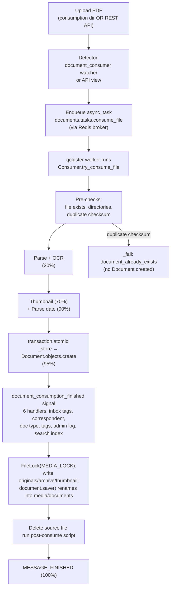

# How paperless-ngx Processes Documents at Runtime — A Code-Grounded Q&A

> **Repository:** paperless-ngx
> **Commit:** `542221a38dff06361e07976452f9aea24d210542`
> **Scope:** Backend document-ingestion pipeline (the `documents` Django app and `paperless` settings)

---

## Introduction & Methodology

This document answers six questions about how paperless-ngx ingests and processes documents. It is an **investigative**, **code-grounded** Q&A. The governing methodology is:

1. **Code is the source of truth.** Every conclusion is traced to a specific source location using `[path:locator]` citations (for example, `[src/documents/consumer.py:L215]`). Where any external documentation and the source disagree, **the source code governs**.
2. **The running system was observed to corroborate.** The full multi-service stack was built and run (web server, directory watcher, task worker, Redis broker, SQLite database, file store, and search index), real documents were submitted, and the resulting logs, on-disk artifacts, and database rows were captured. Observed log lines are quoted and explicitly **labelled `(observed)`**. Where a value is taken verbatim from the code rather than from a captured log, it is cited to the code line.
3. **Rationale is included.** Each answer has a *"Why / rationale"* subsection explaining the reasoning, not merely the conclusion.

### The runtime in one paragraph

paperless-ngx is a **Django `~=4.0`** backend [Pipfile:L13]. Asynchronous work is dispatched through **django-q `~=1.3`** [Pipfile:L17] — **not** Celery — whose worker cluster is started with `manage.py qcluster` and which uses **Redis** as its broker [src/paperless/settings.py:L449-457]. Documents are detected by a **watchdog/inotify** directory watcher [Pipfile:L38,L40], parsed (PDFs via OCRmyPDF/Tesseract), classified by a **scikit-learn `==1.0.2`** model [Pipfile:L36], and made searchable through a **Whoosh `~=2.7.4`** full-text index [Pipfile:L39]. The container image is based on **`python:3.9-slim-bullseye`** [Dockerfile:L18], and three programs run under supervisor: `gunicorn` (web/API), `document_consumer` (watcher), and `qcluster` (worker) [docker/supervisord.conf:L10-35].

### How the runtime was exercised (summary; full appendix at the end)

The stack was run inside the provided image. Three documents were submitted (one via the consumption directory, two via the REST API), an identical file was re-submitted to trigger the duplicate path, and the classifier was trained twice. All temporary test PDFs and scratch scripts were created **outside the tracked repository** and removed afterwards; the only artifact added to the repository is **this document**.

---

## Q1 — What happens end-to-end when a PDF is submitted, from detection through completion?

### Answer

Ingestion is performed by a **single django-q asynchronous task, `consume_file(...)`** [src/documents/tasks.py:L184-252], which constructs a `Consumer` and calls **`Consumer.try_consume_file(...)`** [src/documents/consumer.py:L180-377]. The task is enqueued the same way regardless of entry point: the directory watcher enqueues it via `async_task("documents.tasks.consume_file", ...)` [src/documents/management/commands/document_consumer.py:L86-87], and the REST upload endpoint `PostDocumentView.post(...)` enqueues the same `async_task("documents.tasks.consume_file", ...)` [src/documents/views.py:L523-533] (routed at `documents/post_document/` [src/paperless/urls.py:L57-59]). `consume_file` returns `"Success. New document id {} created"` on success [src/documents/tasks.py:L247] or raises `ConsumerError` [src/documents/tasks.py:L249-252].

`try_consume_file` runs a **deterministic, staged pipeline**, guarded by a database transaction and a media file-lock. The ordered stages are:

| # | Stage | Code |
|---|-------|------|
| 1 | Emit `STARTING` progress (0%), then renew the per-run logging group | [src/documents/consumer.py:L202,L207] |
| 2 | Pre-checks: file exists, directories exist, **duplicate check** | [src/documents/consumer.py:L211-213] |
| 3 | Log `Consuming {filename}` (INFO) | [src/documents/consumer.py:L215] |
| 4 | Detect MIME type; log it; **fail** if unsupported | [src/documents/consumer.py:L219-225] |
| 5 | Fire `document_consumption_started` signal; run pre-consume script | [src/documents/consumer.py:L229-235] |
| 6 | Parse (20%): `document_parser.parse(...)` | [src/documents/consumer.py:L259-261] |
| 7 | Generate thumbnail (70%) | [src/documents/consumer.py:L263-264] |
| 8 | Extract text & date; if no embedded date, parse date (90%) | [src/documents/consumer.py:L273-275] |
| 9 | Load classifier; emit `save_document` progress (95%) | [src/documents/consumer.py:L292-294] |
| 10 | **`transaction.atomic()`** → `self._store(...)` creates the `Document` row → fire `document_consumption_finished` signal | [src/documents/consumer.py:L298-311] |
| 11 | **`FileLock(MEDIA_LOCK)`** → assign unique filename, write **original**, **thumbnail**, and (if present) **archive** file; compute `archive_checksum` | [src/documents/consumer.py:L315-342] |
| 12 | `document.save()` (renames files into place); **delete the source file**; run post-consume script; log `Document {document} consumption finished` (INFO); emit `SUCCESS`/`finished` (100%); `return document` | [src/documents/consumer.py:L346-377] |

#### Observed end-to-end log (document submitted to the consumption directory)

```text
[paperless.management.consumer] Adding /app/src/../consume/test_doc_1.pdf to the task queue.   (observed)
[paperless.consumer] Consuming test_doc_1.pdf                                                   (observed, INFO)
[paperless.consumer] Detected mime type: application/pdf                                        (observed, DEBUG)
[paperless.consumer] Parser: RasterisedDocumentParser                                           (observed, DEBUG)
[paperless.consumer] Parsing test_doc_1.pdf...                                                  (observed, DEBUG)
[paperless.consumer] Generating thumbnail for test_doc_1.pdf...                                 (observed, DEBUG)
[paperless.classifier] Document classification model does not exist (yet), not performing automatic matching.  (observed, DEBUG)
[paperless.consumer] Saving record to database                                                  (observed, DEBUG)
[paperless.consumer] Deleting file /app/src/../consume/test_doc_1.pdf                            (observed, DEBUG)
[paperless.consumer] Document 2026-06-26 test_doc_1 consumption finished                         (observed, INFO)
```

### Why / rationale

- **Asynchronous by design.** Detection (the watcher or an API request) is decoupled from processing. The detector only *enqueues* a task on the Redis-backed django-q queue; the heavy lifting (OCR, thumbnailing, classification, persistence) happens later inside a `qcluster` worker process. This is why log lines for one document appear across two processes — the watcher (`paperless.management.consumer`) and the worker (`paperless.consumer`) — and why an upload returns immediately while processing continues in the background [src/documents/management/commands/document_consumer.py:L86-87][src/documents/tasks.py:L184-252].
- **Database writes are transactional; the source file is deleted only on success.** The `Document` row is created *inside* `transaction.atomic()` [src/documents/consumer.py:L298-301], and the `document_consumption_finished` signal handlers — which perform further **database** mutations (e.g. the `django_admin_log` audit row and any tag links) — are dispatched inside that same transaction [src/documents/consumer.py:L306-311]. The media files (original, thumbnail, and — when present — archive) are then written inside a `FileLock(MEDIA_LOCK)` block [src/documents/consumer.py:L315-342], `document.save()` moves/renames them into their final media location, and the **source consumption file is deleted last**, only after the store has completed successfully [src/documents/consumer.py:L346-350]. If an exception is raised mid-pipeline, the database transaction is rolled back — so no `Document` row, tag-link, or admin-log row persists — and, because the source deletion happens last, the original file remains in the consumption directory; the exception handler then fails the task and the `finally` block only cleans up the parser's working directory [src/documents/consumer.py:L362-369]. **The media filesystem writes are not themselves transactional**, however: the `_write(...)` copies happen inside the transaction but are not undone by a database rollback, so a crash *after* one or more media files have been written can leave orphaned files under `media/documents/` (the exception handler does not remove them). The transaction therefore guarantees **database** consistency, not full filesystem atomicity.
- **The classifier is read, not trained, here.** During consumption the pipeline only *loads* an existing classifier to apply automatic matching [src/documents/consumer.py:L292]; it never trains it. On a fresh system this load reports that the model does not yet exist (see Q4).

### Pipeline flowchart



---

## Q2 — Which services participate, and what is the ordered sequence of log events?

### Answer

#### Participating services (topology)

Three programs run under supervisor [docker/supervisord.conf:L10-35]:

| Service | Command | Role |
|---------|---------|------|
| **`gunicorn`** (web/API) | `gunicorn ... paperless.asgi:application` [docker/supervisord.conf:L10-11] | Serves the REST API and Angular UI, and relays live progress to the browser over a WebSocket status channel. |
| **`document_consumer`** (watcher) | `python3 manage.py document_consumer` [docker/supervisord.conf:L19-20] | Watches the consumption directory and **enqueues** a `consume_file` task per file. Logs under `paperless.management.consumer` [src/documents/management/commands/document_consumer.py:L24]. |
| **`qcluster`** (worker) | `python3 manage.py qcluster` [docker/supervisord.conf:L28-29] | The django-q worker that actually **executes** `consume_file` and the scheduled tasks. |

Supporting services:

- **Redis** broker (`redis:6.0`) — backs both the django-q task queue and the Channels WebSocket layer [docker/compose/docker-compose.postgres.yml:L31-32][src/paperless/settings.py:L178-182,L456].
- **Database** — PostgreSQL (`postgres:13`) [docker/compose/docker-compose.postgres.yml:L37-38] or **SQLite by default** [docker/compose/docker-compose.sqlite-tika.yml:L14]; Django's `DATABASES` setting defaults to the `sqlite3` engine at `DATA_DIR/db.sqlite3` when no PostgreSQL host is configured [src/paperless/settings.py:L297-300].
- **File store** — the originals/archive/thumbnail tree under `MEDIA_ROOT/documents/...` [src/paperless/settings.py:L62-64].
- **Whoosh search index** — a filesystem index at `INDEX_DIR` [src/paperless/settings.py:L73].
- **Optional Tika + Gotenberg** — office-document conversion, feature-flagged [docker/compose/docker-compose.sqlite-tika.yml:L65-77].

#### Watcher behavior (how files are detected and enqueued)

For consumption-directory ingestion, the `document_consumer` watcher decides *when* a file is ready before it ever logs `Adding ...` and calls `async_task(...)`. It runs in one of two modes and, crucially, **waits for the file to become stable** so a half-written file is never enqueued:

- **inotify mode (default).** When `PAPERLESS_CONSUMER_POLLING` is `0` (the default [src/paperless/settings.py:L478]) *and* `inotifyrecursive` is importable, the watcher uses inotify [src/documents/management/commands/document_consumer.py:L178-181]. It registers the flags **`CLOSE_WRITE | MOVED_TO`** [src/documents/management/commands/document_consumer.py:L203] so it reacts only when a file finishes being written in place (`CLOSE_WRITE`) or is atomically moved into the directory (`MOVED_TO`), and it applies a 0.5 s debounce — consuming a path only once no further inotify event has arrived for it within the debounce window [src/documents/management/commands/document_consumer.py:L211,L226-234].
- **polling mode (fallback).** Otherwise (e.g. on filesystems where inotify is unavailable, such as some network mounts) it falls back to watchdog's `PollingObserver` [src/documents/management/commands/document_consumer.py:L185-187], whose `on_created` handler spawns `_consume_wait_unmodified` in a thread [src/documents/management/commands/document_consumer.py:L129-130].
- **wait-for-stability.** Before logging `Adding ...` and enqueueing, the polling path runs `_consume_wait_unmodified`, which repeatedly `stat`s the file and only proceeds once its **`mtime` and `size` are unchanged across consecutive checks** (or aborts with a timeout error) [src/documents/management/commands/document_consumer.py:L99-125]. This is what guarantees a file is fully written before a `consume_file` task is queued.

Only after this stability gate does the watcher emit `Adding {filepath} to the task queue.` and call `async_task("documents.tasks.consume_file", ...)` [src/documents/management/commands/document_consumer.py:L85-87].

#### Two distinct log channels

The consumer emits over **two channels**, and it is important not to conflate them:

1. **WebSocket progress events.** `Consumer._send_progress(...)` sends a payload to the Channels group `"status_updates"` [src/documents/consumer.py:L56-76]. These carry the `MESSAGE_*` status strings and percentages and drive the UI progress bar. **They do not appear in `paperless.log`** — confirmed at runtime: the captured log contained the text lines below but none of the percentage events.
2. **Textual log lines.** `Consumer` is a `LoggingMixin` with `logging_name = "paperless.consumer"` [src/documents/consumer.py:L52-54]; `self.log(...)` routes to `logging.getLogger("paperless.consumer")` with a per-run UUID group [src/documents/loggers.py:L14-21]. These lines are written to `DATA_DIR/log/paperless.log` by a `ConcurrentRotatingFileHandler` (and to the console at the root logger) [src/paperless/settings.py:L392-409].

The `MESSAGE_*` constants are defined in [src/documents/consumer.py:L37-49]: `MESSAGE_NEW_FILE = "new_file"` [L43], `MESSAGE_PARSING_DOCUMENT = "parsing_document"` [L45], `MESSAGE_GENERATING_THUMBNAIL` [L46], `MESSAGE_PARSE_DATE` [L47], `MESSAGE_SAVE_DOCUMENT` [L48], `MESSAGE_FINISHED = "finished"` [L49], plus `MESSAGE_DOCUMENT_ALREADY_EXISTS = "document_already_exists"` [L37] and `MESSAGE_UNSUPPORTED_TYPE` [L44].

#### Ordered event sequence

The end-to-end sequence spans **two processes**, so it is presented as two phases to avoid conflating cross-process order with task-internal order. **Phase A** (the `document_consumer` watcher) always completes *before* **Phase B** (the `qcluster` worker running `Consumer.try_consume_file`) can begin: the watcher must log `Adding ...` and enqueue the task before any worker picks it up and emits its first progress event.

**Phase A — detection & enqueue (watcher process)** — *consumption-directory ingestion only; for a REST upload this phase is replaced by the web request handler enqueueing the task [src/documents/views.py:L523-533]*

| Order | Text log line (`paperless.log`) | Logger | Code |
|-------|---------------------------------|--------|------|
| A1 | `Adding {filepath} to the task queue.` *(INFO)*, then `async_task("documents.tasks.consume_file", ...)` enqueues the job on the Redis-backed queue | `paperless.management.consumer` | [src/documents/management/commands/document_consumer.py:L85-87] |

**Phase B — task-internal pipeline (qcluster worker running `Consumer.try_consume_file`)** — begins only after Phase A has enqueued the task

| Order | WebSocket status (`_send_progress`) | Text log line (`paperless.log`) | Logger | Code |
|-------|-------------------------------------|---------------------------------|--------|------|
| B1 | `STARTING` / `new_file` (0%) | — | — | [src/documents/consumer.py:L202] |
| B2 | — | `Consuming {filename}` *(INFO)* | `paperless.consumer` | [src/documents/consumer.py:L215] |
| B3 | — | `Detected mime type: {mime_type}` *(DEBUG)* | `paperless.consumer` | [src/documents/consumer.py:L221] |
| B4 | `parsing_document` (20%) | `Parsing {filename}...` *(DEBUG)* | `paperless.consumer` | [src/documents/consumer.py:L259-260] |
| B5 | `generating_thumbnail` (70%) | `Generating thumbnail for {filename}...` *(DEBUG)* | `paperless.consumer` | [src/documents/consumer.py:L263-264] |
| B6 | `parse_date` (90%, only if no embedded date) | — | — | [src/documents/consumer.py:L274] |
| B7 | — | `Document classification model does not exist (yet)...` *(DEBUG; only on a fresh system, emitted while loading the classifier)* | `paperless.classifier` | [src/documents/consumer.py:L292][src/documents/classifier.py:L31-35] |
| B8 | `save_document` (95%) | — | — | [src/documents/consumer.py:L294] |
| B9 | — | `Saving record to database` *(DEBUG, from `_store`)* | `paperless.consumer` | [src/documents/consumer.py:L387] |
| B10 | — | *consumption-finished handlers run* (e.g. `set_tags`: `Tagging "{}" with "{}"`) | `paperless.handlers` | [src/documents/signals/handlers.py:L224-230] |
| B11 | — | `Deleting file {path}` *(DEBUG)* | `paperless.consumer` | [src/documents/consumer.py:L349] |
| B12 | — | `Document {document} consumption finished` *(INFO)* | `paperless.consumer` | [src/documents/consumer.py:L373] |
| B13 | `SUCCESS` / `finished` (100%) | — | — | [src/documents/consumer.py:L375] |

After the `Document` row is created, the `document_consumption_finished` signal fires **six handlers**, connected in this order in [src/documents/apps.py:L22-27]: `add_inbox_tags`, `set_correspondent`, `set_document_type`, `set_tags`, `set_log_entry`, `add_to_index` — implemented in [src/documents/signals/handlers.py:L30,L35,L101,L168,L413,L428] and logging under `paperless.handlers` [src/documents/signals/handlers.py:L27].

### Why / rationale

- **Separation of concerns explains the cross-process logs.** The watcher's only job is to notice a stable file and enqueue work [src/documents/management/commands/document_consumer.py:L85-87]; the worker does everything else. That is why the *first* log line for a consumption-directory document is the watcher's `Adding ... to the task queue.` under **`paperless.management.consumer`** [src/documents/management/commands/document_consumer.py:L24]. The subsequent worker-side lines are **not** all under one logger: the `Consumer` orchestration logs under **`paperless.consumer`** [src/documents/consumer.py:L52-54], the classifier load/train logs under **`paperless.classifier`** [src/documents/classifier.py:L21], and the `document_consumption_finished` signal handlers log under **`paperless.handlers`** [src/documents/signals/handlers.py:L27]. (See the Logger column in the Phase B table above.) The web server (`gunicorn`) does not parse anything — it merely relays the `_send_progress` payloads to the browser via the Redis-backed Channels layer.
- **Why the percentages are absent from the file log.** Progress percentages travel over the WebSocket channel (`group_send("status_updates", ...)`), not through the Python `logging` framework, so they are intentionally **not** in `paperless.log`. This was confirmed at runtime — the log file showed the textual lines but no `20%/70%/95%` events.
- **The database, file store, and Whoosh index are touched near the end.** Persistence (`_store`) happens at stage 9–10, file writes inside the lock at stage 11, and the Whoosh index update happens inside the `document_consumption_finished` handler `add_to_index` [src/documents/signals/handlers.py:L428-431]. Everything expensive and I/O-heavy is deferred to the worker, late in the pipeline.


---

## Q3 — How does the system react when several documents are uploaded, one after another?

### Answer

**Each submission is an independent `consume_file` task** [src/documents/tasks.py:L184-252]. There is no per-batch coupling: uploading *N* documents enqueues *N* tasks, which the `qcluster` worker(s) execute concurrently up to the configured worker count [src/paperless/settings.py:L449-457]. Each task produces its own `Document` row with its own zero-padded primary-key filename.

This was confirmed at runtime — three distinct PDFs each produced an independent, fully-completed pipeline run and an independent document (`PK=1`, `PK=2`, `PK=3`):

```text
[paperless.consumer] Document 2026-06-26 test_doc_2 consumption finished   (observed, INFO)
[paperless.consumer] Document 2026-06-26 test_doc_3 consumption finished   (observed, INFO)
```

**Exact duplicates are short-circuited by checksum, before any new row is created.** `pre_check_duplicate()` computes the MD5 of the incoming file and queries for an existing document with a matching `checksum` *or* `archive_checksum` [src/documents/consumer.py:L102-107]:

```python
if Document.objects.filter(
    Q(checksum=checksum) | Q(archive_checksum=checksum),
).exists():
    if settings.CONSUMER_DELETE_DUPLICATES:
        os.unlink(self.path)
    self._fail(
        MESSAGE_DOCUMENT_ALREADY_EXISTS,
        f"Not consuming {self.filename}: It is a duplicate.",
    )
```

On a match it calls `_fail(MESSAGE_DOCUMENT_ALREADY_EXISTS, ...)` [src/documents/consumer.py:L110-113] **before** any `Document` is created (and optionally deletes the incoming file if `PAPERLESS_CONSUMER_DELETE_DUPLICATES` is set [src/documents/consumer.py:L108-109]). This was observed by re-submitting a byte-identical file under a *different* filename:

```text
[paperless.consumer] Not consuming test_doc_1_dup.pdf: It is a duplicate.   (observed, ERROR)
```

### Why / rationale

- **Per-document, not per-batch.** Because every file maps to its own queued task, the system "reacts" to each upload independently and idempotently. There is no aggregate state across a batch — three uploads simply become three tasks.
- **Idempotent on identical bytes.** The duplicate guard is keyed on the **content checksum**, not the filename — confirmed by the fact that `test_doc_1_dup.pdf` (a different name but identical bytes to the already-consumed `PK=1`) was rejected. Re-submitting the same bytes never creates a second row.
- **Defense in depth at the database layer.** Independent of the pre-check, `documents_document.checksum` carries a **UNIQUE constraint** — the model field is declared `checksum = models.CharField(..., unique=True, ...)` [src/documents/models.py:L135-139]. When the directory watcher fired multiple inotify events for a single dropped file (a known quirk of `CLOSE_WRITE`/`MOVED_TO` on some filesystems) and several tasks raced before any committed, the redundant tasks failed with `UNIQUE constraint failed: documents_document.checksum` *(observed)* — so even a race cannot produce duplicate rows. This complements the application-level `pre_check_duplicate` short-circuit.

---

## Q4 — Does the scikit-learn classifier retrain on *every* upload, or only under certain conditions? Which log messages distinguish "training is happening" from "classifier idle / unchanged"?

### Answer

**Training does NOT happen on every upload. It is an _hourly scheduled_ task, fully decoupled from consumption, and is further gated by two conditions.** Uploading documents alone never triggers training.

**1. Training is scheduled, not per-upload.** A data migration registers the training job as an **hourly** django-q schedule [src/documents/migrations/1001_auto_20201109_1636.py:L10-14]:

```python
schedule(
    "documents.tasks.train_classifier",
    name="Train the classifier",
    schedule_type=Schedule.HOURLY,
)
```

This was confirmed against the live database — the `django_q` schedule table contained `('documents.tasks.train_classifier', 'H')` *(observed; `'H'` = HOURLY)*, alongside the daily index-optimize job [src/documents/migrations/1001_auto_20201109_1636.py:L15-19]. The consumption pipeline (Q1) only ever *loads* the model [src/documents/consumer.py:L292]; it contains no call to `train_classifier`.

**2. Gate one — at least one auto-matching label must exist.** `train_classifier()` returns immediately if no `Tag`, `DocumentType`, or `Correspondent` uses `MATCH_AUTO` [src/documents/tasks.py:L48-55]:

```python
def train_classifier():
    if (
        not Tag.objects.filter(matching_algorithm=Tag.MATCH_AUTO).exists()
        and not DocumentType.objects.filter(matching_algorithm=Tag.MATCH_AUTO).exists()
        and not Correspondent.objects.filter(matching_algorithm=Tag.MATCH_AUTO).exists()
    ):
        return
```

So on a fresh system (no auto labels), nothing trains — silently.

**3. Gate two — the training data must have changed.** When at least one auto label exists, `train_classifier` loads or constructs a classifier and calls `classifier.train()` [src/documents/tasks.py:L57-69]. `DocumentClassifier.train()` builds a **SHA-1 hash** over the preprocessed content and the `MATCH_AUTO` labels of every document [src/documents/classifier.py:L123-161], then short-circuits when the hash is unchanged [src/documents/classifier.py:L163-164]:

```python
if self.data_hash and new_data_hash == self.data_hash:
    return False
```

A `False` return means "unchanged" (no save); a `True` return means the model was retrained and is then saved.

#### The three distinguishing log strings

| State | Logger / level | Exact message | Code |
|-------|----------------|---------------|------|
| **(a) Trained + saved** | `paperless.tasks` / **INFO** | `Saving updated classifier model to {MODEL_FILE}...` | [src/documents/tasks.py:L64-66] |
| **(b) Idle / unchanged** | `paperless.tasks` / **DEBUG** | `Training data unchanged.` | [src/documents/tasks.py:L68-69] |
| **(c) No model yet** | `paperless.classifier` / **DEBUG** | `Document classification model does not exist (yet), not performing automatic matching.` | [src/documents/classifier.py:L31-36] |

State (c) is emitted by `load_classifier()` when the model file is absent [src/documents/classifier.py:L30-36]; the model file is `MODEL_FILE = DATA_DIR/classification_model.pickle` [src/paperless/settings.py:L74].

#### Observed runtime (classifier trained twice via `manage.py document_create_classifier`)

The manual entry point `document_create_classifier` simply calls `train_classifier()` [src/documents/management/commands/document_create_classifier.py:L19-20] — the same function the hourly schedule runs — so it is ideal for exercising both outcomes.

**Run 1** (a `MATCH_AUTO` tag existed, assigned to one document; no model file yet) — *trained and saved*:

```text
[paperless.classifier] Document classification model does not exist (yet), not performing automatic matching.   (observed, DEBUG)  ← state (c)
[paperless.classifier] Gathering data from database...                                  (observed, DEBUG)
[paperless.classifier] 3 documents, 1 tag(s), 0 correspondent(s), 0 document type(s).   (observed, DEBUG)
[paperless.classifier] Vectorizing data...                                              (observed, DEBUG)
[paperless.classifier] Training tags classifier...                                      (observed, DEBUG)
[paperless.tasks] Saving updated classifier model to /app/src/../data/classification_model.pickle...   (observed, INFO)  ← state (a)
```

**Run 2** (no data change) — *idle*:

```text
[paperless.classifier] Gathering data from database...   (observed, DEBUG)
[paperless.tasks] Training data unchanged.               (observed, DEBUG)  ← state (b)
```

Note that in Run 2 the "model does not exist" line is **absent**: the model now exists, so `load_classifier()` loads it; `train()` then recomputes the data hash, finds it identical, and returns `False`.

### Why / rationale

- **Decoupled by architecture.** Training is registered as a recurring `Schedule` row and executed by the `qcluster` scheduler once an hour — it is not invoked anywhere in the consumption pipeline. This was proven at runtime: consuming three documents produced only state (c) ("model does not exist (yet)") during loading and never any training output.
- **Doubly gated to avoid useless work.** The label gate [src/documents/tasks.py:L49-55] prevents training when there is nothing to learn from; the hash gate [src/documents/classifier.py:L163-164] prevents retraining when the data has not changed since the last run. Together they explain the three observable states: nothing (no auto labels), `Training data unchanged.` (auto labels but stable data), or `Saving updated classifier model to ...` (data changed).
- **Why state (c) matters.** Before the first successful training, the model file does not exist, so consumption logs `Document classification model does not exist (yet), not performing automatic matching.` This is *not* an error — it simply means automatic matching is skipped until the scheduled (or manual) trainer produces a model.


---

## Q5 — Where does a document end up on disk after processing? What is the default directory structure and filename pattern?

> **Framing:** this answer describes the **default** configuration — i.e. with no `PAPERLESS_FILENAME_FORMAT` and no custom storage paths set. Custom formats exist but are out of scope (noted at the end).

### Answer

**By default, each stored file is named after the document's database primary key, zero-padded to 7 digits** (e.g. `0000001.pdf`), and placed under three sibling directories beneath the media root [src/paperless/settings.py:L61-64]:

| Directory | Setting | Contents |
|-----------|---------|----------|
| `media/documents/originals/` | `ORIGINALS_DIR` [src/paperless/settings.py:L62] | The **unmodified original** file. |
| `media/documents/archive/` | `ARCHIVE_DIR` [src/paperless/settings.py:L63] | The **archived PDF/A** produced by OCR (always `.pdf`). |
| `media/documents/thumbnails/` | `THUMBNAIL_DIR` [src/paperless/settings.py:L64] | The preview image (`.png`). |

The filename is produced by `generate_filename(...)` [src/documents/file_handling.py:L128-199]. The custom-format branch is taken **only** when a format is configured [src/documents/file_handling.py:L132]; otherwise the **default branch** runs [src/documents/file_handling.py:L186-193]:

```python
counter_str = f"_{counter:02}" if counter else ""
filetype_str = ".pdf" if archive_filename else doc.file_type
if len(path) > 0:
    filename = f"{path}{counter_str}{filetype_str}"
else:
    filename = f"{doc.pk:07}{counter_str}{filetype_str}"   # default: 7-digit zero-padded PK
```

`PAPERLESS_FILENAME_FORMAT` defaults to `None` when the environment variable is unset [src/paperless/settings.py:L584], so out of the box the default branch always applies. `generate_unique_filename(...)` resolves collisions by appending `_01`, `_02`, … and selects `ARCHIVE_DIR` vs `ORIGINALS_DIR` accordingly [src/documents/file_handling.py:L81-125].

#### Observed on-disk layout (after consuming three documents)

```text
/app/media/documents/originals/0000001.pdf      (observed)
/app/media/documents/originals/0000002.pdf      (observed)
/app/media/documents/originals/0000003.pdf      (observed)
/app/media/documents/archive/0000001.pdf        (observed)
/app/media/documents/archive/0000002.pdf        (observed)
/app/media/documents/archive/0000003.pdf        (observed)
/app/media/documents/thumbnails/0000001.png     (observed)
/app/media/documents/thumbnails/0000002.png     (observed)
/app/media/documents/thumbnails/0000003.png     (observed)
```

The database confirmed `Document(pk=1)` had `filename = 0000001.pdf` and `archive_filename = 0000001.pdf` *(observed)* — i.e. the document was **stored under its PK-based filename** (`0000001.pdf`), not under the original `test_doc_1.pdf`. To be precise about the mechanism, the original is not renamed in place: during consumption it is **copied** into the media tree via `_write(...)` [src/documents/consumer.py:L319,L429-432] and the consumption/upload scratch file is then **deleted** [src/documents/consumer.py:L349-350]; the media copy itself is assigned its PK-based name and may subsequently be moved/renamed by `update_filename_and_move_files` during `document.save()` [src/documents/signals/handlers.py:L312-365].

Two related artifacts live under the **data** tree (not the media tree): the Whoosh search index at `INDEX_DIR = DATA_DIR/index` [src/paperless/settings.py:L73] (observed as `MAIN_*.seg` segment files) and the classifier model at `MODEL_FILE = DATA_DIR/classification_model.pickle` [src/paperless/settings.py:L74].

### Why / rationale

- **PK-based naming is the unconfigured baseline.** Because `PAPERLESS_FILENAME_FORMAT` is `None` by default [src/paperless/settings.py:L584], `generate_filename` falls to `f"{doc.pk:07}{counter_str}{filetype_str}"` [src/documents/file_handling.py:L193]. This is why files are **not human-readable** (e.g. `0000042.pdf`) unless an administrator opts into a custom format — the names are an artifact of the primary key, guaranteeing uniqueness without consulting the title.
- **Three representations per document.** paperless keeps the original untouched for fidelity (`originals/`), a normalized, searchable PDF/A for viewing/archival (`archive/`, forced to `.pdf` via `filetype_str` [src/documents/file_handling.py:L188]), and a thumbnail for the UI (`thumbnails/`).
- **Corroboration.** The official documentation describes the same default layout and the optional `PAPERLESS_FILENAME_FORMAT` override [docs/advanced_usage.rst:L207-289][docs/configuration.rst:L66-117]; the code remains authoritative, and the runtime observation matches it exactly.
- **Out of scope (mentioned for completeness).** Setting `PAPERLESS_FILENAME_FORMAT` (e.g. `{created_year}/{correspondent}/{title}`) changes both the filename and the sub-directory structure via the custom-format branch [src/documents/file_handling.py:L132-184]; this document deliberately describes only the default.

---

## Q6 — Which database tables receive new rows as part of ingestion?

### Answer

A successful ingestion **always** writes rows to **two** tables — `documents_document` (the core document row) and `django_admin_log` (one audit row) — and **may also** write rows to a third, `documents_document_tags`, but only when one or more tags are attached (via consumption overrides, inbox tags, or auto-matching). The three tables that can therefore receive rows are detailed below. (Row counts were captured before and after consuming three documents.)

**1. `documents_document`** *(always written)* — the core insert. `_store` calls `Document.objects.create(...)` with the title, content, MIME type, checksum, timestamps, and storage type [src/documents/consumer.py:L398-406]; the model is `Document` [src/documents/models.py:L88] (Django's default table name is `app_label + "_" + model` → `documents_document`).
*Observed: 0 → 3 rows (one per document).*

**2. `documents_document_tags`** *(conditional — only when tags are attached)* — the many-to-many join table behind `tags = models.ManyToManyField(Tag, related_name="documents")` [src/documents/models.py:L128-133]. Rows are inserted when tags are attached — either via consumption overrides `document.tags.add(...)` [src/documents/consumer.py:L425-427], or via the `set_tags` handler `document.tags.add(*relevant_tags)` [src/documents/signals/handlers.py:L230].
*Observed: stayed at 0 during plain consumption (no matching auto/override tags), then became 1 only after a tag was explicitly attached.* **This table may legitimately receive no rows for a document if nothing matches** — an honest nuance.

**3. `django_admin_log`** *(always written)* — one audit row per document. The `set_log_entry` handler creates a `LogEntry` ADDITION [src/documents/signals/handlers.py:L413-425]:

```python
ct = ContentType.objects.get(model="document")
user = User.objects.get(username="consumer")
LogEntry.objects.create(
    action_flag=ADDITION,
    action_time=timezone.now(),
    content_type=ct,
    object_id=document.pk,
    user=user,
    object_repr=document.__str__(),
)
```

Note it looks up `User.objects.get(username="consumer")` [src/documents/signals/handlers.py:L416] — so a user named **`consumer`** must exist (it did in the test environment).
*Observed: 0 → 3 rows; e.g. `action_flag=1` (ADDITION), `object_id=1`, `user=consumer`, `object_repr="2026-06-26 test_doc_1"`.*

#### What is NOT written

- **`documents_log`** — the application-log table backed by the `Log` model [src/documents/models.py:L285] is **not** part of the normal consume insert path. *Observed: stayed at 0.*
- **The Whoosh full-text index is NOT a database table.** Search indexing is performed by the `add_to_index` handler → `index.add_or_update_document(document)` [src/documents/signals/handlers.py:L428-431][src/documents/index.py:L118-120], which writes to a **filesystem** index at `INDEX_DIR` [src/paperless/settings.py:L73]. *Observed as `MAIN_*.seg` segment files under `data/index/`, which grew as documents were added.* This is a common misconception worth calling out explicitly.

Supporting models that may already hold rows but are **not** inserted by a plain consume are `Tag` [src/documents/models.py:L64], `Correspondent` [src/documents/models.py:L57], and `DocumentType` [src/documents/models.py:L82] (these are created by administrators or matching logic, not by the core store).

#### Observed table deltas

| Table | Before | After 3 ingestions | Notes |
|-------|:------:|:------------------:|-------|
| `documents_document` | 0 | **3** | one row per document |
| `documents_document_tags` | 0 | 0 → **1** | only after a tag was attached |
| `django_admin_log` | 0 | **3** | one ADDITION audit row per document |
| `documents_log` | 0 | 0 | not in the consume path |
| Whoosh `data/index/` | — | grew | filesystem index, **not** a DB table |

### Why / rationale

- **The durable writes are: one document row, optional tag-link rows, and one admin-log audit row.** The document row is the substance; the admin-log row is an audit trail attributed to the `consumer` user; tag-links appear only when tags actually match or are overridden.
- **Searchability is filesystem-backed, not relational.** Full-text search is provided by Whoosh on disk, not by a SQL table — which is why no "search" table appears among the inserts and why backing up a paperless install must include the `data/index/` directory, not just the database.

---

## Appendix — Reproduction / how this was observed

The runtime evidence above was gathered with a **read-only investigation** that added nothing to the tracked repository.

**Environment.** The provided container image was run (`python:3.9-slim-bullseye` base [Dockerfile:L18]) with a sibling `redis:6` broker container. Inside the image, the source lives at `/app` (with `manage.py` at `/app/src/manage.py`) — a copy entirely separate from the tracked working tree, so none of the steps below touched the repository.

**Services started** (the three supervised programs [docker/supervisord.conf:L10-35]):

```bash
# inside the container
python3 manage.py qcluster            # django-q worker (executes consume_file + schedules)
python3 manage.py document_consumer   # inotify directory watcher
# gunicorn (web/API) was already serving on :8000
```

**Steps exercised:**

1. **Q1/Q2** — dropped one PDF into the consumption directory and submitted two more via `POST /api/documents/post_document/`; tailed `data/log/paperless.log` to capture the ordered event sequence across the `paperless.management.consumer`, `paperless.consumer`, and `paperless.handlers` loggers.
2. **Q3** — submitted several documents (each became an independent task and document) and re-submitted a byte-identical file under a different name to trigger `Not consuming ...: It is a duplicate.`
3. **Q4** — created a `Tag` with `matching_algorithm = MATCH_AUTO` and assigned it to a document, then ran `manage.py document_create_classifier` twice to observe the *trained+saved* and *training data unchanged* outcomes; the live `django_q` schedule table confirmed `train_classifier` is hourly.
4. **Q5** — listed `media/documents/{originals,archive,thumbnails}` and read `Document.filename` / `Document.archive_filename` from the database to confirm the `0000001.pdf` PK pattern.
5. **Q6** — counted rows in `documents_document`, `documents_document_tags`, `django_admin_log`, and `documents_log` before and after ingestion, and confirmed the Whoosh index is a set of files under `data/index/`.

**Cleanup.** All temporary test PDFs and scratch scripts were created outside the tracked source tree and removed on completion. The only persistent artifact added to the repository is this document, `blitzy/documentation/paperless-ngx_542221a38dff.md`.

### Citation legend

- `[path:Lx]` / `[path:Lx-Ly]` — a line or line-range in a source file at commit `542221a38dff`.
- `(observed)` — a value or log line captured from the running system; all such observations were verified to match the code.
- Where a quoted log message could be either observed or read from code, the exact string is taken verbatim from the cited source line.
