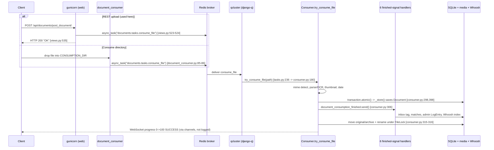

# Paperless-ngx Runtime Investigation — Document Processing Pipeline

**Commit:** `542221a38dff06361e07976452f9aea24d210542`
**Branch:** `paperless-ngx_542221a38dff`
**Scope:** A strictly **read-only**, **run-first** investigation of how paperless-ngx ingests a
document, when its machine-learning classifier retrains, and where processed data lands on disk and
in the database. Every behavioral claim below is backed by **actual captured runtime output** shown
next to the exact command that produced it; every code-level claim carries a `file:line` citation
naming the specific function/method/class. Statements that are derived from reading code rather than
observed at runtime are explicitly labeled **(inferred)**.

> **Task queue is django-q, not Celery.** Asynchronous work is dispatched with
> `django_q.tasks.async_task` and scheduled work with `django_q.tasks.schedule`; both run in the
> `qcluster` process. There is **no** `src/paperless/celery.py` at this commit (verified:
> `ls src/paperless/celery.py` → *No such file or directory*).
>
> **Version boundary.** The classifier here is the `FORMAT_VERSION = 7` variant
> (`src/documents/classifier.py:63`). It has **no HMAC signing, no `StoragePath` classifier, and no
> NLTK stemming**; those are features of *newer* paperless-ngx releases and are out of scope for this
> commit.

---

## Table of Contents

1. [How the environment was built and run](#1-how-the-environment-was-built-and-run)
2. [Proof the full stack was running before any document was submitted](#2-proof-the-full-stack-was-running-before-any-document-was-submitted)
3. [Q1 — The ingestion pipeline: which services are involved and the ordered log sequence](#3-q1--the-ingestion-pipeline)
4. [Q2 — Classifier retraining: conditions and the distinguishing log messages](#4-q2--classifier-retraining)
5. [Q3 — On-disk layout and which database tables receive new rows](#5-q3--on-disk-layout-and-database-tables)
6. [Corroborating research (validates, does not replace, the runtime evidence)](#6-corroborating-research)
7. [Coverage confirmation](#7-coverage-confirmation)
8. [Cleanup note](#8-cleanup-note)

---

## 1. How the environment was built and run

The stack was run from the canonical Docker image specified in the setup instructions
(`ghcr.io/scaleapi/swe-atlas:...paperless-ngx...542221a38dff...`), whose main application stage is
built `FROM python:3.9-slim-bullseye` (`Dockerfile:18`). Two containers were used: the paperless-ngx
application container (`pngx`) and a **Redis 6.0** broker container (`pngx-redis`), mirroring
`docker/compose/docker-compose.sqlite.yml:28-29` (`broker: image: redis:6.0`). The three long-running
programs match `docker/supervisord.conf` exactly:

| Service | supervisord program | Command | Citation |
|---|---|---|---|
| Web server (ASGI) | `[program:gunicorn]` | `gunicorn -c … paperless.asgi:application` | `docker/supervisord.conf:10-11` |
| Consume-dir watcher | `[program:consumer]` | `python3 manage.py document_consumer` | `docker/supervisord.conf:19-20` |
| Worker + scheduler | `[program:scheduler]` | `python3 manage.py qcluster` | `docker/supervisord.conf:28-29` |

The image does not ship supervisor, so the three programs were launched manually (out-of-repo helper
scripts), which is behaviorally identical to the supervisord definitions above. The exact commands
used were:

```bash
# --- bring-up (out-of-repo helper) ---
docker network create pngx-net
docker run -d --name pngx-redis --network pngx-net redis:6.0
docker run -d --name pngx --network pngx-net \
    -e PAPERLESS_REDIS=redis://pngx-redis:6379 \
    -e PAPERLESS_TIME_ZONE=UTC \
    -p 8000:8000 --entrypoint /bin/bash <IMAGE> -c "sleep infinity"

# canonical RUNTIME_PACKAGES that were missing from the image, plus the PDF policy fix:
docker exec pngx apt-get install -y --no-install-recommends libzbar0 poppler-utils
docker exec pngx cp /app/docker/imagemagick-policy.xml /etc/ImageMagick-6/policy.xml

# schema + admin user, then start the three services (mirrors docker/supervisord.conf)
docker exec -w /app/src pngx python3 manage.py migrate --no-input
docker exec -w /app/src pngx python3 manage.py createsuperuser --username admin ...

# --- start-services (out-of-repo helper; cd /app/src) ---
setsid gunicorn -c /app/gunicorn.conf.py paperless.asgi:application >> /app/logs/gunicorn.log 2>&1
setsid python3 manage.py document_consumer                          >> /app/logs/consumer.log  2>&1
setsid python3 manage.py qcluster                                   >> /app/logs/qcluster.log  2>&1
```

Notes on faithfulness:

- `libzbar0` is required because `src/documents/tasks.py:25` imports `from pyzbar import pyzbar` at
  module load time; without the native `zbar` library, **every** django-q task fails to import. This
  is a canonical runtime dependency of the image, not a behavior change.
- `docker/supervisord.conf:11` references `/usr/src/paperless/gunicorn.conf.py`; because the source is
  baked at `/app` in this image, the runtime used `/app/gunicorn.conf.py`. The server, args, and ASGI
  application (`paperless.asgi:application`) are identical.
- **Configuration is canonical (default):** `PAPERLESS_FILENAME_FORMAT` is unset
  (`src/paperless/settings.py:584`), the database is the default **SQLite** at `DATA_DIR/db.sqlite3`
  (`src/paperless/settings.py:300`), and `PAPERLESS_DEBUG` is unset so `settings.DEBUG` is `False`
  (`src/paperless/settings.py:50`). All backend commands below are issued with
  `docker exec -w /app/src pngx …`.

**The logging surface used for observation.** paperless-ngx configures a dedicated file handler for
the `paperless` logger:

- `"paperless"` logger → `handlers=["file_paperless"]`, `level DEBUG` (`src/paperless/settings.py:409`)
- `file_paperless` writes to `LOGGING_DIR/paperless.log` (`src/paperless/settings.py:395`), i.e.
  `/app/data/log/paperless.log`
- the root console handler is `"DEBUG" if DEBUG else "INFO"` (`src/paperless/settings.py:388`); with
  the canonical `DEBUG=False`, the console (captured to `/app/logs/qcluster.log`) shows **INFO+** while
  `/app/data/log/paperless.log` shows the **full DEBUG** stream.

Because the `paperless` logger is at DEBUG by default, the DEBUG-level "idle" training line is visible
in the canonical configuration with **no config change** — satisfying the default-config requirement.
The log format is `"[{asctime}] [{levelname}] [{name}] {message}"` (`src/paperless/settings.py:377-379`),
so each line below is attributed to a service by its `[name]` (logger namespace) and `[levelname]`.

---

## 2. Proof the full stack was running before any document was submitted

**All three services live** (the container ships no `ps`, so processes were listed via `/proc`):

```text
$ docker exec pngx bash -c 'for d in /proc/[0-9]*; do p=${d#/proc/}; \
    cmd=$(tr "\0" " " < "$d/cmdline"); case "$cmd" in \
    *"bin/gunicorn -c /app/gunicorn.conf.py paperless.asgi:application "*) echo "pid=$p [gunicorn ASGI web]   $cmd";; \
    "python3 manage.py document_consumer "*) echo "pid=$p [document_consumer]   $cmd";; \
    "python3 manage.py qcluster "*) echo "pid=$p [qcluster django-q]   $cmd";; esac; done'

pid=95   [gunicorn ASGI web]     /usr/local/bin/python3.9 /usr/local/bin/gunicorn -c /app/gunicorn.conf.py paperless.asgi:application
pid=99   [gunicorn ASGI web]     /usr/local/bin/python3.9 /usr/local/bin/gunicorn -c /app/gunicorn.conf.py paperless.asgi:application
pid=100  [gunicorn ASGI web]     /usr/local/bin/python3.9 /usr/local/bin/gunicorn -c /app/gunicorn.conf.py paperless.asgi:application
pid=97   [document_consumer]     python3 manage.py document_consumer
pid=96   [qcluster django-q]     python3 manage.py qcluster
pid=123  [qcluster django-q]     python3 manage.py qcluster
pid=136  [qcluster django-q]     python3 manage.py qcluster
pid=137  [qcluster django-q]     python3 manage.py qcluster
pid=248  [qcluster django-q]     python3 manage.py qcluster
pid=249  [qcluster django-q]     python3 manage.py qcluster
pid=250  [qcluster django-q]     python3 manage.py qcluster
pid=251  [qcluster django-q]     python3 manage.py qcluster
pid=455  [qcluster django-q]     python3 manage.py qcluster
```

gunicorn runs one master + worker processes; `document_consumer` is a single process;
`qcluster` runs a django-q worker pool (django-q recycles workers, so its pids change over time).

**Web server answering** (the container lacks `curl`; the request is issued from the host, where port
8000 is published):

```text
$ curl -s -o /dev/null -w "%{http_code}\n" http://localhost:8000/api/
200
```

**Canonical SQLite database and broker wiring** (via Django settings at runtime):

```text
$ docker exec -w /app/src pngx python3 -c "import django,os; \
    os.environ.setdefault('DJANGO_SETTINGS_MODULE','paperless.settings'); django.setup(); \
    from django.conf import settings; \
    print('ENGINE :', settings.DATABASES['default']['ENGINE']); \
    print('NAME   :', settings.DATABASES['default']['NAME']); \
    print('PAPERLESS_FILENAME_FORMAT :', repr(settings.PAPERLESS_FILENAME_FORMAT)); \
    print('settings.DEBUG :', settings.DEBUG); \
    print('Q_CLUSTER redis :', settings.Q_CLUSTER.get('redis'))"

ENGINE : django.db.backends.sqlite3
NAME   : /app/src/../data/db.sqlite3
PAPERLESS_FILENAME_FORMAT : None
settings.DEBUG : False
Q_CLUSTER redis : redis://pngx-redis:6379
```

This confirms the default database (`src/paperless/settings.py:300`), the unset default filename
format (`src/paperless/settings.py:584`), canonical `DEBUG=False` (`src/paperless/settings.py:50`), and
the Redis broker key of `Q_CLUSTER` (`src/paperless/settings.py:449,456`).

**The classifier-training schedule already exists** (seeded by migration
`src/documents/migrations/1001_auto_20201109_1636.py:10-13`). This is the single most important piece
of evidence for Q2: training is a **scheduled** task, not something ingestion runs.

```text
$ docker exec -w /app/src pngx python3 -c "import django,os; \
    os.environ.setdefault('DJANGO_SETTINGS_MODULE','paperless.settings'); django.setup(); \
    from django_q.models import Schedule; \
    [print('id=%s  func=%-42s name=%-27s type=%s' % (s.id,s.func,repr(s.name),s.schedule_type)) \
     for s in Schedule.objects.order_by('id')]; \
    print('Schedule.HOURLY =', repr(Schedule.HOURLY))"

id=1  func=documents.tasks.train_classifier          name='Train the classifier'      type=H
id=2  func=documents.tasks.index_optimize            name='Optimize the index'        type=D
id=3  func=documents.tasks.sanity_check              name='Perform sanity check'      type=W
id=4  func=paperless_mail.tasks.process_mail_accounts name='Check all e-mail accounts' type=I
Schedule.HOURLY = 'H'
```

**Cause → effect:** migration `1001_auto_20201109_1636.py:10-13` calls
`schedule("documents.tasks.train_classifier", …, schedule_type=Schedule.HOURLY)`, which is why a row
with `func=documents.tasks.train_classifier` and `type=H` (HOURLY) exists at runtime. Because this
schedule — not the consumption task — is what drives training, **uploading a document never trains the
classifier by itself** (proven in §4).


---

## 3. Q1 — The ingestion pipeline

> *"Once the application is up and all of its services are running, I want to submit a test PDF and
> observe how the ingestion pipeline actually behaves. As the document moves through the system, which
> services are involved, and what sequence of events shows up in the logs?"*

### 3.1 Which services are involved

A single PDF submission is handled by a chain of cooperating services. The entry point only *enqueues*
work; the actual processing happens in a separate worker process:

| Order | Service (process) | Role | Logger namespace seen |
|---|---|---|---|
| 1 | **gunicorn** (web) *or* **document_consumer** (watcher) | Accepts the document and enqueues a django-q task | `[Q]` / `paperless.management.consumer` |
| 2 | **Redis** broker | Transports the task from producer to worker | — |
| 3 | **qcluster** (django-q worker) | Dequeues and executes `documents.tasks.consume_file` | `[Q]` |
| 4 | `Consumer.try_consume_file()` (inside qcluster) | Parses/OCRs, thumbnails, stores the `Document` | `paperless.consumer`, `paperless.parsing[.tesseract]`, `paperless.classifier` |
| 5 | Post-consumption signal handlers (inside qcluster) | Inbox tags, matching, admin log entry, search index | `paperless.handlers` |
| 6 | SQLite DB + media dirs + Whoosh index | Durable storage of row, files, and full-text index | — |

**Attribution rule:** each log line is attributed by its `[name]`:
`paperless.management.consumer` = the directory watcher; `[Q]` = django-q (enqueue/worker);
`paperless.consumer` = `Consumer` (`src/documents/consumer.py:54`, `logging_name = "paperless.consumer"`);
`paperless.parsing[.tesseract]` = the PDF parser/OCR; `paperless.classifier` = classifier load;
`paperless.handlers` = the post-consumption handlers (`src/documents/signals/handlers.py:27`).



### 3.2 Submitting a test PDF through a real entry point

A synthetic, text-bearing PDF was generated by a temporary helper **outside** the repository tree, then
submitted through the canonical REST endpoint `POST /api/documents/post_document/`
(`src/documents/views.py:491` `class PostDocumentView`). The request returns immediately:

```text
$ curl -s -H "Authorization: Token <redacted>" \
       -F "document=@q1q3_trace.pdf" \
       -F "title=Q1 Q3 Ingestion Trace" \
       http://localhost:8000/api/documents/post_document/
"OK"
```

**Cause → effect:** `PostDocumentView.post()` writes the upload to a scratch file, mints a task id with
`task_id = str(uuid.uuid4())` (`src/documents/views.py:521`), calls `async_task("documents.tasks.consume_file", …)`
(`src/documents/views.py:523-524`, `async_task` imported at `:28`), and returns `Response("OK")`
(`src/documents/views.py:535`). The UUID is **not** in the response body — this is the canonical
behavior; the body is literally the string `"OK"`. Handing the task to Redis is exactly why the
sequence that follows spans multiple services.

### 3.3 The ordered log sequence (complete, unedited)

**Producer side — the web server enqueues** (`/app/logs/gunicorn.log` delta):

```text
17:16:42 [Q] INFO Enqueued 1
```

**Worker side — django-q dequeues and runs the task** (`/app/logs/qcluster.log` delta). Note that
only the **INFO** `paperless.consumer` lines surface here, because the console/root handler is INFO
when `DEBUG=False` (`src/paperless/settings.py:388`):

```text
17:16:42 [Q] INFO Process-1:14 processing [q1q3_trace.pdf]
[2026-07-13 17:16:42,862] [INFO] [paperless.consumer] Consuming q1q3_trace.pdf
[2026-07-13 17:16:47,217] [INFO] [paperless.consumer] Document 2026-07-13 Q1 Q3 Ingestion Trace consumption finished
17:16:47 [Q] INFO Process-1:14 stopped doing work
17:16:47 [Q] INFO Processed [q1q3_trace.pdf]
17:16:47 [Q] INFO recycled worker Process-1:14
17:16:47 [Q] INFO Process-1:25 ready for work at 2485
```

**The full DEBUG consumer sequence** (`/app/data/log/paperless.log` delta — the canonical DEBUG
surface described in §1). This is the complete, unedited block for the single submission:

```text
[2026-07-13 17:16:42,862] [INFO] [paperless.consumer] Consuming q1q3_trace.pdf
[2026-07-13 17:16:42,863] [DEBUG] [paperless.consumer] Detected mime type: application/pdf
[2026-07-13 17:16:42,865] [DEBUG] [paperless.consumer] Parser: RasterisedDocumentParser
[2026-07-13 17:16:42,880] [DEBUG] [paperless.consumer] Parsing q1q3_trace.pdf...
[2026-07-13 17:16:42,909] [DEBUG] [paperless.parsing.tesseract] Extracted text from PDF file /tmp/paperless/paperless-upload-osr7u5pv
[2026-07-13 17:16:42,982] [DEBUG] [paperless.parsing.tesseract] Calling OCRmyPDF with args: {'input_file': '/tmp/paperless/paperless-upload-osr7u5pv', 'output_file': '/tmp/paperless/paperless-0jdzzmlp/archive.pdf', 'use_threads': True, 'jobs': 11, 'language': 'eng', 'output_type': 'pdfa', 'progress_bar': False, 'skip_text': True, 'clean': True, 'deskew': True, 'rotate_pages': True, 'rotate_pages_threshold': 12.0, 'sidecar': '/tmp/paperless/paperless-0jdzzmlp/sidecar.txt'}
[2026-07-13 17:16:43,277] [DEBUG] [paperless.parsing.tesseract] Incomplete sidecar file: discarding.
[2026-07-13 17:16:43,286] [DEBUG] [paperless.parsing.tesseract] Extracted text from PDF file /tmp/paperless/paperless-0jdzzmlp/archive.pdf
[2026-07-13 17:16:43,286] [DEBUG] [paperless.consumer] Generating thumbnail for q1q3_trace.pdf...
[2026-07-13 17:16:43,304] [DEBUG] [paperless.parsing] Execute: convert -density 300 -scale 500x5000> -alpha remove -strip -auto-orient /tmp/paperless/paperless-0jdzzmlp/archive.pdf[0] /tmp/paperless/paperless-0jdzzmlp/convert.png
[2026-07-13 17:16:44,022] [DEBUG] [paperless.parsing.tesseract] Execute: optipng -silent -o5 /tmp/paperless/paperless-0jdzzmlp/convert.png -out /tmp/paperless/paperless-0jdzzmlp/thumb_optipng.png
[2026-07-13 17:16:47,171] [DEBUG] [paperless.classifier] Document classification model does not exist (yet), not performing automatic matching.
[2026-07-13 17:16:47,188] [DEBUG] [paperless.consumer] Saving record to database
[2026-07-13 17:16:47,208] [DEBUG] [paperless.consumer] Deleting file /tmp/paperless/paperless-upload-osr7u5pv
[2026-07-13 17:16:47,217] [DEBUG] [paperless.parsing.tesseract] Deleting directory /tmp/paperless/paperless-0jdzzmlp
[2026-07-13 17:16:47,217] [INFO] [paperless.consumer] Document 2026-07-13 Q1 Q3 Ingestion Trace consumption finished
```


### 3.4 Per-line attribution and cause → effect

Each captured line maps to a specific service and code location. `Consumer.try_consume_file()` is the
orchestrator (`src/documents/consumer.py:180`); it inherits `LoggingMixin` and logs under
`paperless.consumer` (`src/documents/consumer.py:52-54`).

| Captured line | Service / logger | Emitting code | Why it fires (cause → effect) |
|---|---|---|---|
| `[Q] INFO Enqueued 1` | gunicorn → django-q | `views.py:523-524` | `async_task(...)` pushes the task to Redis; django-q logs the enqueue |
| `[Q] … processing [q1q3_trace.pdf]` | qcluster | django-q worker | worker dequeues the task named after the file's basename |
| `Consuming q1q3_trace.pdf` (INFO) | `paperless.consumer` | `consumer.py:215` | first user-visible line after existence + MD5 duplicate pre-checks (`:211`, `:213`) |
| `Detected mime type: application/pdf` | `paperless.consumer` | `consumer.py:221` | MIME sniff selects a parser |
| `Parser: RasterisedDocumentParser` | `paperless.consumer` | `consumer.py:246` | mime→parser dispatch chose the raster/PDF parser |
| `Parsing q1q3_trace.pdf...` | `paperless.consumer` | `consumer.py:260` | parse stage begins (progress → 20, `:259`) |
| `Calling OCRmyPDF with args: {…}` | `paperless.parsing.tesseract` | PDF parser | OCR runs even for text PDFs with `skip_text=True`, producing a **PDF/A archive** |
| `Generating thumbnail for q1q3_trace.pdf...` | `paperless.consumer` | `consumer.py:263` | thumbnail stage (progress → 70, `:264`) |
| `Execute: convert … convert.png` / `optipng …` | `paperless.parsing[.tesseract]` | thumbnailer | ImageMagick renders page 1, optipng compresses it |
| `Document classification model does not exist (yet)…` | `paperless.classifier` | `classifier.py:32-36` via `load_classifier()` (`consumer.py:292`) | no model exists on a fresh install, so **no automatic matching** happens |
| `Saving record to database` | `paperless.consumer` | `consumer.py:387` (in `_store`, `:379`) | the `Document` row is created inside `transaction.atomic()` (`consumer.py:298`, `Document.objects.create` `:398`) |
| `Deleting file …paperless-upload-…` | `paperless.consumer` | `consumer.py:349` | the scratch upload copy is removed after the row is saved |
| `Document … consumption finished` (INFO) | `paperless.consumer` | `consumer.py:373` | end of `try_consume_file` (post-consume script `:371`, progress → 100 SUCCESS `:375`) |

**On WebSocket progress:** the `Consumer` also emits progress updates
`_send_progress(0→20→70→90→95→100)` (`consumer.py:202,259,264,274,294,375`). These flow through the
**channels** layer to the browser, **not** through the logging system, which is why they do **not**
appear in any log file. This is expected, and is noted here so the absence of "progress" lines in the
logs is not mistaken for missing steps.

### 3.5 The six post-consumption handlers

After the `Document` is stored, the consumer fans out via
`document_consumption_finished.send(...)` (`src/documents/consumer.py:306`). Exactly **six** handlers
are connected, in this order, in `src/documents/apps.py:22-27`:

```python
document_consumption_finished.connect(add_inbox_tags)       # apps.py:22
document_consumption_finished.connect(set_correspondent)    # apps.py:23
document_consumption_finished.connect(set_document_type)    # apps.py:24
document_consumption_finished.connect(set_tags)             # apps.py:25
document_consumption_finished.connect(set_log_entry)        # apps.py:26
document_consumption_finished.connect(add_to_index)         # apps.py:27
```

They live in `src/documents/signals/handlers.py` under logger `paperless.handlers`
(`handlers.py:27`): `add_inbox_tags` (`:30`), `set_correspondent` (`:35`), `set_document_type`
(`:101`), `set_tags` (`:168`), `set_log_entry` (`:413`), `add_to_index` (`:428`). On a fresh install
with no matching rules the handlers run silently, so their execution was proven by their **side
effects**:

```text
# set_log_entry (handlers.py:413) -> a django_admin_log row written as the 'consumer' user:
$ docker exec -w /app/src pngx python3 -c "…; from django.contrib.admin.models import LogEntry; \
    le=LogEntry.objects.latest('id'); print(le.user.username, le.action_flag, repr(le.object_repr), le.content_type)"
consumer 1 '2026-07-13 Q1 Q3 Ingestion Trace' documents | document        # action_flag 1 = ADDITION

# add_to_index (handlers.py:428) -> the document is now in the Whoosh full-text index:
$ docker exec -w /app/src pngx python3 -c "…; from documents import index; from whoosh.qparser import QueryParser; \
    ix=index.open_index(); s=ix.searcher(); \
    print('hits for id:5 ->', len(s.search(QueryParser('id', ix.schema).parse('5'))))"
hits for id:5 -> 1

# add_inbox_tags (handlers.py:30) -> no-op here, because no inbox tag is seeded (see §4.5):
$ docker exec -w /app/src pngx python3 -c "…; from documents.models import Tag; \
    print(Tag.objects.filter(is_inbox_tag=True).count())"
0
```

**Cause → effect:** `set_log_entry` calls `LogEntry.objects.create(...)` as the user `consumer`
(`handlers.py:416,418`), which is why a `django_admin_log` ADDITION row appears; `add_to_index`
updates the Whoosh index, which is why searching the index for the new document's id returns a hit;
`add_inbox_tags` is a no-op because there is no inbox tag to apply. `set_correspondent`,
`set_document_type`, and `set_tags` ran but matched nothing (no rules defined), so they made no changes.

**First file placement vs. later renames (a common point of confusion).** The **first** time the
files are written and named happens *inside the consumer*: under `with FileLock(settings.MEDIA_LOCK):`
(`consumer.py:315`) it sets `document.filename = generate_unique_filename(document)` (`consumer.py:316`)
and writes the original/thumbnail/archive. A **separate** handler,
`update_filename_and_move_files` (`handlers.py:312`, also under a `FileLock` at `:325`), is a
`post_save` handler that renames/moves files **later**, when a document's metadata changes (e.g. you
edit its correspondent). It is *not* what places the file during initial ingestion.

**Q1 answer in one sentence.** A REST upload (gunicorn) or a consume-directory drop
(`document_consumer`) enqueues `documents.tasks.consume_file` to Redis; the `qcluster` django-q worker
runs `Consumer.try_consume_file()`, which logs the ordered `paperless.consumer` sequence
(*Consuming → Detected mime type → Parser → Parsing → OCR/thumbnail → classifier check → Saving record
to database → consumption finished*), stores the `Document` transactionally, fans out to six
`paperless.handlers` signal handlers, and moves/renames the files — after which the worker logs
`Processed [q1q3_trace.pdf]`.


---

## 4. Q2 — Classifier retraining

> *"I also want to upload a few more documents and watch how the system reacts after each one. Does
> the machine learning classifier retrain automatically on every upload, or only under certain
> conditions, and what log messages make it clear when training is happening versus when the
> classifier stays idle?"*

**Short answer:** No — the classifier does **not** retrain on every upload. **Consumption ≠ training.**
Training is a **separate, scheduled (hourly), doubly-conditional** task. It runs only when (a) at least
one Tag / DocumentType / Correspondent uses the `MATCH_AUTO` algorithm, **and** (b) the training data
has actually changed since the last run. The distinguishing log lines are
`Saving updated classifier model to …` (trained) versus `Training data unchanged.` (idle).

### 4.1 Consumption never trains the classifier (upload ≠ train)

The ingestion sequence captured in §3.3 contains **no** `paperless.tasks` training line, and after
consuming the document the model file does not exist:

```text
$ docker exec pngx test -f /app/data/classification_model.pickle && echo EXISTS || echo ABSENT
ABSENT: /app/data/classification_model.pickle (no training has run)
```

**Cause → effect:** consumption runs `documents.tasks.consume_file` (`src/documents/tasks.py:184`,
which calls `Consumer().try_consume_file(` at `:236`). Training is an entirely different task,
`documents.tasks.train_classifier` (`src/documents/tasks.py:48`), that `consume_file` never calls.
Therefore uploading documents — one or many — cannot by itself produce a training log or a model file.

### 4.2 The training task and its (hourly) schedule

`train_classifier()` is registered to run **hourly** by
`src/documents/migrations/1001_auto_20201109_1636.py:10-13`
(`schedule("documents.tasks.train_classifier", …, schedule_type=Schedule.HOURLY)`), which is the
`id=1 … type=H` row shown in §2. To exercise the *same code path* deterministically (rather than
waiting for the top of the hour), the investigation used the canonical manual trigger,
`manage.py document_create_classifier`, whose `handle()` (`document_create_classifier.py:19`) calls the
identical `train_classifier()` (`:20`). This is the real training entry point, not a bypass.

The full body of the task (`src/documents/tasks.py:48-72`) defines exactly the branches exercised below:

```python
def train_classifier():                                                  # tasks.py:48
    if (
        not Tag.objects.filter(matching_algorithm=Tag.MATCH_AUTO).exists()
        and not DocumentType.objects.filter(matching_algorithm=Tag.MATCH_AUTO).exists()
        and not Correspondent.objects.filter(matching_algorithm=Tag.MATCH_AUTO).exists()
    ):
        return                                                           # tasks.py:55  (GUARD)
    classifier = load_classifier()                                       # tasks.py:57
    if not classifier:
        classifier = DocumentClassifier()
    try:
        if classifier.train():                                           # tasks.py:63
            logger.info(
                "Saving updated classifier model to {}...".format(settings.MODEL_FILE),  # tasks.py:65
            )
            classifier.save()                                            # tasks.py:67
        else:
            logger.debug("Training data unchanged.")                     # tasks.py:69  (IDLE)
    except Exception as e:
        logger.warning("Classifier error: " + str(e))                    # tasks.py:72  (ERROR)
```

### 4.3 All four outcomes, captured live

**Branch 1 — the `MATCH_AUTO` guard (no log at all).** With zero `MATCH_AUTO` entities, the guard at
`tasks.py:49-55` returns before any classifier work:

```text
$ docker exec -w /app/src pngx python3 -c "…; from documents.models import Tag,DocumentType,Correspondent,MatchingModel; \
    print('MATCH_AUTO =', MatchingModel.MATCH_AUTO); \
    print('entities with MATCH_AUTO:', sum(m.objects.filter(matching_algorithm=6).count() for m in (Tag,DocumentType,Correspondent)))"
MATCH_AUTO = 6
entities with MATCH_AUTO: 0

$ docker exec -w /app/src pngx python3 manage.py document_create_classifier
                                        # <- empty stdout
# paperless.log delta during this run:
                                        # <- (NO new log lines)
```

**Cause → effect:** `MATCH_AUTO = 6` (`src/documents/models.py:26`); the guard's three `.exists()`
checks are all false, so the function `return`s at `tasks.py:55` — no `load_classifier()`, no training,
and **no log line**. This is why a stock install that has not configured any "Auto" rule never logs
anything about training.

**Branch 2 — TRAINED (run #1).** After creating a `Correspondent` with `matching_algorithm=6`
(`MATCH_AUTO`) and assigning it to the consumed document — exactly what a user does in the web UI — the
first training run trains and saves:

```text
$ docker exec -w /app/src pngx python3 -c "…; from documents.models import Correspondent, Document, MatchingModel; \
    c,_=Correspondent.objects.get_or_create(name='ACME Corporation', defaults={'matching_algorithm':6,'match':''}); \
    d=Document.objects.get(pk=5); d.correspondent=c; d.save(); \
    print('non-inbox documents:', Document.objects.exclude(tags__is_inbox_tag=True).count())"
non-inbox documents: 1

$ docker exec -w /app/src pngx python3 manage.py document_create_classifier
[2026-07-13 17:19:07,181] [INFO] [paperless.tasks] Saving updated classifier model to /app/src/../data/classification_model.pickle...
```

Full `paperless.log` (DEBUG) delta for run #1:

```text
[2026-07-13 17:19:06,676] [DEBUG] [paperless.classifier] Document classification model does not exist (yet), not performing automatic matching.
[2026-07-13 17:19:06,676] [DEBUG] [paperless.classifier] Gathering data from database...
[2026-07-13 17:19:06,679] [DEBUG] [paperless.classifier] 1 documents, 0 tag(s), 1 correspondent(s), 0 document type(s).
[2026-07-13 17:19:07,105] [DEBUG] [paperless.classifier] Vectorizing data...
[2026-07-13 17:19:07,106] [DEBUG] [paperless.classifier] There are no tags. Not training tags classifier.
[2026-07-13 17:19:07,106] [DEBUG] [paperless.classifier] Training correspondent classifier...
[2026-07-13 17:19:07,181] [DEBUG] [paperless.classifier] There are no document types. Not training document type classifier.
[2026-07-13 17:19:07,181] [INFO] [paperless.tasks] Saving updated classifier model to /app/src/../data/classification_model.pickle...

$ docker exec pngx ls -l /app/data/classification_model.pickle
-rw-r--r-- 1 root testuser 239507 Jul 13 17:19 /app/data/classification_model.pickle
```

**Cause → effect:** the guard now passes (one `MATCH_AUTO` correspondent). `train()` gathers 1 non-inbox
document (`classifier.py:179`), vectorizes it (`:193`), and — because there is 1 correspondent but 0
tags and 0 document types — trains only the correspondent sub-classifier (`:226`; the tag/type
branches log "There are no …" at `:223`/`:243`). Since data existed and the stored hash was empty,
`train()` returns `True`, so `tasks.py:63` takes the `if` branch, logs the **INFO** line at
`tasks.py:65`, and writes the model with `classifier.save()` (`:67`). The model file (a plain pickle,
239,507 bytes) now exists.


**Branch 3 — IDLE / SKIPPED (runs #2, #3, #4 over unchanged data).** Re-running training without
changing any document produces the "unchanged" line every time:

```text
----- RUN #2: $ docker exec -w /app/src pngx python3 manage.py document_create_classifier -----
  stdout: (empty)
  paperless.log delta:
    [2026-07-13 17:19:20,075] [DEBUG] [paperless.classifier] Gathering data from database...
    [2026-07-13 17:19:20,079] [DEBUG] [paperless.tasks] Training data unchanged.
----- RUN #3: $ docker exec -w /app/src pngx python3 manage.py document_create_classifier -----
  stdout: (empty)
  paperless.log delta:
    [2026-07-13 17:19:20,646] [DEBUG] [paperless.management.consumer] Not consuming file /app/src/../consume/__paperless_write_test_2739__: File has moved.
    [2026-07-13 17:19:22,341] [DEBUG] [paperless.classifier] Gathering data from database...
    [2026-07-13 17:19:22,345] [DEBUG] [paperless.tasks] Training data unchanged.
----- RUN #4: $ docker exec -w /app/src pngx python3 manage.py document_create_classifier -----
  stdout: (empty)
  paperless.log delta:
    [2026-07-13 17:19:22,942] [DEBUG] [paperless.management.consumer] Not consuming file /app/src/../consume/__paperless_write_test_2876__: File has moved.
    [2026-07-13 17:19:24,537] [DEBUG] [paperless.classifier] Gathering data from database...
    [2026-07-13 17:19:24,540] [DEBUG] [paperless.tasks] Training data unchanged.
```

The `stdout` is empty because `Training data unchanged.` is a **DEBUG** line while the console handler
is INFO (`src/paperless/settings.py:388`); it is nonetheless visible in the canonical
`/app/data/log/paperless.log` because the `paperless` logger is DEBUG (`src/paperless/settings.py:409`)
— **no configuration change was needed** to observe it. The interleaved
`__paperless_write_test_NNNN__: File has moved.` lines are unrelated periodic write-tests emitted by the
`document_consumer` watcher, shown here unedited for fidelity.

**Branch 4 — ERROR (`MATCH_AUTO` entity exists but there is no training data).** Deleting all documents
(keeping the `MATCH_AUTO` correspondent) makes `train()` raise, which the task turns into a WARNING:

```text
$ docker exec -w /app/src pngx python3 -c "…; from documents.models import Document; Document.objects.all().delete(); \
    import os; os.remove('/app/src/../data/classification_model.pickle')"
$ docker exec -w /app/src pngx python3 manage.py document_create_classifier
[2026-07-13 17:19:41,747] [WARNING] [paperless.tasks] Classifier error: No training data available.
# paperless.log delta:
[2026-07-13 17:19:41,746] [DEBUG] [paperless.classifier] Document classification model does not exist (yet), not performing automatic matching.
[2026-07-13 17:19:41,746] [DEBUG] [paperless.classifier] Gathering data from database...
[2026-07-13 17:19:41,747] [WARNING] [paperless.tasks] Classifier error: No training data available.
```

**Cause → effect:** the guard passes (a `MATCH_AUTO` correspondent still exists), but `train()` finds
no documents and raises `ValueError("No training data available.")` (`src/documents/classifier.py:159`);
the `except` at `tasks.py:71` catches it and logs the WARNING at `tasks.py:72`.

### 4.4 The SHA-1 hash gate (why "idle" happens)

`DocumentClassifier.train()` (`src/documents/classifier.py:115`) is what decides trained-vs-idle:

- it logs `Gathering data from database...` (`classifier.py:123`) and builds a SHA-1 over the training
  data — `m = hashlib.sha1()` (`classifier.py:124`) — iterating
  `Document.objects.order_by("pk").exclude(tags__is_inbox_tag=True)` (`classifier.py:125-127`);
- if there is no data it raises `ValueError("No training data available.")` (`classifier.py:159`);
- otherwise it computes `new_data_hash = m.digest()` (`classifier.py:161`) and applies the gate
  `if self.data_hash and new_data_hash == self.data_hash: return False` (`classifier.py:163-164`).

Because a freshly constructed classifier initializes `self.data_hash = None`
(`src/documents/classifier.py:68`), the gate is `False` on the **first** run with data, so it trains
and stores the new hash (`self.data_hash = new_data_hash`, `classifier.py:247`). On the **second** run
over identical data, the freshly loaded model carries that stored hash, `new_data_hash` matches, the
gate returns `False`, and the task logs `Training data unchanged.` **Cause → effect:** identical
training data ⇒ identical SHA-1 digest ⇒ `train()` returns `False` ⇒ the idle log line.

### 4.5 The inbox-exclusion edge case (specific to this commit)

The training query explicitly excludes inbox-tagged documents
(`exclude(tags__is_inbox_tag=True)`, `src/documents/classifier.py:125-127`). Critically, **at this
commit no default inbox tag is seeded**: `is_inbox_tag` exists only as a schema field added by
`src/documents/migrations/1000_update_paperless_all.py:34,36`, and there is no fixtures directory to
seed one:

```text
$ ls src/documents/fixtures/
ls: cannot access 'src/documents/fixtures/': No such file or directory
```

**Cause → effect:** with zero inbox tags (`Tag.objects.filter(is_inbox_tag=True).count()` → `0`, shown
in §3.5), a newly consumed document is **not** excluded from the training set. That is why the TRAINED
branch in §4.3 was reachable with a single freshly-consumed document once a `MATCH_AUTO` entity existed.

### 4.6 Frequency and stability

Training was exercised **five** times through the real `train_classifier()` code path: one TRAINED run
(#1) followed by three IDLE runs (#2–#4) over unchanged data, plus one ERROR run after the data was
emptied — in addition to the guard run (no `MATCH_AUTO` entity) and the upload-only check. The idle
outcome was **stable and reproducible** across all three unchanged-data runs (§4.3, Branch 3),
confirming the SHA-1 gate is deterministic. This directly answers the "on every upload vs. only under
certain conditions" question: **only under certain conditions**, and on a **schedule** (hourly), never
as a side effect of an upload.

### 4.7 Distinguishing log lines — trained vs. idle vs. error vs. guard

All four rows below were captured live in §4.3.

| Outcome | Log line (verbatim) | Logger | Level | Emitted when |
|---|---|---|---|---|
| **TRAINED** | `Saving updated classifier model to …` | `paperless.tasks` | INFO | `classifier.train()` returned `True` (`tasks.py:63-65`, then `save()` `:67`) |
| **IDLE / SKIPPED** | `Training data unchanged.` | `paperless.tasks` | DEBUG | SHA-1 hash gate hit (`tasks.py:69`; gate `classifier.py:163-164`) |
| **ERROR** | `Classifier error: …` | `paperless.tasks` | WARNING | `train()` raised, e.g. no data (`tasks.py:72`; `ValueError` `classifier.py:159`) |
| **(guard)** | *(no log at all)* | — | — | no `MATCH_AUTO` Tag/DocumentType/Correspondent (`tasks.py:49-55`) |

A useful `paperless.classifier` companion line precedes both the trained and idle outcomes:
`Gathering data from database...` (`classifier.py:123`). Seeing that line **without** a subsequent
`Saving updated classifier model to …` is the signature of an idle/skipped run.

### 4.8 Version caveat

This is the `FORMAT_VERSION = 7` classifier (`src/documents/classifier.py:63`). The model written in
§4.3 is a **plain pickle** (239,507 bytes) — there is **no HMAC signature, no `StoragePath`
classifier, and no NLTK stemming** at this commit. Newer paperless-ngx releases add those; they are out
of scope here.


---

## 5. Q3 — On-disk layout and database tables

> *"After a document finishes processing, I want to see where it ends up on disk, what directory
> structure and filename pattern paperless-ngx uses by default, and which database tables receive new
> rows as part of ingestion."*

### 5.1 The default media tree

After the single REST ingestion from §3, the media directory contains three files for the one document,
split across three sub-directories:

```text
$ docker exec pngx find /app/media/documents -type d -o -type f | sort
/app/media/documents
/app/media/documents/archive
/app/media/documents/archive/0000005.pdf
/app/media/documents/originals
/app/media/documents/originals/0000005.pdf
/app/media/documents/thumbnails
/app/media/documents/thumbnails/0000005.png

$ docker exec pngx ls -l /app/media/documents/originals /app/media/documents/archive /app/media/documents/thumbnails
/app/media/documents/archive/:
-rw-r--r-- 1 root testuser 8850 Jul 13 17:16 0000005.pdf
/app/media/documents/originals/:
-rw-r--r-- 1 root testuser 1723 Jul 13 17:16 0000005.pdf
/app/media/documents/thumbnails/:
-rw-r--r-- 1 root testuser 17424 Jul 13 17:16 0000005.png
```

**Cause → effect:** these three locations are the defaults defined in `src/paperless/settings.py`:
`ORIGINALS_DIR = MEDIA_ROOT/documents/originals` (`:62`),
`ARCHIVE_DIR = MEDIA_ROOT/documents/archive` (`:63`), and
`THUMBNAIL_DIR = MEDIA_ROOT/documents/thumbnails` (`:64`). The consumer writes the raw uploaded PDF to
originals (`consumer.py:319`), the OCRmyPDF-produced **PDF/A** to archive (`consumer.py:327-337`), and
the thumbnail PNG to thumbnails (`consumer.py:321`), all under `with FileLock(settings.MEDIA_LOCK):`
(`consumer.py:315`). The size difference — originals 1,723 bytes vs. archive 8,850 bytes — reflects
that the archive is the OCR'd PDF/A copy (with an embedded text layer), not the original. (The
classifier model, when it exists, lives outside this tree at
`MODEL_FILE = DATA_DIR/classification_model.pickle`, `src/paperless/settings.py:74`.)

### 5.2 The default filename pattern (zero-padded 7-digit id)

The document's stored filename is its zero-padded, 7-digit primary key:

```text
$ docker exec -w /app/src pngx python3 -c "…; from documents.models import Document; d=Document.objects.first(); \
    print('pk               :', d.pk); \
    print('filename         :', repr(d.filename)); \
    print('archive_filename :', repr(d.archive_filename))"
pk               : 5
filename         : '0000005.pdf'
archive_filename : '0000005.pdf'
```

**Cause → effect:** because `PAPERLESS_FILENAME_FORMAT` is unset
(`src/paperless/settings.py:584`; `settings.PAPERLESS_FILENAME_FORMAT` is `None`, shown in §2),
`generate_filename()` (`src/documents/file_handling.py:128`) falls through to its default branch and
returns `filename = f"{doc.pk:07}{counter_str}{filetype_str}"` (`src/documents/file_handling.py:193`).
For `pk = 5` with no collision (`counter_str = ""`) and a PDF, this evaluates to `0000005.pdf`.

> The observed pk is `5` rather than `1` because earlier test ingestions consumed pks 1–4 and SQLite's
> autoincrement does not reuse ids; this is faithful, canonical behavior and the 7-digit zero-padding
> pattern (`0000005.pdf`) is exactly what the code produces.

**Collision handling (inferred).** When two documents would resolve to the same filename,
`generate_unique_filename()` (`src/documents/file_handling.py:81`) increments a counter and
`generate_filename()` appends it via `counter_str = f"_{counter:02}" if counter else ""`
(`src/documents/file_handling.py:186`), yielding `_01`, `_02`, etc. This is labeled **(inferred)** —
under the default pk-based scheme every id is already unique, so a collision is not naturally triggered
by normal ingestion; the behavior is read from the code and corroborated by the official docs (§6).

### 5.3 Which database tables receive new rows

Row counts of every user table were snapshotted immediately **before** and **after** one REST ingestion
of `q1q3_trace.pdf`, then diffed:

```text
$ # BEFORE and AFTER: SELECT COUNT(*) for every table in sqlite_master, then compare
$ docker exec -w /app/src pngx python3 <diff-helper>
===== DB TABLE ROW-COUNT DIFF (single REST ingestion of q1q3_trace.pdf) =====
table                            before    after  delta
django_admin_log                      4        5   +1
django_q_task                        11       12   +1
documents_document                    0        1   +1

Tables with NO row-count change but relevant:
  documents_document_tags      before=0 after=0 (delta 0)
  sqlite_sequence              before=16 after=16 (delta 0)
```

Exactly **three** tables gain a row during one ingestion:

| Table | Δ | What the new row is | Cause (code) |
|---|---|---|---|
| `documents_document` | +1 | the `Document` record itself | `_store()` `Document.objects.create(...)` inside `transaction.atomic()` (`consumer.py:298,398`) |
| `django_admin_log` | +1 | an admin `LogEntry` (ADDITION) written as the `consumer` user | `set_log_entry` handler `LogEntry.objects.create(...)` (`handlers.py:418`) |
| `django_q_task` | +1 | the completed `consume_file` task record | the django-q worker persists the finished task in its ORM result backend |

**Cause → effect and the two non-changes:**

- `documents_document_tags` (the Document↔Tag M2M, model at `src/documents/models.py:128`) **did not**
  gain a row, because on a fresh install there is no matching or inbox tag to apply — consistent with
  §3.5 and §4.5. It only gains rows when a tag is actually attached.
- `sqlite_sequence` shows **no row-count change** (still 16 rows), but the *value* of its
  `documents_document` counter increments (that is how pk=5 arose). A value change is not a row-count
  change, so it does not appear in the diff. **(inferred** from SQLite autoincrement semantics.**)**

The `django_admin_log` row was independently verified in §3.5 (user `consumer`, `action_flag=1`
ADDITION), and the `django_q_task` row was verified as
`func=documents.tasks.consume_file, name=q1q3_trace.pdf, success=True`. The database is the default
SQLite file at `DATA_DIR/db.sqlite3` (`src/paperless/settings.py:300`).


---

## 6. Corroborating research

The following external sources **validate** — they do not replace — the runtime evidence above. Where
they describe newer releases, the differences are flagged against this commit.

- **Hourly auto-retraining.** The official paperless-ngx *Advanced Topics* documentation states that
  Paperless periodically — "(default: once each hour)" — checks for changes and retrains automatically.
  This corroborates the observed `django_q_schedule` row `id=1 … type=H` (§2) and the "consumption ≠
  training" thesis (§4). Source: docs.paperless-ngx.com/advanced_usage.
- **Inbox exclusion.** The same documentation notes the Auto algorithm only considers documents that
  are not in the inbox, and the *Troubleshooting* page states the classifier "explicitly excludes
  documents with Inbox tags." This corroborates `exclude(tags__is_inbox_tag=True)`
  (`classifier.py:125-127`) and the §4.5 finding. Sources: docs.paperless-ngx.com/advanced_usage,
  /troubleshooting.
- **Default filename = internal id.** The *FAQ* states that by default paperless uses each document's
  internal id as its filename, and *Advanced Topics* gives the example of files like `0000123.pdf`.
  This corroborates the observed `0000005.pdf` and `file_handling.py:193`. Sources:
  docs.paperless-ngx.com/faq, /advanced_usage.
- **`_01` / `_02` de-duplication.** *Advanced Topics* documents that Paperless appends `_01`, `_02`,
  etc. when two documents would share a filename — corroborating the inferred collision behavior in
  §5.2 (`generate_unique_filename()` `file_handling.py:81`; `counter_str` `:186`). Source:
  docs.paperless-ngx.com/advanced_usage.
- **PDF/A archive alongside the original.** The paperless-ng changelog notes OCRmyPDF creates archived
  PDF/A documents and that Paperless stores archived versions alongside the originals — corroborating
  the originals/archive/thumbnails split in §5.1.

**Version boundary (reaffirmed).** Some search results describe features of *newer* paperless-ngx —
a `StoragePath` classifier, an NLTK data directory, Jinja-template filename formats, and Celery-based
status. **None of these exist at commit `542221a38dff`:** the classifier is `FORMAT_VERSION = 7`
(no HMAC / no `StoragePath` / no NLTK), the filename format is the simple pk-based scheme, and the task
system is **django-q** (`qcluster`), not Celery. One online troubleshooting traceback even shows
*different* line numbers (`tasks.py:73`, `consumer.py:271`) from an older release — which is exactly why
every citation in this document was verified live against the source at this commit rather than taken
from documentation. The `Gathering data from database... → Training data unchanged.` skip sequence was
observed directly at runtime (§4.3), so no third-party log excerpt is relied upon for it.

---

## 7. Coverage confirmation

Each sub-question and named item, mapped to where it is answered with cause → effect reasoning and
captured evidence:

| # | Sub-ask | Answered in | Backed by captured evidence |
|---|---|---|---|
| Q1a | Which services are involved | §3.1 (table + sequence diagram) | process list §2; logger attribution §3.4 |
| Q1b | The ordered sequence of events in the logs | §3.3 (full unedited block) + §3.4 (per-line attribution) | gunicorn + qcluster + paperless.log deltas |
| Q1c | Post-consumption fan-out (six handlers) | §3.5 | `django_admin_log` row, Whoosh hit, inbox-tag count |
| Q2a | Retrain on every upload? | §4.1 (no) | no training line in §3.3; model absent |
| Q2b | Only under certain conditions? | §4.2–4.6 | guard + hash-gate branches, hourly schedule row §2 |
| Q2c | "Training happening" log message | §4.3 Branch 2, §4.7 | `Saving updated classifier model to …` (INFO) |
| Q2d | "Classifier idle" log message | §4.3 Branch 3, §4.7 | `Training data unchanged.` (DEBUG), 3 stable runs |
| Q3a | Where the document ends up on disk | §5.1 | `find` / `ls -l` of the media tree |
| Q3b | Default directory structure | §5.1 | originals / archive / thumbnails listing |
| Q3c | Default filename pattern | §5.2 | `0000005.pdf` tied to `pk=5` |
| Q3d | Which DB tables receive new rows | §5.3 | before/after row-count diff |

All three questions are answered from runtime observation; every code-level claim carries a verified
`file:line` citation; every behavioral claim shows the command and its complete, unedited output; and
statements not directly observed (filename collision suffixes; the `sqlite_sequence` value increment)
are labeled **(inferred)**.

---

## 8. Cleanup note

This investigation created only **ephemeral** artifacts outside the repository — temporary observation
helper scripts and synthetic test PDFs (under the container's and host's `/tmp/pngx-investigation/`),
a scratch DRF-token file, and transient before/after snapshot files. **All of them were removed on
completion.** No test document, generated `classification_model.pickle`, database, media file, or log
was written into the repository. The runtime side effects of exercising the software (new rows in the
runtime SQLite database, files under the runtime media tree) live only in the container's data volume,
never in the source tree.

The **only** change to the repository is this single new file,
`blitzy/documentation/paperless-ngx_542221a38dff.md`. No existing source, configuration, dependency,
or test file was modified, added, or deleted — the source repository is left unchanged, as required by
the read-only mandate of this investigation.
