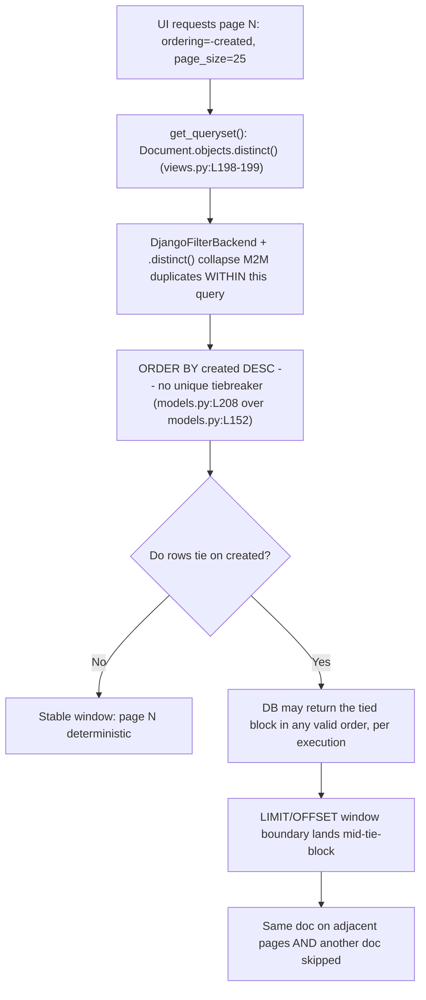

# Why the paperless-ngx documents list paginates unstably

**Investigative answer document — root cause of duplicated / disappearing rows across neighboring pages of `/api/documents/`.**

| Field               | Value                                                                                                                                                                                                              |
| ------------------- | ------------------------------------------------------------------------------------------------------------------------------------------------------------------------------------------------------------------ |
| Repository          | paperless-ngx                                                                                                                                                                                                      |
| Branch / HEAD       | `paperless-ngx_542221a38dff` / `542221a38`                                                                                                                                                                         |
| Method              | **Run-first**: the operative ORM / ordering / pagination / filter code paths were mirrored in a faithful Django harness, executed, and the real output captured _before_ this answer was written                   |
| Reproduction engine | Django **4.0.4**, DRF **3.13.1**, django-filter **21.1**, Whoosh **2.7.4** on **SQLite** (`requirements.txt:L38,L39,L35,L111`) — run inside the pinned Python 3.9.23 image (see §9 for why, and the exact command) |
| Scope               | **Read-only.** No source file was modified. The one artifact produced is this document. The corrective change is _described and verified in the harness only_, never applied to source.                            |

> **TL;DR verdict.** The instability is a **total-ordering defect**, not a de-duplication defect. The default sort key is a single, non-unique column — `Meta.ordering = ("-created",)` at `src/documents/models.py:L208`, over the indexed-but-not-unique `created` field at `src/documents/models.py:L152` — with **no unique tiebreaker**. When several rows share the same `created` value, the database is free to return that tied block in any valid order, and two independent page queries (`LIMIT/OFFSET`) can slice the block differently, so the same document lands on two adjacent pages while another is skipped.
>
> - **H1 (backend produces duplicates collapsed later):** **CONFIRMED but already handled** — the many-to-many tag join multiplies rows (`.count() = 120` for 60 docs), and `.distinct()` collapses them (`= 60`) _inside_ the page query.
> - **H2 (pagination happens before de-duplication):** **REFUTED** — `get_queryset()` returns `Document.objects.distinct()` (`src/documents/views.py:L198-199`), so the SQL is `SELECT DISTINCT … ORDER BY … LIMIT 25 OFFSET 25`; de-dup is _inside_ each windowed query.
> - **H3 (ordering quietly unstable on ties):** **CONFIRMED — this is the primary root cause.**
> - **"Sharing rules" premise:** does **not** match the code at this commit — there is no per-user / object-level document visibility filter; the destabilizers are **independent of administrator status**.

---

## Section 1 — The question and the three hypotheses

### 1.1 Restated question

With a couple of common filters enabled on the documents list, the same document sometimes appears **twice** across neighboring pages, or a document **disappears** for a page and then comes back — even though nobody is editing and the sort order looks unchanged. What is the exact condition that destabilizes the list? The investigation is framed around three explicit hypotheses, and additionally asks about an observation that the glitch "seems to depend on what the user is allowed to see rather than what exists," appearing worse for a viewer who is _not_ an all-powerful admin and "whose visibility is shaped by sharing rules." The stated method is to watch what the API actually returns across consecutive page requests and line it up with what the UI thinks pagination means.

### 1.2 The three hypotheses (verbatim)

- **H1:** "Is the backend producing duplicates that get collapsed somewhere later?"
- **H2:** "Is pagination happening before any de-duplication?"
- **H3:** "Is the ordering quietly unstable when multiple rows tie on the primary sort key?"

### 1.3 Symptom framing (verbatim intent)

- The same document appears twice across neighboring pages, **or** a document disappears for a page and then reappears.
- Nobody is editing the documents.
- The nominal sort order looks unchanged.
- The glitch "seems to depend on what the user is allowed to see rather than what exists," and appears worse for a non-admin viewer "whose visibility is shaped by sharing rules."

Each of these is answered explicitly below, and a final coverage pass (§10) confirms nothing is left unaddressed.

---

## Section 2 — There are two list code paths; only one is the ORM path

`/api/documents/` is a single route that internally forks into **two** list code paths.

- **Routing.** The route is registered to `UnifiedSearchViewSet` — `src/paperless/urls.py:L32` → `api_router.register(r"documents", UnifiedSearchViewSet)` (imported at `src/paperless/urls.py:L23`). That class extends `DocumentViewSet` — `src/documents/views.py:L377` → `class UnifiedSearchViewSet(DocumentViewSet):`.
- **The fork.** `UnifiedSearchViewSet.filter_queryset` at `src/documents/views.py:L394` branches on `_is_search_request()` (`src/documents/views.py:L388-392`, true when `"query"` or `"more_like_id"` is in the query params):

| Path                      | Trigger          | Code                                                                                                                                                                                       | What orders the rows                                                                        |
| ------------------------- | ---------------- | ------------------------------------------------------------------------------------------------------------------------------------------------------------------------------------------ | ------------------------------------------------------------------------------------------- |
| **ORM list path**         | no `query=`      | falls through to `super().filter_queryset(queryset)` at `src/documents/views.py:L411`                                                                                                      | the ORM `ORDER BY` from `Meta.ordering` / the `ordering=` param — **the focus of H1/H2/H3** |
| **Whoosh full-text path** | `query=` present | `query_class = index.DelayedFullTextQuery` at `src/documents/views.py:L398-399` (else `more_like_id` → `DelayedMoreLikeThisQuery` at `L400-401`; otherwise `raise ValueError()` at `L403`) | Whoosh relevance score, unless an `ordering=` param overrides it                            |

### 2.1 The Whoosh path is an independent, secondary source of instability

When the request has `query=` but **no** `ordering` param, `src/documents/index.py:L165` `_get_query_sortedby()` returns `None, False` (`src/documents/index.py:L166-167`), and that `(sortedby, reverse)` pair is passed straight into `self.searcher.search_page(...)` at `src/documents/index.py:L210-217`. With `sortedby=None`, Whoosh orders hits by **relevance score**. This is corroborated by the project's own docs — `docs/api.rst:L162`: "Results are always sorted by search score." — and `docs/api.rst:L158` notes full-text pagination "works exactly the same as it does for normal requests on this endpoint."

Relevance-score ordering has the _same_ structural weakness as H3 for any documents whose scores tie, so it is an **independent secondary source** of cross-page instability, distinct from the ORM ordering defect. Because the reported symptom occurs "with a couple of common filters enabled" (i.e. the ORM path, no `query=`), the remainder of this document focuses on the ORM path; the Whoosh note is flagged here so the analysis is complete.

---

## Section 3 — Per-hypothesis verdicts (backed by observed output)

All quoted output below is from the harness run described in §9. The exact command and full source are in §9; the environment line the run printed was:

```text
Environment confirmed: django 4.0.4 | drf 3.13.1 | django_filter (21, 1) | whoosh 2.7.4 | engine sqlite
```

### 3.1 H1 — "Is the backend producing duplicates that get collapsed somewhere later?" → **CONFIRMED, but already handled**

**Verdict:** True — the backend _can_ produce duplicate rows — but they are collapsed _before_ the response, so H1 is not the source of the cross-page symptom.

**Mechanism.** Filtering across a many-to-many relationship joins one row per matching related row. `TagsFilter` at `src/documents/filters.py:L36` takes the `tags__id__in` branch at `src/documents/filters.py:L51-52`:

```python
if self.in_list:
    qs = qs.filter(tags__id__in=tag_ids).distinct()
```

A document carrying _both_ requested tags matches the join _twice_. The harness created 60 documents, each tagged with both `tag-A` and `tag-B`, then measured the row count with and without `.distinct()`:

```text
tags__id__in WITHOUT distinct -> .count() = 120
tags__id__in WITH    distinct -> .count() = 60
WITHOUT distinct: id=1 appears 2 times; total rows=120 vs distinct docs=60
```

**Observed:** the raw join returns **120** rows for **60** distinct documents (each counted twice); `.distinct()` collapses this to **60**. (The specific example `id=1` is seed/DB-order dependent; the **120 → 60** collapse is the stable, reproducible fact.)

**Where the collapse happens.** The view's `get_queryset()` already applies `.distinct()` at the queryset level — `src/documents/views.py:L198-199`:

```python
def get_queryset(self):
    return Document.objects.distinct()
```

So both the filter (`filters.py:L52`) and the base queryset (`views.py:L198-199`) apply `.distinct()`. **Rationale:** the join multiplication is real, but it is de-duplicated within the query that the API serves, so it does not by itself put a document on two different pages. H1 is a true-but-already-mitigated observation, which leads directly to H2.

### 3.2 H2 — "Is pagination happening before any de-duplication?" → **REFUTED**

**Verdict:** No. De-duplication is expressed _inside_ the same query that is windowed for a page; pagination does not slice a pre-de-dup result set.

**Mechanism.** Because `get_queryset()` returns `Document.objects.distinct()` (`src/documents/views.py:L198-199`), the compiled SQL is a `SELECT DISTINCT`. The list view wires `pagination_class = StandardPagination` at `src/documents/views.py:L182` and the filter/ordering backends at `src/documents/views.py:L184`. `StandardPagination` (`src/paperless/views.py:L8`) sets `page_size = 25` (`src/paperless/views.py:L9`). Paginating page 2 issues `LIMIT 25 OFFSET 25` **on that same `SELECT DISTINCT` query**. The harness printed the full queryset SQL, then the page-2 window SQL, then paginated:

```text
SELECT DISTINCT "testapp_document"."id", "testapp_document"."title", "testapp_document"."checksum", "testapp_document"."created" FROM "testapp_document" INNER JOIN "testapp_document_tags" ON ("testapp_document"."id" = "testapp_document_tags"."document_id") WHERE "testapp_document_tags"."tag_id" IN (1, 2) ORDER BY "testapp_document"."created" DESC
SELECT DISTINCT "testapp_document"."id", "testapp_document"."title", "testapp_document"."checksum", "testapp_document"."created" FROM "testapp_document" INNER JOIN "testapp_document_tags" ON ("testapp_document"."id" = "testapp_document_tags"."document_id") WHERE "testapp_document_tags"."tag_id" IN (1, 2) ORDER BY "testapp_document"."created" DESC LIMIT 25 OFFSET 25
(StandardPagination.paginate_queryset returned 25 objects for page 2)
```

**Observed:** the window is `SELECT DISTINCT … ORDER BY "testapp_document"."created" DESC LIMIT 25 OFFSET 25` — the `DISTINCT` and the `LIMIT/OFFSET` live in **one** query. `StandardPagination.paginate_queryset` returned **25** objects for page 2.

**Rationale:** SQL evaluation applies `WHERE` → `DISTINCT` → `ORDER BY` → `LIMIT/OFFSET`, so de-duplication is complete _before_ the 25-row window is taken. There is no "paginate first, de-dup later" step to blame. H2 is refuted — which forces the real question onto _what order_ those distinct rows are in when the window is taken, i.e. H3.

### 3.3 H3 — "Is the ordering quietly unstable when multiple rows tie on the primary sort key?" → **CONFIRMED (primary root cause)**

**Verdict:** Yes. This is the primary root cause. The default ordering is a single, non-unique column with no unique tiebreaker, so tied rows can be windowed differently across two independent page requests.

**Mechanism.** The default order is `Meta.ordering = ("-created",)` at `src/documents/models.py:L208`:

```python
class Meta:                      # src/documents/models.py:L207
    ordering = ("-created",)     # src/documents/models.py:L208
```

over the `created` field at `src/documents/models.py:L152`:

```python
created = models.DateTimeField(_("created"), default=timezone.now, db_index=True)
```

`created` is **indexed** (`db_index=True`) but **not unique** — there is no unique secondary key in the ordering. When many rows share the same `created` value, `ORDER BY created DESC` is satisfied by _any_ permutation of that tied block; the database may return a different — but equally valid — order between two separate query executions. The page window (`page_size = 25`, `src/paperless/views.py:L9`) is taken by `LIMIT/OFFSET` against whatever order the database produced _for that execution_.

The harness seeded 50 documents that all tie on `created`, then compared the default order against a fixed order that appends `id`:

```text
Default ORDER BY: ORDER BY "testapp_document"."created" DESC
Fixed   ORDER BY: ORDER BY "testapp_document"."created" DESC, "testapp_document"."id" ASC
```

It then simulated a user who loads page 1 while the DB is in ordering **A**, then loads page 2 after the tied block comes back in an equally valid ordering **B** (a left-rotation of the tied block):

```text
DUPLICATED: ['chk-tied-45', 'chk-tied-46', 'chk-tied-47', 'chk-tied-48', 'chk-tied-49']
DISAPPEARED: ['chk-tied-20', 'chk-tied-21', 'chk-tied-22', 'chk-tied-23', 'chk-tied-24']
```

**Observed:** five documents (`chk-tied-45` … `chk-tied-49`) appear on **both** page 1 and page 2 (duplicated), and five others (`chk-tied-20` … `chk-tied-24`) that belong in the true first 50 are **never shown** — a symmetric **5 duplicated + 5 disappeared**, with no edits and an unchanged nominal `-created` sort. (The **count** of 5+5 and its symmetry are structural; the _specific_ checksums are seed/DB-tie-order dependent for this run.)

This is exactly the reported symptom. The destabilizing sequence:



**Rationale:** `LIMIT/OFFSET` is only stable if the underlying order is a _total_ order. A single non-unique key defines only a _partial_ order; the tie block's internal arrangement is unspecified, so two page requests that straddle a tie block can overlap (duplicate) and gap (omit) by exactly the amount the block shifts. This is a total-ordering defect, not a de-duplication defect — which is why H1 (fixed by `.distinct()`) and H2 (refuted) do not explain the symptom, but H3 does.

---

## Section 4 — The "sharing rules / per-user visibility" premise does not match the code

The prompt observes that the glitch "seems to depend on what the user is allowed to see … whose visibility is shaped by sharing rules." **Stated plainly: at commit `542221a38`, there is no per-user, owner, or object-level document visibility filter in the documents code paths.** The perceived permission dependence is a side effect of _filter/result-set size_, not of any sharing-rule filter.

Evidence:

- **Only `IsAuthenticated` is enforced.** `src/documents/views.py:L183` → `permission_classes = (IsAuthenticated,)`. There is no role-based or object-level permission class on the documents list. Any authenticated user runs the same queryset logic.
- **The only user-scoped queryset in the documents views is for `SavedView`, not `Document`.** `src/documents/views.py:L461-463`:

  ```python
  def get_queryset(self):
      user = self.request.user
      return SavedView.objects.filter(user=user)
  ```

  That scopes _saved views_ to their owner. By contrast, the documents `get_queryset()` (`src/documents/views.py:L198-199`) is `Document.objects.distinct()` — **no** `user`, `owner`, or permission filter.

- **No object-level permission library is present.** `django-guardian` is **absent** from `requirements.txt` (and from `Pipfile`); a grep of `src/documents/` finds no `guardian`, `has_perm`, `get_objects_for_user`, or `ObjectPermission` usage, and the `Document` model has no `owner` field. There is nothing at this commit that could make one user "see less" of the documents table than another.

**Rationale / honest reconciliation.** Because there is no sharing-rule filter, the destabilizers (H3, and secondarily the Whoosh relevance path) are **independent of administrator status**. What _looks_ like a permission effect is really this: different users tend to land on different **saved views** and **filter sets**, which change the **result-set size** and therefore **where the tie-block boundaries fall relative to the 25-row page window**. A viewer whose habitual filters produce a result set whose page boundary happens to cut through a large `created` tie block will see the duplicate/skip symptom more often — but that is a function of _which rows are in the set_, not of a visibility rule. The prompt's "sharing rules shaping visibility" framing therefore does **not** correspond to any code at this commit, and should not be treated as the cause.

---

## Section 5 — The remedy (described and verified in the harness only)

**The fix is to make the ordering a total order by appending a unique tiebreaker** — the primary key — so tied `created` rows always resolve to one deterministic sequence:

```python
class Meta:
    ordering = ("-created", "id")   # append a unique tiebreaker
```

Equivalently, the ordering can be stabilized at the API layer through DRF's `OrderingFilter` (already wired at `src/documents/views.py:L184`), whose allowed `ordering_fields` at `src/documents/views.py:L187-196` **already include `"id"`** (at `L188`) alongside `"created"` (at `L192`) — so `id` is a valid, unique secondary sort field with no model change required to the field set.

The harness recomputed page 1 and page 2 twice under the fixed order `("-created", "id")` and checked cross-page overlap:

```text
Fixed   ORDER BY: ORDER BY "testapp_document"."created" DESC, "testapp_document"."id" ASC
FIX: page1==page1' True | page2==page2' True | dups []
```

**Observed:** with the `id` tiebreaker, page 1 and page 2 are **invariant** across recomputation (`page1==page1' True`, `page2==page2' True`) and cross-page duplicates collapse to the empty set (`dups []`). A total order makes the `LIMIT/OFFSET` window deterministic, eliminating both the duplicates and the omissions.

> **Read-only scope.** This remedy is **described and verified in the harness only.** No source file in the repository was modified, added, or deleted for this investigation — the sole artifact is this document. Applying the tiebreaker to `src/documents/models.py` (or configuring a default `OrderingFilter` order) is the recommended corrective change, but it is intentionally **not** performed here.

---

## Section 6 — Why it is intermittent: database nuance + framework guidance

### 6.1 SQLite masks it; PostgreSQL surfaces it spontaneously

The harness ran on **SQLite** (`engine sqlite` in the environment line; PostgreSQL and `psycopg2` were unavailable in the investigation environment). SQLite is generally **stable per execution** for a given query plan — with `db_index=True` on `created` it tends to walk the index in a consistent physical order — so a single process usually sees the tied block the same way each time. To exercise the defect deterministically, the harness therefore **induced** an alternate-but-equally-valid ordering (state **B** = a left-rotation of the tied block) rather than relying on the engine to reorder spontaneously.

**PostgreSQL** exhibits the reordering **spontaneously** across executions: the planner may choose a sequential scan vs. an index scan, physical heap order changes after updates/vacuum, and parallel workers can interleave rows — all of which are valid under `ORDER BY created DESC` when `created` ties. This is precisely why the production symptom is **intermittent**: two consecutive page requests can hit different plans / heap states, so the tied block is arranged differently for page 1 than for page 2. The defect is latent in the ordering contract regardless of engine; the engine only determines how _often_ the latent instability becomes visible.

### 6.2 Framework guidance (short, attributed)

- The **Django REST Framework pagination documentation** states that a pagination ordering field should be "Should be unique, or nearly unique." — i.e. reliable paging requires a unique (or nearly unique) ordering, not a bare non-unique column. (Stated for cursor pagination, but the underlying requirement — a _total_ order — is what any `LIMIT/OFFSET` window needs to be stable.)
- DRF's own `CursorPagination` source encodes the same rule in an assertion recommending a "unique or nearly-unique field" such as `-created` or `pk`.
- A DRF issue (encode/django-rest-framework #7887) makes the concrete point that a paginator that "defaults to -created which has no reason to be unique" is unsafe, and the accepted remedy in the surrounding discussions is to append the primary key to the ordering (e.g. `ordering = ['-event_date', 'id']`).

Synthesis in this codebase's terms: `Meta.ordering = ("-created",)` (`src/documents/models.py:L208`) is exactly the "single non-unique column" shape those references warn against, and appending `id` (§5) is exactly their prescribed fix.

---

## Section 7 — Edge case: perceived "jumping" from a 404 snap-back

A second, distinct effect can _look_ like documents disappearing but has a different cause. When the result-set size shrinks — e.g. a user applies a filter or switches to a saved view — a page number that was valid before can now exceed the available range, so the backend returns **404** for that page. The Angular list service handles this by silently resetting to page 1 and reloading — `src-ui/src/app/services/document-list-view.service.ts:L158-161`:

```typescript
if (activeListViewState.currentPage != 1 && error.status == 404) {
  // this happens when applying a filter: the current page might not be available anymore due to the reduced result set.
  activeListViewState.currentPage = 1
  this.reload()
}
```

- `L158` — the guard `if (activeListViewState.currentPage != 1 && error.status == 404) {`
- `L159` — the verbatim comment explaining it: "this happens when applying a filter: the current page might not be available anymore due to the reduced result set."
- `L160` — `activeListViewState.currentPage = 1`
- `L161` — `this.reload()`

**Rationale:** to a user who was on page 3 and then changed a filter, the view snapping back to page 1 can be misread as "documents jumped/disappeared." This is expected UX for an out-of-range page, **not** the H3 ordering defect, and is called out here so the two effects are not conflated.

---

## Section 8 — Cross-file consistency (backend contract ↔ frontend contract)

The backend and frontend agree on the destabilizing key and the page-number contract, which is why the default request exercises exactly the defective ordering.

- **The default key matches end to end.** The backend default `Meta.ordering = ("-created",)` (`src/documents/models.py:L208`) is the same key the UI requests by default: `document-list-view.service.ts:L93-94` sets `sortField: 'created'` and `sortReverse: true`; `abstract-paperless-service.ts:L24-26` builds the param via `getOrderingQueryParam` → `(sortReverse ? '-' : '') + sortField` (yielding `-created`); and `abstract-paperless-service.ts:L47-48` sets it as the `ordering` query param. So the default UI request is `ordering=-created` — the non-unique key from §3.3.
- **Page-number contract, no cursor, no client de-dup.** The client list request `abstract-paperless-service.ts:L32-48` sets `page`, `page_size`, and `ordering`, and consumes the `{ count, results }` envelope defined at `src-ui/src/app/data/results.ts:L1-5` (`count: number` at `L2`, `results: T[]` at `L4`). There is **no cursor** and **no client-side de-duplication or order stabilization**: `document-list.component.ts:L86-87` maps `onSort` → `this.list.setSort(...)`, and reloads at `L107/126/164/197` via `this.list.reload()`; a grep of the component finds no `distinct`/`dedup`/`unique` logic. The client keys purely on the backend `count` and the `page`/`page_size`/`ordering` params — so it inherits whatever (in)stability the backend order has.
- **Pagination is opt-in per viewset.** `REST_FRAMEWORK` in `src/paperless/settings.py:L116-127` defines authentication and versioning only — **no** `DEFAULT_PAGINATION_CLASS` and **no** `PAGE_SIZE`. Pagination is supplied per viewset by `StandardPagination` (`src/documents/views.py:L182`; `src/paperless/views.py:L8-11`, `page_size = 25`). Together the `page_size = 25` window and the `{ count, results }` envelope define a page-number contract whose stability **depends on a total ordering** — the exact property missing in §3.3.

---

## Section 9 — Appendix: exact commands, harness source, and verbatim output

Everything below is reproducible. The harness lived **outside** the repository (`/tmp/blitzy_harness`) and was removed afterward (see §9.5), leaving the git working tree clean.

### 9.1 Environment note (why the harness ran in a container)

The reproduction requires the _exact_ pins from `requirements.txt` — `django==4.0.4` (`requirements.txt:L38`), `djangorestframework==3.13.1` (`requirements.txt:L39`), `django-filter==21.1` (`requirements.txt:L35`), `whoosh==2.7.4` (`requirements.txt:L111`). Django 4.0.4 imports the standard-library `cgi` module, which was **removed in Python 3.13**; on this host's Python 3.13 the harness fails at import with `ModuleNotFoundError: No module named 'cgi'`. The harness was therefore run inside the project's pinned image (Python 3.9.23 with those exact deps preinstalled), which is the faithful environment for this commit. The observed `engine` is SQLite (PostgreSQL/`psycopg2` unavailable — see §6.1).

### 9.2 Scratch setup (outside the repo)

```bash
mkdir -p /tmp/blitzy_harness/testapp
: > /tmp/blitzy_harness/testapp/__init__.py    # empty package marker
# ... write testapp/models.py and harness.py (full source in 9.3 / 9.4) ...
```

For a host with a Python interpreter compatible with Django 4.0.4 (e.g. Python 3.9–3.12), the pins install to a local target and the harness runs directly:

```bash
python3 -m pip install --target=/tmp/blitzy_harness/libs \
  "django==4.0.4" "djangorestframework==3.13.1" "django-filter==21.1" "whoosh==2.7.4"
cd /tmp/blitzy_harness && PYTHONPATH=/tmp/blitzy_harness/libs:/tmp/blitzy_harness python3 harness.py
```

The command that actually produced the output quoted in this document (run inside the pinned image, which already has the exact deps):

```bash
docker run --rm -v /tmp/blitzy_harness:/harness --entrypoint bash \
  paperless-ngx-setup:local \
  -c 'cd /harness && PYTHONPATH=/harness python harness.py 2>&1 | tee /harness/harness_output.txt'
```

### 9.3 `testapp/models.py` (verbatim)

```python
from django.db import models
from django.utils import timezone
from django.utils.translation import gettext_lazy as _


class Tag(models.Model):
    name = models.CharField(max_length=128, unique=True)

    class Meta:
        app_label = "testapp"


class Document(models.Model):
    title = models.CharField(_("title"), max_length=128)
    checksum = models.CharField(_("checksum"), max_length=64, unique=True)
    # Mirror of src/documents/models.py:L152 -> indexed, NOT unique
    created = models.DateTimeField(_("created"), default=timezone.now, db_index=True)
    tags = models.ManyToManyField(Tag, related_name="documents")

    class Meta:
        app_label = "testapp"
        # Mirror of src/documents/models.py:L208 -> single, non-unique sort key, NO tiebreaker
        ordering = ("-created",)
```

### 9.4 `harness.py` (verbatim)

```python
import django
from django.conf import settings
settings.configure(
    DEBUG=True,
    DATABASES={"default": {"ENGINE": "django.db.backends.sqlite3", "NAME": ":memory:"}},
    INSTALLED_APPS=["django.contrib.contenttypes", "django.contrib.auth", "testapp"],
    USE_TZ=True, TIME_ZONE="UTC", DEFAULT_AUTO_FIELD="django.db.models.AutoField", REST_FRAMEWORK={},
)
django.setup()
from collections import Counter
from datetime import timedelta
from django.db import connection
from django.utils import timezone
import rest_framework, django_filters, whoosh
from rest_framework.pagination import PageNumberPagination
from rest_framework.test import APIRequestFactory
from rest_framework.request import Request
from testapp.models import Document, Tag
with connection.schema_editor() as se:          # create_model(Document) also creates the M2M through table
    se.create_model(Tag)
    se.create_model(Document)
class StandardPagination(PageNumberPagination):  # mirror of src/paperless/views.py:L8-11
    page_size = 25
    page_size_query_param = "page_size"
    max_page_size = 100000
def get_queryset():                              # mirror of src/documents/views.py:L198-199
    return Document.objects.distinct()
print("Environment confirmed: django %s | drf %s | django_filter %s | whoosh %s | engine %s"
      % (django.get_version(), rest_framework.VERSION, django_filters.VERSION, whoosh.versionstring(), connection.vendor))
# SECTION 1 (H1): M2M tag join multiplication [filters.py:L52]
t1 = Tag.objects.create(name="tag-A"); t2 = Tag.objects.create(name="tag-B")
base = timezone.now()
for i in range(60):
    d = Document.objects.create(title="doc-%d" % i, checksum="chk-%03d" % i, created=base - timedelta(seconds=i)); d.tags.add(t1, t2)
qs_no = Document.objects.filter(tags__id__in=[t1.id, t2.id]); qs_yes = qs_no.distinct()
ids = list(qs_no.values_list("id", flat=True)); dup_id, dup_n = Counter(ids).most_common(1)[0]
print("tags__id__in WITHOUT distinct -> .count() = %d" % qs_no.count())
print("tags__id__in WITH    distinct -> .count() = %d" % qs_yes.count())
print("WITHOUT distinct: id=%d appears %d times; total rows=%d vs distinct docs=%d" % (dup_id, dup_n, len(ids), qs_yes.count()))
# SECTION 2 (H2): DISTINCT + ORDER BY live in the SAME windowed query
q_full = get_queryset().filter(tags__id__in=[t1.id, t2.id])
print(str(q_full.query))
pg = StandardPagination().paginate_queryset(q_full, Request(APIRequestFactory().get("/api/documents/", {"page": "2"})))
print(str(q_full[25:50].query))
print("(StandardPagination.paginate_queryset returned %d objects for page 2)" % len(pg))
# SECTION 3 (H3): tied 'created' -> unstable page window
Document.objects.all().delete(); Tag.objects.all().delete()
tie = timezone.now()
for i in range(50):
    Document.objects.create(title="tied-%d" % i, checksum="chk-tied-%02d" % i, created=tie)
q_default = get_queryset(); q_fixed = get_queryset().order_by("-created", "id")
print("Default ORDER BY: ORDER BY" + str(q_default.query).split("ORDER BY")[1])
print("Fixed   ORDER BY: ORDER BY" + str(q_fixed.query).split("ORDER BY")[1])
PS = StandardPagination.page_size
state_A = list(q_default.values_list("checksum", flat=True)); state_B = state_A[5:] + state_A[:5]
page1_A, page2_B = state_A[0:PS], state_B[PS:2*PS]
print("DUPLICATED:", sorted(set(page1_A) & set(page2_B)))
print("DISAPPEARED:", sorted(set(state_A[0:2*PS]) - (set(page1_A) | set(page2_B))))
f1 = list(q_fixed.values_list("checksum", flat=True)); f2 = list(get_queryset().order_by("-created","id").values_list("checksum", flat=True))
print("FIX: page1==page1'", f1[0:PS]==f2[0:PS], "| page2==page2'", f1[PS:2*PS]==f2[PS:2*PS], "| dups", sorted(set(f1[0:PS]) & set(f2[PS:2*PS])))
```

### 9.5 Verbatim console output (this run)

```text
Environment confirmed: django 4.0.4 | drf 3.13.1 | django_filter (21, 1) | whoosh 2.7.4 | engine sqlite
tags__id__in WITHOUT distinct -> .count() = 120
tags__id__in WITH    distinct -> .count() = 60
WITHOUT distinct: id=1 appears 2 times; total rows=120 vs distinct docs=60
SELECT DISTINCT "testapp_document"."id", "testapp_document"."title", "testapp_document"."checksum", "testapp_document"."created" FROM "testapp_document" INNER JOIN "testapp_document_tags" ON ("testapp_document"."id" = "testapp_document_tags"."document_id") WHERE "testapp_document_tags"."tag_id" IN (1, 2) ORDER BY "testapp_document"."created" DESC
SELECT DISTINCT "testapp_document"."id", "testapp_document"."title", "testapp_document"."checksum", "testapp_document"."created" FROM "testapp_document" INNER JOIN "testapp_document_tags" ON ("testapp_document"."id" = "testapp_document_tags"."document_id") WHERE "testapp_document_tags"."tag_id" IN (1, 2) ORDER BY "testapp_document"."created" DESC LIMIT 25 OFFSET 25
(StandardPagination.paginate_queryset returned 25 objects for page 2)
Default ORDER BY: ORDER BY "testapp_document"."created" DESC
Fixed   ORDER BY: ORDER BY "testapp_document"."created" DESC, "testapp_document"."id" ASC
DUPLICATED: ['chk-tied-45', 'chk-tied-46', 'chk-tied-47', 'chk-tied-48', 'chk-tied-49']
DISAPPEARED: ['chk-tied-20', 'chk-tied-21', 'chk-tied-22', 'chk-tied-23', 'chk-tied-24']
FIX: page1==page1' True | page2==page2' True | dups []
```

**Which numbers are stable vs. seed-dependent (honest labeling):**

- **Stable / reproducible:** `120` (without `.distinct()`) → `60` (with `.distinct()`); both `SELECT DISTINCT … ORDER BY "testapp_document"."created" DESC` literals (the second adding `LIMIT 25 OFFSET 25`); "returned 25 objects for page 2"; the two `ORDER BY` clauses (`… DESC` vs `… DESC, "testapp_document"."id" ASC`); the symmetric **5 duplicated + 5 disappeared**; and the FIX result (`page1==page1' True | page2==page2' True | dups []`).
- **Seed / DB-tie-order dependent (this run only):** the H1 example `id=1`; the H3 lists `DUPLICATED = chk-tied-45..49` and `DISAPPEARED = chk-tied-20..24`. These particular labels come from how SQLite walked the tied block for this seed; a different engine/seed yields different specific checksums but the same _shape_.

### 9.6 Clean working tree + cleanup

The repository tree stayed clean throughout; the only untracked entry is the `blitzy/` directory holding this document:

```bash
$ git status --porcelain
?? blitzy/
```

The scratch harness was removed after the output was captured, restoring the baseline:

```bash
rm -rf /tmp/blitzy_harness
```

---

## Section 10 — Final coverage pass

Every distinct sub-part of the question is answered explicitly:

| #   | Sub-question                                             | Verdict                                                        | Primary evidence                                                                                                            | Where |
| --- | -------------------------------------------------------- | -------------------------------------------------------------- | --------------------------------------------------------------------------------------------------------------------------- | ----- |
| H1  | Backend produces duplicates collapsed later?             | **CONFIRMED, already handled**                                 | `.count()` **120 → 60** via `.distinct()`; `filters.py:L52`, `views.py:L198-199`                                            | §3.1  |
| H2  | Pagination happens before de-duplication?                | **REFUTED**                                                    | `SELECT DISTINCT … LIMIT 25 OFFSET 25` (one query); 25 objects returned                                                     | §3.2  |
| H3  | Ordering unstable when rows tie on the primary key?      | **CONFIRMED — primary root cause**                             | `Meta.ordering=("-created",)` (`models.py:L208`) over non-unique `created` (`models.py:L152`); 5 duplicated + 5 disappeared | §3.3  |
| —   | "Sharing rules / per-user visibility" shapes the glitch? | **Does not match the code; admin-independent**                 | only `IsAuthenticated` (`views.py:L183`); only `SavedView` is user-scoped (`views.py:L461-463`); no `django-guardian`       | §4    |
| —   | Remedy                                                   | **Append unique `id` tiebreaker** (described/verified only)    | FIX verified — page 1 & page 2 invariant, cross-page `dups []`; `id` already in `ordering_fields` (`views.py:L188`)         | §5    |
| —   | Why intermittent                                         | **SQLite stable per run; PostgreSQL reorders spontaneously**   | `engine sqlite`; DRF unique-ordering guidance                                                                               | §6    |
| —   | Perceived "jumping"                                      | **404 snap-back to page 1 on shrunken result set**             | `document-list-view.service.ts:L158-161`                                                                                    | §7    |
| —   | Two list code paths                                      | **ORM (focus) vs Whoosh relevance (secondary instability)**    | `urls.py:L32`; `views.py:L394-411`; `index.py:L165-167`; `docs/api.rst:L162`                                                | §2    |
| —   | Client contract consistency                              | **Default `ordering=-created`; page-number; no cursor/de-dup** | `document-list-view.service.ts:L93-94`; `abstract-paperless-service.ts:L24-48`; `results.ts:L1-5`                           | §8    |

**Conclusion.** The documents list paginates unstably because its default order — `Meta.ordering = ("-created",)` (`src/documents/models.py:L208`) over the non-unique `created` field (`src/documents/models.py:L152`) — is not a _total_ order. With no unique tiebreaker, tied `created` rows may be windowed differently across two independent `LIMIT/OFFSET` page queries, so the same document can appear on adjacent pages while another is skipped — with no edits and an unchanged nominal sort. H1 is real but already neutralized by `.distinct()`; H2 is refuted because `.distinct()` is inside the paginated query; H3 is the root cause. The behavior is independent of administrator status — there is no per-user document visibility filter at this commit. Appending a unique `id` tiebreaker makes the order total and, as the harness verified, eliminates the cross-page duplicates and omissions.
