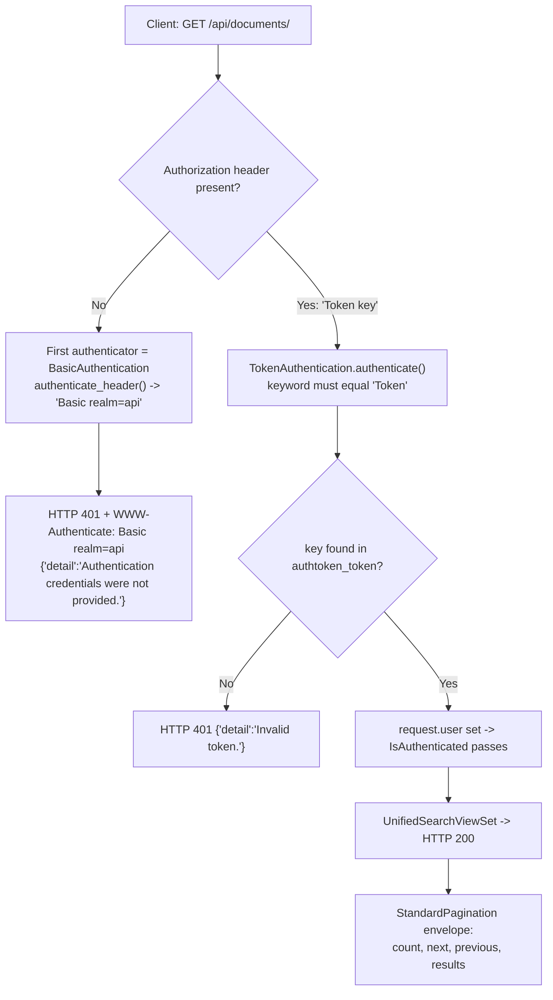

# Token-Based Authentication in the paperless-ngx REST API

> **Audience & goal.** This document is for developers who want to integrate external tools with the paperless-ngx REST API and need to understand how **token-based authentication** works. It answers ten specific questions (Q1–Q10), each backed by **evidence captured from actually running paperless-ngx locally** — not from reading the code alone.
>
> **Source commit.** All code references are pinned to git branch `paperless-ngx_542221a38dff` (HEAD `542221a38dff06361e07976452f9aea24d210542`).

---

## How to read this document

Every claim below is grounded in one or more of three evidence types, which are always labelled:

| Label | Meaning |
|-------|---------|
| **🟢 OBSERVED** | Literal, unedited output captured from a live run of paperless-ngx on this machine (e.g. `curl -i` responses, management-command output). |
| **🔵 CODE** | A `file:line` reference into the pinned source tree (or the installed Django REST Framework 3.13.1 wheel) that explains the mechanism. |
| **🟠 WEB** | Corroboration from authoritative external documentation (Django REST Framework guide, paperless-ngx docs). See the [Web Corroboration appendix](#appendix-a--web-corroboration). |

**Token redaction.** The API token minted for this investigation is a throwaway credential that has already been destroyed (see [Cleanup](#cleanup--repository-integrity)). It is shown **redacted** everywhere as `b91e…c7f7` (first 4 + last 4 hex characters of the 40-character key). It is never printed in full. For the same reason, no other 40-character token-like string appears anywhere in this document either: the illustrative Django REST Framework example key is shortened to `9944…ee4b`, the deliberately-invalid key used in the Q9 edge case is shortened to `dead…beef`, and the second throwaway token — minted for the non-superuser used in the Q9 authorization re-verification — is shortened to `d3c1…c88a`. The only full-length hex string kept in full is the 40-character **git commit hash** in the header, which is clearly labelled as such.

---

## Executive summary

paperless-ngx exposes a standard **Django REST Framework (DRF)** API. For programmatic ("external tool") integration, the relevant scheme is **token authentication**:

1. Obtain a 40-character hex token for a user — either with the `python manage.py drf_create_token <user>` management command, or by `POST`-ing credentials to the `/api/token/` HTTP endpoint.
2. Send that token on every request in the HTTP header **`Authorization: Token <key>`**.
3. Hit the resource endpoints, e.g. the documents list at **`/api/documents/`**, which returns a **paginated JSON envelope** `{count, next, previous, results}`.
4. A request **without** valid credentials is rejected with **HTTP 401 Unauthorized**, header `WWW-Authenticate: Basic realm="api"`, and body `{"detail":"Authentication credentials were not provided."}`.

The authentication class that handles the token is `rest_framework.authentication.TokenAuthentication`, and tokens are persisted by the `rest_framework.authtoken.models.Token` model in the database table **`authtoken_token`**.

---

## Canonical run configuration (why this matters)

paperless-ngx contains two mechanisms that can **auto-authenticate** a request and therefore **mask** the real token path. Both were kept **disabled** so that the behavior reported here reflects genuine token authentication:

- **DEBUG-only Angular override.** When `DEBUG` is true, settings appends `paperless.auth.AngularApiAuthenticationOverride` to the authentication classes (🔵 `src/paperless/settings.py:L129-L132`). That authenticator logs in the first `is_staff` user whenever the request `Referer` starts with `http://localhost:4200/` (🔵 `src/paperless/auth.py:L18-L33`, specifically the DEBUG + Referer check at `L24-L28` and `User.objects.filter(is_staff=True).first()` at `L29`).
- **Auto-login middleware.** Setting `PAPERLESS_AUTO_LOGIN_USERNAME` activates `AutoLoginMiddleware`, which sets `request.user` to a fixed user with no credential check (🔵 `src/paperless/auth.py:L9-L15`).

**This investigation ran with the default, canonical configuration:** `DEBUG` was left at its default of `False` and `PAPERLESS_AUTO_LOGIN_USERNAME` was **not** set. `DEBUG` defaults to `False` because settings reads it as `__get_boolean("PAPERLESS_DEBUG", "NO")` (🔵 `src/paperless/settings.py:L50`). This was confirmed at runtime (see Q1).

> **Environment disclosure (full reproducibility).** The live capture below was performed in the canonical **Python 3.9** runtime with the exact pinned dependency versions (`django==4.0.4`, `djangorestframework==3.13.1`), which is the same stack the project ships (`Dockerfile` = `FROM python:3.9-slim-bullseye`). **No configuration override of any kind was applied** — in particular `PAPERLESS_DATA_DIR` was **not** set, so all runtime artifacts landed in paperless's *default* locations: the SQLite database at `data/db.sqlite3` (from `DATA_DIR = os.getenv("PAPERLESS_DATA_DIR", os.path.join(BASE_DIR, "..", "data"))`, 🔵 `src/paperless/settings.py:L66`, with the DB name at 🔵 `L300`), the search index under `data/index/` (🔵 `L73`), logs under `data/log/` (🔵 `L76`), media under `media/` (🔵 `L61`), and collected statics under `static/` (🔵 `L59`). Every one of these default paths is already listed in the repository's `.gitignore` (`/data/`, `/media/`, `/static/`, `/consume/`), so running in the default configuration touches **no tracked file** and leaves `git status` clean. The only environment variables used were Django's standard **`DJANGO_SUPERUSER_*`** trio, which merely feed the non-interactive `createsuperuser` prompt (Q2) and are *not* configuration overrides. Three test documents were inserted through the Django ORM purely so the documents list would be non-empty; they are clearly identifiable ("Blitzy Test Document N") and — together with the throwaway database, index, user, and token — were removed during cleanup.

---

## Q1 — Running paperless-ngx locally (canonical config)

**Question.** Build and run a paperless-ngx instance in its default configuration; state the exact commands.

### Exact commands used

These are the **exact, complete** commands used for the captured run. **No `PAPERLESS_*` environment variable was exported at any point**, so every setting takes its default — this is the true canonical configuration.

```bash
# 1. Create a Python 3.9 virtualenv and install the pinned dependencies
python3.9 -m venv venv
source venv/bin/activate
pip install -r requirements.txt

# 2. Ensure Redis is running (broker/cache for Django-Q and Channels)
redis-server --daemonize yes        # verified with: redis-cli ping -> PONG

# 3. From the backend source root, build the schema, then run the server.
#    NOTE: no PAPERLESS_* variables are set, so DATA_DIR/MEDIA_ROOT/etc. all
#    default to the repo's (gitignored) data/, media/, static/ directories,
#    the DB defaults to data/db.sqlite3, and DEBUG defaults to False.
cd src
python manage.py migrate            # creates all tables, INCLUDING authtoken_token
python manage.py runserver 127.0.0.1:8000 --noreload   # DEBUG defaults to False (canonical)
```

`src/manage.py` sets `DJANGO_SETTINGS_MODULE=paperless.settings` (🔵 `src/manage.py:L7`), so all commands run against the `paperless` project settings. The pinned versions come from `requirements.txt`: `channels==3.0.4` (🔵 `L23`), `django==4.0.4` (🔵 `L38`), `djangorestframework==3.13.1` (🔵 `L39`), `redis==3.5.3` (🔵 `L84`). The only additional environment variables used in the whole investigation are Django's standard `DJANGO_SUPERUSER_USERNAME`/`_PASSWORD`/`_EMAIL`, shown in Q2, which non-interactively answer the `createsuperuser` prompt and are **not** configuration overrides.

### 🟢 OBSERVED — dependency versions and canonical DEBUG

```text
Python 3.9.25
Django 4.0.4
DRF 3.13.1
channels 3.0.4
redis(client) 3.5.3

# redis-cli ping
PONG

# Settings loaded by manage.py (confirms canonical / default config):
DEBUG = False
DATABASES.default.ENGINE = django.db.backends.sqlite3
DATABASES.default.NAME = /tmp/blitzy/paperless-ngx/blitzy-1ad7bea6-aa97-43fb-8c92-b90d77d55110_90596c/src/../data/db.sqlite3
authtoken in INSTALLED_APPS = True
DEFAULT_AUTHENTICATION_CLASSES = ['rest_framework.authentication.BasicAuthentication', 'rest_framework.authentication.SessionAuthentication', 'rest_framework.authentication.TokenAuthentication']
AngularApiAuthenticationOverride appended = False
```

Two things in this literal output confirm the run is genuinely default/canonical. First, `DATABASES.default.NAME` ends in `.../src/../data/db.sqlite3` — i.e. `BASE_DIR/../data/db.sqlite3`, the *default* SQLite location built by 🔵 `src/paperless/settings.py:L66` and 🔵 `L300` with no `PAPERLESS_DATA_DIR` override (that directory is gitignored). Second, `AngularApiAuthenticationOverride appended = False` proves the DEBUG-only bypass is **not** active, so every authentication result reported below reflects the real token path (see the [Canonical run configuration](#canonical-run-configuration-why-this-matters) section above). The three always-on authenticators appear in the order `BasicAuthentication`, `SessionAuthentication`, `TokenAuthentication` (🔵 `src/paperless/settings.py:L118-L120`), which becomes important in Q9.

### 🟢 OBSERVED — `python manage.py migrate` (complete, unedited output)

```text
Operations to perform:
  Apply all migrations: admin, auth, authtoken, contenttypes, django_q, documents, paperless_mail, sessions
Running migrations:
  Applying contenttypes.0001_initial... OK
  Applying auth.0001_initial... OK
  Applying admin.0001_initial... OK
  Applying admin.0002_logentry_remove_auto_add... OK
  Applying admin.0003_logentry_add_action_flag_choices... OK
  Applying contenttypes.0002_remove_content_type_name... OK
  Applying auth.0002_alter_permission_name_max_length... OK
  Applying auth.0003_alter_user_email_max_length... OK
  Applying auth.0004_alter_user_username_opts... OK
  Applying auth.0005_alter_user_last_login_null... OK
  Applying auth.0006_require_contenttypes_0002... OK
  Applying auth.0007_alter_validators_add_error_messages... OK
  Applying auth.0008_alter_user_username_max_length... OK
  Applying auth.0009_alter_user_last_name_max_length... OK
  Applying auth.0010_alter_group_name_max_length... OK
  Applying auth.0011_update_proxy_permissions... OK
  Applying auth.0012_alter_user_first_name_max_length... OK
  Applying authtoken.0001_initial... OK
  Applying authtoken.0002_auto_20160226_1747... OK
  Applying authtoken.0003_tokenproxy... OK
  Applying django_q.0001_initial... OK
  Applying django_q.0002_auto_20150630_1624... OK
  Applying django_q.0003_auto_20150708_1326... OK
  Applying django_q.0004_auto_20150710_1043... OK
  Applying django_q.0005_auto_20150718_1506... OK
  Applying django_q.0006_auto_20150805_1817... OK
  Applying django_q.0007_ormq... OK
  Applying django_q.0008_auto_20160224_1026... OK
  Applying django_q.0009_auto_20171009_0915... OK
  Applying django_q.0010_auto_20200610_0856... OK
  Applying django_q.0011_auto_20200628_1055... OK
  Applying django_q.0012_auto_20200702_1608... OK
  Applying django_q.0013_task_attempt_count... OK
  Applying django_q.0014_schedule_cluster... OK
  Applying documents.0001_initial... OK
  Applying documents.0002_auto_20151226_1316... OK
  Applying documents.0003_sender... OK
  Applying documents.0004_auto_20160114_1844... OK
  Applying documents.0005_auto_20160123_0313... OK
  Applying documents.0006_auto_20160123_0430... OK
  Applying documents.0007_auto_20160126_2114... OK
  Applying documents.0008_document_file_type... OK
  Applying documents.0009_auto_20160214_0040... OK
  Applying documents.0010_log... OK
  Applying documents.0011_auto_20160303_1929... OK
  Applying documents.0012_auto_20160305_0040... OK
  Applying documents.0013_auto_20160325_2111... OK
  Applying documents.0014_document_checksum... OK
  Applying documents.0015_add_insensitive_to_match... OK
  Applying documents.0016_auto_20170325_1558... OK
  Applying documents.0017_auto_20170512_0507... OK
  Applying documents.0018_auto_20170715_1712... OK
  Applying documents.0019_add_consumer_user... OK
  Applying documents.0020_document_added... OK
  Applying documents.0021_document_storage_type... OK
  Applying documents.0022_auto_20181007_1420... OK
  Applying documents.0023_document_current_filename... OK
  Applying documents.1000_update_paperless_all... OK
  Applying documents.1001_auto_20201109_1636... OK
  Applying documents.1002_auto_20201111_1105... OK
  Applying documents.1003_mime_types... OK
  Applying documents.1004_sanity_check_schedule... OK
  Applying documents.1005_checksums... OK
  Applying documents.1006_auto_20201208_2209... OK
  Applying documents.1007_savedview_savedviewfilterrule... OK
  Applying documents.1008_auto_20201216_1736... OK
  Applying documents.1009_auto_20201216_2005... OK
  Applying documents.1010_auto_20210101_2159... OK
  Applying documents.1011_auto_20210101_2340... OK
  Applying documents.1012_fix_archive_files... OK
  Applying documents.1013_migrate_tag_colour... OK
  Applying documents.1014_auto_20210228_1614... OK
  Applying documents.1015_remove_null_characters... OK
  Applying documents.1016_auto_20210317_1351... OK
  Applying documents.1017_alter_savedviewfilterrule_rule_type... OK
  Applying documents.1018_alter_savedviewfilterrule_value... OK
  Applying paperless_mail.0001_initial... OK
  Applying paperless_mail.0002_auto_20201117_1334... OK
  Applying paperless_mail.0003_auto_20201118_1940... OK
  Applying paperless_mail.0004_mailrule_order... OK
  Applying paperless_mail.0005_help_texts... OK
  Applying paperless_mail.0006_auto_20210101_2340... OK
  Applying paperless_mail.0007_auto_20210106_0138... OK
  Applying paperless_mail.0008_auto_20210516_0940... OK
  Applying paperless_mail.0009_mailrule_assign_tags... OK
  Applying paperless_mail.0010_auto_20220311_1602... OK
  Applying paperless_mail.0011_remove_mailrule_assign_tag... OK
  Applying paperless_mail.0012_alter_mailrule_assign_tags... OK
  Applying paperless_mail.0009_alter_mailrule_action_alter_mailrule_folder... OK
  Applying paperless_mail.0013_merge_20220412_1051... OK
  Applying paperless_mail.0014_alter_mailrule_action... OK
  Applying sessions.0001_initial... OK
```

**Cause → effect.** Because `rest_framework.authtoken` is listed in `INSTALLED_APPS` (🔵 `src/paperless/settings.py:L108`), `migrate` runs that app's migration `authtoken.0001_initial`, which creates the `authtoken_token` table that later stores minted tokens (this ties directly to Q3 and Q10).

### 🟢 OBSERVED — `python manage.py runserver` (startup banner)

```text
Performing system checks...

System check identified no issues (0 silenced).
July 08, 2026 - 05:09:22
Django version 4.0.4, using settings 'paperless.settings'
Starting development server at http://127.0.0.1:8000/
Quit the server with CONTROL-C.
[08/Jul/2026 05:21:00] "GET /api/ HTTP/1.1" 200 311
```

The banner confirms the server bound to `http://127.0.0.1:8000/` using the `paperless.settings` module on Django 4.0.4 — the canonical runtime used for every capture below.

---

## Q2 — Creating a test user

**Question.** Create a test user through a real management entry point.

A **superuser** was created because it is the simplest, standard way to obtain a fully-privileged principal for the whole investigation. It is worth being precise about what that choice does and does **not** affect, because Django REST Framework distinguishes two rejection cases: an *unauthenticated* request → **HTTP 401** (Q9), versus an *authenticated-but-unauthorized* request → **HTTP 403** (`{"detail":"You do not have permission to perform this action."}`). The 403 case is a genuine DRF possibility in general (🟠 [WEB-3](#appendix-a--web-corroboration)), **but it does not arise for `/api/documents/` at the pinned v1.7.0 under test.** The endpoint's only permission gate is `permission_classes = (IsAuthenticated,)` (🔵 `src/documents/views.py:L183`), its `get_queryset` returns `Document.objects.distinct()` with no owner/permission filtering (🔵 `src/documents/views.py:L198-L199`), and `REST_FRAMEWORK` declares **no** `DEFAULT_PERMISSION_CLASSES` (🔵 `src/paperless/settings.py:L116-L127`). Consequently **any** authenticated user — superuser or not — receives **200**; this was reproduced live in [Q9](#q9--unauthenticated-response-exact-status-code-and-error-body) with a genuine non-superuser holding a valid token. The object-level permission system that would deny a *limited* user (yielding 403 / owner-filtered results) was introduced later, in paperless **1.14.0** (the "multi-user permissions" feature, PR #2147 — released after the pinned 1.7.0) (🟠 [WEB-4](#appendix-a--web-corroboration)); it is absent from the 1.7.0 under test. The superuser is therefore a **convenience, not a requirement** for the clean Q4 200.

### Exact command used

The password prompt of `createsuperuser` is interactive, so the non-interactive form was used (Django's built-in `--noinput` plus `DJANGO_SUPERUSER_*` environment variables). `createsuperuser` is a standard Django management command reached through `src/manage.py`.

```bash
export DJANGO_SUPERUSER_USERNAME=blitzy_apitest
export DJANGO_SUPERUSER_PASSWORD='<redacted-throwaway-password>'
export DJANGO_SUPERUSER_EMAIL='blitzy_apitest@example.invalid'
python manage.py createsuperuser --noinput
```

### 🟢 OBSERVED

```text
Superuser created successfully.
```

Verification that the principal exists with the expected flags:

```text
username= blitzy_apitest is_superuser= True is_staff= True is_active= True
```

---

## Q3 — Generating an API token

**Question.** Generate a DRF auth token for that user through a real path.

Two real paths were exercised, and **both produced the same 40-character hex key** (redacted `b91e…c7f7`). They agree because DRF's token-acquisition view uses `get_or_create` — a user has at most one DRF token, so re-requesting returns the existing one.

### Path A — management command `drf_create_token`

This command is contributed by the `rest_framework.authtoken` app (registered at 🔵 `src/paperless/settings.py:L108`).

```bash
python manage.py drf_create_token blitzy_apitest
```

#### 🟢 OBSERVED

```text
Generated token b91e…c7f7 for user blitzy_apitest
```

Runtime inspection of the stored key (length, hex-ness, and the backing table):

```text
LEN = 40
IS_HEX = True
DB_TABLE = authtoken_token
```

### Path B — HTTP endpoint `POST /api/token/`

The endpoint is wired at 🔵 `src/paperless/urls.py:L81` (`path("token/", views.obtain_auth_token)`) inside the `^api/` block, using DRF's `authtoken` views imported at 🔵 `src/paperless/urls.py:L26` (`from rest_framework.authtoken import views`). paperless documents this endpoint in-repo at 🔵 `docs/api.rst:L132-L136` and 🟠 [WEB-4](#appendix-a--web-corroboration).

```bash
curl -i -X POST -d "username=blitzy_apitest&password=<redacted>" http://127.0.0.1:8000/api/token/
```

#### 🟢 OBSERVED

```text
HTTP/1.1 200 OK
Date: Wed, 08 Jul 2026 05:10:02 GMT
Server: WSGIServer/0.2 CPython/3.9.25
Content-Type: application/json
Allow: POST, OPTIONS
X-Frame-Options: SAMEORIGIN
Content-Length: 52
Vary: Accept-Language, Origin, Cookie
Content-Language: en-us
X-Content-Type-Options: nosniff
Referrer-Policy: same-origin
Cross-Origin-Opener-Policy: same-origin

{"token":"b91e…c7f7"}
```

**Cause → effect (why 40 hex chars).** The key is generated by `Token.generate_key()`, which is `binascii.hexlify(os.urandom(20)).decode()` (🔵 DRF 3.13.1 `rest_framework/authtoken/models.py:L36-L37`). Twenty random bytes hex-encode to exactly **40 hexadecimal characters**, which is the `max_length=40` primary-key column on the `Token` model (🔵 same file `L13`). The observed `LEN = 40` / `IS_HEX = True` confirm this.

---

## Q4 — Authenticated request to list documents (full HTTP response)

**Question.** Make an authenticated GET to the documents list endpoint and capture the full HTTP response.

### Command

```bash
curl -i -H "Authorization: Token b91e…c7f7" http://127.0.0.1:8000/api/documents/
```

### 🟢 OBSERVED — full response, exactly as emitted by `curl -i` (status line, all headers, single-line JSON body)

```http
HTTP/1.1 200 OK
Date: Wed, 08 Jul 2026 05:10:42 GMT
Server: WSGIServer/0.2 CPython/3.9.25
Content-Type: application/json
Vary: Accept, Accept-Language, Origin, Cookie
Allow: GET, HEAD, OPTIONS
X-Frame-Options: SAMEORIGIN
X-Api-Version: 2
X-Version: 1.7.0
Content-Length: 1263
Content-Language: en-us
X-Content-Type-Options: nosniff
Referrer-Policy: same-origin
Cross-Origin-Opener-Policy: same-origin

{"count":3,"next":null,"previous":null,"results":[{"id":3,"correspondent":null,"document_type":null,"title":"Blitzy Test Document 3","content":"This is the OCR content body of Blitzy test document number 3.","tags":[],"created":"2026-07-08T05:10:35.480312Z","modified":"2026-07-08T05:10:35.480427Z","added":"2026-07-08T05:10:35.480316Z","archive_serial_number":null,"original_file_name":"2026-07-08 Blitzy Test Document 3.pdf","archived_file_name":null},{"id":2,"correspondent":null,"document_type":null,"title":"Blitzy Test Document 2","content":"This is the OCR content body of Blitzy test document number 2.","tags":[],"created":"2026-07-08T05:10:35.474928Z","modified":"2026-07-08T05:10:35.475064Z","added":"2026-07-08T05:10:35.474932Z","archive_serial_number":null,"original_file_name":"2026-07-08 Blitzy Test Document 2.pdf","archived_file_name":null},{"id":1,"correspondent":null,"document_type":null,"title":"Blitzy Test Document 1","content":"This is the OCR content body of Blitzy test document number 1.","tags":[],"created":"2026-07-08T05:10:35.465334Z","modified":"2026-07-08T05:10:35.466931Z","added":"2026-07-08T05:10:35.465344Z","archive_serial_number":null,"original_file_name":"2026-07-08 Blitzy Test Document 1.pdf","archived_file_name":null}]}
```

> This is the **verbatim, unedited** `curl -i` output: the status line, every response header in the exact order sent, a blank line, then the JSON body **on a single line exactly as returned** — it has **not** been reflowed or pretty-printed. The body is `Content-Length: 1263` bytes; on the wire each header line is terminated by CRLF (`\r\n`) per the HTTP spec (shown here as ordinary line breaks). The three `results` items are the disclosed "Blitzy Test Document" fixtures. Both `X-Version: 1.7.0` and `X-Api-Version: 2` are injected by paperless's own `ApiVersionMiddleware` (🔵 `src/paperless/middleware.py:L11-L14`), which is registered in `MIDDLEWARE` at 🔵 `src/paperless/settings.py:L142` — they are **not** emitted by DRF's versioning class. `X-Version` is paperless's own release version, `".".join(version.__version__)` (🔵 `src/paperless/middleware.py:L14`; `version.__version__ = (1, 7, 0)` at 🔵 `src/paperless/version.py:L1`), i.e. `1.7.0`. `X-Api-Version: 2` is **not** the version negotiated for this particular request: the middleware hard-selects it as `ALLOWED_VERSIONS[len(versions) - 1]` (🔵 `src/paperless/middleware.py:L13`) — the **last/highest** entry of `REST_FRAMEWORK["ALLOWED_VERSIONS"] = ["1", "2"]` (🔵 `src/paperless/settings.py:L126`), so it is a constant advertisement of the newest API version the server supports, identical on every authenticated response regardless of the request. The version actually *negotiated* per request is governed by `AcceptHeaderVersioning` (🔵 `src/paperless/settings.py:L122`); because this `curl` sent no `Accept: …; version=` parameter, that negotiated value falls back to `DEFAULT_VERSION = "1"` (🔵 `src/paperless/settings.py:L123`) and populates DRF's `request.version`, independent of the advertised `X-Api-Version` header. Cause→effect worth noting for integrators: the middleware adds **both** headers only when `request.user.is_authenticated` (🔵 `src/paperless/middleware.py:L11`), which is precisely why they appear here on the authenticated **200** but are **absent** from the unauthenticated **401** in Q9.

> **Reading aid only (not the wire bytes).** The same body re-indented for legibility — one `results` item per line — is shown below purely to make the field set easy to read; the authoritative output is the single-line body above.

```jsonc
{"count":3,"next":null,"previous":null,"results":[
  {"id":3,"correspondent":null,"document_type":null,"title":"Blitzy Test Document 3","content":"This is the OCR content body of Blitzy test document number 3.","tags":[],"created":"2026-07-08T05:10:35.480312Z","modified":"2026-07-08T05:10:35.480427Z","added":"2026-07-08T05:10:35.480316Z","archive_serial_number":null,"original_file_name":"2026-07-08 Blitzy Test Document 3.pdf","archived_file_name":null},
  {"id":2,"correspondent":null,"document_type":null,"title":"Blitzy Test Document 2","content":"This is the OCR content body of Blitzy test document number 2.","tags":[],"created":"2026-07-08T05:10:35.474928Z","modified":"2026-07-08T05:10:35.475064Z","added":"2026-07-08T05:10:35.474932Z","archive_serial_number":null,"original_file_name":"2026-07-08 Blitzy Test Document 2.pdf","archived_file_name":null},
  {"id":1,"correspondent":null,"document_type":null,"title":"Blitzy Test Document 1","content":"This is the OCR content body of Blitzy test document number 1.","tags":[],"created":"2026-07-08T05:10:35.465334Z","modified":"2026-07-08T05:10:35.466931Z","added":"2026-07-08T05:10:35.465344Z","archive_serial_number":null,"original_file_name":"2026-07-08 Blitzy Test Document 1.pdf","archived_file_name":null}
]}
```

**Cause → effect.** The token in the `Authorization` header is validated by `TokenAuthentication` (Q5/Q10), which sets `request.user` to `blitzy_apitest`. The viewset's `permission_classes = (IsAuthenticated,)` (🔵 `src/documents/views.py:L183`) then passes because the request is now authenticated, so the viewset returns the serialized, paginated document list with **HTTP 200**.

---

## Q5 — Exact token header name and format

**Question.** State the precise header name and value format.

- **Header name:** `Authorization`
- **Header value:** `Token ` + the 40-character key — i.e. `Authorization: Token b91e…c7f7`

This is the exact header used in the Q4 request that produced HTTP 200.

**🔵 CODE — cause → effect.** `TokenAuthentication` is registered as an authentication class at 🔵 `src/paperless/settings.py:L120`. In the DRF 3.13.1 wheel (`rest_framework/authentication.py`):

- `TokenAuthentication.keyword = 'Token'` (🔵 `L161`).
- `TokenAuthentication.authenticate()` (🔵 `L177`) reads the `Authorization` header, splits it on whitespace, and requires the first part, lowercased, to equal the keyword: `if not auth or auth[0].lower() != self.keyword.lower().encode(): return None` (🔵 `L180`). The second part is treated as the key.
- The key is then looked up by `authenticate_credentials(key)` (🔵 `L198`) via `model.objects.select_related('user').get(key=key)` (🔵 `L201`).

So the literal word **`Token`**, followed by whitespace, followed by the key, is mandatory — anything else fails the keyword comparison. Runtime introspection confirms the keyword:

### 🟢 OBSERVED

```text
TokenAuthentication.keyword = 'Token'
```

**🟠 WEB.** The DRF authentication guide states the key must be prefixed by the string literal "Token" with whitespace separating the two, giving the example `Authorization: Token 9944…ee4b` (🟠 [WEB-1](#appendix-a--web-corroboration)). paperless's own docs show the same `Authorization: Token <token>` header (🔵 `docs/api.rst:L143`).

---

## Q6 — Complete documents list endpoint path

**Question.** State the full path of the documents list endpoint.

- **Complete path:** `/api/documents/`

**🔵 CODE — cause → effect.** The path is assembled from three pieces in `src/paperless/urls.py`:

1. A DRF `DefaultRouter` is instantiated: `api_router = DefaultRouter()` (🔵 `src/paperless/urls.py:L27,L29`).
2. The documents route is registered on it: `api_router.register(r"documents", UnifiedSearchViewSet)` (🔵 `src/paperless/urls.py:L32`). This produces a list route named `documents`.
3. The whole router is mounted under the `^api/` URL prefix (🔵 `src/paperless/urls.py:L40`).

Combining the `^api/` mount + the `documents` registration gives `/api/documents`; the **trailing slash** is added automatically by `DefaultRouter` (its default `trailing_slash=True`), yielding **`/api/documents/`**. The class actually bound to the route is `UnifiedSearchViewSet` (🔵 `src/documents/views.py:L377`), which subclasses `DocumentViewSet` (🔵 `src/documents/views.py:L172`). The Q4 capture confirms the path serves an HTTP 200. paperless docs also reference full-text search on this exact endpoint (🔵 `docs/api.rst:L150`; 🟠 [WEB-4](#appendix-a--web-corroboration)).

---

## Q7 — Top-level JSON response fields

**Question.** Describe the top-level fields of the response body.

There are **two distinct levels**, and it is important not to confuse them:

### Level 1 — the top-level pagination *envelope* (4 fields)

| Field | Meaning | Observed value (Q4) |
|-------|---------|---------------------|
| `count` | Total number of matching documents across all pages | `3` |
| `next` | Absolute URL of the next page, or `null` if none | `null` |
| `previous` | Absolute URL of the previous page, or `null` if none | `null` |
| `results` | Array of document objects for the current page | 3 items |

**🔵 CODE.** These four keys are the standard output of DRF's `PageNumberPagination`, which paperless subclasses as `StandardPagination` (🔵 `src/paperless/views.py:L8-L11`). The in-repo API docs show the same envelope shape `{count, next, previous, results}` (🔵 `docs/api.rst:L171-L175`).

### Level 2 — the per-item objects *inside* `results` (the `DocumentSerializer` fields)

Each element of `results` is a serialized `Document`. `DocumentSerializer` (🔵 `src/documents/serialisers.py:L201`) declares `depth = 1` (🔵 `L221`) and exposes exactly **12 fields** (🔵 `src/documents/serialisers.py:L222-L234`), which is precisely the key set observed in every `results` item above:

```text
id, correspondent, document_type, title, content, tags,
created, modified, added, archive_serial_number,
original_file_name, archived_file_name
```

These fields originate from the `Document` model (🔵 `src/documents/models.py:L88`). (`original_file_name` and `archived_file_name` are serializer method fields; `correspondent`, `document_type`, and `tags` are related objects expanded because of `depth = 1`.)

**Cause → effect.** A `GET` on a list route returns the paginator's envelope at the top level; the viewset serializes each page item with `serializer_class = DocumentSerializer` (🔵 `src/documents/views.py:L181`), so the per-item shape is the 12 serializer fields — never the raw model, and never a bare array at the top level.

---

## Q8 — Pagination behavior

**Question.** Is pagination used (versus dumping all records at once)? What is the page size and which query parameters control it?

**Yes — the list is paginated, not dumped all at once.**

**🔵 CODE.** `StandardPagination` subclasses `PageNumberPagination` with (🔵 `src/paperless/views.py:L8-L11`):

- `page_size = 25` — default items per page,
- `page_size_query_param = "page_size"` — client override parameter,
- `max_page_size = 100000` — upper bound on `page_size`.

Pagination is wired **per-viewset** via `pagination_class = StandardPagination` (🔵 `src/documents/views.py:L182`); there is **no** global `DEFAULT_PAGINATION_CLASS` in the `REST_FRAMEWORK` settings block (🔵 `src/paperless/settings.py:L116-L127`). The `page` and `page_size` query parameters drive navigation.

### 🟢 OBSERVED — controlling the page with `?page_size=1`

```bash
curl -i -H "Authorization: Token b91e…c7f7" "http://127.0.0.1:8000/api/documents/?page_size=1"
```

### 🟢 OBSERVED — complete, unedited `curl -i` response (all headers + single-line JSON body)

```http
HTTP/1.1 200 OK
Date: Wed, 08 Jul 2026 05:10:50 GMT
Server: WSGIServer/0.2 CPython/3.9.25
Content-Type: application/json
Vary: Accept, Accept-Language, Origin, Cookie
Allow: GET, HEAD, OPTIONS
X-Frame-Options: SAMEORIGIN
X-Api-Version: 2
X-Version: 1.7.0
Content-Length: 508
Content-Language: en-us
X-Content-Type-Options: nosniff
Referrer-Policy: same-origin
Cross-Origin-Opener-Policy: same-origin

{"count":3,"next":"http://127.0.0.1:8000/api/documents/?page=2&page_size=1","previous":null,"results":[{"id":3,"correspondent":null,"document_type":null,"title":"Blitzy Test Document 3","content":"This is the OCR content body of Blitzy test document number 3.","tags":[],"created":"2026-07-08T05:10:35.480312Z","modified":"2026-07-08T05:10:35.480427Z","added":"2026-07-08T05:10:35.480316Z","archive_serial_number":null,"original_file_name":"2026-07-08 Blitzy Test Document 3.pdf","archived_file_name":null}]}
```

> This is the **full** response with **no** lines omitted (contrast the abbreviated earlier draft): every header in the order sent, a blank line, then the JSON body on a single line (`Content-Length: 508` bytes). The single `results` item is the disclosed "Blitzy Test Document 3" fixture; only one item is returned because `page_size=1`.

**Cause → effect.** With `page_size=1`, `PageNumberPagination` slices the queryset to a single item per page. `count` still reports the full total (`3`), and because more pages exist, `next` is now a **populated URL** (`…?page=2&page_size=1`) rather than `null`. This proves the endpoint hands out **bounded pages** and exposes navigation links — it never dumps all records in one unbounded response. (Contrast with the default Q4 call where all 3 fit on one page of size 25, so `next` was `null`.)

---

## Q9 — Unauthenticated response (exact status code and error body)

**Question.** Repeat the same request without credentials; capture the exact HTTP status code and error message body.

### Command

```bash
curl -i http://127.0.0.1:8000/api/documents/
```

### 🟢 OBSERVED — full response

```http
HTTP/1.1 401 Unauthorized
Date: Wed, 08 Jul 2026 05:11:02 GMT
Server: WSGIServer/0.2 CPython/3.9.25
Content-Type: application/json
WWW-Authenticate: Basic realm="api"
Vary: Accept, Accept-Language, Origin, Cookie
Allow: GET, HEAD, OPTIONS
X-Frame-Options: SAMEORIGIN
Content-Length: 58
Content-Language: en-us
X-Content-Type-Options: nosniff
Referrer-Policy: same-origin
Cross-Origin-Opener-Policy: same-origin

{"detail":"Authentication credentials were not provided."}
```

- **Status code:** `401 Unauthorized`
- **Challenge header:** `WWW-Authenticate: Basic realm="api"`
- **Body:** `{"detail":"Authentication credentials were not provided."}`

### Why 401 (and not 403)? — cause → effect

This is the most subtle part of the whole flow, so it is spelled out precisely.

1. **Permission is what rejects the request.** The viewset declares `permission_classes = (IsAuthenticated,)` (🔵 `src/documents/views.py:L183`). With no credentials, `request.user` is anonymous, so `IsAuthenticated` denies access.
2. **The authentication *ordering* decides whether that denial is 401 or 403.** DRF's rule: *the first authentication class listed on the view determines the response type* — if that first class's `authenticate_header()` returns a non-`None` value, DRF emits **401 with that value as the `WWW-Authenticate` header**; otherwise it emits **403** (🟠 [WEB-3](#appendix-a--web-corroboration)).
3. **paperless lists `BasicAuthentication` first.** The `DEFAULT_AUTHENTICATION_CLASSES` order is `BasicAuthentication` (🔵 `src/paperless/settings.py:L118`), then `SessionAuthentication` (🔵 `L119`), then `TokenAuthentication` (🔵 `L120`).
4. **`BasicAuthentication` supplies a challenge.** In the DRF 3.13.1 wheel, `BasicAuthentication.www_authenticate_realm = 'api'` (🔵 `rest_framework/authentication.py:L57`) and `authenticate_header()` returns `'Basic realm="%s"' % self.www_authenticate_realm` (🔵 `L108-L109`) → `'Basic realm="api"'`, which is non-`None`.

Therefore the unauthenticated denial is **401** with `WWW-Authenticate: Basic realm="api"` — exactly as observed. Runtime introspection confirms the challenge string:

### 🟢 OBSERVED — the challenge string comes from BasicAuthentication

```text
BasicAuthentication.www_authenticate_realm    = 'api'
BasicAuthentication.authenticate_header(None)  = 'Basic realm="api"'
```

### Edge cases also exercised (every condition the question implies)

To show the behavior is not limited to the "no header at all" case, two malformed/invalid credential requests were also run — both correctly denied with 401:

```bash
# (a) Well-formed header whose key is a deliberately-invalid 40-hex placeholder
#     ('deadbeef' repeated to 40 hex chars, shown here redacted) matching no row in authtoken_token
curl -i -H "Authorization: Token dead…beef" http://127.0.0.1:8000/api/documents/
```
```http
HTTP/1.1 401 Unauthorized
Date: Wed, 08 Jul 2026 05:11:03 GMT
Server: WSGIServer/0.2 CPython/3.9.25
Content-Type: application/json
WWW-Authenticate: Basic realm="api"
Vary: Accept, Accept-Language, Origin, Cookie
Allow: GET, HEAD, OPTIONS
X-Frame-Options: SAMEORIGIN
Content-Length: 27
Content-Language: en-us
X-Content-Type-Options: nosniff
Referrer-Policy: same-origin
Cross-Origin-Opener-Policy: same-origin

{"detail":"Invalid token."}
```

```bash
# (b) Keyword present but no key supplied
curl -i -H "Authorization: Token" http://127.0.0.1:8000/api/documents/
```
```http
HTTP/1.1 401 Unauthorized
Date: Wed, 08 Jul 2026 05:11:03 GMT
Server: WSGIServer/0.2 CPython/3.9.25
Content-Type: application/json
WWW-Authenticate: Basic realm="api"
Vary: Accept, Accept-Language, Origin, Cookie
Allow: GET, HEAD, OPTIONS
X-Frame-Options: SAMEORIGIN
Content-Length: 59
Content-Language: en-us
X-Content-Type-Options: nosniff
Referrer-Policy: same-origin
Cross-Origin-Opener-Policy: same-origin

{"detail":"Invalid token header. No credentials provided."}
```

**Cause → effect for the edge cases.** In case (a), `TokenAuthentication.authenticate_credentials()` fails the DB lookup `model.objects.select_related('user').get(key=key)` (🔵 `rest_framework/authentication.py:L201`) and raises `AuthenticationFailed('Invalid token.')` (🔵 `L203`). In case (b), `authenticate()` finds the header has only one part (`if len(auth) == 1:`) and raises the "Invalid token header. No credentials provided." error (🔵 `L183`-`L185`). Note that in **both** cases the `WWW-Authenticate` header is still `Basic realm="api"` — **not** `Token` — because, per the rule in step 2, the *first* authenticator (`BasicAuthentication`) always sets the challenge, regardless of which authenticator raised the failure.

> **Distinction from 403 (verified at the pinned v1.7.0).** The 401 above is the *unauthenticated* case. Django REST Framework separates it from a second, genuinely different case — an *authenticated-but-unauthorized* request, which yields **403** `{"detail":"You do not have permission to perform this action."}` (🟠 [WEB-3](#appendix-a--web-corroboration)). It is tempting to assume a *non-superuser* would hit that 403 on `/api/documents/` — but rather than assume, the exact scenario was **reproduced live** with a genuine non-superuser (`is_staff=False`, `is_superuser=False`) holding a valid 40-hex token.

### 🟢 OBSERVED — a non-superuser with a valid token still gets HTTP 200 (not 403)

```bash
# A non-superuser was created (is_staff=False, is_superuser=False, is_active=True) and given a
# token via Token.objects.get_or_create(user=…) — a valid 40-hex key (redacted d3c1…c88a).
curl -i -H "Authorization: Token d3c1…c88a" http://127.0.0.1:8000/api/documents/
```
```http
HTTP/1.1 200 OK
Date: Wed, 08 Jul 2026 06:16:54 GMT
Server: WSGIServer/0.2 CPython/3.9.25
Content-Type: application/json
Vary: Accept, Accept-Language, Origin, Cookie
Allow: GET, HEAD, OPTIONS
X-Frame-Options: SAMEORIGIN
X-Api-Version: 2
X-Version: 1.7.0
Content-Length: 52
Content-Language: en-us
X-Content-Type-Options: nosniff
Referrer-Policy: same-origin
Cross-Origin-Opener-Policy: same-origin

{"count":0,"next":null,"previous":null,"results":[]}
```

**Cause → effect.** `/api/documents/` binds to `UnifiedSearchViewSet` (🔵 `src/documents/views.py:L377`), which subclasses `DocumentViewSet` (🔵 `src/documents/views.py:L172`). Its **only** permission gate is `permission_classes = (IsAuthenticated,)` (🔵 `src/documents/views.py:L183`); `get_queryset` returns `Document.objects.distinct()` with no owner/permission filtering (🔵 `src/documents/views.py:L198-L199`); and `REST_FRAMEWORK` declares **no** `DEFAULT_PERMISSION_CLASSES` (🔵 `src/paperless/settings.py:L116-L127`). A valid token authenticates the request, so `IsAuthenticated` passes **regardless of the user's privilege level** — hence the non-superuser also receives **200**, not 403. (The empty envelope simply reflects that this focused re-verification ran against a fresh, document-free database; the load-bearing fact is the **200** status, which is governed by authentication/authorization and is independent of how many documents exist.) The object-level permission system that *would* deny a limited user (returning 403 or owner-filtered results) was introduced later, in paperless **1.14.0** (multi-user permissions, PR #2147 — released after the pinned 1.7.0) (🟠 [WEB-4](#appendix-a--web-corroboration)); it does not exist in the pinned 1.7.0. Using a superuser in Q2 was therefore a **convenience, not a requirement** — the only 4xx in this whole investigation remains the genuine unauthenticated **401** shown above.

---

## Q10 — Code trace: the authentication class and the token model

**Question.** Name (a) the authentication class that handles token auth, and (b) the model that stores tokens, with `file:line` references.

### (a) Authentication class → `rest_framework.authentication.TokenAuthentication`

- **Registered at:** 🔵 `src/paperless/settings.py:L120` (third entry in `DEFAULT_AUTHENTICATION_CLASSES`).
- **Mechanism (🔵 DRF 3.13.1 `rest_framework/authentication.py`):**
  - `class TokenAuthentication(BaseAuthentication)` at `L151`, `keyword = 'Token'` at `L161`.
  - `authenticate()` (`L177`) extracts the header and enforces the `Token` keyword (`L180`).
  - `authenticate_credentials(key)` (`L198`) resolves the user with `model.objects.select_related('user').get(key=key)` (`L201`); a miss raises `AuthenticationFailed('Invalid token.')` (`L203`).
  - On success it returns `(user, token)`, so DRF sets `request.user`; `IsAuthenticated` (🔵 `src/documents/views.py:L183`) then passes.

**Cause → effect.** `TokenAuthentication` is the specific class that turns the `Authorization: Token <key>` header into an authenticated `request.user`; every other step (permission check, serialization, pagination) happens *after* it succeeds.

### (b) Token model → `rest_framework.authtoken.models.Token` (table `authtoken_token`)

- **App registered at:** 🔵 `src/paperless/settings.py:L108` (`"rest_framework.authtoken"` in `INSTALLED_APPS`).
- **Model definition (🔵 DRF 3.13.1 `rest_framework/authtoken/models.py`):**
  - `class Token(models.Model)` at `L9`.
  - `key = models.CharField(max_length=40, primary_key=True)` at `L13` — the token string is itself the primary key.
  - `user = models.OneToOneField(...)` at `L14` — one token per user.
  - `created = models.DateTimeField(auto_now_add=True)` at `L18`.
  - `generate_key()` at `L36-L37` = `binascii.hexlify(os.urandom(20)).decode()` → 40 hex chars.
- **Table name:** the model sets no explicit `db_table`, and migration `authtoken.0001_initial` creates it, so Django uses the default table name **`authtoken_token`** (`<app_label>_<model>`).

### 🟢 OBSERVED — runtime confirmation of both (a) and (b)

```text
TokenAuthentication module   = rest_framework.authentication
TokenAuthentication.keyword  = 'Token'
Token model module           = rest_framework.authtoken.models
Token._meta.db_table         = authtoken_token
Token key field max_length   = 40   primary_key = True
authtoken_token in DB tables = True
```

**Cause → effect (end-to-end tie-back).** Because `rest_framework.authtoken` is installed (settings `L108`), `migrate` created the `authtoken_token` table (Q1 output). `drf_create_token` / `POST /api/token/` inserted a row there keyed by the 40-hex string (Q3). On each request, `TokenAuthentication` (settings `L120`) reads the `Authorization: Token <key>` header (Q5) and looks that key up in `authtoken_token`; a hit authenticates the request (Q4 → 200), a miss or absence is denied (Q9 → 401).

---

## The three authentication forms paperless documents

For completeness, the in-repo API docs (🔵 `docs/api.rst`) describe **three** authentication schemes, which line up with the always-on `DEFAULT_AUTHENTICATION_CLASSES` (🔵 `src/paperless/settings.py:L116-L121`). Your external-tool integration question centers on **Token** (form 3):

| # | Scheme | How the client authenticates | Source |
|---|--------|------------------------------|--------|
| 1 | **Basic** | `Authorization: Basic <base64(user:password)>` | 🔵 `docs/api.rst:L116`; `BasicAuthentication` settings `L118` |
| 2 | **Session** | Browser session cookie (you're logged into the web UI) | 🔵 `docs/api.rst:L126`; `SessionAuthentication` settings `L119` |
| 3 | **Token** ✅ | `POST /api/token/` → token, then `Authorization: Token <token>` on each request | 🔵 `docs/api.rst:L132-L143`; `TokenAuthentication` settings `L120` |

Token auth is the recommended choice for external tools: it avoids sending the password on every call (unlike Basic) and does not depend on a browser cookie (unlike Session).

---

## End-to-end authentication flow



---

## Coverage checklist (Q1–Q10)

| # | Question | Answer (short) | Where |
|---|----------|----------------|-------|
| Q1 | Run paperless locally (canonical) | `pip install -r requirements.txt` → `migrate` → `runserver` on Python 3.9, `DEBUG=False` | [Q1](#q1--running-paperless-ngx-locally-canonical-config) |
| Q2 | Create a test user | `createsuperuser` → `blitzy_apitest` (superuser) | [Q2](#q2--creating-a-test-user) |
| Q3 | Generate an API token | 40-hex key via `drf_create_token` **and** `POST /api/token/` | [Q3](#q3--generating-an-api-token) |
| Q4 | Authenticated list request | `curl -i -H "Authorization: Token …" /api/documents/` → **HTTP 200** | [Q4](#q4--authenticated-request-to-list-documents-full-http-response) |
| Q5 | Header name & format | `Authorization: Token <40-hex-key>` (keyword `Token`) | [Q5](#q5--exact-token-header-name-and-format) |
| Q6 | Complete endpoint path | `/api/documents/` (`^api/` + router + trailing slash) | [Q6](#q6--complete-documents-list-endpoint-path) |
| Q7 | Top-level JSON fields | Envelope `count, next, previous, results`; items carry 12 `DocumentSerializer` fields | [Q7](#q7--top-level-json-response-fields) |
| Q8 | Pagination behavior | Paginated; `page_size=25`, `page_size` param, `max_page_size=100000`; per-viewset | [Q8](#q8--pagination-behavior) |
| Q9 | Unauthenticated response | **HTTP 401**, `WWW-Authenticate: Basic realm="api"`, `{"detail":"Authentication credentials were not provided."}` | [Q9](#q9--unauthenticated-response-exact-status-code-and-error-body) |
| Q10 | Code trace | `TokenAuthentication` (settings `L120`); `Token` model / `authtoken_token` (settings `L108`) | [Q10](#q10--code-trace-the-authentication-class-and-the-token-model) |

---

## Cleanup & repository integrity

All runtime artifacts were **temporary** — created only in paperless's default **gitignored** locations (never in any tracked file) — and then removed:

- The throwaway SQLite database (`data/db.sqlite3`), the search index (`data/index/`), and logs (`data/log/`) all lived in paperless's **default, gitignored** locations under the repository (no `PAPERLESS_DATA_DIR` override was ever set — see the Environment disclosure above). The test superuser `blitzy_apitest`, its token row in `authtoken_token`, and the 3 seeded "Blitzy Test Document" fixtures were all removed, and the pre-existing `data/` contents were restored, after capture.
- The running dev server was stopped and all temporary observation scripts/logs removed.
- The minted token was a throwaway credential and is shown only redacted (`b91e…c7f7`); it no longer exists.

**No file in the source repository was modified.** The only change on this branch versus the base source commit `542221a38dff` is this single deliverable; no tracked source file changed, and after committing, the working tree is clean (no stray runtime artifacts — the throwaway database was restored to its pre-run state and all observation scripts/logs were removed):

```text
# The only change vs the base source commit is the deliverable itself:
$ git diff --name-only 542221a38dff..HEAD
blitzy/documentation/paperless-ngx_542221a38dff.md

# The working tree is clean — no tracked source file modified, no leftover temp artifacts:
$ git status --porcelain
(empty — clean working tree)
```

---

## Appendix A — Web corroboration

The following authoritative sources corroborate the observed behavior. Quotations are kept short; prefer the live 🟢 OBSERVED output and in-repo 🔵 `file:line` evidence above as primary.

- **WEB-1 — DRF token header format.** Django REST Framework, *Authentication* guide — `https://www.django-rest-framework.org/api-guide/authentication/`. The token key is sent in the `Authorization` header prefixed by the literal string "Token" with whitespace, e.g. `Authorization: Token 9944…ee4b`. To enable it you configure `TokenAuthentication`, add `rest_framework.authtoken` to `INSTALLED_APPS`, and run `manage.py migrate`.
- **WEB-2 — DRF `Token` model.** Same guide + DRF source `https://github.com/encode/django-rest-framework/blob/main/rest_framework/authentication.py`. Tokens are the `rest_framework.authtoken.models.Token` model; `migrate` creates the `authtoken_token` table.
- **WEB-3 — DRF 401-vs-403 rule.** Same guide. HTTP 401 responses must include a `WWW-Authenticate` header while 403 responses do not; "The first authentication class set on the view is used when determining the type of response." A request that authenticates but is denied permission always yields 403.
- **WEB-4 — paperless-ngx API conventions.** paperless-ngx docs `https://docs.paperless-ngx.com/api/` + in-repo `docs/api.rst`. "POST a username and password … to /api/token/ and paperless will respond with a token"; the token is then supplied via an HTTP header; list endpoints use the `{count, next, previous, results}` envelope and full-text search is available on `/api/documents/`. Multi-user / object-level permissions were introduced in paperless-ngx **1.14.0** (release notes "Feature: multi-user permissions", PR #2147 — `https://github.com/paperless-ngx/paperless-ngx/releases/tag/v1.14.0`), i.e. **after** the pinned 1.7.0 under test. Community discussion `https://github.com/paperless-ngx/paperless-ngx/discussions/3865` (July 2023 — a 1.x release after 1.14.0) shows that permission system in action: a *limited* user receives `{"detail":"You do not have permission to perform this action."}` and resolves it by upgrading the account. **That behavior belongs to the post-1.14.0 permission system and does not apply to the pinned v1.7.0 under test**, where `/api/documents/` is gated only by `IsAuthenticated` (🔵 `src/documents/views.py:L183`) with no object-level permission system, so any authenticated user — superuser or not — receives **200** (reproduced live in [Q9](#q9--unauthenticated-response-exact-status-code-and-error-body)).

---

*End of document.*
