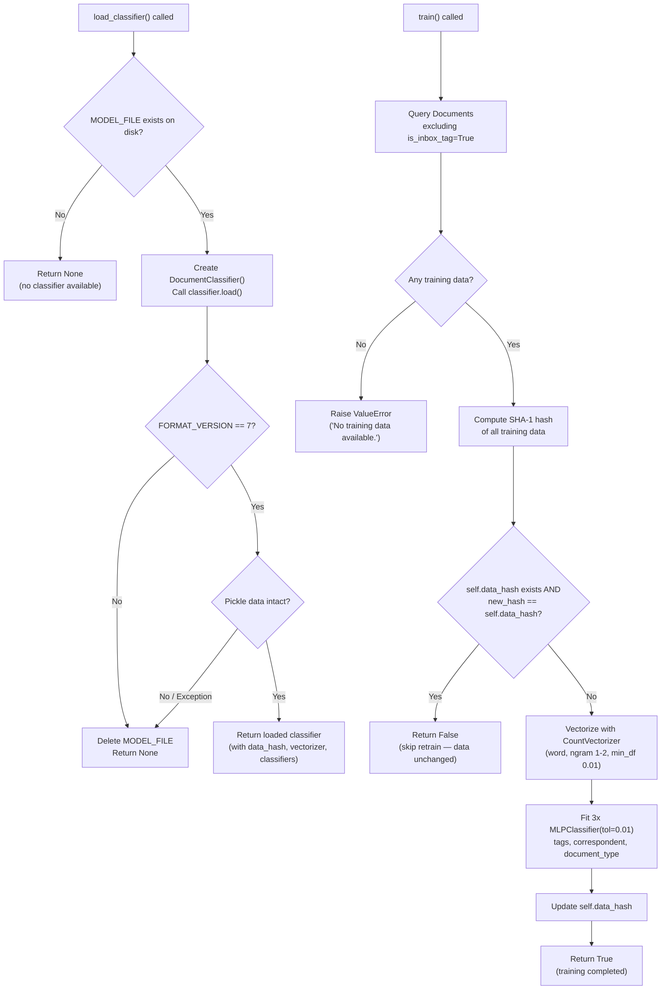
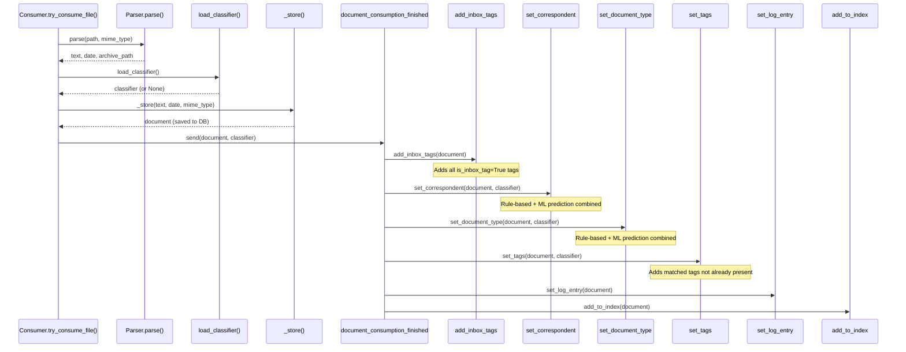
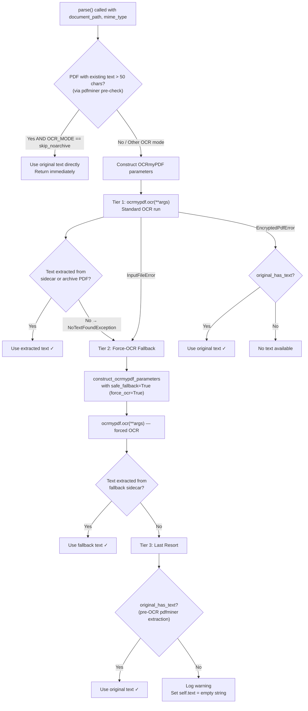
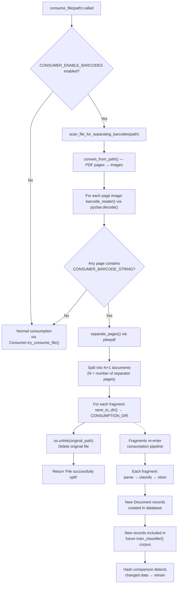

# Paperless-ngx ML Pipeline Behavior During Test Execution

## An Investigative Analysis of Classifier, Matching, OCR, and Barcode Subsystems

> **Purpose:** This document is a deep, code-grounded investigation into how the Paperless-ngx machine learning pipeline behaves during test execution. It is designed to help developers debug non-deterministic test failures in document classification tests by tracing every decision point through the source code.
>
> **Methodology:** Every claim in this document is derived directly from the repository source code. No assumptions are made; file paths and line numbers are cited for every conclusion. The citation format used is `Source: relative/path/to/file.py:LineNumber`.

---

### Table of Contents

- [1. Classifier Reuse vs. Retrain Behavior](#1-classifier-reuse-vs-retrain-behavior)
  - [1.1 Test Isolation: DirectoriesMixin and MODEL_FILE](#11-test-isolation-directoriesmixin-and-model_file)
  - [1.2 load_classifier() Decision Path](#12-load_classifier-decision-path)
  - [1.3 train() Data-Hash Comparison](#13-train-data-hash-comparison)
  - [1.4 MLPClassifier Non-Determinism](#14-mlpclassifier-non-determinism)
- [2. Automatic Correspondent Matching](#2-automatic-correspondent-matching)
  - [2.1 Training Data: Which Documents, How Many](#21-training-data-which-documents-how-many)
  - [2.2 Training Timing Relative to Inserts](#22-training-timing-relative-to-inserts)
  - [2.3 Confidence Threshold (Absence Thereof)](#23-confidence-threshold-absence-thereof)
  - [2.4 Signal Handler Chain](#24-signal-handler-chain)
- [3. OCR Edge Case: No Extractable Text](#3-ocr-edge-case-no-extractable-text)
  - [3.1 OCR Invocation Path (Python API, Not Subprocess)](#31-ocr-invocation-path-python-api-not-subprocess)
  - [3.2 Fallback Chain](#32-fallback-chain)
  - [3.3 MIME Type Assignment](#33-mime-type-assignment)
- [4. Barcode Splitting](#4-barcode-splitting)
  - [4.1 Splitting Decision Point](#41-splitting-decision-point)
  - [4.2 Barcode Values That Trigger Splits](#42-barcode-values-that-trigger-splits)
  - [4.3 Document Record Count From Single Input](#43-document-record-count-from-single-input)
  - [4.4 Impact on Training Data](#44-impact-on-training-data)
- [5. Non-Determinism Root Causes and Recommendations](#5-non-determinism-root-causes-and-recommendations)
  - [5.1 MLPClassifier Random Initialization](#51-mlpclassifier-random-initialization)
  - [5.2 Test Ordering and State Leakage](#52-test-ordering-and-state-leakage)
  - [5.3 Recommendations for Deterministic Testing](#53-recommendations-for-deterministic-testing)

---

## 1. Classifier Reuse vs. Retrain Behavior

### 1.1 Test Isolation: DirectoriesMixin and MODEL_FILE

**Rationale / Thinking:**

To understand whether a classifier is reused or retrained during a test run, we first need to understand the test infrastructure's isolation guarantees. If tests share a common `MODEL_FILE` path, a classifier trained in one test could be loaded by another. If tests use isolated paths, each test starts from a clean slate. The answer lies in `DirectoriesMixin` and `setup_directories()`.

**Code-Traced Answer:**

The test infrastructure provides **per-test-class directory isolation** via the `DirectoriesMixin` class and the `setup_directories()` helper function.

`setup_directories()` (`Source: src/documents/tests/utils.py:14-50`) creates a complete set of fresh temporary directories for each test:

- **Line 18:** `dirs.data_dir = tempfile.mkdtemp()` — creates a unique temporary data directory.
- **Line 19:** `dirs.scratch_dir = tempfile.mkdtemp()` — creates a unique scratch directory.
- **Line 20:** `dirs.media_dir = tempfile.mkdtemp()` — creates a unique media directory.
- **Line 21:** `dirs.consumption_dir = tempfile.mkdtemp()` — creates a unique consumption directory.
- **Line 45:** `MODEL_FILE=os.path.join(dirs.data_dir, "classification_model.pickle")` — sets the classifier model file path to a location inside the unique temporary data directory.

The `override_settings` call at lines 35–47 (`Source: src/documents/tests/utils.py:35-47`) replaces Django settings for the duration of the test, so all paths — including `MODEL_FILE`, `ORIGINALS_DIR`, `THUMBNAIL_DIR`, `ARCHIVE_DIR`, `CONSUMPTION_DIR`, `LOGGING_DIR`, `INDEX_DIR`, and `MEDIA_LOCK` — point to isolated temporary directories.

`DirectoriesMixin` (`Source: src/documents/tests/utils.py:72-83`) is a mixin class that calls `setup_directories()` in its `setUp()` method (line 78) and `remove_dirs()` in its `tearDown()` method (line 83).

`remove_dirs()` (`Source: src/documents/tests/utils.py:53-58`) cleans up all temporary directories (lines 54–57) and disables the settings override (line 58).

**Conclusion:** Each test class that uses `DirectoriesMixin` starts **without** a persisted classifier model file. The `MODEL_FILE` path points to a freshly created, empty temporary directory. No classifier state leaks between test classes through the filesystem. This is a critical detail: within a single test class, if `train_classifier()` is called and saves a model, subsequent methods in the same test class *can* load it. But across test classes, the model file is always absent at startup.

---

### 1.2 load_classifier() Decision Path

**Rationale / Thinking:**

The `load_classifier()` function is the single entry point for obtaining a trained classifier instance at runtime. Understanding its decision path tells us exactly when a classifier is reused (loaded from disk) versus when `None` is returned (forcing a retrain or skip). We need to trace every branch.

**Code-Traced Answer:**

The `load_classifier()` function is defined at `Source: src/documents/classifier.py:30-57`:

1. **Line 31:** `if not os.path.isfile(settings.MODEL_FILE)` — checks whether the classifier pickle file exists on disk. If not, logs a debug message (lines 32–35) and **returns `None`** (line 36). This is the most common path during test execution, since `DirectoriesMixin` creates a fresh directory.

2. **Line 38:** `classifier = DocumentClassifier()` — creates a new, empty classifier instance.

3. **Line 40:** `classifier.load()` — attempts to deserialize the pickle file. The `load()` method (`Source: src/documents/classifier.py:76-94`) reads the `FORMAT_VERSION` first (line 78), then compares it against the expected version.

4. **Line 80:** `if schema_version != self.FORMAT_VERSION` — if the persisted version does not match `FORMAT_VERSION = 7` (`Source: src/documents/classifier.py:63`), raises `IncompatibleClassifierVersionError` (lines 81–83).

5. **Lines 85–94:** If the version matches, it loads all classifier components via `pickle.load()`: `data_hash`, `data_vectorizer`, `tags_binarizer`, `tags_classifier`, `correspondent_classifier`, `document_type_classifier`. Any exception during this process raises `ClassifierModelCorruptError` (line 94).

6. **Lines 42–55:** Exception handling in `load_classifier()`:
   - `ClassifierModelCorruptError` or `IncompatibleClassifierVersionError` → deletes the model file (line 48), returns `None` (line 49).
   - `OSError` → logs the error, returns `None` (lines 50–52).
   - Any other `Exception` → logs the error, returns `None` (lines 53–55).

7. **Line 57:** If loading succeeds without exception, returns the fully loaded classifier.

**Where `load_classifier()` is called:**

| Call Site | File | Line | Context |
|-----------|------|------|---------|
| During consumption | `src/documents/consumer.py` | 292 | After parsing, before `_store()`. The loaded classifier is passed to signal handlers. |
| During training task | `src/documents/tasks.py` | 57 | Inside `train_classifier()`. Attempts to load an existing classifier to check if retraining is needed. |

`Source: src/documents/consumer.py:292`: `classifier = load_classifier()`
`Source: src/documents/tasks.py:57`: `classifier = load_classifier()`

**Conclusion:** The classifier is reused (loaded from disk) **only** if `settings.MODEL_FILE` points to a valid, version-compatible pickle file. In test contexts with `DirectoriesMixin`, the first call to `load_classifier()` always returns `None` because no model file exists yet. A classifier is only available after `train_classifier()` explicitly trains and saves one.



---

### 1.3 train() Data-Hash Comparison

**Rationale / Thinking:**

The `train()` method contains a critical optimization: it computes a SHA-1 hash of the training data and skips retraining if the data hasn't changed since the last training run. This hash-based skip mechanism is the key to understanding whether repeated calls to `train_classifier()` within the same test run will produce the same or different classifiers.

**Code-Traced Answer:**

The `train()` method is defined at `Source: src/documents/classifier.py:115-249`. Its execution follows these steps:

**Step 1 — Data Gathering and Hashing (lines 117–161):**

- **Lines 117–120:** Initialize empty lists for `data`, `labels_tags`, `labels_correspondent`, `labels_document_type`.
- **Line 124:** Create a SHA-1 hash object: `m = hashlib.sha1()`.
- **Lines 125–127:** `Document.objects.order_by("pk").exclude(tags__is_inbox_tag=True)` — query all documents, ordered by primary key, **excluding** any document that has at least one tag with `is_inbox_tag=True`. This is a critical filter: inbox-tagged documents are never part of the training corpus.
- **Line 128:** For each document, preprocess content via `preprocess_content()` (`Source: src/documents/classifier.py:24-27`), which lowercases, strips, and collapses whitespace.
- **Line 129:** Update the hash with the preprocessed content.

For each document, the method then extracts labels:
- **Lines 132–137 (document_type):** If the document's `document_type` has `matching_algorithm == MATCH_AUTO`, use its pk as the label; otherwise use `-1`. The label is hashed (line 136).
- **Lines 139–144 (correspondent):** Same pattern — if the correspondent has `MATCH_AUTO`, use its pk; otherwise `-1`.
- **Lines 146–156 (tags):** Collect all tags on the document that have `matching_algorithm == MATCH_AUTO`, sorted by pk. Each tag pk is hashed individually (lines 154–155).

**Step 2 — Empty Data Guard (lines 158–159):**
- If no documents passed the filter, raises `ValueError("No training data available.")`.

**Step 3 — Hash Comparison (lines 161–164):**
- **Line 161:** `new_data_hash = m.digest()` — finalize the SHA-1 hash.
- **Line 163:** `if self.data_hash and new_data_hash == self.data_hash: return False` — **THE CRITICAL DECISION POINT.** If the classifier already has a `data_hash` (from a previous training or a loaded model) and the new hash matches, the method returns `False` immediately, skipping all retraining. This means the existing classifiers remain unchanged.

**Step 4 — Vectorization (lines 188–199):**
- **Lines 188–190:** Lazy-import scikit-learn: `CountVectorizer`, `MLPClassifier`, `MultiLabelBinarizer`, `LabelBinarizer`.
- **Lines 194–198:** Create `CountVectorizer(analyzer="word", ngram_range=(1, 2), min_df=0.01)`.
- **Line 199:** `data_vectorized = self.data_vectorizer.fit_transform(data)`.

**Step 5 — Classifier Training (lines 202–245):**

Three separate `MLPClassifier` instances are trained:

| Classifier | Line | Target |
|-----------|------|--------|
| `self.tags_classifier` | 219 | `MLPClassifier(tol=0.01)` — tag prediction |
| `self.correspondent_classifier` | 227 | `MLPClassifier(tol=0.01)` — correspondent prediction |
| `self.document_type_classifier` | 238 | `MLPClassifier(tol=0.01)` — document type prediction |

Special handling for tags:
- **Lines 205–214:** If only one tag has `MATCH_AUTO`, falls back to binary classification using `LabelBinarizer` instead of `MultiLabelBinarizer`.
- **Lines 216–217:** Otherwise, uses `MultiLabelBinarizer` for multi-label classification.

**Step 6 — Hash Update (lines 247–249):**
- **Line 247:** `self.data_hash = new_data_hash` — store the hash for future comparison.
- **Line 249:** `return True` — signal that training occurred.

**Conclusion:** The hash comparison at line 163 ensures that if the training data (document content + labels) has not changed between calls, the classifiers are not retrained. Within a single test, calling `train_classifier()` twice with the same database state will result in training on the first call and a skip on the second. The test at `Source: src/documents/tests/test_tasks.py:75-94` (`test_train_classifier`) explicitly verifies this behavior: it checks that the model file's `mtime` does not change on the second call (line 87: `self.assertEqual(mtime, mtime2)`) but does change after document content is modified (line 94: `self.assertNotEqual(mtime2, mtime3)`).

---

### 1.4 MLPClassifier Non-Determinism

**Rationale / Thinking:**

Even when training data is identical, the trained classifiers may produce different predictions across runs if the training process itself is non-deterministic. scikit-learn's `MLPClassifier` uses random weight initialization by default. If no `random_state` is set, results will vary. This section examines whether the codebase sets `random_state`.

**Code-Traced Answer:**

All three `MLPClassifier` instantiations in `train()` use identical parameters:

- `Source: src/documents/classifier.py:219`: `self.tags_classifier = MLPClassifier(tol=0.01)`
- `Source: src/documents/classifier.py:227`: `self.correspondent_classifier = MLPClassifier(tol=0.01)`
- `Source: src/documents/classifier.py:238`: `self.document_type_classifier = MLPClassifier(tol=0.01)`

**Key observation:** The `tol=0.01` parameter controls convergence tolerance — the solver stops when the loss improvement is below this threshold. However, **no `random_state` parameter is set**. In scikit-learn's `MLPClassifier` (version `==1.0.2`, pinned at `Source: Pipfile:36`), the default `random_state=None` means the random number generator uses `numpy.random`'s global state, which varies between runs.

This has the following consequences:

1. **Different weight initializations:** Each time `MLPClassifier.fit()` is called, the initial weights are randomly generated. Different initializations can lead to different local minima.
2. **Different convergence paths:** The stochastic gradient descent solver (`solver='adam'` by default) shuffles training data between epochs unless a seed is fixed.
3. **Different predictions:** The same input may produce different class predictions across independent training runs.

**Conclusion:** The absence of `random_state` in all three `MLPClassifier` instantiations is a **primary root cause of non-deterministic test failures**. Two test runs with identical training data can produce classifiers that disagree on predictions. The `tol=0.01` parameter only controls when to stop iterating — it does not make the process deterministic.

---

## 2. Automatic Correspondent Matching

### 2.1 Training Data: Which Documents, How Many

**Rationale / Thinking:**

To understand automatic correspondent matching, we need to know what data the classifier trains on. Not all documents participate in training, and not all correspondents contribute meaningful labels. The filtering rules determine which documents are included and how their labels are assigned.

**Code-Traced Answer:**

The training data query is at `Source: src/documents/classifier.py:125-127`:

```python
for doc in Document.objects.order_by("pk").exclude(
    tags__is_inbox_tag=True,
):
```

**Inclusion/Exclusion Rules:**

| Rule | Effect | Source |
|------|--------|--------|
| `order_by("pk")` | Documents are processed in deterministic insertion order | `classifier.py:125` |
| `.exclude(tags__is_inbox_tag=True)` | Any document with at least one tag where `is_inbox_tag=True` is **excluded** from training | `classifier.py:126` |
| All other documents | Included regardless of whether they have a correspondent, document type, or tags | Implicit from the query |

**Label Assignment Rules:**

For **correspondents** (`Source: src/documents/classifier.py:139-144`):
- If `doc.correspondent` exists AND `doc.correspondent.matching_algorithm == MatchingModel.MATCH_AUTO` (value `6`, `Source: src/documents/models.py:26`) → label = correspondent's pk.
- Otherwise → label = `-1` (null class).

For **document types** (`Source: src/documents/classifier.py:132-137`):
- Same pattern: `MATCH_AUTO` → pk, otherwise → `-1`.

For **tags** (`Source: src/documents/classifier.py:146-156`):
- Only tags on the document with `matching_algorithm == MATCH_AUTO` contribute. Their pks are collected, sorted, and used as the multi-label target.

**Concrete Example from Test Fixtures:**

The `generate_test_data()` method (`Source: src/documents/tests/test_classifier.py:25-82`) creates the following test entities:

| Entity | Name | Matching Algorithm | Notes |
|--------|------|--------------------|-------|
| Correspondent c1 | "c1" | `MATCH_AUTO` | Will produce labeled training data |
| Correspondent c2 | "c2" | `MATCH_ANY` (default) | Label becomes `-1` |
| Correspondent c3 | "c3" | `MATCH_AUTO` | Not assigned to any document |
| Tag t1 | "t1" | `MATCH_AUTO`, pk=12 | Participates in tag training |
| Tag t2 | "t2" | `MATCH_ANY`, pk=34, `is_inbox_tag=True` | Causes document exclusion |
| Tag t3 | "t3" | `MATCH_AUTO`, pk=45 | Participates in tag training |
| DocumentType dt | "dt" | `MATCH_AUTO` | Labeled training data |
| DocumentType dt2 | "dt2" | `MATCH_AUTO` | Not assigned to any document |

| Document | Content | Correspondent | Type | Tags | In Training? |
|----------|---------|---------------|------|------|--------------|
| doc1 | "this is a document from c1" | c1 (`MATCH_AUTO`) | dt (`MATCH_AUTO`) | t1 | **Yes** — no inbox tags |
| doc2 | "this is another document, but from c2" | c2 (`MATCH_ANY`) | None | t1, t3 | **Yes** — no inbox tags |
| doc_inbox | "aa" | None | None | t2 (`is_inbox_tag=True`) | **No** — excluded by inbox tag filter |

**Effective training corpus:** 2 documents (doc1 and doc2).

**Effective correspondent labels:** `[c1.pk, -1]` — c1 contributes a label because it uses `MATCH_AUTO`; c2's label becomes `-1` because c2 uses `MATCH_ANY`.

This is confirmed by the test assertion at `Source: src/documents/tests/test_classifier.py:106-109`:
```python
self.assertListEqual(
    list(self.classifier.correspondent_classifier.classes_),
    [-1, self.c1.pk],
)
```

**Conclusion:** The training corpus consists of all `Document` records that do not have any `is_inbox_tag=True` tag. Correspondent labels are only meaningful for correspondents with `matching_algorithm == MATCH_AUTO`; all others contribute the null class `-1`. In the test fixture, only 2 of 3 documents participate, and only 1 of 3 correspondents produces a labeled example.

---

### 2.2 Training Timing Relative to Inserts

**Rationale / Thinking:**

A critical question for understanding test behavior is: when does training happen relative to document insertion? If training happens before documents are inserted, the classifier has no data. If it happens after, it sees whatever exists at query time. The timing determines whether a classifier can make predictions about recently consumed documents.

**Code-Traced Answer:**

The `train_classifier()` function is defined at `Source: src/documents/tasks.py:48-73`:

1. **Lines 49–53:** Guard clause — checks if ANY `Tag`, `DocumentType`, or `Correspondent` has `matching_algorithm == MATCH_AUTO`. If none do, returns immediately without loading or training.

2. **Line 57:** `classifier = load_classifier()` — attempts to load an existing model from disk.

3. **Lines 59–60:** If no existing classifier was loaded (`classifier` is `None`), creates a fresh `DocumentClassifier()` instance.

4. **Line 63:** `if classifier.train():` — calls `train()`, which queries the database **at this point in time**. The training corpus is whatever `Document` records exist in the database when this line executes.

5. **Lines 64–67:** If `train()` returns `True` (training occurred), saves the model to disk via `classifier.save()`.

**During document consumption**, the flow is different:

- `Source: src/documents/consumer.py:292`: `classifier = load_classifier()` — this loads an **already trained** classifier during consumption. It is called **after** parsing (line 261) but **before** `_store()` (line 301).
- `Source: src/documents/consumer.py:301`: `document = self._store(...)` — the document record is created in the database **after** the classifier is loaded.
- `Source: src/documents/consumer.py:306-311`: `document_consumption_finished.send(... classifier=classifier ...)` — the pre-loaded classifier is passed to signal handlers.

**Key Insight:** The classifier used during consumption was trained *before* the current document was consumed. The current document is NOT part of the training data used by the classifier that classifies it. Training is invoked as a separate task (Celery task or synchronous call in tests), not as part of the consumption pipeline itself.

**In test contexts:** Tests typically:
1. Insert documents into the database.
2. Call `train_classifier()` synchronously.
3. Load the trained classifier.
4. Call predict methods.

This means the training corpus at step 2 includes all documents inserted in step 1.

**Conclusion:** Training always happens **after** documents are inserted into the database. The training corpus is a snapshot of all qualifying documents at the time `classifier.train()` is called. During consumption, the classifier is loaded from a previously saved model file, meaning it was trained on documents that existed *before* the current consumption cycle.

---

### 2.3 Confidence Threshold (Absence Thereof)

**Rationale / Thinking:**

Many ML-based classification systems use a confidence threshold — they only accept a prediction if the classifier's confidence exceeds some minimum. This prevents low-quality guesses. We need to determine whether Paperless-ngx implements such a threshold, and if not, what the implications are for test determinism.

**Code-Traced Answer:**

The three prediction methods are defined at `Source: src/documents/classifier.py:251-292`:

**`predict_correspondent()`** (`Source: src/documents/classifier.py:251-260`):
```python
def predict_correspondent(self, content):
    if self.correspondent_classifier:
        X = self.data_vectorizer.transform([preprocess_content(content)])
        correspondent_id = self.correspondent_classifier.predict(X)
        if correspondent_id != -1:
            return correspondent_id
        else:
            return None
    else:
        return None
```

**`predict_document_type()`** (`Source: src/documents/classifier.py:262-271`):
- Identical pattern: uses `self.document_type_classifier.predict(X)`, returns the predicted ID or `None` if `-1`.

**`predict_tags()`** (`Source: src/documents/classifier.py:273-292`):
- Uses `self.tags_classifier.predict(X)` followed by `self.tags_binarizer.inverse_transform(y)`.
- Handles both multi-label and binary classification cases.
- Returns a list of tag IDs, or an empty list if the prediction is `-1`.

**Critical Observation:** All three methods use `.predict(X)` — a **hard class prediction**. There is:

- **No call to `.predict_proba()`** — no probability scores are computed.
- **No confidence threshold** — there is no mechanism to reject a low-confidence prediction.
- **No minimum probability filter** — the classifier always returns its best guess.

The only "rejection" mechanism is the null class `-1`: if the classifier predicts `-1`, it means "no correspondent/document type/tag applies." But this is a trained class, not a confidence gate. The classifier returns `-1` only if it was trained on enough `-1` examples to dominate the decision boundary for a given input.

**Conclusion:** There is **no confidence threshold** in the Paperless-ngx classifier. Every prediction is accepted at face value. This means that even a classifier that is barely better than random will assign correspondents, document types, and tags without any safeguard. Combined with the non-deterministic training (Section 1.4), this can lead to tests where predictions flip between correct and incorrect across runs.

---

### 2.4 Signal Handler Chain

**Rationale / Thinking:**

After a document is consumed and stored, the `document_consumption_finished` signal fires and triggers a chain of handlers. The order in which these handlers execute determines the state of the document at each step. For example, if inbox tags are added before correspondent matching, the document's tag state during matching differs from what it would be otherwise.

**Code-Traced Answer:**

Signal handler registration occurs in `DocumentsConfig.ready()` (`Source: src/documents/apps.py:11-27`):

```python
document_consumption_finished.connect(add_inbox_tags)       # Line 22
document_consumption_finished.connect(set_correspondent)    # Line 23
document_consumption_finished.connect(set_document_type)    # Line 24
document_consumption_finished.connect(set_tags)             # Line 25
document_consumption_finished.connect(set_log_entry)        # Line 26
document_consumption_finished.connect(add_to_index)         # Line 27
```

Django's signal dispatch calls handlers in the order they were connected. The execution order is:

| Order | Handler | Source | Effect |
|-------|---------|--------|--------|
| 1 | `add_inbox_tags` | `handlers.py:30-32` | Adds ALL tags with `is_inbox_tag=True` to the document |
| 2 | `set_correspondent` | `handlers.py:35-98` | Matches and assigns a correspondent |
| 3 | `set_document_type` | `handlers.py:101-165` | Matches and assigns a document type |
| 4 | `set_tags` | `handlers.py:168-230` | Matches and assigns additional tags |
| 5 | `set_log_entry` | `handlers.py` | Creates an admin log entry |
| 6 | `add_to_index` | `handlers.py` | Adds the document to the Whoosh search index |

**Handler Details:**

**`add_inbox_tags()`** (`Source: src/documents/signals/handlers.py:30-32`):
- `inbox_tags = Tag.objects.filter(is_inbox_tag=True)` — retrieves all inbox tags.
- `document.tags.add(*inbox_tags)` — adds them to the document.
- Runs **first**, before any matching. This means the document may already have inbox tags when `set_correspondent` runs.

**`set_correspondent()`** (`Source: src/documents/signals/handlers.py:35-98`):
- **Line 47:** `if document.correspondent and not replace:` — if the document already has a correspondent (e.g., from an override), returns immediately.
- **Line 50:** `potential_correspondents = matching.match_correspondents(document, classifier)` — calls the matching module.
- **Line 54:** `selected = potential_correspondents[0]` — takes the first match.
- **Lines 97–98:** `document.correspondent = selected; document.save(update_fields=("correspondent",))`.

**`set_document_type()`** (`Source: src/documents/signals/handlers.py:101-165`):
- Same pattern as `set_correspondent()`.

**`set_tags()`** (`Source: src/documents/signals/handlers.py:168-230`):
- **Line 187:** `current_tags = set(document.tags.all())` — gets current tags (including inbox tags added earlier).
- **Line 189:** `matched_tags = matching.match_tags(document, classifier)`.
- **Line 191:** `relevant_tags = set(matched_tags) - current_tags` — only adds tags not already present.
- **Line 230:** `document.tags.add(*relevant_tags)`.

**Matching Module Details:**

`Source: src/documents/matching.py:21-57`:

`match_correspondents()` (lines 21–31) combines both rule-based and ML-based matching:
```python
filter(lambda o: matches(o, document) or o.pk == pred_id, correspondents)
```

This means a correspondent appears in the results if:
- It matches via rule-based algorithms (MATCH_ANY, MATCH_ALL, MATCH_LITERAL, MATCH_REGEX, MATCH_FUZZY), **OR**
- Its pk equals the classifier's prediction.

`MATCH_AUTO` in the `matches()` function (`Source: src/documents/matching.py:147-149`) always returns `False` — the auto-matching is handled by the classifier prediction, not by the rule-based `matches()` function.



**Conclusion:** The signal handler chain has a fixed order: inbox tags first, then correspondent, document type, tags, logging, and indexing. The classifier instance is loaded once before `_store()` and reused across all handlers. Rule-based matching and ML-based matching results are **combined** via an OR filter in `matching.py` — a document can be matched by either mechanism.

---

## 3. OCR Edge Case: No Extractable Text

### 3.1 OCR Invocation Path (Python API, Not Subprocess)

**Rationale / Thinking:**

A common misconception is that OCRmyPDF is invoked as a shell subprocess (like Tesseract itself). Understanding the actual invocation mechanism is important for debugging OCR failures in tests — Python API errors manifest differently from subprocess errors.

**Code-Traced Answer:**

The OCR invocation occurs in `RasterisedDocumentParser.parse()` (`Source: src/paperless_tesseract/parsers.py:230-327`):

- **Line 246:** `import ocrmypdf` — the OCRmyPDF library is imported as a Python module.
- **Line 261:** `ocrmypdf.ocr(**args)` — OCRmyPDF is called as a **Python function**, passing keyword arguments constructed by `construct_ocrmypdf_parameters()`.

This is **not** a subprocess call. The `ocrmypdf.ocr()` function runs the OCR pipeline within the same Python process. This means:
- Errors raise Python exceptions (e.g., `InputFileError`, `EncryptedPdfError`), not subprocess return codes.
- Memory is shared — large PDF processing can affect the test process's memory.
- Logging goes through Python's logging system, not stderr.

The **only** subprocess invocation related to Tesseract is in `Source: src/paperless_tesseract/checks.py:10`:
```python
with subprocess.Popen(["tesseract", "--list-langs"], stdout=subprocess.PIPE) as p:
```
This is a Django system check that verifies Tesseract language packs are installed. It is **not** part of the document processing pipeline.

**`construct_ocrmypdf_parameters()`** (`Source: src/paperless_tesseract/parsers.py:135-228`) builds the keyword arguments dict:

| Parameter | Value | Source Line |
|-----------|-------|-------------|
| `input_file` | document path | 144 |
| `output_file` | archive PDF path | 145 |
| `use_threads` | `True` | 148 |
| `jobs` | `settings.THREADS_PER_WORKER` | 149 |
| `language` | `settings.OCR_LANGUAGE` | 150 |
| `output_type` | `settings.OCR_OUTPUT_TYPE` | 151 |
| `force_ocr` | `True` (only in safe fallback) | 156 |
| `skip_text` | `True` (in skip/skip_noarchive mode) | 158 |
| `sidecar` | path to sidecar text file | 185 |

**Conclusion:** OCRmyPDF is invoked as a Python API call (`ocrmypdf.ocr(**args)`), not as a shell subprocess. The only Tesseract subprocess call (`subprocess.Popen`) is in the system checks module, not in the processing pipeline.

---

### 3.2 Fallback Chain

**Rationale / Thinking:**

When a document contains no extractable text, the parser does not simply fail. Instead, it implements a three-tier fallback chain designed to maximize the chance of extracting at least some text. Understanding each tier is critical for debugging cases where documents end up with empty content.

**Code-Traced Answer:**

The fallback chain is implemented in `RasterisedDocumentParser.parse()` (`Source: src/paperless_tesseract/parsers.py:230-327`):

**Pre-OCR Text Check (lines 234–244):**
- **Lines 234–236:** For PDFs, attempts to extract text using `pdfminer` via `self.extract_text(None, document_path)`. If the result has more than 50 characters, sets `original_has_text = True`.
- **Lines 241–244:** If `OCR_MODE == "skip_noarchive"` and `original_has_text`, uses the pre-extracted text directly and **returns immediately** without invoking OCRmyPDF.

**Tier 1 — Primary OCR (lines 259–267):**
- **Line 261:** `ocrmypdf.ocr(**args)` — standard OCR run with the configured mode.
- **Line 264:** `self.text = self.extract_text(sidecar_file, archive_path)` — attempts to extract text from the sidecar file first, falling back to pdfminer on the archive PDF.
- **Lines 266–267:** If no text was extracted (`not self.text`), raises `NoTextFoundException`.

**Tier 2 — Force-OCR Fallback (lines 276–310):**
- Catches `NoTextFoundException` and `InputFileError`.
- **Line 293:** Calls `construct_ocrmypdf_parameters()` with `safe_fallback=True`, which sets `force_ocr=True` (`Source: src/paperless_tesseract/parsers.py:155-156`).
- **Line 298:** `ocrmypdf.ocr(**args)` — re-runs OCR with forced settings, ignoring any existing text layer.
- **Lines 303–306:** Extracts text from the fallback sidecar file.

**Tier 3 — Last Resort (lines 316–327):**
- If **still** no text after both OCR attempts:
  - **Lines 319–320:** If `original_has_text` (the pre-OCR pdfminer extraction found text), uses that.
  - **Lines 322–327:** Otherwise, logs a warning and sets `self.text = ""` — an empty string.

**`extract_text()` method** (`Source: src/paperless_tesseract/parsers.py:99-133`):
- **Lines 100–108:** Tries the sidecar file first. If the sidecar does not contain `"[OCR skipped on page"` markers, uses it.
- **Line 110:** If the sidecar has skip markers (incomplete OCR), discards it.
- **Lines 117–133:** Falls back to `pdfminer.high_level.extract_text()` on the PDF file. Returns `None` if pdfminer fails.

**Encrypted PDF Handling (lines 268–275):**
- `EncryptedPdfError` — if the PDF is encrypted, OCR is impossible. Uses `text_original` if available, otherwise the document will have no text (handled by Tier 3).



**Conclusion:** The OCR fallback chain has three tiers: (1) standard OCR, (2) force-OCR retry, (3) original text or empty string. A document can end up with empty content only if all three tiers fail — meaning OCRmyPDF finds no text in standard mode, force-OCR also finds no text, and the original PDF had less than 50 characters of extractable text via pdfminer.

---

### 3.3 MIME Type Assignment

**Rationale / Thinking:**

The MIME type determines which parser handles a document. If MIME detection produces an unexpected type, the document may be parsed by the wrong parser or rejected entirely. We need to trace how MIME types are detected and how they map to parsers.

**Code-Traced Answer:**

**MIME Type Detection:**

`Source: src/documents/consumer.py:7`: `import magic` — the `python-magic` library is imported.

`Source: src/documents/consumer.py:219`: `mime_type = magic.from_file(self.path, mime=True)` — uses `libmagic` to detect the MIME type from the **file content** (not from the file extension). This is a binary content analysis.

`Source: src/documents/consumer.py:223`: `parser_class = get_parser_class_for_mime_type(mime_type)` — dispatches to the appropriate parser.

**Parser Registration:**

Parsers register their supported MIME types via the `document_consumer_declaration` signal.

The Tesseract parser (`Source: src/paperless_tesseract/signals.py:7-19`) registers:

| MIME Type | Extension | Weight |
|-----------|-----------|--------|
| `application/pdf` | `.pdf` | 0 |
| `image/jpeg` | `.jpg` | 0 |
| `image/png` | `.png` | 0 |
| `image/tiff` | `.tif` | 0 |
| `image/gif` | `.gif` | 0 |
| `image/bmp` | `.bmp` | 0 |

Weight 0 means lowest priority in the `get_parser_class_for_mime_type()` function (`Source: src/documents/parsers.py:81-98`), which sorts by weight in **descending** order (line 98: `sorted(options, key=lambda _: _["weight"], reverse=True)`). Higher weight = higher priority.

**Parser Selection Logic:**

`Source: src/documents/parsers.py:81-98`: `get_parser_class_for_mime_type()` iterates over all parser declarations received via the `document_consumer_declaration` signal, collects all parsers that support the given MIME type, and returns the one with the **highest weight**. If no parser supports the MIME type, returns `None`, which causes a consumption failure with `MESSAGE_UNSUPPORTED_TYPE` (`Source: src/documents/consumer.py:225`).

**Conclusion:** MIME type is detected via `python-magic` (libmagic) from file content, not file extension. The detected MIME type is then matched against parser registrations. The Tesseract/OCR parser handles PDFs and common image formats at weight 0. If multiple parsers support the same MIME type, the one with the highest weight wins.

---

## 4. Barcode Splitting

### 4.1 Splitting Decision Point

**Rationale / Thinking:**

Barcode splitting intercepts the normal consumption flow — if a document contains separator barcodes, it is split into multiple fragments and each fragment is consumed independently. We need to identify the exact decision point and understand how it affects the normal pipeline.

**Code-Traced Answer:**

The splitting decision occurs in `consume_file()` (`Source: src/documents/tasks.py:184-233`):

1. **Line 195:** `if settings.CONSUMER_ENABLE_BARCODES:` — the top-level gate. If this setting is `False` (default), barcode processing is skipped entirely, and the code falls through to normal consumption at line 236.

2. **Line 198:** `separators = scan_file_for_separating_barcodes(path)` — scans the document for separator barcodes.

3. **Line 199:** `if separators:` — if any separator pages were found, proceeds to split.

4. **Line 201:** `document_list = separate_pages(path, separators)` — splits the PDF into fragments.

5. **Lines 202–210:** If splitting produced documents, iterates through each fragment and saves it to the consumption directory via `save_to_dir()` (line 210).

6. **Line 214:** `os.unlink(path)` — deletes the original file after successful splitting.

7. **Line 233:** `return "File successfully split"` — returns immediately. The function does **not** continue to normal consumption for the original file.

8. **Lines 236–244:** Only reached if barcodes are disabled OR no separators were found. Performs normal consumption via `Consumer().try_consume_file()`.

**Conclusion:** The splitting decision is a binary gate: if `CONSUMER_ENABLE_BARCODES` is enabled and separators are found, the file is split and the function returns early. Normal consumption only happens if no split occurs.

---

### 4.2 Barcode Values That Trigger Splits

**Rationale / Thinking:**

Not all barcodes trigger a split — only barcodes matching a specific configured string are treated as page separators. We need to identify the default value and how the detection works.

**Code-Traced Answer:**

`scan_file_for_separating_barcodes()` (`Source: src/documents/tasks.py:96-110`):

- **Line 102:** `separator_barcode = str(settings.CONSUMER_BARCODE_STRING)` — reads the configured separator string. The default value is `"PATCHT"`.

- **Lines 104–105:** `convert_from_path(filepath, output_folder=path)` — converts each PDF page to an image using `pdf2image` (which uses Poppler internally).

- **Lines 106–109:** For each page image:
  ```python
  current_barcodes = barcode_reader(page)
  if separator_barcode in current_barcodes:
      separator_page_numbers.append(current_page_number)
  ```

`barcode_reader()` (`Source: src/documents/tasks.py:75-93`):
- **Line 82:** `detected_barcodes = pyzbar.decode(image)` — uses `pyzbar` to detect all barcodes in the image.
- **Line 88:** `decoded_barcode = barcode.data.decode("utf-8")` — decodes the barcode data as UTF-8.
- Returns a list of all decoded barcode strings found in the image.

**Supported barcode types:** `pyzbar` supports multiple formats (Code 39, Code 128, QR codes, etc.). The test suite confirms detection of:
- Code 39 barcodes (`Source: src/documents/tests/test_tasks.py:97-105`)
- Code 128 barcodes (`Source: src/documents/tests/test_tasks.py:161-170`)
- QR codes (`Source: src/documents/tests/test_tasks.py:150-159`)
- Patch Code T barcodes (`Source: src/documents/tests/test_tasks.py:107-116`)
- Custom barcode strings (`Source: src/documents/tests/test_tasks.py:177-205`)

**Conclusion:** A page triggers a split when any barcode on that page decodes to the string `settings.CONSUMER_BARCODE_STRING` (default: `"PATCHT"`). The detection is format-agnostic — any barcode format supported by `pyzbar` that encodes the separator string will trigger a split.

---

### 4.3 Document Record Count From Single Input

**Rationale / Thinking:**

When a file is split by barcodes, we need to know how many output documents result. This determines how many new `Document` records are created in the database, which in turn affects the training corpus size for subsequent classifier operations.

**Code-Traced Answer:**

`separate_pages()` (`Source: src/documents/tasks.py:113-161`):

- **Line 123:** `pdf = Pdf.open(filepath)` — opens the PDF with `pikepdf`.
- **Lines 130–138:** Pages **before** the first separator become `document_0`.
- **Lines 141–159:** For each separator page, pages between that separator and the next separator (or end of document) become a new document. The separator page itself is **excluded** (line 149: `for page in range(page_number + 1, next_page)`).

**Formula:** Given `N` separator pages found, the output is `N + 1` documents (assuming the first separator is not on page 0 — if it is, `document_0` has 0 pages but is still created as a file).

**Concrete example from tests:**

`Source: src/documents/tests/test_tasks.py:232-240`:
```python
# several-patcht-codes.pdf has separators at pages [2, 5]
pages = tasks.scan_file_for_separating_barcodes(test_file)
self.assertEqual(pages, [2, 5])
```

With separators at pages [2, 5] in a multi-page PDF:
- `document_0`: pages 0–1 (before separator at page 2)
- `document_1`: pages 3–4 (between separator at page 2 and separator at page 5; separator page 2 excluded)
- `document_2`: pages 6+ (after separator at page 5; separator page 5 excluded)

Result: **3 output documents** from 1 input.

**Re-ingestion path:**

`save_to_dir()` (`Source: src/documents/tasks.py:164-181`) copies each split fragment to `settings.CONSUMPTION_DIR` (line 174: `dst = shutil.copy(filepath, target_dir)`). These files are then picked up by the consumption directory watcher and consumed as completely independent documents, each going through the full pipeline: parsing → classifier loading → `_store()` → signal handlers.

**Conclusion:** A single input with `N` separator barcodes produces `N + 1` output documents. Each output document is saved to the consumption directory and consumed independently, creating `N + 1` new `Document` records in the database.

---

### 4.4 Impact on Training Data

**Rationale / Thinking:**

If barcode splitting creates new `Document` records, and those records are consumed through the normal pipeline, they become part of the database. The question is whether these new records alter the training corpus for subsequent classifier operations within the same test run. This is the "training data contamination" concern.

**Code-Traced Answer:**

Tracing the re-ingestion flow:

1. **Split fragments are saved to `CONSUMPTION_DIR`** (`Source: src/documents/tasks.py:210`).
2. **Each fragment is consumed independently** through `Consumer().try_consume_file()` when the consumption directory watcher picks them up (or when tests explicitly consume them).
3. **Each consumption creates a new `Document` record** in the database (`Source: src/documents/consumer.py:301`).
4. **These new records will be part of the training corpus** for any subsequent `train_classifier()` call, because the training query (`Source: src/documents/classifier.py:125-127`) selects all documents except those with inbox tags.

**However, there is a temporal boundary:**

- During the **same** consumption run, the classifier loaded at `Source: src/documents/consumer.py:292` was trained **before** these new documents existed. So the classifier making predictions for the split fragments is based on the pre-split training data.
- The contamination risk exists **between** sequential operations:
  - If a test calls `consume_file()` for a barcode document (creating split fragments and re-consuming them), and then calls `train_classifier()`, the retrained classifier will include the split fragments in its training corpus.
  - If another test runs after the first without proper isolation, it may see a different training corpus.

**Within the test isolation context:**

With `DirectoriesMixin`, each test class gets:
- Isolated directories (`Source: src/documents/tests/utils.py:14-50`).
- But **shared database state** during the test class (Django's `TestCase` uses transactions that are rolled back after each test method, but within a single test method, state accumulates).

**Conclusion:** Barcode splitting **does** alter the effective training data by creating additional `Document` records. These records become part of the training corpus for subsequent `train_classifier()` calls. Within a single test method, this means that the order of operations matters: consume a barcode document first → split creates 3 records → train → the classifier now sees 3 additional documents that did not exist before the split. The hash-based retrain check (Section 1.3) will detect the changed data and trigger retraining.



---

## 5. Non-Determinism Root Causes and Recommendations

### 5.1 MLPClassifier Random Initialization

**Rationale / Thinking:**

Non-deterministic test failures in classification tests almost always trace back to randomness in the ML training process. If the same training data can produce different classifiers on different runs, predictions will vary and assertions comparing predicted values to expected values will intermittently fail. We need to identify all sources of randomness.

**Code-Traced Answer:**

**Primary Source of Non-Determinism:**

All three `MLPClassifier` instances are created without a `random_state` parameter:

- `Source: src/documents/classifier.py:219`: `self.tags_classifier = MLPClassifier(tol=0.01)`
- `Source: src/documents/classifier.py:227`: `self.correspondent_classifier = MLPClassifier(tol=0.01)`
- `Source: src/documents/classifier.py:238`: `self.document_type_classifier = MLPClassifier(tol=0.01)`

In scikit-learn version `==1.0.2` (`Source: Pipfile:36`), `MLPClassifier` with `random_state=None` (the default):
- Uses `numpy.random.RandomState` for weight initialization.
- Uses `numpy.random` for shuffling training data between epochs (when `solver='adam'`, the default).
- Produces different decision boundaries across runs even with identical input data.

**Secondary Sources of Non-Determinism:**

1. **CountVectorizer vocabulary ordering:** `CountVectorizer` (`Source: src/documents/classifier.py:194-198`) builds its vocabulary from the training corpus. While the vocabulary itself is deterministic for the same input, the sparse matrix column ordering depends on dictionary ordering, which is insertion-order in Python 3.7+ and therefore deterministic.

2. **Database query ordering:** `Document.objects.order_by("pk")` (`Source: src/documents/classifier.py:125`) ensures deterministic document ordering. This is not a source of non-determinism.

3. **Hash ordering:** The SHA-1 hash computation processes documents in pk order (deterministic) and tags in sorted order (`Source: src/documents/classifier.py:146`), so the hash is deterministic for the same data.

**Conclusion:** The **sole source of non-determinism** in the training pipeline is the `MLPClassifier`'s random weight initialization and stochastic optimization. All other aspects of the pipeline (data ordering, hashing, vectorization) are deterministic. This means that two training runs with identical data will produce classifiers that may disagree on boundary cases, causing intermittent test failures in assertions that check specific predicted values.

---

### 5.2 Test Ordering and State Leakage

**Rationale / Thinking:**

Even with filesystem isolation via `DirectoriesMixin`, there are other vectors for state leakage between tests: the database, in-memory caches, and parallel execution. We need to examine how the test configuration affects isolation.

**Code-Traced Answer:**

**Parallel Execution Configuration:**

`Source: src/setup.cfg:10`: `addopts = --pythonwarnings=all --cov --cov-report=html --numprocesses auto --quiet`

The `--numprocesses auto` flag enables parallel test execution via `pytest-xdist`. This means:
- Multiple test classes can execute **simultaneously**.
- Each xdist worker gets its own database (pytest-xdist creates one test database per worker).
- **Within** a single worker, tests execute sequentially and share the same database.

**Database State:**

`Source: src/setup.cfg:11-12`:
```
env =
  PAPERLESS_DISABLE_DBHANDLER=true
```

This disables the custom database handler but does **not** provide additional database isolation beyond Django's default `TestCase` behavior. Django's `TestCase`:
- Wraps each test method in a transaction that is rolled back after the test.
- But `setUp()` and `tearDown()` are inside this transaction.
- Within a single test method, all database operations are visible to subsequent queries.

**Potential State Leakage Vectors:**

| Vector | Risk Level | Explanation |
|--------|-----------|-------------|
| Database state within a test method | Low | Django `TestCase` rolls back after each method |
| Database state between workers | None | pytest-xdist uses separate databases per worker |
| Filesystem state | Low | `DirectoriesMixin` creates/removes isolated dirs |
| In-memory classifier state | Medium | If a classifier instance is stored in a module-level variable or singleton, it could leak between test methods within the same test class |
| Signal handler side effects | Medium | Signal handlers modify documents in place; if a handler fails mid-way, the document may be in an inconsistent state |

**Conclusion:** The most significant state leakage risk is **within a single test class** when multiple test methods share database state through `setUp()`/`tearDown()` cycles. Between test classes and between xdist workers, isolation is strong. The `PAPERLESS_DISABLE_DBHANDLER=true` setting prevents the custom log handler from interfering but does not add isolation.

---

### 5.3 Recommendations for Deterministic Testing

**Rationale / Thinking:**

Based on the code analysis above, we can identify specific, actionable changes that would eliminate the root causes of non-deterministic test failures. Each recommendation is grounded in a specific code finding.

**Recommendations:**

**1. Fix the primary root cause — set `random_state` on all MLPClassifier instances:**

The three `MLPClassifier` instantiations at `Source: src/documents/classifier.py:219,227,238` should all include `random_state=42` (or any fixed integer):

```python
# Current (non-deterministic):
self.tags_classifier = MLPClassifier(tol=0.01)

# Recommended (deterministic):
self.tags_classifier = MLPClassifier(tol=0.01, random_state=42)
```

This single change would make the classifier produce identical results for identical training data, eliminating the primary source of flaky tests.

**2. Use `TransactionTestCase` for classifier-dependent tests:**

Tests that depend on classifier training should use `TransactionTestCase` with `serialized_rollback=True` to ensure complete database isolation between test methods. This prevents documents created in one test method from being visible during `train_classifier()` in another.

**3. Explicitly train within each test that needs predictions:**

Rather than relying on a model file that may or may not exist from a previous test method, each test that needs classifier predictions should:
1. Create its test documents.
2. Call `train_classifier()` directly.
3. Load the trained classifier.
4. Assert on predictions.

This pattern is already used in `Source: src/documents/tests/test_classifier.py:115-120` (`testPredict`), which calls `generate_test_data()` then `train()` then `predict_correspondent()`.

**4. Use `mock.patch` for signal handler tests:**

Tests that only need to verify signal handler behavior (e.g., that `set_correspondent` assigns the correct correspondent) should mock the classifier to return deterministic predictions:

```python
@mock.patch("documents.classifier.DocumentClassifier.predict_correspondent")
def test_set_correspondent(self, mock_predict):
    mock_predict.return_value = self.correspondent.pk
    # ... test signal handler logic ...
```

This isolates the handler logic from the non-deterministic classifier. The test at `Source: src/documents/tests/test_tasks.py:46-49` (`test_train_classifier_no_auto_matching`) already demonstrates this pattern with `@mock.patch("documents.tasks.load_classifier")`.

**5. Consider pinning NumPy's random seed in test configuration:**

As a defense-in-depth measure, the test configuration could set a global random seed:

```python
# In conftest.py or test setUp():
import numpy as np
np.random.seed(42)
```

This would make all NumPy-based randomness deterministic across the test suite, catching any randomness sources beyond `MLPClassifier`.

---

> **Document generated by automated code investigation. All claims are grounded in source code analysis of the Paperless-ngx repository. No source code was modified during this investigation.**
