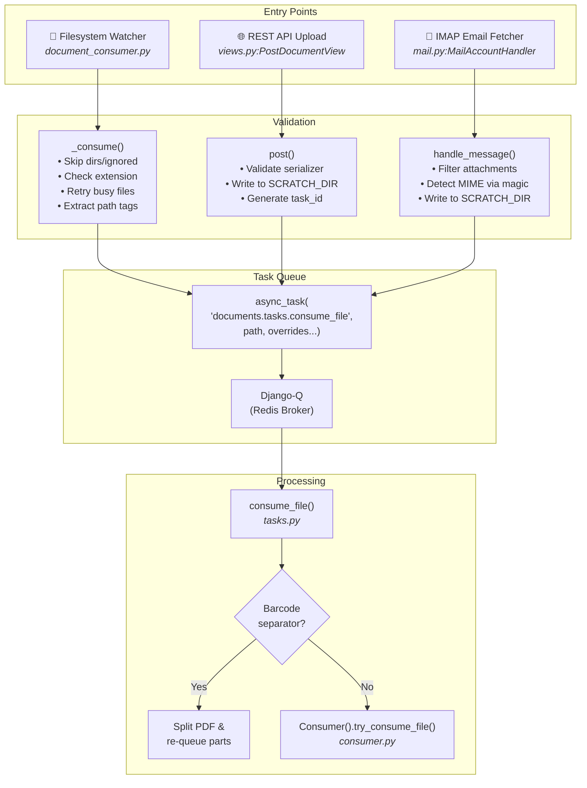
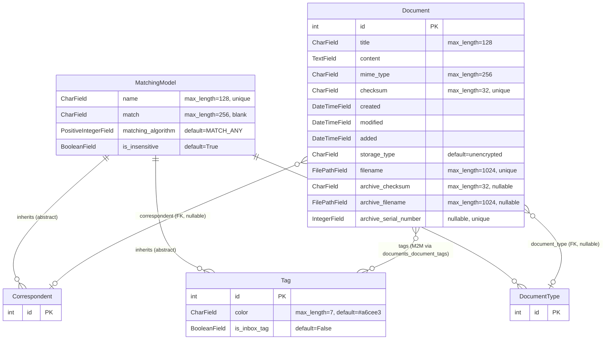

# Paperless-ngx: Document Processing Lifecycle, Metadata Model & Organizational Taxonomy

**Version:** 1.7.0  
*Source: `src/paperless/version.py` — `__version__ = (1, 7, 0)`*

This document provides a comprehensive, code-grounded technical reference for the paperless-ngx document management system. It traces every pathway by which a document enters the system, describes the complete processing pipeline from ingestion to persistence, explains the background job architecture, catalogs every field on the `Document` model with required/optional/derived classification, and illustrates how Tags, Correspondents, and Document Types work together to organize documents in practice.

> **Methodology:** Every claim in this document is traceable to a specific source file, class, method, or configuration value within the paperless-ngx codebase. No assumptions are made — the code is the single source of truth.

---

## Table of Contents

- [1. How Documents Enter Paperless-ngx](#1-how-documents-enter-paperless-ngx)
  - [1.1 Consumption Directory (Filesystem Watcher)](#11-consumption-directory-filesystem-watcher)
  - [1.2 REST API Upload](#12-rest-api-upload)
  - [1.3 Email (IMAP) Ingestion](#13-email-imap-ingestion)
  - [1.4 Ingestion Flow Diagram](#14-ingestion-flow-diagram)
- [2. Processing Pipeline Stages](#2-processing-pipeline-stages)
  - [2.1 Stage 1: Pre-Checks](#21-stage-1-pre-checks)
  - [2.2 Stage 2: MIME Detection and Parser Dispatch](#22-stage-2-mime-detection-and-parser-dispatch)
  - [2.3 Stage 3: Pre-Consume Script](#23-stage-3-pre-consume-script)
  - [2.4 Stage 4: Text Extraction / OCR](#24-stage-4-text-extraction--ocr)
  - [2.5 Stage 5: Date Parsing](#25-stage-5-date-parsing)
  - [2.6 Stage 6: Thumbnail Generation](#26-stage-6-thumbnail-generation)
  - [2.7 Stage 7: Classification](#27-stage-7-classification)
  - [2.8 Stage 8: Atomic Persistence](#28-stage-8-atomic-persistence)
  - [2.9 Stage 9: Post-Consume Script](#29-stage-9-post-consume-script)
  - [2.10 Stage 10: Completion](#210-stage-10-completion)
  - [2.11 Processing Pipeline Diagram](#211-processing-pipeline-diagram)
- [3. Background Jobs and Task Execution](#3-background-jobs-and-task-execution)
  - [3.1 Django-Q Cluster Configuration](#31-django-q-cluster-configuration)
  - [3.2 Ad-Hoc Tasks](#32-ad-hoc-tasks)
  - [3.3 Scheduled Tasks](#33-scheduled-tasks)
- [4. Document Metadata Fields](#4-document-metadata-fields)
  - [4.1 Required Fields](#41-required-fields)
  - [4.2 Optional Fields](#42-optional-fields)
  - [4.3 Runtime-Derived / Computed Properties](#43-runtime-derived--computed-properties)
  - [4.4 Runtime Example](#44-runtime-example)
- [5. Organizational Taxonomy](#5-organizational-taxonomy)
  - [5.1 Tags](#51-tags)
  - [5.2 Correspondents](#52-correspondents)
  - [5.3 Document Types](#53-document-types)
  - [5.4 Matching Algorithms](#54-matching-algorithms)
  - [5.5 ML-Based Automatic Classification](#55-ml-based-automatic-classification)
  - [5.6 Practical Scenario: Household Document Management](#56-practical-scenario-household-document-management)
  - [5.7 Entity-Relationship Diagram](#57-entity-relationship-diagram)
- [6. Additional Architectural Details](#6-additional-architectural-details)
  - [6.1 File Naming and Storage Layout](#61-file-naming-and-storage-layout)
  - [6.2 Search Index Schema](#62-search-index-schema)
- [7. Rationale and Source Citations](#7-rationale-and-source-citations)

---

## 1. How Documents Enter Paperless-ngx

Paperless-ngx supports three distinct entry points for document ingestion. All three converge on a single task dispatch mechanism — Django-Q's `async_task` — which queues `documents.tasks.consume_file` for background processing. This design ensures that document processing never blocks the ingestion interface, whether it is a filesystem watcher, a REST API endpoint, or an email fetcher.

### 1.1 Consumption Directory (Filesystem Watcher)

*Source: `src/documents/management/commands/document_consumer.py`*

The primary ingestion pathway is the **consumption directory watcher**, implemented as a Django management command (`Command` class, line 136). It monitors a configurable directory defined by `settings.CONSUMPTION_DIR` (from `src/paperless/settings.py`, line 78, defaulting to `../consume` relative to the base directory).

#### Filesystem Watching Strategies

The watcher supports two strategies, selected based on platform capabilities:

**1. inotify Mode (Primary — Linux)**  
*Source: `document_consumer.py`, `handle_inotify()` at line 199*

When `settings.CONSUMER_POLLING == 0` and the `inotifyrecursive` library is available (checked at line 178), the watcher uses Linux kernel inotify events. It registers for `CLOSE_WRITE | MOVED_TO` flags (line 203), meaning it reacts when a file finishes being written or when a file is moved into the watched directory.

A **debounce mechanism** with a 0.5-second timeout (`inotify_debounce`, line 211) prevents duplicate triggers: filenames are tracked with their last event timestamp, and `_consume()` is called only after 0.5 seconds of inactivity for that file (lines 226–234).

**Rationale:** inotify is the preferred approach because it is event-driven and imposes near-zero CPU overhead compared to polling. The debounce avoids multiple triggers from editors that perform write-rename sequences.

**2. Polling Mode (Fallback)**  
*Source: `document_consumer.py`, `handle_polling()` at line 185*

When inotify is unavailable (non-Linux systems) or `CONSUMER_POLLING > 0`, the watcher falls back to `watchdog.observers.polling.PollingObserver` with a configurable polling interval (`settings.CONSUMER_POLLING`, line 187). The `Handler` class (line 128) extends `FileSystemEventHandler` and responds to `on_created` (line 129) and `on_moved` (line 132) events, each spawning a thread to call `_consume_wait_unmodified()`.

#### File Validation Chain

The `_consume()` function (line 46) performs a multi-step validation before dispatching:

1. **Skip directories and ignored patterns** — `_is_ignored()` (line 41) checks the file path against `settings.CONSUMER_IGNORE_PATTERNS` using Python's `PurePath.match()`
2. **Check file existence** — `os.path.isfile(filepath)` (line 50), logging a debug message if the file has already moved
3. **Validate file extension** — `is_file_ext_supported()` (line 54) from `src/documents/parsers.py` checks against all registered parser MIME types
4. **Retry opening for busy files** — Up to 50 retries with 10ms delay each (lines 59–75), handling `OSError` for files still being written by external processes
5. **Derive tags from subdirectories** — When `settings.CONSUMER_SUBDIRS_AS_TAGS` is enabled, `_tags_from_path()` (line 27) walks the directory hierarchy from the file up to `CONSUMPTION_DIR`, creating or fetching `Tag` objects for each directory name

The `_consume_wait_unmodified()` function (line 99), used by the polling mode, polls `os.stat()` for stable `st_mtime` and `st_size` up to `settings.CONSUMER_POLLING_RETRY_COUNT` times with `settings.CONSUMER_POLLING_DELAY` between each check.

#### Task Dispatch

Once validated, the file is dispatched to the task queue (line 84–91):

```python
async_task(
    "documents.tasks.consume_file",
    filepath,
    override_tag_ids=tag_ids if tag_ids else None,
    task_name=os.path.basename(filepath)[:100],
)
```

### 1.2 REST API Upload

*Source: `src/documents/views.py`, `PostDocumentView` class at line 491*

The REST API provides a direct upload endpoint at `POST /api/documents/post_document/`. The `PostDocumentView` class inherits from `GenericAPIView` with:

- **Authentication:** `IsAuthenticated` permission (line 493)
- **Parser:** `MultiPartParser` for handling multipart form data (line 495)
- **Serializer:** `PostDocumentSerializer` (line 494)

#### Upload Flow (`post()` method, line 497)

1. **Validate request** — Deserializes and validates via `PostDocumentSerializer` (lines 499–500)
2. **Extract parameters** — `document` (name + data), `correspondent`, `document_type`, `tags`, `title` (lines 502–506)
3. **Write to temporary file** — Creates a temp file in `settings.SCRATCH_DIR` with `paperless-upload-` prefix (lines 510–519) and sets `utime` to the current timestamp
4. **Generate task ID** — `uuid.uuid4()` provides a unique task identifier (line 521)
5. **Dispatch via async_task** — (lines 523–533):

```python
async_task(
    "documents.tasks.consume_file",
    temp_filename,
    override_filename=doc_name,
    override_title=title,
    override_correspondent_id=correspondent_id,
    override_document_type_id=document_type_id,
    override_tag_ids=tag_ids,
    task_id=task_id,
    task_name=os.path.basename(doc_name)[:100],
)
```

6. **Return response** — `Response("OK")` (line 535)

**Rationale:** The API endpoint accepts pre-assigned metadata (correspondent, document type, tags, title) as optional overrides. This allows programmatic integrations — such as mobile scanning apps or third-party workflows — to attach classification metadata at upload time, bypassing the automatic matching pipeline for those fields.

### 1.3 Email (IMAP) Ingestion

*Source: `src/paperless_mail/mail.py`, `MailAccountHandler` class at line 104; `src/paperless_mail/tasks.py`; `src/paperless_mail/models.py`*

#### Scheduled Entry Point

The `process_mail_accounts()` function in `src/paperless_mail/tasks.py` (line 11) iterates over all `MailAccount` objects, calling `MailAccountHandler().handle_mail_account(account)` for each. This function is typically scheduled to run at a configurable interval.

#### MailAccount Model

*Source: `src/paperless_mail/models.py`, lines 6–51*

| Field | Type | Description |
|-------|------|-------------|
| `name` | CharField(256), unique | Human-readable account name |
| `imap_server` | CharField(256) | IMAP server hostname |
| `imap_port` | IntegerField, nullable | Port number (143 for NONE/STARTTLS, 993 for SSL) |
| `imap_security` | PositiveIntegerField | NONE (1), SSL (2), or STARTTLS (3) |
| `username` | CharField(256) | Authentication username |
| `password` | CharField(256) | Authentication password |
| `character_set` | CharField(256), default "UTF-8" | Character set for IMAP communication |

#### MailRule Model

*Source: `src/paperless_mail/models.py`, lines 54–201*

Each `MailAccount` has one or more `MailRule` objects (via ForeignKey `account`, ordered by `order` field) that define:

- **Folder filtering:** `folder` (default "INBOX")
- **Message filters:** `filter_from`, `filter_subject`, `filter_body`, `filter_attachment_filename` (supports wildcards like `*.pdf`)
- **Age limit:** `maximum_age` (in days, default 30)
- **Attachment processing:** `attachment_type` — ATTACHMENTS_ONLY (1) or EVERYTHING (2, includes inline)
- **Post-consume action:** `action` — DELETE (1), MOVE (2), MARK_READ (3), FLAG (4)
- **Metadata assignment:** `assign_title_from` (subject or filename), `assign_correspondent_from` (nothing/email/name/custom), `assign_tags` (ManyToMany), `assign_document_type` (ForeignKey)

#### Connection and Processing Flow

**`handle_mail_account()`** (line 151):
1. Connects via `get_mailbox()` (line 92) — selects `MailBoxUnencrypted`, `MailBoxTls`, or `MailBox` based on security setting
2. Authenticates with `M.login(account.username, account.password)` (line 166)
3. Iterates rules in order via `account.rules.order_by("order")` (line 175)

**`handle_mail_rule()`** (line 187):
1. Sets folder via `M.folder.set(rule.folder)` (line 192)
2. Builds search criteria via `make_criterias()` (line 77) — supports date range (`date_gte`), sender filter (`from_`), subject/body filters, and action-specific criteria (e.g., `seen: False` for MARK_READ)
3. Fetches messages via `M.fetch(criteria=AND(**criterias), mark_seen=False)` (line 222)
4. Processes each message, then runs the post-consume action on successfully processed messages

**`handle_message()`** (line 272) — for each attachment:
1. Filters by `content_disposition` (line 291–302) — skips non-"attachment" dispositions when `ATTACHMENTS_ONLY`
2. Checks filename against glob pattern in `filter_attachment_filename` (lines 304–311)
3. Detects MIME type via `magic.from_buffer(att.payload, mime=True)` (line 317) — ignores the attachment's declared content type
4. Validates MIME support via `is_mime_type_supported()` (line 319)
5. Writes payload to temp file in `SCRATCH_DIR` with `paperless-mail-` prefix (lines 321–327)
6. Dispatches via `async_task("documents.tasks.consume_file", ...)` with override params from the rule (lines 336–349)

#### Post-Consume Mail Actions

*Source: `src/paperless_mail/mail.py`, lines 38–61*

| Action | Class | Behavior |
|--------|-------|----------|
| DELETE | `DeleteMailAction` | Calls `M.delete(message_uids)` |
| MARK_READ | `MarkReadMailAction` | Flags messages with `SEEN`; criterion pre-filters unread |
| MOVE | `MoveMailAction` | Moves to `action_parameter` folder |
| FLAG | `FlagMailAction` | Flags messages with `FLAGGED`; criterion pre-filters unflagged |

### 1.4 Ingestion Flow Diagram



---

## 2. Processing Pipeline Stages

The core document processing pipeline lives in `Consumer.try_consume_file()` within `src/documents/consumer.py` (starting at line 180). This method orchestrates a 10-stage pipeline that transforms a raw file into a fully indexed, classified, and persisted document.

### 2.1 Stage 1: Pre-Checks

*Source: `src/documents/consumer.py`, lines 211–213*

Three pre-conditions are verified before any processing begins:

1. **`pre_check_file_exists()`** (line 95) — Verifies the file exists via `os.path.isfile(self.path)`. If missing, raises `ConsumerError` with `MESSAGE_FILE_NOT_FOUND`.

2. **`pre_check_directories()`** (line 115) — Ensures the four critical storage directories exist by calling `os.makedirs(..., exist_ok=True)` for:
   - `settings.SCRATCH_DIR` — Temporary working space (default: `/tmp/paperless`)
   - `settings.THUMBNAIL_DIR` — Thumbnail storage (`<MEDIA_ROOT>/documents/thumbnails`)
   - `settings.ORIGINALS_DIR` — Original file storage (`<MEDIA_ROOT>/documents/originals`)
   - `settings.ARCHIVE_DIR` — Archived (OCR'd) file storage (`<MEDIA_ROOT>/documents/archive`)

3. **`pre_check_duplicate()`** (line 102) — Computes the MD5 checksum of the file and queries:
   ```python
   Document.objects.filter(Q(checksum=checksum) | Q(archive_checksum=checksum)).exists()
   ```
   If a duplicate is detected and `settings.CONSUMER_DELETE_DUPLICATES` is enabled, the source file is deleted via `os.unlink()`. In all duplicate cases, a `ConsumerError` is raised.

**Rationale:** The duplicate check against both `checksum` and `archive_checksum` catches duplicates even when the original and archived versions have different checksums (e.g., a scanned PDF original and its OCR'd archive version).

### 2.2 Stage 2: MIME Detection and Parser Dispatch

*Source: `src/documents/consumer.py`, lines 219–225; `src/documents/parsers.py`, lines 81–98*

**MIME Detection** uses the `python-magic` library (line 219):
```python
mime_type = magic.from_file(self.path, mime=True)
```

**Parser Lookup** is handled by `get_parser_class_for_mime_type(mime_type)` from `src/documents/parsers.py` (line 81). This function uses a **signal-based plugin discovery** mechanism:

```python
for response in document_consumer_declaration.send(None):
    parser_declaration = response[1]
    # Each declaration contains: parser, weight, mime_types
```

The `document_consumer_declaration` signal (defined in `src/documents/signals/__init__.py`, line 5) is sent to collect parser declarations from all registered signal handlers. Each handler returns a dict with `parser` (factory function), `weight` (integer priority), and `mime_types` (dict mapping MIME type strings to file extensions).

#### Registered Parser Plugins

| Plugin | Source | Weight | MIME Types |
|--------|--------|--------|------------|
| **Tesseract** (OCR) | `src/paperless_tesseract/signals.py` | 0 | `application/pdf` (.pdf), `image/jpeg` (.jpg), `image/png` (.png), `image/tiff` (.tif), `image/gif` (.gif), `image/bmp` (.bmp) |
| **Text** (Direct Read) | `src/paperless_text/signals.py` | 10 | `text/plain` (.txt), `text/csv` (.csv) |
| **Tika** (Office Docs) | `src/paperless_tika/signals.py` | 10 | `application/msword` (.doc), `.docx`, `.xls`, `.xlsx`, `.ppt`, `.pptx`, `.ppsx`, `.odp`, `.ods`, `.odt`, `text/rtf` (.rtf) |

**Weight-based priority:** When multiple parsers support the same MIME type, the one with the **highest weight wins** (line 98 of parsers.py):
```python
sorted(options, key=lambda _: _["weight"], reverse=True)[0]["parser"]
```

**Rationale:** The signal-based parser discovery is an extensibility pattern. Third-party Django apps can register their own parsers by connecting to `document_consumer_declaration` in their `AppConfig.ready()` method, without modifying core code. The weight system allows specialized parsers to override generic ones — for example, a dedicated PDF parser could register with weight > 0 to override Tesseract's OCR fallback for certain PDFs.

After parser selection, the `document_consumption_started` signal is fired (line 229) to notify listeners that processing is beginning.

### 2.3 Stage 3: Pre-Consume Script

*Source: `src/documents/consumer.py`, `run_pre_consume_script()` at line 121*

If `settings.PRE_CONSUME_SCRIPT` is configured and points to an existing file, it is executed via `subprocess.Popen` with the document path as the sole argument (line 135):

```python
Popen((settings.PRE_CONSUME_SCRIPT, self.path)).wait()
```

This allows administrators to run custom preprocessing (e.g., virus scanning, format conversion, or access control checks) before the main pipeline proceeds. The call is **synchronous** — `Popen.wait()` blocks until the script completes.

### 2.4 Stage 4: Text Extraction / OCR

*Source: `src/documents/consumer.py`, lines 258–261*

The parser instance's `parse()` method is called with the file path, MIME type, and filename:

```python
document_parser.parse(self.path, mime_type, self.filename)
```

The specific behavior depends on which parser was selected:

| Parser | Source | Mechanism |
|--------|--------|-----------|
| `RasterisedDocumentParser` | `src/paperless_tesseract/parsers.py` | Uses **OCRmyPDF** to perform OCR on PDFs and images. Produces an archive PDF with embedded text layer |
| `TextDocumentParser` | `src/paperless_text/parsers.py` | Directly reads file content as text. No OCR needed |
| `TikaDocumentParser` | `src/paperless_tika/parsers.py` | Sends the file to **Apache Tika** server for text extraction from Office documents |

After parsing, the text content is retrieved via `document_parser.get_text()` (line 271).

### 2.5 Stage 5: Date Parsing

*Source: `src/documents/consumer.py`, lines 272–275; `src/documents/parsers.py`, `parse_date()` at line 212*

Date extraction follows a **two-tier strategy**:

1. **Parser-provided date** — `document_parser.get_date()` (line 272) — Some parsers extract dates from document metadata (e.g., PDF creation date)
2. **Regex-based fallback** — If no parser date is found, `parse_date(self.filename, text)` (line 275) from `src/documents/parsers.py` is called

The `parse_date()` function (line 212) uses `DATE_REGEX` (line 30 of parsers.py) — a comprehensive regex matching multiple date formats (DD.MM.YYYY, YYYY-MM-DD, "Month DD, YYYY", etc.).

The search order is:
1. **Filename first** — If `settings.FILENAME_DATE_ORDER` is set, the filename is searched for date patterns using the configured date order (line 246–258)
2. **Document text second** — All regex matches in the extracted text are tried using `settings.DATE_ORDER` (default "DMY"), parsed via the `dateparser` library (line 221–231)

Dates are filtered to exclude dates before 1900 or in the future (line 233–241).

### 2.6 Stage 6: Thumbnail Generation

*Source: `src/documents/consumer.py`, lines 263–269; `src/documents/parsers.py`, lines 187–338*

Thumbnails are generated via the parser's `get_optimised_thumbnail()` method (line 265):

```python
thumbnail = document_parser.get_optimised_thumbnail(self.path, mime_type, self.filename)
```

For **PDF documents**, `make_thumbnail_from_pdf()` (parsers.py, line 187) uses **ImageMagick `convert`** to render the first page at 300 DPI, scaled to 500px width:
```
convert -density 300 -scale 500x5000> -alpha remove -strip -auto-orient input.pdf[0] output.png
```
If ImageMagick fails (e.g., due to security policy restrictions), the function falls back to **Ghostscript** via `make_thumbnail_from_pdf_gs_fallback()` (line 153).

If `settings.OPTIMIZE_THUMBNAILS` is `True`, the thumbnail PNG is further compressed using **optipng** with optimization level `-o5` (lines 319–338 of parsers.py).

### 2.7 Stage 7: Classification

*Source: `src/documents/consumer.py`, lines 292–311; `src/documents/classifier.py`; `src/documents/apps.py`*

The ML classifier model is loaded from the pickled file at `settings.MODEL_FILE` (default: `data/classification_model.pickle`) via `load_classifier()` from `src/documents/classifier.py` (line 30).

The document is then stored in the database (see Stage 8), and the `document_consumption_finished` signal is fired (lines 306–311), passing the `document`, `logging_group`, and `classifier` to all connected signal handlers.

**Signal handlers** are registered in `src/documents/apps.py` (lines 22–27) in this order:

| Order | Handler | Source | Purpose |
|-------|---------|--------|---------|
| 1 | `add_inbox_tags` | `handlers.py`, line 30 | Adds all tags where `is_inbox_tag=True` to the document |
| 2 | `set_correspondent` | `handlers.py`, line 35 | Calls `matching.match_correspondents(document, classifier)` and assigns the first match |
| 3 | `set_document_type` | `handlers.py`, line 101 | Calls `matching.match_document_types(document, classifier)` and assigns the first match |
| 4 | `set_tags` | `handlers.py`, line 168 | Calls `matching.match_tags(document, classifier)` and adds all matching tags |
| 5 | `set_log_entry` | `handlers.py`, line 413 | Creates a Django admin `LogEntry` recording the document addition |
| 6 | `add_to_index` | `handlers.py`, line 428 | Adds the document to the Whoosh full-text search index |

**Rationale:** The signal-based handler chain allows each classification step to be independently developed, tested, and potentially skipped. The classifier is loaded once and shared across all handlers that need it, avoiding redundant deserialization of the ML model (noted by the developer in a TODO comment at line 288).

### 2.8 Stage 8: Atomic Persistence

*Source: `src/documents/consumer.py`, lines 297–361*

All database and filesystem operations are wrapped in `transaction.atomic()` (line 298) to ensure consistency:

**Database Creation** via `_store()` (line 379):
```python
document = Document.objects.create(
    title=(self.override_title or file_info.title)[:127],
    content=text,
    mime_type=mime_type,
    checksum=hashlib.md5(f.read()).hexdigest(),
    created=created,
    modified=created,
    storage_type=storage_type,
)
```

The `created` date is determined by priority: `FileInfo.created` (from filename pattern) → parser-extracted date → file `st_mtime` (line 389–393).

**Override Application** via `apply_overrides()` (line 414): If the caller provided `override_correspondent_id`, `override_document_type_id`, or `override_tag_ids`, they are applied to the document before signal handlers run.

**Filesystem Operations** under `FileLock(settings.MEDIA_LOCK)` (line 315):
1. Generate unique filename via `generate_unique_filename(document)` (line 316)
2. Create directory structure for `document.source_path` (line 317)
3. Write original file to `document.source_path` (line 319)
4. Write thumbnail to `document.thumbnail_path` (lines 321–325)
5. If an archive version exists (e.g., OCR'd PDF), write to `document.archive_path` and compute `archive_checksum` (lines 327–342)

After the lock is released, `document.save()` is called (line 346), and the source file is deleted from the consumption directory via `os.unlink(self.path)` (line 350). macOS shadow files (prefixed with `._`) are also cleaned up (lines 353–360).

**Rationale:** The `FileLock` on `settings.MEDIA_LOCK` serializes all file operations across multiple consumer threads, preventing race conditions when writing to the media directories. The `transaction.atomic()` wrapper ensures that if any step fails (filesystem write, database save, or signal handler), the entire operation is rolled back.

### 2.9 Stage 9: Post-Consume Script

*Source: `src/documents/consumer.py`, `run_post_consume_script()` at line 143*

If `settings.POST_CONSUME_SCRIPT` is configured, it receives **eight positional arguments** (lines 160–171):

| Argument | Value |
|----------|-------|
| 1 | Document primary key (`document.pk`) |
| 2 | Public filename (`document.get_public_filename()`) |
| 3 | Source path (`document.source_path`) |
| 4 | Thumbnail path (`document.thumbnail_path`) |
| 5 | Download URL (DRF reverse of `document-download`) |
| 6 | Thumbnail URL (DRF reverse of `document-thumb`) |
| 7 | Correspondent name (string) |
| 8 | Comma-separated tag names |

This enables post-processing workflows such as sending notifications, triggering backups, or integrating with external systems.

### 2.10 Stage 10: Completion

*Source: `src/documents/consumer.py`, lines 373–377*

The pipeline concludes by:
1. Sending a 100% progress update with status `SUCCESS` and the new document ID (line 375) via the Channels WebSocket layer
2. Returning the `document` object to the caller (line 377)

### 2.11 Processing Pipeline Diagram

```mermaid
flowchart TD
    START["consume_file()<br/><i>tasks.py</i>"] --> S1

    S1["<b>Stage 1: Pre-Checks</b><br/>• File exists?<br/>• Directories exist?<br/>• Duplicate check (MD5)"]
    S1 --> S2

    S2["<b>Stage 2: MIME Detection & Parser</b><br/>• magic.from_file() → MIME type<br/>• Signal-based parser discovery<br/>• Select by weight priority"]
    S2 --> S2a["Fire document_consumption_started signal"]
    S2a --> S3

    S3["<b>Stage 3: Pre-Consume Script</b><br/>• Execute PRE_CONSUME_SCRIPT<br/>• Synchronous, blocks pipeline"]
    S3 --> S4

    S4["<b>Stage 4: Text Extraction / OCR</b><br/>• parser.parse(path, mime, filename)<br/>• Tesseract / Text / Tika"]
    S4 --> S5

    S5["<b>Stage 5: Date Parsing</b><br/>• Parser date → Regex fallback<br/>• Filename first, then content"]
    S5 --> S6

    S6["<b>Stage 6: Thumbnail Generation</b><br/>• ImageMagick → Ghostscript fallback<br/>• Optional optipng optimization"]
    S6 --> S7

    S7["<b>Stage 7: Classification</b><br/>• Load ML classifier<br/>• Store document (DB create)<br/>• Fire document_consumption_finished<br/>• Signal handlers: inbox tags,<br/>  correspondent, type, tags,<br/>  log entry, search index"]
    S7 --> S8

    S8["<b>Stage 8: Atomic Persistence</b><br/>• transaction.atomic() + FileLock<br/>• Write original, thumbnail, archive<br/>• document.save()<br/>• Delete source file"]
    S8 --> S9

    S9["<b>Stage 9: Post-Consume Script</b><br/>• Execute POST_CONSUME_SCRIPT<br/>• Passes 8 arguments"]
    S9 --> S10

    S10["<b>Stage 10: Completion</b><br/>• Progress: 100% SUCCESS<br/>• Return document object"]
```



---

## 3. Background Jobs and Task Execution

### 3.1 Django-Q Cluster Configuration

*Source: `src/paperless/settings.py`, lines 449–457*

Paperless-ngx uses **Django-Q** as its task queue, backed by **Redis** as the message broker. The cluster configuration is:

```python
Q_CLUSTER = {
    "name": "paperless",
    "catch_up": False,        # Don't re-run missed scheduled tasks
    "recycle": 1,             # Recycle worker after every task (prevents memory leaks)
    "retry": PAPERLESS_WORKER_RETRY,    # Default: timeout + 10 seconds
    "timeout": PAPERLESS_WORKER_TIMEOUT, # Default: 1800 seconds (30 minutes)
    "workers": TASK_WORKERS,             # Auto-calculated from CPU count
    "redis": os.getenv("PAPERLESS_REDIS", "redis://localhost:6379"),
}
```

| Setting | Default | Source |
|---------|---------|--------|
| `PAPERLESS_WORKER_TIMEOUT` | 1800s (30 min) | `settings.py`, line 440 |
| `PAPERLESS_WORKER_RETRY` | timeout + 10 (1810s) | `settings.py`, lines 444–447 |
| `TASK_WORKERS` | `default_task_workers()` — based on CPU count | `settings.py`, lines 427–438 |
| `PAPERLESS_REDIS` | `redis://localhost:6379` | `settings.py`, line 456 |

**Worker count calculation** (`default_task_workers()`, line 427): On systems with fewer than 4 cores, uses all available cores. On systems with 4+ cores, uses `floor(sqrt(available_cores))` to balance between parallel document consumption and per-document thread utilization.

**Rationale:** The `catch_up=False` setting prevents a backlog of missed scheduled tasks from overwhelming the system after downtime. The `recycle=1` setting forces each worker to restart after every task, ensuring clean state and preventing memory accumulation from large OCR operations.

### 3.2 Ad-Hoc Tasks

*Source: `src/documents/tasks.py`*

Ad-hoc tasks are dispatched via `async_task()` from any entry point and executed by Django-Q workers:

#### `consume_file()` (line 184)

The primary consumption task. Signature:

```python
def consume_file(
    path,
    override_filename=None,
    override_title=None,
    override_correspondent_id=None,
    override_document_type_id=None,
    override_tag_ids=None,
    task_id=None,
):
```

If `settings.CONSUMER_ENABLE_BARCODES` is `True` (line 195), the function first scans the file for page-separating barcodes using `pyzbar`. If barcodes are found, the PDF is split via `pikepdf` into separate documents which are saved to the consumption directory for re-ingestion (lines 195–233). Otherwise, it delegates directly to `Consumer().try_consume_file()` (line 236).

#### `bulk_update_documents()` (line 270)

Fires `post_save` signals for each document and re-indexes them in the Whoosh search index. Used after bulk metadata edits.

### 3.3 Scheduled Tasks

Scheduled tasks are registered in Django-Q's schedule table via database migrations:

| Task | Frequency | Source | Purpose |
|------|-----------|--------|---------|
| `documents.tasks.train_classifier` | Hourly | Migration `1001_auto_20201109_1636.py` | Retrains the ML classifier model if any Tag, DocumentType, or Correspondent uses `MATCH_AUTO` and training data has changed |
| `documents.tasks.index_optimize` | Daily | Migration `1001_auto_20201109_1636.py` | Commits pending writes and optimizes the Whoosh search index via `AsyncWriter.commit(optimize=True)` |
| `documents.tasks.sanity_check` | Weekly | Migration `1004_sanity_check_schedule.py` | Audits media files vs. database records, checks checksums, reports orphaned or inconsistent files |
| `paperless_mail.tasks.process_mail_accounts` | Configurable | `src/paperless_mail/tasks.py`, line 11 | Iterates all `MailAccount` objects, processes mail rules, and ingests matching attachments |

#### Task Function Details

**`train_classifier()`** (tasks.py, line 48):
- First checks if any `Tag`, `DocumentType`, or `Correspondent` uses `MATCH_AUTO` algorithm (lines 49–53)
- If none do, returns immediately (no work needed)
- Otherwise, loads the existing classifier and calls `classifier.train()` (line 63)
- The `train()` method computes a SHA1 hash of the training data to detect changes; if unchanged, skips retraining (returns `False`)
- If training succeeds, saves the updated model to `settings.MODEL_FILE`

**`index_optimize()`** (tasks.py, line 32):
- Opens the Whoosh index and commits with optimization (`optimize=True`)
- This merges index segments for faster search performance

**`index_reindex()`** (tasks.py, line 38):
- Recreates the entire Whoosh index from scratch by iterating all `Document` objects
- Used for index recovery or after schema changes

**`sanity_check()`** (tasks.py, line 255):
- Runs `sanity_checker.check_sanity()` to verify consistency between database records and filesystem state
- Raises `SanityCheckFailedException` if errors are found; returns info/warning messages otherwise

---

## 4. Document Metadata Fields

*Source: `src/documents/models.py`, `Document` class at line 88*

### 4.1 Required Fields

These fields are populated at document creation time and are always present:

| Field | Django Type | Constraints | Description |
|-------|------------|-------------|-------------|
| `id` | AutoField (implicit) | PK, auto-generated | Primary key |
| `title` | CharField | max_length=128, blank=True, db_index=True | Document title; derived from filename or override, truncated to 127 chars *(line 106)* |
| `content` | TextField | blank=True | Raw extracted text used for search and classification *(line 117)* |
| `mime_type` | CharField | max_length=256, editable=False | MIME type detected via python-magic *(line 126)* |
| `checksum` | CharField | max_length=32, editable=False, unique=True | MD5 hex digest of the original file; used for duplicate detection *(line 135)* |
| `created` | DateTimeField | default=timezone.now, db_index=True | Document creation date — from filename, parser, or file mtime *(line 152)* |
| `modified` | DateTimeField | auto_now=True, editable=False, db_index=True | Last modification timestamp — auto-updated on every save *(line 154)* |
| `added` | DateTimeField | default=timezone.now, editable=False, db_index=True | Timestamp when document was added to the system *(line 169)* |
| `storage_type` | CharField | max_length=11, choices=[unencrypted, gpg], default="unencrypted", editable=False | Storage encryption type *(line 161)* |
| `filename` | FilePathField | max_length=1024, editable=False, default=None, unique=True, null=True | Current filename in the originals storage directory *(line 176)* |

### 4.2 Optional Fields

These fields may be null or blank:

| Field | Django Type | Constraints | Description |
|-------|------------|-------------|-------------|
| `correspondent` | ForeignKey(Correspondent) | blank=True, null=True, on_delete=SET_NULL | Sender/recipient of the document *(line 97)* |
| `document_type` | ForeignKey(DocumentType) | blank=True, null=True, on_delete=SET_NULL | Classification category *(line 108)* |
| `tags` | ManyToManyField(Tag) | blank=True | Organizational labels (many-to-many) *(line 128)* |
| `archive_checksum` | CharField | max_length=32, editable=False, blank=True, null=True | MD5 of the archived (OCR'd) version *(line 143)* |
| `archive_filename` | FilePathField | max_length=1024, editable=False, default=None, unique=True, null=True | Filename of the archived version *(line 186)* |
| `archive_serial_number` | IntegerField | blank=True, null=True, unique=True, db_index=True | Physical archive position number (ASN) *(line 196)* |

### 4.3 Runtime-Derived / Computed Properties

These `@property` methods compute values from stored fields and settings:

| Property | Return Type | Computation | Source |
|----------|------------|-------------|--------|
| `source_path` | `str` | `os.path.join(settings.ORIGINALS_DIR, self.filename)` or fallback `{pk:07}{file_type}` | line 222 |
| `source_file` | file handle | `open(self.source_path, "rb")` | line 234 |
| `has_archive_version` | `bool` | `self.archive_filename is not None` | line 238 |
| `archive_path` | `str` or `None` | `os.path.join(settings.ARCHIVE_DIR, self.archive_filename)` if archive exists | line 242 |
| `archive_file` | file handle | `open(self.archive_path, "rb")` | line 249 |
| `file_type` | `str` | File extension from MIME type via `get_default_file_extension(self.mime_type)` | line 268 |
| `thumbnail_path` | `str` | `os.path.join(settings.THUMBNAIL_DIR, "{pk:07}.png")` | line 272 |

### 4.4 Runtime Example

The following is a realistic representation of a fully processed `Document` record — an electricity bill scanned from a PDF received via email from "City Power Co." on January 15, 2024:

```python
# Database Record (documents_document table)
{
    "id": 1042,
    "title": "Electricity Bill January 2024",
    "content": (
        "City Power Co.\n"
        "Customer Service: 1-800-555-0199\n"
        "Account Number: 98765-4321\n"
        "Statement Date: January 15, 2024\n"
        "Billing Period: Dec 15, 2023 - Jan 14, 2024\n"
        "\n"
        "Current Charges\n"
        "Electric Service .............. $127.43\n"
        "Fuel Adjustment ............... $  8.52\n"
        "Taxes & Fees .................. $  6.42\n"
        "                              --------\n"
        "Amount Due .................... $142.37\n"
        "Due Date: February 5, 2024\n"
    ),
    "mime_type": "application/pdf",
    "checksum": "a1b2c3d4e5f67890abcdef1234567890",
    "archive_checksum": "f6e5d4c3b2a10987654321fedcba0987",
    "created": "2024-01-15T00:00:00+00:00",    # Extracted from document text
    "modified": "2024-01-20T14:32:11+00:00",    # Auto-set on last save
    "added": "2024-01-20T14:30:45+00:00",       # When consumer processed it
    "storage_type": "unencrypted",
    "filename": "2024-01-15 City Power Co. Electricity Bill January 2024.pdf",
    "archive_filename": "2024-01-15 City Power Co. Electricity Bill January 2024.pdf",
    "archive_serial_number": 127,               # Physical filing position

    # Foreign Key references (stored as integer IDs in DB)
    "correspondent_id": 5,       # → Correspondent(name="City Power Co.")
    "document_type_id": 3,       # → DocumentType(name="Utility Bill")

    # Many-to-Many relationship (stored in documents_document_tags junction table)
    # tags: [7, 12, 15]
    #   → Tag(id=7,  name="bills",       color="#e31a1c", matching_algorithm=MATCH_ANY, match="bill,invoice,payment")
    #   → Tag(id=12, name="electricity", color="#ff7f00", matching_algorithm=MATCH_LITERAL, match="electric")
    #   → Tag(id=15, name="2024",        color="#a6cee3", matching_algorithm=MATCH_REGEX, match="202[0-9]")
}

# Derived Properties (not stored in database — computed at runtime)
# document.source_path      → "/media/documents/originals/2024-01-15 City Power Co. Electricity Bill January 2024.pdf"
# document.archive_path     → "/media/documents/archive/2024-01-15 City Power Co. Electricity Bill January 2024.pdf"
# document.thumbnail_path   → "/media/documents/thumbnails/0001042.png"
# document.file_type        → ".pdf"
# document.has_archive_version → True
```

**Key observations from this example:**
- `created` reflects the date extracted from the document content (January 15, 2024), not the date it was added to the system
- `added` and `modified` reflect system timestamps — when the consumer processed the file and when it was last saved
- `filename` follows `PAPERLESS_FILENAME_FORMAT` — here configured as `{created} {correspondent} {title}`
- The archive version is a searchable PDF/A produced by OCRmyPDF with an embedded text layer
- `archive_serial_number` is an optional physical filing reference, not auto-generated
- Tags were assigned by a combination of rule-based matching (MATCH_ANY, MATCH_LITERAL, MATCH_REGEX) and potentially ML classification

---

## 5. Organizational Taxonomy

### 5.1 Tags

*Source: `src/documents/models.py`, `Tag` class at line 64*

Tags inherit from `MatchingModel` and add two fields:

| Field | Type | Default | Description |
|-------|------|---------|-------------|
| `color` | CharField(7) | `"#a6cee3"` | Hex color code for UI display *(line 66)* |
| `is_inbox_tag` | BooleanField | `False` | When `True`, this tag is automatically added to **every** newly consumed document *(line 68)* |

**Inherited MatchingModel fields:** `name` (CharField, max_length=128, unique), `match` (CharField, max_length=256, blank), `matching_algorithm` (PositiveIntegerField, default=MATCH_ANY), `is_insensitive` (BooleanField, default=True).

Tags have a **ManyToMany** relationship with Document — a document can have any number of tags, and each tag can be associated with any number of documents.

**Inbox Tags** are a special feature: when `is_inbox_tag=True`, the `add_inbox_tags` signal handler (in `handlers.py`, line 30) automatically adds this tag to every newly consumed document:
```python
def add_inbox_tags(sender, document=None, logging_group=None, **kwargs):
    inbox_tags = Tag.objects.filter(is_inbox_tag=True)
    document.tags.add(*inbox_tags)
```
This creates a workflow where all new documents appear in an "Inbox" view, and users manually remove the inbox tag after review.

### 5.2 Correspondents

*Source: `src/documents/models.py`, `Correspondent` class at line 57*

Correspondents inherit all `MatchingModel` fields with no additional fields. They have a **ForeignKey** relationship from `Document` — each document can have at most **one** correspondent.

A correspondent represents the sender or recipient of a document (e.g., "City Power Co.", "Blue Cross Health", "Internal Revenue Service").

### 5.3 Document Types

*Source: `src/documents/models.py`, `DocumentType` class at line 82*

Document Types also inherit all `MatchingModel` fields with no additional fields. They have a **ForeignKey** relationship from `Document` — each document can have at most **one** document type.

A document type represents the classification category (e.g., "Utility Bill", "Medical Record", "Tax Form", "Insurance Policy").

### 5.4 Matching Algorithms

*Source: `src/documents/models.py`, lines 21–34; `src/documents/matching.py`*

All three organizational entities (Tags, Correspondents, Document Types) inherit from `MatchingModel`, which defines six matching algorithms:

| ID | Constant | Name | Behavior | Source |
|----|----------|------|----------|--------|
| 1 | `MATCH_ANY` | Any word | Matches if **any** whitespace-separated word from the `match` field appears in the document content (word boundary check via `\b`) | `matching.py`, line 84 |
| 2 | `MATCH_ALL` | All words | Matches if **all** words from `match` appear in the document content | `matching.py`, line 72 |
| 3 | `MATCH_LITERAL` | Exact match | Matches if the entire `match` string appears as a word-boundary-delimited substring in the content | `matching.py`, line 91 |
| 4 | `MATCH_REGEX` | Regular expression | Applies `match` as a Python regex against the document content | `matching.py`, line 107 |
| 5 | `MATCH_FUZZY` | Fuzzy word | Uses `fuzzywuzzy.fuzz.partial_ratio` with a **threshold of 90** (out of 100) | `matching.py`, line 127 |
| 6 | `MATCH_AUTO` | Automatic (ML) | Delegates to the ML classifier; the `matches()` function returns `False` for this algorithm (handled separately) | `matching.py`, line 147 |

**Case sensitivity:** All algorithms respect the `is_insensitive` flag (default `True`), which adds `re.IGNORECASE` to regex operations (line 69–70).

**Quoted phrases:** The `_split_match()` helper (matching.py, line 155) supports quoted phrases — `"City Power"` is treated as a single match term with whitespace collapsed to `\s+` patterns.

### 5.5 ML-Based Automatic Classification

*Source: `src/documents/classifier.py`, `DocumentClassifier` class at line 60*

The automatic classification system uses **scikit-learn** to train and apply three separate neural network models:

#### Training Pipeline (`train()`, line 115)

1. **Data Collection** — Extracts all documents, **excluding** those with inbox tags (line 125–127):
   ```python
   for doc in Document.objects.order_by("pk").exclude(tags__is_inbox_tag=True):
   ```

2. **Preprocessing** — Lowercase, strip, and collapse whitespace (line 24–27):
   ```python
   def preprocess_content(content):
       content = content.lower().strip()
       content = re.sub(r"\s+", " ", content)
       return content
   ```

3. **Change Detection** — Computes a SHA1 hash of all training data (document content + labels). If the hash matches the previously stored hash, training is skipped (lines 124–164).

4. **Vectorization** — Transforms text into feature vectors using `CountVectorizer` (line 194):
   ```python
   CountVectorizer(analyzer="word", ngram_range=(1, 2), min_df=0.01)
   ```
   This creates unigram and bigram features, discarding terms that appear in fewer than 1% of documents.

5. **Model Training** — Three separate `MLPClassifier(tol=0.01)` models are trained (lines 219–244):
   - **Tags classifier** — Multi-label classification using `MultiLabelBinarizer` (or `LabelBinarizer` for single-tag case)
   - **Correspondent classifier** — Single-label classification
   - **Document Type classifier** — Single-label classification

   Labels of `-1` represent "no assignment" and are included in training to allow the model to predict no match.

#### Prediction

- `predict_correspondent(content)` (line 251) — Returns the predicted correspondent PK or `None`
- `predict_document_type(content)` (line 262) — Returns the predicted document type PK or `None`
- `predict_tags(content)` (line 273) — Returns a list of predicted tag PKs (supports multi-label)

#### Combined Rule-Based + ML Matching

*Source: `src/documents/matching.py`, lines 21–57*

The `match_correspondents()`, `match_document_types()`, and `match_tags()` functions combine both matching approaches using a **union strategy**:

```python
def match_correspondents(document, classifier):
    if classifier:
        pred_id = classifier.predict_correspondent(document.content)
    else:
        pred_id = None
    correspondents = Correspondent.objects.all()
    return list(
        filter(lambda o: matches(o, document) or o.pk == pred_id, correspondents)
    )
```

This means a correspondent, document type, or tag is matched if **either**:
- Its rule-based matching algorithm (`matches()`) returns `True` based on its `match` field and `matching_algorithm`, **OR**
- The ML classifier predicts its PK for the document's content

**Rationale:** This union approach ensures that:
- Entities with explicit rules (`MATCH_ANY`, `MATCH_ALL`, etc.) are always matched deterministically
- Entities with `MATCH_AUTO` are matched by the ML model
- Both mechanisms can operate simultaneously — a tag can match via rules AND be predicted by the ML model, with no conflict

### 5.6 Practical Scenario: Household Document Management

Consider a family using paperless-ngx to manage their household documents. They have set up the following organizational structure:

#### Setup

**Correspondents:**
| Name | Matching Algorithm | Match String |
|------|-------------------|-------------|
| City Power Co. | MATCH_LITERAL | "City Power" |
| Blue Cross Health | MATCH_ANY | "Blue Cross, BlueCross, BCBS" |
| State Farm Insurance | MATCH_AUTO | *(ML-driven)* |

**Document Types:**
| Name | Matching Algorithm | Match String |
|------|-------------------|-------------|
| Utility Bill | MATCH_ANY | "bill, invoice, statement, amount due" |
| Medical Record | MATCH_FUZZY | "medical record" |
| Insurance Policy | MATCH_AUTO | *(ML-driven)* |

**Tags:**
| Name | Algorithm | Match | Inbox? | Color |
|------|-----------|-------|--------|-------|
| inbox | — | — | ✅ Yes | #a6cee3 |
| bills | MATCH_ANY | "bill, invoice, payment, amount due" | No | #e31a1c |
| medical | MATCH_ANY | "medical, health, doctor, prescription" | No | #33a02c |
| insurance | MATCH_LITERAL | "insurance" | No | #1f78b4 |
| 2024 | MATCH_REGEX | `202[4-9]` | No | #ff7f00 |
| tax-deductible | MATCH_AUTO | *(ML-driven)* | No | #6a3d9a |

#### Example: Electricity Bill Arrives via Email

1. **IMAP Ingestion** — The scheduled `process_mail_accounts()` task connects to the family's email account. A mail rule configured for the INBOX folder with `filter_from = "noreply@citypower.com"` matches an incoming email with a PDF attachment.

2. **Attachment Processing** — `handle_message()` extracts the PDF attachment, detects `application/pdf` via `magic.from_buffer()`, writes it to `SCRATCH_DIR`, and dispatches `async_task("documents.tasks.consume_file", ...)` with `override_correspondent_id` derived from the email sender.

3. **Consumer Pipeline** — `Consumer.try_consume_file()` runs:
   - **Pre-checks** pass (file exists, not a duplicate)
   - **MIME detection** returns `application/pdf`, selecting `RasterisedDocumentParser` (Tesseract)
   - **OCR** via OCRmyPDF extracts text including "City Power Co.", "Amount Due: $142.37", "January 15, 2024"
   - **Date parsing** finds "January 15, 2024" in the content via `DATE_REGEX` → `created = 2024-01-15`
   - **Thumbnail** generated from first PDF page

4. **Classification** (signal handlers fire in order):
   - **`add_inbox_tags`** → Adds the "inbox" tag (is_inbox_tag=True)
   - **`set_correspondent`** → `match_correspondents()` runs:
     - Rule-based: "City Power Co." has MATCH_LITERAL on "City Power" → **matches** (content contains "City Power Co.")
     - ML: classifier also predicts "City Power Co." (trained on past bills)
     - Result: Correspondent = "City Power Co." ✅
   - **`set_document_type`** → `match_document_types()` runs:
     - Rule-based: "Utility Bill" has MATCH_ANY on "bill, invoice, statement, amount due" → **matches** (content contains "Amount Due" and "bill" in the title)
     - Result: Document Type = "Utility Bill" ✅
   - **`set_tags`** → `match_tags()` runs:
     - "bills" tag: MATCH_ANY on "bill, invoice, payment, amount due" → **matches** ✅
     - "medical" tag: MATCH_ANY on "medical, health, doctor..." → no match ❌
     - "insurance" tag: MATCH_LITERAL on "insurance" → no match ❌
     - "2024" tag: MATCH_REGEX on `202[4-9]` → **matches** (content contains "2024") ✅
     - "tax-deductible" tag: MATCH_AUTO → ML classifier predicts this tag based on training data from past utility bills → **matches** ✅
     - Result: Tags added = ["bills", "2024", "tax-deductible"] ✅

5. **Persistence** — Document saved with generated filename `2024-01-15 City Power Co. Electricity Bill January 2024.pdf`, archive version with OCR text layer, and all metadata.

6. **Final State in Dashboard:**
   - Title: "Electricity Bill January 2024"
   - Correspondent: City Power Co.
   - Document Type: Utility Bill
   - Tags: inbox, bills, 2024, tax-deductible
   - Created: 2024-01-15
   - ASN: (to be assigned manually for physical filing)

The user sees this document in their "Inbox" saved view (filtered by the "inbox" tag), reviews it, and removes the "inbox" tag. The document remains searchable by full-text content and findable via correspondent, type, or tag filters.

### 5.7 Entity-Relationship Diagram



---

## 6. Additional Architectural Details

### 6.1 File Naming and Storage Layout

*Source: `src/documents/file_handling.py`, `generate_filename()` at line 128*

Document filenames are generated from a configurable template `settings.PAPERLESS_FILENAME_FORMAT` using these available variables:

| Variable | Value | Source |
|----------|-------|--------|
| `{title}` | Sanitized document title | line 162 |
| `{correspondent}` | Correspondent name (or "none") | lines 140–146 |
| `{document_type}` | Document type name (or "none") | lines 148–154 |
| `{created}` | ISO date of document creation | line 165 |
| `{created_year}` | Year of creation | line 166 |
| `{created_month}` | Month of creation (zero-padded) | line 167 |
| `{created_day}` | Day of creation (zero-padded) | line 168 |
| `{added}` | ISO date when added to system | line 169 |
| `{added_year}` | Year added | line 170 |
| `{added_month}` | Month added (zero-padded) | line 171 |
| `{added_day}` | Day added (zero-padded) | line 172 |
| `{asn}` | Archive serial number (or "none") | lines 156–159 |
| `{tags}` | Dictionary of tags by index and key-value pairs | line 174 |
| `{tag_list}` | Comma-separated sorted tag names | lines 135–138, line 175 |

**Default fallback** (when `PAPERLESS_FILENAME_FORMAT` is not set or invalid): `{pk:07}{file_type}` — a zero-padded 7-digit primary key with the file extension (line 193).

**Automatic renaming:** The `update_filename_and_move_files` signal handler (in `handlers.py`, line 312) is connected to both `post_save` on `Document` and `m2m_changed` on `Document.tags.through` (line 310). Whenever document metadata changes (title, correspondent, tags, etc.), this handler recalculates the filename and atomically renames/moves the file if the name has changed, all under `FileLock(settings.MEDIA_LOCK)`.

**Rationale:** The template-based filename system lets users organize their filesystem to mirror their organizational taxonomy. For example, `{correspondent}/{created_year}/{title}` creates a directory hierarchy grouped by sender and year. The automatic renaming ensures the filesystem stays synchronized with metadata changes.

### 6.2 Search Index Schema

*Source: `src/documents/index.py`, `get_schema()` at line 31*

The Whoosh full-text search index stores the following fields:

| Field | Whoosh Type | Sortable | Description |
|-------|------------|----------|-------------|
| `id` | NUMERIC | — | Document primary key (unique, stored) |
| `title` | TEXT | ✅ | Document title |
| `content` | TEXT | — | Full document text content |
| `asn` | NUMERIC | ✅ | Archive serial number |
| `correspondent` | TEXT | ✅ | Correspondent name |
| `correspondent_id` | NUMERIC | — | Correspondent PK |
| `has_correspondent` | BOOLEAN | — | Whether a correspondent is assigned |
| `tag` | KEYWORD | — | Comma-separated tag names (scorable, lowercase) |
| `tag_id` | KEYWORD | — | Comma-separated tag IDs |
| `has_tag` | BOOLEAN | — | Whether any tags are assigned |
| `type` | TEXT | ✅ | Document type name |
| `type_id` | NUMERIC | — | Document type PK |
| `has_type` | BOOLEAN | — | Whether a document type is assigned |
| `created` | DATETIME | ✅ | Document creation date |
| `modified` | DATETIME | ✅ | Last modification date |
| `added` | DATETIME | ✅ | Date added to system |

**Full-text search** is implemented via `DelayedFullTextQuery` (line 240), which uses `MultifieldParser` to search across `content`, `title`, `correspondent`, `tag`, and `type` fields simultaneously.

**"More Like This" similarity** is implemented via `DelayedMoreLikeThisQuery` (line 257), which uses Whoosh's `Bo1Model` to extract key terms from a document's content and find similar documents.

---

## 7. Rationale and Source Citations

### Architectural Design Rationale

**Why signal-based parser discovery?**  
The `document_consumer_declaration` signal pattern allows parser plugins to be added, removed, or replaced without modifying core consumer code. Each parser app (`paperless_tesseract`, `paperless_text`, `paperless_tika`) is a self-contained Django app that registers its capabilities via `AppConfig.ready()`. This is a classic plugin architecture using Django's built-in signal framework.

**Why Django-Q with Redis?**  
Django-Q provides a simple, Django-native task queue that requires minimal configuration. The Redis broker offers persistence, pub/sub capabilities (used for real-time progress updates via Channels), and is widely available. The `recycle=1` setting prevents memory leaks from OCR operations, and the `catch_up=False` setting avoids backlog storms after downtime.

**Why MLPClassifier from scikit-learn?**  
The Multi-Layer Perceptron classifier offers a good balance between accuracy and training speed for document classification. The `CountVectorizer` with bigrams (`ngram_range=(1,2)`) captures both individual terms and common phrases, while `min_df=0.01` filters out noise terms. The three separate classifiers (correspondent, document type, tags) allow independent optimization for each classification task.

**Why Whoosh for search?**  
Whoosh is a pure-Python search engine that requires no external server process (unlike Elasticsearch or Solr). This dramatically simplifies deployment — paperless-ngx can run as a single-process application with its search index stored as files on disk. The trade-off is reduced performance at scale, but for the typical paperless-ngx deployment (thousands to tens of thousands of documents), Whoosh performs adequately.

**Why MD5 for checksums?**  
MD5 is used for duplicate detection, not cryptographic security. Its speed makes it practical for hashing potentially large document files, and collision probability is negligible for a document management system's use case.

### Source File Reference

| File Path | Purpose in Documentation |
|-----------|------------------------|
| `src/documents/consumer.py` | Core `Consumer` class — full pipeline walkthrough (Sections 2.1–2.10) |
| `src/documents/tasks.py` | Background task functions — `consume_file`, `train_classifier`, `index_reindex`, `index_optimize`, `sanity_check`, `bulk_update_documents` (Section 3) |
| `src/documents/models.py` | ORM models — `Document`, `Correspondent`, `Tag`, `DocumentType`, `MatchingModel` (Sections 4, 5) |
| `src/documents/matching.py` | Rule-based matching — `match_correspondents`, `match_document_types`, `match_tags`, `matches` (Section 5.4) |
| `src/documents/classifier.py` | ML classification — `DocumentClassifier.train()`, `predict_*()` methods (Section 5.5) |
| `src/documents/parsers.py` | Base parser class, `parse_date()`, `get_parser_class_for_mime_type()`, `make_thumbnail_from_pdf()` (Sections 2.2, 2.4, 2.5, 2.6) |
| `src/documents/signals/__init__.py` | Signal definitions — `document_consumption_started`, `document_consumption_finished`, `document_consumer_declaration` (Section 2.2) |
| `src/documents/signals/handlers.py` | Post-consume handlers — `add_inbox_tags`, `set_correspondent`, `set_document_type`, `set_tags`, `set_log_entry`, `add_to_index`, `update_filename_and_move_files`, `cleanup_document_deletion` (Sections 2.7, 5.1, 6.1) |
| `src/documents/index.py` | Whoosh search index — schema, `update_document()`, `DelayedFullTextQuery`, `DelayedMoreLikeThisQuery` (Section 6.2) |
| `src/documents/views.py` | REST API — `PostDocumentView` upload endpoint (Section 1.2) |
| `src/documents/apps.py` | Signal handler registration — `DocumentsConfig.ready()` (Section 2.7) |
| `src/documents/file_handling.py` | Filename generation — `generate_filename()`, `generate_unique_filename()` (Section 6.1) |
| `src/documents/management/commands/document_consumer.py` | Directory watcher — `Command`, `_consume()`, `_consume_wait_unmodified()`, inotify/polling modes (Section 1.1) |
| `src/paperless/settings.py` | Configuration — `Q_CLUSTER`, `CONSUMPTION_DIR`, `SCRATCH_DIR`, directory paths, worker settings (Sections 1.1, 3.1) |
| `src/paperless_mail/mail.py` | Email ingestion — `MailAccountHandler`, `handle_message()`, mail actions (Section 1.3) |
| `src/paperless_mail/models.py` | Email models — `MailAccount`, `MailRule` with all filtering and action options (Section 1.3) |
| `src/paperless_mail/tasks.py` | Email task — `process_mail_accounts()` (Section 1.3) |
| `src/paperless_tesseract/signals.py` | Parser registration — PDF, JPEG, PNG, TIFF, GIF, BMP at weight 0 (Section 2.2) |
| `src/paperless_text/signals.py` | Parser registration — text/plain, text/csv at weight 10 (Section 2.2) |
| `src/paperless_tika/signals.py` | Parser registration — Office documents at weight 10 (Section 2.2) |
| `src/paperless/version.py` | Version — `(1, 7, 0)` (Header) |
