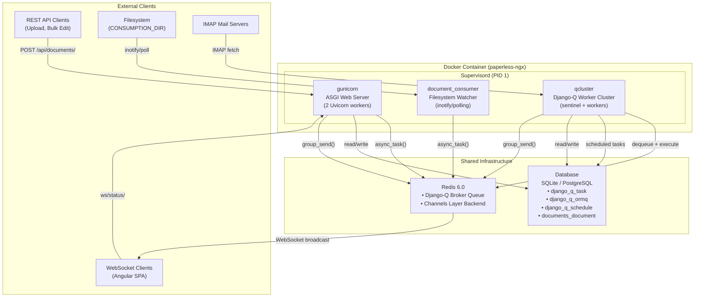
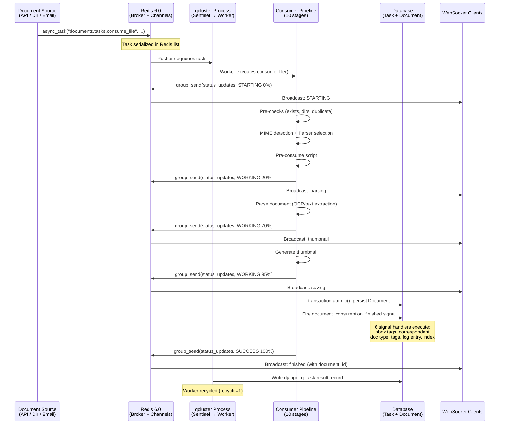
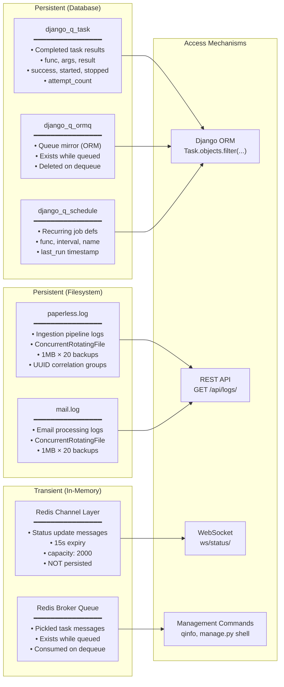

# Paperless-ngx Background Processing Architecture — Complete Investigative Analysis

## 1. Introduction

This document provides a comprehensive, code-grounded investigation of the complete background processing architecture within paperless-ngx during document ingestion. Every claim in this document is traced directly to specific file paths and line numbers in the source repository — no assumptions are made, and no external documentation is relied upon.

### 1.1 Scope

This investigation covers:

- **Runtime Service Topology**: The three Supervisord-managed processes and their coordination through shared Redis and database infrastructure.
- **Django-Q Task Queue Configuration**: The `Q_CLUSTER` settings that govern worker behavior at runtime.
- **Background Job Lifecycle**: How a task materializes, transitions through states, and persists its results.
- **Task State Storage Architecture**: Every location where task state is persisted — Redis, database tables, log files, and WebSocket channels.
- **Waiting vs. Active Work Differentiation**: How the system distinguishes between queued and executing tasks.
- **Code-Level Task Origin Mapping**: Every `async_task()` callsite across the codebase with exact file paths, line numbers, and triggering contexts.
- **Scheduled Task Infrastructure**: Recurring job definitions and their registration mechanism.
- **WebSocket Real-Time Notification Layer**: How background processing status is surfaced to end users in real time.
- **Consumer Pipeline Orchestration**: The 10-stage ingestion pipeline and its signal-driven post-consumption handler chain.
- **Post-Mortem Job Inspection**: Mechanisms for determining what happened to a given job after the fact.

### 1.2 Methodology

All conclusions are derived exclusively from reading the source code files in the repository. The analysis was performed through systematic inspection of Python source files, Docker configuration files, and dependency manifests. Line numbers reference the source repository state at the time of analysis.

---

## 2. Runtime Service Topology

### 2.1 Supervisord Process Model

The paperless-ngx container runs three long-lived processes under Supervisord, as defined in `docker/supervisord.conf`:

| Process Name  | Command                                                                      | User        | Lines |
| ------------- | ---------------------------------------------------------------------------- | ----------- | ----- |
| **gunicorn**  | `gunicorn -c /usr/src/paperless/gunicorn.conf.py paperless.asgi:application` | `paperless` | 10–12 |
| **consumer**  | `python3 manage.py document_consumer`                                        | `paperless` | 19–21 |
| **scheduler** | `python3 manage.py qcluster`                                                 | `paperless` | 28–30 |

**Evidence** — `docker/supervisord.conf`:

```ini
[program:gunicorn]
command=gunicorn -c /usr/src/paperless/gunicorn.conf.py paperless.asgi:application
user=paperless
```

_(lines 10–12)_

```ini
[program:consumer]
command=python3 manage.py document_consumer
user=paperless
```

_(lines 19–21)_

```ini
[program:scheduler]
command=python3 manage.py qcluster
user=paperless
```

_(lines 28–30)_

Supervisord is configured to run in the foreground (`nodaemon=true`, line 2) as PID 1 inside the container, with log rotation at 50 MB and 10 backups (lines 3–6).

**Rationale**: All three processes run as the `paperless` user (not root), providing process isolation while sharing the same filesystem, Redis connection, and database. Supervisord ensures all three are started together and restarted if they crash.

### 2.2 Gunicorn/Uvicorn ASGI Server

The web server is configured in `gunicorn.conf.py`:

| Setting         | Value                                       | Source |
| --------------- | ------------------------------------------- | ------ |
| Bind address    | `0.0.0.0:{PAPERLESS_PORT}` (default `8000`) | line 3 |
| Worker count    | `PAPERLESS_WEBSERVER_WORKERS` (default `2`) | line 4 |
| Worker class    | `paperless.workers.ConfigurableWorker`      | line 5 |
| Request timeout | `120` seconds                               | line 6 |

**Evidence** — `gunicorn.conf.py`:

```python
bind = f'0.0.0.0:{os.getenv("PAPERLESS_PORT", 8000)}'
workers = int(os.getenv("PAPERLESS_WEBSERVER_WORKERS", 2))
worker_class = "paperless.workers.ConfigurableWorker"
timeout = 120
```

_(lines 3–6)_

The `ConfigurableWorker` class is defined in `src/paperless/workers.py` (lines 9–12):

```python
class ConfigurableWorker(UvicornWorker):
    CONFIG_KWARGS = {
        "root_path": settings.FORCE_SCRIPT_NAME or "",
    }
```

**Rationale**: This extends Uvicorn's ASGI worker to inject `FORCE_SCRIPT_NAME` as the ASGI `root_path`, enabling paperless-ngx to be served under a subpath (e.g., `/paperless/`). The lifecycle hooks in `gunicorn.conf.py` (lines 9–39) provide debugging information during worker forking and signal handling but do not alter runtime behavior.

### 2.3 Docker Compose Service Topology

The PostgreSQL deployment topology is defined in `docker/compose/docker-compose.postgres.yml`:

| Service     | Image                                        | Role                                                | Lines |
| ----------- | -------------------------------------------- | --------------------------------------------------- | ----- |
| `broker`    | `redis:6.0`                                  | Task queue broker + WebSocket channel layer backend | 31–35 |
| `db`        | `postgres:13`                                | Relational database                                 | 37–45 |
| `webserver` | `ghcr.io/paperless-ngx/paperless-ngx:latest` | Application container (all 3 Supervisord processes) | 47–68 |

**Evidence** — `docker/compose/docker-compose.postgres.yml`:

```yaml
broker:
  image: redis:6.0
  restart: unless-stopped
  volumes:
    - redisdata:/data
```

_(lines 31–35)_

```yaml
webserver:
    image: ghcr.io/paperless-ngx/paperless-ngx:latest
    restart: unless-stopped
    depends_on:
      - db
      - broker
    ...
    environment:
      PAPERLESS_REDIS: redis://broker:6379
      PAPERLESS_DBHOST: db
```

_(lines 47–68)_

**Rationale**: The `webserver` container depends on both `db` and `broker`, ensuring Docker Compose starts them first. However, Docker Compose's `depends_on` only waits for container creation, not service readiness — which is why the startup script (`docker-prepare.sh`) includes its own readiness probes.

### 2.4 Startup Sequence

The container startup sequence is orchestrated by `docker/docker-prepare.sh`, which gates application startup on infrastructure readiness:

| Step | Function              | Lines | Description                                                                                            |
| ---- | --------------------- | ----- | ------------------------------------------------------------------------------------------------------ |
| 1    | `wait_for_postgres()` | 5–28  | Polls `pg_isready` with 5 retries × 5s delay (only if `PAPERLESS_DBHOST` is set)                       |
| 2    | `wait_for_redis()`    | 30–36 | Delegates to `docker/wait-for-redis.py`                                                                |
| 3    | `migrations()`        | 38–47 | `flock`-protected `python3 manage.py migrate` to prevent concurrent migration from multiple containers |
| 4    | `search_index()`      | 49–58 | Conditional `document_index reindex` if the stored index version doesn't match the expected version    |
| 5    | `superuser()`         | 60–64 | Optional admin user creation via `manage_superuser` if `PAPERLESS_ADMIN_USER` is set                   |

The execution order is defined in `do_work()` (lines 66–81):

```bash
do_work() {
    if [[ -n "${PAPERLESS_DBHOST}" ]]; then
        wait_for_postgres
    fi
    wait_for_redis
    migrations
    search_index
    superuser
}
```

**Redis Readiness Probe** — `docker/wait-for-redis.py`:

```python
MAX_RETRY_COUNT: Final[int] = 5
RETRY_SLEEP_SECONDS: Final[int] = 5
```

_(lines 16–17)_

The probe uses `Redis.from_url()` with the `PAPERLESS_REDIS` environment variable (line 19, 24), calls `client.ping()` (line 27), and exits with `os.EX_UNAVAILABLE` on failure (line 39) or `os.EX_OK` on success (line 42).

**Rationale**: The `flock` mechanism in `migrations()` (line 43: `flock 200`) is critical for multi-container deployments where multiple webserver instances might start simultaneously — only one can run migrations at a time, while others block on the file lock at `/usr/src/paperless/data/migration_lock` (line 46).

---

## 3. Django-Q Task Queue Configuration

### 3.1 Q_CLUSTER Settings

The Django-Q task queue is configured in `src/paperless/settings.py` (lines 449–457):

```python
Q_CLUSTER = {
    "name": "paperless",
    "catch_up": False,
    "recycle": 1,
    "retry": PAPERLESS_WORKER_RETRY,
    "timeout": PAPERLESS_WORKER_TIMEOUT,
    "workers": TASK_WORKERS,
    "redis": os.getenv("PAPERLESS_REDIS", "redis://localhost:6379"),
}
```

| Parameter  | Value                                                             | Source                             | Explanation                                                                                          |
| ---------- | ----------------------------------------------------------------- | ---------------------------------- | ---------------------------------------------------------------------------------------------------- |
| `name`     | `"paperless"`                                                     | line 450                           | Cluster identifier for Django-Q internal tracking                                                    |
| `catch_up` | `False`                                                           | line 451                           | Skipped scheduled tasks will NOT retroactively fire — prevents a burst of mail checks after downtime |
| `recycle`  | `1`                                                               | line 452                           | Each worker subprocess handles exactly **one** task before being terminated and replaced             |
| `retry`    | `PAPERLESS_WORKER_RETRY` (default: `1810` seconds)                | line 453, defined at lines 444–447 | Time after which a timed-out task is re-enqueued. Must be > `timeout`                                |
| `timeout`  | `PAPERLESS_WORKER_TIMEOUT` (default: `1800` seconds / 30 minutes) | line 454, defined at line 440      | Maximum execution time per task before the worker is killed                                          |
| `workers`  | `TASK_WORKERS` (dynamically computed)                             | line 455, defined at line 438      | Number of concurrent worker subprocesses                                                             |
| `redis`    | `PAPERLESS_REDIS` env var (default `redis://localhost:6379`)      | line 456                           | Redis broker connection URL                                                                          |

### 3.2 Worker Scaling Logic

**`default_task_workers()`** — `src/paperless/settings.py` lines 427–435:

```python
def default_task_workers() -> int:
    available_cores = max(multiprocessing.cpu_count(), 1)
    try:
        if available_cores < 4:
            return available_cores
        return max(math.floor(math.sqrt(available_cores)), 1)
    except NotImplementedError:
        return 1
```

| CPU Cores | Default Workers | Rationale               |
| --------- | --------------- | ----------------------- |
| 1         | 1               | Single core: one worker |
| 2         | 2               | Low core count: use all |
| 3         | 3               | Low core count: use all |
| 4         | 2               | `floor(sqrt(4)) = 2`    |
| 8         | 2               | `floor(sqrt(8)) = 2`    |
| 16        | 4               | `floor(sqrt(16)) = 4`   |

The actual value can be overridden via `PAPERLESS_TASK_WORKERS` environment variable (line 438).

### 3.3 Threads Per Worker

**`default_threads_per_worker()`** — `src/paperless/settings.py` lines 460–466:

```python
def default_threads_per_worker(task_workers) -> int:
    available_cores = max(multiprocessing.cpu_count(), 1)
    try:
        return max(math.floor(available_cores / task_workers), 1)
    except NotImplementedError:
        return 1
```

This can be overridden via `PAPERLESS_THREADS_PER_WORKER` (lines 469–472). The total thread count (workers × threads_per_worker) is designed to never exceed the available CPU cores.

### 3.4 Recycle Parameter Deep Dive

The `recycle: 1` setting (line 452) means each worker subprocess handles exactly one task before being terminated and replaced by the sentinel. This is critical for paperless-ngx because:

1. **Memory leak prevention**: OCR processing (via Tesseract, pikepdf, pdf2image) can accumulate significant memory. Recycling after every task prevents unbounded memory growth.
2. **Clean state**: Each task gets a fresh process with no state contamination from previous tasks.
3. **Predictable behavior**: The sentinel always knows that a worker is either idle (just spawned) or executing exactly one task.

### 3.5 Retry vs. Timeout Relationship

The retry/timeout relationship is established at `src/paperless/settings.py` lines 440–447:

```python
PAPERLESS_WORKER_TIMEOUT: Final[int] = __get_int("PAPERLESS_WORKER_TIMEOUT", 1800)

# Per django-q docs, timeout must be smaller than retry
# We default retry to 10s more than the timeout
PAPERLESS_WORKER_RETRY: Final[int] = __get_int(
    "PAPERLESS_WORKER_RETRY",
    PAPERLESS_WORKER_TIMEOUT + 10,
)
```

**Rationale**: If a task exceeds `timeout` (1800s), the worker process is killed. After `retry` (1810s) seconds from the original enqueue time, Django-Q considers the task lost and re-enqueues it. The 10-second gap prevents a race condition where a task could be simultaneously running (near timeout) and re-enqueued (at retry), avoiding double-execution.

---

## 4. Background Job Lifecycle

### 4.1 Complete Task Lifecycle

A background task in paperless-ngx follows this lifecycle:

```
┌─────────┐    ┌──────────┐    ┌──────────┐    ┌───────────┐    ┌────────────┐    ┌──────────┐
│ Enqueue │───>│ Queued   │───>│ Dequeued │───>│ Executing │───>│ Completed  │───>│ Recorded │
│         │    │ (Redis)  │    │ (Pusher) │    │ (Worker)  │    │ (Success/  │    │ (Task DB)│
│         │    │          │    │          │    │           │    │  Failure)  │    │          │
└─────────┘    └──────────┘    └──────────┘    └───────────┘    └────────────┘    └──────────┘
```

**Step 1 — Enqueue**: A caller invokes `async_task("documents.tasks.consume_file", ...)`. Django-Q serializes the task (function reference string, positional args, keyword args) as a pickled payload and pushes it into a Redis list (the broker queue).

**Step 2 — Queue Storage**: The serialized task message sits in a Redis list. Django-Q may optionally mirror it to the `django_q_ormq` database table for ORM-based visibility. The task is now "queued" — waiting for a worker.

**Step 3 — Dequeue**: Inside the `qcluster` process (Supervisord's `scheduler` service), the sentinel manages a pusher subprocess and multiple worker subprocesses. The pusher polls the Redis broker queue. When tasks are available and workers are idle, the pusher pops tasks from Redis and passes them to an idle worker via an internal multiprocessing queue.

**Step 4 — Execution**: The worker subprocess imports the referenced function (e.g., `documents.tasks.consume_file`) and executes it with the provided arguments. During execution, the task is "active" — the sentinel tracks which workers are busy. The task no longer exists in the Redis list.

**Step 5 — Result Persistence**: On completion (success or failure), Django-Q writes a `Task` record to the `django_q_task` database table. This record contains the function name, arguments, return value or exception, success/failure boolean, start/stop timestamps, and attempt count.

**Step 6 — Cleanup**: The Redis queue entry was already consumed in Step 3. If `OrmQ` mirroring was used, the corresponding `OrmQ` record is deleted. The worker subprocess is terminated (due to `recycle: 1`) and the sentinel spawns a replacement.

### 4.2 Django-Q Task Model Fields

The `Task` model (from Django-Q library, version `1.3.9` per `requirements.txt` line 37) stores completed task records with these key fields:

| Field           | Type          | Description                                                                                                                                                            |
| --------------- | ------------- | ---------------------------------------------------------------------------------------------------------------------------------------------------------------------- |
| `name`          | CharField     | Human-readable task name, set via `task_name` parameter in `async_task()`                                                                                              |
| `func`          | CharField     | Dotted path string (e.g., `"documents.tasks.consume_file"`)                                                                                                            |
| `args`          | TextField     | Pickled positional arguments                                                                                                                                           |
| `kwargs`        | TextField     | Pickled keyword arguments                                                                                                                                              |
| `result`        | TextField     | Pickled return value (e.g., `"Success. New document id 42 created"`) or exception                                                                                      |
| `success`       | BooleanField  | `True` if the task completed without exception, `False` otherwise                                                                                                      |
| `started`       | DateTimeField | Timestamp when execution began                                                                                                                                         |
| `stopped`       | DateTimeField | Timestamp when execution ended                                                                                                                                         |
| `attempt_count` | IntegerField  | Number of execution attempts (added in `django_q.0013_task_attempt_count` migration, referenced at `src/paperless_mail/migrations/0002_auto_20201117_1334.py` line 26) |

---

## 5. Task State Storage Architecture

Background task state is persisted across six distinct storage locations, each serving a different purpose:

### 5.1 Redis Broker Queue (Transient, In-Flight)

- **Storage medium**: Redis in-memory data structure (list)
- **Configured at**: `Q_CLUSTER["redis"]` in `src/paperless/settings.py` line 456
- **Connection URL**: `PAPERLESS_REDIS` env var (default `redis://localhost:6379`)
- **Persistence**: Transient — exists only while tasks are queued or being processed
- **Lifecycle**: Created when `async_task()` is called; consumed when the pusher dequeues it for a worker
- **Access mechanism**: Django-Q broker internals (not directly queryable by application code)

### 5.2 `django_q_ormq` Database Table (Queue Mirror)

- **Storage medium**: Relational database (SQLite or PostgreSQL)
- **Model**: `django_q.models.OrmQ`
- **Purpose**: Mirrors queued tasks from Redis to the database for ORM-based visibility
- **Lifecycle**: Created when a task is enqueued; deleted when the task is picked up by a worker
- **Access mechanism**: Django ORM — `from django_q.models import OrmQ; OrmQ.objects.all()`

### 5.3 `django_q_task` Database Table (Completed Results)

- **Storage medium**: Relational database (SQLite or PostgreSQL)
- **Model**: `django_q.models.Task`
- **Purpose**: Stores completed task records (both successes and failures)
- **Lifecycle**: Created after task execution completes; persists indefinitely unless explicitly pruned
- **Fields**: `name`, `func`, `args`, `kwargs`, `result`, `success`, `started`, `stopped`, `attempt_count`
- **Access mechanism**: Django ORM — `from django_q.models import Task; Task.objects.filter(func="documents.tasks.consume_file")`
- **Primary post-mortem mechanism**: This is the primary way to inspect what happened to a task after the fact

### 5.4 `django_q_schedule` Database Table (Recurring Jobs)

- **Storage medium**: Relational database (SQLite or PostgreSQL)
- **Model**: `django_q.models.Schedule`
- **Purpose**: Stores recurring schedule definitions
- **Example**: The mail account check schedule is registered in `src/paperless_mail/migrations/0002_auto_20201117_1334.py` (lines 9–15):

```python
schedule(
    "paperless_mail.tasks.process_mail_accounts",
    name="Check all e-mail accounts",
    schedule_type=Schedule.MINUTES,
    minutes=10,
)
```

- **Lifecycle**: Created during database migration; persists until explicitly deleted
- **Key fields**: `func`, `schedule_type`, `minutes`, `name`, `last_run`
- **Access mechanism**: Django ORM — `from django_q.models import Schedule; Schedule.objects.all()`

### 5.5 Application Log Files (Persistent Diagnostics)

Configured in `src/paperless/settings.py` lines 373–412:

| Log File                      | Handler Name     | Logger Namespace                | Level | Lines        |
| ----------------------------- | ---------------- | ------------------------------- | ----- | ------------ |
| `{LOGGING_DIR}/paperless.log` | `file_paperless` | `paperless` (and children)      | DEBUG | 392–398, 409 |
| `{LOGGING_DIR}/mail.log`      | `file_mail`      | `paperless_mail` (and children) | DEBUG | 399–405, 410 |

Both handlers use `ConcurrentRotatingFileHandler` (from `concurrent-log-handler==0.9.20`, `requirements.txt` line 28) for safe multi-process log writes:

- **Max file size**: `PAPERLESS_LOGROTATE_MAX_SIZE` (default `1048576` / 1 MB) — line 370
- **Max backup files**: `PAPERLESS_LOGROTATE_MAX_BACKUPS` (default `20`) — line 371
- **Format**: `[{asctime}] [{levelname}] [{name}] {message}` — lines 377–379

**Evidence** — `src/paperless/settings.py`:

```python
"file_paperless": {
    "class": "concurrent_log_handler.ConcurrentRotatingFileHandler",
    "formatter": "verbose",
    "filename": os.path.join(LOGGING_DIR, "paperless.log"),
    "maxBytes": LOGROTATE_MAX_SIZE,
    "backupCount": LOGROTATE_MAX_BACKUPS,
},
```

_(lines 392–398)_

### 5.6 WebSocket Channel Layer (Real-Time, Ephemeral)

Configured in `src/paperless/settings.py` lines 178–187:

```python
CHANNEL_LAYERS = {
    "default": {
        "BACKEND": "channels_redis.core.RedisChannelLayer",
        "CONFIG": {
            "hosts": [os.getenv("PAPERLESS_REDIS", "redis://localhost:6379")],
            "capacity": 2000,  # default 100
            "expiry": 15,  # default 60
        },
    },
}
```

| Setting    | Value        | Default | Rationale                                                                                                                                    |
| ---------- | ------------ | ------- | -------------------------------------------------------------------------------------------------------------------------------------------- |
| `capacity` | `2000`       | `100`   | Allows many concurrent document processing progress updates without dropping messages (line 183)                                             |
| `expiry`   | `15` seconds | `60`    | Status updates are ephemeral — stale progress messages should not be delivered to clients connecting after processing is complete (line 184) |

**Critical limitation**: Messages are NOT persisted. They expire after 15 seconds if not consumed by a connected WebSocket client. This means real-time status is available **only** to currently connected browser clients.

---

## 6. Waiting vs. Active Work Differentiation

### 6.1 Django-Q Internal Architecture

Django-Q's `qcluster` management command (the `scheduler` Supervisord process) uses a sentinel-based architecture to manage background task execution:

```
┌─────────────────────────────────────────┐
│           qcluster Process              │
│                                         │
│  ┌───────────┐                          │
│  │ Sentinel  │ (master coordinator)     │
│  └─────┬─────┘                          │
│        │                                │
│  ┌─────┴─────┐                          │
│  │           │                          │
│  ▼           ▼                          │
│ ┌────────┐ ┌────────────────────────┐   │
│ │ Pusher │ │ Worker Pool            │   │
│ │        │ │ ┌────────┐ ┌────────┐  │   │
│ │ (polls │ │ │Worker 1│ │Worker N│  │   │
│ │ Redis) │ │ └────────┘ └────────┘  │   │
│ └────────┘ └────────────────────────┘   │
└─────────────────────────────────────────┘
```

- **Sentinel**: The master coordinator process. It manages the pusher and worker subprocesses, tracks which workers are busy, handles timeouts, and spawns replacement workers when one finishes or is killed.
- **Pusher**: A subprocess that monitors the Redis broker queue. When tasks are available and workers are idle, the pusher pops task messages from Redis and places them into an internal multiprocessing queue for workers to pick up.
- **Worker Subprocesses**: Execute the actual task functions. The number of workers is controlled by `Q_CLUSTER["workers"]` (value of `TASK_WORKERS`, line 455 of `settings.py`).

### 6.2 State Distinction

| State                  | Location                                             | Mechanism                                                                                                                                                                 |
| ---------------------- | ---------------------------------------------------- | ------------------------------------------------------------------------------------------------------------------------------------------------------------------------- |
| **Queued (Waiting)**   | Redis broker list + optionally `django_q_ormq` table | Task exists in the Redis list. No worker has been assigned. The pusher has not yet dequeued it.                                                                           |
| **Active (Executing)** | Worker subprocess memory                             | Task has been dequeued by the pusher and assigned to a specific worker subprocess. The sentinel tracks which worker is busy. The task no longer exists in the Redis list. |
| **Completed**          | `django_q_task` table                                | Task has finished execution. Result, timing, and success/failure status are persisted in the database.                                                                    |

### 6.3 Impact of `recycle: 1`

With `recycle: 1` (line 452 of `settings.py`), each worker subprocess is terminated and replaced after completing exactly one task. This means:

1. At any moment, each worker is either **idle** (just spawned, waiting for the pusher to assign work) or **executing exactly one task**.
2. The sentinel has a clear, unambiguous view of which workers are busy — there is no worker that has "completed a task but hasn't been recycled yet" in any meaningful sense.
3. This provides a clean distinction between waiting and active work: if the sentinel reports a worker as busy, that worker is actively executing a task. If the worker is idle, it's waiting for work.

### 6.4 Monitoring

Django-Q provides `Stat` objects per cluster that expose the current worker pool state. The `qinfo` management command can report:

- Current queue depth (number of tasks waiting in Redis)
- Number of active workers (currently executing tasks)
- Number of idle workers
- Cluster health metrics

---

## 7. Code-Level Task Origin Mapping (`async_task` Callsites)

This section maps every location in the codebase where `async_task()` is invoked to enqueue background work.

### 7.1 API Document Upload

**File**: `src/documents/views.py`
**Import**: `from django_q.tasks import async_task` (line 28)
**Function**: `PostDocumentView.post()` (lines 497–535)
**Triggering context**: HTTP `POST /api/documents/post_document/` — a user uploads a document via the REST API

**Callsite** (lines 523–533):

```python
async_task(
    "documents.tasks.consume_file",
    temp_filename,
    override_filename=doc_name,
    override_title=title,
    override_correspondent_id=correspondent_id,
    override_document_type_id=document_type_id,
    override_tag_ids=tag_ids,
    task_id=task_id,
    task_name=os.path.basename(doc_name)[:100],
)
```

**Flow**:

1. The `PostDocumentSerializer` validates the upload data (lines 499–500)
2. The file is written to a temporary file in `SCRATCH_DIR` with prefix `paperless-upload-` (lines 512–519)
3. A UUID task ID is generated: `task_id = str(uuid.uuid4())` (line 521)
4. `async_task` dispatches the task to the Django-Q queue (lines 523–533)
5. The view returns `Response("OK")` immediately (line 535), without waiting for processing

**Arguments**:

- `temp_filename` — positional argument: path to the temporary file
- `override_filename=doc_name` — original upload filename from the serializer (line 502)
- `override_title=title` — optional user-specified title (line 506)
- `override_correspondent_id=correspondent_id` — optional correspondent (line 503)
- `override_document_type_id=document_type_id` — optional document type (line 504)
- `override_tag_ids=tag_ids` — optional list of tag IDs (line 505)
- `task_id=task_id` — UUID for WebSocket progress tracking (line 521)
- `task_name=os.path.basename(doc_name)[:100]` — human-readable name truncated to 100 chars

### 7.2 Filesystem Watcher

**File**: `src/documents/management/commands/document_consumer.py`
**Import**: `from django_q.tasks import async_task` (line 13)
**Function**: `_consume(filepath)` (lines 46–97)
**Triggering context**: The filesystem watcher detects a new file in `CONSUMPTION_DIR`

**Callsite** (lines 86–91):

```python
async_task(
    "documents.tasks.consume_file",
    filepath,
    override_tag_ids=tag_ids if tag_ids else None,
    task_name=os.path.basename(filepath)[:100],
)
```

**Flow**:

1. Supervisord starts the `document_consumer` management command (line 20 of `supervisord.conf`)
2. Initial scan: `Command.handle()` walks `CONSUMPTION_DIR` and calls `_consume()` for each file found (lines 166–173)
3. Continuous monitoring: Either inotify (line 178–179) or polling (lines 180–181) watches for new files
4. For polling: `_consume_wait_unmodified()` (lines 99–125) waits for the file's mtime and size to stabilize before calling `_consume()`
5. For inotify: Events are debounced with a 0.5s delay (line 211) before calling `_consume()`

**Pre-validation in `_consume()`** (lines 46–75):

- Skips directories and files matching `CONSUMER_IGNORE_PATTERNS` (line 47)
- Verifies the file still exists (lines 50–52)
- Checks file extension support via `is_file_ext_supported()` (lines 54–56)
- Retries file open up to 50 times × 10ms if the OS reports the file as busy (lines 59–75)

**Subdirectory tag extraction** (lines 77–82):

- If `CONSUMER_SUBDIRS_AS_TAGS` is enabled, `_tags_from_path()` (lines 27–38) walks up from the file to `CONSUMPTION_DIR` and creates/gets `Tag` objects for each intermediate directory name

### 7.3 Email Ingestion

**File**: `src/paperless_mail/mail.py`
**Import**: `from django_q.tasks import async_task` (line 11)
**Function**: `MailAccountHandler.handle_message(message, rule)` (lines 272–361)
**Triggering context**: The scheduled `process_mail_accounts` task iterates mail accounts and processes qualifying email messages

**Callsite** (lines 336–349):

```python
async_task(
    "documents.tasks.consume_file",
    path=temp_filename,
    override_filename=pathvalidate.sanitize_filename(
        att.filename,
    ),
    override_title=title,
    override_correspondent_id=correspondent.id
    if correspondent
    else None,
    override_document_type_id=doc_type.id if doc_type else None,
    override_tag_ids=tag_ids,
    task_name=att.filename[:100],
)
```

**Flow**:

1. The scheduled `process_mail_accounts()` task triggers (see Section 8)
2. `MailAccountHandler.handle_mail_account()` opens an IMAP connection and iterates matching messages
3. For each qualifying attachment: MIME type is validated via `magic.from_buffer()` (line 317) and `is_mime_type_supported()` (line 319)
4. The attachment payload is written to a temp file in `SCRATCH_DIR` with prefix `paperless-mail-` (lines 321–327)
5. `async_task` dispatches the file for consumption (lines 336–349)

**Arguments**:

- `path=temp_filename` — keyword argument: path to the temp file containing the attachment
- `override_filename=pathvalidate.sanitize_filename(att.filename)` — sanitized attachment filename
- `override_title=title` — derived from message subject per rule configuration (line 313)
- `override_correspondent_id` — from rule's correspondent match (line 283)
- `override_document_type_id` — from rule's document type assignment (line 285)
- `override_tag_ids=tag_ids` — from `rule.assign_tags.all()` (line 284)
- `task_name=att.filename[:100]` — truncated attachment filename

### 7.4 Bulk Metadata Operations

**File**: `src/documents/bulk_edit.py`
**Import**: `from django_q.tasks import async_task` (line 4)
**Target**: `"documents.tasks.bulk_update_documents"`
**Triggering context**: API `POST /api/documents/bulk_edit/` — a user performs bulk metadata changes

Five separate callsites, all following the same pattern:

| Function                                      | Line | Callsite                                                                          |
| --------------------------------------------- | ---- | --------------------------------------------------------------------------------- |
| `set_correspondent(doc_ids, correspondent)`   | 18   | `async_task("documents.tasks.bulk_update_documents", document_ids=affected_docs)` |
| `set_document_type(doc_ids, document_type)`   | 31   | `async_task("documents.tasks.bulk_update_documents", document_ids=affected_docs)` |
| `add_tag(doc_ids, tag)`                       | 47   | `async_task("documents.tasks.bulk_update_documents", document_ids=affected_docs)` |
| `remove_tag(doc_ids, tag)`                    | 63   | `async_task("documents.tasks.bulk_update_documents", document_ids=affected_docs)` |
| `modify_tags(doc_ids, add_tags, remove_tags)` | 87   | `async_task("documents.tasks.bulk_update_documents", document_ids=affected_docs)` |

**Flow** (identical for all five):

1. Filter documents that would actually be affected by the change (e.g., documents whose correspondent differs from the new value)
2. Perform the ORM update immediately (synchronous)
3. Dispatch `bulk_update_documents` with the list of affected document IDs to handle secondary effects asynchronously

**The `bulk_update_documents` task** — `src/documents/tasks.py` lines 270–280:

```python
def bulk_update_documents(document_ids):
    documents = Document.objects.filter(id__in=document_ids)
    ix = index.open_index()
    for doc in documents:
        post_save.send(Document, instance=doc, created=False)
    with AsyncWriter(ix) as writer:
        for doc in documents:
            index.update_document(writer, doc)
```

This fires `post_save` signals for each document (triggering file rename logic in `signals/handlers.py`) and updates the Whoosh search index.

### 7.5 Complete Callsite Summary

| #   | File                                                     | Line(s) | Target Task                             | Trigger                     |
| --- | -------------------------------------------------------- | ------- | --------------------------------------- | --------------------------- |
| 1   | `src/documents/views.py`                                 | 523–533 | `documents.tasks.consume_file`          | API document upload         |
| 2   | `src/documents/management/commands/document_consumer.py` | 86–91   | `documents.tasks.consume_file`          | Filesystem watcher          |
| 3   | `src/paperless_mail/mail.py`                             | 336–349 | `documents.tasks.consume_file`          | Email attachment extraction |
| 4   | `src/documents/bulk_edit.py`                             | 18      | `documents.tasks.bulk_update_documents` | Bulk set correspondent      |
| 5   | `src/documents/bulk_edit.py`                             | 31      | `documents.tasks.bulk_update_documents` | Bulk set document type      |
| 6   | `src/documents/bulk_edit.py`                             | 47      | `documents.tasks.bulk_update_documents` | Bulk add tag                |
| 7   | `src/documents/bulk_edit.py`                             | 63      | `documents.tasks.bulk_update_documents` | Bulk remove tag             |
| 8   | `src/documents/bulk_edit.py`                             | 87      | `documents.tasks.bulk_update_documents` | Bulk modify tags            |

---

## 8. Scheduled Task Infrastructure

### 8.1 Mail Account Check Schedule

The only recurring schedule in paperless-ngx is registered via a database migration.

**Registration** — `src/paperless_mail/migrations/0002_auto_20201117_1334.py` (lines 9–15):

```python
def add_schedules(apps, schema_editor):
    schedule(
        "paperless_mail.tasks.process_mail_accounts",
        name="Check all e-mail accounts",
        schedule_type=Schedule.MINUTES,
        minutes=10,
    )
```

| Property             | Value                                          | Source      |
| -------------------- | ---------------------------------------------- | ----------- |
| Function             | `"paperless_mail.tasks.process_mail_accounts"` | line 11     |
| Name                 | `"Check all e-mail accounts"`                  | line 12     |
| Schedule type        | `Schedule.MINUTES`                             | line 13     |
| Interval             | 10 minutes                                     | line 14     |
| Migration dependency | `django_q.0013_task_attempt_count`             | line 26     |
| Reverse operation    | `Schedule.objects.filter(func="...").delete()` | lines 18–19 |

**Rationale**: The schedule is registered as a Django migration (not in application code), ensuring it is created exactly once during database setup and persists across deployments. The `qcluster` process reads the `django_q_schedule` table at its configured interval and fires scheduled tasks automatically.

### 8.2 Mail Processing Functions

**`process_mail_accounts()`** — `src/paperless_mail/tasks.py` lines 11–22:

```python
def process_mail_accounts():
    total_new_documents = 0
    for account in MailAccount.objects.all():
        try:
            total_new_documents += MailAccountHandler().handle_mail_account(account)
        except MailError:
            logger.exception(f"Error while processing mail account {account}")
    if total_new_documents > 0:
        return f"Added {total_new_documents} document(s)."
    else:
        return "No new documents were added."
```

This function iterates all `MailAccount` objects, delegates processing to `MailAccountHandler`, and catches `MailError` per-account to prevent one failing account from blocking others.

**`process_mail_account(name)`** — `src/paperless_mail/tasks.py` lines 25–30:

```python
def process_mail_account(name):
    try:
        account = MailAccount.objects.get(name=name)
        MailAccountHandler().handle_mail_account(account)
    except MailAccount.DoesNotExist:
        logger.error(f"Unknown mail acccount: {name}")
```

This processes a single named mail account — used for manual triggering via the Django management shell.

---

## 9. WebSocket Real-Time Notification Layer

### 9.1 WebSocket Endpoint Configuration

**URL Pattern** — `src/paperless/urls.py` lines 136–138:

```python
websocket_urlpatterns = [
    re_path(r"ws/status/$", StatusConsumer.as_asgi()),
]
```

**ASGI Routing** — `src/paperless/asgi.py` lines 17–22:

```python
application = ProtocolTypeRouter(
    {
        "http": get_asgi_application(),
        "websocket": AuthMiddlewareStack(URLRouter(websocket_urlpatterns)),
    },
)
```

The `ProtocolTypeRouter` dispatches incoming connections based on protocol: HTTP requests go to Django's standard ASGI application, while WebSocket connections are routed through `AuthMiddlewareStack` (which populates `scope["user"]`) and then to the `URLRouter` matching `ws/status/`.

### 9.2 StatusConsumer

**File**: `src/paperless/consumers.py`
**Class**: `StatusConsumer(WebsocketConsumer)` (lines 9–33)

```python
class StatusConsumer(WebsocketConsumer):
    def _authenticated(self):
        return "user" in self.scope and self.scope["user"].is_authenticated

    def connect(self):
        if not self._authenticated():
            raise DenyConnection()
        else:
            async_to_sync(self.channel_layer.group_add)(
                "status_updates",
                self.channel_name,
            )
            raise AcceptConnection()

    def disconnect(self, close_code):
        async_to_sync(self.channel_layer.group_discard)(
            "status_updates",
            self.channel_name,
        )

    def status_update(self, event):
        if not self._authenticated():
            self.close()
        else:
            self.send(json.dumps(event["data"]))
```

| Method             | Lines | Behavior                                                                                                                  |
| ------------------ | ----- | ------------------------------------------------------------------------------------------------------------------------- |
| `_authenticated()` | 10–11 | Checks if `self.scope["user"]` exists and is authenticated                                                                |
| `connect()`        | 13–21 | Authenticated users join the `"status_updates"` channel group; unauthenticated users get `DenyConnection()`               |
| `disconnect()`     | 23–27 | Leaves the `"status_updates"` channel group                                                                               |
| `status_update()`  | 29–33 | Receives a channel layer message, re-checks authentication, and sends `json.dumps(event["data"])` to the WebSocket client |

### 9.3 Channel Layer Configuration

As documented in Section 5.6, the channel layer uses the same Redis instance as Django-Q:

- **Backend**: `channels_redis.core.RedisChannelLayer` (line 180 of `settings.py`)
- **Hosts**: `PAPERLESS_REDIS` (same URL as Django-Q broker) (line 182)
- **Capacity**: `2000` messages per channel (line 183) — 20× the default of 100
- **Expiry**: `15` seconds (line 184) — 4× shorter than the default of 60

**Rationale for `capacity: 2000`**: During heavy document ingestion, many documents may be processing simultaneously, each sending multiple progress updates. The elevated capacity prevents message drops.

**Rationale for `expiry: 15`**: Status updates are inherently temporal. A "processing at 50%" message is meaningless after the document has already been fully consumed. The short expiry ensures stale messages are never delivered to clients that connect after the fact.

### 9.4 Progress Broadcasting from Consumer Pipeline

**File**: `src/documents/consumer.py`
**Method**: `Consumer._send_progress()` (lines 56–76):

```python
def _send_progress(self, current_progress, max_progress, status, message=None, document_id=None):
    payload = {
        "filename": os.path.basename(self.filename) if self.filename else None,
        "task_id": self.task_id,
        "current_progress": current_progress,
        "max_progress": max_progress,
        "status": status,
        "message": message,
        "document_id": document_id,
    }
    async_to_sync(self.channel_layer.group_send)(
        "status_updates",
        {"type": "status_update", "data": payload},
    )
```

**WebSocket Payload Schema**:

```json
{
  "filename": "invoice_2024.pdf",
  "task_id": "a1b2c3d4-...",
  "current_progress": 50,
  "max_progress": 100,
  "status": "WORKING",
  "message": "parsing_document",
  "document_id": null
}
```

**Status Vocabulary**:

| Status     | Meaning                     | When Used                                                                      |
| ---------- | --------------------------- | ------------------------------------------------------------------------------ |
| `STARTING` | Task has begun              | Line 202: `_send_progress(0, 100, "STARTING", MESSAGE_NEW_FILE)`               |
| `WORKING`  | Task is actively processing | Lines 259, 264, 274, 294 and parser callback (lines 237–240)                   |
| `SUCCESS`  | Task completed successfully | Line 375: `_send_progress(100, 100, "SUCCESS", MESSAGE_FINISHED, document.id)` |
| `FAILED`   | Task encountered an error   | Line 79 in `_fail()`: `_send_progress(100, 100, "FAILED", message)`            |

**Progress milestones in `try_consume_file()`**:

| Line    | Progress | Status   | Message Constant               | Pipeline Stage                      |
| ------- | -------- | -------- | ------------------------------ | ----------------------------------- |
| 202     | 0%       | STARTING | `MESSAGE_NEW_FILE`             | Initial announcement                |
| 237–240 | 20–70%   | WORKING  | _(dynamic)_                    | Parser progress callback            |
| 259     | 20%      | WORKING  | `MESSAGE_PARSING_DOCUMENT`     | Parsing begins                      |
| 264     | 70%      | WORKING  | `MESSAGE_GENERATING_THUMBNAIL` | Thumbnail generation                |
| 274     | 90%      | WORKING  | `MESSAGE_PARSE_DATE`           | Date parsing                        |
| 294     | 95%      | WORKING  | `MESSAGE_SAVE_DOCUMENT`        | Database save                       |
| 375     | 100%     | SUCCESS  | `MESSAGE_FINISHED`             | Completion (includes `document.id`) |

**Parser Progress Callback** (lines 237–240):

```python
def progress_callback(current_progress, max_progress):
    # recalculate progress to be within 20 and 80
    p = int((current_progress / max_progress) * 50 + 20)
    self._send_progress(p, 100, "WORKING")
```

This maps the parser's internal progress (0–100%) to the overall pipeline progress range of 20–70%.

### 9.5 Barcode Split WebSocket Notification

**File**: `src/documents/tasks.py` lines 216–232:

When a barcode-separated PDF is successfully split, the task broadcasts a success notification directly to the `status_updates` group (bypassing `Consumer._send_progress`):

```python
payload = {
    "filename": override_filename,
    "task_id": task_id,
    "current_progress": 100,
    "max_progress": 100,
    "status": "SUCCESS",
    "message": "finished",
}
try:
    async_to_sync(get_channel_layer().group_send)(
        "status_updates",
        {"type": "status_update", "data": payload},
    )
except OSError as e:
    logger.warning("OSError. It could be, the broker cannot be reached.")
    logger.warning(str(e))
```

**Rationale**: The barcode split path (lines 195–233 of `tasks.py`) runs _before_ the `Consumer` object is created, so it cannot use `Consumer._send_progress()`. The `OSError` catch (lines 230–232) handles the case where Redis is unreachable, preventing the task from failing due to a notification issue.

---

## 10. Consumer Pipeline (Ingestion Orchestration)

### 10.1 Ten-Stage Ingestion Pipeline

The core ingestion logic lives in `src/documents/consumer.py`, class `Consumer`, method `try_consume_file()` (lines 180–377).

| Stage | Method/Operation           | Lines   | Description                                                                                                                                   |
| ----- | -------------------------- | ------- | --------------------------------------------------------------------------------------------------------------------------------------------- |
| 1     | `pre_check_file_exists()`  | 95–100  | Verifies the file at `self.path` exists on disk                                                                                               |
| 2     | `pre_check_directories()`  | 115–119 | Creates `SCRATCH_DIR`, `THUMBNAIL_DIR`, `ORIGINALS_DIR`, `ARCHIVE_DIR` if they don't exist                                                    |
| 3     | `pre_check_duplicate()`    | 102–113 | Computes MD5 checksum and checks against existing documents' `checksum` and `archive_checksum` fields                                         |
| 4     | MIME Detection             | 219     | `magic.from_file(self.path, mime=True)` — determines the file's MIME type                                                                     |
| 5     | Parser Selection           | 223     | `get_parser_class_for_mime_type(mime_type)` — selects the appropriate parser class                                                            |
| 6     | `run_pre_consume_script()` | 121–141 | Executes an optional external pre-consumption script (`PRE_CONSUME_SCRIPT` setting)                                                           |
| 7     | Parsing                    | 261     | `document_parser.parse(self.path, mime_type, self.filename)` — text extraction / OCR                                                          |
| 8     | Thumbnail Generation       | 265–269 | `document_parser.get_optimised_thumbnail(self.path, mime_type, self.filename)`                                                                |
| 9     | Classification             | 292     | `load_classifier()` — loads the ML classifier model for post-consume signal handlers                                                          |
| 10    | Atomic Persist             | 298–366 | `transaction.atomic()` block: stores Document record, fires `document_consumption_finished` signal, writes files to storage, deletes original |

**Post-persist** (line 371): `run_post_consume_script(document)` — executes an optional external post-consumption script.

### 10.2 Domain Signals

**File**: `src/documents/signals/__init__.py` (lines 1–5):

```python
document_consumption_started = Signal()
document_consumption_finished = Signal()
document_consumer_declaration = Signal()
```

| Signal                          | Fired At                    | Purpose                                                                                                   |
| ------------------------------- | --------------------------- | --------------------------------------------------------------------------------------------------------- |
| `document_consumption_started`  | `consumer.py` lines 229–233 | Notifies listeners that a new document is about to be consumed                                            |
| `document_consumption_finished` | `consumer.py` lines 306–311 | Notifies listeners that a document has been successfully stored (inside the `transaction.atomic()` block) |
| `document_consumer_declaration` | Parser registration         | Used by parser apps to register themselves as available document parsers                                  |

### 10.3 Post-Consumption Signal Handler Chain

**File**: `src/documents/apps.py` (lines 11–27) — `DocumentsConfig.ready()` connects six handlers to `document_consumption_finished`:

```python
document_consumption_finished.connect(add_inbox_tags)
document_consumption_finished.connect(set_correspondent)
document_consumption_finished.connect(set_document_type)
document_consumption_finished.connect(set_tags)
document_consumption_finished.connect(set_log_entry)
document_consumption_finished.connect(add_to_index)
```

| Order | Handler             | File:Lines                  | Action                                                                             |
| ----- | ------------------- | --------------------------- | ---------------------------------------------------------------------------------- |
| 1     | `add_inbox_tags`    | `handlers.py` lines 30–32   | Adds all tags marked `is_inbox_tag=True` to the document                           |
| 2     | `set_correspondent` | `handlers.py` lines 35–98   | Matches and assigns a correspondent using the ML classifier and pattern matching   |
| 3     | `set_document_type` | `handlers.py` lines 101–165 | Matches and assigns a document type using the ML classifier and pattern matching   |
| 4     | `set_tags`          | `handlers.py` lines 168–230 | Matches and assigns tags using the ML classifier and pattern matching              |
| 5     | `set_log_entry`     | `handlers.py` lines 413–425 | Creates a Django admin `LogEntry` record (action=ADDITION) for the `consumer` user |
| 6     | `add_to_index`      | `handlers.py` lines 428–431 | Adds the document to the Whoosh full-text search index                             |

**Critical detail**: All six handlers execute inside the `transaction.atomic()` block (line 298 of `consumer.py`). If any handler fails, the entire transaction — including the document record — is rolled back.

---

## 11. Post-Mortem Job Inspection

### 11.1 Django-Q Task Model

The `django_q_task` database table is the primary mechanism for post-mortem inspection of completed background jobs.

**Query examples**:

```python
from django_q.models import Task

# All completed consume_file tasks
Task.objects.filter(func="documents.tasks.consume_file")

# Successful tasks
Task.objects.filter(success=True)

# Failed tasks (result contains exception details)
Task.objects.filter(success=False)

# Tasks by name (set via task_name parameter)
Task.objects.filter(name__contains="invoice.pdf")

# Recent tasks
Task.objects.order_by('-stopped')[:10]
```

**Key fields for post-mortem analysis**:

| Field                 | Post-Mortem Value                                                                                   |
| --------------------- | --------------------------------------------------------------------------------------------------- |
| `func`                | Identifies which task function was executed                                                         |
| `args` / `kwargs`     | Shows exact inputs (file path, override parameters)                                                 |
| `result`              | Success: return value (e.g., `"Success. New document id 42 created"`). Failure: exception traceback |
| `success`             | Boolean — quick filter for successes vs. failures                                                   |
| `started` / `stopped` | Execution timing — useful for identifying slow tasks or timeout issues                              |
| `attempt_count`       | Number of attempts — values > 1 indicate the task was retried (potentially due to timeout)          |

### 11.2 Application Log Files

**`paperless.log`** — captures all ingestion pipeline logging from `paperless.*` loggers (line 409 of `settings.py`):

- Consumer pipeline progress messages from `paperless.consumer` (line 54 of `consumer.py`)
- Task-level logging from `paperless.tasks` (line 29 of `tasks.py`)
- Signal handler logging from `paperless.handlers` (line 27 of `handlers.py`)

**`mail.log`** — captures all email processing logging from `paperless_mail.*` loggers (line 410 of `settings.py`):

- Account-level processing from `paperless.mail.tasks` (line 8 of `paperless_mail/tasks.py`)
- Message-level processing from `MailAccountHandler` (inherits `LoggingMixin`)

### 11.3 Log Correlation via LoggingMixin

**File**: `src/documents/loggers.py` (lines 5–21):

```python
class LoggingMixin:
    logging_group = None
    logging_name = None

    def renew_logging_group(self):
        self.logging_group = uuid.uuid4()

    def log(self, level, message, **kwargs):
        if self.logging_name:
            logger = logging.getLogger(self.logging_name)
        else:
            name = ".".join([self.__class__.__module__, self.__class__.__name__])
            logger = logging.getLogger(name)
        getattr(logger, level)(message, extra={"group": self.logging_group}, **kwargs)
```

Each document processing session gets a unique UUID `logging_group` (line 12). All log messages for that document include `extra={"group": self.logging_group}` (line 21), enabling per-document log correlation. The `Consumer` class inherits `LoggingMixin` and calls `self.renew_logging_group()` at the start of each `try_consume_file()` invocation (line 207 of `consumer.py`).

### 11.4 REST API Log Access

**File**: `src/documents/views.py` (lines 429–450):

```python
class LogViewSet(ViewSet):
    permission_classes = (IsAuthenticated,)
    log_files = ["paperless", "mail"]

    def retrieve(self, request, pk=None, *args, **kwargs):
        if pk not in self.log_files:
            raise Http404()
        filename = os.path.join(settings.LOGGING_DIR, f"{pk}.log")
        if not os.path.isfile(filename):
            raise Http404()
        with open(filename, "r") as f:
            lines = [line.rstrip() for line in f.readlines()]
        return Response(lines)

    def list(self, request, *args, **kwargs):
        return Response(self.log_files)
```

**Endpoints**:

- `GET /api/logs/` — returns `["paperless", "mail"]` (line 449–450)
- `GET /api/logs/paperless/` — returns all lines from `paperless.log` as a JSON array (lines 435–447)
- `GET /api/logs/mail/` — returns all lines from `mail.log` as a JSON array
- **Authentication required**: `permission_classes = (IsAuthenticated,)` (line 431)

The `LogViewSet` is registered with the router at `src/paperless/urls.py` line 33:

```python
api_router.register(r"logs", LogViewSet, basename="logs")
```

### 11.5 `Log` ORM Model

**File**: `src/documents/models.py` (lines 285–313):

```python
class Log(models.Model):
    LEVELS = (
        (logging.DEBUG, _("debug")),
        (logging.INFO, _("information")),
        (logging.WARNING, _("warning")),
        (logging.ERROR, _("error")),
        (logging.CRITICAL, _("critical")),
    )
    group = models.UUIDField(_("group"), blank=True, null=True)
    message = models.TextField(_("message"))
    level = models.PositiveIntegerField(_("level"), choices=LEVELS, default=logging.INFO)
    created = models.DateTimeField(_("created"), auto_now_add=True)

    class Meta:
        ordering = ("-created",)
```

The `group` field (line 295) is a UUID that correlates with `LoggingMixin.logging_group`, enabling per-document log grouping in the database. Records are ordered by most recent first (line 308).

### 11.6 WebSocket Status History (Limitation)

WebSocket broadcasts are **NOT persisted**. The channel layer's `expiry: 15` setting (line 184 of `settings.py`) means messages expire 15 seconds after being sent if no client has consumed them.

**Implications for post-mortem analysis**:

- Status updates are only available to clients connected at the moment of broadcast
- No historical WebSocket message retrieval is possible after the 15-second window
- For post-mortem analysis, operators must rely on the Django-Q `Task` model and log files instead

---

## 12. Complete Task Function Definitions

All background task functions are defined in `src/documents/tasks.py`:

### 12.1 Primary Task Functions

| Function                  | Lines   | Purpose                             |
| ------------------------- | ------- | ----------------------------------- |
| `consume_file()`          | 184–252 | Main document ingestion task        |
| `bulk_update_documents()` | 270–280 | Post-bulk-edit index/signal updates |
| `index_optimize()`        | 32–35   | Whoosh search index optimization    |
| `index_reindex()`         | 38–45   | Full search index rebuild           |
| `train_classifier()`      | 48–73   | ML document classifier training     |
| `sanity_check()`          | 255–267 | System integrity verification       |

### 12.2 `consume_file()` — Detailed

**Signature** (lines 184–192):

```python
def consume_file(
    path,
    override_filename=None,
    override_title=None,
    override_correspondent_id=None,
    override_document_type_id=None,
    override_tag_ids=None,
    task_id=None,
):
```

**Behavior**:

1. If `CONSUMER_ENABLE_BARCODES` is `True` (line 195), scans the file for barcode separators using `scan_file_for_separating_barcodes()` (line 198)
2. If barcode separators are found, splits the PDF via `separate_pages()` (line 201), saves each segment to `CONSUMPTION_DIR` via `save_to_dir()` (line 210), deletes the original file (line 214), broadcasts a SUCCESS WebSocket notification (lines 217–232), and returns `"File successfully split"` (line 233)
3. If no barcodes are found (or barcode scanning is disabled), delegates to `Consumer().try_consume_file()` (lines 236–244)
4. On success: returns `"Success. New document id {id} created"` (line 247)
5. On failure: raises `ConsumerError` (lines 249–252)

### 12.3 Helper Functions (Barcode Processing)

| Function                                      | Lines   | Purpose                                                                                          |
| --------------------------------------------- | ------- | ------------------------------------------------------------------------------------------------ |
| `barcode_reader(image)`                       | 75–93   | Reads barcodes from an image using `pyzbar.decode()`                                             |
| `scan_file_for_separating_barcodes(filepath)` | 96–110  | Converts PDF to images and scans each page for the separator barcode (`CONSUMER_BARCODE_STRING`) |
| `separate_pages(filepath, pages_to_split_on)` | 113–161 | Splits a PDF into multiple documents at the specified separator pages using `pikepdf`            |
| `save_to_dir(filepath, newname, target_dir)`  | 164–181 | Copies a file to the target directory (default: `CONSUMPTION_DIR`), optionally renaming it       |

---

## 13. Dependency Versions

The following package versions are directly relevant to background processing. All versions are extracted from `requirements.txt`:

| Package                  | Version  | Line | Role in Background Processing                                                     |
| ------------------------ | -------- | ---- | --------------------------------------------------------------------------------- |
| `django-q`               | `1.3.9`  | 37   | Task queue framework: `async_task()`, `qcluster`, `Task`/`OrmQ`/`Schedule` models |
| `redis`                  | `3.5.3`  | 84   | Python Redis client for both Django-Q broker and Channels layer                   |
| `channels`               | `3.0.4`  | 23   | Django Channels ASGI framework for WebSocket handling                             |
| `channels-redis`         | `3.4.0`  | 22   | Redis-backed channel layer (`RedisChannelLayer`)                                  |
| `django`                 | `4.0.4`  | 38   | Web framework: ORM, signals, management commands, ASGI                            |
| `djangorestframework`    | `3.13.1` | 39   | REST API: `PostDocumentView`, `LogViewSet`                                        |
| `gunicorn`               | `20.1.0` | 42   | ASGI web server                                                                   |
| `uvicorn`                | `0.17.6` | 104  | ASGI worker class for Gunicorn                                                    |
| `asgiref`                | `3.5.0`  | 13   | `async_to_sync` adapter for channel layer calls                                   |
| `concurrent-log-handler` | `0.9.20` | 28   | Safe multi-process log rotation                                                   |
| `watchdog`               | `2.1.7`  | 106  | Filesystem polling observer for `document_consumer`                               |
| `inotifyrecursive`       | `0.3.5`  | 54   | Linux inotify for native filesystem events                                        |
| `imap-tools`             | `0.54.0` | 49   | IMAP client for email scanning                                                    |

---

## 14. Summary Diagrams

### 14.1 Service Topology



### 14.2 Task Lifecycle Sequence



### 14.3 Task State Storage Map



---

## 15. Conclusion

The paperless-ngx background processing architecture is a multi-layered system built on three core technologies:

1. **Supervisord** manages three long-lived processes within a single Docker container: the Gunicorn/Uvicorn ASGI web server, the filesystem watcher (`document_consumer`), and the Django-Q worker cluster (`qcluster`).

2. **Django-Q** (version 1.3.9) provides the task queue infrastructure, using Redis as the broker transport. Tasks are enqueued via `async_task()` from four distinct code paths (API uploads, filesystem watcher, email ingestion, bulk edits), executed by worker subprocesses that recycle after every task, and their results are persisted to the `django_q_task` database table.

3. **Django Channels** (version 3.0.4) with a Redis-backed channel layer provides real-time WebSocket notifications, broadcasting processing progress from the `Consumer` pipeline to connected browser clients via the `status_updates` channel group.

Task state is distributed across six storage locations — Redis (transient queue and channel layer), three database tables (`django_q_task`, `django_q_ormq`, `django_q_schedule`), and two rotating log files (`paperless.log`, `mail.log`) — each serving a distinct purpose in the system's observability architecture.

Post-mortem job inspection relies primarily on the `django_q_task` database table (for structured task results) and the application log files (for detailed per-document processing traces with UUID correlation). The WebSocket channel, while providing excellent real-time feedback, is inherently ephemeral (15-second message expiry) and cannot be used for after-the-fact analysis.
