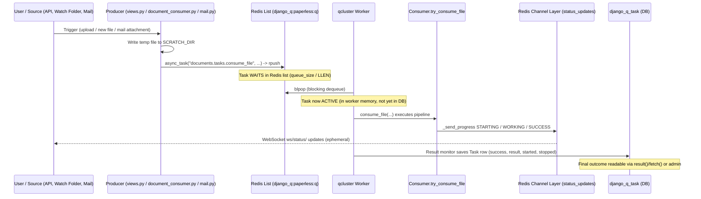

# Background / Asynchronous Processing in paperless-ngx — A Code-Grounded Q&A

> **Scope of this document.** This is a runtime, code-analysis Question-and-Answer document that explains **how paperless-ngx performs background / asynchronous processing during document ingestion**. Every factual claim is grounded in the source code of this repository and carries a `[path:locator]` citation. Facts that derive from the runtime behavior of the (external) task-queue library are explicitly labeled **introspection-verified** and corroborated against the official Django-Q documentation (URLs in §12).
>
> **Repository identity.** Source git branch: `paperless-ngx_542221a38dff`; HEAD commit `542221a38dff06361e07976452f9aea24d210542`. All line numbers below were verified read-only against this revision.
>
> **The single most important conceptual point** (return to it often): the words "task state" denote **two different things** in this system — (a) **ephemeral live progress** broadcast over a WebSocket and **never persisted**, versus (b) **durable task records** written to the `django_q_task` database table after a job completes. Conflating the two is the most common misunderstanding; this document keeps them rigorously separate.

---

## §1. Question Restatement & Scope

This document answers six questions about how background work behaves at runtime, focused specifically on the **document-ingestion** path (uploading/consuming a document and turning it into a searchable record):

- **Q1 — Runtime services.** Which long-running services run behind the scenes when a document is ingested?
- **Q2 — How a job appears.** Once a background job is created, how does it appear in the system (its serialized form and the medium it lands in)?
- **Q3 — Waiting vs. active.** How does the system distinguish work that is *waiting* (pending/queued) from work that is *actively* being processed?
- **Q4 — Where state is stored.** Where does task state ultimately end up being stored?
- **Q5 — After-the-fact outcome.** After the fact, how can one tell what happened to a given job (final status / result)?
- **Q6 — The enqueue/dispatch code.** From a code perspective, *where* are these background jobs triggered, and which code is responsible for sending them into the queue?

**Ingestion-centric scope.** The narrative centers on the `consume_file` task — the unit of work created whenever a document enters the system via the REST upload API, the consumption (watch) folder, or an e-mail attachment. Adjacent background jobs that share the exact same machinery (`bulk_update_documents`, and the scheduled `train_classifier` / `index_optimize` / `sanity_check`) are included where they illuminate the producer side (Q6), but OCR/parser internals, the classifier's ML details, the Whoosh search-index internals, and the Angular frontend are out of scope except where they directly intersect the async ingestion story.

**A note on terminology.** This document uses the system's own vocabulary throughout — `async_task`, `Q_CLUSTER`, `qcluster`, `status_updates`, `consume_file`, and `django_q_task` — so the prose matches the code it explains.

---

## §2. Executive Summary

Direct answers to all six questions (each elaborated, with citations, in the section noted):

- **Q1 (→ §3).** A running paperless-ngx instance is a **multi-process Django application** supervised by Supervisord, which launches three long-running processes: **`gunicorn`** (the ASGI web server serving both the REST API and WebSockets) `[docker/supervisord.conf:L10-L11]`, **`document_consumer`** (the filesystem watch-folder producer) `[docker/supervisord.conf:L19-L20]`, and **`qcluster`** (the Django-Q worker cluster — the async engine that actually executes jobs) `[docker/supervisord.conf:L28-L29]`. A **Redis** server is the shared infrastructure, playing two distinct roles (broker + WebSocket channel layer) `[src/paperless/settings.py:L456,L182]`.
- **Q2 (→ §5).** A job is created by calling `async_task("documents.tasks.consume_file", …)` `[src/documents/views.py:L523-L533]`. Django-Q packs the call into a **signed, pickled task package** (a dict with a UUID `id`, `name`, `func` dotted-path, `args`, `kwargs`, `started` timestamp) and the broker `RPUSH`es that opaque package onto a single **Redis list named `django_q:paperless:q`** (introspection-verified; see §5).
- **Q3 (→ §6).** A **waiting** task is simply an element still sitting in the Redis list `django_q:paperless:q`, counted by `queue_size()` → Redis `LLEN`, which per the docs "does not count tasks currently being processed." An **active** task has already been removed from that list by a worker via a blocking `BLPOP`; it now lives in cluster memory and is **not yet written to the database** (introspection-verified; corroborated by the Django-Q docs — see §6).
- **Q4 (→ §7).** When a job finishes, the Django-Q **result monitor** persists it as a row in the Django ORM `Task` model → the database table **`django_q_task`** `[introspection-verified]`. `Success` and `Failure` are **proxy models** over the same table filtered by the `success` boolean. The ORM-broker queue model `OrmQ` is **inert** here because paperless uses the Redis broker. The live progress payload is **ephemeral** — it lives only transiently in the Redis channel layer and is **never persisted** `[src/documents/consumer.py:L56-L76]`.
- **Q5 (→ §8).** After the fact, a job's outcome is read via Django-Q's `result(task_id)`, `fetch(task_id)`, and `fetch_group(group_id)` APIs, by inspecting `django_q_task` columns directly (`success`, `result`, `started`, `stopped`, `attempt_count`), or via the Django admin's **Successful tasks** / **Failed tasks** views (the `Success`/`Failure` proxies) `[introspection-verified]`.
- **Q6 (→ §9).** Jobs are dispatched from four producer sites that all import `from django_q.tasks import async_task`: the **upload REST endpoint** `[src/documents/views.py:L523-L533]`, the **directory watcher** `[src/documents/management/commands/document_consumer.py:L86-L91]`, **mail ingestion** (one task per attachment) `[src/paperless_mail/mail.py:L336-L349]`, and **bulk operations** `[src/documents/bulk_edit.py:L18,L31,L47,L63,L87]`. Three more are **scheduled** producers registered by data migrations `[src/documents/migrations/1001_auto_20201109_1636.py:L10-L19, src/documents/migrations/1004_sanity_check_schedule.py:L10-L14]`.

> **Why / How verified (summary).** Each answer above was established by reading the cited source files at the stated locators, then — for facts about the queue mechanics that live inside the external Django-Q library — by introspecting the pinned **Django-Q 1.3.9** package and corroborating with the official Django-Q documentation (§12). The full methodology is in §11.

---

## §3. Runtime Services (Q1)

When paperless-ngx runs (in its canonical Docker deployment), **Supervisord** is the init process and it manages three long-running programs. Although they live in one container, they are **separate OS processes**, which is precisely what makes ingestion asynchronous: the web process that accepts an upload is *not* the process that performs OCR.

### 3.1 The three Supervisord-managed processes

| Service (Supervisord program) | Command | Role in ingestion |
|---|---|---|
| **`gunicorn`** `[docker/supervisord.conf:L10]` | `gunicorn -c /usr/src/paperless/gunicorn.conf.py paperless.asgi:application` `[docker/supervisord.conf:L11]` | The **ASGI web server**. Serves the REST API **and** the WebSocket endpoint (via `paperless.asgi:application`), so it is both a **producer** (the upload endpoint enqueues a job) and the relay for live progress. |
| **`document_consumer`** `[docker/supervisord.conf:L19]` | `python3 manage.py document_consumer` `[docker/supervisord.conf:L20]` | The **filesystem watch-folder** watcher. A pure **producer**: when a new file lands in the consumption directory it enqueues a `consume_file` job. |
| **`qcluster`** `[docker/supervisord.conf:L28]` | `python3 manage.py qcluster` `[docker/supervisord.conf:L29]` | The **Django-Q worker cluster** — the async **engine** that dequeues jobs and executes them. **Note the misleading label:** the Supervisord program is named `[program:scheduler]`, but the command it runs (`qcluster`) is the full worker cluster (workers + pusher + monitor + an internal scheduler), not merely a scheduler. |

> The dotted path `paperless.asgi:application` referenced by the gunicorn command is the ASGI entrypoint that wires HTTP and WebSocket together — see §7.3 for the `ProtocolTypeRouter` definition `[src/paperless/asgi.py:L17-L20]`.

### 3.2 Redis — one server, two distinct roles

A **Redis** server is the shared infrastructure that ties the producers and the worker cluster together. Crucially, paperless-ngx points **two different subsystems at the same Redis endpoint**, and these must not be conflated:

1. **Task-queue broker.** `Q_CLUSTER["redis"]` is set to `os.getenv("PAPERLESS_REDIS", "redis://localhost:6379")` `[src/paperless/settings.py:L456]`. This is where background **jobs** live while waiting and from which workers pull them.
2. **Channels (WebSocket) layer.** `CHANNEL_LAYERS` uses `channels_redis.core.RedisChannelLayer` `[src/paperless/settings.py:L180]` over `hosts: [os.getenv("PAPERLESS_REDIS", "redis://localhost:6379")]` `[src/paperless/settings.py:L182]` (with `capacity` 2000 and `expiry` 15 `[src/paperless/settings.py:L183-L184]`). This carries **live progress messages** to the browser — it is *not* durable task storage.

The default endpoint and worker-tuning knobs are documented for operators in `paperless.conf.example`: `PAPERLESS_REDIS` `[paperless.conf.example:L10]`, `PAPERLESS_TASK_WORKERS` `[paperless.conf.example:L57]`, and `PAPERLESS_THREADS_PER_WORKER` `[paperless.conf.example:L58]`.

> **Why / How verified.** The three processes and their exact commands were read directly from `docker/supervisord.conf` at the cited program/command lines. Redis's dual role is established by the two independent settings blocks (`Q_CLUSTER["redis"]` and `CHANNEL_LAYERS … hosts`) pointing at the **same** `PAPERLESS_REDIS` env var in `src/paperless/settings.py`. The "scheduler-labelled process actually runs the worker cluster" gotcha is taken verbatim from the command string at `[docker/supervisord.conf:L29]`.

---

## §4. Task-Queue Technology — Django-Q (not Celery)

The async engine is **Django-Q**, backed by a **Redis broker** — **not Celery**. This matters because Celery is the reflexive assumption for Django background processing, and getting it wrong would invalidate every downstream answer. The evidence is threefold:

1. **Declared dependency.** `Pipfile` pins `django-q = "~=1.3"` `[Pipfile:L17]`, alongside `redis = "*"` `[Pipfile:L34]`, `channels = "~=3.0"` `[Pipfile:L46]`, and `channels-redis = "*"` `[Pipfile:L47]`. (Citation note: `whoosh="~=2.7.4"` is at `[Pipfile:L39]`; `redis` is at `[Pipfile:L34]`.) The lockfile pins the **exact running versions**: `django-q==1.3.9`, `redis==3.5.3`, `channels==3.0.4`, `channels-redis==3.4.0`, `daphne==3.0.2`, `asgiref==3.5.0`, `aioredis==1.3.1`, `hiredis==2.0.0`, on `django==4.0.4` `[Pipfile.lock]`.
2. **Configuration.** The cluster is configured by a `Q_CLUSTER` dict — Django-Q's settings key — in `src/paperless/settings.py:L449-L457` (detailed in §4.1). There is **no** Celery application module (`celery.py`), no `CELERY_*` settings, and no `@shared_task`/`@app.task` decorators anywhere.
3. **Absence of Celery (negative evidence).** `grep -ri celery src/ --include=*.py` returns **zero matches**. Every background call site instead imports `from django_q.tasks import async_task` (see §9).

The runtime base image is `python:3.9-slim-bullseye` `[Dockerfile:L18]`, so all version-specific statements below are grounded in **Python 3.9 / Django 4.0.4 / Django-Q 1.3.9**.

### 4.1 The `Q_CLUSTER` configuration

```python
# src/paperless/settings.py:L449-L457
Q_CLUSTER = {
    "name": "paperless",                # L450  -> broker queue prefix (see §5)
    "catch_up": False,                  # L451  -> don't run missed scheduled tasks on startup
    "recycle": 1,                       # L452  -> worker recycled after 1 task (bounds memory)
    "retry": PAPERLESS_WORKER_RETRY,    # L453  -> 1810s by default
    "timeout": PAPERLESS_WORKER_TIMEOUT,# L454  -> 1800s by default
    "workers": TASK_WORKERS,            # L455
    "redis": os.getenv("PAPERLESS_REDIS", "redis://localhost:6379"),  # L456
}
```

Key parameters and their evidence:

- **`name="paperless"`** `[src/paperless/settings.py:L450]` — this becomes the broker's queue **prefix**, yielding the Redis list key `django_q:paperless:q` (see §5; introspection-verified).
- **`timeout=PAPERLESS_WORKER_TIMEOUT`** `[src/paperless/settings.py:L454]`, where `PAPERLESS_WORKER_TIMEOUT` defaults to **1800** seconds `[src/paperless/settings.py:L440]`.
- **`retry=PAPERLESS_WORKER_RETRY`** `[src/paperless/settings.py:L453]`, where `PAPERLESS_WORKER_RETRY = PAPERLESS_WORKER_TIMEOUT + 10` = **1810** seconds `[src/paperless/settings.py:L444-L447]`. The in-code comment notes that, per the Django-Q docs, the timeout must be smaller than the retry `[src/paperless/settings.py:L442]` — important for long-running OCR jobs (see the edge cases in §7.4).
- **`recycle=1`** `[src/paperless/settings.py:L452]` — each worker is recycled after a single task, bounding memory growth from heavy OCR work.
- **`catch_up=False`** `[src/paperless/settings.py:L451]` — missed scheduled runs are not "caught up" after downtime.

> **Why / How verified.** The engine identity rests on the `Pipfile`/`Pipfile.lock` pins, the presence of the `Q_CLUSTER` settings key, and the zero-match Celery grep — all direct, reproducible repository facts. Version grounding comes from the `Dockerfile` base image and the lockfile pins. The `name → queue prefix` linkage is confirmed in §5 by library introspection.

---

## §5. How a Job Appears Once Created (Q2)

A background job is born when a producer calls `async_task(...)`. The canonical ingestion example is the upload endpoint:

```python
# src/documents/views.py:L523-L533
async_task(
    "documents.tasks.consume_file",          # L524  func, by dotted path
    temp_filename,                            # L525  positional arg
    override_filename=doc_name,               # L526
    override_title=title,                     # L527
    override_correspondent_id=correspondent_id,  # L528
    override_document_type_id=document_type_id,   # L529
    override_tag_ids=tag_ids,                 # L530
    task_id=task_id,                          # L531
    task_name=os.path.basename(doc_name)[:100],   # L532
)
```

Two observations frame everything about "how a job appears":

1. **The callable is referenced by a dotted-path string**, `"documents.tasks.consume_file"` `[src/documents/views.py:L524]`, not by a function object. Django-Q resolves this string to the actual callable **later, inside the worker** at execution time. The target function is defined at `[src/documents/tasks.py:L184]`.
2. **The HTTP request returns immediately after enqueue.** The view responds `return Response("OK")` `[src/documents/views.py:L535]` right after the `async_task(...)` call — it does **not** wait for OCR/processing. That deferral is the essence of "asynchronous": the heavy work happens later, in the `qcluster` worker.

### 5.1 The signed task package (introspection-verified)

Inside `async_task()` (Django-Q `django_q/tasks.py`), the call is converted into a **task package** — a Python `dict` — and then handed to the broker. Introspecting the pinned **Django-Q 1.3.9** library shows the package is built with these fields:

- **`id`** — a UUID (the hex form produced by `django_q.humanhash.uuid()`), used as the task's primary key;
- **`name`** — the human-readable task name (here the `task_name` we passed);
- **`func`** — the dotted-path string `"documents.tasks.consume_file"`;
- **`args`** / **`kwargs`** — the positional and keyword arguments;
- **`started`** — a `timezone.now()` timestamp set at enqueue time;
- plus options such as `hook`, `group`, `save`, `sync`, `cached`, `ack_failure`, `broker`, and `timeout`.

The package is then serialized by `SignedPackage.dumps(task)` — which is **`pickle`-based**, using `pickle.HIGHEST_PROTOCOL` (with optional compression) and an HMAC signature derived from Django's `SECRET_KEY` `[introspection-verified: django-q 1.3.9 django_q/signing.py]`. Finally `async_task()` **returns the task `id` immediately** — it never blocks on execution `[introspection-verified: django-q 1.3.9 django_q/tasks.py]`. The official docs confirm the contract that, for these tasks to actually run, a worker cluster must be running via `python manage.py qcluster` (or `sync=True` for tests).

### 5.2 Where the package lands: `RPUSH` onto `django_q:paperless:q`

The broker's `enqueue()` places the signed package onto a **single Redis list**:

- For the Redis broker, `enqueue(task)` performs `self.connection.rpush(self.list_key, task)` `[introspection-verified: django-q 1.3.9 django_q/brokers/redis_broker.py]`.
- The list key is derived from the cluster name: the broker constructs `list_key = f"django_q:{Conf.PREFIX}:q"`, and `Conf.PREFIX = conf.get("name", "default")`. Because `Q_CLUSTER["name"] == "paperless"` `[src/paperless/settings.py:L450]`, the **queue list key is `django_q:paperless:q`** `[introspection-verified; confirmed via Django introspection of the pinned library]`.

The official Django-Q **brokers** documentation corroborates the broker contract — `enqueue()` "Sends a task package to the broker queue" and `dequeue()` "Gets packages from the broker."

So, to directly answer Q2: **a newly created job appears as one opaque, signed, pickled element appended (`RPUSH`) to the tail of the Redis list `django_q:paperless:q`.** It carries a UUID id, the dotted-path func name, and its args/kwargs, and it remains there until a worker removes it.

> **Why / How verified.** The call site, dotted-path func, and immediate `Response("OK")` are read directly from `src/documents/views.py`. The package shape, `pickle`/`HIGHEST_PROTOCOL` signing, the `RPUSH` enqueue, and the `django_q:paperless:q` key are **introspection-verified** against the pinned Django-Q 1.3.9 source in the project's (gitignored) virtualenv — no library was installed into the repo, and no repository file was modified. These runtime facts are corroborated by the official Django-Q brokers/tasks docs (§12).

---

## §6. Waiting vs. Actively-Processed Work (Q3)

The distinction between *waiting* and *active* work is **not** a column or a status flag — it is a question of **physical location**:

- **WAITING (pending / queued).** A waiting task is still an element of the Redis list `django_q:paperless:q`. It has been `RPUSH`-ed by a producer but not yet picked up. Its count is exactly the Redis `LLEN` of that list, exposed by the broker as `queue_size()` → `self.connection.llen(self.list_key)` `[introspection-verified: django-q 1.3.9 django_q/brokers/redis_broker.py]`. The official Django-Q **tasks** docs state this explicitly: `queue_size()` "Returns the size of the broker queue" and "Note that this does not count tasks currently being processed." That single sentence is the crux of Q3 — **`queue_size()` counts only the waiting tasks.**

- **ACTIVE (in-flight / being processed).** When the cluster's **pusher** process is ready for work, it removes the head of the list via a **blocking pop**: `dequeue()` performs `self.connection.blpop(self.list_key, 1)` `[introspection-verified: django-q 1.3.9 django_q/brokers/redis_broker.py]`. At that instant the task **leaves the Redis list** (so `LLEN`/`queue_size()` no longer counts it), the pusher verifies its signature and unpacks it onto the cluster's **internal in-memory Task Queue**, and a **worker** pulls it from there and executes it. While active, the task lives **only in the worker process's memory** — it is **not yet a row in any database table**.

The official Django-Q **architecture** docs corroborate this pipeline: the pusher "continuously checks the broker for new task packages," "checks the signing and unpacks the task to the internal Task Queue," and a worker "pulls a task of the Task Queue," sets a countdown timer with the Sentinel, and executes it.

### 6.1 A concrete way to observe the distinction

Because waiting tasks are literally Redis list elements, an operator can observe the distinction directly:

- `redis-cli LLEN django_q:paperless:q` — the number of **waiting** tasks (equivalently, Django-Q's `queue_size()`).
- A task that no longer appears in that count but has **not yet** produced a `django_q_task` row (see §7) is **active** — it has been `BLPOP`-ed into a worker and is executing.

This three-place lifecycle — **Redis list (waiting) → worker memory (active) → `django_q_task` row (done)** — is the spine of the whole system and recurs in §7, §8, and the §10 walkthrough.

> **Why / How verified.** The `LLEN`/`BLPOP` semantics and the `queue_size()` definition were **introspection-verified** in the pinned Django-Q 1.3.9 Redis broker source. The "does not count tasks currently being processed" wording, and the pusher→Task Queue→worker pipeline, are corroborated verbatim from the official Django-Q tasks and architecture docs (§12). The cluster's pusher/worker/monitor/sentinel process roles were additionally confirmed by reading the library's `django_q/cluster.py`.

---

## §7. Where Task State Is Ultimately Stored (Q4)

This is where the **ephemeral vs. durable** distinction becomes concrete. "Task state" lives in (at most) three places over a job's life, but only **one** is the durable answer to "where does it ultimately end up."

### 7.1 Durable storage — the `django_q_task` database table

When a job finishes (success **or** failure), the cluster's **result monitor** writes it to the Django ORM `Task` model, which maps to the database table **`django_q_task`** `[introspection-verified: django-q 1.3.9 django_q/models.py; table name confirmed via Django _meta introspection]`. The official architecture docs corroborate that the result monitor "saves both failed and successful packages to the Django database or cache backend." Persisting happens via `save_task()` → `Task.objects.create(...)` in the library's `django_q/cluster.py` `[introspection-verified]`.

The persisted columns (from the `Task` model) include:

| Column | Type | Meaning |
|---|---|---|
| `id` | CharField(32), PK | The task UUID returned by `async_task()` |
| `name` | CharField | Human-readable task name |
| `func` | CharField | The dotted-path func, e.g. `documents.tasks.consume_file` |
| `args` / `kwargs` | PickledObjectField | The call arguments |
| `result` | PickledObjectField (nullable) | The return value — **or the error**, if the task failed |
| `group` | CharField (nullable) | Optional group label |
| `started` / `stopped` | DateTimeField | Execution start/end timestamps |
| `success` | BooleanField (default `True`) | Whether the task succeeded |
| `attempt_count` | IntegerField | Number of attempts (retries) |

The model also exposes `time_taken()` = `(stopped − started).total_seconds()` `[introspection-verified: django-q 1.3.9 django_q/models.py]`; the docs note that this "includes any time it may have waited in the queue."

### 7.2 `Success` / `Failure` proxies, and the inert `OrmQ`

- **`Success` and `Failure` are proxy models** over the *same* `django_q_task` table — there is no separate storage. `Success` is filtered to `success=True` and `Failure` to `success=False` by their managers `[introspection-verified: django-q 1.3.9 django_q/models.py; both proxies confirmed to resolve to db_table `django_q_task` via Django introspection]`. These back the Django admin's "Successful tasks" and "Failed tasks" views (see §8).
- **`OrmQ` (the "Queued Tasks" admin model) is NOT used here.** `OrmQ` maps to table `django_q_ormq` and is the **ORM broker's** queue `[introspection-verified]`. The official configuration/admin docs note the "Queued Tasks" view is only enabled when using the Django ORM broker. **paperless-ngx uses the Redis broker** `[src/paperless/settings.py:L456]`, so **waiting tasks live in the Redis list `django_q:paperless:q`, not in any database table.** Stating this explicitly avoids a common confusion: there is no DB table of "pending" paperless tasks.
- **`Schedule` (table `django_q_schedule`)** backs the scheduled producers described in §9.2 `[introspection-verified]`.

### 7.3 Ephemeral "state" — live progress in the Redis channel layer (never persisted)

Separately from the durable record, the ingestion pipeline emits **real-time progress** that is **never written to the database**. `Consumer._send_progress(...)` `[src/documents/consumer.py:L56]` builds a payload dict `[src/documents/consumer.py:L64-L72]` with keys `filename` `[L65]`, `task_id` `[L66]`, `current_progress` `[L67]`, `max_progress` `[L68]`, `status` `[L69]`, `message` `[L70]`, and `document_id` `[L71]`, then broadcasts it to the channel group `status_updates`:

```python
# src/documents/consumer.py:L73-L76
async_to_sync(self.channel_layer.group_send)(
    "status_updates",
    {"type": "status_update", "data": payload},
)
```

This payload travels over the **Channels Redis layer** (§3.2) to connected browsers (§7.5) and then evaporates. The real-time **status vocabulary** is a set of UI states distinct from Django-Q's persisted `success` boolean:

| Status (UI) | Progress | Pipeline stage | Locator |
|---|---|---|---|
| `STARTING` | 0% | new file received | `[src/documents/consumer.py:L202]` |
| `WORKING` | (OCR callback) | OCR progress updates | `[src/documents/consumer.py:L240]` |
| `WORKING` | 20% | parsing document | `[src/documents/consumer.py:L259]` |
| `WORKING` | 70% | generating thumbnail | `[src/documents/consumer.py:L264]` |
| `WORKING` | 90% | parsing date | `[src/documents/consumer.py:L274]` |
| `WORKING` | 95% | saving document | `[src/documents/consumer.py:L294]` |
| `SUCCESS` | 100% | finished (includes `document.id`) | `[src/documents/consumer.py:L375]` |
| `FAILED` | 100% | failure, via `_fail()` | `[src/documents/consumer.py:L78-L81]` |

> **Critical distinction.** The `{filename, task_id, current_progress, max_progress, status, message, document_id}` payload is **ephemeral** — it exists only to drive the live UI and is never stored. It is **not** the same as the durable `django_q_task` row written by the result monitor after completion. Likewise, the UI status strings `SUCCESS`/`FAILED` (from `_send_progress`) are **not** the same as the persisted `success` boolean column on `django_q_task`.

### 7.4 Edge cases that shape what gets stored

- **Duplicate detection (MD5) & validation.** These checks run inside `consume_file` → `Consumer.try_consume_file` `[src/documents/tasks.py:L236]`. On a duplicate or validation failure, the pipeline calls `_fail(...)`, which emits a real-time `FAILED` status and raises `ConsumerError` `[src/documents/consumer.py:L78-L81]`. The Django-Q result monitor then records the task with **`success=False`** and the **error captured in the `result` column** `[introspection-verified; corroborated by the docs: the result field "Contains the error if any occur."]`.
- **Long-running OCR jobs** are governed by `timeout` (default **1800s**) and `retry` (**1810s**) `[src/paperless/settings.py:L440,L444-L447,L453-L454]`.
- **Redis broker has no delivery receipts.** The architecture docs note a receipt is sent only "If the broker supports it." The Redis broker does not, so on a catastrophic worker/cluster crash or a hard timeout, an **in-flight** task can be **lost without producing any `django_q_task` row** — which is distinct from a *failed* task (a failure still yields a `success=False` record).

### 7.5 So, where does it "ultimately" end up?

**Durably: in the `django_q_task` table** (one row per completed job, success or failure). Transiently: in the Redis **list** while waiting (Q3), in **worker memory** while active (Q3), and in the Redis **channel layer** for live progress (never persisted). The single durable answer to Q4 is **`django_q_task`**.

> **Why / How verified.** The `_send_progress` payload, the `status_updates` group send, the status vocabulary, and the `_fail` path are read directly from `src/documents/consumer.py`. The `django_q_task` table name, the `Task` columns, the `Success`/`Failure` proxies, the inert `OrmQ`, and `Schedule` are **introspection-verified** against Django-Q 1.3.9 (model source + Django `_meta.db_table` introspection) and corroborated by the official models/admin/architecture docs (§12).

---

## §8. Reading Outcomes After the Fact (Q5)

Once a job has finished, its outcome is durable (§7.1) and can be inspected in three complementary ways.

### 8.1 Django-Q programmatic APIs (introspection-verified)

From `django_q.tasks`:

- **`result(task_id, wait=0, cached=…)`** — returns the task's **return value** (the `result` column). Returns `None` if the task has not been executed yet.
- **`fetch(task_id, wait=0, cached=…)`** — returns the **full `Task` object**, so you can read `success`, `result`, `started`, `stopped`, `time_taken()`, `attempt_count`, etc.
- **`fetch_group(group_id, …)`** — returns a **queryset of `Task`s** sharing a group label.

These are the documented public APIs; the official Django-Q **tasks** docs corroborate their behavior (e.g., the `result` "Contains the error if any occur," and `time_taken` "includes any time it may have waited in the queue"). For testing, `async_task(..., sync=True)` injects the task straight into a worker so the result is available immediately via `fetch()` — useful context for how paperless's own tests exercise tasks.

### 8.2 Direct database inspection of `django_q_task`

Because the outcome is a row in `django_q_task` (§7.1), one can query it directly. The most useful columns for "what happened to this job":

- **`success`** — did it succeed? (`True`/`False`)
- **`result`** — the return value, or the **error text** if it failed.
- **`started` / `stopped`** — timing; `time_taken()` = `(stopped − started).total_seconds()`, which includes queue wait.
- **`attempt_count`** — how many attempts (retries) were made.

`[introspection-verified: django-q 1.3.9 django_q/models.py]`

### 8.3 Django admin views

Django-Q registers admin views backed by the proxy models from §7.2:

- **Successful tasks** — the `Success` proxy (`success=True`).
- **Failed tasks** — the `Failure` proxy (`success=False`).
- **Scheduled tasks** — the `Schedule` model (the producers in §9.2).
- (**"Queued Tasks" / `OrmQ` does *not* appear** in a Redis-broker deployment — see §7.2.)

`[introspection-verified; corroborated by the official Django-Q admin docs (§12)]`

> **Why / How verified.** The `result`/`fetch`/`fetch_group` signatures and the `Task` columns are **introspection-verified** against the pinned Django-Q 1.3.9 (`django_q/tasks.py`, `django_q/models.py`) and corroborated by the official tasks/admin docs (§12). The "Failed tasks vs. Successful tasks" admin split follows directly from the `Success`/`Failure` proxy managers (§7.2).

---

## §9. Where Jobs Are Triggered — the Enqueue Code (Q6)

Every background job in paperless-ngx is dispatched through Django-Q's `async_task(...)`, referencing the task function by **dotted-path string**. There are **four event-driven producer sites** and **three scheduled producers**. All event-driven sites `import from django_q.tasks import async_task`.

### 9.1 Event-driven producers (`async_task`)

| Trigger source | File | Locator | Task dispatched |
|---|---|---|---|
| **Upload REST API** (one task per upload; returns `Response("OK")` immediately) | `src/documents/views.py` | import `[L28]`; temp file `[L512-L519]`; `task_id` `[L521]`; `async_task` `[L523-L533]`; response `[L535]` | `documents.tasks.consume_file` |
| **Directory watcher** (one task per detected file) | `src/documents/management/commands/document_consumer.py` | import `[L13]`; `_consume` `[L46]`; log "Adding … to the task queue." `[L85]`; `async_task` `[L86-L91]` | `documents.tasks.consume_file` |
| **Mail ingestion** (**one task per attachment** — the call sits inside the attachment loop) | `src/paperless_mail/mail.py` | import `[L11]`; `async_task` `[L336-L349]` | `documents.tasks.consume_file` |
| **Bulk operations** (five call sites — one per bulk action) | `src/documents/bulk_edit.py` | import `[L4]`; `async_task` `[L18, L31, L47, L63, L87]` | `documents.tasks.bulk_update_documents` |

The dispatched task functions are all defined in `src/documents/tasks.py`: `consume_file` `[src/documents/tasks.py:L184]` (which calls `Consumer().try_consume_file(...)` `[src/documents/tasks.py:L236]`), and `bulk_update_documents` `[src/documents/tasks.py:L270]`. The standard ingestion pattern, visible in all three `consume_file` producers, is: **write the incoming bytes to a temp file under `SCRATCH_DIR`, then `async_task("documents.tasks.consume_file", <temp path>, …)`** — e.g., the upload endpoint writes via `tempfile.NamedTemporaryFile(prefix="paperless-upload-", dir=settings.SCRATCH_DIR, delete=False)` `[src/documents/views.py:L512-L519]` before enqueuing.

### 9.2 Scheduled producers (`schedule` + `Schedule`)

Three recurring jobs are registered once, via **data migrations** that import `from django_q.tasks import schedule` and `from django_q.models import Schedule`:

| Scheduled task | Cadence | File | Locator |
|---|---|---|---|
| `documents.tasks.train_classifier` | **HOURLY** | `src/documents/migrations/1001_auto_20201109_1636.py` | `[L10-L14]` |
| `documents.tasks.index_optimize` | **DAILY** | `src/documents/migrations/1001_auto_20201109_1636.py` | `[L15-L19]` |
| `documents.tasks.sanity_check` | **WEEKLY** | `src/documents/migrations/1004_sanity_check_schedule.py` | `[L10-L14]` |

These rows persist in the `django_q_schedule` table (§7.2), and the `qcluster` process's internal scheduler enqueues them onto `django_q:paperless:q` when due (the docs note the scheduler checks for due tasks twice a minute). Both migrations depend on `("django_q", "0013_task_attempt_count")` `[src/documents/migrations/1001_auto_20201109_1636.py:L31, src/documents/migrations/1004_sanity_check_schedule.py:L25]`, i.e. they require Django-Q's own tables to exist first. The corresponding task functions are defined at `train_classifier` `[src/documents/tasks.py:L48]`, `index_optimize` `[src/documents/tasks.py:L32]`, and `sanity_check` `[src/documents/tasks.py:L255]`.

> **The library function responsible for the enqueue** is Django-Q's `async_task()` (`django_q/tasks.py`), which builds the signed package and calls the broker's `enqueue()` → Redis `RPUSH` (§5). The repository code never touches Redis directly; it only calls `async_task(...)`.

> **Why / How verified.** Every producer call site, its import, and its dispatched dotted-path func were read directly at the cited locators. The "one task per attachment" claim is confirmed by the `async_task` call sitting inside the per-attachment loop in `src/paperless_mail/mail.py`. The scheduled producers were read from the two data migrations, and their cadence constants (`Schedule.HOURLY/DAILY/WEEKLY`) are taken verbatim from those files.

---

## §10. End-to-End Ingestion Walkthrough

This section ties all six answers together for the canonical case: a user **uploads** a document through the REST API. (The watch-folder and mail paths are identical from the `async_task` call onward; only the producer differs.)

1. **Trigger & temp file (producer).** The upload endpoint receives the bytes and writes them to a temporary file under `SCRATCH_DIR` via `tempfile.NamedTemporaryFile(prefix="paperless-upload-", …)` `[src/documents/views.py:L512-L519]`, and generates a `task_id` `[src/documents/views.py:L521]`.
2. **Enqueue (Q2, Q6).** It calls `async_task("documents.tasks.consume_file", temp_filename, …, task_id=task_id, …)` `[src/documents/views.py:L523-L533]`. Django-Q builds a signed, pickled package and the broker `RPUSH`es it onto the Redis list `django_q:paperless:q` (§5, introspection-verified). The endpoint then **returns `Response("OK")` immediately** `[src/documents/views.py:L535]` — the HTTP request is done; no OCR has happened yet.
3. **Waiting (Q3).** The package sits in `django_q:paperless:q`, counted by `queue_size()`/`LLEN` (§6).
4. **Dequeue → active (Q3).** The `qcluster` pusher `BLPOP`s the package off the list (§6); it leaves the Redis list and is unpacked into the cluster's in-memory Task Queue; a **worker** picks it up and runs it — now **active**, in memory, not yet in the database.
5. **Execution (pipeline).** The worker resolves the dotted path and runs `consume_file` `[src/documents/tasks.py:L184]`, which calls `Consumer().try_consume_file(...)` `[src/documents/tasks.py:L236]`. Throughout, the consumer emits **ephemeral progress** via `_send_progress(...)` `[src/documents/consumer.py:L56]` to the `status_updates` channel group `[src/documents/consumer.py:L73-L76]` — `STARTING` → `WORKING` (20/70/90/95% + OCR callbacks) → `SUCCESS` (100%, with `document.id`) (§7.3).
6. **Live delivery (WebSocket).** Those payloads fan out to authenticated browsers over `ws/status/` (see §10.1) — and are then discarded (never persisted).
7. **Persistence (Q4, Q5).** When the worker finishes, the result is pushed onto the cluster's Result Queue and the **result monitor saves a row** to `django_q_task` (`success`, `result`, `started`, `stopped`, `attempt_count`) `[introspection-verified]`. From then on the outcome is readable via `result()`/`fetch()` or the Django admin (§8).



### 10.1 The WebSocket relay (live progress delivery) and its security boundary

The live-progress payloads reach the browser through Channels:

- **ASGI wiring.** `paperless.asgi:application` is a `ProtocolTypeRouter` `[src/paperless/asgi.py:L17]` routing `"http"` to `get_asgi_application()` `[src/paperless/asgi.py:L19]` and `"websocket"` to `AuthMiddlewareStack(URLRouter(websocket_urlpatterns))` `[src/paperless/asgi.py:L20]`.
- **URL.** `websocket_urlpatterns` `[src/paperless/urls.py:L136]` maps `re_path(r"ws/status/$", StatusConsumer.as_asgi())` `[src/paperless/urls.py:L137]`.
- **Consumer.** `StatusConsumer(WebsocketConsumer)` `[src/paperless/consumers.py:L9]` joins the `status_updates` group on connect via `group_add("status_updates", self.channel_name)` `[src/paperless/consumers.py:L17-L20]` and relays each event to the client with `self.send(json.dumps(event["data"]))` `[src/paperless/consumers.py:L33]`.

> **Security note.** `StatusConsumer.connect()` rejects unauthenticated clients: if `_authenticated()` `[src/paperless/consumers.py:L10-L11]` is false it raises `DenyConnection()` `[src/paperless/consumers.py:L15]`; even the `status_update` handler re-checks and closes the socket for unauthenticated sessions `[src/paperless/consumers.py:L30-L31]`. So **live progress is visible only to authenticated sessions** — but note this concerns the *ephemeral* channel, not the durable `django_q_task` record.

> **Why / How verified.** The walkthrough sequences the exact call sites cited in §5–§9. The ASGI/URL/consumer wiring and the authentication guard were read directly from `src/paperless/asgi.py`, `src/paperless/urls.py`, and `src/paperless/consumers.py`. The Mermaid diagram is embedded verbatim and uses valid `sequenceDiagram` syntax.

---

## §11. Methodology & Rationale

The governing rule for this document is: **base every answer on the code as the truth, make no assumptions, and provide the reasoning.** Accordingly, claims were established at three escalating levels of evidence:

1. **Direct source reading (primary).** Every in-repo claim was read at a specific `[path:locator]` against the source branch `paperless-ngx_542221a38dff` (HEAD `542221a38dff…`). The repository working tree was clean throughout, so the on-disk lines equal the committed source.
2. **Library introspection (for runtime-only facts).** Facts that live inside the external Django-Q library — the Redis list key `django_q:paperless:q`, the `RPUSH`/`BLPOP`/`LLEN` broker semantics, the signed-pickle task package shape, and the `Task`/`Success`/`Failure`/`OrmQ`/`Schedule` model-to-table mapping — were **introspection-verified** against the pinned **Django-Q 1.3.9** package already present in the project's **gitignored** virtualenv, plus a Django `_meta.db_table` check to confirm table names and proxy relationships. **No library was installed into the repository, no repository file was modified, and any temporary scratch file used for introspection was created outside the repository and deleted afterward**, so `git status --porcelain` remains empty.
3. **Official documentation (corroboration).** Each introspection-verified fact is cross-checked against the official Django-Q docs (§12). These docs are published for version **1.3.6** — the closest published doc set to the pinned **1.3.9** — and they corroborate the terminology used here (`queue_size()` "does not count tasks currently being processed"; the pusher → Task Queue → worker → Result Queue → monitor pipeline; the result monitor saving both successful and failed packages; `time_taken` including queue wait).

**Version-grounding caveat.** The upstream Django-Q docs advertise Python 3.7/3.8 and Django 2.2/3.1, whereas paperless-ngx runs **Django-Q 1.3.9 on Django 4.0.4 / Python 3.9** `[Dockerfile:L18, Pipfile.lock]`. Where versions could matter, the statements above are grounded in the **pinned** stack, and the docs are used only to corroborate behavior and terminology — never to override what the pinned library actually does.

**Why an investigate-first approach.** Because the only deliverable is this document, "implementation" was an investigate-then-author workflow: collect and cite evidence first, then state each conclusion, then attach the reasoning ("Why / How verified" in each of §3–§9 plus this section). This satisfies both the "code as truth" and the "provide thinking/rationale" mandates.

---

## §12. References

### 12.1 In-repository file:locator references

- `src/documents/views.py` — import `async_task` `[L28]`; temp file `[L512-L519]`; `task_id` `[L521]`; `async_task(consume_file)` `[L523-L533]`; `Response("OK")` `[L535]`
- `src/documents/management/commands/document_consumer.py` — import `[L13]`; `_consume` `[L46]`; log `[L85]`; `async_task(consume_file)` `[L86-L91]`
- `src/paperless_mail/mail.py` — import `[L11]`; `async_task(consume_file)` per attachment `[L336-L349]`
- `src/documents/bulk_edit.py` — import `[L4]`; `async_task(bulk_update_documents)` `[L18, L31, L47, L63, L87]`
- `src/documents/tasks.py` — `async_to_sync` `[L8]`; `get_channel_layer` `[L9]`; `Consumer` `[L16]`; `ConsumerError` `[L17]`; `index_optimize` `[L32]`; `index_reindex` `[L38]`; `train_classifier` `[L48]`; `save_to_dir` `[L164]`; `consume_file` `[L184]`; `try_consume_file` call `[L236]`; `sanity_check` `[L255]`; `bulk_update_documents` `[L270]`
- `src/documents/consumer.py` — `_send_progress` `[L56-L76]`; payload keys `[L64-L72]`; group send `[L73-L76]`; `_fail` `[L78-L81]`; status emissions `[L202, L240, L259, L264, L274, L294, L375]`
- `src/paperless/consumers.py` — `StatusConsumer` `[L9]`; `_authenticated` `[L10-L11]`; `connect`/`DenyConnection` `[L13-L21]`; `disconnect` `[L23-L27]`; `status_update`/`send` `[L29-L33]`
- `src/paperless/asgi.py` — `ProtocolTypeRouter` `[L17-L20]`
- `src/paperless/urls.py` — `websocket_urlpatterns` `[L136]`; `ws/status/` route `[L137]`
- `src/paperless/settings.py` — `CHANNEL_LAYERS` `[L178-L184]`; worker timeout `[L440]`; worker retry `[L444-L447]`; `Q_CLUSTER` `[L449-L457]` (`name` `[L450]`, `catch_up` `[L451]`, `recycle` `[L452]`, `retry` `[L453]`, `timeout` `[L454]`, `workers` `[L455]`, `redis` `[L456]`)
- `src/documents/migrations/1001_auto_20201109_1636.py` — `train_classifier` HOURLY `[L10-L14]`; `index_optimize` DAILY `[L15-L19]`; django_q dependency `[L31]`
- `src/documents/migrations/1004_sanity_check_schedule.py` — `sanity_check` WEEKLY `[L10-L14]`; django_q dependency `[L25]`
- `docker/supervisord.conf` — `gunicorn` `[L10-L11]`; `consumer` `[L19-L20]`; `scheduler`/`qcluster` `[L28-L29]`
- `Pipfile` — `django` `[L13]`; `django-q` `[L17]`; `redis` `[L34]`; `whoosh` `[L39]`; `channels` `[L46]`; `channels-redis` `[L47]`
- `Pipfile.lock` — pinned versions (`django-q==1.3.9`, `redis==3.5.3`, `channels==3.0.4`, `channels-redis==3.4.0`, `django==4.0.4`, …)
- `paperless.conf.example` — `PAPERLESS_REDIS` `[L10]`; `PAPERLESS_TASK_WORKERS` `[L57]`; `PAPERLESS_THREADS_PER_WORKER` `[L58]`
- `Dockerfile` — base image `python:3.9-slim-bullseye` `[L18]`

### 12.2 External library (introspection-verified, not in repo)

- **Django-Q 1.3.9** — `django_q/tasks.py` (`async_task`, `result`, `fetch`, `fetch_group`, `queue_size`), `django_q/brokers/redis_broker.py` (`enqueue`→`rpush`, `dequeue`→`blpop`, `queue_size`→`llen`, list key `django_q:{name}:q`), `django_q/signing.py` (pickle `HIGHEST_PROTOCOL` + HMAC), `django_q/models.py` (`Task`/`Success`/`Failure`/`OrmQ`/`Schedule`), `django_q/cluster.py` (Sentinel / pusher / worker / monitor / `save_task` → `Task.objects.create`).

### 12.3 Official Django-Q documentation (version 1.3.6 — closest published to the pinned 1.3.9)

- Architecture: <https://django-q.readthedocs.io/en/latest/architecture.html>
- Tasks (`async_task` / `result` / `fetch` / `fetch_group` / `queue_size` / `time_taken`): <https://django-q.readthedocs.io/en/latest/tasks.html>
- Brokers (`enqueue` / `dequeue`): <https://django-q.readthedocs.io/en/latest/brokers.html>
- Configuration (`Q_CLUSTER` options, ORM "Queued Tasks"): <https://django-q.readthedocs.io/en/latest/configure.html>
- Admin (Successful / Failed / Scheduled / Queued task views): <https://django-q.readthedocs.io/en/latest/admin.html>
