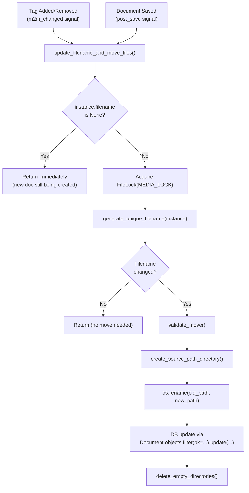
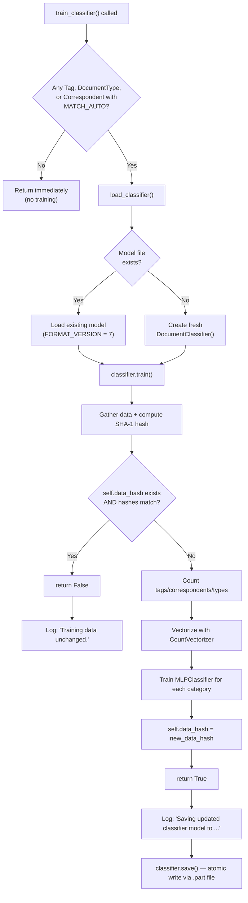
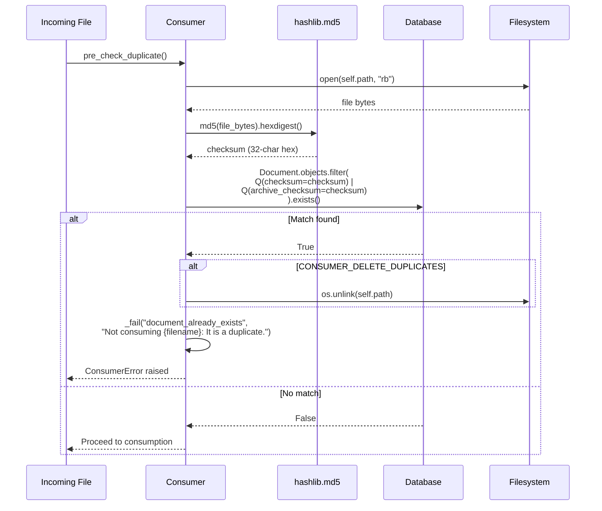
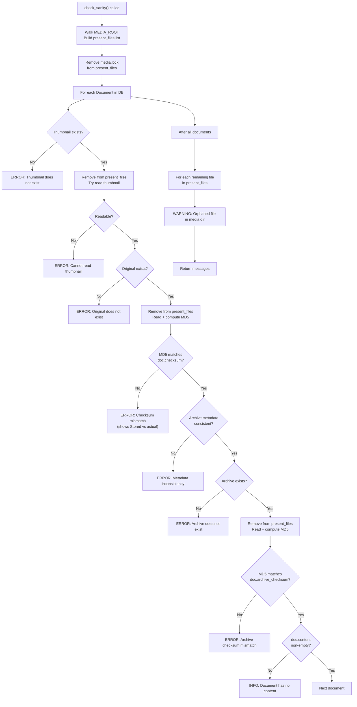

# Paperless-ngx Runtime Behavior Investigation

> **Audience:** Engineers onboarding into the Paperless-ngx codebase  
> **Scope:** Five undocumented runtime behaviors, investigated through source code analysis  
> **Source of Truth:** All claims are grounded in the actual source code. No assumptions.  
> **Version:** Based on the codebase at v1.7.0 (commit state as of the current `main` branch)

---

## How to Read This Document

This document is an investigative guide. It walks through five runtime mysteries in the Paperless-ngx backend, presenting:

- **Code citations** in the format `Source: src/documents/classifier.py:124-161` — these are exact file paths and line numbers you can open in your editor to verify every claim.
- **Mermaid diagrams** embedded as fenced code blocks (` ```mermaid `) — these render natively on GitHub and in Mermaid-compatible viewers.
- **Realistic examples** with concrete file paths, MD5 checksums (32-character hex strings), and SHA-1 digests (20 raw bytes), derived from the actual hash functions in the code.
- **Actual log messages** extracted verbatim from `logger.*()` calls in the source — not paraphrased, not summarized.

**Prerequisites:** Familiarity with Python and Django (signals, ORM, `post_save`, `m2m_changed`). No prior knowledge of Paperless-ngx internals is assumed — that is precisely what this document provides.

---

## Background: Signal Wiring and Cross-Cutting Concerns

Before diving into the five runtime behaviors, two foundational mechanisms must be understood.

### Signal Wiring in `DocumentsConfig.ready()`

When the Django application starts, `DocumentsConfig.ready()` connects six handler functions to the `document_consumption_finished` signal:

```python
# Source: src/documents/apps.py:11-27
def ready(self):
    from .signals import document_consumption_finished
    from .signals.handlers import (
        add_inbox_tags,
        set_log_entry,
        set_correspondent,
        set_document_type,
        set_tags,
        add_to_index,
    )

    document_consumption_finished.connect(add_inbox_tags)
    document_consumption_finished.connect(set_correspondent)
    document_consumption_finished.connect(set_document_type)
    document_consumption_finished.connect(set_tags)
    document_consumption_finished.connect(set_log_entry)
    document_consumption_finished.connect(add_to_index)
```

These handlers run sequentially every time a document finishes being consumed. They assign inbox tags, match correspondents/document types/tags (via rule-based or ML classifier matching), create an admin log entry, and update the search index.

*Source: src/documents/apps.py:11-27*

Three custom signals are defined in the signals package:

```python
# Source: src/documents/signals/__init__.py:1-5
document_consumption_started = Signal()
document_consumption_finished = Signal()
document_consumer_declaration = Signal()
```

*Source: src/documents/signals/__init__.py:1-5*

### The `FileLock` Concurrency Gate

Multiple runtime behaviors (file relocation, document consumption, document deletion) all mutate the filesystem. To prevent concurrent mutations from corrupting file state, they all acquire the same lock:

```python
FileLock(settings.MEDIA_LOCK)
```

Where `MEDIA_LOCK` is defined as:

```python
# Source: src/paperless/settings.py:72
MEDIA_LOCK = os.path.join(MEDIA_ROOT, "media.lock")
```

This means the lock file lives at `<MEDIA_ROOT>/media.lock` (e.g., `/opt/paperless/media/media.lock`). All filesystem mutations are serialized through this single lock — if file relocation is running, document consumption waits, and vice versa.

*Source: src/paperless/settings.py:70-72*

### Key Directory Layout

The following directories are central to the runtime behaviors documented below:

| Setting | Definition | Default Path |
|---|---|---|
| `MEDIA_ROOT` | Root of all media files | `<BASE_DIR>/../media` |
| `ORIGINALS_DIR` | Original uploaded files | `<MEDIA_ROOT>/documents/originals` |
| `ARCHIVE_DIR` | OCR'd/processed archive PDFs | `<MEDIA_ROOT>/documents/archive` |
| `THUMBNAIL_DIR` | Document thumbnail images | `<MEDIA_ROOT>/documents/thumbnails` |
| `DATA_DIR` | Application data directory | `<BASE_DIR>/../data` |
| `MODEL_FILE` | Classifier pickle model | `<DATA_DIR>/classification_model.pickle` |

*Source: src/paperless/settings.py:61-66, 74*

---

## 1. File Relocation Choreography

**The Mystery:** When a document's tags change and `PAPERLESS_FILENAME_FORMAT` includes tag-derived directory components, the system transparently relocates original and archive files on disk. What is the actual sequence of operations? What log messages are emitted? What happens when a move fails partway through?

### 1.1 Signal Trigger Chain

Two Django signal receivers decorate the `update_filename_and_move_files()` function:

```python
# Source: src/documents/signals/handlers.py:310-312
@receiver(models.signals.m2m_changed, sender=Document.tags.through)
@receiver(models.signals.post_save, sender=Document)
def update_filename_and_move_files(sender, instance, **kwargs):
```

- **`m2m_changed`** on `Document.tags.through` — fires whenever tags are added to or removed from a document
- **`post_save`** on `Document` — fires whenever a `Document` model instance is saved

The logger used throughout this handler is:

```python
# Source: src/documents/signals/handlers.py:27
logger = logging.getLogger("paperless.handlers")
```

*Source: src/documents/signals/handlers.py:27, 310-312*

**Thinking:** Why two signals? Because a document's filename can change for two reasons: (1) tag modifications change the `{tags}` or `{tag_list}` component, triggering `m2m_changed`; (2) other field changes (title, correspondent, document type) are saved via `post_save`. Both must trigger filename recalculation.



#### Early-Return Guard

The handler's first check prevents file moves during initial document creation:

```python
# Source: src/documents/signals/handlers.py:314-323
if not instance.filename:
    # Can't update the filename if there is no filename to begin with
    # This happens when the consumer creates a new document.
    # The document is modified and saved multiple times, and only after
    # everything is done (i.e., the generated filename is final),
    # filename will be set to the location where the consumer has put
    # the file.
    #
    # This will in turn cause this logic to move the file where it belongs.
    return
```

**Rationale:** When the consumer creates a new document, it saves the `Document` model multiple times before `filename` is set. Without this guard, the handler would attempt moves on a file that doesn't exist yet.

*Source: src/documents/signals/handlers.py:314-323*

#### FileLock Acquisition

After the guard, the handler acquires the filesystem lock:

```python
# Source: src/documents/signals/handlers.py:325
with FileLock(settings.MEDIA_LOCK):
```

*Source: src/documents/signals/handlers.py:325*

### 1.2 Filename Generation and Path Computation

#### The Configuration Prerequisite

File relocation **only activates** when the environment variable `PAPERLESS_FILENAME_FORMAT` is set. By default, it is `None`:

```python
# Source: src/paperless/settings.py:584
PAPERLESS_FILENAME_FORMAT = os.getenv("PAPERLESS_FILENAME_FORMAT")
```

If unset, `generate_filename()` falls through to the default naming pattern: `{doc.pk:07}{counter_str}{filetype_str}` (e.g., `0000042.pdf`).

*Source: src/paperless/settings.py:584, src/documents/file_handling.py:192-193*

#### `generate_unique_filename()`

This function is the entry point for computing the new filename:

```python
# Source: src/documents/file_handling.py:81-125
def generate_unique_filename(doc, archive_filename=False):
```

Key logic:

- **For originals:** `root = settings.ORIGINALS_DIR` (line 98) → `<MEDIA_ROOT>/documents/originals`
- **For archives:** `root = settings.ARCHIVE_DIR` (line 95) → `<MEDIA_ROOT>/documents/archive`
- **Archive filename mirroring:** If generating an archive filename and the document has an original filename, it first tries the original filename with `.pdf` extension (lines 103-108)
- **Collision avoidance:** If the computed filename already exists on disk, a counter is appended: `_01`, `_02`, etc., via the `generate_filename()` function (lines 110-125)

*Source: src/documents/file_handling.py:81-125*

#### `generate_filename()` — The Format Engine

```python
# Source: src/documents/file_handling.py:128-199
def generate_filename(doc, counter=0, append_gpg=True, archive_filename=False):
```

The function only applies the custom format when `PAPERLESS_FILENAME_FORMAT` is not `None` (line 132). When a format IS set, it:

1. Converts the document's tags to a dictionary via `many_to_dictionary()` using the custom `defaultdictNoStr` class (line 133). The `defaultdictNoStr` raises `ValueError` on direct `{tags}` usage — forcing users to use `{tags[key]}` or `{tag_list}` instead.

2. Builds a sanitized `tag_list` — a comma-separated, sorted list of tag names (lines 135-138)

3. Applies the format string with all available placeholders:

| Placeholder | Value | Source |
|---|---|---|
| `{title}` | Sanitized document title | line 162 |
| `{correspondent}` | Sanitized correspondent name, or `"none"` | lines 140-146 |
| `{document_type}` | Sanitized document type name, or `"none"` | lines 148-154 |
| `{created}` | ISO date of creation | line 165 |
| `{created_year}` | Year of creation | line 166 |
| `{created_month}` | Zero-padded month of creation | line 167 |
| `{created_day}` | Zero-padded day of creation | line 168 |
| `{added}` | ISO date of addition | line 169 |
| `{added_year}` | Year of addition | line 170 |
| `{added_month}` | Zero-padded month of addition | line 171 |
| `{added_day}` | Zero-padded day of addition | line 172 |
| `{asn}` | Archive serial number, or `"none"` | lines 156-159, 173 |
| `{tags}` | Tag dictionary (use `{tags[key]}`) | line 174 |
| `{tag_list}` | Comma-separated sorted tag names | line 175 |

4. On format error (`ValueError`, `KeyError`, `IndexError`), falls back to default with a warning:

```python
# Source: src/documents/file_handling.py:180-184
except (ValueError, KeyError, IndexError):
    logger.warning(
        f"Invalid PAPERLESS_FILENAME_FORMAT: "
        f"{settings.PAPERLESS_FILENAME_FORMAT}, falling back to default",
    )
```

Logger: `paperless.filehandling` (line 11).

5. Constructs the final filename:
   - If a format path was computed: `f"{path}{counter_str}{filetype_str}"` (line 191)
   - If no format or error fallback: `f"{doc.pk:07}{counter_str}{filetype_str}"` (line 193)
   - Counter string: `f"_{counter:02}"` if counter > 0, else `""` (line 186)

*Source: src/documents/file_handling.py:128-199*

### 1.3 The Move Dance: Before and After Paths

Here is a concrete, realistic example of what happens when a tag is added to a document.

**Setup:**
- `PAPERLESS_FILENAME_FORMAT = "{correspondent}/{tag_list}/{title}"`
- Document PK: 42
- Title: "quarterly-report"
- Correspondent: "Acme Corp"
- Before: no tags assigned

**Before (default naming, no format path):**
```
Original: <MEDIA_ROOT>/documents/originals/0000042.pdf
Archive:  <MEDIA_ROOT>/documents/archive/0000042.pdf
```

**Tag "Invoice" is added. The signal fires.**

**After:**
```
Original: <MEDIA_ROOT>/documents/originals/Acme Corp/Invoice/quarterly-report.pdf
Archive:  <MEDIA_ROOT>/documents/archive/Acme Corp/Invoice/quarterly-report.pdf
```

#### The Code Path (lines 327-365)

```python
# Source: src/documents/signals/handlers.py:327-365

# Step 1: Capture old state
old_filename = instance.filename                    # line 327
old_source_path = instance.source_path              # line 328

# Step 2: Compute new filename
instance.filename = generate_unique_filename(instance)  # line 330
move_original = old_filename != instance.filename       # line 331

# Step 3: Same for archive
old_archive_filename = instance.archive_filename        # line 333
old_archive_path = instance.archive_path                # line 334

if instance.has_archive_version:                        # line 336
    instance.archive_filename = generate_unique_filename(
        instance, archive_filename=True,                # lines 338-341
    )
    move_archive = old_archive_filename != instance.archive_filename  # line 343
else:
    move_archive = False                                # line 345

# Step 4: Short-circuit if nothing changed
if not move_original and not move_archive:              # line 347
    return                                              # line 349

# Step 5: Validate and execute moves
if move_original:                                       # line 351
    validate_move(instance, old_source_path, instance.source_path)  # line 352
    create_source_path_directory(instance.source_path)              # line 353
    os.rename(old_source_path, instance.source_path)                # line 354

if move_archive:                                        # line 356
    validate_move(instance, old_archive_path, instance.archive_path)  # line 357
    create_source_path_directory(instance.archive_path)               # line 358
    os.rename(old_archive_path, instance.archive_path)                # line 359

# Step 6: Update DB (avoid infinite recursion by not calling save())
Document.objects.filter(pk=instance.pk).update(         # line 362
    filename=instance.filename,                         # line 363
    archive_filename=instance.archive_filename,         # line 364
)
```

**Key insight (line 362):** The handler uses `Document.objects.filter(pk=...).update(...)` instead of `instance.save()` to persist the new filenames. This avoids triggering another `post_save` signal, which would cause infinite recursion.

The `source_path` property joins `ORIGINALS_DIR` with the filename:

```python
# Source: src/documents/models.py:222-231
@property
def source_path(self):
    if self.filename:
        fname = str(self.filename)
    else:
        fname = "{:07}{}".format(self.pk, self.file_type)
        if self.storage_type == self.STORAGE_TYPE_GPG:
            fname += ".gpg"
    return os.path.join(settings.ORIGINALS_DIR, fname)
```

The `archive_path` property joins `ARCHIVE_DIR` with `archive_filename`:

```python
# Source: src/documents/models.py:241-246
@property
def archive_path(self):
    if self.has_archive_version:
        return os.path.join(settings.ARCHIVE_DIR, str(self.archive_filename))
    else:
        return None
```

*Source: src/documents/models.py:222-231, 241-246*

### 1.4 Log Messages During File Relocation

#### `validate_move()` — Pre-Move Validation

```python
# Source: src/documents/signals/handlers.py:295-307
def validate_move(instance, old_path, new_path):
    if not os.path.isfile(old_path):
        logger.fatal(f"Document {str(instance)}: File {old_path} has gone.")
        raise CannotMoveFilesException()

    if os.path.isfile(new_path):
        logger.warning(
            f"Document {str(instance)}: Cannot rename file "
            f"since target path {new_path} already exists.",
        )
        raise CannotMoveFilesException()
```

**Example log messages from the `paperless.handlers` logger:**

When the source file has disappeared:
```
CRITICAL paperless.handlers Document 2022-04-15 Acme Corp quarterly-report: File /opt/paperless/media/documents/originals/0000042.pdf has gone.
```

When the target already exists:
```
WARNING paperless.handlers Document 2022-04-15 Acme Corp quarterly-report: Cannot rename file since target path /opt/paperless/media/documents/originals/Acme Corp/Invoice/quarterly-report.pdf already exists.
```

*Source: src/documents/signals/handlers.py:295-307*

#### Invalid Format String Fallback

When the `PAPERLESS_FILENAME_FORMAT` string contains invalid placeholders:

```
WARNING paperless.filehandling Invalid PAPERLESS_FILENAME_FORMAT: {nonexistent_field}/{title}, falling back to default
```

*Source: src/documents/file_handling.py:181-184*

### 1.5 Rollback Safety Net: What Actually Happens on Failure

The exception handler at lines 367-394 is the file relocation rollback mechanism:

```python
# Source: src/documents/signals/handlers.py:367-394
except (OSError, DatabaseError, CannotMoveFilesException):
    # This happens when either:
    #  - moving the files failed due to file system errors
    #  - saving to the database failed due to database errors
    # In both cases, we need to revert to the original state.

    # Try to move files to their original location.
    try:
        if move_original and os.path.isfile(instance.source_path):
            os.rename(instance.source_path, old_source_path)

        if move_archive and os.path.isfile(instance.archive_path):
            os.rename(instance.archive_path, old_archive_path)

    except Exception:
        # This is fine, since:
        # A: if we managed to move source from A to B, we will also
        #  manage to move it from B to A. If not, we have a serious
        #  issue that's going to get caught by the santiy checker.
        #  All files remain in place and will never be overwritten,
        #  so this is not the end of the world.
        # B: if moving the orignal file failed, nothing has changed
        #  anyway.
        pass

    # restore old values on the instance
    instance.filename = old_filename
    instance.archive_filename = old_archive_filename
```

**Critical analysis of this rollback:**

1. **What it catches:** `OSError` (filesystem failures), `DatabaseError` (DB write failures), and `CannotMoveFilesException` (validation failures from `validate_move()`).

2. **What it tries:** Reverse each move — if the original was successfully moved to the new location, move it back. Same for the archive.

3. **The silent `pass`:** If the reverse move ALSO fails, the exception is silently swallowed. The inline comment (lines 382-389) explains the developers' reasoning:
   - If `A→B` succeeded, then `B→A` should also succeed (same filesystem, same permissions)
   - If it doesn't succeed, something seriously wrong has happened — and the **sanity checker** will detect the inconsistency
   - Files are never overwritten during moves, so data is never lost

4. **Instance restoration:** Regardless of whether the reverse move succeeded, the in-memory instance attributes are restored to their old values (lines 393-394). This prevents the Django model instance from carrying stale state.

**Thinking:** This is a "best-effort" rollback. The code acknowledges that a truly atomic file-move-plus-DB-update is impossible across two different systems (filesystem and database). Instead, it relies on the sanity checker as the last line of defense. If the rollback fails, the physical files may be in a new location while the database still points to the old location — a mismatch that the sanity checker is specifically designed to detect (see Section 4).

*Source: src/documents/signals/handlers.py:367-394*

### 1.6 Directory Cleanup After Moves

After a successful (or failed) move attempt, the handler cleans up empty directories:

```python
# Source: src/documents/signals/handlers.py:396-410

# finally, remove any empty sub folders. This will do nothing if
# something has failed above.
if not os.path.isfile(old_source_path):
    delete_empty_directories(
        os.path.dirname(old_source_path),
        root=settings.ORIGINALS_DIR,
    )

if instance.has_archive_version and not os.path.isfile(old_archive_path):
    delete_empty_directories(
        os.path.dirname(old_archive_path),
        root=settings.ARCHIVE_DIR,
    )
```

The `delete_empty_directories()` function walks **up** the directory tree from the given directory towards the root:

```python
# Source: src/documents/file_handling.py:23-52
def delete_empty_directories(directory, root):
    if not os.path.isdir(directory):
        return

    directory = os.path.normpath(directory)
    root = os.path.normpath(root)

    if not directory.startswith(root + os.path.sep):
        # don't do anything outside our originals folder.
        return

    while directory != root:
        if not os.listdir(directory):
            try:
                os.rmdir(directory)
            except OSError:
                # whatever. empty directories aren't that bad anyway.
                return
        else:
            return
        directory = os.path.normpath(os.path.dirname(directory))
```

**Safety guards:**
- Won't act outside the `root` directory (line 31 — checks `directory.startswith(root + os.path.sep)`)
- Stops ascending if a directory is not empty (line 47-48)
- Silently catches `OSError` on `rmdir()` failures (line 44-46) — the comment says "empty directories aren't that bad anyway"
- Stops when it reaches the root directory itself (line 39)

**Example:** After moving `originals/Acme-Corp/Invoice/quarterly-report.pdf` to `originals/Acme-Corp/Tax/quarterly-report.pdf`, if `originals/Acme-Corp/Invoice/` is now empty, it gets removed. If `originals/Acme-Corp/` is also empty (unlikely in this case), it would also be removed. The function never removes `originals/` itself.

*Source: src/documents/file_handling.py:23-52, src/documents/signals/handlers.py:396-410*

### 1.7 Bulk Edit Trigger Path

File relocation is not only triggered by individual document edits. The bulk edit API provides another trigger path.

#### How Bulk Tag Operations Flow

```python
# Source: src/documents/bulk_edit.py:36-49
def add_tag(doc_ids, tag):
    qs = Document.objects.filter(Q(id__in=doc_ids) & ~Q(tags__id=tag))
    affected_docs = [doc.id for doc in qs]

    DocumentTagRelationship = Document.tags.through
    DocumentTagRelationship.objects.bulk_create(
        [DocumentTagRelationship(document_id=doc, tag_id=tag) for doc in affected_docs],
    )

    async_task("documents.tasks.bulk_update_documents", document_ids=affected_docs)
    return "OK"
```

Similar patterns exist for `remove_tag()` (lines 52-65) and `modify_tags()` (lines 68-89).

The `bulk_update_documents()` task then explicitly fires `post_save` for each affected document:

```python
# Source: src/documents/tasks.py:270-280
def bulk_update_documents(document_ids):
    documents = Document.objects.filter(id__in=document_ids)

    ix = index.open_index()

    for doc in documents:
        post_save.send(Document, instance=doc, created=False)

    with AsyncWriter(ix) as writer:
        for doc in documents:
            index.update_document(writer, doc)
```

**Important signal dispatch note:** `bulk_create()` on the through model (`Document.tags.through`) does **not** fire the `m2m_changed` signal. In Django, `m2m_changed` only fires when using the M2M manager methods (`.add()`, `.remove()`, `.set()`, `.clear()`), not when directly calling `bulk_create()` or `QuerySet.delete()` on the through model's own manager. The same applies to `remove_tag()` and `modify_tags()`, which use `QuerySet.delete()` on the through model — neither fires `m2m_changed`. Therefore, the file relocation handler `update_filename_and_move_files()` is triggered **exactly once** per document during bulk tag operations, via the explicit `post_save.send(Document, instance=doc, created=False)` call in `bulk_update_documents()` at `src/documents/tasks.py:276`. This is the sole trigger for file relocation in the bulk edit path.

*Source: src/documents/bulk_edit.py:36-49, src/documents/tasks.py:270-280*

---

## 2. Classifier Training Behavior

**The Mystery:** The ML classifier sometimes completes instantly (training skipped) and other times proceeds with full retraining. What determines which path is taken? What is the SHA-1 hash/checksum mechanism the system uses to detect whether training data has changed?

### 2.1 Prerequisites: When Training Can Even Occur

The `train_classifier()` task in `src/documents/tasks.py` has a gating check that runs before anything else:

```python
# Source: src/documents/tasks.py:48-55
def train_classifier():
    if (
        not Tag.objects.filter(matching_algorithm=Tag.MATCH_AUTO).exists()
        and not DocumentType.objects.filter(matching_algorithm=Tag.MATCH_AUTO).exists()
        and not Correspondent.objects.filter(matching_algorithm=Tag.MATCH_AUTO).exists()
    ):
        return
```

**Translation:** If there are **no** Tags, Document Types, or Correspondents with `matching_algorithm == MATCH_AUTO` (value 6, defined at `src/documents/models.py:26`), the function returns immediately — no training, no logging, nothing.

`MATCH_AUTO` is the algorithm that tells Paperless-ngx to use the ML classifier for matching. If no matching model uses this algorithm, there is no point in training a classifier.

Logger: `paperless.tasks` (line 29).

*Source: src/documents/tasks.py:29, 48-55; src/documents/models.py:26*

#### Classifier Loading

If the gate passes, the task tries to load an existing classifier model:

```python
# Source: src/documents/tasks.py:57-60
classifier = load_classifier()

if not classifier:
    classifier = DocumentClassifier()
```

The `load_classifier()` function in `src/documents/classifier.py:30-57` checks if the model file exists:

```python
# Source: src/documents/classifier.py:30-36
def load_classifier():
    if not os.path.isfile(settings.MODEL_FILE):
        logger.debug(
            "Document classification model does not exist (yet), not "
            "performing automatic matching.",
        )
        return None
```

If the file doesn't exist (first-ever training), it returns `None`, and a fresh `DocumentClassifier()` is created. The model file path is `<DATA_DIR>/classification_model.pickle` (from `src/paperless/settings.py:74`).

The classifier's `FORMAT_VERSION = 7` (line 63 in `classifier.py`) ensures model compatibility — if the version doesn't match, the model is deleted and recreated:

```python
# Source: src/documents/classifier.py:80-83
if schema_version != self.FORMAT_VERSION:
    raise IncompatibleClassifierVersionError(
        "Cannot load classifier, incompatible versions.",
    )
```

*Source: src/documents/classifier.py:30-57, 60-63, 76-94*

### 2.2 The SHA-1 Change-Detection Hash

This is the core mechanism that determines whether training is skipped or proceeds. It lives inside `DocumentClassifier.train()`:

```python
# Source: src/documents/classifier.py:115-161
def train(self):
    data = list()
    labels_tags = list()
    labels_correspondent = list()
    labels_document_type = list()

    # Step 1: Extract and preprocess training data from the database.
    logger.debug("Gathering data from database...")
    m = hashlib.sha1()
```

The SHA-1 hasher (`m`) is fed EVERY piece of data that would affect the training outcome:

**For each document** (ordered by PK, excluding inbox-tagged documents):

```python
# Source: src/documents/classifier.py:125-156
for doc in Document.objects.order_by("pk").exclude(
    tags__is_inbox_tag=True,
):
    preprocessed_content = preprocess_content(doc.content)
    m.update(preprocessed_content.encode("utf-8"))     # document text content
    data.append(preprocessed_content)

    y = -1
    dt = doc.document_type
    if dt and dt.matching_algorithm == MatchingModel.MATCH_AUTO:
        y = dt.pk
    m.update(y.to_bytes(4, "little", signed=True))     # document type PK or -1
    labels_document_type.append(y)

    y = -1
    cor = doc.correspondent
    if cor and cor.matching_algorithm == MatchingModel.MATCH_AUTO:
        y = cor.pk
    m.update(y.to_bytes(4, "little", signed=True))     # correspondent PK or -1
    labels_correspondent.append(y)

    tags = sorted([
        tag.pk
        for tag in doc.tags.filter(
            matching_algorithm=MatchingModel.MATCH_AUTO,
        )
    ])
    for tag in tags:
        m.update(tag.to_bytes(4, "little", signed=True))  # each MATCH_AUTO tag PK
    labels_tags.append(tags)
```

Finally, the digest is computed:

```python
# Source: src/documents/classifier.py:161
new_data_hash = m.digest()
```

This produces a **20-byte raw SHA-1 digest** (not a hex string — `digest()` returns bytes, not `hexdigest()`). This hash is stored in the pickled model file and loaded back via `self.data_hash = pickle.load(f)` (line 86).

**What goes into the hash:**
1. The preprocessed text content of every non-inbox document
2. The PK of each document's document type (if it uses `MATCH_AUTO`), or -1
3. The PK of each document's correspondent (if it uses `MATCH_AUTO`), or -1
4. The sorted PKs of each document's tags that use `MATCH_AUTO`

**What this means:** ANY change to the training data — a new document added, existing document content modified, a tag added/removed, a correspondent changed, or a matching algorithm switched to/from `MATCH_AUTO` — will change the hash and trigger retraining.

*Source: src/documents/classifier.py:115-161*

### 2.3 Training Skipped: The Fast Path

```python
# Source: src/documents/classifier.py:163-164
if self.data_hash and new_data_hash == self.data_hash:
    return False
```

This early return means: "I already have a trained model, and the hash of the current training data matches the hash from the last training run. Nothing has changed — skip retraining."

Back in `train_classifier()`, the `False` return is handled:

```python
# Source: src/documents/tasks.py:62-69
try:
    if classifier.train():
        logger.info(
            "Saving updated classifier model to {}...".format(settings.MODEL_FILE),
        )
        classifier.save()
    else:
        logger.debug("Training data unchanged.")
```

**Example "training skipped" log output:**

```
DEBUG paperless.classifier Gathering data from database...
DEBUG paperless.tasks Training data unchanged.
```

The entire process — loading the model, iterating all documents, computing the SHA-1 hash, and comparing — takes milliseconds to a few seconds depending on the number of documents. No vectorization, no neural network training occurs.

*Source: src/documents/classifier.py:163-164; src/documents/tasks.py:62-69*

### 2.4 Full Retraining: The Slow Path

When the hash differs, training proceeds through these stages:

**Stage 1: Count classifications**

```python
# Source: src/documents/classifier.py:166-186
labels_tags_unique = set([tag for tags in labels_tags for tag in tags])
num_tags = len(labels_tags_unique)
num_correspondents = len(set(labels_correspondent) | {-1}) - 1
num_document_types = len(set(labels_document_type) | {-1}) - 1

logger.debug(
    "{} documents, {} tag(s), {} correspondent(s), "
    "{} document type(s).".format(
        len(data), num_tags, num_correspondents, num_document_types,
    ),
)
```

**Example:** `DEBUG paperless.classifier 150 documents, 5 tag(s), 8 correspondent(s), 3 document type(s).`

**Stage 2: Vectorize text data**

```python
# Source: src/documents/classifier.py:192-199
logger.debug("Vectorizing data...")
self.data_vectorizer = CountVectorizer(
    analyzer="word",
    ngram_range=(1, 2),
    min_df=0.01,
)
data_vectorized = self.data_vectorizer.fit_transform(data)
```

Uses scikit-learn's `CountVectorizer` with word-level unigrams and bigrams, minimum document frequency of 1%.

**Stage 3: Train sub-classifiers**

Three separate `MLPClassifier(tol=0.01)` neural networks are trained:

| Sub-classifier | Log Message | Condition |
|---|---|---|
| Tags | `"Training tags classifier..."` (line 203) | `num_tags > 0` |
| Correspondent | `"Training correspondent classifier..."` (line 226) | `num_correspondents > 0` |
| Document Type | `"Training document type classifier..."` (line 237) | `num_document_types > 0` |

If a category has zero items, a skip message is logged instead:

- `"There are no tags. Not training tags classifier."` (line 223)
- `"There are no correspondents. Not training correspondent classifier."` (lines 231-233)
- `"There are no document types. Not training document type classifier."` (lines 242-244)

**Special case for single-tag classification:** When only one tag uses `MATCH_AUTO`, the classifier falls back to binary classification using `LabelBinarizer` instead of `MultiLabelBinarizer` (lines 205-214).

**Stage 4: Update hash and return**

```python
# Source: src/documents/classifier.py:247-249
self.data_hash = new_data_hash
return True
```

**Stage 5: Save the model (in `train_classifier()`)**

```python
# Source: src/documents/tasks.py:63-67
if classifier.train():
    logger.info(
        "Saving updated classifier model to {}...".format(settings.MODEL_FILE),
    )
    classifier.save()
```

The `save()` method writes to a `.part` temp file first, then atomically renames:

```python
# Source: src/documents/classifier.py:96-113
def save(self):
    target_file = settings.MODEL_FILE
    target_file_temp = settings.MODEL_FILE + ".part"

    with open(target_file_temp, "wb") as f:
        pickle.dump(self.FORMAT_VERSION, f)
        pickle.dump(self.data_hash, f)
        pickle.dump(self.data_vectorizer, f)
        pickle.dump(self.tags_binarizer, f)
        pickle.dump(self.tags_classifier, f)
        pickle.dump(self.correspondent_classifier, f)
        pickle.dump(self.document_type_classifier, f)

    if os.path.isfile(target_file):
        os.unlink(target_file)
    shutil.move(target_file_temp, target_file)
```

**Example "full retraining" log output:**

```
DEBUG paperless.classifier Gathering data from database...
DEBUG paperless.classifier 150 documents, 5 tag(s), 8 correspondent(s), 3 document type(s).
DEBUG paperless.classifier Vectorizing data...
DEBUG paperless.classifier Training tags classifier...
DEBUG paperless.classifier Training correspondent classifier...
DEBUG paperless.classifier Training document type classifier...
INFO  paperless.tasks Saving updated classifier model to /opt/paperless/data/classification_model.pickle...
```

**Error path:** If any exception occurs during training:

```python
# Source: src/documents/tasks.py:71-72
except Exception as e:
    logger.warning("Classifier error: " + str(e))
```

Example: `WARNING paperless.tasks Classifier error: No training data available.`

*Source: src/documents/classifier.py:166-249; src/documents/tasks.py:62-72*

### 2.5 Classifier Decision Flowchart



---

## 3. Duplicate Detection Mechanics

**The Mystery:** Two visually different files can be rejected as duplicates. How does Paperless-ngx determine that a file is a duplicate, and why do content-identical files with different appearances get flagged?

### 3.1 MD5 Checksum Computation

The duplicate check lives in `Consumer.pre_check_duplicate()`:

```python
# Source: src/documents/consumer.py:102-104
def pre_check_duplicate(self):
    with open(self.path, "rb") as f:
        checksum = hashlib.md5(f.read()).hexdigest()
```

The function:
1. Opens the incoming file in binary mode
2. Reads the **entire file** into memory
3. Computes the MD5 hash
4. Calls `.hexdigest()` to get a **32-character lowercase hexadecimal string**

Example MD5 checksums (32-character hex format):
- Empty file: `d41d8cd98f00b204e9800998ecf8427e`
- Typical PDF: `7b3f9a2c1d4e5f6a8b9c0d1e2f3a4b5c`

*Source: src/documents/consumer.py:102-104*

### 3.2 The Dual-Field Query

```python
# Source: src/documents/consumer.py:105-107
if Document.objects.filter(
    Q(checksum=checksum) | Q(archive_checksum=checksum),
).exists():
```

This query checks the incoming file's MD5 against **two** database fields:

| Field | Model Definition | Purpose |
|---|---|---|
| `checksum` | `CharField(max_length=32, unique=True)` | MD5 of the **original** uploaded file |
| `archive_checksum` | `CharField(max_length=32, null=True)` | MD5 of the **archive** (OCR'd PDF) version |

*Source: src/documents/models.py:135-150*

The `Q(checksum=checksum) | Q(archive_checksum=checksum)` is an OR query — if the incoming file's MD5 matches **either** field of **any** existing document, the file is considered a duplicate.

### 3.3 Why Different-Looking Files Match

This is the key insight that explains the "two visually different files rejected as duplicates" mystery.

**Scenario:**

1. You upload `scan_001.tiff` (a scanned TIFF image, no text layer).
2. Paperless-ngx processes it:
   - Stores the original TIFF in `originals/` with `checksum = "a1b2c3..."` (the MD5 of the TIFF)
   - Runs OCR, generates a searchable PDF, stores it in `archive/` with `archive_checksum = "d4e5f6..."` (the MD5 of the OCR'd PDF)
3. Later, you upload `report.pdf` — a different-looking file that happens to have the **same binary content** as the OCR'd archive PDF.
4. The consumer computes `MD5(report.pdf) = "d4e5f6..."`
5. The dual-field query matches: `Q(archive_checksum="d4e5f6...")` hits!
6. **Result:** `report.pdf` is rejected as a duplicate of `scan_001.tiff` — even though it looks completely different from the original TIFF.

**Thinking:** The dual-field query is deliberately designed this way. Without checking `archive_checksum`, you could re-upload the OCR'd version of a document and create a true duplicate. The trade-off is that in rare cases, an unrelated file that happens to have the same binary content as an existing archive file will be falsely flagged.

### 3.4 Log Messages and Rejection Format

When a duplicate is detected:

```python
# Source: src/documents/consumer.py:108-113
if settings.CONSUMER_DELETE_DUPLICATES:
    os.unlink(self.path)
self._fail(
    MESSAGE_DOCUMENT_ALREADY_EXISTS,
    f"Not consuming {self.filename}: It is a duplicate.",
)
```

- If `CONSUMER_DELETE_DUPLICATES` is `True` (from `src/paperless/settings.py:486`), the incoming file is **deleted** from disk before the error is raised.
- The `_fail()` method (lines 78-81) logs the error and raises `ConsumerError`:

```python
# Source: src/documents/consumer.py:78-81
def _fail(self, message, log_message=None, exc_info=None):
    self._send_progress(100, 100, "FAILED", message)
    self.log("error", log_message or message, exc_info=exc_info)
    raise ConsumerError(f"{self.filename}: {log_message or message}")
```

The logger name is `paperless.consumer` (line 54, via `LoggingMixin`).

**Example log output:**

```
ERROR paperless.consumer Not consuming invoice_2024.pdf: It is a duplicate.
```

The `MESSAGE_DOCUMENT_ALREADY_EXISTS` constant is `"document_already_exists"` (line 37) — this is sent to the frontend via WebSocket as a progress status message, separate from the log.

*Source: src/documents/consumer.py:37, 54, 78-81, 102-113; src/paperless/settings.py:486*

### 3.5 Duplicate Detection Flow



---

## 4. Sanity Checker Output

**The Mystery:** What is the specific output format of the sanity checker in both healthy and unhealthy states? What exact hash values does it report when discovering a checksum mismatch between stored and actual file checksums?

### 4.1 What Gets Checked

The sanity checker is implemented in `check_sanity()` at `src/documents/sanity_checker.py:49-133`. It uses the `SanityCheckMessages` class (lines 10-43) to collect messages at three severity levels: ERROR, WARNING, and INFO.

The checker performs these categories of checks for **every document** in the database:

| Category | Lines | Checks Performed |
|---|---|---|
| **Thumbnail** | 62-72 | Existence, readability |
| **Original file** | 74-91 | Existence, readability, MD5 checksum verification |
| **Archive file** | 93-124 | Metadata consistency, existence, readability, MD5 checksum verification |
| **Content** | 127-128 | Non-empty content |
| **Orphaned files** | 130-131 | Files in media dir not owned by any document |

Logger: `paperless.sanity_checker` (line 24).

*Source: src/documents/sanity_checker.py:10-43, 49-133*

### 4.2 Healthy Archive Output

When all checks pass, no messages are added to the `SanityCheckMessages` collection:

```python
# Source: src/documents/sanity_checker.py:23-27
def log_messages(self):
    logger = logging.getLogger("paperless.sanity_checker")

    if len(self._messages) == 0:
        logger.info("Sanity checker detected no issues.")
```

And in the task wrapper:

```python
# Source: src/documents/tasks.py:266-267
else:
    return "No issues detected."
```

**Example healthy output:**

```
INFO  paperless.sanity_checker Sanity checker detected no issues.
```

That's it. A completely clean archive produces a single INFO line. The task returns the string `"No issues detected."`.

*Source: src/documents/sanity_checker.py:23-27; src/documents/tasks.py:266-267*

### 4.3 Unhealthy Archive Output with Hash Values

Here is the complete catalog of error messages, with exact format strings from the source code:

#### Thumbnail Errors

**Missing thumbnail:**
```python
# Source: src/documents/sanity_checker.py:64
messages.error(f"Thumbnail of document {doc.pk} does not exist.")
```
Example: `ERROR Thumbnail of document 42 does not exist.`

**Unreadable thumbnail:**
```python
# Source: src/documents/sanity_checker.py:72
messages.error(f"Cannot read thumbnail file of document {doc.pk}: {e}")
```
Example: `ERROR Cannot read thumbnail file of document 42: [Errno 13] Permission denied: '/opt/paperless/media/documents/thumbnails/0000042.png'`

#### Original File Errors

**Missing original:**
```python
# Source: src/documents/sanity_checker.py:77
messages.error(f"Original of document {doc.pk} does not exist.")
```
Example: `ERROR Original of document 42 does not exist.`

**Unreadable original:**
```python
# Source: src/documents/sanity_checker.py:85
messages.error(f"Cannot read original file of document {doc.pk}: {e}")
```
Example: `ERROR Cannot read original file of document 42: [Errno 13] Permission denied: '/opt/paperless/media/documents/originals/0000042.pdf'`

**Original checksum mismatch (THE KEY ERROR):**
```python
# Source: src/documents/sanity_checker.py:88-91
if not checksum == doc.checksum:
    messages.error(
        f"Checksum mismatch of document {doc.pk}. "
        f"Stored: {doc.checksum}, actual: {checksum}.",
    )
```

The MD5 is computed as:
```python
# Source: src/documents/sanity_checker.py:82-83
with doc.source_file as f:
    checksum = hashlib.md5(f.read()).hexdigest()
```

**Example with realistic hash values:**
```
ERROR Checksum mismatch of document 42. Stored: a1b2c3d4e5f6a1b2c3d4e5f6a1b2c3d4, actual: f6e5d4c3b2a1f6e5d4c3b2a1f6e5d4c3.
```

Both values are 32-character MD5 hex digests. The `Stored` value comes from the database (`doc.checksum`), and the `actual` value is freshly computed from the file on disk.

#### Archive File Errors

**Archive checksum without filename (metadata inconsistency):**
```python
# Source: src/documents/sanity_checker.py:94-97
if doc.archive_checksum and not doc.archive_filename:
    messages.error(
        f"Document {doc.pk} has an archive file checksum, but no "
        f"archive filename.",
    )
```

**Archive filename without checksum (metadata inconsistency):**
```python
# Source: src/documents/sanity_checker.py:99-102
elif not doc.archive_checksum and doc.archive_filename:
    messages.error(
        f"Document {doc.pk} has an archive file, but its checksum is "
        f"missing.",
    )
```

**Missing archive:**
```python
# Source: src/documents/sanity_checker.py:105-106
if not os.path.isfile(doc.archive_path):
    messages.error(f"Archived version of document {doc.pk} does not exist.")
```

**Unreadable archive:**
```python
# Source: src/documents/sanity_checker.py:113-115
except OSError as e:
    messages.error(
        f"Cannot read archive file of document {doc.pk}: {e}",
    )
```

**Archive checksum mismatch:**
```python
# Source: src/documents/sanity_checker.py:117-124
else:
    if not checksum == doc.archive_checksum:
        messages.error(
            f"Checksum mismatch of archived document "
            f"{doc.pk}. "
            f"Stored: {doc.archive_checksum}, "
            f"actual: {checksum}.",
        )
```

The archive MD5 is computed identically to the original:
```python
# Source: src/documents/sanity_checker.py:111-112
with doc.archive_file as f:
    checksum = hashlib.md5(f.read()).hexdigest()
```

**Example:**
```
ERROR Checksum mismatch of archived document 42. Stored: b2c3d4e5f6a1b2c3d4e5f6a1b2c3d4e5, actual: c3d4e5f6a1b2c3d4e5f6a1b2c3d4e5f6.
```

#### Content Info Message

```python
# Source: src/documents/sanity_checker.py:127-128
if not doc.content:
    messages.info(f"Document {doc.pk} has no content.")
```
Example: `INFO  Document 42 has no content.`

*Source: src/documents/sanity_checker.py:62-128*

### 4.4 Severity Levels and Task Outcomes

The `SanityCheckMessages` class defines three severity levels:

```python
# Source: src/documents/sanity_checker.py:14-21
def error(self, message):
    self._messages.append({"level": logging.ERROR, "message": message})

def warning(self, message):
    self._messages.append({"level": logging.WARNING, "message": message})

def info(self, message):
    self._messages.append({"level": logging.INFO, "message": message})
```

The task wrapper translates these into outcomes:

```python
# Source: src/documents/tasks.py:255-267
def sanity_check():
    messages = sanity_checker.check_sanity()
    messages.log_messages()

    if messages.has_error():
        raise SanityCheckFailedException("Sanity check failed with errors. See log.")
    elif messages.has_warning():
        return "Sanity check exited with warnings. See log."
    elif len(messages) > 0:
        return "Sanity check exited with infos. See log."
    else:
        return "No issues detected."
```

| Highest Severity Present | Outcome | Return Value / Exception |
|---|---|---|
| ERROR | Exception raised | `SanityCheckFailedException("Sanity check failed with errors. See log.")` |
| WARNING (no errors) | Warning string returned | `"Sanity check exited with warnings. See log."` |
| INFO only | Info string returned | `"Sanity check exited with infos. See log."` |
| No messages | Clean string returned | `"No issues detected."` |

*Source: src/documents/tasks.py:255-267*

### 4.5 Sanity Checker Flow



---

## 5. Ghost Files: Orphaned File Detection

**The Mystery:** Do orphaned files genuinely linger in the media directory? What does the system report when it finds them during a sanity check?

### 5.1 How Orphans Accumulate

Orphaned files — physical files in the media directory that no database record references — can arise through several mechanisms:

**1. Failed document deletion cleanup**

When a document is deleted, `cleanup_document_deletion()` (at `src/documents/signals/handlers.py:233-288`) attempts to remove the original, archive, and thumbnail files:

```python
# Source: src/documents/signals/handlers.py:264-277
for filename in (
    instance.source_path,
    instance.archive_path,
    instance.thumbnail_path,
):
    if filename and os.path.isfile(filename):
        try:
            os.unlink(filename)
            logger.debug(f"Deleted file {filename}.")
        except OSError as e:
            logger.warning(
                f"While deleting document {str(instance)}, the file "
                f"{filename} could not be deleted: {e}",
            )
```

If `os.unlink()` fails (permissions, filesystem errors), the file remains on disk while the database record is gone. The deletion handler logs a WARNING but does not abort — the document record is still deleted.

**2. Partially failed file relocation**

As documented in Section 1.5, when a file move partially fails and the rollback also fails (the silent `pass` at line 390), a file may end up in a new location while the database still points to the old location. The old location's file is gone (it was successfully moved), but the new location's file is now orphaned — the database doesn't know about it.

**3. Manual file placement**

Files manually placed in the `MEDIA_ROOT` directory tree (e.g., for debugging or backup purposes) will appear as orphans.

**4. The lock file exclusion**

One specific file is explicitly NOT considered an orphan — the `media.lock` file:

```python
# Source: src/documents/sanity_checker.py:57-59
lockfile = os.path.normpath(settings.MEDIA_LOCK)
if lockfile in present_files:
    present_files.remove(lockfile)
```

*Source: src/documents/signals/handlers.py:264-277; src/documents/sanity_checker.py:57-59*

### 5.2 The Media Directory Walk

The sanity checker begins by enumerating **every file** in the entire `MEDIA_ROOT` tree:

```python
# Source: src/documents/sanity_checker.py:52-55
present_files = []
for root, subdirs, files in os.walk(settings.MEDIA_ROOT):
    for f in files:
        present_files.append(os.path.normpath(os.path.join(root, f)))
```

This uses `os.walk()` to recursively traverse the entire directory tree, building a flat list of all normalized absolute file paths. For a typical installation, this might produce hundreds or thousands of entries.

**Progressive removal:** As the checker verifies each document, it removes matched files from the list:

```python
# Thumbnail matched → remove from list
# Source: src/documents/sanity_checker.py:66-67
if os.path.normpath(doc.thumbnail_path) in present_files:
    present_files.remove(os.path.normpath(doc.thumbnail_path))

# Original matched → remove from list
# Source: src/documents/sanity_checker.py:79-80
if os.path.normpath(doc.source_path) in present_files:
    present_files.remove(os.path.normpath(doc.source_path))

# Archive matched → remove from list
# Source: src/documents/sanity_checker.py:108-109
if os.path.normpath(doc.archive_path) in present_files:
    present_files.remove(os.path.normpath(doc.archive_path))
```

After all documents have been checked, any files still remaining in `present_files` are orphans — they exist on disk but no document record claims them.

*Source: src/documents/sanity_checker.py:52-55, 66-67, 79-80, 108-109*

### 5.3 What the System Reports

```python
# Source: src/documents/sanity_checker.py:130-131
for extra_file in present_files:
    messages.warning(f"Orphaned file in media dir: {extra_file}")
```

**Key details:**

- **Severity level:** WARNING (not ERROR). This is significant — orphaned files are considered a warning condition, not a failure. They indicate wasted disk space and potential inconsistency, but they don't represent data corruption.

- **Message format:** `"Orphaned file in media dir: <normalized_absolute_path>"`

- **The path is normalized:** Because `os.path.normpath()` was applied when building the list, the paths have no redundant separators or `.` / `..` components.

**Example output for a system with orphaned files:**

```
WARNING paperless.sanity_checker Orphaned file in media dir: /opt/paperless/media/documents/originals/old_backup.pdf
WARNING paperless.sanity_checker Orphaned file in media dir: /opt/paperless/media/documents/archive/stale_archive.pdf
WARNING paperless.sanity_checker Orphaned file in media dir: /opt/paperless/media/documents/thumbnails/0000099.png
```

**Important:** Orphaned files are **only reported, never automatically cleaned up**. The sanity checker is purely diagnostic — it does not delete, move, or modify any files. An administrator must manually investigate and remove orphaned files.

**Task outcome:** Because orphaned files produce WARNING messages, `has_warning()` returns `True`, and the task returns:

```python
# Source: src/documents/tasks.py:262-263
elif messages.has_warning():
    return "Sanity check exited with warnings. See log."
```

If orphans are the ONLY issue (no ERRORs), the sanity check does not raise an exception — it returns a warning string. If there are also ERRORs (e.g., checksum mismatches), the `SanityCheckFailedException` is raised regardless.

**The "no orphans" path:** If no orphaned files exist, `present_files` is empty after all documents have been checked, and the orphan reporting loop at lines 130-131 simply does not execute — no warning messages are generated for orphans. In this scenario, if all other checks also pass (no missing files, no checksum mismatches, no content gaps), the `SanityCheckMessages` object contains zero messages, and `log_messages()` emits `"Sanity checker detected no issues."` (line 27). The task wrapper returns `"No issues detected."` (`src/documents/tasks.py:267`). See Section 4.2 for the complete healthy-archive output.

*Source: src/documents/sanity_checker.py:26-27, 130-131; src/documents/tasks.py:262-267*

---

## Appendix: Quick Reference

### Logger Names

| Logger | Used By | File |
|---|---|---|
| `paperless.handlers` | Signal handlers (file move, deletion) | `src/documents/signals/handlers.py:27` |
| `paperless.filehandling` | Filename generation | `src/documents/file_handling.py:11` |
| `paperless.classifier` | ML classifier training | `src/documents/classifier.py:21` |
| `paperless.tasks` | Task wrappers | `src/documents/tasks.py:29` |
| `paperless.consumer` | Document consumption | `src/documents/consumer.py:54` (via LoggingMixin) |
| `paperless.sanity_checker` | Sanity checker | `src/documents/sanity_checker.py:24` |

### Hash Algorithms Used

| Algorithm | Format | Used In | Purpose |
|---|---|---|---|
| MD5 | 32-char hex string (`hexdigest()`) | Consumer duplicate check, Sanity checker | File identity comparison |
| SHA-1 | 20-byte raw bytes (`digest()`) | Classifier training | Training data change detection |

### Configuration Variables

| Variable | Setting | Default | Effect |
|---|---|---|---|
| `PAPERLESS_FILENAME_FORMAT` | `settings.py:584` | `None` (disabled) | Enables file relocation on metadata change |
| `PAPERLESS_CONSUMER_DELETE_DUPLICATES` | `settings.py:486` | `False` | Deletes incoming duplicate files |
| `PAPERLESS_MEDIA_ROOT` | `settings.py:61` | `<BASE_DIR>/../media` | Root of all media storage |
| `PAPERLESS_DATA_DIR` | `settings.py:66` | `<BASE_DIR>/../data` | Application data directory |
