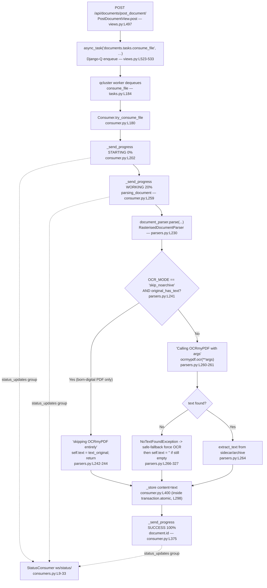

# OCR Runtime Behavior in paperless-ngx — A Code-Grounded Q&A

> **Repository:** paperless-ngx
> **Commit:** `542221a38dff` (branch `paperless-ngx_542221a38dff`, HEAD `542221a38`)
> **Document purpose:** A practical, code-grounded explanation of how Optical Character Recognition (OCR) behaves at runtime in paperless-ngx, answering four specific questions about observing active OCR, distinguishing "skip" from "touch", comparing API responses, and understanding the final state under weak OCR.

---

## Evidence Standard (read this first)

Every factual claim about the system in this document carries an inline citation of the form `[path:locator]` pointing at the exact source location that proves it. **The source code is the sole authority.** Runtime captures — WebSocket payloads, worker log lines, REST API JSON — appear throughout as **illustrations** that confirm what the code says; they never substitute for it. Captures are clearly labelled *(observed)* and were produced against a live instance built from this commit (see [Section 6 — Methodology & Rationale](#section-6--methodology--rationale)).

A few facts are worth stating up front because they are the most common points of confusion:

- **The background processor is Django-Q, not Celery.** The upload view enqueues work with Django-Q's `async_task` — `from django_q.tasks import async_task` `[src/documents/views.py:L28]` — and a Django-Q `qcluster` worker runs it. There is no Celery anywhere in this path. The parser code even documents this directly: a comment notes the parameters are consumed "in daemonized processes by django-q" `[src/paperless_tesseract/parsers.py:L147]`.
- **The "processing state" is transient.** While OCR runs, progress exists only in (a) the Django-Q task record and (b) the WebSocket `status_updates` stream. The durable `Document` database row is created **only on the success path**, inside `with transaction.atomic():` `[src/documents/consumer.py:L298]`. There is **no in-progress `Document` row** to poll while OCR is running.
- **Raster images are always OCR'd.** For any non-PDF input the parser hard-codes `original_has_text = False` `[src/paperless_tesseract/parsers.py:L237-239]`, so the OCR-skip bypass can never fire for a PNG/JPEG. The genuine "skip vs. touch" contrast (Q2) is only meaningful for a born-digital PDF.

---

## Section 1 — Overview of the OCR / Consumption Pipeline

A document moves through the system in two clearly separated regimes: a **transient processing regime** (an asynchronous task plus a live progress stream) and a **durable result regime** (a single `Document` row written only when consumption succeeds). Understanding that split is the key to every answer below.

### 1.1 The hops, end to end (each cited)

1. **Upload.** A client POSTs a file to `POST /api/documents/post_document/`, handled by `PostDocumentView.post()` `[src/documents/views.py:L491,L497]`. The view requires authentication `[src/documents/views.py:L493]` and accepts multipart uploads `[src/documents/views.py:L495]`. It writes the upload to a temporary file under `SCRATCH_DIR` `[src/documents/views.py:L510-519]`, mints a task identifier `task_id = str(uuid.uuid4())` `[src/documents/views.py:L521]`, and enqueues the work.
2. **Enqueue (Django-Q).** The view calls `async_task("documents.tasks.consume_file", temp_filename, …, task_id=task_id, …)` `[src/documents/views.py:L523-533]` and immediately returns `Response("OK")` `[src/documents/views.py:L535]`. The upload request does **not** wait for OCR; it returns as soon as the job is queued.
3. **Dequeue and run.** A Django-Q `qcluster` worker picks up the job and executes `consume_file(...)` `[src/documents/tasks.py:L184]`, which (after an optional barcode-splitting step) delegates to `Consumer().try_consume_file(...)` `[src/documents/tasks.py:L236]`.
4. **Consume.** `try_consume_file(...)` `[src/documents/consumer.py:L180]` detects the MIME type, selects a parser, and calls `document_parser.parse(self.path, mime_type, self.filename)` `[src/documents/consumer.py:L261]`. For images and PDFs the parser is `RasterisedDocumentParser` — registered for the `application/pdf` and `image/*` MIME types in the Tesseract parser declaration `[src/paperless_tesseract/signals.py:L7-18]` — whose `parse()` method `[src/paperless_tesseract/parsers.py:L230]` is the OCR core.
5. **Persist (success only).** On success, `_store(text=text, …)` `[src/documents/consumer.py:L301,L379]` creates the row via `Document.objects.create(... content=text ...)` `[src/documents/consumer.py:L400]`, all inside `transaction.atomic()` `[src/documents/consumer.py:L298]`.

### 1.2 The progress stream that runs alongside

Throughout `try_consume_file`, the consumer calls `_send_progress(...)` `[src/documents/consumer.py:L56]`, which assembles a payload and broadcasts it to the Channels group `status_updates`:

```python
# src/documents/consumer.py:L73-76 (paraphrased)
async_to_sync(self.channel_layer.group_send)(
    "status_updates",
    {"type": "status_update", "data": payload},
)
```

A `StatusConsumer` WebSocket `[src/paperless/consumers.py:L9]` joins that same group `[src/paperless/consumers.py:L17-21]` and relays each event to authenticated browser clients `[src/paperless/consumers.py:L29-33]`. The socket is mounted at `ws/status/` `[src/paperless/urls.py:L136-137]` and wired into the ASGI application as the `"websocket"` protocol `[src/paperless/asgi.py:L20]`. This is the channel a user actually watches to "see OCR running."

### 1.3 Pipeline diagram

Every node below corresponds to a cited code location used in the sections that follow.



---

## Section 2 — Q1: Seeing Active OCR on a Text-Free Image, and What the "Processing State" Is

> **Question (verbatim from the prompt):** *"When I upload an image that has no embedded text, how can I see that OCR has started, and what does the document's processing state look like while it's running? I want to watch how background workers behave during this phase and understand what signals really indicate active OCR work."*

### 2.1 Short answer

There are **four concrete signals** that together prove OCR is actively running on a text-free image, and **one important negative fact** about state:

1. A **Django-Q task** for `documents.tasks.consume_file` exists and is running on the `qcluster` worker.
2. A **WebSocket progress stream** on `ws/status/` emits an ordered sequence of payloads — `STARTING → WORKING → … → SUCCESS`.
3. The **parser emits a debug log** `Calling OCRmyPDF with args: …` immediately before the OCR engine is invoked.
4. The run ends with **document creation** carrying populated (or empty — see Q4) `content` and an archive file.

The negative fact: there is **no in-progress database row** to inspect. The "processing state" is **transient** — it lives only in the task record and the WebSocket stream until consumption succeeds.

### 2.2 Signal 1 — the Django-Q task (this is Django-Q, not Celery)

The upload handler enqueues the work with Django-Q's `async_task`, never with Celery:

```python
# src/documents/views.py:L28
from django_q.tasks import async_task
# src/documents/views.py:L523-533 (paraphrased)
async_task(
    "documents.tasks.consume_file",
    temp_filename,
    override_filename=doc_name,
    ...
    task_id=task_id,
    task_name=os.path.basename(doc_name)[:100],
)
```

The function path enqueued is `documents.tasks.consume_file` `[src/documents/views.py:L524]` and the task is *named* after the uploaded file `[src/documents/views.py:L532]`. A `qcluster` worker dequeues and runs `consume_file(...)` `[src/documents/tasks.py:L184]`, which delegates to `Consumer().try_consume_file(...)` `[src/documents/tasks.py:L236]`.

**Reasoning:** because the work is dispatched to a separate worker process, the HTTP upload returns `"OK"` `[src/documents/views.py:L535]` long before OCR finishes. "Watching the background worker" therefore means watching the Django-Q task and the progress stream — not the HTTP response.

*(Observed)* The Django-Q `Task` table, queried after the experiments, shows the completed task exactly as predicted — function `documents.tasks.consume_file`, named after the file, with a success result:

```
name = "fixture1_textfree.png"
func = "documents.tasks.consume_file"
success = True
result = "Success. New document id 1 created"
```

### 2.3 Signal 2 — the WebSocket progress stream

`_send_progress(...)` `[src/documents/consumer.py:L56]` builds a payload with these exact keys — `filename`, `task_id`, `current_progress`, `max_progress`, `status`, `message`, `document_id` `[src/documents/consumer.py:L64-72]` — and broadcasts it to the `status_updates` group `[src/documents/consumer.py:L73-76]`. The consumer walks a fixed set of milestones:

| Order | Progress | Status | Message constant | Code |
|-------|----------|--------|------------------|------|
| 1 | 0 / 100 | `STARTING` | `new_file` | `[src/documents/consumer.py:L202]` |
| 2 | 20 / 100 | `WORKING` | `parsing_document` | `[src/documents/consumer.py:L259]` (immediately before `parse()` at `L261`) |
| 3 | 70 / 100 | `WORKING` | `generating_thumbnail` | `[src/documents/consumer.py:L264]` |
| 4 | 90 / 100 | `WORKING` | `parse_date` (only if no date yet) | `[src/documents/consumer.py:L274]` |
| 5 | 95 / 100 | `WORKING` | `save_document` | `[src/documents/consumer.py:L294]` |
| 6 | 100 / 100 | `SUCCESS` | `finished` | `[src/documents/consumer.py:L375]` |

While the parser is running, it can additionally report fine-grained progress through a `progress_callback` that rescales the OCR engine's progress into a 20→70 band: `p = int((current_progress / max_progress) * 50 + 20)` `[src/documents/consumer.py:L237-240]`. (An inline comment near that code says "20 and 80", but the arithmetic actually maps 0→20% and 100→70%; **trust the arithmetic, not the comment**.)

A crucial detail: **`document_id` is `null` for every payload until the final `SUCCESS` payload** `[src/documents/consumer.py:L375]`, which is the first place a persisted `document.id` is available. This is direct evidence of the transient-state point in §2.7.

*(Observed)* Uploading the text-free PNG produced exactly this ordered sequence on `ws/status/`. The first and last payloads, verbatim:

```json
{ "filename": "fixture1_textfree.png", "task_id": "0e649f3c-…",
  "current_progress": 0,   "max_progress": 100, "status": "STARTING",
  "message": "new_file", "document_id": null }

{ "filename": "fixture1_textfree.png", "task_id": "0e649f3c-…",
  "current_progress": 100, "max_progress": 100, "status": "SUCCESS",
  "message": "finished", "document_id": 1 }
```

The intermediate payloads were `WORKING 20 parsing_document`, `WORKING 70 generating_thumbnail`, `WORKING 90 parse_date`, and `WORKING 95 save_document` — matching the table above.

### 2.4 The WebSocket surface itself

`StatusConsumer` `[src/paperless/consumers.py:L9]` enforces authentication: an unauthenticated connection is rejected with `DenyConnection()` `[src/paperless/consumers.py:L13-16]`, while an authenticated one joins the `status_updates` group `[src/paperless/consumers.py:L17-21]` and forwards each event as `self.send(json.dumps(event["data"]))` `[src/paperless/consumers.py:L29-33]`. The route is `re_path(r"ws/status/$", StatusConsumer.as_asgi())` `[src/paperless/urls.py:L136-137]`, mounted under `AuthMiddlewareStack(URLRouter(websocket_urlpatterns))` `[src/paperless/asgi.py:L20]` (which is why the socket authenticates via the Django **session**, not an API token).

*(Observed)* An anonymous WebSocket connection to `ws/status/` was rejected with HTTP 403; an authenticated connection (carrying a `sessionid` cookie) connected successfully and received the payloads quoted above.

### 2.5 Signal 3 — the parser-level proof that OCR is actually running

The most direct, low-level signal lives in the parser. Immediately before invoking the OCR engine, it logs the full argument set:

```python
# src/paperless_tesseract/parsers.py:L260-261 (paraphrased)
self.log("debug", f"Calling OCRmyPDF with args: {args}")
ocrmypdf.ocr(**args)
```

This line is emitted by the logger `paperless.parsing.tesseract` `[src/paperless_tesseract/parsers.py:L24]`. Its appearance proves the OCR engine was actually called for this document.

*(Observed)* For the text-free PNG, the worker log shows the call with `skip_text: True` (the default mode — see Q2), and, because a plain image carries no recoverable text, the subsequent fall-back path (see Q4):

```
[DEBUG] [paperless.parsing.tesseract] Calling OCRmyPDF with args: {... 'skip_text': True, 'output_type': 'pdfa', 'sidecar': '…/sidecar.txt', 'image_dpi': 120}
[WARNING] [paperless.parsing.tesseract] Encountered an error while running OCR: No text was found in the original document. Attempting force OCR to get the text.
[DEBUG] [paperless.parsing.tesseract] Fallback: Calling OCRmyPDF with args: {... 'force_ocr': True, ...}
```

### 2.6 Signal 4 — eventual document creation

The pipeline finishes by writing the row and emitting `SUCCESS 100%` with the new `document.id` `[src/documents/consumer.py:L375]`. After that, and only after that, the document is visible through the REST API.

### 2.7 What the "processing state" actually is — and is not

This is the single most important conceptual point for Q1. **Processing state is transient.** It is carried by exactly two things while OCR runs:

- the **Django-Q task record** (status of the queued job), and
- the **WebSocket `status_updates` stream** (the `STARTING → WORKING → SUCCESS` payloads).

It is **not** stored in the database during processing. The `Document` row is created only on the success path, inside `with transaction.atomic():` `[src/documents/consumer.py:L298]`, by `_store(...)` `[src/documents/consumer.py:L379-406]`. There is no `status`, `processing`, or `in_progress` column to read mid-flight (see Q4 for the model audit).

**Reasoning / practical consequence:** an operator who polls `GET /api/documents/` during OCR sees *nothing new* until consumption finishes — the row simply does not exist yet. To "watch OCR happen" you must subscribe to `ws/status/` or inspect the Django-Q task queue live; the database is the wrong place to look. The fact that `document_id` stays `null` in every payload until `SUCCESS` `[src/documents/consumer.py:L375]` is the same truth seen from the stream side.

### 2.8 Corroboration in the test suite

The consumer tests assert exactly this start/finish shape: a helper checks that the **first** emitted progress is `STARTING` at progress `0` and the **last** is `SUCCESS` at progress `100` `[src/documents/tests/test_consumer.py:L238-260]`. That is the test-suite encoding of the milestone walk in §2.3.


---

## Section 3 — Q2: Skip vs. Touch for an Image That Already Contains Text

> **Question (verbatim from the prompt):** *"If I upload a similar image that already contains text, does the system skip OCR entirely, or does it still touch the OCR pipeline in some way, and how can I tell the difference after processing finishes?"*

### 3.1 The critical clarification: an *image* cannot demonstrate "skip"

The question asks about "an image that already contains text," but a raster image (PNG/JPEG/TIFF/BMP/GIF — see `is_image()` `[src/paperless_tesseract/parsers.py:L64-71]`) **never carries an embedded text layer** as far as the parser is concerned. In `parse()`, only a PDF gets its embedded text extracted and measured:

```python
# src/paperless_tesseract/parsers.py:L234-239 (paraphrased)
if mime_type == "application/pdf":
    text_original = self.extract_text(None, document_path)
    original_has_text = text_original and len(text_original) > 50
else:
    text_original = None
    original_has_text = False
```

So for **any image**, `original_has_text` is hard-coded `False` `[src/paperless_tesseract/parsers.py:L237-239]`. **An image is therefore always OCR'd; the skip-bypass can never apply to it.** The genuine "skip vs. touch" contrast is only meaningful for a **born-digital PDF** whose embedded text exceeds the 50-character threshold `[src/paperless_tesseract/parsers.py:L236]`. The rest of this section answers the question on that basis.

### 3.2 The only path that truly skips OCR: `skip_noarchive` + existing text

There is exactly **one** branch in the parser that bypasses the OCR engine entirely:

```python
# src/paperless_tesseract/parsers.py:L241-244 (paraphrased)
if settings.OCR_MODE == "skip_noarchive" and original_has_text:
    self.log("debug", "Document has text, skipping OCRmyPDF entirely.")
    self.text = text_original
    return
```

This fires **only** when *both* conditions hold: the configured mode is `skip_noarchive`, **and** the input already has a substantial embedded text layer (so, a born-digital PDF). When it fires, the parser sets `self.text` to the pre-existing text and `return`s **before** any `ocrmypdf.ocr(...)` call — no OCR, and no archive is produced `[src/paperless_tesseract/parsers.py:L242-244]`.

*(Observed)* Uploading a born-digital PDF under `PAPERLESS_OCR_MODE=skip_noarchive` produced exactly this — and notably **no** `Calling OCRmyPDF with args` line appeared:

```
[DEBUG] [paperless.parsing.tesseract] Extracted text from PDF file …/paperless-upload-…
[DEBUG] [paperless.parsing.tesseract] Document has text, skipping OCRmyPDF entirely.
[INFO]  [paperless.consumer] Document … consumption finished
```

### 3.3 The default mode `skip` still TOUCHES the OCR pipeline

This is the heart of Q2. Under the **default** mode `skip` `[src/paperless/settings.py:L522]`, paperless **still invokes OCRmyPDF**, even when the PDF already has text. The mode-to-argument mapping treats `skip` and `skip_noarchive` identically at the engine level — both set `skip_text=True`:

```python
# src/paperless_tesseract/parsers.py:L155-162 (paraphrased)
if settings.OCR_MODE == "force" or safe_fallback:
    ocrmypdf_args["force_ocr"] = True
elif settings.OCR_MODE in ["skip", "skip_noarchive"]:
    ocrmypdf_args["skip_text"] = True
elif settings.OCR_MODE == "redo":
    ocrmypdf_args["redo_ocr"] = True
else:
    raise ParseError(f"Invalid ocr mode: {settings.OCR_MODE}")
```

Because the `skip_noarchive`-bypass in §3.2 is the *only* early `return`, every other mode — including the default `skip` — falls through to `self.log("debug", f"Calling OCRmyPDF with args: {args}")` and `ocrmypdf.ocr(**args)` `[src/paperless_tesseract/parsers.py:L260-261]`. With `skip_text=True`, OCRmyPDF OCRs only the pages that lack text and copies text pages through, **and still builds the PDF/A archive** because `OCR_OUTPUT_TYPE` defaults to `"pdfa"` `[src/paperless/settings.py:L518]`.

*(Observed)* The same kind of born-digital PDF, uploaded under the default `skip` mode, **did** invoke OCRmyPDF and **did** produce an archive:

```
[DEBUG] [paperless.parsing.tesseract] Extracted text from PDF file …/paperless-upload-…
[DEBUG] [paperless.parsing.tesseract] Calling OCRmyPDF with args: {... 'skip_text': True, 'output_type': 'pdfa', ...}
[DEBUG] [paperless.parsing.tesseract] Incomplete sidecar file: discarding.
[DEBUG] [paperless.parsing.tesseract] Extracted text from PDF file …/archive.pdf
```

### 3.4 The post-processing differentiator: the archive

The question asks *"how can I tell the difference after processing finishes?"* The answer is **the archive artifact**, not the text:

- Under default **`skip`**, OCRmyPDF runs and an archive is written, so the document **has** an archived version.
- Under **`skip_noarchive`** with existing text, the bypass returns before OCR and **no** archive is produced.

In the data model this surfaces as `archive_filename` `[src/documents/models.py:L186]` and the derived property `has_archive_version`, which is literally `return self.archive_filename is not None` `[src/documents/models.py:L237-239]`. Through the API this is the `archived_file_name` field (see Q3). So, **for the controlled comparison this section sets up — a normal, text-bearing born-digital PDF consumed under default `skip` versus `skip_noarchive`** — the operator-visible test is: **does the finished document have an archive?** Under default `skip` it does (OCRmyPDF ran); under `skip_noarchive` with existing text it does not (the bypass fired). (The model also tracks `checksum` for the original `[src/documents/models.py:L135]` and `archive_checksum` for the archive `[src/documents/models.py:L143]`.)

> **Caveat — archive absence is not a *universal* "OCR was skipped" proof.** Outside this controlled comparison, a document can lack an archive under default `skip` for reasons unrelated to the skip-bypass. The parser tests `test_signed` and `test_encrypted`, both run under `OCR_MODE="skip"`, assert `parser.archive_path is None` for signed and encrypted PDFs `[src/paperless_tesseract/tests/test_parser.py:L162-187]`. So treat archive presence as the differentiator **only** for the normal text-PDF `skip`-vs-`skip_noarchive` case — not as a blanket signal across signed, encrypted, or error/fallback paths.

### 3.5 The sidecar nuance (why "skip" text doesn't end up in the sidecar)

When OCRmyPDF runs with `skip_text=True` on a page that already has text, it writes a marker into the sidecar text file rather than the page's text. paperless keys off that marker: it uses the sidecar **only** when the marker `"[OCR skipped on page"` is **absent** `[src/paperless_tesseract/parsers.py:L104]`; if the marker is present it logs `"Incomplete sidecar file: discarding."` `[src/paperless_tesseract/parsers.py:L109-110]` and falls back to extracting the embedded text from the PDF via pdfminer `[src/paperless_tesseract/parsers.py:L112-120]`.

*(Observed)* In §3.3 the line `Incomplete sidecar file: discarding.` appears precisely because `skip_text` skipped the text page, leaving the marker — after which paperless re-extracted the embedded text from the archive. This is the sidecar logic running live.

### 3.6 Validation against OCRmyPDF's own documentation *(illustrative — the code remains authoritative)*

For the OCRmyPDF generation that matches this commit (`ocrmypdf==13.4.3` `[requirements.txt:L60]`, which exposes the boolean `skip_text`/`redo_ocr`/`force_ocr` parameters that paperless sets), the engine's documented behavior aligns with the code:

- `--skip-text` (paperless's `skip_text=True`): no OCR is performed on pages that already have text, and those pages are copied to the output.
- `--redo-ocr` (`redo`): the invisible OCR layer is stripped and re-applied **without rasterizing** vector/born-digital content.
- `--force-ocr` (`force`, and the safe-fallback): **all** pages are rasterized to images before OCR.
- The **sidecar contains only text from pages that were actually OCR'd** — which is exactly why paperless treats the `"[OCR skipped on page"` marker as the signal to fall back to embedded-text extraction `[src/paperless_tesseract/parsers.py:L104,L112-120]`.

The project's own configuration docs describe the same four modes — and confirm that `skip` is the default and "always creates archived documents," while `skip_noarchive` additionally suppresses the archive when it finds text `[docs/configuration.rst:L305-329]`.

> **Version-fidelity note (important):** this commit's parser recognizes exactly four OCR modes — `skip`, `skip_noarchive`, `redo`, and `force` — as enumerated in the mode-to-argument mapping `[src/paperless_tesseract/parsers.py:L155-162]`. These four are the only modes this document describes, because they are the only modes this commit's code accepts: any other value falls through to the `else` branch and raises `ParseError(f"Invalid ocr mode: …")` `[src/paperless_tesseract/parsers.py:L161-162]`. Note also that the settings comment at `[src/paperless/settings.py:L520]` reads `# skip. redo, force` and omits `skip_noarchive`; that comment is stale — the *code* accepts all four modes, and the code is what governs behavior.

### 3.7 Corroboration in the test suite

The parser tests encode this contrast directly:

- `test_skip_noarchive_withtext` runs a born-digital PDF under `skip_noarchive` and asserts `parser.archive_path is None` with the existing text retained — the bypass `[src/paperless_tesseract/tests/test_parser.py:L356-367]`.
- `test_skip_noarchive_notext` runs an image-only PDF under `skip_noarchive` and asserts an archive **is** produced (`os.path.isfile(parser.archive_path)`), because with no text the bypass cannot fire `[src/paperless_tesseract/tests/test_parser.py:L369-380]`.
- `test_multi_page_mixed` runs the default `skip` mode and asserts both that an archive is created **and** that the sidecar contains an `"[OCR skipped on page(s) …]"` marker — proving OCRmyPDF still ran `[src/paperless_tesseract/tests/test_parser.py:L382-398]`.


---

## Section 4 — Q3: Comparing the Final API Responses

> **Question (verbatim from the prompt):** *"I also want to compare the final API responses for both cases to understand which fields show OCR-generated text versus existing text."*

### 4.1 Where the text lives: `content` (origin-agnostic)

The REST representation is produced by `DocumentSerializer` `[src/documents/serialisers.py:L201]`. The document text is exposed through the `content` field, which appears in the serializer's `fields` tuple `[src/documents/serialisers.py:L227]` and maps directly to the model column `Document.content` `[src/documents/models.py:L117]`. That column's help text describes it as "The raw, text-only data of the document" `[src/documents/models.py:L117-124]`.

Crucially, **the same `content` field carries the text regardless of where the text came from.** OCR-generated text and pre-existing (pdfminer-extracted) text both flow into `Document.content` via the single `_store(... content=text ...)` call `[src/documents/consumer.py:L400]`. **There is no separate field for "OCR text" versus "extracted text," and no flag recording which produced the value.**

### 4.2 The field that *does* differ: `archived_file_name`

`DocumentSerializer` exposes `archived_file_name` as a `SerializerMethodField` `[src/documents/serialisers.py:L208]` whose getter returns the archive's public filename only when an archive exists, and `None` otherwise:

```python
# src/documents/serialisers.py:L213-217 (paraphrased)
def get_archived_file_name(self, obj):
    if obj.has_archive_version:
        return obj.get_public_filename(archive=True)
    return None
```

It also exposes `original_file_name` `[src/documents/serialisers.py:L207,L210-211]`. Both are present in the `fields` tuple `[src/documents/serialisers.py:L233-234]`. As established in Q2, `has_archive_version` is `self.archive_filename is not None` `[src/documents/models.py:L237-239]`.

**Therefore, for the controlled comparison of two normal text-bearing PDFs — one consumed under default `skip`, one under `skip_noarchive` — the practical differentiator between "OCR ran" and "text pre-existed / OCR was skipped" is `archived_file_name` (archive presence), not the text itself.** The `content` field alone is origin-agnostic and cannot tell you how the text was produced. (As noted in §3.4, archive absence is **not** a universal "OCR was skipped" proof — signed, encrypted, or error/fallback documents can also lack an archive under default `skip` `[src/paperless_tesseract/tests/test_parser.py:L162-187]`.)

### 4.3 Side-by-side comparison *(observed)*

The four uploaded fixtures yield the following `GET /api/documents/{id}/` responses. Every response carries the **identical** field set — `id, correspondent, document_type, title, content, tags, created, modified, added, archive_serial_number, original_file_name, archived_file_name` — exactly the serializer's `fields` tuple `[src/documents/serialisers.py:L222-235]`:

| Doc | Fixture / mode | `content` length | `archived_file_name` | What it shows |
|-----|----------------|------------------|----------------------|---------------|
| 1 | text-free PNG, default `skip` | `0` (empty) | `"2026-06-26 fixture1_textfree.pdf"` | OCR ran (archive present); no text recovered |
| 2 | born-digital PDF, default `skip` | `336` | `"2026-06-26 fixture2_textlayer.pdf"` | OCR **touched** the PDF; archive present |
| 3 | born-digital PDF, `skip_noarchive` | `453` | `null` | OCR **bypassed**; **no archive** |
| 4 | near-blank PNG, default `skip` | `0` (empty) | `"2026-06-26 fixture3_nearblank.pdf"` | weak OCR (see Q4); archive present |

The clearest contrast is **Doc 2 vs. Doc 3**, two born-digital PDFs that both end up with text in `content`:

```jsonc
// GET /api/documents/2/  (default skip — OCRmyPDF engaged)
{ "id": 2, "title": "fixture2_textlayer",
  "content": "This is a born-digital PDF carrying a genuine embedded text layer.\n\n…",
  "original_file_name": "2026-06-26 fixture2_textlayer.pdf",
  "archived_file_name": "2026-06-26 fixture2_textlayer.pdf" }   // <-- archive PRESENT

// GET /api/documents/3/  (skip_noarchive — OCRmyPDF bypassed)
{ "id": 3, "title": "fixture2b_textlayer",
  "content": "Second born-digital PDF with a distinct embedded text layer…",
  "original_file_name": "2026-06-26 fixture2b_textlayer.pdf",
  "archived_file_name": null }                                   // <-- NO archive
```

Both have populated `content`; **in this controlled Doc 2 (default `skip`) vs. Doc 3 (`skip_noarchive`) comparison, `archived_file_name` is what distinguishes the OCR'd case from the skipped case.** No field reveals that Doc 2's text passed through OCRmyPDF while Doc 3's text was read straight from the PDF — that origin distinction is simply not represented in the API.

### 4.4 Reasoning

Because `content` is a single origin-agnostic column `[src/documents/models.py:L117]` populated identically on every path `[src/documents/consumer.py:L400]`, the API cannot and does not label text by provenance. The only provenance-adjacent signal the contract exposes is whether an archive was built (`archived_file_name` / `has_archive_version`). For the controlled comparison of two *normal* text-bearing PDFs under default `skip` vs. `skip_noarchive`, that is a reliable proxy for "did OCRmyPDF run"; it is **not** a universal one, because signed, encrypted, or error/fallback PDFs can also end up without an archive under default `skip` `[src/paperless_tesseract/tests/test_parser.py:L162-187]`. Field exposure is corroborated by the API tests (e.g., the document-fields test `[src/documents/tests/test_api.py:L89]`).


---

## Section 5 — Q4: Final State Under Weak or Incomplete OCR

> **Question (verbatim from the prompt):** *"Finally, when OCR produces weak or incomplete results, what actually happens to the document's final state? Does it still count as fully processed, and how is that reflected in the saved metadata?"*

### 5.1 Short answer

A weak or empty OCR result is **not** an error state. The document is still created and **still counts as fully processed** — the success milestone fires and a row is written exactly as in the happy path. The only "reflection" in saved metadata is that `content` ends up empty or short. **There is no OCR-quality, confidence, or processing-status field anywhere in the `Document` model** to flag the outcome.

### 5.2 The empty-text fallback chain in `parse()`

When OCR yields little or nothing, the parser runs a deliberate, multi-tier fallback:

1. **Primary OCR.** After `ocrmypdf.ocr(**args)` `[src/paperless_tesseract/parsers.py:L261]`, the parser extracts text from the sidecar/archive: `self.text = self.extract_text(sidecar_file, archive_path)` `[src/paperless_tesseract/parsers.py:L264]`. If that is empty, it raises `NoTextFoundException(...)` `[src/paperless_tesseract/parsers.py:L266-267]` (the exception class is defined at `[src/paperless_tesseract/parsers.py:L14]`).
2. **Safe-fallback force-OCR retry.** The handler `except (NoTextFoundException, InputFileError) as e:` `[src/paperless_tesseract/parsers.py:L276]` rebuilds the arguments with `safe_fallback=True` `[src/paperless_tesseract/parsers.py:L293]` (which forces `force_ocr=True` via the mapping at `[src/paperless_tesseract/parsers.py:L155-156]`), logs `"Fallback: Calling OCRmyPDF with args: …"` `[src/paperless_tesseract/parsers.py:L297]`, calls `ocrmypdf.ocr(**args)` again `[src/paperless_tesseract/parsers.py:L298]`, and re-extracts the text `[src/paperless_tesseract/parsers.py:L303-306]`.
3. **Last resort — empty content.** If text is *still* absent:

```python
# src/paperless_tesseract/parsers.py:L318-327 (paraphrased)
if not self.text:
    if original_has_text:          # a PDF that did have embedded text
        self.text = text_original
    else:
        self.log("warning",
                 f"No text was found in {document_path}, the content will be empty.")
        self.text = ""
```

So for an image (or any input) where nothing is recoverable, `self.text` is deliberately set to the empty string `[src/paperless_tesseract/parsers.py:L327]`. (Consistently, `post_process_text` returns `None`/empty for empty input `[src/paperless_tesseract/parsers.py:L330-332]`.)

### 5.3 The document is still created

The empty (or short) text is then persisted just like any other result. `_store(...)` calls `Document.objects.create(... content=text ...)` `[src/documents/consumer.py:L400]` — there is no branch that aborts on empty text — and the consumer emits the `SUCCESS 100%` milestone with the new `document.id` `[src/documents/consumer.py:L375]`. From the pipeline's perspective, an empty-content document is a fully successful consume.

*(Observed)* The near-blank image exercised this entire chain and still produced a finished, fully-processed document:

```
[DEBUG] [paperless.parsing.tesseract] Calling OCRmyPDF with args: {... 'skip_text': True, ...}
[WARNING] [paperless.parsing.tesseract] Encountered an error while running OCR: No text was found in the original document. Attempting force OCR to get the text.
[DEBUG] [paperless.parsing.tesseract] Fallback: Calling OCRmyPDF with args: {... 'force_ocr': True, ...}
[WARNING] [paperless.parsing.tesseract] No text was found in …/paperless-upload-…, the content will be empty.
[INFO]  [paperless.consumer] Document 2026-06-26 fixture3_nearblank consumption finished
```

The resulting API response (Doc 4 in §4.3) had `content` of length `0`, an `archived_file_name` present, and was indistinguishable in *shape* from any other document — it appears in `GET /api/documents/` like any successfully consumed file. The WebSocket stream for this upload ended in `SUCCESS 100% finished`, not `FAILED`.

### 5.4 No metadata flag exists — the model audit

The decisive evidence for "how is it reflected in metadata?" is what the `Document` model **does not** contain. Scanning the model body `[src/documents/models.py:L88-200]`, the fields are: `correspondent` `[src/documents/models.py:L97]`, `title` `[src/documents/models.py:L106]`, `document_type` `[src/documents/models.py:L108]`, `content` `[src/documents/models.py:L117]`, `mime_type` `[src/documents/models.py:L126]`, `tags` `[src/documents/models.py:L128]`, `checksum` `[src/documents/models.py:L135]`, `archive_checksum` `[src/documents/models.py:L143]`, `created` `[src/documents/models.py:L152]`, `modified` `[src/documents/models.py:L154]`, `storage_type` `[src/documents/models.py:L161]`, `added` `[src/documents/models.py:L169]`, `filename` `[src/documents/models.py:L176]`, `archive_filename` `[src/documents/models.py:L186]`, and `archive_serial_number` `[src/documents/models.py:L196]`. **There is no `status`, `state`, `processed`, `ocr_confidence`, or `ocr_quality` column.** The only archive-related property is `has_archive_version` `[src/documents/models.py:L237-239]`, which speaks to archive presence, not OCR quality.

**Reasoning:** "fully processed" in paperless is simply *binary success of the consume pipeline*. It is entirely decoupled from how much text OCR recovered. Because the existence of the `Document` row is itself the success signal (the row is written only on the success path inside `transaction.atomic()` `[src/documents/consumer.py:L298]`), a document with empty `content` is exactly as "fully processed" as one with rich text. Nothing in the saved metadata distinguishes weak OCR from strong OCR — you would only notice by reading `content` and finding it empty or short.

### 5.5 Corroboration in the test suite

Parser tests confirm that an empty final text is a valid, non-error outcome: cases where OCR cannot recover text assert `parser.get_text() == ""` (and `archive_path is None` for the relevant skip/encrypted scenarios) rather than expecting an exception to propagate — e.g. `test_encrypted` under `OCR_MODE="skip"` asserts both `parser.archive_path is None` and `parser.get_text() == ""` `[src/paperless_tesseract/tests/test_parser.py:L177-187]`. This matches the live near-blank result in §5.3.


---

## Section 6 — Methodology & Rationale

### 6.1 How the live instance was exercised

To capture the runtime signals quoted above, a live paperless-ngx instance was built and run from this exact commit inside the provided container image, then driven through controlled uploads:

- **Services.** Redis was started as the shared backend for both the Django-Q broker and the Channels layer `[src/paperless/settings.py:L182,L456]`; the database schema was applied via `manage.py migrate`; the ASGI application `paperless.asgi:application` `[src/paperless/asgi.py:L17-22]` was served so that both `http` and `websocket` protocols were available; and a Django-Q `qcluster` worker was started to dequeue and execute `consume_file` `[src/documents/tasks.py:L184]`.
- **Reachability checks.** `GET /api/documents/` returned `200` when authenticated and `401` when anonymous; `ws/status/` rejected anonymous connections with `403` (the `DenyConnection` path `[src/paperless/consumers.py:L13-16]`) and accepted an authenticated, session-cookie connection (consistent with the `AuthMiddlewareStack` wiring `[src/paperless/asgi.py:L20]`).
- **Experiments.** Four ephemeral fixtures were uploaded via `POST /api/documents/post_document/` `[src/documents/views.py:L491,L497]`: (1) a text-free raster PNG (for Q1 and, incidentally, the empty-OCR case of Q4); (2) a born-digital PDF with a real embedded text layer above the 50-character threshold, consumed under the default `skip` mode (the "touch" side of the Q2 contrast — this is `fixture2_textlayer.pdf`, Doc 2 in §4.3); (3) a second, **distinct** born-digital PDF with its own embedded text layer, consumed under `skip_noarchive` (the genuine OCR-**bypass** side of the Q2 contrast — this is `fixture2b_textlayer.pdf`, Doc 3 in §4.3); and (4) a near-blank image (for Q4). A *distinct* file is used for (3) rather than re-consuming (2) because paperless computes an MD5 over the original bytes in `pre_check_duplicate()` `[src/documents/consumer.py:L102-113]` — invoked at the very start of `try_consume_file` `[src/documents/consumer.py:L213]` — and refuses any upload whose checksum matches an existing document, so the same PDF cannot be ingested twice. For each upload, a small WebSocket probe subscribed to `ws/status/` and recorded the ordered payloads; the worker's `paperless.parsing.tesseract` and `paperless.consumer` log lines were captured; the Django-Q `Task` record was read; and the final `GET /api/documents/{id}/` JSON was retrieved.

These captures are what appear as *(observed)* evidence in Sections 2–5. They consistently confirmed the code paths cited; none contradicted them.

### 6.2 Repository hygiene

All runtime state (database, media, scratch directory), all fixtures, and all probe scripts lived **outside the repository tree** (under a scratch location), and were **deleted afterward**. No investigation artifact was committed. The repository ends in a pristine state, with the single addition of this document under `blitzy/documentation/`. This satisfies the task's constraints that the repository remain unchanged and that temporary artifacts be cleaned up.

### 6.3 Evidence philosophy (restated)

The source code is the source of truth. Every system claim in this document is anchored to a specific `[path:locator]`. Runtime captures were used only to **confirm** behavior and to make the explanations concrete — they were never used as a substitute for reading the code. Where a code comment and the code disagreed (the 20→70 progress band vs. the "20 and 80" comment in `[src/documents/consumer.py:L237-240]`; the stale `# skip. redo, force` settings comment at `[src/paperless/settings.py:L520]`), this document follows the **code**, not the comment.

### 6.4 Summary of answers

| Question | One-line answer | Primary code anchor |
|----------|-----------------|---------------------|
| **Q1** — Seeing active OCR on a text-free image | Watch the Django-Q task, the `ws/status/` `STARTING→WORKING→SUCCESS` stream, and the `"Calling OCRmyPDF with args"` debug log; processing state is **transient** (no in-progress DB row). | `[src/documents/consumer.py:L202,L375]`, `[src/paperless_tesseract/parsers.py:L260]` |
| **Q2** — Skip vs. touch for a text-bearing input | Only `skip_noarchive` + existing text **bypasses** OCRmyPDF; the default `skip` **still invokes** it (and still archives). Images always OCR. For the normal text-PDF `skip`-vs-`skip_noarchive` case, tell them apart by the **archive** (not a universal proof — signed/encrypted/error PDFs can also lack one `[src/paperless_tesseract/tests/test_parser.py:L162-187]`). | `[src/paperless_tesseract/parsers.py:L241-244,L157-158,L260-261]` |
| **Q3** — Comparing API responses | `content` carries text **regardless of origin**; no field labels OCR vs. pre-existing text. In the controlled text-PDF comparison the differentiator is `archived_file_name`. | `[src/documents/serialisers.py:L227,L213-217]`, `[src/documents/models.py:L117]` |
| **Q4** — Final state under weak OCR | Still **fully processed**: the row is created with possibly-empty `content`; there is **no** OCR-quality/status field in the model. | `[src/paperless_tesseract/parsers.py:L318-327]`, `[src/documents/consumer.py:L400]`, `[src/documents/models.py:L88-200]` |
