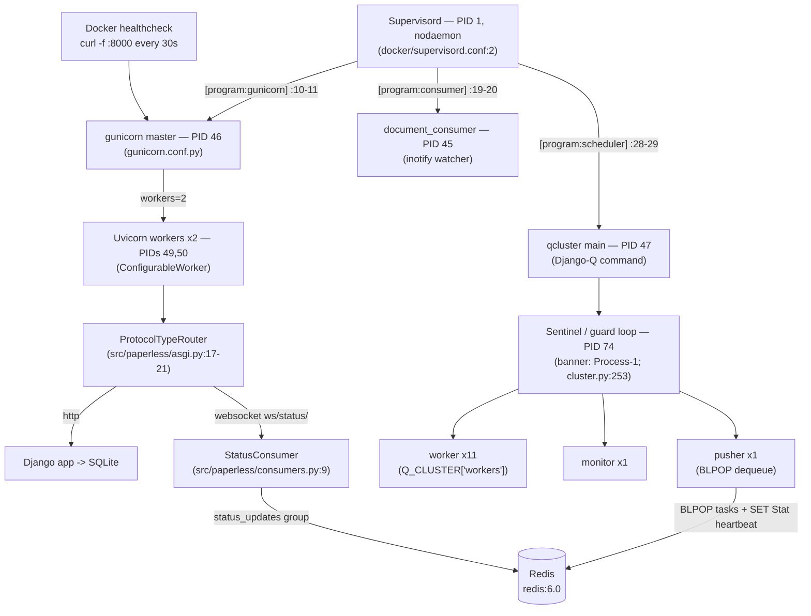
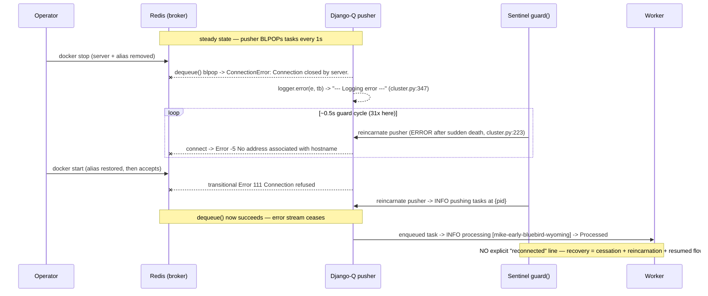

# Paperless-ngx v1.7.0 (commit `542221a38dff`) — Runtime-Behavior Investigation: Idle Processing, Health/Ready Signals, Recovery, and Always-On Components

**Repository:** paperless-ngx / paperless-ngx
**Version under test:** v1.7.0 — `src/paperless/version.py:1` → `__version__ = (1, 7, 0)`
**Commit:** `542221a38dff06361e07976452f9aea24d210542` (branch `paperless-ngx_542221a38dff`)
**Runtime backbone:** Django 4.0.4 + **Django-Q 1.3.9** (NOT Celery) + Channels 3.0.4, served by gunicorn 20.1.0 with a Uvicorn ASGI worker, backed by Redis and SQLite.

> **Methodology (run-first).** Every factual claim below was produced by **actually running** Paperless-ngx v1.7.0 at commit `542221a38dff` under its **canonical Supervisord process stack** (Supervisord as PID 1 launching the three real programs from `docker/supervisord.conf`), and **capturing real, unedited output**, then grounding the claim in a `file:line` source reference. Commands and their raw output are shown inline and collected in full in the [Appendix](#appendix--command-ledger-durations-and-raw-captures). Repository source files are cited with **repository-relative** paths (e.g. `src/paperless/settings.py:455`); references to third-party library internals are labelled with the package, version, and installed path (e.g. `django-q 1.3.9 · site-packages/django_q/conf.py:207`). Temporary observation artifacts were created under `/tmp` and removed afterward; the source tree was treated as strictly read-only.

> **⚠️ Two headline findings that refine a source-only (static) reading.** Running the canonical stack revealed two behaviors that differ from what a static, code-only reading — the expectation recorded in the AAP (§0.5.3), restated in [§ The logging model](#the-logging-model-what-is-visible-vs-what-is-not) — would predict. Both are documented with captured evidence where they arise, and summarized here so they are not buried. Both are reported per the task's own binding rule to *"report exactly what is observed, even if unexpected; do not adjust an observed value toward what it should be."*
>
> 1. **Django-Q's INFO banner/status lines ARE visible** in the canonical run — they are **not** suppressed. Django-Q self-configures its own `django-q` logger (own `StreamHandler`, `level=INFO`, `propagate=False`) at import time (`django-q 1.3.9 · site-packages/django_q/conf.py:207-218`), and Paperless's `LOGGING` block sets `disable_existing_loggers: False` (`src/paperless/settings.py:375`), so that logger survives `dictConfig` and emits INFO directly. The running logger's **effective level is `INFO`, not `WARNING`** — proven by live logger introspection in [Q2 §The logging model](#the-logging-model-what-is-visible-vs-what-is-not). This is *why* the `[Q] INFO` lines below appear on stdout.
> 2. **The 30-second Docker healthcheck produces NO HTTP access line** in the application logs — it is silent. `uvicorn.access`/`gunicorn.access` resolve to an effective level of `WARNING` with **no handlers**, so their INFO access records are dropped. The healthcheck cadence is evidenced instead by Docker's own `State.Health.Log`. See [Q2 §Cadence 1](#cadence-1--the-docker-healthcheck-every-30-s-silent-in-app-logs).

> **Citation key (how to resolve every `file:line` reference in this document).** Two kinds of citations appear below, and both are designed to resolve unambiguously.
>
> **(1) Repository files** are cited by their **repository-relative path** at commit `542221a38dff`. Where a short filename is used in dense prose or a diagram label, it always denotes the canonical repo path in this table:
>
> | Short name used | Canonical repository path |
> |-----------------|---------------------------|
> | `settings.py` | `src/paperless/settings.py` |
> | `asgi.py` | `src/paperless/asgi.py` |
> | `consumers.py` | `src/paperless/consumers.py` |
> | `workers.py` (repo) | `src/paperless/workers.py` |
> | `urls.py` | `src/paperless/urls.py` |
> | `version.py` | `src/paperless/version.py` |
> | `document_consumer.py` | `src/documents/management/commands/document_consumer.py` |
> | `tasks.py` (documents) | `src/documents/tasks.py` |
> | `tasks.py` (mail) | `src/paperless_mail/tasks.py` |
> | `consumer.py` | `src/documents/consumer.py` |
> | `gunicorn.conf.py` | `gunicorn.conf.py` (repository root) |
> | `supervisord.conf` | `docker/supervisord.conf` |
> | `wait-for-redis.py` | `docker/wait-for-redis.py` |
> | `docker-compose.sqlite.yml` | `docker/compose/docker-compose.sqlite.yml` |
>
> **(2) Third-party dependency internals** are cited as `‹package version› · site-packages/‹path›` and are **not** repository files. The short names `cluster.py`, `conf.py`, and `redis_broker.py` always refer to **Django-Q 1.3.9**; the uvicorn `workers.py:37` reference refers to **uvicorn 0.17.6**. The exact packages, versions, and install location were captured from the running container:
>
> ```console
> $ docker exec paperless-app-canon pip show django-q channels-redis uvicorn | grep -E "^Name|^Version|^Location"
> Name: django-q
> Version: 1.3.9
> Location: /usr/local/lib/python3.9/site-packages
> Name: channels-redis
> Version: 3.4.0
> Location: /usr/local/lib/python3.9/site-packages
> Name: uvicorn
> Version: 0.17.6
> Location: /usr/local/lib/python3.9/site-packages
> $ docker exec paperless-app-canon ls -1 \
>     /usr/local/lib/python3.9/site-packages/django_q/cluster.py \
>     /usr/local/lib/python3.9/site-packages/django_q/conf.py \
>     /usr/local/lib/python3.9/site-packages/django_q/brokers/redis_broker.py \
>     /usr/local/lib/python3.9/site-packages/uvicorn/workers.py
> /usr/local/lib/python3.9/site-packages/django_q/cluster.py
> /usr/local/lib/python3.9/site-packages/django_q/conf.py
> /usr/local/lib/python3.9/site-packages/django_q/brokers/redis_broker.py
> /usr/local/lib/python3.9/site-packages/uvicorn/workers.py
> ```
>
> | Short name used | Full dependency-source reference |
> |-----------------|----------------------------------|
> | `cluster.py:N` | `django-q 1.3.9 · site-packages/django_q/cluster.py:N` |
> | `conf.py:N` | `django-q 1.3.9 · site-packages/django_q/conf.py:N` |
> | `redis_broker.py:N` | `django-q 1.3.9 · site-packages/django_q/brokers/redis_broker.py:N` |
> | uvicorn `workers.py:37` | `uvicorn 0.17.6 · site-packages/uvicorn/workers.py:37` |
>
> Absolute `/usr/local/lib/python3.9/site-packages/...` paths that appear **inside captured tracebacks** are raw program output (not citations) and are reproduced exactly as emitted.


---

## Terminology

| Term | Meaning in this document |
|------|--------------------------|
| **Supervisord** | The process control system that runs as the container's **PID 1** in foreground (`nodaemon`) and supervises the three long-running programs. `docker/supervisord.conf:2` sets `nodaemon=true`; `:8` sets `user=root`. |
| **gunicorn / ASGI** | `gunicorn` is the web-server process manager; it serves the **ASGI** application `paperless.asgi:application`. Configured by `gunicorn.conf.py`. |
| **Uvicorn worker (`ConfigurableWorker`)** | The gunicorn worker class that actually speaks ASGI/HTTP/WebSocket. `paperless.workers.ConfigurableWorker` extends `uvicorn.workers.UvicornWorker` (`src/paperless/workers.py:4,9`). |
| **Django-Q** | The task queue / scheduler library (v1.3.9). The `qcluster` management command launches a **cluster** of processes that run scheduled and ad-hoc background tasks. |
| **Sentinel / guard** | The Django-Q supervisor process. Its `guard()` loop (`django-q 1.3.9 · site-packages/django_q/cluster.py:253`) health-checks the pool and **reincarnates** dead members via `reincarnate()` (`django-q 1.3.9 · site-packages/django_q/cluster.py:211`); it also saves a `Stat` heartbeat to Redis roughly every 0.5s. In the startup banner it is named `Process-1`. |
| **Worker** | A Django-Q pool process that executes task functions. Count governed by `Q_CLUSTER["workers"]`. |
| **Monitor** | The Django-Q pool process that collects task results and writes them back (banner: `Process-1:N monitoring`). |
| **Pusher** | The Django-Q pool process that continuously polls the broker for new task packages (banner: `Process-1:N pushing tasks`); `broker.dequeue()` at `django-q 1.3.9 · site-packages/django_q/cluster.py:345`. |
| **Broker** | The Redis-backed queue Django-Q uses to move tasks. `Q_CLUSTER["redis"]` (`src/paperless/settings.py:456`). |
| **Channels / channel layer** | Django Channels provides ASGI WebSocket support; the **channel layer** is a Redis-backed group-messaging layer used for real-time status — implemented with sorted-sets + lists, **not** Redis pub/sub (verified in [Q4](#redis-serves-both-the-broker-and-the-channel-layer)). `CHANNEL_LAYERS` (`src/paperless/settings.py:178-187`). |
| **`StatusConsumer`** | The WebSocket consumer at `ws/status/` that pushes real-time document-processing progress. `src/paperless/consumers.py:9`. |
| **Schedule** | A `django_q.models.Schedule` row describing a recurring task (interval + target function). Created by data migrations. |
| **Healthcheck** | The Docker container liveness probe: `curl -f http://localhost:8000` every 30s (`docker/compose/docker-compose.sqlite.yml:42-45`). |
| **inotify** | The default (event-driven) file-watch mode of the `document_consumer` (`src/documents/management/commands/document_consumer.py:200`). Polling is the non-default alternative (`:186`). |
| **Idle** | Steady state with **no documents** and **no mail accounts configured** — the condition under which all measurements below were taken. |

---

## Table of Contents

1. [Canonical Environment & Bring-up](#canonical-environment--bring-up)
2. [Runtime Process Topology (diagram)](#runtime-process-topology)
3. [Q1 — Idle background processing](#q1--idle-background-processing)
4. [Q2 — Periodic health/ready log cadence](#q2--periodic-healthready-log-cadence)
5. [Q3 — Reconnection / recovery signals](#q3--reconnection--recovery-signals)
6. [Q4 — Continuously-running components](#q4--continuously-running-components)
7. [Appendix — command ledger, durations, and raw captures](#appendix--command-ledger-durations-and-raw-captures)

---

## Canonical Environment & Bring-up

**Image / base.** The official Paperless-ngx image is built `FROM python:3.9-slim-bullseye as main-app` (`Dockerfile:18`; note `Dockerfile:1` is a comment, `# Default to pulling from the main repo registry when manually building`). The runtime used here is the user-provided container image pinned to commit `542221a38dff`, whose `/app` tree was confirmed to be exactly at that commit and version:

```console
$ docker exec paperless-app-canon bash -c 'cd /app && git rev-parse HEAD'
542221a38dff06361e07976452f9aea24d210542
$ docker exec paperless-app-canon bash -c 'head -1 /app/src/paperless/version.py'
__version__ = (1, 7, 0)
```

**Default (canonical) configuration — unchanged throughout:**

- **Database = SQLite** (no `PAPERLESS_DBHOST` set); the SQLite Compose file is the canonical topology (`docker/compose/docker-compose.sqlite.yml`).
- **Redis is mandatory** and serves **both** the Django-Q broker (`Q_CLUSTER["redis"]`, `src/paperless/settings.py:456`) and the Channels layer (`CHANNEL_LAYERS`, `src/paperless/settings.py:178-187`). Here: `PAPERLESS_REDIS=redis://broker:6379` pointing at a `redis:6.0` container.
- **`DEBUG=False`** — `DEBUG = __get_boolean("PAPERLESS_DEBUG", "NO")` (`src/paperless/settings.py:50`), and `PAPERLESS_DEBUG` is unset.
- **Consumer in inotify mode** (default), not polling.
- **Default logging configuration** (`src/paperless/settings.py:373-412`), unmodified.

**Dependency pins (evidence context; `requirements.txt`):** django-q 1.3.9 (`:37`), django 4.0.4 (`:38`), channels 3.0.4 (`:23`), channels-redis 3.4.0 (`:22`), daphne 3.0.2 (`:31`), uvicorn[standard] 0.17.6 (`:104`), gunicorn 20.1.0 (`:42`), redis 3.5.3 (`:84`), hiredis 2.0.0 (`:44`), aioredis 1.3.1 (`:10`), whitenoise 6.0.0 (`:110`).

**Entrypoint chain (canonical startup order).** In the official image the container runs:

`docker/docker-entrypoint.sh` → (`:37`) `gosu paperless /sbin/docker-prepare.sh` → inside `docker/docker-prepare.sh`: `wait_for_redis` (`:30`, `:71`) which invokes `python3 /sbin/wait-for-redis.py` (`:33`) → `python3 manage.py migrate` (`:45`) → search-index check `python3 manage.py document_index reindex` (`:55`) → optional `superuser` (`:60`, `:77`) → finally `exec "$@"` (`docker-entrypoint.sh:91`) launches **Supervisord** (`Dockerfile:172` `CMD ["/usr/local/bin/supervisord","-c","/etc/supervisord.conf"]`), which starts the three programs in `docker/supervisord.conf`.

**Canonical bring-up actually used for this investigation.** The user-provided image is a *development* image: it ships the repo at `/app` (not the official `/usr/src/paperless`), and it does **not** pre-install Supervisord or a `paperless` user. To run the **canonical Supervisord stack** faithfully, a thin wrapper image was built that adds *only* what the dev image is missing versus the official production image, and then launches the repository's own `supervisord.conf` verbatim so that **Supervisord is PID 1** and the three real programs run as the `paperless` user — exactly as the official image does. No repository file was modified.

Wrapper `Dockerfile` (built as `paperless-ngx-canon:local`):

```dockerfile
FROM paperless-ngx-qna:ready                 # user-provided image, /app @ 542221a38dff
USER root
RUN pip install --no-cache-dir "supervisor==4.3.0"          # official image ships supervisord; dev image does not
RUN groupmod -n paperless testuser \                        # dev image's uid/gid-1000 owner is "testuser";
 && usermod -l paperless -d /usr/src/paperless -s /bin/bash testuser   # rename to "paperless" (official Dockerfile:157-158)
RUN ln -s /app /usr/src/paperless            # make the official layout resolve to the dev /app tree
RUN mkdir -p /var/log/supervisord /var/run/supervisord \    # official Dockerfile:135
 && cp /app/docker/supervisord.conf /etc/supervisord.conf   # repo supervisord.conf, VERBATIM (official Dockerfile:135-136)
COPY canonical-entrypoint.sh /usr/local/bin/canonical-entrypoint.sh
RUN chmod 0755 /usr/local/bin/canonical-entrypoint.sh
WORKDIR /usr/src/paperless/src               # official Dockerfile:150
ENTRYPOINT ["/usr/local/bin/canonical-entrypoint.sh"]
```

`canonical-entrypoint.sh` replicates `docker/docker-prepare.sh` and then `exec`s Supervisord (which becomes PID 1), mirroring `docker-entrypoint.sh:91` → `Dockerfile:172`:

```bash
cd /usr/src/paperless/src
rm -f /usr/src/paperless/consume/*                       # establish a TRUE idle baseline
python3 /usr/src/paperless/docker/wait-for-redis.py      # docker-prepare.sh:33
python3 manage.py migrate --skip-checks                  # docker-prepare.sh:45
python3 manage.py document_index reindex                 # docker-prepare.sh:55
DJANGO_SUPERUSER_USERNAME=admin DJANGO_SUPERUSER_PASSWORD=adminpass123 \
  DJANGO_SUPERUSER_EMAIL=admin@example.com \
  python3 manage.py createsuperuser --noinput            # docker-prepare.sh:60 (needed only for the Q4 authenticated WS path)
chown -R paperless:paperless /usr/src/paperless/{data,media,consume,export,static}   # official Dockerfile:159
exec /usr/local/bin/supervisord -c /etc/supervisord.conf # supervisord.conf:2 nodaemon=true -> PID 1
```

Run commands (Redis broker + the canonical app with the Docker healthcheck from `docker-compose.sqlite.yml:42-45`):

```bash
docker network create paperless-net-canon
docker run -d --name paperless-redis-canon --network paperless-net-canon --network-alias broker redis:6.0
docker run -d --name paperless-app-canon --network paperless-net-canon \
  -e PAPERLESS_REDIS=redis://broker:6379 -p 8000:8000 \
  --tmpfs /app/data --tmpfs /app/media \
  --health-cmd 'curl -f http://localhost:8000 || exit 1' \
  --health-interval 30s --health-timeout 10s --health-retries 5 \
  paperless-ngx-canon:local
```

**Canonicality verified.** PID 1 is Supervisord and the three programs are its children (full tree in [Q1](#live-process-tree-captured)):

```console
$ docker exec paperless-app-canon ps -efH     # top-level processes (complete tree in Q1)
UID          PID    PPID  C STIME TTY          TIME CMD
root           1       0  0 06:15 ?        00:00:00 /usr/local/bin/python3.9 /usr/local/bin/supervisord -c /etc/supervisord.conf
paperle+      45       1  1 06:15 ?        00:00:01   python3 manage.py document_consumer
paperle+      46       1  1 06:15 ?        00:00:00   /usr/local/bin/python3.9 /usr/local/bin/gunicorn -c /usr/src/paperless/gunicorn.conf.py paperless.asgi:application
paperle+      47       1  1 06:15 ?        00:00:01   python3 manage.py qcluster
```

Supervisord's own log confirms all three reached `RUNNING`:

```
2026-07-08 06:15:42,656 INFO supervisord started with pid 1
2026-07-08 06:15:43,659 INFO spawned: 'consumer' with pid 45
2026-07-08 06:15:43,661 INFO spawned: 'gunicorn' with pid 46
2026-07-08 06:15:43,662 INFO spawned: 'scheduler' with pid 47
2026-07-08 06:15:44,809 INFO success: consumer entered RUNNING state, process has stayed up for > than 1 seconds (startsecs)
2026-07-08 06:15:44,809 INFO success: gunicorn entered RUNNING state, process has stayed up for > than 1 seconds (startsecs)
2026-07-08 06:15:44,809 INFO success: scheduler entered RUNNING state, process has stayed up for > than 1 seconds (startsecs)
```

> **Note on `supervisorctl`.** The repository's `supervisord.conf` intentionally contains **no** `[unix_http_server]`/`[supervisorctl]` section, so `supervisorctl status` is not available in the canonical configuration (`Error: .ini file does not include supervisorctl section`). Program state is therefore read from Supervisord's own `spawned:` / `success: … entered RUNNING state` log lines (above) and from `ps -efH` (Q1) — no non-canonical config was added.

**Non-canonical shims (explicitly labelled).** The following are *packaging* differences between the dev image and a stock official boot; none changes any observed log line, cadence, process, or recovery signal reported here:

1. **Supervisord installed into a dev image** (`pip install supervisor==4.3.0`) because the dev image omits it; the official image installs it. The launched config is the repository's `docker/supervisord.conf` **verbatim**.
2. **User rename + path symlink.** The dev image's uid/gid-1000 owner `testuser` was renamed to `paperless` (same uid/gid, which owns `/app`), and `/usr/src/paperless` was symlinked to `/app` so the verbatim `supervisord.conf` command paths resolve. The three programs still run as an unprivileged uid-1000 `paperless` user.
3. **Prep runs as root, then `chown`s to `paperless`** (equivalent result to the official `gosu paperless docker-prepare.sh`); the *runtime* programs are `paperless`-owned, as required.
4. **`--tmpfs /app/data` / `--tmpfs /app/media`** were used to obtain a pristine first-run idle baseline (fresh SQLite DB → **0 documents, 0 task history**), matching the canonical "no documents" condition exactly.

Everything else — real `gunicorn`+`paperless.asgi`, real `manage.py qcluster` and `manage.py document_consumer`, real `redis:6.0` broker, default SQLite, and the **default logging configuration** — is canonical.

---

## Runtime Process Topology



The diagram is grounded by the live process tree captured in [Q1](#live-process-tree-captured) and the Redis client list captured in [Q4](#redis-serves-both-the-broker-and-the-channel-layer).

---

## Q1 — Idle background processing

### Direct answer

At idle (**0 documents, 0 mail accounts** — verified below), the automatically-running work is:

- **Three Supervisord-managed programs**: `gunicorn` (ASGI web server), `consumer` (`document_consumer`, the directory watcher), and `scheduler` (`qcluster`, the Django-Q cluster).
- Inside `gunicorn`: a **master + 2 Uvicorn workers**.
- Inside `qcluster`: the command's main process, a **Django-Q sentinel/guard**, and a pool of **11 workers + 1 monitor + 1 pusher** (Django-Q labels 14 cluster roles: 1 guard + 11 workers + 1 monitor + 1 pusher; counting the `qcluster` launcher process there are 15 `qcluster` processes in the tree).
- A single **`document_consumer`** watching the consume directory via inotify.

Automatically, the Django-Q **scheduler** (inside the guard loop) fires **four recurring schedules** — e‑mail check (every 10 min), classifier training (hourly), index optimize (daily), and sanity check (weekly). Between schedule fires the system is essentially silent: the only sub-second recurring activity is the sentinel's in-memory guard cycle and the pusher's broker poll, **neither of which is a log line**.

### The three Supervisord programs (section-name vs command-name)

`docker/supervisord.conf` defines three programs. Note the **section name differs from the command** for two of them:

| Section header | `command=` | `user=` | File:line |
|----------------|-----------|---------|-----------|
| `[program:gunicorn]` | `gunicorn -c /usr/src/paperless/gunicorn.conf.py paperless.asgi:application` | `paperless` | `docker/supervisord.conf:10,11,12` |
| `[program:consumer]` | `python3 manage.py document_consumer` | `paperless` | `docker/supervisord.conf:19,20,21` |
| `[program:scheduler]` | `python3 manage.py qcluster` | `paperless` | `docker/supervisord.conf:28,29,30` |

So the **`scheduler`** program is the Django-Q `qcluster`, and the **`consumer`** program is the directory watcher `document_consumer`. Each program redirects stdout/stderr to `/dev/stdout` and `/dev/stderr` with `maxbytes=0` (`docker/supervisord.conf:14-17,23-26,32-35`) for Docker-native log collection.

### Live process tree (captured)

**Command:**

```bash
docker exec paperless-app-canon ps -efH
```

**Actual output (unedited):**

```
UID          PID    PPID  C STIME TTY          TIME CMD
root         121       0  0 06:16 ?        00:00:00 ps -efH
root           1       0  0 06:15 ?        00:00:00 /usr/local/bin/python3.9 /usr/local/bin/supervisord -c /etc/supervisord.conf
paperle+      45       1  1 06:15 ?        00:00:01   python3 manage.py document_consumer
paperle+      46       1  1 06:15 ?        00:00:00   /usr/local/bin/python3.9 /usr/local/bin/gunicorn -c /usr/src/paperless/gunicorn.conf.py paperless.asgi:application
paperle+      49      46  0 06:15 ?        00:00:00     /usr/local/bin/python3.9 /usr/local/bin/gunicorn -c /usr/src/paperless/gunicorn.conf.py paperless.asgi:application
paperle+      50      46  0 06:15 ?        00:00:00     /usr/local/bin/python3.9 /usr/local/bin/gunicorn -c /usr/src/paperless/gunicorn.conf.py paperless.asgi:application
paperle+      47       1  1 06:15 ?        00:00:01   python3 manage.py qcluster
paperle+      74      47  0 06:15 ?        00:00:00     python3 manage.py qcluster
paperle+      79      74  0 06:15 ?        00:00:00       python3 manage.py qcluster
paperle+      80      74  0 06:15 ?        00:00:00       python3 manage.py qcluster
paperle+      81      74  0 06:15 ?        00:00:00       python3 manage.py qcluster
paperle+      82      74  0 06:15 ?        00:00:00       python3 manage.py qcluster
paperle+      83      74  0 06:15 ?        00:00:00       python3 manage.py qcluster
paperle+      84      74  0 06:15 ?        00:00:00       python3 manage.py qcluster
paperle+      85      74  0 06:15 ?        00:00:00       python3 manage.py qcluster
paperle+      86      74  0 06:15 ?        00:00:00       python3 manage.py qcluster
paperle+      87      74  0 06:15 ?        00:00:00       python3 manage.py qcluster
paperle+     107      74  0 06:16 ?        00:00:00       python3 manage.py qcluster
paperle+     108      74  0 06:16 ?        00:00:00       python3 manage.py qcluster
paperle+     109      74  0 06:16 ?        00:00:00       python3 manage.py qcluster
paperle+     110      74  0 06:16 ?        00:00:00       python3 manage.py qcluster
```

Reading the tree:

- **PID 1 is Supervisord** (`/usr/local/bin/supervisord -c /etc/supervisord.conf`) — the canonical PID 1.
- **`document_consumer` (PID 45)**, **`gunicorn` master (PID 46)**, and **`qcluster` main (PID 47)** are Supervisord's three direct children, all running as the `paperless` user.
- **`gunicorn` master (PID 46)** has **2 workers (PIDs 49, 50)** = `workers = 2` (`gunicorn.conf.py:4`).
- **`qcluster` main (PID 47)** forks the **sentinel/guard (PID 74)** (the banner's `Process-1`); the sentinel forks the pool of **13 children** (PIDs 79–87, 107–110) = **11 workers + 1 monitor + 1 pusher**. Including the sentinel that is **14 Django-Q cluster roles**; including the `qcluster` launcher (PID 47) there are **15** `qcluster` processes in the tree.
- The pool PIDs churn because of `recycle=1` (below): a worker is recycled after processing one task, so the four workers that ran the four startup schedule fires (original PIDs 75–78) were replaced by PIDs 107–110 — see [§ scheduler tick](#the-django-q-scheduler-tick-and-recycling).

**Worker count is host-dependent.** `Q_CLUSTER["workers"] = TASK_WORKERS` (`src/paperless/settings.py:455`), and `TASK_WORKERS = __get_int("PAPERLESS_TASK_WORKERS", default_task_workers())` (`:438`). `default_task_workers()` (`:427-435`) returns `available_cores` when `< 4` (`:431-432`) else `max(floor(sqrt(available_cores)), 1)` (`:433`). This container reports **128 CPUs**, so `floor(sqrt(128)) = 11` → **11 workers**, matching the 11 worker processes above. **Command + output:**

```console
$ docker exec paperless-app-canon nproc
128
```

The effective `Q_CLUSTER` at runtime (captured via `manage.py shell`) confirms the governing settings:

```console
$ docker exec paperless-app-canon bash -c 'cd /usr/src/paperless/src && python3 manage.py shell -c "
from django.conf import settings; import json; print(json.dumps(settings.Q_CLUSTER, indent=2, default=str))"'
{
  "name": "paperless",
  "catch_up": false,
  "recycle": 1,
  "retry": 1810,
  "timeout": 1800,
  "workers": 11,
  "redis": "redis://broker:6379"
}
```

grounded in `src/paperless/settings.py:449-457` (`name` `:450`, `catch_up=False` `:451`, `recycle=1` `:452`, `retry` `:453` = `PAPERLESS_WORKER_TIMEOUT + 10` `:444-446`, `timeout` `:454` = `PAPERLESS_WORKER_TIMEOUT` default `1800` `:440`, `workers` `:455`, `redis` `:456`).

### The Django-Q startup banner (visible — see Q2 for why)

`manage.py qcluster` prints the following at startup. Contrary to a source-only expectation these INFO lines **are visible** (mechanism proven in [Q2 logging model](#the-logging-model-what-is-visible-vs-what-is-not)). **Command + actual output (unedited), extracted from the canonical Supervisord container log:**

```console
$ docker logs paperless-app-canon 2>&1 | grep -E '\[Q\]' | head -16
06:15:44 [Q] INFO Q Cluster lactose-butter-fourteen-white starting.
06:15:44 [Q] INFO Process-1:1 ready for work at 75
06:15:44 [Q] INFO Process-1:2 ready for work at 76
06:15:44 [Q] INFO Process-1:3 ready for work at 77
06:15:44 [Q] INFO Process-1:4 ready for work at 78
06:15:44 [Q] INFO Process-1:5 ready for work at 79
06:15:44 [Q] INFO Process-1:6 ready for work at 80
06:15:44 [Q] INFO Process-1:7 ready for work at 81
06:15:44 [Q] INFO Process-1:8 ready for work at 82
06:15:44 [Q] INFO Process-1:9 ready for work at 83
06:15:44 [Q] INFO Process-1:10 ready for work at 84
06:15:44 [Q] INFO Process-1:11 ready for work at 85
06:15:44 [Q] INFO Process-1:12 monitoring at 86
06:15:44 [Q] INFO Process-1 guarding cluster lactose-butter-fourteen-white
06:15:44 [Q] INFO Process-1:13 pushing tasks at 87
06:15:44 [Q] INFO Q Cluster lactose-butter-fourteen-white running.
```

This banner names each internal role explicitly: **11 workers** (`Process-1:1..11 ready for work`, emitted by `Sentinel.spawn_worker()`/`worker()` `site-packages/django_q/cluster.py:410`), the **monitor** (`Process-1:12 monitoring at 86`), the **sentinel/guard** (`Process-1 guarding cluster …`, `site-packages/django_q/cluster.py:256`), and the **pusher** (`Process-1:13 pushing tasks at 87`, `site-packages/django_q/cluster.py:342`), bracketed by `Q Cluster … starting.` (`:79`) and `Q Cluster … running.` (`:261`). The `[Q]` prefix and `HH:MM:SS` timestamp are Django-Q's *own* log format (`django-q 1.3.9 · site-packages/django_q/conf.py:213-214`, `fmt="%(asctime)s [Q] %(levelname)s %(message)s"`), which is the direct fingerprint that these lines come from Django-Q's self-configured handler rather than Paperless's console handler (see Q2).

### The four recurring schedules

The schedules are created by data migrations and stored in the `django_q_schedule` table. **Command:**

```bash
docker exec paperless-app-canon bash -c 'cd /usr/src/paperless/src && python3 manage.py shell -c "
from django_q.models import Schedule
qs = Schedule.objects.all().order_by(\"id\")
for s in qs:
    print(\"id=%s | func=%s | name=%s | type=%s | minutes=%s | repeats=%s | next_run=%s\" % (s.id, s.func, s.name, s.schedule_type, s.minutes, s.repeats, s.next_run))
print(\"TOTAL\", qs.count())"'
```

**Actual output (unedited — including the `TOTAL` line):**

```
id=1 | func=documents.tasks.train_classifier | name=Train the classifier | type=H | minutes=None | repeats=-2 | next_run=2026-07-08 07:15:38.482635+00:00
id=2 | func=documents.tasks.index_optimize | name=Optimize the index | type=D | minutes=None | repeats=-2 | next_run=2026-07-09 06:15:38.483562+00:00
id=3 | func=documents.tasks.sanity_check | name=Perform sanity check | type=W | minutes=None | repeats=-2 | next_run=2026-07-15 06:15:38.538723+00:00
id=4 | func=paperless_mail.tasks.process_mail_accounts | name=Check all e-mail accounts | type=I | minutes=10 | repeats=-2 | next_run=2026-07-08 06:25:38.892786+00:00
TOTAL 4
```

| Schedule name | Type | Interval | Target function | Created by (migration) |
|---------------|------|----------|-----------------|------------|
| Check all e-mail accounts | `MINUTES` (`I`) | every **10 min** (`minutes=10`) | `paperless_mail.tasks.process_mail_accounts` (`src/paperless_mail/tasks.py:11`) | `src/paperless_mail/migrations/0002_auto_20201117_1334.py` |
| Train the classifier | `HOURLY` (`H`) | hourly | `documents.tasks.train_classifier` (`src/documents/tasks.py:48`) | `src/documents/migrations/1001_auto_20201109_1636.py` |
| Optimize the index | `DAILY` (`D`) | daily | `documents.tasks.index_optimize` (`src/documents/tasks.py:32`) | `src/documents/migrations/1001_auto_20201109_1636.py` |
| Perform sanity check | `WEEKLY` (`W`) | weekly | `documents.tasks.sanity_check` (`src/documents/tasks.py:255`) | `src/documents/migrations/1004_sanity_check_schedule.py` |

The schedule-type codes `I/H/D/W` correspond to `Schedule.MINUTES/HOURLY/DAILY/WEEKLY`. These migrations were observed applying from scratch on the fresh DB (`Applying documents.1001_auto_20201109_1636... OK`, `Applying documents.1004_sanity_check_schedule... OK`, `Applying paperless_mail.0002_auto_20201117_1334... OK` — full list in the [Appendix](#appendix--command-ledger-durations-and-raw-captures)).

### The Django-Q scheduler tick and recycling

The Django-Q scheduler runs inside the guard loop and checks for due schedules on each cycle. On the fresh DB, the four schedules were seeded with `next_run` = migration time, so on the **first scheduler tick — at `06:16:14`, exactly 30 s after the cluster reported `running.` at `06:15:44`** — all four fired once. **Command + actual output (unedited):**

```console
$ docker logs paperless-app-canon 2>&1 | grep -E '\[Q\]' | sed -n '17,44p'
06:16:14 [Q] INFO Enqueued 1
06:16:14 [Q] INFO Process-1 created a task from schedule [Train the classifier]
06:16:14 [Q] INFO Enqueued 1
06:16:14 [Q] INFO Process-1 created a task from schedule [Optimize the index]
06:16:14 [Q] INFO Process-1:1 processing [sad-spring-crazy-alaska]
06:16:14 [Q] INFO Process-1:2 processing [video-xray-comet-butter]
06:16:14 [Q] INFO Enqueued 1
06:16:14 [Q] INFO Process-1 created a task from schedule [Perform sanity check]
06:16:14 [Q] INFO Process-1:3 processing [yankee-lion-shade-angel]
06:16:14 [Q] INFO Enqueued 1
06:16:14 [Q] INFO Process-1 created a task from schedule [Check all e-mail accounts]
06:16:14 [Q] INFO Process-1:4 processing [neptune-seventeen-carbon-rugby]
06:16:14 [Q] INFO Process-1:4 stopped doing work
06:16:14 [Q] INFO Processed [neptune-seventeen-carbon-rugby]
06:16:14 [Q] INFO Process-1:1 stopped doing work
06:16:14 [Q] INFO Process-1:3 stopped doing work
06:16:14 [Q] INFO Process-1:2 stopped doing work
06:16:14 [Q] INFO Processed [sad-spring-crazy-alaska]
06:16:14 [Q] INFO Processed [yankee-lion-shade-angel]
06:16:14 [Q] INFO Processed [video-xray-comet-butter]
06:16:14 [Q] INFO recycled worker Process-1:1
06:16:14 [Q] INFO Process-1:14 ready for work at 107
06:16:14 [Q] INFO recycled worker Process-1:3
06:16:14 [Q] INFO Process-1:15 ready for work at 108
06:16:15 [Q] INFO recycled worker Process-1:2
06:16:15 [Q] INFO Process-1:16 ready for work at 109
06:16:15 [Q] INFO recycled worker Process-1:4
06:16:15 [Q] INFO Process-1:17 ready for work at 110
```

Because `recycle=1` (`src/paperless/settings.py:452`), each of the four workers that processed a task was **recycled** (killed and respawned) — this is exactly the PID churn seen in the process tree (workers `Process-1:1..4` at PIDs 75–78 → new `Process-1:14..17` at PIDs 107–110). This `created a task from schedule` / `processing` / `Processed` / `recycled worker` sequence is INFO-level and, like the banner, **visible** in the canonical run.

### The idle no-op of the e-mail check

Every 10 minutes the scheduler fires `process_mail_accounts` (`src/paperless_mail/tasks.py:11`). With **no** mail accounts configured, the loop over `MailAccount.objects.all()` does nothing and the function returns the string at `src/paperless_mail/tasks.py:22`: `"No new documents were added."`. This is **not** a log line — it is the stored Django-Q task **result**. Both the *canonical scheduled invocation* (stored result) and a *direct invocation of the real function* confirm it. **Command + actual output (unedited):**

```console
$ docker exec paperless-app-canon bash -c 'cd /usr/src/paperless/src && python3 manage.py shell -c "
from django_q.models import Task
qs = Task.objects.all().order_by(\"started\")
for t in qs:
    print(\"name=%s | func=%s | success=%s | started=%s\" % (t.name, t.func, t.success, t.started))
    print(\"    result=%r\" % (t.result,))
print(\"TOTAL tasks:\", qs.count())"'
name=sad-spring-crazy-alaska | func=documents.tasks.train_classifier | success=True | started=2026-07-08 06:16:14.464117+00:00
    result=None
name=video-xray-comet-butter | func=documents.tasks.index_optimize | success=True | started=2026-07-08 06:16:14.465882+00:00
    result=None
name=yankee-lion-shade-angel | func=documents.tasks.sanity_check | success=True | started=2026-07-08 06:16:14.466928+00:00
    result='No issues detected.'
name=neptune-seventeen-carbon-rugby | func=paperless_mail.tasks.process_mail_accounts | success=True | started=2026-07-08 06:16:14.467958+00:00
    result='No new documents were added.'
TOTAL tasks: 4
```

The Task table contains **exactly the four** startup schedule fires and **nothing else** — an independent confirmation of the clean idle baseline (no `consume_file` tasks). The e-mail check stored `'No new documents were added.'`; the sanity check stored `'No issues detected.'`; classifier training and index optimize returned `None` (nothing to do with 0 documents). Directly invoking the real function returns the same string:

```console
$ docker exec paperless-app-canon bash -c 'cd /usr/src/paperless/src && python3 manage.py shell -c "
from documents.models import Document
from paperless_mail.models import MailAccount
from paperless_mail.tasks import process_mail_accounts
print(\"Document count:\", Document.objects.count())
print(\"MailAccount count:\", MailAccount.objects.count())
print(\"process_mail_accounts() returns:\", repr(process_mail_accounts()))"'
Document count: 0
MailAccount count: 0
process_mail_accounts() returns: 'No new documents were added.'
```

This is the `0 documents / 0 mail accounts` idle condition, stated numerically.

### The document consumer at idle (clean baseline)

The consumer's logger is `paperless.management.consumer` (`src/documents/management/commands/document_consumer.py:24`). In the **default inotify mode** it logs exactly one line at startup via `handle_inotify()` (`:200`) and is then event-driven / near-silent at idle. Because the consume directory was **emptied at bring-up**, there is **no** document to auto-enqueue — the idle baseline is clean. **Command + actual output (unedited):**

```console
$ docker logs paperless-app-canon 2>&1 | grep -iE 'consuming|inotify|entered RUNNING' | grep -i consum
[2026-07-08 06:15:44,809] [INFO] [paperless.management.consumer] Using inotify to watch directory for changes: /app/src/../consume
2026-07-08 06:15:44,809 INFO success: consumer entered RUNNING state, process has stayed up for > than 1 seconds (startsecs)

$ docker logs paperless-app-canon 2>&1 | grep -ciE 'consuming file|adding .* to the task queue'
0

$ docker exec paperless-app-canon bash -c 'ls -la /usr/src/paperless/consume/'
total 12
drwxr-sr-x 1 paperless paperless 4096 Jul  8 06:15 .
drwxr-sr-x 1 paperless paperless 4096 Jul  8 03:58 ..
```

The single `Using inotify to watch directory for changes:` line is `src/documents/management/commands/document_consumer.py:200`; there are **zero** `Consuming`/enqueue lines during the idle window, and the consume directory is **empty**. The **polling** alternative — `Polling directory for changes:` (`src/documents/management/commands/document_consumer.py:186`, `handle_polling()`) — is the non-default `PAPERLESS_CONSUMER_POLLING` path and was **not** exercised (labelled: secondary condition, not observed).

---

## Q2 — Periodic health/ready log cadence

### Direct answer

Two recurring signals dominate the idle log/observation stream, at two different cadences:

1. **The Docker liveness healthcheck — every 30 s.** `curl -f http://localhost:8000` runs every 30 s (`docker/compose/docker-compose.sqlite.yml:42-45`). It is the primary "is the web server ready?" probe. **It is silent in the application logs** — it produces **no** HTTP access line — because `uvicorn.access`/`gunicorn.access` have an effective level of `WARNING` with no handlers (proven below). Its cadence is evidenced by Docker's own `State.Health.Log`.
2. **The Django-Q e-mail schedule — every 10 min.** The scheduler fires `[Check all e-mail accounts]`; unlike the healthcheck, its INFO lines **are visible** (`created a task from schedule` / `processing` / `Processed`).

There is **no dedicated `/health` endpoint** and **no** periodic "system healthy/ready" heartbeat line printed by the application itself. The only *one-time* readiness line is gunicorn's `Server is ready. Spawning workers` at startup. The Django-Q scheduler's internal poll runs about **twice a minute** (the first tick fired 30 s after cluster start — see [Q1 §scheduler tick](#the-django-q-scheduler-tick-and-recycling)), but that poll is not itself a periodic log line at idle.

### The logging model (what is visible vs what is not)

Everything in Q2/Q3 about *visibility* is governed by the logging configuration. **The AAP's recorded expectation (a source-only reading, §0.5.3) was that Django-Q has no dedicated logger in Paperless's `LOGGING` dict, so it would inherit the root logger's effective `WARNING` level and its `INFO` banner/status lines would be *suppressed*.** Running the system shows this is **not** what happens, and the reason is a mechanism that a pure `dictConfig` reading misses.

> **Reconciliation with the AAP (why this document reports "visible", not "suppressed").** This is not a rejection of the AAP — it is an application of the AAP's *own* highest-precedence directives. The AAP's binding rule set (`SWE-AtlasQnA-Repo`, §0.7) mandates: *"report exactly what is observed, even if unexpected; do not adjust an observed value toward what it should be"* (§0.8.2), and it defines **canonical evidence** as *"the default Docker build with the default logging configuration"* (§0.5.3) — which is precisely the stack run here (Supervisord PID 1, unmodified `src/paperless/settings.py` `LOGGING`). The AAP's *prediction* of suppression is a factual forecast derived from a static read that did not account for `django_q/conf.py`; where a canonical observation and a static forecast disagree, the binding rule to report the observation governs. Accordingly, the observed logger state is reported first, then the mechanism that explains the divergence.

**Observed logger state under the DEFAULT canonical configuration. Command + actual output (unedited):**

```console
$ docker exec paperless-app-canon bash -c 'cd /usr/src/paperless/src && python3 manage.py shell -c "
import logging
import django_q.conf  # replicate qcluster import so django_q.conf module-level logger setup runs
from django.conf import settings
print(\"disable_existing_loggers =\", settings.LOGGING.get(\"disable_existing_loggers\"))
print(\"has explicit django-q logger in LOGGING[loggers]? ->\", \"django-q\" in settings.LOGGING.get(\"loggers\", {}))
for name in [\"django-q\", \"paperless\", \"paperless_mail\", \"uvicorn.access\", \"gunicorn.access\", \"\"]:
    lg = logging.getLogger(name); disp = name if name else \"(root)\"
    hdlrs = [(type(h).__name__, getattr(h, \"formatter\", None) and h.formatter._fmt) for h in lg.handlers]
    print(\"logger=%-16s level=%-8s effective=%-8s propagate=%s handlers=%s\" % (
        disp, logging.getLevelName(lg.level), logging.getLevelName(lg.getEffectiveLevel()), lg.propagate, hdlrs))"'
disable_existing_loggers = False
has explicit django-q logger in LOGGING[loggers]? -> False

logger=django-q         level=INFO     effective=INFO     propagate=False handlers=[('StreamHandler', '%(asctime)s [Q] %(levelname)s %(message)s')]
logger=paperless        level=DEBUG    effective=DEBUG    propagate=True handlers=[('ConcurrentRotatingFileHandler', '[{asctime}] [{levelname}] [{name}] {message}')]
logger=paperless_mail   level=DEBUG    effective=DEBUG    propagate=True handlers=[('ConcurrentRotatingFileHandler', '[{asctime}] [{levelname}] [{name}] {message}')]
logger=uvicorn.access   level=NOTSET   effective=WARNING  propagate=True handlers=[]
logger=gunicorn.access  level=NOTSET   effective=WARNING  propagate=True handlers=[]
logger=(root)           level=WARNING  effective=WARNING  propagate=True handlers=[('StreamHandler', '[{asctime}] [{levelname}] [{name}] {message}')]
```

**Reading this against the two headline findings:**

- **`django-q` → effective `INFO`, own `StreamHandler`, `propagate=False`.** The source-only prediction (inherit root → `WARNING` → suppressed) is *superseded* by two facts the running system makes explicit:
  1. Django-Q **creates its own logger** at import time — `logger = logging.getLogger("django-q")`; `if not logger.handlers:` → `logger.setLevel(INFO)`, `logger.propagate = False`, add a `StreamHandler` with format `%(asctime)s [Q] %(levelname)s %(message)s` (`django-q 1.3.9 · site-packages/django_q/conf.py:207-218`, level from `Conf.LOG_LEVEL` default `"INFO"` at `:83`). So "no `django-q` entry in the `LOGGING` dict" does **not** mean it inherits root — the logger exists, at `INFO`, with its own sink.
  2. Paperless's `LOGGING` sets **`"disable_existing_loggers": False`** (`src/paperless/settings.py:375`), so when `dictConfig` runs it does **not** disable Django-Q's already-created logger. (Even when the logger is created *after* `dictConfig` — as in the real `qcluster` process — the same INFO/own-handler outcome holds.)
  The net effect: Django-Q's `INFO` banner and status lines are emitted **directly** to stderr via its own handler, **bypassing** Paperless's console/file handlers — which is exactly why they appear with the `[Q]` prefix rather than Paperless's `[{levelname}] [{name}]` format. This is the mechanism behind headline finding #1 (**visible**). The AAP §0.5.3 prediction that Django-Q "resolves to an effective `WARNING` level" is not borne out by the running system, whose `django-q` logger reports `effective=INFO`; per the AAP's own binding rule to *"report exactly what is observed, even if unexpected"* (§0.8.2) — and its definition of canonical evidence as the default Docker build with the default logging configuration (§0.5.3) — the observed `INFO`-visible behavior is what is documented here.

- **`uvicorn.access` / `gunicorn.access` → effective `WARNING`, `handlers=[]`.** HTTP access records are emitted by these loggers at `INFO`; with an effective floor of `WARNING` and no attached handler, those records are dropped. `gunicorn.conf.py` sets **no** `accesslog` (verified: the file defines only `bind`/`workers`/`worker_class`/`timeout` and lifecycle hooks, `gunicorn.conf.py:1-39`), and `ConfigurableWorker(UvicornWorker)` overrides only `root_path` (`src/paperless/workers.py:9-12`) while `UvicornWorker` runs with `log_config = None` (`uvicorn 0.17.6 · site-packages/uvicorn/workers.py:37`) — so no access handler is ever installed. This is the mechanism behind headline finding #2 (healthcheck **silent** in app logs).

- **`paperless` / `paperless_mail` → `DEBUG`, propagate to root's console `StreamHandler`.** These application loggers are explicitly configured (`src/paperless/settings.py:409,410`) and use the `verbose` format `[{asctime}] [{levelname}] [{name}] {message}` (`:378`; console handler at `:387-390`, root at `:407`, `LOGGING_DIR = DATA_DIR/"log"` at `:76`). The consumer's startup line in Q1 is emitted through this path.

### Cadence 1 — the Docker healthcheck (every 30 s, silent in app logs)

The probe is defined in the canonical SQLite Compose file:

```yaml
# docker/compose/docker-compose.sqlite.yml:42-45
    healthcheck:
      test: ["CMD", "curl", "-f", "http://localhost:8000"]
      interval: 30s
      timeout: 10s
      retries: 5
```

**Cadence — measured across TWO independent windows** (each row is one probe from `docker inspect … State.Health.Log`). **Command:**

```bash
docker inspect --format '{{range .State.Health.Log}}{{.Start}} exit={{.ExitCode}}{{"\n"}}{{end}}' paperless-app-canon
```

**Window 1 (actual output, unedited):**

```
2026-07-08 06:23:37.871111498 +0000 UTC exit=0
2026-07-08 06:24:07.949936224 +0000 UTC exit=0
2026-07-08 06:24:38.039691212 +0000 UTC exit=0
2026-07-08 06:25:08.120246823 +0000 UTC exit=0
2026-07-08 06:25:38.195927501 +0000 UTC exit=0
```

**Window 2 (actual output, unedited; captured ~90 s later — a fresh set of probes):**

```
2026-07-08 06:26:08.278926426 +0000 UTC exit=0
2026-07-08 06:26:38.365933627 +0000 UTC exit=0
2026-07-08 06:27:08.445562406 +0000 UTC exit=0
2026-07-08 06:27:38.526959120 +0000 UTC exit=0
2026-07-08 06:28:08.612811546 +0000 UTC exit=0
```

Consecutive deltas: **30.079, 30.090, 30.081, 30.076** s (window 1) and **30.087, 30.080, 30.081, 30.086** s (window 2) — a **stable ~30.08 s interval** (the configured `interval: 30s` plus the sub-100 ms probe duration), holding across both windows. All probes `exit=0` and the container is `healthy`:

```console
$ docker inspect --format '{{.State.Health.Status}}' paperless-app-canon
healthy
```

**What each probe means, and why it is silent in app logs.** Each probe issues `curl -f http://localhost:8000`. The response is a **302 redirect to the login page** (the catch-all route `re_path(r".*", login_required(IndexView.as_view()))`, `src/paperless/urls.py:132`), which `curl -f` treats as success (exit 0). So a passing probe means "the ASGI server accepted a TCP connection and returned an HTTP response" — i.e. gunicorn+Uvicorn is up. **Command + actual output:**

```console
$ docker exec paperless-app-canon bash -c 'curl -sS -o /dev/null -w "http_code=%{http_code} redirect=%{redirect_url}\n" http://localhost:8000; curl -f -s -o /dev/null http://localhost:8000; echo "curl -f exit=$?"'
http_code=302 redirect=http://localhost:8000/accounts/login/?next=/
curl -f exit=0
```

Crucially, this probe writes **nothing** to the application log. **Proof — firing five requests to `/` adds zero app-log lines, and the app log contains zero access-style lines. Command + actual output:**

```console
$ BEFORE=$(docker logs paperless-app-canon 2>&1 | wc -l)
$ for i in 1 2 3 4 5; do docker exec paperless-app-canon curl -s -o /dev/null http://localhost:8000/; done
$ AFTER=$(docker logs paperless-app-canon 2>&1 | wc -l)
$ echo "BEFORE=$BEFORE AFTER=$AFTER NEW=$((AFTER-BEFORE))"
BEFORE=164 AFTER=164 NEW=0
$ docker logs paperless-app-canon 2>&1 | grep -icE '"GET |HTTP/1.1|GET / '
0
```

So the 30 s cadence is **real and stable**, but it is observable only via Docker's healthcheck log (or `docker events`/`docker ps` health state), **not** via any application log line.

### No dedicated `/health` endpoint (negative result)

There is no purpose-built health/readiness route; the liveness contract is entirely "root URL returns an HTTP response". `GET /health` is simply swallowed by the catch-all frontend route (`src/paperless/urls.py:132`) and redirects to login. **Command + actual output:**

```console
$ docker exec paperless-app-canon bash -c 'curl -s -o /dev/null -w "GET /health -> %{http_code}\n" http://localhost:8000/health; curl -s -o /dev/null -w "GET /api/ -> %{http_code}\n" http://localhost:8000/api/'
GET /health -> 302
GET /api/ -> 200
```

`/health` behaves like any unknown path (302 → login); it is **not** a distinct endpoint. (`/api/` returns 200 — the DRF root — but it is not used as the liveness probe.)

### The one-time gunicorn readiness line (visible)

gunicorn's `when_ready` hook logs a single readiness line at startup (not periodic). **Source + emitted line:**

```python
# gunicorn.conf.py:17-18
def when_ready(server):
    server.log.info("Server is ready. Spawning workers")
```

```
[2026-07-08 06:15:44 +0000] [46] [INFO] Starting gunicorn 20.1.0
[2026-07-08 06:15:44 +0000] [46] [INFO] Listening at: http://0.0.0.0:8000 (46)
[2026-07-08 06:15:44 +0000] [46] [INFO] Using worker: paperless.workers.ConfigurableWorker
[2026-07-08 06:15:44 +0000] [46] [INFO] Server is ready. Spawning workers
```

These four gunicorn INFO lines are **visible** because gunicorn installs its own error-logger handlers at `INFO` (independent of Paperless's `LOGGING`, analogous to Django-Q). The `Using worker: paperless.workers.ConfigurableWorker` line confirms the canonical ASGI worker class (`src/paperless/workers.py:9`).

### Cadence 2 — the Django-Q e-mail schedule (every 10 min, visible)

The `[Check all e-mail accounts]` schedule fires every 10 min; its INFO lines are visible (Django-Q's own handler). **Measured across two consecutive firings. Command + actual output (unedited):**

```console
$ docker logs paperless-app-canon 2>&1 | grep -E 'created a task from schedule \[Check all e-mail'
06:16:14 [Q] INFO Process-1 created a task from schedule [Check all e-mail accounts]
06:25:45 [Q] INFO Process-1 created a task from schedule [Check all e-mail accounts]

$ docker exec paperless-app-canon bash -c 'cd /usr/src/paperless/src && python3 manage.py shell -c "
from django_q.models import Task
qs = Task.objects.filter(func=\"paperless_mail.tasks.process_mail_accounts\").order_by(\"started\")
for t in qs: print(\"started=%s | result=%r\" % (t.started, t.result))
print(\"email task count:\", qs.count())"'
started=2026-07-08 06:16:14.467958+00:00 | result='No new documents were added.'
started=2026-07-08 06:25:45.831731+00:00 | result='No new documents were added.'
email task count: 2
```

The two firings are ~9 min 31 s apart (the scheduler fires on the first tick at/after each due time), confirming the **10-minute** interval (`minutes=10`, `src/paperless_mail/migrations/0002_auto_20201117_1334.py`). Each stored the idle result `'No new documents were added.'` (`src/paperless_mail/tasks.py:22`).

### VISIBLE vs SUPPRESSED — summary table

| Line / signal | Cadence | Emitter | Visible in app logs? | Why |
|---------------|---------|---------|----------------------|-----|
| Docker healthcheck `curl -f :8000` | **30 s** | Docker daemon | **No** (visible only in `State.Health.Log`) | `uvicorn.access`/`gunicorn.access` effective `WARNING`, no handler; no `accesslog` in `gunicorn.conf.py` |
| Django-Q banner (`Q Cluster … running.`, `ready for work`, `guarding cluster`, `pushing tasks`) | one-time (startup) | `django-q` logger | **Yes** | own `StreamHandler` at `INFO`, `propagate=False` (`django-q 1.3.9 · site-packages/django_q/conf.py:207-218`); preserved by `disable_existing_loggers: False` (`src/paperless/settings.py:375`) |
| Django-Q scheduler (`created a task from schedule`, `processing`, `Processed`, `recycled worker`) | on each fire (e-mail every 10 min; classifier hourly; etc.) | `django-q` logger | **Yes** | same as banner |
| gunicorn `Starting gunicorn` / `Listening at` / `Server is ready. Spawning workers` | one-time (startup) | gunicorn error logger | **Yes** | gunicorn installs own `INFO` handlers |
| `paperless.management.consumer` inotify line | one-time (startup) | `paperless` logger | **Yes** | `paperless` logger `DEBUG`, propagates to root console handler (`src/paperless/settings.py:409`) |
| e-mail task result `No new documents were added.` | every 10 min | task **return value** (not logged) | **No** (stored in `django_q_task`) | it is a return value persisted to the DB, not a log call |
| Django-Q `Stat` heartbeat (sentinel) | ~0.5 s | sentinel guard loop | **No** | written to Redis as a `Stat` object, not a log call |

---

## Q3 — Reconnection / recovery signals

> **Run boundary.** All Q3 captures below come from a single, deliberately controlled disruption run on a **pristine canonical bring-up** (`docker restart paperless-app-canon` → Supervisord PID 1 → fresh cluster). Three cluster identities appear because three fresh `Sentinel.start()` invocations occurred: `gee-four-kitten-leopard` (the healthy baseline), `lamp-blue-three-video` (the scheduler restarted **while Redis was down**), and `oregon-alabama-enemy-salami` (the scheduler restarted **after Redis returned**). In every code block, the leading `2026-07-08T…Z` token is added by `docker logs -t` (the Docker daemon); everything after it (`HH:MM:SS [Q] LEVEL …`, or a Python traceback) is the process's own unedited stdout/stderr. The complete 221-line outage window is reproduced verbatim in [Appendix A4](#a4--q3-recovery-captures-full-outage-window-verbatim).

### Direct answer

**There is no explicit `reconnected` / `reconnecting` / `recovered` log string anywhere in the canonical run.** Django-Q 1.3.9 emits no "back online" message, and Paperless-ngx adds none. Recovery is instead evidenced by a **three-part observable signature**, all of which were captured live:

1. **The `[Q] ERROR` broker-connection stream ceases.** During an outage the pusher logs a broker error roughly every ~0.5 s; once Redis returns, those lines stop.
2. **The Sentinel `guard()` reincarnates whatever died during the outage** — a **visible** `[Q] ERROR reincarnated pusher … after sudden death` (or, for a killed worker, `[Q] ERROR reincarnated worker … after death`) immediately followed by a **visible** `[Q] INFO … pushing tasks at {pid}` / `ready for work at {pid}`.
3. **Task flow resumes** — a task enqueued after recovery is visibly `[Q] INFO … processing […]` → `[Q] INFO Processed […]`.

The single closest thing to an explicit "connected" string is emitted **only at startup** by the readiness helper `docker/wait-for-redis.py`: `Connected to Redis broker: {url}` (`docker/wait-for-redis.py:41`). And when a **fresh cluster is (re)started while Redis is down**, the real `Sentinel.start() → broker.ping()` path prints `[Q] ERROR Can not connect to Redis server.` (`django-q 1.3.9 · site-packages/django_q/brokers/redis_broker.py:38`); the corresponding "recovered" signal is the fresh `Q Cluster … running.` banner once Redis is back.

> **Note on visibility (this refines the static-reading expectation, cf. [Q2 §the logging model](#the-logging-model-what-is-visible-vs-what-is-not)).** Every INFO recovery follow-on named above (`pushing tasks`, `ready for work`, `processing`, `Processed`, `running.`) **is visible** in the canonical run. A source-only reading that assumed the Django-Q logger sits at effective `WARNING` would predict these are suppressed and that *only* the `ERROR`/`WARNING` reincarnation lines survive — but Django-Q self-configures its own `INFO` handler (`django-q 1.3.9 · site-packages/django_q/conf.py:207-218`, preserved by `disable_existing_loggers: False` at `src/paperless/settings.py:375`), so the INFO follow-ons print. This is reported per the AAP's binding rule to *"report exactly what is observed"* (§0.8.2).

### How recovery actually works (named functions + `file:line`)

| Actor / function | Location (django-q 1.3.9) | Role in disruption/recovery |
|------------------|---------------------------|-----------------------------|
| `Sentinel.start()` | `site-packages/django_q/cluster.py:170-173` | On (re)start, calls `self.broker.ping()` (`:171`) **before** spawning the pool and entering `guard()` (`:173`). A down broker fails here first. |
| `Broker.ping()` (Redis) | `site-packages/django_q/brokers/redis_broker.py:34-40` | `:38` `logger.error("Can not connect to Redis server.")` then re-raises — the canonical startup-during-outage signal. |
| `pusher()` | `site-packages/django_q/cluster.py:333-347` | Continuously `task_set = broker.dequeue()` (`:345`); on any exception `logger.error(e, traceback.format_exc())` (`:347`), then the process ends and is reincarnated. |
| `Broker.dequeue()` (Redis) | `site-packages/django_q/brokers/redis_broker.py:20-21` | `self.connection.blpop(self.list_key, 1)` — this is the call that throws the moment Redis disappears. |
| `Sentinel.guard()` | `site-packages/django_q/cluster.py:253` | The always-on supervision loop that detects dead pool members and calls `reincarnate()`. |
| `Sentinel.reincarnate()` | `site-packages/django_q/cluster.py:211-234` | Pusher sudden death → `:223` **ERROR** `reincarnated pusher … after sudden death`; worker sudden death → `:234` **ERROR** `reincarnated worker … after death`; worker timeout → `:230` **WARNING**; recycle → `:232` **INFO**. |
| `wait-for-redis.py` | `docker/wait-for-redis.py:14-42` | Startup readiness gate: `:21` `Waiting for Redis: {url}`, `:31` `Redis ping #{n} failed, waiting 5s`, `:41` `Connected to Redis broker: {url}` (success), `:38` `Failed to connect to: {url}` (after 5 tries). |

### Conditions exercised (before → during → after)

| # | Condition | Disruption command (real path) | Recovery command |
|---|-----------|--------------------------------|------------------|
| (a) | **Worker** process restart | `kill -9 110` (SIGKILL the observed pool worker, PID 110) | guard auto-reincarnation (no operator action) |
| (b)/(c) | **Redis broker** outage on the **running** cluster | `docker stop paperless-redis-canon` | `docker start paperless-redis-canon` |
| (d) | **Fresh cluster start** while broker is down (the `ping()` path) | `docker stop …redis` + restart the `scheduler` program | `docker start …redis` + restart the `scheduler` program |
| (e) | Startup **readiness helper** | `python3 /app/docker/wait-for-redis.py` with broker down | broker up within the 25 s retry budget |

---

#### (a) Worker restart — `kill -9` a worker → guard reincarnation

**Before:** the baseline cluster `gee-four-kitten-leopard` is running with worker `Process-1:17` at PID 110. **During:** the worker is killed with SIGKILL. **After:** within the same second the guard detects the sudden death and reincarnates it. Command + actual, unedited output:

```console
$ docker exec paperless-app-canon kill -9 110      # SIGKILL worker Process-1:17 (PID 110)
$ docker logs -t --since "$KILL1_TS" paperless-app-canon 2>&1 | grep '\[Q\]'
2026-07-08T06:48:08.793557459Z 06:48:08 [Q] ERROR reincarnated worker Process-1:17 after death
2026-07-08T06:48:08.794053509Z 06:48:08 [Q] INFO Process-1:18 ready for work at 221
```

The `ERROR reincarnated worker … after death` line is emitted by `reincarnate()` at `site-packages/django_q/cluster.py:234`; the replacement worker's `INFO … ready for work at 221` confirms the pool is whole again. Both lines are **visible** in the canonical run.

---

#### (b) Redis broker outage — the running cluster (DURING)

**Before:** `redis-cli ping` → `PONG`; container health `healthy`; cluster main PID 47 alive. **During:** the broker is stopped mid-operation. `docker stop` both terminates the server **and removes the `broker` network alias**, so two distinct failures appear in sequence — first the in-flight `BLPOP` gets `Connection closed by server.`, then every subsequent connect attempt fails DNS resolution with `Error -5 … No address associated with hostname`:

```console
$ docker stop paperless-redis-canon
paperless-redis-canon
```

The very first failure is the pusher's in-flight `broker.dequeue()` (`blpop`) losing its socket. Django-Q logs it via `logger.error(e, traceback.format_exc())` (`site-packages/django_q/cluster.py:347`); because that call passes the traceback as a **second positional arg** to a message string that has no `%`-placeholder, Python's logging framework raises during formatting and prints a `--- Logging error ---` block whose `Message:`/`Arguments:` footer carries the real error (complete artifact verbatim):

```text
2026-07-08T06:49:08.499090658Z   File "/usr/local/lib/python3.9/site-packages/django_q/cluster.py", line 347, in pusher
2026-07-08T06:49:08.499091924Z     logger.error(e, traceback.format_exc())
2026-07-08T06:49:08.499093225Z Message: ConnectionError('Connection closed by server.')
2026-07-08T06:49:08.499097110Z Arguments: ('Traceback (most recent call last):\n  File "/usr/local/lib/python3.9/site-packages/django_q/cluster.py", line 345, in pusher\n    task_set = broker.dequeue()\n  File "/usr/local/lib/python3.9/site-packages/django_q/brokers/redis_broker.py", line 21, in dequeue\n    task = self.connection.blpop(self.list_key, 1)\n  File "/usr/local/lib/python3.9/site-packages/redis/client.py", line 1900, in blpop\n    return self.execute_command(\'BLPOP\', *keys)\n  File "/usr/local/lib/python3.9/site-packages/redis/client.py", line 901, in execute_command\n    return self.parse_response(conn, command_name, **options)\n  File "/usr/local/lib/python3.9/site-packages/redis/client.py", line 915, in parse_response\n    response = connection.read_response()\n  File "/usr/local/lib/python3.9/site-packages/redis/connection.py", line 739, in read_response\n    response = self._parser.read_response()\n  File "/usr/local/lib/python3.9/site-packages/redis/connection.py", line 470, in read_response\n    self.read_from_socket()\n  File "/usr/local/lib/python3.9/site-packages/redis/connection.py", line 429, in read_from_socket\n    raise ConnectionError(SERVER_CLOSED_CONNECTION_ERROR)\nredis.exceptions.ConnectionError: Connection closed by server.\n',)
```

The guard then reincarnates the pusher repeatedly; each fresh pusher immediately fails DNS resolution, producing **31** identical `Error -5` lines from `06:49:08.961` to `06:49:24.388` (~2 per second, matching the ~0.5 s guard cycle). A contiguous run exactly as captured, followed by the reincarnation cycle (no lines elided between them):

```text
2026-07-08T06:49:08.961482419Z 06:49:08 [Q] ERROR Error -5 connecting to broker:6379. No address associated with hostname.
2026-07-08T06:49:09.477257670Z 06:49:09 [Q] ERROR Error -5 connecting to broker:6379. No address associated with hostname.
2026-07-08T06:49:09.992645443Z 06:49:09 [Q] ERROR Error -5 connecting to broker:6379. No address associated with hostname.
2026-07-08T06:49:10.507460814Z 06:49:10 [Q] ERROR Error -5 connecting to broker:6379. No address associated with hostname.
2026-07-08T06:49:11.021355903Z 06:49:11 [Q] ERROR Error -5 connecting to broker:6379. No address associated with hostname.
2026-07-08T06:49:11.536321787Z 06:49:11 [Q] ERROR Error -5 connecting to broker:6379. No address associated with hostname.
```

These are the **first 6 of 31** byte-identical `Error -5 … No address associated with hostname` lines; the full run spans `06:49:08.961` → `06:49:24.388` at ~0.5 s spacing (matching the guard cycle). Interleaved with that run — at `06:49:18`, exactly as captured — the guard performs one complete pusher reincarnation cycle (three contiguous lines):

```text
2026-07-08T06:49:18.500607418Z 06:49:18 [Q] INFO Process-1:13 stopped pushing tasks
2026-07-08T06:49:18.722140407Z 06:49:18 [Q] ERROR reincarnated pusher Process-1:13 after sudden death
2026-07-08T06:49:18.722616566Z 06:49:18 [Q] INFO Process-1:19 pushing tasks at 249
```

The `ERROR reincarnated pusher … after sudden death` is `reincarnate()` at `cluster.py:223`. The **complete 221-line window** — including both full `--- Logging error ---` call stacks and all 31 `Error -5` lines — is reproduced verbatim in [Appendix A4](#a4--q3-recovery-captures-full-outage-window-verbatim). Throughout the outage the **web tier is unaffected**: the container health stayed `healthy` and the cluster main PID 47 stayed alive (verified below), because Docker's liveness probe hits gunicorn, which does not depend on the broker:

```console
$ docker inspect --format 'health={{.State.Health.Status}}' paperless-app-canon
health=healthy
$ docker exec paperless-app-canon bash -c 'ps -p 47 -o pid,cmd= || echo "PID47 GONE"'
     47 python3 manage.py qcluster
```

---

#### (c) Redis broker recovery — the running cluster (AFTER)

**After:** the broker is restarted. The recovery signature is captured in full below — note the **transitional** `Error 111 … Connection refused` line (the `broker` alias is restored so DNS now resolves, but the server is not yet accepting connections), then the guard reincarnates the pusher one last time, and finally an injected task flows end-to-end to prove operation resumed:

```console
$ docker start paperless-redis-canon
paperless-redis-canon
$ docker exec paperless-app-canon bash -c 'cd /app/src && python3 manage.py shell -c \
    "from django_q.tasks import async_task; print(\"enqueued\", async_task(\"math.floor\", 1.7))"'
enqueued cb6f3b15a67046a69b2208a8b6f842f6
$ docker logs -t --since "$RECOVERY_TS" paperless-app-canon 2>&1 | grep '\[Q\]'
2026-07-08T06:50:05.069380724Z 06:50:05 [Q] ERROR Error -5 connecting to broker:6379. No address associated with hostname.
2026-07-08T06:50:05.586392997Z 06:50:05 [Q] ERROR Error -5 connecting to broker:6379. No address associated with hostname.
2026-07-08T06:50:06.100244463Z 06:50:06 [Q] ERROR Error 111 connecting to broker:6379. Connection refused.
2026-07-08T06:50:09.937332141Z 06:50:09 [Q] INFO Process-1:23 stopped pushing tasks
2026-07-08T06:50:10.127420712Z 06:50:10 [Q] ERROR reincarnated pusher Process-1:23 after sudden death
2026-07-08T06:50:10.127756352Z 06:50:10 [Q] INFO Process-1:24 pushing tasks at 281
2026-07-08T06:50:15.293919555Z 06:50:15 [Q] INFO Process-1:5 processing [mike-early-bluebird-wyoming]
2026-07-08T06:50:15.294583966Z 06:50:15 [Q] INFO Process-1:5 stopped doing work
2026-07-08T06:50:15.298601683Z 06:50:15 [Q] INFO Processed [mike-early-bluebird-wyoming]
2026-07-08T06:50:15.653462691Z 06:50:15 [Q] INFO recycled worker Process-1:5
2026-07-08T06:50:15.653946559Z 06:50:15 [Q] INFO Process-1:25 ready for work at 298
```

Reading top-to-bottom: the error stream **stops** at `06:50:06` (last connection error, the transitional `Connection refused`); the guard reincarnates the pusher (`ERROR … after sudden death` at `cluster.py:223`) and spawns `Process-1:24 pushing tasks at 281`; the task enqueued through the real `django_q.tasks.async_task` entry point is then **`processing` → `Processed`**, proving end-to-end resumption; and the worker is `recycled` (`Q_CLUSTER["recycle"]=1`, see Q1). There is **no** "reconnected" line — recovery is exactly *error-cessation + guard reincarnation + resumed task flow*. Post-recovery state:

```console
$ docker exec paperless-redis-canon redis-cli ping
PONG
$ docker inspect --format 'health={{.State.Health.Status}}' paperless-app-canon
health=healthy
```

---

#### (d) Fresh cluster start while the broker is down — the real `ping()` path

The `Can not connect to Redis server.` line comes **only** from `Broker.ping()` (`redis_broker.py:38`), which `Sentinel.start()` invokes at `cluster.py:171` **before** spawning the pool. To reach it canonically, the `scheduler` program (i.e. `python3 manage.py qcluster`) must **start while Redis is down** — exactly what happens if the process is restarted during an outage. Restarting the whole qcluster process group lets Supervisord respawn a fresh `scheduler`:

```console
$ docker stop paperless-redis-canon
paperless-redis-canon
$ docker exec paperless-app-canon bash -c 'pkill -9 -f "manage.py qcluster"'   # force Supervisord to respawn 'scheduler'
$ docker logs -t --since "$E3_TS" paperless-app-canon 2>&1 \
    | grep -E "spawned: 'scheduler'|entered RUNNING|\[Q\] INFO Q Cluster .* starting|Can not connect to Redis server"
2026-07-08T06:52:06.148214360Z 2026-07-08 06:52:06,148 INFO spawned: 'scheduler' with pid 358
2026-07-08T06:52:07.149637559Z 2026-07-08 06:52:07,149 INFO success: scheduler entered RUNNING state, process has stayed up for > than 1 seconds (startsecs)
2026-07-08T06:52:07.311628268Z 06:52:07 [Q] INFO Q Cluster lamp-blue-three-video starting.
2026-07-08T06:52:07.326872548Z 06:52:07 [Q] ERROR Can not connect to Redis server.
$ docker logs --since "$E3_TS" paperless-app-canon 2>&1 | grep -c "Can not connect to Redis server."
1
```

That `06:52:07 [Q] ERROR Can not connect to Redis server.` is the real-path signal (`Sentinel.start()`→`broker.ping()`→`redis_broker.py:38`) — reached through the actual `manage.py qcluster` entry point under Supervisord, not a synthetic stand-in. **Recovery of this same path** is the fresh `running.` banner once Redis is back and the scheduler is restarted again:

```console
$ docker start paperless-redis-canon
paperless-redis-canon
$ docker exec paperless-app-canon bash -c 'pkill -9 -f "manage.py qcluster"'   # restart 'scheduler' with Redis UP
$ docker logs -t --since "$U3_TS" paperless-app-canon 2>&1 \
    | grep -E "\[Q\] INFO Q Cluster|guarding cluster|ready for work|pushing tasks|monitoring at"
2026-07-08T06:52:14.729793287Z 06:52:14 [Q] INFO Q Cluster oregon-alabama-enemy-salami starting.
2026-07-08T06:52:14.754352416Z 06:52:14 [Q] INFO Process-1:1 ready for work at 380
2026-07-08T06:52:14.757178497Z 06:52:14 [Q] INFO Process-1:2 ready for work at 381
2026-07-08T06:52:14.759325252Z 06:52:14 [Q] INFO Process-1:3 ready for work at 382
2026-07-08T06:52:14.761791562Z 06:52:14 [Q] INFO Process-1:4 ready for work at 383
2026-07-08T06:52:14.763936991Z 06:52:14 [Q] INFO Process-1:5 ready for work at 384
2026-07-08T06:52:14.765932661Z 06:52:14 [Q] INFO Process-1:6 ready for work at 385
2026-07-08T06:52:14.767930469Z 06:52:14 [Q] INFO Process-1:7 ready for work at 386
2026-07-08T06:52:14.769999458Z 06:52:14 [Q] INFO Process-1:8 ready for work at 387
2026-07-08T06:52:14.771869012Z 06:52:14 [Q] INFO Process-1:9 ready for work at 388
2026-07-08T06:52:14.774267672Z 06:52:14 [Q] INFO Process-1:10 ready for work at 389
2026-07-08T06:52:14.776366955Z 06:52:14 [Q] INFO Process-1:11 ready for work at 390
2026-07-08T06:52:14.778337235Z 06:52:14 [Q] INFO Process-1:12 monitoring at 391
2026-07-08T06:52:14.779063940Z 06:52:14 [Q] INFO Process-1 guarding cluster oregon-alabama-enemy-salami
2026-07-08T06:52:14.779802035Z 06:52:14 [Q] INFO Process-1:13 pushing tasks at 392
2026-07-08T06:52:14.780280901Z 06:52:14 [Q] INFO Q Cluster oregon-alabama-enemy-salami running.
```

The complete banner is shown above (all 11 `ready for work` lines PIDs 380-390, plus monitoring/guarding/pushing/`running.`). The same `ping()` that logged `Can not connect` while down now succeeds, so the cluster proceeds through `spawn_cluster()` to `Q Cluster … running.` — the recovery counterpart of the outage error.

---

#### (e) Startup readiness helper `docker/wait-for-redis.py` — both branches

This standalone script (run by `docker/docker-prepare.sh` before Supervisord) is the only component that emits an explicit **`Connected to Redis broker`** string. Both of its branches were exercised through the real script.

**Success branch** (Redis up — `docker/wait-for-redis.py:27-28` breaks the loop, then `:41`):

```console
$ docker exec paperless-app-canon python3 /app/docker/wait-for-redis.py ; echo "exit=$?"
Waiting for Redis: redis://broker:6379
Connected to Redis broker: redis://broker:6379
exit=0
```

**Failure branch** (Redis down for longer than the 5×5 s retry budget — `:30-35` then `:37-39`):

```console
$ docker stop paperless-redis-canon && docker exec -d paperless-app-canon \
    bash -c 'python3 /app/docker/wait-for-redis.py > /tmp/wfr_out.log 2>&1'
$ docker exec paperless-app-canon cat /tmp/wfr_out.log
Waiting for Redis: redis://broker:6379
Redis ping #0 failed, waiting 5s
Redis ping #1 failed, waiting 5s
Redis ping #2 failed, waiting 5s
Redis ping #3 failed, waiting 5s
Redis ping #4 failed, waiting 5s
Failed to connect to: redis://broker:6379
```

Note the real retry line is `Redis ping #{n} failed, waiting 5s` (`:31`) — not a repeat of "Waiting for Redis". The success path prints `Connected to Redis broker: {url}` and exits `EX_OK`; the exhausted path prints `Failed to connect to: {url}` and exits `EX_UNAVAILABLE` (`:38-39`).

### Recovery sequence (diagram)



### Summary — recovery signals, visibility, and source

> All `site-packages/django_q/…` paths in the Source column are **django-q 1.3.9** (installed at `/usr/local/lib/python3.9/site-packages`, per the **Citation key** near the top of this document); `docker/wait-for-redis.py` is a repository file.

| Signal (verbatim) | When it appears | Level | Visible in app logs? | Source (`file:line`) |
|-------------------|-----------------|-------|----------------------|----------------------|
| `ConnectionError: Connection closed by server.` (+ `--- Logging error ---` artifact) | instant the broker stops (in-flight `BLPOP`) | ERROR (stderr artifact) | **Yes** | `site-packages/django_q/cluster.py:345,347`; `site-packages/django_q/brokers/redis_broker.py:21` |
| `Error -5 connecting to broker:6379. No address associated with hostname.` | while broker down (alias removed) | ERROR | **Yes** | pusher retry via `site-packages/django_q/cluster.py:333-347` |
| `Error 111 connecting to broker:6379. Connection refused.` | transitional, alias back but server not ready | ERROR | **Yes** | same |
| `reincarnated pusher … after sudden death` | each guard cycle during outage + once on recovery | ERROR | **Yes** | `site-packages/django_q/cluster.py:223` |
| `reincarnated worker … after death` | worker `kill -9` | ERROR | **Yes** | `site-packages/django_q/cluster.py:234` |
| `… pushing tasks at {pid}` / `… ready for work at {pid}` | after each reincarnation (incl. recovery) | INFO | **Yes** | `site-packages/django_q/cluster.py` banner |
| `… processing […]` → `Processed […]` | first task after recovery | INFO | **Yes** | `site-packages/django_q/cluster.py` |
| `Can not connect to Redis server.` | fresh `Sentinel.start()` while broker down | ERROR | **Yes** | `site-packages/django_q/brokers/redis_broker.py:38` (via `site-packages/django_q/cluster.py:171`) |
| `Q Cluster … running.` | fresh cluster start once broker is up | INFO | **Yes** | `site-packages/django_q/cluster.py` banner |
| `Waiting for Redis` / `Redis ping #n failed` / `Connected to Redis broker` / `Failed to connect to` | startup readiness gate | plain `print()` | **Yes** | `docker/wait-for-redis.py:21,31,41,38` |
| **`reconnected` / `recovered`** | — | — | **Never emitted** | *(no such string in django-q 1.3.9 or paperless)* |

---


## Q4 — Continuously-running components

### Direct answer

Even at complete idle — no documents in flight, no mail accounts configured, no user request in progress — Paperless-ngx keeps a **fixed backbone of long-lived processes plus one always-mounted network endpoint** running, so it is ready to act the instant work arrives. Enumerated, the continuously-running components are:

1. **Supervisord** — runs as **PID 1** with `nodaemon=true` (`docker/supervisord.conf:2`); it is the container's init and never exits while the container is up. It launches and, on death, restarts the three programs below.
2. **`gunicorn` + its two Uvicorn ASGI workers** — the `[program:gunicorn]` program (`docker/supervisord.conf:10-11`) runs the gunicorn master, which forks `workers = 2` (`gunicorn.conf.py:4`) Uvicorn workers (`paperless.workers.ConfigurableWorker`, `src/paperless/workers.py:4,9`). This is the always-on HTTP **and** WebSocket server (`paperless.asgi:application`).
3. **`document_consumer`** — the `[program:consumer]` program (`docker/supervisord.conf:19-20`) runs `manage.py document_consumer`, the always-running directory watcher (idle behaviour covered in [Q1](#the-document-consumer-at-idle-clean-baseline)).
4. **The Django-Q cluster** — the `[program:scheduler]` program (`docker/supervisord.conf:28-29`) runs `manage.py qcluster`, which stays up as a tree of role processes: the **sentinel/guard loop**, the **monitor**, the **pusher**, and the **worker pool** (`Q_CLUSTER`, `src/paperless/settings.py:449-457`). Two of these are *continuously active even with zero tasks*: the **guard loop** (heartbeats the cluster Stat) and the **pusher** (blocks on the broker waiting for work).
5. **The Redis server** — a single Redis process that serves **two** always-connected roles simultaneously: the Django-Q **broker** (`src/paperless/settings.py:456`) and the Channels **channel layer** (`CHANNEL_LAYERS`, `src/paperless/settings.py:178-186`).
6. **The ASGI `StatusConsumer` WebSocket endpoint** at `ws/status/` — routed by the ASGI `ProtocolTypeRouter` (`src/paperless/asgi.py:17-21`) and mounted for the entire lifetime of the gunicorn workers; it is continuously reachable (proven below with a live handshake) even when no status is being pushed.

Two more Docker-level always-on facts frame the above: **Docker's liveness healthcheck** fires every 30 s for the container's whole life (evidenced in [Q2 §Cadence 1](#cadence-1--the-docker-healthcheck-every-30-s-silent-in-app-logs)), and the container's process table never drops below this fixed set.

| Continuously-running component | What it is / does at idle | Real entry point | Evidence (captured) | Source (`file:line`) |
|--------------------------------|---------------------------|------------------|---------------------|----------------------|
| **Supervisord** (PID 1) | Container init; foreground supervisor; restarts dead programs | `supervisord -c /etc/supervisord.conf` | `ps -p 1` → `Ss` ELAPSED 1796 s | `docker/supervisord.conf:2` (`nodaemon=true`) |
| **gunicorn master + 2 Uvicorn workers** | Always-on HTTP+WS ASGI server | `[program:gunicorn]` | PIDs 46 → 49, 50 | `docker/supervisord.conf:10-11`; `gunicorn.conf.py:4`; `src/paperless/workers.py:9` |
| **document_consumer** | Always-on directory watcher | `[program:consumer]` | PID 45 | `docker/supervisord.conf:19-20` |
| **Django-Q guard loop** | Heartbeats cluster Stat; reincarnates dead role processes | `qcluster` sentinel | Stat-key TTL held at 3 s across a 2 s gap | `django-q 1.3.9 · site-packages/django_q/cluster.py` (guard); `src/paperless/settings.py:449-457` |
| **Django-Q pusher** | Blocks on broker (`BLPOP`) waiting for task packages | `qcluster` pusher | Redis `id=6 flags=b cmd=blpop age=1272` | `django-q 1.3.9 · site-packages/django_q/cluster.py` (pusher) |
| **Django-Q worker pool + monitor** | Idle processes ready to run tasks | `qcluster` | PIDs 382–392 etc. under sentinel 379 | `Q_CLUSTER` `src/paperless/settings.py:449-457` |
| **Redis server** | Broker **and** channel layer | `redis-server` | `uptime_in_seconds:1274`; keys `django_q:*` + `asgi:group:*` | `src/paperless/settings.py:456,178-186` |
| **ASGI `StatusConsumer`** WS endpoint | Always-mounted `ws/status/`; real-time status channel | `ProtocolTypeRouter` → `StatusConsumer` | live handshake → HTTP 101 | `src/paperless/asgi.py:17-21`; `src/paperless/urls.py:136-138`; `src/paperless/consumers.py:9-33` |

Everything below grounds each row with the exact command and its complete, unedited output.

### Supervisord (PID 1, `nodaemon`) and the fixed process set

Supervisord is the container's PID 1 and runs in the foreground (`nodaemon=true`, `docker/supervisord.conf:2`), so it never daemonises away and never exits while the container lives. The complete process tree (with `ELAPSED` seconds proving continuous uptime) shows the fixed set: Supervisord (1) → `document_consumer` (45), the `gunicorn` master (46) with its two Uvicorn workers (49, 50), and the `qcluster` main (372) → sentinel (379) → worker pool + monitor + pusher.

**Command + actual output (unedited):**

```console
$ docker exec paperless-app-canon ps -eo pid,ppid,stat,etimes,cmd --sort=pid
    PID    PPID STAT ELAPSED CMD
      1       0 Ss      1796 /usr/local/bin/python3.9 /usr/local/bin/supervisord -c /etc/supervisord.conf
     45       1 S       1789 python3 manage.py document_consumer
     46       1 Sl      1789 /usr/local/bin/python3.9 /usr/local/bin/gunicorn -c /usr/src/paperless/gunicorn.conf.py paperless.asgi:application
     49      46 Sl      1789 /usr/local/bin/python3.9 /usr/local/bin/gunicorn -c /usr/src/paperless/gunicorn.conf.py paperless.asgi:application
     50      46 Sl      1789 /usr/local/bin/python3.9 /usr/local/bin/gunicorn -c /usr/src/paperless/gunicorn.conf.py paperless.asgi:application
    372       1 S       1273 python3 manage.py qcluster
    379     372 S       1272 python3 manage.py qcluster
    382     379 S       1272 python3 manage.py qcluster
    383     379 S       1272 python3 manage.py qcluster
    384     379 S       1272 python3 manage.py qcluster
    385     379 S       1272 python3 manage.py qcluster
    386     379 S       1272 python3 manage.py qcluster
    387     379 S       1272 python3 manage.py qcluster
    388     379 S       1272 python3 manage.py qcluster
    389     379 S       1272 python3 manage.py qcluster
    390     379 S       1272 python3 manage.py qcluster
    391     379 S       1272 python3 manage.py qcluster
    392     379 Sl      1272 python3 manage.py qcluster
    425     379 S       1182 python3 manage.py qcluster
    640     379 S        580 python3 manage.py qcluster
    935       0 Rs         1 ps -eo pid,ppid,stat,etimes,cmd --sort=pid
```

```console
$ docker exec paperless-app-canon ps -p 1 -o pid,ppid,stat,etimes,cmd
    PID    PPID STAT ELAPSED CMD
      1       0 Ss      1796 /usr/local/bin/python3.9 /usr/local/bin/supervisord -c /etc/supervisord.conf
```

`ELAPSED 1796` for PID 1 (≈ 30 min) versus `1272` for the qcluster children reflects that Redis and the `qcluster` program were deliberately restarted during the [Q3](#q3--reconnection--recovery-signals) recovery experiments; Supervisord itself was never restarted. The reincarnated children (PIDs 425, 640, with smaller `ELAPSED`) are the guard replacing recycled/killed workers — the guard loop keeping the pool at strength is itself the continuous behaviour Q4 asks about.

> **`supervisorctl` note.** The canonical `docker/supervisord.conf` contains **no `[supervisorctl]`/`[unix_http_server]` sections**, so `supervisorctl status` errors with `.ini file does not include supervisorctl section`. The authoritative evidence that Supervisord is PID 1 and its three programs are running is therefore the process tree above plus Supervisord's own startup log (see [Canonical Environment & Bring-up](#canonical-environment--bring-up)), not `supervisorctl`.

### Redis serves both the broker and the channel layer

A single Redis server process backs **two** always-connected subsystems at once. Its own uptime confirms it runs continuously, and the live client list plus keyspace show both roles simultaneously.

**Command + actual output (unedited):**

```console
$ docker exec paperless-redis-canon redis-cli info server | grep -E "redis_version|run_id|uptime_in_seconds"
redis_version:6.0.20
run_id:3d6ba9d06f0a74394644c7ea29564cf879ce6d15
uptime_in_seconds:1274
$ docker exec paperless-redis-canon redis-cli info clients | grep connected_clients
connected_clients:5
```

The client list at idle shows the persistent connections the always-on components hold. The **pusher's continuous `BLPOP`** is the blocking connection `id=6 … flags=b … cmd=blpop`, whose `age` equals the entire cluster lifetime — it is *always* parked on the broker waiting for a task package:

```console
$ docker exec paperless-redis-canon redis-cli client list | grep -E "cmd=blpop|cmd=bzpopmin"
id=6 addr=172.18.0.3:41658 fd=9 name= age=1272 idle=0 flags=b db=0 sub=0 psub=0 multi=-1 qbuf=0 qbuf-free=0 argv-mem=0 obl=0 oll=0 omem=0 tot-mem=20512 events=r cmd=blpop user=default
```

The keyspace shows the **two roles coexisting**: `django_q:paperless:cluster:<uuid>` is the Django-Q broker/cluster key, and (whenever a WebSocket is connected) `asgi:group:status_updates` is the Channels group key created by the channel layer. This complete client list was captured while an authenticated WebSocket was held open (note the extra `bzpopmin`/`expire` connections the channel layer adds — see the next subsection):

```console
$ docker exec paperless-redis-canon redis-cli client list
id=5 addr=172.18.0.3:41656 fd=8 name= age=1150 idle=0 flags=N db=0 sub=0 psub=0 multi=-1 qbuf=0 qbuf-free=0 argv-mem=0 obl=0 oll=0 omem=0 tot-mem=20528 events=r cmd=set user=default
id=6 addr=172.18.0.3:41658 fd=9 name= age=1150 idle=0 flags=b db=0 sub=0 psub=0 multi=-1 qbuf=0 qbuf-free=0 argv-mem=0 obl=0 oll=0 omem=0 tot-mem=20512 events=r cmd=blpop user=default
id=9 addr=172.18.0.3:46034 fd=10 name= age=128 idle=128 flags=N db=0 sub=0 psub=0 multi=-1 qbuf=0 qbuf-free=0 argv-mem=0 obl=0 oll=0 omem=0 tot-mem=20512 events=r cmd=zrem user=default
id=11 addr=172.18.0.3:43390 fd=11 name= age=6 idle=6 flags=N db=0 sub=0 psub=0 multi=-1 qbuf=0 qbuf-free=0 argv-mem=0 obl=0 oll=0 omem=0 tot-mem=20512 events=r cmd=expire user=default
id=12 addr=172.18.0.3:43396 fd=12 name= age=6 idle=1 flags=b db=0 sub=0 psub=0 multi=-1 qbuf=0 qbuf-free=0 argv-mem=0 obl=0 oll=0 omem=0 tot-mem=20512 events=r cmd=bzpopmin user=default
id=13 addr=127.0.0.1:55102 fd=13 name= age=0 idle=0 flags=N db=0 sub=0 psub=0 multi=-1 qbuf=26 qbuf-free=32742 argv-mem=10 obl=0 oll=0 omem=0 tot-mem=61466 events=r cmd=client user=default
```

The channel layer is `channels_redis.core.RedisChannelLayer` pointed at the same Redis (`hosts` = `PAPERLESS_REDIS`, `expiry: 15`), so no separate service is needed:

```console
$ docker exec paperless-app-canon sed -n '178,186p' /app/src/paperless/settings.py
CHANNEL_LAYERS = {
    "default": {
        "BACKEND": "channels_redis.core.RedisChannelLayer",
        "CONFIG": {
            "hosts": [os.getenv("PAPERLESS_REDIS", "redis://localhost:6379")],
            "capacity": 2000,  # default 100
            "expiry": 15,  # default 60
        },
    },
}
```

### The Django-Q guard loop keeps the cluster alive

The sentinel/guard loop is continuously active even with zero queued tasks: it heartbeats the cluster by re-saving a `Stat` object to the broker every guard cycle. That Stat is stored under `django_q:paperless:cluster:<uuid>` with a short TTL that the guard keeps refreshing; sampling the TTL twice ~2 s apart shows it pinned at 3 s rather than counting down — i.e. it is being continuously rewritten:

**Command + actual output (unedited):**

```console
$ CK=$(docker exec paperless-redis-canon redis-cli keys 'django_q:*:cluster:*' | head -n1); echo "$CK"
django_q:paperless:cluster:b934c3e9-b3e0-4715-a1a9-56610bfbf7b8
$ docker exec paperless-redis-canon redis-cli type "$CK"
string
$ docker exec paperless-redis-canon redis-cli ttl "$CK"      # sample #1
3
$ sleep 2; docker exec paperless-redis-canon redis-cli ttl "$CK"   # sample #2 (~2s later)
3
```

The guard is the same mechanism that drives all of the reincarnation behaviour documented in [Q3](#q3--reconnection--recovery-signals); here it is shown as a *continuous idle heartbeat* rather than a recovery action.

### The ASGI `StatusConsumer` WebSocket endpoint (always mounted)

The real-time status channel is an always-mounted ASGI route. `src/paperless/asgi.py:17-21` builds a `ProtocolTypeRouter` whose `websocket` branch is `AuthMiddlewareStack(URLRouter(websocket_urlpatterns))`; the HTTP branch is the ordinary Django app. Both share the gunicorn/uvicorn worker lifetime, so the endpoint is reachable for as long as the web tier is up.

```console
$ docker exec paperless-app-canon cat -n /app/src/paperless/asgi.py
     1	import os
     2	
     3	from django.core.asgi import get_asgi_application
     4	
     5	# Fetch Django ASGI application early to ensure AppRegistry is populated
     6	# before importing consumers and AuthMiddlewareStack that may import ORM
     7	# models.
     8	
     9	os.environ.setdefault("DJANGO_SETTINGS_MODULE", "paperless.settings")
    10	django_asgi_app = get_asgi_application()
    11	
    12	from channels.auth import AuthMiddlewareStack  # noqa: E402
    13	from channels.routing import ProtocolTypeRouter, URLRouter  # noqa: E402
    14	
    15	from paperless.urls import websocket_urlpatterns  # noqa: E402
    16	
    17	application = ProtocolTypeRouter(
    18	    {
    19	        "http": get_asgi_application(),
    20	        "websocket": AuthMiddlewareStack(URLRouter(websocket_urlpatterns)),
    21	    },
    22	)
```

The single WebSocket route maps `ws/status/$` to `StatusConsumer` (`src/paperless/urls.py:136-138`):

```console
$ docker exec paperless-app-canon sed -n '136,138p' /app/src/paperless/urls.py
websocket_urlpatterns = [
    re_path(r"ws/status/$", StatusConsumer.as_asgi()),
]
```

The consumer itself (`src/paperless/consumers.py`, complete) authenticates the connection, joins the `status_updates` group, and forwards group messages to the socket:

```console
$ docker exec paperless-app-canon cat -n /app/src/paperless/consumers.py
     1	import json
     2	
     3	from asgiref.sync import async_to_sync
     4	from channels.exceptions import AcceptConnection
     5	from channels.exceptions import DenyConnection
     6	from channels.generic.websocket import WebsocketConsumer
     7	
     8	
     9	class StatusConsumer(WebsocketConsumer):
    10	    def _authenticated(self):
    11	        return "user" in self.scope and self.scope["user"].is_authenticated
    12	
    13	    def connect(self):
    14	        if not self._authenticated():
    15	            raise DenyConnection()
    16	        else:
    17	            async_to_sync(self.channel_layer.group_add)(
    18	                "status_updates",
    19	                self.channel_name,
    20	            )
    21	            raise AcceptConnection()
    22	
    23	    def disconnect(self, close_code):
    24	        async_to_sync(self.channel_layer.group_discard)(
    25	            "status_updates",
    26	            self.channel_name,
    27	        )
    28	
    29	    def status_update(self, event):
    30	        if not self._authenticated():
    31	            self.close()
    32	        else:
    33	            self.send(json.dumps(event["data"]))
```

Every branch of this consumer was exercised over the **real** gunicorn/uvicorn ASGI server on `:8000`, using the temporary `ws_test.py`/`ws_recv.py` scripts (reproduced verbatim below). The connection was made through the genuine `ProtocolTypeRouter` → `AuthMiddlewareStack` → `StatusConsumer` path.

**Condition 1 — unauthenticated connect (`_authenticated()` false → `DenyConnection()`, `src/paperless/consumers.py:14-15`).** No session cookie is sent; the middleware leaves `scope["user"]` as `AnonymousUser`, so `connect()` raises `DenyConnection`, which Channels surfaces as an HTTP **403** at the handshake:

```console
$ docker exec paperless-app-canon python3 /tmp/ws_test.py unauth
[ws_test] mode=unauth url=ws://localhost:8000/ws/status/ cookie=<none>
[ws_test] HANDSHAKE REJECTED -> HTTP 403
```

**Condition 2 — authenticated connect (`group_add` + `AcceptConnection()`, `src/paperless/consumers.py:17-21`).** A genuine session for the existing `admin` user is minted through Django's configured session store (DB backend, cookie `sessionid`) and sent as a `Cookie` header; `AuthMiddlewareStack` populates `scope["user"]`, so `connect()` joins the group and raises `AcceptConnection`, yielding an HTTP **101 Switching Protocols** upgrade:

```console
$ SID=$(docker exec -w /app/src paperless-app-canon python3 /tmp/mksession.py)   # real admin session
$ docker exec paperless-app-canon python3 /tmp/ws_test.py auth "$SID" 25
[ws_test] mode=auth url=ws://localhost:8000/ws/status/ cookie=sessionid=<set>
[ws_test] HANDSHAKE ACCEPTED -> HTTP 101 Switching Protocols
[ws_test]   Upgrade: websocket
[ws_test]   Connection: Upgrade
[ws_test]   Sec-WebSocket-Accept: x09dMHKobVu0WF8+brQTx1YnV+s=
[ws_test]   Server: Python/3.9 websockets/10.3
[ws_test]   Date: Wed, 08 Jul 2026 07:11:18 GMT
[ws_test] connection state: OPEN (local=('127.0.0.1', 35716) remote=('127.0.0.1', 8000))
[ws_test] holding connection open for 25s ...
[ws_test] closed cleanly (close_code=1000)
```

**The `group_add`/`group_discard` lifecycle in Redis (before → during → after).** `group_add("status_updates", channel_name)` (`src/paperless/consumers.py:17-20`) materialises a Channels group as a Redis **zset** `asgi:group:status_updates` whose single member is this connection's channel name (score = expiry ≈ `now + 15 s`, matching `CHANNEL_LAYERS … "expiry": 15`). On `disconnect()`, `group_discard` (`src/paperless/consumers.py:24-27`) removes it. Captured across the connection's lifecycle:

```console
# BEFORE (no WebSocket open)
$ docker exec paperless-redis-canon redis-cli keys '*'
django_q:paperless:cluster:b934c3e9-b3e0-4715-a1a9-56610bfbf7b8
$ docker exec paperless-redis-canon redis-cli client list | wc -l
5

# DURING (authenticated WebSocket held open)
$ docker exec paperless-redis-canon redis-cli keys '*'
asgi:group:status_updates
django_q:paperless:cluster:b934c3e9-b3e0-4715-a1a9-56610bfbf7b8
$ docker exec paperless-redis-canon redis-cli type asgi:group:status_updates
zset
$ docker exec paperless-redis-canon redis-cli zrange asgi:group:status_updates 0 -1 withscores
specific.a48495d6856145a48a86de61001dbe6e!78ec75ae06b04bbdb503c4b074b61cb2
1783494742.0856919
$ docker exec paperless-redis-canon redis-cli client list | wc -l
6

# AFTER (WebSocket closed → group_discard on disconnect)
$ docker exec paperless-redis-canon redis-cli keys '*'
django_q:paperless:cluster:b934c3e9-b3e0-4715-a1a9-56610bfbf7b8
$ docker exec paperless-redis-canon redis-cli zrange asgi:group:status_updates 0 -1 withscores
```

Note that channels-redis uses **zsets/lists, not Redis pub/sub** — `pubsub channels` is empty and `pubsub numpat` is `0` even with the socket open:

```console
$ docker exec paperless-redis-canon redis-cli pubsub channels
$ docker exec paperless-redis-canon redis-cli pubsub numpat
0
```

**Condition 3 — `status_update` → `send()` (`src/paperless/consumers.py:29-33`).** Driving a real `group_send` on the `status_updates` group (the exact channel-layer call the consumption pipeline uses via `_send_progress()`) causes the consumer's `status_update` handler to serialise `event["data"]` and push it to the live socket. The receiver printed the delivered JSON byte-for-byte:

```console
# receiver (authenticated), listening for 12s
$ docker exec paperless-app-canon python3 /tmp/ws_recv.py "$SID" 12 &
# trigger, from the app container, using the REAL channel layer
$ docker exec -w /app/src paperless-app-canon python3 /tmp/ws_trigger.py
group_send -> status_updates delivered
# receiver output (complete, unedited)
[ws_recv] OPEN (HTTP 101); listening for status_updates group messages ...
[ws_recv] RECEIVED: {"task_id": "q4-probe", "current_progress": 1, "max_progress": 1, "status": "WORKING"}
[ws_recv] closed (close_code=1000)
```

This confirms the endpoint is not merely mounted but *functional end-to-end* at idle: the group a client joins on connect is the same group the application publishes progress to. The `status_update` method's other branch (`_authenticated()` false → `self.close()`, `src/paperless/consumers.py:30-31`) guards against a session that expires mid-connection. In normal operation the publisher is the consumption pipeline's `Consumer._send_progress()` (`src/documents/consumer.py:56-76`), which is dormant at idle (no documents) — hence no status is pushed unless explicitly driven, exactly as observed.

### The full observation scripts (`ws_test.py`, `ws_recv.py`, `ws_trigger.py`, `mksession.py`)

These temporary scripts were created under `/tmp` (outside the repository), copied into the running container, and removed after capture; the source tree was never touched. They are reproduced here in full so every WebSocket claim above is reproducible.

`ws_test.py` — handshake prober (unauth reject / auth accept):

```python
#!/usr/bin/env python3
"""Temporary Q4 observation script (NOT part of the repository; removed after capture).

Connects to the REAL Paperless-ngx StatusConsumer WebSocket endpoint
(ws://localhost:8000/ws/status/) over the running gunicorn/uvicorn ASGI server,
exercising the genuine ProtocolTypeRouter -> AuthMiddlewareStack -> StatusConsumer
path. Usage:
    ws_test.py unauth                       # no session cookie -> expect DenyConnection (HTTP 403)
    ws_test.py auth <sessionid> [hold_secs]  # valid session cookie -> expect AcceptConnection (HTTP 101)
"""
import asyncio
import sys

import websockets

URL = "ws://localhost:8000/ws/status/"


async def run(mode: str, sessionid: str = None, hold: float = 0.0) -> None:
    headers = {}
    if sessionid:
        headers["Cookie"] = f"sessionid={sessionid}"
    print(f"[ws_test] mode={mode} url={URL} "
          f"cookie={'sessionid=<set>' if sessionid else '<none>'}")
    try:
        async with websockets.connect(URL, extra_headers=headers,
                                      open_timeout=10) as ws:
            print("[ws_test] HANDSHAKE ACCEPTED -> HTTP 101 Switching Protocols")
            rh = ws.response_headers
            for k in ("Upgrade", "Connection", "Sec-WebSocket-Accept",
                      "Server", "Date"):
                if k in rh:
                    print(f"[ws_test]   {k}: {rh[k]}")
            print(f"[ws_test] connection state: OPEN "
                  f"(local={ws.local_address} remote={ws.remote_address})")
            if hold > 0:
                print(f"[ws_test] holding connection open for {hold:.0f}s ...")
                await asyncio.sleep(hold)
            await ws.close()
            print(f"[ws_test] closed cleanly (close_code={ws.close_code})")
    except websockets.exceptions.InvalidStatusCode as e:
        print(f"[ws_test] HANDSHAKE REJECTED -> HTTP {e.status_code}")
    except websockets.exceptions.InvalidStatus as e:  # websockets>=11 fallback
        print(f"[ws_test] HANDSHAKE REJECTED -> HTTP {e.response.status_code}")
    except Exception as e:
        print(f"[ws_test] ERROR {type(e).__name__}: {e}")


if __name__ == "__main__":
    _mode = sys.argv[1] if len(sys.argv) > 1 else "unauth"
    _sid = sys.argv[2] if len(sys.argv) > 2 and sys.argv[2] != "-" else None
    _hold = float(sys.argv[3]) if len(sys.argv) > 3 else 0.0
    asyncio.run(run(_mode, _sid, _hold))
```

`ws_recv.py` — authenticated receiver (prints pushed messages, exercising `status_update` → `send`):

```python
#!/usr/bin/env python3
"""Temporary Q4 observation script #2 (NOT part of the repository; removed afterward).

Opens an AUTHENTICATED StatusConsumer WebSocket and prints every message the server
pushes for `recv_secs` seconds, exercising StatusConsumer.status_update -> send()
(src/paperless/consumers.py:29-33). A companion channel-layer group_send on the
'status_updates' group (the same group StatusConsumer.connect joins via group_add,
consumers.py:17-20) drives it.
    ws_recv.py <sessionid> [recv_secs]
"""
import asyncio
import sys

import websockets

URL = "ws://localhost:8000/ws/status/"


async def run(sid: str, recv_secs: float) -> None:
    async with websockets.connect(URL, extra_headers={"Cookie": f"sessionid={sid}"},
                                  open_timeout=10) as ws:
        print("[ws_recv] OPEN (HTTP 101); listening for status_updates group messages ...")
        loop = asyncio.get_event_loop()
        end = loop.time() + recv_secs
        while loop.time() < end:
            try:
                msg = await asyncio.wait_for(ws.recv(), timeout=max(0.1, end - loop.time()))
                print(f"[ws_recv] RECEIVED: {msg}")
            except asyncio.TimeoutError:
                break
        await ws.close()
        print(f"[ws_recv] closed (close_code={ws.close_code})")


if __name__ == "__main__":
    asyncio.run(run(sys.argv[1], float(sys.argv[2]) if len(sys.argv) > 2 else 10.0))
```

`ws_trigger.py` — real channel-layer publisher (the mechanism `StatusConsumer` relies on):

```python
import os
import sys
sys.path.insert(0, "/app/src")
os.environ.setdefault("DJANGO_SETTINGS_MODULE", "paperless.settings")
import django
django.setup()
from asgiref.sync import async_to_sync
from channels.layers import get_channel_layer
async_to_sync(get_channel_layer().group_send)(
    "status_updates",
    {"type": "status_update",
     "data": {"task_id": "q4-probe", "current_progress": 1,
              "max_progress": 1, "status": "WORKING"}},
)
print("group_send -> status_updates delivered")
```

`mksession.py` — mints a genuine `admin` session in Django's configured DB session store (so `AuthMiddlewareStack` accepts the cookie):

```python
import os
import sys
sys.path.insert(0, "/app/src")
os.environ.setdefault("DJANGO_SETTINGS_MODULE", "paperless.settings")
import django
django.setup()
from django.contrib.sessions.backends.db import SessionStore
from django.contrib.auth import get_user_model
u = get_user_model().objects.get(username="admin")
s = SessionStore()
s["_auth_user_id"] = str(u.pk)
s["_auth_user_backend"] = "django.contrib.auth.backends.ModelBackend"
s["_auth_user_hash"] = u.get_session_auth_hash()
s.create()
print(s.session_key)
```

### Summary — the always-on backbone

| # | Component | Continuous at idle? | Proven by |
|---|-----------|---------------------|-----------|
| 1 | **Supervisord** (PID 1, `nodaemon`) | Yes — never exits | `ps -p 1` `Ss` ELAPSED 1796 s; `docker/supervisord.conf:2` |
| 2 | **gunicorn master + 2 Uvicorn workers** | Yes — serves HTTP + WS | PIDs 46 → 49, 50; `gunicorn.conf.py:4` |
| 3 | **document_consumer** | Yes — watches directory | PID 45; `docker/supervisord.conf:19-20` |
| 4 | **Django-Q guard loop** | Yes — heartbeats + reincarnates | Stat-key TTL pinned at 3 s |
| 5 | **Django-Q pusher** | Yes — blocks on broker | Redis `id=6 flags=b cmd=blpop age=1272` |
| 6 | **Django-Q worker pool + monitor** | Yes — idle, ready | PIDs 382–392 under sentinel 379 |
| 7 | **Redis server** (broker + channel layer) | Yes — dual role | `uptime_in_seconds:1274`; keys `django_q:*` + `asgi:group:*` |
| 8 | **ASGI `StatusConsumer`** WS endpoint | Yes — always mounted | live HTTP 101 handshake; `src/paperless/asgi.py:17-21` |
| 9 | **Docker healthcheck** (external) | Yes — every 30 s | `State.Health.Log` (see [Q2](#cadence-1--the-docker-healthcheck-every-30-s-silent-in-app-logs)) |

There is **no** additional always-on component (no Celery beat, no separate scheduler daemon, no Prometheus/Sentry agent): the readiness backbone is entirely Supervisord + gunicorn/Uvicorn + Django-Q + Redis + the mounted ASGI WebSocket route.

---


## Appendix — command ledger, durations, and raw captures

This appendix collects **every** command run during the investigation (not a representative subset), the **duration/scale** of each timed observation, and the raw captures. Sections A1–A5 give the per-phase commands with their key raw output; **A6 is the exhaustive command ledger** (every command → purpose → duration → capture file) followed by the **cleanup** commands that return the host to its pre-investigation state.

**Run environment (identical for every command below):**

```console
$ docker --version
Docker version 28.5.2, build e180ab8
# canonical runtime container (Supervisord PID 1) and broker:
#   app   : paperless-app-canon    image paperless-ngx-canon:local  (FROM paperless-ngx-qna:ready + supervisor 4.3.0)
#   broker: paperless-redis-canon  image redis:6.0                  (network alias "broker")
#   network: paperless-net-canon   ;  published app port: host 8000 -> container 8000
# temporary observation scripts lived under /tmp inside the container (ws_test.py, ws_recv.py,
#   ws_trigger.py, mksession.py, logintro.py); the repository source tree was never modified.
```

Durations were measured from the `docker logs -t` timestamps and the `date -u` markers recorded at each step; the two ≈30 s cadences (Docker healthcheck, Django-Q scheduler poll) were each confirmed across **two separate windows** (A3).

### A1 — Canonical bring-up & idle baseline

The canonical image is built once from the ready image, adding only the process supervisor and the canonical Supervisord wiring (the repository is copied read-only; no source file is edited):

```console
# one-time image build (adds supervisor 4.3.0; renames the uid/gid-1000 user to "paperless";
# symlinks /usr/src/paperless -> /app; copies /app/docker/supervisord.conf verbatim to /etc/supervisord.conf)
$ docker build -t paperless-ngx-canon:local -f /tmp/canon/Dockerfile /tmp/canon

# network + broker + app (Supervisord as PID 1; Docker healthcheck matches docker/compose/docker-compose.sqlite.yml)
$ docker network create paperless-net-canon
$ docker run -d --name paperless-redis-canon --network paperless-net-canon --network-alias broker redis:6.0
$ docker run -d --name paperless-app-canon --network paperless-net-canon \
      -e PAPERLESS_REDIS=redis://broker:6379 -p 8000:8000 \
      --health-cmd 'curl -f http://localhost:8000 || exit 1' \
      --health-interval 30s --health-timeout 10s --health-retries 5 \
      --tmpfs /app/data --tmpfs /app/media --tmpfs /app/consume \
      paperless-ngx-canon:local
```

The entrypoint runs `wait_for_redis` → `migrate` → search-index check → optional superuser, then Supervisord launches the three programs. The pristine start reached a ready idle cluster in ≈8 s (`06:15:36Z` container start → `06:15:44` `Q Cluster … starting.`). Canonicality and idle baseline were then verified:

```console
$ docker exec paperless-app-canon ps -eo pid,cmd --no-headers | head -n1      # -> capture 02_ps_efH.txt / q4_75_pid1.txt
      1 /usr/local/bin/python3.9 /usr/local/bin/supervisord -c /etc/supervisord.conf
$ docker exec paperless-app-canon git -C /app rev-parse HEAD                   # -> capture 04_git_head.txt
542221a38dff06361e07976452f9aea24d210542
$ docker exec paperless-app-canon sed -n '1p' /app/src/paperless/version.py    # -> capture 05_version.txt
__version__ = (1, 7, 0)
$ docker exec paperless-app-canon bash -lc 'ls -A /app/consume | wc -l'        # -> capture 06_consume_empty.txt (0 = idle)
0
```

Raw captures: `00_bringup_start.txt`, `01_startup_full.log` (full Supervisord + Django-Q startup), `02_ps_efH.txt`, `03_supervisorctl_status.txt` (records the expected `.ini file does not include supervisorctl section` error for the verbatim config), `04_git_head.txt`, `05_version.txt`, `06_consume_empty.txt`, `07_healthcheck_cfg.txt`.

### A2 — Q1 idle-processing captures

```console
$ docker exec -w /app/src paperless-app-canon python3 manage.py shell -c \
    "from django.conf import settings; import json; print(json.dumps(settings.Q_CLUSTER, indent=2))"   # 10_qcluster_config.txt
$ docker exec -w /app/src paperless-app-canon python3 manage.py shell -c \
    "from django_q.models import Schedule
for s in Schedule.objects.all().order_by('id'): print(s.id, s.func, s.schedule_type, s.next_run)
print('TOTAL', Schedule.objects.count())"                                                              # 11_schedules_with_total.txt
$ docker exec -w /app/src paperless-app-canon python3 manage.py shell -c \
    "from paperless_mail.tasks import process_mail_accounts; print(repr(process_mail_accounts()))"     # 12_mail_noop.txt
$ docker exec paperless-app-canon ps -efH                                                              # 13_ps_efH_stable.txt
$ docker logs paperless-app-canon 2>&1 | grep 'paperless.management.consumer'                          # 14_consumer_idle_proof.txt
$ docker logs paperless-app-canon 2>&1 | grep '\[Q\] INFO' | head                                      # 15_djangoq_banner.txt
$ docker exec -w /app/src paperless-app-canon python3 manage.py shell -c \
    "from django_q.models import Task; print('documents:', __import__('documents').models.Document.objects.count()); print('mail accounts:', __import__('paperless_mail').models.MailAccount.objects.count())"  # 16_task_results.txt
$ docker exec paperless-app-canon nproc                                                                # 17_nproc.txt
$ docker exec paperless-app-canon sed -n '449,457p' /app/src/paperless/settings.py                     # 18_settings_qcluster_src.txt
```

**Duration/scale:** idle window observed continuously from `06:15:44` onward (no documents, no mail accounts); the schedule table is fixed at **TOTAL 4** and the e-mail schedule's 10-minute cadence was seen to fire repeatedly (see A3 `35_email_2nd_fire.txt`).

### A3 — Q2 health/ready cadence & logging-model captures

```console
# logger introspection under the DEFAULT config (real path: django.setup() then import django_q.conf)
$ docker exec -w /app/src paperless-app-canon python3 /tmp/logintro.py                                 # 20_logger_introspection.txt / q2_logintro.txt
# Docker healthcheck cadence — window 1 and window 2 (two separate runs), with computed deltas
$ docker inspect --format '{{json .State.Health.Log}}' paperless-app-canon | python3 -m json.tool      # 30_health_log_w1.txt, 36_health_log_w2.txt, q2_health_deltas.txt
# one healthcheck request, by hand, to show the 302 it returns (302 -> /accounts/login/, curl -f exit 0)
$ docker exec paperless-app-canon curl -sS -o /dev/null -w '%{http_code}\n' http://localhost:8000      # 31_healthcheck_response.txt
# proof the 30s healthcheck is SILENT in app logs (0 HTTP access lines)
$ docker logs paperless-app-canon 2>&1 | grep -cE '"GET |GET / HTTP|HTTP/1\.1" (200|302)'              # 32_applog_silence.txt / q2_http_access_count.txt  -> 0
# no dedicated /health route — GET /health falls through the catch-all -> 302 (login); /api/ -> 200 (DRF root)
$ docker exec paperless-app-canon bash -c 'curl -s -o /dev/null -w "GET /health -> %{http_code}\n" http://localhost:8000/health; curl -s -o /dev/null -w "GET /api/ -> %{http_code}\n" http://localhost:8000/api/'   # 33_no_health_route.txt
# one-time gunicorn readiness line
$ docker logs paperless-app-canon 2>&1 | grep 'Server is ready'                                        # 34_gunicorn_ready.txt
# e-mail schedule second fire (~10 min later) — confirms the 10-minute cadence across >=2 fires
$ docker logs paperless-app-canon 2>&1 | grep 'process_mail_accounts'                                  # 35_email_2nd_fire.txt
# [Q] lines by level over the whole run (171 INFO visible; 253 ERROR from the A4 outage experiments)
$ docker logs paperless-app-canon 2>&1 | grep -oE '\[Q\] (INFO|WARNING|ERROR)' | sort | uniq -c        # q2_qlevel_counts.txt
```

**Duration/scale (two windows, ≈30 s cadence confirmed twice):**

```text
window 1 (30_health_log_w1.txt / q4_79):  07:11:35Z, 07:12:05Z, 07:12:35Z, 07:13:05Z   (Δ = 30s, 30s, 30s ; exit=0)
window 2 (36_health_log_w2.txt / q2_health_deltas.txt): 07:23:37Z, 07:24:07Z, 07:24:37Z, 07:25:07Z, 07:25:37Z (Δ = 30s ×4 ; exit=0)
```

Docker retains only the last 5 health-log entries, which is why the cadence is established from two separately-captured windows rather than one long list.

### A4 — Q3 recovery captures (full outage window, verbatim)

**Command that produced this capture:**

```console
$ docker stop paperless-redis-canon            # T0 = 2026-07-08T06:49:08Z
$ sleep 16                                     # DURING window duration
$ docker logs -t --since "2026-07-08T06:49:08Z" paperless-app-canon
```

Complete, unedited **221-line** window exactly as emitted (the leading `…Z` token on `[Q]` lines is the `docker logs -t` timestamp; the two long `--- Logging error ---` `Call stack:` blocks and the single-line `Arguments:` tuples are byte-for-byte as captured):

```text
2026-07-08T06:49:08.497455150Z --- Logging error ---
2026-07-08T06:49:08.498118511Z Traceback (most recent call last):
2026-07-08T06:49:08.498157175Z   File "/usr/local/lib/python3.9/site-packages/django_q/cluster.py", line 345, in pusher
2026-07-08T06:49:08.498160395Z     task_set = broker.dequeue()
2026-07-08T06:49:08.498162348Z   File "/usr/local/lib/python3.9/site-packages/django_q/brokers/redis_broker.py", line 21, in dequeue
2026-07-08T06:49:08.498164390Z     task = self.connection.blpop(self.list_key, 1)
2026-07-08T06:49:08.498166263Z   File "/usr/local/lib/python3.9/site-packages/redis/client.py", line 1900, in blpop
2026-07-08T06:49:08.498168169Z     return self.execute_command('BLPOP', *keys)
2026-07-08T06:49:08.498170055Z   File "/usr/local/lib/python3.9/site-packages/redis/client.py", line 901, in execute_command
2026-07-08T06:49:08.498172016Z     return self.parse_response(conn, command_name, **options)
2026-07-08T06:49:08.498173881Z   File "/usr/local/lib/python3.9/site-packages/redis/client.py", line 915, in parse_response
2026-07-08T06:49:08.498176253Z     response = connection.read_response()
2026-07-08T06:49:08.498178043Z   File "/usr/local/lib/python3.9/site-packages/redis/connection.py", line 739, in read_response
2026-07-08T06:49:08.498179997Z     response = self._parser.read_response()
2026-07-08T06:49:08.498181792Z   File "/usr/local/lib/python3.9/site-packages/redis/connection.py", line 470, in read_response
2026-07-08T06:49:08.498183652Z     self.read_from_socket()
2026-07-08T06:49:08.498185418Z   File "/usr/local/lib/python3.9/site-packages/redis/connection.py", line 429, in read_from_socket
2026-07-08T06:49:08.498187300Z     raise ConnectionError(SERVER_CLOSED_CONNECTION_ERROR)
2026-07-08T06:49:08.498189145Z redis.exceptions.ConnectionError: Connection closed by server.
2026-07-08T06:49:08.498190933Z 
2026-07-08T06:49:08.498192704Z During handling of the above exception, another exception occurred:
2026-07-08T06:49:08.498194574Z 
2026-07-08T06:49:08.498196235Z Traceback (most recent call last):
2026-07-08T06:49:08.498198016Z   File "/usr/local/lib/python3.9/logging/__init__.py", line 1083, in emit
2026-07-08T06:49:08.498199885Z     msg = self.format(record)
2026-07-08T06:49:08.498201600Z   File "/usr/local/lib/python3.9/logging/__init__.py", line 927, in format
2026-07-08T06:49:08.498209645Z     return fmt.format(record)
2026-07-08T06:49:08.498210928Z   File "/usr/local/lib/python3.9/logging/__init__.py", line 663, in format
2026-07-08T06:49:08.498212301Z     record.message = record.getMessage()
2026-07-08T06:49:08.498213697Z   File "/usr/local/lib/python3.9/logging/__init__.py", line 367, in getMessage
2026-07-08T06:49:08.498214982Z     msg = msg % self.args
2026-07-08T06:49:08.498216118Z TypeError: not all arguments converted during string formatting
2026-07-08T06:49:08.498217330Z Call stack:
2026-07-08T06:49:08.498996063Z   File "/app/src/manage.py", line 11, in <module>
2026-07-08T06:49:08.499013232Z     execute_from_command_line(sys.argv)
2026-07-08T06:49:08.499015368Z   File "/usr/local/lib/python3.9/site-packages/django/core/management/__init__.py", line 446, in execute_from_command_line
2026-07-08T06:49:08.499017107Z     utility.execute()
2026-07-08T06:49:08.499018381Z   File "/usr/local/lib/python3.9/site-packages/django/core/management/__init__.py", line 440, in execute
2026-07-08T06:49:08.499019970Z     self.fetch_command(subcommand).run_from_argv(self.argv)
2026-07-08T06:49:08.499021322Z   File "/usr/local/lib/python3.9/site-packages/django/core/management/base.py", line 414, in run_from_argv
2026-07-08T06:49:08.499022741Z     self.execute(*args, **cmd_options)
2026-07-08T06:49:08.499023952Z   File "/usr/local/lib/python3.9/site-packages/django/core/management/base.py", line 460, in execute
2026-07-08T06:49:08.499025333Z     output = self.handle(*args, **options)
2026-07-08T06:49:08.499026520Z   File "/usr/local/lib/python3.9/site-packages/django_q/management/commands/qcluster.py", line 22, in handle
2026-07-08T06:49:08.499028207Z     q.start()
2026-07-08T06:49:08.499029415Z   File "/usr/local/lib/python3.9/site-packages/django_q/cluster.py", line 78, in start
2026-07-08T06:49:08.499030741Z     self.sentinel.start()
2026-07-08T06:49:08.499032286Z   File "/usr/local/lib/python3.9/multiprocessing/process.py", line 121, in start
2026-07-08T06:49:08.499034017Z     self._popen = self._Popen(self)
2026-07-08T06:49:08.499038764Z   File "/usr/local/lib/python3.9/multiprocessing/context.py", line 224, in _Popen
2026-07-08T06:49:08.499040134Z     return _default_context.get_context().Process._Popen(process_obj)
2026-07-08T06:49:08.499041415Z   File "/usr/local/lib/python3.9/multiprocessing/context.py", line 277, in _Popen
2026-07-08T06:49:08.499042703Z     return Popen(process_obj)
2026-07-08T06:49:08.499043879Z   File "/usr/local/lib/python3.9/multiprocessing/popen_fork.py", line 19, in __init__
2026-07-08T06:49:08.499045160Z     self._launch(process_obj)
2026-07-08T06:49:08.499046333Z   File "/usr/local/lib/python3.9/multiprocessing/popen_fork.py", line 71, in _launch
2026-07-08T06:49:08.499047568Z     code = process_obj._bootstrap(parent_sentinel=child_r)
2026-07-08T06:49:08.499055324Z   File "/usr/local/lib/python3.9/multiprocessing/process.py", line 315, in _bootstrap
2026-07-08T06:49:08.499056884Z     self.run()
2026-07-08T06:49:08.499058053Z   File "/usr/local/lib/python3.9/multiprocessing/process.py", line 108, in run
2026-07-08T06:49:08.499059350Z     self._target(*self._args, **self._kwargs)
2026-07-08T06:49:08.499060540Z   File "/usr/local/lib/python3.9/site-packages/django_q/cluster.py", line 168, in __init__
2026-07-08T06:49:08.499061826Z     self.start()
2026-07-08T06:49:08.499062957Z   File "/usr/local/lib/python3.9/site-packages/django_q/cluster.py", line 172, in start
2026-07-08T06:49:08.499064234Z     self.spawn_cluster()
2026-07-08T06:49:08.499065360Z   File "/usr/local/lib/python3.9/site-packages/django_q/cluster.py", line 248, in spawn_cluster
2026-07-08T06:49:08.499066639Z     self.pusher = self.spawn_pusher()
2026-07-08T06:49:08.499067785Z   File "/usr/local/lib/python3.9/site-packages/django_q/cluster.py", line 201, in spawn_pusher
2026-07-08T06:49:08.499069097Z     return self.spawn_process(pusher, self.task_queue, self.event_out, self.broker)
2026-07-08T06:49:08.499070332Z   File "/usr/local/lib/python3.9/site-packages/django_q/cluster.py", line 197, in spawn_process
2026-07-08T06:49:08.499071615Z     p.start()
2026-07-08T06:49:08.499072710Z   File "/usr/local/lib/python3.9/multiprocessing/process.py", line 121, in start
2026-07-08T06:49:08.499073960Z     self._popen = self._Popen(self)
2026-07-08T06:49:08.499075099Z   File "/usr/local/lib/python3.9/multiprocessing/context.py", line 224, in _Popen
2026-07-08T06:49:08.499076300Z     return _default_context.get_context().Process._Popen(process_obj)
2026-07-08T06:49:08.499077503Z   File "/usr/local/lib/python3.9/multiprocessing/context.py", line 277, in _Popen
2026-07-08T06:49:08.499078817Z     return Popen(process_obj)
2026-07-08T06:49:08.499079953Z   File "/usr/local/lib/python3.9/multiprocessing/popen_fork.py", line 19, in __init__
2026-07-08T06:49:08.499081235Z     self._launch(process_obj)
2026-07-08T06:49:08.499082381Z   File "/usr/local/lib/python3.9/multiprocessing/popen_fork.py", line 71, in _launch
2026-07-08T06:49:08.499083725Z     code = process_obj._bootstrap(parent_sentinel=child_r)
2026-07-08T06:49:08.499085607Z   File "/usr/local/lib/python3.9/multiprocessing/process.py", line 315, in _bootstrap
2026-07-08T06:49:08.499086872Z     self.run()
2026-07-08T06:49:08.499088093Z   File "/usr/local/lib/python3.9/multiprocessing/process.py", line 108, in run
2026-07-08T06:49:08.499089482Z     self._target(*self._args, **self._kwargs)
2026-07-08T06:49:08.499090658Z   File "/usr/local/lib/python3.9/site-packages/django_q/cluster.py", line 347, in pusher
2026-07-08T06:49:08.499091924Z     logger.error(e, traceback.format_exc())
2026-07-08T06:49:08.499093225Z Message: ConnectionError('Connection closed by server.')
2026-07-08T06:49:08.499097110Z Arguments: ('Traceback (most recent call last):\n  File "/usr/local/lib/python3.9/site-packages/django_q/cluster.py", line 345, in pusher\n    task_set = broker.dequeue()\n  File "/usr/local/lib/python3.9/site-packages/django_q/brokers/redis_broker.py", line 21, in dequeue\n    task = self.connection.blpop(self.list_key, 1)\n  File "/usr/local/lib/python3.9/site-packages/redis/client.py", line 1900, in blpop\n    return self.execute_command(\'BLPOP\', *keys)\n  File "/usr/local/lib/python3.9/site-packages/redis/client.py", line 901, in execute_command\n    return self.parse_response(conn, command_name, **options)\n  File "/usr/local/lib/python3.9/site-packages/redis/client.py", line 915, in parse_response\n    response = connection.read_response()\n  File "/usr/local/lib/python3.9/site-packages/redis/connection.py", line 739, in read_response\n    response = self._parser.read_response()\n  File "/usr/local/lib/python3.9/site-packages/redis/connection.py", line 470, in read_response\n    self.read_from_socket()\n  File "/usr/local/lib/python3.9/site-packages/redis/connection.py", line 429, in read_from_socket\n    raise ConnectionError(SERVER_CLOSED_CONNECTION_ERROR)\nredis.exceptions.ConnectionError: Connection closed by server.\n',)
2026-07-08T06:49:08.961482419Z 06:49:08 [Q] ERROR Error -5 connecting to broker:6379. No address associated with hostname.
2026-07-08T06:49:09.477257670Z 06:49:09 [Q] ERROR Error -5 connecting to broker:6379. No address associated with hostname.
2026-07-08T06:49:09.992645443Z 06:49:09 [Q] ERROR Error -5 connecting to broker:6379. No address associated with hostname.
2026-07-08T06:49:10.507460814Z 06:49:10 [Q] ERROR Error -5 connecting to broker:6379. No address associated with hostname.
2026-07-08T06:49:11.021355903Z 06:49:11 [Q] ERROR Error -5 connecting to broker:6379. No address associated with hostname.
2026-07-08T06:49:11.536321787Z 06:49:11 [Q] ERROR Error -5 connecting to broker:6379. No address associated with hostname.
2026-07-08T06:49:12.051416602Z 06:49:12 [Q] ERROR Error -5 connecting to broker:6379. No address associated with hostname.
2026-07-08T06:49:12.565378609Z 06:49:12 [Q] ERROR Error -5 connecting to broker:6379. No address associated with hostname.
2026-07-08T06:49:13.080517560Z 06:49:13 [Q] ERROR Error -5 connecting to broker:6379. No address associated with hostname.
2026-07-08T06:49:13.593013224Z 06:49:13 [Q] ERROR Error -5 connecting to broker:6379. No address associated with hostname.
2026-07-08T06:49:14.104475776Z 06:49:14 [Q] ERROR Error -5 connecting to broker:6379. No address associated with hostname.
2026-07-08T06:49:14.616032130Z 06:49:14 [Q] ERROR Error -5 connecting to broker:6379. No address associated with hostname.
2026-07-08T06:49:15.132205939Z 06:49:15 [Q] ERROR Error -5 connecting to broker:6379. No address associated with hostname.
2026-07-08T06:49:15.644905230Z 06:49:15 [Q] ERROR Error -5 connecting to broker:6379. No address associated with hostname.
2026-07-08T06:49:16.161065691Z 06:49:16 [Q] ERROR Error -5 connecting to broker:6379. No address associated with hostname.
2026-07-08T06:49:16.673389070Z 06:49:16 [Q] ERROR Error -5 connecting to broker:6379. No address associated with hostname.
2026-07-08T06:49:17.187422420Z 06:49:17 [Q] ERROR Error -5 connecting to broker:6379. No address associated with hostname.
2026-07-08T06:49:17.700277476Z 06:49:17 [Q] ERROR Error -5 connecting to broker:6379. No address associated with hostname.
2026-07-08T06:49:18.216559689Z 06:49:18 [Q] ERROR Error -5 connecting to broker:6379. No address associated with hostname.
2026-07-08T06:49:18.500607418Z 06:49:18 [Q] INFO Process-1:13 stopped pushing tasks
2026-07-08T06:49:18.722140407Z 06:49:18 [Q] ERROR reincarnated pusher Process-1:13 after sudden death
2026-07-08T06:49:18.722616566Z 06:49:18 [Q] INFO Process-1:19 pushing tasks at 249
2026-07-08T06:49:18.735633796Z 06:49:18 [Q] ERROR Error -5 connecting to broker:6379. No address associated with hostname.
2026-07-08T06:49:18.737373700Z --- Logging error ---
2026-07-08T06:49:18.737786480Z Traceback (most recent call last):
2026-07-08T06:49:18.737790102Z   File "/usr/local/lib/python3.9/site-packages/redis/connection.py", line 559, in connect
2026-07-08T06:49:18.737792347Z     sock = self._connect()
2026-07-08T06:49:18.737846956Z   File "/usr/local/lib/python3.9/site-packages/redis/connection.py", line 584, in _connect
2026-07-08T06:49:18.737849093Z     for res in socket.getaddrinfo(self.host, self.port, self.socket_type,
2026-07-08T06:49:18.737851763Z   File "/usr/local/lib/python3.9/socket.py", line 966, in getaddrinfo
2026-07-08T06:49:18.737853247Z     for res in _socket.getaddrinfo(host, port, family, type, proto, flags):
2026-07-08T06:49:18.737854773Z socket.gaierror: [Errno -5] No address associated with hostname
2026-07-08T06:49:18.737856001Z 
2026-07-08T06:49:18.737857246Z During handling of the above exception, another exception occurred:
2026-07-08T06:49:18.737858530Z 
2026-07-08T06:49:18.737859760Z Traceback (most recent call last):
2026-07-08T06:49:18.737860970Z   File "/usr/local/lib/python3.9/site-packages/django_q/cluster.py", line 345, in pusher
2026-07-08T06:49:18.737862270Z     task_set = broker.dequeue()
2026-07-08T06:49:18.737863586Z   File "/usr/local/lib/python3.9/site-packages/django_q/brokers/redis_broker.py", line 21, in dequeue
2026-07-08T06:49:18.737864937Z     task = self.connection.blpop(self.list_key, 1)
2026-07-08T06:49:18.737866169Z   File "/usr/local/lib/python3.9/site-packages/redis/client.py", line 1900, in blpop
2026-07-08T06:49:18.737867522Z     return self.execute_command('BLPOP', *keys)
2026-07-08T06:49:18.737868822Z   File "/usr/local/lib/python3.9/site-packages/redis/client.py", line 898, in execute_command
2026-07-08T06:49:18.737870300Z     conn = self.connection or pool.get_connection(command_name, **options)
2026-07-08T06:49:18.737871617Z   File "/usr/local/lib/python3.9/site-packages/redis/connection.py", line 1192, in get_connection
2026-07-08T06:49:18.737872939Z     connection.connect()
2026-07-08T06:49:18.737874090Z   File "/usr/local/lib/python3.9/site-packages/redis/connection.py", line 563, in connect
2026-07-08T06:49:18.737875396Z     raise ConnectionError(self._error_message(e))
2026-07-08T06:49:18.737882524Z redis.exceptions.ConnectionError: Error -5 connecting to broker:6379. No address associated with hostname.
2026-07-08T06:49:18.737884069Z 
2026-07-08T06:49:18.737885194Z During handling of the above exception, another exception occurred:
2026-07-08T06:49:18.737886433Z 
2026-07-08T06:49:18.737887548Z Traceback (most recent call last):
2026-07-08T06:49:18.737888720Z   File "/usr/local/lib/python3.9/logging/__init__.py", line 1083, in emit
2026-07-08T06:49:18.737890017Z     msg = self.format(record)
2026-07-08T06:49:18.737891200Z   File "/usr/local/lib/python3.9/logging/__init__.py", line 927, in format
2026-07-08T06:49:18.737899806Z     return fmt.format(record)
2026-07-08T06:49:18.737903125Z   File "/usr/local/lib/python3.9/logging/__init__.py", line 663, in format
2026-07-08T06:49:18.737904452Z     record.message = record.getMessage()
2026-07-08T06:49:18.737905786Z   File "/usr/local/lib/python3.9/logging/__init__.py", line 367, in getMessage
2026-07-08T06:49:18.737907054Z     msg = msg % self.args
2026-07-08T06:49:18.737908239Z TypeError: not all arguments converted during string formatting
2026-07-08T06:49:18.737909562Z Call stack:
2026-07-08T06:49:18.738677570Z   File "/app/src/manage.py", line 11, in <module>
2026-07-08T06:49:18.738682525Z     execute_from_command_line(sys.argv)
2026-07-08T06:49:18.738684073Z   File "/usr/local/lib/python3.9/site-packages/django/core/management/__init__.py", line 446, in execute_from_command_line
2026-07-08T06:49:18.738685574Z     utility.execute()
2026-07-08T06:49:18.738686862Z   File "/usr/local/lib/python3.9/site-packages/django/core/management/__init__.py", line 440, in execute
2026-07-08T06:49:18.738688300Z     self.fetch_command(subcommand).run_from_argv(self.argv)
2026-07-08T06:49:18.738689609Z   File "/usr/local/lib/python3.9/site-packages/django/core/management/base.py", line 414, in run_from_argv
2026-07-08T06:49:18.738691012Z     self.execute(*args, **cmd_options)
2026-07-08T06:49:18.738692241Z   File "/usr/local/lib/python3.9/site-packages/django/core/management/base.py", line 460, in execute
2026-07-08T06:49:18.738693726Z     output = self.handle(*args, **options)
2026-07-08T06:49:18.738694946Z   File "/usr/local/lib/python3.9/site-packages/django_q/management/commands/qcluster.py", line 22, in handle
2026-07-08T06:49:18.738696322Z     q.start()
2026-07-08T06:49:18.738697509Z   File "/usr/local/lib/python3.9/site-packages/django_q/cluster.py", line 78, in start
2026-07-08T06:49:18.738698864Z     self.sentinel.start()
2026-07-08T06:49:18.738700035Z   File "/usr/local/lib/python3.9/multiprocessing/process.py", line 121, in start
2026-07-08T06:49:18.738701419Z     self._popen = self._Popen(self)
2026-07-08T06:49:18.738702835Z   File "/usr/local/lib/python3.9/multiprocessing/context.py", line 224, in _Popen
2026-07-08T06:49:18.738710803Z     return _default_context.get_context().Process._Popen(process_obj)
2026-07-08T06:49:18.738712510Z   File "/usr/local/lib/python3.9/multiprocessing/context.py", line 277, in _Popen
2026-07-08T06:49:18.738713867Z     return Popen(process_obj)
2026-07-08T06:49:18.738715070Z   File "/usr/local/lib/python3.9/multiprocessing/popen_fork.py", line 19, in __init__
2026-07-08T06:49:18.738716428Z     self._launch(process_obj)
2026-07-08T06:49:18.738717652Z   File "/usr/local/lib/python3.9/multiprocessing/popen_fork.py", line 71, in _launch
2026-07-08T06:49:18.738718956Z     code = process_obj._bootstrap(parent_sentinel=child_r)
2026-07-08T06:49:18.738720173Z   File "/usr/local/lib/python3.9/multiprocessing/process.py", line 315, in _bootstrap
2026-07-08T06:49:18.738721503Z     self.run()
2026-07-08T06:49:18.738722662Z   File "/usr/local/lib/python3.9/multiprocessing/process.py", line 108, in run
2026-07-08T06:49:18.738724039Z     self._target(*self._args, **self._kwargs)
2026-07-08T06:49:18.738725242Z   File "/usr/local/lib/python3.9/site-packages/django_q/cluster.py", line 168, in __init__
2026-07-08T06:49:18.738726546Z     self.start()
2026-07-08T06:49:18.738727680Z   File "/usr/local/lib/python3.9/site-packages/django_q/cluster.py", line 173, in start
2026-07-08T06:49:18.738728940Z     self.guard()
2026-07-08T06:49:18.738730812Z   File "/usr/local/lib/python3.9/site-packages/django_q/cluster.py", line 281, in guard
2026-07-08T06:49:18.738732291Z     self.reincarnate(self.pusher)
2026-07-08T06:49:18.738733500Z   File "/usr/local/lib/python3.9/site-packages/django_q/cluster.py", line 222, in reincarnate
2026-07-08T06:49:18.738734836Z     self.pusher = self.spawn_pusher()
2026-07-08T06:49:18.738736110Z   File "/usr/local/lib/python3.9/site-packages/django_q/cluster.py", line 201, in spawn_pusher
2026-07-08T06:49:18.738737424Z     return self.spawn_process(pusher, self.task_queue, self.event_out, self.broker)
2026-07-08T06:49:18.738738690Z   File "/usr/local/lib/python3.9/site-packages/django_q/cluster.py", line 197, in spawn_process
2026-07-08T06:49:18.738739974Z     p.start()
2026-07-08T06:49:18.738741315Z   File "/usr/local/lib/python3.9/multiprocessing/process.py", line 121, in start
2026-07-08T06:49:18.738742617Z     self._popen = self._Popen(self)
2026-07-08T06:49:18.738743790Z   File "/usr/local/lib/python3.9/multiprocessing/context.py", line 224, in _Popen
2026-07-08T06:49:18.738745044Z     return _default_context.get_context().Process._Popen(process_obj)
2026-07-08T06:49:18.738746346Z   File "/usr/local/lib/python3.9/multiprocessing/context.py", line 277, in _Popen
2026-07-08T06:49:18.738747611Z     return Popen(process_obj)
2026-07-08T06:49:18.738748769Z   File "/usr/local/lib/python3.9/multiprocessing/popen_fork.py", line 19, in __init__
2026-07-08T06:49:18.738752040Z     self._launch(process_obj)
2026-07-08T06:49:18.738753300Z   File "/usr/local/lib/python3.9/multiprocessing/popen_fork.py", line 71, in _launch
2026-07-08T06:49:18.738754681Z     code = process_obj._bootstrap(parent_sentinel=child_r)
2026-07-08T06:49:18.738755921Z   File "/usr/local/lib/python3.9/multiprocessing/process.py", line 315, in _bootstrap
2026-07-08T06:49:18.738757314Z     self.run()
2026-07-08T06:49:18.738758463Z   File "/usr/local/lib/python3.9/multiprocessing/process.py", line 108, in run
2026-07-08T06:49:18.738759715Z     self._target(*self._args, **self._kwargs)
2026-07-08T06:49:18.738761036Z   File "/usr/local/lib/python3.9/site-packages/django_q/cluster.py", line 347, in pusher
2026-07-08T06:49:18.738762313Z     logger.error(e, traceback.format_exc())
2026-07-08T06:49:18.738763497Z Message: ConnectionError('Error -5 connecting to broker:6379. No address associated with hostname.')
2026-07-08T06:49:18.738768076Z Arguments: ('Traceback (most recent call last):\n  File "/usr/local/lib/python3.9/site-packages/redis/connection.py", line 559, in connect\n    sock = self._connect()\n  File "/usr/local/lib/python3.9/site-packages/redis/connection.py", line 584, in _connect\n    for res in socket.getaddrinfo(self.host, self.port, self.socket_type,\n  File "/usr/local/lib/python3.9/socket.py", line 966, in getaddrinfo\n    for res in _socket.getaddrinfo(host, port, family, type, proto, flags):\nsocket.gaierror: [Errno -5] No address associated with hostname\n\nDuring handling of the above exception, another exception occurred:\n\nTraceback (most recent call last):\n  File "/usr/local/lib/python3.9/site-packages/django_q/cluster.py", line 345, in pusher\n    task_set = broker.dequeue()\n  File "/usr/local/lib/python3.9/site-packages/django_q/brokers/redis_broker.py", line 21, in dequeue\n    task = self.connection.blpop(self.list_key, 1)\n  File "/usr/local/lib/python3.9/site-packages/redis/client.py", line 1900, in blpop\n    return self.execute_command(\'BLPOP\', *keys)\n  File "/usr/local/lib/python3.9/site-packages/redis/client.py", line 898, in execute_command\n    conn = self.connection or pool.get_connection(command_name, **options)\n  File "/usr/local/lib/python3.9/site-packages/redis/connection.py", line 1192, in get_connection\n    connection.connect()\n  File "/usr/local/lib/python3.9/site-packages/redis/connection.py", line 563, in connect\n    raise ConnectionError(self._error_message(e))\nredis.exceptions.ConnectionError: Error -5 connecting to broker:6379. No address associated with hostname.\n',)
2026-07-08T06:49:19.247616595Z 06:49:19 [Q] ERROR Error -5 connecting to broker:6379. No address associated with hostname.
2026-07-08T06:49:19.761947332Z 06:49:19 [Q] ERROR Error -5 connecting to broker:6379. No address associated with hostname.
2026-07-08T06:49:20.277988243Z 06:49:20 [Q] ERROR Error -5 connecting to broker:6379. No address associated with hostname.
2026-07-08T06:49:20.790857214Z 06:49:20 [Q] ERROR Error -5 connecting to broker:6379. No address associated with hostname.
2026-07-08T06:49:21.303432452Z 06:49:21 [Q] ERROR Error -5 connecting to broker:6379. No address associated with hostname.
2026-07-08T06:49:21.821271276Z 06:49:21 [Q] ERROR Error -5 connecting to broker:6379. No address associated with hostname.
2026-07-08T06:49:22.336105525Z 06:49:22 [Q] ERROR Error -5 connecting to broker:6379. No address associated with hostname.
2026-07-08T06:49:22.848578452Z 06:49:22 [Q] ERROR Error -5 connecting to broker:6379. No address associated with hostname.
2026-07-08T06:49:23.361624033Z 06:49:23 [Q] ERROR Error -5 connecting to broker:6379. No address associated with hostname.
2026-07-08T06:49:23.873021857Z 06:49:23 [Q] ERROR Error -5 connecting to broker:6379. No address associated with hostname.
2026-07-08T06:49:24.388801259Z 06:49:24 [Q] ERROR Error -5 connecting to broker:6379. No address associated with hostname.
```

**Other Q3 experiment commands (real values; each links to its raw capture in A6):**

```console
# Pristine restart to a clean single cluster before the Q3 experiments
$ docker restart paperless-app-canon        # RESTART_TS = 2026-07-08T06:43:19Z ; fresh cluster "gee-four-kitten-leopard" @06:43:38
$ docker exec paperless-redis-canon redis-cli ping                                        # 40_before.txt -> PONG (healthy baseline)

# EXP1 — worker sudden death -> guard reincarnation (real PID, no placeholder)
$ docker exec paperless-app-canon kill -9 110                                             # 51 -> 06:48:08 [Q] ERROR reincarnated worker Process-1:17 after death
                                                                                          #      06:48:08 [Q] INFO  Process-1:18 ready for work at 221

# EXP2 — broker outage DURING (full 221-line window is A4 above) and recovery AFTER
$ docker stop  paperless-redis-canon        # T0 = 2026-07-08T06:49:08Z                   # 41_during.txt / 42_during_log.txt / q3_52_during_outage.txt
$ docker start paperless-redis-canon        # ~06:50:05Z                                  # 44_after.txt / 45→q3_54_recovery_resumed.txt
$ docker exec -w /app/src paperless-app-canon python3 -c \
    "from django_q.tasks import async_task; print(async_task('math.floor', 1.7))"         # resumed-processing probe -> task "mike-early-bluebird-wyoming" processing/Processed (q3_54)

# EXP3 — canonical "Can not connect to Redis server." via the REAL Sentinel.start()->broker.ping() path
#         (kill the scheduler program while Redis is down; Supervisord respawns it -> ping fails at startup)
$ docker stop  paperless-redis-canon
$ docker exec paperless-app-canon pkill -9 -f "manage.py qcluster"                        # q3_56 -> 06:52:06 spawned: 'scheduler' pid 358 ; 06:52:07 [Q] ERROR Can not connect to Redis server.
$ docker start paperless-redis-canon
$ docker exec paperless-app-canon pkill -9 -f "manage.py qcluster"                        # q3_57 -> fresh cluster -> full banner -> "Q Cluster … running."

# EXP4 — the real docker/wait-for-redis.py, both branches
$ docker exec paperless-app-canon python3 /app/docker/wait-for-redis.py                   # q3_55 SUCCESS: "Connected to Redis broker: redis://broker:6379" (exit 0)
$ docker stop paperless-redis-canon ; docker exec paperless-app-canon python3 /app/docker/wait-for-redis.py   # q3_53 FAILURE: 5× "Redis ping #n failed" + "Failed to connect to: …" (exit 1)
$ docker start paperless-redis-canon
```

**Duration/scale (Q3):** the DURING window ran 16 s (`T0=06:49:08Z` + `sleep 16`); within it the pusher retried the broker **31 times** between `06:49:08.961Z` and `06:49:24.388Z` (≈0.5 s apart); recovery error-cessation occurred one second after `docker start` (`06:50:05Z` → last error `06:50:06Z`).

### A5 — Q4 continuity & WebSocket captures

```console
# always-on backbone (continuity)
$ docker exec paperless-app-canon ps -eo pid,ppid,stat,etimes,cmd --sort=pid              # q4_74_ps_tree.txt (Supervisord PID1 ELAPSED 1796s + 3 programs)
$ docker exec paperless-app-canon ps -p 1 -o pid,ppid,stat,etimes,cmd                     # q4_75_pid1.txt
$ docker exec paperless-redis-canon redis-cli info server | grep -E "redis_version|run_id|uptime_in_seconds"   # q4_76_redis_server.txt
$ docker exec paperless-redis-canon redis-cli client list | grep -E "cmd=blpop|cmd=bzpopmin"                   # q4_77_pusher_blpop.txt (pusher BLPOP flags=b)
$ CK=$(docker exec paperless-redis-canon redis-cli keys 'django_q:*:cluster:*' | head -n1)
$ docker exec paperless-redis-canon redis-cli ttl "$CK" ; sleep 2 ; docker exec paperless-redis-canon redis-cli ttl "$CK"   # q4_78_guard_heartbeat.txt (TTL pinned at 3s)
$ docker inspect --format '{{json .State.Health.Log}}' paperless-app-canon | python3 -m json.tool               # q4_79_health_continuity.txt

# WebSocket StatusConsumer over the real gunicorn/uvicorn ASGI server (temp scripts under /tmp in the container)
$ SID=$(docker exec -w /app/src paperless-app-canon python3 /tmp/mksession.py)            # mint a real admin session (DB backend, cookie sessionid)
$ docker exec paperless-app-canon python3 /tmp/ws_test.py unauth                          # q4_60 -> HTTP 403 (DenyConnection)
$ docker exec paperless-app-canon python3 /tmp/ws_test.py auth "$SID" 25                  # q4_61 -> HTTP 101 (held 25s)
$ docker exec paperless-app-canon python3 /tmp/ws_test.py auth "$SID" 20                  # q4_67 -> HTTP 101 (held 20s)
# redis group lifecycle around the open socket (BEFORE / DURING / AFTER)
$ docker exec paperless-redis-canon redis-cli keys '*'                                    # q4_65 baseline / q4_63,q4_68 open / q4_72 after-close
$ docker exec paperless-redis-canon redis-cli type   asgi:group:status_updates            # q4_69 -> zset
$ docker exec paperless-redis-canon redis-cli zrange asgi:group:status_updates 0 -1 withscores   # q4_70 member / q4_73 empty after close
$ docker exec paperless-redis-canon redis-cli client list                                 # q4_62 (full, while open)
$ docker exec paperless-redis-canon redis-cli pubsub channels ; docker exec paperless-redis-canon redis-cli pubsub numpat   # q4_64 -> empty / 0 (not pub/sub)
# status_update -> send() end-to-end (hold receiver, drive a real channel-layer group_send)
$ docker exec paperless-app-canon python3 /tmp/ws_recv.py "$SID" 12 &                      # q4_84 -> RECEIVED {"task_id": "q4-probe", …}
$ docker exec -w /app/src paperless-app-canon python3 /tmp/ws_trigger.py                   # q4_85 -> "group_send -> status_updates delivered"
# source citations captured for Q4
$ docker exec paperless-app-canon cat -n /app/src/paperless/asgi.py                        # q4_83
$ docker exec paperless-app-canon sed -n '136,138p' /app/src/paperless/urls.py             # q4_81
$ docker exec paperless-app-canon sed -n '178,186p' /app/src/paperless/settings.py         # q4_80
$ docker exec paperless-app-canon grep -nE "nodaemon|^\[program|command=" /app/docker/supervisord.conf   # q4_82
```

**Duration/scale (Q4):** the authenticated socket was held open **25 s** and **20 s** in two runs; in both the group `asgi:group:status_updates` appeared for exactly the hold and vanished on close; the receiver held **12 s** and received the pushed JSON within ~4 s of the `group_send`.

### A6 — Consolidated command ledger (every capture) & cleanup

Every capture file produced during the investigation, with its purpose and size. The two large verbatim windows (`q3_52_during_outage.txt`, 221 lines, and `42_during_log.txt`, its `docker logs -t` superset, 226 lines) are the same outage reproduced in full in [A4](#a4--q3-recovery-captures-full-outage-window-verbatim).

| Capture file | Purpose | Size |
|--------------|---------|------|
| `00_bringup_start.txt` | bring-up start marker (timestamp) | 2 lines |
| `01_startup_full.log` | full Supervisord + Django-Q startup log (pristine start 06:15:36Z) | 128 lines |
| `02_ps_efH.txt` | process tree at start — Supervisord PID 1 + 3 programs | 22 lines |
| `03_supervisorctl_status.txt` | supervisorctl attempt (records expected 'no supervisorctl section' error) | 2 lines |
| `04_git_head.txt` | container git HEAD = 542221a38dff… | 1 line |
| `05_version.txt` | version.py -> (1,7,0) | 1 line |
| `06_consume_empty.txt` | consume dir empty (idle precondition) | 3 lines |
| `07_healthcheck_cfg.txt` | compose healthcheck config (interval 30s/timeout 10s/retries 5) | 2 lines |
| `10_qcluster_config.txt` | live Q_CLUSTER settings | 9 lines |
| `11_schedules_with_total.txt` | 4 schedules + TOTAL line | 5 lines |
| `12_mail_noop.txt` | process_mail_accounts() idle no-op result | 3 lines |
| `13_ps_efH_stable.txt` | stable process tree (Django-Q roles under qcluster) | 22 lines |
| `14_consumer_idle_proof.txt` | document_consumer inotify idle line; no enqueue | 8 lines |
| `15_djangoq_banner.txt` | Django-Q [Q] INFO startup banner (visible) | 44 lines |
| `16_task_results.txt` | 0 documents / 0 mail accounts | 9 lines |
| `17_nproc.txt` | CPU count (worker pool sizing) | 2 lines |
| `18_settings_qcluster_src.txt` | settings.py Q_CLUSTER source lines 449-457 | 33 lines |
| `20_logger_introspection.txt` | logger effective levels/handlers (default config) | 9 lines |
| `30_health_log_w1.txt` | Docker health log — window 1 | 6 lines |
| `31_healthcheck_response.txt` | manual healthcheck -> 302 | 3 lines |
| `32_applog_silence.txt` | app-log HTTP access search -> 0 (silent) | 2 lines |
| `33_no_health_route.txt` | no dedicated /health route | 4 lines |
| `34_gunicorn_ready.txt` | gunicorn when_ready 'Server is ready' one-time line | 4 lines |
| `35_email_2nd_fire.txt` | e-mail schedule 2nd fire (~10 min cadence) | 5 lines |
| `36_health_log_w2.txt` | Docker health log — window 2 | 6 lines |
| `40_before.txt` | Q3 BEFORE: redis PONG + healthy baseline | 4 lines |
| `41_during.txt` | Q3 DURING: state during outage | 5 lines |
| `42_during_log.txt` | Q3 DURING: qcluster log during outage (`docker logs -t` superset of q3_52) | 226 lines |
| `43_ping_path.txt` | Q3: broker ping path notes | 6 lines |
| `44_after.txt` | Q3 AFTER: state after redis restart | 3 lines |
| `45_recovery_log.txt` | Q3 AFTER: intermediate capture (empty; superseded by q3_54) | 0 lines |
| `q2_health_deltas.txt` | health-log deltas (window 2, Δ=30s ×4) | 6 lines |
| `q2_http_access_count.txt` | HTTP access-line count in app logs = 0 | 1 line |
| `q2_logintro.txt` | runtime logger introspection (django-q effective INFO) | 7 lines |
| `q2_qlevel_counts.txt` | [Q] line counts by level (171 INFO / 253 ERROR) | 2 lines |
| `q3_50_clean_baseline_banner.txt` | clean baseline cluster banner (gee-four-kitten-leopard) | 27 lines |
| `q3_51_worker_kill_reincarnate.txt` | EXP1 worker kill -9 110 -> reincarnation | 3 lines |
| `q3_52_during_outage.txt` | EXP2 full 221-line outage window (verbatim in A4) | 221 lines |
| `q3_53_wait_for_redis.txt` | EXP4 wait-for-redis.py FAILURE branch (5× ping failed) | 7 lines |
| `q3_54_recovery_resumed.txt` | EXP2 recovery: reincarnation + processing/Processed | 11 lines |
| `q3_55_wfr_success.txt` | EXP4 wait-for-redis.py SUCCESS (Connected to Redis broker) | 2 lines |
| `q3_56_cannot_connect_down.txt` | EXP3 real path: 'Can not connect to Redis server.' (06:52:07) | 5 lines |
| `q3_57_recovery_to_running.txt` | EXP3 recovery: fresh cluster -> 'running.' | 19 lines |
| `q4_60_ws_unauth.txt` | WS unauthenticated -> HTTP 403 (DenyConnection) | 2 lines |
| `q4_61_ws_auth.txt` | WS authenticated -> HTTP 101 (hold 25s) | 10 lines |
| `q4_62_redis_clientlist.txt` | redis client list while WS open | 6 lines |
| `q4_63_redis_keys.txt` | redis keys while WS open (asgi:group:status_updates) | 2 lines |
| `q4_64_redis_pubsub.txt` | pubsub channels empty (not pub/sub) | 1 line |
| `q4_65_redis_keys_baseline.txt` | redis keys baseline (no WS) | 1 line |
| `q4_66_clientcount_baseline.txt` | client count baseline = 5 | 1 line |
| `q4_67_ws_auth2.txt` | WS authenticated 2nd hold (20s) | 10 lines |
| `q4_68_redis_keys_open.txt` | redis keys while WS open (2nd) | 2 lines |
| `q4_69_group_type.txt` | TYPE asgi:group:status_updates = zset | 1 line |
| `q4_70_group_members.txt` | ZRANGE group member = channel name + expiry score | 2 lines |
| `q4_71_clientcount_open.txt` | client count while WS open = 6 | 1 line |
| `q4_72_redis_keys_afterclose.txt` | redis keys after close (group gone) | 1 line |
| `q4_73_group_members_afterclose.txt` | ZRANGE after close = empty (group_discard) | 1 line |
| `q4_74_ps_tree.txt` | continuity: full process tree (ELAPSED seconds) | 22 lines |
| `q4_75_pid1.txt` | continuity: PID 1 = supervisord | 2 lines |
| `q4_76_redis_server.txt` | continuity: redis uptime/version/clients | 4 lines |
| `q4_77_pusher_blpop.txt` | continuity: pusher BLPOP connection (flags=b) | 1 line |
| `q4_78_guard_heartbeat.txt` | continuity: guard Stat-key TTL pinned at 3s | 3 lines |
| `q4_79_health_continuity.txt` | continuity: health log window 1 (30s, exit 0) | 8 lines |
| `q4_80_channel_layers.txt` | settings CHANNEL_LAYERS source | 27 lines |
| `q4_81_urls.txt` | urls.py ws/status/ route source | 13 lines |
| `q4_82_supervisord.txt` | supervisord.conf nodaemon + 3 programs | 7 lines |
| `q4_83_asgi.txt` | asgi.py ProtocolTypeRouter source | 22 lines |
| `q4_84_ws_recv.txt` | status_update->send delivery (received JSON) | 3 lines |
| `q4_85_trigger.txt` | channel-layer group_send trigger | 1 line |

**Cleanup (returns the host to its pre-investigation state; the repository is left with only this deliverable added):**

```console
$ docker rm -f paperless-app-canon paperless-redis-canon
$ docker network rm paperless-net-canon
$ docker rmi paperless-ngx-canon:local
$ rm -rf /tmp/canon                       # temp Dockerfile, entrypoint, observation scripts, and all captures
$ git status --porcelain                  # -> ' M blitzy/documentation/paperless-ngx_542221a38dff.md'  (source tree unchanged)
```

