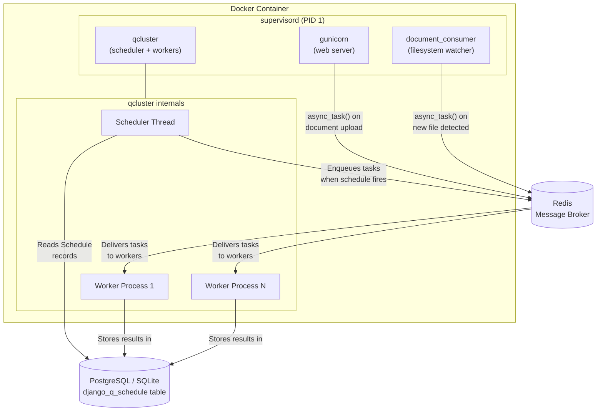
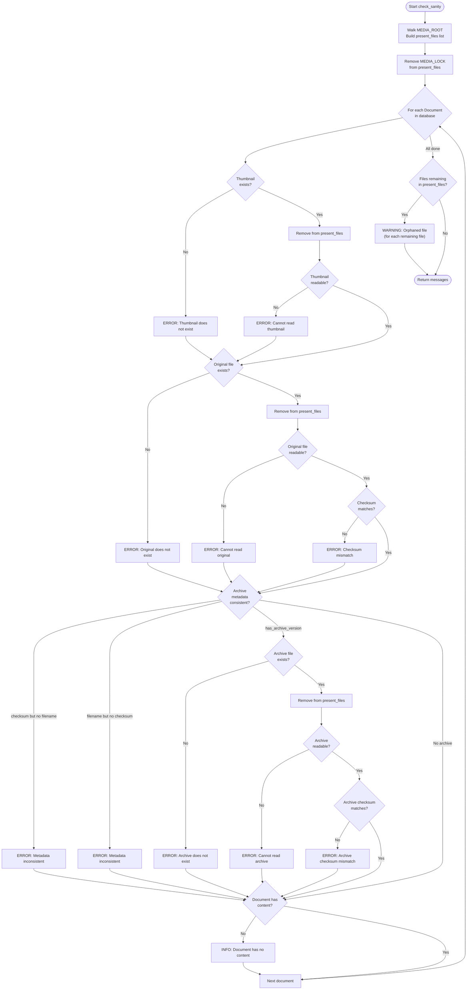
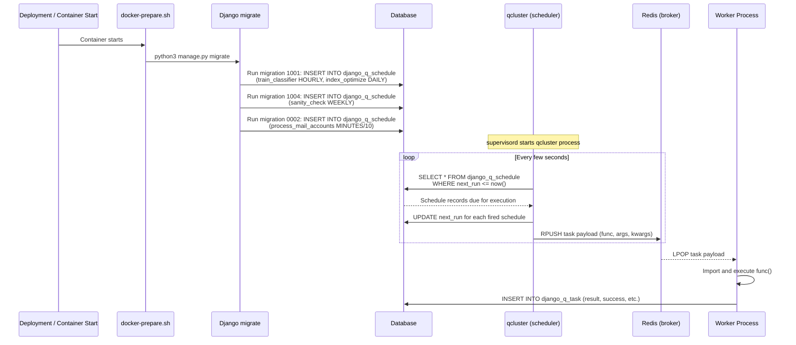
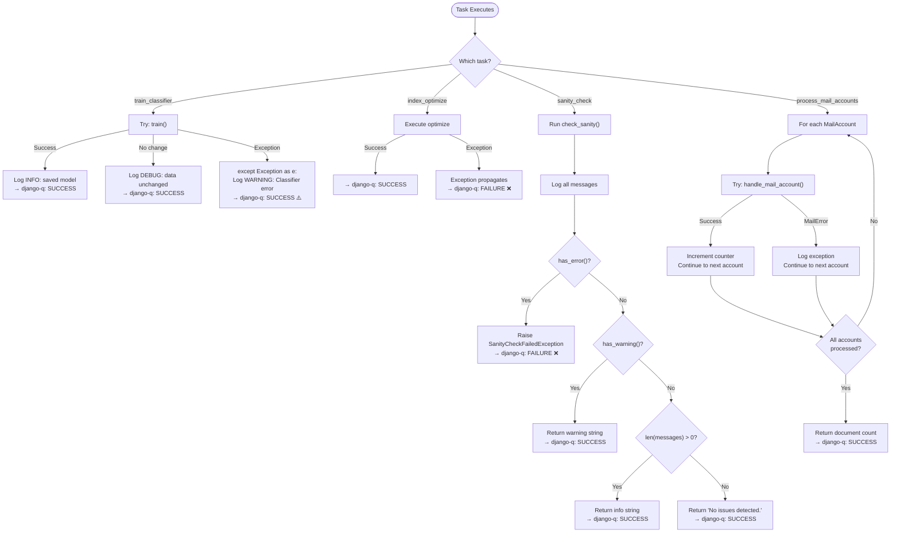
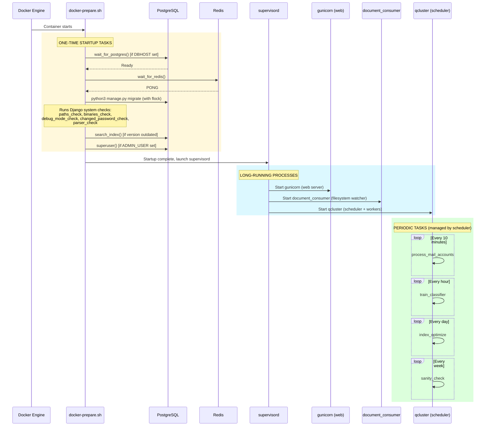
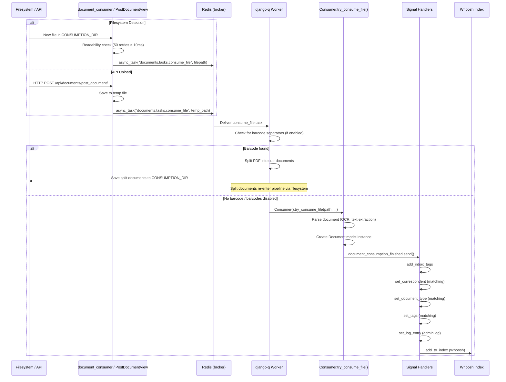

# Paperless-ngx Background Maintenance Subsystem — Architecture Analysis

**Comprehensive Q&A based on codebase at commit `542221a38dff`**

| Metadata | Value |
|----------|-------|
| **Author** | Blitzy Automated Analysis |
| **Date** | 2024 |
| **Scope** | All background/periodic tasks, startup procedures, task scheduling, failure handling, and maintenance mechanisms |
| **Methodology** | Static analysis of source code — every claim cites specific file paths and line numbers |

---

## Table of Contents

1. [Key Architectural Finding — django-q, Not Celery](#1-key-architectural-finding--django-q-not-celery)
2. [Architecture Overview](#2-architecture-overview)
3. [Periodic Task Inventory](#3-periodic-task-inventory)
4. [Per-Task Deep Dive](#4-per-task-deep-dive)
5. [Schedule Configuration Source (Q_CLUSTER)](#5-schedule-configuration-source-qcluster)
6. [Sanity Checker Deep Dive](#6-sanity-checker-deep-dive)
7. [Index Optimization](#7-index-optimization)
8. [Database Cleanup](#8-database-cleanup)
9. [Failed Document Retries / Stuck Job Handling](#9-failed-document-retries--stuck-job-handling)
10. [Task Registration Code Path](#10-task-registration-code-path)
11. [Task Failure Handling](#11-task-failure-handling)
12. [Startup vs. Scheduled Tasks](#12-startup-vs-scheduled-tasks)
13. [Task Execution History (Database Tables)](#13-task-execution-history-database-tables)
14. [Enable/Disable Controls](#14-enabledisable-controls)
15. [Document Consumption Pipeline](#15-document-consumption-pipeline)
16. [Summary](#16-summary)

---

## 1. Key Architectural Finding — django-q, Not Celery

> **Critical Correction:** Paperless-ngx does **NOT** use Celery or Celery Beat for task scheduling. It uses **django-q**, a completely different task queue and scheduler framework.

### Evidence

1. **`Pipfile`, line 17** declares `django-q = "~=1.3"`. There is **no** `celery` dependency anywhere in the Pipfile — the word "celery" does not appear in the file at all.

2. **`src/paperless/settings.py`, lines 449–457** define a `Q_CLUSTER` dictionary — this is django-q's configuration block. There is no `CELERY_BEAT_SCHEDULE`, `CELERY_BROKER_URL`, or any Celery-related setting anywhere in the settings file.

3. **`src/paperless/settings.py`, line 110** includes `"django_q"` in the `INSTALLED_APPS` list. There is no `"celery"` or `"django_celery_beat"` entry.

4. **`docker/supervisord.conf`, line 29** starts the scheduler process with the command `python3 manage.py qcluster` — this is django-q's management command that runs the scheduler and workers. There is no `celery worker` or `celery beat` command anywhere in the Docker configuration.

### Rationale: Why django-q Instead of Celery?

The architectural difference is significant:

- **Celery** typically uses a separate beat process with schedules defined in Python configuration dicts or a database backend, communicating via AMQP (RabbitMQ) or Redis.
- **django-q** stores schedules as regular Django ORM `Schedule` model records in the same database as the application. Schedules are created via standard Django data migrations. The `qcluster` process includes both the scheduler (which reads `Schedule` records from the database) and the worker pool (which executes tasks dispatched via Redis).

This means paperless-ngx's periodic task configuration is:
- **Database-native**: Schedules live in the `django_q_schedule` table as rows, not in Python config files.
- **Migration-managed**: New schedules are added via Django data migrations, ensuring they are created automatically on first deployment.
- **Admin-editable**: Schedules can be viewed, modified, or deleted through the Django admin interface without code changes.

*Source: `Pipfile`, line 17; `src/paperless/settings.py`, lines 110, 449–457; `docker/supervisord.conf`, line 29*

---

## 2. Architecture Overview

### 2.1 Process Supervision Architecture

Paperless-ngx runs three long-lived processes under `supervisord`, as defined in `docker/supervisord.conf`:

| Process | supervisord Name | Command | Purpose |
|---------|-----------------|---------|---------|
| Web Server | `gunicorn` | `gunicorn -c /usr/src/paperless/gunicorn.conf.py paperless.asgi:application` | Serves the REST API and web UI |
| Document Consumer | `consumer` | `python3 manage.py document_consumer` | Watches filesystem for new documents |
| Task Scheduler + Workers | `scheduler` | `python3 manage.py qcluster` | Runs django-q scheduler and worker pool |

*Source: `docker/supervisord.conf`, lines 10–11, 19–20, 28–29*

### 2.2 Task Scheduling Architecture Diagram



**How it works:**

1. The `qcluster` process starts a scheduler thread and `N` worker processes (configured by `PAPERLESS_TASK_WORKERS`).
2. The scheduler thread periodically polls the `django_q_schedule` database table for schedules whose `next_run` has passed.
3. When a schedule fires, the scheduler enqueues the task function name and arguments into Redis.
4. A worker process picks up the task from Redis, executes the Python function, and stores the result back in the database (`django_q_task` table).
5. Non-periodic tasks (like document consumption) are also enqueued into Redis by the web server (`gunicorn`) and the filesystem watcher (`document_consumer`) using `async_task()`.

*Source: `src/paperless/settings.py`, line 456 (Redis broker); `docker/supervisord.conf`, lines 28–29 (qcluster command)*

---

## 3. Periodic Task Inventory

### Complete Task Inventory (Exhaustive — There Are No Others)

The following 4 periodic tasks are the **complete set** of all tasks registered with the django-q scheduler. This was determined by searching all Django migration files across the entire codebase for `Schedule.objects.create()` or `schedule()` calls from `django_q`.

| # | Task Function Path | Human-Readable Name | Schedule Type | Interval | Registration Source (Migration File) |
|---|---|---|---|---|---|
| 1 | `documents.tasks.train_classifier` | "Train the classifier" | `Schedule.HOURLY` | Every hour | `src/documents/migrations/1001_auto_20201109_1636.py`, lines 10–14 |
| 2 | `documents.tasks.index_optimize` | "Optimize the index" | `Schedule.DAILY` | Every day | `src/documents/migrations/1001_auto_20201109_1636.py`, lines 15–19 |
| 3 | `documents.tasks.sanity_check` | "Perform sanity check" | `Schedule.WEEKLY` | Every week | `src/documents/migrations/1004_sanity_check_schedule.py`, lines 10–14 |
| 4 | `paperless_mail.tasks.process_mail_accounts` | "Check all e-mail accounts" | `Schedule.MINUTES` | Every 10 minutes | `src/paperless_mail/migrations/0002_auto_20201117_1334.py`, lines 10–15 |

### How This Inventory Was Verified

1. Searched all migration files in `src/documents/migrations/` and `src/paperless_mail/migrations/` for references to `django_q.tasks.schedule` or `django_q.models.Schedule`.
2. Found exactly three migration files containing schedule registrations:
   - `1001_auto_20201109_1636.py` (registers 2 schedules)
   - `1004_sanity_check_schedule.py` (registers 1 schedule)
   - `0002_auto_20201117_1334.py` (registers 1 schedule)
3. No other migration files in any app reference django-q's Schedule model.
4. No schedules are created programmatically outside of migrations (searched `src/` for `schedule(` and `Schedule.objects.create` — found only the migration files and imports).

---

## 4. Per-Task Deep Dive

### 4.1 `train_classifier()` — ML Model Training

**Source:** `src/documents/tasks.py`, lines 48–72

**Behavior:**

1. **Pre-check** (lines 49–55): The function first checks whether ANY `Tag`, `DocumentType`, or `Correspondent` model instance has `matching_algorithm=Tag.MATCH_AUTO`. If none exist (meaning no model uses automatic classification), the function returns immediately — it's a no-op. This is an optimization to avoid unnecessary work when auto-matching is not configured.

2. **Load existing model** (line 57): Calls `load_classifier()` which attempts to load a previously trained model from `settings.MODEL_FILE` (which resolves to `data/classification_model.pickle` per `src/paperless/settings.py`, line 74).

3. **Create new if needed** (lines 59–60): If no saved model exists, creates a fresh `DocumentClassifier()` instance.

4. **Training** (line 63): Calls `classifier.train()` which is implemented in `src/documents/classifier.py`, lines 115–249.

5. **Data hash optimization** (classifier.py, lines 124, 161–164): Before training, the `train()` method computes a SHA-1 hash of all training data (document content + labels). If this hash matches the previously stored hash (`self.data_hash`), the method returns `False` — skipping retraining entirely. This prevents unnecessary retraining every hour when no documents have changed.

6. **scikit-learn ML pipeline** (classifier.py, lines 188–249):
   - **Vectorization**: Uses `CountVectorizer(analyzer="word", ngram_range=(1, 2), min_df=0.01)` to convert document text into feature vectors.
   - **Classification**: Uses `MLPClassifier(tol=0.01)` (a neural network classifier) for three separate classification tasks: tags, correspondents, and document types.
   - Each classifier is trained independently on the vectorized data.

7. **Model persistence** (line 67): Saves the trained model via `classifier.save()`, which writes a pickle file with `FORMAT_VERSION = 7` (classifier.py, line 63) containing the vectorizer, binarizers, and classifiers.

8. **Logging** (lines 64–65, 69): On successful training, logs `"Saving updated classifier model to {path}..."` at INFO level. If data is unchanged, logs `"Training data unchanged."` at DEBUG level.

**Exception Handling** (lines 71–72):
```python
except Exception as e:
    logger.warning("Classifier error: " + str(e))
```
- Catches **ALL** exceptions with a bare `except Exception`.
- Logs only a WARNING with the error message string.
- **Does NOT re-raise the exception.**
- **Consequence**: django-q sees this task as SUCCESSFUL even when training fails. The failure is recorded only in application logs, not in django-q's `Failure` table. This is a deliberate design choice — transient ML errors (e.g., insufficient training data, numerical convergence issues) should not generate noisy failure records every hour.

**Logger:** `logging.getLogger("paperless.tasks")` — `src/documents/tasks.py`, line 29

*Source: `src/documents/tasks.py`, lines 48–72; `src/documents/classifier.py`, lines 63, 115–249*

---

### 4.2 `index_optimize()` — Whoosh Search Index Optimization

**Source:** `src/documents/tasks.py`, lines 32–35

**Behavior:**

```python
def index_optimize():
    ix = index.open_index()
    writer = AsyncWriter(ix)
    writer.commit(optimize=True)
```

1. **Opens the Whoosh search index** (line 33) via `index.open_index()`, which opens the index directory at `settings.INDEX_DIR` (which is `os.path.join(DATA_DIR, "index")` per `src/paperless/settings.py`, line 73).

2. **Creates an AsyncWriter** (line 34): `AsyncWriter` is Whoosh's thread-safe writer that queues write operations.

3. **Commits with optimize=True** (line 35): This is the key operation. When `optimize=True`, Whoosh merges all index segments into a single segment. Over time, as documents are added, updated, and deleted, the Whoosh index accumulates multiple segments. Optimization merges them, which:
   - Reduces disk space usage
   - Improves query performance (fewer segments to search)
   - Removes deleted document references from the index

**Exception Handling:** **NONE**. There is no `try/except` block around this function. If an exception occurs (e.g., disk full, corrupted index, permission error), it propagates directly to django-q, which records it as a `Failure` in the task history. This is actually appropriate — index corruption is a serious issue that should be visible in the failure log.

**Whoosh Schema** (defined in `src/documents/index.py`, lines 31–49):

| Field | Whoosh Type | Purpose |
|-------|-----------|---------|
| `id` | `NUMERIC(stored=True, unique=True)` | Document primary key |
| `title` | `TEXT(sortable=True)` | Document title |
| `content` | `TEXT()` | Full document text content |
| `asn` | `NUMERIC(sortable=True)` | Archive serial number |
| `correspondent` | `TEXT(sortable=True)` | Correspondent name |
| `correspondent_id` | `NUMERIC()` | Correspondent FK |
| `has_correspondent` | `BOOLEAN()` | Whether document has a correspondent |
| `tag` | `KEYWORD(commas=True, scorable=True, lowercase=True)` | Tag names |
| `tag_id` | `KEYWORD(commas=True, scorable=True)` | Tag FKs |
| `has_tag` | `BOOLEAN()` | Whether document has any tags |
| `type` | `TEXT(sortable=True)` | Document type name |
| `type_id` | `NUMERIC()` | Document type FK |
| `has_type` | `BOOLEAN()` | Whether document has a type |
| `created` | `DATETIME(sortable=True)` | Document creation date |
| `modified` | `DATETIME(sortable=True)` | Last modification date |
| `added` | `DATETIME(sortable=True)` | Date added to paperless |

*Source: `src/documents/tasks.py`, lines 32–35; `src/documents/index.py`, lines 31–49; `src/paperless/settings.py`, line 73*

---

### 4.3 `sanity_check()` — System Integrity Verification

**Source:** `src/documents/tasks.py`, lines 255–267

**Behavior:**

```python
def sanity_check():
    messages = sanity_checker.check_sanity()
    messages.log_messages()
    if messages.has_error():
        raise SanityCheckFailedException("Sanity check failed with errors. See log.")
    elif messages.has_warning():
        return "Sanity check exited with warnings. See log."
    elif len(messages) > 0:
        return "Sanity check exited with infos. See log."
    else:
        return "No issues detected."
```

1. Calls `sanity_checker.check_sanity()` (line 256), which performs 11 distinct validation checks on every document in the database (detailed in [Section 6](#6-sanity-checker-deep-dive)).
2. Logs all messages to the `paperless.sanity_checker` logger (line 258).
3. **On errors** (line 260–261): Raises `SanityCheckFailedException`, which propagates to django-q as a task `Failure`.
4. **On warnings** (line 262–263): Returns a warning string — django-q records this as a `Success`.
5. **On info only** (line 264–265): Returns an info string — `Success`.
6. **No issues** (line 267): Returns `"No issues detected."` — `Success`.

**Exception Handling:** The `sanity_check()` wrapper itself does not catch exceptions — it deliberately allows `SanityCheckFailedException` to propagate. The underlying `check_sanity()` function catches `OSError` exceptions per-check to prevent one corrupt file from aborting the entire scan.

*Source: `src/documents/tasks.py`, lines 255–267; `src/documents/sanity_checker.py`, lines 45–46*

---

### 4.4 `process_mail_accounts()` — Email Polling

**Source:** `src/paperless_mail/tasks.py`, lines 11–22

**Behavior:**

```python
def process_mail_accounts():
    total_new_documents = 0
    for account in MailAccount.objects.all():
        try:
            total_new_documents += MailAccountHandler().handle_mail_account(account)
        except MailError:
            logger.exception(f"Error while processing mail account {account}")
    if total_new_documents > 0:
        return f"Added {total_new_documents} document(s)."
    else:
        return "No new documents were added."
```

1. **Iterates ALL mail accounts** (line 13): Queries `MailAccount.objects.all()` to get every configured email account.
2. **Per-account processing** (line 15): For each account, creates a new `MailAccountHandler()` instance and calls `handle_mail_account(account)`, which:
   - Connects via IMAP to the mail server
   - Evaluates configured mail rules
   - Fetches and filters messages matching the rules
   - Extracts attachments
   - Stages files and queues consumption via `async_task("documents.tasks.consume_file", ...)`
3. **Error isolation** (lines 16–17): Catches `MailError` **per account**. If one email account fails (e.g., authentication error, connection timeout), processing continues to the next account. The error is logged with full traceback via `logger.exception()`.
4. **Return value** (lines 19–22): Returns a count of new documents or `"No new documents were added."`.

**Exception Handling:** The per-account `except MailError` ensures one failing account doesn't block others. Since `MailError` exceptions are caught, django-q sees this task as `Success` even if individual accounts fail. Only an **unexpected** exception type (not `MailError`) would propagate to django-q as a `Failure`.

**Logger:** `logging.getLogger("paperless.mail.tasks")` — `src/paperless_mail/tasks.py`, line 8

**MailAccountHandler:** Defined in `src/paperless_mail/mail.py`. The `MailError` exception class is also defined there (line 26–27).

*Source: `src/paperless_mail/tasks.py`, lines 8, 11–22; `src/paperless_mail/mail.py`, lines 11, 26–27*

---

## 5. Schedule Configuration Source (Q_CLUSTER)

### 5.1 Complete Q_CLUSTER Configuration

The task queue is configured via the `Q_CLUSTER` dictionary in `src/paperless/settings.py`, lines 449–457:

```python
Q_CLUSTER = {
    "name": "paperless",
    "catch_up": False,
    "recycle": 1,
    "retry": PAPERLESS_WORKER_RETRY,
    "timeout": PAPERLESS_WORKER_TIMEOUT,
    "workers": TASK_WORKERS,
    "redis": os.getenv("PAPERLESS_REDIS", "redis://localhost:6379"),
}
```

### 5.2 Parameter Mapping Table

| Q_CLUSTER Key | Environment Variable | Default Value | Computation Logic | Source |
|---|---|---|---|---|
| `workers` | `PAPERLESS_TASK_WORKERS` | CPU-dependent (see below) | `default_task_workers()`: `max(floor(sqrt(cpu_count)), 1)` for ≥4 cores; else `cpu_count` | `settings.py`, lines 427–438 |
| `timeout` | `PAPERLESS_WORKER_TIMEOUT` | `1800` (30 minutes) | Direct integer from environment variable | `settings.py`, line 440 |
| `retry` | `PAPERLESS_WORKER_RETRY` | `PAPERLESS_WORKER_TIMEOUT + 10` = `1810` | Must be > timeout per django-q requirements | `settings.py`, lines 444–447 |
| `redis` | `PAPERLESS_REDIS` | `redis://localhost:6379` | Direct string from environment variable | `settings.py`, line 456 |
| `name` | N/A (hardcoded) | `"paperless"` | — | `settings.py`, line 450 |
| `catch_up` | N/A (hardcoded) | `False` | — | `settings.py`, line 451 |
| `recycle` | N/A (hardcoded) | `1` | — | `settings.py`, line 452 |

### 5.3 Parameter Explanations

#### `catch_up = False` (line 451)

**What it means:** When the django-q scheduler was down (e.g., container restart, maintenance window) and missed one or more scheduled task executions, it does **NOT** retroactively execute the missed runs. Only future schedules are honored from the current time forward.

**Rationale:** This prevents a thundering herd of tasks executing simultaneously after a restart. If the system was down for a day, you would NOT want 24 missed `train_classifier` runs, 144 missed `process_mail_accounts` runs, etc. all firing at once. This is a sensible default for resource-intensive tasks like ML training and OCR processing.

#### `recycle = 1` (line 452)

**What it means:** Worker processes are recycled (terminated and restarted) after processing just **1 task**. Each worker handles exactly one task before being replaced by a fresh process.

**Rationale:** This is a memory leak mitigation strategy. Paperless-ngx's tasks involve heavy libraries (scikit-learn, pikepdf, ocrmypdf, tesseract) that may not fully release memory after processing. By recycling after every task, any leaked memory is reclaimed by the operating system when the process exits.

#### `retry` > `timeout` (lines 444–447, 453–454)

**What it means:** django-q requires the `retry` parameter to be strictly greater than `timeout`. The `timeout` is how long a task is allowed to run before being killed. The `retry` is how long after the initial task dispatch before django-q considers it "lost" and re-enqueues it.

**Default values:** `timeout = 1800` (30 minutes), `retry = 1810` (30 minutes + 10 seconds). The 10-second buffer prevents a race condition where a task is both killed by timeout AND re-enqueued at the exact same moment.

**Rationale:** Document consumption (especially OCR of large PDFs) can be time-consuming. A 30-minute timeout accommodates most documents while catching genuinely stuck tasks.

#### `default_task_workers()` (lines 427–435)

```python
def default_task_workers() -> int:
    available_cores = max(multiprocessing.cpu_count(), 1)
    try:
        if available_cores < 4:
            return available_cores
        return max(math.floor(math.sqrt(available_cores)), 1)
    except NotImplementedError:
        return 1
```

**Logic:** On systems with fewer than 4 CPU cores, use all cores as workers. On larger systems, use `floor(sqrt(cpu_count))` workers — e.g., 2 workers on 4–8 cores, 3 on 9–15 cores, 4 on 16 cores. This balances parallel task execution against leaving CPU capacity for the web server and document consumer.

*Source: `src/paperless/settings.py`, lines 427–457*

---

## 6. Sanity Checker Deep Dive

### 6.1 Module Location

The sanity checker is implemented in `src/documents/sanity_checker.py`. The CLI wrapper is `src/documents/management/commands/document_sanity_checker.py`.

### 6.2 Validation Inventory

The `check_sanity()` function (`src/documents/sanity_checker.py`, lines 49–133) performs the following checks:

**Pre-scan setup** (lines 52–59): Walks the entire `MEDIA_ROOT` directory tree, building a list of all files present on disk (`present_files`). Removes the `MEDIA_LOCK` file from this list (the lock file is expected to exist and should not be flagged as orphaned).

**Per-document checks** (line 61 iterates `Document.objects.all()`):

| # | Check | Lines | Severity | Error Message Pattern |
|---|-------|-------|----------|----------------------|
| 1 | Thumbnail existence | 63–64 | ERROR | `"Thumbnail of document {pk} does not exist."` |
| 2 | Thumbnail readability | 68–72 | ERROR | `"Cannot read thumbnail file of document {pk}: {e}"` |
| 3 | Original file existence | 76–77 | ERROR | `"Original of document {pk} does not exist."` |
| 4 | Original file readability + MD5 computation | 81–85 | ERROR | `"Cannot read original file of document {pk}: {e}"` |
| 5 | Original file checksum | 87–91 | ERROR | `"Checksum mismatch of document {pk}. Stored: {stored}, actual: {actual}."` |
| 6a | Archive metadata: has checksum but no filename | 94–98 | ERROR | `"Document {pk} has an archive file checksum, but no archive filename."` |
| 6b | Archive metadata: has filename but no checksum | 99–103 | ERROR | `"Document {pk} has an archive file, but its checksum is missing."` |
| 7 | Archive file existence | 104–106 | ERROR | `"Archived version of document {pk} does not exist."` |
| 8 | Archive file readability + MD5 computation | 110–116 | ERROR | `"Cannot read archive file of document {pk}: {e}"` |
| 9 | Archive file checksum | 118–124 | ERROR | `"Checksum mismatch of archived document {pk}. Stored: {stored}, actual: {actual}."` |
| 10 | Content presence | 127–128 | INFO | `"Document {pk} has no content."` |

**Post-document check** (lines 130–131):

| # | Check | Lines | Severity | Message Pattern |
|---|-------|-------|----------|-----------------|
| 11 | Orphaned files in media directory | 130–131 | WARNING | `"Orphaned file in media dir: {path}"` |

As each document's files are verified, they are removed from the `present_files` list (lines 66–67, 79–80, 108–109). After all documents are processed, any files remaining in `present_files` are orphans — files on disk that no document in the database references.

### 6.3 Sanity Checker Validation Flow Diagram



### 6.4 SanityCheckMessages Class

**Source:** `src/documents/sanity_checker.py`, lines 10–42

The `SanityCheckMessages` class accumulates validation findings with severity levels:

| Method | Level | Line | Description |
|--------|-------|------|-------------|
| `error(message)` | `logging.ERROR` | 14–15 | Records critical data integrity issues |
| `warning(message)` | `logging.WARNING` | 17–18 | Records non-critical issues (e.g., orphaned files) |
| `info(message)` | `logging.INFO` | 20–21 | Records informational notices (e.g., empty content) |
| `log_messages()` | — | 23–30 | Logs all collected messages; if none, logs `"Sanity checker detected no issues."` at INFO |
| `has_error()` | — | 38–39 | Returns `True` if any ERROR-level messages exist |
| `has_warning()` | — | 41–42 | Returns `True` if any WARNING-level messages exist |

### 6.5 Log Output Format

- **Logger name:** `"paperless.sanity_checker"` (line 24)
- **Log format:** `[{asctime}] [{levelname}] [{name}] {message}` per the LOGGING configuration in `src/paperless/settings.py`, lines 377–380
- **Example output:** `[2024-01-15 03:00:00,000] [ERROR] [paperless.sanity_checker] Checksum mismatch of document 42. Stored: abc123, actual: def456.`
- **When no issues:** `[2024-01-15 03:00:00,000] [INFO] [paperless.sanity_checker] Sanity checker detected no issues.` (line 27)

### 6.6 SanityCheckFailedException

**Source:** `src/documents/sanity_checker.py`, lines 45–46

```python
class SanityCheckFailedException(Exception):
    pass
```

This exception is raised by the `sanity_check()` task function (in `src/documents/tasks.py`, line 261) when errors are detected. It propagates to django-q, which records the task as a `Failure`.

### 6.7 Execution Frequency

- **Weekly**, per `Schedule.WEEKLY` in `src/documents/migrations/1004_sanity_check_schedule.py`, line 13.

*Source: `src/documents/sanity_checker.py`, lines 10–133; `src/documents/tasks.py`, lines 255–267; `src/documents/migrations/1004_sanity_check_schedule.py`, line 13*

---

## 7. Index Optimization

### 7.1 Does Automatic Index Optimization Exist?

**Yes.** The `index_optimize` task runs **daily** as a periodic task registered in `src/documents/migrations/1001_auto_20201109_1636.py`, lines 15–19.

### 7.2 What It Does

The `index_optimize()` function in `src/documents/tasks.py`, lines 32–35:

1. Opens the Whoosh search index from `settings.INDEX_DIR` (which is `os.path.join(DATA_DIR, "index")` per `src/paperless/settings.py`, line 73).
2. Creates an `AsyncWriter` — Whoosh's thread-safe index writer.
3. Commits with `optimize=True`, which triggers a **full segment merge**.

**What segment merging does:** As documents are added, updated, and deleted, Whoosh creates multiple index segments. Over time, this fragmentation slows queries. The `optimize=True` flag merges ALL segments into a single, compact segment. This:
- Reclaims disk space from deleted documents
- Improves search query performance
- Reduces the number of file handles needed for searching

### 7.3 Index Location

`settings.INDEX_DIR = os.path.join(DATA_DIR, "index")` — typically resolves to `/usr/src/paperless/data/index` in the Docker deployment.

*Source: `src/documents/tasks.py`, lines 32–35; `src/paperless/settings.py`, line 73*

---

## 8. Database Cleanup

### 8.1 Finding: No Automatic Database Cleanup Exists

**There are NO periodic tasks for database cleanup, vacuuming, log pruning, or any other database maintenance operation.**

### 8.2 Evidence

1. **Searched all 4 registered periodic schedules** (Section 3): None relate to database maintenance. The tasks are: classifier training, index optimization, sanity checking, and mail checking.

2. **Searched `src/documents/tasks.py`** (all 281 lines): No function performs database cleanup, log deletion, or vacuuming. The functions are: `index_optimize`, `index_reindex`, `train_classifier`, `barcode_reader`, `scan_file_for_separating_barcodes`, `separate_pages`, `save_to_dir`, `consume_file`, `sanity_check`, and `bulk_update_documents`. None relate to database maintenance.

3. **Searched `src/paperless/settings.py`** for any cleanup, pruning, retention, or TTL configuration: None found.

4. **The `documents.Log` model** (`src/documents/models.py`, lines 285–313) has no TTL (time-to-live), max-age, max-count, or automatic cleanup mechanism. Log entries accumulate indefinitely.

5. **django-q's `save_limit` config option** (which limits how many successful task results are retained) is **NOT configured** in the `Q_CLUSTER` settings. Only `name`, `catch_up`, `recycle`, `retry`, `timeout`, `workers`, and `redis` are set (lines 449–457). This means django-q retains all task results indefinitely by default.

### 8.3 Implications

- The `documents_log` table will grow unbounded over the lifetime of the installation.
- The `django_q_task` table will accumulate one record per task execution (4 tasks × varying frequencies = hundreds of records per week), also growing unbounded.
- No PostgreSQL `VACUUM` or SQLite `VACUUM` is run automatically.
- Database maintenance is the operator's responsibility.

*Source: `src/documents/tasks.py` (entire file); `src/paperless/settings.py`, lines 449–457; `src/documents/models.py`, lines 285–313*

---

## 9. Failed Document Retries / Stuck Job Handling

### 9.1 django-q Retry Semantics

The `retry` parameter in `Q_CLUSTER` (`src/paperless/settings.py`, line 453) controls django-q's built-in task retry mechanism:

- **`timeout`** (default: `1800` seconds / 30 minutes): If a task runs longer than this, the worker process is killed.
- **`retry`** (default: `1810` seconds / 30 minutes + 10 seconds): If a task has not reported completion after this many seconds since dispatch, django-q considers it "lost" and re-enqueues it.

**Important:** This retry mechanism applies to **all** tasks — there is no dedicated "retry failed documents" periodic task. The retry is for task-level timeouts, not for application-level errors (tasks that raise exceptions are NOT automatically retried).

### 9.2 Consumer-Level File Readability Retry

**Source:** `src/documents/management/commands/document_consumer.py`, lines 58–75

Before queuing a file for consumption, the `_consume()` function performs a readability check:

```python
os_error_retry_count: Final[int] = 50
os_error_retry_wait: Final[float] = 0.01
```

- **50 attempts × 10ms wait = 500ms total** maximum wait time.
- **Purpose:** Files may still be in the process of being written when detected by the filesystem watcher. This retry loop waits for the file to become readable.
- **On failure** (line 74): Logs `"Not consuming file {filepath}: OS reports file as busy still"` at WARNING level and skips the file entirely (no re-queuing).

### 9.3 Consumer Stability Wait (Polling Mode)

**Source:** `src/documents/management/commands/document_consumer.py`, lines 99–125

In polling mode, the `_consume_wait_unmodified()` function adds an additional stability check:

- **Behavior:** Repeatedly checks the file's `mtime` and `size`. Only proceeds with consumption when both values are unchanged between two consecutive checks.
- **Retries:** `CONSUMER_POLLING_RETRY_COUNT` (default: `5`, from `src/paperless/settings.py`, lines 482–484)
- **Delay:** `CONSUMER_POLLING_DELAY` seconds between checks (default: `5`, from `src/paperless/settings.py`, line 480)
- **On timeout** (line 125): Logs `"Timeout while waiting on file {file} to remain unmodified."` at ERROR level.

### 9.4 No Dedicated Stuck Job Handler

**Finding:** There is **NO** periodic task that scans for "stuck" or "failed" jobs and retries them.

**Evidence:**
- Searched all 4 registered schedules — none relate to retry logic.
- Searched `src/documents/tasks.py` — no function implements stuck job detection or retry.
- The only retry mechanism is django-q's built-in `timeout`/`retry` configuration, which handles tasks that exceed the time limit.

**Behavior for missed schedules:** The `catch_up=False` setting (line 451) means if the scheduler was down and missed dispatching a periodic task, it will **not** retroactively execute the missed run. The task simply runs at its next scheduled time.

*Source: `src/documents/management/commands/document_consumer.py`, lines 58–75, 99–125; `src/paperless/settings.py`, lines 440, 444–447, 451, 480, 482–484*

---

## 10. Task Registration Code Path

### 10.1 Registration Mechanism

Periodic tasks in paperless-ngx are registered via **Django data migrations** that create `django_q.models.Schedule` records in the database. This is a one-time operation — once the migration runs during initial deployment (or upgrade), the schedule record exists in the database permanently.

**The registration flow:**

1. Each migration file imports `from django_q.tasks import schedule` and `from django_q.models import Schedule`.
2. The migration's forward function calls `schedule()`, which creates a `Schedule` ORM object and saves it to the database.
3. At runtime, the `qcluster` process's scheduler thread periodically reads `Schedule` records from the database and checks if any are due for execution.
4. When a schedule's `next_run` time has passed, the scheduler enqueues the task (the `func` field) into Redis for a worker to pick up.

### 10.2 Migration File Details

#### Migration 1: `src/documents/migrations/1001_auto_20201109_1636.py`

**Registers:** `train_classifier` (HOURLY) and `index_optimize` (DAILY)

- **Forward function** `add_schedules()` (lines 9–19):
  ```python
  schedule(
      "documents.tasks.train_classifier",
      name="Train the classifier",
      schedule_type=Schedule.HOURLY,
  )
  schedule(
      "documents.tasks.index_optimize",
      name="Optimize the index",
      schedule_type=Schedule.DAILY,
  )
  ```
- **Reverse function** `remove_schedules()` (lines 22–24): Deletes the Schedule records by matching the `func` field.
- **Dependencies** (lines 29–32): `("documents", "1000_update_paperless_all")` and `("django_q", "0013_task_attempt_count")`.

#### Migration 2: `src/documents/migrations/1004_sanity_check_schedule.py`

**Registers:** `sanity_check` (WEEKLY)

- **Forward function** `add_schedules()` (lines 9–14):
  ```python
  schedule(
      "documents.tasks.sanity_check",
      name="Perform sanity check",
      schedule_type=Schedule.WEEKLY,
  )
  ```
- **Reverse function** `remove_schedules()` (lines 17–18): Deletes by `func` field.
- **Dependencies** (lines 23–26): `("documents", "1003_mime_types")` and `("django_q", "0013_task_attempt_count")`.

#### Migration 3: `src/paperless_mail/migrations/0002_auto_20201117_1334.py`

**Registers:** `process_mail_accounts` (every 10 MINUTES)

- **Forward function** `add_schedules()` (lines 9–15):
  ```python
  schedule(
      "paperless_mail.tasks.process_mail_accounts",
      name="Check all e-mail accounts",
      schedule_type=Schedule.MINUTES,
      minutes=10,
  )
  ```
- **Reverse function** `remove_schedules()` (lines 18–19): Deletes by `func` field.
- **Dependencies** (lines 24–27): `("paperless_mail", "0001_initial")` and `("django_q", "0013_task_attempt_count")`.

### 10.3 Task Registration Sequence Diagram



*Source: `src/documents/migrations/1001_auto_20201109_1636.py`; `src/documents/migrations/1004_sanity_check_schedule.py`; `src/paperless_mail/migrations/0002_auto_20201117_1334.py`*

---

## 11. Task Failure Handling

### 11.1 Per-Task Exception Analysis

| Task | Exception Handling | What django-q Records | Consequence |
|---|---|---|---|
| `train_classifier` | `except Exception as e:` catches ALL exceptions, logs as WARNING (lines 71–72) | **SUCCESS** (exception is suppressed) | Silent failure — only visible in application logs (`paperless.tasks`), not in django-q's Failure table |
| `index_optimize` | **NO** exception handling (lines 32–35) | **FAILURE** if any exception occurs | Exception propagates to django-q, recorded in Failure table with full traceback |
| `sanity_check` | Raises `SanityCheckFailedException` on errors (line 261); does not catch other exceptions | **FAILURE** on errors; **SUCCESS** on warnings/info only | Errors visible in both application logs and django-q Failure table |
| `process_mail_accounts` | `except MailError:` per account (lines 16–17) | **SUCCESS** (MailError exceptions caught per-account) | Individual account failures logged, but task overall succeeds. Only non-MailError exceptions cause a django-q Failure. |

### 11.2 Task Failure Handling Decision Tree



### 11.3 django-q Failure Behavior

When a task function raises an unhandled exception:

1. django-q catches the exception and stores the task result in the `django_q_task` table with `success=False`.
2. The task result includes the full exception traceback, accessible via the `Failure` proxy model or the Django admin interface.
3. django-q does **NOT** automatically retry failed periodic tasks. The task will simply run again at its next scheduled interval.
4. The `retry` parameter in `Q_CLUSTER` only applies to **timeout-based** retries (when a task exceeds the `timeout` limit), not to exception-based failures.

**Alerting:** django-q has no built-in alerting mechanism. Failed tasks are only visible by:
- Checking the django-q admin pages (`/admin/django_q/failure/`)
- Monitoring application log files
- Querying the `django_q_task` table directly

*Source: `src/documents/tasks.py`, lines 32–35, 48–72, 255–267; `src/paperless_mail/tasks.py`, lines 11–22*

---

## 12. Startup vs. Scheduled Tasks

### 12.1 Startup Tasks (docker-prepare.sh)

**Source:** `docker/docker-prepare.sh`

The container entrypoint runs `docker-prepare.sh` **once** at container startup, before supervisord launches the three long-running processes. The `do_work()` function (lines 66–79) executes these steps in order:

| Order | Function | Lines | Condition | What It Does |
|-------|----------|-------|-----------|--------------|
| 1 | `wait_for_postgres()` | 5–28 | Only if `PAPERLESS_DBHOST` is set (line 67) | Retries `pg_isready` up to 5 times with 5-second delays. Exits with code 1 if PostgreSQL is unreachable. |
| 2 | `wait_for_redis()` | 30–36 | Always (line 71) | Delegates to `python3 /sbin/wait-for-redis.py`, which pings Redis. Exits with code 1 if Redis is unreachable. |
| 3 | `migrations()` | 38–47 | Always (line 73) | Acquires an exclusive `flock` on `/usr/src/paperless/data/migration_lock` (to prevent concurrent migrations in multi-container deployments), then runs `python3 manage.py migrate`. |
| 4 | `search_index()` | 49–58 | Only if index version file is missing or outdated (line 53) | Checks if `/usr/src/paperless/data/.index_version` contains `1`. If not (or if file doesn't exist), runs `python3 manage.py document_index reindex` to rebuild the entire Whoosh search index. Writes `1` to the version file afterward. |
| 5 | `superuser()` | 60–64 | Only if `PAPERLESS_ADMIN_USER` is set (line 61) | Runs `python3 manage.py manage_superuser` to create or update the admin superuser account. |

**Key characteristic:** These are **one-time** operations that run at container startup. They do NOT recur on a schedule.

### 12.2 Django System Checks (Run at Process Startup)

When any Django management command starts (including `qcluster`, `document_consumer`, and the `gunicorn` ASGI application), Django's system check framework executes registered checks. Paperless-ngx defines 5 system checks across two files:

#### From `src/paperless/checks.py`:

| Check | Lines | What It Validates | Failure Behavior |
|-------|-------|-------------------|------------------|
| `paths_check` | 51–62 | Validates that `DATA_DIR`, `TRASH_DIR`, `MEDIA_ROOT`, and `CONSUMPTION_DIR` exist and are writable (tests by creating and removing a temporary file) | Returns Django `Error` objects; process may refuse to start |
| `binaries_check` | 65–82 | Checks that `convert` (ImageMagick), `optipng`, and `tesseract` are available in `$PATH` via `shutil.which()` | Returns Django `Warning` objects; process starts but consumption will fail |
| `debug_mode_check` | 85–98 | Warns if `DEBUG=True` is set | Returns Django `Warning` about security implications |

#### From `src/documents/checks.py`:

| Check | Lines | What It Validates | Failure Behavior |
|-------|-------|-------------------|------------------|
| `changed_password_check` | 12–51 | Checks if encrypted documents (GPG storage type) exist and whether the current `PASSPHRASE` can decrypt them | Returns Django `Error` if passphrase is missing or wrong |
| `parser_check` | 54–69 | Verifies that at least one document parser is registered via the `document_consumer_declaration` signal | Returns Django `Error` if no parsers found (indicates a broken installation) |

### 12.3 Signal Handler Registration at Startup

**Source:** `src/documents/apps.py`, lines 11–29

When the `documents` Django app initializes (via `DocumentsConfig.ready()`), it registers 6 signal handlers on the `document_consumption_finished` signal:

| # | Handler | Purpose |
|---|---------|---------|
| 1 | `add_inbox_tags` | Adds all tags marked as `is_inbox_tag=True` to newly consumed documents |
| 2 | `set_correspondent` | Assigns a correspondent to the document via matching algorithms |
| 3 | `set_document_type` | Assigns a document type via matching algorithms |
| 4 | `set_tags` | Assigns tags via matching algorithms |
| 5 | `set_log_entry` | Creates a Django admin `LogEntry` recording the addition |
| 6 | `add_to_index` | Adds the new document to the Whoosh search index |

These handlers fire **every time a document is successfully consumed** — they are event-driven (triggered by the `document_consumption_finished` signal), not periodic/scheduled.

Additionally, 2 model signal handlers are registered via `@receiver` decorators in `src/documents/signals/handlers.py`:

| Handler | Signal | Sender | Lines | Purpose |
|---------|--------|--------|-------|---------|
| `cleanup_document_deletion` | `post_delete` | `Document` | 233–288 | Moves/deletes files when a document is deleted from the database |
| `update_filename_and_move_files` | `post_save`, `m2m_changed` | `Document`, `Document.tags.through` | 310–312+ | Renames and moves files when document metadata changes |

### 12.4 Strictly Periodic Tasks (Managed by qcluster)

These tasks run ONLY under the `qcluster` scheduler process on their configured intervals. They do **not** run at startup.

| Task | Frequency |
|------|-----------|
| `train_classifier` | Hourly |
| `index_optimize` | Daily |
| `sanity_check` | Weekly |
| `process_mail_accounts` | Every 10 minutes |

### 12.5 Startup vs. Scheduled Execution Diagram



*Source: `docker/docker-prepare.sh`, lines 5–81; `docker/supervisord.conf`, lines 10–35; `src/documents/apps.py`, lines 11–29; `src/paperless/checks.py`, lines 51–98; `src/documents/checks.py`, lines 12–69; `src/documents/signals/handlers.py`, lines 233, 310–312*

---

## 13. Task Execution History (Database Tables)

### 13.1 django-q Database Tables

django-q stores all task execution history and scheduling state in the following database tables:

| Table Name | Django Model | Purpose | Key Columns |
|---|---|---|---|
| `django_q_task` | `django_q.models.Task` | Records every task execution (both periodic and ad-hoc) | `id`, `name`, `func`, `args`, `kwargs`, `result`, `started`, `stopped`, `success`, `attempt_count` |
| *(proxy)* | `django_q.models.Success` | Proxy model that filters `Task` where `success=True` | Same columns as `Task` |
| *(proxy)* | `django_q.models.Failure` | Proxy model that filters `Task` where `success=False` | Same columns as `Task` (includes exception traceback in `result`) |
| `django_q_schedule` | `django_q.models.Schedule` | Stores periodic task schedule definitions | `id`, `name`, `func`, `schedule_type`, `minutes`, `repeats`, `next_run`, `task` (last task ID) |
| `django_q_ormq` | `django_q.models.OrmQ` | ORM-based task queue (used when ORM broker is selected; paperless-ngx uses Redis broker, so this table exists but is unused) | `id`, `key`, `payload`, `lock` |

**Note on Success/Failure:** `Success` and `Failure` are Django proxy models — they don't have their own database tables. They provide filtered views of the `django_q_task` table through the Django admin interface. Successful tasks are those where the function returned normally; failed tasks are those where an unhandled exception was raised.

### 13.2 Application Log Table

| Table Name | Django Model | Purpose | Key Columns |
|---|---|---|---|
| `documents_log` | `documents.models.Log` | Application-level document consumption logs | `id`, `group` (UUID), `message` (text), `level` (integer), `created` (datetime) |

**Source:** `src/documents/models.py`, lines 285–313

The `Log` model fields:
- **`group`** (UUID): Used to correlate log entries from a single document consumption run. All log entries produced during the consumption of one document share the same UUID.
- **`message`** (TextField): The log message text.
- **`level`** (PositiveIntegerField): Integer matching Python logging levels — `DEBUG=10`, `INFO=20`, `WARNING=30`, `ERROR=40`, `CRITICAL=50`. Uses `LEVELS` choices tuple (lines 287–293).
- **`created`** (DateTimeField): Auto-set on creation via `auto_now_add=True`.
- **Ordering:** Newest first (`ordering = ("-created",)`, line 308).

### 13.3 django-q Admin Integration

django-q automatically registers admin views when included in `INSTALLED_APPS`. The following admin pages are available:

- **`/admin/django_q/success/`** — Browseable list of all successful task executions, showing function name, start/stop times, and return values.
- **`/admin/django_q/failure/`** — Browseable list of all failed task executions, showing function name, start/stop times, and exception tracebacks.
- **`/admin/django_q/schedule/`** — Manageable list of all periodic task schedules. Schedules can be viewed, modified (change interval, next_run time), or deleted through this interface.

*Source: `src/documents/models.py`, lines 285–313; `src/paperless/settings.py`, line 110 (django_q in INSTALLED_APPS)*

---

## 14. Enable/Disable Controls

### 14.1 Configurable Environment Variables

| Variable | Effect | Default | Source |
|---|---|---|---|
| `PAPERLESS_TASK_WORKERS` | Number of django-q worker processes | CPU-dependent via `default_task_workers()` | `settings.py`, line 438 |
| `PAPERLESS_WORKER_TIMEOUT` | Maximum time (seconds) a task can run before being killed | `1800` (30 minutes) | `settings.py`, line 440 |
| `PAPERLESS_WORKER_RETRY` | Time (seconds) after dispatch before a timed-out task is retried | `PAPERLESS_WORKER_TIMEOUT + 10` = `1810` | `settings.py`, lines 444–447 |
| `PAPERLESS_REDIS` | Redis connection URL for the task queue broker | `redis://localhost:6379` | `settings.py`, line 456 |

### 14.2 Hardcoded Q_CLUSTER Settings (NOT Configurable)

These settings are hardcoded in `src/paperless/settings.py` and cannot be changed via environment variables:

| Setting | Value | Line | Effect |
|---------|-------|------|--------|
| `catch_up` | `False` | 451 | Missed scheduled runs are NOT retroactively executed |
| `recycle` | `1` | 452 | Worker processes are recycled after every single task |
| `name` | `"paperless"` | 450 | Cluster identifier (used for separating multiple django-q clusters) |

### 14.3 Django Admin Schedule Management

Periodic task schedules are stored as regular Django ORM objects (`django_q.models.Schedule`) and can be managed through the Django admin interface:

- **URL:** `/admin/django_q/schedule/`
- **View schedules:** See all 4 registered periodic tasks with their names, functions, intervals, and next run times.
- **Modify intervals:** Change the `schedule_type` or `minutes` field to alter how often a task runs.
- **Modify next_run:** Change the `next_run` datetime to delay or advance the next execution.
- **Delete a schedule:** Removing a `Schedule` record effectively disables that periodic task — the function will never be automatically invoked again.
- **Add new schedules:** New periodic tasks can be added through the admin interface without code changes.

**This is the ONLY way to disable individual periodic tasks without code changes.** There is no `PAPERLESS_DISABLE_SANITY_CHECK` or similar per-task environment variable.

### 14.4 No Global Scheduler Disable Setting

- The `Q_CLUSTER` settings do **not** include `scheduler: False` (which django-q supports as a way to globally disable the scheduler while keeping workers active).
- There is no `PAPERLESS_DISABLE_SCHEDULER` or similar environment variable.
- To disable **all** periodic tasks without deleting schedules, one would need to either:
  1. Not start the `qcluster` process (by modifying `supervisord.conf`), or
  2. Delete all `Schedule` records from the database via the admin interface, or
  3. Add `"scheduler": False` to the `Q_CLUSTER` dict (requires code change).

*Source: `src/paperless/settings.py`, lines 438–457*

---

## 15. Document Consumption Pipeline

### 15.1 Consumption Flow

Documents enter the consumption pipeline through two entry points:

#### Entry Point 1: Filesystem Detection

1. The `document_consumer` management command (`src/documents/management/commands/document_consumer.py`) monitors the `CONSUMPTION_DIR` for new files using either `watchdog` (polling) or `inotify` (event-based).
2. When a new file is detected, the `_consume()` function (line 46) performs readability checks and then queues the file:
   ```python
   async_task(
       "documents.tasks.consume_file",
       filepath,
       override_tag_ids=tag_ids if tag_ids else None,
       task_name=os.path.basename(filepath)[:100],
   )
   ```
   *(Source: lines 86–91)*

#### Entry Point 2: API Upload

1. `PostDocumentView.post()` in `src/documents/views.py` (lines 523–533) handles HTTP file uploads:
   ```python
   async_task(
       "documents.tasks.consume_file",
       temp_filename,
       override_filename=doc_name,
       override_title=title,
       override_correspondent_id=correspondent_id,
       override_document_type_id=document_type_id,
       override_tag_ids=tag_ids,
       task_id=task_id,
       task_name=os.path.basename(doc_name)[:100],
   )
   ```

#### Task Execution

3. The `consume_file()` function (`src/documents/tasks.py`, lines 184–252) is executed by a django-q worker:
   - If barcode separation is enabled (`settings.CONSUMER_ENABLE_BARCODES`), scans for separator barcodes and splits multi-document PDFs (lines 195–233).
   - Otherwise, delegates to `Consumer().try_consume_file()` (lines 236–244), which invokes the appropriate document parser (OCR, text extraction, etc.).

4. After successful consumption, the `document_consumption_finished` signal fires, triggering the 6 registered signal handlers (matching, tagging, logging, indexing).

### 15.2 Document Consumption Pipeline Diagram



*Source: `src/documents/management/commands/document_consumer.py`, lines 46–97; `src/documents/views.py`, lines 523–533; `src/documents/tasks.py`, lines 184–252; `src/documents/apps.py`, lines 22–27*

---

## 16. Summary

This section provides concise answers to each original investigative question:

### Q1: What periodic tasks exist?

**4 tasks** (exhaustive — there are no others):
1. `train_classifier` — hourly ML model training
2. `index_optimize` — daily Whoosh index segment merge
3. `sanity_check` — weekly data integrity validation (11 checks)
4. `process_mail_accounts` — every 10 minutes email polling

### Q2: Where are schedules configured?

**Django data migrations** create `django_q.models.Schedule` database records. **Not Celery beat** — paperless-ngx uses django-q. The `Q_CLUSTER` dictionary in `src/paperless/settings.py` (lines 449–457) configures the scheduler/worker runtime parameters.

### Q3: What does the sanity checker do?

**11 validation checks** per document: thumbnail existence/readability, original file existence/readability/checksum, archive metadata consistency/existence/readability/checksum, content presence, and orphaned file detection. Errors raise `SanityCheckFailedException`; warnings and infos return success strings.

### Q4: Is there automatic index optimization?

**Yes.** Daily Whoosh index optimization via `index_optimize()` which merges all index segments into a single optimized segment.

### Q5: Is there automatic database cleanup?

**No.** There are no periodic tasks for database cleanup, vacuuming, or log pruning. The `documents_log` table and `django_q_task` table grow unbounded. Database maintenance is the operator's responsibility.

### Q6: Are there failed document retries?

**No dedicated retry task.** django-q's built-in `timeout`/`retry` parameters handle tasks that exceed the time limit. There is no task that scans for stuck/failed jobs. Consumer-level file readability retries exist (50 × 10ms) but are limited to the initial file access check.

### Q7: How is the task scheduler configured?

Via the `Q_CLUSTER` dictionary with 7 parameters: `name`, `catch_up`, `recycle`, `retry`, `timeout`, `workers`, `redis`. Four are configurable via environment variables (`PAPERLESS_TASK_WORKERS`, `PAPERLESS_WORKER_TIMEOUT`, `PAPERLESS_WORKER_RETRY`, `PAPERLESS_REDIS`); three are hardcoded (`name`, `catch_up`, `recycle`).

### Q8: How are tasks registered?

Via **Django data migrations** that call `django_q.tasks.schedule()` to create `Schedule` ORM records. Three migration files register the 4 tasks: `1001_auto_20201109_1636.py` (2 tasks), `1004_sanity_check_schedule.py` (1 task), `0002_auto_20201117_1334.py` (1 task).

### Q9: What happens when a task fails?

**Varies by task:** `train_classifier` catches all exceptions silently (django-q sees SUCCESS). `index_optimize` lets exceptions propagate (django-q FAILURE). `sanity_check` raises on errors (FAILURE) but returns normally on warnings (SUCCESS). `process_mail_accounts` catches MailError per-account (SUCCESS overall). django-q does NOT auto-retry failed periodic tasks — they run again at their next interval.

### Q10: What runs at startup vs. on schedule?

**Startup** (docker-prepare.sh, one-time): wait_for_postgres, wait_for_redis, migrate, search_index reindex (conditional), superuser creation (conditional). Plus 5 Django system checks at process startup.
**Scheduled** (qcluster, recurring): The 4 periodic tasks above.

### Q11: Where is task history stored?

- `django_q_task` table — all task executions (Success/Failure proxy models)
- `django_q_schedule` table — schedule definitions
- `django_q_ormq` table — ORM queue (unused, as Redis is the broker)
- `documents_log` table — application-level document consumption logs

### Q12: How to enable/disable maintenance features?

- **4 environment variables** control worker count, timeout, retry, and Redis URL.
- **3 hardcoded settings** (`catch_up`, `recycle`, `name`) are not user-configurable.
- **Django admin** (`/admin/django_q/schedule/`) is the only way to disable individual periodic tasks without code changes.
- **No global scheduler disable** setting is configured — stopping the qcluster process or deleting all Schedule records are the only options.

---

*This document was generated by automated source code analysis. All claims are based on the codebase at commit `542221a38dff`. No assumptions were made — every finding traces directly to specific source files and line numbers as cited throughout.*
