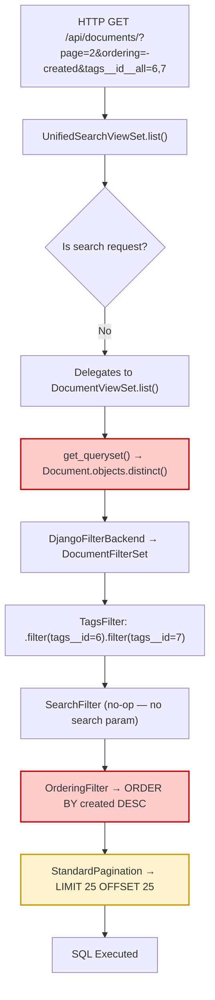
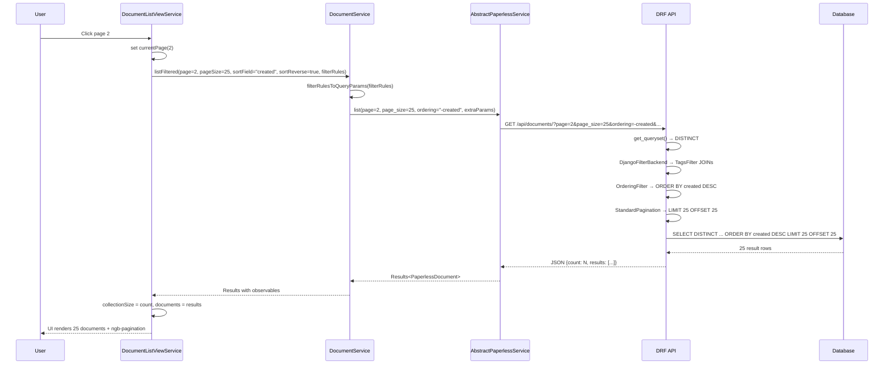
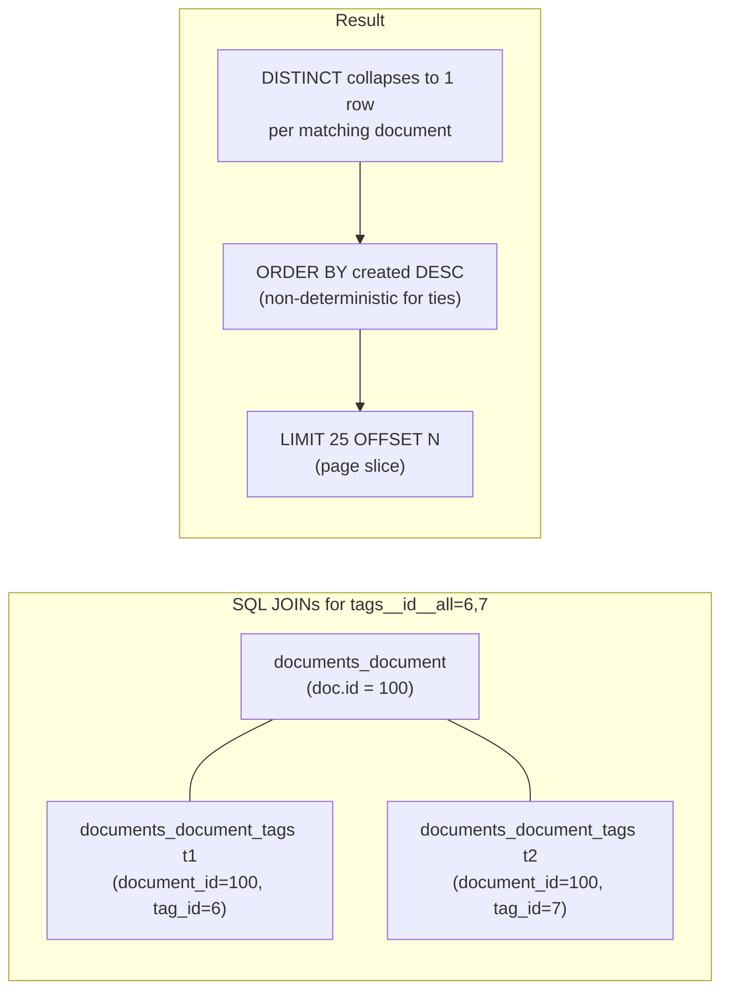

# Investigation: Haunted Pagination in the Document List View

> **Type:** Root-Cause Analysis
> **Scope:** Paperless-ngx document list API pagination instability
> **Status:** Complete — root cause identified and confirmed via code analysis

This document is a self-contained investigative analysis that explains why the
Paperless-ngx document list view exhibits "haunted" pagination behaviour — where
documents duplicate across neighbouring pages, disappear and reappear, and where
the glitch appears to depend on the viewer's permission level. Every conclusion
is grounded in the actual source code with explicit file-path and line-number
citations. **No modifications to the existing repository are proposed or made.**

---

## Table of Contents

- [1. Observed Symptoms](#1-observed-symptoms)
- [2. Architecture of the Document List Pipeline](#2-architecture-of-the-document-list-pipeline)
  - [2.1 Backend: ViewSet → Queryset → Filters → Pagination](#21-backend-viewset--queryset--filters--pagination)
  - [2.2 Frontend: DocumentListViewService → API → UI](#22-frontend-documentlistviewservice--api--ui)
  - [2.3 Search Path: UnifiedSearchViewSet → Whoosh](#23-search-path-unifiedsearchviewset--whoosh)
- [3. Root Cause Analysis](#3-root-cause-analysis)
  - [3.1 Non-Deterministic Ordering on Tied Sort Keys](#31-non-deterministic-ordering-on-tied-sort-keys)
  - [3.2 DISTINCT + OFFSET/LIMIT Interaction](#32-distinct--offsetlimit-interaction)
  - [3.3 Tag Filter JOIN Amplification](#33-tag-filter-join-amplification)
  - [3.4 The Sharing Rules Misconception](#34-the-sharing-rules-misconception)
- [4. Reproducing the Condition](#4-reproducing-the-condition)
  - [4.1 Minimum Conditions for Instability](#41-minimum-conditions-for-instability)
  - [4.2 Observation Strategy (Temporary Scripts)](#42-observation-strategy-temporary-scripts)
- [5. Conclusions and Recommendations](#5-conclusions-and-recommendations)
- [6. Source References](#6-source-references)

---

## 1. Observed Symptoms

Users report the following anomalies in the document list view:

1. **Cross-page duplication** — the same document appears on both page _N_ and
   page _N+1_.
2. **Disappearing documents** — a document visible on one page vanishes when
   the user navigates away and returns, or appears on a different page than
   before.
3. **Permission-level correlation** — the user observes that the glitch seems
   more prevalent (or only present) for non-admin viewers whose document
   visibility is believed to be shaped by "sharing rules."

These symptoms raise six concrete questions that this investigation answers:

| #   | Question                                                                                |
| --- | --------------------------------------------------------------------------------------- |
| 1   | Is the backend producing duplicate rows that are collapsed elsewhere?                   |
| 2   | Is pagination (`OFFSET`/`LIMIT`) applied before or after deduplication (`.distinct()`)? |
| 3   | Is the ordering quietly unstable when multiple rows tie on the primary sort key?        |
| 4   | Does the glitch depend on what the user is allowed to see (sharing rules)?              |
| 5   | What does the API actually return across consecutive page requests?                     |
| 6   | What does the frontend think pagination means?                                          |

The remainder of this document traces through the codebase to answer each
question with code-level evidence.

---

## 2. Architecture of the Document List Pipeline

### 2.1 Backend: ViewSet → Queryset → Filters → Pagination

#### URL Routing

The document list endpoint is served by `UnifiedSearchViewSet`, **not**
`DocumentViewSet` directly.

```python
api_router.register(r"documents", UnifiedSearchViewSet)
```

> Source: `src/paperless/urls.py:32`

`UnifiedSearchViewSet` extends `DocumentViewSet`
(Source: `src/documents/views.py:377`), so all of `DocumentViewSet`'s
configuration applies unless explicitly overridden.

#### DocumentViewSet Configuration

The core view configuration is defined at lines 172–196 of
`src/documents/views.py`:

```python
class DocumentViewSet(
    RetrieveModelMixin,
    UpdateModelMixin,
    DestroyModelMixin,
    ListModelMixin,
    GenericViewSet,
):
    model = Document                                          # line 179
    queryset = Document.objects.all()                         # line 180
    serializer_class = DocumentSerializer                     # line 181
    pagination_class = StandardPagination                     # line 182
    permission_classes = (IsAuthenticated,)                   # line 183
    filter_backends = (DjangoFilterBackend, SearchFilter,
                       OrderingFilter)                        # line 184
    filterset_class = DocumentFilterSet                       # line 185
    search_fields = ("title", "correspondent__name",
                     "content")                               # line 186
    ordering_fields = (                                       # lines 187-196
        "id",
        "title",
        "correspondent__name",
        "document_type__name",
        "created",
        "modified",
        "added",
        "archive_serial_number",
    )
```

> Source: `src/documents/views.py:172-196`

Key observations:

- **`permission_classes`** is `(IsAuthenticated,)` — a simple "is the user
  logged in?" check. There is **no** object-level permission, no
  `DjangoObjectPermissions`, and no `has_object_permission` override.
- **`ordering_fields`** lists eight fields. None of these include a secondary
  tiebreaker. When the user sorts by `created`, the SQL `ORDER BY` clause
  contains _only_ `created` — no fallback column.

#### get_queryset() — Unconditional DISTINCT

```python
def get_queryset(self):
    return Document.objects.distinct()
```

> Source: `src/documents/views.py:198-199`

Every document list query issues `SELECT DISTINCT ...` unconditionally. This
exists to prevent duplicate result rows that can arise from many-to-many (M2M)
JOINs when tag filters are applied (see §3.3). The `DISTINCT` is not
conditional on the filter set — it applies to _every_ request.

#### StandardPagination

```python
class StandardPagination(PageNumberPagination):
    page_size = 25
    page_size_query_param = "page_size"
    max_page_size = 100000
```

> Source: `src/paperless/views.py:8-11`

`StandardPagination` subclasses DRF's `PageNumberPagination`. Internally,
`PageNumberPagination.paginate_queryset()` creates a
`django.core.paginator.Paginator`, which slices the queryset using Python's
slice syntax (`queryset[offset:offset+limit]`). Django's ORM translates this
into SQL `LIMIT X OFFSET Y`.

#### REST_FRAMEWORK Configuration

```python
REST_FRAMEWORK = {
    "DEFAULT_AUTHENTICATION_CLASSES": [
        "rest_framework.authentication.BasicAuthentication",
        "rest_framework.authentication.SessionAuthentication",
        "rest_framework.authentication.TokenAuthentication",
    ],
    "DEFAULT_VERSIONING_CLASS": "rest_framework.versioning.AcceptHeaderVersioning",
    "DEFAULT_VERSION": "1",
    "ALLOWED_VERSIONS": ["1", "2"],
}
```

> Source: `src/paperless/settings.py:116-127`

There is **no** `DEFAULT_PAGINATION_CLASS` and **no** `DEFAULT_FILTER_BACKENDS`
at the framework level. Each viewset declares its own pagination and filter
configuration explicitly.

#### DocumentFilterSet

The filter set is defined in `src/documents/filters.py:81-118`:

```python
class DocumentFilterSet(FilterSet):
    is_tagged = BooleanFilter(label="Is tagged", field_name="tags",
                              lookup_expr="isnull", exclude=True)
    tags__id__all  = TagsFilter()                  # line 90
    tags__id__none = TagsFilter(exclude=True)       # line 92
    tags__id__in   = TagsFilter(in_list=True)       # line 94
    is_in_inbox    = InboxFilter()                  # line 96
    title_content  = TitleContentFilter()           # line 98

    class Meta:
        model = Document
        fields = {
            "title": CHAR_KWARGS,
            "content": CHAR_KWARGS,
            "archive_serial_number": INT_KWARGS,
            "created": DATE_KWARGS,
            "added": DATE_KWARGS,
            "modified": DATE_KWARGS,
            "correspondent": ["isnull"],
            "correspondent__id": ID_KWARGS,
            "correspondent__name": CHAR_KWARGS,
            "tags__id": ID_KWARGS,
            "tags__name": CHAR_KWARGS,
            "document_type": ["isnull"],
            "document_type__id": ID_KWARGS,
            "document_type__name": CHAR_KWARGS,
        }
```

> Source: `src/documents/filters.py:81-118`

#### TagsFilter — The JOIN Generator

The `TagsFilter` class (Source: `src/documents/filters.py:36-60`) has three
operating modes:

| Mode                           | Trigger                      | Behaviour                                                                        | Explicit `.distinct()`?                     |
| ------------------------------ | ---------------------------- | -------------------------------------------------------------------------------- | ------------------------------------------- |
| `in_list=True`                 | `tags__id__in` query param   | `qs.filter(tags__id__in=tag_ids).distinct()` (line 52) — single JOIN             | Yes                                         |
| `exclude=False, in_list=False` | `tags__id__all` query param  | Loops: `qs.filter(tags__id=tag_id)` per tag (lines 54-58) — **one JOIN per tag** | No (relies on queryset-level `.distinct()`) |
| `exclude=True, in_list=False`  | `tags__id__none` query param | Loops: `qs.exclude(tags__id=tag_id)` per tag (lines 55-56)                       | No                                          |

The `tags__id__all` mode is critical: each chained `.filter(tags__id=X)` call
generates a **separate SQL JOIN** on the `documents_document_tags` M2M table.
This does not produce duplicate result _rows_ (thanks to the queryset-level
`.distinct()`), but it creates more complex queries that can influence the
database query planner's behaviour. See §3.3 for details.

#### Query Pipeline Diagram



> The red-highlighted steps (`DISTINCT` and `ORDER BY`) are the two components
> that interact to produce non-deterministic page boundaries. The yellow step
> (`LIMIT/OFFSET`) is where the instability manifests.

---

### 2.2 Frontend: DocumentListViewService → API → UI

#### DocumentListViewService

The `DocumentListViewService`
(Source: `src-ui/src/app/services/document-list-view.service.ts`) manages the
document list state in the Angular frontend.

**`ListViewState` interface** (lines 18-55):

```typescript
interface ListViewState {
  title?: string
  documents?: PaperlessDocument[]
  currentPage: number
  collectionSize: number
  sortField: string
  sortReverse: boolean
  filterRules: FilterRule[]
  selected?: Set<number>
}
```

> Source: `src-ui/src/app/services/document-list-view.service.ts:18-55`

**Default state** (lines 87-98):

```typescript
private defaultListViewState(): ListViewState {
  return {
    title: null,
    documents: [],
    currentPage: 1,
    collectionSize: null,
    sortField: 'created',
    sortReverse: true,    // → ordering = "-created"
    filterRules: [],
    selected: new Set<number>(),
  }
}
```

> Source: `src-ui/src/app/services/document-list-view.service.ts:87-98`

The default sort is `created` in descending order (`sortReverse: true`), which
maps to the query parameter `ordering=-created`.

**`reload()` method** (lines 133-184):

The `reload()` method calls `documentService.listFiltered()` with the current
page, page size, sort field, sort direction, and filter rules. On success, it
replaces `collectionSize` and `documents` with the API response data. On a 404
when not on page 1, it resets to page 1 and retries.

> Source: `src-ui/src/app/services/document-list-view.service.ts:133-184`

**`set currentPage(page)` setter** (lines 231-235):

```typescript
set currentPage(page: number) {
  this.activeListViewState.currentPage = page
  this.reload()
  this.saveDocumentListView()
}
```

> Source: `src-ui/src/app/services/document-list-view.service.ts:231-235`

Every page navigation triggers a **fresh, independent API call**. There is no
client-side caching of previously fetched pages — each page request is a
standalone SQL query execution on the backend.

**`getNext()` / `getPrevious()` methods** (lines 298-342):

These methods navigate between documents by index position in the current page
array. When the user reaches the end of a page, `getNext()` increments
`currentPage` and calls `reload()` to fetch the first document of the next
page. `getPrevious()` does the reverse.

```typescript
getNext(currentDocId: number): Observable<number> {
  return new Observable((nextDocId) => {
    if (this.documents != null) {
      let index = this.documents.findIndex((d) => d.id == currentDocId)
      if (index != -1 && index + 1 < this.documents.length) {
        nextDocId.next(this.documents[index + 1].id)
        nextDocId.complete()
      } else if (index != -1 && this.currentPage < this.getLastPage()) {
        this.currentPage += 1
        this.reload(() => {
          nextDocId.next(this.documents[0].id)
          nextDocId.complete()
        })
      } else {
        nextDocId.complete()
      }
    }
  })
}
```

> Source: `src-ui/src/app/services/document-list-view.service.ts:298-318`

**Critical assumption:** These methods assume that pages are **stable and
contiguous** — that the last document on page _N_ is immediately followed by
the first document on page _N+1_ in the sorted result set. If the backend's
ordering is non-deterministic, this assumption breaks, leading to the observed
symptoms of duplicate or missing documents during cross-page navigation.

#### AbstractPaperlessService.list()

The base HTTP service method assembles query parameters and makes the GET
request (Source: `src-ui/src/app/services/rest/abstract-paperless-service.ts:32-58`):

```typescript
list(page?, pageSize?, sortField?, sortReverse?, extraParams?): Observable<Results<T>> {
  let httpParams = new HttpParams()
  if (page)     httpParams = httpParams.set('page', page.toString())
  if (pageSize) httpParams = httpParams.set('page_size', pageSize.toString())
  let ordering = this.getOrderingQueryParam(sortField, sortReverse)
  if (ordering)  httpParams = httpParams.set('ordering', ordering)
  for (let extraParamKey in extraParams) {
    if (extraParams[extraParamKey] != null)
      httpParams = httpParams.set(extraParamKey, extraParams[extraParamKey])
  }
  return this.http.get<Results<T>>(this.getResourceUrl(), { params: httpParams })
}
```

> Source: `src-ui/src/app/services/rest/abstract-paperless-service.ts:32-58`

The `ordering` parameter is built by `getOrderingQueryParam()` (lines 24-29):

```typescript
private getOrderingQueryParam(sortField: string, sortReverse: boolean) {
  if (sortField) {
    return (sortReverse ? '-' : '') + sortField
  } else {
    return null
  }
}
```

> Source: `src-ui/src/app/services/rest/abstract-paperless-service.ts:24-29`

#### DocumentService.listFiltered()

The document-specific service method maps filter rules to backend query
parameters and delegates to `list()`:

```typescript
listFiltered(page?, pageSize?, sortField?, sortReverse?,
             filterRules?, extraParams = {}): Observable<Results<PaperlessDocument>> {
  return this.list(page, pageSize, sortField, sortReverse,
    Object.assign(extraParams, this.filterRulesToQueryParams(filterRules))
  ).pipe(map((results) => {
    results.results.forEach((doc) => this.addObservablesToDocument(doc))
    return results
  }))
}
```

> Source: `src-ui/src/app/services/rest/document.service.ts:96-116`

#### filterRulesToQueryParams()

This method (Source: `src-ui/src/app/services/rest/document.service.ts:60-79`)
converts frontend `FilterRule[]` objects into backend query parameters using the
`FILTER_RULE_TYPES` definitions
(Source: `src-ui/src/app/data/filter-rule-type.ts:29+`).

For multi-valued filters like tags, values are concatenated with commas:

```typescript
if (ruleType.multi) {
  params[ruleType.filtervar] = params[ruleType.filtervar]
    ? params[ruleType.filtervar] + ',' + rule.value
    : rule.value
}
```

> Source: `src-ui/src/app/services/rest/document.service.ts:65-68`

For example, if the user selects tags 6 and 7 with the "has all tags" filter,
the resulting query parameter is `tags__id__all=6,7` — which the backend's
`TagsFilter` parses and converts into chained `.filter()` calls.

#### Frontend-Backend Sequence Diagram



> The critical point: **each page click triggers a completely independent SQL
> query**. If the database returns tied rows in a different order on the second
> execution, the page boundaries shift.

---

### 2.3 Search Path: UnifiedSearchViewSet → Whoosh

`UnifiedSearchViewSet` (Source: `src/documents/views.py:377-426`) overrides
both `filter_queryset()` and `list()` to handle full-text search requests
(triggered by the `query` or `more_like_id` query parameters).

**When the request IS a search request:**

The `filter_queryset()` method (lines 394-411) bypasses the ORM queryset
entirely and returns a `DelayedQuery` (or `DelayedFullTextQuery`) object from
`src/documents/index.py`. This object wraps Whoosh's `searcher.search_page()`
(Source: `src/documents/index.py:210-218`), which uses Whoosh-native pagination
(`pagenum` and `pagelen` parameters) — **not** SQL `OFFSET`/`LIMIT`.

```python
page: ResultsPage = self.searcher.search_page(
    q,
    mask=mask,
    filter=self._get_query_filter(),
    pagenum=math.floor(item.start / self.page_size) + 1,
    pagelen=self.page_size,
    sortedby=sortedby,
    reverse=reverse,
)
```

> Source: `src/documents/index.py:210-218`

Sort-field mapping is handled by `_get_query_sortedby()`
(Source: `src/documents/index.py:165-190`).

**When the request is NOT a search request:**

Both `filter_queryset()` and `list()` delegate entirely to the `DocumentViewSet`
parent:

```python
# In filter_queryset():
else:
    return super(UnifiedSearchViewSet, self).filter_queryset(queryset)

# In list():
else:
    return super(UnifiedSearchViewSet, self).list(request)
```

> Source: `src/documents/views.py:410-411` and `src/documents/views.py:425-426`

This means that for **non-search requests** (the vast majority of document list
browsing), the ORM-based pagination path described in §2.1 is used. The Whoosh
search path has its own ordering determinism characteristics, but the
investigation's root cause is in the **ORM path**, not the Whoosh path.

---

## 3. Root Cause Analysis

### 3.1 Non-Deterministic Ordering on Tied Sort Keys

**Finding:** The primary root cause of the pagination instability is that the
`Document` model's default ordering specifies a single non-unique column without
a secondary tiebreaker.

```python
class Meta:
    ordering = ("-created",)
```

> Source: `src/documents/models.py:207-208`

The `created` field is a `DateTimeField`:

```python
created = models.DateTimeField(_("created"), default=timezone.now, db_index=True)
```

> Source: `src/documents/models.py:152`

#### Why this is a problem

`DateTimeField` values are **not unique**. Multiple documents can (and commonly
do) share the same `created` timestamp — for example, when documents are
batch-imported via the consumption directory watcher or API bulk upload, they may
all receive the same `timezone.now()` value as their `created` timestamp.

When the database sorts by `created DESC` and encounters two or more rows with
identical `created` values, it is free to return those tied rows in **any
order**. This order is implementation-defined and is **not guaranteed to be
stable across separate query executions**. Factors that can change the order
include:

- Different `OFFSET` values (the query planner may choose a different execution
  strategy for `OFFSET 0` vs. `OFFSET 25`)
- Concurrent write operations (inserts, updates, or deletes that affect the
  table or index statistics)
- Background maintenance operations (PostgreSQL `VACUUM`, `ANALYZE`, or SQLite
  journal operations)

#### The ordering_fields lack tiebreakers too

The `ordering_fields` tuple at `src/documents/views.py:187-196` lists eight
sortable fields:

```python
ordering_fields = (
    "id",
    "title",
    "correspondent__name",
    "document_type__name",
    "created",
    "modified",
    "added",
    "archive_serial_number",
)
```

> Source: `src/documents/views.py:187-196`

When DRF's `OrderingFilter` applies a user-specified sort (e.g., from the
`ordering=-created` query parameter), it **replaces** `Meta.ordering` with the
requested field. No secondary sort key is appended. This means the generated SQL
contains only `ORDER BY created DESC` — nothing more.

#### Concrete example

Suppose documents with IDs 42, 57, and 63 all have
`created = 2024-01-15 10:30:00`, and these three documents happen to fall near
a page boundary (around position 25 in the sorted result set):

| Execution                             | Position 24 | Position 25 | Position 26 |
| ------------------------------------- | ----------- | ----------- | ----------- |
| Query 1 (page 1: OFFSET 0, LIMIT 25)  | Doc 42      | Doc 57      | —           |
| Query 2 (page 2: OFFSET 25, LIMIT 25) | —           | Doc 42      | Doc 63      |

In Query 1, the database placed Doc 57 at position 25 — just past page 1's
boundary (page 1 covers 0-indexed positions 0–24; page 2 covers positions
25–49). In Query 2 (a separate query execution), the database happened to
place Doc 42 at position 25 instead. Now:

- **Doc 42** appeared on page 1 (position 24 in Query 1) _and_ page 2
  (position 25 in Query 2) → **duplicate across pages**
- **Doc 57** was at position 25 in Query 1 (in page 2's range, but page 1 was
  being requested) and shifted to position 24 in Query 2 (in page 1's range,
  but page 2 was being requested) → it is never returned by either query →
  **missing document**
- **Doc 63** may shift similarly depending on execution order

This is exactly the "haunted pagination" behaviour reported by users.

---

### 3.2 DISTINCT + OFFSET/LIMIT Interaction

#### The question: Does pagination happen before or after deduplication?

**Answer: Deduplication (`DISTINCT`) happens BEFORE pagination (`LIMIT/OFFSET`).**

The SQL execution order is:

```sql
SELECT DISTINCT ...
FROM documents_document ...
[JOINs from tag filters]
WHERE ...
ORDER BY created DESC
LIMIT 25 OFFSET 25
```

In SQL's logical execution model:

1. `FROM` + `JOIN` — assemble the row set
2. `WHERE` — filter rows
3. `SELECT DISTINCT` — deduplicate rows
4. `ORDER BY` — sort the deduplicated result
5. `LIMIT/OFFSET` — slice the sorted result

This means the duplicates produced by M2M JOINs are **correctly collapsed**
before page slicing occurs. **Pagination does not happen before deduplication.**

#### But the ordering instability remains

Even though `DISTINCT` correctly collapses duplicate rows, the `ORDER BY` that
follows operates on the deduplicated result set — and it is still
non-deterministic for tied rows (§3.1). So the interaction is:

1. `DISTINCT` removes duplicate rows from JOIN amplification → **correct**
2. `ORDER BY created DESC` sorts the deduplicated rows → **non-deterministic
   for ties**
3. `LIMIT 25 OFFSET 25` slices the non-deterministically sorted rows →
   **unstable page boundaries**

#### Example generated SQL

For a request with `page=2&ordering=-created&tags__id__all=6,7`:

```sql
SELECT DISTINCT
    "documents_document"."id",
    "documents_document"."title",
    "documents_document"."created",
    "documents_document"."correspondent_id",
    "documents_document"."document_type_id",
    "documents_document"."content",
    "documents_document"."added",
    "documents_document"."modified",
    "documents_document"."archive_serial_number"
FROM "documents_document"
INNER JOIN "documents_document_tags" t1
    ON ("documents_document"."id" = t1."document_id")
INNER JOIN "documents_document_tags" t2
    ON ("documents_document"."id" = t2."document_id")
WHERE t1."tag_id" = 6
    AND t2."tag_id" = 7
ORDER BY "documents_document"."created" DESC
LIMIT 25 OFFSET 25
```

The `ORDER BY created DESC` without a secondary key means all documents with
the same `created` timestamp may appear in any order — and that order can differ
between the page 1 query (`OFFSET 0`) and the page 2 query (`OFFSET 25`).

---

### 3.3 Tag Filter JOIN Amplification

#### How `tags__id__all` generates multiple JOINs

When the user applies a "has all of these tags" filter, the frontend sends
`tags__id__all=6,7`. The backend's `TagsFilter.filter()` method processes this
as follows (Source: `src/documents/filters.py:42-60`):

```python
def filter(self, qs, value):
    if not value:
        return qs

    try:
        tag_ids = [int(x) for x in value.split(",")]
    except ValueError:
        return qs

    if self.in_list:
        qs = qs.filter(tags__id__in=tag_ids).distinct()   # line 52
    else:
        for tag_id in tag_ids:                             # lines 54-58
            if self.exclude:
                qs = qs.exclude(tags__id=tag_id)
            else:
                qs = qs.filter(tags__id=tag_id)

    return qs
```

> Source: `src/documents/filters.py:42-60`

For `tags__id__all` (which has `in_list=False` and `exclude=False`), the method
enters the `else` branch and calls `qs.filter(tags__id=6).filter(tags__id=7)`.

Each `.filter(tags__id=X)` call generates a **separate INNER JOIN** on the
`documents_document_tags` M2M table. The Django ORM must use separate JOINs
because each filter asserts a different condition on the joined table — "this
document has tag 6" AND "this document has tag 7" — which cannot be satisfied
by a single row in the M2M table.

#### JOIN Amplification Diagram



#### Contrast with `tags__id__in`

The `tags__id__in` filter (line 52) uses a single JOIN with an `IN` clause:

```python
qs = qs.filter(tags__id__in=tag_ids).distinct()
```

> Source: `src/documents/filters.py:51-52`

This is an **OR** filter (documents matching _any_ of the listed tags), not an
**AND** filter. It uses a single JOIN and adds an explicit `.distinct()` call
(which is redundant with the queryset-level `.distinct()` from `get_queryset()`
but serves as a safety measure).

#### Are the JOINs the root cause?

**No.** The JOINs themselves do not cause the pagination instability. The
`DISTINCT` correctly collapses any row multiplication from the JOINs. However,
the JOINs **contribute to conditions that make the instability more likely**:

1. **Query complexity:** More complex queries (with multiple JOINs) may trigger
   different query plans across executions, increasing the probability that tied
   rows are returned in a different order.
2. **Optimizer behaviour:** The presence of JOINs can influence the database
   optimizer's choice of execution order, access paths, and join strategies.
3. **The fundamental issue remains:** The non-deterministic `ORDER BY` on tied
   timestamps is the root cause, with or without tag filters.

---

### 3.4 The Sharing Rules Misconception

#### Finding: This codebase has NO per-document ownership or sharing model

The user's observation that the pagination glitch correlates with non-admin
viewers whose visibility is "shaped by sharing rules" is **not confirmed by the
code**.

**Evidence — permission_classes:**

Every viewset in `src/documents/views.py` uses `permission_classes = (IsAuthenticated,)`:

| Viewset / View           | Line |
| ------------------------ | ---- |
| `CorrespondentViewSet`   | 125  |
| `TagViewSet`             | 151  |
| `DocumentTypeViewSet`    | 166  |
| `DocumentViewSet`        | 183  |
| `LogViewSet`             | 431  |
| `SavedViewViewSet`       | 459  |
| `BulkEditView`           | 471  |
| `PostDocumentView`       | 493  |
| `SelectionDataView`      | 540  |
| `SearchAutoCompleteView` | 588  |
| `StatisticsView`         | 612  |
| `BulkDownloadView`       | 633  |

> Source: `src/documents/views.py` — lines listed above

`IsAuthenticated` is a simple boolean check: "is the user logged in?" It does
**not** filter documents by user, role, or any ownership attribute.

**Evidence — absence of object-level permissions:**

A thorough search of `src/documents/views.py` and `src/documents/models.py`
confirms:

- There is **no** `owner` field on the `Document` model
- There is **no** `sharing` field or sharing-related model
- There is **no** `ObjectPermission` class
- There is **no** `DjangoObjectPermissions` or `DjangoModelPermissions` usage
- There is **no** `has_object_permission()` method override
- The `get_queryset()` method (line 198-199) returns
  `Document.objects.distinct()` — it does **not** filter by
  `self.request.user` or any ownership attribute

**All authenticated users see the same set of documents.**

#### Why the user perceives a correlation with permissions

The most likely explanation is that different users have different **saved
views** with different filter configurations. The `SavedView` model exists at
`src/documents/models.py:316-339`, and `SavedViewFilterRule` at lines 342-382.
`SavedViewViewSet.get_queryset()` (Source: `src/documents/views.py:461-463`)
filters saved views by user:

```python
def get_queryset(self):
    user = self.request.user
    return SavedView.objects.filter(user=user)
```

> Source: `src/documents/views.py:461-463`

Different saved views produce different filter combinations, which produce
different querysets with different numbers of tied-timestamp documents near page
boundaries. A user whose saved view includes tag filters that produce more tied
rows near page boundaries will experience the pagination instability more
frequently — creating the illusion that it is a permission-related issue.

**Alternative possibility:** If a reverse proxy, load balancer, or middleware
outside the Paperless-ngx application provides additional access control, it
would be invisible to this code analysis. But **within the codebase itself**,
there is no mechanism for document-level visibility filtering.

---

## 4. Reproducing the Condition

### 4.1 Minimum Conditions for Instability

The pagination instability occurs when **all three** of the following conditions
are met simultaneously:

| #   | Condition                                                               | Why                                                                                                      |
| --- | ----------------------------------------------------------------------- | -------------------------------------------------------------------------------------------------------- |
| 1   | **Two or more documents share the same value in the active sort field** | Creates tied rows where ordering is non-deterministic                                                    |
| 2   | **The tied documents span a page boundary**                             | They fall around position _N_ × `page_size` in the sorted result                                         |
| 3   | **The user navigates between pages**                                    | Each navigation triggers a separate SQL query execution, which may return tied rows in a different order |

#### When is condition #1 common?

- **Batch imports:** Documents ingested via the consumption directory watcher or
  API bulk upload may all receive the same `timezone.now()` value as their
  `created` timestamp (Source: `src/documents/models.py:152` — `default=timezone.now`).
- **Manual date assignment:** Users may set the same `created` date for multiple
  documents (e.g., all invoices from the same day).
- **Other sort fields:** Sorting by `modified`, `added`, `correspondent__name`,
  or `document_type__name` can also produce ties (e.g., multiple documents with
  the same correspondent or document type).

#### Does the instability require tag filters?

**No.** Tag filters (`tags__id__all`) increase query complexity and may
indirectly affect query plan stability, but the fundamental instability exists
even without tag filters. Any request sorted by a non-unique field with ties
near a page boundary is vulnerable.

### 4.2 Observation Strategy (Temporary Scripts)

The following approach can be used to observe the instability in a running
Paperless-ngx instance. These scripts are **ephemeral** — they are for ad-hoc
observation only and **must not be committed** to the repository.

#### Conceptual observation script (Python)

```python
"""
Ephemeral observation script — DO NOT commit to the repository.
Detects cross-page document duplication in the Paperless-ngx API.
Clean up after use.
"""
import requests

base_url = "http://localhost:8000/api/documents/"
headers = {"Authorization": "Token YOUR_TOKEN_HERE"}
params_common = {"page_size": 25, "ordering": "-created"}

# Fetch page 1 and page 2
page1 = requests.get(
    base_url,
    params={**params_common, "page": 1},
    headers=headers,
).json()

page2 = requests.get(
    base_url,
    params={**params_common, "page": 2},
    headers=headers,
).json()

ids_page1 = [doc["id"] for doc in page1["results"]]
ids_page2 = [doc["id"] for doc in page2["results"]]

set1 = set(ids_page1)
set2 = set(ids_page2)

duplicates = set1 & set2
missing_count = len(set1 | set2)
expected = min(50, page1["count"])

print(f"Page 1 IDs: {ids_page1}")
print(f"Page 2 IDs: {ids_page2}")
print(f"Duplicates across pages: {duplicates}")
print(f"Total unique across both pages: {missing_count} (expected: {expected})")

if duplicates:
    print("\n⚠ INSTABILITY DETECTED: Documents appear on both pages.")
    # Check the created timestamps of duplicated docs
    for doc_id in duplicates:
        doc = next(d for d in page1["results"] if d["id"] == doc_id)
        print(f"  Doc {doc_id}: created={doc['created']}")
else:
    print("\n✓ No cross-page duplicates detected in this run.")
    print("  (Run multiple times — instability is non-deterministic.)")
```

> **⚠ IMPORTANT:** This script is **ephemeral** and must be **deleted after
> use**. It is not part of the repository and must not be committed. It exists
> solely for ad-hoc observation during investigation.

#### Conceptual observation approach (curl)

```bash
# Ephemeral — do not commit. Clean up after use.

TOKEN="YOUR_TOKEN_HERE"
BASE="http://localhost:8000/api/documents/"

# Fetch page 1 and page 2
curl -s -H "Authorization: Token $TOKEN" \
  "$BASE?page=1&page_size=25&ordering=-created" | \
  python3 -c "import sys,json; print([d['id'] for d in json.load(sys.stdin)['results']])"

curl -s -H "Authorization: Token $TOKEN" \
  "$BASE?page=2&page_size=25&ordering=-created" | \
  python3 -c "import sys,json; print([d['id'] for d in json.load(sys.stdin)['results']])"

# Compare the two lists for overlapping IDs.
```

> **⚠ IMPORTANT:** These commands are for ad-hoc observation only. They are
> **not** part of the repository and must not be saved or committed.

---

## 5. Conclusions and Recommendations

### Root Cause Summary

The pagination instability ("haunted pagination") in the Paperless-ngx document
list view is caused by **non-deterministic row ordering** when the database
sorts by the `created` field (or any other non-unique sort field) **without a
unique tiebreaker column**. When `OFFSET`/`LIMIT` pagination slices a
non-deterministically ordered result set, the page boundaries can shift between
query executions, causing documents to appear on multiple pages or disappear
from all pages.

The specific code-level root cause is:

```python
# src/documents/models.py:207-208
class Meta:
    ordering = ("-created",)   # ← No secondary key like "-id"
```

Combined with:

```python
# src/documents/views.py:198-199
def get_queryset(self):
    return Document.objects.distinct()   # ← DISTINCT is correct but does not
                                          #   solve the ordering problem
```

And:

```python
# src/paperless/views.py:8-11
class StandardPagination(PageNumberPagination):
    page_size = 25              # ← OFFSET/LIMIT pagination on an
    # ...                       #   unstable ordering = haunted pages
```

The user's observation that the glitch correlates with permission levels is
**not confirmed** by the code — this codebase has no per-document ownership or
sharing model. The perceived correlation likely stems from different users
having different saved views with different filter configurations, which produce
different degrees of timestamp clustering near page boundaries.

### Recommendations

The following are **suggestions only** — no code changes are implemented in this
investigation.

#### 1. Add a secondary sort key (primary recommendation)

Change the `Document` model's default ordering from:

```python
ordering = ("-created",)
```

to:

```python
ordering = ("-created", "-id")
```

> Target: `src/documents/models.py:208`

The `id` field is the primary key — it is **unique** and already has an index.
Adding it as a secondary sort key guarantees deterministic ordering with
effectively zero performance cost. Every row with the same `created` timestamp
will be deterministically ordered by `id`, ensuring stable page boundaries.

#### 2. Add `id` as a fallback in ordering_fields processing

Ensure that whenever DRF's `OrderingFilter` applies a user-specified sort
field, `id` (or `-id`) is appended as a secondary key. This could be
implemented as a custom `OrderingFilter` subclass that augments the ordering
tuple before applying it to the queryset.

> Target: `src/documents/views.py:184` (replace `OrderingFilter` with custom
> subclass)

#### 3. Consider cursor-based pagination (long-term)

For very large result sets, DRF's `CursorPagination` provides inherently stable
pagination because it uses a unique ordering column as the pagination cursor.
However, this is a larger architectural change that would require frontend
modifications (cursor-based pagination does not support arbitrary page number
jumping via `ngb-pagination`).

**These recommendations are provided for consideration only. No repository files
have been modified.**

---

## 6. Source References

| File                                                         | Lines                                                      | What Was Referenced                                                   |
| ------------------------------------------------------------ | ---------------------------------------------------------- | --------------------------------------------------------------------- |
| `src/documents/views.py`                                     | 172-196                                                    | `DocumentViewSet` class definition and configuration                  |
| `src/documents/views.py`                                     | 198-199                                                    | `get_queryset()` returning `Document.objects.distinct()`              |
| `src/documents/views.py`                                     | 183                                                        | `permission_classes = (IsAuthenticated,)` on `DocumentViewSet`        |
| `src/documents/views.py`                                     | 187-196                                                    | `ordering_fields` tuple                                               |
| `src/documents/views.py`                                     | 377-426                                                    | `UnifiedSearchViewSet` class definition                               |
| `src/documents/views.py`                                     | 394-411                                                    | `UnifiedSearchViewSet.filter_queryset()`                              |
| `src/documents/views.py`                                     | 413-426                                                    | `UnifiedSearchViewSet.list()`                                         |
| `src/documents/views.py`                                     | 410-411, 425-426                                           | Delegation to parent for non-search requests                          |
| `src/documents/views.py`                                     | 461-463                                                    | `SavedViewViewSet.get_queryset()` filtering by user                   |
| `src/documents/views.py`                                     | 125, 151, 166, 183, 431, 459, 471, 493, 540, 588, 612, 633 | All `permission_classes = (IsAuthenticated,)` declarations            |
| `src/documents/filters.py`                                   | 36-60                                                      | `TagsFilter` class and `filter()` method                              |
| `src/documents/filters.py`                                   | 51-52                                                      | `tags__id__in` filter with single JOIN and `.distinct()`              |
| `src/documents/filters.py`                                   | 54-58                                                      | `tags__id__all` filter with chained `.filter()` calls                 |
| `src/documents/filters.py`                                   | 81-118                                                     | `DocumentFilterSet` class with all filter declarations                |
| `src/documents/filters.py`                                   | 90-94                                                      | `tags__id__all`, `tags__id__none`, `tags__id__in` filter instances    |
| `src/documents/models.py`                                    | 128-133                                                    | `tags` ManyToManyField definition                                     |
| `src/documents/models.py`                                    | 152                                                        | `created = models.DateTimeField(default=timezone.now, db_index=True)` |
| `src/documents/models.py`                                    | 207-208                                                    | `class Meta: ordering = ("-created",)`                                |
| `src/documents/models.py`                                    | 316-339                                                    | `SavedView` model                                                     |
| `src/documents/models.py`                                    | 342-382                                                    | `SavedViewFilterRule` model                                           |
| `src/paperless/views.py`                                     | 8-11                                                       | `StandardPagination` class definition                                 |
| `src/paperless/urls.py`                                      | 32                                                         | `api_router.register(r"documents", UnifiedSearchViewSet)`             |
| `src/paperless/settings.py`                                  | 116-127                                                    | `REST_FRAMEWORK` configuration dict                                   |
| `src/documents/index.py`                                     | 165-190                                                    | `_get_query_sortedby()` Whoosh field mapping                          |
| `src/documents/index.py`                                     | 203-237                                                    | `DelayedQuery.__getitem__` with Whoosh `search_page()`                |
| `src/documents/index.py`                                     | 210-218                                                    | `searcher.search_page()` call with pagination params                  |
| `src/documents/serialisers.py`                               | 201-235                                                    | `DocumentSerializer` class and fields                                 |
| `src-ui/src/app/services/document-list-view.service.ts`      | 18-55                                                      | `ListViewState` interface                                             |
| `src-ui/src/app/services/document-list-view.service.ts`      | 87-98                                                      | `defaultListViewState()`                                              |
| `src-ui/src/app/services/document-list-view.service.ts`      | 133-184                                                    | `reload()` method                                                     |
| `src-ui/src/app/services/document-list-view.service.ts`      | 231-235                                                    | `set currentPage()` setter                                            |
| `src-ui/src/app/services/document-list-view.service.ts`      | 298-320                                                    | `getNext()` method                                                    |
| `src-ui/src/app/services/document-list-view.service.ts`      | 322-342                                                    | `getPrevious()` method                                                |
| `src-ui/src/app/services/rest/abstract-paperless-service.ts` | 24-29                                                      | `getOrderingQueryParam()`                                             |
| `src-ui/src/app/services/rest/abstract-paperless-service.ts` | 32-58                                                      | `list()` HTTP method                                                  |
| `src-ui/src/app/services/rest/document.service.ts`           | 16-24                                                      | `DOCUMENT_SORT_FIELDS` constant                                       |
| `src-ui/src/app/services/rest/document.service.ts`           | 60-79                                                      | `filterRulesToQueryParams()` method                                   |
| `src-ui/src/app/services/rest/document.service.ts`           | 96-116                                                     | `listFiltered()` method                                               |
| `src-ui/src/app/data/filter-rule-type.ts`                    | 29+                                                        | `FILTER_RULE_TYPES` array with filter variable mappings               |
| `src-ui/src/app/data/filter-rule.ts`                         | 6-16                                                       | `cloneFilterRules()` function                                         |
| `src-ui/src/app/data/filter-rule.ts`                         | 18-26                                                      | `isFullTextFilterRule()` function                                     |
| `src-ui/src/app/data/filter-rule.ts`                         | 28-31                                                      | `FilterRule` interface                                                |
