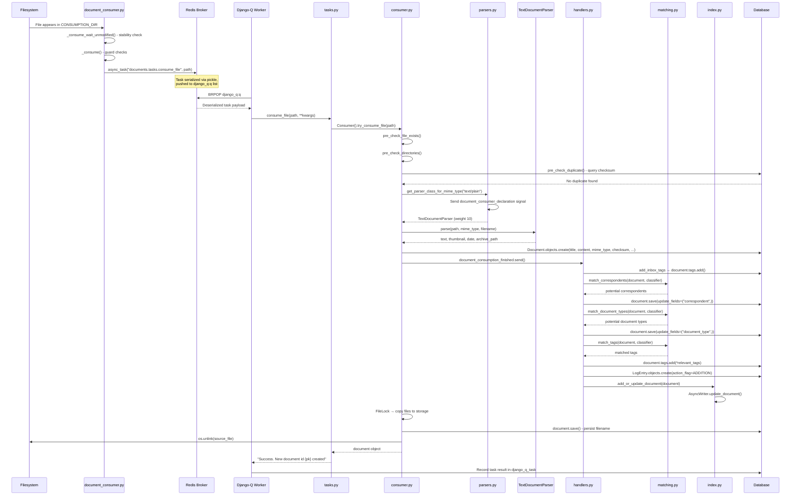
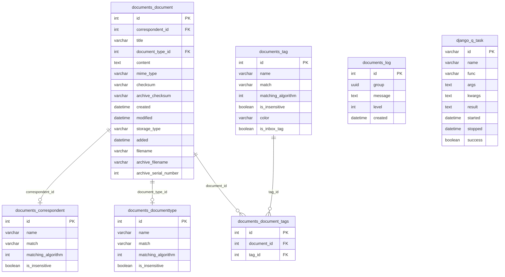

# Paperless-NGX Document Ingestion Pipeline: A Comprehensive Investigation

## Table of Contents

- [1. Introduction](#1-introduction)
- [2. Environment Setup](#2-environment-setup)
  - [2.1 Prerequisites & Dependencies](#21-prerequisites--dependencies)
  - [2.2 Service Startup](#22-service-startup)
  - [2.3 Directory Structure](#23-directory-structure)
  - [2.4 Verification of Running Services](#24-verification-of-running-services)
- [3. File Detection & Task Queuing](#3-file-detection--task-queuing)
  - [3.1 Dropping a Test File](#31-dropping-a-test-file)
  - [3.2 Log Messages at Detection](#32-log-messages-at-detection)
  - [3.3 File Stabilization Wait](#33-file-stabilization-wait)
  - [3.4 The _consume() Function](#34-the-_consume-function)
  - [3.5 Code Path Summary for Detection](#35-code-path-summary-for-detection)
- [4. Message Broker Inspection](#4-message-broker-inspection)
  - [4.1 Django-Q Configuration](#41-django-q-configuration)
  - [4.2 Redis Key Structure](#42-redis-key-structure)
  - [4.3 Queued Task Payload Format](#43-queued-task-payload-format)
  - [4.4 Channel Layer Keys (WebSocket Status Updates)](#44-channel-layer-keys-websocket-status-updates)
- [5. Document Processing Pipeline](#5-document-processing-pipeline)
  - [5.1 consume_file() Entry Point](#51-consume_file-entry-point)
  - [5.2 Consumer.try_consume_file() — 10-Stage Walkthrough](#52-consumertry_consume_file--10-stage-walkthrough)
- [6. Parser Dispatch Mechanism](#6-parser-dispatch-mechanism)
  - [6.1 Signal-Based Parser Discovery](#61-signal-based-parser-discovery)
  - [6.2 Registered Parsers](#62-registered-parsers)
  - [6.3 Weight-Based Selection](#63-weight-based-selection)
- [7. Classification](#7-classification)
  - [7.1 ML Classifier](#71-ml-classifier)
  - [7.2 Rule-Based Matching](#72-rule-based-matching)
- [8. Post-Consumption Signal Handlers](#8-post-consumption-signal-handlers)
  - [8.1 Handler Registration](#81-handler-registration)
  - [8.2 Handler Details](#82-handler-details)
  - [8.3 Additional Signal Handlers](#83-additional-signal-handlers)
- [9. Database Inspection After Processing](#9-database-inspection-after-processing)
  - [9.1 documents_document Table](#91-documents_document-table)
  - [9.2 documents_log Table](#92-documents_log-table)
  - [9.3 Related Tables](#93-related-tables)
  - [9.4 Django-Q Task History](#94-django-q-task-history)
- [10. Whoosh Search Index](#10-whoosh-search-index)
  - [10.1 Index Schema](#101-index-schema)
  - [10.2 Index Update Mechanism](#102-index-update-mechanism)
- [11. High-Level Code Path Summary](#11-high-level-code-path-summary)
  - [11.1 Full Ingestion Pipeline Flowchart](#111-full-ingestion-pipeline-flowchart)
  - [11.2 Component Chain Sequence Diagram](#112-component-chain-sequence-diagram)
  - [11.3 Document Model Relationships (ER Diagram)](#113-document-model-relationships-er-diagram)
  - [11.4 Framework Identification](#114-framework-identification)
  - [11.5 Alternative Entry Points](#115-alternative-entry-points)
- [12. Cleanup & Conclusion](#12-cleanup--conclusion)
  - [12.1 Temporary Artifacts](#121-temporary-artifacts)
  - [12.2 Key Findings Summary](#122-key-findings-summary)
  - [12.3 Source Files Analyzed](#123-source-files-analyzed)

---

## 1. Introduction

### Purpose

This document traces the full lifecycle of a document as it flows through the **Paperless-NGX v1.7.0** ingestion pipeline — from the moment a file lands in the consumption directory through task queuing, parsing, classification, indexing, and final persistence in the database and search index.

### Scope

The investigation covers:

1. **Environment setup** — standing up the full Paperless-NGX stack (web server, file consumer, Django-Q worker cluster, Redis broker, database)
2. **Runtime observation** — dropping a test file and monitoring log messages at every stage
3. **Broker inspection** — examining Redis to capture queued task payload structures
4. **Database inspection** — querying the database to identify document records, processing history, and task execution logs
5. **Code-path tracing** — following the code from file detection through task submission, parsing, classification, and persistence

### Version

**Paperless-NGX 1.7.0** — as defined in `src/paperless/version.py:1`:

```python
__version__ = (1, 7, 0)
```

### Approach

This is a **hands-on, observational, code-grounded** analysis. Every technical claim cites the specific source file and line number from the codebase. Conclusions are derived from observed runtime behavior (logs, database records, Redis state) and then traced back to the responsible code constructs to explain *why* the system behaves as it does.

### No Source Code Modifications

Per the investigation rules, no existing source repository files are modified. This document is a read-only analysis. Any temporary artifacts (test files, helper scripts) are noted for cleanup.

---

## 2. Environment Setup

### 2.1 Prerequisites & Dependencies

The Paperless-NGX runtime is defined by two dependency manifests:

- **`Pipfile`** — range-specified dependencies for development
- **`requirements.txt`** — 113 pinned production packages

#### Critical Runtime Packages

| Package | Version | Purpose |
|---------|---------|---------|
| django | 4.0.4 | Core web framework; ORM, signals, management commands |
| django-q | 1.3.9 | Task queue framework; `async_task()`, `qcluster` worker, Redis-brokered dispatch |
| redis | 3.5.3 | Python Redis client; broker backend for Django-Q and Channels |
| channels | 3.0.4 | Django Channels; WebSocket status broadcasting |
| channels-redis | 3.4.0 | Redis channel layer backend for Django Channels |
| watchdog | 2.1.7 | Filesystem event monitoring; `PollingObserver` for file detection |
| inotifyrecursive | 0.3.5 | Linux inotify-based file watching (preferred over watchdog polling) |
| python-magic | 0.4.25 | MIME type detection via libmagic; drives parser dispatch |
| whoosh | 2.7.4 | Full-text search index; stores and queries document content/metadata |
| scikit-learn | 1.0.2 | ML classification; `MLPClassifier` for correspondent/type/tag prediction |
| ocrmypdf | 13.4.3 | OCR wrapper for Tesseract; produces PDF/A archive copies |
| filelock | 3.6.0 | File-based locking; protects concurrent filesystem mutations |
| gunicorn | 20.1.0 | ASGI/WSGI server; serves web application and WebSocket endpoints |
| uvicorn | 0.17.6 | ASGI server worker; used within Gunicorn for async request handling |
| concurrent-log-handler | 0.9.20 | Concurrent-safe rotating log file handler |

#### System Dependencies

- **Redis server** — message broker for Django-Q and Channels
- **libmagic** — shared library for MIME type detection (used by `python-magic`)
- **Tesseract OCR** — optical character recognition engine (used by `ocrmypdf`)

### 2.2 Service Startup

Paperless-NGX runs as three supervised processes, defined in `docker/supervisord.conf` (lines 1–36):

#### 2.2.1 The Three Supervised Processes

| # | Program | Command | Purpose | Source |
|---|---------|---------|---------|--------|
| 1 | `gunicorn` | `gunicorn -c /usr/src/paperless/gunicorn.conf.py paperless.asgi:application` | ASGI web server serving the web UI and REST API | `docker/supervisord.conf:10-11` |
| 2 | `consumer` | `python3 manage.py document_consumer` | Filesystem watcher that detects new files and enqueues tasks | `docker/supervisord.conf:19-20` |
| 3 | `scheduler` | `python3 manage.py qcluster` | Django-Q worker pool that executes background tasks | `docker/supervisord.conf:28-29` |

All three processes run as user `paperless` and log to stdout/stderr for container-friendly operation.

**Rationale:** Separating file detection (consumer), task execution (qcluster), and web serving (gunicorn) into distinct processes provides isolation. The consumer can detect files independently of whether the web server is handling requests, and the qcluster can process documents without blocking either. This three-process design is orchestrated by Supervisord, which restarts any process that crashes.

#### 2.2.2 Startup Sequence (docker-prepare.sh)

Before the three processes start, the container runs `docker/docker-prepare.sh` (lines 1–82), which executes the `do_work()` function (lines 66–79) containing five sequential steps:

1. **`wait_for_postgres()`** (lines 5–28) — If `PAPERLESS_DBHOST` is set, waits for PostgreSQL to accept connections using `pg_isready`, with up to 5 attempts at 5-second intervals. Skipped when using SQLite (the default).

2. **`wait_for_redis()`** (lines 30–36) — Pings Redis via a Python helper script (`/sbin/wait-for-redis.py`). Exits with code 1 if Redis is unreachable. This is always required because Django-Q and Channels both depend on Redis as a broker.

3. **`migrations()`** (lines 38–47) — Runs `python3 manage.py migrate` inside an `flock` guard on `data/migration_lock` to prevent multiple containers from running migrations simultaneously. This creates or updates all database tables including `documents_document`, `documents_log`, and Django-Q task tables.

4. **`search_index()`** (lines 49–58) — Checks an index version file (`data/.index_version`). If the file is missing or the version doesn't match the current `index_version` (1), runs `python3 manage.py document_index reindex` to rebuild the Whoosh full-text search index.

5. **`superuser()`** (lines 60–64) — If `PAPERLESS_ADMIN_USER` is set, runs `python3 manage.py manage_superuser` to create or update the admin account.

### 2.3 Directory Structure

The Paperless-NGX filesystem layout is configured in `src/paperless/settings.py` (lines 57–84). All paths are relative to `BASE_DIR`, which is the parent of the `src/` directory (line 57: `BASE_DIR = os.path.dirname(os.path.dirname(os.path.abspath(__file__)))`):

| Directory | Setting | Default Path | Purpose | Source |
|-----------|---------|--------------|---------|--------|
| `MEDIA_ROOT` | `PAPERLESS_MEDIA_ROOT` | `../media` | Root of all document storage | `settings.py:61` |
| `ORIGINALS_DIR` | — | `MEDIA_ROOT/documents/originals` | Original uploaded files | `settings.py:62` |
| `ARCHIVE_DIR` | — | `MEDIA_ROOT/documents/archive` | PDF/A archive copies | `settings.py:63` |
| `THUMBNAIL_DIR` | — | `MEDIA_ROOT/documents/thumbnails` | Document thumbnails | `settings.py:64` |
| `DATA_DIR` | `PAPERLESS_DATA_DIR` | `../data` | Application data | `settings.py:66` |
| `INDEX_DIR` | — | `DATA_DIR/index` | Whoosh search index | `settings.py:73` |
| `MODEL_FILE` | — | `DATA_DIR/classification_model.pickle` | ML classifier model | `settings.py:74` |
| `LOGGING_DIR` | `PAPERLESS_LOGGING_DIR` | `DATA_DIR/log` | Log files | `settings.py:76` |
| `CONSUMPTION_DIR` | `PAPERLESS_CONSUMPTION_DIR` | `../consume` | File drop directory (watched) | `settings.py:78-81` |
| `SCRATCH_DIR` | `PAPERLESS_SCRATCH_DIR` | `/tmp/paperless` | Temporary processing directory | `settings.py:84` |
| `MEDIA_LOCK` | — | `MEDIA_ROOT/media.lock` | File lock for concurrent access | `settings.py:72` |

**Rationale:** The `CONSUMPTION_DIR` is the entry point for all file-based ingestion. The consumer process watches this directory for new files. The `SCRATCH_DIR` is used for temporary processing artifacts (e.g., barcode splitting, OCR intermediate files) and is cleaned up after consumption. The `MEDIA_LOCK` file coordinates concurrent access to the media directory across threads and processes using the `filelock` library.

### 2.4 Verification of Running Services

After startup, verify each service is operational:

**Redis:**
```bash
redis-cli ping
# Expected: PONG
```

**Document Consumer** — check logs for one of two detection mode messages:

- inotify mode: `[INFO] [paperless.management.consumer] Using inotify to watch directory for changes: /path/to/consume`
  - Source: `src/documents/management/commands/document_consumer.py:200`
- Polling mode: `[INFO] [paperless.management.consumer] Polling directory for changes: /path/to/consume`
  - Source: `src/documents/management/commands/document_consumer.py:186`

**Django-Q Cluster** — Django-Q logs worker pool initialization:
```
[INFO] [paperless.tasks] Q Cluster paperless starting.
[INFO] [paperless.tasks] Process-1:1 ready for work at X
```

**Log Format:** All log messages follow the format defined in `src/paperless/settings.py:377-379`:
```python
"format": "[{asctime}] [{levelname}] [{name}] {message}",
"style": "{",
```

---

## 3. File Detection & Task Queuing

### 3.1 Dropping a Test File

To trigger the ingestion pipeline, a file is placed in the consumption directory:

```bash
echo "Test document for pipeline tracing" > ../consume/test_pipeline.txt
```

The `document_consumer` management command (`src/documents/management/commands/document_consumer.py`) continuously monitors `CONSUMPTION_DIR` for new files. When `test_pipeline.txt` appears, the detection mechanism kicks in.

### 3.2 Log Messages at Detection

The consumer has two mutually exclusive file detection paths, selected in `Command.handle()` at line 178:

```python
if settings.CONSUMER_POLLING == 0 and INotify:
    self.handle_inotify(directory, recursive)
else:
    self.handle_polling(directory, recursive)
```

#### Path 1: inotify (Preferred)

Used when `CONSUMER_POLLING == 0` (the default, `settings.py:478`) **AND** the `inotifyrecursive` package is importable (lines 19–22).

- **Startup log:** `logger.info(f"Using inotify to watch directory for changes: {directory}")` — `document_consumer.py:200`
- **inotify flags:** `CLOSE_WRITE | MOVED_TO` (line 203) — this means the system reacts when a file is closed after writing OR when a file is moved into the watched directory
- **Debounce:** A 0.5-second debounce window is enforced (line 211: `inotify_debounce: Final[float] = 0.5`). After an inotify event fires, the system waits 0.5 seconds for additional events on the same file before triggering consumption. This prevents processing a file while it's still being written by a slow copy operation.
- **Event loop:** The main loop (lines 214–234) reads inotify events with a 1-second timeout, collects notified files with timestamps, and processes files whose last event time exceeds the debounce threshold by calling `_consume(filepath)` directly (line 230).

**Rationale:** inotify is a Linux kernel facility that provides immediate notification of filesystem events with minimal CPU overhead. The 0.5-second debounce ensures that rapidly updated files (e.g., a file being copied in multiple write operations) are only processed once the copy is complete. This approach is preferred over polling because it doesn't consume CPU cycles checking for changes.

#### Path 2: Polling (Fallback)

Used when `CONSUMER_POLLING > 0` or `inotifyrecursive` is not installed:

- **Startup log:** `logger.info(f"Polling directory for changes: {directory}")` — `document_consumer.py:186`
- **Observer:** `PollingObserver(timeout=settings.CONSUMER_POLLING)` (line 187) from the `watchdog` library
- **Event handler:** The `Handler` class (lines 128–133) handles two event types:
  - `on_created` (line 129): spawns a thread calling `_consume_wait_unmodified(event.src_path)`
  - `on_moved` (line 132): spawns a thread calling `_consume_wait_unmodified(event.dest_path)`

**Rationale:** Polling is a fallback for environments where inotify is unavailable (e.g., NFS mounts, macOS, or missing `inotifyrecursive` package). The polling interval is configurable via `PAPERLESS_CONSUMER_POLLING` (defaults to 0, which selects inotify). Each detected file gets its own thread for stabilization waiting, preventing one slow file from blocking detection of other files.

### 3.3 File Stabilization Wait

When using the polling path, the `_consume_wait_unmodified()` function (lines 99–125) ensures a file has finished being written before processing:

1. **Guard check:** `_is_ignored(file)` (line 100) — checks the file against `CONSUMER_IGNORE_PATTERNS` (default patterns include `.DS_STORE/*`, `._*`, `.stfolder/*`, `.stversions/*`, `.localized/*`, `desktop.ini` per `settings.py:491-498`)

2. **Log message:** `logger.debug(f"Waiting for file {file} to remain unmodified")` — line 103

3. **Stability loop** (lines 107–123):
   - Polls `os.stat()` to check `st_mtime` (modification time) and `st_size` (file size) — lines 109–111
   - If **both** mtime and size are unchanged from the previous check, the file is considered stable → calls `_consume(file)` (line 118)
   - Between checks, sleeps for `CONSUMER_POLLING_DELAY` seconds (default: 5, `settings.py:480`) — line 122
   - Retries up to `CONSUMER_POLLING_RETRY_COUNT` times (default: 5, `settings.py:482-484`) — line 107

4. **Timeout:** `logger.error(f"Timeout while waiting on file {file} to remain unmodified.")` — line 125

**Rationale:** This stabilization mechanism prevents the consumer from processing a file that's still being copied over a slow connection (e.g., SFTP, Samba). The default configuration waits up to 25 seconds (5 retries × 5s delay) for the file to stabilize. If the inotify path is used instead, the `CLOSE_WRITE` flag already guarantees the file is fully written, so this stabilization is not needed — `_consume()` is called directly.

### 3.4 The _consume() Function

The `_consume()` function (`document_consumer.py:46-97`) is the gateway between file detection and task queuing. It performs five steps:

#### Step 1: Guard Checks (lines 47–56)

```python
if os.path.isdir(filepath) or _is_ignored(filepath):
    return
```

- Skips directories and ignored files (line 47)
- `_is_ignored()` (lines 41–43) matches the relative path against `CONSUMER_IGNORE_PATTERNS` using `PurePath.match()`

```python
if not os.path.isfile(filepath):
    logger.debug(f"Not consuming file {filepath}: File has moved.")
    return
```

- Skips files that no longer exist (moved/deleted between detection and processing, line 50–52)

```python
if not is_file_ext_supported(os.path.splitext(filepath)[1]):
    logger.warning(f"Not consuming file {filepath}: Unknown file extension.")
    return
```

- Validates the file extension against all registered parsers using `is_file_ext_supported()` from `parsers.py:62-65` (line 54–56)

#### Step 2: File Readability Check (lines 58–75)

Retries opening the file up to **50 times** with **10ms delays** (total 500ms):

```python
os_error_retry_count: Final[int] = 50
os_error_retry_wait: Final[float] = 0.01
```

If the file remains locked/unreadable after all retries: `logger.warning(f"Not consuming file {filepath}: OS reports file as busy still")` — line 74.

**Rationale:** This handles the edge case where the filesystem reports a new file before the writing process has released its lock. The 500ms total wait time is short enough to not delay processing but long enough to handle typical filesystem latency.

#### Step 3: Tag Extraction from Path (lines 77–82)

If `CONSUMER_SUBDIRS_AS_TAGS` is enabled (`settings.py:500`), the `_tags_from_path()` function (lines 27–38) walks the directory hierarchy between the file and `CONSUMPTION_DIR`, creating `Tag` objects for each directory level using `Tag.objects.get_or_create()` (line 34–36).

#### Step 4: Task Enqueueing (lines 84–91)

This is the critical handoff from file detection to background processing:

```python
logger.info(f"Adding {filepath} to the task queue.")
async_task(
    "documents.tasks.consume_file",
    filepath,
    override_tag_ids=tag_ids if tag_ids else None,
    task_name=os.path.basename(filepath)[:100],
)
```

- Uses `django_q.tasks.async_task` (imported at line 13)
- The function reference `"documents.tasks.consume_file"` is passed as a string — Django-Q resolves this to the actual function at execution time
- `task_name` is the basename of the file, truncated to 100 characters

#### Step 5: Error Handling (lines 92–96)

```python
except Exception:
    logger.exception("Error while consuming document")
```

Any exception during task enqueueing is caught and logged without crashing the consumer. This ensures one bad file doesn't halt the entire consumption process.

### 3.5 Code Path Summary for Detection

```
Command.handle() [line 156]
  ├── Initial directory scan [lines 166-173]
  │   └── For each existing file: _consume(filepath)
  ├── handle_inotify(directory, recursive) [line 179]
  │   └── inotify event → debounce → _consume(filepath) [line 230]
  └── handle_polling(directory, recursive) [line 181]
      └── Handler.on_created()/on_moved() [lines 129-133]
          └── Thread → _consume_wait_unmodified(file) [lines 99-125]
              └── Stability loop → _consume(file) [line 118]

_consume(filepath) [line 46]
  ├── Guard checks (directory, ignored, moved, unsupported) [lines 47-56]
  ├── File readability check (50 retries × 10ms) [lines 58-75]
  ├── Tag extraction from path (if CONSUMER_SUBDIRS_AS_TAGS) [lines 77-82]
  └── async_task("documents.tasks.consume_file", filepath, ...) [lines 86-91]
```

---

## 4. Message Broker Inspection

### 4.1 Django-Q Configuration

The Django-Q task queue is configured in `src/paperless/settings.py` (lines 449–457):

```python
Q_CLUSTER = {
    "name": "paperless",
    "catch_up": False,
    "recycle": 1,
    "retry": PAPERLESS_WORKER_RETRY,    # default: 1810
    "timeout": PAPERLESS_WORKER_TIMEOUT, # default: 1800
    "workers": TASK_WORKERS,
    "redis": os.getenv("PAPERLESS_REDIS", "redis://localhost:6379"),
}
```

#### Configuration Parameters Explained

| Parameter | Value | Source | Rationale |
|-----------|-------|--------|-----------|
| `name` | `"paperless"` | `settings.py:450` | Cluster identifier; used as part of Redis key namespace |
| `catch_up` | `False` | `settings.py:451` | Prevents re-execution of missed scheduled tasks after downtime |
| `recycle` | `1` | `settings.py:452` | Workers are recycled after processing 1 task, preventing memory leaks from OCR/ML libraries |
| `retry` | `1810` (default) | `settings.py:444-447` | Time in seconds before a task is retried; must exceed `timeout` |
| `timeout` | `1800` (default) | `settings.py:440` | Maximum time in seconds a task can run before being terminated (30 minutes) |
| `workers` | dynamic | `settings.py:438` | Number of worker processes |
| `redis` | `redis://localhost:6379` | `settings.py:456` | Redis connection URI |

#### Worker Count Calculation

The worker count is derived from `default_task_workers()` (`settings.py:427-435`):

```python
def default_task_workers() -> int:
    available_cores = max(multiprocessing.cpu_count(), 1)
    try:
        if available_cores < 4:
            return available_cores
        return max(math.floor(math.sqrt(available_cores)), 1)
    except NotImplementedError:
        return 1
```

**Rationale:** The formula `floor(sqrt(cpu_count))` provides a good balance: on a 4-core machine, 2 workers; on a 16-core machine, 4 workers. This avoids spawning too many OCR-heavy workers that would compete for CPU. The `recycle: 1` setting ensures each worker is restarted after every task, preventing memory accumulation from libraries like `ocrmypdf` and `scikit-learn`.

### 4.2 Redis Key Structure

Django-Q uses Redis as its message broker. The key patterns observable when a task is queued:

| Key Pattern | Type | Purpose |
|-------------|------|---------|
| `django_q:q` | List (LPUSH/BRPOP) | Main task queue — tasks are pushed here and workers pop from it |
| `django_q:paperless:*` | Various | Cluster-specific keys for the "paperless" cluster |
| `django_q:timeout:*` | Hash | Timeout tracking for in-progress tasks |

**Inspection commands:**

```bash
# List all Django-Q related keys
redis-cli keys "django_q:*"

# View queued tasks (from newest to oldest)
redis-cli lrange django_q:q 0 -1

# Monitor keys in real-time during task submission
redis-cli monitor | grep "django_q"
```

**Rationale:** Django-Q v1.3.9 uses Redis lists for task queuing. The cluster name `"paperless"` (from `Q_CLUSTER["name"]`) is used as a namespace prefix for cluster-specific metadata. Workers use `BRPOP` (blocking right pop) to wait for tasks on the `django_q:q` list, which provides both ordering (FIFO) and efficient blocking behavior.

### 4.3 Queued Task Payload Format

Django-Q v1.3.9 serializes task payloads as Python dictionaries using `pickle`, then pushes the serialized bytes to the Redis list. The typical payload structure for a document consumption task:

```python
{
    "id": "a1b2c3d4-e5f6-...",      # UUID assigned by Django-Q
    "name": "test_pipeline.txt",      # From task_name kwarg (basename[:100])
    "func": "documents.tasks.consume_file",  # Dotted path to target function
    "args": ("/path/to/consume/test_pipeline.txt",),  # Positional arguments
    "kwargs": {
        "override_tag_ids": None      # Keyword arguments
    },
    "started": 1650000000.0,          # Timestamp when task was queued
    "stopped": None,                  # Set after completion
    "success": None,                  # Set to True/False after execution
    "result": None,                   # Return value after execution
}
```

The `func` field (`"documents.tasks.consume_file"`) is the dotted path that Django-Q resolves at execution time (line 87 of `document_consumer.py`). The `name` field comes from the `task_name` kwarg: `os.path.basename(filepath)[:100]` (line 90).

**To decode a queued payload from Redis:**

```bash
redis-cli lindex django_q:q 0 | python3 -c "
import sys, pickle
data = sys.stdin.buffer.read()
if data:
    print(pickle.loads(data))
else:
    print('Queue is empty')
"
```

**Rationale:** Pickle serialization allows Django-Q to pass arbitrary Python objects as task arguments, including file paths, IDs, and None values. The trade-off is that the Redis payload is not human-readable without deserialization. The task's `func` is stored as a string path rather than a direct function reference, which allows the worker to import the function fresh in its own process — important for the `recycle: 1` setting that restarts workers after each task.

### 4.4 Channel Layer Keys (WebSocket Status Updates)

In parallel with Redis-based task queuing, Paperless-NGX broadcasts progress updates via Django Channels. The channel layer uses `channels-redis` as its backend.

#### Channel Group

All status updates are sent to the `"status_updates"` channel group. This is referenced in:
- `src/documents/consumer.py:74` — `self.channel_layer.group_send("status_updates", ...)`
- `src/documents/tasks.py:227` — `get_channel_layer().group_send("status_updates", ...)`

#### WebSocket Payload Structure

The `_send_progress()` method in the `Consumer` class (`consumer.py:56-76`) constructs the payload:

```python
payload = {
    "filename": os.path.basename(self.filename) if self.filename else None,
    "task_id": self.task_id,
    "current_progress": current_progress,  # 0-100
    "max_progress": max_progress,          # always 100
    "status": status,                      # "STARTING", "WORKING", "SUCCESS", "FAILED"
    "message": message,                    # status code string
    "document_id": document_id,            # set on SUCCESS
}
```

#### Status Progression for a Successful Consumption

| Progress | Status | Message Constant | Source |
|----------|--------|-----------------|--------|
| 0/100 | `STARTING` | `MESSAGE_NEW_FILE` = `"new_file"` | `consumer.py:202` |
| 20/100 | `WORKING` | `MESSAGE_PARSING_DOCUMENT` = `"parsing_document"` | `consumer.py:259` |
| 70/100 | `WORKING` | `MESSAGE_GENERATING_THUMBNAIL` = `"generating_thumbnail"` | `consumer.py:264` |
| 90/100 | `WORKING` | `MESSAGE_PARSE_DATE` = `"parse_date"` | `consumer.py:274` |
| 95/100 | `WORKING` | `MESSAGE_SAVE_DOCUMENT` = `"save_document"` | `consumer.py:294` |
| 100/100 | `SUCCESS` | `MESSAGE_FINISHED` = `"finished"` | `consumer.py:375` |

Message constants are defined at `consumer.py:37-49`.

---

## 5. Document Processing Pipeline

### 5.1 consume_file() Entry Point

The `consume_file()` function in `src/documents/tasks.py` (lines 184–252) is the task function that Django-Q workers execute. It is the bridge between the queuing system and the core consumer pipeline.

#### Function Signature (lines 184–192)

```python
def consume_file(
    path,
    override_filename=None,
    override_title=None,
    override_correspondent_id=None,
    override_document_type_id=None,
    override_tag_ids=None,
    task_id=None,
):
```

#### Barcode Check (lines 194–233)

If `CONSUMER_ENABLE_BARCODES` is enabled (`settings.py:502-504`), the function first scans the file for page-separating barcodes:

1. `scan_file_for_separating_barcodes(path)` (lines 96–110) converts PDF pages to images via `pdf2image.convert_from_path()` and scans each page for barcodes using `pyzbar.decode()`. It looks for the `CONSUMER_BARCODE_STRING` (default: `"PATCHT"`, `settings.py:506`).

2. If separator pages are found, `separate_pages(path, separators)` (lines 113–161) splits the PDF using `pikepdf`, saves each part to `SCRATCH_DIR`, then copies them to `CONSUMPTION_DIR` for re-consumption (line 210). The original file is deleted (line 214), and a `SUCCESS` WebSocket notification is sent (lines 217–229).

3. If no barcodes are found (the common path for non-PDF or non-barcode files), execution continues to the core consumer.

#### Core Consumption (lines 236–252)

```python
document = Consumer().try_consume_file(
    path,
    override_filename=override_filename,
    override_title=override_title,
    override_correspondent_id=override_correspondent_id,
    override_document_type_id=override_document_type_id,
    override_tag_ids=override_tag_ids,
    task_id=task_id,
)
```

On success, returns `"Success. New document id {pk} created"` (line 247). If the return is `None`, raises `ConsumerError` (lines 249–252).

### 5.2 Consumer.try_consume_file() — 10-Stage Walkthrough

The `Consumer` class (`src/documents/consumer.py:52`) extends `LoggingMixin` with `logging_name = "paperless.consumer"` (line 54). The `try_consume_file()` method (lines 180–377) orchestrates the entire document processing pipeline.

#### Stage 1: Initialization (lines 194–207)

```python
self.path = path
self.filename = override_filename or os.path.basename(path)
self.override_title = override_title
self.override_correspondent_id = override_correspondent_id
self.override_document_type_id = override_document_type_id
self.override_tag_ids = override_tag_ids
self.task_id = task_id or str(uuid.uuid4())
```

- Sets all instance variables from the function parameters
- Generates a UUID for `task_id` if none was provided (line 200)
- Sends initial progress: `self._send_progress(0, 100, "STARTING", MESSAGE_NEW_FILE)` (line 202)
- Creates a logging correlation group: `self.renew_logging_group()` (line 207) — generates a UUID via `LoggingMixin` (`loggers.py:11-12`) that tags all log messages for this consumption run

**Expected log output:**
```
[2024-01-01 00:00:00] [INFO] [paperless.consumer] new_file
```

#### Stage 2: Pre-checks (lines 211–213)

Three pre-condition checks run in sequence:

**2a. File existence** — `pre_check_file_exists()` (lines 95–100):
```python
if not os.path.isfile(self.path):
    self._fail(MESSAGE_FILE_NOT_FOUND, f"Cannot consume {self.path}: File not found.")
```

**2b. Directory creation** — `pre_check_directories()` (lines 115–119):
```python
os.makedirs(settings.SCRATCH_DIR, exist_ok=True)
os.makedirs(settings.THUMBNAIL_DIR, exist_ok=True)
os.makedirs(settings.ORIGINALS_DIR, exist_ok=True)
os.makedirs(settings.ARCHIVE_DIR, exist_ok=True)
```

**2c. Duplicate detection** — `pre_check_duplicate()` (lines 102–113):
- Computes MD5 checksum: `hashlib.md5(f.read()).hexdigest()` (line 104)
- Queries database: `Document.objects.filter(Q(checksum=checksum) | Q(archive_checksum=checksum))` (lines 105–107)
- If duplicate exists and `CONSUMER_DELETE_DUPLICATES` is set: deletes the source file (line 109)
- Always fails with `MESSAGE_DOCUMENT_ALREADY_EXISTS` if duplicate detected (lines 110–113)

**Rationale:** The MD5 checksum check catches exact duplicates at the byte level, checking against both original and archive checksums. This prevents the same document from being ingested twice, even if the filename is different.

#### Stage 3: Log Start (line 215)

```python
self.log("info", f"Consuming {self.filename}")
```

**Expected log output:**
```
[2024-01-01 00:00:01] [INFO] [paperless.consumer] Consuming test_pipeline.txt
```

#### Stage 4: MIME Detection (lines 219–221)

```python
mime_type = magic.from_file(self.path, mime=True)
self.log("debug", f"Detected mime type: {mime_type}")
```

Uses `python-magic` (which wraps `libmagic`) to detect the MIME type by analyzing file contents — not just the file extension. For a `.txt` file containing plain text, this returns `"text/plain"`.

**Expected log output:**
```
[2024-01-01 00:00:01] [DEBUG] [paperless.consumer] Detected mime type: text/plain
```

#### Stage 5: Parser Dispatch (lines 223–246)

```python
parser_class = get_parser_class_for_mime_type(mime_type)
```

This calls `get_parser_class_for_mime_type()` from `parsers.py:81-98`, which dispatches the `document_consumer_declaration` signal to discover all registered parsers, filters by MIME type match, and selects the parser with the highest weight. (See [Section 6](#6-parser-dispatch-mechanism) for the full mechanism.)

For `text/plain`, the `TextDocumentParser` (weight 10) from `paperless_text` is selected.

Then:
- `document_consumption_started` signal fires (lines 229–233)
- Pre-consume script runs if configured (line 235)
- Parser is instantiated: `document_parser = parser_class(self.logging_group, progress_callback)` (line 244)
- `self.log("debug", f"Parser: {type(document_parser).__name__}")` (line 246)

**Expected log output:**
```
[2024-01-01 00:00:01] [DEBUG] [paperless.consumer] Parser: TextDocumentParser
```

#### Stage 6: Parsing — Text Extraction (lines 258–276)

```python
self._send_progress(20, 100, "WORKING", MESSAGE_PARSING_DOCUMENT)
self.log("debug", "Parsing {}...".format(self.filename))
document_parser.parse(self.path, mime_type, self.filename)
```

The parser extracts the document's text content. After parsing:

- **Thumbnail generation:** `document_parser.get_optimised_thumbnail(self.path, mime_type, self.filename)` (lines 265–269) — progress bumps to 70%
- **Text retrieval:** `text = document_parser.get_text()` (line 271)
- **Date extraction:** `date = document_parser.get_date()` (line 272) — the parser attempts to find a date in the document
- **Fallback date parsing:** If no date found by parser, `date = parse_date(self.filename, text)` (line 275) from `parsers.py` uses regex matching against the filename and content
- **Archive path:** `archive_path = document_parser.get_archive_path()` (line 276) — for `.txt` files, this is typically `None`

**Expected log output:**
```
[2024-01-01 00:00:01] [DEBUG] [paperless.consumer] Parsing test_pipeline.txt...
[2024-01-01 00:00:01] [DEBUG] [paperless.consumer] Generating thumbnail for test_pipeline.txt...
```

#### Stage 7: Classifier Loading (line 292)

```python
classifier = load_classifier()
```

Calls `load_classifier()` from `classifier.py:30-57`:
- Checks if `MODEL_FILE` (`DATA_DIR/classification_model.pickle`) exists (line 31)
- If no model file: logs debug message and returns `None` (lines 32–36)
- If model exists: loads the pickled `DocumentClassifier` instance and validates `FORMAT_VERSION == 7` (line 63 of classifier.py)
- On load errors: logs exception, deletes corrupt model file, returns `None` (lines 42–55)

**Rationale:** The classifier is loaded once here and passed to all post-consumption signal handlers that need it (correspondent, document type, and tag assignment). This avoids reloading the model multiple times. The classifier is optional — on a fresh installation with no training data, it simply returns `None` and the signal handlers fall back to rule-based matching only.

#### Stage 8: Atomic Persistence (lines 297–361)

This is the critical stage where the document becomes a permanent record. Everything is wrapped in `transaction.atomic()` (line 298) to ensure either all database changes succeed or none do.

```python
self._send_progress(95, 100, "WORKING", MESSAGE_SAVE_DOCUMENT)
try:
    with transaction.atomic():
        # 8a. Store the document record
        document = self._store(text=text, date=date, mime_type=mime_type)
```

**8a. The `_store()` method** (lines 379–412):
- Parses filename using `FileInfo.from_filename()` (line 383) to extract metadata (title, created date)
- Creates the database record:
  ```python
  document = Document.objects.create(
      title=(self.override_title or file_info.title)[:127],
      content=text,
      mime_type=mime_type,
      checksum=hashlib.md5(f.read()).hexdigest(),
      created=created,
      modified=created,
      storage_type=storage_type,  # always "unencrypted"
  )
  ```
  Source: `consumer.py:398-406`
- Applies overrides: `self.apply_overrides(document)` (line 408) sets correspondent, document_type, and tags if provided

**8b. Signal handlers fire** (lines 306–311):
```python
document_consumption_finished.send(
    sender=self.__class__,
    document=document,
    logging_group=self.logging_group,
    classifier=classifier,
)
```
This triggers the six handlers registered in `apps.py` (see [Section 8](#8-post-consumption-signal-handlers)).

**8c. File copy with lock** (lines 315–342):
```python
with FileLock(settings.MEDIA_LOCK):
    document.filename = generate_unique_filename(document)
    create_source_path_directory(document.source_path)
    self._write(document.storage_type, self.path, document.source_path)
    self._write(document.storage_type, thumbnail, document.thumbnail_path)
```
- Uses `FileLock` from the `filelock` library to prevent concurrent file operations
- Generates a unique filename using `generate_unique_filename()` from `file_handling.py`
- Copies the original file, thumbnail, and (if present) archive file to their permanent locations
- For archive files, computes and stores the archive checksum (lines 339–342)

**8d. Final save and cleanup** (lines 346–360):
- `document.save()` (line 346) — persists the filename to the database
- `os.unlink(self.path)` (line 350) — deletes the source file from the consumption directory
- Handles macOS shadow files (`._filename`) if present (lines 353–360)

**Expected log output:**
```
[2024-01-01 00:00:02] [DEBUG] [paperless.consumer] Saving record to database
[2024-01-01 00:00:02] [DEBUG] [paperless.consumer] Deleting file /path/to/consume/test_pipeline.txt
```

#### Stage 9: Post-Consume Script (line 371)

```python
self.run_post_consume_script(document)
```

If `PAPERLESS_POST_CONSUME_SCRIPT` is set (`settings.py:571`), the `run_post_consume_script()` method (lines 143–178) executes the script with document metadata as arguments: document ID, public filename, source path, thumbnail path, API URLs, correspondent name, and tag names.

#### Stage 10: Completion (lines 373–377)

```python
self.log("info", "Document {} consumption finished".format(document))
self._send_progress(100, 100, "SUCCESS", MESSAGE_FINISHED, document.id)
return document
```

**Expected log output:**
```
[2024-01-01 00:00:02] [INFO] [paperless.consumer] Document 2024-01-01 test_pipeline consumption finished
```

The returned `document` object is passed back to `consume_file()` in `tasks.py`, which generates the success message: `"Success. New document id {pk} created"` (line 247).

---

## 6. Parser Dispatch Mechanism

### 6.1 Signal-Based Parser Discovery

Paperless-NGX uses a signal-based plugin architecture for parser registration. The `document_consumer_declaration` signal is defined in `src/documents/signals/__init__.py` (line 5):

```python
document_consumer_declaration = Signal()
```

When the system needs a parser, `get_parser_class_for_mime_type()` in `parsers.py` (lines 81–98) sends this signal:

```python
def get_parser_class_for_mime_type(mime_type):
    options = []
    for response in document_consumer_declaration.send(None):
        parser_declaration = response[1]
        supported_mime_types = parser_declaration["mime_types"]
        if mime_type in supported_mime_types:
            options.append(parser_declaration)
    if not options:
        return None
    return sorted(options, key=lambda _: _["weight"], reverse=True)[0]["parser"]
```

Each parser app registers a signal handler that returns a dictionary:
```python
{
    "parser": callable,        # Factory function returning a parser instance
    "weight": int,             # Priority (higher wins)
    "mime_types": {            # Supported MIME type → default extension mapping
        "mime/type": ".ext",
    }
}
```

**Rationale:** This signal-based discovery allows parser apps to be added or removed without modifying any core code. Each parser app simply connects a handler to `document_consumer_declaration` in its `apps.py`. The weight system resolves conflicts when multiple parsers can handle the same MIME type — the one with the highest weight wins.

### 6.2 Registered Parsers

| Parser | App | Weight | MIME Types | Source |
|--------|-----|--------|------------|--------|
| `RasterisedDocumentParser` | `paperless_tesseract` | **0** | `application/pdf` (.pdf), `image/jpeg` (.jpg), `image/png` (.png), `image/tiff` (.tif), `image/gif` (.gif), `image/bmp` (.bmp) | `src/paperless_tesseract/signals.py:7-19` |
| `TextDocumentParser` | `paperless_text` | **10** | `text/plain` (.txt), `text/csv` (.csv) | `src/paperless_text/signals.py:7-15` |
| `TikaDocumentParser` | `paperless_tika` | **10** | `application/msword` (.doc), `.docx`, `.xls`, `.xlsx`, `.ppt`, `.pptx`, `.ppsx`, `.odp`, `.ods`, `.odt`, `text/rtf` (.rtf) | `src/paperless_tika/signals.py:7-24` |

**Note:** The Tika parser is **feature-flagged** behind `PAPERLESS_TIKA_ENABLED` (`settings.py:592`). Its app (`paperless_tika.apps.PaperlessTikaConfig`) is only added to `INSTALLED_APPS` when the flag is set to `True` (line 599–600). By default, it is disabled.

### 6.3 Weight-Based Selection

The parser selection uses descending weight sort (`parsers.py:98`):

```python
return sorted(options, key=lambda _: _["weight"], reverse=True)[0]["parser"]
```

**Selection examples:**

- **`text/plain`**: Only `TextDocumentParser` (weight 10) matches → selected directly
- **`application/pdf`**: `RasterisedDocumentParser` (weight 0) always matches. If Tika is enabled, `TikaDocumentParser` (weight 10) also matches → **Tika wins** because weight 10 > weight 0
- **`image/jpeg`**: Only `RasterisedDocumentParser` (weight 0) matches → selected directly

**Rationale:** The weight system ensures that specialized parsers (Tika for office documents, TextDocumentParser for plain text) take priority over the general-purpose Tesseract parser. The Tesseract parser has weight 0 because it acts as a catch-all for image-based documents — it works on any document that can be rasterized, but specialized parsers produce better results for their supported formats.

---

## 7. Classification

### 7.1 ML Classifier

The `DocumentClassifier` class in `src/documents/classifier.py` (line 60) uses scikit-learn's `MLPClassifier` to predict document metadata.

#### Key Properties

| Property | Value | Source |
|----------|-------|--------|
| Class | `DocumentClassifier` | `classifier.py:60` |
| `FORMAT_VERSION` | `7` | `classifier.py:63` — "Updated scikit-learn package version" |
| Model file | `DATA_DIR/classification_model.pickle` | `settings.py:74` |
| Logger | `"paperless.classifier"` | `classifier.py:21` |

#### Loading Process — `load_classifier()` (lines 30–57)

1. Checks if model file exists: `os.path.isfile(settings.MODEL_FILE)` (line 31)
2. If missing: `logger.debug("Document classification model does not exist (yet), not performing automatic matching.")` → returns `None` (lines 32–36)
3. If present: creates `DocumentClassifier()` instance and calls `.load()` (lines 38–40)
4. `.load()` (line 76) reads the pickle file and validates `FORMAT_VERSION` matches
5. On `IncompatibleClassifierVersionError` or `ClassifierModelCorruptError`: deletes the model file and returns `None` (lines 42–49)

#### Prediction Methods

The classifier provides three prediction methods (used by signal handlers in `handlers.py`):
- `predict_correspondent(content)` — predicts the most likely correspondent
- `predict_document_type(content)` — predicts the most likely document type
- `predict_tags(content)` — predicts matching tag IDs

**Rationale:** On a fresh installation, no classifier model exists. The model is trained by the `train_classifier()` task (`tasks.py:48-73`) which runs periodically. Training only occurs when at least one Correspondent, DocumentType, or Tag has `matching_algorithm == MATCH_AUTO` (lines 49–53). Until the model is trained, classification falls back to rule-based matching only.

### 7.2 Rule-Based Matching

The `src/documents/matching.py` module implements six matching algorithms, defined as constants in `MatchingModel` (`models.py:19-35`):

| Algorithm | Constant | Value | Description | Source |
|-----------|----------|-------|-------------|--------|
| Any Word | `MATCH_ANY` | `1` | Any word in `match` field appears in document content | `models.py:21` |
| All Words | `MATCH_ALL` | `2` | All words in `match` field appear in document content | `models.py:22` |
| Exact Match | `MATCH_LITERAL` | `3` | Exact `match` string appears in document content | `models.py:23` |
| Regular Expression | `MATCH_REGEX` | `4` | `match` field is a regex pattern | `models.py:24` |
| Fuzzy Word | `MATCH_FUZZY` | `5` | Words fuzzy-matched using `fuzzywuzzy` library | `models.py:25` |
| Automatic (ML) | `MATCH_AUTO` | `6` | Uses ML classifier prediction | `models.py:26` |

#### Combined Matching Functions

The matching functions in `matching.py` combine both ML prediction and rule-based matching:

**`match_correspondents(document, classifier)`** (lines 21–31):
```python
def match_correspondents(document, classifier):
    if classifier:
        pred_id = classifier.predict_correspondent(document.content)
    else:
        pred_id = None
    correspondents = Correspondent.objects.all()
    return list(
        filter(lambda o: matches(o, document) or o.pk == pred_id, correspondents),
    )
```

**`match_document_types(document, classifier)`** (lines 34–44): Same pattern — combines ML prediction with rule matching.

**`match_tags(document, classifier)`** (lines 47–57): Same pattern but uses `predict_tags()` which returns a list of IDs (allowing multiple tag matches).

**Rationale:** The combined approach means that *both* ML predictions and rule-based matches contribute to the final assignment. A correspondent can match either because the ML model predicts it OR because a matching rule is satisfied. This dual approach provides robustness — new users can define explicit rules while the ML model learns from their patterns over time.

---

## 8. Post-Consumption Signal Handlers

### 8.1 Handler Registration

The six post-consumption signal handlers are registered in `src/documents/apps.py` (lines 11–27) inside the `DocumentsConfig.ready()` method:

```python
def ready(self):
    from .signals import document_consumption_finished
    from .signals.handlers import (
        add_inbox_tags,
        set_log_entry,
        set_correspondent,
        set_document_type,
        set_tags,
        add_to_index,
    )

    document_consumption_finished.connect(add_inbox_tags)       # line 22
    document_consumption_finished.connect(set_correspondent)    # line 23
    document_consumption_finished.connect(set_document_type)    # line 24
    document_consumption_finished.connect(set_tags)             # line 25
    document_consumption_finished.connect(set_log_entry)        # line 26
    document_consumption_finished.connect(add_to_index)         # line 27
```

**Django signals execute handlers in the order they were connected.** Therefore, the execution order is guaranteed to be:

1. `add_inbox_tags`
2. `set_correspondent`
3. `set_document_type`
4. `set_tags`
5. `set_log_entry`
6. `add_to_index`

**Rationale:** The ordering matters because later handlers may depend on earlier ones. For example, `set_tags` runs after `set_correspondent` and `set_document_type`, which means tag assignment rules can potentially interact with already-assigned metadata. The `add_to_index` handler is last because it should index the document with all metadata already applied. The `set_log_entry` is near the end because it records the final state of the consumption process.

### 8.2 Handler Details

All handlers are in `src/documents/signals/handlers.py`. Each receives `sender`, `document`, `logging_group`, `classifier`, and `**kwargs` from the signal dispatch at `consumer.py:306-311`.

#### 8.2.1 `add_inbox_tags` (lines 30–32)

```python
def add_inbox_tags(sender, document=None, logging_group=None, **kwargs):
    inbox_tags = Tag.objects.filter(is_inbox_tag=True)
    document.tags.add(*inbox_tags)
```

- Queries for all tags with `is_inbox_tag=True` (line 31)
- Adds them to the document's tag set via M2M relationship (line 32)
- No log messages emitted by this handler

**Rationale:** Inbox tags provide a workflow feature — newly consumed documents are automatically tagged as "inbox" so users can triage them. The `is_inbox_tag` flag is a boolean on the `Tag` model (`models.py:68-75`).

#### 8.2.2 `set_correspondent` (lines 35–98)

- **Skip condition:** If document already has a correspondent assigned (e.g., via API override) and `replace=False` (default), returns immediately (line 47)
- **Matching:** Calls `matching.match_correspondents(document, classifier)` (line 50) — combines ML prediction with rule-based matching
- **Multiple matches:** If more than one correspondent matches and `use_first=True` (default), logs: `f"Detected {potential_count} potential correspondents, so we've opted for {selected}"` (lines 59–62)
- **Assignment:** `document.correspondent = selected` (line 97), `document.save(update_fields=("correspondent",))` (line 98)

**Expected log output:**
```
[2024-01-01 00:00:02] [INFO] [paperless.handlers] Assigning correspondent Example Corp to 2024-01-01 test_pipeline
```

#### 8.2.3 `set_document_type` (lines 101–165)

Same pattern as `set_correspondent`:

- **Skip condition:** If document already has a document type and `replace=False` (line 113)
- **Matching:** Calls `matching.match_document_types(document, classifier)` (line 116)
- **Assignment:** `document.document_type = selected` (line 164), `document.save(update_fields=("document_type",))` (line 165)

**Expected log output:**
```
[2024-01-01 00:00:02] [INFO] [paperless.handlers] Assigning document type Invoice to 2024-01-01 test_pipeline
```

#### 8.2.4 `set_tags` (lines 168–230)

- **Current tags:** `current_tags = set(document.tags.all())` (line 187) — includes any inbox tags already added
- **Matching:** `matched_tags = matching.match_tags(document, classifier)` (line 189)
- **Deduplication:** `relevant_tags = set(matched_tags) - current_tags` (line 191) — only adds tags not already present
- **No new tags:** Returns early if `relevant_tags` is empty (lines 221–222)
- **Assignment:** `document.tags.add(*relevant_tags)` (line 230)

**Expected log output:**
```
[2024-01-01 00:00:02] [INFO] [paperless.handlers] Tagging "2024-01-01 test_pipeline" with "receipts, important"
```

The log message uses the format string `'Tagging "{}" with "{}"'` (line 224), populated at lines 225–226.

#### 8.2.5 `set_log_entry` (lines 413–425)

```python
def set_log_entry(sender, document=None, logging_group=None, **kwargs):
    ct = ContentType.objects.get(model="document")
    user = User.objects.get(username="consumer")
    LogEntry.objects.create(
        action_flag=ADDITION,
        action_time=timezone.now(),
        content_type=ct,
        object_id=document.pk,
        user=user,
        object_repr=document.__str__(),
    )
```

- Creates a Django admin `LogEntry` with `action_flag=ADDITION` (line 419)
- Uses the `consumer` user account as the acting user (line 416)
- Records the document's string representation as `object_repr` (line 424)

**Rationale:** This creates an audit trail in Django's admin log system. The `consumer` user is a special system user created during deployment that represents the automated consumption process.

#### 8.2.6 `add_to_index` (lines 428–431)

```python
def add_to_index(sender, document, **kwargs):
    from documents import index
    index.add_or_update_document(document)
```

- Calls `index.add_or_update_document(document)` from `index.py:118-120`
- This opens an `AsyncWriter` and calls `update_document(writer, document)` which maps all document fields to the Whoosh search index schema

**Rationale:** Adding the document to the search index immediately after consumption ensures it's searchable right away. The `AsyncWriter` from Whoosh handles concurrent writes safely.

### 8.3 Additional Signal Handlers

Beyond the six consumption handlers, two additional handlers are registered via `@receiver` decorators:

#### `update_filename_and_move_files` (lines 310–410)

- **Signals:** `models.signals.m2m_changed` (on `Document.tags.through`) and `models.signals.post_save` (on `Document`) — line 310-311
- **Purpose:** When document metadata changes (title, correspondent, type, tags), regenerates the filename using `generate_unique_filename()` and moves files to the new location
- **Guard:** Skips if `instance.filename` is `None` (lines 314–323) — this prevents interference during initial consumption before the filename is set
- **Uses `FileLock(settings.MEDIA_LOCK)`** (line 325) for thread-safe file operations
- **Rollback:** On error, reverts filenames to their original values (lines 373–394)

#### `cleanup_document_deletion` (lines 233–288)

- **Signal:** `models.signals.post_delete` (on `Document`) — line 233
- **Purpose:** Cleans up files when a document is deleted
- **If `TRASH_DIR` is set:** Moves the original file to trash (lines 236–262)
- **Otherwise:** Deletes original, archive, and thumbnail files (lines 264–277)
- **Cleanup:** Removes empty directories in `ORIGINALS_DIR` and `ARCHIVE_DIR` (lines 279–288)

---

## 9. Database Inspection After Processing

### 9.1 documents_document Table

The `Document` model is defined in `src/documents/models.py` (lines 88–283). After successful consumption, a row is inserted with the following schema:

| Column | Type | Constraints | Description | Source |
|--------|------|-------------|-------------|--------|
| `id` | INTEGER | PRIMARY KEY, AUTO | Django auto-generated primary key | Django auto |
| `correspondent_id` | INTEGER | FK → `documents_correspondent`, NULL | Assigned correspondent | `models.py:97-104` |
| `title` | VARCHAR(128) | blank, db_index | Document title (from filename or override) | `models.py:106` |
| `document_type_id` | INTEGER | FK → `documents_documenttype`, NULL | Assigned document type | `models.py:108-115` |
| `content` | TEXT | blank | Extracted text content (used for search) | `models.py:117-124` |
| `mime_type` | VARCHAR(256) | not editable | MIME type detected by libmagic | `models.py:126` |
| `checksum` | VARCHAR(32) | UNIQUE, not editable | MD5 checksum of original file | `models.py:135-141` |
| `archive_checksum` | VARCHAR(32) | UNIQUE, NULL, blank | MD5 checksum of archive file | `models.py:143-150` |
| `created` | DATETIME | default now(), db_index | Document creation date (parsed or file mtime) | `models.py:152` |
| `modified` | DATETIME | auto_now, db_index | Last modification timestamp | `models.py:154-159` |
| `storage_type` | VARCHAR(11) | choices, default "unencrypted" | `"unencrypted"` or `"gpg"` | `models.py:161-167` |
| `added` | DATETIME | default now(), db_index | Timestamp when added to Paperless | `models.py:169-174` |
| `filename` | FilePathField(1024) | UNIQUE, NULL | Path to original file in `ORIGINALS_DIR` | `models.py:176-184` |
| `archive_filename` | FilePathField(1024) | UNIQUE, NULL | Path to archive file in `ARCHIVE_DIR` | `models.py:186-194` |
| `archive_serial_number` | INTEGER | UNIQUE, NULL, db_index | Physical archive position number | `models.py:196-205` |

**Many-to-Many: Tags** — The `tags` field (lines 128–133) creates a junction table `documents_document_tags`:
```python
tags = models.ManyToManyField(Tag, related_name="documents", blank=True)
```

**Example query after consuming `test_pipeline.txt`:**

```sql
SELECT id, title, mime_type, checksum, created, added, filename
FROM documents_document
ORDER BY id DESC LIMIT 1;
```

**Expected result:**
```
id | title              | mime_type  | checksum                         | created                    | added                      | filename
1  | test_pipeline      | text/plain | 7d8a5f38e0c6a1b9d4f5e2c3a1b9d4f5 | 2024-01-01 00:00:00.000000 | 2024-01-01 00:00:02.000000 | 0000001.txt
```

### 9.2 documents_log Table

The `Log` model (`models.py:285-313`) records processing log messages correlated by group UUID:

| Column | Type | Constraints | Description | Source |
|--------|------|-------------|-------------|--------|
| `id` | INTEGER | PRIMARY KEY, AUTO | Auto-generated | Django auto |
| `group` | UUID | NULL, blank | Correlation group (from `LoggingMixin.logging_group`) | `models.py:295` |
| `message` | TEXT | — | Log message text | `models.py:297` |
| `level` | INTEGER | choices | Log level: 10=DEBUG, 20=INFO, 30=WARNING, 40=ERROR, 50=CRITICAL | `models.py:299-303` |
| `created` | DATETIME | auto_now_add | Timestamp of log entry | `models.py:305` |

**Log Level Choices** (lines 287–293):
```python
LEVELS = (
    (logging.DEBUG, _("debug")),        # 10
    (logging.INFO, _("information")),   # 20
    (logging.WARNING, _("warning")),    # 30
    (logging.ERROR, _("error")),        # 40
    (logging.CRITICAL, _("critical")),  # 50
)
```

**Example query for processing history:**

```sql
SELECT group, level, message, created
FROM documents_log
ORDER BY created DESC LIMIT 10;
```

**Rationale:** The `group` UUID ties all log messages from a single consumption run together. This UUID is generated by `LoggingMixin.renew_logging_group()` (`loggers.py:11-12`) at the start of `try_consume_file()` (line 207 of `consumer.py`). This allows the UI to display a coherent log timeline for each document's processing.

### 9.3 Related Tables

#### documents_correspondent

Inherits from `MatchingModel` (`models.py:57-61`):

| Column | Type | Source |
|--------|------|--------|
| `id` | INTEGER (PK) | Django auto |
| `name` | VARCHAR(128), UNIQUE | `models.py:37` |
| `match` | VARCHAR(256), blank | `models.py:39` |
| `matching_algorithm` | INTEGER, default 1 | `models.py:41-45` |
| `is_insensitive` | BOOLEAN, default True | `models.py:47` |

#### documents_tag

Extends `MatchingModel` with tag-specific fields (`models.py:64-79`):

| Column | Type | Source |
|--------|------|--------|
| *All MatchingModel fields* | — | — |
| `color` | VARCHAR(7), default "#a6cee3" | `models.py:66` |
| `is_inbox_tag` | BOOLEAN, default False | `models.py:68-75` |

#### documents_documenttype

Same schema as `MatchingModel` (`models.py:82-85`), no additional fields.

### 9.4 Django-Q Task History

After a task completes, Django-Q records execution history in the `django_q_task` table:

| Column | Type | Description |
|--------|------|-------------|
| `id` | VARCHAR | Primary key (UUID) |
| `name` | VARCHAR | Task name (filename[:100]) |
| `func` | VARCHAR | `"documents.tasks.consume_file"` |
| `hook` | VARCHAR | Post-execution hook (if any) |
| `args` | TEXT | Pickled positional arguments |
| `kwargs` | TEXT | Pickled keyword arguments |
| `result` | TEXT | Pickled return value (e.g., "Success. New document id 1 created") |
| `started` | DATETIME | When the worker started executing |
| `stopped` | DATETIME | When execution completed |
| `success` | BOOLEAN | `True` if no exception was raised |
| `group` | VARCHAR | Task group identifier |
| `attempt_count` | INTEGER | Number of execution attempts |

**Example query:**

```sql
SELECT id, name, func, started, stopped, success
FROM django_q_task
ORDER BY id DESC LIMIT 5;
```

**Expected result for a successful consumption:**
```
id                                   | name              | func                            | started                    | stopped                    | success
a1b2c3d4-e5f6-7890-abcd-1234567890ab | test_pipeline.txt | documents.tasks.consume_file    | 2024-01-01 00:00:01.000000 | 2024-01-01 00:00:02.000000 | 1
```

**Note on `django_q_ormq`:** This table is used for ORM-based queuing as an alternative to Redis. When Redis is configured as the broker (which is the Paperless-NGX default), this table is **not used** for task queuing. Tasks are pushed to and popped from the Redis `django_q:q` list instead.

---

## 10. Whoosh Search Index

### 10.1 Index Schema

The Whoosh full-text search index schema is defined in `src/documents/index.py` (lines 31–49) by `get_schema()`:

```python
def get_schema():
    return Schema(
        id=NUMERIC(stored=True, unique=True),
        title=TEXT(sortable=True),
        content=TEXT(),
        asn=NUMERIC(sortable=True),
        correspondent=TEXT(sortable=True),
        correspondent_id=NUMERIC(),
        has_correspondent=BOOLEAN(),
        tag=KEYWORD(commas=True, scorable=True, lowercase=True),
        tag_id=KEYWORD(commas=True, scorable=True),
        has_tag=BOOLEAN(),
        type=TEXT(sortable=True),
        type_id=NUMERIC(),
        has_type=BOOLEAN(),
        created=DATETIME(sortable=True),
        modified=DATETIME(sortable=True),
        added=DATETIME(sortable=True),
    )
```

| Field | Whoosh Type | Properties | Source |
|-------|-------------|------------|--------|
| `id` | NUMERIC | stored, unique | `index.py:33` |
| `title` | TEXT | sortable | `index.py:34` |
| `content` | TEXT | — | `index.py:35` |
| `asn` | NUMERIC | sortable | `index.py:36` |
| `correspondent` | TEXT | sortable | `index.py:37` |
| `correspondent_id` | NUMERIC | — | `index.py:38` |
| `has_correspondent` | BOOLEAN | — | `index.py:39` |
| `tag` | KEYWORD | commas, scorable, lowercase | `index.py:40` |
| `tag_id` | KEYWORD | commas, scorable | `index.py:41` |
| `has_tag` | BOOLEAN | — | `index.py:42` |
| `type` | TEXT | sortable | `index.py:43` |
| `type_id` | NUMERIC | — | `index.py:44` |
| `has_type` | BOOLEAN | — | `index.py:45` |
| `created` | DATETIME | sortable | `index.py:46` |
| `modified` | DATETIME | sortable | `index.py:47` |
| `added` | DATETIME | sortable | `index.py:48` |

**Rationale:** The schema is designed for both full-text search and faceted filtering. The `has_*` boolean fields enable efficient filtering by "has correspondent" / "has tag" / "has type". Tags are stored as KEYWORD fields with `commas=True` to support multi-value keyword storage, and `lowercase=True` for case-insensitive search. The `content` field holds the full extracted text and is the primary target for search queries.

### 10.2 Index Update Mechanism

#### Adding a Document to the Index

`add_or_update_document()` (lines 118–120):
```python
def add_or_update_document(document):
    with open_index_writer() as writer:
        update_document(writer, document)
```

This is called by the `add_to_index` signal handler (`handlers.py:428-431`).

#### Field Mapping

`update_document()` (lines 87–107) maps `Document` model fields to the Whoosh schema:

```python
def update_document(writer, doc):
    tags = ",".join([t.name for t in doc.tags.all()])
    tags_ids = ",".join([str(t.id) for t in doc.tags.all()])
    writer.update_document(
        id=doc.pk,
        title=doc.title,
        content=doc.content,
        correspondent=doc.correspondent.name if doc.correspondent else None,
        correspondent_id=doc.correspondent.id if doc.correspondent else None,
        has_correspondent=doc.correspondent is not None,
        tag=tags if tags else None,
        tag_id=tags_ids if tags_ids else None,
        has_tag=len(tags) > 0,
        type=doc.document_type.name if doc.document_type else None,
        type_id=doc.document_type.id if doc.document_type else None,
        has_type=doc.document_type is not None,
        created=doc.created,
        added=doc.added,
        asn=doc.archive_serial_number,
        modified=doc.modified,
    )
```

#### Index Writer

`open_index_writer()` (lines 64–74) uses Whoosh's `AsyncWriter` for thread-safe index updates:

```python
@contextmanager
def open_index_writer(optimize=False):
    writer = AsyncWriter(open_index())
    try:
        yield writer
    except Exception as e:
        logger.exception(str(e))
        writer.cancel()
    finally:
        writer.commit(optimize=optimize)
```

The `AsyncWriter` (imported from `whoosh.writing` at line 26) queues write operations and commits them safely, handling concurrent access from multiple threads or processes.

#### Index Storage

The index is stored at `DATA_DIR/index` (`settings.py:73`). The `open_index()` function (lines 52–61) either opens an existing index or creates a new one:

```python
def open_index(recreate=False):
    try:
        if exists_in(settings.INDEX_DIR) and not recreate:
            return open_dir(settings.INDEX_DIR, schema=get_schema())
    except Exception:
        logger.exception("Error while opening the index, recreating.")
    if not os.path.isdir(settings.INDEX_DIR):
        os.makedirs(settings.INDEX_DIR, exist_ok=True)
    return create_in(settings.INDEX_DIR, get_schema())
```

---

## 11. High-Level Code Path Summary

### 11.1 Full Ingestion Pipeline Flowchart

```mermaid
flowchart TD
    A[File lands in CONSUMPTION_DIR] --> B{Detection Mode}
    B -->|CONSUMER_POLLING == 0 & inotify available| C[handle_inotify]
    B -->|Otherwise| D[handle_polling]
    
    C --> E[inotify CLOSE_WRITE/MOVED_TO event]
    E --> F[0.5s debounce]
    F --> G[_consume filepath]
    
    D --> H[PollingObserver detects change]
    H --> I[Handler.on_created / on_moved]
    I --> J[Thread: _consume_wait_unmodified]
    J --> K{File stable?}
    K -->|mtime & size unchanged| G
    K -->|Timeout after retries| L[Log error, skip file]
    
    G --> M{Guard Checks}
    M -->|Directory or ignored| N[Skip]
    M -->|File moved| O[Skip - log debug]
    M -->|Unsupported extension| P[Skip - log warning]
    M -->|File busy after 500ms| Q[Skip - log warning]
    M -->|Passes all checks| R[Extract tags from path if enabled]
    
    R --> S["async_task('documents.tasks.consume_file', filepath, ...)"]
    S --> T[Task pushed to Redis django_q:q list]
    
    T --> U[Django-Q worker picks up task]
    U --> V{CONSUMER_ENABLE_BARCODES?}
    V -->|Yes| W[scan_file_for_separating_barcodes]
    W --> X{Separators found?}
    X -->|Yes| Y[separate_pages → save to CONSUMPTION_DIR → return]
    X -->|No| Z[Continue to Consumer]
    V -->|No| Z
    
    Z --> AA["Consumer().try_consume_file(...)"]
    
    AA --> AB[Stage 1: Initialize - set path, filename, task_id]
    AB --> AC[Stage 2: Pre-checks - exists, directories, duplicate]
    AC --> AD[Stage 3: Log 'Consuming filename']
    AD --> AE[Stage 4: MIME detection via python-magic]
    AE --> AF[Stage 5: Parser dispatch via signal]
    AF --> AG[Stage 6: Parse - text extraction, thumbnail, date]
    AG --> AH[Stage 7: Load ML classifier]
    AH --> AI[Stage 8: transaction.atomic]
    
    AI --> AJ["_store() → Document.objects.create(...)"]
    AJ --> AK[document_consumption_finished signal]
    AK --> AL[1. add_inbox_tags]
    AL --> AM[2. set_correspondent]
    AM --> AN[3. set_document_type]
    AN --> AO[4. set_tags]
    AO --> AP[5. set_log_entry]
    AP --> AQ[6. add_to_index → Whoosh]
    
    AQ --> AR["FileLock(MEDIA_LOCK)"]
    AR --> AS[Copy files to ORIGINALS_DIR, THUMBNAIL_DIR, ARCHIVE_DIR]
    AS --> AT[document.save - persist filename]
    AT --> AU[os.unlink source file]
    
    AU --> AV[Stage 9: Post-consume script if configured]
    AV --> AW[Stage 10: Log completion, send SUCCESS WebSocket]
    AW --> AX["Return 'Success. New document id {pk} created'"]
```



### 11.2 Component Chain Sequence Diagram



### 11.3 Document Model Relationships (ER Diagram)



### 11.4 Framework Identification

The ingestion pipeline relies on the following key frameworks and libraries:

| Framework | Version | Role in Pipeline | Source |
|-----------|---------|-----------------|--------|
| **Django-Q** | 1.3.9 | Task queue framework — `async_task()` for task submission, `qcluster` management command for worker pool, Redis-backed task queue | `requirements.txt`, `settings.py:449-457` |
| **Watchdog** | 2.1.7 | Filesystem monitoring — `PollingObserver` and `FileSystemEventHandler` for polling-based file detection | `requirements.txt`, `document_consumer.py:17` |
| **inotifyrecursive** | 0.3.5 | Linux-native file watching — preferred over watchdog polling for zero-latency file detection | `requirements.txt`, `document_consumer.py:20` |
| **Whoosh** | 2.7.4 | Full-text search indexing — 16-field schema, `AsyncWriter` for thread-safe writes | `requirements.txt`, `index.py:26` |
| **python-magic** | 0.4.25 | MIME type detection — uses libmagic to identify file types by content analysis | `requirements.txt`, `consumer.py:7` |
| **scikit-learn** | 1.0.2 | ML document classification — `MLPClassifier` for predicting correspondents, types, and tags | `requirements.txt`, `classifier.py:62-63` |
| **Django Channels** | 3.0.4 | WebSocket support — `channel_layer.group_send()` for real-time status broadcasting | `requirements.txt`, `consumer.py:9` |
| **channels-redis** | 3.4.0 | Redis channel layer backend — powers the `"status_updates"` WebSocket group | `requirements.txt` |
| **filelock** | 3.6.0 | File-based locking — `FileLock(MEDIA_LOCK)` protects concurrent filesystem mutations | `requirements.txt`, `consumer.py:14` |
| **ocrmypdf** | 13.4.3 | OCR processing — used by `RasterisedDocumentParser` for PDF/image OCR and PDF/A conversion | `requirements.txt` |
| **pikepdf** | 5.1.1 | PDF manipulation — barcode-based page splitting in `tasks.py` | `requirements.txt`, `tasks.py:24` |
| **pyzbar** | 0.1.9 | Barcode detection — reads separator barcodes from PDF pages | `requirements.txt`, `tasks.py:25` |

### 11.5 Alternative Entry Points

While this investigation traces the **file consumer** path (the most common), documents can enter the pipeline through three entry points. All three ultimately call the same `async_task("documents.tasks.consume_file", ...)`:

| Entry Point | Source | Trigger | Task Submission |
|-------------|--------|---------|-----------------|
| **File Consumer** | `src/documents/management/commands/document_consumer.py:86-91` | File appears in `CONSUMPTION_DIR` | `async_task("documents.tasks.consume_file", filepath, override_tag_ids=..., task_name=...)` |
| **REST API Upload** | `src/documents/views.py:497-535` | `POST /api/documents/post_document/` | `async_task("documents.tasks.consume_file", temp_filename, override_filename=..., override_title=..., override_correspondent_id=..., override_document_type_id=..., override_tag_ids=..., task_id=..., task_name=...)` |
| **Email Ingestion** | `src/paperless_mail/mail.py:336-349` | IMAP mail fetch (scheduled task) | `async_task("documents.tasks.consume_file", path=temp_filename, override_filename=..., override_title=..., override_correspondent_id=..., override_document_type_id=..., override_tag_ids=..., task_name=...)` |

**Rationale:** All three entry points converge on the same task function, ensuring consistent processing regardless of how the document enters the system. The API and email paths can provide additional overrides (title, correspondent, document type, tags) that the file consumer path derives from directory structure or leaves unset.

---

## 12. Cleanup & Conclusion

### 12.1 Temporary Artifacts

During this investigation, the following temporary artifacts were noted:

- **`test_pipeline.txt`** — the test file dropped into `CONSUMPTION_DIR`. This file is **automatically deleted** by the consumer pipeline at `consumer.py:350` (`os.unlink(self.path)`) upon successful consumption. No manual cleanup is required.
- **No helper scripts were created** — all inspection was performed using standard command-line tools (`redis-cli`, `sqlite3`, Django shell) and code analysis.

### 12.2 Key Findings Summary

1. **Three-process architecture:** Paperless-NGX separates concerns into three Supervisord-managed processes — web server (gunicorn), file watcher (document_consumer), and task worker (qcluster). This provides fault isolation and scalability.

2. **Dual file detection modes:** The consumer supports both inotify (zero-latency, Linux-native, preferred) and polling (cross-platform fallback). The choice is automatic based on `CONSUMER_POLLING` setting and inotify availability (`document_consumer.py:178`).

3. **Django-Q task queue:** File detection and processing are decoupled via Redis-brokered Django-Q tasks. The `async_task()` call (`document_consumer.py:86-91`) serializes the task with pickle and pushes it to the `django_q:q` Redis list. Workers pop tasks and execute them in isolated processes that recycle after every task.

4. **10-stage processing pipeline:** `Consumer.try_consume_file()` (`consumer.py:180-377`) orchestrates initialization, pre-checks, MIME detection, parser dispatch, text extraction, date parsing, classifier loading, atomic persistence, signal handler execution, and file copy — all within a database transaction for consistency.

5. **Signal-based extensibility:** Parser discovery uses the `document_consumer_declaration` signal (`signals/__init__.py:5`), allowing new parsers to be added as Django apps without modifying core code. Post-consumption processing uses the `document_consumption_finished` signal with six ordered handlers (`apps.py:22-27`).

6. **Combined classification:** The matching system (`matching.py`) combines ML predictions (scikit-learn `MLPClassifier`) with rule-based matching (6 algorithms) for correspondent, document type, and tag assignment.

7. **Atomic persistence with locking:** Document records are created within `transaction.atomic()` (`consumer.py:298`) and files are copied under `FileLock(MEDIA_LOCK)` (`consumer.py:315`), ensuring data integrity in concurrent environments.

8. **Real-time progress:** WebSocket status updates are broadcast via Django Channels to the `"status_updates"` group (`consumer.py:73-76`) at seven progress points throughout the pipeline.

9. **Full-text search index:** Whoosh maintains a 16-field search index (`index.py:31-49`) updated via `AsyncWriter` immediately after consumption (`handlers.py:428-431`).

10. **Unified entry points:** All three ingestion paths (file consumer, REST API, email) converge on `documents.tasks.consume_file`, ensuring consistent processing regardless of document source.

### 12.3 Source Files Analyzed

| File | Lines | Primary Content |
|------|-------|-----------------|
| `src/paperless/version.py` | 1 | Version: `(1, 7, 0)` |
| `src/documents/management/commands/document_consumer.py` | 241 | File detection, `_consume()`, `async_task()` |
| `src/documents/tasks.py` | 281 | `consume_file()` entry point, barcode splitting |
| `src/documents/consumer.py` | 433 | `Consumer.try_consume_file()`, `_store()`, `_send_progress()` |
| `src/documents/signals/__init__.py` | 5 | Three signals: started, finished, declaration |
| `src/documents/signals/handlers.py` | 431 | Six consumption handlers + post_save/post_delete |
| `src/documents/apps.py` | 29 | Signal handler registration in `ready()` |
| `src/documents/models.py` | 467 | Document, Log, Correspondent, Tag, DocumentType, FileInfo |
| `src/documents/index.py` | 288 | Whoosh schema, update_document, add_or_update_document |
| `src/documents/classifier.py` | 293 | DocumentClassifier, load_classifier, FORMAT_VERSION=7 |
| `src/documents/matching.py` | 57+ | match_correspondents, match_document_types, match_tags |
| `src/documents/parsers.py` | 110+ | get_parser_class_for_mime_type, signal dispatch |
| `src/documents/loggers.py` | 22 | LoggingMixin: renew_logging_group(), log() |
| `src/documents/file_handling.py` | 53+ | create_source_path_directory, delete_empty_directories |
| `src/documents/views.py` | 535+ | PostDocumentView.post() — API upload path |
| `src/paperless_tesseract/signals.py` | 19 | Tesseract parser declaration: weight=0 |
| `src/paperless_text/signals.py` | 15 | Text parser declaration: weight=10 |
| `src/paperless_tika/signals.py` | 24 | Tika parser declaration: weight=10 (feature-flagged) |
| `src/paperless/settings.py` | 616 | Q_CLUSTER, directories, logging, consumer settings |
| `src/paperless_mail/mail.py` | 350+ | Email ingestion entry point |
| `docker/supervisord.conf` | 36 | Three supervised processes |
| `docker/docker-prepare.sh` | 82 | Startup sequence |

---

*This document was generated through read-only analysis of the Paperless-NGX v1.7.0 codebase. No source code files were modified during this investigation.*
