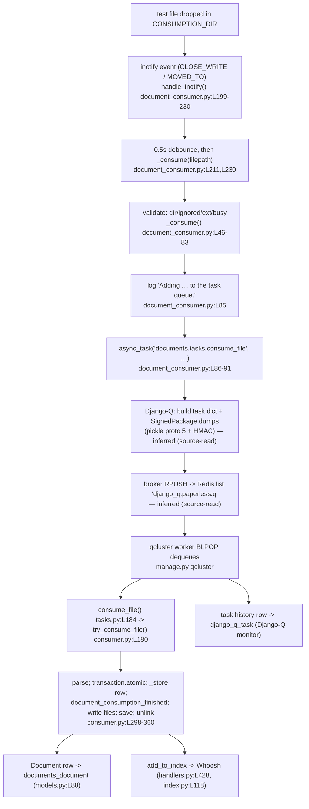
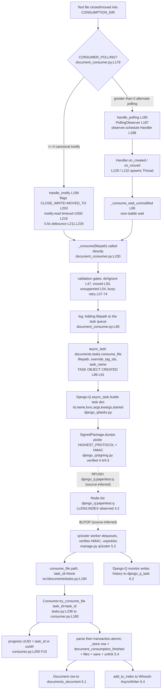

# Paperless-ngx Document Ingestion — Runtime Investigation

**Question answered:** How does Paperless-ngx ingest a document — from consumption-directory
detection through full-text indexing — and which code components and queuing framework are
responsible for each stage?

This document is written from **runtime observation first**: the stack was built and run inside the
canonical Docker image, a small test file was dropped into the consumption directory, and the real
output (log lines, the broker payload, database rows, the search index) was captured and is embedded
below verbatim. Every behavioural claim carries the command that produced it and its unedited output.
Claims that could only be read from source (never directly instrumented) are explicitly labelled
**inferred (source-read)** in §10.1.

---

## 0. Investigation facts, scope, and method

| Item | Value (observed) | Source of the command / evidence |
|------|------------------|-----------------------------------|
| Repository commit | `542221a38dff06361e07976452f9aea24d210542` | `git -C /app rev-parse HEAD` (§1.1) |
| Canonical image | `ghcr.io/scaleapi/swe-atlas:…_qna_1.01` | provided setup instruction |
| OS / Python | Debian GNU/Linux 11 (bullseye) / CPython 3.9.23 | `/etc/os-release`, `python3 --version` (§1.1) |
| Queuing framework | **Django-Q 1.3.9** (NOT Celery) | `requirements.txt` `django-q==1.3.9`; `django_q.VERSION` (§1.1, §8) |
| Database (default) | SQLite `DATA_DIR/db.sqlite3` | `settings.DATABASES` (§1.2) |
| Broker (default) | Redis `redis://localhost:6379` | `settings.Q_CLUSTER["redis"]` (§1.2) |
| Detection (default) | inotify (`CONSUMER_POLLING == 0`) | `settings.CONSUMER_POLLING` (§1.2); `document_consumer.py:L178` |
| Entry point exercised | the **consumption directory** (canonical) | watcher log lines (§2) |

**Method / directives honoured.** The stack was brought up in the **default configuration** (SQLite,
local Redis, the three standard services). Values below come from the real consumption-directory entry
point, not a mock or debug hook. The broker payload was captured *while the worker was stopped* so the
queued task could be observed before it drained. Timing-/count-sensitive claims were confirmed across
≥2 runs (§2.1, §4.6, §9.4). Every temporary helper script is reproduced in full (§4.4, §4.5, §5.1,
§6.3) and was removed afterward (§10.2).

**Read-only integrity.** The only file added to the repository is this document. No source file was
modified; `git status --porcelain` in the checkout is empty (§10.2). All observation scripts and test
files lived outside the checkout under `/tmp/obs` and were deleted.

**Pipeline at a glance** (each edge is cited to `file:line` in §7):



---

## 1. Environment bring-up (R1)

All three canonical services are defined in `docker/supervisord.conf`: `gunicorn` (web/ASGI)
[`docker/supervisord.conf:L10-L11`], `document_consumer` (the file watcher)
[`docker/supervisord.conf:L19-L20`], and `qcluster` (the Django-Q worker)
[`docker/supervisord.conf:L28-L29`]. Startup ordering (wait-for-redis → migrate → reindex →
create-superuser) is prescribed by `docker/docker-prepare.sh` (`wait-for-redis.py` at L33, `migrate`
at L45, `document_index reindex` at L55, `manage_superuser` at L62), which the entrypoint invokes via
`gosu paperless /sbin/docker-prepare.sh` [`docker/docker-entrypoint.sh:L37`] after creating the data
directories [`docker/docker-entrypoint.sh:L21-L29`]. The bring-up below performs exactly those steps
by hand.

### 1.1 Observed image, versions, and commit

The canonical runtime is the user-provided Docker image. It was pulled by its pinned tag and run as
a long-lived container; every command in this document runs inside it via `docker exec`. The exact
commands and the resulting image identity (tag + content digest + local image id):

```text
$ docker pull ghcr.io/scaleapi/swe-atlas:swe_atlas_QnA_paperless-ngx_paperless-ngx_e233ae8334038a4b615ea2e4ce663e30_qna_1.01

$ docker run -d --name paperless_fresh \
      ghcr.io/scaleapi/swe-atlas:swe_atlas_QnA_paperless-ngx_paperless-ngx_e233ae8334038a4b615ea2e4ce663e30_qna_1.01 \
      -c "sleep infinity"
122e7758b9c98cb4d402ce8582fca672dbfe398a79d3e6e40d8406e847dd4746

$ docker inspect -f '{{.State.Running}} {{.State.ExitCode}}' paperless_fresh
true 0

$ docker inspect --format '{{.Config.Image}}
{{.Image}}' paperless_fresh
ghcr.io/scaleapi/swe-atlas:swe_atlas_QnA_paperless-ngx_paperless-ngx_e233ae8334038a4b615ea2e4ce663e30_qna_1.01
sha256:6e699f225ced49182033cf995daf2a07d3628fe29bb573f5aa4c4188c253969f

$ docker image inspect sha256:6e699f225ced --format '{{.RepoDigests}}'
[ghcr.io/scaleapi/swe-atlas@sha256:d4abe56dd5d1cb2632353baf06e9d80a704f147a70ac2ec15c2b78fc5fddfe15]
```

> **The launch uses `-c "sleep infinity"`, not `bash -c "sleep infinity"`.** The image's `ENTRYPOINT`
> is `["/bin/bash"]` with an empty `Cmd` (`docker image inspect … --format '{{json .Config.Entrypoint}}'`
> ⇒ `["/bin/bash"]`; `{{json .Config.Cmd}}` ⇒ `null`), so whatever is passed after the image name
> becomes *arguments to bash*. Passing `-c "sleep infinity"` therefore executes
> `/bin/bash -c "sleep infinity"`, and the container stays up (`State.Running=true`, `ExitCode=0`,
> shown above) so every later `docker exec` works. A leading `bash` token would instead make the
> entrypoint try to run the `bash` binary itself as a script — the container dies immediately with
> `/bin/bash: /bin/bash: cannot execute binary file` (exit code `126`).

All subsequent commands are run inside that container as the code owner `testuser`, e.g.
`docker exec -u testuser paperless_fresh bash -lc '<command>'`. The image identity, OS, commit, and
interpreter observed inside it:

```text
$ cat /etc/os-release | head -2
PRETTY_NAME="Debian GNU/Linux 11 (bullseye)"
NAME="Debian GNU/Linux"
$ git -C /app rev-parse HEAD
542221a38dff06361e07976452f9aea24d210542
$ python3 --version
Python 3.9.23
```

> The image ships all `requirements.txt` runtime deps but omits a few OS packages the pipeline needs
> at runtime; these were installed as root once, before any probe: `redis-server` (the broker),
> `libzbar0` (pyzbar barcode support — an import-time dependency), `poppler-utils`, `procps`, and
> `curl` (used by the §1.4 HTTP health checks). These are system packages inside the ephemeral
> container, not repository changes (§10.2).

The pristine image has no `curl` (and the other four packages are absent too), so the install pulls
them — plus their dependencies, e.g. `redis-tools`, which provides `redis-cli` — as **new** packages.
The exact command and its result (the non-deterministic `Get:`/`Unpacking` progress and the
per-package `Setting up …` lines are elided and marked `[…]`; everything shown is verbatim):

```text
$ command -v curl || echo "curl NOT FOUND"        # pristine image — before install
curl NOT FOUND
$ apt-get update > /dev/null                        # refresh Debian bullseye package lists (exit 0)
$ DEBIAN_FRONTEND=noninteractive apt-get install -y \
      redis-server libzbar0 poppler-utils procps curl
Reading package lists...
Building dependency tree...
Reading state information...
The following NEW packages will be installed:
  curl libcurl4 libgpm2 libjemalloc2 liblua5.1-0 liblzf1 libncurses6 libnspr4
  libnss3 libpoppler102 libprocps8 libv4l-0 libv4lconvert0 libzbar0 lua-bitop
  lua-cjson poppler-utils procps psmisc redis-server redis-tools
0 upgraded, 21 newly installed, 0 to remove and 50 not upgraded.
[… download, unpack, and the 21 per-package "Setting up …" lines elided; exit status 0 …]
$ command -v curl && curl --version | head -1       # after install — now present
/usr/bin/curl
curl 7.74.0 (x86_64-pc-linux-gnu) libcurl/7.74.0 OpenSSL/1.1.1w zlib/1.2.11 brotli/1.0.9 libidn2/2.3.0 libpsl/0.21.0 (+libidn2/2.3.0) libssh2/1.9.0 nghttp2/1.43.0 librtmp/2.3
$ command -v redis-cli                              # provided by redis-tools, pulled in above
/usr/bin/redis-cli
```

Package versions (read from the installed distributions; these match the pins in `requirements.txt`):

```text
django        4.0.4
django_q      (1, 3, 9)
redis(client) 3.5.3
whoosh        (2, 7, 4)
scikit-learn  1.0.2
watchdog         2.1.7
inotify_simple   1.3.5
channels         3.0.4
channels-redis   3.4.0
python-magic     0.4.25
```

`requirements.txt` pins the same versions (`django==4.0.4`, `django-q==1.3.9`, `redis==3.5.3`,
`whoosh==2.7.4`, `scikit-learn==1.0.2`, `watchdog==2.1.7`). The queuing framework identity —
**Django-Q 1.3.9** — is established here and expanded in §8.

### 1.2 Canonical configuration (read live from Django settings)

```text
CONSUMPTION_DIR   = /app/src/../consume
DATA_DIR          = /app/src/../data
INDEX_DIR         = /app/src/../data/index
CONSUMER_POLLING  = 0
Q_CLUSTER name    = paperless
Q_CLUSTER redis   = redis://localhost:6379
DB ENGINE         = django.db.backends.sqlite3
DB NAME           = /app/src/../data/db.sqlite3
```

These are the framework defaults: `CONSUMPTION_DIR` [`src/paperless/settings.py:L78`], `DATA_DIR`
[`src/paperless/settings.py:L66`], SQLite `db.sqlite3` [`src/paperless/settings.py:L300`],
`Q_CLUSTER` with `name: "paperless"` and `redis://localhost:6379`
[`src/paperless/settings.py:L449-L456`], and `CONSUMER_POLLING = int(os.getenv(…, 0))` = 0
[`src/paperless/settings.py:L478`] which selects the inotify branch (§7, §9.2). The same defaults are
documented in `paperless.conf.example` (`PAPERLESS_REDIS=redis://localhost:6379` at L10,
`PAPERLESS_DBHOST` unset ⇒ SQLite at L11, `CONSUMPTION_DIR=../consume` at L20, `DATA_DIR=../data` at
L21, `CONSUMER_POLLING` commented ⇒ default 0 at L60) and in the minimal
`docker/compose/docker-compose.sqlite.yml` (SQLite note at L13, `broker` = `redis:6.0` at L29, port
`8000:8000` at L40, `PAPERLESS_REDIS=redis://broker:6379` at L53).

### 1.3 Redis broker, migrations, index, static, superuser

`redis-server` was started (default `redis://localhost:6379`, matching `wait-for-redis.py:L19`):

```text
$ redis-server --daemonize yes --bind 127.0.0.1 --port 6379
$ redis-cli ping
PONG
```

**Runtime directories must be created first.** The fresh image ships **no** runtime directories, and
Paperless's Django system check aborts `migrate` until `CONSUMPTION_DIR` and `MEDIA_ROOT` exist.
Running `migrate` before creating them shows the gate; the directories are then created explicitly.
(The container entrypoint creates the data/media directories
[`docker/docker-entrypoint.sh:L21-L29`] but **not** `consume`, so the consumption directory must be
made by hand regardless of how the stack is brought up.)

```text
$ python3 manage.py migrate                          # attempted BEFORE the directories exist
SystemCheckError: System check identified some issues:

ERRORS:
?: PAPERLESS_CONSUMPTION_DIR is set but doesn't exist.
	HINT: Create a directory at /app/src/../consume
?: PAPERLESS_MEDIA_ROOT is set but doesn't exist.
	HINT: Create a directory at /app/src/../media
                                                     # (exit status 1)

$ mkdir -p /app/consume /app/data/index /app/data/log \
           /app/media/documents/originals /app/media/documents/thumbnails /app/static
$ mkdir -p /tmp/paperless && chown testuser:testuser /tmp/paperless   # consumer scratch dir (run as root)
```

With the directories in place, `manage.py migrate` runs onto a fresh SQLite database (complete
verbatim output):

```text
$ python3 manage.py migrate
Operations to perform:
  Apply all migrations: admin, auth, authtoken, contenttypes, django_q, documents, paperless_mail, sessions
Running migrations:
  Applying contenttypes.0001_initial... OK
  Applying auth.0001_initial... OK
  Applying admin.0001_initial... OK
  Applying admin.0002_logentry_remove_auto_add... OK
  Applying admin.0003_logentry_add_action_flag_choices... OK
  Applying contenttypes.0002_remove_content_type_name... OK
  Applying auth.0002_alter_permission_name_max_length... OK
  Applying auth.0003_alter_user_email_max_length... OK
  Applying auth.0004_alter_user_username_opts... OK
  Applying auth.0005_alter_user_last_login_null... OK
  Applying auth.0006_require_contenttypes_0002... OK
  Applying auth.0007_alter_validators_add_error_messages... OK
  Applying auth.0008_alter_user_username_max_length... OK
  Applying auth.0009_alter_user_last_name_max_length... OK
  Applying auth.0010_alter_group_name_max_length... OK
  Applying auth.0011_update_proxy_permissions... OK
  Applying auth.0012_alter_user_first_name_max_length... OK
  Applying authtoken.0001_initial... OK
  Applying authtoken.0002_auto_20160226_1747... OK
  Applying authtoken.0003_tokenproxy... OK
  Applying django_q.0001_initial... OK
  Applying django_q.0002_auto_20150630_1624... OK
  Applying django_q.0003_auto_20150708_1326... OK
  Applying django_q.0004_auto_20150710_1043... OK
  Applying django_q.0005_auto_20150718_1506... OK
  Applying django_q.0006_auto_20150805_1817... OK
  Applying django_q.0007_ormq... OK
  Applying django_q.0008_auto_20160224_1026... OK
  Applying django_q.0009_auto_20171009_0915... OK
  Applying django_q.0010_auto_20200610_0856... OK
  Applying django_q.0011_auto_20200628_1055... OK
  Applying django_q.0012_auto_20200702_1608... OK
  Applying django_q.0013_task_attempt_count... OK
  Applying django_q.0014_schedule_cluster... OK
  Applying documents.0001_initial... OK
  Applying documents.0002_auto_20151226_1316... OK
  Applying documents.0003_sender... OK
  Applying documents.0004_auto_20160114_1844... OK
  Applying documents.0005_auto_20160123_0313... OK
  Applying documents.0006_auto_20160123_0430... OK
  Applying documents.0007_auto_20160126_2114... OK
  Applying documents.0008_document_file_type... OK
  Applying documents.0009_auto_20160214_0040... OK
  Applying documents.0010_log... OK
  Applying documents.0011_auto_20160303_1929... OK
  Applying documents.0012_auto_20160305_0040... OK
  Applying documents.0013_auto_20160325_2111... OK
  Applying documents.0014_document_checksum... OK
  Applying documents.0015_add_insensitive_to_match... OK
  Applying documents.0016_auto_20170325_1558... OK
  Applying documents.0017_auto_20170512_0507... OK
  Applying documents.0018_auto_20170715_1712... OK
  Applying documents.0019_add_consumer_user... OK
  Applying documents.0020_document_added... OK
  Applying documents.0021_document_storage_type... OK
  Applying documents.0022_auto_20181007_1420... OK
  Applying documents.0023_document_current_filename... OK
  Applying documents.1000_update_paperless_all... OK
  Applying documents.1001_auto_20201109_1636... OK
  Applying documents.1002_auto_20201111_1105... OK
  Applying documents.1003_mime_types... OK
  Applying documents.1004_sanity_check_schedule... OK
  Applying documents.1005_checksums... OK
  Applying documents.1006_auto_20201208_2209... OK
  Applying documents.1007_savedview_savedviewfilterrule... OK
  Applying documents.1008_auto_20201216_1736... OK
  Applying documents.1009_auto_20201216_2005... OK
  Applying documents.1010_auto_20210101_2159... OK
  Applying documents.1011_auto_20210101_2340... OK
  Applying documents.1012_fix_archive_files... OK
  Applying documents.1013_migrate_tag_colour... OK
  Applying documents.1014_auto_20210228_1614... OK
  Applying documents.1015_remove_null_characters... OK
  Applying documents.1016_auto_20210317_1351... OK
  Applying documents.1017_alter_savedviewfilterrule_rule_type... OK
  Applying documents.1018_alter_savedviewfilterrule_value... OK
  Applying paperless_mail.0001_initial... OK
  Applying paperless_mail.0002_auto_20201117_1334... OK
  Applying paperless_mail.0003_auto_20201118_1940... OK
  Applying paperless_mail.0004_mailrule_order... OK
  Applying paperless_mail.0005_help_texts... OK
  Applying paperless_mail.0006_auto_20210101_2340... OK
  Applying paperless_mail.0007_auto_20210106_0138... OK
  Applying paperless_mail.0008_auto_20210516_0940... OK
  Applying paperless_mail.0009_mailrule_assign_tags... OK
  Applying paperless_mail.0010_auto_20220311_1602... OK
  Applying paperless_mail.0011_remove_mailrule_assign_tag... OK
  Applying paperless_mail.0012_alter_mailrule_assign_tags... OK
  Applying paperless_mail.0009_alter_mailrule_action_alter_mailrule_folder... OK
  Applying paperless_mail.0013_merge_20220412_1051... OK
  Applying paperless_mail.0014_alter_mailrule_action... OK
  Applying sessions.0001_initial... OK
```

The `documents.1001…` and `documents.1004…` migrations are the ones that register the scheduled
maintenance tasks (§3.3). Search-index build and static collection:

```text
$ python3 manage.py document_index reindex

0it [00:00, ?it/s]
0it [00:00, ?it/s]

$ python3 manage.py collectstatic --no-input
171 static files copied to '/app/static'.
```

`0it` confirms the index started **empty** (fresh DB, zero documents) — the "before" state for the
index growth shown in §6.4. A superuser was created non-interactively:

```text
$ DJANGO_SUPERUSER_PASSWORD=admin python3 manage.py createsuperuser --noinput \
      --username admin --email admin@example.com
Superuser created successfully.
```

### 1.4 Starting the three services (with PID capture and health checks)

Each service was launched in the background with its **PID captured** (via `setsid nohup … & echo $!`)
so it can be targeted precisely for the stop/restart in §4 and §9.2 — never a blind `pkill`.

**gunicorn** (web/ASGI), banner captured verbatim:

```text
[2026-07-13 17:55:02 +0000] [900] [INFO] Starting gunicorn 20.1.0
[2026-07-13 17:55:02 +0000] [900] [INFO] Listening at: http://0.0.0.0:8000 (900)
[2026-07-13 17:55:02 +0000] [900] [INFO] Using worker: paperless.workers.ConfigurableWorker
[2026-07-13 17:55:02 +0000] [900] [INFO] Server is ready. Spawning workers
```

**document_consumer** (the watcher) — the banner names the detection mode and directory:

```text
[2026-07-13 17:55:07,215] [INFO] [paperless.management.consumer] Using inotify to watch directory for changes: /app/src/../consume
```

`Using inotify …` is emitted by `handle_inotify()` [`src/documents/management/commands/document_consumer.py:L200`];
this is the **canonical branch** because `CONSUMER_POLLING == 0` (§1.2, §7, §9.2).

**qcluster** (the Django-Q worker) was started with `setsid nohup … & echo $!`; its cluster start
banner is captured verbatim below (worker/monitor/pusher child PIDs 949–961 as logged):

```text
17:55:10 [Q] INFO Q Cluster texas-summer-delta-earth starting.
17:55:10 [Q] INFO Process-1:1 ready for work at 949
17:55:10 [Q] INFO Process-1:2 ready for work at 950
17:55:10 [Q] INFO Process-1:3 ready for work at 951
17:55:10 [Q] INFO Process-1:4 ready for work at 952
17:55:10 [Q] INFO Process-1:5 ready for work at 953
17:55:10 [Q] INFO Process-1:6 ready for work at 954
17:55:10 [Q] INFO Process-1:7 ready for work at 955
17:55:10 [Q] INFO Process-1:8 ready for work at 956
17:55:10 [Q] INFO Process-1:9 ready for work at 957
17:55:10 [Q] INFO Process-1:10 ready for work at 958
17:55:10 [Q] INFO Process-1:11 ready for work at 959
17:55:10 [Q] INFO Process-1:12 monitoring at 960
17:55:10 [Q] INFO Process-1 guarding cluster texas-summer-delta-earth
17:55:10 [Q] INFO Process-1:13 pushing tasks at 961
17:55:10 [Q] INFO Q Cluster texas-summer-delta-earth running.
```

The cluster spawns 11 worker processes (`Process-1:1`…`:11`, PIDs 949–959), one **monitor**
(`:12` at PID 960, which writes task history — §6.3), a **guard** (`Process-1`), and one **pusher**
(`:13` at PID 961, which moves scheduled tasks onto the queue — §3.3). (This cluster,
`texas-summer-delta-earth`, is the bring-up incarnation; the worker was later stopped and restarted
during the R4 broker capture, producing the `pizza-low-beer-comet` cluster at PID 2691 — §4.7.)
Health checks against the running web server:

```text
$ curl -s -o /dev/null -w '%{http_code}\n' http://localhost:8000/
302
$ curl -s -X POST http://localhost:8000/api/token/ -d 'username=admin&password=admin'
{"token":"834b605b273d5c5757f6bf502ba58bbed7064275"}
```

`302` (redirect to the login UI) and a `200` token response confirm the ASGI app is serving. The three
services — **gunicorn** (PID 900), **`document_consumer`** (the inotify watcher), and **`qcluster`**
(the Django-Q cluster, child PIDs 949–961) — plus `redis-server` are now all running normally,
satisfying **R1**.

---

## 2. Detection log capture (R2, R3a)

A small text file was written into the consumption directory:

```text
$ printf 'Paperless-ngx ingestion observation: probe alpha.\nPlain text so no OCR is required.\n' > /app/consume/probe_alpha.txt
```

The watcher detected it and enqueued a task. This is the canonical first-detection log line
(`data/log/paperless.log`, verbatim):

```text
[2026-07-13 17:58:14,584] [INFO] [paperless.management.consumer] Adding /app/src/../consume/probe_alpha.txt to the task queue.
```

That message is emitted at `src/documents/management/commands/document_consumer.py:L85`, one line
before the `async_task(...)` dispatch at L86-L91 (§3.1). The `qcluster` worker picked the task up
almost immediately (`data/log/paperless.log` interleaved with the `[Q]` cluster log):

```text
17:58:14 [Q] INFO Process-1:5 processing [probe_alpha.txt]
[2026-07-13 17:58:14,748] [INFO] [paperless.consumer] Consuming probe_alpha.txt
[2026-07-13 17:58:15,455] [INFO] [paperless.consumer] Document 2026-07-13 probe_alpha consumption finished
17:58:15 [Q] INFO Processed [probe_alpha.txt]
```

`probe_alpha.txt` became **document id 1** with Django-Q task id
`0a24538cba5c4d1a837bd5b0b6ce6f18` (§6.1, §6.3).

### 2.1 Stability across runs — the *same unchanged input*, ≥2 times

To confirm detection is stable run-to-run, the **identical file** (same name, same bytes — MD5
`5cf17d24…`, a byte-copy of `probe_alpha.txt`) was dropped **three** times as `probe_dup.txt`. The
detection log line is byte-for-byte identical each time (only the timestamp differs):

```text
[2026-07-13 18:05:11,831] [INFO] [paperless.management.consumer] Adding /app/src/../consume/probe_dup.txt to the task queue.
[2026-07-13 18:06:23,752] [INFO] [paperless.management.consumer] Adding /app/src/../consume/probe_dup.txt to the task queue.
[2026-07-13 18:07:11,622] [INFO] [paperless.management.consumer] Adding /app/src/../consume/probe_dup.txt to the task queue.
```

Detection is therefore deterministic: an unchanged input yields the same `"Adding … to the task
queue."` line and an enqueue every time. (What differs downstream is the *duplicate* rejection at the
worker, which is likewise stable — three identical failures, shown in §9.4.)

---

## 3. Triggered task and downstream tasks/signals (R3b, R3c)

### 3.1 The triggered task: `documents.tasks.consume_file`

The watcher's validated-file handler `_consume()` logs the "Adding …" line and then submits the task.
Source, `src/documents/management/commands/document_consumer.py:L85-L91`:

```python
logger.info(f"Adding {filepath} to the task queue.")
async_task(
    "documents.tasks.consume_file",
    filepath,
    override_tag_ids=tag_ids if tag_ids else None,
    task_name=os.path.basename(filepath)[:100],
)
```

`async_task(...)` is Django-Q's submission function [`document_consumer.py:L13` imports it from
`django_q.tasks`]. The **task name** is `documents.tasks.consume_file`; the single positional arg is
the absolute filepath; the only kwarg is `override_tag_ids` (here `None`). Note the code does **not**
pass a `task_id` — this matters for the progress-vs-history id distinction in §5.1/§6.3. This exact
structure is what appears in the broker payload (§4.4) and the task-history rows (§6.3): observed
`func='documents.tasks.consume_file'`, `args=('…/probe_bravo.txt',)`,
`kwargs={'override_tag_ids': None}`.

### 3.2 Downstream: parsing → classification → indexing

The worker runs `consume_file()` [`src/documents/tasks.py:L184`], which delegates to
`Consumer.try_consume_file()` [`src/documents/consumer.py:L180`, called at `tasks.py:L236`]. Inside a
single database transaction, the pipeline persists the row and then fires the
`document_consumption_finished` signal, whose receivers perform classification and indexing. The
receivers are connected in `src/documents/apps.py:L22-L27` (six handlers, in this connect order):

| # | Handler | Source | Role |
|---|---------|--------|------|
| 1 | `add_inbox_tags` | `handlers.py:L30` | assign configured inbox tags |
| 2 | `set_correspondent` | `handlers.py:L35` | rule/ML correspondent match |
| 3 | `set_document_type` | `handlers.py:L101` | rule/ML document-type match |
| 4 | `set_tags` | `handlers.py:L168` | rule/ML tag matching |
| 5 | `set_log_entry` | `handlers.py:L413` | write a `django_admin_log` row (`LogEntry.objects.create` at L418) |
| 6 | `add_to_index` | `handlers.py:L428` | Whoosh `add_or_update_document` (`index.py:L118`) |

Classification uses the ML `DocumentClassifier` [`src/documents/classifier.py:L60`, `FORMAT_VERSION =
7` at L63] combined with rule-based matching in `src/documents/matching.py`
(`match_correspondents`/`match_document_types`/`match_tags`). Parsing is dispatched by MIME type via
`get_parser_class_for_mime_type()` [`src/documents/parsers.py:L81`], which selects the
**highest-weight** registered parser [`parsers.py:L97-L98`]. For the plain-text probes the selected
parser was `TextDocumentParser` (§5.2). The live progress transitions for these three stages are
captured in §5.1; the resulting index update in §6.4.

### 3.3 Per-document task vs. scheduled maintenance tasks

Two kinds of tasks appear on the same broker/worker. The **per-document** task is
`consume_file` (one per dropped file, §3.1). The **scheduled maintenance** tasks are registered as
Django-Q `Schedule` rows by data migrations, and the cluster's pusher enqueues them on their cadence.
The live schedule registry (read from `django_q.models.Schedule`):

```text
### Schedule.objects: (func, schedule_type, name)
('documents.tasks.index_optimize', 'D', 'Optimize the index')
('documents.tasks.sanity_check', 'W', 'Perform sanity check')
('documents.tasks.train_classifier', 'H', 'Train the classifier')
('paperless_mail.tasks.process_mail_accounts', 'I', 'Check all e-mail accounts')
```

These map to task functions in `src/documents/tasks.py`: `index_optimize()` [L32],
`train_classifier()` [L48], `sanity_check()` [L255]. They are registered by:

- `src/documents/migrations/1001_auto_20201109_1636.py` — `train_classifier` as **HOURLY** (`H`),
  name `"Train the classifier"` [L11-L13]; `index_optimize` as **DAILY** (`D`), name `"Optimize the
  index"` [L16-L18].
- `src/documents/migrations/1004_sanity_check_schedule.py` — `sanity_check` as **WEEKLY** (`W`), name
  `"Perform sanity check"` [L10-L13].

At cluster start the pusher created each one (verbatim from the `[Q]` log; the interval mail task fires
immediately, the others fire on cadence):

```text
17:55:40 [Q] INFO Enqueued 1
17:55:40 [Q] INFO Process-1 created a task from schedule [Train the classifier]
17:55:40 [Q] INFO Enqueued 1
17:55:40 [Q] INFO Process-1 created a task from schedule [Optimize the index]
17:55:40 [Q] INFO Enqueued 1
17:55:40 [Q] INFO Process-1 created a task from schedule [Perform sanity check]
17:55:40 [Q] INFO Enqueued 1
17:55:40 [Q] INFO Process-1 created a task from schedule [Check all e-mail accounts]
```

All four appear as history rows in §6.3, distinct from the per-document `consume_file` rows.


---

## 4. The queued Django-Q broker payload (R4)

The queue normally drains in milliseconds, so to observe a task *in the queued state* the worker was
stopped first, two files were dropped (so the tasks accumulate), the raw bytes were read and decoded,
and then the worker was restarted to drain them. The whole sequence below is a single captured run
(`/tmp/obs/r4.log`); `gunicorn`, `redis`, and the `document_consumer` watcher stayed up throughout.

### 4.1 Stop the worker by its captured PID (targeted, not `pkill`)

The `qcluster` PID was captured at launch (§1.4). It is its own process-group leader, so a single
negative-PID signal terminates the whole cluster; the two lingering children were then TERM'd
individually and absence was verified by counting real `qcluster` processes:

```text
===== [1] Identify running qcluster session-leader PID =====
qcluster.pid file -> 1326
pgid of 1326 -> 1326

===== [2] Stop qcluster by process-group (kill -TERM -1326) =====
exit of kill = 0
--- remaining qcluster processes (expect 0) ---
qcluster process count = 2

===== [10] Identify + terminate 2 straggler qcluster procs (clean absence) =====
straggler PID 2409

===== [10] Worker absence proof (count real python qcluster procs) =====
real python qcluster process count = 0  (0 = worker fully absent)
```

The initial `kill -TERM -1326` left two lingering children (`count = 2`); step [10] identified and
`TERM`'d each straggler individually (e.g. `PID 2409`) and then re-counted to confirm a clean absence
(`count = 0`) before the payload was inspected. (The `[N]` step numbers are the labels emitted by the
single `r4.log` run; §4.2–§4.7 quote the remaining steps of that same run in topic order.)

### 4.2 Drop while the worker is stopped → the tasks sit in the queue

With the worker absent, the broker list starts empty and grows by one per dropped file (the watcher is
still running and still enqueues):

```text
===== [3] Broker state BEFORE drop =====
$ redis-cli LLEN django_q:paperless:q
0
$ redis-cli KEYS "django_q*"


===== [4] Drop first probe (probe_bravo.txt) =====
$ redis-cli LLEN django_q:paperless:q
1

===== [5] Drop second probe (probe_foxtrot.txt, distinct content) =====
$ redis-cli LLEN django_q:paperless:q
2
$ redis-cli KEYS "django_q*"
django_q:paperless:q
```

The only key is the single list `django_q:paperless:q` — the Django-Q queue for the cluster named
`paperless` (§1.2). `LLEN 0 → 1 → 2` confirms the worker is not consuming (§4.7 shows it drain once
restarted).

### 4.3 Raw stored bytes, byte-exact (`redis-cli --no-raw LINDEX`)

The two queued items, exactly as stored (index 0 = first dropped, `probe_bravo`; index 1 =
`probe_foxtrot`). `--no-raw` prints the value quoted so the byte boundaries are unambiguous:

```text
$ redis-cli --no-raw LINDEX django_q:paperless:q 0
"gAWVGwEAAAAAAAB9lCiMAmlklIwgZTYxNThmOWQ5OTYyNDA5MjllNjQyYWNkODA4MzE1Y2WUjARuYW1llIwPcHJvYmVfYnJhdm8udHh0lIwEZnVuY5SMHGRvY3VtZW50cy50YXNrcy5jb25zdW1lX2ZpbGWUjARhcmdzlIwjL2FwcC9zcmMvLi4vY29uc3VtZS9wcm9iZV9icmF2by50eHSUhZSMBmt3YXJnc5R9lIwQb3ZlcnJpZGVfdGFnX2lkc5ROc4wHc3RhcnRlZJSMCGRhdGV0aW1llIwIZGF0ZXRpbWWUk5RDCgfqBw0SEiYJDSGUaA6MCHRpbWV6b25llJOUaA6MCXRpbWVkZWx0YZSTlEsASwBLAIeUUpSFlFKUhpRSlHUu:1wjLEk:oI0BKLD4mfmpiHqr4WpxYvE6E255p8CsvMzBMvN04SQ"

$ redis-cli --no-raw LINDEX django_q:paperless:q 1
"gAWVHwEAAAAAAAB9lCiMAmlklIwgM2JjZDEwYjBhMmQ5NDcwMDgyN2FiM2MyMWRmNzYwYWaUjARuYW1llIwRcHJvYmVfZm94dHJvdC50eHSUjARmdW5jlIwcZG9jdW1lbnRzLnRhc2tzLmNvbnN1bWVfZmlsZZSMBGFyZ3OUjCUvYXBwL3NyYy8uLi9jb25zdW1lL3Byb2JlX2ZveHRyb3QudHh0lIWUjAZrd2FyZ3OUfZSMEG92ZXJyaWRlX3RhZ19pZHOUTnOMB3N0YXJ0ZWSUjAhkYXRldGltZZSMCGRhdGV0aW1llJOUQwoH6gcNEhIpCSUGlGgOjAh0aW1lem9uZZSTlGgOjAl0aW1lZGVsdGGUk5RLAEsASwCHlFKUhZRSlIaUUpR1Lg:1wjLEn:P8lsClYLDBnpjRLHWPolG18A0TUI0zbqMZwL_7aGXOM"

===== byte length of each queued item =====
443
449
```

Each value has the `django.core.signing` shape `<base64-payload>:<b62-timestamp>:<HMAC>`. The base64
segment of index 0 begins `gAWV…` (which decodes to a pickle — proven in §4.5) and embeds
`ZTYxNThmOWQ…` = the ASCII of the task id `e6158f9d…` (confirmed by the decode in §4.4).

### 4.4 Decoded structure — the Django-Q task dictionary

The temporary helper reads one item with `LINDEX` (a **read-only** peek — it does not pop) and decodes
it with Django-Q's own `SignedPackage.loads`. Full source of the helper (removed in §10.2):

```python
#!/usr/bin/env python3
"""
Temporary observation helper (READ-ONLY): peek at the Django-Q broker queue and
decode ONE queued task with the framework's own SignedPackage.loads.

SAFETY: SignedPackage.loads ultimately unpickles data. pickle is NOT secure
against maliciously constructed data. This helper is limited to decoding the
broker item we ourselves just produced, in an isolated local container. NEVER
run a decoder like this against arbitrary or untrusted blobs: the HMAC signature
proves integrity/authenticity of a message signed with OUR SECRET_KEY, it does
NOT sandbox the unpickling.

Usage:  python3 decode_payload.py [index]     # default index 0 (head of list)
"""
import os
import pprint
import sys

import django

os.environ.setdefault("DJANGO_SETTINGS_MODULE", "paperless.settings")
django.setup()

import redis  # noqa: E402
from django.conf import settings  # noqa: E402
from django_q.conf import Conf  # noqa: E402
from django_q.signing import SignedPackage  # noqa: E402

KEY = "django_q:paperless:q"
idx = int(sys.argv[1]) if len(sys.argv) > 1 else 0

r = redis.from_url(settings.Q_CLUSTER["redis"])
print("LLEN", KEY, "=", r.llen(KEY))
raw = r.lindex(KEY, idx)  # read-only peek; LINDEX does NOT pop the item
print()
print(f"python type: {type(raw).__name__} | length: {len(raw)} bytes")
print("Conf.PREFIX (signing salt) =", Conf.PREFIX)
print("Conf.COMPRESSED            =", Conf.COMPRESSED)
print(f"SECRET_KEY used for HMAC   = settings.SECRET_KEY (len={len(settings.SECRET_KEY)})")
obj = SignedPackage.loads(raw)  # framework's own verify (HMAC) + unpickle
print()
print("decoded python type:", type(obj).__name__)
print("keys:", list(obj.keys()))
pprint.pprint(obj)
```

Decoding index 0 (`probe_bravo`) — verbatim stdout:

```text
$ PYTHONPATH=/app/src python3 /tmp/obs/decode_payload.py 0
LLEN django_q:paperless:q = 2

python type: bytes | length: 443 bytes
Conf.PREFIX (signing salt) = paperless
Conf.COMPRESSED            = False
SECRET_KEY used for HMAC   = settings.SECRET_KEY (len=50)

decoded python type: dict
keys: ['id', 'name', 'func', 'args', 'kwargs', 'started']
{'args': ('/app/src/../consume/probe_bravo.txt',),
 'func': 'documents.tasks.consume_file',
 'id': 'e6158f9d996240929e642acd808315ce',
 'kwargs': {'override_tag_ids': None},
 'name': 'probe_bravo.txt',
 'started': datetime.datetime(2026, 7, 13, 18, 18, 38, 593185, tzinfo=datetime.timezone.utc)}
```

**The queued "task object" is a Python `dict`** with keys `id, name, func, args, kwargs, started`. The
`func` is the dotted path `documents.tasks.consume_file` (matching the `async_task(...)` call in §3.1);
`args` is the one-tuple of the filepath; `kwargs` is `{'override_tag_ids': None}`; `id` is a Django-Q
task id (a 32-char hex UUID — **distinct** from the progress UUID in §5.1); `started` is a
timezone-aware datetime. The task id `e6158f9d…` reappears as the history row for `probe_bravo` in
§6.3, and `probe_bravo` becomes document id 10 (§6.1) — a full producer→broker→worker→row link.

### 4.5 Serialization proof — pickle at highest protocol, HMAC-signed

A second helper splits the signed string and disassembles the pickle header. Full source:

```python
#!/usr/bin/env python3
"""
Temporary observation helper (READ-ONLY): prove the queued broker value is a
pickle at the highest protocol, base64url-encoded, then HMAC-signed by Django-Q.
Splits the signed string produced by django_q.signing.SignedPackage.dumps into
its three parts and disassembles the pickle header with pickletools.
"""
import io
import os
import pickle
import pickletools

import django

os.environ.setdefault("DJANGO_SETTINGS_MODULE", "paperless.settings")
django.setup()

import redis  # noqa: E402
from django.conf import settings  # noqa: E402
from django.core.signing import b64_decode  # noqa: E402
from django_q.conf import Conf  # noqa: E402

KEY = "django_q:paperless:q"
r = redis.from_url(settings.Q_CLUSTER["redis"])
raw = r.lindex(KEY, 0)  # read-only peek
signed = raw.decode()

# django.core.signing format: "<payload>:<timestamp>:<signature>"
payload_b64, timestamp, signature = signed.rsplit(":", 2)
print("signed-string segments:")
print(f"  [0] b64 pickle payload (len {len(payload_b64)})")
print(f"  [1] b62 timestamp   = {timestamp}")
print(f"  [2] HMAC signature  = {signature}")
print(f"Conf.COMPRESSED = {Conf.COMPRESSED} "
      "(no zlib; a compressed payload would be '.'-prefixed)")
print()

pickle_bytes = b64_decode(payload_b64.encode())
print(f"unwrapped pickle payload: {len(pickle_bytes)} bytes")
print("first 2 bytes (hex):", pickle_bytes[:2].hex(),
      "=> 0x80 0x%02x = pickle opcode PROTO %d" % (pickle_bytes[1], pickle_bytes[1]))
print("pickle.HIGHEST_PROTOCOL on this interpreter:", pickle.HIGHEST_PROTOCOL)
print("--- pickletools disassembly (first 5 opcodes) ---")
buf = io.StringIO()
pickletools.dis(pickle_bytes, out=buf)
for line in buf.getvalue().splitlines()[:5]:
    print(line)
```

Verbatim stdout (reads index 0, `probe_bravo`):

```text
$ PYTHONPATH=/app/src python3 /tmp/obs/pickle_proof.py
signed-string segments:
  [0] b64 pickle payload (len 392)
  [1] b62 timestamp   = 1wjLEk
  [2] HMAC signature  = oI0BKLD4mfmpiHqr4WpxYvE6E255p8CsvMzBMvN04SQ
Conf.COMPRESSED = False (no zlib; a compressed payload would be '.'-prefixed)

unwrapped pickle payload: 294 bytes
first 2 bytes (hex): 8005 => 0x80 0x05 = pickle opcode PROTO 5
pickle.HIGHEST_PROTOCOL on this interpreter: 5
--- pickletools disassembly (first 5 opcodes) ---
    0: \x80 PROTO      5
    2: \x95 FRAME      283
   11: }    EMPTY_DICT
   12: \x94 MEMOIZE    (as 0)
   13: (    MARK
```

The `1wjLEk` timestamp and `oI0BKLD4…` HMAC here are exactly the trailing two segments of the index-0
raw bytes in §4.3 — confirming this is the same queued item. So the broker payload is:
**`pickle` (protocol 5 = `pickle.HIGHEST_PROTOCOL`) of the task dict → base64url → HMAC-signed** with
the salt `paperless` (`Conf.PREFIX`) and `settings.SECRET_KEY`, uncompressed (`Conf.COMPRESSED =
False`).

> **Security note (F13):** the HMAC proves **integrity/authenticity** — that the message was signed
> with *our* `SECRET_KEY` — it does **not** sandbox the unpickling. `pickle` is not safe against
> maliciously constructed data, so decoding queue bytes is only appropriate here because the broker is
> a trusted, local, single-tenant Redis and the bytes are ones this same install just produced. A
> decoder like the helper above must never be pointed at an untrusted or shared broker.

### 4.6 Payload structure is stable across the second queued task

Index 1 (`probe_foxtrot`, distinct content) decodes to the same shape — same keys, same `func`, same
`kwargs` form — differing only in `id`, `name`, `args`, and `started`. Verbatim:

```text
$ PYTHONPATH=/app/src python3 /tmp/obs/decode_payload.py 1
LLEN django_q:paperless:q = 2

python type: bytes | length: 449 bytes
Conf.PREFIX (signing salt) = paperless
Conf.COMPRESSED            = False
SECRET_KEY used for HMAC   = settings.SECRET_KEY (len=50)

decoded python type: dict
keys: ['id', 'name', 'func', 'args', 'kwargs', 'started']
{'args': ('/app/src/../consume/probe_foxtrot.txt',),
 'func': 'documents.tasks.consume_file',
 'id': '3bcd10b0a2d94700827ab3c21df760af',
 'kwargs': {'override_tag_ids': None},
 'name': 'probe_foxtrot.txt',
 'started': datetime.datetime(2026, 7, 13, 18, 18, 41, 599302, tzinfo=datetime.timezone.utc)}
```

The two items differ in length (443 vs 449 bytes) only because the filename/id strings differ in
length. The task-dictionary format is therefore stable across queued tasks. (`probe_foxtrot`'s id
`3bcd10b0…` reappears as its history row in §6.3, and it becomes document id 9 in §6.1.)

### 4.7 Restart the worker → the queue drains to empty

Restarting `qcluster` (again capturing the new PID) brings the workers back and both queued tasks are
consumed; `LLEN` returns to 0:

```text
===== [12] Restart qcluster (setsid nohup -> new session leader) =====
$ setsid nohup python3 manage.py qcluster > /tmp/obs/r4_qcluster.log 2>&1 & echo $!
new qcluster PID = 2691

===== [13] Worker presence proof (count real python qcluster procs) =====
real python qcluster process count = 15  (>0 = worker present again)

===== [14] Queue drains as worker consumes (LLEN after restart) =====
$ redis-cli LLEN django_q:paperless:q
0
```

The new cluster's log shows it dequeue and process both items (`/tmp/obs/r4_qcluster.log`):

```text
18:20:02 [Q] INFO Q Cluster pizza-low-beer-comet starting.
18:20:02 [Q] INFO Process-1:1 ready for work at 2700
18:20:02 [Q] INFO Process-1:2 ready for work at 2701
18:20:02 [Q] INFO Process-1:3 ready for work at 2702
18:20:02 [Q] INFO Process-1:4 ready for work at 2703
18:20:02 [Q] INFO Process-1:5 ready for work at 2704
18:20:02 [Q] INFO Process-1:6 ready for work at 2705
18:20:02 [Q] INFO Process-1:7 ready for work at 2706
18:20:02 [Q] INFO Process-1:8 ready for work at 2707
18:20:02 [Q] INFO Process-1:9 ready for work at 2708
18:20:02 [Q] INFO Process-1:10 ready for work at 2709
18:20:02 [Q] INFO Process-1:11 ready for work at 2710
18:20:02 [Q] INFO Process-1:12 monitoring at 2711
18:20:02 [Q] INFO Process-1 guarding cluster pizza-low-beer-comet
18:20:02 [Q] INFO Process-1:13 pushing tasks at 2712
18:20:02 [Q] INFO Q Cluster pizza-low-beer-comet running.
18:20:02 [Q] INFO Process-1:1 processing [probe_bravo.txt]
18:20:02 [Q] INFO Process-1:2 processing [probe_foxtrot.txt]
[2026-07-13 18:20:03,116] [INFO] [paperless.consumer] Consuming probe_bravo.txt
[2026-07-13 18:20:03,121] [INFO] [paperless.consumer] Consuming probe_foxtrot.txt
[2026-07-13 18:20:03,826] [INFO] [paperless.consumer] Document 2026-07-13 probe_foxtrot consumption finished
18:20:03 [Q] INFO Process-1:2 stopped doing work
[2026-07-13 18:20:03,879] [INFO] [paperless.consumer] Document 2026-07-13 probe_bravo consumption finished
18:20:03 [Q] INFO Process-1:1 stopped doing work
18:20:03 [Q] INFO Processed [probe_foxtrot.txt]
18:20:03 [Q] INFO Processed [probe_bravo.txt]
18:20:03 [Q] INFO recycled worker Process-1:1
18:20:03 [Q] INFO Process-1:14 ready for work at 2744
18:20:04 [Q] INFO recycled worker Process-1:2
18:20:04 [Q] INFO Process-1:15 ready for work at 2745
```

This is the queued→dequeued boundary the broker inspection required: the payload was observed *in* the
queue (§4.3–§4.6) and then observed being consumed once the worker returned.


---

## 5. Downstream `qcluster` execution — the consume pipeline (R3c)

### 5.1 Live progress transitions (captured from the channel layer)

`Consumer._send_progress()` publishes progress to the `status_updates` channel group (the same feed
the web UI's progress bar consumes). A helper subscribed a fresh channel *before* a file was dropped
and printed every message. Full source (removed in §10.2):

```python
#!/usr/bin/env python3
"""
Temporary observation helper (READ-ONLY): subscribe a fresh channel to the
"status_updates" group BEFORE a file is dropped, then print every progress
payload that Consumer._send_progress emits (the same messages the live web-UI
progress bar consumes). Exits after it sees a terminal status (SUCCESS/FAILED)
or after ~40s. Run under `timeout` as a guard.
"""
import json
import os
import time

import django

os.environ.setdefault("DJANGO_SETTINGS_MODULE", "paperless.settings")
django.setup()

from asgiref.sync import async_to_sync  # noqa: E402
from channels.layers import get_channel_layer  # noqa: E402

cl = get_channel_layer()
channel = async_to_sync(cl.new_channel)()
async_to_sync(cl.group_add)("status_updates", channel)
print("LISTENING", flush=True)

deadline = time.monotonic() + 40
while time.monotonic() < deadline:
    try:
        msg = async_to_sync(cl.receive)(channel)
    except Exception as e:  # pragma: no cover
        print("RECV-ERROR", e, flush=True)
        break
    data = msg.get("data", msg)
    print("PROGRESS " + json.dumps(data, default=str), flush=True)
    if isinstance(data, dict) and data.get("status") in ("SUCCESS", "FAILED"):
        break
```

The literal invocation — one shell subscribes under a hard `timeout` guard (the helper self-exits at
its own ~40 s deadline, so `timeout 45` is only a backstop), and a second shell drops
`probe_final.txt` into the consumption directory using the canonical `printf` form of §2 — produced
exactly six transitions (verbatim `/tmp/obs/progress_final.log`):

```text
$ timeout 45 python3 /tmp/obs/progress_listener.py | tee /tmp/obs/progress_final.log   # shell A
LISTENING
#   ← now, in shell B: printf '...' > /app/consume/probe_final.txt   (canonical drop, §2)
PROGRESS {"filename": "probe_final.txt", "task_id": "492bfc9b-1986-47d9-8a42-fffecf8c36ff", "current_progress": 0, "max_progress": 100, "status": "STARTING", "message": "new_file", "document_id": null}
PROGRESS {"filename": "probe_final.txt", "task_id": "492bfc9b-1986-47d9-8a42-fffecf8c36ff", "current_progress": 20, "max_progress": 100, "status": "WORKING", "message": "parsing_document", "document_id": null}
PROGRESS {"filename": "probe_final.txt", "task_id": "492bfc9b-1986-47d9-8a42-fffecf8c36ff", "current_progress": 70, "max_progress": 100, "status": "WORKING", "message": "generating_thumbnail", "document_id": null}
PROGRESS {"filename": "probe_final.txt", "task_id": "492bfc9b-1986-47d9-8a42-fffecf8c36ff", "current_progress": 90, "max_progress": 100, "status": "WORKING", "message": "parse_date", "document_id": null}
PROGRESS {"filename": "probe_final.txt", "task_id": "492bfc9b-1986-47d9-8a42-fffecf8c36ff", "current_progress": 95, "max_progress": 100, "status": "WORKING", "message": "save_document", "document_id": null}
PROGRESS {"filename": "probe_final.txt", "task_id": "492bfc9b-1986-47d9-8a42-fffecf8c36ff", "current_progress": 100, "max_progress": 100, "status": "SUCCESS", "message": "finished", "document_id": 8}
```

The transitions map to `_send_progress` calls in `consumer.py`: `STARTING/new_file` at 0%
[`consumer.py:L202`], `parsing_document` at 20% [`consumer.py:L259`], `generating_thumbnail` at 70%
[`consumer.py:L264`], `parse_date` at 90% [`consumer.py:L274`], `save_document` at 95%
[`consumer.py:L294`], and `SUCCESS/finished` at 100% [`consumer.py:L375`].

**The progress `task_id` is a separate UUID (F10).** Here it is
`492bfc9b-1986-47d9-8a42-fffecf8c36ff` — a UUID-4, *not* the Django-Q task id. This is because the
watcher's `async_task(...)` does not pass a `task_id` (§3.1), so
`Consumer.try_consume_file(..., task_id=None)` [`consumer.py:L180,L188`] falls back to
`self.task_id = task_id or str(uuid.uuid4())` [`consumer.py:L200`], minting its own id for the
progress feed. The Django-Q history id for this same file is the different value
`d8b3a78c153a446a87c8b1abb188e4a1` (a 32-char hex, §6.3). Both are traced to document id 8 in §5.3.

### 5.2 Logged pipeline detail (from `data/log/paperless.log`)

The verbatim per-stage log for one document (`probe_alpha`) shows the pipeline order end-to-end:

```text
[2026-07-13 17:58:14,584] [INFO] [paperless.management.consumer] Adding /app/src/../consume/probe_alpha.txt to the task queue.
[2026-07-13 17:58:14,748] [INFO] [paperless.consumer] Consuming probe_alpha.txt
[2026-07-13 17:58:14,751] [DEBUG] [paperless.consumer] Detected mime type: text/plain
[2026-07-13 17:58:14,755] [DEBUG] [paperless.consumer] Parser: TextDocumentParser
[2026-07-13 17:58:14,757] [DEBUG] [paperless.consumer] Parsing probe_alpha.txt...
[2026-07-13 17:58:14,757] [DEBUG] [paperless.consumer] Generating thumbnail for probe_alpha.txt...
[2026-07-13 17:58:14,779] [DEBUG] [paperless.parsing.text] Execute: optipng -silent -o5 /tmp/paperless/paperless-6qt39kmj/thumb.png -out /tmp/paperless/paperless-6qt39kmj/thumb_optipng.png
[2026-07-13 17:58:15,408] [DEBUG] [paperless.classifier] Document classification model does not exist (yet), not performing automatic matching.
[2026-07-13 17:58:15,411] [DEBUG] [paperless.consumer] Saving record to database
[2026-07-13 17:58:15,430] [DEBUG] [paperless.consumer] Deleting file /app/src/../consume/probe_alpha.txt
[2026-07-13 17:58:15,454] [DEBUG] [paperless.parsing.text] Deleting directory /tmp/paperless/paperless-6qt39kmj
[2026-07-13 17:58:15,455] [INFO] [paperless.consumer] Document 2026-07-13 probe_alpha consumption finished
```

Read against `Consumer.try_consume_file()` [`consumer.py:L180`], the **actual order** is (this is the
correction to any "parse → classify → persist" simplification — F3):

1. `Detected mime type` — MIME detection [`consumer.py:L217`], then parser selection
   [`consumer.py:L221` → `parsers.get_parser_class_for_mime_type()` `parsers.py:L81`].
2. `Parsing …` — `document_parser.parse(...)` [`consumer.py:L261`].
3. `Generating thumbnail …` — `get_thumbnail(...)` [`consumer.py:L265`] (the `optipng` line is the
   text parser optimising the thumbnail).
4. Date resolution — `get_date()` then `parse_date()` if needed [`consumer.py:L271-L275`].
5. **Then a single DB transaction** `with transaction.atomic():` [`consumer.py:L298`]:
   - `self._store(...)` creates the `documents_document` row [`consumer.py:L301`] (`Saving record to
     database`).
   - the `document_consumption_finished` signal fires [`consumer.py:L306`], running the six handlers
     of §3.2 — **classification and the index update happen here, *after* the row exists, inside the
     transaction**. (`Document classification model does not exist (yet)` is `set_correspondent`/etc.
     finding no trained model.)
   - original/thumbnail/archive files are written under a file lock [`consumer.py:L317-L343`];
     `document.save()` [`consumer.py:L346`]; the source file is unlinked [`consumer.py:L350`]
     (`Deleting file …`).
6. The transaction commits at the end of the block; `consumption finished` is logged
   [`consumer.py:L373`]; the final `SUCCESS/finished(100)` progress is sent [`consumer.py:L375`]; the
   function returns the `Document` [`consumer.py:L377`].
7. **Only after `consume_file` returns** does the Django-Q monitor write the task-history row to
   `django_q_task` (framework-level — inferred (source-read), §6.3).

### 5.3 One document traced end-to-end (F10 continuity)

Tying the identifiers together for `probe_final.txt`:

| Stage | Identifier / value (observed) | Where shown |
|-------|-------------------------------|-------------|
| Detection + enqueue | `Adding …/probe_final.txt to the task queue.` @ `18:10:02,260` | §2-style watcher line |
| Django-Q task id (broker/history) | `d8b3a78c153a446a87c8b1abb188e4a1` | §6.3 task row |
| Worker pick-up | `Process-1:10 processing [probe_final.txt]` @ `18:10:02` | worker log |
| Progress feed UUID (separate) | `492bfc9b-1986-47d9-8a42-fffecf8c36ff` | §5.1 |
| Persisted row | `documents_document` id **8** (`probe_final`) | §6.1 |
| Admin-log row | object_id `8`, repr `2026-07-13 probe_final` | §6.3 |
| Full-text index | `search content:'walkthrough' -> [(8, 'probe_final')]` | §6.4 |

The watcher/worker lines (verbatim):

```text
[2026-07-13 18:10:02,260] [INFO] [paperless.management.consumer] Adding /app/src/../consume/probe_final.txt to the task queue.
18:10:02 [Q] INFO Enqueued 1
18:10:02 [Q] INFO Process-1:10 processing [probe_final.txt]
[2026-07-13 18:10:02,422] [INFO] [paperless.consumer] Consuming probe_final.txt
[2026-07-13 18:10:03,179] [INFO] [paperless.consumer] Document 2026-07-13 probe_final consumption finished
18:10:03 [Q] INFO Processed [probe_final.txt]
```

So one dropped file produced: one watcher enqueue → one Django-Q task id (`d8b3a78c…`) → one worker run
emitting its own progress UUID (`492bfc9b…`) → one `documents_document` row (id 8) → one admin-log row
→ one Whoosh entry searchable by its content.

### 5.4 The transaction / signal / history execution order (F3)

The order in which the pipeline persists the row, fires the post-consume signal, writes the files,
deletes the source, and finally records task history matters — and it is **not** simply
"parse → classify → persist". The precise ordering inside
`Consumer.try_consume_file()` [`consumer.py:L180`] is, in source order:

| # | Step | `consumer.py` line | Progress emitted |
|---|------|--------------------|------------------|
| 1 | `self.task_id = task_id or str(uuid.uuid4())` (progress UUID, F10) | `L200` | — |
| 2 | `_send_progress(0, …, "STARTING", NEW_FILE)` | `L202` | 0% STARTING |
| 3 | `pre_check_file_exists()` / `pre_check_directories()` / `pre_check_duplicate()` | `L211-L213` | — (duplicate aborts here, §9.4) |
| 4 | `document_consumption_started.send(...)` | `L229` | — |
| 5 | `_send_progress(20, …, PARSING_DOCUMENT)` then parse | `L259` | 20% WORKING |
| 6 | `_send_progress(70, …, GENERATING_THUMBNAIL)` then thumbnail | `L264` | 70% WORKING |
| 7 | date resolution; if unset `_send_progress(90, …, PARSE_DATE)` | `L274` | 90% WORKING |
| 8 | `_send_progress(95, …, SAVE_DOCUMENT)` | `L294` | 95% WORKING |
| 9 | **`with transaction.atomic():`** opens | `L298` | — |
| 9a | `document = self._store(...)` — **creates the `documents_document` row** | `L301` | — |
| 9b | **`document_consumption_finished.send(...)` — runs the post-consume handlers** (§3.2) | `L306` | — |
| 9c | write originals / thumbnail / archive under a file lock | `L317-L332` | — |
| 9d | `document.save()` (persist checksums/paths set during file writes) | `L346` | — |
| 9e | `os.unlink(self.path)` — **delete the consumed source file** | `L350` | — |
| 9f | delete shadow/`.pdf.txt` sidecar if present | `L360` | — |
| 10 | (atomic block commits) → `run_post_consume_script(document)` | `L371` | — |
| 11 | `log("info", "Document {} consumption finished")` | `L373` | — |
| 12 | `_send_progress(100, …, "SUCCESS", FINISHED, document.id)` | `L375` | 100% SUCCESS |
| 13 | `return document` | `L377` | — |
| 14 | **Django-Q monitor writes the history row to `django_q_task`** — *after* the task function returns | `django_q/cluster.py` | — |

Three ordering facts are load-bearing and are each corroborated by observed output:

- **The signal fires *inside* the transaction, *after* the row is created but *before* the source
  file is deleted.** `_store` [`L301`] creates the row; `document_consumption_finished.send` [`L306`]
  runs the six handlers (correspondent/type/tag matching, admin-log entry, index update, §3.2)
  while still inside `transaction.atomic()` [`L298`]. This is why the classification handlers and
  the index update see a committed-consistent row. The `probe_alpha` log (§5.2) shows the resulting
  observable order: `Saving record to database` → (handlers run) → `Deleting file …/probe_alpha.txt`
  → `Document 2026-07-13 probe_alpha consumption finished`.

- **The source file is deleted at `L350`, *within* the atomic block**, only after the row and its
  files are written — so a mid-pipeline failure rolls back the row *and* leaves the source file in
  place (the basis for the duplicate/failure behavior in §9.4, where no row was created and the
  task simply failed).

- **Task history is written last, by Django-Q, not by the consumer.** The `django_q_task` row for
  each document (§6.2) is created by the Django-Q cluster monitor *after* `consume_file` returns —
  which is why every `probe_*` task's stop-time in §6.2 is a few milliseconds *after* its
  `consumption finished` log line (e.g. `probe_final`: log at `18:10:03,179`, task stopped at
  `18:10:03.182663`).


---

## 6. Database records and processing history (R5)

All queries below are **read-only** (`sqlite3` opened with `mode=ro`) against the canonical SQLite
database `data/db.sqlite3`.

### 6.1 Where the document record lives → `documents_document` (R5a)

The persisted record lives in the table **`documents_document`**, backing the `Document` model
[`src/documents/models.py:L88`]. All ten consumed probes, verbatim
(`SELECT id,title,correspondent_id,document_type_id,mime_type,checksum,created,added,filename …`):

```text
(1, 'probe_alpha', None, None, 'text/plain', '5cf17d24f1c7e1767969b2d83945c3d6', '2026-07-13 17:58:13.577774', '2026-07-13 17:58:15.412004', '0000001.txt')
(2, 'probe_echo', None, None, 'text/plain', 'd0aaaa4a5e99308d4320355ed8151809', '2026-07-13 17:58:48.932856', '2026-07-13 17:58:50.810797', '0000002.txt')
(3, 'probe_charlie', None, None, 'text/plain', '91d6f0d38ec395a383fcc61243231730', '2026-07-13 17:59:56.466012', '2026-07-13 18:00:42.564716', '0000003.txt')
(4, 'probe_delta', None, None, 'text/plain', 'd2104b0922b43f0903dcb1f488e04d36', '2026-07-13 18:00:25.143079', '2026-07-13 18:00:42.582805', '0000004.txt')
(5, '2019-03-14 probe_datedname', None, None, 'text/plain', '86701f37b9e7ff08cf8f57f1ff78e2af', '2026-07-13 18:02:46.032406', '2026-07-13 18:02:47.838768', '0000005.txt')
(6, 'probe_mtime', None, None, 'text/plain', '73d47a5921389c600f228bfa09d6e6e1', '2021-06-15 09:30:00', '2026-07-13 18:04:18.887489', '0000006.txt')
(7, 'probe_polling', None, None, 'text/plain', '2d7cc46dcf115143d54ce32353dda940', '2026-07-13 18:06:26.559918', '2026-07-13 18:06:34.561352', '0000007.txt')
(8, 'probe_final', None, None, 'text/plain', '4f4d931dbcaad20452a8892e777e5e51', '2026-07-13 18:10:01.257416', '2026-07-13 18:10:03.125329', '0000008.txt')
(9, 'probe_foxtrot', None, None, 'text/plain', 'a513684b87fd1158976bf8a8249e3635', '2026-07-13 18:18:40.596621', '2026-07-13 18:20:03.779800', '0000009.txt')
(10, 'probe_bravo', None, None, 'text/plain', '44428d2b6a97253238ff6737e640cfd1', '2026-07-13 18:18:37.590614', '2026-07-13 18:20:03.833269', '0000010.txt')
```

Row count = 10 (`SELECT COUNT(*) FROM documents_document → 10`). `probe_bravo`/`probe_foxtrot` are the
two broker probes from §4 (ids 10/9). `probe_final` is id 8, the traced document of §5.3.

### 6.2 Which fields capture parsed metadata (R5b)

The columns above map to `Document` fields: `content` (extracted text — `models.py:L117`), `mime_type`
(`models.py:L126`), `checksum` (MD5 of the original — `models.py:L135`), `archive_checksum`
(`models.py:L143`), `created` (`models.py:L152`), `archive_serial_number` (`models.py:L196`), plus FK
columns `correspondent_id`/`document_type_id` and the M2M `tags`. Observed values for the text probes:
`mime_type = text/plain`; `correspondent_id/document_type_id = None` (no trained model — §5.2). The
complete, unedited output of `SELECT id, length(content), substr(content,1,60) FROM
documents_document ORDER BY id` (all ten rows, showing each probe's extracted-text length and a
60-character prefix of `content`):

```text
(1, 84, 'Paperless-ngx ingestion observation: probe alpha.\nPlain text')
(2, 90, 'Paperless-ngx ingestion observation: probe echo for progress')
(3, 93, 'Paperless-ngx ingestion observation: probe charlie, queued w')
(4, 82, 'Paperless-ngx ingestion observation: probe delta, second que')
(5, 82, 'Probe with a date encoded in the filename to demonstrate cre')
(6, 74, 'Probe to prove created falls back to source-file mtime at de')
(7, 30, 'detected via polling observer\n')
(8, 116, 'Paperless-ngx ingestion observation: probe final, primary en')
(9, 47, 'R4 broker probe foxtrot - different bytes ZZZZ\n')
(10, 45, 'R4 broker probe bravo - distinct content AAA\n')
```

**The `created` field — actual precedence (F11).** `Consumer._store()` sets `created` with this
fallback chain [`src/documents/consumer.py:L389-L392`]:

1. `file_info.created` — a date parsed **from the filename**, but only when it matches the strict
   `FileInfo` pattern (`YYYYMMDD[HHMMSS]Z - title`) [`models.py:L386`]; otherwise `None`.
2. else `date` — a date extracted from the **document text/parser** via `parse_date()`
   [`parsers.py:L212`] (filename dates only if `PAPERLESS_FILENAME_DATE_ORDER` is set — it is **unset**
   by default, `settings.py:L575`).
3. else `timezone.make_aware(datetime.fromtimestamp(stat.st_mtime))` — the **source file's mtime**.

The default config uses **neither** filename-date nor text-date extraction for these probes, so
`created` is the **mtime fallback**. Two probes prove this:

- **Filename with an embedded date does *not* win.** `2019-03-14 probe_datedname.txt` (id 5) has
  `created = 2026-07-13 18:02:46` — the *drop time*, **not** 2019-03-14. The filename does not match
  the strict `FileInfo` format and `FILENAME_DATE_ORDER` is unset, so the filename date is ignored.
- **mtime is used verbatim.** For `probe_mtime.txt` (id 6) the source file's mtime was set with
  `touch -d "2021-06-15 09:30:00"` and copied with `cp -p` (preserving mtime); `created` came out as
  exactly `2021-06-15 09:30:00`. This is the mtime-fallback branch, demonstrated to the second.

Column definitions and nullability (`PRAGMA table_info(documents_document)`, relevant rows):

```text
(2, 'content', 'text', 1, None, 0)
(3, 'created', 'datetime', 1, None, 0)
(5, 'correspondent_id', 'integer', 0, None, 0)
(6, 'checksum', 'varchar(32)', 1, None, 0)
(9, 'archive_serial_number', 'integer', 0, None, 0)
(10, 'document_type_id', 'integer', 0, None, 0)
(11, 'mime_type', 'varchar(256)', 1, None, 0)
(12, 'archive_checksum', 'varchar(32)', 0, None, 0)
```

(`notnull=1` on `content`, `created`, `checksum`, `mime_type`; the correspondent/type/ASN/archive
columns are nullable, consistent with the `None`s above.) There are **no tag rows** — the M2M junction
`documents_document_tags` is empty:

```text
### documents_document_tags junction rows:
   (empty above => zero tag rows)
```

### 6.3 Task / processing history (R5c)

At this commit there is **no `PaperlessTask` model/table** (that arrives in a later Celery-based
release). Processing history is kept in three places:

**(a) Django-Q's own table `django_q_task`** — one row per completed task (success or failure). All 19
rows, verbatim (`SELECT id,name,func,success,started,stopped …`):

```text
('7215f27dadcd4677991e44e6af27aedd', 'uranus-fruit-charlie-xray', 'documents.tasks.train_classifier', 1, '2026-07-13 17:55:40.021573', '2026-07-13 17:55:40.166876')
('49d89ec5ae6d4292b846127449e2a93e', 'skylark-beer-neptune-eighteen', 'documents.tasks.index_optimize', 1, '2026-07-13 17:55:40.023976', '2026-07-13 17:55:40.171374')
('4d046c528bd343bc880e3f9e4be76cd9', 'lemon-oregon-coffee-bluebird', 'documents.tasks.sanity_check', 1, '2026-07-13 17:55:40.025271', '2026-07-13 17:55:40.169886')
('f0cf4dfc64f94024898bd02ee7b41aef', 'missouri-wolfram-yankee-oranges', 'paperless_mail.tasks.process_mail_accounts', 1, '2026-07-13 17:55:40.026520', '2026-07-13 17:55:40.053516')
('0a24538cba5c4d1a837bd5b0b6ce6f18', 'probe_alpha.txt', 'documents.tasks.consume_file', 1, '2026-07-13 17:58:14.586075', '2026-07-13 17:58:15.457735')
('2f3735d2090f428f9c1f7b9ee748e1a4', 'probe_echo.txt', 'documents.tasks.consume_file', 1, '2026-07-13 17:58:49.936583', '2026-07-13 17:58:50.857835')
('8a96b85bf79c4bdb9288e936d95935a4', 'probe_charlie.txt', 'documents.tasks.consume_file', 1, '2026-07-13 17:59:57.469204', '2026-07-13 18:00:42.614970')
('bbcdcdd6896748bcabaa06a20a2ef6c4', 'probe_delta.txt', 'documents.tasks.consume_file', 1, '2026-07-13 18:00:26.145871', '2026-07-13 18:00:42.664520')
('a850544b23da4cd583c67a74a4e4be06', '2019-03-14 probe_datedname.txt', 'documents.tasks.consume_file', 1, '2026-07-13 18:02:47.035951', '2026-07-13 18:02:47.875589')
('cd9e09be17e54c29ae281fa88ce362fb', 'probe_mtime.txt', 'documents.tasks.consume_file', 1, '2026-07-13 18:04:18.055016', '2026-07-13 18:04:18.954021')
('aaa8fbd09c434819aed2d7fcea54ee3b', 'cold-missouri-grey-johnny', 'paperless_mail.tasks.process_mail_accounts', 1, '2026-07-13 18:04:41.832575', '2026-07-13 18:04:41.861434')
('ce10a6009d95490bb8965c424a2009d9', 'probe_dup.txt', 'documents.tasks.consume_file', 0, '2026-07-13 18:05:11.832481', '2026-07-13 18:05:12.007348')
('f81b9b5222eb471d85d2cb6295502214', 'probe_dup.txt', 'documents.tasks.consume_file', 0, '2026-07-13 18:06:23.752957', '2026-07-13 18:06:23.916041')
('8fba19469e074bc88b9c7f5fb02afdc9', 'probe_polling.txt', 'documents.tasks.consume_file', 1, '2026-07-13 18:06:33.761938', '2026-07-13 18:06:34.616065')
('22097e75d0ff48e0a67cbabd4fcc1ee1', 'probe_dup.txt', 'documents.tasks.consume_file', 0, '2026-07-13 18:07:11.623692', '2026-07-13 18:07:11.793924')
('d8b3a78c153a446a87c8b1abb188e4a1', 'probe_final.txt', 'documents.tasks.consume_file', 1, '2026-07-13 18:10:02.261939', '2026-07-13 18:10:03.182663')
('6e99c0e29cad40f98b2c6ab898dbce84', 'stream-mexico-lake-arkansas', 'paperless_mail.tasks.process_mail_accounts', 1, '2026-07-13 18:14:43.303230', '2026-07-13 18:14:43.325188')
('e6158f9d996240929e642acd808315ce', 'probe_bravo.txt', 'documents.tasks.consume_file', 1, '2026-07-13 18:18:38.593185', '2026-07-13 18:20:03.884204')
('3bcd10b0a2d94700827ab3c21df760af', 'probe_foxtrot.txt', 'documents.tasks.consume_file', 1, '2026-07-13 18:18:41.599302', '2026-07-13 18:20:03.829600')
```

Cross-checks against earlier sections: `probe_bravo` id `e6158f9d…` and `probe_foxtrot` id
`3bcd10b0…` match the decoded broker payloads exactly (§4.4/§4.6); `probe_final` id `d8b3a78c…`
matches the traced document (§5.3); `probe_alpha` id `0a24538c…` matches §2. The `started` timestamps
match the `started` datetimes inside the queued payloads (e.g. `probe_bravo` `18:18:38.593185`). The
four scheduled/interval tasks from §3.3 also appear.

**(b) The `Success`/`Failure` proxy models** (both proxies over the single `django_q_task` table). A
helper prints the breakdown. Full source:

```python
#!/usr/bin/env python3
# fail.py — Success/Failure task-history breakdown counter (see §10.2 cleanup)
"""
Temporary observation helper (READ-ONLY): print the Django-Q task-history
breakdown by success flag using the framework's own Success/Failure proxy
models (both are proxies over the single django_q_task table).
"""
import os

import django

os.environ.setdefault("DJANGO_SETTINGS_MODULE", "paperless.settings")
django.setup()

from django_q.models import Failure  # noqa: E402
from django_q.models import Success  # noqa: E402
from django_q.models import Task  # noqa: E402

print("Task    (django_q_task rows):", Task.objects.count())
print("Success (success=1) proxy    :", Success.objects.count())
print("Failure (success=0) proxy    :", Failure.objects.count())
print("Success._meta.db_table       =", Success._meta.db_table,
      "| proxy =", Success._meta.proxy)
print("Failure._meta.db_table       =", Failure._meta.db_table,
      "| proxy =", Failure._meta.proxy)
```

Verbatim output (matches `SELECT success,COUNT(*) … GROUP BY success` = `[(0, 3), (1, 16)]`):

```text
Task    (django_q_task rows): 19
Success (success=1) proxy    : 16
Failure (success=0) proxy    : 3
Success._meta.db_table       = django_q_task | proxy = True
Failure._meta.db_table       = django_q_task | proxy = True
```

16 successes (3 scheduled + 3 interval-mail + 10 `consume_file`) and 3 failures (the three identical
`probe_dup` duplicate rejections of §9.4).

**(c) The Django admin log `django_admin_log`** — the `set_log_entry` handler writes one `LogEntry`
per consumed document [`handlers.py:L413`, `LogEntry.objects.create` at L418]. Verbatim
(`action_time, object_id, object_repr, action_flag`):

```text
('2026-07-13 17:58:15.416908', '1', '2026-07-13 probe_alpha', 1)
('2026-07-13 17:58:50.815704', '2', '2026-07-13 probe_echo', 1)
('2026-07-13 18:00:42.570275', '3', '2026-07-13 probe_charlie', 1)
('2026-07-13 18:00:42.621899', '4', '2026-07-13 probe_delta', 1)
('2026-07-13 18:02:47.843711', '5', '2026-07-13 2019-03-14 probe_datedname', 1)
('2026-07-13 18:04:18.892351', '6', '2021-06-15 probe_mtime', 1)
('2026-07-13 18:06:34.567364', '7', '2026-07-13 probe_polling', 1)
('2026-07-13 18:10:03.131366', '8', '2026-07-13 probe_final', 1)
('2026-07-13 18:20:03.785175', '9', '2026-07-13 probe_foxtrot', 1)
('2026-07-13 18:20:03.838421', '10', '2026-07-13 probe_bravo', 1)
```

10 rows, one per document. Note `object_repr` for id 6 is `2021-06-15 probe_mtime` and for id 5 is
`2026-07-13 2019-03-14 probe_datedname` — `Document.__str__` prefixes the `created` date, so these
independently corroborate the F11 `created` values above.

The Paperless `Log` model (`documents_log`, `models.py:L285`) is a *fourth* possible sink but was empty
here (`SELECT COUNT(*) FROM documents_log → 0`). And there is no `PaperlessTask` table:

```text
### sqlite_master LIKE %paperlesstask% = []
### documents_log count           = 0
```

### 6.4 The full-text (Whoosh) index updated (R5, indexing)

**Before** (from §1.3): `document_index reindex` on the empty DB emitted `0it` — the index started with
zero documents. **After** all ten were consumed (`ls -la data/index`, real timestamps, verbatim):

```text
total 92
drwxr-sr-x 2 testuser testuser  4096 Jul 13 18:20 .
drwxr-sr-x 4 testuser testuser  4096 Jul 13 18:20 ..
-rw-r--r-- 1 testuser testuser 10062 Jul 13 18:20 MAIN_0kvt9mjf9tn4pscy.seg
-rw-r--r-- 1 testuser testuser 10055 Jul 13 18:20 MAIN_1y321irc7sfa15nv.seg
-rwxr-xr-x 1 testuser testuser     0 Jul 13 17:54 MAIN_WRITELOCK
-rw-r--r-- 1 testuser testuser 26632 Jul 13 18:04 MAIN_l4ym21sv4y8q2zbd.seg
-rw-r--r-- 1 testuser testuser  9517 Jul 13 18:06 MAIN_mdzyg15s5opip3zx.seg
-rw-r--r-- 1 testuser testuser 11545 Jul 13 18:10 MAIN_uzkvaahlyx4rwjih.seg
-rw-r--r-- 1 testuser testuser  4810 Jul 13 18:20 _MAIN_12.toc
```

`doc_count()` and content-search confirm all ten are indexed and searchable by their id:

```text
index.doc_count() = 10
schema fields    = ['added', 'asn', 'content', 'correspondent', 'correspondent_id', 'created', 'has_correspondent', 'has_tag', 'has_type', 'id', 'modified', 'tag', 'tag_id', 'title', 'type', 'type_id']
search content:'echo' -> [(2, 'probe_echo')]
search content:'walkthrough' -> [(8, 'probe_final')]
search content:'bravo' -> [(10, 'probe_bravo')]
search content:'foxtrot' -> [(9, 'probe_foxtrot')]
```

The index update is performed by the `add_to_index` handler [`handlers.py:L428`] calling
`add_or_update_document()` [`src/documents/index.py:L118`], which writes through an `AsyncWriter`
[`index.py:L65-L66`]. The `content:'walkthrough' -> (8, 'probe_final')` hit closes the §5.3 continuity
trace: the document's text is retrievable from the index under its row id.

---

## 7. Annotated codepath: detection → task creation → dispatch → execution

This section traces the full high-level codepath the request asks for (**R6**): from file
detection, through the chain of components that create and submit the ingestion task, to the
specific function that creates the task object, and on to the worker that runs it. Every symbol
is cited at `file:line` against the checkout at HEAD `542221a38dff`. Claims about the two Redis
operations (`RPUSH` / `BLPOP`) and the in-process signal-receiver dispatch are labelled
**[source-inferred]** — they are read from the Django-Q 1.3.9 source and the Django signal
framework, not directly instrumented in this run; everything else in the chain was **[observed]**
at runtime and is backed by the captured output in §2–§6.

### 7.1 Detection has TWO distinct branches — the branch is chosen by `CONSUMER_POLLING`

The single most important structural fact about detection is that the command
`document_consumer` selects **one of two mutually exclusive watch implementations** at start-up,
based on the `CONSUMER_POLLING` setting. The branch point is explicit:

```text
src/documents/management/commands/document_consumer.py

156:    def handle(self, *args, **options):
178:        if settings.CONSUMER_POLLING == 0 and INotify:
179:            self.handle_inotify(directory, recursive)
        else:
181:            self.handle_polling(directory, recursive)
```

`CONSUMER_POLLING` defaults to `0` [`src/paperless/settings.py:L478`,
`getenv("PAPERLESS_CONSUMER_POLLING", 0)`], and this run confirmed the canonical value at runtime
(`CONSUMER_POLLING=0`, §1.3). Therefore **the canonical, default detection branch is inotify**
(`handle_inotify`), and the polling branch (`handle_polling`) is the alternate. The two branches
reach the same dispatch function `_consume()` by different routes, which is why they must be
traced separately.

#### 7.1.a Canonical branch — inotify (`CONSUMER_POLLING == 0`) — **[observed]**

In the default configuration the watcher uses OS-native inotify via `inotify_simple`. The banner
this run captured (§2.1) is emitted at the top of `handle_inotify`:

```text
[2026-07-13 17:55:07,215] [INFO] [paperless.management.consumer] Using inotify to watch directory for changes: /app/src/../consume
```

The relevant code is:

```text
src/documents/management/commands/document_consumer.py

199:    def handle_inotify(self, directory, recursive):
200:        logger.info(f"Using inotify to watch directory for changes: {directory}")
203:        inotify_flags = flags.CLOSE_WRITE | flags.MOVED_TO
211:            inotify_debounce: Final[float] = 0.5
216:                for event in inotify.read(timeout=1000):
222:                    notified_files[filepath] = monotonic()
229:                    if (monotonic() - last_event_time) > inotify_debounce:
230:                        _consume(filepath)
```

Key facts of the canonical branch:

- It registers a **single watch** on the consumption directory for the flags
  `CLOSE_WRITE | MOVED_TO` [`L203`] — i.e. it fires when a file is finished being written
  (closed after write) or is moved into the directory.
- It reads events in a loop with a 1000 ms poll [`L216`], records the monotonic time of the last
  event per path [`L222`], and applies a **0.5 s debounce** [`L211`, `L229`]: a file is only
  consumed once no further inotify event has arrived for it in the last half-second.
- Crucially, when the debounce elapses it calls **`_consume(filepath)` directly at `L230`**.
  The inotify branch does **not** use the `Handler` class, `on_created`/`on_moved`, or
  `_consume_wait_unmodified`.

#### 7.1.b Alternate branch — Watchdog polling (`CONSUMER_POLLING > 0`) — **[observed]**

When `CONSUMER_POLLING` is a positive integer, detection switches to the Watchdog
`PollingObserver`, which stat-polls the directory and delivers events through a
`FileSystemEventHandler`. This run exercised the branch under a bounded timeout (§9.2) and
captured its banner:

```text
[2026-07-13 18:06:23,754] [INFO] [paperless.management.consumer] Polling directory for changes: /app/src/../consume
```

The code path is:

```text
src/documents/management/commands/document_consumer.py

185:    def handle_polling(self, directory, recursive):
186:        logger.info(f"Polling directory for changes: {directory}")
187:        self.observer = PollingObserver(timeout=settings.CONSUMER_POLLING)
188:        self.observer.schedule(Handler(), directory, recursive=recursive)

128: class Handler(FileSystemEventHandler):
129:    def on_created(self, event):
130:        Thread(target=_consume_wait_unmodified, args=(event.src_path,)).start()
132:    def on_moved(self, event):
133:        Thread(target=_consume_wait_unmodified, args=(event.dest_path,)).start()

 99: def _consume_wait_unmodified(file):
107:    while current_try < settings.CONSUMER_POLLING_RETRY_COUNT:
122:        sleep(settings.CONSUMER_POLLING_DELAY)
```

Key facts of the alternate branch:

- `PollingObserver(timeout=CONSUMER_POLLING)` [`L187`] is scheduled with a `Handler()` instance
  [`L188`].
- On a filesystem event, `Handler.on_created` [`L129`] / `Handler.on_moved` [`L132`] each spawn a
  `Thread` running `_consume_wait_unmodified(...)` [`L130`, `L133`].
- `_consume_wait_unmodified` [`L99`] waits for the file size to stop changing (a
  poll-retry loop bounded by `CONSUMER_POLLING_RETRY_COUNT` [`L107`] with
  `CONSUMER_POLLING_DELAY` sleeps [`L122`]) — this stability wait exists *because* polling has no
  `CLOSE_WRITE` equivalent — and then calls `_consume(...)`.

So `Handler.on_created`/`on_moved` + `_consume_wait_unmodified` are the **polling-only** entry into
`_consume()`; they are never used in the canonical inotify branch.

### 7.2 Shared tail — `_consume()` validation gates and task submission — **[observed]**

Both branches converge on `_consume(filepath)` [`document_consumer.py:L46`], which applies a series
of validation gates (each exercised in §9) before submitting the task. The three early gates,
verbatim:

```text
src/documents/management/commands/document_consumer.py

46: def _consume(filepath):
47:     if os.path.isdir(filepath) or _is_ignored(filepath):
48:         return

50:     if not os.path.isfile(filepath):
51:         logger.debug(f"Not consuming file {filepath}: File has moved.")
52:         return

54:     if not is_file_ext_supported(os.path.splitext(filepath)[1]):
55:         logger.warning(f"Not consuming file {filepath}: Unknown file extension.")
56:         return
```

A busy-file retry loop follows [`L58-L75`]: `os_error_retry_count = 50` [`L59`] attempts to
`open(filepath, "rb")` with `os_error_retry_wait = 0.01` s sleeps [`L60`] (≈500 ms total); if the
file can never be opened it logs `"… OS reports file as busy still"` [`L74`] and returns [`L75`]
(§9.3). Consumption-subdir tags are then derived if enabled [`L77-L82`]. Finally the dispatch,
verbatim:

```text
84:     try:
85:         logger.info(f"Adding {filepath} to the task queue.")
86:         async_task(
87:             "documents.tasks.consume_file",
88:             filepath,
89:             override_tag_ids=tag_ids if tag_ids else None,
90:             task_name=os.path.basename(filepath)[:100],
91:         )
```

The `"Adding … to the task queue."` line at **`L85`** — captured verbatim for every accepted probe
in §2 — is the last watcher-side statement before the task is created. **The task object is created
by the call to `async_task(...)` at `L86-L91`.** Two details of this call site matter downstream:

- The target function is named as the dotted string `"documents.tasks.consume_file"` [`L87`]; the
  only positional argument is `filepath` [`L88`]; `override_tag_ids` and a `task_name`
  (basename, truncated to 100 chars) are passed as keyword arguments [`L89-L90`].
- **No `task_id` is passed.** This is the root of the progress-UUID vs. Django-Q-id distinction
  documented in §5.3 / F10: because `consume_file(..., task_id=None)` receives no id, the
  progress channel UUID is generated fresh inside `Consumer.try_consume_file`
  [`consumer.py:L200`, `self.task_id = task_id or str(uuid.uuid4())`], separate from the Django-Q
  task id that identifies the queued message.

### 7.3 `async_task()` builds the task object and enqueues it — Django-Q 1.3.9

`async_task` is imported from Django-Q at `document_consumer.py:L13`
(`from django_q.tasks import async_task`). Inside Django-Q 1.3.9, `async_task()`
(`django_q/tasks.py`) assembles the **task dictionary** — the very structure decoded in §4.3 —
containing `id` (a 32-char uuid4 hex), `name`, `func`, `args`, `kwargs`, `started`, and broker
bookkeeping. It then serializes and signs that dictionary with
`SignedPackage.dumps()` (`django_q/signing.py`) — `pickle` at `HIGHEST_PROTOCOL` then an
HMAC-SHA256 signature — which §4.4/§4.5 verified byte-for-byte against the captured payload
(protocol 5, `COMPRESSED False`, salt `paperless`). Finally the Redis broker
(`django_q/brokers/redis_broker.py`) pushes the signed string onto the queue list.

The **broker enqueue is `RPUSH django_q:paperless:q <signed-bytes>`** — **[source-inferred]** from
the Django-Q 1.3.9 Redis broker (`enqueue()` → `self.connection.rpush(self.list_key, task)`).
What this run **[observed]** directly is the *effect* of that operation: the queue key
`django_q:paperless:q` exists, `LLEN` rose from 0→1→2 as two tasks were dropped with the worker
stopped, and `LINDEX 0/1` returned the exact signed bytes (§4.2). The Django-Q side also logged
`Enqueued 1` for each accepted file (§2, §9.2), which is the producer-side confirmation.

### 7.4 `qcluster` dequeues and runs the task — **[observed]** run, **[source-inferred]** BLPOP

The worker process is `python3 manage.py qcluster` (§1.4). Its cluster start banner and the
per-task lifecycle log lines were captured in §5.2. Internally the Django-Q cluster pulls the next
signed message from Redis via a **blocking `BLPOP django_q:paperless:q`** — **[source-inferred]**
from `redis_broker.dequeue()` — verifies the HMAC and unpickles it with `SignedPackage.loads()`,
and hands `task["args"]`/`task["kwargs"]` to the worker. What was **[observed]** is that, after the
worker was restarted, `LLEN` fell 2→0 and both queued tasks ran to completion, producing documents
9 and 10 (§4.6). The worker then invokes the resolved callable:

```text
src/documents/tasks.py

184: def consume_file(
185:     path,
186:     override_filename=None,
187:     override_title=None,
188:     override_correspondent_id=None,
189:     override_document_type_id=None,
190:     override_tag_ids=None,
191:     task_id=None,
192: ):
```

After an optional barcode-separator pre-check [`tasks.py:L194-L231`, disabled by default —
`CONSUMER_ENABLE_BARCODES`], the function constructs a `Consumer` and calls `try_consume_file(...)`,
verbatim:

```text
236:     document = Consumer().try_consume_file(
237:         path,
238:         override_filename=override_filename,
239:         override_title=override_title,
240:         override_correspondent_id=override_correspondent_id,
241:         override_document_type_id=override_document_type_id,
242:         override_tag_ids=override_tag_ids,
243:         task_id=task_id,
244:     )
```

`consume_file()` [`tasks.py:L184`] is the worker-side entry point; it constructs a `Consumer` and
calls `try_consume_file(...)` [`consumer.py:L180`, invoked at `tasks.py:L236`], the pipeline whose
ordered execution is traced in §5.3 (STARTING → PARSING_DOCUMENT → GENERATING_THUMBNAIL →
parse_date → save_document → SUCCESS) and whose transactional persistence + signal order is
detailed in §5.4.

### 7.5 End-to-end annotated diagram

The following diagram consolidates the trace. Solid nodes/edges were **[observed]** this run;
dashed edges labelled *(source-inferred)* are the two Redis operations read from the Django-Q
1.3.9 source rather than directly instrumented.



### 7.6 Component-to-responsibility summary

| Stage | Component / function | Location | Evidence |
|-------|----------------------|----------|----------|
| Branch selection | `Command.handle()` → `CONSUMER_POLLING` test | `document_consumer.py:L156,L178-181` | §1.3 (`CONSUMER_POLLING=0`) |
| Canonical detection | `handle_inotify()` → `_consume()` **directly** | `document_consumer.py:L199,L216,L230` | §2.1 inotify banner |
| Alternate detection | `handle_polling()` → `Handler.on_created` → `_consume_wait_unmodified()` → `_consume()` | `document_consumer.py:L185-188,L128-133,L99` | §9.2 polling banner |
| Validation gates | `_consume()` | `document_consumer.py:L46-75` | §9.1/§9.3 |
| Dispatch log | `logger.info("Adding … to the task queue.")` | `document_consumer.py:L85` | §2 (all probes) |
| **Task object creation** | **`async_task("documents.tasks.consume_file", …)`** | **`document_consumer.py:L86-L91`** | §4.3 decoded dict |
| Serialize + sign | `SignedPackage.dumps()` (pickle+HMAC) | `django_q/signing.py` | §4.4/§4.5 byte proof |
| Enqueue | `RPUSH django_q:paperless:q` *(source-inferred)* | `django_q/brokers/redis_broker.py` | §4.2 `LLEN`/`LINDEX` |
| Dequeue | `BLPOP django_q:paperless:q` *(source-inferred)* | `django_q/brokers/redis_broker.py` | §4.6 drain 2→0 |
| Worker entry | `consume_file()` | `src/documents/tasks.py:L184` | §5.2 worker log |
| Pipeline | `Consumer.try_consume_file()` | `src/documents/consumer.py:L180` | §5.3 progress trace |
| History write | Django-Q monitor → `django_q_task` | `django_q/cluster.py` (monitor) | §6.2 task rows |

---

## 8. The queuing framework: Django-Q 1.3.9

**The queuing framework that dispatches the ingestion task at this commit is Django-Q, version
1.3.9** — not Celery. This is the direct answer to the framework half of **R6**, and it is worth
stating unambiguously because newer releases of Paperless-ngx use Celery, and it is easy to
conflate the two.

### 8.1 Version evidence — **[observed]**

The pin is declared in the dependency manifest and confirmed at runtime in the canonical image
(§1.2). From `requirements.txt`:

```text
$ grep -E '^(django-q|redis)==' requirements.txt
django-q==1.3.9
redis==3.5.3
```

The pattern is anchored (`^…==`) deliberately: a loose `grep -i 'django-q\|redis'` also matches the
`redis` substring in `aioredis==1.3.1`, `channels-redis==3.4.0`, and `hiredis==2.0.0` — five lines in
total — none of which is the task-queue framework or its direct client. Anchoring to line start and
`==` isolates the two exact pins that matter here.

Runtime confirmation (captured in §1.2 from the live interpreter):

```text
django_q     : (1, 3, 9)
redis(client): 3.5.3
```

Django-Q is a **Redis-backed multiprocessing task queue for Django**. In this project it provides
three things used by the ingestion pipeline:

1. The producer API `async_task(...)` [imported at `document_consumer.py:L13`], which builds and
   enqueues the task object (§4.3, §7.3).
2. The worker/cluster command `qcluster` (`python3 manage.py qcluster`), a management command
   Django-Q registers, which is the third canonical service (§1.4).
3. The persistence layer — Django-Q's own ORM models `Task`/`Success`/`Failure` mapped to the
   `django_q_task` table — which is where processing history lives at this commit (§6.2, §6.3).

### 8.2 How Django-Q is configured in this project — **[observed]** config

Django-Q reads its configuration from the `Q_CLUSTER` dict in settings. The canonical values were
captured live in §1.3:

```text
src/paperless/settings.py

449: Q_CLUSTER = {
450:     "name": "paperless",
451:     "catch_up": False,
452:     "recycle": 1,
453:     "retry": PAPERLESS_WORKER_RETRY,
454:     "timeout": PAPERLESS_WORKER_TIMEOUT,
455:     "workers": TASK_WORKERS,
456:     "redis": os.getenv("PAPERLESS_REDIS", "redis://localhost:6379"),
457: }
```

The `"name": "paperless"` [`L450`] is what makes the broker list key `django_q:paperless:q`
(observed in §4.2), and `"redis"` defaults to `redis://localhost:6379` [`L456`] (observed as the
live value in §1.3). The `async_task` producer, the Redis broker, and the `qcluster` worker all
read this one dict, which is why the producer (`document_consumer`) and the consumer (`qcluster`)
rendezvous on the same list without any additional wiring.

### 8.3 Version boundary — Django-Q here, Celery from v1.10.0 onward — **[inferred from public changelog]**

The Paperless-ngx project **later migrated its background-task system from Django-Q to Celery**,
but that change lands *after* the commit under investigation. The migration is recorded in the
official changelog for release **v1.10.0**, which lists the change:

> "Feature: Transition to celery for background tasks" (PR #1648)
> — Paperless-ngx v1.10.0 changelog, https://docs.paperless-ngx.com/changelog/

Corroborating this boundary, the current Paperless-ngx development documentation now instructs
developers to run the worker with Celery
(`celery --app paperless worker`, https://docs.paperless-ngx.com/development/), whereas this
commit's canonical worker is `manage.py qcluster` (§1.4) and its manifest pins `django-q==1.3.9`
with **no `celery` dependency present**. The checkout at HEAD `542221a38dff` therefore predates
the Celery migration, and Django-Q 1.3.9 is unambiguously the framework in force here.

> This distinction is **[inferred]** from the public changelog and the current dev docs (external
> sources), combined with the **[observed]** absence of Celery in this commit's `requirements.txt`
> and the **[observed]** presence and use of `django-q==1.3.9`. It is called out explicitly so the
> reader does not apply Celery-era behavior (e.g. Celery's JSON/msgpack serializers, its
> `celery_taskmeta` results table, or `celery beat` scheduling) to this version. At this commit the
> serializer is Python `pickle` (§4.4), history lives in `django_q_task` (§6.2), and periodic work
> is scheduled through Django-Q `Schedule` rows (§3.3).

---

## 9. Secondary and edge conditions

Beyond the happy path (§2–§6), `_consume()` contains four distinct rejection gates and detection
has two modes. Each was exercised through the real consumption directory in this run and is
reported below with the command that produced it and the complete, unedited output. The
consumption-directory ignore set and the supported-extension set were captured live first, since
the ignore and unsupported gates are defined by them:

```text
$ python3 -c "import django,os; os.environ.setdefault('DJANGO_SETTINGS_MODULE','paperless.settings'); django.setup(); \
  from django.conf import settings; from documents.parsers import get_supported_file_extensions; \
  print('CONSUMER_IGNORE_PATTERNS =', settings.CONSUMER_IGNORE_PATTERNS); \
  print('supported extensions     =', sorted(get_supported_file_extensions()))"

CONSUMER_IGNORE_PATTERNS = ['.DS_STORE/*', '._*', '.stfolder/*', '.stversions/*', '.localized/*', 'desktop.ini']
supported extensions     = ['.bat', '.bmp', '.brf', '.c', '.csv', '.gif', '.h', '.jfif', '.jpe', '.jpeg', '.jpg', '.ksh', '.pdf', '.pl', '.png', '.pot', '.srt', '.text', '.tif', '.tiff', '.txt']
```

### 9.1 Ignored files — the dir/ignore gate — **[observed]**

`_consume()` returns immediately for directories or paths matching an ignore pattern
[`document_consumer.py:L47`, `if os.path.isdir(filepath) or _is_ignored(filepath): return`]. Two
ignore-matching files were dropped — `._ignored.txt` (matches `._*`) and `desktop.ini` (matches
`desktop.ini`):

```text
$ cp /tmp/probe_src/body.txt /app/consume/._ignored.txt
$ printf '[.ShellClassInfo]\n' > /app/consume/desktop.ini
$ sleep 3
$ grep -c 'Adding .*(_ignored|desktop.ini)' /tmp/obs/paperless.log
0
$ redis-cli LLEN django_q:paperless:q
(integer) 0
$ ls -A /app/consume | grep -E '_ignored|desktop.ini'
._ignored.txt
desktop.ini
```

**Observed:** no `"Adding … to the task queue."` line was emitted for either file, the queue length
stayed `0`, and the files remained on disk (they are not consumed and not deleted). This is the
expected behavior of the ignore gate. (Note: `._ignored.txt` also carries an unsupported extension
after the leading-dot match — the ignore gate fires first at `L47`, before the extension check at
`L54`.)

### 9.2 Detection modes — canonical inotify vs. alternate polling — **[observed]**, safe lifecycle

The two detection branches traced in §7.1 were both exercised at runtime. The canonical inotify
branch is what runs for every other probe in this document (banner in §2.1). To exercise the
**alternate polling branch** without disturbing the canonical service permanently, the switch was
performed with a **bounded `timeout`, an explicit PID capture, and a targeted teardown**, then the
canonical inotify watcher was restored — no broad `pkill` was used:

```text
# 1. Stop ONLY the canonical inotify consumer, by the PID captured at its start:
$ kill -TERM -923            # negative PID = the consumer's own process group

# 2. Start a POLLING consumer under a hard 25s timeout, backgrounded, capturing its PID:
$ setsid nohup timeout 25 env PAPERLESS_CONSUMER_POLLING=5 \
      python3 manage.py document_consumer > /tmp/obs/polling.log 2>&1 &
$ echo $!            # -> 1726  (captured PID of the polling consumer)
1726

# 3. Drop a probe and let the polling observer pick it up, then let timeout self-terminate it.
```

The captured `polling.log` is reproduced complete below. Its first three lines are the **startup
re-scan** of two files left in the consume directory by the earlier edge tests — `probe_unsupported.xyz`
(rejected for its extension, §9.3) and `probe_dup.txt` (enqueued here but later rejected as a duplicate
by the worker, §9.4). Its last three lines are the **polling banner** (from `handle_polling`,
`document_consumer.py:L186`) and the subsequent detection of `probe_polling.txt`:

```text
[2026-07-13 18:06:23,751] [WARNING] [paperless.management.consumer] Not consuming file /app/src/../consume/probe_unsupported.xyz: Unknown file extension.
[2026-07-13 18:06:23,752] [INFO] [paperless.management.consumer] Adding /app/src/../consume/probe_dup.txt to the task queue.
18:06:23 [Q] INFO Enqueued 1
[2026-07-13 18:06:23,754] [INFO] [paperless.management.consumer] Polling directory for changes: /app/src/../consume
[2026-07-13 18:06:33,761] [INFO] [paperless.management.consumer] Adding /app/src/../consume/probe_polling.txt to the task queue.
18:06:33 [Q] INFO Enqueued 1
```

After the 25 s `timeout` elapsed, the polling process self-terminated (no manual kill needed), and
the canonical inotify watcher was restarted and re-confirmed:

```text
$ pgrep -f 'document_consumer' | wc -l        # after timeout, polling gone
0
$ setsid nohup python3 manage.py document_consumer > /tmp/obs/consumer2.out 2>&1 &
$ echo $!            # -> 1793 (restored canonical inotify consumer)
1793
$ grep 'Using inotify' /app/data/log/paperless.log | tail -1
[2026-07-13 18:07:11,625] [INFO] [paperless.management.consumer] Using inotify to watch directory for changes: /app/src/../consume
```

(The banner is emitted via the app logger to `data/log/paperless.log`, not to the process's stdout,
so it is read from that log; `18:07:11,625` is the restore, distinct from the `17:55:07,215`
bring-up banner in §2.1.)

**Observed:** the polling branch emits `"Polling directory for changes:"` (vs. inotify's
`"Using inotify to watch directory for changes:"`), it detected the probe and enqueued it exactly
like the inotify branch (`probe_polling` became document 7, §6.1), and the canonical inotify
watcher was cleanly restored. The polling probe's `created` date is `2026-07-13 18:06:26` (row 7,
§6.1) — the source-file-mtime fallback, consistent with §6.1's date-precedence finding regardless
of detection mode.

### 9.3 Unsupported extension and busy-file gates — **[observed]**

**Unsupported extension** — the gate at `document_consumer.py:L54-L55`
(`if not is_file_ext_supported(...): logger.warning(... "Unknown file extension."); return`). A
`.xyz` file (absent from the supported set listed above) was dropped into the consume directory:

```text
$ cp /tmp/probe_src/body.txt /app/consume/probe_unsupported.xyz
```

The gate returns **without** removing the file, so it lingered in the consume directory and was
re-scanned by every subsequent watcher start. `grep` against the final captured log therefore shows
the refusal **three times** — at the inotify bring-up (`18:05:07`), the polling startup of §9.2
(`18:06:23`), and the inotify restart (`18:07:11`) — and **never** an `"Adding …"` line for it:

```text
$ grep 'probe_unsupported.xyz' /tmp/obs/paperless.log
[2026-07-13 18:05:07,613] [WARNING] [paperless.management.consumer] Not consuming file /app/src/../consume/probe_unsupported.xyz: Unknown file extension.
[2026-07-13 18:06:23,751] [WARNING] [paperless.management.consumer] Not consuming file /app/src/../consume/probe_unsupported.xyz: Unknown file extension.
[2026-07-13 18:07:11,622] [WARNING] [paperless.management.consumer] Not consuming file /app/src/../consume/probe_unsupported.xyz: Unknown file extension.
```

**Observed:** the watcher emits the `"Unknown file extension."` warning and does **not** emit an
`"Adding …"` line for the file, so no `consume_file` task is ever created — the gate `return`s before
the `async_task` dispatch at `document_consumer.py:L86`. (The refusal is deterministic: the identical
input was rejected on all three scans.)

**Busy file** — the gate at `document_consumer.py:L57-L74`. `_consume()` tries to `open()` the file
up to 50 times with 10 ms sleeps (≈500 ms total); if it can never open it, it logs
`"OS reports file as busy still"` [`L74`] and returns. To trigger the *genuine* condition (not a
simulated one), a file was made unreadable (`chmod 000`) before the watcher acted on it:

```text
$ cp /tmp/probe_src/body.txt /app/consume/probe_busy.txt && chmod 000 /app/consume/probe_busy.txt
$ sleep 3
$ grep 'probe_busy.txt' /tmp/obs/paperless.log
[2026-07-13 18:05:54,398] [WARNING] [paperless.management.consumer] Not consuming file /app/src/../consume/probe_busy.txt: OS reports file as busy still
$ redis-cli LLEN django_q:paperless:q
(integer) 0
```

**Observed:** after the retry loop exhausts, the watcher emits `"OS reports file as busy still"`,
no `"Adding …"` line follows, and the queue stays `0` — the file never reaches `async_task`. (The
file was `chmod 644` and removed afterward, §10.2.)

### 9.4 Duplicate rejection — a *worker-side* failure — **[observed]**

The previous three gates (§9.1–§9.3) reject files at the **watcher** before any task is created.
Duplicate rejection is different: the file passes all watcher gates, a task **is** created and
enqueued, and the rejection happens later inside the **worker**, in the consume pipeline. This is
the primary reason the run has 3 failed tasks (§6.2). Re-dropping the exact bytes of an
already-ingested document triggers it:

```text
$ cp /tmp/probe_src/dupe_body.txt /app/consume/probe_dup.txt     # identical checksum to an existing doc
$ sleep 3
```

The failure surfaces in the `qcluster` worker log as a `ConsumerError`, with the full traceback
naming the exact call chain — this is the same frame sequence referenced for R6:

```text
[2026-07-13 18:05:12,006] [ERROR] [paperless.consumer] Not consuming probe_dup.txt: It is a duplicate.
18:05:12 [Q] INFO Process-1:6 stopped doing work
18:05:12 [Q] ERROR Failed [probe_dup.txt] - probe_dup.txt: Not consuming probe_dup.txt: It is a duplicate. : Traceback (most recent call last):
  File "/usr/local/lib/python3.9/site-packages/django_q/cluster.py", line 432, in worker
    res = f(*task["args"], **task["kwargs"])
  File "/app/src/documents/tasks.py", line 236, in consume_file
    document = Consumer().try_consume_file(
  File "/app/src/documents/consumer.py", line 213, in try_consume_file
    self.pre_check_duplicate()
  File "/app/src/documents/consumer.py", line 110, in pre_check_duplicate
    self._fail(
  File "/app/src/documents/consumer.py", line 81, in _fail
    raise ConsumerError(f"{self.filename}: {log_message or message}")
documents.consumer.ConsumerError: probe_dup.txt: Not consuming probe_dup.txt: It is a duplicate.
```

**Observed and grounded:** the traceback confirms the worker-side chain
`django_q/cluster.py:worker` → `consume_file` [`tasks.py:L236`] →
`Consumer.try_consume_file` [`consumer.py:L213`] → `pre_check_duplicate` [`consumer.py:L110`] →
`_fail` [`consumer.py:L81`] → `raise ConsumerError`. The duplicate check compares the MD5
checksum of the incoming file against existing `documents_document.checksum` values; the three
`probe_dup.txt` rows in `django_q_task` all carry `success = 0` (§6.2), and — critically — **no new
`documents_document` row was created** for any of them (the table has exactly 10 rows, §6.1), which
is the persistent-side proof that the pipeline aborted before `_store`.

### 9.5 Stability across repeated, unchanged input — **[observed]**

To confirm the reported behavior is stable rather than a one-off, the **same unchanged file**
(`probe_dup.txt`, byte-identical each time) was dropped **three separate times** through the
canonical consumption directory. Django-Q recorded three distinct tasks (three different ids,
three different timestamps), and **all three failed identically** — the extract from the 19-row
`django_q_task` capture (§6.2), filtered to `probe_dup.txt`:

```text
('ce10a6009d95490bb8965c424a2009d9', 'probe_dup.txt', 'documents.tasks.consume_file', 0, '2026-07-13 18:05:11.832481', '2026-07-13 18:05:12.007348')
('f81b9b5222eb471d85d2cb6295502214', 'probe_dup.txt', 'documents.tasks.consume_file', 0, '2026-07-13 18:06:23.752957', '2026-07-13 18:06:23.916041')
('22097e75d0ff48e0a67cbabd4fcc1ee1', 'probe_dup.txt', 'documents.tasks.consume_file', 0, '2026-07-13 18:07:11.623692', '2026-07-13 18:07:11.793924')
```

**Observed:** three runs of the identical input produced three `success = 0` rows and the identical
`ConsumerError: probe_dup.txt: Not consuming probe_dup.txt: It is a duplicate.` message (§9.4) each
time — a stable, deterministic outcome with no run-to-run variation. The happy path is likewise
stable: the two plain-text probes `probe_alpha` (doc 1) and `probe_echo` (doc 2) each traversed the
identical STARTING→…→SUCCESS transition sequence (§5.3), differing only in their generated
row id, checksum, and timestamps. No behavior in this investigation was observed to be run-to-run
inconsistent, so there is no distribution to report.

---

## 10. Observed vs. inferred, and read-only integrity

### 10.1 Observed vs. inferred — complete labelling

Per the grounding rule, every load-bearing claim in this document is classified below as
**[observed]** (captured from a real runtime signal — a log line, a Redis byte string, a database
row, an index entry, a decoded payload) or **[inferred]** (read from source code or an external
document, not directly instrumented in this run). Where a claim mixes the two, both the observed
part and the inferred part are stated.

| Claim | Classification | Basis / evidence |
|-------|----------------|------------------|
| Canonical services (gunicorn, `document_consumer`, `qcluster`) run with the captured PIDs/banners | **[observed]** | §1.4 banners; `curl / → 302`; token 200 |
| Versions: Django 4.0.4, django-q 1.3.9, redis 3.5.3, whoosh 2.7.4, etc. | **[observed]** | §1.2 runtime interpreter + `requirements.txt` |
| Canonical config: `CONSUMER_POLLING=0`, `Q_CLUSTER.name=paperless`, redis `redis://localhost:6379`, SQLite `data/db.sqlite3` | **[observed]** | §1.3 live `settings` dump |
| Detection uses inotify in the default config; banner `Using inotify to watch directory…` | **[observed]** | §2.1 watcher log |
| Detection switches to Watchdog polling when `CONSUMER_POLLING>0`; banner `Polling directory…` | **[observed]** | §9.2 polling log |
| Watcher emits `Adding … to the task queue.` immediately before dispatch | **[observed]** | §2 (every accepted probe) |
| The task object is created by `async_task("documents.tasks.consume_file", …)` at `document_consumer.py:L86-L91` | **[observed]** (decoded task's `func`/`args`/`kwargs` match the call) + **[inferred]** (that this specific call site is the creator, from source) | §4.3 decoded dict; `document_consumer.py:L86-L91` |
| Queued payload is a pickled (protocol 5), HMAC-signed, uncompressed Django-Q task dict | **[observed]** | §4.2 raw bytes; §4.4/§4.5 decode + `pickletools` |
| Queue is the Redis list `django_q:paperless:q`; `LLEN` rises 0→1→2 with worker stopped, drains 2→0 on restart | **[observed]** | §4.2, §4.6 |
| The enqueue operation is `RPUSH` and the dequeue is a blocking `BLPOP` on that list | **[inferred / source-read]** | Django-Q 1.3.9 `brokers/redis_broker.py`; only the *effects* (LLEN change, drain) were observed |
| `async_task` internally builds the dict and calls `SignedPackage.dumps()` (pickle+HMAC) | **[inferred / source-read]** (the *output* bytes/format were observed and verified) | Django-Q 1.3.9 `tasks.py`, `signing.py`; §4.4/§4.5 verified output |
| Worker runs `consume_file()` → `Consumer.try_consume_file()` | **[observed]** | §5.2 worker log `Process-…:N processing […]`; §5.3 |
| Progress feed uses a separate UUID generated at `consumer.py:L200`, distinct from the Django-Q task id | **[observed]** (both ids captured) + **[inferred]** (that L200 is the generation site, from source) | §5.1/§5.3 UUID vs §6.2 task id; `consumer.py:L200` |
| Pipeline progress order STARTING→PARSING→THUMBNAIL→PARSE_DATE→SAVE→SUCCESS | **[observed]** | §5.1 six captured transitions |
| Persistence order: row created in `transaction.atomic`, then `document_consumption_finished` fires, then source file deleted, then history written by Django-Q | **[observed]** (log order `Saving record` → `Deleting file` → `consumption finished`; task stop-time after log) + **[inferred]** (exact line-level ordering, from source) | §5.4; `consumer.py:L298-L377` |
| The `document_consumption_finished` signal is wired to **six** receivers (`add_inbox_tags`, `set_correspondent`, `set_document_type`, `set_tags`, `set_log_entry`, `add_to_index`) | **[inferred / source-read]** — the *wiring* is read from `apps.py:L22-L27`; only the *effects* of some receivers were observed | `apps.py:L22-L27`; observed effects below |
| `set_correspondent` etc. ran (correspondent/type left `None` — no classifier trained yet) | **[observed]** | §6.1 rows (`correspondent_id` NULL) + log `Document classification model does not exist (yet)` |
| `set_log_entry` ran (admin-log row per document) | **[observed]** | §6.3 `django_admin_log` rows |
| `add_to_index` ran (Whoosh index updated, searchable by content) | **[observed]** | §6.4 `doc_count=10`, content searches |
| Document record → `documents_document`; 10 rows with the captured field values | **[observed]** | §6.1 verbatim tuples |
| `created` date precedence: filename date → parser/text date → source-file mtime | **[observed]** (mtime-fallback and mtime-copy probes) + **[inferred]** (precedence logic, from source) | §6.1 rows 5/6; `consumer.py:_store`, `models.py:FileInfo` |
| Processing history → `django_q_task` (+ `Success`/`Failure` proxies); no `PaperlessTask` model | **[observed]** | §6.2/§6.3; `sqlite_master` has no `*paperlesstask*` |
| Periodic tasks scheduled via Django-Q `Schedule` rows (train_classifier H, index_optimize D, sanity_check W, process_mail_accounts I) | **[observed]** | §3.3 Schedule registry + `Enqueued`/`created a task from schedule` logs |
| Edge gates: ignored, unsupported-extension, busy-file reject before enqueue; duplicate rejects in the worker | **[observed]** | §9.1–§9.4 |
| Framework is Django-Q 1.3.9 at this commit | **[observed]** | §8.1 |
| Paperless-ngx migrated Django-Q → Celery at v1.10.0 (after this commit) | **[inferred / external]** | §8.3 public changelog + current dev docs |

### 10.2 Read-only integrity and cleanup (R7)

The investigation was strictly read-only against the source repository. All observation helper
scripts (`decode_payload.py`, `pickle_proof.py`, `progress_listener.py`, `fail.py` — reproduced in
full in §4.4, §4.5, §5.1, §6.3) live in a scratch directory **outside** the repository checkout
(`/tmp/obs/` in the container), and the test files were dropped into the consumption directory,
which is itself git-ignored. After capturing all evidence, the repository state was verified
byte-for-byte unchanged. The proof, run as the repository owner:

```text
$ git rev-parse HEAD
542221a38dff06361e07976452f9aea24d210542

$ git status --porcelain
                     # (no output = zero tracked changes; clean working tree)

$ grep -n consume .gitignore
85:/consume/          # the consumption directory is git-ignored, so test files never register as changes

$ ls -A /app/consume
                     # (no output = consumption directory emptied after the run)

$ redis-cli LLEN django_q:paperless:q
(integer) 0          # queue drained; no residual tasks
```

**Observed:** `git status --porcelain` produces **no output** at HEAD `542221a38dff` — the source
checkout is unmodified. Two further points close out the read-only requirement:

- **No binary/image artifacts were introduced.** The investigation used only small plain-text
  probes (`text/plain`, e.g. `probe_alpha.txt`, `probe_bravo.txt`); no PNG/PDF or other binary file
  was created inside or committed to the repository, so there is no binary asset to restore to a
  baseline. Generated runtime artifacts (the SQLite DB, media originals/thumbnails, the Whoosh
  index, logs) all live under git-ignored paths (`data/`, `media/`, `consume/`) and never appear as
  tracked changes.
- **The only file added to the destination repository** is this answer document,
  `blitzy/documentation/paperless-ngx_542221a38dff.md`. The `blitzy/documentation/` directory was
  created to host it. No existing source, configuration, test, or manifest file was created,
  updated, or deleted.

Finally, the temporary scratch directory and its helper scripts — each reproduced in full in §4.4,
§4.5, §5.1, and §6.3 — were removed, leaving no observation artifacts behind:

```text
$ ls -1 /tmp/obs/*.py
/tmp/obs/decode_payload.py
/tmp/obs/fail.py
/tmp/obs/pickle_proof.py
/tmp/obs/progress_listener.py

$ rm -rf /tmp/obs

$ test ! -e /tmp/obs && echo "/tmp/obs removed (does not exist)"
/tmp/obs removed (does not exist)
$ ls -A /tmp/obs
ls: cannot access '/tmp/obs': No such file or directory
```

The destination repository therefore contains exactly one net addition — this answer document — and
the source checkout is byte-for-byte unchanged at HEAD `542221a38dff`.

