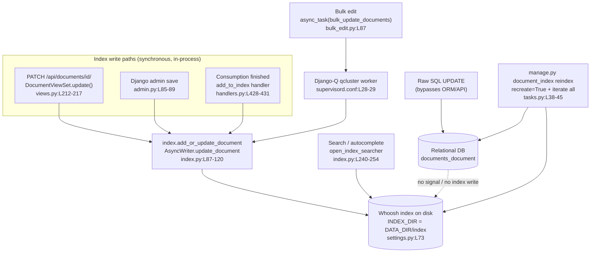

# How Paperless-NGX Keeps Its Whoosh Search Index Synchronized with Document Changes

> **Code-grounded, runtime-validated Q&A analysis.**
> Repository: `paperless-ngx` · Branch: `paperless-ngx_542221a38dff` · Commit: `542221a38dff06361e07976452f9aea24d210542` · App version **1.7.0**.

## Abstract

This document answers one practical question — *how does Paperless-NGX keep its full-text search index in sync with document changes at runtime?* — and six concrete sub-questions about edit latency, background-worker involvement, raw-SQL edits, forced reconciliation, index-loss recovery, and self-healing. Every claim is anchored to the source code (the source of truth) at a precise `file:line` locator and corroborated by evidence captured from a **live, fully-running Docker stack** (gunicorn web server + `document_consumer` + Django-Q `qcluster` worker + Redis broker + SQLite database).

**Headline verdict.** Paperless-NGX maintains its search index through **application-level write hooks**, not through a database-level mechanism. Edits that flow through the **REST API**, the **Django admin**, the **consumption pipeline**, or the **bulk-edit endpoint** keep the index in sync automatically — the first three **synchronously, inside the request/process**, and the bulk path **asynchronously via the `qcluster` worker**. However, two classes of change are **not** auto-healed: (1) a change that **bypasses the ORM/API entirely** (e.g. a raw SQL `UPDATE`), and (2) **runtime loss of the index files**. In both cases the index becomes (or stays) stale, and the **only** remedy is a manual reconciliation: `python manage.py document_index reindex`. This is a *deliberate design decision*, documented in the project's own test suite [`src/documents/tests/test_api.py:L414-416`], not an oversight.

---

## Environment & Methodology

### Stack under test

All evidence below was gathered against a running stack, not inferred. The process topology matches the Supervisord program definitions in the repository:

| Component | How it runs | Code reference |
|---|---|---|
| Web server (ASGI) | `gunicorn -c .../gunicorn.conf.py paperless.asgi:application` | `docker/supervisord.conf:L10-11` |
| Document consumer | `python3 manage.py document_consumer` | `docker/supervisord.conf:L19-20` |
| **Background worker** | **`python3 manage.py qcluster`** — this is the **Django-Q** cluster, declared as `[program:scheduler]` | `docker/supervisord.conf:L28-29` |
| Broker | Redis (`redis:6.0`), configured via `Q_CLUSTER["redis"]` | `src/paperless/settings.py:L449-457` |
| Database | SQLite at `DATA_DIR/db.sqlite3` (PostgreSQL when `PAPERLESS_DBHOST` is set) | `src/paperless/settings.py:L297-318` |
| Search index | On-disk Whoosh index at `INDEX_DIR = DATA_DIR/index` | `src/paperless/settings.py:L73` |

> **Worker framing (important).** The background task framework is **Django-Q**, run as the **`qcluster`** process — *not Celery*. This was confirmed three ways: the Supervisord program command is `python3 manage.py qcluster` [`docker/supervisord.conf:L28-29`]; the broker config key is `Q_CLUSTER` [`src/paperless/settings.py:L449-457`]; and at runtime the worker log emits the Django-Q signature `[Q] INFO ...` while `pip show celery` reports **celery is not installed**.

### Versions actually running

Captured live from inside the running container (`python3 -c "..."`):

```
paperless-ngx        : 1.7.0          (src/paperless/version.py)
python               : 3.9.23         (Dockerfile:L18 -> python:3.9-slim-bullseye)
django               : 4.0.4
django-q             : 1.3.9
djangorestframework  : 3.13.1
whoosh               : 2.7.4
redis (python client): 3.5.3
```

These match the pinned versions in `requirements.txt`. (Context-only packages: `channels==3.0.4`, `channels-redis==3.4.0`, `psycopg2==2.9.3`, `gunicorn==20.1.0`.)

### How evidence was gathered

- **Authentication:** DRF Token auth (`djangorestframework==3.13.1`); requests issued with `Authorization: Token <token>` against `http://localhost:8000`.
- **Test data:** the database started empty (0 documents), so three temporary documents were created via the ORM and explicitly indexed — the exact pattern the test suite uses [`src/documents/tests/test_api.py:L413-419`] — to establish an "already-ingested" baseline present in **both** the database and the Whoosh index.
- **Worker observation:** the per-process log `/app/data/log/qcluster.log` was line-counted before/after each operation, and the Django-Q `Task` table (`django_q.models.Task`) was queried by `func` to detect enqueued jobs precisely.
- **Raw SQL:** because the SQLite CLI is not installed in the image, the raw `UPDATE` for O3 was issued through Python's `sqlite3` module directly against `/app/data/db.sqlite3` (bypassing the ORM and the API).
- **No fabrication:** all counts, HTTP statuses, log excerpts, and timings shown are the actual observed values.

### Cleanup performed

All temporary test documents (3), the temporary tag (1), and the bulk task record (1) were deleted, and the index was rebuilt to a consistent empty state (DB = 0 documents, index = 0 documents). No source file was modified. `git status --porcelain` shows only this one new Markdown document.

---

## (a) Architecture Summary — the shared mental model

Everything that follows rests on five facts about how the index is written and read.

### A1. On-disk Whoosh index location

The search index is a Whoosh inverted index stored on disk at `settings.INDEX_DIR = os.path.join(DATA_DIR, "index")` [`src/paperless/settings.py:L73`], where `DATA_DIR` defaults to `BASE_DIR/../data` [`src/paperless/settings.py:L66`] (and `MEDIA_ROOT` is the sibling `../media` [`src/paperless/settings.py:L61`]). With the default SQLite backend, the database lives next to it at `DATA_DIR/db.sqlite3` [`src/paperless/settings.py:L300`].

### A2. Schema — the unique `id` is the upsert key

`get_schema()` defines the index fields [`src/documents/index.py:L31-49`]:

```python
def get_schema():
    return Schema(
        id=NUMERIC(stored=True, unique=True),   # L33 — the upsert key
        title=TEXT(sortable=True),
        content=TEXT(),
        asn=NUMERIC(sortable=True),
        correspondent=TEXT(sortable=True),
        ...
        tag=KEYWORD(commas=True, scorable=True, lowercase=True),
        type=TEXT(sortable=True),
        created=DATETIME(sortable=True),
        modified=DATETIME(sortable=True),
        added=DATETIME(sortable=True),
    )
```

The document `id` is `NUMERIC(stored=True, unique=True)` [`src/documents/index.py:L33`]. **`id` is the only `stored=True` field** — `title` and `content` are indexed (searchable) but *not stored*, which means the original title text cannot be read back out of the index; it can only be **matched** by a query. (This subtlety matters for O3: the correct probe for index state is a *search*, not a field read-back.)

### A3. Single-writer model (`AsyncWriter`, commit on exit)

All index writes funnel through one helper, `open_index_writer()`, which wraps a Whoosh **`AsyncWriter`** and commits in a `finally` block [`src/documents/index.py:L64-74`]:

```python
@contextmanager
def open_index_writer(optimize=False):
    writer = AsyncWriter(open_index())     # L66
    try:
        yield writer
    except Exception as e:
        logger.exception(str(e))
        writer.cancel()
    finally:
        writer.commit(optimize=optimize)   # L74 — commit always happens on context exit
```

Because Whoosh permits only one writer to hold the file-DB lock at a time, the single-writer model is the project's way of serializing index mutations.

### A4. Upsert-by-id (replace in place, never duplicate)

`add_or_update_document(document)` opens a writer and calls `update_document(writer, doc)` [`src/documents/index.py:L118-120`], which issues `writer.update_document(id=doc.pk, title=doc.title, content=doc.content, ...)` [`src/documents/index.py:L87-107`]. Because the `id` field is `unique=True`, Whoosh's `update_document()` **replaces** any prior entry for that `id` rather than appending a duplicate. Removal mirrors this: `remove_document_from_index` → `remove_document_by_id` → `writer.delete_by_term("id", doc_id)` [`src/documents/index.py:L110-125`].

### A5. The read path reads the **index**, not the database (root cause of staleness)

Full-text search is served by `DelayedFullTextQuery._get_query()`, which constructs a `MultifieldParser` over the **index reader's schema** [`src/documents/index.py:L240-254`]:

```python
class DelayedFullTextQuery(DelayedQuery):
    def _get_query(self):
        q_str = self.query_params["query"]
        qp = MultifieldParser(
            ["content", "title", "correspondent", "tag", "type"],
            self.searcher.ixreader.schema,    # reads the INDEX, not the DB
        )
        ...
```

A **fresh searcher is opened per request** via `open_index_searcher()` [`src/documents/index.py:L77-84`], and autocomplete likewise opens the index directly [`src/documents/index.py:L278-287`, view at `src/documents/views.py:L603-607`]. Search results therefore reflect whatever is **in the index**, regardless of the current database state. This single fact is the root cause of every staleness scenario in this document.

### A6. Background processing is Django-Q `qcluster`

The worker is the Django-Q cluster declared as `[program:scheduler]` running `python3 manage.py qcluster` [`docker/supervisord.conf:L28-29`], with cluster/broker settings in `Q_CLUSTER` (Redis broker at `src/paperless/settings.py:L456`) [`src/paperless/settings.py:L449-457`]. **This is Django-Q, not Celery.**

### A7. Scheduled tasks (context) — `index_optimize` ≠ reconcile

A migration registers two recurring schedules: `documents.tasks.train_classifier` **hourly** and `documents.tasks.index_optimize` **daily** [`src/documents/migrations/1001_auto_20201109_1636.py:L10-19`]. Crucially, `index_optimize` only performs `writer.commit(optimize=True)` — a Whoosh **segment merge** — and never adds or removes documents [`src/documents/tasks.py:L32-35`]. **The daily schedule cannot fix staleness**; it only compacts existing segments.

### A8. KEY STRUCTURAL FINDING — there is no ORM-save index hook

There is **no `post_save` signal that updates the Whoosh index for arbitrary `Document` saves.** The only `post_save` receiver on `Document` is `update_filename_and_move_files` [`src/documents/signals/handlers.py:L310-312`], which manages on-disk file moves — *not* the index. (The only `post_delete` receiver, `cleanup_document_deletion` [`src/documents/signals/handlers.py:L233-234`], likewise only cleans up files.) The index-writing handler `add_to_index` [`src/documents/signals/handlers.py:L428-431`] is a plain function with **no `@receiver` decorator**; it is wired **only** to the `document_consumption_finished` signal in the app's `ready()` [`src/documents/apps.py:L11-29`] (`document_consumption_finished.connect(add_to_index)` at `L27`), and that signal is emitted by the consumer inside `transaction.atomic()` [`src/documents/consumer.py:L298, L306-311`]. A repository-wide search confirms the **only** `index.add_or_update_document(...)` call in `handlers.py` is at `L431`.

> **Consequence:** index updates depend on the **API view**, the **admin**, the **bulk path**, or the **consumption path** — *never* on a bare ORM/DB write. This is the structural reason a raw-SQL `UPDATE` (O3) leaves the index stale.

### A9. The pivotal developer comment — design intent in the project's own words

The strongest evidence that A8 is *intentional* lives inside the `test_search` test. After creating three documents with `Document.objects.create(...)` (which, as the test demonstrates, does **not** auto-index them), the test must explicitly open one writer and index them by hand [`src/documents/tests/test_api.py:L413-419`]. Wrapped around that explicit indexing is the authors' own note:

```python
with AsyncWriter(index.open_index()) as writer:
    # Note to future self: there is a reason we dont use a model signal handler to update the index: some operations edit many documents at once
    # (retagger, renamer) and we don't want to open a writer for each of these, but rather perform the entire operation with one writer.
    # That's why we cant open the writer in a model on_save handler or something.
    index.update_document(writer, d1)
    index.update_document(writer, d2)
    index.update_document(writer, d3)
```
*— `src/documents/tests/test_api.py:L413-419` (comment at L414-416).*

**Significance.** This comment is the primary evidence for **O3** and **O6**. It states plainly that the absence of an ORM-`save()` index hook is a **deliberate architectural decision**: some operations (retagging, renaming) touch *many* documents at once, and the authors want one writer for the whole batch rather than one writer per `save()`. Binding the index write to a model signal would defeat that. The cost of this design — and the answer to the user's core question — is that **any path which does not call the explicit index hooks leaves the index untouched.** Raw SQL is exactly such a path.

---

## Index Synchronization Model (diagrams)

The first diagram contrasts the paths that keep the index in sync (the synchronous in-process writers and the worker-backed bulk path) with the database-direct path that bypasses it, and shows that **search always reads the index**.



The second diagram shows the O1-versus-O3 contrast as a sequence: the API edit commits to the index in-request, while a raw-SQL edit never touches the index until a manual reindex runs.

```mermaid
sequenceDiagram
    participant C as Client
    participant V as DocumentViewSet
    participant I as Whoosh index
    participant DB as Database
    Note over C,I: O1 — API title edit (synchronous)
    C->>V: PATCH /api/documents/id/ title=token
    V->>DB: super().update() persists row
    V->>I: index.add_or_update_document() (commit)
    V-->>C: 200 OK (index already updated)
    C->>I: GET /api/documents/?query=token
    I-->>C: HIT (immediate)
    Note over C,DB: O3 — raw SQL edit (bypass)
    C->>DB: UPDATE documents_document SET title=token2
    C->>I: GET /api/documents/?query=token2
    I-->>C: MISS (index stale; old title still hits)
```

---

## (b) The Six Answers

Each answer uses the same five-part structure: **Scenario → Governing code path → Empirical procedure → Observed result → Rationale.**

### O1 — API edit latency: **IMMEDIATE**

**Scenario.** An already-ingested document's `title` is changed to a unique token via `PATCH /api/documents/{id}/`, and that exact token is searched within a few seconds. Does the document appear immediately, or must the caller wait for background processing?

**Governing code path.** `DocumentViewSet.update()` persists the row and then writes the index **synchronously, before returning the HTTP response** [`src/documents/views.py:L212-217`]:

```python
def update(self, request, *args, **kwargs):
    response = super(DocumentViewSet, self).update(request, *args, **kwargs)  # L213 — DB row saved
    from documents import index
    index.add_or_update_document(self.get_object())                          # L216 — index committed
    return response                                                          # L217 — only now does it return
```

`add_or_update_document` commits via the `AsyncWriter`'s `finally: writer.commit(...)` [`src/documents/index.py:L64-74, L118-120`] before control returns to `update()`. No `async_task` is involved.

**Empirical procedure.**

```bash
TOKEN="o1unique_1782509467"
# 1) change the title via the API
curl -sS -X PATCH "http://localhost:8000/api/documents/4/" \
     -H "Authorization: Token <token>" -H "Content-Type: application/json" \
     -d "{\"title\": \"$TOKEN\"}"
# 2) immediately search for the new token
curl -sS "http://localhost:8000/api/documents/?query=$TOKEN" -H "Authorization: Token <token>"
```

**Observed result.**

```
PATCH  HTTP 200   (response body title == "o1unique_1782509467")
GET    ?query=o1unique_1782509467  ->  "count": 1     (HIT)
PATCH + immediate-search round trip:  0.103 s
```

The document was searchable by its new title **immediately** — the combined edit-then-search round trip completed in **103 milliseconds**, with no polling and no waiting for any background job.

**Rationale.** The index commit happens *inside* the API request, before the `200 OK` is sent [`src/documents/views.py:L216-217`]. Per Whoosh semantics, a reader opened after a commit sees the committed data, and Paperless opens a **fresh searcher per search request** [`src/documents/index.py:L77-84, L240-254`]. Therefore the very next search observes the just-committed update. (Confirmed independently at the Whoosh layer — see *Whoosh-layer confirmation* below.)

---

### O2 — Background-worker behavior on edit: **NONE for a single edit (bulk DOES enqueue)**

**Scenario.** While editing one document through the API, does the Django-Q `qcluster` worker pick up a job, or does the index update complete entirely within the API request?

**Governing code path.** The single-document edit path is fully synchronous and calls **no** `async_task` [`src/documents/views.py:L212-217`]. The contrast is the **bulk** path: `bulk_edit.modify_tags` (and its siblings `set_correspondent`, `set_document_type`, etc.) enqueue a worker job via Django-Q [`src/documents/bulk_edit.py:L87`]:

```python
async_task("documents.tasks.bulk_update_documents", document_ids=affected_docs)   # L87 (also L18, L31, L47, L63)
```

executed on the `qcluster` worker by `bulk_update_documents` [`src/documents/tasks.py:L270-280`]. Bulk operations apply their changes with `queryset.update()` / bulk inserts, which **bypass** ORM `save()` and signals — which is precisely *why* the bulk path must explicitly enqueue an index-rewrite task. (Note: bulk **delete** is the exception that proves the rule — it removes from the index *synchronously* in-request rather than via a task [`src/documents/bulk_edit.py:L92-101`].)

**Empirical procedure.** Baseline `qcluster.log` line count and the Django-Q `Task` table; perform a single `PATCH`; re-check; then perform a bulk tag edit via `POST /api/documents/bulk_edit/` and re-check.

```bash
# single edit
curl -sS -X PATCH "http://localhost:8000/api/documents/5/" -H "Authorization: Token <token>" \
     -H "Content-Type: application/json" -d '{"title": "o2single_1782509515"}'
# bulk edit (add tag 1 to documents 5 and 6)
curl -sS -X POST "http://localhost:8000/api/documents/bulk_edit/" -H "Authorization: Token <token>" \
     -H "Content-Type: application/json" \
     -d '{"documents":[5,6],"method":"modify_tags","parameters":{"add_tags":[1],"remove_tags":[]}}'
```

**Observed result.**

```
                          qcluster.log lines   bulk_update_documents Task rows
baseline                          14                       0
after SINGLE PATCH (HTTP 200)     14  (delta 0)            0      <-- no worker job
after BULK edit ({"result":"OK"}) 19  (delta 5)            1      <-- worker job appeared

New qcluster.log lines after the bulk edit:
  21:31:59 [Q] INFO Process-1:6 processing [tennis-nuts-indigo-oven]
  21:31:59 [Q] INFO Process-1:6 stopped doing work
  21:31:59 [Q] INFO Processed [tennis-nuts-indigo-oven]
  21:31:59 [Q] INFO recycled worker Process-1:6

Task row:  func=documents.tasks.bulk_update_documents  name=tennis-nuts-indigo-oven  success=True
```

The single edit produced **zero** worker activity. The bulk edit produced exactly one `documents.tasks.bulk_update_documents` task — and the random Django-Q task name (`tennis-nuts-indigo-oven`) in the `Task` row matches the line in `qcluster.log`, tying the worker activity unambiguously to the bulk job.

**Rationale.** Only the bulk path calls `async_task` [`src/documents/bulk_edit.py:L87`]; the single-document edit performs its index write inline [`src/documents/views.py:L216`]. In Django-Q terms, `async_task()` enqueues to the Redis broker for the `qcluster` cluster unless `sync=True` (a testing-only override, not used here) — so a single API edit, which never calls `async_task`, yields no job, whereas the bulk edit does.

---

### O3 — Raw SQL edit (ORM/API bypass): **index stays STALE**

**Scenario.** A document's `title` is changed **directly in the database with raw SQL** (not through the API or ORM). After searching for the new title, does the document appear, or does the index remain stale?

**Governing code path.** Search reads the Whoosh index [`src/documents/index.py:L240-254`]. A raw SQL `UPDATE` fires **no** view, **no** signal, and **no** ORM `save()`. And even an ORM `save()` would not help, because the only `Document` `post_save` handler is the file-mover [`src/documents/signals/handlers.py:L310-312`], not an index handler (see A8). The design intent is documented verbatim by the authors [`src/documents/tests/test_api.py:L414-416`] (see A9).

**Empirical procedure.** Issue the `UPDATE` through Python's `sqlite3` module (the SQLite CLI is absent), then search the new and old titles.

```python
# raw SQL, no ORM/API:
import sqlite3
con = sqlite3.connect("/app/data/db.sqlite3", timeout=30)
con.execute("UPDATE documents_document SET title=? WHERE id=?",
            ("blitzytest_gamma_DBONLY_rawsql", 6))
con.commit(); con.close()
```
```bash
curl -sS "http://localhost:8000/api/documents/?query=blitzytest_gamma_DBONLY_rawsql" -H "Authorization: Token <token>"  # new title
curl -sS "http://localhost:8000/api/documents/?query=blitzytest_gamma_original"       -H "Authorization: Token <token>"  # old title
```

**Observed result.**

```
DB row after raw UPDATE:  (6, 'blitzytest_gamma_DBONLY_rawsql')      <-- DB changed

query = blitzytest_gamma_DBONLY_rawsql  ->  "count": 0   (MISS)     <-- new title NOT found
query = blitzytest_gamma_original       ->  "count": 1   (HIT)      <-- OLD title still found
    the single hit is document id=6, whose CURRENT DB title is 'blitzytest_gamma_DBONLY_rawsql'

index doc_count: 3  (unchanged — no new/duplicate entry was created)
```

The index is **stale**: searching the *old* title still returns the document, while the *new* (database-only) title returns nothing. The decisive detail is that the old-title search returns **document id=6 whose database title is now the new value** — the index matched on a term that no longer exists in the database row. (A direct read of the stored index document confirms the schema subtlety from A2: `searcher.document(id=6)["title"]` raises `KeyError` because `title` is indexed but not `stored`, so a *search* is the correct way to probe index state.)

**Rationale.** No index write occurred, because no API view, admin action, consumption signal, or even ORM `save()` ran — and search reads the **index** [`src/documents/index.py:L240-254`], which still holds the old title. This is the deliberate design captured at `src/documents/tests/test_api.py:L414-416`: the index is updated only by explicit application-level hooks, and raw SQL bypasses every one of them.

---

### O4 — Forced reconciliation: **`document_index reindex` (synchronous, in-process; no `qcluster` task)**

**Scenario.** With the index stale from O3, is there a way to force the index to reconcile with the current database state, and what observable effect does that have on the worker logs and the task queue?

**Governing code path.** The management command `document_index` takes a positional argument with choices `["reindex", "optimize"]` plus optional `--no-progress-bar` [`src/documents/management/commands/document_index.py:L11-18`]; `handle()` runs inside `transaction.atomic()` and calls `index_reindex(...)` **synchronously in the management-command process** — *not* via `async_task` [`src/documents/management/commands/document_index.py:L20-25`]:

```python
def handle(self, *args, **options):
    with transaction.atomic():                                       # L21
        if options["command"] == "reindex":
            index_reindex(progress_bar_disable=options["no_progress_bar"])  # L23
        elif options["command"] == "optimize":
            index_optimize()                                         # L25
```

`index_reindex` opens the index with `recreate=True` (emptying it) and iterates **every** `Document.objects.all()` with a `tqdm` progress bar, calling `update_document` for each [`src/documents/tasks.py:L38-45`].

**Empirical procedure.**

```bash
python3 manage.py document_index reindex          # observe tqdm progress, then re-query
curl -sS "http://localhost:8000/api/documents/?query=blitzytest_gamma_DBONLY_rawsql" -H "Authorization: Token <token>"
curl -sS "http://localhost:8000/api/documents/?query=blitzytest_gamma_original"       -H "Authorization: Token <token>"
# meanwhile: re-check qcluster.log line count and the Django-Q Task table
```

**Observed result.**

```
tqdm progress (stderr):  100%|##########| 3/3 [00:00<00:00, 714.69it/s]

query = blitzytest_gamma_DBONLY_rawsql  ->  "count": 1   (HIT — now reconciled)
query = blitzytest_gamma_original       ->  "count": 0   (MISS — stale term gone)

                          before reindex   after reindex
qcluster.log lines            19               19   (delta 0)
bulk_update_documents tasks    1                1   (unchanged)
total Django-Q Task rows       3                3   (delta 0)
```

The reindex **reconciled** the index with the database — the previously-stale O3 query now hits, and the obsolete old-title term is gone. The visible activity was the in-process `tqdm` progress bar; the `qcluster` worker log did **not** change and **no** new Django-Q task was enqueued.

**Rationale.** Reindex executes in the management-command process [`src/documents/management/commands/document_index.py:L20-25`], not on the worker — so there is nothing for the `qcluster` queue to show. Functionally, `index_reindex` destroys the index (`recreate=True`) and repopulates it from the *current* database state [`src/documents/tasks.py:L38-45`], which is exactly what reconciles the stale entry. (Note that the daily scheduled `index_optimize` cannot do this — it only merges segments [`src/documents/tasks.py:L32-35`]; see A7.)

---

### O5 — Corruption / deletion recovery: **opening a missing index recreates it EMPTY; a reindex is required to repopulate**

**Scenario.** The index files are deleted while documents still exist in the database. How does recovery work, how long does reconstruction take for a small set, and what processing activity is visible during the rebuild?

**Governing code path.** When the index directory is missing or corrupt, `open_index(recreate=False)` falls through (the `exists_in` check fails, or the `try` raises and is logged) to `create_in(settings.INDEX_DIR, get_schema())`, producing an **EMPTY** index — it does **not** repopulate from the database [`src/documents/index.py:L52-61`]:

```python
def open_index(recreate=False):
    try:
        if exists_in(settings.INDEX_DIR) and not recreate:
            return open_dir(settings.INDEX_DIR, schema=get_schema())
    except Exception:
        logger.exception("Error while opening the index, recreating.")
    if not os.path.isdir(settings.INDEX_DIR):
        os.makedirs(settings.INDEX_DIR, exist_ok=True)
    return create_in(settings.INDEX_DIR, get_schema())   # L61 — fresh EMPTY index
```

Repopulation requires `index_reindex` (`recreate=True`, then iterate all) [`src/documents/tasks.py:L38-45`]. **Restart nuance:** on container startup, `docker/docker-prepare.sh`'s `search_index()` auto-reindexes **only when** the `data/.index_version` marker is missing or stale [`docker/docker-prepare.sh:L49-58`] (it runs `python3 manage.py document_index reindex` at `L55` and writes the marker at `L56`; `do_work()` calls it at `L75`).

**Empirical procedure.**

```bash
rm -rf /app/data/index                                   # delete the index files
# first search after deletion (triggers a fresh open_index)
curl -sS "http://localhost:8000/api/documents/?query=o2single_1782509515" -H "Authorization: Token <token>"
time python3 manage.py document_index reindex            # rebuild and time it
curl -sS "http://localhost:8000/api/documents/?query=o2single_1782509515" -H "Authorization: Token <token>"
```

**Observed result.**

```
index dir before deletion:  MAIN_WRITELOCK, MAIN_<seg>.seg, _MAIN_1.toc   (.index_version marker: ABSENT)
after rm -rf /app/data/index:  directory gone

first search after deletion  ->  "count": 0   (MISS)
    index directory was RECREATED automatically, but open_index().doc_count() == 0  (EMPTY)

rebuild progress (stderr):  100%|##########| 3/3 [00:00<00:00, 604.63it/s]
after rebuild:  index doc_count == 3;  all 3 known titles  ->  "count": 1   (HIT again)

reconstruction time (3 documents):
    full `document_index reindex` command  =  1.37 s  (dominated by Django process startup/imports)
    pure index_reindex() index-write work  =  0.0216 s  (~22 ms)
```

After deleting the index, the very next open **recreated an empty index** and search returned nothing. A `document_index reindex` rebuilt it in **well under two seconds** for this small set — the actual index-write work was about **22 milliseconds**; the ~1.4 s of wall-clock for the standalone command is almost entirely Django startup. The visible activity during the rebuild was the `tqdm` progress bar. The index is briefly empty mid-rebuild (`recreate=True` happens before the iteration), as the code shows.

**Restart subtlety (observed).** This stack was launched via the image's `start-paperless.sh` helper rather than `docker-prepare.sh`'s `do_work()`, so **no `.index_version` marker exists**. Per the gate at `docker/docker-prepare.sh:L53`, that means a fresh container startup *through that script* would auto-reindex. Conversely — and this is the cautionary case — if you delete the index but a valid `.index_version` marker *is* present, a restart through `docker-prepare.sh` would **not** auto-reindex (the gate is satisfied), and search would stay empty until a manual reindex.

**Rationale.** Opening an absent index recreates it empty **by design** [`src/documents/index.py:L52-61`]; the database is never consulted at open time. Only an explicit `index_reindex` — invoked manually, or by the startup `search_index()` when the version marker is missing/stale — repopulates the index from the database.

---

### O6 — Self-heal vs. manual intervention: **synthesis**

**Question.** Can the system self-heal index inconsistencies, or is manual intervention always required?

**Governing code paths.** The index *self-heals* along every path that runs the explicit index hooks:

| Path | Mechanism | Sync/Async | Citation |
|---|---|---|---|
| REST API edit / delete | `DocumentViewSet.update()` / `destroy()` → `add_or_update_document` / `remove_document_from_index` | **synchronous (in-request)** | `src/documents/views.py:L212-223` |
| Django admin save / delete | `save_model` (add, L88) / `delete_model` (remove, L82) / `delete_queryset` | **synchronous (in-process)** | `src/documents/admin.py:L70-89` |
| Consumption (new document) | `document_consumption_finished` → `add_to_index` | **synchronous (in consumer process)** | `src/documents/consumer.py:L298, L306-311`; `src/documents/signals/handlers.py:L428-431`; `src/documents/apps.py:L27` |
| Bulk field/tag edit | `async_task("documents.tasks.bulk_update_documents", …)` → `bulk_update_documents` | **asynchronous (Django-Q `qcluster`)** | `src/documents/bulk_edit.py:L87`; `src/documents/tasks.py:L270-280` |

Against those, **two** classes of change have **no** auto-heal: database-direct edits (O3) and runtime index loss (O5). And the only periodic background job that touches the index, the daily `index_optimize`, merely merges Whoosh segments — it never adds or removes documents [`src/documents/tasks.py:L32-35`; `src/documents/migrations/1001_auto_20201109_1636.py:L15-19`] — so it can never reconcile a stale or empty index.

**Empirical procedure.** Synthesis of O1–O5; no new experiment is required.

**Observed result / verdict.** ORM/API/admin/consumption changes auto-index **synchronously**; bulk field/tag edits auto-index **asynchronously via the `qcluster` worker**. But **database-direct edits and runtime index loss require a manual `python manage.py document_index reindex`** (or a startup reindex when the `.index_version` marker is missing/stale).

**Rationale.** Index writes are deliberately bound to application-level code paths — the design decision the authors recorded at `src/documents/tests/test_api.py:L414-416` (one writer per multi-document operation). Any change that *bypasses* those paths — a raw SQL `UPDATE`, or the disappearance of the index files at runtime — escapes auto-indexing entirely, because nothing in the system reconciles the index against the database except an explicit reindex.

---

## Whoosh-layer confirmation (of external semantics)

To confirm that the Whoosh primitives behave as the answers assume, a self-contained replication of the exact `index.py` logic (`get_schema`, `open_index(recreate)`, `AsyncWriter.update_document`, and the `MultifieldParser` read path) was executed against **whoosh==2.7.4** (the project's pinned version, verified at runtime via `whoosh.versionstring()`) in an **isolated scratch index** in the container's `/tmp` — *not* touching the source tree, and removed afterward. All four mechanics the answers rely on were confirmed:

```
whoosh_version = 2.7.4
check1_empty_doc_count        = 0     # fresh/recreated index dir is EMPTY            -> supports O5
check2_after_insert_hit       = 1     # a freshly-opened searcher immediately sees a committed upsert -> supports O1
check2_doc_count              = 1
check3_old_title_miss         = 0     # update_document(id=<unique>) replaces in place: old title MISSES
check3_new_title_hit          = 1     #   ... new title HITS
check3_doc_count_no_dup       = 1     #   ... and doc_count stays 1 (no duplicate)    -> upsert-by-id [index.py:L87-120]
check4_dbonly_miss            = 0     # changing the "DB" value without writing the index -> new value MISS -> supports O3
check4_indexed_still_hit      = 1     #   ... the old indexed term still HITS         -> stale read
check4_after_reindex_hit      = 1     # recreate + repopulate makes the new value HIT -> supports O4
```

These are **supporting** evidence for the external library's semantics; every *behavioral* conclusion above remains anchored to the Paperless-NGX repository code. The same external semantics — Whoosh `update_document` unique-field upsert, reader-visibility-after-commit, and `AsyncWriter`; and Django-Q `async_task`/`qcluster` queueing — were also cross-checked against the official Whoosh and Django-Q documentation (see References).

---

## (c) Conclusion — self-heal vs. manual intervention

**Paperless-NGX self-heals its search index along application-level write paths, but cannot self-heal changes that bypass them or the loss of the index files.**

- **Self-healing (no manual action needed):**
  - **REST API** edits/deletes — index updated **synchronously, in-request** [`src/documents/views.py:L212-223`]. *(O1: the change is searchable immediately — observed 103 ms round trip.)*
  - **Django admin** saves/deletes — index updated **synchronously** [`src/documents/admin.py:L70-89`].
  - **Consumption** of new documents — index updated **synchronously** in the consumer via the `document_consumption_finished` → `add_to_index` signal [`src/documents/consumer.py:L306-311`; `src/documents/apps.py:L27`; `src/documents/signals/handlers.py:L428-431`].
  - **Bulk field/tag edits** — index updated **asynchronously by the Django-Q `qcluster` worker** [`src/documents/bulk_edit.py:L87`; `src/documents/tasks.py:L270-280`]. *(O2: a `bulk_update_documents` task is enqueued and processed; a single edit enqueues nothing.)*

- **NOT self-healing (manual intervention required):**
  - **Database-direct edits** (raw SQL, or any non-ORM write) — the index is never notified, so it stays **stale** [`src/documents/index.py:L240-254`; `src/documents/signals/handlers.py:L310-312`; design intent at `src/documents/tests/test_api.py:L414-416`]. *(O3: new title MISS, old title HIT.)*
  - **Runtime index loss/corruption** — the index is silently **recreated empty** on next open and is **not** repopulated from the database [`src/documents/index.py:L52-61`]. *(O5: search returns nothing until rebuilt.)*

**The single remedy for both non-self-healing cases is a manual reconciliation:**

```bash
python manage.py document_index reindex
```

It runs **synchronously in the management-command process** (no `qcluster` task), opens the index with `recreate=True`, and rewrites **every** document from the current database state [`src/documents/management/commands/document_index.py:L20-25`; `src/documents/tasks.py:L38-45`]. *(O4: the stale entry is corrected with no worker activity; O5: a small set rebuilds in well under two seconds.)* The same reindex can run automatically at container startup, but **only** when the `data/.index_version` marker is missing or stale [`docker/docker-prepare.sh:L49-58`]. The daily scheduled `index_optimize` is **not** a substitute — it only merges Whoosh segments and never reconciles content [`src/documents/tasks.py:L32-35`].

---

## Appendix: Verified Citation Map

Every anchor below was verified line-by-line against the source at commit `542221a38dff…`.

| Concept | Location |
|---|---|
| Whoosh schema; `id=NUMERIC(stored=True, unique=True)` | `src/documents/index.py:L31-49` (id at L33) |
| `open_index(recreate)` — missing/corrupt → `create_in` = EMPTY index | `src/documents/index.py:L52-61` (create_in at L61) |
| `open_index_writer` — `AsyncWriter`, commit in `finally` | `src/documents/index.py:L64-74` (AsyncWriter L66, commit L74) |
| `open_index_searcher` — fresh searcher per request | `src/documents/index.py:L77-84` |
| `update_document` — `writer.update_document(id=doc.pk, …)` | `src/documents/index.py:L87-107` |
| `remove_document` / `remove_document_by_id` (`delete_by_term("id",…)`) | `src/documents/index.py:L110-115` |
| `add_or_update_document` / `remove_document_from_index` | `src/documents/index.py:L118-125` |
| `DelayedFullTextQuery` — `MultifieldParser([...], ixreader.schema)` (reads index) | `src/documents/index.py:L240-254` (parser L243-246) |
| autocomplete read path | `src/documents/index.py:L278-287` |
| `DocumentViewSet.update()` — synchronous index write before response (O1) | `src/documents/views.py:L212-217` (super L213, index L216, return L217) |
| `DocumentViewSet.destroy()` — synchronous index removal | `src/documents/views.py:L219-223` (remove L222) |
| autocomplete view — `index.open_index()` + `index.autocomplete(...)` | `src/documents/views.py:L603-607` |
| ONLY `post_save` on Document = `update_filename_and_move_files` (file moves, NOT index) | `src/documents/signals/handlers.py:L310-312` |
| `post_delete` = `cleanup_document_deletion` (file cleanup, NOT index) | `src/documents/signals/handlers.py:L233-234` |
| `add_to_index` handler (consumption-only; no `@receiver`) | `src/documents/signals/handlers.py:L428-431` |
| Signal wiring — `document_consumption_finished.connect(add_to_index)` | `src/documents/apps.py:L11-29` (connect at L27) |
| `index_optimize` — `writer.commit(optimize=True)` (segment merge only) | `src/documents/tasks.py:L32-35` |
| `index_reindex` — `open_index(recreate=True)` + `tqdm` iterate all (destroy→repopulate) | `src/documents/tasks.py:L38-45` |
| `bulk_update_documents` (worker task) | `src/documents/tasks.py:L270-280` |
| `document_index` command — positional `reindex`/`optimize`, synchronous in-process | `src/documents/management/commands/document_index.py:L11-25` (atomic L21, reindex L23) |
| Admin index hooks — `save_model`(add L88)/`delete_model`(remove L82)/`delete_queryset` | `src/documents/admin.py:L70-89` |
| Bulk path enqueues `async_task("documents.tasks.bulk_update_documents", …)` (O2) | `src/documents/bulk_edit.py:L87` (also L18, L31, L47, L63) |
| Bulk `delete()` — synchronous index removal | `src/documents/bulk_edit.py:L92-101` (remove L97-99) |
| Consumption signal emission within `transaction.atomic()` | `src/documents/consumer.py:L298, L306-311` |
| `INDEX_DIR = DATA_DIR/index`; `DATA_DIR`; `MEDIA_ROOT` | `src/paperless/settings.py:L73, L66, L61` |
| SQLite default (`DATA_DIR/db.sqlite3`) / PostgreSQL when `PAPERLESS_DBHOST` | `src/paperless/settings.py:L297-318` (sqlite NAME L300) |
| `Q_CLUSTER` Django-Q config + Redis broker | `src/paperless/settings.py:L449-457` (redis L456) |
| `qcluster` worker process (`[program:scheduler]`); gunicorn; consumer | `docker/supervisord.conf:L28-29` (gunicorn L10-11, consumer L19-20) |
| Startup reindex gated on `data/.index_version` marker (O5 nuance) | `docker/docker-prepare.sh:L49-58` (reindex L55, marker L56; `do_work` calls at L75) |
| Scheduled `train_classifier` HOURLY, `index_optimize` DAILY | `src/documents/migrations/1001_auto_20201109_1636.py:L10-19` |
| **PIVOTAL developer comment — design intent for no ORM-save index hook (O3/O6)** | `src/documents/tests/test_api.py:L414-416` |
| Test methodology: explicit indexing required after `objects.create()` | `src/documents/tests/test_api.py:L394-438` (AsyncWriter L413-419) |
| Test methodology: direct index read by id | `src/documents/tests/test_admin.py:L13-16` |
| Test methodology: index/autocomplete | `src/documents/tests/test_index.py:L7-33` |
| Test methodology: reindex | `src/documents/tests/test_tasks.py:L22-32` |
| Test methodology: `call_command("document_index", "reindex"/"optimize")` | `src/documents/tests/test_management.py:L175-182` |

---

## Appendix: References

### Read-only reference corpus (Paperless-NGX, commit `542221a38dff…`)

- `src/documents/index.py` — Whoosh schema, `open_index(recreate)`, `AsyncWriter`, upsert/remove, and the search/autocomplete read path.
- `src/documents/views.py` — synchronous API index hooks in `update()`/`destroy()`; search and autocomplete endpoints.
- `src/documents/signals/handlers.py` — `add_to_index` consumption handler; evidence there is no `post_save`/`post_delete` index handler.
- `src/documents/apps.py` — signal wiring connecting `add_to_index` to `document_consumption_finished` only.
- `src/documents/tasks.py` — `index_reindex`, `index_optimize`, and `bulk_update_documents`.
- `src/documents/management/commands/document_index.py` — the `reindex`/`optimize` management command.
- `src/documents/admin.py` — admin-path index add/remove hooks.
- `src/documents/bulk_edit.py` — the `async_task` bulk path and synchronous bulk-delete index removal.
- `src/documents/consumer.py` — emission of `document_consumption_finished` within `transaction.atomic()`.
- `src/paperless/settings.py` — `INDEX_DIR`/`DATA_DIR`, `Q_CLUSTER`/Redis, and database backend.
- `docker/supervisord.conf` — declaration of the `qcluster` worker process.
- `docker/docker-prepare.sh` — startup reindex gating on the `.index_version` marker.
- `src/documents/migrations/1001_auto_20201109_1636.py` — scheduled `train_classifier` and `index_optimize`.
- `src/documents/tests/{test_api,test_index,test_tasks,test_management,test_admin}.py` — methodology patterns and the pivotal design-intent comment.

### External-semantics sources (framing confirmation only)

- **Whoosh 2.7.4 documentation** — *How to index documents* and the *fields* / *writing* modules: unique-field `update_document()` upsert semantics, reader-visibility after `commit()`, and `AsyncWriter`. <https://whoosh.readthedocs.io/en/latest/indexing.html>, <https://whoosh.readthedocs.io/en/latest/api/fields.html>
- **Django-Q 1.3.x documentation** — *Tasks* and *Configuration*: `async_task()` enqueues to the broker for a `qcluster` cluster unless `sync=True`. <https://django-q.readthedocs.io/en/latest/tasks.html>, <https://django-q.readthedocs.io/en/latest/configure.html>

---

*Generated as a read-only investigation. No application source file was modified; this Markdown document is the sole deliverable. All temporary test documents were removed and the data store left clean.*
