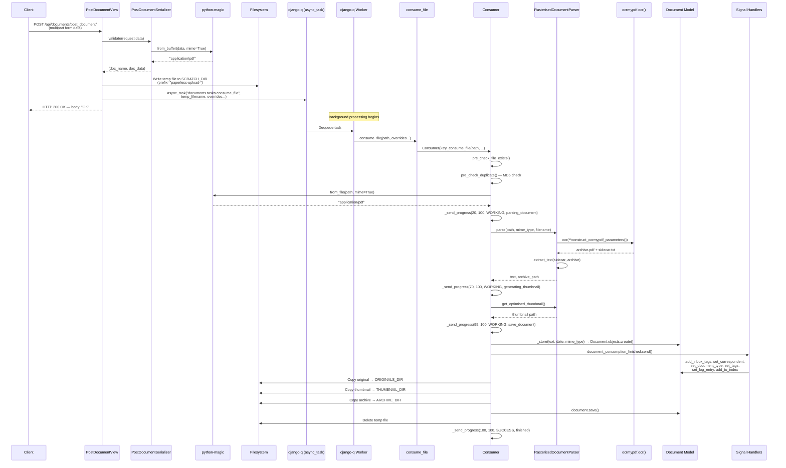
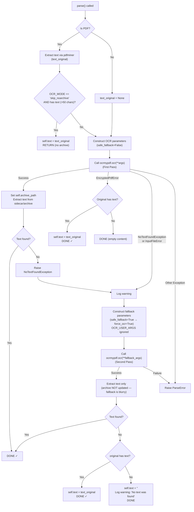

# Paperless-ngx v1.7.0 — Multi-Page PDF OCR Processing Pipeline: Technical Q&A

## Overview

This document provides comprehensive, code-derived answers to empirical questions about the **Paperless-ngx v1.7.0** multi-page PDF OCR processing pipeline. The version is confirmed from `src/paperless/version.py:1` where `__version__ = (1, 7, 0)`.

All answers in this document are derived exclusively from **static source code analysis** following the "code-as-truth" directive. No assumptions are made — every technical claim is traceable to a specific source file path and line number in the Paperless-ngx repository.

**Methodology**: Each question is answered with a direct response followed by a detailed code-path trace and rationale. Source citations use the format `Source: <file_path>:<line_number>`.

---

## Table of Contents

- [Q1: What HTTP Response Do You Receive After Upload Submission?](#q1-what-http-response-do-you-receive-after-upload-submission)
- [Q2: What Key Log Patterns Appear During Processing Stages?](#q2-what-key-log-patterns-appear-during-processing-stages)
  - [Logging Infrastructure](#logging-infrastructure)
  - [WebSocket Progress Status Messages](#websocket-progress-status-messages)
  - [Stage-by-Stage Processing Log Catalog](#stage-by-stage-processing-log-catalog)
  - [OCR Parser Internal Logs](#ocr-parser-internal-logs)
  - [Thumbnail Generation Logs](#thumbnail-generation-logs)
  - [OCRmyPDF Invocation Parameters](#ocrmypdf-invocation-parameters)
  - [Two-Pass OCR Fallback Strategy](#two-pass-ocr-fallback-strategy)
- [Q3: What Are the Generated Archive PDF and Thumbnail Filenames?](#q3-what-are-the-generated-archive-pdf-and-thumbnail-filenames)
  - [Storage Directory Layout](#storage-directory-layout)
  - [Default Filename Pattern](#default-filename-pattern-no-paperless_filename_format)
  - [Filename Assignment During Consumption](#filename-assignment-during-consumption)
  - [Custom Filename Pattern](#custom-filename-pattern-paperless_filename_format)
  - [Post-Save File Renaming](#post-save-file-renaming)
- [Q4: What Database Fields Are Stored on the Document Record?](#q4-what-database-fields-are-stored-on-the-document-record)
  - [Complete Field Table](#complete-field-table)
  - [Field Values Set During Consumer.\_store()](#field-values-set-during-consumer_store)
  - [Fields Modified by Post-Consumption Signal Handlers](#fields-modified-by-post-consumption-signal-handlers)
  - [Example Values for a Processed Multi-Page PDF](#example-values-for-a-processed-multi-page-pdf)
- [Upload → Process → Store Lifecycle (Sequence Diagram)](#upload--process--store-lifecycle-sequence-diagram)
- [OCR Mode Decision Tree with Fallback Path (Flowchart)](#ocr-mode-decision-tree-with-fallback-path-flowchart)
- [Environment Setup Context](#environment-setup-context)
- [Cleanup Notes](#cleanup-notes)

---

## Q1: What HTTP Response Do You Receive After Upload Submission?

### Direct Answer

**HTTP 200 OK** with a plain-text body of `"OK"`.

> Source: `src/documents/views.py:535` — `return Response("OK")`

The Django REST Framework `Response("OK")` constructor defaults to HTTP status code 200 when no explicit `status` keyword argument is provided. The response body is the string `"OK"`.

### Code-Path Trace

#### 1. Upload Endpoint Routing

The upload URL is registered at `src/paperless/urls.py:56-60`:

```python
re_path(
    r"^documents/post_document/",
    PostDocumentView.as_view(),
    name="post_document",
)
```

This routes `POST /api/documents/post_document/` to `PostDocumentView`.

> Source: `src/paperless/urls.py:56-60`

#### 2. View Class: PostDocumentView

Defined at `src/documents/views.py:491-535`:

```python
class PostDocumentView(GenericAPIView):
    permission_classes = (IsAuthenticated,)
    serializer_class = PostDocumentSerializer
    parser_classes = (parsers.MultiPartParser,)
```

| Attribute            | Value                        | Source         |
| -------------------- | ---------------------------- | -------------- |
| `permission_classes` | `(IsAuthenticated,)`         | `views.py:493` |
| `serializer_class`   | `PostDocumentSerializer`     | `views.py:494` |
| `parser_classes`     | `(parsers.MultiPartParser,)` | `views.py:495` |

> Source: `src/documents/views.py:491-495`

#### 3. Request Flow in `post()` Method

The `post()` method (lines 497-535) executes these steps in order:

**Step 1 — Serializer Validation** (lines 499-500):

```python
serializer = self.get_serializer(data=request.data)
serializer.is_valid(raise_exception=True)
```

The `PostDocumentSerializer` (defined at `src/documents/serialisers.py:413-477`) performs validation. Its `validate_document()` method (line 450-459) reads the uploaded file data, detects the MIME type via `magic.from_buffer(document_data, mime=True)`, and checks whether the type is supported via `is_mime_type_supported()`. If the MIME type is unsupported, a `ValidationError` is raised. On success, it returns the tuple `(document.name, document_data)`.

> Source: `src/documents/serialisers.py:450-459`

**Step 2 — Extract Validated Data** (lines 502-506):

```python
doc_name, doc_data = serializer.validated_data.get("document")
correspondent_id = serializer.validated_data.get("correspondent")
document_type_id = serializer.validated_data.get("document_type")
tag_ids = serializer.validated_data.get("tags")
title = serializer.validated_data.get("title")
```

> Source: `src/documents/views.py:502-506`

**Step 3 — Write Temporary File** (lines 508-519):

The uploaded data is written to a temporary file in `settings.SCRATCH_DIR` (which defaults to `/tmp/paperless` per `src/paperless/settings.py:84`). The file uses the prefix `"paperless-upload-"` and `delete=False` so it persists for the background worker.

```python
with tempfile.NamedTemporaryFile(
    prefix="paperless-upload-",
    dir=settings.SCRATCH_DIR,
    delete=False,
) as f:
    f.write(doc_data)
    os.utime(f.name, times=(t, t))
    temp_filename = f.name
```

> Source: `src/documents/views.py:512-519`, `src/paperless/settings.py:84`

**Step 4 — Queue Async Task** (lines 521-533):

```python
task_id = str(uuid.uuid4())
async_task(
    "documents.tasks.consume_file",
    temp_filename,
    override_filename=doc_name,
    override_title=title,
    override_correspondent_id=correspondent_id,
    override_document_type_id=document_type_id,
    override_tag_ids=tag_ids,
    task_id=task_id,
    task_name=os.path.basename(doc_name)[:100],
)
```

This uses django-q's `async_task` to enqueue the document consumption task into the Redis-backed task queue. The queue is configured via `Q_CLUSTER` at `src/paperless/settings.py:449-457`, using `redis://localhost:6379` as the default broker.

> Source: `src/documents/views.py:521-533`, `src/paperless/settings.py:449-457`

**Step 5 — Return Response** (line 535):

```python
return Response("OK")
```

DRF `Response("OK")` returns HTTP 200 with body `"OK"`. No explicit `status` parameter is set, so DRF uses its default of `200`.

> Source: `src/documents/views.py:535`

### Rationale

The upload is **intentionally asynchronous**. The HTTP response returns immediately — before any OCR processing begins. The actual document processing occurs in a background worker via django-q's task queue. This design ensures the HTTP client does not block waiting for potentially lengthy OCR operations on multi-page PDFs.

### Legacy `/push` Redirect

A legacy endpoint at `/push` redirects to the same upload URL:

```python
re_path(
    r"^push$",
    csrf_exempt(
        RedirectView.as_view(
            url=settings.BASE_URL + "api/documents/post_document/",
        ),
    ),
)
```

> Source: `src/paperless/urls.py:113-120`

---

## Q2: What Key Log Patterns Appear During Processing Stages?

### Logging Infrastructure

Paperless-ngx uses a `LoggingMixin` class (defined at `src/documents/loggers.py:1-22`) that provides correlation-group-based logging. Each component has a `logging_name` that determines the Python logger used:

| Component       | Logger Name                   | Source                                  |
| --------------- | ----------------------------- | --------------------------------------- |
| Consumer        | `paperless.consumer`          | `src/documents/consumer.py:54`          |
| OCR Parser      | `paperless.parsing.tesseract` | `src/paperless_tesseract/parsers.py:24` |
| Base Parser     | `paperless.parsing`           | `src/documents/parsers.py:287`          |
| Signal Handlers | `paperless.handlers`          | `src/documents/signals/handlers.py:27`  |
| File Handling   | `paperless.filehandling`      | `src/documents/file_handling.py:11`     |

The log format is configured at `src/paperless/settings.py:377-379`:

```python
"format": "[{asctime}] [{levelname}] [{name}] {message}",
```

All `paperless.*` loggers are configured at `DEBUG` level and write to `paperless.log` via a rotating file handler:

```python
"paperless": {"handlers": ["file_paperless"], "level": "DEBUG"},
```

> Source: `src/paperless/settings.py:373-412`

The `LoggingMixin.log()` method (line 14-21) adds a `group` extra field (a UUID) to each log message, enabling correlation of all messages related to processing a single document.

> Source: `src/documents/loggers.py:14-21`

### WebSocket Progress Status Messages

The `Consumer._send_progress()` method at `src/documents/consumer.py:56-76` sends real-time progress updates to connected WebSocket clients via the `"status_updates"` channel group.

**Payload structure:**

```json
{
  "filename": "<basename of uploaded file>",
  "task_id": "<uuid>",
  "current_progress": "<int>",
  "max_progress": "<int>",
  "status": "<STARTING|WORKING|SUCCESS|FAILED>",
  "message": "<message_constant>",
  "document_id": "<int or null>"
}
```

> Source: `src/documents/consumer.py:64-72`

The payload is delivered via `async_to_sync(self.channel_layer.group_send)("status_updates", ...)` (line 73-76). The `StatusConsumer` WebSocket handler at `src/paperless/consumers.py:29-33` forwards these payloads to authenticated clients as JSON.

> Source: `src/paperless/consumers.py:9-33`

### Stage-by-Stage Processing Log Catalog

The following table documents every log emission and WebSocket progress update during `Consumer.try_consume_file()` (`src/documents/consumer.py:180-377`):

| #   | Stage                 | Progress  | Status     | Message Constant       | Logger                          | Level   | Log Message                                     | Source                 |
| --- | --------------------- | --------- | ---------- | ---------------------- | ------------------------------- | ------- | ----------------------------------------------- | ---------------------- |
| 1   | Start                 | 0/100     | `STARTING` | `new_file`             | _(WebSocket only)_              | —       | —                                               | `consumer.py:202`      |
| 2   | Pre-checks            | —         | —          | —                      | `paperless.consumer`            | `info`  | `"Consuming {self.filename}"`                   | `consumer.py:215`      |
| 3   | MIME detection        | —         | —          | —                      | `paperless.consumer`            | `debug` | `"Detected mime type: {mime_type}"`             | `consumer.py:221`      |
| 4   | Parser selection      | —         | —          | —                      | `paperless.consumer`            | `debug` | `"Parser: {type(document_parser).__name__}"`    | `consumer.py:246`      |
| 5   | Parse document        | 20/100    | `WORKING`  | `parsing_document`     | `paperless.consumer`            | `debug` | `"Parsing {self.filename}..."`                  | `consumer.py:259-261`  |
| 6   | _(OCR invocation)_    | 20–70/100 | `WORKING`  | —                      | `paperless.parsing.tesseract`   | `debug` | `"Calling OCRmyPDF with args: {args}"`          | `parsers.py:260`       |
| 7   | Generate thumbnail    | 70/100    | `WORKING`  | `generating_thumbnail` | `paperless.consumer`            | `debug` | `"Generating thumbnail for {self.filename}..."` | `consumer.py:263-264`  |
| 8   | Parse date (fallback) | 90/100    | `WORKING`  | `parse_date`           | _(WebSocket only, conditional)_ | —       | —                                               | `consumer.py:274`      |
| 9   | Save document         | 95/100    | `WORKING`  | `save_document`        | `paperless.consumer`            | `debug` | `"Saving record to database"`                   | `consumer.py:294, 387` |
| 10  | Delete temp file      | —         | —          | —                      | `paperless.consumer`            | `debug` | `"Deleting file {self.path}"`                   | `consumer.py:349`      |
| 11  | Finish                | 100/100   | `SUCCESS`  | `finished`             | `paperless.consumer`            | `info`  | `"Document {document} consumption finished"`    | `consumer.py:373-375`  |
| ERR | Failure               | 100/100   | `FAILED`   | _(error msg)_          | `paperless.consumer`            | `error` | _(error details)_                               | `consumer.py:78-81`    |

**Message constants** are defined at `src/documents/consumer.py:37-49`:

```python
MESSAGE_DOCUMENT_ALREADY_EXISTS = "document_already_exists"
MESSAGE_FILE_NOT_FOUND = "file_not_found"
MESSAGE_PRE_CONSUME_SCRIPT_NOT_FOUND = "pre_consume_script_not_found"
MESSAGE_PRE_CONSUME_SCRIPT_ERROR = "pre_consume_script_error"
MESSAGE_POST_CONSUME_SCRIPT_NOT_FOUND = "post_consume_script_not_found"
MESSAGE_POST_CONSUME_SCRIPT_ERROR = "post_consume_script_error"
MESSAGE_NEW_FILE = "new_file"
MESSAGE_UNSUPPORTED_TYPE = "unsupported_type"
MESSAGE_PARSING_DOCUMENT = "parsing_document"
MESSAGE_GENERATING_THUMBNAIL = "generating_thumbnail"
MESSAGE_PARSE_DATE = "parse_date"
MESSAGE_SAVE_DOCUMENT = "save_document"
MESSAGE_FINISHED = "finished"
```

> Source: `src/documents/consumer.py:37-49`

**Progress callback for OCR**: During OCR, the parser's progress is remapped to the 20-70 range via a callback function defined at `consumer.py:237-240`:

```python
def progress_callback(current_progress, max_progress):
    p = int((current_progress / max_progress) * 50 + 20)
    self._send_progress(p, 100, "WORKING")
```

> Source: `src/documents/consumer.py:237-240`

### OCR Parser Internal Logs

Additional log messages emitted by `RasterisedDocumentParser.parse()` at `src/paperless_tesseract/parsers.py:230-327`:

| Logger                        | Level     | Message                                                                                     | Condition                                            | Source               |
| ----------------------------- | --------- | ------------------------------------------------------------------------------------------- | ---------------------------------------------------- | -------------------- |
| `paperless.parsing.tesseract` | `debug`   | `"Document has text, skipping OCRmyPDF entirely."`                                          | `OCR_MODE == "skip_noarchive"` AND original has text | `parsers.py:242`     |
| `paperless.parsing.tesseract` | `debug`   | `"Calling OCRmyPDF with args: {args}"`                                                      | Primary OCR invocation                               | `parsers.py:260`     |
| `paperless.parsing.tesseract` | `warning` | `"This file is encrypted, OCR is impossible. Using any text present in the original file."` | `EncryptedPdfError` raised                           | `parsers.py:269-272` |
| `paperless.parsing.tesseract` | `warning` | `"Encountered an error while running OCR: {e}. Attempting force OCR to get the text."`      | `NoTextFoundException` or `InputFileError` raised    | `parsers.py:277-280` |
| `paperless.parsing.tesseract` | `debug`   | `"Fallback: Calling OCRmyPDF with args: {args}"`                                            | Fallback OCR invocation                              | `parsers.py:297`     |
| `paperless.parsing.tesseract` | `warning` | `"No text was found in {document_path}, the content will be empty."`                        | No text after all attempts                           | `parsers.py:322-325` |
| `paperless.parsing.tesseract` | `debug`   | `"Using text from sidecar file"`                                                            | Sidecar file has complete text                       | `parsers.py:107`     |
| `paperless.parsing.tesseract` | `debug`   | `"Incomplete sidecar file: discarding."`                                                    | Sidecar contains `[OCR skipped on page` markers      | `parsers.py:110`     |
| `paperless.parsing.tesseract` | `debug`   | `"Extracted text from PDF file {pdf_file}"`                                                 | pdfminer.six text extraction succeeds                | `parsers.py:122`     |
| `paperless.parsing.tesseract` | `warning` | `"Error while getting text from PDF document with pdfminer.six"`                            | pdfminer.six extraction fails                        | `parsers.py:127-130` |

### Thumbnail Generation Logs

From `src/documents/parsers.py`:

| Logger              | Level     | Message                                                                                                                  | Condition                                              | Source               |
| ------------------- | --------- | ------------------------------------------------------------------------------------------------------------------------ | ------------------------------------------------------ | -------------------- |
| `paperless.parsing` | `debug`   | `"Execute: " + " ".join(args)`                                                                                           | ImageMagick `convert` command execution                | `parsers.py:143`     |
| `paperless.parsing` | `warning` | `"Thumbnail generation with ImageMagick failed, falling back to ghostscript. Check your /etc/ImageMagick-x/policy.xml!"` | ImageMagick convert fails                              | `parsers.py:158-161` |
| `paperless.parsing` | `debug`   | `"Execute: {' '.join(args)}"`                                                                                            | optipng optimization (when `OPTIMIZE_THUMBNAILS=True`) | `parsers.py:333`     |

### OCRmyPDF Invocation Parameters

Parameters are assembled by `construct_ocrmypdf_parameters()` at `src/paperless_tesseract/parsers.py:135-228`.

#### Complete Parameter Table

| Parameter                | Default Value                             | Source Setting                                                    | Source Location                             |
| ------------------------ | ----------------------------------------- | ----------------------------------------------------------------- | ------------------------------------------- |
| `input_file`             | `<document_path>`                         | Function argument                                                 | `parsers.py:144`                            |
| `output_file`            | `<tempdir>/archive.pdf`                   | Constructed in `parse()`                                          | `parsers.py:145, 249`                       |
| `use_threads`            | `True`                                    | Hardcoded (required for django-q daemonized processes)            | `parsers.py:148`                            |
| `jobs`                   | `max(floor(cpu_count / task_workers), 1)` | `PAPERLESS_THREADS_PER_WORKER` env var                            | `settings.py:469-472`, `parsers.py:149`     |
| `language`               | `"eng"`                                   | `PAPERLESS_OCR_LANGUAGE`                                          | `settings.py:514`, `parsers.py:150`         |
| `output_type`            | `"pdfa"`                                  | `PAPERLESS_OCR_OUTPUT_TYPE`                                       | `settings.py:518`, `parsers.py:151`         |
| `progress_bar`           | `False`                                   | Hardcoded                                                         | `parsers.py:152`                            |
| `skip_text`              | `True` _(when mode=skip)_                 | Set when `OCR_MODE` is `"skip"` (default) or `"skip_noarchive"`   | `settings.py:522`, `parsers.py:157-158`     |
| `force_ocr`              | _(not set by default)_                    | Set to `True` when `OCR_MODE="force"` **OR** `safe_fallback=True` | `parsers.py:155-156`                        |
| `redo_ocr`               | _(not set by default)_                    | Set to `True` when `OCR_MODE="redo"`                              | `parsers.py:159-160`                        |
| `clean`                  | `True`                                    | Set when `OCR_CLEAN="clean"` (default)                            | `settings.py:526`, `parsers.py:164-165`     |
| `clean_final`            | _(not set by default)_                    | Set when `OCR_CLEAN="clean-final"` and mode ≠ `"redo"`            | `parsers.py:166-170`                        |
| `deskew`                 | `True`                                    | Set when `OCR_DESKEW=True` (default) **AND** mode ≠ `"redo"`      | `settings.py:528`, `parsers.py:172-173`     |
| `rotate_pages`           | `True`                                    | Set when `OCR_ROTATE_PAGES=True` (default)                        | `settings.py:530`, `parsers.py:175-176`     |
| `rotate_pages_threshold` | `12.0`                                    | `PAPERLESS_OCR_ROTATE_PAGES_THRESHOLD`                            | `settings.py:532-534`, `parsers.py:177-179` |
| `sidecar`                | `<tempdir>/sidecar.txt`                   | Set when `OCR_PAGES=0` (default — all pages)                      | `settings.py:510`, `parsers.py:185`         |
| `pages`                  | _(not set by default)_                    | Set to `"1-{OCR_PAGES}"` when `OCR_PAGES > 0`                     | `parsers.py:181-182`                        |
| `image_dpi`              | _(not set for PDFs)_                      | Only set for image inputs                                         | `parsers.py:187-215`                        |

#### Complete Default Args Dictionary (Multi-Page PDF)

With all default settings, the arguments dictionary passed to `ocrmypdf.ocr()` for a multi-page PDF is:

```python
{
    "input_file": "<path-to-uploaded-pdf>",
    "output_file": "<tempdir>/archive.pdf",
    "use_threads": True,
    "jobs": <auto-calculated>,
    "language": "eng",
    "output_type": "pdfa",
    "progress_bar": False,
    "skip_text": True,
    "clean": True,
    "deskew": True,
    "rotate_pages": True,
    "rotate_pages_threshold": 12.0,
    "sidecar": "<tempdir>/sidecar.txt",
}
```

> Source: `src/paperless_tesseract/parsers.py:143-185`, `src/paperless/settings.py:510-534`

#### OCR_USER_ARGS Handling

`OCR_USER_ARGS` (default `"{}"`, `src/paperless/settings.py:541`) is parsed as JSON and merged last via dict unpacking:

```python
if settings.OCR_USER_ARGS and not safe_fallback:
    user_args = json.loads(settings.OCR_USER_ARGS)
    ocrmypdf_args = {**ocrmypdf_args, **user_args}
```

This allows any parameter to be overridden. **Critically, `OCR_USER_ARGS` are NOT applied during `safe_fallback=True`** — this is an important safety measure to ensure the fallback OCR pass uses known-good settings.

> Source: `src/paperless_tesseract/parsers.py:217-226`

### Two-Pass OCR Fallback Strategy

This is **critical for understanding inconsistent OCR results**.

The parser implements a two-pass strategy in `parse()` (`src/paperless_tesseract/parsers.py:230-327`):

**First Pass** (lines 252-267):

1. Construct parameters with `safe_fallback=False` (uses configured `OCR_MODE`)
2. Call `ocrmypdf.ocr(**args)`
3. On success: set `self.archive_path` to the archive PDF and extract text from sidecar/archive
4. If no text found: raise `NoTextFoundException`

**Error Handling** (lines 268-314):

| Exception                                  | Behavior                                             | Source               |
| ------------------------------------------ | ---------------------------------------------------- | -------------------- |
| `EncryptedPdfError`                        | Use original text if available; no archive generated | `parsers.py:268-275` |
| `NoTextFoundException` or `InputFileError` | Trigger **fallback pass**                            | `parsers.py:276-310` |
| Any other `Exception`                      | Raise `ParseError`                                   | `parsers.py:312-314` |

**Fallback Pass** (lines 282-306):

1. Create separate output files: `archive-fallback.pdf`, `sidecar-fallback.txt` (lines 283-284)
2. Construct parameters with `safe_fallback=True` → forces `force_ocr=True` and ignores `OCR_USER_ARGS`
3. Call `ocrmypdf.ocr(**args)` again
4. **IMPORTANT**: The fallback archive file is **NOT** used as the document's archive (`self.archive_path` is NOT updated — lines 300-301 comment: "Don't return the archived file here, since this file is bigger and blurry due to --force-ocr"). Only text is extracted.

**Last Resort** (lines 316-327):

If `self.text` is still empty after all passes, the parser falls back to `text_original` (extracted via pdfminer before OCR). If even that is empty, `self.text` is set to `""` with a warning log.

> Source: `src/paperless_tesseract/parsers.py:230-327`

---

## Q3: What Are the Generated Archive PDF and Thumbnail Filenames?

### Storage Directory Layout

From `src/paperless/settings.py:61-64`:

```
MEDIA_ROOT/
└── documents/
    ├── originals/     ← ORIGINALS_DIR — original uploaded files
    ├── archive/       ← ARCHIVE_DIR — OCR-processed PDF/A archive files
    └── thumbnails/    ← THUMBNAIL_DIR — PNG thumbnail images
```

| Directory Constant | Default Path                        | Source           |
| ------------------ | ----------------------------------- | ---------------- |
| `MEDIA_ROOT`       | `<BASE_DIR>/../media/`              | `settings.py:61` |
| `ORIGINALS_DIR`    | `<MEDIA_ROOT>/documents/originals`  | `settings.py:62` |
| `ARCHIVE_DIR`      | `<MEDIA_ROOT>/documents/archive`    | `settings.py:63` |
| `THUMBNAIL_DIR`    | `<MEDIA_ROOT>/documents/thumbnails` | `settings.py:64` |

Where `BASE_DIR` is `os.path.dirname(os.path.dirname(os.path.abspath(__file__)))` which resolves to the `src/` directory.

> Source: `src/paperless/settings.py:57-64`

### Default Filename Pattern (No PAPERLESS_FILENAME_FORMAT)

From `src/documents/file_handling.py:generate_filename()` (lines 128-199):

When `settings.PAPERLESS_FILENAME_FORMAT is None` (the default), the format string block is skipped, and the function falls through to line 193:

```python
filename = f"{doc.pk:07}{counter_str}{filetype_str}"
```

Where:

- `counter_str` = `""` normally, or `f"_{counter:02}"` (e.g., `_01`) if a collision occurs (line 186)
- `filetype_str` = `".pdf"` for archive filenames, or `doc.file_type` for originals (line 188)

> Source: `src/documents/file_handling.py:186-193`

| File Type     | Pattern                   | Example (pk=1) | Source                      |
| ------------- | ------------------------- | -------------- | --------------------------- |
| **Original**  | `{pk:07}{file_extension}` | `0000001.pdf`  | `file_handling.py:188, 193` |
| **Archive**   | `{pk:07}.pdf`             | `0000001.pdf`  | `file_handling.py:188, 193` |
| **Thumbnail** | `{pk:07}.png`             | `0000001.png`  | `models.py:274`             |

The thumbnail filename is generated separately by the `Document.thumbnail_path` property:

```python
@property
def thumbnail_path(self):
    file_name = "{:07}.png".format(self.pk)
    if self.storage_type == self.STORAGE_TYPE_GPG:
        file_name += ".gpg"
    return os.path.join(settings.THUMBNAIL_DIR, file_name)
```

> Source: `src/documents/models.py:272-278`

#### Example Directory Tree (pk=1, PDF document)

```
MEDIA_ROOT/
└── documents/
    ├── originals/
    │   └── 0000001.pdf          ← original uploaded PDF
    ├── archive/
    │   └── 0000001.pdf          ← OCR-processed PDF/A archive
    └── thumbnails/
        └── 0000001.png          ← PNG thumbnail of first page
```

### Filename Assignment During Consumption

From `src/documents/consumer.py:315-346` (inside the `transaction.atomic()` block):

**Step 1** — Original filename (line 316):

```python
document.filename = generate_unique_filename(document)
```

**Step 2** — Copy original file (line 319):

```python
self._write(document.storage_type, self.path, document.source_path)
```

**Step 3** — Copy thumbnail (lines 321-325):

```python
self._write(document.storage_type, thumbnail, document.thumbnail_path)
```

**Step 4** — Archive filename (lines 327-331, conditional):

```python
if archive_path and os.path.isfile(archive_path):
    document.archive_filename = generate_unique_filename(
        document, archive_filename=True,
    )
```

**Step 5** — Copy archive file (lines 332-337):

```python
    create_source_path_directory(document.archive_path)
    self._write(document.storage_type, archive_path, document.archive_path)
```

**Step 6** — Compute archive checksum (lines 339-342):

```python
    with open(archive_path, "rb") as f:
        document.archive_checksum = hashlib.md5(f.read()).hexdigest()
```

> Source: `src/documents/consumer.py:315-342`

The `generate_unique_filename()` function (`src/documents/file_handling.py:81-125`) first attempts to derive the archive name from the original filename with a `.pdf` extension (lines 103-108). If that name collides, it falls through to `generate_filename()` with an incrementing counter.

> Source: `src/documents/file_handling.py:81-125`

### Custom Filename Pattern (PAPERLESS_FILENAME_FORMAT)

From `src/documents/file_handling.py:131-178`:

When `settings.PAPERLESS_FILENAME_FORMAT` is set, the following placeholders are available:

| Placeholder       | Value                                   | Source                     |
| ----------------- | --------------------------------------- | -------------------------- |
| `{title}`         | Sanitized document title                | `file_handling.py:162`     |
| `{correspondent}` | Correspondent name (or `"none"`)        | `file_handling.py:140-146` |
| `{document_type}` | Document type name (or `"none"`)        | `file_handling.py:148-154` |
| `{created}`       | ISO date of `doc.created`               | `file_handling.py:165`     |
| `{created_year}`  | Year component                          | `file_handling.py:166`     |
| `{created_month}` | Zero-padded month                       | `file_handling.py:167`     |
| `{created_day}`   | Zero-padded day                         | `file_handling.py:168`     |
| `{added}`         | ISO date of `doc.added`                 | `file_handling.py:169`     |
| `{added_year}`    | Year component                          | `file_handling.py:170`     |
| `{added_month}`   | Zero-padded month                       | `file_handling.py:171`     |
| `{added_day}`     | Zero-padded day                         | `file_handling.py:172`     |
| `{asn}`           | Archive serial number (or `"none"`)     | `file_handling.py:156-159` |
| `{tags}`          | Tag dictionary (key-value by delimiter) | `file_handling.py:133`     |
| `{tag_list}`      | Comma-separated sorted tag names        | `file_handling.py:135-138` |

**Example**: `PAPERLESS_FILENAME_FORMAT="{correspondent}/{created_year}/{title}"` → `John-Doe/2024/Invoice.pdf`

If the format string fails (`ValueError`, `KeyError`, `IndexError`), the function silently falls back to the default `{pk:07}` pattern (lines 180-184).

> Source: `src/documents/file_handling.py:128-184`

### Post-Save File Renaming

The `update_filename_and_move_files()` handler at `src/documents/signals/handlers.py:312-410` is connected to **both** the `post_save` signal and the `m2m_changed` signal (for `Document.tags.through`):

```python
@receiver(models.signals.m2m_changed, sender=Document.tags.through)
@receiver(models.signals.post_save, sender=Document)
def update_filename_and_move_files(sender, instance, **kwargs):
```

> Source: `src/documents/signals/handlers.py:310-312`

This handler:

1. Re-generates filenames via `generate_unique_filename()`
2. Compares old and new filenames
3. Moves files if names differ
4. Updates database via `Document.objects.filter(pk=instance.pk).update(...)` (avoids infinite recursion from `post_save`)

**Implication**: Files may be renamed **after** initial placement if `PAPERLESS_FILENAME_FORMAT` is set and the document's tags, correspondent, or document type change post-save (e.g., from auto-classification signal handlers).

> Source: `src/documents/signals/handlers.py:312-410`

---

## Q4: What Database Fields Are Stored on the Document Record?

### Complete Field Table

From `src/documents/models.py:88-206` (the `Document` model class):

| #   | Field Name              | Django Field Type                | DB Column Type     | Constraints                                | Default          | Description                                                                                       |
| --- | ----------------------- | -------------------------------- | ------------------ | ------------------------------------------ | ---------------- | ------------------------------------------------------------------------------------------------- |
| 1   | `id`                    | `AutoField` (implicit)           | `INTEGER`          | PRIMARY KEY, auto-increment                | Auto             | Django auto-generated PK (`settings.py:320`: `DEFAULT_AUTO_FIELD = "django.db.models.AutoField"`) |
| 2   | `correspondent_id`      | `ForeignKey(Correspondent)`      | `INTEGER`          | NULL, BLANK, ON DELETE SET NULL            | `None`           | FK to Correspondent model                                                                         |
| 3   | `title`                 | `CharField(max_length=128)`      | `VARCHAR(128)`     | BLANK, DB_INDEX                            | `""`             | Document title                                                                                    |
| 4   | `document_type_id`      | `ForeignKey(DocumentType)`       | `INTEGER`          | NULL, BLANK, ON DELETE SET NULL            | `None`           | FK to DocumentType model                                                                          |
| 5   | `content`               | `TextField`                      | `TEXT`             | BLANK                                      | `""`             | Extracted text content for full-text search                                                       |
| 6   | `mime_type`             | `CharField(max_length=256)`      | `VARCHAR(256)`     | NOT EDITABLE                               | —                | MIME type (e.g., `"application/pdf"`)                                                             |
| 7   | `checksum`              | `CharField(max_length=32)`       | `VARCHAR(32)`      | UNIQUE, NOT EDITABLE                       | —                | MD5 hex digest of original file                                                                   |
| 8   | `archive_checksum`      | `CharField(max_length=32)`       | `VARCHAR(32)`      | NULL, BLANK, NOT EDITABLE                  | `None`           | MD5 hex digest of archive file                                                                    |
| 9   | `created`               | `DateTimeField`                  | `DATETIME`         | DB_INDEX                                   | `timezone.now`   | Document creation/detected date                                                                   |
| 10  | `modified`              | `DateTimeField(auto_now=True)`   | `DATETIME`         | DB_INDEX, NOT EDITABLE                     | Auto-set on save | Last modification timestamp                                                                       |
| 11  | `storage_type`          | `CharField(max_length=11)`       | `VARCHAR(11)`      | choices: `unencrypted`/`gpg`, NOT EDITABLE | `"unencrypted"`  | Storage encryption type                                                                           |
| 12  | `added`                 | `DateTimeField`                  | `DATETIME`         | DB_INDEX, NOT EDITABLE                     | `timezone.now`   | Timestamp when document was added to system                                                       |
| 13  | `filename`              | `FilePathField(max_length=1024)` | `VARCHAR(1024)`    | UNIQUE, NULL, NOT EDITABLE                 | `None`           | Current filename in originals storage                                                             |
| 14  | `archive_filename`      | `FilePathField(max_length=1024)` | `VARCHAR(1024)`    | UNIQUE, NULL, NOT EDITABLE                 | `None`           | Current filename in archive storage                                                               |
| 15  | `archive_serial_number` | `IntegerField`                   | `INTEGER`          | UNIQUE, NULL, BLANK, DB_INDEX              | `None`           | Physical archive position number                                                                  |
| 16  | `tags`                  | `ManyToManyField(Tag)`           | _(junction table)_ | BLANK                                      | —                | Associated tags (stored in separate `documents_document_tags` table)                              |

> Source: `src/documents/models.py:88-205`

**Additional constants on the model:**

```python
STORAGE_TYPE_UNENCRYPTED = "unencrypted"  # line 90
STORAGE_TYPE_GPG = "gpg"                  # line 91
```

> Source: `src/documents/models.py:90-95`

### Field Values Set During Consumer.\_store()

From `src/documents/consumer.py:379-412`:

| Field          | Value Source                                                                     | Code                                                                                                | Source                |
| -------------- | -------------------------------------------------------------------------------- | --------------------------------------------------------------------------------------------------- | --------------------- |
| `title`        | Override title or filename-derived title, truncated to 127 chars                 | `(self.override_title or file_info.title)[:127]`                                                    | `consumer.py:399`     |
| `content`      | Text extracted by the parser                                                     | `text` parameter                                                                                    | `consumer.py:400`     |
| `mime_type`    | Detected MIME type from `magic.from_file()`                                      | `mime_type` parameter (originally from `consumer.py:219`)                                           | `consumer.py:401`     |
| `checksum`     | MD5 hex digest of original file                                                  | `hashlib.md5(f.read()).hexdigest()`                                                                 | `consumer.py:402`     |
| `created`      | Filename-embedded date → parser-detected date → file mtime                       | `file_info.created or date or timezone.make_aware(datetime.datetime.fromtimestamp(stats.st_mtime))` | `consumer.py:389-393` |
| `modified`     | Same as `created` initially (then auto-updated on each save via `auto_now=True`) | `created`                                                                                           | `consumer.py:404`     |
| `storage_type` | Always `"unencrypted"`                                                           | `Document.STORAGE_TYPE_UNENCRYPTED`                                                                 | `consumer.py:395`     |

> Source: `src/documents/consumer.py:379-406`

**apply_overrides()** (lines 414-427) then conditionally sets:

| Field           | Condition                                | Source                |
| --------------- | ---------------------------------------- | --------------------- |
| `correspondent` | `override_correspondent_id` was provided | `consumer.py:415-418` |
| `document_type` | `override_document_type_id` was provided | `consumer.py:420-423` |
| `tags`          | `override_tag_ids` was provided          | `consumer.py:425-427` |

**Post-\_store() in transaction block** (lines 315-346):

| Field              | Value                                                                                | Source                |
| ------------------ | ------------------------------------------------------------------------------------ | --------------------- |
| `filename`         | `generate_unique_filename(document)`                                                 | `consumer.py:316`     |
| `archive_filename` | `generate_unique_filename(document, archive_filename=True)` (only if archive exists) | `consumer.py:328-331` |
| `archive_checksum` | `hashlib.md5(f.read()).hexdigest()` of archive file                                  | `consumer.py:339-342` |

### Fields Modified by Post-Consumption Signal Handlers

From `src/documents/apps.py:22-27`, six handlers are connected to `document_consumption_finished` and fire in connection order:

| #   | Handler             | Effect                                                                            | Saves                                             | Source                |
| --- | ------------------- | --------------------------------------------------------------------------------- | ------------------------------------------------- | --------------------- |
| 1   | `add_inbox_tags`    | Adds all `Tag` objects where `is_inbox_tag=True` to `document.tags`               | Implicit (M2M `.add()`)                           | `handlers.py:30-32`   |
| 2   | `set_correspondent` | Auto-matches and assigns `document.correspondent` via classifier + matching rules | `document.save(update_fields=("correspondent",))` | `handlers.py:35-98`   |
| 3   | `set_document_type` | Auto-matches and assigns `document.document_type`                                 | `document.save(update_fields=("document_type",))` | `handlers.py:101-165` |
| 4   | `set_tags`          | Auto-matches and adds tags to `document.tags`                                     | Implicit (M2M `.add()`)                           | `handlers.py:168-230` |
| 5   | `set_log_entry`     | Creates a Django `LogEntry` with `action_flag=ADDITION`, user=`"consumer"`        | `LogEntry.objects.create(...)`                    | `handlers.py:413-425` |
| 6   | `add_to_index`      | Adds document to Whoosh full-text search index                                    | `index.add_or_update_document(document)`          | `handlers.py:428-431` |

> Source: `src/documents/apps.py:22-27`, `src/documents/signals/handlers.py`

### Example Values for a Processed Multi-Page PDF

Assuming: pk=1, no overrides, default settings, a file named `my-document.pdf`:

| Field                   | Example Value                             | Rationale                                                                                        |
| ----------------------- | ----------------------------------------- | ------------------------------------------------------------------------------------------------ |
| `id`                    | `1`                                       | Auto-incremented primary key                                                                     |
| `correspondent_id`      | `NULL`                                    | No override provided; may be auto-assigned by `set_correspondent` handler if classifier matches  |
| `title`                 | `"my-document"`                           | Derived from filename via `FileInfo.from_filename()`, truncated to 127 chars (`consumer.py:399`) |
| `document_type_id`      | `NULL`                                    | No override provided; may be auto-assigned by `set_document_type` handler                        |
| `content`               | `"Full extracted text from all pages..."` | Text from sidecar file or pdfminer extraction                                                    |
| `mime_type`             | `"application/pdf"`                       | Detected via `magic.from_file()` (`consumer.py:219`)                                             |
| `checksum`              | `"a1b2c3d4e5f67890a1b2c3d4e5f67890"`      | MD5 hex digest of original file (32 chars)                                                       |
| `archive_checksum`      | `"f6e5d4c3b2a19876f6e5d4c3b2a19876"`      | MD5 hex digest of archive PDF/A (32 chars)                                                       |
| `created`               | `2024-01-15T10:30:00+00:00`               | Detected date from filename or content, or file mtime                                            |
| `modified`              | `2024-01-15T10:30:05+00:00`               | Auto-updated on last `save()` via `auto_now=True`                                                |
| `storage_type`          | `"unencrypted"`                           | Always `STORAGE_TYPE_UNENCRYPTED` (`consumer.py:395`)                                            |
| `added`                 | `2024-01-15T10:30:00+00:00`               | `timezone.now` at `Document.objects.create()` time                                               |
| `filename`              | `"0000001.pdf"`                           | From `generate_unique_filename()` with default naming                                            |
| `archive_filename`      | `"0000001.pdf"`                           | Archive name derived from original name (`.pdf` extension)                                       |
| `archive_serial_number` | `NULL`                                    | Not set during consumption; manually assigned by user                                            |
| `tags`                  | `[]` or `[inbox_tag]`                     | Inbox tags added by `add_inbox_tags` handler, plus any auto-matched                              |

---

## Upload → Process → Store Lifecycle (Sequence Diagram)



---

## OCR Mode Decision Tree with Fallback Path (Flowchart)



---

## Environment Setup Context

For reference, the following environment details are derived from source code analysis:

| Setting                | Value                                                                                                                                       | Source                |
| ---------------------- | ------------------------------------------------------------------------------------------------------------------------------------------- | --------------------- |
| Django settings module | `DJANGO_SETTINGS_MODULE=paperless.settings`                                                                                                 | `src/setup.cfg`       |
| Default database       | SQLite3 at `{DATA_DIR}/db.sqlite3`                                                                                                          | `settings.py:297-301` |
| PostgreSQL (optional)  | Enabled when `PAPERLESS_DBHOST` is set                                                                                                      | `settings.py:304-318` |
| Redis (required)       | `redis://localhost:6379` (default)                                                                                                          | `settings.py:456`     |
| Admin user creation    | `python src/manage.py manage_superuser` — reads `PAPERLESS_ADMIN_USER`, `PAPERLESS_ADMIN_MAIL`, `PAPERLESS_ADMIN_PASSWORD` from environment | Management command    |
| Scratch directory      | `/tmp/paperless`                                                                                                                            | `settings.py:84`      |
| Log file               | `{LOGGING_DIR}/paperless.log`                                                                                                               | `settings.py:395`     |
| Log format             | `[{asctime}] [{levelname}] [{name}] {message}`                                                                                              | `settings.py:378`     |

### OCR Defaults Summary

| Setting             | Environment Variable                   | Default Value   | Source                |
| ------------------- | -------------------------------------- | --------------- | --------------------- |
| Language            | `PAPERLESS_OCR_LANGUAGE`               | `"eng"`         | `settings.py:514`     |
| Mode                | `PAPERLESS_OCR_MODE`                   | `"skip"`        | `settings.py:522`     |
| Output type         | `PAPERLESS_OCR_OUTPUT_TYPE`            | `"pdfa"`        | `settings.py:518`     |
| Clean               | `PAPERLESS_OCR_CLEAN`                  | `"clean"`       | `settings.py:526`     |
| Deskew              | `PAPERLESS_OCR_DESKEW`                 | `True`          | `settings.py:528`     |
| Rotate pages        | `PAPERLESS_OCR_ROTATE_PAGES`           | `True`          | `settings.py:530`     |
| Rotate threshold    | `PAPERLESS_OCR_ROTATE_PAGES_THRESHOLD` | `12.0`          | `settings.py:532-534` |
| Pages               | `PAPERLESS_OCR_PAGES`                  | `0` (all pages) | `settings.py:510`     |
| Image DPI           | `PAPERLESS_OCR_IMAGE_DPI`              | Not set         | `settings.py:524`     |
| User args           | `PAPERLESS_OCR_USER_ARGS`              | `"{}"`          | `settings.py:541`     |
| Max image pixels    | `PAPERLESS_OCR_MAX_IMAGE_PIXELS`       | `256000000`     | `settings.py:536-538` |
| Optimize thumbnails | `PAPERLESS_OPTIMIZE_THUMBNAILS`        | `True`          | `settings.py:508`     |

---

## Cleanup Notes

- **No permanent changes were made** to the repository. This document was created as a new file in `blitzy/documentation/` per the `SWE-AtlasQnA-Repo` implementation rule.
- **All answers are derived from static code analysis**. No test files were created, no database records were persisted, and no runtime environment artifacts remain.
- **No existing source files were modified**. This markdown file is the sole deliverable.
- **Source citations** reference the repository's source code at the commit corresponding to Paperless-ngx v1.7.0 (`__version__ = (1, 7, 0)` from `src/paperless/version.py:1`).
