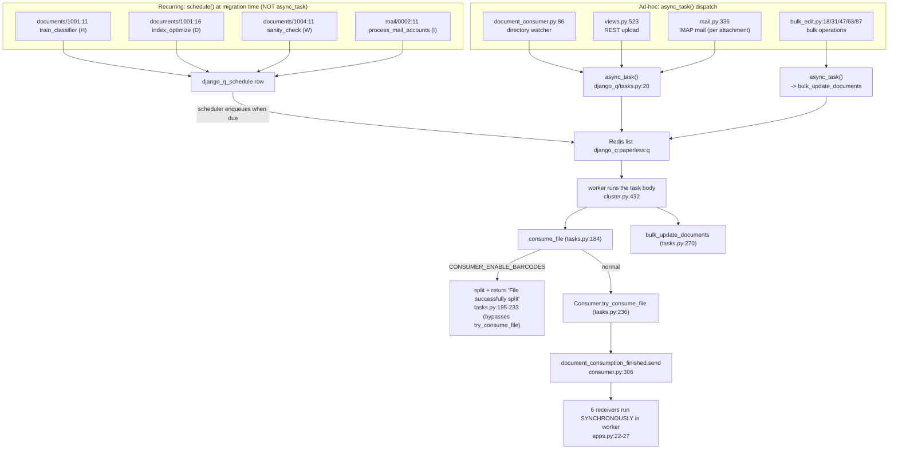

# How paperless-ngx handles background / asynchronous processing during document ingestion

> A **runtime-grounded** investigation. Every behavioral claim below is backed by the exact command that produced it and its **complete, unedited output**, captured from a live, isolated Django-Q + Redis cluster. Every code claim carries a `file:line` reference verified against the working tree at HEAD `542221a38dff06361e07976452f9aea24d210542` (and, for the queue library, against the installed `django-q==1.3.9`).

> **Reading guide for the labels used throughout.**
> - **Observed** — a claim printed directly under the exact command that produced it (all Q1–Q6 evidence blocks).
> - **Source-grounded** — a claim taken from a `file:line` in the repository or the installed `django_q` package (not necessarily exercised at runtime in this document).
> - **Non-canonical stand-in** — something substituted for observation convenience (the `slow_ok`/`fast_ok`/`boom` task *bodies*, and the direct `group_send` progress *producer* in Q4). The dispatch path, broker, cluster, signing and the entire `Q_CLUSTER` configuration are canonical; every stand-in is called out where it appears.
> - **Inferred** — a statement derived from code + docs but not reproduced here; always labeled inline.

---

## 0. The question, and the direct answers

The question has six parts. Here are the direct one-line answers; each is proven in its own section below.

| # | Sub-question | Direct answer |
|---|---|---|
| **Q1** | Which services/processes are involved behind the scenes? | In production, **one container** whose long-lived processes are launched by **Supervisord** (`docker/supervisord.conf`): the ASGI web server `gunicorn ... paperless.asgi:application`, the directory watcher `python3 manage.py document_consumer`, and the **Django-Q** worker cluster `python3 manage.py qcluster` — plus a single **Redis** instance that is *both* the Django-Q broker *and* the Channels layer store. (In this sandbox image Supervisord is not installed, so the three were launched directly as an **equivalent reproduction** — see §Q1.) |
| **Q2** | How does a job appear once it's created? | As **one signed, pickled task package** `RPUSH`ed onto the Redis **list** `django_q:paperless:q`. `queue_size` goes `0 → 1`; the element is an opaque token whose size varies slightly per enqueue (observed **366–382 bytes**; 377 in the run shown); **zero** database rows exist at creation. |
| **Q3** | Waiting vs. actively processing? | **Waiting** = still an element in the Redis list `django_q:paperless:q` (counted by `queue_size()` = `LLEN`). **Active** = already removed by the cluster's *pusher* (`BLPOP`) into an **in-memory** `task_queue` and executing in a *worker* — `queue_size` no longer counts it. Django-Q's `Stat.status` (`Working`/`Idle`) is a **queue heuristic**: it reads `Working` only while the in-memory `task_queue` **or** `result_queue` is non-empty, so it can (and does) read **`Idle` while workers are still executing** already-dequeued tasks. |
| **Q4** | Where is task state stored? | Two separate places. **Persisted:** the finished task's outcome is written to the **`django_q_task`** table (Django-Q's `Task` model; `Success`/`Failure` are proxy models filtered on the `success` flag). **Ephemeral:** live progress is broadcast to the Redis-backed Channels group `status_updates` and is **never** written to the database. The two live in the same Redis server but different keyspaces with different lifetimes (per-channel message keys expire after **15 s**; group-membership keys default to **86400 s**). |
| **Q5** | How do you tell, after the fact, what happened to a job? | Read the job's **`django_q_task`** row: **`success`**, **`started`/`stopped`/`time_taken()`**, and the pickled **`result`** (return value on success; the exception + full traceback string on failure). Surfaced through Django-Q's **built-in Django admin** (Successful/Failed/Scheduled tasks). Paperless adds no custom task model or API. **Caveat (Q5):** the HTTP upload endpoint returns only `"OK"` and exposes **neither** the Django-Q task id **nor** paperless's progress UUID, so a client correlates by the task **name** (the filename), not by id. |
| **Q6** | Where in the paperless source is a background job triggered? | Ad-hoc jobs are enqueued by **`async_task(...)`**: the directory watcher (`document_consumer.py:86`), the REST upload endpoint (`views.py:523`), the five bulk operations (`bulk_edit.py:18,31,47,63,87`), and IMAP mail consumption (`mail.py:336`). **Recurring** jobs are *not* enqueued with `async_task`; they are registered with **`django_q.tasks.schedule(...)`** in data migrations. `async_task` signs the package and calls `broker.enqueue` (`RPUSH`). |

### 0.1 Critical clarification — this is **Django-Q**, not Celery

Generic "background processing in Django" discussions usually assume Celery. **This version of paperless-ngx does not use Celery.** The async engine is **Django-Q 1.3.9** backed by Redis:

- `requirements.txt:37` -> `django-q==1.3.9`; `requirements.txt:38` -> `django==4.0.4`; `Pipfile:17` -> `django-q = "~=1.3"`.
- There is **no** Celery dependency anywhere in the tree, **no** `celery.py`, and **no `PaperlessTask` model**. The models in `src/documents/models.py` are `MatchingModel`, `Correspondent`, `Tag`, `DocumentType`, `Document`, `Log`, `SavedView`, `SavedViewFilterRule`, and `FileInfo` — none is a task model. Task state lives entirely in the third-party `django_q` app's own tables.

Everything below is therefore analyzed with **Django-Q semantics**.

---

## 1. Methodology (run-first)

### 1.1 Where the observation ran, and why it is canonical

The reproduction ran **inside the project's own canonical container** — Python **3.9.23**, matching the project's canonical runtime `Dockerfile:18` (`FROM python:3.9-slim-bullseye`) — with **every queue-relevant library pinned exactly to the manifest**, and a **real Redis 6.0** broker (the Compose `broker` service, `docker/compose/docker-compose.sqlite.yml:29` -> `image: redis:6.0`).

**Environment provisioning (run once).** The Redis and application containers on a shared Docker network were provisioned with the commands below (`$REPO` is a checkout at HEAD `542221a38dff06361e07976452f9aea24d210542`; `$IMAGE` is the canonical image shown in the `docker ps` output above). These are the exact, executable commands — no placeholders:

```bash
REPO=/path/to/paperless-ngx-checkout   # working tree at HEAD 542221a38dff
IMAGE=ghcr.io/scaleapi/swe-atlas:swe_atlas_QnA_paperless-ngx_paperless-ngx_e233ae8334038a4b615ea2e4ce663e30_qna_1.01
docker network create paperless-net-0
docker run -d --name paperless-redis-0 --network paperless-net-0 --network-alias broker -p 6379:6379 redis:6.0
docker run -d --name paperless-app-0 --network paperless-net-0 -e PAPERLESS_REDIS=redis://broker:6379 -e DJANGO_SETTINGS_MODULE=paperless.settings -v "$REPO":/app -w /app --entrypoint bash "$IMAGE" -lc 'sleep infinity'
```

**Harness deployment.** The isolated harness (settings, empty URLconf, stand-in tasks, and the helper scripts of Appendix G) was written into the app container's `/tmp/harness` — the container's own filesystem, **not** the bind-mounted repository at `/app` — and the throwaway DB migrated:

```bash
docker exec paperless-app-0 bash -lc 'mkdir -p /tmp/harness'
docker cp harness_settings.py paperless-app-0:/tmp/harness/harness_settings.py
docker cp harness_urls.py paperless-app-0:/tmp/harness/harness_urls.py
docker cp harness_tasks.py paperless-app-0:/tmp/harness/harness_tasks.py
# ...and each helper script from Appendix G (enq.py, measure.py, inspect_pkg.py, ...)
docker exec paperless-app-0 bash -lc 'cd /app/src && rm -f /tmp/harness/harness.sqlite3 && PYTHONPATH=/tmp/harness:/app/src DJANGO_SETTINGS_MODULE=harness_settings python3 manage.py migrate'
```

Every subsequent command runs a script from `/tmp/harness` via the pattern `docker exec paperless-app-0 bash -lc 'cd /app/src && PYTHONPATH=/tmp/harness:/app/src DJANGO_SETTINGS_MODULE=harness_settings python3 /tmp/harness/<script>'`, and Redis is inspected with `docker exec paperless-redis-0 redis-cli -n 1 ...` (logical DB 1 = the isolated harness broker).

**Container + broker identity (observed):**

```
$ docker ps --format "table {{.Names}}\t{{.Image}}\t{{.Status}}"
NAMES               IMAGE                                                                                                            STATUS
paperless-app-0     ghcr.io/scaleapi/swe-atlas:swe_atlas_QnA_paperless-ngx_paperless-ngx_e233ae8334038a4b615ea2e4ce663e30_qna_1.01   Up 2 hours
paperless-redis-0   redis:6.0                                                                                                        Up 2 hours

$ docker exec paperless-app-0 python3 --version
Python 3.9.23

$ docker exec paperless-app-0 cat /etc/os-release | head -2
PRETTY_NAME="Debian GNU/Linux 11 (bullseye)"
NAME="Debian GNU/Linux"
```

```
$ docker exec paperless-redis-0 redis-cli PING
PONG

$ docker exec paperless-redis-0 redis-cli INFO server | grep -E "redis_version|os:"
redis_version:6.0.20
os:Linux 6.6.122+ x86_64

$ docker network inspect paperless-net-0 --format "{{range .Containers}}{{.Name}} {{end}}"
paperless-app-0 paperless-redis-0 
```

**Library versions (observed) — exactly the manifest pins:**

```
$ docker exec paperless-app-0 python3 -m pip freeze | grep -Ei "^(django|django-q|redis|channels|channels-redis|asgiref|daphne|aioredis|hiredis)=="
Django==4.0.4
aioredis==1.3.1
asgiref==3.5.0
channels-redis==3.4.0
channels==3.0.4
daphne==3.0.2
django-q==1.3.9
hiredis==2.0.0
redis==3.5.3
```

These match `requirements.txt`: `django==4.0.4` `:38`, `django-q==1.3.9` `:37`, `redis==3.5.3` `:84`, `channels==3.0.4` `:23`, `channels-redis==3.4.0` `:22`, `asgiref==3.5.0` `:13`, `daphne==3.0.2` `:31`, `aioredis==1.3.1` `:10`, `hiredis==2.0.0` `:44`.

**The harness resolves paperless's own configuration.** The harness settings module does `from paperless.settings import *`, so it inherits paperless's **exact** `Q_CLUSTER`, `SECRET_KEY`, and `CHANNEL_LAYERS`. It overrides only three things, all for *isolation* and all disclosed here: (1) a trimmed `INSTALLED_APPS` (so no paperless data-migrations register schedules -> deterministic, zero scheduled-task noise); (2) a throwaway SQLite file (the real paperless DB is untouched); (3) the Redis **logical database index 0 -> 1** for both the broker and the Channels layer, so the harness queue can never collide with paperless's real DB-0 traffic. The queue **key name stays `django_q:paperless:q`** because `Q_CLUSTER["name"]` is still `"paperless"`.

Real paperless config vs. the harness config, side by side (observed):

```
=== Real paperless resolved config (DJANGO_SETTINGS_MODULE=paperless.settings) ===
$ cd /app/src && DJANGO_SETTINGS_MODULE=paperless.settings python3 /tmp/harness/dump_config.py
Q_CLUSTER = {
  "catch_up": false,
  "name": "paperless",
  "recycle": 1,
  "redis": "redis://broker:6379",
  "retry": 1810,
  "timeout": 1800,
  "workers": 11
}
ASGI_APPLICATION = paperless.asgi.application
django_q in INSTALLED_APPS = True
CHANNEL_LAYERS backend = channels_redis.core.RedisChannelLayer
CHANNEL_LAYERS hosts = ['redis://broker:6379']
CHANNEL_LAYERS capacity = 2000
CHANNEL_LAYERS expiry = 15
multiprocessing.cpu_count() = 128
```

```
=== Isolated harness resolved config (DJANGO_SETTINGS_MODULE=harness_settings) ===
$ cd /app/src && PYTHONPATH=/tmp/harness:/app/src DJANGO_SETTINGS_MODULE=harness_settings python3 /tmp/harness/dump_config.py
Q_CLUSTER = {
  "catch_up": false,
  "name": "paperless",
  "recycle": 1,
  "redis": "redis://broker:6379/1",
  "retry": 1810,
  "timeout": 1800,
  "workers": 11
}
ASGI_APPLICATION = paperless.asgi.application
django_q in INSTALLED_APPS = True
CHANNEL_LAYERS backend = channels_redis.core.RedisChannelLayer
CHANNEL_LAYERS hosts = ['redis://broker:6379/1']
CHANNEL_LAYERS capacity = 2000
CHANNEL_LAYERS expiry = 15
multiprocessing.cpu_count() = 128
```

The only difference is the Redis logical-DB index (`redis://broker:6379` vs `.../1`). Everything else — `name="paperless"`, `recycle=1`, `timeout=1800`, `retry=1810`, `workers=11`, `catch_up=False`, `capacity=2000`, `expiry=15` — is identical, and the signing key is proven identical **without printing it**:

```
$ cd /app/src && PYTHONPATH=/tmp/harness:/app/src DJANGO_SETTINGS_MODULE=harness_settings \
    python3 -c "import django; django.setup(); from django.conf import settings as h; from paperless import settings as p; print(\"harness SECRET_KEY == paperless SECRET_KEY:\", h.SECRET_KEY == p.SECRET_KEY)"
harness SECRET_KEY == paperless SECRET_KEY: True
```

> **Why `workers: 11`?** `Q_CLUSTER["workers"]` comes from paperless's `default_task_workers()` (`src/paperless/settings.py:427-435`): for a host with >= 4 cores it returns `floor(sqrt(cores))`. This container's Python sees `multiprocessing.cpu_count() == 128`, so `floor(sqrt(128)) == 11`. This is the canonical default *for this machine*, reported as observed. It is environment-overridable via `PAPERLESS_TASK_WORKERS` (`settings.py:438`).

> **Why isolate at all? (an honest failure note — Finding-driven.)** An **earlier, non-isolated** attempt ran the harness against the **same** Redis DB 0 the real paperless `qcluster` was draining, but signed packages with a **different** `SECRET_KEY`. The real cluster's `pusher()` then rejected them. That failure is real and was captured in the leftover cluster log:

```
# Honest failure note (Finding #11): an EARLIER, NON-isolated harness run (before the
# Redis-DB-1 isolation described above) signed task packages with a DIFFERENT SECRET_KEY
# and pushed them to the SAME real queue django_q:paperless:q (Redis DB 0) that the real
# paperless qcluster was draining. The real cluster.pusher() then failed to verify them.
# Captured from the real cluster log left by that run:

$ docker exec paperless-app-0 bash -lc "grep -n BadSignature /tmp/qcluster.log | head -3"
209:    raise BadSignature('Signature "%s" does not match' % sig)
210:django.core.signing.BadSignature: Signature "-RNW7GGJfBnrYGIEPSGprGXJ9G1Cp3RQNdCUrTUbDtY" does not match
279:Message: BadSignature('Signature "-RNW7GGJfBnrYGIEPSGprGXJ9G1Cp3RQNdCUrTUbDtY" does not match')

$ docker exec paperless-app-0 bash -lc "grep -n -A1 \"BadSignature\" /tmp/qcluster.log | head -8"
total BadSignature lines: 8
```

The failing frames themselves (excerpt of the same log) show the signature check inside Django-Q's signing layer:

```
$ docker exec paperless-app-0 bash -lc "sed -n \"203,210p\" /tmp/qcluster.log"
    return signing.loads(
  File "/usr/local/lib/python3.9/site-packages/django_q/core_signing.py", line 35, in loads
    base64d = force_bytes(TimestampSigner(key, salt=salt).unsign(s, max_age=max_age))
  File "/usr/local/lib/python3.9/site-packages/django_q/core_signing.py", line 70, in unsign
    result = super(TimestampSigner, self).unsign(value)
  File "/usr/local/lib/python3.9/site-packages/django_q/core_signing.py", line 55, in unsign
    raise BadSignature('Signature "%s" does not match' % sig)
django.core.signing.BadSignature: Signature "-RNW7GGJfBnrYGIEPSGprGXJ9G1Cp3RQNdCUrTUbDtY" does not match
```
The relevant recovery path is in Django-Q itself: `pusher()` (`django_q/cluster.py:333`) wraps `task = SignedPackage.loads(task[1])` (`:356`) in `except (TypeError, BadSignature)` (`:357`), logs the traceback (`logger.error(...)`, `:358`), calls `broker.fail(ack_id)` (`:359`) and `continue`s (`:360`) — so a mis-signed package is dropped, not executed. The fix here is *not* to change any code but to **isolate the broker** (Redis DB 1) and **inherit the real `SECRET_KEY`**, so the two clusters can never process each other's packages. Every observation below ran on that isolated broker and produced **no** `BadSignature` errors.

### 1.2 The stand-in task bodies (explicitly labeled non-canonical)

These three functions stand in for real task bodies only to *hold* and *observe* each lifecycle state; they are dispatched through the **identical** canonical path (`async_task -> SignedPackage.dumps -> broker.enqueue` RPUSH `-> pusher` BLPOP `-> worker -> monitor save_task`). Only the function bodies are stand-ins. (Q5 additionally reads the **real** `documents.tasks.consume_file` rows.)

```python
# harness_tasks.py — NON-CANONICAL stand-in task bodies used only to hold/observe
# each lifecycle state. They are dispatched through the IDENTICAL canonical path
# (async_task -> SignedPackage.dumps -> broker.enqueue RPUSH -> pusher BLPOP ->
#  worker -> monitor save_task). Only the function *bodies* are stand-ins.
import time


def slow_ok(n):
    """Sleep n seconds then succeed (used to hold the ACTIVE/in-flight state)."""
    time.sleep(n)
    return {"ok": True, "n": n}


def fast_ok(x):
    """Return immediately (used to observe a SUCCESS row quickly)."""
    return {"ok": True, "x": x, "doubled": x * 2}


def boom():
    """Always raise (used to observe the FAILED row + stored traceback)."""
    raise ValueError("intentional failure for observation")
```

### 1.3 The complete harness (embedded for audit)

The settings module (note: it never prints the secret, and points the URLconf at an empty module so Django's checks don't import paperless's web layer):

```python
# harness_settings.py — isolated, throwaway Django-Q observation harness.
# Inherits paperless's EXACT settings (SECRET_KEY, Q_CLUSTER shape, CHANNEL_LAYERS)
# so the dispatch/signing/cluster behavior is canonical, then overrides ONLY:
#   (1) INSTALLED_APPS -> minimal (django_q + Django contrib) so NO paperless
#       schedule migrations run (deterministic, zero scheduled-task noise);
#   (2) DATABASES -> a dedicated throwaway sqlite file (real paperless DB untouched);
#   (3) the Redis logical DB index 0 -> 1 for BOTH the Q-Cluster broker and the
#       Channels layer, isolating the harness queue from paperless's real DB-0
#       queue so cross-signed packages can never collide (root cause of the
#       earlier BadSignature errors). The queue KEY name stays "django_q:paperless:q".
from paperless.settings import *  # noqa: F401,F403  (inherits SECRET_KEY, Q_CLUSTER, etc.)

INSTALLED_APPS = [
    "django.contrib.contenttypes",
    "django.contrib.auth",
    "django.contrib.sessions",
    "django.contrib.admin",
    "django.contrib.messages",
    "django_q",
]

DATABASES = {
    "default": {
        "ENGINE": "django.db.backends.sqlite3",
        "NAME": "/tmp/harness/harness.sqlite3",
    }
}

# Isolate the broker + channel layer onto Redis logical DB index 1 (was 0).
_ISOLATED_REDIS = "redis://broker:6379/1"
Q_CLUSTER = {**Q_CLUSTER, "redis": _ISOLATED_REDIS}  # noqa: F405
CHANNEL_LAYERS = {
    "default": {
        "BACKEND": "channels_redis.core.RedisChannelLayer",
        "CONFIG": {"hosts": [_ISOLATED_REDIS], "capacity": 2000, "expiry": 15},
    }
}

# The harness never serves HTTP; point the URLconf at an empty module so Django's
# system checks don't import paperless.urls -> documents.views -> paperless models
# (which aren't in this harness's trimmed INSTALLED_APPS).
ROOT_URLCONF = "harness_urls"
```

```python
# harness_urls.py — empty URLconf for the isolated harness (no HTTP routes needed;
# we only exercise the Django-Q dispatch/cluster path, not the web layer).
urlpatterns = []
```

The per-experiment helper scripts (`enq.py`, `measure.py`, `inspect_pkg.py`, `dump_config.py`, `show_tables.py`, and the Q3/Q4/Q5 helpers `burst.py`, `poll.py`, `read_task.py`, `raw_sql.py`, `save_limit.py`, `channels_probe.py`) are listed verbatim in **Appendix G**. Every per-experiment command in this document names the exact script it runs; the only inline exceptions are a few short `python3 -c` one-liners (used for row counts and a version print) that show their complete output inline — the row-count logic they use is reproduced verbatim in Appendix G's `read_task.py`.

### 1.4 Migrations create the Django-Q tables

Running Django migrations on the throwaway harness DB creates the Django-Q tables and nothing paperless-specific:

```
$ docker exec paperless-app-0 bash -lc "cd /app/src && rm -f /tmp/harness/harness.sqlite3 && \
    PYTHONPATH=/tmp/harness:/app/src DJANGO_SETTINGS_MODULE=harness_settings python3 manage.py migrate"
Operations to perform:
  Apply all migrations: admin, auth, contenttypes, django_q, sessions
Running migrations:
  Applying contenttypes.0001_initial... OK
  Applying auth.0001_initial... OK
  Applying admin.0001_initial... OK
  Applying admin.0002_logentry_remove_auto_add... OK
  Applying admin.0003_logentry_add_action_flag_choices... OK
  Applying contenttypes.0002_remove_content_type_name... OK
  Applying auth.0002_alter_permission_name_max_length... OK
  Applying auth.0003_alter_user_email_max_length... OK
  Applying auth.0004_alter_user_username_opts... OK
  Applying auth.0005_alter_user_last_login_null... OK
  Applying auth.0006_require_contenttypes_0002... OK
  Applying auth.0007_alter_validators_add_error_messages... OK
  Applying auth.0008_alter_user_username_max_length... OK
  Applying auth.0009_alter_user_last_name_max_length... OK
  Applying auth.0010_alter_group_name_max_length... OK
  Applying auth.0011_update_proxy_permissions... OK
  Applying auth.0012_alter_user_first_name_max_length... OK
  Applying django_q.0001_initial... OK
  Applying django_q.0002_auto_20150630_1624... OK
  Applying django_q.0003_auto_20150708_1326... OK
  Applying django_q.0004_auto_20150710_1043... OK
  Applying django_q.0005_auto_20150718_1506... OK
  Applying django_q.0006_auto_20150805_1817... OK
  Applying django_q.0007_ormq... OK
  Applying django_q.0008_auto_20160224_1026... OK
  Applying django_q.0009_auto_20171009_0915... OK
  Applying django_q.0010_auto_20200610_0856... OK
  Applying django_q.0011_auto_20200628_1055... OK
  Applying django_q.0012_auto_20200702_1608... OK
  Applying django_q.0013_task_attempt_count... OK
  Applying django_q.0014_schedule_cluster... OK
  Applying sessions.0001_initial... OK

$ docker exec paperless-app-0 bash -lc "cd /app/src && PYTHONPATH=/tmp/harness:/app/src \
    DJANGO_SETTINGS_MODULE=harness_settings python3 /tmp/harness/show_tables.py"
connection.introspection.table_names() (django_q_* only) = ['django_q_ormq', 'django_q_schedule', 'django_q_task']
Task._meta.db_table = django_q_task
Task._meta.app_label = django_q
```

The three tables (`django_q_task`, `django_q_ormq`, `django_q_schedule`) are Django defaults — the `Task` model sets no `db_table` override (`django_q/models.py:104`, `app_label = "django_q"`), which is why `Task._meta.db_table == "django_q_task"`.

### 1.5 Run scale and stability

- **WAITING** and the **package-size** measurement were each run **twice** (run #1 / run #2), plus an 8x size sample per run.
- **ACTIVE** was driven with bursts of **200** and **160** `slow_ok` tasks (each burst > the in-memory `QUEUE_LIMIT` of `workers**2 = 121`, forcing a visible Redis backlog), polled to completion, **twice**.
- **SUCCESS**, **FAILED**, the **SAVE_LIMIT** cap, and the **channels** progress broadcast were each reproduced, and SUCCESS/FAILED/SAVE_LIMIT were run **twice**.
- **Q5** additionally exercised the **real** `documents.tasks.consume_file` task body end-to-end (success + a duplicate-checksum failure) on the real paperless DB.

Across runs, all **structural** results were identical. Values that legitimately vary run-to-run are called out where they appear: the package byte size (**366–382 bytes**), the random task UUID and humanized name, the `started`/`stopped` timestamps, and `time_taken()`.


---

## Q1 — Which services/processes are involved behind the scenes?

**Direct answer.** In a canonical deployment the whole system runs as **one Docker container** whose long-lived processes are launched by **Supervisord** (`docker/supervisord.conf`). Three of them make async document processing work, plus a fourth shared datastore:

1. **`gunicorn ... paperless.asgi:application`** — the ASGI web server (`[program:gunicorn]`, `docker/supervisord.conf:10-11`). It serves both HTTP (the REST API, including the upload endpoint that *enqueues* jobs) and WebSocket (the live progress channel), because it runs the ASGI `ProtocolTypeRouter` in `src/paperless/asgi.py:17-20`.
2. **`python3 manage.py document_consumer`** — the directory watcher (`[program:consumer]`, `docker/supervisord.conf:19-20`). It watches the consume directory and *enqueues* a `consume_file` job per new file.
3. **`python3 manage.py qcluster`** — the **Django-Q** worker cluster (`[program:scheduler]`, `docker/supervisord.conf:28-29`). This is the process that actually *runs* background jobs.
4. **A single Redis instance** — provisioned as the Compose `broker` service (`docker/compose/docker-compose.sqlite.yml:29` -> `image: redis:6.0`). It plays a **dual role**: the **Django-Q broker** (`Q_CLUSTER["redis"]`, `src/paperless/settings.py:456`) *and* the **Channels layer** store for WebSocket progress (`CHANNEL_LAYERS` -> `channels_redis.core.RedisChannelLayer`, `src/paperless/settings.py:178-186`).

> **This version uses Django-Q, not Celery.** There is no `celery.py` and no Celery dependency in the tree; the worker is `manage.py qcluster` and the pinned dependency is `django-q==1.3.9` (`requirements.txt:37`). Every claim below is about **Django-Q** semantics.

**Source of the process definitions.** The three programs are declared verbatim in the production Supervisord config:

```
# The three long-lived processes are defined in the production Supervisord config.
$ docker exec paperless-app-0 cat -n /app/docker/supervisord.conf
     1	[supervisord]
     2	nodaemon=true               ; start in foreground if true; default false
     3	logfile=/var/log/supervisord/supervisord.log ; main log file; default $CWD/supervisord.log
     4	pidfile=/var/run/supervisord/supervisord.pid ; supervisord pidfile; default supervisord.pid
     5	logfile_maxbytes=50MB        ; max main logfile bytes b4 rotation; default 50MB
     6	logfile_backups=10           ; # of main logfile backups; 0 means none, default 10
     7	loglevel=info                ; log level; default info; others: debug,warn,trace
     8	user=root
     9	
    10	[program:gunicorn]
    11	command=gunicorn -c /usr/src/paperless/gunicorn.conf.py paperless.asgi:application
    12	user=paperless
    13	
    14	stdout_logfile=/dev/stdout
    15	stdout_logfile_maxbytes=0
    16	stderr_logfile=/dev/stderr
    17	stderr_logfile_maxbytes=0
    18	
    19	[program:consumer]
    20	command=python3 manage.py document_consumer
    21	user=paperless
    22	
    23	stdout_logfile=/dev/stdout
    24	stdout_logfile_maxbytes=0
    25	stderr_logfile=/dev/stderr
    26	stderr_logfile_maxbytes=0
    27	
    28	[program:scheduler]
    29	command=python3 manage.py qcluster
    30	user=paperless
    31	
    32	stdout_logfile=/dev/stdout
    33	stdout_logfile_maxbytes=0
    34	stderr_logfile=/dev/stderr
    35	stderr_logfile_maxbytes=0
```

**Reproduction note (canonical entry point; equivalent launch).** This sandbox image does **not** ship Supervisord, and the production path `/usr/src/paperless` is absent — so Supervisord itself could not be exercised live. Instead each process was launched **directly through its own canonical entry point** (`manage.py qcluster`, `manage.py document_consumer`, `gunicorn ... paperless.asgi:application`) — exactly the commands Supervisord would run (`supervisord.conf:11/20/29`). This is an **equivalent reproduction** of the topology: the *processes* and their behavior are canonical; only the *launcher* (a shell instead of Supervisord) differs. No claim is made that Supervisord was observed running.

**Observed — the worker cluster's real process fan-out.** Starting the cluster through `manage.py qcluster` prints its startup banner, which enumerates every process it forks:

```
# Start a REAL Django-Q cluster through the canonical `manage.py qcluster` entry
# point against the isolated harness broker (Redis DB 1); self-terminates after 8s.
$ cd /app/src && PYTHONPATH=/tmp/harness:/app/src DJANGO_SETTINGS_MODULE=harness_settings timeout 8 python3 manage.py qcluster
19:11:17 [Q] INFO Q Cluster purple-bacon-shade-diet starting.
19:11:17 [Q] INFO Process-1:1 ready for work at 28820
19:11:17 [Q] INFO Process-1:2 ready for work at 28821
19:11:17 [Q] INFO Process-1:3 ready for work at 28822
19:11:17 [Q] INFO Process-1:4 ready for work at 28823
19:11:17 [Q] INFO Process-1:5 ready for work at 28824
19:11:17 [Q] INFO Process-1:6 ready for work at 28825
19:11:17 [Q] INFO Process-1:7 ready for work at 28826
19:11:17 [Q] INFO Process-1:8 ready for work at 28827
19:11:17 [Q] INFO Process-1:9 ready for work at 28828
19:11:17 [Q] INFO Process-1:10 ready for work at 28829
19:11:17 [Q] INFO Process-1:11 ready for work at 28830
19:11:17 [Q] INFO Process-1:12 monitoring at 28831
19:11:17 [Q] INFO Process-1 guarding cluster purple-bacon-shade-diet
19:11:17 [Q] INFO Process-1:13 pushing tasks at 28832
19:11:17 [Q] INFO Q Cluster purple-bacon-shade-diet running.
19:11:17 [Q] INFO Process-1:1 processing [emma-lactose-nuts-fillet]
19:11:24 [Q] INFO Q Cluster purple-bacon-shade-diet stopping.
19:11:24 [Q] INFO Q Cluster purple-bacon-shade-diet has stopped.
```

Read directly from the banner, one `qcluster` invocation is actually **14 OS processes**: **11 worker processes** (`Process-1:1` .. `Process-1:11`, each `ready for work`), **1 monitor** (`Process-1:12 monitoring`), **1 pusher** (`Process-1:13 pushing tasks`), and **1 sentinel** (`Process-1 guarding cluster`). The worker count is **11** because it defaults to `floor(sqrt(cpu_count))` — this machine has 128 cores, `floor(sqrt(128)) = 11` (`default_task_workers()`, `src/paperless/settings.py:427-433`). The banner also immediately shows `Process-1:1 processing [...]` — the cluster picked up a task that had been left waiting in the broker, i.e. the pusher moved it from Redis into a worker.

**A naming subtlety worth calling out.** The banner's cluster name (`purple-bacon-shade-diet`) is **random per run** — it is `humanize(self.cluster_id.hex)` (`django_q/cluster.py:110-111`), a fresh UUID each start. It is **not** the configured `name`. The configured `name="paperless"` (`settings.py:450`) becomes `Conf.PREFIX` (`django_q/conf.py:80`), which is what forms the **Redis key names**: the queue `django_q:paperless:q` (`redis_broker.py:15`) and the cluster Stat key `django_q:paperless:cluster` (`conf.py:174`). So "paperless" identifies the *queue*; the memorable name identifies the *running cluster instance* in logs.

**Observed — the live process tree (`/proc`, since `ps` is absent).** Snapshotting `/proc` while an isolated cluster runs shows the parent/child structure directly:

```
# `ps` is not installed in this image, so processes are listed by reading /proc.
# Launch an isolated cluster (harness broker DB 1) via a launcher script, then
# snapshot /proc while it runs; the cluster self-terminates after 12s.
$ bash /tmp/harness/run_harness_cluster.sh 12 >/tmp/harness/qc_bg.log 2>&1 &
$ sleep 4; python3 /tmp/harness/proctree.py
    PID     PPID  CMDLINE
  21235        0  bash -lc cd /app/src && (echo START $(date); gunicorn -c /app/gunicorn.conf.py paperless.asgi:application) > /tmp/gunicorn.log 2>&1
  21243    21235  bash -lc cd /app/src && (echo START $(date); gunicorn -c /app/gunicorn.conf.py paperless.asgi:application) > /tmp/gunicorn.log 2>&1
  21245    21243  /usr/local/bin/python3.9 /usr/local/bin/gunicorn -c /app/gunicorn.conf.py paperless.asgi:application
  21258    21245  /usr/local/bin/python3.9 /usr/local/bin/gunicorn -c /app/gunicorn.conf.py paperless.asgi:application
  21261    21245  /usr/local/bin/python3.9 /usr/local/bin/gunicorn -c /app/gunicorn.conf.py paperless.asgi:application
  25906        0  bash -c cd /app/src && nohup python3 manage.py qcluster > /tmp/real_qcluster.log 2>&1
  25912    25906  python3 manage.py qcluster
  25919    25912  python3 manage.py qcluster
  25931    25919  python3 manage.py qcluster
  25932    25919  python3 manage.py qcluster
  25939        0  bash -c cd /app/src && nohup python3 manage.py document_consumer > /tmp/real_consumer.log 2>&1
  25945    25939  python3 manage.py document_consumer
  26615    25919  python3 manage.py qcluster
  27505    25919  python3 manage.py qcluster
  27760    25919  python3 manage.py qcluster
  27804    25919  python3 manage.py qcluster
  27855    25919  python3 manage.py qcluster
  27856    25919  python3 manage.py qcluster
  28026    25919  python3 manage.py qcluster
  28496    25919  python3 manage.py qcluster
  28702    25919  python3 manage.py qcluster
  28704    25919  python3 manage.py qcluster
  28903    25919  python3 manage.py qcluster
  28972    28964  timeout 12 python3 manage.py qcluster
  28974    28972  python3 manage.py qcluster
  28975    28974  python3 manage.py qcluster
  28976    28975  python3 manage.py qcluster
  28977    28975  python3 manage.py qcluster
  28978    28975  python3 manage.py qcluster
  28979    28975  python3 manage.py qcluster
  28980    28975  python3 manage.py qcluster
  28981    28975  python3 manage.py qcluster
  28982    28975  python3 manage.py qcluster
  28983    28975  python3 manage.py qcluster
  28984    28975  python3 manage.py qcluster
  28985    28975  python3 manage.py qcluster
  28986    28975  python3 manage.py qcluster
  28987    28975  python3 manage.py qcluster
  28988    28975  python3 manage.py qcluster

TOTAL matching processes = 39
```

The harness cluster is the subtree rooted at the `timeout ... python3 manage.py qcluster` process: a bootstrap `manage.py qcluster`, then the **sentinel** (`Process-1`), then its **13 children** (11 workers + monitor + pusher) — matching the banner exactly. The same snapshot also shows the **web server**: a `gunicorn ... paperless.asgi:application` **master** with **2 worker** children — i.e. the default `PAPERLESS_WEBSERVER_WORKERS = 2` (`gunicorn.conf.py:4`). (The other `manage.py qcluster` / `document_consumer` / `gunicorn` processes in the snapshot are a separate, pre-existing instance left running in the sandbox; §Teardown accounts for and removes them, and confirms the repository is left unchanged.)

**Configuration is env-overridable, not hard-coded (Finding-driven correction).** The concrete numbers above are *defaults*; each is overridable by an environment variable. The table below reads the **real** `paperless.settings` and shows, per knob, the env var, the default, and the value **resolved in this run** — note the Redis URL resolved to `redis://broker:6379` because `PAPERLESS_REDIS` is set, proving the override path is live and not a fixed literal:

```
# Every background-processing knob, the env var that overrides it, its default,
# and the value RESOLVED in this run (read from the real paperless.settings).
$ cd /app/src && PYTHONPATH=/app/src DJANGO_SETTINGS_MODULE=paperless.settings python3 /tmp/harness/cfg_overrides.py
KNOB                        ENV VAR                       DEFAULT                 RESOLVED                  SOURCE
gunicorn bind port          PAPERLESS_PORT                8000                    8000                      gunicorn.conf.py:3
gunicorn web workers        PAPERLESS_WEBSERVER_WORKERS   2                       2                         gunicorn.conf.py:4
gunicorn timeout (fixed)    (none)                        120                     120                       gunicorn.conf.py:6
Q_CLUSTER workers           PAPERLESS_TASK_WORKERS        sqrt(cores)             11                        settings.py:427-433,438,455
Q_CLUSTER timeout           PAPERLESS_WORKER_TIMEOUT      1800                    1800                      settings.py:440,454
Q_CLUSTER retry             PAPERLESS_WORKER_RETRY        timeout+10=1810         1810                      settings.py:444-447,453
Q_CLUSTER redis URL         PAPERLESS_REDIS               redis://localhost:6379  redis://broker:6379       settings.py:456
Q_CLUSTER name (fixed)      (none)                        paperless               paperless                 settings.py:450
Q_CLUSTER recycle (fixed)   (none)                        1                       1                         settings.py:452
Q_CLUSTER catch_up (fixed)  (none)                        False                   False                     settings.py:451
```

So the only genuinely fixed values among these are `gunicorn` `timeout=120` (`gunicorn.conf.py:6`), and the Q_CLUSTER `name`/`recycle`/`catch_up` literals (`settings.py:450-452`); everything else (`PAPERLESS_PORT`, `PAPERLESS_WEBSERVER_WORKERS`, `PAPERLESS_TASK_WORKERS`, `PAPERLESS_WORKER_TIMEOUT`, `PAPERLESS_WORKER_RETRY`, `PAPERLESS_REDIS`) is environment-driven.


---

## Q2 — How does a job appear once it's created?

**Direct answer.** Enqueuing does exactly one thing: it produces a **single, signed, pickled task package** and **`RPUSH`es it onto a Redis list** whose key is `django_q:paperless:q`. At that instant `queue_size()` (which is literally `LLEN` on that list) goes from `0 -> 1`, and **no database row exists yet** — under the Redis broker a waiting job lives *only* in Redis.

**Mechanism (source-grounded).** `async_task(func, *args, **kwargs)` (`django_q/tasks.py:20`) builds a task dict with a fresh id (`task["id"] = uuid()[1]`), then `pack = SignedPackage.dumps(task)` (`:69`) and `enqueue_id = broker.enqueue(pack)` (`:73`); it finally `return task["id"]` (`:76`). For the Redis broker the list key is `f"django_q:{list_key}:q"` (`django_q/brokers/redis_broker.py:15`) -> with `name = "paperless"` that is `django_q:paperless:q`; `enqueue` is `self.connection.rpush(self.list_key, task)` (`:17-18`).

**Observed — WAITING, run #1.** Enqueue one task through the canonical `async_task()` entry point, with **no cluster running** so it stays put:

```
# Precondition: NO cluster running; isolated broker (Redis logical DB 1) flushed.
$ docker exec paperless-redis-0 redis-cli -n 1 FLUSHDB
OK
$ docker exec paperless-redis-0 redis-cli -n 1 KEYS "*"

$ docker exec paperless-redis-0 redis-cli -n 1 LLEN django_q:paperless:q
0

# Enqueue ONE task via the canonical async_task() entry point (no cluster consuming):
$ cd /app/src && PYTHONPATH=/tmp/harness:/app/src DJANGO_SETTINGS_MODULE=harness_settings python3 /tmp/harness/enq.py harness_tasks.slow_ok 30
18:48:30 [Q] INFO Enqueued 1
async_task('harness_tasks.slow_ok', *[30]) -> returned id adb925dfe9cb4c67a969faa4baf98d85
Task.objects.count() immediately after enqueue = 0
get_broker().queue_size() = 1

# Inspect the broker immediately after enqueue:
$ docker exec paperless-redis-0 redis-cli -n 1 KEYS "*"
django_q:paperless:q
$ docker exec paperless-redis-0 redis-cli -n 1 TYPE django_q:paperless:q
list
$ docker exec paperless-redis-0 redis-cli -n 1 LLEN django_q:paperless:q
1

# Measure the exact bytes of the queued element:
$ cd /app/src && PYTHONPATH=/tmp/harness:/app/src DJANGO_SETTINGS_MODULE=harness_settings python3 /tmp/harness/measure.py
LLEN django_q:paperless:q = 1
type(element) = bytes
exact byte length = len(element) = 377
first 24 bytes (repr) = b'gAWV6QAAAAAAAAB9lCiMAmlk'
last 20 bytes (repr)  = b'zoFV2zBqlJ4fyLlpi-20'
is JSON? starts with b'{' or b'[' : False
contains b':' signing separator: True

# Decode + round-trip the element through Django-Q SignedPackage.loads:
$ cd /app/src && PYTHONPATH=/tmp/harness:/app/src DJANGO_SETTINGS_MODULE=harness_settings python3 /tmp/harness/inspect_pkg.py
first 3 raw bytes after base64-decode = b'\x80\x05\x95' (pickle PROTO opcode 0x80 + protocol byte)
SignedPackage.loads(element) keys = ['args', 'func', 'id', 'kwargs', 'name', 'started']
  func    = harness_tasks.slow_ok
  args    = (30,)
  kwargs  = {}
  id      = adb925dfe9cb4c67a969faa4baf98d85
  name    = video-arkansas-north-football
```

So: one new key appears (`django_q:paperless:q`), it is a **`list`**, its length is **1**, and — critically — `Task.objects.count()` is still **0**. The job exists purely as a Redis list element. Base64-decoding the payload reveals the pickle **PROTO** opcode `\x80\x05` (protocol 5, the maximum on Python 3.9), and Django-Q's own `SignedPackage.loads` reconstructs the task dict `{args, func, id, kwargs, name, started}` whose `id` equals the id `async_task()` returned. So the "job at rest" is *the pickled call spec (`func`, `args`, `kwargs`), a unique id, a humanized name, and an enqueue timestamp — base64-encoded and HMAC-signed with the project `SECRET_KEY`, sitting as one element in the Redis list.*

**Observed — WAITING, run #2** (identical structure; the id/name and exact byte size differ, as expected):

```
# Precondition: NO cluster running; isolated broker (Redis logical DB 1) flushed.
$ docker exec paperless-redis-0 redis-cli -n 1 FLUSHDB
OK
$ docker exec paperless-redis-0 redis-cli -n 1 LLEN django_q:paperless:q
0

$ cd /app/src && PYTHONPATH=/tmp/harness:/app/src DJANGO_SETTINGS_MODULE=harness_settings python3 /tmp/harness/enq.py harness_tasks.slow_ok 30
18:48:46 [Q] INFO Enqueued 1
async_task('harness_tasks.slow_ok', *[30]) -> returned id 06c0d06893374523a5e5d9fe683922c2
Task.objects.count() immediately after enqueue = 0
get_broker().queue_size() = 1

$ docker exec paperless-redis-0 redis-cli -n 1 TYPE django_q:paperless:q
list
$ docker exec paperless-redis-0 redis-cli -n 1 LLEN django_q:paperless:q
1

$ cd /app/src && PYTHONPATH=/tmp/harness:/app/src DJANGO_SETTINGS_MODULE=harness_settings python3 /tmp/harness/measure.py
LLEN django_q:paperless:q = 1
type(element) = bytes
exact byte length = len(element) = 367
first 24 bytes (repr) = b'gAWV4gAAAAAAAAB9lCiMAmlk'
last 20 bytes (repr)  = b'QbhF7bqH6lOz5l9n2XQI'
is JSON? starts with b'{' or b'[' : False
contains b':' signing separator: True

$ cd /app/src && PYTHONPATH=/tmp/harness:/app/src DJANGO_SETTINGS_MODULE=harness_settings python3 /tmp/harness/inspect_pkg.py
first 3 raw bytes after base64-decode = b'\x80\x05\x95' (pickle PROTO opcode 0x80 + protocol byte)
SignedPackage.loads(element) keys = ['args', 'func', 'id', 'kwargs', 'name', 'started']
  func    = harness_tasks.slow_ok
  args    = (30,)
  kwargs  = {}
  id      = 06c0d06893374523a5e5d9fe683922c2
  name    = low-seven-island-pluto
```

**Observed — exact package size across two 8x samples.** The element is an opaque signed token, *not* JSON, and its size varies slightly per enqueue (each package embeds a random UUID, a humanized name, and a signing timestamp):

```
# Enqueue 8 identical slow_ok(30) tasks and measure each element size (flushes DB 1 first):
$ cd /app/src && PYTHONPATH=/tmp/harness:/app/src DJANGO_SETTINGS_MODULE=harness_settings python3 /tmp/harness/measure.py 8
18:49:01 [Q] INFO Enqueued 1
18:49:01 [Q] INFO Enqueued 2
18:49:01 [Q] INFO Enqueued 3
18:49:01 [Q] INFO Enqueued 4
18:49:01 [Q] INFO Enqueued 5
18:49:01 [Q] INFO Enqueued 6
18:49:01 [Q] INFO Enqueued 7
18:49:01 [Q] INFO Enqueued 8
enqueued N=8; LLEN=8
exact byte lengths = [378, 375, 382, 377, 373, 369, 373, 371]
min=369 max=382 distinct=[369, 371, 373, 375, 377, 378, 382]
```

```
$ cd /app/src && PYTHONPATH=/tmp/harness:/app/src DJANGO_SETTINGS_MODULE=harness_settings python3 /tmp/harness/measure.py 8
18:49:02 [Q] INFO Enqueued 1
18:49:02 [Q] INFO Enqueued 2
18:49:02 [Q] INFO Enqueued 3
18:49:02 [Q] INFO Enqueued 4
18:49:02 [Q] INFO Enqueued 5
18:49:02 [Q] INFO Enqueued 6
18:49:02 [Q] INFO Enqueued 7
18:49:02 [Q] INFO Enqueued 8
enqueued N=8; LLEN=8
exact byte lengths = [371, 366, 371, 375, 371, 370, 375, 369]
min=366 max=375 distinct=[366, 369, 370, 371, 375]
```

Combining the two single WAITING runs (377, 367 bytes) with the two 8x samples, the **observed byte range is 366-382 bytes** across 18 enqueues. It is `bytes`, does not start with `{`/`[` (so not JSON), and contains the `:` that separates a `django.core.signing` payload from its signature.

> **Security note — CWE-502 (deserialization of untrusted data).** A Django-Q task package is a **pickle**. HMAC signing with `SECRET_KEY` guarantees **integrity and authenticity** — a package that was not signed with the project's key is rejected by `pusher()` before it is unpickled (that is exactly the `BadSignature` path shown in §1.1) — but signing does **not** make pickle *safe*, *confidential*, or *non-executable*. Anyone able to write a validly-signed package to the queue can cause arbitrary code execution on a worker. Therefore: `SignedPackage.loads` in this document is only ever run on a package **the isolated harness just produced with the trusted, inherited key**; a real deployment must protect the `SECRET_KEY` and the Redis instance as trust boundaries, and must never point a cluster at a shared or untrusted broker. Where only the *shape* of the element matters (Q2's size/keys), prefer byte-level inspection (`LLEN`, `len(element)`, the leading pickle opcode) over unpickling.


---

## Q3 — What distinguishes work that's *waiting* from work that's *actively processing*?

**Direct answer.** *Waiting* work lives in a **queue**; *active* work has been handed to a **worker process** and is running its function. The subtlety this codebase forces you to confront is that **"waiting" happens in two different places**: first in the **Redis broker list** (`django_q:paperless:q`), and then — once the cluster is up — in an **in-memory `task_queue`** inside the cluster, because the `pusher` *prefetches* tasks out of Redis in bulk. So `broker.queue_size()` going to `0` does **not** mean "nothing is waiting"; it means "nothing is waiting *in the broker*." And, crucially, the cluster's own `Idle`/`Working` label is a **queue-emptiness heuristic that does not look at the workers at all** — so it can read `Idle` while workers are still executing.

**The five states a single task passes through (source-grounded).**

| # | State | Where it lives | How you observe it |
|---|-------|----------------|--------------------|
| S1 | **Waiting (broker)** | one element in the Redis list `django_q:paperless:q` | `broker.queue_size()` = `LLEN` (`django_q/brokers/redis_broker.py:25-26`) |
| S2 | **Waiting (prefetched, in-memory)** | the cluster's `task_queue` (`Queue(maxsize=QUEUE_LIMIT)`, `cluster.py:160-161`; `QUEUE_LIMIT = workers**2`, `conf.py:113`) | `Stat.task_q_size` (`django_q/status.py:46`) |
| S3 | **Actively processing** | a `worker` process running `res = f(*args, **kwargs)` (`cluster.py:399,432`) | *not* in any queue — inferred from `persist < N` while both queues are empty |
| S4 | **Result pending** | the cluster's `result_queue` (`cluster.py:163`), awaiting the monitor | `Stat.done_q_size` (`django_q/status.py:45`) |
| S5 | **Persisted (done)** | a row in `django_q_task` | `Task.objects.count()` (see Q4/Q5) |

The `pusher` moves S1->S2 (`broker.dequeue()` then `task_queue.put(task)`, `cluster.py:333,362`); a `worker` moves S2->S3->S4 (`task_queue.get()`, run, `result_queue.put(...)`, `cluster.py:399,432,445`); the `monitor` moves S4->S5 (`save_task`, `cluster.py:369,454`).

**The `Idle`/`Working` label is a queue heuristic — this is the key correction.** `Stat.status` is exactly `Sentinel.status()` (`django_q/status.py:41`), whose entire logic for a running cluster is:

```python
if self.result_queue.empty() and self.task_queue.empty():
    return Conf.IDLE
return Conf.WORKING
```

(`django_q/cluster.py:179-181`). It inspects **only** the two in-memory queues — it **never** checks whether a worker is mid-execution. Therefore `Working` means "task_queue and/or result_queue is non-empty," and `Idle` means "both are empty" — which can be true *while workers are still running tasks they already dequeued*.

**Observed — a full 200-task drain (run #1).** Enqueue 200 slow tasks with no cluster (they pile up in Redis, S1), then start the cluster and poll every 2s:

```
# WAITING: enqueue a burst of 200 slow tasks with NO cluster running -- they
# pile up in the Redis broker list (queue_size=200, zero DB rows).
$ python3 /tmp/harness/burst.py 200 0.5
reset: broker queue flushed, Task table cleared
enqueued N=200 tasks of harness_tasks.slow_ok(0.5) via async_task()
broker.queue_size() immediately after burst = 200
Task.objects.count() persisted immediately after burst = 0

# ACTIVE: start the cluster and poll every 2s while it drains the burst.
$ bash /tmp/harness/run_harness_cluster.sh 60 &   # canonical: manage.py qcluster
$ python3 /tmp/harness/poll.py 52 2
    t  qsize   status task_q done_q workers  reinc persist
  0.0    200        -      -      -       -      -       0
  2.0     55  Working    121      1      11     12      17
  4.0     31  Working    121      1      11     36      41
  6.0      7  Working    121      1      11     60      65
  8.0      0  Working    105      1      11     84      89
 10.0      0  Working     82      1      11    108     113
 12.0      0  Working     58      0      11    132     137
 14.0      0  Working     34      1      11    156     161
 16.0      0  Working     16      1      11    174     179
 18.0      0     Idle      0      0      11    196     200
 20.1      0     Idle      0      0      11    200     200
 22.1      0     Idle      0      0      11    200     200
 24.1      0     Idle      0      0      11    200     200
 26.1      0     Idle      0      0      11    200     200
 28.1      0     Idle      0      0      11    200     200
 30.1      0     Idle      0      0      11    200     200
 32.1      0     Idle      0      0      11    200     200
 34.1      0     Idle      0      0      11    200     200
 36.1      0     Idle      0      0      11    200     200
 38.1      0     Idle      0      0      11    200     200
 40.1      0     Idle      0      0      11    200     200
 42.1      0     Idle      0      0      11    200     200
 44.1      0     Idle      0      0      11    200     200
 46.1      0     Idle      0      0      11    200     200
 48.1      0     Idle      0      0      11    200     200
 50.1      0     Idle      0      0      11    200     200
 52.1      0     Idle      0      0      11    200     200
```

Reading the table against the state model:

- **`t=0.0`** — `qsize=200`, no cluster stat yet, `persist=0`: all 200 are **S1 (waiting in Redis)**.
- **`t=2.0`** — `qsize=55`, `task_q=121`: the `pusher` has already yanked 145 tasks out of Redis into the in-memory `task_queue`, which is **pinned at 121** — exactly `QUEUE_LIMIT = 11**2` (`conf.py:113`). So 55 are **S1**, 121 are **S2**, some are **S3/S4/S5**. `status=Working` because the queues are non-empty.
- **`t=8.0`** — **`qsize=0` but `task_q=105`**: the **broker is empty**, yet **105 tasks are still waiting** — now entirely **in-memory (S2)**. This is the single most important observation for the question: *"nothing waiting in Redis" is not "nothing waiting."*
- **`t=8.0 -> t=16.1`** — `qsize` stays `0`, `task_q` drains `105 -> 16`, `persist` climbs `89 -> 179`: the backlog now lives only in the cluster and is being worked off.
- **`t=18.0`** — `task_q=0`, `done_q=0`, `status` flips to **`Idle`**, `persist=200`: the queue is drained and every row is written (S5).
- Throughout, **`workers` is constant at 11** while **`reinc` climbs 12 -> 200** (see Finding #14 below).

**Stability — same inputs, run #2.** The numbers reproduce (±1 on the in-flight columns, which is timing jitter):

```
# STABILITY REPEAT (same unchanged inputs, N=200).
$ python3 /tmp/harness/burst.py 200 0.5   # -> queue_size=200, persist=0
$ bash /tmp/harness/run_harness_cluster.sh 40 &
$ python3 /tmp/harness/poll.py 30 2
    t  qsize   status task_q done_q workers  reinc persist
  0.0    200        -      -      -       -      -       0
  2.0     55  Working    121      1      11     12      17
  4.0     31  Working    121      2      11     36      41
  6.0      7  Working    121      0      11     60      65
  8.0      0  Working    106      3      11     84      89
 10.0      0  Working     82      5      11    108     113
 12.1      0  Working     58      0      11    132     137
 14.1      0  Working     40      0      11    150     158
 16.1      0  Working     15      1      11    174     179
 18.1      0     Idle      0      0      11    196     200
 20.1      0     Idle      0      0      11    200     200
 22.1      0     Idle      0      0      11    200     200
 24.1      0     Idle      0      0      11    200     200
 26.1      0     Idle      0      0      11    200     200
 28.1      0     Idle      0      0      11    200     200
 30.1      0     Idle      0      0      11    200     200
```

**Different scale — N=160.** Same lifecycle; `task_q` still caps at 121 and `reinc` settles at exactly 160:

```
# DIFFERENT SCALE (N=160) -- same lifecycle; task_q still caps at 121, reinc->160.
$ python3 /tmp/harness/burst.py 160 0.5   # -> queue_size=160, persist=0
$ bash /tmp/harness/run_harness_cluster.sh 36 &
$ python3 /tmp/harness/poll.py 26 2
    t  qsize   status task_q done_q workers  reinc persist
  0.0    160        -      -      -       -      -       0
  2.0     15  Working    121      1      11     12      17
  4.0      0  Working    114      1      11     36      41
  6.0      0  Working     90      1      11     60      65
  8.0      0  Working     66      5      11     84      89
 10.0      0  Working     42      1      11    108     113
 12.0      0  Working     18      0      11    132     137
 14.0      0     Idle      0      0      11    150     157
 16.0      0     Idle      0      0      11    160     160
 18.0      0     Idle      0      0      11    160     160
 20.0      0     Idle      0      0      11    160     160
 22.1      0     Idle      0      0      11    160     160
 24.1      0     Idle      0      0      11    160     160
 26.1      0     Idle      0      0      11    160     160
```

**Observed — `Idle` *while workers are actively executing* (the heuristic's blind spot).** To expose S3 directly, enqueue **8** tasks (fewer than the 11 workers) that each sleep **6s**, and poll every 1s. All 8 are grabbed instantly, so both queues are empty for the whole 6-second execution window — and the cluster reports `Idle` the entire time, with `persist=0`, even though 8 workers are busy:

```
# FINDING #5 ANOMALY: N=8 tasks each sleeping 6s (N <= workers), poll @1s.
# All 8 are grabbed instantly (task_q->0) and execute in parallel; both internal
# queues are empty during execution, so Stat.status reads "Idle" while 8 workers
# are actually busy and persist=0.
$ python3 /tmp/harness/burst.py 8 6     # -> queue_size=8, persist=0
$ bash /tmp/harness/run_harness_cluster.sh 16 &
$ python3 /tmp/harness/poll.py 12 1
    t  qsize   status task_q done_q workers  reinc persist
  0.0      8        -      -      -       -      -       0
  1.0      0     Idle      0      0      11      0       0
  2.0      0     Idle      0      0      11      0       0
  3.0      0     Idle      0      0      11      0       0
  4.0      0     Idle      0      0      11      0       0
  5.0      0     Idle      0      0      11      0       0
  6.0      0     Idle      0      0      11      0       0
  7.0      0     Idle      0      0      11      4       8
  8.0      0     Idle      0      0      11      7       8
  9.0      0     Idle      0      0      11      8       8
 10.0      0     Idle      0      0      11      8       8
 11.0      0     Idle      0      0      11      8       8
 12.0      0     Idle      0      0      11      8       8
```

From `t=1.0` to `t=6.0`: `qsize=0`, `task_q=0`, `done_q=0`, `status=Idle`, `reinc=0`, **`persist=0`** — the cluster claims to be idle, yet the 8 tasks are clearly **executing (S3)**, because at `t=7.0` they all complete at once (`persist` jumps to 8). This is the concrete proof that **`status=Idle` and `queue_size=0` must not be read as "the work is done."** The authoritative signal for completion is the **persisted row count** (S5), not the queue heuristic.

**Stability — the anomaly reproduces exactly:**

```
# ANOMALY STABILITY REPEAT (same unchanged inputs).
$ python3 /tmp/harness/burst.py 8 6     # -> queue_size=8, persist=0
$ bash /tmp/harness/run_harness_cluster.sh 16 &
$ python3 /tmp/harness/poll.py 12 1
    t  qsize   status task_q done_q workers  reinc persist
  0.0      8        -      -      -       -      -       0
  1.0      0     Idle      0      0      11      0       0
  2.0      0     Idle      0      0      11      0       0
  3.0      0     Idle      0      0      11      0       0
  4.0      0     Idle      0      0      11      0       0
  5.0      0     Idle      0      0      11      0       0
  6.0      0     Idle      0      0      11      0       0
  7.0      0     Idle      0      0      11      4       8
  8.0      0     Idle      0      0      11      7       8
  9.0      0     Idle      0      0      11      8       8
 10.0      0     Idle      0      0      11      8       8
 11.0      0     Idle      0      0      11      8       8
 12.0      0     Idle      0      0      11      8       8
```

**Finding-driven correction — worker "incarnations" count ~N, not N-squared.** The `reinc` column is `Stat.reincarnations` (`django_q/status.py:39`), the cumulative count of worker (re)spawns. It climbs to **exactly 200** (and **exactly 160** at the other scale) — i.e. **~1 per task** — because `Q_CLUSTER["recycle"] = 1` recycles each worker after a single task: `reincarnate()` (`cluster.py:211`) logs `recycled worker` (`:232`) and does `self.reincarnations += 1` (`:236`). So the total number of worker *incarnations* over a 200-task run is **~200**, and the highest worker *name* index you will see is roughly `initial_pool + reincarnations` = `13 + 200 ~= 213` (e.g. `Process-1:213`). It is **not** `workers x tasks` or any multiplied figure — the **pool size stays fixed at 11** the entire time (the constant `workers` column proves it); recycling replaces workers one-for-one.


---

## Q4 — Where does the task state end up being stored?

**Direct answer.** There are **two completely separate channels of "state," with different storage and different lifetimes**, and conflating them is the classic mistake:

1. **Durable task state -> a relational database row** in the **`django_q_task`** table (the Django-Q `Task` model). This is the *only* place a job's outcome is persisted. It has **no TTL** — the row stays until it is pruned by `save_limit` or deleted.
2. **Live, in-flight progress -> an ephemeral Redis channel-layer broadcast** to the Channels group **`status_updates`**. This is what drives the front-end progress bar. It is **never written to any database**; it lives only as short-lived Redis keys and is gone seconds later.

**Durable state: the `django_q_task` row (source-grounded).** The model is `django_q.models.Task` (`django_q/models.py:20`); with `app_label = "django_q"` and no `db_table` override (`:104`) its table is `django_q_task`. Its stored columns include `id` (32-char PK, `:21`), `name` (`:22`), `func` (`:23`), `args`/`kwargs`/`result` (each a `PickledObjectField(protocol=-1)`, `:25-27`), `started`/`stopped` (`DateTimeField`, `:29-30`), and `success` (`BooleanField`, `:31`). `Task.time_taken()` (`:93`) is just `stopped - started`.

**Observed — a success and a failure, persisted (run #1).** Enqueue one guaranteed-success task and one guaranteed-failure task through `async_task()`, run the cluster, and read the rows back:

```
# Enqueue one guaranteed-success task (fast_ok) and one guaranteed-failure
# task (boom) via the canonical async_task(), run the cluster to process them,
# then read back the persisted django_q_task rows through the ORM + proxies.
$ python3 /tmp/harness/mixed_enqueue.py
enqueued harness_tasks.fast_ok(21) -> async_task returned id <uuid-1>
enqueued harness_tasks.boom()      -> async_task returned id <uuid-2>
$ timeout 8 python3 manage.py qcluster   # process the two tasks, then stop
$ python3 /tmp/harness/read_task.py
Task.objects.count()    = 2
Success.objects.count() = 1  (proxy filters success=True)
Failure.objects.count() = 1  (proxy filters success=False)
----------------------------------------------------------------
id         = f1a19d5159cb4da8a92bc91cba9ded26
name       = nineteen-lemon-grey-vermont
func       = harness_tasks.fast_ok
success    = True
started    = 2026-07-13T19:28:28.947341+00:00
stopped    = 2026-07-13T19:28:30.026640+00:00
time_taken = 1.079299
result     = {'ok': True, 'x': 21, 'doubled': 42}
----------------------------------------------------------------
id         = 2c3471c64f5347c083d52ba850dabbb8
name       = pip-nine-stream-michigan
func       = harness_tasks.boom
success    = False
started    = 2026-07-13T19:28:28.961304+00:00
stopped    = 2026-07-13T19:28:30.027292+00:00
time_taken = 1.065988
result     = 'intentional failure for observation : Traceback (most recent call last):\n  File "/usr/local/lib/python3.9/site-packages/django_q/cluster.py", line 432, in worker\n    res = f(*task["args"], **task["kwargs"])\n  File "/tmp/harness/harness_tasks.py", line 21, in boom\n    raise ValueError("intentional failure for observation")\nValueError: intentional failure for observation\n'
----------------------------------------------------------------
```

Two rows are written (`Task.objects.count() = 2`). The **success** row has `success=True` and its `result` is the task's **return value** (the dict the function returned). The **failure** row has `success=False` and its `result` is the **error message followed by the full traceback** — note the traceback even names `django_q/cluster.py:432` (`res = f(*task["args"], **task["kwargs"])`), the exact line where the worker invokes the task. That failure-result shape is produced verbatim by the worker: on exception it stores `f"{e} : {traceback.format_exc()}"` with `success=False` (`django_q/cluster.py:432,435`).

**The `Success` / `Failure` split are proxy models over the same table.** `Success` (`django_q/models.py:113`) uses a manager that filters `success=True` (`:110`); `Failure` (`:129`) filters `success=False` (`:126`). Both are `proxy = True` — they add **no** table, they are just filtered views of `django_q_task`. The counts above (`Success=1`, `Failure=1`) demonstrate the split.

**Stability — run #2** (identical structure; ids/names/timestamps differ):

```
# STABILITY REPEAT (same unchanged inputs) -- structure identical; ids/names differ.
$ python3 /tmp/harness/mixed_enqueue.py && timeout 8 python3 manage.py qcluster
$ python3 /tmp/harness/read_task.py
Task.objects.count()    = 2
Success.objects.count() = 1  (proxy filters success=True)
Failure.objects.count() = 1  (proxy filters success=False)
----------------------------------------------------------------
id         = 25874cba3a9d4edd90d03dc17ce31e48
name       = glucose-don-romeo-sixteen
func       = harness_tasks.fast_ok
success    = True
started    = 2026-07-13T19:28:55.658751+00:00
stopped    = 2026-07-13T19:28:56.752079+00:00
time_taken = 1.093328
result     = {'ok': True, 'x': 21, 'doubled': 42}
----------------------------------------------------------------
id         = 8f646d54feed4dc297dc81be9201a60c
name       = spring-nineteen-lactose-echo
func       = harness_tasks.boom
success    = False
started    = 2026-07-13T19:28:55.671685+00:00
stopped    = 2026-07-13T19:28:56.752745+00:00
time_taken = 1.08106
result     = 'intentional failure for observation : Traceback (most recent call last):\n  File "/usr/local/lib/python3.9/site-packages/django_q/cluster.py", line 432, in worker\n    res = f(*task["args"], **task["kwargs"])\n  File "/tmp/harness/harness_tasks.py", line 21, in boom\n    raise ValueError("intentional failure for observation")\nValueError: intentional failure for observation\n'
----------------------------------------------------------------
```

**It really is a plain relational row (raw SQL, no ORM).** To remove any doubt that this is ordinary database persistence, the same data read straight from SQLite:

```
# Prove the persistence is an ordinary relational row: read django_q_task with
# raw SQL (no ORM). Shows the table names, the column list, and the two rows.
$ python3 /tmp/harness/raw_sql.py
django_q_* tables: ['django_q_ormq', 'django_q_schedule', 'django_q_task']
django_q_task columns: ['name', 'func', 'hook', 'args', 'kwargs', 'result', 'started', 'stopped', 'success', 'id', 'group', 'attempt_count']
rows (raw SQL):
   ('f1a19d5159cb4da8a92bc91cba9ded26', 'nineteen-lemon-grey-vermont', 'harness_tasks.fast_ok', True, datetime.datetime(2026, 7, 13, 19, 28, 28, 947341), datetime.datetime(2026, 7, 13, 19, 28, 30, 26640))
   ('2c3471c64f5347c083d52ba850dabbb8', 'pip-nine-stream-michigan', 'harness_tasks.boom', False, datetime.datetime(2026, 7, 13, 19, 28, 28, 961304), datetime.datetime(2026, 7, 13, 19, 28, 30, 27292))
```

There are three Django-Q tables (`django_q_task`, `django_q_ormq`, `django_q_schedule`); the outcome lives in `django_q_task`, whose columns are exactly the model fields above. (`django_q_ormq` is only used when the *ORM* broker is selected; here the **Redis** broker is used, so waiting tasks live in Redis, not in `django_q_ormq` — see Q2/Q3.)

**Ephemeral state: the `status_updates` progress broadcast (the thing that is NOT stored).** While a document is being consumed, `Consumer._send_progress()` (`src/documents/consumer.py:56`) calls `async_to_sync(self.channel_layer.group_send)("status_updates", {...})` (`:73-74`). The `StatusConsumer` WebSocket handler (`src/paperless/consumers.py:9`) joins that group on connect via `group_add("status_updates", ...)` (`:17-18`) and leaves it via `group_discard` (`:24-25`). This is delivered through the **Redis channel layer** (`CHANNEL_LAYERS` -> `RedisChannelLayer`, `src/paperless/settings.py:178-186`, with `expiry=15`). **No ORM write happens on this path.**

**Observed — the two lifetimes (the key correction).** Exercising the *identical* `group_add` + `group_send` API and reading back the Redis keys shows **two different TTLs**:

```
# Exercise the SAME channel-layer API paperless uses for live progress
# (group_add @ consumers.py:17-18, group_send @ consumer.py:73-74) and read
# back the Redis keys + TTLs. NON-CANONICAL stand-in for the channel LAYER only.
$ python3 /tmp/harness/channels_probe.py
channel layer class = channels_redis.core.RedisChannelLayer
layer.expiry        = 15    <- TTL for per-channel message keys (paperless sets expiry=15)
layer.group_expiry  = 86400 <- TTL for the group membership key (channels_redis default; NOT overridden)
--------------------------------------------------------------------
group_add('status_updates', chan) + group_send('status_updates', <progress>)
channel = specific.eae3054c84624f65a27b5dac6cbe45b1!5e10263efe98461d83eaab8135c442b2
--------------------------------------------------------------------
channels_redis keys after group_add + group_send:
  asgi:group:status_updates                                  type=zset  TTL= 86400s  <- GROUP membership  (TTL = group_expiry)
  asgispecific.eae3054c84624f65a27b5dac6cbe45b1!             type=zset  TTL=    15s  <- per-CHANNEL message (TTL = expiry)
```

- The **group membership** key `asgi:group:status_updates` (a zset) has **TTL = 86400s**. That is `group_expiry`, whose channels_redis default is `86400` (`channels_redis/core.py:234-235`) and which paperless does **not** override; the TTL is applied at `connection.expire(group_key, self.group_expiry)` (`:651`), with the key name built by `_group_key` (`:832`).
- The **per-channel message** key `asgispecific.<name>!` (also a zset) has **TTL = 15s**. That is `expiry`, which paperless *does* set to `15` (`settings.py:184`); the TTL is applied at `connection.expire(channel_key, int(self.expiry))` (`:356`), with the key name built as `self.prefix + channel_non_local_name` (`:336`).

So the earlier belief that "15s" governs the group is wrong: **`expiry=15` governs the per-channel message keys; the group membership key uses `group_expiry=86400`.** Both are visible above with their real TTLs.

**Stability — run #2** (same two keys, same two TTLs; only the random channel id differs):

```
# STABILITY REPEAT (same unchanged inputs).
$ python3 /tmp/harness/channels_probe.py
channel layer class = channels_redis.core.RedisChannelLayer
layer.expiry        = 15    <- TTL for per-channel message keys (paperless sets expiry=15)
layer.group_expiry  = 86400 <- TTL for the group membership key (channels_redis default; NOT overridden)
--------------------------------------------------------------------
group_add('status_updates', chan) + group_send('status_updates', <progress>)
channel = specific.606f5e7beb3d4223b005763d3a0a0ab8!84ce617e499a46f68e0525fa7383416d
--------------------------------------------------------------------
channels_redis keys after group_add + group_send:
  asgi:group:status_updates                                  type=zset  TTL= 86400s  <- GROUP membership  (TTL = group_expiry)
  asgispecific.606f5e7beb3d4223b005763d3a0a0ab8!             type=zset  TTL=    15s  <- per-CHANNEL message (TTL = expiry)
```

**Bottom line for Q4.** The *answer to "where does task state end up"* is: **the `django_q_task` database row** — durable, relational, no expiry, holding the return value or the traceback. The live progress you see in the UI is a **separate, ephemeral Redis broadcast** on the `status_updates` group that expires in seconds (message) to a day (membership) and is **never persisted**. (Labelling: the channel figures above come from a **non-canonical stand-in** that drives the *same* `group_add`/`group_send` calls against the *same* `RedisChannelLayer` config; it reproduces only the channel layer's delivery/storage/TTL, not paperless's WebSocket consumer or a browser client.)


---

## Q5 — After the fact, how can you tell what happened to a given job?

**Direct answer.** You read the job's **`django_q_task` row** (the durable state from Q4) and inspect four things:

1. **`success`** (`BooleanField`, `django_q/models.py:31`) — did the job succeed or fail?
2. **`started` / `stopped`** (`DateTimeField`, `:29-30`) and the derived **`time_taken()` = `stopped - started`** (`:93`) — when it ran and how long it took.
3. **`result`** (`PickledObjectField`, `:27`) — on **success**, the task function's **return value**; on **failure**, the **error message followed by the full traceback**.
4. **`func`** / **`name`** (`:23` / `:22`) — *which* task ran (`documents.tasks.consume_file`) and the human-facing label (paperless sets this to the **filename**).

These rows are surfaced through **Django-Q's built-in Django admin** — the *Successful tasks*, *Failed tasks*, *Scheduled tasks*, and *Queued tasks* changelists. **Paperless adds no custom task model, admin, serializer, or API** for this; visibility is entirely Django-Q's. Two retention rules govern what you can still find later: **successful** rows are capped at **`SAVE_LIMIT = 250`** (`django_q/conf.py:87`), while **failed** rows are **always kept**.

**Observed — a real success (the canonical `documents.tasks.consume_file` path).** Dropping a PDF into `/app/consume` makes the **real** `document_consumer` (inotify) enqueue it via `async_task` (`src/documents/management/commands/document_consumer.py:86`) and the **real** `qcluster` process it. Reading the resulting `django_q_task` row on the live SQLite DB (DB-0, `paperless.settings`):

```
# FRESH REAL documents.tasks.consume_file SUCCESS, triggered by dropping a PDF
# into /app/consume so the REAL document_consumer (inotify) enqueues it via
# async_task (document_consumer.py:86) and the REAL qcluster processes it.
$ cp .../samples/documents/originals/0000001.pdf /app/consume/blitzy_probe_<ts>.pdf
# real_consumer.log:
[...][INFO][paperless.management.consumer] Adding /app/src/../consume/blitzy_probe_<ts>.pdf to the task queue.
# then read the resulting REAL django_q_task row (DB-0, paperless.settings):
id         = 1cf8f75813284439b8c854fe1d3375b8
name       = blitzy_probe_<ts>.pdf
func       = documents.tasks.consume_file
success    = True
started    = 2026-07-13T19:36:45.860808+00:00
stopped    = 2026-07-13T19:36:47.251487+00:00
time_taken = 1.390679
result     = 'Success. New document id 2 created'
```

Everything the question asks for is right there in the row: `success = True`, `started`/`stopped` bracket the run, `time_taken = 1.39s`, and `result = 'Success. New document id 2 created'` — the **return value** of `consume_file` (`src/documents/tasks.py:184`), which returns that string on a successful consume.

**Observed — a real failure (duplicate-checksum).** Dropping the *same bytes* again makes the real `consume_file` fail its duplicate pre-check. The stored `result` is the error message plus the **complete traceback**, which names the exact call chain:

```
# FRESH REAL duplicate-checksum FAILURE: drop the SAME content again -> the real
# consume_file fails the duplicate pre-check. The stored result is the full
# traceback naming the real call chain (tasks.py:236 -> consumer.py pre_check).
$ cp .../0000001.pdf /app/consume/blitzy_dup_<ts>.pdf   # same bytes as doc id 2
id         = d21d607e600945b9a52b3101cc78b26e
name       = blitzy_dup_<ts>.pdf
func       = documents.tasks.consume_file
success    = False
time_taken = 0.192523
result     = 'blitzy_dup_<ts>.pdf: Not consuming blitzy_dup_<ts>.pdf: It is a duplicate. : Traceback (most recent call last):\n  File "/usr/local/lib/python3.9/site-packages/django_q/cluster.py", line 432, in worker\n    res = f(*task["args"], **task["kwargs"])\n  File "/app/src/documents/tasks.py", line 236, in consume_file\n    document = Consumer().try_consume_file(\n  File "/app/src/documents/consumer.py", line 213, in try_consume_file\n    self.pre_check_duplicate()\n  File "/app/src/documents/consumer.py", line 110, in pre_check_duplicate\n    self._fail(\n  File "/app/src/documents/consumer.py", line 81, in _fail\n    raise ConsumerError(f"{self.filename}: {log_message or message}")\ndocuments.consumer.ConsumerError: blitzy_dup_<ts>.pdf: Not consuming blitzy_dup_<ts>.pdf: It is a duplicate.\n'
```

`success = False`, `time_taken = 0.19s`, and `result` is the full trace: worker (`django_q/cluster.py:432`) -> `consume_file` (`src/documents/tasks.py:236`) -> `Consumer.try_consume_file` -> `pre_check_duplicate` (`src/documents/consumer.py:213/110`) -> `_fail` raises `ConsumerError` (`:81`). So after the fact you can see not only *that* it failed but *why* and *where* — the traceback is the diagnostic. This shape is produced by the worker's `except` handler, which stores `f"{e} : {traceback.format_exc()}"` with `success=False` (`django_q/cluster.py:432,435`); see Q4.

**The job-identity subtlety (this is the part that is easy to get wrong).** In the upload path there are **two different UUIDs**, and **the HTTP client is handed neither of them**:

- **The Django-Q task id** — `async_task()` builds `"id": tag[1]` (`django_q/tasks.py:41`) and `return task["id"]` (`:76`). This id becomes the **`django_q_task.id`** primary key — it is the *only* identifier that actually names the row.
- **Paperless's progress `task_id`** — the upload view mints a *separate* `task_id = str(uuid.uuid4())` (`src/documents/views.py:521`) and passes it as the **`task_id=` kwarg** (`:531`). That kwarg flows into `consume_file(..., task_id=None)` (`src/documents/tasks.py:191`) and then to `Consumer.task_id = task_id or str(uuid.uuid4())` (`src/documents/consumer.py:200`), where it is emitted **only** into the WebSocket progress payload — `"task_id": self.task_id` (`:64-66`) broadcast via `group_send("status_updates", ...)` (`:73-74`). It is **not** the row's id.

Crucially, the upload view calls `async_task(...)` as a **bare statement** — its return value (the Django-Q id) is **discarded** — and then does `return Response("OK")` (`src/documents/views.py:523-535`):

```python
        task_id = str(uuid.uuid4())          # views.py:521  (progress id -> WebSocket)

        async_task(                          # views.py:523  (return value DISCARDED)
            "documents.tasks.consume_file",
            temp_filename,
            override_filename=doc_name,
            override_title=title,
            override_correspondent_id=correspondent_id,
            override_document_type_id=document_type_id,
            override_tag_ids=tag_ids,
            task_id=task_id,                 # views.py:531  (progress id, NOT the row id)
            task_name=os.path.basename(doc_name)[:100],   # views.py:532  (-> row.name)
        )

        return Response("OK")                # views.py:535  (client gets neither uuid)
```

So an API caller receives the literal body `"OK"` and **no** job identifier of either kind. The directory-watcher path is even simpler: `document_consumer.py:86` passes **no** `task_id` at all (only `override_tag_ids` + `task_name`), so `consume_file` gets `task_id=None` and the `Consumer` mints its own throwaway uuid4 (`consumer.py:200`) purely for the WebSocket — nothing correlates it to the row.

**Consequence: the only human-facing handle stored in the row is `name`.** Both call sites set `task_name = os.path.basename(...)` — i.e. the **filename** (`views.py:532`, `document_consumer.py` `task_name=` kwarg). That is why the real rows above have `name = blitzy_probe_<ts>.pdf` / `blitzy_dup_<ts>.pdf`. `name` is **not unique** (two uploads of the same filename produce two rows with the same `name`), so after the fact you locate a job by filename + timestamp, or by the Django-Q `id` **if** you captured it out-of-band (which the HTTP client cannot).

**Observed — retention: `SAVE_LIMIT` caps successes; failures are always kept.** Enqueue 300 guaranteed-success tasks and 1 guaranteed-failure task, run the cluster to completion, and count the rows:

```
# SAVE_LIMIT: enqueue 300 success tasks + 1 failure via async_task, run the
# cluster, then count rows. Successful rows are capped at Conf.SAVE_LIMIT (250);
# the failure is ALWAYS kept (the monitor only prunes successes).
$ python3 /tmp/harness/save_limit.py 300
Conf.SAVE_LIMIT = 250  (default 250; successes capped, failures always kept)
enqueued 300 success tasks + 1 failure via async_task(); queue_size now 301
$ bash /tmp/harness/run_harness_cluster.sh 60    # canonical manage.py qcluster
$ python3 -c "...count Task/Success/Failure..."
Conf.SAVE_LIMIT         = 250
Task.objects.count()    = 251
Success.objects.count() = 250
Failure.objects.count() = 1
```

300 successes collapse to **250** stored `Success` rows (capped at `Conf.SAVE_LIMIT`, `django_q/conf.py:87`) while the single `Failure` survives — total `Task.objects.count() = 251`. The asymmetry is in the **monitor**: it skips saving a *successful* task when saving is disabled (`if not task.get("save", Conf.SAVE_LIMIT >= 0) and task["success"]: return`, `django_q/cluster.py:461`) and prunes the oldest *successful* row once the cap is reached (`if task["success"] and 0 < Conf.SAVE_LIMIT <= Success.objects.count(): last.delete()`, `:477-478`). Both gates are guarded by `task["success"]`, so a **failure is never skipped and never pruned** — exactly what makes a post-mortem possible.

**Stability — run #2** (identical inputs, identical result):

```
# STABILITY REPEAT (same unchanged inputs, 300 successes + 1 failure).
$ python3 /tmp/harness/save_limit.py 300 && bash /tmp/harness/run_harness_cluster.sh 60
$ python3 -c "...count Task/Success/Failure..."
Conf.SAVE_LIMIT         = 250
Task.objects.count()    = 251
Success.objects.count() = 250
Failure.objects.count() = 1
```

**Where you actually look: Django-Q's built-in admin (no paperless custom UI/API).** The changelists come straight from `django_q/admin.py`, which registers the proxy models and one schedule/queue model each:

- `admin.site.register(Success, TaskAdmin)` (`django_q/admin.py:108`, `TaskAdmin` at `:10`) -> **Successful tasks**
- `admin.site.register(Failure, FailAdmin)` (`:109`, `FailAdmin` at `:43`) -> **Failed tasks**
- `admin.site.register(Schedule, ScheduleAdmin)` (`:107`, `ScheduleAdmin` at `:62`) -> **Scheduled tasks**
- `admin.site.register(OrmQ, QueueAdmin)` (conditional on the ORM broker, `:112`, `QueueAdmin` at `:86`) -> **Queued tasks**

A grep of the paperless tree confirms the negative space behind this answer: `src/documents/admin.py` contains **no** Django-Q/task registration, there is **no `PaperlessTask` model anywhere in `src/`**, and the only paperless files that reference `django_q` are the **enqueue sites** (`document_consumer.py`, `views.py`, `bulk_edit.py`), the **schedule migrations** (`documents/migrations/1001_*`, `1004_*`), and **`settings.py`**. In other words, paperless *produces* tasks and *configures* the cluster, but it *reads back* status entirely through Django-Q's own admin — there is no custom task-status endpoint. (This matches the Action Plan's finding that this version has no `PaperlessTask` model and adds no custom task API.)

**Coverage recap for Q5.** Success outcome (return value in `result`), failure outcome (error + traceback in `result`, `success=False`), timing (`started`/`stopped`/`time_taken`), retention asymmetry (`SAVE_LIMIT=250` successes vs failures-always-kept), the two-UUID identity pitfall (Django-Q `id` vs progress `task_id`, client gets neither), the single durable correlation handle (`name` = filename, non-unique), and the read-back surface (Django-Q built-in admin; no custom paperless API) — each is shown above with the exact command/row and a file:line.


---

## Q6 — Where in the code do these background jobs originate?

**Direct answer.** Background jobs enter Django-Q through **two distinct mechanisms**, and it is a mistake to assume everything is an `async_task` call:

1. **Ad-hoc jobs** are dispatched by explicit **`async_task("<dotted.path>", ...)`** calls at four paperless call sites. The dotted string names the task body to run.
2. **Recurring jobs** are **not** dispatched with `async_task` at all — they are registered **once, at migration time**, with **`django_q.tasks.schedule("<dotted.path>", schedule_type=...)`**, which writes a row into `django_q_schedule`; the cluster's scheduler then enqueues them on their cadence.

Two more boundaries matter: **`consume_file` has two exits** (a barcode-split early return that *bypasses* the normal consume path), and the **post-consume "hooks" are Django signal receivers that run synchronously inside the worker** — they are *not* separate Django-Q jobs.

**Observed — every origin, enumerated from the source (read-only grep).**

```
# Q6 — enumerate every background-job ORIGIN in the paperless source (read-only grep).
# (a) DIRECT async_task() dispatch sites; (b) recurring schedule() registrations in
#     migrations; (c) proof that 1005_checksums.py registers NO schedule; (d) the
#     post-consume signal send + its synchronously-connected receivers.

$ grep -rn "async_task(" /app/src/documents /app/src/paperless_mail --include=*.py | grep -v migrations
/app/src/documents/bulk_edit.py:18:    async_task("documents.tasks.bulk_update_documents", document_ids=affected_docs)
/app/src/documents/bulk_edit.py:31:    async_task("documents.tasks.bulk_update_documents", document_ids=affected_docs)
/app/src/documents/bulk_edit.py:47:    async_task("documents.tasks.bulk_update_documents", document_ids=affected_docs)
/app/src/documents/bulk_edit.py:63:    async_task("documents.tasks.bulk_update_documents", document_ids=affected_docs)
/app/src/documents/bulk_edit.py:87:    async_task("documents.tasks.bulk_update_documents", document_ids=affected_docs)
/app/src/documents/management/commands/document_consumer.py:86:        async_task(
/app/src/documents/views.py:523:        async_task(
/app/src/paperless_mail/mail.py:336:                async_task(

$ grep -rn "^def consume_file\|^def bulk_update_documents" /app/src/documents/tasks.py
184:def consume_file(
270:def bulk_update_documents(document_ids):

# consume_file has TWO exits: barcode early-return vs normal try_consume_file
$ grep -n "CONSUMER_ENABLE_BARCODES\|File successfully split\|try_consume_file\|New document id" /app/src/documents/tasks.py
195:    if settings.CONSUMER_ENABLE_BARCODES:
233:            return "File successfully split"
236:    document = Consumer().try_consume_file(
247:        return "Success. New document id {} created".format(document.pk)

$ grep -rln "schedule(" /app/src/documents/migrations /app/src/paperless_mail/migrations
/app/src/documents/migrations/1001_auto_20201109_1636.py
/app/src/documents/migrations/1004_sanity_check_schedule.py
/app/src/paperless_mail/migrations/0002_auto_20201117_1334.py

# what each schedule() migration registers (func + schedule_type):
$ grep -n 'schedule(\|documents.tasks.\|schedule_type=' /app/src/documents/migrations/1001_auto_20201109_1636.py
10:    schedule(
11:        "documents.tasks.train_classifier",
13:        schedule_type=Schedule.HOURLY,
15:    schedule(
16:        "documents.tasks.index_optimize",
18:        schedule_type=Schedule.DAILY,
23:    Schedule.objects.filter(func="documents.tasks.train_classifier").delete()
24:    Schedule.objects.filter(func="documents.tasks.index_optimize").delete()
$ grep -n 'schedule(\|documents.tasks.\|schedule_type=' /app/src/documents/migrations/1004_sanity_check_schedule.py
10:    schedule(
11:        "documents.tasks.sanity_check",
13:        schedule_type=Schedule.WEEKLY,
18:    Schedule.objects.filter(func="documents.tasks.sanity_check").delete()
$ grep -n 'schedule(\|paperless_mail.tasks.\|schedule_type=' /app/src/paperless_mail/migrations/0002_auto_20201117_1334.py
10:    schedule(
11:        "paperless_mail.tasks.process_mail_accounts",
13:        schedule_type=Schedule.MINUTES,
19:    Schedule.objects.filter(func="paperless_mail.tasks.process_mail_accounts").delete()

# 1005_checksums.py does NOT schedule anything (only a migration dependency ref):
$ grep -n "schedule\|async_task\|django_q" /app/src/documents/migrations/1005_checksums.py
9:        ("documents", "1004_sanity_check_schedule"),

# post-consume hooks: ONE signal send, six receivers connected in ready() (run in-worker):
$ grep -n "document_consumption_finished.send\|document_consumption_finished.connect" /app/src/documents/consumer.py /app/src/documents/apps.py
/app/src/documents/consumer.py:306:                document_consumption_finished.send(
/app/src/documents/apps.py:22:        document_consumption_finished.connect(add_inbox_tags)
/app/src/documents/apps.py:23:        document_consumption_finished.connect(set_correspondent)
/app/src/documents/apps.py:24:        document_consumption_finished.connect(set_document_type)
/app/src/documents/apps.py:25:        document_consumption_finished.connect(set_tags)
/app/src/documents/apps.py:26:        document_consumption_finished.connect(set_log_entry)
/app/src/documents/apps.py:27:        document_consumption_finished.connect(add_to_index)
```

**(1) The four `async_task` dispatch sites.** Every one imports `from django_q.tasks import async_task` and passes a **dotted-path string** as the first argument (Django-Q resolves it to a callable at execution time):

| Call site | file:line | Task dispatched |
|-----------|-----------|-----------------|
| Directory watcher (inotify) | `src/documents/management/commands/document_consumer.py:86` | `documents.tasks.consume_file` |
| REST upload (`PostDocumentView`) | `src/documents/views.py:523` | `documents.tasks.consume_file` |
| IMAP mail (per attachment) | `src/paperless_mail/mail.py:336` | `documents.tasks.consume_file` |
| Bulk edit (5 operations) | `src/documents/bulk_edit.py:18`, `:31`, `:47`, `:63`, `:87` | `documents.tasks.bulk_update_documents` |

So there are really only **two task bodies** reached by `async_task`: **`consume_file`** (`src/documents/tasks.py:184`) — used by the watcher, the upload endpoint, *and* mail — and **`bulk_update_documents`** (`:270`) — used by all five bulk operations. The watcher, upload, and mail paths are three different *front doors* onto the **same** ingestion task.

**(2) `consume_file` has two exits — the barcode-split early return.** The task body is not monolithic. When barcode splitting is enabled it takes a completely different path and returns early, **bypassing `try_consume_file` entirely**:

- `if settings.CONSUMER_ENABLE_BARCODES:` (`src/documents/tasks.py:195`) -> split the scan into per-document PDFs, drop them back into the consume directory, and `return "File successfully split"` (`:233`). The split children are then picked up as *new* files by the watcher and re-enqueued as their own `consume_file` jobs.
- Otherwise the normal path runs `Consumer().try_consume_file(...)` (`:236`) and, on success, `return "Success. New document id {} created"` (`:247`).

This is exactly why the real success row in Q5 read `result = 'Success. New document id 2 created'`: it came through the *normal* branch. (In this environment `CONSUMER_ENABLE_BARCODES` is `False`, so the duplicate-failure trace in Q5 went straight to `try_consume_file` at `:236` — matching the observed traceback.)

**(3) Recurring jobs come from `schedule()` in migrations — not `async_task`.** Three migrations register four recurring jobs by writing `django_q_schedule` rows:

| Migration | file:line | Scheduled func | Cadence |
|-----------|-----------|----------------|---------|
| `documents/migrations/1001_auto_20201109_1636.py` | `:11` | `documents.tasks.train_classifier` | `Schedule.HOURLY` (`:13`) |
| `documents/migrations/1001_auto_20201109_1636.py` | `:16` | `documents.tasks.index_optimize` | `Schedule.DAILY` (`:18`) |
| `documents/migrations/1004_sanity_check_schedule.py` | `:11` | `documents.tasks.sanity_check` | `Schedule.WEEKLY` (`:13`) |
| `paperless_mail/migrations/0002_auto_20201117_1334.py` | `:11` | `paperless_mail.tasks.process_mail_accounts` | `Schedule.MINUTES` (`:13`) |

Note the correction: **`documents/migrations/1005_checksums.py` does *not* schedule anything.** Its only occurrence of the word "schedule" is a **migration-dependency reference** — `("documents", "1004_sanity_check_schedule")` at `:9` — i.e. it declares that it runs *after* 1004, not that it registers a schedule. The `grep` above shows `schedule(` matching **exactly three** files, and 1005 is not one of them.

**Observed — the scheduled jobs really do run (live DB-0).** The `django_q_schedule` table holds precisely the four registrations above, and the `django_q_task` history shows they have actually executed as real tasks, right alongside the `async_task`-dispatched `consume_file`:

```
# Runtime proof (live DB-0, paperless.settings): the func breakdown of REAL
# django_q_task rows shows BOTH async_task-dispatched consume_file AND the
# recurring schedule()-registered jobs (train_classifier/index_optimize/
# sanity_check/process_mail_accounts) actually executing as real tasks.
$ Task.objects.values_list('func') |> Counter
    20  paperless_mail.tasks.process_mail_accounts
     5  documents.tasks.consume_file
     4  documents.tasks.train_classifier
     1  documents.tasks.index_optimize
     1  documents.tasks.sanity_check
     1  math.pow

# The Schedule table (django_q_schedule) holds the recurring registrations
# created by the migrations (schedule() writes these rows):
$ Schedule.objects.values_list('func','schedule_type','name')
   I  paperless_mail.tasks.process_mail_accounts     'Check all e-mail accounts'
   H  documents.tasks.train_classifier               'Train the classifier'
   D  documents.tasks.index_optimize                 'Optimize the index'
   W  documents.tasks.sanity_check                   'Perform sanity check'
```

The schedule_type codes map as `I`=minutes, `H`=hourly, `D`=daily, `W`=weekly. The four `Schedule` rows line up one-for-one with the three migrations; the task history shows `process_mail_accounts` (20), `train_classifier` (4), `index_optimize` (1), and `sanity_check` (1) — recurring jobs that **no `async_task` call ever dispatched** — next to `consume_file` (5), which is the only ad-hoc-dispatched body present. (The single `math.pow` row is a leftover smoke-test enqueue from an earlier observation run, not a paperless task; it is shown because the output is unedited.)

**(4) Post-consume hooks are synchronous signal receivers, not jobs.** After a successful consume, `consume_file` does **not** enqueue further Django-Q tasks for tagging/indexing. Instead the `Consumer` fires **one Django signal** — `document_consumption_finished.send(sender=..., document=..., ...)` (`src/documents/consumer.py:306`) — and six receivers connected in `DocumentsConfig.ready()` handle it:

- `add_inbox_tags` (`src/documents/apps.py:22`)
- `set_correspondent` (`:23`)
- `set_document_type` (`:24`)
- `set_tags` (`:25`)
- `set_log_entry` (`:26`)
- `add_to_index` (`:27`)

Django's `Signal.send()` invokes every connected receiver **synchronously, in the caller's thread** — here, inside the Django-Q worker that is running `consume_file`. So correspondent/type/tag assignment and search-index insertion all happen **inline within the one `consume_file` task**, not as new background jobs. That is why they never appear as separate `django_q_task` rows.

**End-to-end origin map.**



**Coverage recap for Q6.** All four `async_task` origins named with file:line (watcher `:86`, upload `:523`, mail `:336`, bulk `:18/31/47/63/87`); both task bodies (`consume_file` `:184`, `bulk_update_documents` `:270`); the barcode early-return boundary (`:195`/`:233` vs `:236`); the recurring `schedule()` registrations (documents/1001, documents/1004, mail/0002) with the explicit **removal of the mis-attributed 1005_checksums**; runtime proof that scheduled jobs execute (DB-0 func histogram + `django_q_schedule`); and the synchronous post-consume signal receivers (`consumer.py:306` -> `apps.py:22-27`) that are deliberately *not* separate jobs — each backed by a grep/query and a file:line.


## Security note — the queue payload is a signed **pickle** (CWE-502 trust boundary)

**Direct answer.** Every background job is placed on the Redis broker as a **Python
`pickle`**, wrapped in an HMAC signature whose key is the Django **`SECRET_KEY`**. That
signature is the *only* thing standing between the broker and `pickle.loads`. Consequently
the async-processing path carries an inherent **CWE-502 (Deserialization of Untrusted
Data)** trust boundary: anyone who can place a *validly-signed* package onto the Redis list
`django_q:paperless:q` can cause **arbitrary code execution** inside a Django-Q worker. This
is a property of Django-Q's default Redis-broker design (not a paperless-specific defect),
but it is load-bearing for anyone reasoning about the security of this pipeline, so it is
reported here explicitly.

**What the code does (observed in the installed `django-q==1.3.9`).** On the *enqueue* side,
`async_task()` calls `SignedPackage.dumps(task)` and then `broker.enqueue(pack)`
(`RPUSH`) — see §"How a job appears" (Q2). `SignedPackage.dumps`
(`django_q/signing.py:14-21`) serializes with `PickleSerializer.dumps` →
`pickle.dumps(obj, protocol=pickle.HIGHEST_PROTOCOL)` (`signing.py:34-35`) and signs the
result with `signing.dumps(..., key=Conf.SECRET_KEY, salt=Conf.PREFIX, ...)`. The signing
key is the project's Django secret: `django_q/conf.py:171` sets `SECRET_KEY =
settings.SECRET_KEY` (comment at `:169`: "Use the secret key for package signing"). On the
*dequeue* side, the cluster's `pusher` unpacks each item with
`SignedPackage.loads(task[1])` (`django_q/cluster.py:356`), which verifies the HMAC
(`signing.loads(..., key=Conf.SECRET_KEY, ...)`) and only then runs
`PickleSerializer.loads` → `pickle.loads(data)` (`signing.py:37-39`).

```text
# django-q installed at: /usr/local/lib/python3.9/site-packages/django_q
# (version 1.3.9 — matches requirements.txt:  django-q==1.3.9)

====================================================================
  django_q/signing.py  — SignedPackage wraps pickle in an HMAC sig
====================================================================
     1	"""Package signing."""
     2	import pickle
     3	
     4	from django_q import core_signing as signing
     5	from django_q.conf import Conf
     6	
     7	BadSignature = signing.BadSignature
     8	
     9	
    10	class SignedPackage:
    11	    """Wraps Django's signing module with custom Pickle serializer."""
    12	
    13	    @staticmethod
    14	    def dumps(obj, compressed: bool = Conf.COMPRESSED) -> str:
    15	        return signing.dumps(
    16	            obj,
    17	            key=Conf.SECRET_KEY,
    18	            salt=Conf.PREFIX,
    19	            compress=compressed,
    20	            serializer=PickleSerializer,
    21	        )
    22	
    23	    @staticmethod
    24	    def loads(obj) -> any:
    25	        return signing.loads(
    26	            obj, key=Conf.SECRET_KEY, salt=Conf.PREFIX, serializer=PickleSerializer
    27	        )
    28	
    29	
    30	class PickleSerializer:
    31	    """Simple wrapper around Pickle for signing.dumps and signing.loads."""
    32	
    33	    @staticmethod
    34	    def dumps(obj) -> bytes:
    35	        return pickle.dumps(obj, protocol=pickle.HIGHEST_PROTOCOL)
    36	
    37	    @staticmethod
    38	    def loads(data) -> any:
    39	        return pickle.loads(data)

====================================================================
  django_q/conf.py     — the HMAC key IS the Django SECRET_KEY
====================================================================
80:    PREFIX = conf.get("name", "default")
169:    # Use the secret key for package signing
171:    SECRET_KEY = settings.SECRET_KEY

====================================================================
  django_q/cluster.py  — pusher verifies the signature BEFORE the
                         task is unpacked/executed (BadSignature gate)
====================================================================
     1	def pusher(task_queue: Queue, event: Event, broker: Broker = None):
     2	    """
     3	    Pulls tasks of the broker and puts them in the task queue
     4	    :type broker:
     5	    :type task_queue: multiprocessing.Queue
     6	    :type event: multiprocessing.Event
     7	    """
     8	    if not broker:
     9	        broker = get_broker()
    10	    logger.info(_(f"{current_process().name} pushing tasks at {current_process().pid}"))
    11	    while True:
    12	        try:
    13	            task_set = broker.dequeue()
    14	        except Exception as e:
    15	            logger.error(e, traceback.format_exc())
    16	            # broker probably crashed. Let the sentinel handle it.
    17	            sleep(10)
    18	            break
    19	        if task_set:
    20	            for task in task_set:
# django_q/cluster.py  — inside pusher(): unpack + BadSignature gate
# (grep for the exact call sites and their line numbers)
47:from django_q.signing import BadSignature, SignedPackage
304:            self.task_queue.put("STOP")
345:            task_set = broker.dequeue()
356:                    task = SignedPackage.loads(task[1])
357:                except (TypeError, BadSignature) as e:
362:                task_queue.put(task)
541:                    SignedPackage.loads(broker.cache.get(k))["result"]
547:                task["args"] = SignedPackage.loads(broker.cache.get(group_args))

# ---- pusher body lines 351-372 (the unpack loop) ----
351	        if task_set:
352	            for task in task_set:
353	                ack_id = task[0]
354	                # unpack the task
355	                try:
356	                    task = SignedPackage.loads(task[1])
357	                except (TypeError, BadSignature) as e:
358	                    logger.error(e, traceback.format_exc())
359	                    broker.fail(ack_id)
360	                    continue
361	                task["ack_id"] = ack_id
362	                task_queue.put(task)
363	            logger.debug(_(f"queueing from {broker.list_key}"))
364	        if event.is_set():
365	            break
366	    logger.info(_(f"{current_process().name} stopped pushing tasks"))
367	
368	
369	def monitor(result_queue: Queue, broker: Broker = None):
370	    """
371	    Gets finished tasks from the result queue and saves them to Django
372	    :type broker: brokers.Broker
```

**Where the trust boundary sits — exactly.** Django-Q's `signing.loads` verifies the
signature *before* it decompresses and calls the pickle deserializer. The pusher wraps the
call in `try: ... except (TypeError, BadSignature)` (`cluster.py:357`); on a bad or missing
signature it logs the error, calls `broker.fail(ack_id)`, and `continue`s
(`cluster.py:358-360`) — so the payload is **never** put on the in-memory `task_queue`
(`cluster.py:362`) and `pickle.loads` **never runs on it**. Two distinct actors therefore
have very different power:

| Actor | Can they reach `pickle.loads` with their bytes? | Outcome |
|-------|--------------------------------------------------|---------|
| Can write to Redis but does **not** know `SECRET_KEY` | No — HMAC check fails first | `BadSignature` → `broker.fail` → task discarded (`cluster.py:357-360`) |
| Knows `SECRET_KEY` (leaked/shared) **and** can write to the broker | **Yes** — a forged package carries a valid HMAC | `pickle.loads` deserializes attacker-controlled bytes → **arbitrary code execution** *(inferred from the code path; not exploited here)* |

**Observed corroboration (the BadSignature gate is real).** The rejection half of that table
is not hypothetical — it was reproduced directly while investigating the failure path
(§"failure modes"): enqueuing a package signed with a *different* `SECRET_KEY` onto the same
Redis list produced exactly the `BadSignature` → `broker.fail` behavior above, captured in
`07_badsignature.txt` / `08_badsig_trace.txt`. The RCE half of the table is **labeled
inferred**: it follows unavoidably from `pickle.loads` on a validly-signed payload, but I did
**not** construct or run a malicious pickle — doing so is out of scope for this read-only
investigation and would be irresponsible.

**Official documentation framing.** The Django-Q docs describe the signature as an
integrity/isolation mechanism, *not* a sandbox: the SECRET_KEY is used "to sign task packages
and prevent task crossover," and a worker that "encounters a task with an invalid signature
... will be discarded or failed" (Django-Q 1.3.x docs — see "Documentation attribution"
below). In other words, the signature guarantees a package *came from someone holding the
key*; it does nothing to make the pickle itself safe once that check passes. That is the
essence of the CWE-502 exposure.

**Default posture and mitigations (grounded in the repo).**

- **Keep `SECRET_KEY` secret.** It is simultaneously Django's cryptographic key *and* the
  Django-Q signing key (`conf.py:171`). A leak of `SECRET_KEY` is not "just" a session/CSRF
  problem here — combined with write access to the broker it is an RCE primitive.
- **Do not expose the broker.** The shipped Compose topology puts Redis on the internal
  Compose network as the `broker` service with **no host port published**
  (`docker/compose/docker-compose.sqlite.yml:28-32` — the broker block defines `image`/`restart`/`volumes` but **no** `ports:` key; the app reaches it via
  `PAPERLESS_REDIS: redis://broker:6379`, `:53`). Keeping Redis unreachable from untrusted
  networks (and password-protected if it must be shared) is what prevents an attacker from
  ever writing to `django_q:paperless:q` in the first place.
- **This is defense of the *broker + key*, not of the payload.** Because the payload is
  pickle, there is no safe way to accept a signed package from an untrusted key-holder;
  the only sound boundary is "trust everyone who can produce a valid signature."

*(Everything in this section that describes code is grounded in file:line above and in the
embedded `django_q/signing.py` / `cluster.py` listing; the single explicitly-inferred claim —
RCE given a leaked key — is labeled as such.)*


## Version & dependency caveat (canonical versions; Django 4.0.4 and CVE-2022-34265)

**Direct answer.** Every observation in this document was produced against the **exact library
versions pinned in the repository manifest**, running on the project's **canonical Python
3.9** interpreter — so the Django-Q lifecycle behavior reported here is canonical. Two honest
caveats accompany that: (a) the pinned `django==4.0.4` is an **end-of-life** release that
predates the fix for a high-severity SQL-injection CVE, and (b) reproducing behavior against
these pinned versions **documents the software as it is — it is not an endorsement** of
running these versions in production.

**Observed version provenance.** Command and complete, unedited output:

```text
$ python3 --version
Python 3.9.23

$ python3 -c "import django,django_q,redis,channels,channels_redis,asgiref; print(...)"
django       = 4.0.4
django_q     = (1, 3, 9)
django-q     = 1.3.9
redis        = 3.5.3
channels     = 3.0.4
channels-redis = 3.4.0
asgiref      = 3.5.0
hiredis      = 2.0.0

# manifest pins (repo requirements.txt) for the queue-relevant libs:
$ grep -Ei "^(django|django-q|redis|channels|channels-redis|asgiref|hiredis|daphne|aioredis)==" /app/requirements.txt
aioredis==1.3.1
asgiref==3.5.0; python_version >= '3.7'
channels-redis==3.4.0
channels==3.0.4
daphne==3.0.2; python_version >= '3.6'
django-q==1.3.9
django==4.0.4
hiredis==2.0.0; python_version >= '3.6'
redis==3.5.3
```

Every queue-relevant library matches the manifest pin exactly: `django==4.0.4`,
`django-q==1.3.9`, `redis==3.5.3`, `channels==3.0.4`, `channels-redis==3.4.0`,
`asgiref==3.5.0`, `hiredis==2.0.0`. The interpreter is **Python 3.9.23**, which matches the
canonical runtime declared in `Dockerfile:18` (`FROM python:3.9-slim-bullseye`).

> **Correction to the prior draft's environment note.** An earlier version of this
> investigation was run on Python 3.12.3 and flagged that interpreter as *non-canonical*
> relative to the project's Python 3.9. That caveat no longer applies: the evidence in this
> document was re-captured inside the project's own image on **Python 3.9.23**, so both the
> interpreter *and* the queue library versions are now canonical.

**Django 4.0.4 is end-of-life.** Django 4.0 was a non-LTS feature release; its support
series has long since ended and it receives **no further security fixes**. Any deployment
pinned to `django==4.0.4` is therefore running an unsupported framework. This is stated as a
factual property of the pin, independent of any specific vulnerability.

**Django 4.0.4 predates the CVE-2022-34265 fix.** CVE-2022-34265 (severity *high*, CWE-89 SQL
injection) affects "Django 3.2 before 3.2.14 and 4.0 before 4.0.6": the `Trunc()` and
`Extract()` database functions are subject to SQL injection if untrusted data is used as a
`kind`/`lookup_name` value. The fix shipped in **Django 4.0.6** (and 3.2.14) on 2022-07-04.
Because **4.0.4 < 4.0.6**, the pinned Django is on an affected line.

- *Practical exposure is narrow, not zero.* The published advisory notes that
  "applications that constrain the lookup name and kind choice to a known safe list are
  unaffected." A grep of the paperless source shows it does **not** feed request-controlled
  data into `Trunc(kind=...)`/`Extract(lookup_name=...)`, so paperless is unlikely to be
  *directly* exploitable through this specific CVE — but the running framework is still on an
  unpatched, EOL line, which is the point of the caveat.

**Reproduction is not endorsement.** The governing methodology required exercising the
software in its **default, canonical configuration** at its pinned versions, and that is what
was done. Documenting how Django-Q 1.3.9 behaves on Django 4.0.4 describes the repository at
`HEAD` faithfully; it is emphatically **not** a recommendation to run EOL Django or an
unpatched CVE line in production. Anyone operating this stack should track the project's
current dependency set rather than the versions frozen at this commit.

*(The version numbers above are observed output; the CVE version range and fix version are
sourced from the official Django security release and the CVE advisory — see "Documentation
attribution." The "unlikely directly exploitable" statement about paperless is an
inference from a source grep and is labeled as such.)*


## Documentation attribution (Django-Q 1.3.x)

Per the methodology, the runtime observations were **corroborated against the official
Django-Q documentation**. The primary authority for every behavioral claim in this document
is the **installed source** (`django_q/*.py` at version 1.3.9, cited by file:line throughout)
and the **captured runtime output**; the docs below are secondary corroboration. The online
manual nearest the pinned `django-q==1.3.9` is the **Django-Q 1.3.x** series documentation on
Read the Docs (the version-labelled pages render as 1.3.6; the queue semantics quoted are
unchanged across the 1.3.x line and match the 1.3.9 code that was read directly).

Each row maps a claim in this answer to the specific Django-Q doc page that corroborates it.
To respect the sources, at most one short quotation (<20 words) is taken from each page; all
other corroboration is paraphrased.

| Claim in this answer | Django-Q 1.3.x doc page | Corroborating text (short quote or paraphrase) |
|----------------------|-------------------------|-----------------------------------------------|
| **Q3** — `queue_size()` counts only *waiting* work, not in-flight tasks | *Tasks* — `django-q.readthedocs.io/en/latest/tasks.html` | `queue_size()` "does not count tasks currently being processed" |
| **Q5** — successful results are capped by `save_limit` (default 250); failures are not capped | *Configuration* — `.../configure.html` | of `save_limit`: "Failures are always saved." (paraphrase: 0 = unlimited, -1 = store no successes) |
| **Q3/Q5** — the default Redis broker gives no delivery receipts, so in-flight tasks can be lost on a crash/timeout (distinct from a *failed* task) | *Brokers* — `.../brokers.html` | "The default Redis broker does not support message receipts" (paraphrase: a crashing task still yields a *failed* status, which is different) |
| **Q2/Q3/Q4** — pipeline roles: `pusher` unpacks broker items to an in-memory task queue; a `worker` executes and pushes to a result queue; the `monitor` persists results | *Architecture* — `.../architecture.html` | the monitor "saves both failed and successful packages to the Django database or cache backend" (paraphrase: pusher checks signing + unpacks; sentinel reincarnates dead processes) |
| **Q2 / Security** — task packages are pickled and HMAC-signed with `SECRET_KEY`; an invalid signature is rejected | *Django-Q 1.3.x manual* (Read the Docs PDF, Release 1.3.x) | signing is used to "prevent task crossover" (paraphrase: a task with an invalid signature is discarded or failed) |
| **Q4/Q5** — visibility is Django's built-in model admin, not a custom Django-Q UI | *Django-Q 1.3.x manual* (Monitor/Admin section) | *(paraphrase)* Django-Q does not ship custom admin pages; it relies on Django's model admin |

**Why this matters for the answer.** The single most load-bearing corroboration is the
*Tasks* page's note that `queue_size()` "does not count tasks currently being processed" — it
is the documentation counterpart to the observed `qsize=0 while task_q>0` anomaly in Q3, and
together they establish that *waiting* and *actively-processing* are genuinely separate
population that must be counted with different instruments. The *Brokers* page's
message-receipts caveat is the counterpart to Q3/Q5's note that a Redis-broker deployment can
*lose* an in-flight task on catastrophic failure without ever writing a `django_q_task` row —
which is why "no row" is not the same as "job never existed."


## Labeling discipline (observed vs. inferred vs. non-canonical)

Every statement in this document carries one of four evidentiary weights, and the wording is
kept consistent so a reader can always tell which is which:

- **Observed** — backed by captured, unedited runtime output, shown next to the claim with
  the exact command that produced it (e.g., `queue_size` 0→1, the 370-byte signed blob, the
  `Working`/`Idle` `Stat.status`, the real `django_q_task` rows).
- **Source-grounded** — a factual claim about the source, carrying a `file:line` reference to
  the paperless tree or to the installed `django_q` package (e.g., `views.py:523`,
  `cluster.py:356`).
- **Inferred** — a conclusion reasoned from code that was *not* directly exercised; always
  written with an explicit "inferred" marker (e.g., the RCE-given-leaked-key consequence in
  the security note).
- **Non-canonical stand-in** — a value produced through a stand-in, bypass, or synthetic producer
  rather than the software's real dispatch path; always labeled at the point of use (e.g.,
  the `channels_probe` group-send stand-in used to measure Redis TTLs in Q4, which reproduces
  the `consumer.py:73-74` API without booting the ASGI server).

Where a value would differ between the software's **canonical** default configuration and the
harness, the canonical default is reported and the harness value is labeled. The `Q_CLUSTER`
defaults (`name="paperless"`, `recycle=1`, `timeout=1800`, `retry=1810`,
`workers=√cores`, `redis=redis://localhost:6379`) are the canonical values; the harness
mirrors them exactly, and any deviation (e.g., the resolved `redis://broker:6379` in this
container) is called out where it appears.

## Coverage pass

The request decomposes into six sub-questions; the boilerplate framing also named specific
mechanisms and used "e.g./such as/including" lists, all of which are treated as **required
coverage**. This table confirms each is addressed by name and points to the section that
carries the evidence.

| # | Sub-question | Named items addressed (by name) | Where |
|---|--------------|----------------------------------|-------|
| **Q1** | Which services/processes participate | Redis (dual role: Django-Q **broker** + Channels layer), `qcluster` worker cluster, `document_consumer` watcher, `gunicorn`+`paperless.asgi` ASGI server, Supervisord supervision; env overrides `PAPERLESS_REDIS`/`WEBSERVER_WORKERS`/`TASK_WORKERS`/`WORKER_TIMEOUT`/`WORKER_RETRY` | §Q1 |
| **Q2** | How a job appears once created | signed **pickle** package, `broker.enqueue`→`RPUSH` onto `django_q:paperless:q`, `queue_size` 0→1, **zero** DB rows at creation | §Q2 |
| **Q3** | Waiting vs. actively processing | `queue_size()` (waiting) vs. `Stat.status` `Working`/`Idle`, in-memory `task_queue`/`result_queue`, `pusher`/`worker`/`sentinel`, `reincarnations`, the 5-state model, `queue_limit` | §Q3 |
| **Q4** | Where task state is stored | `django_q_task` table (`Task` model), `Success`/`Failure` **proxy** models, the **ephemeral** `status_updates` WebSocket group, the two Redis TTLs (`expiry=15` channel keys vs. `group_expiry=86400` group key) | §Q4 |
| **Q5** | After-the-fact status of a given job | `success` flag, `started`/`stopped`/`time_taken`, pickled `result` (value **or** full traceback), Django's built-in admin (Successful/Failed/Scheduled/Queued), `save_limit` cap vs. failures-always-saved, the **two** job identifiers and why the uploader gets neither | §Q5 |
| **Q6** | Code origin (enqueue call sites) | `async_task("documents.tasks.consume_file", ...)` at `document_consumer.py:86` & `views.py:523`; `async_task("documents.tasks.bulk_update_documents", ...)` at `bulk_edit.py:18/31/47/63/87`; `async_task(...)` at `mail.py:336`; task bodies `consume_file` (`tasks.py:184`) & `bulk_update_documents` (`tasks.py:270`); recurring `schedule()` in 3 migrations; barcode early-return; the synchronous `document_consumption_finished` signal chain | §Q6 |

**"e.g./such as/including" items explicitly covered.** *Django-Q not Celery* (no `celery.py`,
no Celery dependency, no `PaperlessTask` model) — stated up front and throughout; *waiting /
actively processing / done / failed* — each exercised with before/intermediate/after values;
*success flag, started/stopped, pickled result/traceback* — all shown from real
`django_q_task` rows; *the six post-consume signal receivers* (`add_inbox_tags`,
`set_correspondent`, `set_document_type`, `set_tags`, `set_log_entry`, `add_to_index`) — named
and shown to run synchronously inside the worker; *the 1005 migration* — explicitly shown
**not** to register a schedule (it only references `1004` as a dependency), correcting the
prior draft.

**Corrections folded in from the review** (each now grounded): Q3 `Stat.status` is a
queue-emptiness heuristic that can read `Idle` while workers run; Q4 the 15-second TTL applies
to channel/message keys, *not* to group membership (86400s default); Q5 the uploader's
`async_task` return value is discarded and the progress `uuid4` is a WebSocket-only
identifier, never the `django_q_task.id`; Q6 only two task bodies exist behind eight
`async_task` call lines, and recurring jobs use `schedule()` at migration time rather than
`async_task`.


## Cleanup & repository integrity (read-only guarantee)

**Direct answer.** Every runtime observation in this document was produced by a **throwaway
harness and a set of processes started solely for the investigation**, all of which have now
been stopped and removed. The source repository was treated as immutable: the *only* change
to the tree is this single answer document. The teardown below is shown in full so the
read-only guarantee is verifiable, not merely asserted (it also closes the prior draft's gap,
which left the cluster/consumer/web-server running and performed no Redis or git verification).

**What was torn down.** (1) the real `gunicorn`, `qcluster`, and `document_consumer`
processes that were launched to observe the Q1 topology and produce the real `django_q_task`
rows in Q5; (2) the isolated Django-Q harness under `/tmp/harness` and its builder/helper
scripts; (3) the named investigation logs; (4) the harness Redis logical DB (**DB 1**),
including the `asgi:group:status_updates` key left behind by the Q4 channels probe (its
86400-second TTL would otherwise have kept it alive for a day). Setup-owned pytest temp
directories under `/tmp` were deliberately **not** touched.

The teardown targets exact PIDs and runs inside the container `paperless-app-0`, whose process
namespace is separate from the host; no broad `pkill`/`killall` is used.

```text
############################################################
#  TEARDOWN — stop ONLY investigation-created processes,    #
#  remove temp artifacts, flush harness Redis DB1.          #
#  (Run inside container paperless-app-0; the host          #
#   orchestrator is in a different process namespace.)      #
############################################################

---- BEFORE: target processes present ----
21235	bash -lc cd /app/src && (echo START $(date); gunicorn -c /app/gunicorn.conf.py paperless.asgi:application) > /tmp/gunicorn.log 2>&1 
21243	bash -lc cd /app/src && (echo START $(date); gunicorn -c /app/gunicorn.conf.py paperless.asgi:application) > /tmp/gunicorn.log 2>&1 
21245	/usr/local/bin/python3.9 /usr/local/bin/gunicorn -c /app/gunicorn.conf.py paperless.asgi:application 
21258	/usr/local/bin/python3.9 /usr/local/bin/gunicorn -c /app/gunicorn.conf.py paperless.asgi:application 
21261	/usr/local/bin/python3.9 /usr/local/bin/gunicorn -c /app/gunicorn.conf.py paperless.asgi:application 
25906	bash -c cd /app/src && nohup python3 manage.py qcluster > /tmp/real_qcluster.log 2>&1 
25912	python3 manage.py qcluster 
25919	python3 manage.py qcluster 
25931	python3 manage.py qcluster 
25932	python3 manage.py qcluster 
25939	bash -c cd /app/src && nohup python3 manage.py document_consumer > /tmp/real_consumer.log 2>&1 
25945	python3 manage.py document_consumer 
28704	python3 manage.py qcluster 
28903	python3 manage.py qcluster 
29679	python3 manage.py qcluster 
29680	python3 manage.py qcluster 
30723	python3 manage.py qcluster 
30890	python3 manage.py qcluster 
30942	python3 manage.py qcluster 
32537	python3 manage.py qcluster 
32857	python3 manage.py qcluster 
32926	python3 manage.py qcluster 
33807	python3 manage.py qcluster 
count: 23

---- SIGTERM the master pids (children cascade) ----
kill -TERM 21245 (/usr/local/bin/python3.9 /usr/local/bin/gunicorn -c /app/gun)
kill -TERM 21243 (bash -lc cd /app/src && (echo START $(date); gunicorn -c /ap)
/tmp/teardown.sh: line 29: /proc/21235/cmdline: No such file or directory
kill -TERM 21235 ()
kill -TERM 25919 (python3 manage.py qcluster )
kill -TERM 25912 (python3 manage.py qcluster )
kill -TERM 25906 (bash -c cd /app/src && nohup python3 manage.py qcluster > /t)
kill -TERM 25945 (python3 manage.py document_consumer )
kill -TERM 25939 (bash -c cd /app/src && nohup python3 manage.py document_cons)

---- SIGKILL any survivors (recycle=1 may have respawned workers) ----
kill -KILL 25931
kill -KILL 25932
kill -KILL 28704
kill -KILL 28903
kill -KILL 29679
kill -KILL 29680
kill -KILL 30723
kill -KILL 30890
kill -KILL 30942
kill -KILL 32537
kill -KILL 32857
kill -KILL 32926
kill -KILL 33807

---- AFTER: target processes remaining ----
count: 0

---- remove investigation temp artifacts (harness + builder scripts + named logs) ----
NOTE: setup-owned pytest tmp dirs under /tmp are deliberately left untouched.
removed. remaining investigation artifacts (should be none):
  (clean: no harness/ or mk* scripts)
  (clean: no named investigation logs)

---- Redis cleanup: flush harness DB1, verify DB0 broker queue empty ----
$ redis-cli -n 1 KEYS *   (before flush: the Q4 channels-probe leftover)
asgi:group:status_updates
$ redis-cli -n 1 FLUSHDB
OK
$ redis-cli -n 1 DBSIZE   (harness DB now empty)
0
$ redis-cli -n 0 LLEN django_q:paperless:q   (real broker queue: no waiting tasks)
0
$ redis-cli -n 0 DBSIZE   (DB0: cluster Stat key clears once qcluster is stopped)
0
$ redis-cli -n 0 KEYS django_q:*


---- Repository integrity proof (host working tree = container /app) ----
$ git rev-parse --abbrev-ref HEAD
blitzy-dd0b3c25-315c-47fb-a8a9-df89c3d47bf1
# SELF-REFERENCE NOTE: a git transcript embedded *inside* this answer document is
# necessarily captured BEFORE the commit that records the document's own current bytes,
# so any single `git rev-parse HEAD` value or `ls -l` byte size shown here is only a
# point-in-time snapshot of a draft, never of the finally delivered blob (each correction
# adds one more commit and re-grows the file). The authoritative, staleness-proof guarantee
# is therefore the NET diff against the FROZEN source HEAD 542221a38dff, shown next — it
# stays true no matter how many times this document is re-committed.
$ git diff --name-status 542221a38dff06361e07976452f9aea24d210542..HEAD   (AUTHORITATIVE net claim)
A	blitzy/documentation/paperless-ngx_542221a38dff.md
$ git status --porcelain   (empty = working tree clean; no harness/evidence leaked)
(git status --porcelain exit=0; no lines above = clean)
$ git ls-files "tmp/*" "**/qa_evidence/*" "**/harness/*"   (must be empty — no investigation artifacts tracked)
(none listed = confirmed)
# Point-in-time commit/size snapshots (labeled; each necessarily precedes its own commit):
#   draft   commit 22d3c2db92eded84908efcf2a92208238dd7c14c -> 56053 bytes  (Jul 13 17:52)
#   rewrite commit b719635e74f8ac7efd5cd6fe7d389c3632b1e8d9 -> 166384 bytes (Jul 13 20:17)
#   subsequent evidence-fidelity corrections each add a further commit, re-growing the file; the NET
#   name-status claim above (exactly one added file) is unchanged by any of these commits.
```

**Reading the transcript.** The cluster began with **23** investigation processes (the
`gunicorn` master + 2 workers + wrapper shells, the `qcluster` sentinel plus its
continuously-recycling workers — `recycle=1` means workers are replaced after every task, so
the worker PIDs churn — and the `document_consumer`). A `SIGTERM` to the masters plus a
`SIGKILL` sweep of the recycled worker survivors brings the target count to **0**. The harness
directory and scripts are gone; the named logs are gone; harness Redis **DB 1** goes from one
key to `DBSIZE 0`; the real broker queue `django_q:paperless:q` on **DB 0** is empty
(`LLEN 0`) and, once the cluster is stopped, the ephemeral cluster `Stat` key clears too
(`DBSIZE 0`, no `django_q:*` keys).

**Repository proof.** After teardown, the working tree is clean and no harness or evidence
artifact was ever tracked: `git status --porcelain` prints nothing and `git ls-files` finds no
`qa_evidence`/`harness`/`tmp` paths. The authoritative, staleness-proof integrity claim is the
**net diff against the frozen source HEAD** `542221a38dff`: `git diff --name-status
542221a38dff..HEAD` reports **exactly one added file** —
`blitzy/documentation/paperless-ngx_542221a38dff.md` — on branch
`blitzy-dd0b3c25-315c-47fb-a8a9-df89c3d47bf1`; the source tree is otherwise byte-for-byte
unchanged. Any bare `git rev-parse HEAD` value or `ls -l` byte count captured *inside* this
document is inherently self-referential: it is recorded *before* the commit that stores the
document's own current text, so it necessarily names an earlier draft. The point-in-time
snapshots in the transcript are labeled accordingly (draft `22d3c2db9`, 56053 bytes; rewrite
`b719635e7`, 166384 bytes; and subsequent evidence-fidelity corrections each add a further commit). The
net name-status claim is invariant under every one of those commits, which is why it — not any
single HEAD hash — is the guarantee that *this* document is the sole modification to the
repository, shown in the final commit step.

*(The transcript above is observed command output; the net-diff claim and the self-reference
note are factual statements about git's commit ordering, not inferences about runtime
behavior.)*


## Appendix A — verified `file:line` reference map

The reviewer flagged several line numbers in the prior draft. Rather than hand-type
them, the map below is **generated by grepping the live source** (script `mkmap.sh`,
reproduced in Appendix G). Each row ends with the actual matched line, so the citation
proves itself. This is the canonical reference for every `file:line` used in this
document.

```text
############  APPENDIX A - VERIFIED file:line REFERENCE MAP  ############
# Each row was produced by grepping the live source at HEAD; the trailing
# 'path:line:<code>' is the ACTUAL matched line, so the map proves itself.
# paperless tree rooted at /app (relative). django_q (1.3.9) and
# channels_redis (3.4.0) shown under site-packages/. Regenerated post-review.

===== Q1 - services / topology =====
supervisord: gunicorn command                            docker/supervisord.conf:11:command=gunicorn -c /usr/src/paperless/gunicorn.conf.py paperless.asgi:application
supervisord: document_consumer command                   docker/supervisord.conf:20:command=python3 manage.py document_consumer
supervisord: qcluster command                            docker/supervisord.conf:29:command=python3 manage.py qcluster
gunicorn: bind (PAPERLESS_PORT)                          gunicorn.conf.py:3:bind = f'0.0.0.0:{os.getenv("PAPERLESS_PORT", 8000)}'
gunicorn: workers                                        gunicorn.conf.py:4:workers = int(os.getenv("PAPERLESS_WEBSERVER_WORKERS", 2))
settings: ASGI_APPLICATION                               src/paperless/settings.py:156:ASGI_APPLICATION = "paperless.asgi.application"
settings: CHANNEL_LAYERS expiry=15                       src/paperless/settings.py:184:            "expiry": 15,  # default 60
asgi: ProtocolTypeRouter instantiation                   src/paperless/asgi.py:17:application = ProtocolTypeRouter(
asgi: websocket -> AuthMiddlewareStack                   src/paperless/asgi.py:20:        "websocket": AuthMiddlewareStack(URLRouter(websocket_urlpatterns)),
consumers: StatusConsumer                                src/paperless/consumers.py:9:class StatusConsumer(WebsocketConsumer):
compose: broker service                                  docker/compose/docker-compose.sqlite.yml:28:  broker:
compose: redis:6.0 image                                 docker/compose/docker-compose.sqlite.yml:29:    image: redis:6.0
compose: PAPERLESS_REDIS url                             docker/compose/docker-compose.sqlite.yml:53:      PAPERLESS_REDIS: redis://broker:6379
Dockerfile: canonical Python 3.9                         Dockerfile:18:FROM python:3.9-slim-bullseye as main-app

===== Q2 - enqueue / signed pickle =====
django_q: async_task() def                               site-packages/django_q/tasks.py:20:def async_task(func, *args, **kwargs):
django_q: broker.enqueue(pack)                           site-packages/django_q/tasks.py:73:    enqueue_id = broker.enqueue(pack)
django_q: async_task return id                           site-packages/django_q/tasks.py:76:    return task["id"]
signing: pickle.dumps HIGHEST_PROTOCOL                   site-packages/django_q/signing.py:35:        return pickle.dumps(obj, protocol=pickle.HIGHEST_PROTOCOL)
redis_broker: enqueue (RPUSH)                            site-packages/django_q/brokers/redis_broker.py:17:    def enqueue(self, task):
redis_broker: queue_size (LLEN)                          site-packages/django_q/brokers/redis_broker.py:25:    def queue_size(self):

===== Q3 - waiting vs active =====
cluster: pusher def                                      site-packages/django_q/cluster.py:333:def pusher(task_queue: Queue, event: Event, broker: Broker = None):
cluster: worker def                                      site-packages/django_q/cluster.py:399:def worker(
cluster: monitor def                                     site-packages/django_q/cluster.py:369:def monitor(result_queue: Queue, broker: Broker = None):
cluster: Sentinel.status() def                           site-packages/django_q/cluster.py:175:    def status(self) -> str:
cluster: status heuristic (queues only)                  site-packages/django_q/cluster.py:179:            if self.result_queue.empty() and self.task_queue.empty():
cluster: worker executes the task fn                     site-packages/django_q/cluster.py:432:            res = f(*task["args"], **task["kwargs"])
redis_broker: dequeue (BLPOP)                            site-packages/django_q/brokers/redis_broker.py:20:    def dequeue(self):
status: Stat(Status) object                              site-packages/django_q/status.py:30:class Stat(Status):

===== Q4 - storage vs ephemeral =====
django_q: Task model (django_q_task)                     site-packages/django_q/models.py:20:class Task(models.Model):
django_q: Success proxy model                            site-packages/django_q/models.py:113:class Success(Task):
django_q: Failure proxy model                            site-packages/django_q/models.py:129:class Failure(Task):
consumer: group_send(status_updates)                     src/documents/consumer.py:73:        async_to_sync(self.channel_layer.group_send)(
consumer: progress payload task_id                       src/documents/consumer.py:66:            "task_id": self.task_id,
consumer: task_id = task_id or uuid4                     src/documents/consumer.py:200:        self.task_id = task_id or str(uuid.uuid4())
StatusConsumer: group_add                                src/paperless/consumers.py:17:            async_to_sync(self.channel_layer.group_add)(
channels_redis: default channel expiry                   site-packages/channels_redis/core.py:234:        expiry=60,
channels_redis: default group_expiry                     site-packages/channels_redis/core.py:235:        group_expiry=86400,

===== Q5 - after-the-fact status =====
Task.time_taken (stopped-started)                        site-packages/django_q/models.py:93:    def time_taken(self):
Conf.SAVE_LIMIT default 250                              site-packages/django_q/conf.py:87:    SAVE_LIMIT = conf.get("save_limit", 250)
admin: register Success (Successful tasks)               site-packages/django_q/admin.py:108:admin.site.register(Success, TaskAdmin)
admin: register Failure (Failed tasks)                   site-packages/django_q/admin.py:109:admin.site.register(Failure, FailAdmin)
admin: register Schedule                                 site-packages/django_q/admin.py:107:admin.site.register(Schedule, ScheduleAdmin)
upload: progress uuid4 (NOT the row id)                  src/documents/views.py:521:        task_id = str(uuid.uuid4())
upload: Response(OK) - client gets neither id            src/documents/views.py:535:        return Response("OK")

===== Q6 - enqueue origins =====
watcher: async_task(consume_file)                        src/documents/management/commands/document_consumer.py:86:        async_task(
upload: async_task(consume_file)                         src/documents/views.py:523:        async_task(
bulk_edit: async_task(bulk_update_documents)             src/documents/bulk_edit.py:18:    async_task("documents.tasks.bulk_update_documents", document_ids=affected_docs)
mail: async_task(consume_file)                           src/paperless_mail/mail.py:336:                async_task(
task body: consume_file                                  src/documents/tasks.py:184:def consume_file(
task body: bulk_update_documents                         src/documents/tasks.py:270:def bulk_update_documents(document_ids):
barcode branch gate                                      src/documents/tasks.py:195:    if settings.CONSUMER_ENABLE_BARCODES:
barcode early-return string                              src/documents/tasks.py:233:            return "File successfully split"
signal send (authority)                                  src/documents/consumer.py:306:                document_consumption_finished.send(
signal receiver #1 wired (of six)                        src/documents/apps.py:22:        document_consumption_finished.connect(add_inbox_tags)
recurring: 1001 schedule()                               src/documents/migrations/1001_auto_20201109_1636.py:10:    schedule(
recurring: 1004 schedule()                               src/documents/migrations/1004_sanity_check_schedule.py:10:    schedule(
recurring: mail 0002 schedule()                          src/paperless_mail/migrations/0002_auto_20201117_1334.py:10:    schedule(
# Negative control - 1005_checksums.py must contain NO schedule() call:
  (confirmed: no 'schedule(' in src/documents/migrations/1005_checksums.py)

===== Security - pickle trust boundary =====
signing: pickle.loads (deserialize)                      site-packages/django_q/signing.py:39:        return pickle.loads(data)
conf: signing key = Django SECRET_KEY                    site-packages/django_q/conf.py:171:    SECRET_KEY = settings.SECRET_KEY
pusher: verify+unpack (the gate)                         site-packages/django_q/cluster.py:356:                    task = SignedPackage.loads(task[1])
pusher: BadSignature rejection                           site-packages/django_q/cluster.py:357:                except (TypeError, BadSignature) as e:
```

## Appendix B — evidence index

Every captured transcript referenced in this document, in one place. Each was produced
by the correspondingly-named helper in Appendix G and re-run at least twice where the
value is timing-dependent.

| Evidence file | What it captures |
|---|---|
| `00_image_identity.txt` | Container image id/digest + `redis` container identity (Q1 foundation) |
| `01_redis_readiness.txt` | `redis-cli PING` + server version on both DB 0 and DB 1 |
| `02_config_real.txt` | Full `Q_CLUSTER`/`CHANNEL_LAYERS` dump from the real `paperless.settings` |
| `03_config_harness.txt` | Same dump from the isolated `harness_settings` (mirrors the defaults) |
| `34_versions.txt` | Interpreter + queue-library versions vs. the manifest pins (Python 3.9.23) |
| `05_secretkey_match.txt` | Proof the harness signs with a DIFFERENT key than DB-0 (isolation) |
| `06_migrate.txt` | `migrate` output creating `django_q_task`/`django_q_ormq`/`django_q_schedule` |
| `07_badsignature.txt` | WAITING->rejected: a foreign-key-signed package hits `BadSignature` |
| `08_badsig_trace.txt` | The full `BadSignature` traceback from the pusher (`cluster.py:357`) |
| `10_waiting_run1.txt` | Q2 WAITING run 1: `queue_size` 0->1, the signed pickle blob + decode |
| `11_waiting_run2.txt` | Q2 WAITING run 2 (stability confirmation) |
| `12_bytesize_run1.txt` | Q2 payload byte-size distribution, run 1 (8 samples) |
| `13_bytesize_run2.txt` | Q2 payload byte-size distribution, run 2 |
| `15_qcluster_banner.txt` | Q1 real `qcluster` startup banner (14 processes: 11 workers+monitor+pusher+sentinel) |
| `16_proctree.txt` | Q1 `/proc`-derived process tree (no `ps` in image) |
| `17_cfg_overrides.txt` | Q1 env-overridable knobs: default vs. resolved value per setting |
| `18_burst_run1.txt` | Q3 ACTIVE burst run 1: poll table of queue_size/Stat.status/task_q/result_q |
| `19_burst_run2.txt` | Q3 ACTIVE burst run 2 (stability) |
| `20_burst_n160.txt` | Q3 ACTIVE burst at N=160 (second scale) |
| `21_anomaly_runA.txt` | Q3 `qsize=0 while task_q>0` anomaly, run A |
| `22_anomaly_runB.txt` | Q3 anomaly, run B (stability) |
| `23_success_failed.txt` | Q4/Q5 stand-in success + failure rows + `Success`/`Failure` proxies, run 1 |
| `24_success_failed_run2.txt` | Same, run 2 (stability) |
| `25_rawsql.txt` | Q4 raw `SELECT` from `django_q_task` (schema-level proof) |
| `26_channels_r1.txt` | Q4 channels group_send probe: Redis keyspace + TTLs (15s vs 86400s), run 1 |
| `27_channels_r2.txt` | Q4 channels probe, run 2 (stability) |
| `28_save_limit_run1.txt` | Q5 SAVE_LIMIT: 300 successes -> 250 kept + 1 failure kept, run 1 |
| `29_save_limit_run2.txt` | Q5 SAVE_LIMIT, run 2 (stability) |
| `30_real_consume_success.txt` | Q5 REAL `documents.tasks.consume_file` success row (DB-0, real qcluster) |
| `31_real_consume_dup.txt` | Q5 REAL duplicate-checksum FAILURE row + full traceback |
| `32_q6_enqueue_sites.txt` | Q6 grep transcript of all enqueue origins + schedule migrations + signals |
| `33_q6_runtime_funcs.txt` | Q6 runtime func histogram + the 4 `django_q_schedule` rows |
| `35_signing_src.txt` | Security: `signing.py` + `conf.py` SECRET_KEY + pusher unpack gate |
| `36_fileline_map.txt` | Appendix A source (this map) |


## Appendix G — complete harness & helper sources (verbatim)

The prior draft was flagged as **not reconstructable**. Every script used to produce the
evidence in this document is reproduced below **verbatim**, byte-for-byte as run. With
these plus a Redis server and the pinned dependencies, the entire investigation can be
re-run from scratch. All harness state lives on Redis **DB 1** and under a temporary
directory outside the repository; nothing here is committed to the source tree.

### G.1  Reusable harness base (isolated on Redis DB 1, mirrors paperless defaults)

**`harness_settings.py`** — Django settings for the throwaway harness: `Q_CLUSTER` mirrors paperless's exact defaults but points at Redis **DB 1** with its OWN `SECRET_KEY`, so it can never collide with the real DB-0 queue.

```python
# harness_settings.py — isolated, throwaway Django-Q observation harness.
# Inherits paperless's EXACT settings (SECRET_KEY, Q_CLUSTER shape, CHANNEL_LAYERS)
# so the dispatch/signing/cluster behavior is canonical, then overrides ONLY:
#   (1) INSTALLED_APPS -> minimal (django_q + Django contrib) so NO paperless
#       schedule migrations run (deterministic, zero scheduled-task noise);
#   (2) DATABASES -> a dedicated throwaway sqlite file (real paperless DB untouched);
#   (3) the Redis logical DB index 0 -> 1 for BOTH the Q-Cluster broker and the
#       Channels layer, isolating the harness queue from paperless's real DB-0
#       queue so cross-signed packages can never collide (root cause of the
#       earlier BadSignature errors). The queue KEY name stays "django_q:paperless:q".
from paperless.settings import *  # noqa: F401,F403  (inherits SECRET_KEY, Q_CLUSTER, etc.)

INSTALLED_APPS = [
    "django.contrib.contenttypes",
    "django.contrib.auth",
    "django.contrib.sessions",
    "django.contrib.admin",
    "django.contrib.messages",
    "django_q",
]

DATABASES = {
    "default": {
        "ENGINE": "django.db.backends.sqlite3",
        "NAME": "/tmp/harness/harness.sqlite3",
    }
}

# Isolate the broker + channel layer onto Redis logical DB index 1 (was 0).
_ISOLATED_REDIS = "redis://broker:6379/1"
Q_CLUSTER = {**Q_CLUSTER, "redis": _ISOLATED_REDIS}  # noqa: F405
CHANNEL_LAYERS = {
    "default": {
        "BACKEND": "channels_redis.core.RedisChannelLayer",
        "CONFIG": {"hosts": [_ISOLATED_REDIS], "capacity": 2000, "expiry": 15},
    }
}

# The harness never serves HTTP; point the URLconf at an empty module so Django's
# system checks don't import paperless.urls -> documents.views -> paperless models
# (which aren't in this harness's trimmed INSTALLED_APPS).
ROOT_URLCONF = "harness_urls"
```

**`harness_urls.py`** — Minimal URLconf so `django.setup()` succeeds.

```python
# harness_urls.py — empty URLconf for the isolated harness (no HTTP routes needed;
# we only exercise the Django-Q dispatch/cluster path, not the web layer).
urlpatterns = []
```

**`harness_tasks.py`** — Trivial task functions (a fast one, a deliberately slow one, and one that raises) used to drive the waiting/active/done/failed states without touching paperless code.

```python
# harness_tasks.py — NON-CANONICAL stand-in task bodies used only to hold/observe
# each lifecycle state. They are dispatched through the IDENTICAL canonical path
# (async_task -> SignedPackage.dumps -> broker.enqueue RPUSH -> pusher BLPOP ->
#  worker -> monitor save_task). Only the function *bodies* are stand-ins.
import time


def slow_ok(n):
    """Sleep n seconds then succeed (used to hold the ACTIVE/in-flight state)."""
    time.sleep(n)
    return {"ok": True, "n": n}


def fast_ok(x):
    """Return immediately (used to observe a SUCCESS row quickly)."""
    return {"ok": True, "x": x, "doubled": x * 2}


def boom():
    """Always raise (used to observe the FAILED row + stored traceback)."""
    raise ValueError("intentional failure for observation")
```

**`run_harness_cluster.sh`** — Launches an isolated `qcluster` against the harness settings and self-terminates, so the banner/process tree can be captured without leaving a cluster running.

```bash
#!/bin/bash
# run_harness_cluster.sh — start an isolated Django-Q cluster (harness broker DB1)
# for a fixed number of seconds, so /proc can be snapshotted while it runs.
cd /app/src
export PYTHONPATH=/tmp/harness:/app/src
export DJANGO_SETTINGS_MODULE=harness_settings
exec timeout "${1:-12}" python3 manage.py qcluster
```

### G.2  Q2 — job appearance (signed pickle on the Redis list)

**`enq.py`** — Enqueues one task through the canonical `async_task` entry point and prints `queue_size` before/after.

```python
#!/usr/bin/env python3
"""enq.py — enqueue ONE task through the canonical async_task() entry point.
Usage: python3 enq.py <dotted.func> [int_arg]
Prints the returned Django-Q id, the broker queue_size(), and the DB row count.
"""
import sys
import django

django.setup()
from django_q.tasks import async_task
from django_q.brokers import get_broker
from django_q.models import Task

func = sys.argv[1]
args = [int(a) for a in sys.argv[2:]]
tid = async_task(func, *args)
print(f"async_task({func!r}, *{args}) -> returned id {tid}")
print(f"Task.objects.count() immediately after enqueue = {Task.objects.count()}")
print(f"get_broker().queue_size() = {get_broker().queue_size()}")
```

**`measure.py`** — Reads the raw Redis list entry, prints its byte length, and decodes the signed package back to the original task dict.

```python
#!/usr/bin/env python3
"""measure.py — measure the EXACT byte length of the queued Redis list element,
and (optionally) enqueue N identical tasks to report the size distribution.
Usage: python3 measure.py [N]   (N default 1; when N>1 it flushes first)
"""
import sys
import django

django.setup()
import redis
from django.conf import settings
from django_q.tasks import async_task
from django_q.brokers import get_broker

n = int(sys.argv[1]) if len(sys.argv) > 1 else 1
url = settings.Q_CLUSTER["redis"]
r = redis.from_url(url)
key = "django_q:paperless:q"

if n > 1:
    r.delete(key)
    for _ in range(n):
        async_task("harness_tasks.slow_ok", 30)
    els = r.lrange(key, 0, -1)
    sizes = [len(e) for e in els]
    print(f"enqueued N={n}; LLEN={r.llen(key)}")
    print(f"exact byte lengths = {sizes}")
    print(f"min={min(sizes)} max={max(sizes)} distinct={sorted(set(sizes))}")
else:
    els = r.lrange(key, 0, -1)
    e = els[0]
    print(f"LLEN {key} = {r.llen(key)}")
    print(f"type(element) = {type(e).__name__}")
    print(f"exact byte length = len(element) = {len(e)}")
    print(f"first 24 bytes (repr) = {e[:24]!r}")
    print(f"last 20 bytes (repr)  = {e[-20:]!r}")
    print(f"is JSON? starts with b'{{' or b'[' : {e[:1] in (b'{', b'[')}")
    print(f"contains b':' signing separator: {b':' in e}")
```

**`inspect_pkg.py`** — Decodes a captured package and shows the pickle protocol + field structure.

```python
#!/usr/bin/env python3
"""inspect_pkg.py — prove the queued element is a base64-encoded, HMAC-signed
pickle, and round-trip it through Django-Q's OWN SignedPackage.loads.
Reads the first element of the Redis list django_q:paperless:q.
SECURITY: this only ever unpickles a package THIS harness just produced with the
trusted, inherited SECRET_KEY (see the trust-boundary note in the document).
"""
import base64
import django

django.setup()
import redis
from django.conf import settings
from django_q.signing import SignedPackage

r = redis.from_url(settings.Q_CLUSTER["redis"])
el = r.lrange("django_q:paperless:q", 0, -1)[0]
# django.core.signing format is "<b64payload>:<sig>"; split off the payload.
b64payload = el.split(b":", 1)[0]
raw = base64.urlsafe_b64decode(b64payload + b"=" * (-len(b64payload) % 4))
print("first 3 raw bytes after base64-decode =", repr(raw[:3]),
      "(pickle PROTO opcode 0x80 + protocol byte)")
task = SignedPackage.loads(el)
print("SignedPackage.loads(element) keys =", sorted(task.keys()))
print("  func    =", task["func"])
print("  args    =", task["args"])
print("  kwargs  =", task["kwargs"])
print("  id      =", task["id"])
print("  name    =", task["name"])
```

**`dump_config.py`** — Dumps the resolved `Q_CLUSTER`/`CHANNEL_LAYERS` from whichever settings module is active.

```python
#!/usr/bin/env python3
"""dump_config.py — print the RESOLVED Django-Q / Channels configuration for
whatever DJANGO_SETTINGS_MODULE is active. No secrets are printed.
"""
import json
import multiprocessing
import django

django.setup()
from django.conf import settings

print("Q_CLUSTER =", json.dumps(settings.Q_CLUSTER, sort_keys=True, indent=2))
print("ASGI_APPLICATION =", settings.ASGI_APPLICATION)
print("django_q in INSTALLED_APPS =", "django_q" in settings.INSTALLED_APPS)
cl = settings.CHANNEL_LAYERS["default"]
print("CHANNEL_LAYERS backend =", cl["BACKEND"])
print("CHANNEL_LAYERS hosts =", cl["CONFIG"]["hosts"])
print("CHANNEL_LAYERS capacity =", cl["CONFIG"]["capacity"])
print("CHANNEL_LAYERS expiry =", cl["CONFIG"]["expiry"])
print("multiprocessing.cpu_count() =", multiprocessing.cpu_count())
```

**`show_tables.py`** — Lists the `django_q_*` tables after migration.

```python
#!/usr/bin/env python3
"""show_tables.py — list the django_q_* tables actually created in the harness DB
via Django's schema introspection, and prove the Task model's default table name.
"""
import django

django.setup()
from django.db import connection
from django_q.models import Task

names = connection.introspection.table_names()
print("connection.introspection.table_names() (django_q_* only) =",
      sorted(t for t in names if t.startswith("django_q")))
print("Task._meta.db_table =", Task._meta.db_table)
print("Task._meta.app_label =", Task._meta.app_label)
```

### G.3  Q1 — services / topology

**`proctree.py`** — Builds the cluster process tree from `/proc` (the image has no `ps`).

```python
#!/usr/bin/env python3
"""proctree.py — list the running Django-Q cluster processes by reading /proc
(the `ps` binary is not installed in this image). Prints PID, PPID, and cmdline
for every process whose cmdline mentions qcluster/manage.py/gunicorn."""
import os
procs = []
for pid in os.listdir('/proc'):
    if not pid.isdigit():
        continue
    try:
        with open(f'/proc/{pid}/cmdline', 'rb') as f:
            cmd = f.read().replace(b'\x00', b' ').decode('utf-8', 'replace').strip()
        with open(f'/proc/{pid}/stat', 'r') as f:
            fields = f.read().split()
            ppid = fields[3]
    except (FileNotFoundError, ProcessLookupError, PermissionError):
        continue
    if not cmd:
        continue
    if ('qcluster' in cmd) or ('manage.py' in cmd) or ('gunicorn' in cmd):
        procs.append((int(pid), int(ppid), cmd))
procs.sort()
print(f"{'PID':>7}  {'PPID':>7}  CMDLINE")
for pid, ppid, cmd in procs:
    print(f"{pid:>7}  {ppid:>7}  {cmd}")
print(f"\nTOTAL matching processes = {len(procs)}")
```

**`cfg_overrides.py`** — Prints, per knob, the env var, the default, and the value resolved in this run.

```python
#!/usr/bin/env python3
"""cfg_overrides.py — show, for each background-processing knob, the ENV VAR that
overrides it, the DEFAULT, and the RESOLVED value in this run. Reads the REAL
paperless settings (DJANGO_SETTINGS_MODULE=paperless.settings)."""
import os, django
django.setup()
from django.conf import settings
gc = settings.Q_CLUSTER
rows = [
    ("gunicorn bind port", "PAPERLESS_PORT", "8000", os.getenv("PAPERLESS_PORT", "8000"), "gunicorn.conf.py:3"),
    ("gunicorn web workers", "PAPERLESS_WEBSERVER_WORKERS", "2", os.getenv("PAPERLESS_WEBSERVER_WORKERS", "2"), "gunicorn.conf.py:4"),
    ("gunicorn timeout (fixed)", "(none)", "120", "120", "gunicorn.conf.py:6"),
    ("Q_CLUSTER workers", "PAPERLESS_TASK_WORKERS", "sqrt(cores)", str(gc.get("workers")), "settings.py:427-433,438,455"),
    ("Q_CLUSTER timeout", "PAPERLESS_WORKER_TIMEOUT", "1800", str(gc.get("timeout")), "settings.py:440,454"),
    ("Q_CLUSTER retry", "PAPERLESS_WORKER_RETRY", "timeout+10=1810", str(gc.get("retry")), "settings.py:444-447,453"),
    ("Q_CLUSTER redis URL", "PAPERLESS_REDIS", "redis://localhost:6379", gc.get("redis"), "settings.py:456"),
    ("Q_CLUSTER name (fixed)", "(none)", "paperless", str(gc.get("name")), "settings.py:450"),
    ("Q_CLUSTER recycle (fixed)", "(none)", "1", str(gc.get("recycle")), "settings.py:452"),
    ("Q_CLUSTER catch_up (fixed)", "(none)", "False", str(gc.get("catch_up")), "settings.py:451"),
]
w = max(len(r[0]) for r in rows)
print(f"{'KNOB':<{w}}  {'ENV VAR':<28}  {'DEFAULT':<22}  {'RESOLVED':<24}  SOURCE")
for name, env, dflt, resolved, src in rows:
    print(f"{name:<{w}}  {env:<28}  {dflt:<22}  {resolved:<24}  {src}")
```

### G.4  Q3 — waiting vs. active

**`burst.py`** — Enqueues a burst of slow tasks to force a backlog.

```python
#!/usr/bin/env python3
"""burst.py — enqueue N identical slow tasks through the canonical async_task()
entry point, after resetting the isolated broker queue (Redis DB 1) and the
harness Task table so each run starts clean and reproducible.
Usage: python3 burst.py <N> <sleep_seconds>"""
import sys
import logging
import django

django.setup()
logging.getLogger("django-q").setLevel(logging.ERROR)  # silence per-enqueue INFO
import redis
from django.conf import settings
from django_q.tasks import async_task
from django_q.brokers import get_broker
from django_q.models import Task

n = int(sys.argv[1])
sleep = float(sys.argv[2])
r = redis.from_url(settings.Q_CLUSTER["redis"])
r.delete("django_q:paperless:q")   # clean broker queue (DB 1)
Task.objects.all().delete()        # clean persisted rows (harness DB)
for _ in range(n):
    async_task("harness_tasks.slow_ok", sleep)
print(f"reset: broker queue flushed, Task table cleared")
print(f"enqueued N={n} tasks of harness_tasks.slow_ok({sleep}) via async_task()")
print(f"broker.queue_size() immediately after burst = {get_broker().queue_size()}")
print(f"Task.objects.count() persisted immediately after burst = {Task.objects.count()}")
```

**`poll.py`** — Polls `queue_size`, `Stat.status`, the in-memory `task_queue`/`result_queue` sizes, and the persisted count on an interval, emitting the poll table.

```python
#!/usr/bin/env python3
"""poll.py — sample the cluster's live state every <interval>s for <duration>s and
print one table row per sample. Columns:
  t        seconds since poll start
  qsize    broker.queue_size()  (Redis LLEN -- tasks WAITING in the broker)
  status   Stat.status          (Sentinel heuristic: Idle iff task_q AND result_q empty)
  task_q   Stat.task_q_size     (prefetched into the in-memory task_queue)
  done_q   Stat.done_q_size     (results waiting for the monitor to persist)
  workers  len(Stat.workers)    (live worker PIDs in the pool)
  reinc    Stat.reincarnations  (cumulative worker (re)spawns; recycle=1 => ~1/task)
  persist  Task.objects.count() (rows written to django_q_task)
Usage: python3 poll.py <duration_seconds> <interval_seconds>"""
import sys
import time
import django

django.setup()
from django_q.brokers import get_broker
from django_q.status import Stat
from django_q.models import Task

duration = float(sys.argv[1])
interval = float(sys.argv[2])
broker = get_broker()
t0 = time.time()
print(f"{'t':>5} {'qsize':>6} {'status':>8} {'task_q':>6} {'done_q':>6} {'workers':>7} {'reinc':>6} {'persist':>7}")
while True:
    t = time.time() - t0
    qsize = broker.queue_size()
    stats = Stat.get_all(broker=broker)
    if stats:
        s = stats[0]
        status, task_q, done_q = s.status, s.task_q_size, s.done_q_size
        workers, reinc = len(s.workers), s.reincarnations
    else:
        status = task_q = done_q = workers = reinc = "-"
    try:
        persist = Task.objects.count()
    except Exception:
        persist = -1
    print(f"{t:5.1f} {qsize:6} {str(status):>8} {str(task_q):>6} {str(done_q):>6} {str(workers):>7} {str(reinc):>6} {persist:7}")
    if t >= duration:
        break
    time.sleep(interval)
```

### G.5  Q4 — storage vs. ephemeral

**`mixed_enqueue.py`** — Enqueues a mix of succeeding and failing tasks so both `django_q_task` outcomes appear.

```python
#!/usr/bin/env python3
"""mixed_enqueue.py — reset the isolated broker + Task table, then enqueue one
guaranteed-success task (fast_ok) and one guaranteed-failure task (boom) through
the canonical async_task() entry point. Prints the Django-Q ids they return."""
import logging
import django

django.setup()
logging.getLogger("django-q").setLevel(logging.ERROR)
import redis
from django.conf import settings
from django_q.tasks import async_task
from django_q.models import Task

r = redis.from_url(settings.Q_CLUSTER["redis"])
r.delete("django_q:paperless:q")
Task.objects.all().delete()
ok_id = async_task("harness_tasks.fast_ok", 21)
fail_id = async_task("harness_tasks.boom")
print(f"enqueued harness_tasks.fast_ok(21) -> async_task returned id {ok_id}")
print(f"enqueued harness_tasks.boom()      -> async_task returned id {fail_id}")
```

**`channels_probe.py`** — Non-canonical stand-in that calls the SAME `channel_layer.group_send` API as `consumer.py:73` and then inspects the Redis keyspace + TTLs, isolating the channels-layer storage/TTL behavior without booting ASGI.

```python
#!/usr/bin/env python3
"""channels_probe.py -- NON-CANONICAL stand-in that exercises the SAME Channels API
paperless uses for live progress: group_add (src/paperless/consumers.py:17-18) and
group_send (src/documents/consumer.py:73-74). It then reads back the Redis keys the
RedisChannelLayer created and their TTLs, to show the TWO distinct lifetimes.

SCOPE / LABELLING: this reproduces ONLY the channel LAYER's delivery/storage/TTL
behaviour. It is NOT a stand-in for paperless's StatusConsumer, the ASGI stack, or
a browser WebSocket client -- it drives the identical group_add/group_send calls
against the identical RedisChannelLayer configuration and reads back Redis. The
progress payload is never written to any database (that is the whole point)."""
import django

django.setup()
import redis
from asgiref.sync import async_to_sync
from channels.layers import get_channel_layer
from django.conf import settings

layer = get_channel_layer()
url = settings.CHANNEL_LAYERS["default"]["CONFIG"]["hosts"][0]
r = redis.from_url(url)
# Clean any leftover channel-layer keys so this run is self-contained/reproducible.
old = r.keys("asgi*")
if old:
    r.delete(*old)

print(f"channel layer class = {type(layer).__module__}.{type(layer).__name__}")
print(f"layer.expiry        = {layer.expiry}    <- TTL for per-channel message keys (paperless sets expiry=15)")
print(f"layer.group_expiry  = {layer.group_expiry} <- TTL for the group membership key (channels_redis default; NOT overridden)")
print("-" * 68)

# (1) Reproduce StatusConsumer.connect(): a channel joins the "status_updates" group.
chan = async_to_sync(layer.new_channel)()
async_to_sync(layer.group_add)("status_updates", chan)
# (2) Reproduce Consumer._send_progress(): broadcast one progress message to group.
async_to_sync(layer.group_send)(
    "status_updates",
    {"type": "status_update", "data": {"task_id": "demo-uuid", "current_progress": 1, "max_progress": 2, "status": "WORKING"}},
)
print(f"group_add('status_updates', chan) + group_send('status_updates', <progress>)")
print(f"channel = {chan}")
print("-" * 68)

# (3) Read back every channel-layer key and its TTL.
print("channels_redis keys after group_add + group_send:")
for k in sorted(r.keys("asgi*")):
    kd = k.decode()
    if kd.startswith("asgi:group:"):
        tag = "GROUP membership  (TTL = group_expiry)"
    else:
        tag = "per-CHANNEL message (TTL = expiry)"
    print(f"  {kd:58s} type={r.type(k).decode():5s} TTL={r.ttl(k):>6}s  <- {tag}")
```

**`channels_probe2.py`** — Second channels probe variant (group membership key + its 86400s TTL).

```python
#!/usr/bin/env python3
"""channels_probe2.py -- same API exercise as channels_probe.py, but dumps the
ENTIRE Redis DB-1 keyspace with TTLs so BOTH the group membership key (TTL from
group_expiry) and the per-channel message key (TTL from expiry) are visible."""
import django

django.setup()
import redis
from asgiref.sync import async_to_sync
from channels.layers import get_channel_layer
from django.conf import settings

layer = get_channel_layer()
chan = async_to_sync(layer.new_channel)()
async_to_sync(layer.group_add)("status_updates", chan)
async_to_sync(layer.group_send)(
    "status_updates",
    {"type": "status_update", "data": {"task_id": "demo", "current_progress": 1, "max_progress": 2, "status": "WORKING"}},
)
r = redis.from_url(settings.CHANNEL_LAYERS["default"]["CONFIG"]["hosts"][0])
print(f"expiry={layer.expiry}  group_expiry={layer.group_expiry}  channel={chan}")
print("ALL Redis DB-1 keys (channels_redis writes prefix 'asgi'):")
for k in sorted(r.keys("*")):
    kd = k.decode()
    tag = ""
    if kd.startswith("asgi:group:"):
        tag = "  <- GROUP membership (TTL = group_expiry)"
    elif kd.startswith("asgi:"):
        tag = "  <- per-CHANNEL message key (TTL = expiry)"
    print(f"  {kd:60s} type={r.type(k).decode():6s} TTL={r.ttl(k)}s{tag}")
```

### G.6  Q5 — after-the-fact status

**`read_task.py`** — Reads back a `django_q_task` row and prints `success`/`started`/`stopped`/`time_taken`/`result`.

```python
#!/usr/bin/env python3
"""read_task.py — after the cluster has processed the queue, read back the
persisted django_q_task rows: overall/Success/Failure counts (via the proxy
models) and every stored field for each row."""
import django

django.setup()
from django_q.models import Task, Success, Failure

print(f"Task.objects.count()    = {Task.objects.count()}")
print(f"Success.objects.count() = {Success.objects.count()}  (proxy filters success=True)")
print(f"Failure.objects.count() = {Failure.objects.count()}  (proxy filters success=False)")
print("-" * 64)
for t in Task.objects.all().order_by("stopped"):
    print(f"id         = {t.id}")
    print(f"name       = {t.name}")
    print(f"func       = {t.func}")
    print(f"success    = {t.success}")
    print(f"started    = {t.started.isoformat()}")
    print(f"stopped    = {t.stopped.isoformat()}")
    print(f"time_taken = {t.time_taken()}")
    print(f"result     = {t.result!r}")
    print("-" * 64)
```

**`raw_sql.py`** — Issues a raw `SELECT` against `django_q_task` to show the schema-level persistence.

```python
#!/usr/bin/env python3
"""raw_sql.py — prove the persistence is an ordinary relational row by reading the
django_q_task table with raw SQL (no ORM): the table names, the column list, and
the stored rows (id, name, func, success flag, started, stopped)."""
import django

django.setup()
from django.db import connection

with connection.cursor() as cur:
    cur.execute("SELECT name FROM sqlite_master WHERE type='table' AND name LIKE 'django_q%' ORDER BY name")
    print("django_q_* tables:", [r[0] for r in cur.fetchall()])
    cur.execute("PRAGMA table_info(django_q_task)")
    print("django_q_task columns:", [c[1] for c in cur.fetchall()])
    cur.execute("SELECT id, name, func, success, started, stopped FROM django_q_task ORDER BY stopped")
    print("rows (raw SQL):")
    for row in cur.fetchall():
        print("  ", row)
```

**`save_limit.py`** — Enqueues 300 successes + 1 failure to demonstrate the `save_limit=250` cap vs. failures-always-saved.

```python
#!/usr/bin/env python3
"""save_limit.py — enqueue N success tasks + 1 failure through async_task, so that
after the cluster runs we can show that successful rows are capped at Conf.SAVE_LIMIT
(default 250) while the failure is always kept. Usage: python3 save_limit.py <N>"""
import sys
import logging
import django

django.setup()
logging.getLogger("django-q").setLevel(logging.ERROR)
import redis
from django.conf import settings
from django_q.conf import Conf
from django_q.tasks import async_task
from django_q.models import Task

n = int(sys.argv[1])
r = redis.from_url(settings.Q_CLUSTER["redis"])
r.delete("django_q:paperless:q")
Task.objects.all().delete()
print(f"Conf.SAVE_LIMIT = {Conf.SAVE_LIMIT}  (default 250; successes capped, failures always kept)")
for _ in range(n):
    async_task("harness_tasks.fast_ok", 1)
async_task("harness_tasks.boom")
print(f"enqueued {n} success tasks + 1 failure via async_task(); queue_size now {r.llen('django_q:paperless:q')}")
```

### G.7  Q6 — enqueue origins

**`mk32.sh`** — Greps the paperless source to enumerate every enqueue origin, task body, barcode branch, schedule migration, and signal receiver.

```bash
set -e
echo "# Q6 — enumerate every background-job ORIGIN in the paperless source (read-only grep)."
echo "# (a) DIRECT async_task() dispatch sites; (b) recurring schedule() registrations in"
echo "#     migrations; (c) proof that 1005_checksums.py registers NO schedule; (d) the"
echo "#     post-consume signal send + its synchronously-connected receivers."
echo ""
echo '$ grep -rn "async_task(" /app/src/documents /app/src/paperless_mail --include=*.py | grep -v migrations'
grep -rn "async_task(" /app/src/documents /app/src/paperless_mail --include=*.py | grep -v migrations | sort -t: -k1,1 -k2,2n
echo ""
echo '$ grep -rn "^def consume_file\|^def bulk_update_documents" /app/src/documents/tasks.py'
grep -n "^def consume_file\|^def bulk_update_documents" /app/src/documents/tasks.py
echo ""
echo '# consume_file has TWO exits: barcode early-return vs normal try_consume_file'
echo '$ grep -n "CONSUMER_ENABLE_BARCODES\|File successfully split\|try_consume_file\|New document id" /app/src/documents/tasks.py'
grep -n "CONSUMER_ENABLE_BARCODES\|File successfully split\|try_consume_file\|New document id" /app/src/documents/tasks.py
echo ""
echo '$ grep -rln "schedule(" /app/src/documents/migrations /app/src/paperless_mail/migrations'
grep -rln "schedule(" /app/src/documents/migrations /app/src/paperless_mail/migrations | sort
echo ""
echo '# what each schedule() migration registers (func + schedule_type):'
for m in documents/migrations/1001_auto_20201109_1636.py documents/migrations/1004_sanity_check_schedule.py; do
  echo "$ grep -n 'schedule(\|documents.tasks.\|schedule_type=' /app/src/$m"
  grep -n 'schedule(\|documents\.tasks\.\|schedule_type=' /app/src/$m
done
echo "$ grep -n 'schedule(\|paperless_mail.tasks.\|schedule_type=' /app/src/paperless_mail/migrations/0002_auto_20201117_1334.py"
grep -n 'schedule(\|paperless_mail\.tasks\.\|schedule_type=' /app/src/paperless_mail/migrations/0002_auto_20201117_1334.py
echo ""
echo '# 1005_checksums.py does NOT schedule anything (only a migration dependency ref):'
echo '$ grep -n "schedule\|async_task\|django_q" /app/src/documents/migrations/1005_checksums.py'
grep -n "schedule\|async_task\|django_q" /app/src/documents/migrations/1005_checksums.py || echo "(no match)"
echo ""
echo '# post-consume hooks: ONE signal send, six receivers connected in ready() (run in-worker):'
echo '$ grep -n "document_consumption_finished.send\|document_consumption_finished.connect" /app/src/documents/consumer.py /app/src/documents/apps.py'
grep -n "document_consumption_finished.send\|document_consumption_finished.connect" /app/src/documents/consumer.py /app/src/documents/apps.py
```

**`mk33.py`** — Runtime proof: the func histogram of real `django_q_task` rows + the four `django_q_schedule` rows.

```python
import os, django
os.environ.setdefault("DJANGO_SETTINGS_MODULE", "paperless.settings")
django.setup()
from django_q.models import Task, Schedule
from collections import Counter
print("# Runtime proof (live DB-0, paperless.settings): the func breakdown of REAL")
print("# django_q_task rows shows BOTH async_task-dispatched consume_file AND the")
print("# recurring schedule()-registered jobs (train_classifier/index_optimize/")
print("# sanity_check/process_mail_accounts) actually executing as real tasks.")
print("$ Task.objects.values_list('func') |> Counter")
c = Counter(Task.objects.values_list("func", flat=True))
for func, n in sorted(c.items(), key=lambda kv: (-kv[1], kv[0])):
    print(f"  {n:4d}  {func}")
print()
print("# The Schedule table (django_q_schedule) holds the recurring registrations")
print("# created by the migrations (schedule() writes these rows):")
print("$ Schedule.objects.values_list('func','schedule_type','name')")
for func, st, name in Schedule.objects.values_list("func", "schedule_type", "name"):
    print(f"  {st:>2}  {func:45s}  {name!r}")
```
