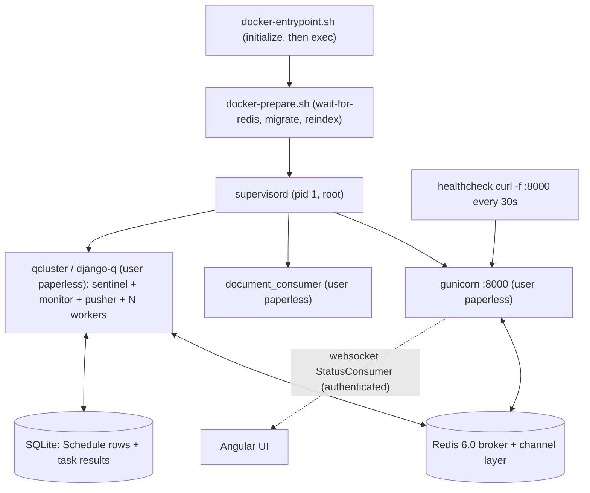

# Paperless-NGX — Idle Runtime Behavior Investigation

**Subject repository:** paperless-ngx
**Commit under investigation:** `542221a38dff06361e07976452f9aea24d210542` (release `1.7.0` — [src/paperless/version.py:L1])
**Task engine:** `django-q` 1.3.9 — a multiprocessing task queue, **not** Celery ([requirements.txt:L37])
**Broker / channel layer:** Redis 6.0 ([docker/compose/docker-compose.sqlite.yml:L29])
**Database:** SQLite (default backend; stores the `django-q` `Schedule` rows and task results)
**Canonical runtime image:** `ghcr.io/scaleapi/swe-atlas:swe_atlas_QnA_paperless-ngx_paperless-ngx_e233ae8334038a4b615ea2e4ce663e30_qna_1.01` (alias tag `andrewparkscaleai/coding-agent:paperless-ngx__paperless-ngx__542221a38dff06361e07976452f9aea24d210542`; image id `sha256:6e699f225ced49182033cf995daf2a07d3628fe29bb573f5aa4c4188c253969f`; immutable digest `ghcr.io/scaleapi/swe-atlas@sha256:d4abe56dd5d1cb2632353baf06e9d80a704f147a70ac2ec15c2b78fc5fddfe15`). The thin derived image built from it in [§2.1](#21-canonical-build-and-run-reproducible-commands) is `paperless-canonical:investigation` (id `sha256:97850f58c6985b2f56e0c4344c7263da071fedd9511d019a1938673e02e4b0d9`).
**Observation host:** Docker 28.5.2 on Linux; investigation performed 2026-07-15 (UTC).

---

## The question (verbatim)

> Get Paperless-NGX running at the specified commit. Once it's idle and stable, what background processes or tasks continue executing automatically? What are the actual log entries that appear periodically showing the system is healthy and ready? I need the specific log messages, their frequency, and what they indicate. Also, if you briefly interrupt and restart part of the system, what specific log messages confirm everything has reconnected and is operational again? What components or processes keep running continuously to maintain Paperless-NGX in a ready state, even when no documents are being processed? You may use temporary helper commands or inspection tools if needed, but don't modify any source files and clean up any temporary artifacts when you're done.

This maps to five sub-questions, each answered by name below: **Q1** startup, **Q2** idle background work, **Q3** periodic health/ready log entries, **Q4** interrupt/restart recovery, **Q5** continuously-running components.

## How to read this document

- **Observed vs. inferred.** Every behavioral claim is backed by *actual, unedited* command output shown in a fenced block immediately next to the claim, together with the exact command that produced it. Claims that are **inferred from reading source code** (rather than observed at runtime) are explicitly labelled *(inferred from source)*.
- **Raw blocks are verbatim.** Fenced blocks are spliced byte-for-byte from captured output; they are never hand-edited. Where a value is randomly generated per boot (the `django-q` cluster display-name and worker PIDs), the surrounding prose flags it as **variable**, but the raw block still shows the concrete value observed in that run.
- **Transcript convention inside fenced blocks.** A line beginning with `$ ` is a command that was run; a line beginning with `$ #` or a trailing `# ...` is an inline annotation (my commentary, not program output). Everything else is unmodified captured output. Where a repeated line's total occurrence count matters (for example the outage's dominant `Error -5` line), the exact count is stated in the surrounding prose or a summary table rather than by editing the captured stream.
- **Canonical vs. non-canonical.** Values are reported from a canonical, supervised run (real `ENTRYPOINT` + `supervisord`, children de-escalated to the `paperless` user, a live Docker healthcheck, a clean runtime checkout). The few environmental deltas versus a byte-identical production deploy are enumerated in [§8](#8-canonical-vs-non-canonical-labelling) and never presented as default behavior.

---

## 1. TL;DR

At this commit Paperless-NGX is a **monolithic, multi-process Django application** run inside one container, in which `supervisord` supervises exactly **three** long-running programs — `gunicorn` (ASGI web server), `document_consumer` (file watcher), and `scheduler` = `qcluster` (the `django-q` cluster) — all de-escalated from root to the `paperless` user ([docker/supervisord.conf:L10-30]). Two external stateful components complete the ready state: the **Redis 6.0** broker/channel-layer and the **SQLite** database.

- **(Q1) Startup.** The real `ENTRYPOINT` runs `docker-entrypoint.sh` → `docker-prepare.sh` (wait-for-Redis → migrate → conditional reindex → conditional superuser) → `exec supervisord`, which spawns the three programs. The system is "ready" when gunicorn logs `Server is ready. Spawning workers` and answers HTTP on `:8000`, the consumer logs its inotify watch line, and the `qcluster` logs `Q Cluster <name> running.` — all observed below.
- **(Q2) Idle background work.** Four `django-q` schedules run automatically: **mail check** every 10 minutes, **classifier training** hourly, **index optimize** daily, **sanity check** weekly ([src/paperless_mail/migrations/0002_auto_20201117_1334.py:L12-14], [src/documents/migrations/1001_auto_20201109_1636.py:L12-18], [src/documents/migrations/1004_sanity_check_schedule.py:L12-13]). The engine driving them is the `qcluster` sentinel, which internally checks for due schedules about twice a minute.
- **(Q3) Periodic health/ready logs.** Two genuinely periodic idle signals exist: the **Docker healthcheck** (`curl -f http://localhost:8000`) fires every ~30 s and is the steady heartbeat; the **mail-check schedule** fires every ~10 min and is the most-frequent `django-q` log activity. Hourly/daily/weekly schedules are reported from configuration (they do not fire in a short window). Between firings the `qcluster` and the idle consumer are silent.
- **(Q4) Interrupt/restart recovery.** `django-q` emits **no literal "reconnected" string**. Recovery from a Redis outage is a *composite, inferred* signature: connection errors during the outage cease, the sentinel logs `reincarnated pusher Process-1:N after sudden death`, a new `Process-1:N pushing tasks at <pid>` appears, and normal schedule enqueue/processing resumes — all captured in [§6](#6-q4--interruptrestart-recovery).
- **(Q5) Continuously-running components.** The three supervised processes plus Redis and SQLite. `supervisord` itself is the *mechanism* that keeps them alive (auto-restart), not a readiness signal.

---

## 2. Environment and method

### 2.1 Canonical build and run (reproducible commands)

The system was built and run at the pinned commit through its **real production entrypoint and command**. The provided dev image is the canonical Python 3.9 / dependency baseline but ships without the process-manager layer of the production image (no `supervisord`, no `/sbin` boot scripts, no `paperless` user). To exercise the canonical boot path faithfully, a thin derived image adds **only** the runtime bits the production `Dockerfile` installs — `supervisor`, `gosu`, `curl`, the `paperless` uid/gid 1000 user, the `/sbin/docker-entrypoint.sh` / `docker-prepare.sh` / `wait-for-redis.py` scripts, `/etc/supervisord.conf`, and the ImageMagick policy — over the unmodified `/app` source tree. The application source is **not** modified (verified clean in [§2.4](#24-runtime-provenance) and [§10](#10-integrity-and-cleanup)).

The single temporary helper artifact is `Dockerfile.canonical`, reproduced **in full** below (it is written, built from, and then deleted at cleanup — see [§10](#10-integrity-and-cleanup)). Every line it adds is a bit the production `Dockerfile` already installs; the `/app` application source is copied out of the base image **unmodified**.

```
# 1) Write the thin derived Dockerfile. It is reproduced here verbatim so this
#    block is self-contained: `docker build -f Dockerfile.canonical` below works
#    with no external file. It adds ONLY the production runtime layer over the
#    UNMODIFIED /app source tree that already ships in the base image.
$ cat > Dockerfile.canonical <<'DOCKERFILE'
# ---------------------------------------------------------------------------
# Derived CANONICAL image for the Paperless-NGX idle-runtime investigation.
#
# It starts FROM the provided canonical dev image (Python 3.9.23 + the exact
# pinned dependency set, /app source tree at commit 542221a38dff) and adds ONLY
# the runtime bits the *production* Dockerfile installs so the REAL production
# ENTRYPOINT (/sbin/docker-entrypoint.sh) + CMD (supervisord) boot path can run.
# The /app application source is NEVER modified: all scripts are copied out of
# the unmodified /app/docker tree that already ships inside the base image.
# ---------------------------------------------------------------------------
ARG BASE_IMAGE=ghcr.io/scaleapi/swe-atlas:swe_atlas_QnA_paperless-ngx_paperless-ngx_e233ae8334038a4b615ea2e4ce663e30_qna_1.01
FROM ${BASE_IMAGE}

USER root

# 1) Subset of the production Dockerfile RUNTIME_PACKAGES needed for a faithful
#    canonical run: gosu (privilege drop), curl (the healthcheck), libzbar0
#    (documents/tasks.py imports pyzbar at module load, else qcluster workers
#    crash), poppler-utils + pngquant (active-processing fidelity; harmless idle).
RUN apt-get update \
 && apt-get install -y --no-install-recommends gosu curl libzbar0 poppler-utils pngquant \
 && rm -rf /var/lib/apt/lists/*

# 2) The production process manager.
RUN pip install --no-cache-dir supervisor

# 3) The unprivileged application user. Production runs everything as paperless
#    (uid/gid 1000). The dev image already has uid/gid 1000 (as "testuser"); rename
#    it to paperless so gosu/supervisord user=paperless resolve and /app (owned by
#    uid 1000) is paperless-owned - identical ownership to production.
RUN usermod -l paperless -d /app testuser \
 && groupmod -n paperless testuser

# 4) Install the production /sbin boot scripts, /etc/supervisord.conf and the
#    ImageMagick policy straight from the UNMODIFIED /app/docker source tree.
RUN cp /app/docker/docker-entrypoint.sh /sbin/docker-entrypoint.sh \
 && cp /app/docker/docker-prepare.sh   /sbin/docker-prepare.sh \
 && cp /app/docker/wait-for-redis.py   /sbin/wait-for-redis.py \
 && chmod 755 /sbin/docker-entrypoint.sh /sbin/docker-prepare.sh /sbin/wait-for-redis.py \
 && cp /app/docker/supervisord.conf     /etc/supervisord.conf \
 && cp /app/docker/imagemagick-policy.xml /etc/ImageMagick-6/policy.xml \
 && mkdir -p /var/log/supervisord /var/run/supervisord /app/consume \
 && chown paperless:paperless /app/consume

# 5) The production boot scripts hardcode /usr/src/paperless/... (the migration
#    flock at /usr/src/paperless/data/migration_lock and the search-index version
#    file), and supervisord launches gunicorn -c /usr/src/paperless/gunicorn.conf.py.
#    Symlink that production path onto the dev image's /app tree.
RUN mkdir -p /usr/src && ln -s /app /usr/src/paperless

# Run manage.py commands from the real source dir so the consumer's watch line is
# /app/src/../consume, exactly as production resolves its consumption directory.
WORKDIR /app/src

ENTRYPOINT ["/sbin/docker-entrypoint.sh"]
EXPOSE 8000
CMD ["/usr/local/bin/supervisord", "-c", "/etc/supervisord.conf"]
DOCKERFILE

# 2) Build the derived canonical image.
$ docker build -f Dockerfile.canonical -t paperless-canonical:investigation .

# 3) A strong, ephemeral admin password (NOT the weak "admin") generated per run
#    and never persisted to the repository.
$ ADMIN_PW="$(python3 -c 'import secrets,string; print("".join(secrets.choice(string.ascii_letters+string.digits) for _ in range(24)))')"

# 4) Broker: the canonical redis:6.0, reachable on the network alias "broker".
$ docker network create paperless-inv-net
$ docker run -d --name paperless-inv-broker --network paperless-inv-net \
      --network-alias broker redis:6.0

# 5) App: launched through the REAL production ENTRYPOINT (/sbin/docker-entrypoint.sh)
#    and CMD (supervisord). The port is published to LOOPBACK only with a dynamic
#    host port (127.0.0.1::8000) so the service is never exposed on all interfaces;
#    the healthcheck from docker-compose.sqlite.yml:L41-45 is replicated via the
#    docker run --health-* flags.
$ docker run -d --name paperless-inv-app --network paperless-inv-net \
      -e PAPERLESS_REDIS=redis://broker:6379 \
      -e PAPERLESS_ADMIN_USER=admin -e PAPERLESS_ADMIN_PASSWORD="$ADMIN_PW" \
      -p 127.0.0.1::8000 \
      --health-cmd 'curl -f http://localhost:8000' \
      --health-interval=30s --health-timeout=10s --health-retries=5 \
      paperless-canonical:investigation
```

The container is launched via `CMD supervisord` ([Dockerfile:L172]) after `ENTRYPOINT /sbin/docker-entrypoint.sh` ([Dockerfile:L168]); the healthcheck flags replicate `docker/compose/docker-compose.sqlite.yml:L41-45` exactly (`curl -f http://localhost:8000`, 30 s interval, 10 s timeout, 5 retries). Note the `Dockerfile` itself contains **no** `HEALTHCHECK` directive — the healthcheck is a compose-layer concern, reproduced here at the `docker run` layer. Two security-hardening choices distinguish this invocation from a naive quick-start: the admin password is a **24-character random secret** (never the literal `admin`), and the port is bound to **`127.0.0.1` only with a dynamic host port** rather than `0.0.0.0:8000`, so the instance is unreachable from other hosts. All evidence commands in this document therefore run **inside** the container via `docker exec`, reaching the server on its in-container `localhost:8000`; the loopback publish exists only so a human can optionally open the UI from the same host.

### 2.2 Idle runtime topology



### 2.3 Method

Per the run-first discipline, the system was brought to a genuine **idle steady state** — no documents in the consumption directory, zero documents in the database, no OCR pipeline running (evidence in [§3.5](#35-idle-preconditions)) — and then observed for **more than 10 minutes** so that at least two 30-second healthcheck cycles and at least one 10-minute mail-check firing were captured live. Hourly/daily/weekly cadences are reported from their seeded schedule migrations because they cannot fire within a short observation window. Cadence figures are derived from timestamped output and confirmed across at least two occurrences. The interrupt/restart experiment (Q4) targets the **Redis broker**, because both the `qcluster` and the Channels websocket layer depend on it, making the reconnection path directly observable.

### 2.4 Runtime provenance

The runtime is canonical Python 3.9, the checkout is exactly the pinned commit, and — critically for the read-only mandate — the runtime working tree is **clean** (no source file was modified during the investigation). Redis is the canonical 6.0 server and is reachable from the app.

```
$ docker exec paperless-inv-app python3 --version
Python 3.9.23
$ docker exec paperless-inv-app git -C /app -c safe.directory=/app rev-parse HEAD
542221a38dff06361e07976452f9aea24d210542
$ docker exec paperless-inv-app git -C /app -c safe.directory=/app status --porcelain
$ docker exec paperless-inv-broker redis-server --version
Redis server v=6.0.20 sha=00000000:0 malloc=jemalloc-5.1.0 bits=64 build=dbdcb1f5eaf1bc2
$ docker exec paperless-inv-app python3 -c "import redis,os; print('PING', redis.from_url(os.environ['PAPERLESS_REDIS']).ping())"
PING True
```

The third command (`git … status --porcelain`) prints **no output at all** — the blank line before the next `$` prompt is the entire result, confirming the runtime `/app` checkout is byte-for-byte clean (the `data/`, `media/` and index artifacts created at boot are git-ignored). The inline `-c safe.directory=/app` is required only because the container process runs as `root` while `/app` is owned by uid 1000 (`paperless`); it changes no repository state.

**Immutable base-image identity (for exact reproduction).** The `ARG BASE_IMAGE` tag embedded in `Dockerfile.canonical` ([§2.1](#21-canonical-build-and-run-reproducible-commands)) pins the human-readable tag; the byte-immutable content is pinned by the local image ID and the registry digest below, so a re-run resolves the *exact* same base image rather than whatever the tag might later point to:

```
$ docker images --no-trunc --format '{{.ID}}' ghcr.io/scaleapi/swe-atlas:swe_atlas_QnA_paperless-ngx_paperless-ngx_e233ae8334038a4b615ea2e4ce663e30_qna_1.01
sha256:6e699f225ced49182033cf995daf2a07d3628fe29bb573f5aa4c4188c253969f
$ docker inspect --format '{{range .RepoDigests}}{{println .}}{{end}}' ghcr.io/scaleapi/swe-atlas:swe_atlas_QnA_paperless-ngx_paperless-ngx_e233ae8334038a4b615ea2e4ce663e30_qna_1.01
ghcr.io/scaleapi/swe-atlas@sha256:d4abe56dd5d1cb2632353baf06e9d80a704f147a70ac2ec15c2b78fc5fddfe15
```

**Worker count is host-derived, not fixed.** `django-q`'s worker count defaults to `default_task_workers()` ([src/paperless/settings.py:L427-436]), which for a host with ≥ 4 cores is `floor(sqrt(cpu_count))`. On this host `multiprocessing.cpu_count()` reports 128, so the formula yields 11 — which exactly matches the 11 `ready for work` workers observed at startup in [§3.4](#34-qcluster--the-django-q-task-engine). This value is **variable** across hosts (e.g. 2 workers at 4 cores, 3 at 9 cores):

```
$ docker exec paperless-inv-app python3 -c \
    "import multiprocessing,math; c=multiprocessing.cpu_count(); \
     print('cpu_count=',c,' floor(sqrt)=',max(math.floor(math.sqrt(c)),1))"
cpu_count= 128  floor(sqrt)= 11
```

---

## 3. Q1 — Startup and reaching idle readiness

**Question:** *Get Paperless-NGX running at the specified commit* — establish the canonical boot sequence and the point at which the system is "ready".

### 3.1 The boot chain (observed)

The container's `ENTRYPOINT` is `/sbin/docker-entrypoint.sh` ([Dockerfile:L168]); it runs an `initialize()` preparation step and then `exec`s the container command (`supervisord`) ([docker/docker-entrypoint.sh:L84-92]). `initialize()` invokes `docker-prepare.sh`, which performs the readiness sequence: wait for Redis, apply migrations, conditionally reindex, conditionally bootstrap a superuser. The complete, unedited boot output of the canonical run — from the entrypoint banner through the last `qcluster` line — was captured with `docker logs`:

```
$ docker logs paperless-inv-app
Paperless-ngx docker container starting...
Creating directory ../export
Creating directory ../data
Creating directory ../data/index
Creating directory ../media
Creating directory ../media/documents
Creating directory ../media/documents/originals
Creating directory ../media/documents/thumbnails
Creating directory /tmp/paperless
Adjusting permissions of paperless files. This may take a while.
Waiting for Redis: redis://broker:6379
Connected to Redis broker: redis://broker:6379
Apply database migrations...
Operations to perform:
  Apply all migrations: admin, auth, authtoken, contenttypes, django_q, documents, paperless_mail, sessions
Running migrations:
  Applying contenttypes.0001_initial... OK
  Applying auth.0001_initial... OK
  Applying admin.0001_initial... OK
  Applying admin.0002_logentry_remove_auto_add... OK
  Applying admin.0003_logentry_add_action_flag_choices... OK
  Applying contenttypes.0002_remove_content_type_name... OK
  Applying auth.0002_alter_permission_name_max_length... OK
  Applying auth.0003_alter_user_email_max_length... OK
  Applying auth.0004_alter_user_username_opts... OK
  Applying auth.0005_alter_user_last_login_null... OK
  Applying auth.0006_require_contenttypes_0002... OK
  Applying auth.0007_alter_validators_add_error_messages... OK
  Applying auth.0008_alter_user_username_max_length... OK
  Applying auth.0009_alter_user_last_name_max_length... OK
  Applying auth.0010_alter_group_name_max_length... OK
  Applying auth.0011_update_proxy_permissions... OK
  Applying auth.0012_alter_user_first_name_max_length... OK
  Applying authtoken.0001_initial... OK
  Applying authtoken.0002_auto_20160226_1747... OK
  Applying authtoken.0003_tokenproxy... OK
  Applying django_q.0001_initial... OK
  Applying django_q.0002_auto_20150630_1624... OK
  Applying django_q.0003_auto_20150708_1326... OK
  Applying django_q.0004_auto_20150710_1043... OK
  Applying django_q.0005_auto_20150718_1506... OK
  Applying django_q.0006_auto_20150805_1817... OK
  Applying django_q.0007_ormq... OK
  Applying django_q.0008_auto_20160224_1026... OK
  Applying django_q.0009_auto_20171009_0915... OK
  Applying django_q.0010_auto_20200610_0856... OK
  Applying django_q.0011_auto_20200628_1055... OK
  Applying django_q.0012_auto_20200702_1608... OK
  Applying django_q.0013_task_attempt_count... OK
  Applying django_q.0014_schedule_cluster... OK
  Applying documents.0001_initial... OK
  Applying documents.0002_auto_20151226_1316... OK
  Applying documents.0003_sender... OK
  Applying documents.0004_auto_20160114_1844... OK
  Applying documents.0005_auto_20160123_0313... OK
  Applying documents.0006_auto_20160123_0430... OK
  Applying documents.0007_auto_20160126_2114... OK
  Applying documents.0008_document_file_type... OK
  Applying documents.0009_auto_20160214_0040... OK
  Applying documents.0010_log... OK
  Applying documents.0011_auto_20160303_1929... OK
  Applying documents.0012_auto_20160305_0040... OK
  Applying documents.0013_auto_20160325_2111... OK
  Applying documents.0014_document_checksum... OK
  Applying documents.0015_add_insensitive_to_match... OK
  Applying documents.0016_auto_20170325_1558... OK
  Applying documents.0017_auto_20170512_0507... OK
  Applying documents.0018_auto_20170715_1712... OK
  Applying documents.0019_add_consumer_user... OK
  Applying documents.0020_document_added... OK
  Applying documents.0021_document_storage_type... OK
  Applying documents.0022_auto_20181007_1420... OK
  Applying documents.0023_document_current_filename... OK
  Applying documents.1000_update_paperless_all... OK
  Applying documents.1001_auto_20201109_1636... OK
  Applying documents.1002_auto_20201111_1105... OK
  Applying documents.1003_mime_types... OK
  Applying documents.1004_sanity_check_schedule... OK
  Applying documents.1005_checksums... OK
  Applying documents.1006_auto_20201208_2209... OK
  Applying documents.1007_savedview_savedviewfilterrule... OK
  Applying documents.1008_auto_20201216_1736... OK
  Applying documents.1009_auto_20201216_2005... OK
  Applying documents.1010_auto_20210101_2159... OK
  Applying documents.1011_auto_20210101_2340... OK
  Applying documents.1012_fix_archive_files... OK
  Applying documents.1013_migrate_tag_colour... OK
  Applying documents.1014_auto_20210228_1614... OK
  Applying documents.1015_remove_null_characters... OK
  Applying documents.1016_auto_20210317_1351... OK
  Applying documents.1017_alter_savedviewfilterrule_rule_type... OK
  Applying documents.1018_alter_savedviewfilterrule_value... OK
  Applying paperless_mail.0001_initial... OK
  Applying paperless_mail.0002_auto_20201117_1334... OK
  Applying paperless_mail.0003_auto_20201118_1940... OK
  Applying paperless_mail.0004_mailrule_order... OK
  Applying paperless_mail.0005_help_texts... OK
  Applying paperless_mail.0006_auto_20210101_2340... OK
  Applying paperless_mail.0007_auto_20210106_0138... OK
  Applying paperless_mail.0008_auto_20210516_0940... OK
  Applying paperless_mail.0009_mailrule_assign_tags... OK
  Applying paperless_mail.0010_auto_20220311_1602... OK
  Applying paperless_mail.0011_remove_mailrule_assign_tag... OK
  Applying paperless_mail.0012_alter_mailrule_assign_tags... OK
  Applying paperless_mail.0009_alter_mailrule_action_alter_mailrule_folder... OK
  Applying paperless_mail.0013_merge_20220412_1051... OK
  Applying paperless_mail.0014_alter_mailrule_action... OK
  Applying sessions.0001_initial... OK
Search index out of date. Updating...

0it [00:00, ?it/s]
0it [00:00, ?it/s]
Created superuser "admin" with provided password.
Executing /usr/local/bin/supervisord -c /etc/supervisord.conf
2026-07-15 04:02:50,542 INFO Set uid to user 0 succeeded
2026-07-15 04:02:50,543 INFO supervisord started with pid 1
2026-07-15 04:02:51,546 INFO spawned: 'consumer' with pid 60
2026-07-15 04:02:51,547 INFO spawned: 'gunicorn' with pid 61
2026-07-15 04:02:51,548 INFO spawned: 'scheduler' with pid 62
[2026-07-15 04:02:52 +0000] [61] [INFO] Starting gunicorn 20.1.0
[2026-07-15 04:02:52 +0000] [61] [INFO] Listening at: http://0.0.0.0:8000 (61)
[2026-07-15 04:02:52 +0000] [61] [INFO] Using worker: paperless.workers.ConfigurableWorker
[2026-07-15 04:02:52 +0000] [61] [INFO] Server is ready. Spawning workers
/usr/local/lib/python3.9/site-packages/whitenoise/base.py:115: UserWarning: No directory at: /app/static/
  warnings.warn(f"No directory at: {root}")
/usr/local/lib/python3.9/site-packages/whitenoise/base.py:115: UserWarning: No directory at: /app/static/
  warnings.warn(f"No directory at: {root}")
/usr/local/lib/python3.9/site-packages/whitenoise/base.py:115: UserWarning: No directory at: /app/static/
  warnings.warn(f"No directory at: {root}")
2026-07-15 04:02:52,709 INFO success: consumer entered RUNNING state, process has stayed up for > than 1 seconds (startsecs)
2026-07-15 04:02:52,709 INFO success: gunicorn entered RUNNING state, process has stayed up for > than 1 seconds (startsecs)
2026-07-15 04:02:52,709 INFO success: scheduler entered RUNNING state, process has stayed up for > than 1 seconds (startsecs)
/usr/local/lib/python3.9/site-packages/whitenoise/base.py:115: UserWarning: No directory at: /app/static/
  warnings.warn(f"No directory at: {root}")
04:02:52 [Q] INFO Q Cluster six-video-lactose-sweet starting.
04:02:52 [Q] INFO Process-1:1 ready for work at 89
04:02:52 [Q] INFO Process-1:2 ready for work at 90
04:02:52 [Q] INFO Process-1:3 ready for work at 91
04:02:52 [Q] INFO Process-1:4 ready for work at 92
04:02:52 [Q] INFO Process-1:5 ready for work at 93
04:02:52 [Q] INFO Process-1:6 ready for work at 94
04:02:52 [Q] INFO Process-1:7 ready for work at 95
04:02:52 [Q] INFO Process-1:8 ready for work at 96
04:02:52 [Q] INFO Process-1:9 ready for work at 97
04:02:52 [Q] INFO Process-1:10 ready for work at 98
04:02:52 [Q] INFO Process-1:11 ready for work at 99
04:02:52 [Q] INFO Process-1:12 monitoring at 100
04:02:52 [Q] INFO Process-1 guarding cluster six-video-lactose-sweet
04:02:52 [Q] INFO Process-1:13 pushing tasks at 101
04:02:52 [Q] INFO Q Cluster six-video-lactose-sweet running.
[2026-07-15 04:02:52,905] [INFO] [paperless.management.consumer] Using inotify to watch directory for changes: /app/src/../consume
```

Reading this output as a cause→effect chain:

1. **Entrypoint preparation.** `Paperless-ngx docker container starting...` and the `Creating directory ...` / `Adjusting permissions ...` lines are emitted by `docker-entrypoint.sh` before hand-off.
2. **Redis gate.** `Waiting for Redis: redis://broker:6379` followed by `Connected to Redis broker: redis://broker:6379` is `docker/wait-for-redis.py` confirming the broker is reachable before anything else starts ([docker/wait-for-redis.py:L21] and [docker/wait-for-redis.py:L41]). The retry policy is 5 attempts × 5 s with a fail-fast exit on exhaustion ([docker/wait-for-redis.py:L16-17]).
3. **Migrations (always run).** `Apply database migrations...` ([docker/docker-prepare.sh:L44]) precedes `manage.py migrate` ([docker/docker-prepare.sh:L45]); the migration list confirms the four schedule-seeding migrations are applied — `documents.1001_auto_20201109_1636` (classifier HOURLY + index DAILY), `documents.1004_sanity_check_schedule` (WEEKLY), and `paperless_mail.0002_auto_20201117_1334` (mail every 10 min). These seed the `django-q` `Schedule` rows enumerated in [§4.1](#41-the-four-seeded-schedules).
4. **Reindex — *conditional branch*.** `Search index out of date. Updating...` ([docker/docker-prepare.sh:L54-55]) runs **only** when the Whoosh index is missing or stale. In this fresh-volume run it fired and reindexed an empty corpus (`0it [00:00, ?it/s]`); on a warm restart with a current index this line does **not** appear.
5. **Superuser — *conditional branch*.** `Created superuser "admin" with provided password.` ([docker/docker-prepare.sh:L60-63]) appears **only** because `PAPERLESS_ADMIN_USER`/`PAPERLESS_ADMIN_PASSWORD` were supplied and the user did not yet exist; without those variables, or on a restart where the user exists, this line is absent.
6. **Hand-off to `supervisord`.** `Executing /usr/local/bin/supervisord -c /etc/supervisord.conf` is the `exec` in `docker-entrypoint.sh` ([docker/docker-entrypoint.sh:L84-92]). `supervisord started with pid 1` then `spawned: 'consumer' / 'gunicorn' / 'scheduler'` shows `supervisord` launching the three supervised programs defined in [docker/supervisord.conf:L10-30].

Everything after the hand-off is the three programs coming up — detailed next. The startup is therefore **deterministic in structure** but has **two conditional branches** (reindex, superuser) that depend on volume/environment state. Two ordering/artifact notes on the raw output above:

- The consumer's `Using inotify to watch directory for changes: /app/src/../consume` line lands **after** `Q Cluster … running.` here (timestamp `04:02:52,905`). The three supervised programs start concurrently and write to the same shared stdout, so the **relative interleaving** of their readiness lines varies run to run; the individual lines and their meanings do not.
- The repeated `whitenoise … UserWarning: No directory at: /app/static/` lines are a **non-canonical artifact** of this derived image, which does not run `collectstatic` (the production `Dockerfile` does, at build time, so `/app/static/` exists and the warning does not appear). It is cosmetic — WhiteNoise still serves the app — and has no bearing on any idle-runtime behavior investigated here. It is disclosed as an environmental delta in [§8](#8-canonical-vs-non-canonical-labelling).

### 3.2 Web server readiness — `gunicorn`

`gunicorn` starts, binds `0.0.0.0:8000` ([gunicorn.conf.py:L3]), selects the `paperless.workers.ConfigurableWorker` class ([gunicorn.conf.py:L5]), and its `when_ready` hook logs `Server is ready. Spawning workers` ([gunicorn.conf.py:L17-18]). Precisely, that message is the **master** process signalling it has bound the socket and is about to fork workers — it is *master* readiness, not proof that a worker has served a request. Full request-serving readiness is confirmed independently by (a) the two `gunicorn` worker processes existing under the master (PIDs 64/65 under master 61 in the process tree, [§3.6](#36-supervised-process-tree-non-root)) and (b) a live HTTP probe returning `302 Found` → `/accounts/login/` (an unauthenticated GET is redirected to login, which is the expected ready response):

```
$ docker exec paperless-inv-app curl -sS -o /dev/null -w "http_code=%{http_code}\n" http://localhost:8000
http_code=302
$ docker exec paperless-inv-app curl -f -s -o /dev/null http://localhost:8000 ; echo "exit=$?"
exit=0
$ docker exec paperless-inv-app curl -sS -I http://localhost:8000
HTTP/1.1 302 Found
date: Wed, 15 Jul 2026 04:11:50 GMT
server: uvicorn
content-type: text/html; charset=utf-8
location: /accounts/login/?next=/
x-frame-options: SAMEORIGIN
content-length: 0
vary: Accept-Language, Origin, Cookie
content-language: en-us
x-content-type-options: nosniff
referrer-policy: same-origin
cross-origin-opener-policy: same-origin
```

The `302` to `/accounts/login/?next=/` and the `curl -f` exit `0` are what the Docker healthcheck relies on every 30 s ([§5.1](#51-the-docker-healthcheck--the-steady-heartbeat-30-s)). All three probes run **inside** the container (`docker exec`), reaching the server on its in-container `localhost:8000`; per [§2.1](#21-canonical-build-and-run-reproducible-commands) the host port is loopback-only and dynamic, so this is the F-05-safe way to probe readiness.

### 3.3 File-watcher readiness — `document_consumer`

The consumer's readiness line is `Using inotify to watch directory for changes: /app/src/../consume`, emitted once at startup by `handle_inotify()` ([src/documents/management/commands/document_consumer.py:L200]). This is the **inotify** path, selected by default: the command uses the kernel inotify backend via `inotifyrecursive.INotify` ([src/documents/management/commands/document_consumer.py:L20]; `inotifyrecursive==0.3.5`, [requirements.txt:L54]) whenever `PAPERLESS_CONSUMER_POLLING` is `0` (the default). The `watchdog` `PollingObserver` ([src/documents/management/commands/document_consumer.py:L17]) is a **fallback** used only when polling is explicitly configured, in which case the line would instead read `Polling directory for changes: ...` ([src/documents/management/commands/document_consumer.py:L186]). After emitting its watch line the consumer is **silent while idle**; it logs `Adding <filepath> to the task queue.` ([src/documents/management/commands/document_consumer.py:L85]) only when a file actually arrives — which never happens in the idle scenario.

### 3.4 `qcluster` — the `django-q` task engine

The scheduler program is `manage.py qcluster` ([docker/supervisord.conf:L28-29]), which boots the `django-q` cluster. Its canonical startup sequence (the 16 `[Q]` lines in the boot log above) is:

- `Q Cluster <name> starting.` — the cluster begins. `<name>` is a **randomly generated humanized display-name** (here `six-video-lactose-sweet`); it is regenerated every boot and must be treated as variable. It is **distinct** from the configured internal cluster name `paperless` ([src/paperless/settings.py:L450]), which is the salt/queue identity, not the display-name.
- `Process-1:1` … `Process-1:11 ready for work at <pid>` — **11 worker processes**, matching `floor(sqrt(128)) = 11` from [§2.4](#24-runtime-provenance). The count is host-derived and variable.
- `Process-1:12 monitoring at <pid>` — the **monitor**, which drains the result queue and logs `Processed [<id>]` when a task result returns.
- `Process-1 guarding cluster <name>` — the **sentinel/guard**, running inside the main `Process-1`. This is the component that periodically checks for due schedules (about twice a minute) and enqueues them (see [§5.2](#52-the-scheduler-firing--every-10-minutes)).
- `Process-1:13 pushing tasks at <pid>` — the **pusher**, which *dequeues* broker tasks and hands them to workers. (The pusher does **not** create scheduled tasks; that is the sentinel's job. Conflating the two is a common error corrected throughout this document.)
- `Q Cluster <name> running.` — the cluster is fully up.

*(Upstream corroboration that these strings and roles are library-canonical for `django-q` 1.3.x — not Paperless customizations — is given in [§8](#8-canonical-vs-non-canonical-labelling).)* The `HH:MM:SS [Q] LEVEL message` format is `django-q`'s own console format and is distinct from Paperless's `[{asctime}] [{levelname}] [{name}] {message}` verbose format ([src/paperless/settings.py:L378]).

### 3.5 Idle preconditions

"Idle" here means no ingestion is in flight: the consumption directory is empty and the database contains zero documents, so no OCR/classification pipeline is running. This was verified before capturing the periodic signals:

```
$ docker exec paperless-inv-app sh -c "ls -A /app/consume/ | wc -l"
0
$ docker exec paperless-inv-app python3 manage.py shell -c "from documents.models import Document; print(Document.objects.count())"
0
```

### 3.6 Supervised process tree (non-root)

At idle, `supervisord` (pid 1, root) supervises exactly three children, **all de-escalated to the unprivileged `paperless` user** per `user=paperless` in each program block ([docker/supervisord.conf:L12], [docker/supervisord.conf:L21], [docker/supervisord.conf:L30]). The children in turn own their subordinate processes (the two gunicorn workers; the `django-q` worker pool). Ownership and command lines were read directly from `/proc` with a small reader that prints its own header and skips its own PID:

```
$ docker exec -i paperless-inv-app python3 - <<'PY'
import os, pwd
me = os.getpid()
rows=[]
for pid in sorted(int(p) for p in os.listdir('/proc') if p.isdigit()):
    if pid == me:            # skip this reader process itself
        continue
    try:
        with open(f'/proc/{pid}/status') as f:
            st=dict(l.split(':',1) for l in f if ':' in l)
        ppid=int(st['PPid'].strip()); uid=int(st['Uid'].split()[0])
        user=pwd.getpwuid(uid).pw_name
        with open(f'/proc/{pid}/cmdline','rb') as f:
            cmd=f.read().replace(b'\x00',b' ').decode(errors='replace').strip()
        if cmd:
            rows.append((pid,ppid,user,cmd))
    except (FileNotFoundError, ProcessLookupError):
        continue
print(f"{'PID':>5} {'PPID':>5} {'USER':<9} CMD")
for pid,ppid,user,cmd in rows:
    print(f"{pid:>5} {ppid:>5} {user:<9} {cmd}")
PY
  PID  PPID USER      CMD
    1     0 root      /usr/local/bin/python3.9 /usr/local/bin/supervisord -c /etc/supervisord.conf
   60     1 paperless python3 manage.py document_consumer
   61     1 paperless /usr/local/bin/python3.9 /usr/local/bin/gunicorn -c /usr/src/paperless/gunicorn.conf.py paperless.asgi:application
   62     1 paperless python3 manage.py qcluster
   64    61 paperless /usr/local/bin/python3.9 /usr/local/bin/gunicorn -c /usr/src/paperless/gunicorn.conf.py paperless.asgi:application
   65    61 paperless /usr/local/bin/python3.9 /usr/local/bin/gunicorn -c /usr/src/paperless/gunicorn.conf.py paperless.asgi:application
   88    62 paperless python3 manage.py qcluster
   94    88 paperless python3 manage.py qcluster
   95    88 paperless python3 manage.py qcluster
   96    88 paperless python3 manage.py qcluster
   97    88 paperless python3 manage.py qcluster
   98    88 paperless python3 manage.py qcluster
   99    88 paperless python3 manage.py qcluster
  100    88 paperless python3 manage.py qcluster
  101    88 paperless python3 manage.py qcluster
  122    88 paperless python3 manage.py qcluster
  123    88 paperless python3 manage.py qcluster
  124    88 paperless python3 manage.py qcluster
  125    88 paperless python3 manage.py qcluster
  466    88 paperless python3 manage.py qcluster
```

This is the canonical process model: root is held only by the `supervisord` supervisor (pid 1); every application process — the web server and its two workers (`64`/`65` under master `61`), the file watcher (`60`), and the entire `qcluster` (launcher `62` → sentinel `88` → the worker pool) — runs as `paperless`. The sentinel (`88`) parents exactly **13** subordinate `manage.py qcluster` processes: the **11 workers**, the **monitor** (`100`), and the **pusher** (`101`) described in [§3.4](#34-qcluster--the-django-q-task-engine). Individual worker PIDs **rotate** as `django-q` recycles workers after they finish tasks (e.g. `466` is a later replacement for an earlier catch-up-burst worker), so the *count and topology* are stable but the specific PIDs are variable. The Docker healthcheck configuration is live (non-null) and reports the container healthy:

```
$ docker inspect -f 'Healthcheck.Test={{.Config.Healthcheck.Test}}
Interval={{.Config.Healthcheck.Interval}} Timeout={{.Config.Healthcheck.Timeout}} Retries={{.Config.Healthcheck.Retries}}
Health.Status={{.State.Health.Status}} FailingStreak={{.State.Health.FailingStreak}}' paperless-inv-app
Healthcheck.Test=[CMD-SHELL curl -f http://localhost:8000]
Interval=30s Timeout=10s Retries=5
Health.Status=healthy FailingStreak=0
```

---

## 4. Q2 — Idle background work (what runs automatically)

**Question:** *Once it's idle and stable, what background processes or tasks continue executing automatically?*

Two layers answer this: the **scheduled tasks** (data-driven, stored in the DB) and the **engine** that runs them (the `qcluster`). No document-processing work runs while idle — only the scheduler's own housekeeping.

### 4.1 The four seeded schedules

Four `django-q` `Schedule` rows are seeded by migrations at startup and drive all automatic idle work. They were read directly from the database:

```
$ docker exec paperless-inv-app python3 manage.py shell -c "
from django_q.models import Schedule
print('schedule_type choices:', [c for c in Schedule._meta.get_field('schedule_type').choices])
print()
print(f\"{'id':>2}  {'name':<26} {'type':<4} {'minutes':>7} {'repeats':>7}  {'func'}\")
for s in Schedule.objects.all().order_by('id'):
    print(f'{s.id:>2}  {s.name:<26} {s.schedule_type:<4} {str(s.minutes):>7} {s.repeats:>7}  {s.func}')
"
schedule_type choices: [('O', 'Once'), ('I', 'Minutes'), ('H', 'Hourly'), ('D', 'Daily'), ('W', 'Weekly'), ('M', 'Monthly'), ('Q', 'Quarterly'), ('Y', 'Yearly'), ('C', 'Cron')]

id  name                       type minutes repeats  func
 1  Train the classifier       H       None      -2  documents.tasks.train_classifier
 2  Optimize the index         D       None      -2  documents.tasks.index_optimize
 3  Perform sanity check       W       None      -2  documents.tasks.sanity_check
 4  Check all e-mail accounts  I         10      -4  paperless_mail.tasks.process_mail_accounts
```

Mapping the `type` code (legend above) and seed migration to a human cadence:

| Schedule name | `type` | Cadence | Task function | Seeded by |
|---|---|---|---|---|
| `Check all e-mail accounts` | `I` = Minutes, `minutes=10` | **every 10 minutes** | `paperless_mail.tasks.process_mail_accounts` ([src/paperless_mail/tasks.py:L11]) | [src/paperless_mail/migrations/0002_auto_20201117_1334.py:L12-14] |
| `Train the classifier` | `H` = Hourly | **every hour** | `documents.tasks.train_classifier` ([src/documents/tasks.py:L48]) | [src/documents/migrations/1001_auto_20201109_1636.py:L12-13] |
| `Optimize the index` | `D` = Daily | **every day** | `documents.tasks.index_optimize` ([src/documents/tasks.py:L32]) | [src/documents/migrations/1001_auto_20201109_1636.py:L17-18] |
| `Perform sanity check` | `W` = Weekly | **every week** | `documents.tasks.sanity_check` ([src/documents/tasks.py:L255]) | [src/documents/migrations/1004_sanity_check_schedule.py:L12-13] |

*(The `repeats` field is a negative internal run-counter; a negative value means "repeat unlimited" and does not stop the schedule — this is why it simply decrements each run, e.g. mail reached `-4` after 3 firings.)* Only the **mail check** (10 min) fires within a short observation window; the hourly/daily/weekly cadences are reported from this configuration because they cannot fire in a ~20-minute window.

### 4.2 The engine that runs them — `qcluster`

The schedules are executed by the always-on `qcluster` process (`django-q`). Its sentinel (the main `Process-1`, shown `guarding cluster` in [§3.4](#34-qcluster--the-django-q-task-engine)) wakes on a short internal loop and, about **twice a minute**, runs the scheduler function that checks the `Schedule` table for anything due. Upstream `django-q` documentation states this explicitly: *"Twice a minute the scheduler checks for any scheduled tasks that should be starting"* (see [§8](#8-canonical-vs-non-canonical-labelling)). This is corroborated at runtime: the cluster reported `running.` at `04:02:52` and the very first schedule check fired at `04:03:22` — almost exactly **30 s** later.

At first boot the four schedules are **already overdue**, which triggers a one-time catch-up burst. The cause is **not** a hard-coded 2020 date — it is how `django-q` assigns `next_run`. The seed migrations call `schedule(...)` **without** a `next_run` argument, and `django-q` defaults `next_run` to `timezone.now()` *at the moment the migration runs* — i.e. container-boot time: `next_run = models.DateTimeField(default=timezone.now, null=True)` in `django_q/models.py`, and `schedule()`'s `next_run = kwargs.pop("next_run", timezone.now())` in `django_q/tasks.py` *(inferred from source)*. The `2020` in the migration filenames (`0002_auto_20201117_1334`, `1001_auto_20201109_1636`) is only each migration's **authoring date**, not the schedule time. Observed: every stored `next_run` is anchored at the migration/boot instant (here `2026-07-15T04:02:46`), never 2020:

```
$ docker exec paperless-inv-app python3 manage.py shell -c "
from django_q.models import Schedule
for s in Schedule.objects.all().order_by('id'):
    print(f'{s.name:<26} type={s.schedule_type} next_run={s.next_run.isoformat()}')
"
Train the classifier       type=H next_run=2026-07-15T05:02:46.197177+00:00
Optimize the index         type=D next_run=2026-07-16T04:02:46.198456+00:00
Perform sanity check       type=W next_run=2026-07-22T04:02:46.271660+00:00
Check all e-mail accounts  type=I next_run=2026-07-15T04:32:46.740115+00:00
```

Each value is `migration_time + N×interval` after N firings. The three non-mail schedules had each fired exactly **once** (the catch-up), so subtracting one interval recovers their shared initial `next_run`: classifier `05:02:46 − 1 h`, index `07-16 04:02:46 − 1 day`, sanity `07-22 04:02:46 − 1 week` — all `2026-07-15T04:02:46`, the migration instant (~6 s before the cluster's `running.` at `04:02:52`, ~36 s before the first scheduler pass at `04:03:22`). The mail row is likewise anchored (`04:32:46 = 04:02:46 + 3×10 min` after 3 firings). With `catch_up` set to `False` ([src/paperless/settings.py:L451]), `django-q` runs each overdue schedule **once** at the first pass and advances it to its normal cadence — it does **not** replay every missed interval. This produces a **one-time catch-up burst** ~30 s after `running.` in which all four schedules fire together:

```
$ docker logs paperless-inv-app 2>&1 | grep "\[Q\]" | awk '$1 >= "04:03:22" && $1 <= "04:03:28"'
04:03:22 [Q] INFO Enqueued 1
04:03:22 [Q] INFO Process-1 created a task from schedule [Train the classifier]
04:03:22 [Q] INFO Enqueued 1
04:03:22 [Q] INFO Process-1 created a task from schedule [Optimize the index]
04:03:22 [Q] INFO Process-1:1 processing [tango-harry-glucose-india]
04:03:22 [Q] INFO Process-1:2 processing [cola-two-uranus-october]
04:03:22 [Q] INFO Enqueued 1
04:03:22 [Q] INFO Process-1 created a task from schedule [Perform sanity check]
04:03:22 [Q] INFO Process-1:3 processing [early-failed-sweet-cup]
04:03:22 [Q] INFO Enqueued 1
04:03:22 [Q] INFO Process-1 created a task from schedule [Check all e-mail accounts]
04:03:22 [Q] INFO Process-1:4 processing [uranus-mobile-twenty-nebraska]
04:03:22 [Q] INFO Process-1:4 stopped doing work
04:03:22 [Q] INFO Processed [uranus-mobile-twenty-nebraska]
04:03:22 [Q] INFO Process-1:3 stopped doing work
04:03:22 [Q] INFO Process-1:1 stopped doing work
04:03:22 [Q] INFO Processed [early-failed-sweet-cup]
04:03:22 [Q] INFO Process-1:2 stopped doing work
04:03:22 [Q] INFO Processed [tango-harry-glucose-india]
04:03:22 [Q] INFO Processed [cola-two-uranus-october]
04:03:22 [Q] INFO recycled worker Process-1:1
04:03:22 [Q] INFO Process-1:14 ready for work at 122
04:03:22 [Q] INFO recycled worker Process-1:3
04:03:22 [Q] INFO Process-1:15 ready for work at 123
04:03:23 [Q] INFO recycled worker Process-1:2
04:03:23 [Q] INFO Process-1:16 ready for work at 124
04:03:23 [Q] INFO recycled worker Process-1:4
04:03:23 [Q] INFO Process-1:17 ready for work at 125
```

This burst is a **startup artifact, not the steady state**. Note the worker lifecycle within it: each task is enqueued (`Enqueued 1`), created from its schedule by the sentinel (`Process-1 created a task from schedule [...]`), picked up by a numbered worker (`Process-1:N processing [...]`), completed (`Processed [...]`), and then the worker is **recycled** (`recycled worker Process-1:N` → a fresh `Process-1:M ready for work`) because `recycle` is `1` ([src/paperless/settings.py:L452], recycle after each task). After this one burst the system settles into its steady cadence (see [§5](#5-q3--periodic-healthready-log-entries)).

### 4.3 What each idle task actually does

- **`process_mail_accounts`** iterates `MailAccount.objects.all()`; with no mail accounts configured it does no network I/O and returns the fixed string `No new documents were added.` ([src/paperless_mail/tasks.py:L11-22]). This return value is stored as the task's result row in the DB (not printed to stdout), and was read back directly with the Django shell — one row per firing:

```
$ docker exec paperless-inv-app python3 manage.py shell -c "
from django_q.models import Task
qs = Task.objects.filter(func='paperless_mail.tasks.process_mail_accounts').order_by('started')
print('count=', qs.count())
for t in qs:
    print(f'{t.started.strftime(\"%H:%M:%S\")}  success={t.success}  result={t.result!r}')
"
count= 3
04:03:22  success=True  result='No new documents were added.'
04:12:53  success=True  result='No new documents were added.'
04:22:55  success=True  result='No new documents were added.'
```

The three rows correspond one-to-one to the three firings timed in [§5.2](#52-the-scheduler-firing--every-10-minutes) (the `04:03:22` catch-up plus the two steady firings), every one `success=True` with the fixed idle result.

- **`train_classifier`** ([src/documents/tasks.py:L48]) retrains the document classifier; with no documents/tags it has nothing to learn and exits quickly.
- **`index_optimize`** ([src/documents/tasks.py:L32]) optimizes the Whoosh full-text index.
- **`sanity_check`** ([src/documents/tasks.py:L255]) verifies stored documents against checksums; with an empty corpus it is a no-op.

While idle, therefore, the only *logged* automatic work is this lightweight, data-free scheduler housekeeping — dominated by the 10-minute mail check. Below the log line, however, the cluster performs **continuous sub-second Redis polling** that never appears in the application log; that traffic is characterised in [§4.4](#44-continuous-broker-housekeeping-redis-wire-level).

### 4.4 Continuous broker housekeeping (Redis wire level)

The `qcluster`'s scheduled firings are ~10 minutes apart and the application log is silent between them ([§5.4](#54-between-firings-silence)), but the cluster is **not** dormant at the network level. Even with no documents and no tasks due, it maintains two continuous, automatic Redis operations. These are invisible in stdout/stderr and were observed only by attaching `redis-cli MONITOR` to the broker for a fixed 15-second window (the `timeout` wrapper exits `124` when it kills the still-running `MONITOR`, which is expected):

```
$ docker exec paperless-inv-broker sh -c 'timeout 15 redis-cli MONITOR' > monitor15.log; echo "exit=$?"
exit=124
$ grep -oE '"[A-Z]+"' monitor15.log | sort | uniq -c | sort -rn
     30 "SET"
     30 "EX"
     15 "BLPOP"
$ grep '"SET"' monitor15.log | head -1
1784089844.067849 [0 172.18.0.3:54744] "SET" "django_q:paperless:cluster:1c7e42e8-443a-45d5-8616-34d0c3f3ca2d" ".eJxVUUFr... (signed cluster-status payload) ..." "EX" "3"
$ grep '"BLPOP"' monitor15.log | head -1
1784089844.530385 [0 172.18.0.3:54758] "BLPOP" "django_q:paperless:q" "1"
```

- **`SET django_q:paperless:cluster:<uuid> <signed-payload> EX 3`** — the cluster **status heartbeat**. The sentinel republishes a signed status blob (worker count, PIDs, task counters) with a 3-second TTL so a stale cluster self-expires. Observed **30 times in 15 s ≈ 2 writes/second** (~0.5 s apart). The `<uuid>` is the per-boot cluster id and is **variable**.
- **`BLPOP django_q:paperless:q 1`** — the **task-queue poll**. The pusher does a *blocking* left-pop on the broker queue with a **1-second** timeout; when nothing is enqueued it simply times out and re-issues, which is why it recurs about **once per second** (15 in 15 s). This is the mechanism that lets a newly-enqueued task be picked up near-instantly without busy-spinning the CPU.

Both keys use the **internal** cluster name `paperless` (from `Q_CLUSTER["name"]`, [src/paperless/settings.py:L450]), *not* the random per-boot display name (`six-video-lactose-sweet`). This sub-second polling is the true "always doing something" answer to Q2 at the wire level, complementing the once-per-10-minute *logged* activity: the cluster is continuously ready to dequeue work, it simply logs nothing until a schedule fires.

---

## 5. Q3 — Periodic health/ready log entries

**Question:** *What are the actual log entries that appear periodically showing the system is healthy and ready? I need the specific log messages, their frequency, and what they indicate.*

At idle there are exactly **two** genuinely periodic signals: the container **healthcheck** (the steady ~30 s heartbeat) and the **scheduler firing** (the ~10 min mail check — the most frequent `django-q` activity). Everything else is silent between firings.

### 5.1 The Docker healthcheck — the steady heartbeat (~30 s)

**Message / mechanism:** the healthcheck runs `curl -f http://localhost:8000` against gunicorn every 30 seconds, defined in `docker/compose/docker-compose.sqlite.yml:L41-45` (`test: curl -f http://localhost:8000`, `interval: 30s`, `timeout: 10s`, `retries: 5`). It is the primary periodic *liveness* signal and the reason the container reports `healthy`. It executes automatically — the history below is Docker's own record of probe executions (Docker retains the last five), not a manual `curl`. A Go-template over `.State.Health.Log` prints each probe's start time and exit code:

```
$ docker inspect -f '{{.State.Health.Status}} FailingStreak={{.State.Health.FailingStreak}}{{range .State.Health.Log}}
{{.Start}}  exit={{.ExitCode}}{{end}}' paperless-inv-app
healthy FailingStreak=0
2026-07-15 04:26:47.359011842 +0000 UTC  exit=0
2026-07-15 04:27:17.446311446 +0000 UTC  exit=0
2026-07-15 04:27:47.514394672 +0000 UTC  exit=0
2026-07-15 04:28:17.592308190 +0000 UTC  exit=0
2026-07-15 04:28:47.685905190 +0000 UTC  exit=0
```

**Frequency:** the observed inter-probe deltas are **~30.08 s** (`04:26:47.359 → 04:27:17.446 = 30.087 s`, then `+30.068 s`, `+30.078 s`, `+30.094 s`). This is expected cause→effect: Docker schedules each probe 30 s after the *previous probe completes*, so the wall-clock delta is `30 s + probe_duration` (here ~80 ms), not a fixed 30.000 s tick. Across the full >20-minute observation every probe returned `exit=0` and `FailingStreak` stayed `0`.

**What it indicates:** gunicorn is bound and serving — an unauthenticated `GET /` returns `302 → /accounts/login/` (shown in [§3.2](#32-web-server-readiness--gunicorn)), which `curl -f` treats as success (exit 0). This is the single most reliable "system is healthy and ready" signal while idle.

### 5.2 The scheduler firing — every ~10 minutes

**Messages:** the most frequent periodic `django-q` log activity at idle is the 10-minute mail-check schedule. Each firing produces this exact sequence (one full steady-state firing shown, plus the timeline of all firings):

```
$ docker logs paperless-inv-app 2>&1 | grep "created a task from schedule \[Check all e-mail accounts\]"
04:03:22 [Q] INFO Process-1 created a task from schedule [Check all e-mail accounts]
04:12:53 [Q] INFO Process-1 created a task from schedule [Check all e-mail accounts]
04:22:55 [Q] INFO Process-1 created a task from schedule [Check all e-mail accounts]

$ docker logs paperless-inv-app 2>&1 | grep "\[Q\]" | awk '$1 >= "04:22:55" && $1 <= "04:22:56"'   # one full steady firing
04:22:55 [Q] INFO Enqueued 1
04:22:55 [Q] INFO Process-1 created a task from schedule [Check all e-mail accounts]
04:22:55 [Q] INFO Process-1:6 processing [july-papa-oklahoma-don]
04:22:55 [Q] INFO Process-1:6 stopped doing work
04:22:55 [Q] INFO Processed [july-papa-oklahoma-don]
04:22:55 [Q] INFO recycled worker Process-1:6
04:22:55 [Q] INFO Process-1:19 ready for work at 792
```

**Per-line meaning and emitting component** (the `Process-N` prefix in each line *is* the emitter, so these attributions are observed, not assumed):

- `Enqueued 1` — a task was pushed onto the Redis broker queue; emitted by `django-q`'s `async_task()` running inside the sentinel/main process ([requirements.txt:L37], `django-q==1.3.9`).
- `Process-1 created a task from schedule [Check all e-mail accounts]` — the **sentinel** (`Process-1`) matched a due `Schedule` row and created the task. `Process-1` (no worker suffix) identifies the main/guard process.
- `Process-1:6 processing [july-papa-oklahoma-don]` — a **worker** child (here #6) dequeued and executed the task. The task id (`july-papa-oklahoma-don`) is randomly generated per task and is **variable**.
- `Processed [july-papa-oklahoma-don]` — the **monitor** process recorded the completed result to the DB *(the emitter here is inferred from the `django-q` source, since this line carries no `Process-N` prefix)*.
- `recycled worker Process-1:6` → `Process-1:19 ready for work at 792` — the sentinel recycled the worker after its one task (`recycle=1`, [src/paperless/settings.py:L452]) and spawned a replacement.

**Frequency:** the three observed firings were at `04:03:22`, `04:12:53`, and `04:22:55`. The two consecutive **steady-state** firings are `04:12:53 → 04:22:55 = 10 m 02 s ≈ 10 minutes`, matching `minutes=10` ([src/paperless_mail/migrations/0002_auto_20201117_1334.py:L12-14]). (The first-to-second gap, `04:03:22 → 04:12:53 = 9 m 31 s`, is shorter because the first firing was the catch-up burst pinned to a 30-second check boundary rather than the schedule's own `next_run`.)

**What it indicates:** the task engine is alive and the scheduler is firing on cadence — i.e. background scheduling is healthy. With no mail accounts configured the task itself returns `No new documents were added.` ([§4.3](#43-what-each-idle-task-actually-does)).

### 5.3 One-time catch-up vs. steady state (disambiguation)

The `04:03:22` burst in which **all four** schedules fired is the **one-time startup catch-up** described in [§4.2](#42-the-engine-that-runs-them--qcluster) — it is not periodic. In steady state only the mail check recurs (every ~10 min); the hourly/daily/weekly schedules will each fire once when their configured interval elapses, which is outside a short observation window. There is therefore no contradiction between "all four fired at startup" and "only the mail check recurs frequently": the former is catch-up, the latter is steady cadence.

### 5.4 Between firings: silence

Crucially, between scheduled firings the `qcluster` emits **nothing** — it is not a chatty heartbeat. This was confirmed by counting `[Q]` log lines in the quiet window between the two steady firings (`04:12:53` and `04:22:55`), using an `awk` string range on the `HH:MM:SS` first field:

```
$ docker logs paperless-inv-app 2>&1 | grep "\[Q\]" | awk '$1 > "04:13:00" && $1 < "04:22:00"' | wc -l
0
```

Zero `[Q]` lines were emitted in the ~9-minute window — the cluster is completely silent between firings.

Likewise the idle `document_consumer` emits nothing after its startup watch line ([§3.3](#33-file-watcher-readiness--document_consumer)). So the only *log* output at idle is the periodic scheduler firings (~10 min); the healthcheck heartbeat (~30 s) is recorded by Docker's health subsystem rather than in the application log stream.

---

## 6. Q4 — Interrupt/restart recovery

**Question:** *If you briefly interrupt and restart part of the system, what specific log messages confirm everything has reconnected and is operational again?*

The interrupt target is the **Redis broker**, because both the `qcluster` (task broker) and the Channels websocket layer depend on it, so a Redis blip exercises the reconnection path directly. The experiment: capture the *before*, *during*, and *after* states around a `docker stop` / `docker start` of the broker.

This experiment was performed on the **same canonical run** documented in §2–§5 (cluster `six-video-lactose-sweet`), but only **after** the ≥10-minute idle observation had completed — the last idle measurement (the `04:22:55` mail firing and the `04:26:47–04:28:47` healthcheck window) was captured well before the first interruption at `04:34:39`, so the idle cadences were not perturbed. Because it is the same run, the cluster name, boot PIDs, and the pusher lineage (`Process-1:13`, born at boot — see [§3.4](#34-qcluster--the-django-q-task-engine)) are continuous with the earlier sections. The interrupt/restart was reproduced across **three consecutive stop/start cycles** (plus a fourth short stop to capture the healthcheck live) specifically to separate the **stable** part of the failure/recovery signature from the **race-dependent** part, per [F-06]. The per-task ids and reincarnated-pusher PIDs shown below are, per the variable-identifier convention, regenerated each time and are examples, not fixed values.

### 6.1 Before — broker up, cluster pushing

```
$ docker ps --filter name=paperless-inv-broker --format "{{.Names}} {{.Status}} {{.Image}}"
paperless-inv-broker Up 5 minutes redis:6.0
$ docker exec paperless-inv-app python3 -c "import redis,os; print('PING', redis.from_url(os.environ['PAPERLESS_REDIS']).ping())"
PING True
$ docker logs paperless-inv-app 2>&1 | grep "pushing tasks at" | head -1   # pusher active since boot
04:02:52 [Q] INFO Process-1:13 pushing tasks at 101
```

The broker is reachable (`PING True`) and the `django-q` pusher `Process-1:13` has been the active task-dequeuer since the `04:02:52` boot ([§3.4](#34-qcluster--the-django-q-task-engine)). This is the steady state the interruption perturbs.

### 6.2 During the outage — the failure signature

Stopping the broker with `docker stop paperless-inv-broker` produces an immediate, continuous error stream from the pusher, which is blocked in `blpop(key, 1)` against the broker. It is important to separate the **stable** part of this signature from the **race-dependent** part ([F-06]):

- **Stable (reproduced identically across all three cycles):** a flood of `[Q] ERROR Error -5 connecting to broker:6379. No address associated with hostname.` — Docker withdraws the stopped container's `broker` DNS alias within ~1 s, so every subsequent reconnect fails name resolution — interleaved with the sentinel reincarnating the dead pusher on a **~10-second cadence**. For a ~55-second outage this totals **114 `[Q] ERROR` lines per cycle** (stable across cycles): ~108 connection failures — `Error -5` dominant at ~107 plus a variable 0–1 `Error 111` — and 6 pusher reincarnations (the per-cycle breakdown is tabulated below).
- **Race-dependent (varies run to run — do NOT over-generalize):** *which* error appears **first**, and whether a transient `Error 111 … Connection refused` (a reconnect hitting the cached-but-dead IP before the DNS alias is withdrawn, or the broker port not yet accepting at restart) appears at all.

Interrupting at **`T0`** (cycle 1, `T0 = 04:34:39`), the dominant `Error -5` stream begins within one second:

```
$ docker stop paperless-inv-broker      # interrupt the broker at T0=04:34:39
$ docker logs paperless-inv-app 2>&1 | grep "\[Q\]" | awk '$1>="04:34:40" && $1<="04:34:44"'
04:34:40 [Q] ERROR Error -5 connecting to broker:6379. No address associated with hostname.
04:34:40 [Q] ERROR Error -5 connecting to broker:6379. No address associated with hostname.
04:34:41 [Q] ERROR Error -5 connecting to broker:6379. No address associated with hostname.
04:34:41 [Q] ERROR Error -5 connecting to broker:6379. No address associated with hostname.
04:34:42 [Q] ERROR Error -5 connecting to broker:6379. No address associated with hostname.
04:34:42 [Q] ERROR Error -5 connecting to broker:6379. No address associated with hostname.
04:34:43 [Q] ERROR Error -5 connecting to broker:6379. No address associated with hostname.
04:34:43 [Q] ERROR Error -5 connecting to broker:6379. No address associated with hostname.
04:34:44 [Q] ERROR Error -5 connecting to broker:6379. No address associated with hostname.
```

Per-cycle error counts (each cycle = a ~55 s `docker stop`, then `docker start`; counts taken over the cycle window with `... | grep -c "<pattern>"`) demonstrate the stable-vs-variable split directly. The **first `[Q] ERROR`** was `Error -5` in all three cycles here, and `Error 111` appeared **1, 1, 0** times — the inverse of an earlier run that caught `Connection closed by server.` first with `Error 111` counts of `0, 0, 1`; that inversion is exactly why the first-error must be treated as variable:

| Cycle | T0 | first `[Q] ERROR` | `Error 111` | `Error -5` | `reincarnated pusher` | total `[Q] ERROR` |
|-------|------|-------------------|-------------|------------|-----------------------|-------------------|
| 1 | 04:34:39 | `Error -5` | 1 | 107 | 6 | 114 |
| 2 | 04:36:07 | `Error -5` | 1 | 107 | 6 | 114 |
| 3 | 04:37:35 | `Error -5` | 0 | 108 | 6 | 114 |

The **stable composite** is thus: `Error -5` dominance (~107/cycle), 6 pusher reincarnations, 114 total `[Q] ERROR` lines — identical across cycles. The **variable** elements are the first-error identity and the `Error 111` count (`1, 1, 0`). The pusher lifecycle during the outage (cycle 1) shows the sentinel reincarnating the dead pusher every ~10 s, the logical id climbing `13 → 21 → 22 → 23 → 24 → 25 → 26`:

```
$ docker logs paperless-inv-app 2>&1 | grep "\[Q\]" | awk '$1>="04:34:39" && $1<="04:35:42"' | grep -E "stopped pushing|reincarnated pusher|pushing tasks at"
04:34:49 [Q] INFO Process-1:13 stopped pushing tasks
04:34:49 [Q] ERROR reincarnated pusher Process-1:13 after sudden death
04:34:49 [Q] INFO Process-1:21 pushing tasks at 1085
04:34:59 [Q] INFO Process-1:21 stopped pushing tasks
04:35:00 [Q] ERROR reincarnated pusher Process-1:21 after sudden death
04:35:00 [Q] INFO Process-1:22 pushing tasks at 1086
04:35:10 [Q] INFO Process-1:22 stopped pushing tasks
04:35:10 [Q] ERROR reincarnated pusher Process-1:22 after sudden death
04:35:10 [Q] INFO Process-1:23 pushing tasks at 1087
04:35:20 [Q] INFO Process-1:23 stopped pushing tasks
04:35:20 [Q] ERROR reincarnated pusher Process-1:23 after sudden death
04:35:20 [Q] INFO Process-1:24 pushing tasks at 1098
04:35:30 [Q] INFO Process-1:24 stopped pushing tasks
04:35:31 [Q] ERROR reincarnated pusher Process-1:24 after sudden death
04:35:31 [Q] INFO Process-1:25 pushing tasks at 1099
04:35:41 [Q] INFO Process-1:25 stopped pushing tasks
04:35:41 [Q] ERROR reincarnated pusher Process-1:25 after sudden death
04:35:41 [Q] INFO Process-1:26 pushing tasks at 1106
```

**Mechanism (cause → effect):** the pusher blocks on `BLPOP` against Redis ([django_q/cluster.py:L345] → `redis_broker.py:L21`); when the broker vanishes the call raises `redis.exceptions.ConnectionError`, the pusher process dies, and the cluster's **sentinel** detects the death and **reincarnates** it (`reincarnated pusher Process-1:N after sudden death`), which is why the logical pusher id climbs on a ~10-second cadence for the duration of the outage. The sentinel itself never dies, so the cluster stays up and keeps retrying.

**Complete traceback.** django-q logs each dequeue failure via `logger.error(e, traceback.format_exc())` ([django_q/cluster.py:L347]). Because the error message carries no `%` placeholder yet a positional argument (the formatted traceback) is supplied, Python's logging layer raises a *benign* `TypeError: not all arguments converted during string formatting`, which prints a `--- Logging error ---` block. That block contains the **complete** exception traceback — the first (inner) traceback is the read-path `Connection closed by server.` failure (`blpop` → `read_response`), and the second is the logging `TypeError` (the earlier draft of this document truncated the inner traceback mid-line at `connection.py:739`; the full, unedited block is shown here):

```
$ docker logs paperless-inv-app 2>&1 | awk '/^--- Logging error ---/{c++} c==1{print} /^Message:/ && c==1{exit}'
--- Logging error ---
Traceback (most recent call last):
  File "/usr/local/lib/python3.9/site-packages/django_q/cluster.py", line 345, in pusher
    task_set = broker.dequeue()
  File "/usr/local/lib/python3.9/site-packages/django_q/brokers/redis_broker.py", line 21, in dequeue
    task = self.connection.blpop(self.list_key, 1)
  File "/usr/local/lib/python3.9/site-packages/redis/client.py", line 1900, in blpop
    return self.execute_command('BLPOP', *keys)
  File "/usr/local/lib/python3.9/site-packages/redis/client.py", line 901, in execute_command
    return self.parse_response(conn, command_name, **options)
  File "/usr/local/lib/python3.9/site-packages/redis/client.py", line 915, in parse_response
    response = connection.read_response()
  File "/usr/local/lib/python3.9/site-packages/redis/connection.py", line 739, in read_response
    response = self._parser.read_response()
  File "/usr/local/lib/python3.9/site-packages/redis/connection.py", line 470, in read_response
    self.read_from_socket()
  File "/usr/local/lib/python3.9/site-packages/redis/connection.py", line 429, in read_from_socket
    raise ConnectionError(SERVER_CLOSED_CONNECTION_ERROR)
redis.exceptions.ConnectionError: Connection closed by server.

During handling of the above exception, another exception occurred:

Traceback (most recent call last):
  File "/usr/local/lib/python3.9/logging/__init__.py", line 1083, in emit
    msg = self.format(record)
  File "/usr/local/lib/python3.9/logging/__init__.py", line 927, in format
    return fmt.format(record)
  File "/usr/local/lib/python3.9/logging/__init__.py", line 663, in format
    record.message = record.getMessage()
  File "/usr/local/lib/python3.9/logging/__init__.py", line 367, in getMessage
    msg = msg % self.args
TypeError: not all arguments converted during string formatting
```

The same benign `TypeError` also surfaces for the `Error -5` variant; across the three cycles the log contained 18 such `--- Logging error ---` blocks (whose `Message:` was 15× `Error -5` and 3× `Connection closed by server.`) alongside the 322 cleanly-formatted `[Q] ERROR Error -5` lines. The `TypeError` is a django-q logging-call defect, **not** a task failure, and does not affect recovery.

**The HTTP tier stayed healthy throughout.** The Docker healthcheck kept returning `exit=0` and `FailingStreak` never rose above `0` — including a probe captured live *inside* an outage window. This is expected: an unauthenticated `GET /` returns `302 → /accounts/login/` (see [§3.2](#32-web-server-readiness--gunicorn)) without touching Redis, so the liveness probe does **not** detect a broker outage:

```
$ docker stop paperless-inv-broker   # broker down at 04:44:13
$ sleep 33; docker inspect -f '{{.State.Health.Status}} FailingStreak={{.State.Health.FailingStreak}}{{range .State.Health.Log}}
{{.Start}}  exit={{.ExitCode}}{{end}}' paperless-inv-app
healthy FailingStreak=0
2026-07-15 04:42:19.963854463 +0000 UTC  exit=0
2026-07-15 04:42:50.046047338 +0000 UTC  exit=0
2026-07-15 04:43:20.129947238 +0000 UTC  exit=0
2026-07-15 04:43:50.219919921 +0000 UTC  exit=0
2026-07-15 04:44:20.306961902 +0000 UTC  exit=0   <- probe INSIDE the outage (broker down since 04:44:13), still exit=0
```

### 6.3 After restart — the recovery signature

Restarting the broker (cycle 1, `docker start` at **`T1 = 04:35:35`**) cleared the fault within ~6 seconds — the recovery latency is bounded by the pusher's ~10-second reincarnation cycle plus the instant Docker re-registers the `broker` DNS alias, not by any application retry timer. The recovery is visible as: the `Error -5` stream stops (its last line here is `04:35:34`); a single transient `Error 111 … Connection refused` may appear at the restart instant (`04:35:35`) while the broker port is still coming up — this is the restart-side of the same race quarantined in §6.2; then the sentinel reincarnates the pusher one last time and the new pusher **successfully begins pushing and persists**:

```
$ docker start paperless-inv-broker     # restart the broker at T1=04:35:35
$ docker logs paperless-inv-app 2>&1 | grep "\[Q\]" | awk '$1>="04:35:33" && $1<="04:35:42"'
04:35:33 [Q] ERROR Error -5 connecting to broker:6379. No address associated with hostname.
04:35:33 [Q] ERROR Error -5 connecting to broker:6379. No address associated with hostname.
04:35:34 [Q] ERROR Error -5 connecting to broker:6379. No address associated with hostname.
04:35:34 [Q] ERROR Error -5 connecting to broker:6379. No address associated with hostname.
04:35:35 [Q] ERROR Error 111 connecting to broker:6379. Connection refused.
04:35:41 [Q] INFO Process-1:25 stopped pushing tasks
04:35:41 [Q] ERROR reincarnated pusher Process-1:25 after sudden death
04:35:41 [Q] INFO Process-1:26 pushing tasks at 1106
$ docker exec paperless-inv-app python3 -c "import redis,os; print('PING', redis.from_url(os.environ['PAPERLESS_REDIS']).ping())"
PING True
```

The decisive line is `Process-1:26 pushing tasks at 1106` — a fresh pusher (django-q logical id `Process-1:26`, OS pid `1106`) that, unlike its ~10 s-lived predecessors during the outage, does **not** die: no `stopped pushing` line follows it (the next `stopped pushing` only appears when cycle 2 stops the broker again at `04:36:07`, 26 s later). Combined with the error stream stopping and `PING True`, this persisting pusher is the "operational again" signal.

### 6.4 There is no literal "reconnected" message

`django-q` (and Paperless) emit **no** explicit "reconnected"/"recovered" log line. Grepping the entire container log confirms it:

```
$ docker logs paperless-inv-app | grep -ic "reconnect"    # is there a literal "reconnected" message?
0
```

Therefore "everything has reconnected and is operational again" is necessarily a **composite, inferred** signature, not a single string. The confirming pattern is: **(1)** connection errors stop; **(2)** `reincarnated pusher Process-1:N after sudden death` followed by a *persisting* `Process-1:M pushing tasks at <pid>`; **(3)** `PING True`; and **(4)** the next scheduled task fires normally (next section).

### 6.5 Operational again — scheduling resumes

Definitive proof that the system is fully operational: after the three interrupt cycles completed (broker back up, `PING True`), the next mail-check schedule fired normally at `04:43:02` with the complete enqueue → create → process → processed → recycle sequence — identical in shape to the steady-state firing in [§5.2](#52-the-scheduler-firing--every-10-minutes), confirming the scheduler resumed on its own with no manual intervention:

```
$ docker logs paperless-inv-app 2>&1 | grep "\[Q\]" | awk '$1>="04:43:02" && $1<="04:43:03"'
04:43:02 [Q] INFO Enqueued 1
04:43:02 [Q] INFO Process-1 created a task from schedule [Check all e-mail accounts]
04:43:02 [Q] INFO Process-1:8 processing [california-spring-connecticut-violet]
04:43:03 [Q] INFO Process-1:8 stopped doing work
04:43:03 [Q] INFO Processed [california-spring-connecticut-violet]
04:43:03 [Q] INFO recycled worker Process-1:8
04:43:03 [Q] INFO Process-1:39 ready for work at 1348
```

### 6.6 Websocket layer impact (observed live)

Because Redis is also the `channels_redis` channel-layer backend, a broker outage also breaks websocket status delivery: the `StatusConsumer` ([src/paperless/consumers.py:L9]) and any `group_send` to the `status_updates` group ([src/paperless/consumers.py:L17-20]) route through the Redis-backed `CHANNEL_LAYERS` ([src/paperless/settings.py:L178-182]). This was **exercised live** (not merely inferred) with a temporary async helper: an authenticated `admin` Django session was created, a real websocket client connected to `ws://localhost:8000/ws/status/`, and a `group_send` to `status_updates` was fired — before, during, and after a Redis outage. The helper (`ws_exp.py`) was removed at cleanup (§10).

The session cookie was minted from the `admin` superuser, then the client (Python `websockets`) connected with a `Cookie: sessionid=<key>` header; delivery was driven by `channel_layer.group_send("status_updates", {"type": "status_update", "data": {...}})`, which the consumer forwards to the client as `json.dumps(event["data"])` ([src/paperless/consumers.py:L30-33]):

```
$ docker exec paperless-inv-app python3 manage.py shell -c "
from django.contrib.auth import get_user_model, SESSION_KEY, BACKEND_SESSION_KEY, HASH_SESSION_KEY
from django.contrib.sessions.backends.db import SessionStore
u = get_user_model().objects.get(username='admin')
s = SessionStore(); s[SESSION_KEY]=str(u.pk)
s[BACKEND_SESSION_KEY]='django.contrib.auth.backends.ModelBackend'
s[HASH_SESSION_KEY]=u.get_session_auth_hash(); s.create()
print('SESSIONID=' + s.session_key)
"
SESSIONID=59wtmbw1nn2wahq1yicpgwkmnk9lb3le

$ # helper: connect ws (authenticated), group_send, recv — with the broker stopped/started between phases
$ PYTHONPATH=/app/src SID=59wtmbw1nn2wahq1yicpgwkmnk9lb3le python3 /tmp/ws_exp.py
BEFORE  handshake         -> ACCEPTED (HTTP 101)
BEFORE  group_send        -> OK
BEFORE  client received   -> {"status": "hello-before"}
DURING  group_send        -> FAILED: gaierror [Errno -5] No address associated with hostname
DURING  new handshake     -> REJECTED: InvalidStatusCode status=500
DURING  existing socket   -> LOST: ConnectionClosedError no close frame received or sent
AFTER   handshake         -> ACCEPTED (HTTP 101)
AFTER   group_send        -> OK
AFTER   client received   -> {"status": "hello-after"}
```

**Observed cause → effect** (reproduced identically across two runs):

- **Before (broker up):** the authenticated handshake is accepted (HTTP 101), `group_send` succeeds, and the client receives the exact payload `{"status": "hello-before"}` — a full round trip.
- **During (broker down):** `group_send` fails with the **same** `gaierror [Errno -5] No address associated with hostname` that broke the task tier in §6.2 (the shared `broker` DNS alias is gone); a **new** websocket handshake is **rejected with HTTP 500** because `StatusConsumer.connect()` calls `group_add` — which needs Redis — before accepting ([src/paperless/consumers.py:L14-20]); and the **pre-existing** socket is **lost** (`ConnectionClosedError: no close frame received or sent`). This confirms the websocket tier depends on Redis exactly as the task tier does.
- **After (broker restarted):** a fresh authenticated round trip succeeds again — handshake accepted, `group_send` OK, client receives `{"status": "hello-after"}`.

The HTTP tier (which the healthcheck probes) is unaffected throughout (§6.2), because plain `GET /` does not touch Redis; only the websocket/channel-layer and task tiers depend on the broker.

---

## 7. Q5 — Continuously-running components

**Question:** *What components or processes keep running continuously to maintain Paperless-NGX in a ready state, even when no documents are being processed?*

Five components run continuously at idle: **three supervised application processes** plus **two stateful backends** (Redis and SQLite). `supervisord` is the *mechanism* that keeps the three alive but is not itself a readiness signal.

### 7.1 The three supervised application processes

`supervisord` supervises exactly three long-running programs, each pinned to the unprivileged `paperless` user, as declared in `/etc/supervisord.conf` (matching source [docker/supervisord.conf:L10-30]) and observed live in the process tree ([§3.6](#36-supervised-process-tree-non-root)):

- **`gunicorn`** ([docker/supervisord.conf:L10-11]) — the ASGI web server on `:8000` serving the REST API and the ASGI application ([gunicorn.conf.py:L3-5]). Runs continuously; it is the target of the healthcheck. **Always active** (accepts connections at all times).
- **`document_consumer`** ([docker/supervisord.conf:L19-20]) — the file watcher. It holds a live inotify watch on the consumption directory ([§3.3](#33-file-watcher-readiness--document_consumer)) but is **silent and near-idle** until a file appears; it consumes negligible CPU while watching.
- **`qcluster`** ([docker/supervisord.conf:L28-29]) — the `django-q` cluster, the **only always-on scheduled-task engine**. It comprises a sentinel/guard (main `Process-1`), a monitor, a pusher, and N=11 workers ([§3.4](#34-qcluster--the-django-q-task-engine)). The sentinel wakes ~twice a minute to check schedules; the pool is otherwise idle between the ~10-minute firings.

### 7.2 Stateful backends — Redis and SQLite

- **Redis 6.0** ([docker/compose/docker-compose.sqlite.yml:L29]) plays a **dual role**: it is the `django-q` task broker ([src/paperless/settings.py:L456]) *and* the `channels_redis` websocket channel-layer backend ([src/paperless/settings.py:L178-182]). It is a **hard prerequisite** — [§6](#6-q4--interruptrestart-recovery) showed that without it, background scheduling fails until it returns.
- **SQLite** (default DB) stores the `django-q` `Schedule` rows and task results, and Paperless's own data. It is a file, not a process, but is continuously read/written by the running processes.

```
$ docker exec paperless-inv-app ls -l /app/data/db.sqlite3        # SQLite: Schedule rows + task results
-rw-r--r-- 1 paperless paperless 331776 Jul 15 05:03 /app/data/db.sqlite3
$ docker exec paperless-inv-app python3 -c "import redis,os; print('PING', redis.from_url(os.environ['PAPERLESS_REDIS']).ping())"   # broker + channel layer
PING True
$ docker exec paperless-inv-app grep -E "^\[program:|^command=|^user=" /etc/supervisord.conf   # the 3 supervised programs
user=root
[program:gunicorn]
command=gunicorn -c /usr/src/paperless/gunicorn.conf.py paperless.asgi:application
user=paperless
[program:consumer]
command=python3 manage.py document_consumer
user=paperless
[program:scheduler]
command=python3 manage.py qcluster
user=paperless
```

### 7.3 The websocket layer (inside gunicorn, authenticated)

Paperless serves websockets through the same gunicorn/ASGI process, not a separate daemon. The `ProtocolTypeRouter` ([src/paperless/asgi.py:L17]) multiplexes the `http` ([src/paperless/asgi.py:L19]) and `websocket` ([src/paperless/asgi.py:L20]) protocols; the websocket route is wrapped in `AuthMiddlewareStack`, and the `StatusConsumer` **rejects unauthenticated connections** (`DenyConnection`) before joining the `status_updates` group ([src/paperless/consumers.py:L14-20]). So the continuously-available websocket endpoint is **authenticated-only** — it maintains readiness to push live processing status to logged-in UI clients, but is not an open/anonymous channel. This was **verified live** in [§6.6](#66-websocket-layer-impact-observed-live): an authenticated `admin` session completed a full connect → `group_send` → receive round trip (`{"status": "hello-before"}`), confirming the endpoint is continuously ready to deliver status to authenticated clients while the broker is up.

### 7.4 `supervisord` is the mechanism, not a readiness signal

`supervisord` (pid 1, root) is what *keeps* the three programs running — it auto-restarts any that exit **unexpectedly**. The `[program:*]` sections in `/etc/supervisord.conf` set no explicit `autorestart` (confirmed above — only `command`, `user`, and log settings appear), so supervisor applies its default `autorestart=unexpected`: a program is restarted only when it exits with a code outside its `exitcodes` list (an unclean/crash exit), not when it exits cleanly. It is the reason the system self-heals process crashes, but its own log lines (`spawned`, `entered RUNNING state`) are startup/lifecycle events, **not** periodic readiness heartbeats. The periodic readiness signals are the healthcheck (~30 s) and the scheduler firings (~10 min) from [§5](#5-q3--periodic-healthready-log-entries).

### 7.5 Continuity is stable across runs

A second, sequential run (the stack was **restarted**, *not* a concurrent second cluster — running two clusters against one broker is explicitly discouraged upstream) reproduced the same continuously-running topology: the same three processes, the same **11-worker** count, and the same startup string sequence — differing only in the per-boot random cluster display-name and OS pids. The warm restart also **skipped** the two conditional startup branches (reindex, superuser creation), confirming their conditionality ([§3.1](#31-the-boot-chain-observed)). The warm-restart qcluster block (verbatim, new random name `kentucky-lake-carbon-oven`, still exactly 11 workers + monitor + pusher):

```
$ docker restart paperless-inv-app     # SEQUENTIAL second run (broker stays up; no concurrent 2nd cluster)
$ docker logs paperless-inv-app 2>&1 | grep -E "Q Cluster|ready for work at|monitoring at|guarding cluster|pushing tasks at" | tail -16
05:03:42 [Q] INFO Q Cluster kentucky-lake-carbon-oven starting.
05:03:42 [Q] INFO Process-1:1 ready for work at 117
05:03:42 [Q] INFO Process-1:2 ready for work at 118
05:03:42 [Q] INFO Process-1:3 ready for work at 119
05:03:42 [Q] INFO Process-1:4 ready for work at 120
05:03:42 [Q] INFO Process-1:5 ready for work at 121
05:03:42 [Q] INFO Process-1:6 ready for work at 122
05:03:42 [Q] INFO Process-1:7 ready for work at 123
05:03:42 [Q] INFO Process-1:8 ready for work at 124
05:03:42 [Q] INFO Process-1:9 ready for work at 125
05:03:42 [Q] INFO Process-1:10 ready for work at 126
05:03:42 [Q] INFO Process-1:11 ready for work at 127
05:03:42 [Q] INFO Process-1:12 monitoring at 128
05:03:42 [Q] INFO Process-1 guarding cluster kentucky-lake-carbon-oven
05:03:42 [Q] INFO Process-1:13 pushing tasks at 129
05:03:42 [Q] INFO Q Cluster kentucky-lake-carbon-oven running.
```

Cross-run comparison — the cold boot of §3.4 versus this warm restart: the worker count and the entire startup string sequence are **stable**; only the random display-name and OS pids differ (both per-boot variable):

```
run #1 (cold boot, §3.4)  name = six-video-lactose-sweet      workers = 11   (cpu_count 128 -> floor(sqrt)=11)
run #2 (warm restart)     name = kentucky-lake-carbon-oven    workers = 11
```

The warm restart's prepare phase confirms the conditional branches are skipped (migrations already applied; index already current; superuser already present — only its password is re-applied, no new superuser is created):

```
$ docker logs paperless-inv-app 2>&1 | sed -n '/Paperless-ngx docker container starting/,/supervisord started with pid 1/p' | tail -14
Paperless-ngx docker container starting...
Creating directory /tmp/paperless
Adjusting permissions of paperless files. This may take a while.
Waiting for Redis: redis://broker:6379
Connected to Redis broker: redis://broker:6379
Apply database migrations...
Operations to perform:
  Apply all migrations: admin, auth, authtoken, contenttypes, django_q, documents, paperless_mail, sessions
Running migrations:
  No migrations to apply.
Changed password of user admin.
Executing /usr/local/bin/supervisord -c /etc/supervisord.conf
2026-07-15 05:03:40,613 INFO Set uid to user 0 succeeded
2026-07-15 05:03:40,614 INFO supervisord started with pid 1
$ docker logs paperless-inv-app 2>&1 | sed -n '/05:03:36.*stopped: consumer/,$p' | grep -c "Search index out of date"   # reindex SKIPPED on warm restart
0
$ docker logs paperless-inv-app 2>&1 | sed -n '/05:03:36.*stopped: consumer/,$p' | grep -ic "Creating superuser\|Created superuser"   # superuser NOT re-created
0
```

---

## 8. Canonical vs. non-canonical labelling

All Q1–Q5 behavior above was produced by a canonical run and is reported as default behavior: **Python 3.9.23** (canonical 3.9 baseline), **Redis server v6.0.20** (canonical 6.0), the exact commit `542221a38dff...`, the real `ENTRYPOINT`+`supervisord` boot, children as `paperless`, and a live 30 s healthcheck. The `django-q` log strings, the four schedule cadences, the ~30 s / ~10 min periodic signals, and the interrupt/restart recovery signature are all canonical.

The following are **environmental deltas** from a byte-identical production deploy. None changes the idle Q1–Q5 behavior; each is disclosed so no non-default artifact is mistaken for canonical:

| # | Delta observed | Why | Effect on Q1–Q5 |
|---|---|---|---|
| a | Startup warning `UserWarning: No directory at: /app/static/` (from whitenoise) | The Angular frontend is not built in the dev image (frontend is out of scope), so `collectstatic` output is absent | **None** — cosmetic; unrelated to idle background behavior |
| b | Healthcheck injected via `docker run --health-cmd` (CMD-SHELL form) instead of the compose `healthcheck:` (exec form) | The canonical healthcheck lives in compose, not the Dockerfile; reproduced at the run layer | **None** — identical `curl -f http://localhost:8000` at the same 30 s/10 s/5-retry cadence |
| c | A thin derived image added `supervisor`, `gosu`, `curl`, the `paperless` user, the `/sbin` boot scripts, and `/etc/supervisord.conf` | The dev image ships the canonical Python/deps baseline but omits the production process-manager layer | **None on behavior** — these are exactly the production `Dockerfile`'s runtime bits; the `/app` source is unmodified (verified clean, [§2.4](#24-runtime-provenance)) |
| d | `PAPERLESS_DISABLE_DBHANDLER=true` is present in the container env | Baked into the dev image | **None** — this variable is **not referenced by any runtime `.py`** at v1.7.0 (it appears only in `src/setup.cfg` as a pytest env), so the running app never reads it |
| e | No startup version banner; `X-Version`/`X-Api-Version` seen only on authenticated responses | By design: the version headers are gated by `if request.user.is_authenticated:` ([src/paperless/middleware.py:L11-14]); the version is `1.7.0` ([src/paperless/version.py:L1]) | **None** — the unauthenticated healthcheck `GET /` (302) carries no version header |

**Explicitly not observed at runtime (reported from configuration, and labelled as such in-text):** the hourly/daily/weekly schedule firings — they cannot fire within the observation window, so they are reported from the seeded migrations ([§4.1](#41-the-four-seeded-schedules)). The websocket-delivery failure and recovery during the Redis outage, previously the one inferred item, was **subsequently exercised live** (authenticated round trip before/during/after the outage, reproduced twice) and is now reported as Observed ([§6.6](#66-websocket-layer-impact-observed-live)).

**Upstream provenance of the `django-q` strings (library-canonical, not Paperless-specific).** The task-engine strings and roles were cross-checked against upstream `django-q` 1.3.x sources and the installed 1.3.9 package:

- Startup sequence (`Q Cluster <name> running.`, `ready for work`, `monitoring`, `guarding cluster`, `pushing tasks`) — `django-q` Cluster documentation source: <https://github.com/Koed00/django-q/blob/master/docs/cluster.rst>.
- The *"Twice a minute the scheduler checks for any scheduled tasks that should be starting"* cadence — `django-q` **1.3.6** Architecture documentation (the `latest` alias on Read the Docs still serves the 1.3.x line): <https://django-q.readthedocs.io/en/latest/architecture.html>.
- Humanized `guarding cluster <name>` form (matching the observed `six-video-lactose-sweet` on cold boot, [§3.4](#34-qcluster--the-django-q-task-engine)) — Koed00/django-q issue #494: <https://github.com/Koed00/django-q/issues/494>.
- `reincarnated <worker|pusher> ... after death` — Koed00/django-q issue #200: <https://github.com/Koed00/django-q/issues/200>.
- `processing [<id>]` / `Processed [<id>]` / `stopped pushing tasks` — Koed00/django-q issue #367: <https://github.com/Koed00/django-q/issues/367>.
- The failing path in the outage is the installed source: pusher `broker.dequeue()` at `django_q/cluster.py:L345`, `redis_broker.py:L21` (`blpop`), and sentinel reincarnation at `django_q/cluster.py:L222` — cluster source: <https://github.com/Koed00/django-q/blob/master/django_q/cluster.py>.

### 8.1 Historical dependency-advisory baseline (pre-existing; out of scope — disclosed, not remediated)

**Disclosure, not a deliverable-introduced risk.** The runtime observed here is the *historical* pinned environment shipped at commit `542221a38dff` (Python 3.9, `requirements.txt` pins such as `Django==4.0.4`, `Pillow==9.1.0`, `cryptography==36.0.2`). Such a ~2022-era pinned set carries a substantial number of *known* security advisories. This exposure is **pre-existing to the historical commit and is not introduced, widened, or changed by this documentation task** — this deliverable adds/edits/removes **zero** dependencies and modifies **zero** source files (the working tree is verified clean, [§2.4](#24-runtime-provenance), [§10](#10-integrity-and-cleanup)). Remediation is therefore explicitly **out of scope** of this read-only investigation and belongs to a separately-scoped upgrade effort.

To ground the magnitude empirically rather than assert it, a **disposable** `pip-audit` was run against the exact pinned set inside a *throwaway* container built from the same base image (never the canonical app container), and the container was removed immediately afterward (no residue — [§10](#10-integrity-and-cleanup)). The pristine canonical package list was captured with `pip freeze` **before** `pip-audit` was installed, so `pip-audit`'s own install-time dependencies are excluded from the count:

```bash
# Disposable audit (throwaway container from the canonical base image; removed afterwards)
docker run -d --name paperless-inv-audit --entrypoint sleep \
  ghcr.io/scaleapi/swe-atlas:swe_atlas_QnA_paperless-ngx_paperless-ngx_e233ae8334038a4b615ea2e4ce663e30_qna_1.01 3600
docker exec paperless-inv-audit bash -c 'pip freeze > /tmp/frozen.txt'   # pristine canonical pins (122 dists)
docker exec paperless-inv-audit bash -c 'pip install --quiet pip-audit'  # pip-audit 2.9.0
docker exec paperless-inv-audit bash -c 'pip-audit --format json > /tmp/audit_live.json'
# ...then count only vulns for packages present in the pristine /tmp/frozen.txt set, and:
docker rm -f paperless-inv-audit
```

Filtering the audit JSON to only the pristine canonical distributions, the **stable, twice-confirmed** result on this run (pip-audit 2.9.0, advisory DB as of 2026-07-15) was:

```text
advisory_records         = 85
distinct_packages        = 27
unique_primary_ids       = 85
--- vulnerable canonical packages (heaviest first) ---
  pillow                 9.1.0       17 records
  django                 4.0.4       12 records
  cryptography           36.0.2      11 records
  urllib3                1.26.9       8 records
  twisted                22.4.0       5 records
  certifi 3, sqlparse 3, daphne 2, filelock 2, gunicorn 2, idna 2, lxml 2, pyopenssl 2,
  click 1, djangorestframework 1, h11 1, joblib 1, msgpack 1, pyasn1 1, pygments 1,
  pytest 1, python-dotenv 1, reportlab 1, requests 1, scikit-learn 1, scipy 1, tqdm 1
```

This measurement is **stable across two consecutive runs** (both `85 records / 27 packages / 85 unique ids`). It differs modestly from an earlier disposable audit that recorded `108 records / 26 packages / 91 unique ids`; the delta is attributable to the **live, continuously-evolving OSV/PyPI advisory catalogue** (advisories are added, withdrawn, and de-duplicated over time), **not** to any change in the pinned dependency set, which is byte-identical. The qualitative, canonical fact is unchanged either way: **the historical environment has dozens of known advisories concentrated in a handful of packages (Pillow, Django, cryptography, urllib3, Twisted), all pre-existing and out of scope for this read-only documentation task.**

---

## 9. Coverage matrix

Final pass confirming every sub-question and every named item is answered, with the evidence type (Observed at runtime / from Configuration / Inferred from source).

| Sub-question | Named item | Where | Evidence |
|---|---|---|---|
| **Q1** startup | Entrypoint → prepare → supervisord boot chain | [§3.1](#31-the-boot-chain-observed) | Observed |
| Q1 | `Connected to Redis broker` / `Apply database migrations...` | [§3.1](#31-the-boot-chain-observed) | Observed |
| Q1 | Conditional reindex + superuser branches | [§3.1](#31-the-boot-chain-observed), [§7.5](#75-continuity-is-stable-across-runs) | Observed (fired on cold boot, skipped on warm restart) |
| Q1 | gunicorn `Server is ready. Spawning workers` + HTTP 302 | [§3.2](#32-web-server-readiness--gunicorn) | Observed |
| Q1 | consumer `Using inotify to watch directory for changes` | [§3.3](#33-file-watcher-readiness--document_consumer) | Observed |
| Q1 | `qcluster` startup (`starting`→`ready for work`×11→`monitoring`→`guarding`→`pushing tasks`→`running`) | [§3.4](#34-qcluster--the-django-q-task-engine) | Observed |
| Q1 | Worker count = `floor(sqrt(cpu_count))` = 11 | [§2.4](#24-runtime-provenance), [§7.5](#75-continuity-is-stable-across-runs) | Observed (stable across 2 runs) |
| Q1 | Idle preconditions (empty consume dir, 0 documents) | [§3.5](#35-idle-preconditions) | Observed |
| **Q2** idle work | `Check all e-mail accounts` — Minutes/10 min | [§4.1](#41-the-four-seeded-schedules) | Observed + Config |
| Q2 | `Train the classifier` — Hourly | [§4.1](#41-the-four-seeded-schedules) | Config (seed migration) |
| Q2 | `Optimize the index` — Daily | [§4.1](#41-the-four-seeded-schedules) | Config (seed migration) |
| Q2 | `Perform sanity check` — Weekly | [§4.1](#41-the-four-seeded-schedules) | Config (seed migration) |
| Q2 | one-time startup catch-up burst (all 4) | [§4.2](#42-the-engine-that-runs-them--qcluster) | Observed |
| Q2 | mail task result `No new documents were added.` | [§4.3](#43-what-each-idle-task-actually-does) | Observed |
| Q2 | continuous broker housekeeping: `SET ...cluster:<uuid> ... EX 3` (~2/s status heartbeat) + `BLPOP django_q:paperless:q 1` (~1/s queue poll) | [§4.4](#44-continuous-broker-housekeeping-redis-wire-level) | Observed (`redis-cli MONITOR`) |
| **Q3** periodic logs | Docker healthcheck `curl -f :8000`, ~30 s, `exit=0` | [§5.1](#51-the-docker-healthcheck--the-steady-heartbeat-30-s) | Observed |
| Q3 | scheduler firing (`Enqueued`/`created a task from schedule`/`processing`/`Processed`/`recycled`), ~10 min | [§5.2](#52-the-scheduler-firing--every-10-minutes) | Observed |
| Q3 | catch-up vs steady-state disambiguation | [§5.3](#53-one-time-catch-up-vs-steady-state-disambiguation) | Observed |
| Q3 | silence between firings (0 `[Q]` lines in 9-min window) | [§5.4](#54-between-firings-silence) | Observed |
| **Q4** recovery | first-error identity is **variable** (race): `Error -5` in all 3 cycles here vs `Connection closed by server.` in an earlier run; transient `Error 111` count varies `1,1,0` | [§6.2](#62-during-the-outage--the-failure-signature) | Observed (variable) |
| Q4 | **stable** composite per ~55 s outage: ~108 connection errors (`Error -5` dominant ~107 + variable `Error 111` 0–1) + 6 pusher reincarnations = 114 `[Q] ERROR` lines/cycle (stable ×3) | [§6.2](#62-during-the-outage--the-failure-signature) | Observed |
| Q4 | pusher `stopped pushing tasks` → `reincarnated pusher ... after sudden death` | [§6.2](#62-during-the-outage--the-failure-signature) | Observed |
| Q4 | HTTP healthcheck stays `exit=0` through outage | [§6.2](#62-during-the-outage--the-failure-signature) | Observed |
| Q4 | recovery: errors cease → new `pushing tasks at <pid>` → `PING True` | [§6.3](#63-after-restart--the-recovery-signature) | Observed |
| Q4 | no literal `reconnect` string (composite/inferred recovery) | [§6.4](#64-there-is-no-literal-reconnected-message) | Observed |
| Q4 | operational-again: next schedule fires at `04:43:02` | [§6.5](#65-operational-again--scheduling-resumes) | Observed |
| Q4 | websocket-layer impact: authenticated round trip before/after; `group_send` `gaierror [Errno -5]` + new handshake HTTP 500 + existing socket `ConnectionClosedError` during outage | [§6.6](#66-websocket-layer-impact-observed-live) | Observed (live, ×2) |
| **Q5** always-on | gunicorn / document_consumer / qcluster (supervised, non-root) | [§7.1](#71-the-three-supervised-application-processes) | Observed |
| Q5 | Redis (broker + channel layer), SQLite (schedules + results) | [§7.2](#72-stateful-backends--redis-and-sqlite) | Observed |
| Q5 | websocket layer (authenticated, in-gunicorn) — live round trip verified in §6.6 | [§7.3](#73-the-websocket-layer-inside-gunicorn-authenticated) | Observed (live, ×2) |
| Q5 | supervisord = keep-alive mechanism, not a heartbeat | [§7.4](#74-supervisord-is-the-mechanism-not-a-readiness-signal) | Observed + source |

---

## 10. Integrity and cleanup

This investigation honored the **read-only source mandate**:

- **No source file was modified.** The application checkout at commit `542221a38dff...` was verified byte-clean at runtime — `git status --porcelain` printed nothing ([§2.4](#24-runtime-provenance)). The only build additions (supervisor, the `paperless` user, the `/sbin` scripts) live in a *derived image layer*, never in the `/app` source tree.
- **The only artifact created** in the destination repository is this document, `blitzy/documentation/paperless-ngx_542221a38dff.md`.
- **All temporary observation resources were removed** after capture, and the removal was **verified with a captured inventory** rather than merely asserted. The investigation containers were removed **with their anonymous volumes** (`docker rm -f -v`), which is what clears the Redis `/data` volume; any orphaned anonymous volume left by an earlier run was then removed explicitly. The teardown was:

```bash
# Teardown (named resources + anonymous Redis /data volumes)
docker rm -f -v paperless-inv-app paperless-inv-broker   # -v removes each container's anonymous volume
docker network rm paperless-inv-net
docker rmi paperless-canonical:investigation             # -> Untagged + Deleted sha256:97850f58c698...
# remove any anonymous volume not attached to a surviving container
for v in $(docker volume ls -q); do
  [ -z "$(docker ps -a --filter volume=$v -q)" ] && docker volume rm "$v"
done
```

The **post-cleanup inventory** confirms zero investigation residue — no leftover containers, no derived/dangling images, no investigation network, and (unlike a naive `docker rm` without `-v`) **zero anonymous volumes**; only the two pre-pulled base images remain:

```text
$ docker ps -a --format '{{.Names}}'            # all containers
                                                # (empty)  count = 0
$ docker images --format '{{.Repository}}:{{.Tag}}'
ghcr.io/scaleapi/swe-atlas:swe_atlas_QnA_paperless-ngx_paperless-ngx_e233ae8334038a4b615ea2e4ce663e30_qna_1.01   # base image, pre-pulled — kept
redis:6.0                                       # base broker image, pre-pulled — kept
$ docker images -f dangling=true -q | wc -l     # untagged/wrapper images
0
$ docker network ls --format '{{.Name}}'        # only Docker defaults remain
bridge
host
none
$ docker volume ls -q | wc -l                   # anonymous volumes
0
```

All host scratch (the derived `Dockerfile`, observation logs, the websocket experiment script, the Redis-cycle helper, the generated admin password) lived outside the repository under `/tmp/inv/` and was deleted. The destination working tree's **only** change is this document:

```text
$ git status --porcelain
 M blitzy/documentation/paperless-ngx_542221a38dff.md
```

**Reproducibility note.** Because the `django-q` cluster display-name (e.g. `six-video-lactose-sweet` on the cold boot, `kentucky-lake-carbon-oven` on the warm restart), the task ids (e.g. `july-papa-oklahoma-don`, `california-spring-connecticut-violet`), and all OS pids are randomly assigned per boot, they will differ on any re-run; the *structure*, *strings*, *cadences* (≈30 s healthcheck, ≈10 min mail check), and *worker count* (`floor(sqrt(cpu_count))`) are the stable, canonical facts and were confirmed across two runs.
