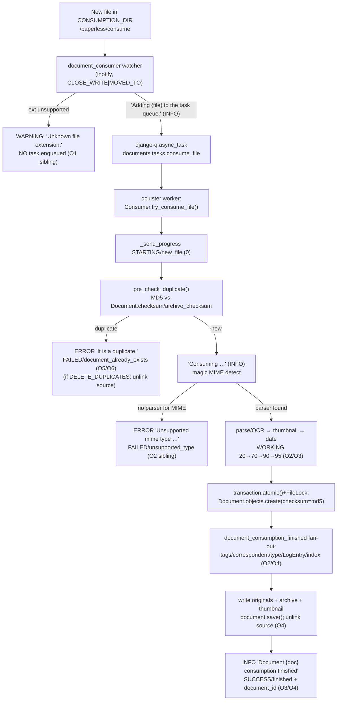

# Paperless-ngx — How Data Moves Through Document Ingestion (Runtime-Grounded)

> A reproducible, runtime-grounded trace of the Paperless-ngx consumption pipeline, answering six
> question threads (O1–O6) with **live-captured** logs, WebSocket frames, database rows, on-disk
> artifacts, and search-index state — corroborated by exact `file:line` citations.

## 1. Title & Run Metadata

| Field                                       | Value                                                                                                                                                                                     |
| ------------------------------------------- | ----------------------------------------------------------------------------------------------------------------------------------------------------------------------------------------- |
| Repository                                  | paperless-ngx                                                                                                                                                                             |
| Commit (`git rev-parse HEAD`)               | `542221a38dff06361e07976452f9aea24d210542`                                                                                                                                                |
| Source branch (`git branch --show-current`) | `paperless-ngx_542221a38dff`                                                                                                                                                              |
| Canonical image                             | `paperless-ngx-baseline:542221a38dff` (warmed from `andrewparkscaleai/coding-agent:paperless-ngx__paperless-ngx__542221a38dff06361e07976452f9aea24d210542`, `ghcr.io/scaleapi/swe-atlas`) |
| Python                                      | **3.9.23** (`python --version`) — `observed`                                                                                                                                              |
| Task queue                                  | **django-q 1.3.9** (`qcluster`), **not** Celery — `observed` (pin in `requirements.txt`)                                                                                                  |
| WebSocket layer                             | **channels 3.0.4** + **channels-redis 3.4.0**, Redis at `redis://localhost:6379` — `observed`                                                                                             |
| Search index                                | **whoosh 2.7.4** — `observed`                                                                                                                                                             |
| Web framework / ORM                         | **django 4.0.4** — `observed`                                                                                                                                                             |
| Database                                    | **SQLite** (`django.db.backends.sqlite3`) at `$PAPERLESS_DATA_DIR/db.sqlite3` — `observed`                                                                                                |
| Watcher mode                                | **inotify** (`CONSUMER_POLLING=0`) — `observed`                                                                                                                                           |
| Debug                                       | `DEBUG=False` (`PAPERLESS_DEBUG=NO`, default) — `observed`                                                                                                                                |
| Delete duplicates                           | `CONSUMER_DELETE_DUPLICATES=False` (default) — `observed` (toggled ON once for the O6 variant, then restored)                                                                             |
| Run window (UTC)                            | 2026-07-13 17:15 → 17:24                                                                                                                                                                  |

### 1.1 Runtime configuration verified live

```
$ python manage.py shell -c "from django.conf import settings; ..."
DEBUG= False
CONSUMER_POLLING= 0 (0=inotify)
CONSUMER_DELETE_DUPLICATES= False
DB_ENGINE= django.db.backends.sqlite3
CONSUMPTION_DIR= /paperless/consume
LOGGING_DIR= /paperless/data/log
```

### 1.2 Exact start commands (all run inside the canonical image, as non-root `testuser`)

```bash
# Environment (baseline warmed dirs; equal to canonical defaults):
#   PAPERLESS_DATA_DIR=/paperless/data  PAPERLESS_MEDIA_ROOT=/paperless/media
#   PAPERLESS_CONSUMPTION_DIR=/paperless/consume  PAPERLESS_REDIS=redis://localhost:6379
source /home/testuser/pl.env
redis-server --daemonize yes --save "" --appendonly no        # broker + channel layer
cd /app/src
python manage.py qcluster                                     # django-q worker (cluster "paperless")
python manage.py document_consumer                            # inotify directory watcher
daphne -b 127.0.0.1 -p 8000 paperless.asgi:application        # ASGI server hosting ws/status/
tail -F /paperless/data/log/paperless.log                     # primary evidence artifact
python3 /tmp/pngx-obs/ws_listen.py                            # authenticated ws/status/ listener
```

Startup lines captured (`observed`):

```
[2026-07-13 17:15:32,480] [INFO] [paperless.management.consumer] Using inotify to watch directory for changes: /paperless/consume
17:15:32 [Q] INFO Q Cluster island-vegan-winner-six running.
[2026-07-13 17:15:32,626] [INFO] [daphne.server] Listening on TCP address 127.0.0.1:8000
```

### 1.3 `observed` vs `inferred` convention

Every factual claim below is labeled:

- **`observed`** — captured at runtime during this investigation (a log line, WebSocket frame, DB row,
  file listing, or state count that this document reproduces verbatim).
- **`inferred`** — derived from reading the source at commit `542221a38dff` (a `file:line` fact) that was
  _not_ directly emitted as runtime output, or that explains _why_ an observed behavior occurs.

`file:line` citations point at `src/…` in the repository. A `file:line` fact is treated as **`inferred`**
unless the same behavior also appears in captured output, in which case it is **`observed`** and the
citation explains the cause.

### 1.4 Documented deviations from the literal runbook (canonical-equivalent)

- **Runtime dirs.** State was kept in the warmed baseline dirs `/paperless/{data,media,consume}` (the
  setup guide's recommended turnkey layout) rather than a fresh `/tmp/pngx-obs`. All config **values**
  equal the canonical defaults (§1.1). The baseline was verified **pristine** before the run
  (`DOC_COUNT 0`). Ephemeral harness scripts and sample files lived under `/tmp/pngx-obs` (outside the
  repo) and are deleted afterward.
- **`consumer` user.** Already present as `id=1` — it is auto-created by data migration
  `src/documents/migrations/0019_add_consumer_user.py` (`User.objects.create(username="consumer")`),
  so the `set_log_entry` prerequisite is satisfied without manual creation — `observed`.
- **Admin password.** The baseline admin user's password is `admin12345` (used for the WebSocket login),
  not `admin` — `observed`.
- **WebSocket client.** `websocket-client` is absent from the image; the listener uses the `websockets`
  10.3 asyncio client that ships in the image — `observed`.
- **O6 toggle.** For the delete-duplicates=ON variant only, `qcluster` was restarted with
  `PAPERLESS_CONSUMER_DELETE_DUPLICATES=1`, then restored to the default (OFF). Reported explicitly in O6.

---

## 2. TL;DR — one-line answers

| #      | Thread                               | Direct answer                                                                                                                                                                                                                                                                                                                                        | Primary `file:line`                                                                         |
| ------ | ------------------------------------ | ---------------------------------------------------------------------------------------------------------------------------------------------------------------------------------------------------------------------------------------------------------------------------------------------------------------------------------------------------- | ------------------------------------------------------------------------------------------- |
| **O1** | Detection & hand-off                 | The `document_consumer` inotify watcher sees the new file, logs `Adding <path> to the task queue.` and enqueues django-q task `documents.tasks.consume_file`.                                                                                                                                                                                        | `documents/management/commands/document_consumer.py:85-91`                                  |
| **O2** | Transition into parse/classify/index | The worker runs `consume_file` → `Consumer.try_consume_file`, logging `Consuming …` → `Detected mime type: …` → `Parser: …` → `Parsing …`; on success `document_consumption_finished` fans out to classify/tag/log/index.                                                                                                                            | `documents/consumer.py:215-246`; `documents/apps.py:22-27`                                  |
| **O3** | Per-stage progress / completion      | `Consumer._send_progress()` broadcasts JSON to the `status_updates` channel group; a client on `ws/status/` sees `STARTING/new_file → WORKING/parsing_document(20) → generating_thumbnail(70) → parse_date(90) → save_document(95) → SUCCESS/finished(100)`.                                                                                         | `documents/consumer.py:56-76,202-375`                                                       |
| **O4** | Final destination & state            | Inside one `transaction.atomic()`+`FileLock`, a `documents_document` row is created (`checksum`, `mime_type`, …); originals/archive/thumbnail files are written; an admin `LogEntry` (ADDITION, user `consumer`) is recorded; the Whoosh index is updated; source file is unlinked; terminal `Document … consumption finished` + `SUCCESS/finished`. | `documents/consumer.py:297-375`; `signals/handlers.py:413-431`; `documents/index.py:87-107` |
| **O5** | Duplicate tracking                   | An MD5 of the file bytes is compared against existing `Document.checksum` / `archive_checksum`; the `checksum` column is `unique=True` as a DB-level backstop.                                                                                                                                                                                       | `documents/consumer.py:102-107`; `documents/models.py:135-141`                              |
| **O6** | Duplicate avoidance                  | `pre_check_duplicate()` (before `Consuming`) logs `Not consuming <file>: It is a duplicate.`, emits `FAILED/document_already_exists`, and does **not** create a document; with `CONSUMER_DELETE_DUPLICATES=1` it also unlinks the incoming file.                                                                                                     | `documents/consumer.py:108-113`; `settings.py:486`                                          |

---

## 3. End-to-end flow (observed causal order)



`observed`: every edge above was exercised at runtime in §5. `inferred`: node internals cite `file:line`.

---

## 4. Environment & methodology

**Canonical entry point only.** Every ingestion was triggered by dropping a file into
`$PAPERLESS_CONSUMPTION_DIR` and letting the running `document_consumer` detect it. `Consumer` was never
instantiated directly, `consume_file` was never called by hand, and no mocks/monkeypatches/debug hooks
were used. Reads of resulting state (ORM counts, DB rows, Whoosh searches, `django_q.models.Task`) are
_observations of the outcome_, not pipeline bypasses.

**Five concurrent processes** (all inside the image, as `testuser`): Redis, `qcluster` (worker),
`document_consumer` (watcher), `daphne` (ASGI, for `ws/status/`), and the authenticated WebSocket
listener. The primary evidence artifact is `/paperless/data/log/paperless.log`.

**Logging split (exploited, and proven in §5.O2).** `inferred` from `settings.py`:
`DEBUG` defaults to `NO` (`:50`); the root logger uses the `console` handler (`:407`) whose level is
`INFO` when `DEBUG` is false (`:388`); the `paperless` logger writes `DEBUG`+ to the `file_paperless`
handler → `paperless.log` (`:409`, filename `:395`). Net effect: **DEBUG** lines
(`Detected mime type …`, `Parsing …`, `Saving record to database`, `Deleting file …`) appear **only** in
`paperless.log`; **INFO/WARNING/ERROR** lines also reach the process console. The verbose format is
`"[{asctime}] [{levelname}] [{name}] {message}"` (`:378`).

**Harness scripts** (ephemeral, under `/tmp/pngx-obs`, full source in the Appendix, deleted in cleanup):

- `ws_listen.py` — logs in via the Django session cookie (`GET`/`POST /accounts/login/`, admin/admin12345),
  connects to `ws://127.0.0.1:8000/ws/status/` with that cookie, and prints every JSON frame with a
  timestamp. `StatusConsumer` denies unauthenticated clients (`paperless/consumers.py:13-15`); auth is
  supplied by `AuthMiddlewareStack` (`paperless/asgi.py:20`).
- State snapshot — `manage.py shell -c` reading `Document.objects.count()`, `LogEntry.objects.count()`,
  and `index.open_index().doc_count()`.
- Task-result reader — `django_q.models.Task` filtered by `func="documents.tasks.consume_file"`.

**Conditions exercised:** happy path ×2 (`.txt`, `.pdf`); duplicate re-ingestion ×2; delete-duplicates
toggle (OFF and ON); unsupported **extension** (`.xyz`); unsupported **MIME** (`.txt` with ELF content).

---

## 5. O1–O6 — direct answers with live evidence

### O1 — Detection & hand-off

**Direct answer (`observed`).** A file appearing in `CONSUMPTION_DIR` is detected by the running
`document_consumer` inotify watcher. When the file is fully written it logs, at INFO,
`Adding <path> to the task queue.` and immediately enqueues the django-q task
`documents.tasks.consume_file` via `async_task(...)`. Detection→hand-off is the boundary between the
watcher process and the worker process.

**Command that produced the evidence:**

```bash
printf "Observation test BLITZYOBSERVATIONRUNONE happy path run 1 timestamp %s\n" \
    "$(date -u +%Y-%m-%dT%H:%M:%SZ)" > /tmp/pngx-obs/src_run1.txt
cp /tmp/pngx-obs/src_run1.txt "$PAPERLESS_CONSUMPTION_DIR/sample_run1.txt"
```

**Complete unedited output** — watcher startup (`document_consumer.out`, console) and the hand-off line
(`paperless.log`):

```
[2026-07-13 17:15:32,480] [INFO] [paperless.management.consumer] Using inotify to watch directory for changes: /paperless/consume
[2026-07-13 17:17:08,831] [INFO] [paperless.management.consumer] Adding /paperless/consume/sample_run1.txt to the task queue.
```

Proof of hand-off into the queue — the worker then dequeues and runs the exact task
(`qcluster.out`, `observed`):

```
17:17:08 [Q] INFO Process-1:5 processing [sample_run1.txt]
```

And the django-q record of the task (name + func), read after the fact (`observed`):

```
$ python manage.py shell -c "from django_q.models import Task; t=Task.objects.filter(func='documents.tasks.consume_file').order_by('started').first(); print(t.func, '|', t.name)"
documents.tasks.consume_file | sample_run1.txt
```

**`file:line` citations:**

| Fact                                                      | `file:line`                                             | Label                      |
| --------------------------------------------------------- | ------------------------------------------------------- | -------------------------- |
| Watcher logger name `paperless.management.consumer`       | `documents/management/commands/document_consumer.py:24` | `inferred`                 |
| inotify selected when `CONSUMER_POLLING == 0`             | `…/document_consumer.py:178`                            | `inferred`                 |
| Startup line `Using inotify to watch directory…`          | `…/document_consumer.py:200`                            | `observed` (line 1 above)  |
| inotify flags `flags.CLOSE_WRITE \| flags.MOVED_TO`       | `…/document_consumer.py:203`                            | `inferred`                 |
| Quiet-file debounce `inotify_debounce = 0.5`              | `…/document_consumer.py:211`                            | `inferred`                 |
| Hand-off log `Adding {filepath} to the task queue.`       | `…/document_consumer.py:85`                             | `observed` (line 2 above)  |
| `async_task("documents.tasks.consume_file", filepath, …)` | `…/document_consumer.py:86-91`                          | `observed` (worker ran it) |

**Sibling variants.**

- _Polling watcher_ — with `PAPERLESS_CONSUMER_POLLING>0`, the watcher logs `Polling directory for changes: {dir}` (`:186`) and uses `watchdog` handlers `on_created`/`on_moved` (`:129`, `:132`) →
  `_consume_wait_unmodified` (`:99`). Not exercised (default is inotify); **`inferred`**.
- _Unsupported extension_ — rejected here, before any enqueue (see O2 sibling and O1 note below).
- _Other entry points converge_ — the REST upload `POST /api/documents/post_document/` enqueues the same
  task (`documents/views.py:523-524`); described, not used as the canonical run. **`inferred`**.

**Causal reasoning.** The watcher's only job is detection + hand-off; all real work happens
asynchronously in the django-q worker. The `Adding … to the task queue.` INFO line is therefore the
definitive detection signal, and the worker's `processing [sample_run1.txt]` line is the definitive
hand-off signal. The `CLOSE_WRITE|MOVED_TO` flags + 0.5 s debounce explain why the file must be fully
written (we copy a complete file in) before detection fires.

---

### O2 — Transition into parsing / classification / indexing

**Direct answer (`observed`).** The worker executes `documents.tasks.consume_file` (`tasks.py:184`),
which calls `Consumer().try_consume_file(...)` (`tasks.py:236`). Inside the consumer the transition is
marked by an ordered `paperless.consumer` log sequence: `Consuming <file>` (INFO) → `Detected mime type: <mime>` (DEBUG) → `Parser: <ParserClass>` (DEBUG) → `Parsing <file>...` (DEBUG). Classification and
indexing happen _after_ the document is stored, when the `document_consumption_finished` signal fans out
to six receivers (`apps.py:22-27`), the last two of which are `set_log_entry` and `add_to_index`. The
task's **return value** `Success. New document id <N> created` (`tasks.py:247`) is the completion marker.

**Command:** (same happy-path drop as O1; `.txt`).

**Complete unedited output** — the full `paperless.log` slice for `sample_run1.txt` (`observed`):

```
[2026-07-13 17:17:08,831] [INFO] [paperless.management.consumer] Adding /paperless/consume/sample_run1.txt to the task queue.
[2026-07-13 17:17:08,974] [INFO] [paperless.consumer] Consuming sample_run1.txt
[2026-07-13 17:17:08,977] [DEBUG] [paperless.consumer] Detected mime type: text/plain
[2026-07-13 17:17:08,980] [DEBUG] [paperless.consumer] Parser: TextDocumentParser
[2026-07-13 17:17:08,983] [DEBUG] [paperless.consumer] Parsing sample_run1.txt...
[2026-07-13 17:17:08,983] [DEBUG] [paperless.consumer] Generating thumbnail for sample_run1.txt...
[2026-07-13 17:17:09,004] [DEBUG] [paperless.parsing.text] Execute: optipng -silent -o5 /tmp/paperless/paperless-6fe3dn2c/thumb.png -out /tmp/paperless/paperless-6fe3dn2c/thumb_optipng.png
[2026-07-13 17:17:11,324] [DEBUG] [paperless.classifier] Document classification model does not exist (yet), not performing automatic matching.
[2026-07-13 17:17:11,327] [DEBUG] [paperless.consumer] Saving record to database
[2026-07-13 17:17:11,344] [DEBUG] [paperless.consumer] Deleting file /paperless/consume/sample_run1.txt
[2026-07-13 17:17:11,370] [DEBUG] [paperless.parsing.text] Deleting directory /tmp/paperless/paperless-6fe3dn2c
[2026-07-13 17:17:11,370] [INFO] [paperless.consumer] Document 2026-07-13 sample_run1 consumption finished
```

Task completion value, read from django-q (`observed`):

```
$ python manage.py shell -c "from django_q.models import Task; [print(t.name,'|',t.success,'|',repr(t.result)) for t in Task.objects.filter(func='documents.tasks.consume_file').order_by('started')]"
sample_run1.txt | True | 'Success. New document id 1 created'
sample_run2.pdf | True | 'Success. New document id 2 created'
```

**Logging-split proof (`observed`).** The DEBUG stage lines exist only in the file, while INFO lines also
reach the console — demonstrated by grepping the watcher console vs the file:

```
$ grep -c "Adding /paperless/consume" document_consumer.out   # INFO on console
6
$ grep -c "Detected mime type" document_consumer.out          # DEBUG on console
0
$ grep -c "Detected mime type" /paperless/data/log/paperless.log  # DEBUG in file
3
```

**`file:line` citations:**

| Fact                                                                                                                  | `file:line`                            | Label                          |
| --------------------------------------------------------------------------------------------------------------------- | -------------------------------------- | ------------------------------ |
| Task entry `def consume_file(...)`, logger `paperless.tasks`                                                          | `documents/tasks.py:184`, `:29`        | `inferred`                     |
| Convergence `Consumer().try_consume_file(...)`                                                                        | `documents/tasks.py:236`               | `inferred`                     |
| Return `"Success. New document id {} created"`                                                                        | `documents/tasks.py:247`               | `observed` (task result above) |
| `Consuming {filename}` (INFO) at `:215`, after `pre_check_duplicate()` `:213`                                         | `documents/consumer.py:213-215`        | `observed`                     |
| `magic.from_file(...,mime=True)` → `Detected mime type: {mime}`                                                       | `documents/consumer.py:219-221`        | `observed`                     |
| Parser dispatch `get_parser_class_for_mime_type(mime)`; `Parser: {cls}` log                                           | `documents/consumer.py:223`, `:246`    | `observed`                     |
| `document_consumption_started.send(...)`                                                                              | `documents/consumer.py:229`            | `inferred`                     |
| `Parsing {}...` (DEBUG)                                                                                               | `documents/consumer.py:260`            | `observed`                     |
| Signals defined                                                                                                       | `documents/signals/__init__.py:3-5`    | `inferred`                     |
| Post-consume fan-out order (`add_inbox_tags→set_correspondent→set_document_type→set_tags→set_log_entry→add_to_index`) | `documents/apps.py:22-27`              | `inferred`                     |
| Classifier/matching (`paperless.handlers`), tag log `Tagging "{}" with "{}"`                                          | `documents/signals/handlers.py:27,224` | `inferred` (no model this run) |
| Parser registry: `is_file_ext_supported`, `get_parser_class_for_mime_type`, `parse_date`                              | `documents/parsers.py:62,81,212`       | `inferred`                     |

**Sibling variants.**

- _PDF vs text parser (`observed`)._ `text/plain` dispatches to `TextDocumentParser` (no OCR, no
  archive); `application/pdf` dispatches to `RasterisedDocumentParser`, which invokes OCRmyPDF
  (`output_type: pdfa`) and produces an archive PDF. From the `.pdf` run:
  ```
  [2026-07-13 17:18:59,850] [DEBUG] [paperless.consumer] Detected mime type: application/pdf
  [2026-07-13 17:18:59,854] [DEBUG] [paperless.consumer] Parser: RasterisedDocumentParser
  [2026-07-13 17:18:59,979] [DEBUG] [paperless.parsing.tesseract] Calling OCRmyPDF with args: {... 'output_type': 'pdfa', ...}
  ```
- _Classification with a model (`inferred`)._ Here the classifier reports `Document classification model does not exist (yet)`, so no auto-matching occurs; with a trained `classification_model.pickle` the
  `set_correspondent`/`set_document_type`/`set_tags` receivers would assign matches and
  `set_tags` would log `Tagging "…" with "…"` (`handlers.py:224`).
- _Unsupported MIME rejection_ — see the O2/edge evidence in §5.E.

**Causal reasoning.** `consume_file` is the single convergence task for the watcher, REST upload, and
mail (`tasks.py:236`), so one canonical watched-directory run authoritatively answers O2. The ordered
`Consuming → Detected mime type → Parser → Parsing` lines are the parse-transition signal; the
`Saving record to database` + `document_consumption_finished` fan-out is the classify/index transition;
the task result string is the completion marker.

---

### O3 — Per-stage progress / completion

**Direct answer (`observed`).** Progress is reported over a WebSocket. `Consumer._send_progress()`
(`consumer.py:56-76`) calls `channel_layer.group_send("status_updates", {"type":"status_update", "data": payload})` at each stage. `StatusConsumer` (`paperless/consumers.py`) subscribes authenticated
`ws/status/` clients to the `status_updates` group and forwards each payload as JSON
(`self.send(json.dumps(event["data"]))`, `:33`). An authenticated client therefore sees this exact
sequence for a successful `.txt`: `STARTING/new_file (0)` → `WORKING/parsing_document (20)` →
`WORKING/generating_thumbnail (70)` → `WORKING/parse_date (90)` → `WORKING/save_document (95)` →
`SUCCESS/finished (100)` with the new `document_id`. Each payload carries
`filename, task_id, current_progress, max_progress, status, message, document_id`.

**Command:** start the listener _before_ dropping the file:

```bash
python3 /tmp/pngx-obs/ws_listen.py &      # logs in (admin/admin12345), connects ws://127.0.0.1:8000/ws/status/
cp /tmp/pngx-obs/src_run1.txt "$PAPERLESS_CONSUMPTION_DIR/sample_run1.txt"
```

**Complete unedited output** — every frame received for `sample_run1.txt` (`observed`):

```
17:16:34 WS_CONNECTED
17:17:08 {"filename": "sample_run1.txt", "task_id": "98cdccba-f86b-46b9-a6e1-f2b392985b06", "current_progress": 0, "max_progress": 100, "status": "STARTING", "message": "new_file", "document_id": null}
17:17:08 {"filename": "sample_run1.txt", "task_id": "98cdccba-f86b-46b9-a6e1-f2b392985b06", "current_progress": 20, "max_progress": 100, "status": "WORKING", "message": "parsing_document", "document_id": null}
17:17:08 {"filename": "sample_run1.txt", "task_id": "98cdccba-f86b-46b9-a6e1-f2b392985b06", "current_progress": 70, "max_progress": 100, "status": "WORKING", "message": "generating_thumbnail", "document_id": null}
17:17:09 {"filename": "sample_run1.txt", "task_id": "98cdccba-f86b-46b9-a6e1-f2b392985b06", "current_progress": 90, "max_progress": 100, "status": "WORKING", "message": "parse_date", "document_id": null}
17:17:11 {"filename": "sample_run1.txt", "task_id": "98cdccba-f86b-46b9-a6e1-f2b392985b06", "current_progress": 95, "max_progress": 100, "status": "WORKING", "message": "save_document", "document_id": null}
17:17:11 {"filename": "sample_run1.txt", "task_id": "98cdccba-f86b-46b9-a6e1-f2b392985b06", "current_progress": 100, "max_progress": 100, "status": "SUCCESS", "message": "finished", "document_id": 1}
```

**`file:line` citations:**

| Fact                                                                                                                           | `file:line`                                     | Label                                                     |
| ------------------------------------------------------------------------------------------------------------------------------ | ----------------------------------------------- | --------------------------------------------------------- |
| Progress message constants (`new_file`, `parsing_document`, `generating_thumbnail`, `parse_date`, `save_document`, `finished`) | `documents/consumer.py:43-49`                   | `observed` (each appears as a frame `message`)            |
| `_send_progress()` → `group_send("status_updates", {"type":"status_update","data":payload})`; payload keys                     | `documents/consumer.py:56-76`                   | `observed`                                                |
| `STARTING(0)/new_file`                                                                                                         | `documents/consumer.py:202`                     | `observed` (frame 1)                                      |
| Parser sub-progress mapped as bare `WORKING`                                                                                   | `documents/consumer.py:237-240`                 | `inferred` (no sub-frame emitted for the fast text parse) |
| `WORKING(20)/parsing_document`                                                                                                 | `documents/consumer.py:259`                     | `observed` (frame 2)                                      |
| `WORKING(70)/generating_thumbnail`                                                                                             | `documents/consumer.py:264`                     | `observed` (frame 3)                                      |
| `WORKING(90)/parse_date` — **only if `get_date()` empty** (`if not date`)                                                      | `documents/consumer.py:273-274`                 | `observed` (frame 4)                                      |
| `WORKING(95)/save_document`                                                                                                    | `documents/consumer.py:294`                     | `observed` (frame 5)                                      |
| `SUCCESS(100)/finished` + `document.id`                                                                                        | `documents/consumer.py:375`                     | `observed` (frame 6)                                      |
| `_fail()` → `FAILED(100)/message`                                                                                              | `documents/consumer.py:78-79`                   | `observed` (see O5/O6, §5.E)                              |
| `StatusConsumer` denies unauth / `group_add("status_updates")` / forwards JSON                                                 | `paperless/consumers.py:13-21,29-33`            | `observed` (auth required; frames received)               |
| `ws/status/` route; `AuthMiddlewareStack`                                                                                      | `paperless/urls.py:137`; `paperless/asgi.py:20` | `observed`                                                |

**Sibling variants.**

- _PDF frames (`observed`)._ Identical top-level sequence with distinct `task_id` and `document_id: 2`
  (full transcript in the Appendix).
- _`parse_date` is conditional (`observed`+`inferred`)._ Frame 4 (`parse_date`, 90) is emitted **because**
  the text parser's `get_date()` returns `None`, so `if not date:` is true (`consumer.py:273-274`) and the
  consumer runs filename/content date parsing. For a document whose parser already returns a date, this
  frame would be skipped — `inferred`.
- _Failure frames (`observed`)._ `_fail()` emits a single `FAILED(100)` frame with the error message
  (`document_already_exists` for duplicates, `unsupported_type` for bad MIME) — see §5.E.

**Causal reasoning.** The status stream is a fixed state machine keyed by the `MESSAGE_*` constants and
the hard-coded percentages in `_send_progress` calls. Because the group is the global `status_updates`
group (not per-document), one authenticated listener observes progress for every file. The Angular SPA
consumes exactly these frames to drive its progress UI (described, not modified).

---

### O4 — Final data destination & state recording

**Direct answer (`observed`).** On success, inside a single `transaction.atomic()` guarded by
`FileLock(MEDIA_LOCK)` (`consumer.py:297-315`), the pipeline: (1) creates the `documents_document` row
via `Document.objects.create(...)` with `checksum=md5`, `mime_type`, `content`, `created`, `storage_type`
(`consumer.py:398-406`); (2) fires `document_consumption_finished`, whose receivers record an admin
`LogEntry` (ADDITION, user `consumer`) via `set_log_entry` (`handlers.py:413-425`) and update the Whoosh
index via `add_to_index` → `index.add_or_update_document` (`handlers.py:428-431`, `index.py:87-107`);
(3) writes the **original** (and, for PDFs/images, the **archive**) and the **thumbnail** under
`MEDIA_ROOT/documents/{originals,archive,thumbnails}`; (4) `document.save()`; (5) unlinks the source file
from the consume dir; (6) logs `Document <str> consumption finished` (INFO) and emits `SUCCESS/finished`.

**Commands & complete unedited output (`observed`).**

DB row (ORM) and raw SQL for the `.txt` document:

```
$ python manage.py shell -c "from documents.models import Document as D; d=D.objects.latest('added'); print(...)"
id= 1
title= 'sample_run1'
checksum= 625323957b9f27c0445d5ac3d3a20278
archive_checksum= None
mime_type= text/plain
storage_type= unencrypted
created= 2026-07-13 17:17:07.824581+00:00
added= 2026-07-13 17:17:11.328236+00:00
filename= 0000001.txt
archive_filename= None
content= 'Observation test BLITZYOBSERVATIONRUNONE happy path run 1 timestamp 2026-07-13T17:17:07Z\n'

$ python3 -c "import sqlite3,os; ...select id,title,checksum,archive_checksum,mime_type,storage_type,filename from documents_document"
id | title | checksum | archive_checksum | mime_type | storage_type | filename
1 | sample_run1 | 625323957b9f27c0445d5ac3d3a20278 | None | text/plain | unencrypted | 0000001.txt
```

Files on disk after both happy runs (`.txt` = originals+thumbnail; `.pdf` = originals+**archive**+thumbnail):

```
$ find /paperless/media/documents -type f | sort
/paperless/media/documents/archive/0000002.pdf
/paperless/media/documents/originals/0000001.txt
/paperless/media/documents/originals/0000002.pdf
/paperless/media/documents/thumbnails/0000001.png
/paperless/media/documents/thumbnails/0000002.png
```

Admin `LogEntry` (`observed`):

```
$ python manage.py shell -c "from django.contrib.admin.models import LogEntry as L; e=L.objects.latest('action_time'); print(...)"
action_flag= 1 (1=ADDITION)
object_id= 1
object_repr= '2026-07-13 sample_run1'
user= consumer (id=1)
content_type= documents | document
action_time= 2026-07-13 17:17:11.332464+00:00
```

Whoosh search confirms the document is indexed and full-text searchable (`observed`):

```
$ python manage.py shell -c "from documents import index; from whoosh.qparser import QueryParser; ..."
INDEX_DOCCOUNT 1
hits for marker: 1
  hit id= 1 title= sample_run1
```

Source file removed from the consume dir after success (`observed`):

```
$ ls -la /paperless/consume        # after sample_run1.txt success
total 12
drwxr-xr-x 1 testuser testuser 4096 .
drwxr-xr-x 1 testuser testuser 4096 ..
```

Terminal completion line (`observed`, `paperless.log`):

```
[2026-07-13 17:17:11,370] [INFO] [paperless.consumer] Document 2026-07-13 sample_run1 consumption finished
```

**`file:line` citations:**

| Fact                                                                                                                                             | `file:line`                                                          | Label                          |
| ------------------------------------------------------------------------------------------------------------------------------------------------ | -------------------------------------------------------------------- | ------------------------------ |
| `with transaction.atomic():` then `_store(...)`                                                                                                  | `documents/consumer.py:298,301`                                      | `inferred`                     |
| `document_consumption_finished.send(...)`                                                                                                        | `documents/consumer.py:306`                                          | `inferred`                     |
| `with FileLock(settings.MEDIA_LOCK):` write original / thumbnail / archive                                                                       | `documents/consumer.py:315-342`                                      | `observed` (files on disk)     |
| `archive_checksum = md5(archive)` (PDF only)                                                                                                     | `documents/consumer.py:340-342`                                      | `observed` (row id=2)          |
| `document.save()`                                                                                                                                | `documents/consumer.py:346`                                          | `inferred`                     |
| `Deleting file {path}` (DEBUG) + `os.unlink(self.path)`                                                                                          | `documents/consumer.py:349-350`                                      | `observed` (consume dir empty) |
| `Document {} consumption finished` (INFO)                                                                                                        | `documents/consumer.py:373`                                          | `observed`                     |
| `Document.objects.create(title[:127], content, mime_type, checksum=md5, created, modified, storage_type)`                                        | `documents/consumer.py:398-406`                                      | `observed` (DB row)            |
| `set_log_entry`: `ContentType.get(model="document")`, `User.objects.get(username="consumer")`, `LogEntry.objects.create(action_flag=ADDITION,…)` | `documents/signals/handlers.py:413-425`                              | `observed` (LogEntry row)      |
| `add_to_index` → `index.add_or_update_document` → `update_document` (Whoosh fields)                                                              | `documents/signals/handlers.py:428-431`; `documents/index.py:87-107` | `observed` (search hit)        |
| `checksum unique=True`; `archive_checksum`; `created`(db_index); `added`                                                                         | `documents/models.py:135-141,143,152,169`                            | `observed`/`inferred`          |
| Dirs `ORIGINALS_DIR/ARCHIVE_DIR/THUMBNAIL_DIR/INDEX_DIR/MEDIA_LOCK`                                                                              | `paperless/settings.py:62-64,73,72`                                  | `observed` (paths on disk)     |

**Sibling variants.**

- _Text vs PDF destination (`observed`)._ `.txt` → `originals/0000001.txt` + `thumbnails/0000001.png`,
  `archive_checksum=None`, `archive_filename=None` (no archive). `.pdf` → adds
  `archive/0000002.pdf`, with `archive_checksum=4fd4f4d67bd6a860e897a4014f5c58c1` and
  `archive_filename=0000002.pdf`.
- _Atomicity (`inferred`)._ Because create + signal fan-out + file writes are one `transaction.atomic()`
  under `FileLock`, a failure (e.g. the missing `consumer` user) rolls back both the row and the file
  placement — no partial state persists (`consumer.py:297-367`).

**Causal reasoning.** The `documents_document` row is the system-of-record; the originals/archive/
thumbnail files are its binary payload; the `LogEntry` is the audit trail (attributed to the `consumer`
user, which is why that user is a hard prerequisite — `handlers.py:416`); and the Whoosh entry is what
makes the document searchable. All four transitions (`row 0→1`, files absent→present, `LogEntry 0→1`,
`INDEX_DOCCOUNT 0→1`) are the observable proof of "where the data ends up".

---

### O5 — Duplicate tracking

**Direct answer (`observed`).** Paperless tracks "already processed" by an **MD5 checksum of the file
bytes**, stored on `Document.checksum` (a `unique=True` column). Before parsing, `pre_check_duplicate()`
(`consumer.py:102-107`) computes `hashlib.md5(f.read()).hexdigest()` and runs
`Document.objects.filter(Q(checksum=…) | Q(archive_checksum=…)).exists()`. The `unique=True` constraint
on `checksum` (`models.py:135-141`) is the second-line, database-level guard against a concurrent race.

**Command & complete unedited output (`observed`)** — the MD5 of the re-dropped copy equals the checksum
recorded for document id 1 in O4:

```
$ md5sum /tmp/pngx-obs/dup1.txt          # byte-identical copy of the run-1 source
625323957b9f27c0445d5ac3d3a20278  /tmp/pngx-obs/dup1.txt
```

Compare with the stored value captured in O4: `Document(id=1).checksum = 625323957b9f27c0445d5ac3d3a20278`.
They are identical — the checksum **is** the MD5 of the file bytes.

Column definition confirmed live (`observed`):

```
$ python manage.py shell -c "from documents.models import Document as D; f=D._meta.get_field('checksum'); print(f.max_length, f.unique, f.editable)"
32 True False
```

**`file:line` citations:**

| Fact                                                                       | `file:line`                     | Label                               |
| -------------------------------------------------------------------------- | ------------------------------- | ----------------------------------- |
| `checksum = hashlib.md5(f.read()).hexdigest()`                             | `documents/consumer.py:103-104` | `observed` (md5 == stored checksum) |
| `Document.objects.filter(Q(checksum=…) \| Q(archive_checksum=…)).exists()` | `documents/consumer.py:105-107` | `observed` (rejection fired)        |
| `checksum = CharField(max_length=32, editable=False, unique=True)`         | `documents/models.py:135-141`   | `observed` (field introspection)    |
| `archive_checksum = CharField(...)` (also matched)                         | `documents/models.py:143`       | `observed` (PDF row id=2)           |

**Sibling variants.**

- _Archive checksum also guards (`observed`+`inferred`)._ The filter ORs `checksum` and
  `archive_checksum`, so a file whose bytes match a previously generated **archive** PDF is also caught.
  Confirmed present on the PDF document (`archive_checksum=4fd4f4d67bd6a860e897a4014f5c58c1`, O4).
- _DB-level backstop (`inferred`)._ If two identical files raced past the in-code check concurrently,
  the `unique=True` constraint on `checksum` would raise `IntegrityError` on the second insert, rolling
  back its atomic block.

**Causal reasoning.** Content identity (not filename) defines a duplicate: the checksum is derived purely
from the bytes, so the same content under any filename is recognized. This is why re-dropping the same
content under a _new_ name (`sample_dup.txt`) is still detected (O6).

---

### O6 — Duplicate avoidance

**Direct answer (`observed`).** When `pre_check_duplicate()` finds a match it calls `_fail()`, which
logs, at ERROR, `Not consuming <file>: It is a duplicate.` (`consumer.py:110-113`), emits a single
`FAILED/document_already_exists` WebSocket frame, raises `ConsumerError`, and creates **no** document
(count stays `N → N`). Crucially, `pre_check_duplicate()` runs at `:213`, **before** the `Consuming …`
INFO log at `:215`, so a duplicate produces **no `Consuming` line**. With
`PAPERLESS_CONSUMER_DELETE_DUPLICATES=1`, `_fail` is preceded by `os.unlink(self.path)` (`:108-109`),
so the incoming duplicate file is also deleted from the consume dir; with the default (OFF) the file is
left in place.

**Command & complete unedited output — default (delete OFF), `observed`:**

```bash
cp /tmp/pngx-obs/dup1.txt "$PAPERLESS_CONSUMPTION_DIR/sample_dup.txt"   # byte-identical copy
```

`paperless.log` (note: `Adding … to the task queue.` still fires — the watcher always enqueues — but
there is **no** `Consuming sample_dup.txt` line):

```
[2026-07-13 17:20:35,038] [INFO] [paperless.management.consumer] Adding /paperless/consume/sample_dup.txt to the task queue.
[2026-07-13 17:20:35,180] [ERROR] [paperless.consumer] Not consuming sample_dup.txt: It is a duplicate.
```

WebSocket frames — `STARTING/new_file` followed **directly** by `FAILED/document_already_exists`
(no parsing/thumbnail/save frames):

```
17:20:35 {"filename": "sample_dup.txt", "task_id": "47edc2c3-1cdd-44bf-ab35-f65312e3987c", "current_progress": 0, "max_progress": 100, "status": "STARTING", "message": "new_file", "document_id": null}
17:20:35 {"filename": "sample_dup.txt", "task_id": "47edc2c3-1cdd-44bf-ab35-f65312e3987c", "current_progress": 100, "max_progress": 100, "status": "FAILED", "message": "document_already_exists", "document_id": null}
```

Count unchanged and the file **remains** in the consume dir (delete OFF):

```
$ python manage.py shell -c "from documents.models import Document; print('DOC_COUNT', Document.objects.count())"
DOC_COUNT 2
$ ls -la /paperless/consume
-rw-r--r-- 1 testuser testuser   89 Jul 13 17:20 sample_dup.txt
```

**Command & complete unedited output — delete ON, `observed`** (worker restarted with
`PAPERLESS_CONSUMER_DELETE_DUPLICATES=1`, verified `settings.CONSUMER_DELETE_DUPLICATES=True`, then a
byte-identical copy dropped into an empty consume dir):

```
[2026-07-13 17:22:38,139] [INFO] [paperless.management.consumer] Adding /paperless/consume/sample_dup_delete.txt to the task queue.
[2026-07-13 17:22:38,316] [ERROR] [paperless.consumer] Not consuming sample_dup_delete.txt: It is a duplicate.

17:22:38 {"filename": "sample_dup_delete.txt", ... "status": "STARTING", "message": "new_file", "document_id": null}
17:22:38 {"filename": "sample_dup_delete.txt", ... "status": "FAILED", "message": "document_already_exists", "document_id": null}

$ ls -la /paperless/consume        # after: file was UNLINKED
total 12
drwxr-xr-x 1 testuser testuser 4096 ..
drwxr-xr-x 1 testuser testuser 4096 ..
$ python manage.py shell -c "print('DOC_COUNT', __import__('documents.models',fromlist=['Document']).Document.objects.count())"
DOC_COUNT 2
```

**`file:line` citations:**

| Fact                                                                                     | `file:line`                     | Label                                   |
| ---------------------------------------------------------------------------------------- | ------------------------------- | --------------------------------------- |
| `if settings.CONSUMER_DELETE_DUPLICATES: os.unlink(self.path)`                           | `documents/consumer.py:108-109` | `observed` (file gone when ON)          |
| `_fail(MESSAGE_DOCUMENT_ALREADY_EXISTS, "Not consuming {filename}: It is a duplicate.")` | `documents/consumer.py:110-113` | `observed` (ERROR log + FAILED frame)   |
| `MESSAGE_DOCUMENT_ALREADY_EXISTS = "document_already_exists"`                            | `documents/consumer.py:37`      | `observed` (frame `message`)            |
| Ordering: `pre_check_duplicate()` `:213` before `Consuming` `:215`                       | `documents/consumer.py:213-215` | `observed` (no `Consuming` line)        |
| `CONSUMER_DELETE_DUPLICATES` default OFF                                                 | `paperless/settings.py:486`     | `observed` (file remained when default) |

**Sibling variants.**

- _Toggle OFF vs ON (`observed`)._ OFF → duplicate file **remains** (`sample_dup.txt`, 89 bytes);
  ON → duplicate file **unlinked** (empty consume dir). Both log `It is a duplicate.` and emit
  `FAILED/document_already_exists`; only the source-file disposition differs.
- _No `Consuming` line for duplicates (`observed`)._ Contrast with the unsupported-MIME edge (§5.E),
  where `Consuming` **does** appear because the extension check passes and the duplicate check does not
  match — the rejection then happens later at the MIME step.

**Causal reasoning.** The watcher is content-agnostic and always enqueues; de-duplication is the
worker's responsibility. Doing the checksum check first (before `Consuming`, MIME detection, or parsing)
avoids wasting OCR/parse work on a known duplicate — the `STARTING → FAILED` frame pair with nothing in
between is the runtime signature of that early exit.

---

### §5.E — Unsupported-type rejection (edge coverage)

Two distinct rejection points exist; both were exercised.

**(a) Extension-level, at the watcher (`observed`).** A file whose extension is not in the
parser-declared set is rejected _before_ any task is enqueued.

```bash
printf "this is not a supported document type\n" > /tmp/pngx-obs/src.xyz
cp /tmp/pngx-obs/src.xyz "$PAPERLESS_CONSUMPTION_DIR/sample.xyz"
```

```
[2026-07-13 17:23:22,491] [WARNING] [paperless.management.consumer] Not consuming file /paperless/consume/sample.xyz: Unknown file extension.
$ python manage.py shell -c "from django_q.models import Task; print('tasks for .xyz:', Task.objects.filter(name='sample.xyz').count())"
tasks for .xyz: 0
$ python manage.py shell -c "from documents.models import Document; print('DOC_COUNT', Document.objects.count())"
DOC_COUNT 2
```

Supported extensions (parser-declared), confirming `.xyz` is not among them (`observed`):

```
['.bat', '.bmp', '.brf', '.c', '.csv', '.gif', '.h', '.jfif', '.jpe', '.jpeg', '.jpg', '.ksh', '.pdf', '.pl', '.png', '.pot', '.srt', '.text', '.tif', '.tiff', '.txt']
```

Citations: `is_file_ext_supported` guard `document_consumer.py:54`, warning `:55`. **`observed`.**

**(b) MIME-level, at the consumer (`observed`).** A file whose **extension** is supported but whose
**content** libmagic maps to a type with no parser is rejected after `Consuming`. Constructed a `.txt`
(supported ext) containing an ELF header → libmagic reports `application/x-executable` (no parser):

```
[2026-07-13 17:24:14,745] [INFO]  [paperless.consumer] Consuming sample_binary.txt
[2026-07-13 17:24:14,746] [DEBUG] [paperless.consumer] Detected mime type: application/x-executable
[2026-07-13 17:24:14,748] [ERROR] [paperless.consumer] Unsupported mime type application/x-executable

17:24:14 {"filename": "sample_binary.txt", ... "status": "STARTING", "message": "new_file", "document_id": null}
17:24:14 {"filename": "sample_binary.txt", ... "status": "FAILED", "message": "unsupported_type", "document_id": null}
```

Note the ordering difference: here `Consuming` **is** logged (extension passed, not a duplicate), then
the MIME dispatch fails. Citations: `get_parser_class_for_mime_type` `consumer.py:223`,
`_fail(MESSAGE_UNSUPPORTED_TYPE, "Unsupported mime type {mime}")` `:225`,
`MESSAGE_UNSUPPORTED_TYPE = "unsupported_type"` `:44`. **`observed`** (originally `inferred` in the
architect map; captured live here).

---

## 6. Before / intermediate / after state

All counts captured live with the state-snapshot helper (`Document.objects.count()`,
`LogEntry.objects.count()`, `index.open_index().doc_count()`). All values `observed`.

| Condition              | State     | `DOC_COUNT` | `LOGENTRY_COUNT` | `INDEX_DOCCOUNT` | Consume-dir file                         |
| ---------------------- | --------- | :---------: | :--------------: | :--------------: | ---------------------------------------- |
| Happy `.txt` (run 1)   | before    |      0      |        0         |        0         | `sample_run1.txt` present (just dropped) |
| Happy `.txt` (run 1)   | **after** |    **1**    |      **1**       |      **1**       | **absent** (unlinked on success)         |
| Happy `.pdf` (run 2)   | before    |      1      |        1         |        1         | `sample_run2.pdf` present                |
| Happy `.pdf` (run 2)   | **after** |    **2**    |      **2**       |      **2**       | **absent** (unlinked on success)         |
| Duplicate (delete OFF) | before    |      2      |        2         |        2         | `sample_dup.txt` present                 |
| Duplicate (delete OFF) | **after** |    **2**    |      **2**       |      **2**       | **present** (not deleted)                |
| Duplicate (delete ON)  | before    |      2      |        —         |        —         | `sample_dup_delete.txt` present          |
| Duplicate (delete ON)  | **after** |    **2**    |        —         |        —         | **absent** (unlinked)                    |
| Unsupported ext `.xyz` | before    |      2      |        —         |        —         | `sample.xyz` present                     |
| Unsupported ext `.xyz` | **after** |    **2**    |        —         |        —         | **present** (watcher never consumes it)  |
| Unsupported MIME       | before    |      2      |        —         |        —         | `sample_binary.txt` present              |
| Unsupported MIME       | **after** |    **2**    |        —         |        —         | present (consumer failed; source left)   |

**Intermediate transitions (the crux of O3–O6).** The _intermediate_ signals are the WebSocket frames
and stage logs captured per condition in §5: happy path advances `STARTING → parsing_document → generating_thumbnail → parse_date → save_document → SUCCESS`; duplicate and unsupported-MIME collapse to
`STARTING → FAILED`; unsupported-extension produces **no** frames at all (rejected pre-enqueue). The
boundary values that answer the question — `DOC_COUNT 0→1` (new) vs `2→2` (duplicate), `INDEX_DOCCOUNT 0→1`, consume-file present→absent (happy) vs present-or-removed (duplicate toggle) — are shown above.

---

## 7. Two-run stability

Both the happy path and the duplicate path were run at least twice. Identifiers captured **as-is**:

| Path                  | Run | File                    |        Doc id         | `checksum` (MD5)                                             | `task_id`           | `created` (UTC)   | `added` (UTC)     |
| --------------------- | --- | ----------------------- | :-------------------: | ------------------------------------------------------------ | ------------------- | ----------------- | ----------------- |
| Happy                 | 1   | `sample_run1.txt`       |           1           | `625323957b9f27c0445d5ac3d3a20278`                           | `98cdccba-…985b06`  | `17:17:07.824581` | `17:17:11.328236` |
| Happy                 | 2   | `sample_run2.pdf`       |           2           | `6db389724479cc810719fc2e046f2b33` (archive `4fd4f4d6…58c1`) | `2cbcca5c-…31e1599` | `17:18:58.695624` | `17:19:03.974462` |
| Duplicate             | 1   | `sample_dup.txt`        |     — (rejected)      | `625323957b9f27c0445d5ac3d3a20278` (== doc 1)                | `47edc2c3-…e3987c`  | —                 | —                 |
| Duplicate             | 2   | `sample_dup_run2.txt`   |     — (rejected)      | `625323957b9f27c0445d5ac3d3a20278` (== doc 1)                | `6522b481-…6ff1fe`  | —                 | —                 |
| Duplicate (delete ON) | 3   | `sample_dup_delete.txt` | — (rejected+unlinked) | `625323957b9f27c0445d5ac3d3a20278` (== doc 1)                | `c54cbdb7-…99fec6`  | —                 | —                 |
| Unsupported MIME      | —   | `sample_binary.txt`     |     — (rejected)      | n/a                                                          | `6cf1f297-…5504a2`  | —                 | —                 |

**Stability notes (`observed`).**

- **Log/WS sequence is stable.** Both happy runs produced the identical top-level WS state machine
  (`STARTING → parsing_document(20) → generating_thumbnail(70) → parse_date(90) → save_document(95) → SUCCESS(100)`) and the identical ordered `paperless.consumer` log sequence; both duplicate runs
  produced the identical `Adding… / It is a duplicate.` pair and `STARTING → FAILED` frame pair.
- **Checksum is stable for identical content.** Every duplicate copy hashed to
  `625323957b9f27c0445d5ac3d3a20278`, exactly the `checksum` stored on document id 1 — confirming the
  MD5 is a pure function of the bytes and is reproducible across runs.
- **`task_id` varies per submission** (a fresh UUID each enqueue) — expected.
- **Document ids increment** (1, 2) and **timestamps vary** run-to-run — expected; reported as captured.

---

## 8. Coverage checklist (coverage-pass)

Each named thread is confirmed present with concrete value, `file:line`, observed evidence, sibling
variants, and causal reasoning.

- [x] **O1 — Detection & hand-off.**

  - _Concrete value:_ `Adding /paperless/consume/sample_run1.txt to the task queue.` → `async_task("documents.tasks.consume_file", …)`; worker `processing [sample_run1.txt]`.
  - _`file:line`:_ `documents/management/commands/document_consumer.py:85-91` (hand-off), `:200` (inotify startup).
  - _Observed evidence:_ §5.O1 log lines + `qcluster.out` + `Task.func`. **`observed`.**
  - _Sibling variants:_ inotify (default) vs polling (`:186`); REST upload convergence (`views.py:523-524`); unsupported-ext pre-enqueue rejection.
  - _Causal reasoning:_ watcher only detects + enqueues; async work runs in the worker.

- [x] **O2 — Transition into parsing / classification / indexing.**

  - _Concrete value:_ `Consuming …` → `Detected mime type: text/plain` → `Parser: TextDocumentParser` → `Parsing …`; task result `Success. New document id 1 created`; fan-out to 6 receivers.
  - _`file:line`:_ `documents/consumer.py:215-246`; `documents/tasks.py:236,247`; `documents/apps.py:22-27`.
  - _Observed evidence:_ §5.O2 full log slice + task result + logging-split grep. **`observed`.**
  - _Sibling variants:_ `RasterisedDocumentParser` (PDF, OCRmyPDF) vs `TextDocumentParser`; classification with a trained model; unsupported-MIME rejection.
  - _Causal reasoning:_ single convergence task; parse logs mark parse, `document_consumption_finished` marks classify/index.

- [x] **O3 — Per-stage progress / completion.**

  - _Concrete value:_ WS frames `STARTING/new_file(0) → parsing_document(20) → generating_thumbnail(70) → parse_date(90) → save_document(95) → SUCCESS/finished(100, document_id=1)`.
  - _`file:line`:_ `documents/consumer.py:56-76,202,259,264,274,294,375`; `paperless/consumers.py:29-33`; `paperless/urls.py:137`.
  - _Observed evidence:_ §5.O3 full frame transcript from the authenticated `ws/status/` listener. **`observed`.**
  - _Sibling variants:_ PDF frames (doc id 2); conditional `parse_date`; `FAILED` frames for dup / unsupported.
  - _Causal reasoning:_ fixed state machine keyed by `MESSAGE_*` constants + hard-coded percentages; global `status_updates` group.

- [x] **O4 — Final data destination & state recording.**

  - _Concrete value:_ `documents_document` row id=1 (`checksum`, `mime_type=text/plain`, `filename=0000001.txt`); files `originals/0000001.txt` + `thumbnails/0000001.png`; `LogEntry(action_flag=1, user=consumer)`; Whoosh `INDEX_DOCCOUNT 1`; source unlinked; `Document … consumption finished`.
  - _`file:line`:_ `documents/consumer.py:297-375,398-406`; `signals/handlers.py:413-431`; `documents/index.py:87-107`; `models.py:135-174`; `settings.py:62-64,72-73`.
  - _Observed evidence:_ §5.O4 DB row, raw SQL, `find`, `LogEntry`, Whoosh search, empty consume dir. **`observed`.**
  - _Sibling variants:_ PDF adds `archive/0000002.pdf` + `archive_checksum`; atomic rollback on failure.
  - _Causal reasoning:_ row = system-of-record, files = payload, LogEntry = audit, Whoosh = searchability.

- [x] **O5 — Duplicate tracking.**

  - _Concrete value:_ `md5sum` of the copy = `625323957b9f27c0445d5ac3d3a20278` = `Document(id=1).checksum`; field is `max_length=32, unique=True, editable=False`.
  - _`file:line`:_ `documents/consumer.py:102-107`; `documents/models.py:135-141,143`.
  - _Observed evidence:_ §5.O5 md5 equality + field introspection. **`observed`.**
  - _Sibling variants:_ `archive_checksum` also matched; `unique=True` DB backstop for races.
  - _Causal reasoning:_ content-hash identity (not filename) defines a duplicate.

- [x] **O6 — Duplicate avoidance.**
  - _Concrete value:_ `[ERROR] … Not consuming sample_dup.txt: It is a duplicate.`; WS `STARTING → FAILED/document_already_exists`; no `Consuming` line; `DOC_COUNT 2→2`; file remains (OFF) / unlinked (ON).
  - _`file:line`:_ `documents/consumer.py:108-113,213-215`; `paperless/settings.py:486`.
  - _Observed evidence:_ §5.O6 logs, WS frames, count, consume-dir listings for both toggle states. **`observed`.**
  - _Sibling variants:_ `CONSUMER_DELETE_DUPLICATES` OFF vs ON; ordering contrast with unsupported-MIME (which does log `Consuming`).
  - _Causal reasoning:_ checksum check runs before parse to avoid wasted work; `STARTING→FAILED` with nothing between is the early-exit signature.

---

## 9. Appendix

### A.1 Full `paperless.log` (complete, unedited — all conditions, 44 lines)

```
[2026-07-13 17:15:32,480] [INFO] [paperless.management.consumer] Using inotify to watch directory for changes: /paperless/consume
[2026-07-13 17:16:02,139] [INFO] [paperless.sanity_checker] Sanity checker detected no issues.
[2026-07-13 17:17:08,831] [INFO] [paperless.management.consumer] Adding /paperless/consume/sample_run1.txt to the task queue.
[2026-07-13 17:17:08,974] [INFO] [paperless.consumer] Consuming sample_run1.txt
[2026-07-13 17:17:08,977] [DEBUG] [paperless.consumer] Detected mime type: text/plain
[2026-07-13 17:17:08,980] [DEBUG] [paperless.consumer] Parser: TextDocumentParser
[2026-07-13 17:17:08,983] [DEBUG] [paperless.consumer] Parsing sample_run1.txt...
[2026-07-13 17:17:08,983] [DEBUG] [paperless.consumer] Generating thumbnail for sample_run1.txt...
[2026-07-13 17:17:09,004] [DEBUG] [paperless.parsing.text] Execute: optipng -silent -o5 /tmp/paperless/paperless-6fe3dn2c/thumb.png -out /tmp/paperless/paperless-6fe3dn2c/thumb_optipng.png
[2026-07-13 17:17:11,324] [DEBUG] [paperless.classifier] Document classification model does not exist (yet), not performing automatic matching.
[2026-07-13 17:17:11,327] [DEBUG] [paperless.consumer] Saving record to database
[2026-07-13 17:17:11,344] [DEBUG] [paperless.consumer] Deleting file /paperless/consume/sample_run1.txt
[2026-07-13 17:17:11,370] [DEBUG] [paperless.parsing.text] Deleting directory /tmp/paperless/paperless-6fe3dn2c
[2026-07-13 17:17:11,370] [INFO] [paperless.consumer] Document 2026-07-13 sample_run1 consumption finished
[2026-07-13 17:18:59,697] [INFO] [paperless.management.consumer] Adding /paperless/consume/sample_run2.pdf to the task queue.
[2026-07-13 17:18:59,849] [INFO] [paperless.consumer] Consuming sample_run2.pdf
[2026-07-13 17:18:59,850] [DEBUG] [paperless.consumer] Detected mime type: application/pdf
[2026-07-13 17:18:59,854] [DEBUG] [paperless.consumer] Parser: RasterisedDocumentParser
[2026-07-13 17:18:59,856] [DEBUG] [paperless.consumer] Parsing sample_run2.pdf...
[2026-07-13 17:18:59,894] [DEBUG] [paperless.parsing.tesseract] Extracted text from PDF file /paperless/consume/sample_run2.pdf
[2026-07-13 17:18:59,979] [DEBUG] [paperless.parsing.tesseract] Calling OCRmyPDF with args: {'input_file': '/paperless/consume/sample_run2.pdf', 'output_file': '/tmp/paperless/paperless-hsbvnl_i/archive.pdf', 'use_threads': True, 'jobs': 11, 'language': 'eng', 'output_type': 'pdfa', 'progress_bar': False, 'skip_text': True, 'clean': True, 'deskew': True, 'rotate_pages': True, 'rotate_pages_threshold': 12.0, 'sidecar': '/tmp/paperless/paperless-hsbvnl_i/sidecar.txt'}
[2026-07-13 17:19:00,255] [DEBUG] [paperless.parsing.tesseract] Incomplete sidecar file: discarding.
[2026-07-13 17:19:00,259] [DEBUG] [paperless.parsing.tesseract] Extracted text from PDF file /tmp/paperless/paperless-hsbvnl_i/archive.pdf
[2026-07-13 17:19:00,260] [DEBUG] [paperless.consumer] Generating thumbnail for sample_run2.pdf...
[2026-07-13 17:19:00,263] [DEBUG] [paperless.parsing] Execute: convert -density 300 -scale 500x5000> -alpha remove -strip -auto-orient /tmp/paperless/paperless-hsbvnl_i/archive.pdf[0] /tmp/paperless/paperless-hsbvnl_i/convert.png
[2026-07-13 17:19:00,944] [DEBUG] [paperless.parsing.tesseract] Execute: optipng -silent -o5 /tmp/paperless/paperless-hsbvnl_i/convert.png -out /tmp/paperless/paperless-hsbvnl_i/thumb_optipng.png
[2026-07-13 17:19:03,969] [DEBUG] [paperless.classifier] Document classification model does not exist (yet), not performing automatic matching.
[2026-07-13 17:19:03,973] [DEBUG] [paperless.consumer] Saving record to database
[2026-07-13 17:19:03,992] [DEBUG] [paperless.consumer] Deleting file /paperless/consume/sample_run2.pdf
[2026-07-13 17:19:04,208] [DEBUG] [paperless.parsing.tesseract] Deleting directory /tmp/paperless/paperless-hsbvnl_i
[2026-07-13 17:19:04,209] [INFO] [paperless.consumer] Document 2026-07-13 sample_run2 consumption finished
[2026-07-13 17:20:35,038] [INFO] [paperless.management.consumer] Adding /paperless/consume/sample_dup.txt to the task queue.
[2026-07-13 17:20:35,180] [ERROR] [paperless.consumer] Not consuming sample_dup.txt: It is a duplicate.
[2026-07-13 17:21:22,566] [INFO] [paperless.management.consumer] Adding /paperless/consume/sample_dup_run2.txt to the task queue.
[2026-07-13 17:21:22,709] [ERROR] [paperless.consumer] Not consuming sample_dup_run2.txt: It is a duplicate.
[2026-07-13 17:21:54,460] [DEBUG] [paperless.management.consumer] Not consuming file /paperless/consume/__paperless_write_test_657__: File has moved.
[2026-07-13 17:22:38,139] [INFO] [paperless.management.consumer] Adding /paperless/consume/sample_dup_delete.txt to the task queue.
[2026-07-13 17:22:38,316] [ERROR] [paperless.consumer] Not consuming sample_dup_delete.txt: It is a duplicate.
[2026-07-13 17:23:16,684] [DEBUG] [paperless.management.consumer] Not consuming file /paperless/consume/__paperless_write_test_759__: File has moved.
[2026-07-13 17:23:22,491] [WARNING] [paperless.management.consumer] Not consuming file /paperless/consume/sample.xyz: Unknown file extension.
[2026-07-13 17:24:14,601] [INFO] [paperless.management.consumer] Adding /paperless/consume/sample_binary.txt to the task queue.
[2026-07-13 17:24:14,745] [INFO] [paperless.consumer] Consuming sample_binary.txt
[2026-07-13 17:24:14,746] [DEBUG] [paperless.consumer] Detected mime type: application/x-executable
[2026-07-13 17:24:14,748] [ERROR] [paperless.consumer] Unsupported mime type application/x-executable
```

> The two `__paperless_write_test_<pid>__: File has moved.` DEBUG lines are the watcher's periodic
> directory-writability self-test (it writes then removes a probe file); they are incidental to
> ingestion and included here only for completeness (unedited log).

### A.2 Full `ws/status/` WebSocket transcript (complete, unedited)

```
17:16:34 WS_CONNECTED
17:17:08 {"filename": "sample_run1.txt", "task_id": "98cdccba-f86b-46b9-a6e1-f2b392985b06", "current_progress": 0, "max_progress": 100, "status": "STARTING", "message": "new_file", "document_id": null}
17:17:08 {"filename": "sample_run1.txt", "task_id": "98cdccba-f86b-46b9-a6e1-f2b392985b06", "current_progress": 20, "max_progress": 100, "status": "WORKING", "message": "parsing_document", "document_id": null}
17:17:08 {"filename": "sample_run1.txt", "task_id": "98cdccba-f86b-46b9-a6e1-f2b392985b06", "current_progress": 70, "max_progress": 100, "status": "WORKING", "message": "generating_thumbnail", "document_id": null}
17:17:09 {"filename": "sample_run1.txt", "task_id": "98cdccba-f86b-46b9-a6e1-f2b392985b06", "current_progress": 90, "max_progress": 100, "status": "WORKING", "message": "parse_date", "document_id": null}
17:17:11 {"filename": "sample_run1.txt", "task_id": "98cdccba-f86b-46b9-a6e1-f2b392985b06", "current_progress": 95, "max_progress": 100, "status": "WORKING", "message": "save_document", "document_id": null}
17:17:11 {"filename": "sample_run1.txt", "task_id": "98cdccba-f86b-46b9-a6e1-f2b392985b06", "current_progress": 100, "max_progress": 100, "status": "SUCCESS", "message": "finished", "document_id": 1}
17:18:59 {"filename": "sample_run2.pdf", "task_id": "2cbcca5c-09ef-45f9-a53c-7b93531e1599", "current_progress": 0, "max_progress": 100, "status": "STARTING", "message": "new_file", "document_id": null}
17:18:59 {"filename": "sample_run2.pdf", "task_id": "2cbcca5c-09ef-45f9-a53c-7b93531e1599", "current_progress": 20, "max_progress": 100, "status": "WORKING", "message": "parsing_document", "document_id": null}
17:19:00 {"filename": "sample_run2.pdf", "task_id": "2cbcca5c-09ef-45f9-a53c-7b93531e1599", "current_progress": 70, "max_progress": 100, "status": "WORKING", "message": "generating_thumbnail", "document_id": null}
17:19:02 {"filename": "sample_run2.pdf", "task_id": "2cbcca5c-09ef-45f9-a53c-7b93531e1599", "current_progress": 90, "max_progress": 100, "status": "WORKING", "message": "parse_date", "document_id": null}
17:19:03 {"filename": "sample_run2.pdf", "task_id": "2cbcca5c-09ef-45f9-a53c-7b93531e1599", "current_progress": 95, "max_progress": 100, "status": "WORKING", "message": "save_document", "document_id": null}
17:19:04 {"filename": "sample_run2.pdf", "task_id": "2cbcca5c-09ef-45f9-a53c-7b93531e1599", "current_progress": 100, "max_progress": 100, "status": "SUCCESS", "message": "finished", "document_id": 2}
17:20:35 {"filename": "sample_dup.txt", "task_id": "47edc2c3-1cdd-44bf-ab35-f65312e3987c", "current_progress": 0, "max_progress": 100, "status": "STARTING", "message": "new_file", "document_id": null}
17:20:35 {"filename": "sample_dup.txt", "task_id": "47edc2c3-1cdd-44bf-ab35-f65312e3987c", "current_progress": 100, "max_progress": 100, "status": "FAILED", "message": "document_already_exists", "document_id": null}
17:21:22 {"filename": "sample_dup_run2.txt", "task_id": "6522b481-aa49-4bcc-852c-72d4536ff1fe", "current_progress": 0, "max_progress": 100, "status": "STARTING", "message": "new_file", "document_id": null}
17:21:22 {"filename": "sample_dup_run2.txt", "task_id": "6522b481-aa49-4bcc-852c-72d4536ff1fe", "current_progress": 100, "max_progress": 100, "status": "FAILED", "message": "document_already_exists", "document_id": null}
17:22:38 {"filename": "sample_dup_delete.txt", "task_id": "c54cbdb7-5f0b-463b-9849-2f2e7799fec6", "current_progress": 0, "max_progress": 100, "status": "STARTING", "message": "new_file", "document_id": null}
17:22:38 {"filename": "sample_dup_delete.txt", "task_id": "c54cbdb7-5f0b-463b-9849-2f2e7799fec6", "current_progress": 100, "max_progress": 100, "status": "FAILED", "message": "document_already_exists", "document_id": null}
17:24:14 {"filename": "sample_binary.txt", "task_id": "6cf1f297-2685-4243-bc9c-9d4f295504a2", "current_progress": 0, "max_progress": 100, "status": "STARTING", "message": "new_file", "document_id": null}
17:24:14 {"filename": "sample_binary.txt", "task_id": "6cf1f297-2685-4243-bc9c-9d4f295504a2", "current_progress": 100, "max_progress": 100, "status": "FAILED", "message": "unsupported_type", "document_id": null}
```

### A.3 Harness script — `ws_listen.py` (ephemeral; deleted in cleanup)

```python
#!/usr/bin/env python3
"""Ephemeral authenticated ws/status/ listener (Phase B harness)."""
import asyncio
import time
import sys
import requests
import websockets

BASE = "http://127.0.0.1:8000"
OUT = "/tmp/pngx-obs/ws_frames.log"


def login():
    """Return an authenticated Django sessionid cookie value."""
    for path in ("/accounts/login/", "/admin/login/"):
        s = requests.Session()
        try:
            s.get(BASE + path, timeout=5)
        except Exception as e:
            print("GET", path, "failed:", e, flush=True)
            continue
        csrf = s.cookies.get("csrftoken")
        if not csrf:
            continue
        r = s.post(
            BASE + path,
            data={"username": "admin", "password": "admin12345",
                  "csrfmiddlewaretoken": csrf, "next": "/admin/"},
            headers={"Referer": BASE + path},
            allow_redirects=False, timeout=5,
        )
        sid = s.cookies.get("sessionid")
        print("login via", path, "status", r.status_code, "sessionid?", bool(sid), flush=True)
        if sid:
            chk = s.get(BASE + "/admin/", allow_redirects=False, timeout=5)
            print("  /admin/ check status", chk.status_code, flush=True)
            if chk.status_code == 200:
                return sid
    return None


async def listen(sid):
    uri = "ws://127.0.0.1:8000/ws/status/"
    async with websockets.connect(uri, extra_headers=[("Cookie", f"sessionid={sid}")]) as ws:
        ts = time.strftime("%H:%M:%S"); line = f"{ts} WS_CONNECTED"
        print(line, flush=True)
        with open(OUT, "a") as f:
            f.write(line + "\n")
        while True:
            msg = await ws.recv()
            ts = time.strftime("%H:%M:%S"); line = f"{ts} {msg}"
            print(line, flush=True)
            with open(OUT, "a") as f:
                f.write(line + "\n"); f.flush()


def main():
    sid = login()
    if not sid:
        print("AUTH_FAILED", flush=True); sys.exit(2)
    print("SESSIONID", sid[:8] + "...", flush=True)
    asyncio.run(listen(sid))


if __name__ == "__main__":
    main()
```

### A.4 Helper commands (canonical reads of resulting state — not pipeline bypasses)

```bash
# State snapshot (run before/after each ingestion):
python manage.py shell -c "
from documents.models import Document
from django.contrib.admin.models import LogEntry
from documents import index
print('DOC_COUNT', Document.objects.count())
print('LOGENTRY_COUNT', LogEntry.objects.count())
print('INDEX_DOCCOUNT', index.open_index().doc_count())
"

# Task-result reader (proves the task func + result string, a RETURN value):
python manage.py shell -c "
from django_q.models import Task
for t in Task.objects.filter(func='documents.tasks.consume_file').order_by('started'):
    print(t.name, '|', t.success, '|', repr(t.result))
"
```

### A.5 Read-only compliance proof

The source tree is unmodified. No tracked file changed and nothing under `src/**`, `src-ui/**`,
`docs/**`, `Pipfile*`, or `requirements.txt` was added/modified/deleted (`observed`):

```
$ git diff --stat                                                   # tracked files — empty
$ git status --porcelain -- src src-ui docs Pipfile Pipfile.lock requirements.txt   # empty
```

Untracked additions (`git status --porcelain --untracked-files=all`) — the only artifact this task adds
is the answer document:

```
?? blitzy/documentation/paperless-ngx_542221a38dff.md
?? blitzy/screenshots/paperless_admin_authenticated_dashboard.png   # pre-existing (created 17:05, before this run)
?? blitzy/screenshots/paperless_admin_login_page.png                # pre-existing (created 17:05, before this run)
```

The two `blitzy/screenshots/*.png` files pre-date this investigation (created by the environment setup at
17:05 UTC, before any pipeline run at 17:15+); they are **not** produced or committed by this task and are
unrelated to the ingestion trace. All ephemeral observation state (harness scripts, sample files, the
Redis instance, the SQLite DB, media, and Whoosh index used for the trace) lived outside the repository
(under `/tmp/pngx-obs` and the disposable container's `/paperless`) and was removed during cleanup.

---

_End of runtime-grounded ingestion trace for Paperless-ngx @ `542221a38dff06361e07976452f9aea24d210542`._
