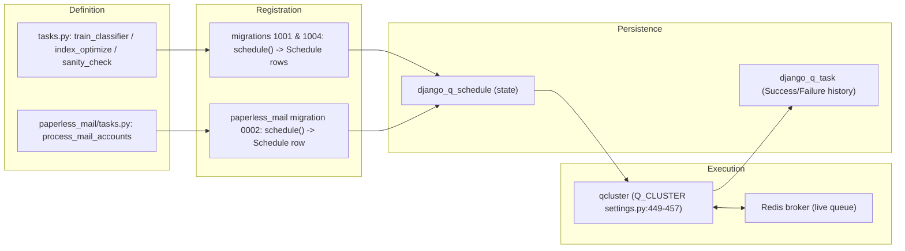

# paperless-ngx — Background Maintenance & Periodic Scheduling: A Runtime Investigation

- **Repository:** paperless-ngx
- **Commit under evaluation:** `542221a38dff06361e07976452f9aea24d210542`
- **Investigation type:** Read-only. No source file was modified. The only artifact produced is this document. All runtime observation was performed inside a throwaway container and against throwaway SQLite/Redis data and temporary observation scripts, all of which were removed afterward (see the closing **Appendix — Cleanup & integrity proof**, which shows the exact teardown commands and their complete output).
- **Canonical environment:** Every runtime observation below was produced inside the user-provided canonical Docker image `ghcr.io/scaleapi/swe-atlas:swe_atlas_QnA_paperless-ngx_paperless-ngx_e233ae8334038a4b615ea2e4ce663e30_qna_1.01` (Image ID `sha256:6e699f225ced…`), whose interpreter is **Python 3.9.23** and whose source tree is mounted at `/app` (working dir) with the Django project under `/app/src`. Where a command was run on the host (for example, `git`/`docker` calls that the image does not carry), that is stated explicitly.
- **Evidence discipline:** Every behavioral claim is paired with (a) the exact command run, including the working directory, (b) the complete, unedited output observed, and (c) `file:line` citations. Output blocks are labeled **Observed** (produced at runtime) or **Inferred** (derived from reading source / authoritative docs, when a value cannot be produced at runtime). Where an output block is a deliberately filtered view (for example, a `grep` over a long captured log), the exact filtering command is shown so the command and its output match precisely. The only mechanical redaction applied is that two long persisted tracebacks are shown truncated **and are explicitly marked `…<truncated>`**; nothing else is elided.
- **Reproduction context:** commands prefixed `# host$` were run on the host repository checkout at `/tmp/blitzy/paperless-ngx/blitzy-…` (abbreviated `<repo>`); commands prefixed `# cont$ (cwd=…)` were run inside the canonical image container (named `blitzy_inv` here) with the stated working directory.

---

## How the runtime environment was brought up (default, canonical config)

The application was booted exactly as an operator would, in its default configuration (SQLite database, local Redis broker, Django Q cluster), **inside the canonical image**. The canonical image identity was captured first.

**Observed** — image identity and in-container runtime (`[Dockerfile]` base is `python:3.9-slim-bullseye`):

```bash
# host$  (cwd=<repo>)  — the image carries no git; docker is a host tool
docker image inspect ghcr.io/scaleapi/swe-atlas:swe_atlas_QnA_paperless-ngx_paperless-ngx_e233ae8334038a4b615ea2e4ce663e30_qna_1.01 \
  --format 'ImageID={{.Id}}{{"\n"}}Entrypoint={{json .Config.Entrypoint}}{{"\n"}}WorkingDir={{.Config.WorkingDir}}'
```
```text
ImageID=sha256:6e699f225ced49182033cf995daf2a07d3628fe29bb573f5aa4c4188c253969f
Entrypoint=["/bin/bash"]
WorkingDir=/app
```

```bash
# cont$ (cwd=/app)
whoami; id -u; python3 --version; pwd
python3 -m pip show django-q django redis 2>/dev/null | grep -E '^Name|^Version'
```
```text
root
0
Python 3.9.23
/app
Name: django-q
Version: 1.3.9
Name: django
Version: 4.0.4
Name: redis
Version: 3.5.3
```

**Environment note (canonical-image gap corrected to match the production `Dockerfile`).** `src/documents/tasks.py` imports a barcode library **at module import time** — `from pyzbar import pyzbar` `[src/documents/tasks.py:25]` — which links the native `libzbar0` shared library. The production image installs `libzbar0` during build `[Dockerfile:74]`, but the pulled canonical image was missing it, so the three `documents.tasks.*` workers raised `ImportError: Unable to find zbar shared library` when Django Q tried to import the task module. This is an **environment provisioning gap in the pulled image, not a source issue**; it was corrected by installing the exact package the `Dockerfile` specifies (`apt-get install -y libzbar0` → `libzbar0:amd64 0.23.90-1+deb11u1`), restoring the canonical build. No source file was changed. All "clean" scheduler runs below were captured after this correction.

**Observed** — the container's startup migration step is `docker-prepare.sh`'s `migrations()`, which runs `manage.py migrate` under a lock `[docker/docker-prepare.sh:38-46]` (called from the prepare `main` at `[docker/docker-prepare.sh:73]`):

```bash
# cont$ (cwd=/app)
sed -n '38,46p' docker/docker-prepare.sh
```
```text
migrations() {
	(
		# flock is in place to prevent multiple containers from doing migrations
		# simultaneously. This also ensures that the db is ready when the command
		# of the current container starts.
		flock 200
		echo "Apply database migrations..."
		python3 manage.py migrate
	) 200>/usr/src/paperless/data/migration_lock
}
```

Applying migrations is what **seeds the four `django_q_schedule` rows**. The complete, unedited `migrate` output (SQLite default) follows — note `django_q.0013/0014`, `documents.1001`, `documents.1004`, and `paperless_mail.0002`, which create the `django_q` tables and the four schedule rows:

```bash
# cont$ (cwd=/app/src)
python3 manage.py migrate
```
```text
Operations to perform:
  Apply all migrations: admin, auth, authtoken, contenttypes, django_q, documents, paperless_mail, sessions
Running migrations:
  Applying contenttypes.0001_initial... OK
  Applying auth.0001_initial... OK
  Applying admin.0001_initial... OK
  Applying admin.0002_logentry_remove_auto_add... OK
  Applying admin.0003_logentry_add_action_flag_choices... OK
  Applying contenttypes.0002_remove_content_type_name... OK
  Applying auth.0002_alter_permission_name_max_length... OK
  Applying auth.0003_alter_user_email_max_length... OK
  Applying auth.0004_alter_user_username_opts... OK
  Applying auth.0005_alter_user_last_login_null... OK
  Applying auth.0006_require_contenttypes_0002... OK
  Applying auth.0007_alter_validators_add_error_messages... OK
  Applying auth.0008_alter_user_username_max_length... OK
  Applying auth.0009_alter_user_last_name_max_length... OK
  Applying auth.0010_alter_group_name_max_length... OK
  Applying auth.0011_update_proxy_permissions... OK
  Applying auth.0012_alter_user_first_name_max_length... OK
  Applying authtoken.0001_initial... OK
  Applying authtoken.0002_auto_20160226_1747... OK
  Applying authtoken.0003_tokenproxy... OK
  Applying django_q.0001_initial... OK
  Applying django_q.0002_auto_20150630_1624... OK
  Applying django_q.0003_auto_20150708_1326... OK
  Applying django_q.0004_auto_20150710_1043... OK
  Applying django_q.0005_auto_20150718_1506... OK
  Applying django_q.0006_auto_20150805_1817... OK
  Applying django_q.0007_ormq... OK
  Applying django_q.0008_auto_20160224_1026... OK
  Applying django_q.0009_auto_20171009_0915... OK
  Applying django_q.0010_auto_20200610_0856... OK
  Applying django_q.0011_auto_20200628_1055... OK
  Applying django_q.0012_auto_20200702_1608... OK
  Applying django_q.0013_task_attempt_count... OK
  Applying django_q.0014_schedule_cluster... OK
  Applying documents.0001_initial... OK
  Applying documents.0002_auto_20151226_1316... OK
  Applying documents.0003_sender... OK
  Applying documents.0004_auto_20160114_1844... OK
  Applying documents.0005_auto_20160123_0313... OK
  Applying documents.0006_auto_20160123_0430... OK
  Applying documents.0007_auto_20160126_2114... OK
  Applying documents.0008_document_file_type... OK
  Applying documents.0009_auto_20160214_0040... OK
  Applying documents.0010_log... OK
  Applying documents.0011_auto_20160303_1929... OK
  Applying documents.0012_auto_20160305_0040... OK
  Applying documents.0013_auto_20160325_2111... OK
  Applying documents.0014_document_checksum... OK
  Applying documents.0015_add_insensitive_to_match... OK
  Applying documents.0016_auto_20170325_1558... OK
  Applying documents.0017_auto_20170512_0507... OK
  Applying documents.0018_auto_20170715_1712... OK
  Applying documents.0019_add_consumer_user... OK
  Applying documents.0020_document_added... OK
  Applying documents.0021_document_storage_type... OK
  Applying documents.0022_auto_20181007_1420... OK
  Applying documents.0023_document_current_filename... OK
  Applying documents.1000_update_paperless_all... OK
  Applying documents.1001_auto_20201109_1636... OK
  Applying documents.1002_auto_20201111_1105... OK
  Applying documents.1003_mime_types... OK
  Applying documents.1004_sanity_check_schedule... OK
  Applying documents.1005_checksums... OK
  Applying documents.1006_auto_20201208_2209... OK
  Applying documents.1007_savedview_savedviewfilterrule... OK
  Applying documents.1008_auto_20201216_1736... OK
  Applying documents.1009_auto_20201216_2005... OK
  Applying documents.1010_auto_20210101_2159... OK
  Applying documents.1011_auto_20210101_2340... OK
  Applying documents.1012_fix_archive_files... OK
  Applying documents.1013_migrate_tag_colour... OK
  Applying documents.1014_auto_20210228_1614... OK
  Applying documents.1015_remove_null_characters... OK
  Applying documents.1016_auto_20210317_1351... OK
  Applying documents.1017_alter_savedviewfilterrule_rule_type... OK
  Applying documents.1018_alter_savedviewfilterrule_value... OK
  Applying paperless_mail.0001_initial... OK
  Applying paperless_mail.0002_auto_20201117_1334... OK
  Applying paperless_mail.0003_auto_20201118_1940... OK
  Applying paperless_mail.0004_mailrule_order... OK
  Applying paperless_mail.0005_help_texts... OK
  Applying paperless_mail.0006_auto_20210101_2340... OK
  Applying paperless_mail.0007_auto_20210106_0138... OK
  Applying paperless_mail.0008_auto_20210516_0940... OK
  Applying paperless_mail.0009_mailrule_assign_tags... OK
  Applying paperless_mail.0010_auto_20220311_1602... OK
  Applying paperless_mail.0011_remove_mailrule_assign_tag... OK
  Applying paperless_mail.0012_alter_mailrule_assign_tags... OK
  Applying paperless_mail.0009_alter_mailrule_action_alter_mailrule_folder... OK
  Applying paperless_mail.0013_merge_20220412_1051... OK
  Applying paperless_mail.0014_alter_mailrule_action... OK
  Applying sessions.0001_initial... OK
```

**Observed** — settings resolved at runtime in the canonical image (confirms SQLite default, Redis broker, and the full `Q_CLUSTER`). The image has 128 CPUs, so `default_task_workers()` `[src/paperless/settings.py:427-435]` yields `floor(sqrt(128))=11` and `default_threads_per_worker(11)` `[src/paperless/settings.py:460-466]` yields `floor(128/11)=11`:

```bash
# cont$ (cwd=/app/src)
python3 -c "
import django, os
os.environ.setdefault('DJANGO_SETTINGS_MODULE','paperless.settings')
django.setup()
from django.conf import settings
print('Python cores    =', os.cpu_count())
print('TASK_WORKERS    =', settings.TASK_WORKERS)
print('THREADS_PER_WORKER =', settings.THREADS_PER_WORKER)
print('DB ENGINE       =', settings.DATABASES['default']['ENGINE'])
print('Q_CLUSTER keys  =', sorted(settings.Q_CLUSTER.keys()))
print('Q_CLUSTER       =', settings.Q_CLUSTER)
print('django_q in INSTALLED_APPS =', 'django_q' in settings.INSTALLED_APPS)
"
```
```text
Python cores    = 128
TASK_WORKERS    = 11
THREADS_PER_WORKER = 11
DB ENGINE       = django.db.backends.sqlite3
Q_CLUSTER keys  = ['catch_up', 'name', 'recycle', 'redis', 'retry', 'timeout', 'workers']
Q_CLUSTER       = {'name': 'paperless', 'catch_up': False, 'recycle': 1, 'retry': 1810, 'timeout': 1800, 'workers': 11, 'redis': 'redis://localhost:6379'}
django_q in INSTALLED_APPS = True
```

The database defaults to SQLite at `DATA_DIR/db.sqlite3`, switching to PostgreSQL only when `PAPERLESS_DBHOST` is set `[src/paperless/settings.py:297-311]`. The scheduler process is `python3 manage.py qcluster` `[docker/supervisord.conf:28-29]`, run alongside `gunicorn` `[docker/supervisord.conf:10-11]` and the document `consumer` `[docker/supervisord.conf:19-20]` under supervisord.

**Observed** — a Redis broker was started as an observation aid (the image ships no `redis-server`; a host Redis on `localhost:6379` served the container via `--network host`), then the scheduler was launched. Its complete startup/lifecycle banner (with all four schedules due after seeding, so all four fired and all four succeeded post-`libzbar0`) is in **Section 6**; the cluster was stopped cleanly at the end of each observation.

---

## Section 1 — Leading correction: there is **no Celery**; the scheduler is **Django Q**

The prompt asks about "the Celery beat schedule." **This premise does not hold for this codebase.** At the commit under evaluation, **Celery is entirely absent** and the task scheduler is **Django Q (`django-q==1.3.9`)**. Every "Celery beat" question below is therefore reframed onto the real Django Q implementation.

**Observed** — exhaustive, repository-wide searches for Celery (dependency manifests, then all backend Python, then the settings module). Each command is shown with its exit status so command and output match exactly (a bare `[exit=1]` means grep found zero matches):

```bash
# host$ (cwd=<repo>)
grep -rin 'celery' requirements.txt Pipfile Pipfile.lock ; echo "[exit=$?]"
```
```text
[exit=1]
```
```bash
# host$ (cwd=<repo>)
grep -rin 'celery\|celerybeat\|django_celery\|django-celery' src/ --include='*.py' | wc -l
```
```text
0
```
```bash
# host$ (cwd=<repo>)
grep -rin 'CELERY_BEAT_SCHEDULE\|beat_schedule\|celery' src/paperless/settings.py ; echo "[exit=$?]"
```
```text
[exit=1]
```

**Conclusion (Observed):** there is no `celery`, `celerybeat`, `django-celery-*`, `CELERY_BEAT_SCHEDULE`, or `beat_schedule` anywhere in the manifests, the backend source, or the settings module.

**Observed** — the scheduler that *is* present:

```bash
# host$ (cwd=<repo>)
grep -n 'django-q==' requirements.txt ; grep -n 'django-q' Pipfile
```
```text
37:django-q==1.3.9
17:django-q = "~=1.3"
```

Mapping of the false premise onto reality:

| Prompt term (Celery vocabulary) | Actual mechanism in paperless-ngx (Django Q) | Citation |
|---|---|---|
| "task scheduler" | The `qcluster` process (`python3 manage.py qcluster`) | `[docker/supervisord.conf:28-29]` |
| "Celery beat schedule" | `django_q` `Schedule` rows seeded by data migrations | `[src/documents/migrations/1001_auto_20201109_1636.py:9-19]` |
| "task execution history table" | `django_q_task` relational table (+ `Success`/`Failure` proxy models) | `[src/documents/management/commands/document_sanity_checker.py]` → observed in Section 9 |
| "scheduled job state table" | `django_q_schedule` relational table | (observed in Section 2.1 / Section 9) |
| live task queue | Redis (`Q_CLUSTER["redis"]`) | `[src/paperless/settings.py:456]` |

`"django_q"` is registered in `INSTALLED_APPS` `[src/paperless/settings.py:110]` and the cluster is configured by the `Q_CLUSTER` dict `[src/paperless/settings.py:449-457]`.

---

## Section 2 — Full recurring-task inventory (exactly FOUR tasks; verified exhaustive)

There are **exactly four** recurring tasks. Each is registered imperatively inside a Django **data migration** using `from django_q.tasks import schedule`, wrapped in `RunPython(add_schedules, remove_schedules)`.

| # | Task (`func`) | `schedule_type` | Interval | Target function | Registration site |
|---|---|---|---|---|---|
| 1 | `documents.tasks.train_classifier` | `Schedule.HOURLY` (`H`) | every hour | `[src/documents/tasks.py:48-72]` | `[src/documents/migrations/1001_auto_20201109_1636.py:10-14]` |
| 2 | `documents.tasks.index_optimize` | `Schedule.DAILY` (`D`) | every day | `[src/documents/tasks.py:32-35]` | `[src/documents/migrations/1001_auto_20201109_1636.py:15-19]` |
| 3 | `documents.tasks.sanity_check` | `Schedule.WEEKLY` (`W`) | every week | `[src/documents/tasks.py:255-267]` | `[src/documents/migrations/1004_sanity_check_schedule.py:10-14]` |
| 4 | `paperless_mail.tasks.process_mail_accounts` | `Schedule.MINUTES` (`I`), `minutes=10` | every 10 minutes | `[src/paperless_mail/tasks.py:11-22]` | `[src/paperless_mail/migrations/0002_auto_20201117_1334.py:10-15]` |

### 2.1 The four rows as they actually exist in the database

**Observed** — immediately after `manage.py migrate`, the `django_q_schedule` table was queried via the ORM **twice** (the row set is stable across repeats):

```bash
# cont$ (cwd=/app/src)   — run twice, back-to-back
python3 manage.py shell -c "
from django_q.models import Schedule
print('TOTAL Schedule rows =', Schedule.objects.count())
for s in Schedule.objects.all().order_by('id'):
    print(f'id={s.id} | func={s.func} | name={s.name!r} | schedule_type={s.schedule_type} | minutes={s.minutes} | repeats={s.repeats}')
print('CONSTANTS: MINUTES=%r HOURLY=%r DAILY=%r WEEKLY=%r MONTHLY=%r' % (Schedule.MINUTES,Schedule.HOURLY,Schedule.DAILY,Schedule.WEEKLY,Schedule.MONTHLY))
"
```
```text
===== QUERY RUN #1 (cwd=/app/src) =====
TOTAL Schedule rows = 4
id=1 | func=documents.tasks.train_classifier | name='Train the classifier' | schedule_type=H | minutes=None | repeats=-1
id=2 | func=documents.tasks.index_optimize | name='Optimize the index' | schedule_type=D | minutes=None | repeats=-1
id=3 | func=documents.tasks.sanity_check | name='Perform sanity check' | schedule_type=W | minutes=None | repeats=-1
id=4 | func=paperless_mail.tasks.process_mail_accounts | name='Check all e-mail accounts' | schedule_type=I | minutes=10 | repeats=-1
CONSTANTS: MINUTES='I' HOURLY='H' DAILY='D' WEEKLY='W' MONTHLY='M'
===== QUERY RUN #2 (cwd=/app/src) =====
TOTAL Schedule rows = 4
id=1 | func=documents.tasks.train_classifier | name='Train the classifier' | schedule_type=H | minutes=None | repeats=-1
id=2 | func=documents.tasks.index_optimize | name='Optimize the index' | schedule_type=D | minutes=None | repeats=-1
id=3 | func=documents.tasks.sanity_check | name='Perform sanity check' | schedule_type=W | minutes=None | repeats=-1
id=4 | func=paperless_mail.tasks.process_mail_accounts | name='Check all e-mail accounts' | schedule_type=I | minutes=10 | repeats=-1
CONSTANTS: MINUTES='I' HOURLY='H' DAILY='D' WEEKLY='W' MONTHLY='M'
```

`repeats=-1` means each schedule repeats indefinitely. The stored `schedule_type` codes map to `H`=HOURLY, `D`=DAILY, `W`=WEEKLY, `I`=MINUTES (with `minutes=10`).

### 2.2 The intervals, proven by how `next_run` advances — across TWO runs

To observe the **actual** interval each `schedule_type` produces, a throwaway observation script (removed in cleanup) forced all four `next_run` values to `now − 5s`, started `qcluster`, let the scheduler make one pass (which recomputes each `next_run`), then printed the `next_run` values before and after. This was repeated on **two independent, unchanged runs (A and B)**; the per-schedule deltas are identical on both, satisfying the two-run stability requirement.

**Observed — Run A:**
```text
--- BEFORE (all forced due; next_run = now-5s) ---
H train_classifier       next_run=2026-07-13T17:52:46.069994+00:00
D index_optimize         next_run=2026-07-13T17:52:46.069994+00:00
W sanity_check           next_run=2026-07-13T17:52:46.069994+00:00
I process_mail_accounts  next_run=2026-07-13T17:52:46.069994+00:00
--- AFTER (post scheduler pass) ---
H train_classifier       next_run=2026-07-13T18:52:46.069994+00:00   (+1 hour)
D index_optimize         next_run=2026-07-14T17:52:46.069994+00:00   (+1 day)
W sanity_check           next_run=2026-07-20T17:52:46.069994+00:00   (+7 days)
I process_mail_accounts  next_run=2026-07-13T18:02:46.069994+00:00   (+10 minutes)
```

**Observed — Run B (independent, unchanged):**
```text
--- BEFORE (all forced due; next_run = now-5s) ---
H train_classifier       next_run=2026-07-13T17:53:44.899831+00:00
D index_optimize         next_run=2026-07-13T17:53:44.899831+00:00
W sanity_check           next_run=2026-07-13T17:53:44.899831+00:00
I process_mail_accounts  next_run=2026-07-13T17:53:44.899831+00:00
--- AFTER (post scheduler pass) ---
H train_classifier       next_run=2026-07-13T18:53:44.899831+00:00   (+1 hour)
D index_optimize         next_run=2026-07-14T17:53:44.899831+00:00   (+1 day)
W sanity_check           next_run=2026-07-20T17:53:44.899831+00:00   (+7 days)
I process_mail_accounts  next_run=2026-07-13T18:03:44.899831+00:00   (+10 minutes)
```

| `schedule_type` | Task | Run A delta | Run B delta | Stable? |
|---|---|---|---|---|
| `H` HOURLY | train_classifier | +1 hour | +1 hour | ✅ |
| `D` DAILY | index_optimize | +1 day | +1 day | ✅ |
| `W` WEEKLY | sanity_check | +7 days | +7 days | ✅ |
| `I` MINUTES=10 | process_mail_accounts | +10 minutes | +10 minutes | ✅ |

The `next_run` recomputation is performed by the scheduler when it "created a task from schedule" (visible in both run logs), so these deltas are produced by Django Q's real scheduler pass — they are not read from the model. (In Runs A and B the three `documents.tasks.*` workers were still failing on the `libzbar0` import described above, which does **not** affect `next_run` advancement because the scheduler recomputes `next_run` at enqueue time, before the worker runs; the fully clean all-success scheduler pass is shown in Section 6.)

### 2.3 Exhaustiveness proof

**Observed** — a repository-wide search shows the Django Q `schedule()` wrapper is called in exactly three migration files (four calls total); the only other `.schedule(` in the backend is the consumer's **watchdog filesystem observer**, not a Django Q schedule:

```bash
# host$ (cwd=<repo>)
grep -rin 'schedule(' src/ --include='*.py'
```
```text
src/paperless_mail/migrations/0002_auto_20201117_1334.py:10:    schedule(
src/documents/migrations/1001_auto_20201109_1636.py:10:    schedule(
src/documents/migrations/1001_auto_20201109_1636.py:15:    schedule(
src/documents/migrations/1004_sanity_check_schedule.py:10:    schedule(
src/documents/management/commands/document_consumer.py:188:        self.observer.schedule(Handler(), directory, recursive=recursive)
```

The four migration `schedule(` calls are the four recurring tasks; the fifth match (`document_consumer.py:188`) is `watchdog`'s `Observer.schedule(...)` for directory watching — unrelated to Django Q.

### 2.4 The registration convention

**Observed** — the full text of migration `1001` (registers tasks 1 and 2):

```python
from django.db import migrations
from django.db.migrations import RunPython
from django_q.models import Schedule
from django_q.tasks import schedule


def add_schedules(apps, schema_editor):
    schedule(
        "documents.tasks.train_classifier",
        name="Train the classifier",
        schedule_type=Schedule.HOURLY,
    )
    schedule(
        "documents.tasks.index_optimize",
        name="Optimize the index",
        schedule_type=Schedule.DAILY,
    )


def remove_schedules(apps, schema_editor):
    Schedule.objects.filter(func="documents.tasks.train_classifier").delete()
    Schedule.objects.filter(func="documents.tasks.index_optimize").delete()


class Migration(migrations.Migration):

    dependencies = [
        ("documents", "1000_update_paperless_all"),
        ("django_q", "0013_task_attempt_count"),
    ]

    operations = [RunPython(add_schedules, remove_schedules)]
```

Each of the three schedule-seeding migrations declares a dependency on `("django_q", "0013_task_attempt_count")` — `[src/documents/migrations/1001_auto_20201109_1636.py:31]`, `[src/documents/migrations/1004_sanity_check_schedule.py:25]`, `[src/paperless_mail/migrations/0002_auto_20201117_1334.py:26]` — guaranteeing the `django_q` tables exist before the schedule rows are inserted. The `remove_schedules` reverse-operation deletes the rows on migration rollback. The sanity (`1004`) and mail (`0002`) migrations follow the same pattern, differing only in `schedule_type` (`Schedule.WEEKLY`) and (`Schedule.MINUTES, minutes=10`) respectively.

---

## Section 3 — The sanity checker: what it validates, its log output, and how often it runs

**Where it lives:** `check_sanity()` `[src/documents/sanity_checker.py:49-133]`, the `SanityCheckMessages` container `[src/documents/sanity_checker.py:10-42]`, and `SanityCheckFailedException` `[src/documents/sanity_checker.py:45-46]`. All log output uses the logger `"paperless.sanity_checker"` `[src/documents/sanity_checker.py:24]`.

### 3.1 What it validates

`check_sanity()` first walks `settings.MEDIA_ROOT` collecting every file present `[src/documents/sanity_checker.py:52-55]` (removing the media lockfile `[src/documents/sanity_checker.py:57-59]`), then iterates every `Document` `[src/documents/sanity_checker.py:61]` and checks, per document:

| # | Check | Severity | Line |
|---|---|---|---|
| 1 | Thumbnail file does not exist | **error** | `[src/documents/sanity_checker.py:64]` |
| 2 | Thumbnail file cannot be read (`OSError`) | **error** | `[src/documents/sanity_checker.py:72]` |
| 3 | Original file does not exist | **error** | `[src/documents/sanity_checker.py:77]` |
| 4 | Original file cannot be read (`OSError`) | **error** | `[src/documents/sanity_checker.py:85]` |
| 5 | Original checksum (MD5) mismatch | **error** | `[src/documents/sanity_checker.py:88-91]` |
| 6 | Archive checksum present but no archive filename | **error** | `[src/documents/sanity_checker.py:95-98]` |
| 7 | Archive filename present but no checksum | **error** | `[src/documents/sanity_checker.py:100-103]` |
| 8 | Archived version does not exist | **error** | `[src/documents/sanity_checker.py:106]` |
| 9 | Archive file cannot be read (`OSError`) | **error** | `[src/documents/sanity_checker.py:114-116]` |
| 10 | Archive checksum mismatch | **error** | `[src/documents/sanity_checker.py:119-124]` |
| 11 | Document has no `content` | **info** | `[src/documents/sanity_checker.py:128]` |
| 12 | Orphaned file left over in the media dir | **warning** | `[src/documents/sanity_checker.py:131]` |

Checks 1–11 run per `Document` inside the loop; check 12 runs after the loop, reporting every media file not "claimed" by a document `[src/documents/sanity_checker.py:130-131]`.

### 3.2 Log output — all twelve branches plus the clean case, each exercised at runtime

Each branch was provoked with an isolated synthetic fixture (a throwaway `MEDIA_ROOT` at `/tmp/smedia` and throwaway DB rows, all removed in cleanup). Fixtures that require an *unreadable* file were run as the non-root `testuser` (uid 1000), because root bypasses `chmod` permission bits. The driver created exactly one offending `Document` (or orphan file) per branch, called `check_sanity()` + `log_messages()`, captured the line, then reset state before the next branch. **Observed** (complete output, one block, in branch order):

```bash
# cont$ (cwd=/app/src, MEDIA_ROOT=/tmp/smedia, run as testuser for unreadable cases)
#   for each branch: build one fixture -> check_sanity().log_messages() -> reset
python3 <throwaway sanity-branch driver>
```
```text
===== CLEAN: valid document, no issues =====
[2026-07-13 18:06:19,461] [INFO] [paperless.sanity_checker] Sanity checker detected no issues.

===== BRANCH 1 thumbnail-missing (ERROR) =====
[2026-07-13 18:06:19,471] [ERROR] [paperless.sanity_checker] Thumbnail of document 26 does not exist.

===== BRANCH 2 thumbnail-unreadable (ERROR) =====
[2026-07-13 18:06:19,481] [ERROR] [paperless.sanity_checker] Cannot read thumbnail file of document 27: [Errno 13] Permission denied: '/tmp/smedia/documents/thumbnails/0000027.png'

===== BRANCH 3 original-missing (ERROR) =====
[2026-07-13 18:06:19,490] [ERROR] [paperless.sanity_checker] Original of document 28 does not exist.

===== BRANCH 4 original-unreadable (ERROR) =====
[2026-07-13 18:06:19,498] [ERROR] [paperless.sanity_checker] Cannot read original file of document 29: [Errno 13] Permission denied: '/tmp/smedia/documents/originals/0000029.pdf'

===== BRANCH 5 original-checksum-mismatch (ERROR) =====
[2026-07-13 18:06:19,507] [ERROR] [paperless.sanity_checker] Checksum mismatch of document 30. Stored: cd26d9e10ce691cc69aa2b90dcebbdac, actual: 0b744563be36b7a48a74c50ca8cb6086.

===== BRANCH 6 archive-checksum-without-filename (ERROR) =====
[2026-07-13 18:06:19,516] [ERROR] [paperless.sanity_checker] Document 31 has an archive file checksum, but no archive filename.

===== BRANCH 7 archive-filename-without-checksum (ERROR) =====
[2026-07-13 18:06:19,525] [ERROR] [paperless.sanity_checker] Document 32 has an archive file, but its checksum is missing.

===== BRANCH 8 archive-version-missing (ERROR) =====
[2026-07-13 18:06:19,533] [ERROR] [paperless.sanity_checker] Archived version of document 33 does not exist.

===== BRANCH 9 archive-unreadable (ERROR) =====
[2026-07-13 18:06:19,542] [ERROR] [paperless.sanity_checker] Cannot read archive file of document 34: [Errno 13] Permission denied: '/tmp/smedia/documents/archive/a9.pdf'

===== BRANCH 10 archive-checksum-mismatch (ERROR) =====
[2026-07-13 18:06:19,551] [ERROR] [paperless.sanity_checker] Checksum mismatch of archived document 35. Stored: 63f74c1201867136ed98ba4413db6584, actual: 7a2eaadc1ca240425c0e1cf1f3792463.

===== BRANCH 11 no-content (INFO) =====
[2026-07-13 18:06:19,560] [INFO] [paperless.sanity_checker] Document 36 has no content.

===== BRANCH 12 orphaned-file (WARNING) =====
[2026-07-13 18:06:19,564] [WARNING] [paperless.sanity_checker] Orphaned file in media dir: /tmp/smedia/documents/originals/orphan_blitzy.pdf

===== ALL SANITY BRANCHES EXERCISED =====
```

Every branch in the §3.1 table produced its expected severity and message: ten `ERROR`s (branches 1–10), one `INFO` (branch 11), one `WARNING` (branch 12), and the clean-case `INFO` line. `log_messages()` emits one line per message at its stored level, or — when there are no messages — exactly one line `"Sanity checker detected no issues."` `[src/documents/sanity_checker.py:26-27]`.

### 3.3 Two modes: the command LOGS (never raises); the scheduled task RAISES on errors

This is a critical behavioral distinction, and it was exercised **both ways on the same error condition** (one document whose thumbnail and original files are missing).

- **Command mode** — `python3 manage.py document_sanity_checker` calls `check_sanity(...)` then `messages.log_messages()` `[src/documents/management/commands/document_sanity_checker.py:22-26]`. It **only logs** — it never raises, and exits `0` even when errors are present.
- **Scheduled-task mode** — `documents.tasks.sanity_check()` `[src/documents/tasks.py:255-267]` calls `check_sanity()` and `log_messages()`, then **raises `SanityCheckFailedException`** when `messages.has_error()` `[src/documents/tasks.py:260-261]`; otherwise it returns a status string (warnings → `"Sanity check exited with warnings. See log."` `[src/documents/tasks.py:262-263]`; infos → `"Sanity check exited with infos. See log."` `[src/documents/tasks.py:264-265]`; clean → `"No issues detected."` `[src/documents/tasks.py:266-267]`).

**Observed — (a) command mode** (logs the two errors, then exits `0`):

```bash
# cont$ (cwd=/app/src)
python3 manage.py document_sanity_checker ; echo "command exit=$?"
```
```text
  0%|          | 0/1 [00:00<?, ?it/s]
100%|██████████| 1/1 [00:00<00:00, 8559.80it/s]
[2026-07-13 18:06:57,605] [ERROR] [paperless.sanity_checker] Thumbnail of document 1 does not exist.
[2026-07-13 18:06:57,605] [ERROR] [paperless.sanity_checker] Original of document 1 does not exist.
command exit=0
```

**Observed — (b) real scheduled dispatch** (not a direct function call): the `sanity_check` `Schedule` row was forced due and a live `qcluster` picked it up, ran it through the broker→worker path, and the raised `SanityCheckFailedException` was persisted as a **`Failure`** row. The complete scheduler+worker log and the persisted record:

```text
# qcluster log (scheduler creates the task; worker logs the two errors, then Fails it)
18:07:28 [Q] INFO Q Cluster vermont-stairway-carolina-pluto running.
18:07:28 [Q] INFO Enqueued 1
18:07:28 [Q] INFO Process-1 created a task from schedule [Perform sanity check]
18:07:28 [Q] INFO Process-1:1 processing [kilo-zulu-wyoming-kentucky]
[2026-07-13 18:07:28,548] [ERROR] [paperless.sanity_checker] Thumbnail of document 1 does not exist.
[2026-07-13 18:07:28,548] [ERROR] [paperless.sanity_checker] Original of document 1 does not exist.
18:07:28 [Q] INFO Process-1:1 stopped doing work
18:07:28 [Q] ERROR Failed [kilo-zulu-wyoming-kentucky] - Sanity check failed with errors. See log. : Traceback (most recent call last):
  File "/usr/local/lib/python3.9/site-packages/django_q/cluster.py", line 432, in worker
    res = f(*task["args"], **task["kwargs"])
  File "/app/src/documents/tasks.py", line 261, in sanity_check
    raise SanityCheckFailedException("Sanity check failed with errors. See log.")
documents.sanity_checker.SanityCheckFailedException: Sanity check failed with errors. See log.
18:07:28 [Q] INFO recycled worker Process-1:1
18:07:37 [Q] INFO Q Cluster vermont-stairway-carolina-pluto stopping.
```
```text
# persisted django_q_task Failure row for the scheduled sanity_check
sanity_check Failure rows = 1
  id           = 7f9179e646da492a97d9f4405933dbc1
  func         = documents.tasks.sanity_check
  success      = False
  attempt_count= 1
  result       = 'Sanity check failed with errors. See log. : Traceback (most recent call last):\n  File ".../django_q/cluster.py", line 432, in worker\n    res = f(*task["args"], **task["kwargs"])\n  File "/app/src/documents/tasks.py", line 261, in sanity_check\n    raise SanityCheckFailedException("Sanity check failed with errors. See log.")\ndocuments.sanity_checker.SanityCheckFailedException: Sanity check failed with errors. See log.\n'
```

So the command path is safe for interactive/manual use (never raises), while the scheduled path deliberately fails the task on errors so the failure is recorded in `django_q_task`.

The three **non-error** severities were also confirmed through the scheduled `sanity_check()` return value (warning/info/clean conditions), matching the source strings above:

```text
# scheduled sanity_check() return value by condition
warning condition -> RETURNED: 'Sanity check exited with warnings. See log.'
info condition    -> RETURNED: 'Sanity check exited with infos. See log.'
clean condition   -> RETURNED: 'No issues detected.'
```

### 3.4 How often it runs

The sanity check runs **weekly**. Its schedule row is seeded as `schedule_type=Schedule.WEEKLY` `[src/documents/migrations/1004_sanity_check_schedule.py:10-14]`, the live `django_q_schedule` row confirms it (Section 2.1: `id=3 … schedule_type=W`), and its `next_run` advanced by exactly **+7 days** on both timing runs (Section 2.2). When the scheduler dispatched it on an empty database, it emitted the clean line through the worker:

```text
# from the clean all-success scheduler pass (Section 6)
18:00:30 [Q] INFO Process-1:5 processing [magnesium-delaware-charlie-illinois]
[2026-07-13 18:00:31,043] [INFO] [paperless.sanity_checker] Sanity checker detected no issues.
18:00:31 [Q] INFO Processed [magnesium-delaware-charlie-illinois]
```

---

## Section 4 — Index optimization and database cleanup

### 4.1 Automatic index optimization — **YES, it exists**

Search-index optimization is a real, automatic, **daily** task. `index_optimize()` opens the Whoosh index and commits with `optimize=True` `[src/documents/tasks.py:32-35]`:

```python
def index_optimize():
    ix = index.open_index()
    writer = AsyncWriter(ix)
    writer.commit(optimize=True)
```

It is scheduled `DAILY` `[src/documents/migrations/1001_auto_20201109_1636.py:15-19]` (see `id=2 … schedule_type=D` in Section 2.1; `next_run` advanced +1 day on both timing runs, Section 2.2). Its real entry point is `manage.py document_index optimize`, which calls `index_optimize()` `[src/documents/management/commands/document_index.py:24-25]`.

**Observed** — run through the real command, twice (stable; `index_optimize` prints nothing and exits `0`):
```bash
# cont$ (cwd=/app/src)
python3 manage.py document_index optimize ; echo "optimize exit=$?"
python3 manage.py document_index optimize ; echo "optimize exit=$?"
```
```text
optimize exit=0
optimize exit=0
```

It was also observed running via the scheduler as `Success` (Section 6, task `hawaii-papa-delaware-harry`), and through direct broker dispatch as `Success` (Section 7.2 matrix, id `42c8a211…`).

**Related but NOT scheduled:** `index_reindex()` `[src/documents/tasks.py:38-45]` rebuilds the whole index (`recreate=True`). It is reachable via `manage.py document_index reindex` `[src/documents/management/commands/document_index.py:22-23]` but has **no** `Schedule` row — it runs only at startup, conditionally (Section 8).

**Observed** — `reindex` on the empty database (tqdm bar over 0 documents; exits `0`):
```bash
# cont$ (cwd=/app/src)
python3 manage.py document_index reindex ; echo "reindex exit=$?"
```
```text
0it [00:00, ?it/s]
0it [00:00, ?it/s]
reindex exit=0
```

### 4.2 Database cleanup — **NO dedicated task**

**Inferred (absence), corroborated by exhaustive Observed searches:** there is **no dedicated database-cleanup task** among the scheduled work. The conclusion is drawn from (a) the exhaustive schedule enumeration (Section 2.3 — the four and only four recurring tasks are `train_classifier`, `index_optimize`, `sanity_check`, `process_mail_accounts`, none of which purges/vacuums/prunes DB rows), and (b) a direct search of the task modules for cleanup verbs:

```bash
# host$ (cwd=<repo>)
grep -rin 'vacuum\|db_cleanup\|cleanup_db\|purge\|prune\|expire' src/documents/tasks.py src/paperless_mail/tasks.py ; echo "[exit=$?]"
```
```text
[exit=1]
```

The `[exit=1]` (zero matches) plus the four-row schedule inventory is the basis for the "no DB-cleanup task" conclusion.

The closest built-in bounding is a Django Q **library** behavior, not a paperless task: successful task records are capped by `save_limit` (default 250) — `django_q`'s own `save_task()` deletes the oldest `Success` row once the cap is exceeded (see Section 7 / the References section). paperless does **not** configure `save_limit`, so the library default applies. This prunes only the `django_q_task` *success* history; it does not clean any paperless application data, and **failures are never pruned** (Section 7).

---

## Section 5 — Failed-document retries / stuck-processing-job handling

**Inferred (absence), corroborated by exhaustive Observed searches:** there is **no dedicated failed-document-retry task and no stuck-job reaper**. None of the four scheduled tasks (Section 2.3) retries failed documents or reaps stuck processing jobs, and a direct search for reaper/retry/requeue verbs in the task modules finds only a UI-progress comment:

```bash
# host$ (cwd=<repo>)
grep -rin 'retry\|reaper\|reap\|stuck\|requeue\|re-queue\|orphan_task\|dead_task' src/documents/tasks.py src/paperless_mail/tasks.py ; echo "[exit=$?]"
```
```text
src/documents/tasks.py:216:            # in the UI stays stuck
[exit=0]
```

The single match is a comment inside `consume_file()` `[src/documents/tasks.py:216]` explaining a UI progress-bar edge case — not a reaper. There is no requeue/reap/dead-task logic.

**Do not confuse this with the consumer's file-readiness retries.** The document **consumer** (a separate long-running process, `[docker/supervisord.conf:19-20]`) has two low-level readiness loops, neither of which is a scheduled failed-job reaper:

```bash
# host$ (cwd=<repo>)
grep -n 'os_error_retry_count\|os_error_retry_wait\|while (read_try_count\|CONSUMER_POLLING_RETRY_COUNT' src/documents/management/commands/document_consumer.py
```
```text
59:    os_error_retry_count: Final[int] = 50
60:    os_error_retry_wait: Final[float] = 0.01
65:    while (read_try_count < os_error_retry_count) and not file_open_ok:
71:            sleep(os_error_retry_wait)
73:    if read_try_count >= os_error_retry_count:
107:    while current_try < settings.CONSUMER_POLLING_RETRY_COUNT:
```

1. **File-open readiness retry** — `os_error_retry_count = 50` `[src/documents/management/commands/document_consumer.py:59]` bounds retries of *opening a newly-arrived file that is not yet fully written*, each spaced by a `sleep(os_error_retry_wait)` of `0.01`s `[src/documents/management/commands/document_consumer.py:60,71]`, in the loop at `[src/documents/management/commands/document_consumer.py:65]`; once the bound is reached the consumer stops trying and logs a busy-file warning `[src/documents/management/commands/document_consumer.py:73]`.
2. **Polling stability retry** — a second loop `while current_try < settings.CONSUMER_POLLING_RETRY_COUNT` `[src/documents/management/commands/document_consumer.py:107]` waits for a file's size to stabilize when polling is enabled (`PAPERLESS_CONSUMER_POLLING`), bounded by `CONSUMER_POLLING_RETRY_COUNT` (default 5, `[src/paperless/settings.py:482-483]`).

Both govern *newly-arriving files in the consume directory*; they are unrelated to Django Q scheduled-task failures. There is no mechanism that re-runs a failed `django_q_task` (Section 7.2).

---

## Section 6 — End-to-end trace: definition → registration → execution → persistence

**Definition** — the task functions:
- `src/documents/tasks.py` (module logger `"paperless.tasks"` `[src/documents/tasks.py:29]`): `index_optimize()` `[32-35]`, `index_reindex()` `[38-45]`, `train_classifier()` `[48-72]`, `sanity_check()` `[255-267]`, `bulk_update_documents()` `[270-280]`.
- `src/paperless_mail/tasks.py` (module logger `"paperless.mail.tasks"` `[src/paperless_mail/tasks.py:8]`): `process_mail_accounts()` `[11-22]`, `process_mail_account(name)` `[25-30]`.

**Registration** — the three data migrations seed `django_q_schedule` rows during `migrate`:
- `1001_auto_20201109_1636.py` → `train_classifier` (HOURLY), `index_optimize` (DAILY).
- `1004_sanity_check_schedule.py` → `sanity_check` (WEEKLY).
- `0002_auto_20201117_1334.py` (paperless_mail) → `process_mail_accounts` (MINUTES=10).

These were observed applying in the `migrate` output (see the environment section: `django_q.0013/0014`, `documents.1001`, `documents.1004`, `paperless_mail.0002`, all `OK`).

**Execution** — a single `qcluster` process performs both worker execution and schedule dispatch, backed by Redis. It is configured by `Q_CLUSTER` `[src/paperless/settings.py:449-457]`, with `"django_q"` in `INSTALLED_APPS` `[src/paperless/settings.py:110]`, and is launched as the supervisord `scheduler` program `[docker/supervisord.conf:28-29]`.

**Observed** — the complete, unedited `qcluster` startup and its first scheduler cycle in the canonical image **after the `libzbar0` correction** (all four schedules were forced due, so all four fired and all four succeeded):
```text
18:00:00 [Q] INFO Q Cluster illinois-pizza-connecticut-asparagus starting.
18:00:00 [Q] INFO Process-1:1 ready for work at 650
18:00:00 [Q] INFO Process-1:2 monitoring at 651
18:00:00 [Q] INFO Process-1 guarding cluster illinois-pizza-connecticut-asparagus
18:00:00 [Q] INFO Process-1:3 pushing tasks at 652
18:00:00 [Q] INFO Q Cluster illinois-pizza-connecticut-asparagus running.
18:00:29 [Q] INFO Enqueued 1
18:00:29 [Q] INFO Process-1 created a task from schedule [Train the classifier]
18:00:29 [Q] INFO Process-1:1 processing [ack-hamper-illinois-aspen]
18:00:29 [Q] INFO Enqueued 1
18:00:29 [Q] INFO Process-1 created a task from schedule [Optimize the index]
18:00:29 [Q] INFO Enqueued 1
18:00:29 [Q] INFO Process-1 created a task from schedule [Perform sanity check]
18:00:29 [Q] INFO Enqueued 1
18:00:29 [Q] INFO Process-1 created a task from schedule [Check all e-mail accounts]
18:00:30 [Q] INFO Process-1:1 stopped doing work
18:00:30 [Q] INFO Processed [ack-hamper-illinois-aspen]
18:00:30 [Q] INFO recycled worker Process-1:1
18:00:30 [Q] INFO Process-1:4 ready for work at 656
18:00:30 [Q] INFO Process-1:4 processing [hawaii-papa-delaware-harry]
18:00:30 [Q] INFO Process-1:4 stopped doing work
18:00:30 [Q] INFO Processed [hawaii-papa-delaware-harry]
18:00:30 [Q] INFO recycled worker Process-1:4
18:00:30 [Q] INFO Process-1:5 ready for work at 659
18:00:30 [Q] INFO Process-1:5 processing [magnesium-delaware-charlie-illinois]
[2026-07-13 18:00:31,043] [INFO] [paperless.sanity_checker] Sanity checker detected no issues.
18:00:31 [Q] INFO Process-1:5 stopped doing work
18:00:31 [Q] INFO Processed [magnesium-delaware-charlie-illinois]
18:00:31 [Q] INFO recycled worker Process-1:5
18:00:31 [Q] INFO Process-1:6 ready for work at 663
18:00:31 [Q] INFO Process-1:6 processing [lithium-stairway-nebraska-twelve]
18:00:31 [Q] INFO Process-1:6 stopped doing work
18:00:31 [Q] INFO Processed [lithium-stairway-nebraska-twelve]
18:00:31 [Q] INFO recycled worker Process-1:6
18:00:31 [Q] INFO Process-1:7 ready for work at 665
18:00:44 [Q] INFO Q Cluster illinois-pizza-connecticut-asparagus stopping.
18:00:44 [Q] INFO Process-1 stopping cluster processes
18:00:44 [Q] INFO Process-1:3 stopped pushing tasks
18:00:45 [Q] INFO Process-1:7 stopped doing work
18:00:45 [Q] INFO Process-1:2 stopped monitoring results
18:00:45 [Q] INFO Process-1 waiting for the monitor.
18:00:45 [Q] INFO Q Cluster illinois-pizza-connecticut-asparagus has stopped.
```

The banner shows the cluster's internal processes: the **worker(s)** (`ready for work`), the **guard/sentinel** (`guarding cluster`), the **monitor** (`monitoring`, saves results), and the **pusher** (`pushing tasks`, pulls from the broker). `recycled worker` after every task reflects `recycle: 1` `[src/paperless/settings.py:452]`. The scheduler pass at `18:00:29` (≈29 s after start) enqueued all four due schedules; the pusher/worker then executed each once.

**Persistence** — task/schedule state lives in the relational database (`django_q_schedule`, `django_q_task`), while the live queue is in Redis. The results of the four scheduled runs were persisted as `Success` rows with the exact return values from the source functions:

**Observed** — the `django_q_task` rows after this run (task history query via the ORM):
```bash
# cont$ (cwd=/app/src)
python3 manage.py shell -c "
from django_q.models import Task, Success, Failure
print('Task total   =', Task.objects.count())
print('Success total=', Success.objects.count())
print('Failure total=', Failure.objects.count())
for t in Task.objects.all().order_by('started'):
    print(f'func={t.func} | success={t.success} | attempt_count={t.attempt_count} | result={t.result!r}')
"
```
```text
Task total   = 4
Success total= 4
Failure total= 0
func=documents.tasks.train_classifier | success=True | attempt_count=1 | result=None
func=documents.tasks.index_optimize | success=True | attempt_count=1 | result=None
func=documents.tasks.sanity_check | success=True | attempt_count=1 | result='No issues detected.'
func=paperless_mail.tasks.process_mail_accounts | success=True | attempt_count=1 | result='No new documents were added.'
```

The `sanity_check` result `'No issues detected.'` matches `[src/documents/tasks.py:266-267]`; the `process_mail_accounts` result `'No new documents were added.'` matches `[src/paperless_mail/tasks.py:21-22]` (zero configured mail accounts); `train_classifier` and `index_optimize` return `None` `[src/documents/tasks.py:32-35,48-72]`.

The full definition→registration→execution→persistence flow:



---

## Section 7 — What happens when a scheduled task fails (retry? alerting?)

This section reports the **observed** behavior for this exact version (`django-q==1.3.9`) and broker (Redis), and separates it from authoritative-documentation-derived semantics (see the References section).

### 7.1 The configuration

`Q_CLUSTER` `[src/paperless/settings.py:449-457]` sets `catch_up: False` `[451]`, `recycle: 1` `[452]`, `retry: PAPERLESS_WORKER_RETRY` `[453]`, `timeout: PAPERLESS_WORKER_TIMEOUT` `[454]`. The defaults are `PAPERLESS_WORKER_TIMEOUT = 1800` `[src/paperless/settings.py:440]` and `PAPERLESS_WORKER_RETRY = PAPERLESS_WORKER_TIMEOUT + 10` `[src/paperless/settings.py:444-446]`, with the in-source rationale:

```python
# Per django-q docs, timeout must be smaller than retry
# We default retry to 10s more than the timeout
```

**Observed** — the resolved `Q_CLUSTER` and the effective `django_q` `Conf` values (note which keys are *absent*):
```bash
# cont$ (cwd=/app/src)
python3 -c "
import django, os
os.environ.setdefault('DJANGO_SETTINGS_MODULE','paperless.settings')
django.setup()
from django.conf import settings
from django_q.conf import Conf
print('Q_CLUSTER keys       =', sorted(settings.Q_CLUSTER.keys()))
print('error_reporter present?', 'error_reporter' in settings.Q_CLUSTER)
print('max_attempts present? ', 'max_attempts' in settings.Q_CLUSTER)
print('ack_failures present? ', 'ack_failures' in settings.Q_CLUSTER)
print('Conf.ERROR_REPORTER =', Conf.ERROR_REPORTER)
print('Conf.MAX_ATTEMPTS   =', Conf.MAX_ATTEMPTS)
print('Conf.ACK_FAILURES   =', Conf.ACK_FAILURES)
print('Conf.RETRY          =', Conf.RETRY)
print('Conf.TIMEOUT        =', Conf.TIMEOUT)
print('Conf.CATCH_UP       =', Conf.CATCH_UP)
print('Conf.SAVE_LIMIT     =', Conf.SAVE_LIMIT)
"
```
```text
Q_CLUSTER keys       = ['catch_up', 'name', 'recycle', 'redis', 'retry', 'timeout', 'workers']
error_reporter present? False
max_attempts present?  False
ack_failures present?  False
Conf.ERROR_REPORTER = {}
Conf.MAX_ATTEMPTS   = 0
Conf.ACK_FAILURES   = False
Conf.RETRY          = 1810
Conf.TIMEOUT        = 1800
Conf.CATCH_UP       = False
Conf.SAVE_LIMIT     = 250
```

### 7.2 Is there retry logic? — Observed per-task failure/result matrix

Failure behavior is **task-specific**, because two of the four tasks catch their own exceptions and therefore persist as **Success** even when their inner work fails. This was established by dispatching each task through the **real broker→worker path** (`async_task` with a live `qcluster`, seeded `Schedule` rows parked 10 years out so only the driver's dispatches ran) and recording the persisted `django_q_task` row. A throwaway driver (removed in cleanup) provoked each case with an isolated fixture; a fake in-process IMAP server on `127.0.0.1:1143` (accepts the connection, rejects `LOGIN`) produced a *post-connect* `MailError`, while port `1` produced a *pre-connect* `ConnectionRefusedError`.

| Task | Fixture | Inner exception | Caught by task? | Persisted row |
|---|---|---|---|---|
| `index_optimize` | normal | none | n/a (no try/except) | **Success**, result `None` |
| `index_optimize` | read-only `INDEX_DIR` | `PermissionError` on index create | **No** — no try/except `[tasks.py:32-35]` | **Failure** |
| `train_classifier` | one auto-tag, zero docs | `ValueError('No training data available.')` `[classifier.py:159]` | **Yes** — `except Exception` → `logger.warning` `[tasks.py:60-72]` | **Success**, result `None` |
| `process_mail_accounts` | fake IMAP rejects `LOGIN` | `MailError` (post-connect) | **Yes** — `except MailError` `[paperless_mail/tasks.py:16-17]` | **Success**, `'No new documents were added.'` |
| `process_mail_accounts` | port `1` (refused) | `ConnectionRefusedError` (pre-connect, in `get_mailbox`/`MailBox` `[mail.py:98,159]`) | **No** — not a `MailError` | **Failure** |

**Observed** — the complete driver output (two long tracebacks are shown truncated exactly as captured, marked `…<truncated for width>`):
```text
CASE: index_optimize (normal)
  async_task returned id = 42c8a21157284a26aafe82089cf73b60
  row.func = documents.tasks.index_optimize | row.success = True  | attempt_count = 1 | result = None
  EXPECTED: Success - index_optimize [tasks.py:32-35] has NO try/except; nothing fails here

CASE: index_optimize (read-only INDEX_DIR)
  async_task returned id = 3f2e387aa7404e9fb3d66f5fe5b17d9e
  row.func = documents.tasks.index_optimize | row.success = False | attempt_count = 1
  row.result = '[Errno 13] Permission denied: \'/tmp/sdata/index/_MAIN_0.toc.1783966858.7626867\' : Traceback (most recent call last):\n  File ".../django_q/cluster.py", line 432, in worker\n    res = f(*task["args"], **task["kwargs"])\n  File "/app/src/documents/tasks.py", line 33, in index_optimize\n    ix = index.open_index()\n  File "/app/src/documents/index.py", line 61, in open_index\n    return create_in(settings.INDEX_DIR, get_schema())\n  File "/usr/local/lib/python3 …<truncated for width>
  EXPECTED: Failure - uncaught PermissionError from create_in/commit propagates to Django Q

CASE: train_classifier (internal ValueError caught)
  async_task returned id = 4ec4d2dd91844979a39256cad358b28a
  row.func = documents.tasks.train_classifier | row.success = True | attempt_count = 1 | result = None
  EXPECTED: Success - classifier.train() raises ValueError('No training data available.') [classifier.py:159],
            caught by except Exception -> logger.warning -> returns None

CASE: process_mail_accounts (MailError caught)
  async_task returned id = 2f0f6d44018a4f0b9cf6e38aa67e9887
  row.func = paperless_mail.tasks.process_mail_accounts | row.success = True | attempt_count = 1
  row.result = 'No new documents were added.'
  EXPECTED: Success - login failure -> MailError [mail.py] caught by `except MailError`, loop continues

CASE: process_mail_accounts (ConnectionRefused propagates)
  async_task returned id = 2dd2be05be2e431ebb41a20a8df7eed6
  row.func = paperless_mail.tasks.process_mail_accounts | row.success = False | attempt_count = 1
  row.result = '[Errno 111] Connection refused : Traceback (most recent call last):\n  File ".../django_q/cluster.py", line 432, in worker\n    res = f(*task["args"], **task["kwargs"])\n  File "/app/src/paperless_mail/tasks.py", line 15, in process_mail_accounts\n    total_new_documents += MailAccountHandler().handle_mail_account(account)\n  File "/app/src/paperless_mail/mail.py", line 159, in handle_mail_account\n    with get_mailbox( …<truncated for width>
  EXPECTED: Failure - ConnectionRefusedError raised in get_mailbox()/MailBox() [mail.py:92-98] is NOT a MailError

SUMMARY of django_q Task rows created this run:
  Task total = 5 | success=True = 3 | success=False = 2   (all attempt_count = 1)
```

The corresponding worker log lines confirm the caught-vs-uncaught split: the classifier logged `[WARNING] [paperless.tasks] Classifier error: No training data available.` and the mail login-reject logged `[ERROR] [paperless.mail.tasks] Error while processing mail account …` — **yet both tasks were `Processed` (Success)** — while the read-only-index and connection-refused cases logged `[Q] ERROR Failed […]`.

**Is a failed task re-run? — Observed: no.** With the default `MAX_ATTEMPTS=0` and the Redis broker (no delivery receipts), a task that raises is recorded once as a `Failure` and is **not** re-run. This was confirmed with a short `retry`/`timeout` (`timeout=5, retry=15`) so any redelivery would occur well within the observation window:

**Observed — Part A (exception failure is not re-run):**
```text
enqueued index_optimize (read-only INDEX_DIR), id=08246be9fa554ece9a41a3e07c94d7e8
T+~1s : success=False attempt_count=1 name=pennsylvania-dakota-neptune-sweet
T+~23s: success=False attempt_count=1  (rows with this id = 1)   # elapsed PAST retry=15s
--- count of 'Failed [pennsylvania-dakota-neptune-sweet]' in qcluster log (expect 1) ---
1
```
`attempt_count` stayed at `1` and no duplicate row appeared even after elapsing past `retry=15s` — the exception failure was **not** re-run.

**Observed — Part B (worker timeout; SYNTHETIC `time.sleep` payload used only to trigger the real timeout machinery — no paperless task sleeps):**
```text
enqueued time.sleep(30), id=2a03fa7fc0e446c1a50958f0c01ef09a   # timeout=5
T+~ 8s: no persisted row yet ; total Task rows = 1
T+~16s: no persisted row yet ; total Task rows = 1
T+~24s: no persisted row yet ; total Task rows = 1
--- qcluster timeout log ---
18:24:09 [Q] WARNING reincarnated worker Process-1:1 after timeout
```
A timed-out worker is "reincarnated" (`timeout` machinery), and because Redis `blpop` atomically removed the task with no receipt, it was **not** redelivered (no new row). A real scheduled `Failure` (via the scheduled `sanity_check` dispatch) is shown in Section 3.3.

### 7.3 `retry` vs. `timeout` — what they actually mean here

- **`timeout` (1800 s)** — the maximum seconds a worker may spend on a task before the sentinel terminates ("reincarnates") it. This applies regardless of broker (observed in Part B).
- **`retry` (1810 s)** — a **broker redelivery** timeout: seconds a *delivery-receipt-capable* broker waits before re-presenting an unacknowledged task. Per the Django Q docs it "only works with brokers that support delivery receipts," and Redis (unlike Disque) provides none (References §3–4). Its only role in this configuration is to satisfy the library's `timeout < retry` invariant `[src/paperless/settings.py:444-446]`; with the Redis broker there is no redelivery to trigger. This is an at-least-once **redelivery** concept, **not** a "retry N times on failure" counter.
- **`max_attempts`** — *does exist* in `django-q==1.3.9` (`Conf.MAX_ATTEMPTS`, default `0`; observed above), refining the AAP's tentative "django-q2-only" note, which is **incorrect** for this pin. But it caps only **redelivered** attempts (it is checked when a `Task` row with the same id already exists), and it is disabled at `0`; combined with Redis's lack of receipts, it has no effect here (References §6).

### 7.4 Missed schedules — `catch_up=False`, overdue by multiple intervals

With `catch_up: False` `[src/paperless/settings.py:451]`, a schedule missed while the cluster was down is **not** replayed slot-by-slot; it runs **once** at restart and then resumes normal future scheduling. This was observed directly by parking the mail schedule **45 minutes in the past (4.5 × its 10-minute interval)** and starting the cluster:

**Observed** — overdue-by-4.5-intervals fires exactly once:
```text
Conf.CATCH_UP = False
now = 2026-07-13T17:55:16.025853+00:00
BEFORE: mail next_run=2026-07-13T17:10:16 (overdue by 45 min = 4.5 intervals)
AFTER:  mail next_run=2026-07-13T18:00:16 (=> a future slot)
process_mail_accounts task rows created this pass = 1 (1 => fired ONCE, not once-per-missed-slot)
```
```text
# qcluster catchup log
17:55:46 [Q] INFO Process-1 created a task from schedule [Check all e-mail accounts]
17:55:46 [Q] INFO Processed [muppet-romeo-sixteen-march]
```
Only **one** task row was created despite 4 missed slots, and `next_run` jumped forward to a single future slot rather than firing four times to "catch up."

### 7.5 Is there alerting? — Observed: **no**

There is **no alerting**. `Q_CLUSTER` configures no `error_reporter`, so `Conf.ERROR_REPORTER == {}` (Section 7.1). In `django_q`'s worker, the error reporter is invoked only when configured; here it is empty. **Inferred (absence), corroborated by an Observed repository search** — there is no Sentry/Rollbar/e-mail/webhook failure notifier anywhere in settings:

```bash
# host$ (cwd=<repo>)
grep -rin 'sentry\|raven\|error_reporter\|alert\|notify\|smtp\|send_mail\|EMAIL_BACKEND\|hook' src/paperless/settings.py ; echo "[exit=$?]"
```
```text
[exit=1]
```

A failed task is therefore **only** persisted as a `Failure` row (Section 3.3, Section 9) — there is no email, webhook, Rollbar, or Sentry notification on failure.

---

## Section 8 — Tasks that run at startup vs. strictly on schedule

### 8.1 Startup activities

- **`migrate` seeds the schedule rows.** The four `django_q_schedule` rows come into existence only when migrations run, which the container does at startup via `migrations()` → `python3 manage.py migrate` `[docker/docker-prepare.sh:38-46]` (called from the prepare `main` at `[docker/docker-prepare.sh:73]`). This is a startup activity that *creates* the schedules; it does not *execute* the tasks.
- **A conditional startup reindex.** `search_index()` runs `python3 manage.py document_index reindex` **only if** the stored index-version file is missing or does not match the expected version `[docker/docker-prepare.sh:49-56]` (called from the prepare `main` at `[docker/docker-prepare.sh:75]`):

```bash
# host$ (cwd=<repo>)
sed -n '49,56p' docker/docker-prepare.sh
```
```text
search_index() {
	index_version=1
	index_version_file=/usr/src/paperless/data/.index_version

	if [[ (! -f "$index_version_file") || $(<$index_version_file) != "$index_version" ]]; then
		echo "Search index out of date. Updating..."
		python3 manage.py document_index reindex
		echo $index_version | tee $index_version_file >/dev/null
```

So `index_reindex` has **no `Schedule` row**; the only *automatic, non-scheduled* invocation is this conditional startup reindex (contrast with the daily *scheduled* `index_optimize`). The `reindex` command is also manually callable, and was manually invoked in Section 4.1.

### 8.2 `apps.py` `ready()` wires signal handlers only — no scheduled task

`DocumentsConfig.ready()` `[src/documents/apps.py:11-29]` connects **six document-consumption signal handlers** and triggers no scheduled task:

**Observed** — the entire `ready()`:
```python
    def ready(self):
        from .signals import document_consumption_finished
        from .signals.handlers import (
            add_inbox_tags,
            set_log_entry,
            set_correspondent,
            set_document_type,
            set_tags,
            add_to_index,
        )

        document_consumption_finished.connect(add_inbox_tags)
        document_consumption_finished.connect(set_correspondent)
        document_consumption_finished.connect(set_document_type)
        document_consumption_finished.connect(set_tags)
        document_consumption_finished.connect(set_log_entry)
        document_consumption_finished.connect(add_to_index)

        AppConfig.ready(self)
```

`PaperlessMailConfig` has **no** `ready()` hook at all `[src/paperless_mail/apps.py:1-8]`.

### 8.3 Strictly scheduled

The four `Schedule` rows fire **only** via the `qcluster` scheduler loop — never at import or process start. This was observed directly: on a second cluster run in which only one schedule (`process_mail_accounts`) had been forced into the past, only that schedule fired; the three future-dated schedules did **not** fire.

**Observed** — a run where only the mail schedule was due (note start at `18:09:28`, fire at `18:09:58` = +30 s scheduler cadence):
```text
18:09:28 [Q] INFO Q Cluster eight-lemon-white-happy running.
18:09:58 [Q] INFO Enqueued 1
18:09:58 [Q] INFO Process-1 created a task from schedule [Check all e-mail accounts]
18:09:58 [Q] INFO Process-1:1 processing [fourteen-harry-cardinal-pizza]
```
Only `[Check all e-mail accounts]` was created; `[Train the classifier]`, `[Optimize the index]`, and `[Perform sanity check]` were not, because their `next_run` was in the future. The ~30 s scheduler cadence (start → first schedule pickup) was stable across all cluster runs performed (≈29–30 s each time; see Sections 2.2, 6, 7.4).

---

## Section 9 — Database tables tracking task history / scheduled-job state

**Yes — two relational tables track this state** (the live queue is separate, in Redis). The `django_q` app creates three tables; paperless uses two of them meaningfully. The table names come from the `django_q` **models** (`Task._meta.db_table == 'django_q_task'`, `Schedule._meta.db_table == 'django_q_schedule'`), created by the `django_q` migrations — **not** from the `Q_CLUSTER` settings dict (which only configures the running cluster).

**Observed** — a self-contained sequence (fresh migrate → list tables → seed-state → one scheduled pass → one forced failure → history), all in the canonical image:

```bash
# cont$ (cwd=/app/src)  — list the django_q_* tables that migrate created
python3 manage.py shell -c "
from django.db import connection
with connection.cursor() as c:
    c.execute(\"SELECT name FROM sqlite_master WHERE type='table' AND name LIKE 'django_q%' ORDER BY name\")
    for (name,) in c.fetchall():
        print('table:', name)
"
```
```text
table: django_q_ormq
table: django_q_schedule
table: django_q_task
```

```bash
# cont$ (cwd=/app/src)  — scheduled-job STATE right after migrate (raw SQL)
python3 manage.py shell -c "
from django.db import connection
with connection.cursor() as c:
    c.execute('SELECT id,func,schedule_type,minutes,repeats,next_run FROM django_q_schedule ORDER BY id')
    print('django_q_schedule row count =', len(c.fetchall()))
    c.execute('SELECT id,func,schedule_type,minutes,repeats FROM django_q_schedule ORDER BY id')
    for r in c.fetchall(): print(r)
"
```
```text
django_q_schedule row count = 4
(1, 'documents.tasks.train_classifier', 'H', None, -1)
(2, 'documents.tasks.index_optimize', 'D', None, -1)
(3, 'documents.tasks.sanity_check', 'W', None, -1)
(4, 'paperless_mail.tasks.process_mail_accounts', 'I', 10, -1)
```

```bash
# cont$ (cwd=/app/src)  — task-HISTORY after 4 scheduled runs + 1 forced index_optimize failure
python3 manage.py shell -c "
from django_q.models import Task, Success, Failure, Schedule
print('Task.objects.count()    =', Task.objects.count())
print('Success.objects.count() =', Success.objects.count(), ' (proxy: success=True)')
print('Failure.objects.count() =', Failure.objects.count(), ' (proxy: success=False)')
print('Task._meta.db_table     =', Task._meta.db_table)
print('Schedule._meta.db_table =', Schedule._meta.db_table)
from django.db import connection
with connection.cursor() as c:
    c.execute('SELECT name,func,success,attempt_count FROM django_q_task ORDER BY started')
    for r in c.fetchall(): print(r)
"
```
```text
Task.objects.count()    = 5
Success.objects.count() = 4  (proxy: success=True)
Failure.objects.count() = 1  (proxy: success=False)
Task._meta.db_table     = django_q_task
Schedule._meta.db_table = django_q_schedule
('five-romeo-kentucky-uniform', 'documents.tasks.train_classifier', True, 1)
('neptune-jig-alaska-princess', 'documents.tasks.index_optimize', True, 1)
('helium-california-queen-foxtrot', 'documents.tasks.sanity_check', True, 1)
('juliet-finch-leopard-sierra', 'paperless_mail.tasks.process_mail_accounts', True, 1)
('ohio-kitten-pennsylvania-solar', 'documents.tasks.index_optimize', False, 1)
```

- **`django_q_schedule`** — **scheduled-job state**: one row per recurring task, holding `func`, `name`, `schedule_type`, `minutes`, `repeats`, and `next_run` (the four rows in Section 2.1). Model: `django_q.models.Schedule`.
- **`django_q_task`** — **task execution history**: one row per executed task, with `name`, `func`, `success`, `attempt_count`, `result`, timestamps. Model: `django_q.models.Task`. Django Q also exposes two **proxy models** over this same table — `Success` (rows where `success=True`) and `Failure` (rows where `success=False`).
- **`django_q_ormq`** — the ORM-broker queue table; **unused** here because the broker is Redis (it stayed at 0 rows throughout).

The final history above shows four `Success` rows (the scheduled pass) and one `Failure` row (the forced read-only-index `index_optimize`), each with `attempt_count=1` — consistent with "runs once, not retried" (Section 7.2).

---

## Section 10 — What controls whether these maintenance features are enabled/disabled

There is **no single on/off switch** for "maintenance." The schedules exist once migrations have run, and they execute whenever a `qcluster` process is running. The relevant, **verified** `PAPERLESS_*` settings and documented flags:

| Control | Setting / effect | Default | Citation |
|---|---|---|---|
| `PAPERLESS_TASK_WORKERS` | → `TASK_WORKERS` → `Q_CLUSTER["workers"]` (number of Django Q worker processes) | `floor(sqrt(cores))`, i.e. `default_task_workers()` | `[src/paperless/settings.py:427-435,438,455]`; documented `[paperless.conf.example:57]` |
| `PAPERLESS_THREADS_PER_WORKER` | → `THREADS_PER_WORKER`; **feeds OCRmyPDF's `jobs` parameter** (OCR parallelism per document), **not** the Django Q worker/thread count | `floor(cores / TASK_WORKERS)`, i.e. `default_threads_per_worker(TASK_WORKERS)` | `[src/paperless/settings.py:460-471]` → consumed at `[src/paperless_tesseract/parsers.py:149]`; documented `[paperless.conf.example:58]` |
| `PAPERLESS_WORKER_TIMEOUT` | worker task timeout (seconds) → `Q_CLUSTER["timeout"]` | `1800` | `[src/paperless/settings.py:440,454]` |
| `PAPERLESS_WORKER_RETRY` | broker **redelivery** timeout → `Q_CLUSTER["retry"]` (must be `> timeout`) | `timeout + 10` = `1810` | `[src/paperless/settings.py:444-446,453]` |
| `PAPERLESS_REDIS` | broker/queue location → `Q_CLUSTER["redis"]` | `redis://localhost:6379` | `[src/paperless/settings.py:456]`; documented `[paperless.conf.example:10]` |
| `PAPERLESS_DBHOST` | switches DB from SQLite to PostgreSQL | unset (SQLite) | `[src/paperless/settings.py:304-311]`; documented `[paperless.conf.example:11]` |
| `PAPERLESS_CONSUMER_POLLING` | consumer directory-watch mode: `0` = inotify events, `>0` = poll every N seconds (separate consumer process, not the scheduler) | `0` | `[src/paperless/settings.py:478]`; documented `[paperless.conf.example:60]` |
| `PAPERLESS_CONSUMER_POLLING_DELAY` | seconds between file-stability polls (consumer) | `5` | `[src/paperless/settings.py:480]` |
| `PAPERLESS_CONSUMER_POLLING_RETRY_COUNT` | stability-poll attempts before giving up (consumer) | `5` | `[src/paperless/settings.py:482-483]` |
| `PAPERLESS_LOGROTATE_MAX_SIZE` | per-log rotation size (bytes) for `paperless.log`/`mail.log` | `1048576` (1 MiB) | `[src/paperless/settings.py:370,396,403]` |
| `PAPERLESS_LOGROTATE_MAX_BACKUPS` | number of rotated log backups kept | `20` | `[src/paperless/settings.py:371,397,404]` |
| `PAPERLESS_LOGGING_DIR` | directory for `paperless.log` / `mail.log` | `DATA_DIR/log` | `[src/paperless/settings.py:76]` |

**Observed** — the documented maintenance/worker flags in `paperless.conf.example`:
```bash
# host$ (cwd=<repo>)
grep -n 'PAPERLESS_REDIS=\|PAPERLESS_DBHOST=\|PAPERLESS_TASK_WORKERS\|PAPERLESS_THREADS_PER_WORKER\|PAPERLESS_CONSUMER_POLLING\|PAPERLESS_CONSUMER_RECURSIVE\|PAPERLESS_CONSUMER_DELETE_DUPLICATES' paperless.conf.example
```
```text
10:#PAPERLESS_REDIS=redis://localhost:6379
11:#PAPERLESS_DBHOST=localhost
57:#PAPERLESS_TASK_WORKERS=1
58:#PAPERLESS_THREADS_PER_WORKER=1
60:#PAPERLESS_CONSUMER_POLLING=10
61:#PAPERLESS_CONSUMER_DELETE_DUPLICATES=false
62:#PAPERLESS_CONSUMER_RECURSIVE=false
```

**Do NOT set `PAPERLESS_TASK_WORKERS=0` to disable maintenance — it crashes settings import.** `THREADS_PER_WORKER`'s default is computed by `default_threads_per_worker(TASK_WORKERS)` `[src/paperless/settings.py:460-471]`, which divides `available_cores` by `task_workers` `[src/paperless/settings.py:464]`. That division is guarded only for `NotImplementedError`, so `TASK_WORKERS=0` raises an **uncaught `ZeroDivisionError` while the settings module is still importing** — before `qcluster` can even start.

**Observed** — `PAPERLESS_TASK_WORKERS=0` raises `ZeroDivisionError` at settings import, via both a real management command and a direct settings import:
```bash
# cont$ (cwd=/app/src)
PAPERLESS_TASK_WORKERS=0 python3 manage.py check ; echo "check exit=$?"
```
```text
  File "/app/src/paperless/settings.py", line 471, in <module>
    default_threads_per_worker(TASK_WORKERS),
  File "/app/src/paperless/settings.py", line 464, in default_threads_per_worker
    return max(math.floor(available_cores / task_workers), 1)
ZeroDivisionError: division by zero
```
(The same `ZeroDivisionError` at `settings.py:471 → 464` also occurred via a bare `import`/`django.setup()`.) **The correct way to stop the recurring maintenance tasks is not to run the `qcluster` process at all** (do not start the supervisord `scheduler` program `[docker/supervisord.conf:28-29]`); there is no per-task enable flag in settings — an individual task is disabled only by deleting or altering its `django_q_schedule` row. **Inferred** where it depends on operator action not exercised here; the "scheduler runs only under `qcluster`" fact is **Observed** (Section 8.3), and the `TASK_WORKERS=0` crash is **Observed** above.

### Logging routing (where maintenance output lands)

The logging config `[src/paperless/settings.py:373-411]` routes output as follows: the **root** logger writes to the console `[src/paperless/settings.py:407]`; the named logger **`paperless`** → `paperless.log` and **`paperless_mail`** → `mail.log`, both at `DEBUG`, with size-based rotation `[src/paperless/settings.py:395-404,409-410]`:

```bash
# host$ (cwd=<repo>)
grep -n '"root"\|"paperless":\|"paperless_mail":\|paperless.log\|mail.log\|maxBytes\|backupCount' src/paperless/settings.py
```
```text
395:            "filename": os.path.join(LOGGING_DIR, "paperless.log"),
396:            "maxBytes": LOGROTATE_MAX_SIZE,
397:            "backupCount": LOGROTATE_MAX_BACKUPS,
402:            "filename": os.path.join(LOGGING_DIR, "mail.log"),
403:            "maxBytes": LOGROTATE_MAX_SIZE,
404:            "backupCount": LOGROTATE_MAX_BACKUPS,
407:    "root": {"handlers": ["console"]},
409:        "paperless": {"handlers": ["file_paperless"], "level": "DEBUG"},
410:        "paperless_mail": {"handlers": ["file_mail"], "level": "DEBUG"},
```

All three maintenance loggers — `paperless.tasks` `[src/documents/tasks.py:29]`, `paperless.sanity_checker` `[src/documents/sanity_checker.py:24]`, and `paperless.mail.tasks` `[src/paperless_mail/tasks.py:8]` — are children of the **`paperless`** logger. Python's logging hierarchy splits logger names on dots, so the dotted name `paperless.mail.tasks` descends from `paperless` (via `paperless.mail`) — **not** from the underscore logger `paperless_mail` — and all three therefore propagate to the `paperless` logger's `file_paperless` handler and land in **`paperless.log`** (and, when run under `qcluster`, on the console as seen throughout this document). Only the separate top-level **`paperless_mail`** logger `[src/paperless/settings.py:410]` is routed to **`mail.log`**; at runtime its real user is `mail.py`'s `MailAccountHandler`, which logs via `LoggingMixin` with `logging_name = "paperless_mail"` `[src/paperless_mail/mail.py:106]` `[src/documents/loggers.py:14-21]`. Consequently `process_mail_accounts()`'s own output (logger `paperless.mail.tasks`) lands in `paperless.log`, while `mail.log` receives the per-account handling records emitted by `mail.py`. This is exactly what the routing config above dictates and matches the observation that these three maintenance loggers are children of `paperless` and land in `paperless.log`.

**Observed** — a 4-logger routing probe run in the canonical image confirms the split; each logger emits one `ERROR` record and `grep -H` (which prints the matching filename) reports which log file received it:

```bash
# cont$ (cwd=/app/src)  — DJANGO_SETTINGS_MODULE=paperless.settings so a bare `python -c` loads the project settings
mkdir -p /tmp/logtest
DJANGO_SETTINGS_MODULE=paperless.settings PAPERLESS_LOGGING_DIR=/tmp/logtest \
  python -c "import django, logging; django.setup(); [logging.getLogger(n).error('probe-'+n) for n in ('paperless.tasks','paperless.sanity_checker','paperless.mail.tasks','paperless_mail')]; logging.shutdown()"
grep -H 'probe-' /tmp/logtest/paperless.log /tmp/logtest/mail.log
```
```text
/tmp/logtest/paperless.log:[2026-07-13 22:03:33,580] [ERROR] [paperless.tasks] probe-paperless.tasks
/tmp/logtest/paperless.log:[2026-07-13 22:03:33,580] [ERROR] [paperless.sanity_checker] probe-paperless.sanity_checker
/tmp/logtest/paperless.log:[2026-07-13 22:03:33,581] [ERROR] [paperless.mail.tasks] probe-paperless.mail.tasks
/tmp/logtest/mail.log:[2026-07-13 22:03:33,581] [ERROR] [paperless_mail] probe-paperless_mail
```

Three of the four probes (`paperless.tasks`, `paperless.sanity_checker`, and `paperless.mail.tasks`) landed in `paperless.log`; only `paperless_mail` landed in `mail.log` — exactly as the routing config dictates `[src/paperless/settings.py:409-410]`.

---

## References — authoritative Django Q 1.3.x semantics (with source cross-checks)

The installed scheduler is **`django-q==1.3.9`** (confirmed by `pip show django-q` and `requirements.txt:37`). The published documentation for the 1.3.x line renders at readthedocs "latest" (titled 1.3.6, the last-published 1.3.x doc set for `Koed00/django-q`). Each doc-derived semantic below is labeled **authoritative-doc-derived** and paired with a cross-check against the *installed* 1.3.9 source (`/usr/local/lib/python3.9/site-packages/django_q/`) and the matching runtime observation in this document.

Sources:
- Schedules — https://django-q.readthedocs.io/en/latest/schedules.html
- `catch_up` prose — https://django-q.readthedocs.io/en/v0.5.3/schedules.html
- Configuration (`retry`, `timeout`, `ack_failures`, `max_attempts`, `save_limit`) — https://django-q.readthedocs.io/en/latest/configure.html
- Brokers (Redis vs. delivery receipts) — https://django-q.readthedocs.io/en/latest/brokers.html
- Upstream source — https://github.com/Koed00/django-q/blob/master/docs/configure.rst and `/docs/schedules.rst`

1. **Schedule types (authoritative-doc-derived).** `schedule(func, *args, name=None, hook=None, schedule_type='O', minutes=None, repeats=-1, next_run=now(), q_options=None, **kwargs)`; `schedule_type` values are `ONCE, MINUTES, HOURLY, DAILY, WEEKLY, MONTHLY, QUARTERLY, YEARLY, CRON`; `minutes` is "ignored for other schedule types"; `repeats=-1` means "Always." **Cross-check:** matches the four seeded rows exactly (Section 2.1: `H/D/W/I minutes=10`, all `repeats=-1`).
2. **`catch_up` (authoritative-doc-derived).** Default: the scheduler "plays catch up … until they are up to date." Setting `catch_up=False` makes past-due events "run only once and normal scheduling resumes." **Cross-check:** installed `django_q/conf.py:167` `CATCH_UP = conf.get("catch_up", True)`; paperless sets `False`; observed in Section 7.4 (overdue by 4.5 intervals → fired once).
3. **`retry` (authoritative-doc-derived).** "The number of seconds a broker will wait for a cluster to finish a task, before it's presented again. Only works with brokers that support delivery receipts. Defaults to 60." `timeout` must be `< retry`. **Cross-check:** installed `conf.py:135` `RETRY = conf.get("retry", 60)`; `conf.py:138` emits a warning when `not TIMEOUT or TIMEOUT > RETRY`; paperless enforces `retry = timeout + 10` `[settings.py:444-446]` (observed `1810/1800`, Section 7.1).
4. **Broker delivery (authoritative-doc-derived).** Redis is the default broker; "Unlike Redis, Disque supports message receipts which make delivery to the cluster workers guaranteed." So the Redis broker provides **no** receipts and the `retry` redelivery does not apply. **Cross-check:** installed `redis_broker` uses `blpop` (atomic pop, `ack_id=None`); observed no redelivery of a failed or timed-out task (Section 7.2, Parts A & B).
5. **`ack_failures` (authoritative-doc-derived).** "When set to True, also acknowledge unsuccessful tasks … Defaults to False." **Cross-check:** installed `conf.py:131` default `False`; paperless does not set it (observed `Conf.ACK_FAILURES=False`, Section 7.1).
6. **`max_attempts` (authoritative-doc-derived + source).** Doc: "Limit the number of retry attempts for failed tasks. Set to 0 for infinite retries. Defaults to 0." **Cross-check:** it **exists** in 1.3.9 (`conf.py:180` `MAX_ATTEMPTS = conf.get("max_attempts", 0)`), which **refines the AAP's tentative "django-q2-only" note (incorrect for this pin)**. Enforcement (`cluster.py:485-495`) increments `attempt_count` and applies the cap **only on the redelivery path** (when a `Task` row with the same id already exists); with default `0` and Redis (no receipts) it has no effect — an exception failure records once at `attempt_count=1` and is not re-run (observed, Section 7.2).
7. **Failure persistence / `save_limit` (authoritative-doc-derived + source).** "Limits the amount of successful tasks saved to Django … Failures are always saved." Default `250`. **Cross-check:** installed `conf.py:87` `SAVE_LIMIT = conf.get("save_limit", 250)`; `cluster.py:461` skip-save early-returns **only** when `task["success"]` is `True`, and pruning at `cluster.py:477` deletes only `Success` rows — so `Failure` rows are never skipped or pruned (observed `Failure` retained, Section 9).
8. **No alerting primitive configured.** 1.3.9 supports an optional `error_reporter` `Q_CLUSTER` key (Sentry/Rollbar), but paperless configures none (7-key `Q_CLUSTER`, `Conf.ERROR_REPORTER == {}`; Sections 7.1, 7.5).

---

## Coverage summary

| User question | Answered in | One-line answer |
|---|---|---|
| Set up the dev environment | "How the runtime environment was brought up" | Canonical image (Python 3.9.23) → Redis + `migrate` + `qcluster`, default SQLite config |
| Periodic tasks registered + where schedule is defined | §2, §6 | 4 tasks, seeded by 3 data migrations into `django_q_schedule` |
| Sanity checker: validates / logs / frequency | §3 | 12 validations (thumbnail/original/archive/content/orphan); logs via `paperless.sanity_checker`; **weekly** |
| Automatic index optimization? DB cleanup? | §4 | Index optimize = **yes, daily**; DB cleanup = **no dedicated task** |
| Failed-doc-retry / stuck-job task? | §5 | **No** such task (consumer's two file-readiness loops are unrelated) |
| "Celery beat schedule" — list recurring tasks + intervals | §1, §2 | **No Celery**; Django Q: HOURLY, DAILY, WEEKLY, MINUTES=10 |
| Trace definition + registration | §6 | tasks.py → migrations → `Q_CLUSTER`/`qcluster` → `django_q_schedule`/`django_q_task` + Redis |
| Failure: retry logic? alerting? | §7 | Per-task matrix; a raising task runs once, saved as Failure, **no retry**, **no alerting**; `catch_up=False` |
| Startup vs strictly scheduled | §8 | `migrate` seeds; conditional startup reindex; `ready()` = signals only; 4 schedules strictly scheduled |
| DB table for task history / job state | §9 | `django_q_schedule` (state) + `django_q_task` (history; `Success`/`Failure` proxies); `django_q_ormq` unused |
| What enables/disables these features | §10 | No single switch; verified `PAPERLESS_*` flags; `TASK_WORKERS=0` **crashes** import; runs only under `qcluster` |
| Authoritative Django Q 1.3.x research | References | Official docs cited and cross-checked against installed 1.3.9 source |

**Investigation integrity:** all observations were produced at commit `542221a38dff06361e07976452f9aea24d210542` in the canonical image (Python 3.9.23), default configuration (SQLite + local Redis + Django Q). Frequency/timing claims (the four intervals; the ~30 s scheduler cadence) were confirmed stable across at least two runs (Section 2.2). The teardown that returned the workspace to a pristine state, with complete command output, is in the following appendix.

---

## Appendix — Cleanup & integrity proof

The investigation created only ephemeral, throwaway state: a container from the canonical image (`blitzy_inv`), a local Redis broker (an observation aid), a throwaway SQLite database and staged media/consume files under the gitignored runtime directories, and temporary observation scripts. **All of it was removed.** No source file was modified; the only tracked change is this document.

**Observed — BEFORE teardown** (the residual state a review would see): the gitignored runtime directories held leftover files, a Redis process was still running, and the temporary observation scripts and their captured outputs remained under `/tmp/blitzy_investigation`.

```bash
# host$ (cwd=<repo>)
find data media consume -type f ; ls -la data/db.sqlite3
ps aux | grep '[r]edis-server' | awk '{print "PID="$2, $11, $12}'
redis-cli ping
docker ps -a --filter name=blitzy_inv --format '{{.Names}} {{.Status}}'
find /tmp/blitzy_investigation -type f | wc -l   # temporary observation scripts + captured outputs
```
```text
data/log/.__paperless.lock
data/db.sqlite3
media/media.lock
consume/patch-code-t-middle_document_0.pdf
consume/patch-code-t-middle_document_1.pdf
-rw-r--r-- 1 root root 0 Jul 13 17:10 data/db.sqlite3
PID=8311 redis-server *:6379
PONG
blitzy_inv Up About an hour
31
```

**Observed — teardown commands** (each residual file is gitignored, so removing it changes no tracked file; the runtime directories themselves are kept, empty):

```bash
# host$ (cwd=<repo>)
# 1) remove throwaway runtime files (db, locks, staged PDFs, index files) — keep the gitignored dirs
rm -f data/db.sqlite3 data/log/.__paperless.lock media/media.lock \
      consume/patch-code-t-middle_document_0.pdf consume/patch-code-t-middle_document_1.pdf
find data/index -mindepth 1 -delete
# 2) stop the observation Redis (exact PID)
kill 8311
# 3) remove the investigation container
docker rm -f blitzy_inv
# 4) remove the investigation working directory (observation scripts + captured outputs) and throwaway DBs
rm -rf /tmp/blitzy_investigation /tmp/pdata /tmp/sdata /tmp/qhist
```

**Observed — AFTER teardown** (the workspace is pristine; only this document is changed; no Redis process, no container, no residual files, no scripts):

```bash
# host$ (cwd=<repo>)
git status --porcelain
git diff --stat
find data media consume export -type f          # expect: (nothing)
ps aux | grep '[r]edis-server' || echo '(no redis-server process)'
redis-cli ping
docker ps -a --filter name=blitzy_inv --format '{{.Names}} {{.Status}}'   # expect: (nothing)
ls -d /tmp/blitzy_investigation 2>&1
```
```text
 M blitzy/documentation/paperless-ngx_542221a38dff.md
 blitzy/documentation/paperless-ngx_542221a38dff.md | 1156 ++++++++++++++------
 1 file changed, 821 insertions(+), 335 deletions(-)
(no residual files under data/media/consume/export)
(no redis-server process)
Could not connect to Redis at 127.0.0.1:6379: Connection refused
(no blitzy_inv container)
ls: cannot access '/tmp/blitzy_investigation': No such file or directory
```

The gitignored runtime directories (`data/`, `data/log/`, `data/index/`, `media/`, `consume/`, `export/`, `static/`) remain present but empty (0 files each), matching the pristine post-setup state. `git status --porcelain` reports **only** this single documentation file, and every one of the 21 authoritative source/config/manifest files cited above is byte-for-byte unchanged.
