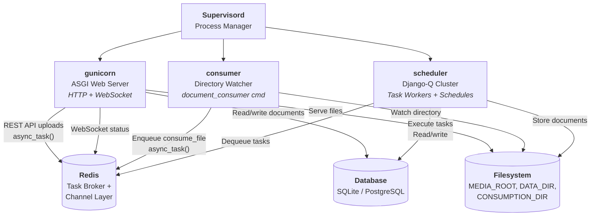
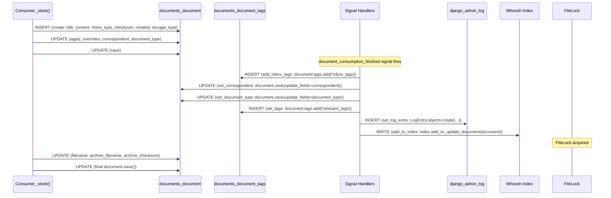

# Paperless-ngx Runtime Document Ingestion: Technical Investigation

## Metadata

| Field | Value |
|-------|-------|
| **Scope** | Runtime document ingestion pipeline behavior in paperless-ngx |
| **Methodology** | Read-only source code analysis — no files modified, no assumptions |
| **Source of Truth** | 16 source files across `src/documents/`, `src/paperless/`, and `docker/` |
| **Citation Format** | `Source: path/to/file.py:LineNumber` or `Source: path/to/file.py (lines X-Y)` |

## Introduction

This document provides an evidence-based technical investigation into how paperless-ngx processes documents at runtime. Every answer is derived directly from the source code and includes file path and line number citations for traceability. No assumptions or speculation are made.

### Investigation Questions

The five questions answered in this investigation are:

1. **Ingestion Pipeline Behavior:** Which services participate when a PDF is submitted, and what is the sequence of events visible in the logs from start to finish?
2. **Multi-Document Observation:** What happens when additional documents are uploaded sequentially — does the system react differently after each one?
3. **ML Classifier Retraining Logic:** Does the machine learning classifier retrain automatically on every upload, or only under specific conditions? What log messages differentiate active training from the classifier staying idle?
4. **Filesystem Storage Layout:** After processing completes, where does the document physically reside on disk? What is the default directory structure and filename pattern?
5. **Database Persistence:** Which database tables receive new rows as part of the ingestion process?

### Rationale

Understanding the runtime behavior of the ingestion pipeline is essential for operators who need to diagnose issues, optimize performance, or extend the system. While existing user-facing documentation (in `docs/usage_overview.rst` and `docs/configuration.rst`) explains *what* the system does at a conceptual level, it does not trace the *actual code path* from file detection through final persistence. This investigation fills that gap by tracing the code and documenting the exact sequence of events, log messages, and data mutations that occur during document consumption.

---

## 1. Services and Process Architecture

### Thinking / Rationale

To understand which services participate in document ingestion, we need to identify all running processes and their roles. The Docker container is managed by Supervisord, which launches three long-running processes. Redis serves as both the task broker and the WebSocket channel layer. The database (SQLite or PostgreSQL) stores all document metadata.

### 1.1 Supervisord-Managed Processes

The container runs three processes under Supervisord supervision:

| Process | Command | Role |
|---------|---------|------|
| **gunicorn** | `gunicorn -c /usr/src/paperless/gunicorn.conf.py paperless.asgi:application` | ASGI web server handling HTTP requests and WebSocket connections |
| **consumer** | `python3 manage.py document_consumer` | Directory watcher that monitors the consumption directory for new files |
| **scheduler** | `python3 manage.py qcluster` | Django-Q cluster that runs background task workers and executes scheduled tasks (e.g., hourly classifier training) |

> Source: `docker/supervisord.conf` (lines 10-35)

- **gunicorn** (lines 10-17): Serves the REST API (including the upload endpoint at `PostDocumentView`) and the Angular frontend. It also handles WebSocket connections for real-time status updates during ingestion.
- **consumer** (lines 19-26): Runs the `document_consumer` management command, which watches `CONSUMPTION_DIR` for new files using either inotify (Linux) or polling, then enqueues each detected file as a Django-Q background task.
- **scheduler** (lines 28-35): Runs the Django-Q `qcluster` command, which manages worker processes that execute background tasks (including `consume_file`) and runs scheduled tasks (including hourly `train_classifier` and daily `index_optimize`).

### 1.2 Shared Resources

**Redis:**
- Acts as the **task broker** for Django-Q. The `Q_CLUSTER` configuration at `src/paperless/settings.py:456` specifies `"redis": os.getenv("PAPERLESS_REDIS", "redis://localhost:6379")`.
- Acts as the **WebSocket channel layer** for broadcasting real-time status updates from the consumer to connected frontend clients.

> Source: `src/paperless/settings.py` (lines 449-457)

**Database:**
- **Default:** SQLite with database file at `DATA_DIR/db.sqlite3` (`src/paperless/settings.py:297-301`)
- **Production:** PostgreSQL when `PAPERLESS_DBHOST` environment variable is set (`src/paperless/settings.py:304-318`)

> Source: `src/paperless/settings.py` (lines 297-318)

**Filesystem:**
- `MEDIA_ROOT`: Base directory for document storage (default: `../media` relative to `BASE_DIR`)
- `DATA_DIR`: Base directory for application data (default: `../data` relative to `BASE_DIR`)
- `CONSUMPTION_DIR`: Directory watched for incoming documents (default: `../consume` relative to `BASE_DIR`)
- `SCRATCH_DIR`: Temporary file storage (default: `/tmp/paperless`)

> Source: `src/paperless/settings.py` (lines 61-84)

### 1.3 Container Initialization Sequence

Before the three Supervisord processes start, the container runs an initialization sequence:

1. **`docker-entrypoint.sh`** (lines 77-92):
   - Installs additional OCR languages if `PAPERLESS_OCR_LANGUAGES` is set (line 80-81)
   - Calls `initialize()` function (line 84) which:
     - Remaps UID/GID for the `paperless` user (line 19: `map_uidgid`)
     - Creates required directories: `export`, `data`, `data/index`, `media`, `media/documents`, `media/documents/originals`, `media/documents/thumbnails` (line 21)
     - Creates `/tmp/paperless` (line 28-29)
     - Adjusts file ownership to `paperless:paperless` (lines 32-34)
     - Calls `docker-prepare.sh` via gosu (line 37)

> Source: `docker/docker-entrypoint.sh` (lines 18-37, 77-92)

2. **`docker-prepare.sh`** — `do_work()` function (lines 66-81):
   - `wait_for_postgres`: If `PAPERLESS_DBHOST` is set, waits for PostgreSQL readiness using `pg_isready` (lines 5-28)
   - `wait_for_redis`: Runs a Python script to ping Redis (lines 30-36)
   - `migrations`: Applies database migrations with `flock`-based concurrency protection to prevent multiple containers from migrating simultaneously (lines 38-47)
   - `search_index`: Checks index version and re-indexes if out of date (lines 49-58)
   - `superuser`: Creates admin user if `PAPERLESS_ADMIN_USER` is set (lines 60-63)

> Source: `docker/docker-prepare.sh` (lines 66-81)

### 1.4 Service Architecture Diagram



---

## 2. Ingestion Pipeline: Step-by-Step Runtime Trace

### Thinking / Rationale

The ingestion pipeline has three distinct entry points but converges on a single processing path. To trace the complete behavior, we follow the code from each entry point through the Django-Q task queue dispatch, into the `Consumer.try_consume_file()` orchestrator method, through all 10 stages of processing, and finally through the signal handler chain that fires after the document is persisted.

### 2.1 Entry Points

#### Entry Point 1: Directory Watcher

The `document_consumer` management command watches `CONSUMPTION_DIR` for new files.

**File detection mechanism:**

- **inotify mode** (preferred on Linux): When `CONSUMER_POLLING == 0` and `INotify` is available (line 178), uses inotify with `CLOSE_WRITE | MOVED_TO` flags (line 203). Events are debounced with a 0.5-second window (line 211: `inotify_debounce: Final[float] = 0.5`).
- **Polling mode** (fallback): Uses `PollingObserver` with `settings.CONSUMER_POLLING` timeout interval (line 187).

> Source: `src/documents/management/commands/document_consumer.py` (lines 178-240)

**File processing flow:**

1. Initial scan: On startup, existing files in the directory are processed immediately via `_consume()` (lines 166-173)
2. `_consume_wait_unmodified()` (line 99): Waits for the file to remain unmodified by comparing `st_mtime` and `st_size` across `CONSUMER_POLLING_RETRY_COUNT` iterations with `CONSUMER_POLLING_DELAY` between each check
3. `_consume()` (line 46): Validates the file (not a directory, not ignored, exists, has supported extension), performs a file readiness check (50 retries × 10ms = 500ms total, lines 59-61), then enqueues the task:

```
Log: f"Adding {filepath} to the task queue."
```
> Source: `src/documents/management/commands/document_consumer.py:85`

```python
async_task(
    "documents.tasks.consume_file",
    filepath,
    override_tag_ids=tag_ids if tag_ids else None,
    task_name=os.path.basename(filepath)[:100],
)
```
> Source: `src/documents/management/commands/document_consumer.py` (lines 86-91)

#### Entry Point 2: REST API Upload

The `PostDocumentView` handles HTTP POST uploads.

1. Validates the serializer and extracts `doc_name`, `doc_data`, `correspondent_id`, `document_type_id`, `tag_ids`, and `title` (lines 499-506)
2. Creates a temporary file in `SCRATCH_DIR` with prefix `paperless-upload-` (lines 512-519)
3. Generates a unique `task_id = str(uuid.uuid4())` (line 521)
4. Dispatches the task:

```python
async_task(
    "documents.tasks.consume_file",
    temp_filename,
    override_filename=doc_name,
    override_title=title,
    override_correspondent_id=correspondent_id,
    override_document_type_id=document_type_id,
    override_tag_ids=tag_ids,
    task_id=task_id,
    task_name=os.path.basename(doc_name)[:100],
)
```
> Source: `src/documents/views.py` (lines 523-533)

5. Returns `Response("OK")` immediately (line 535) — the actual processing happens asynchronously.

#### Entry Point 3: Email Ingestion

Email ingestion via `src/paperless_mail/mail.py` is a third entry point. It downloads attachments from configured email accounts and ultimately calls the same `async_task("documents.tasks.consume_file", ...)` dispatch. This entry point is noted for completeness but not traced in full detail per investigation scope.

### 2.2 Django-Q Task Queue Dispatch

The `consume_file()` function in `src/documents/tasks.py` (lines 184-252) is the task entry point executed by a Django-Q worker:

1. **Barcode check** (lines 195-233): If `settings.CONSUMER_ENABLE_BARCODES` is True, scans the file for separating barcodes. If found, the document is split into multiple files saved to `CONSUMPTION_DIR` for re-consumption, the original is deleted, and the task completes with a "File successfully split" message.
2. **Normal consumption** (lines 236-244): If no barcodes are found (the typical case), creates a new `Consumer()` instance and calls `try_consume_file()`:

```python
document = Consumer().try_consume_file(
    path,
    override_filename=override_filename,
    override_title=override_title,
    override_correspondent_id=override_correspondent_id,
    override_document_type_id=override_document_type_id,
    override_tag_ids=override_tag_ids,
    task_id=task_id,
)
```
> Source: `src/documents/tasks.py` (lines 236-244)

### 2.3 Consumer Pipeline Stages

The `Consumer.try_consume_file()` method orchestrates the entire ingestion process through 10 stages. The `Consumer` class uses `LoggingMixin` and sets `logging_name = "paperless.consumer"` (line 54).

> Source: `src/documents/consumer.py` (lines 180-377)

#### Stage 1: Initialization (lines 194-207)

- Sets internal state: `path`, `filename`, `override_title`, `override_correspondent_id`, `override_document_type_id`, `override_tag_ids`, `task_id`
- Sends initial WebSocket progress:
  ```
  self._send_progress(0, 100, "STARTING", MESSAGE_NEW_FILE)
  ```
  > Source: `src/documents/consumer.py:202`
- Creates UUID correlation group for log entries:
  ```
  self.renew_logging_group()
  ```
  > Source: `src/documents/consumer.py:207`

#### Stage 2: Pre-checks (lines 209-215)

Three pre-condition checks are executed in sequence:

1. **`pre_check_file_exists()`** (line 211): Verifies `os.path.isfile(self.path)`. Fails with `MESSAGE_FILE_NOT_FOUND` if the file does not exist.
   > Source: `src/documents/consumer.py` (lines 95-100)

2. **`pre_check_directories()`** (line 212): Creates all required directories if they don't exist:
   ```python
   os.makedirs(settings.SCRATCH_DIR, exist_ok=True)
   os.makedirs(settings.THUMBNAIL_DIR, exist_ok=True)
   os.makedirs(settings.ORIGINALS_DIR, exist_ok=True)
   os.makedirs(settings.ARCHIVE_DIR, exist_ok=True)
   ```
   > Source: `src/documents/consumer.py` (lines 115-119)

3. **`pre_check_duplicate()`** (line 213): Computes MD5 checksum of the file, then queries the database:
   ```python
   Document.objects.filter(
       Q(checksum=checksum) | Q(archive_checksum=checksum),
   ).exists()
   ```
   If a duplicate exists and `CONSUMER_DELETE_DUPLICATES` is True, the file is deleted. In all duplicate cases, fails with `MESSAGE_DOCUMENT_ALREADY_EXISTS`.
   > Source: `src/documents/consumer.py` (lines 102-113)

After pre-checks pass:
```
Log (info): f"Consuming {self.filename}"
```
> Source: `src/documents/consumer.py:215`

#### Stage 3: MIME Type Detection (lines 219-225)

- Detects MIME type using python-magic:
  ```python
  mime_type = magic.from_file(self.path, mime=True)
  ```
  > Source: `src/documents/consumer.py:219`

- Logs the detected type:
  ```
  Log (debug): f"Detected mime type: {mime_type}"
  ```
  > Source: `src/documents/consumer.py:221`

- Looks up the appropriate parser class:
  ```python
  parser_class = get_parser_class_for_mime_type(mime_type)
  ```
  > Source: `src/documents/consumer.py:223`

- Fails with `MESSAGE_UNSUPPORTED_TYPE` if no parser is found (line 225).

#### Stage 4: Signal Emission and Pre-Consume Script (lines 229-235)

- Emits the `document_consumption_started` signal:
  ```python
  document_consumption_started.send(
      sender=self.__class__,
      filename=self.path,
      logging_group=self.logging_group,
  )
  ```
  > Source: `src/documents/consumer.py` (lines 229-233)

- Runs the pre-consume script if `settings.PRE_CONSUME_SCRIPT` is configured:
  ```
  Log (info): f"Executing pre-consume script {settings.PRE_CONSUME_SCRIPT}"
  ```
  > Source: `src/documents/consumer.py:132`

#### Stage 5: Document Parsing (lines 258-261)

- WebSocket progress update:
  ```
  self._send_progress(20, 100, "WORKING", MESSAGE_PARSING_DOCUMENT)
  ```
  > Source: `src/documents/consumer.py:259`

- Log message:
  ```
  Log (debug): "Parsing {}...".format(self.filename)
  ```
  > Source: `src/documents/consumer.py:260`

- Actual parsing (OCR/text extraction):
  ```python
  document_parser.parse(self.path, mime_type, self.filename)
  ```
  > Source: `src/documents/consumer.py:261`

- A `progress_callback` function recalculates progress within the 20-70% range (lines 237-240) for granular parsing updates.

#### Stage 6: Thumbnail Generation (lines 263-269)

- Log message:
  ```
  Log (debug): f"Generating thumbnail for {self.filename}..."
  ```
  > Source: `src/documents/consumer.py:263`

- WebSocket progress update:
  ```
  self._send_progress(70, 100, "WORKING", MESSAGE_GENERATING_THUMBNAIL)
  ```
  > Source: `src/documents/consumer.py:264`

- Generates optimized thumbnail:
  ```python
  thumbnail = document_parser.get_optimised_thumbnail(
      self.path, mime_type, self.filename,
  )
  ```
  > Source: `src/documents/consumer.py` (lines 265-269)

#### Stage 7: Date Parsing (lines 271-276)

- Extracts text and date from the parsed document:
  ```python
  text = document_parser.get_text()
  date = document_parser.get_date()
  ```
  > Source: `src/documents/consumer.py` (lines 271-272)

- If no date found by the parser, falls back to filename/text date parsing:
  ```
  self._send_progress(90, 100, "WORKING", MESSAGE_PARSE_DATE)
  ```
  > Source: `src/documents/consumer.py:274`

  ```python
  date = parse_date(self.filename, text)
  ```
  > Source: `src/documents/consumer.py:275`

- Gets the archive path (PDF/A version) if available:
  ```python
  archive_path = document_parser.get_archive_path()
  ```
  > Source: `src/documents/consumer.py:276`

#### Stage 8: Classifier Loading (lines 292-294)

- **Loads** the pre-trained classification model — does **NOT** retrain:
  ```python
  classifier = load_classifier()
  ```
  > Source: `src/documents/consumer.py:292`

- WebSocket progress update:
  ```
  self._send_progress(95, 100, "WORKING", MESSAGE_SAVE_DOCUMENT)
  ```
  > Source: `src/documents/consumer.py:294`

#### Stage 9: Atomic Persistence (lines 297-360)

This is the most complex stage, wrapped in a database transaction:

```python
with transaction.atomic():
```
> Source: `src/documents/consumer.py:298`

**9a. Create the document record:**

```python
document = self._store(text=text, date=date, mime_type=mime_type)
```
> Source: `src/documents/consumer.py:301`

The `_store()` method (lines 379-412) creates the database record:

```python
document = Document.objects.create(
    title=(self.override_title or file_info.title)[:127],
    content=text,
    mime_type=mime_type,
    checksum=hashlib.md5(f.read()).hexdigest(),
    created=created,
    modified=created,
    storage_type=storage_type,
)
```
> Source: `src/documents/consumer.py` (lines 398-406)

Then applies overrides (correspondent, document type, tags) and saves:

```python
self.apply_overrides(document)
document.save()
```
> Source: `src/documents/consumer.py` (lines 408-410)

**9b. Fire signal handlers:**

```python
document_consumption_finished.send(
    sender=self.__class__,
    document=document,
    logging_group=self.logging_group,
    classifier=classifier,
)
```
> Source: `src/documents/consumer.py` (lines 306-311)

This fires **six signal handlers** registered in `src/documents/apps.py` (lines 22-27):

1. **`add_inbox_tags`** — Adds all tags where `is_inbox_tag=True` to the document:
   ```python
   document.tags.add(*inbox_tags)
   ```
   > Source: `src/documents/signals/handlers.py` (lines 30-32)

2. **`set_correspondent`** — Runs the matching algorithm to find and assign a correspondent:
   ```
   Log (info): f"Assigning correspondent {selected} to {document}"
   ```
   > Source: `src/documents/signals/handlers.py` (lines 35-98, log at line 93)

3. **`set_document_type`** — Runs the matching algorithm to find and assign a document type:
   ```
   Log (info): f"Assigning document type {selected} to {document}"
   ```
   > Source: `src/documents/signals/handlers.py` (lines 101-165, log at line 160)

4. **`set_tags`** — Runs tag matching and assigns matched tags:
   ```
   Log (info): 'Tagging "{}" with "{}"'.format(document, ", ".join([t.name for t in relevant_tags]))
   ```
   > Source: `src/documents/signals/handlers.py` (lines 168-230, log at lines 224-226)

5. **`set_log_entry`** — Creates an admin audit log entry:
   ```python
   LogEntry.objects.create(
       action_flag=ADDITION,
       action_time=timezone.now(),
       content_type=ct,
       object_id=document.pk,
       user=user,
       object_repr=document.__str__(),
   )
   ```
   > Source: `src/documents/signals/handlers.py` (lines 413-425)

6. **`add_to_index`** — Adds or updates the document in the Whoosh search index:
   ```python
   index.add_or_update_document(document)
   ```
   > Source: `src/documents/signals/handlers.py` (lines 428-431)

**9c. Copy files to storage (under `FileLock`):**

```python
with FileLock(settings.MEDIA_LOCK):
    document.filename = generate_unique_filename(document)
    create_source_path_directory(document.source_path)
    self._write(document.storage_type, self.path, document.source_path)
    self._write(document.storage_type, thumbnail, document.thumbnail_path)
```
> Source: `src/documents/consumer.py` (lines 315-325)

If an archive version exists (e.g., PDF/A output from OCR):
```python
document.archive_filename = generate_unique_filename(document, archive_filename=True)
create_source_path_directory(document.archive_path)
self._write(document.storage_type, archive_path, document.archive_path)
document.archive_checksum = hashlib.md5(f.read()).hexdigest()
```
> Source: `src/documents/consumer.py` (lines 327-342)

**9d. Final save and cleanup:**

```python
document.save()
```
> Source: `src/documents/consumer.py:346`

```
Log (debug): "Deleting file {}".format(self.path)
```
> Source: `src/documents/consumer.py:349`

```python
os.unlink(self.path)
```
> Source: `src/documents/consumer.py:350`

Shadow file cleanup (macOS `._ files`) at lines 353-360.

#### Stage 10: Post-Consume and Completion (lines 371-377)

- Runs the post-consume script if `settings.POST_CONSUME_SCRIPT` is configured:
  ```
  Log (info): f"Executing post-consume script {settings.POST_CONSUME_SCRIPT}"
  ```
  > Source: `src/documents/consumer.py` (lines 154-156)

- Final log message:
  ```
  Log (info): "Document {} consumption finished".format(document)
  ```
  > Source: `src/documents/consumer.py:373`

- Final WebSocket progress update:
  ```
  self._send_progress(100, 100, "SUCCESS", MESSAGE_FINISHED, document.id)
  ```
  > Source: `src/documents/consumer.py:375`

- Returns the `document` object.

### 2.4 Ingestion Pipeline Diagram

```mermaid
flowchart TD
    A["<b>File Detection</b><br/>Directory Watcher / REST API / Email<br/>➜ async_task('documents.tasks.consume_file')"] --> B

    B["<b>Task Queue Dispatch</b><br/>Django-Q worker picks up task<br/>consume_file() → Barcode check"] --> C

    C["<b>Stage 1: Initialization</b><br/>📡 WebSocket: STARTING 0%<br/>Set path, filename, overrides, task_id<br/>renew_logging_group()"] --> D

    D["<b>Stage 2: Pre-checks</b><br/>✓ File exists?<br/>✓ Directories created?<br/>✓ Duplicate check (MD5)?<br/>📝 Log: 'Consuming {filename}'"] --> E

    E["<b>Stage 3: MIME Detection</b><br/>magic.from_file(path, mime=True)<br/>📝 Log: 'Detected mime type: {mime_type}'<br/>Look up parser class"] --> F

    F["<b>Stage 4: Signal + Script</b><br/>document_consumption_started.send()<br/>Run PRE_CONSUME_SCRIPT (if configured)"] --> G

    G["<b>Stage 5: Parsing</b><br/>📡 WebSocket: WORKING 20%<br/>📝 Log: 'Parsing {filename}...'<br/>parser.parse() — OCR/text extraction"] --> H

    H["<b>Stage 6: Thumbnail</b><br/>📝 Log: 'Generating thumbnail for {filename}...'<br/>📡 WebSocket: WORKING 70%<br/>parser.get_optimised_thumbnail()"] --> I

    I["<b>Stage 7: Date Parsing</b><br/>📡 WebSocket: WORKING 90%<br/>get_date() → fallback: parse_date()<br/>get_archive_path()"] --> J

    J["<b>Stage 8: Classifier Load</b><br/>📡 WebSocket: WORKING 95%<br/>load_classifier() — loads model, NOT retrain"] --> K

    K["<b>Stage 9: Atomic Persist</b><br/>transaction.atomic():<br/>  1. Document.objects.create()<br/>  2. document_consumption_finished signal<br/>  3. FileLock → copy files to storage<br/>  4. document.save() — final<br/>  5. os.unlink(source)"] --> L

    L["<b>Stage 10: Post-Consume</b><br/>Run POST_CONSUME_SCRIPT (if configured)<br/>📝 Log: 'Document {doc} consumption finished'<br/>📡 WebSocket: SUCCESS 100%"]
```



---

## 3. Multi-Document Upload Behavior

### Thinking / Rationale

To understand how the system behaves when multiple documents are uploaded, we need to examine the task dispatching mechanism, worker pool configuration, concurrency protections, and whether any state is shared between document processing tasks. The key question is whether successive uploads influence each other or are processed independently.

### 3.1 Independent Task Dispatching

Each document upload — whether from the directory watcher, REST API, or email — creates a completely independent `async_task()` call. There is no batching, grouping, or ordering dependency between tasks.

- **Directory watcher:** Each file triggers its own `async_task("documents.tasks.consume_file", filepath, ...)` call.
  > Source: `src/documents/management/commands/document_consumer.py` (lines 86-91)

- **REST API:** Each POST request generates its own `task_id = str(uuid.uuid4())` and dispatches an independent `async_task()`.
  > Source: `src/documents/views.py` (lines 521-533)

### 3.2 Worker Pool Configuration

Django-Q runs tasks via worker processes. The number of workers is configured by `Q_CLUSTER["workers"]` which defaults to `TASK_WORKERS`:

```python
TASK_WORKERS = __get_int("PAPERLESS_TASK_WORKERS", default_task_workers())
```
> Source: `src/paperless/settings.py:438`

The `default_task_workers()` function (lines 427-435) calculates workers based on available CPU cores:
- Less than 4 cores: uses all available cores
- 4 or more cores: uses `floor(sqrt(available_cores))`

Each task creates its own `Consumer()` instance (line 236 in `tasks.py`), ensuring no shared state between concurrent document processing tasks.

> Source: `src/documents/tasks.py:236`

### 3.3 Duplicate Detection

The `pre_check_duplicate()` method computes the MD5 checksum of the incoming file and checks it against all existing documents in the database:

```python
with open(self.path, "rb") as f:
    checksum = hashlib.md5(f.read()).hexdigest()
if Document.objects.filter(
    Q(checksum=checksum) | Q(archive_checksum=checksum),
).exists():
```
> Source: `src/documents/consumer.py` (lines 103-107)

If a duplicate is detected:
- If `CONSUMER_DELETE_DUPLICATES` is True, the file is deleted (line 109)
- The consumption fails with `MESSAGE_DOCUMENT_ALREADY_EXISTS` (lines 110-113)

This means uploading the exact same PDF twice will result in the second upload being rejected.

### 3.4 Concurrency Protections

Multiple documents processed in parallel are protected by three concurrency mechanisms:

1. **`transaction.atomic()`** — Database writes are wrapped in a transaction to ensure atomicity:
   > Source: `src/documents/consumer.py:298`

2. **`FileLock(settings.MEDIA_LOCK)`** — File system operations (copying to storage, renaming) are serialized via a file lock at `MEDIA_ROOT/media.lock`:
   > Source: `src/documents/consumer.py:315` and `src/paperless/settings.py:72`

3. **`AsyncWriter`** — Whoosh search index writes use an `AsyncWriter` that queues writes and serializes them:
   > Source: `src/documents/index.py:66`

### 3.5 Key Finding: No Differential Behavior

**The system does NOT react differently to sequential or parallel uploads.** Each document is processed through the identical 10-stage pipeline with its own `Consumer` instance, its own logging group (UUID), its own task ID, and its own transaction. The classifier model is **loaded** (not retrained) during each consumption. The only interaction between documents is the duplicate detection check, which queries the database for matching checksums.

---

## 4. ML Classifier: Training vs. Prediction

### Thinking / Rationale

A critical distinction exists in the codebase between two completely separate modes of classifier operation: (1) **prediction** — loading a pre-trained model during each document consumption to suggest correspondents, document types, and tags, and (2) **training** — rebuilding the model from scratch on an hourly schedule. Understanding this distinction is essential because it directly answers whether the classifier retrains on every upload.

### 4.1 The Answer: Training is NOT Triggered by Document Upload

**The classifier does NOT retrain on every document upload.** During consumption, the pre-trained model is merely **loaded** from disk for prediction. Training happens exclusively via an hourly scheduled task, and even then, only under specific conditions.

### 4.2 Hourly Training Schedule

The training schedule is established via a Django database migration:

```python
schedule(
    "documents.tasks.train_classifier",
    name="Train the classifier",
    schedule_type=Schedule.HOURLY,
)
```
> Source: `src/documents/migrations/1001_auto_20201109_1636.py` (lines 10-14)

This creates a Django-Q `Schedule` record that triggers `documents.tasks.train_classifier` every hour. The migration also schedules a daily index optimization:

```python
schedule(
    "documents.tasks.index_optimize",
    name="Optimize the index",
    schedule_type=Schedule.DAILY,
)
```
> Source: `src/documents/migrations/1001_auto_20201109_1636.py` (lines 15-19)

### 4.3 Training Entry Point: `train_classifier()`

The `train_classifier()` function in `src/documents/tasks.py` (lines 48-72) has a critical precondition gate:

```python
if (
    not Tag.objects.filter(matching_algorithm=Tag.MATCH_AUTO).exists()
    and not DocumentType.objects.filter(matching_algorithm=Tag.MATCH_AUTO).exists()
    and not Correspondent.objects.filter(matching_algorithm=Tag.MATCH_AUTO).exists()
):
    return
```
> Source: `src/documents/tasks.py` (lines 49-55)

**Precondition:** Training only proceeds if at least one Tag, DocumentType, or Correspondent has its `matching_algorithm` set to `MATCH_AUTO` (value `6`). If none exist, the function returns immediately without training — this is the "classifier stays idle" case.

If the precondition passes:

1. Load existing classifier: `classifier = load_classifier()` (line 57)
2. If no model file exists: `classifier = DocumentClassifier()` (line 60)
3. Call `classifier.train()` (line 63)
4. **If training returns True** (data has changed):
   ```
   Log (info): "Saving updated classifier model to {}...".format(settings.MODEL_FILE)
   ```
   > Source: `src/documents/tasks.py:65`
   Then saves the model: `classifier.save()` (line 67)

5. **If training returns False** (data unchanged):
   ```
   Log (debug): "Training data unchanged."
   ```
   > Source: `src/documents/tasks.py:69`

6. **On exception:**
   ```
   Log (warning): "Classifier error: " + str(e)
   ```
   > Source: `src/documents/tasks.py:72`

### 4.4 Training Internals: `DocumentClassifier.train()`

The `train()` method in `src/documents/classifier.py` (lines 115-249) performs the actual model training:

**Step 1: Data Gathering**
```
Log (debug): "Gathering data from database..."
```
> Source: `src/documents/classifier.py:123`

Queries all documents excluding inbox-tagged ones:
```python
Document.objects.order_by("pk").exclude(tags__is_inbox_tag=True)
```
> Source: `src/documents/classifier.py` (lines 125-127)

**Step 2: Data Hash Comparison (Skip Optimization)**

A SHA1 hash of all training data (document content, document types, correspondents, tags) is computed. If the hash matches the previously stored hash, training is skipped:

```python
new_data_hash = m.digest()
if self.data_hash and new_data_hash == self.data_hash:
    return False
```
> Source: `src/documents/classifier.py` (lines 161-164)

This is the critical optimization — if no documents have been added, removed, or had their labels changed since the last training, the function returns `False` immediately without retraining. This is why the log says `"Training data unchanged."` in most hourly runs.

**Step 3: Vectorization**
```
Log (debug): "Vectorizing data..."
```
> Source: `src/documents/classifier.py:193`

Uses scikit-learn's `CountVectorizer` with word-level unigrams and bigrams:
```python
CountVectorizer(analyzer="word", ngram_range=(1, 2), min_df=0.01)
```
> Source: `src/documents/classifier.py` (lines 194-198)

**Step 4: Train Three Classifiers**

Each classifier uses `MLPClassifier(tol=0.01)`:

- **Tags classifier:**
  ```
  Log (debug): "Training tags classifier..."
  ```
  > Source: `src/documents/classifier.py:203`

- **Correspondent classifier:**
  ```
  Log (debug): "Training correspondent classifier..."
  ```
  > Source: `src/documents/classifier.py:226`

- **Document type classifier:**
  ```
  Log (debug): "Training document type classifier..."
  ```
  > Source: `src/documents/classifier.py:237`

**Step 5: Return True** — The updated `data_hash` is stored and `True` is returned, indicating the model should be saved.

**Model format:** `FORMAT_VERSION = 7` — includes version check during loading.
> Source: `src/documents/classifier.py:63`

### 4.5 Prediction During Consumption (NOT Retraining)

During document consumption, the classifier is **loaded**, not retrained:

```python
classifier = load_classifier()
```
> Source: `src/documents/consumer.py:292`

The `load_classifier()` function (lines 30-57 of `classifier.py`):

1. Checks if the model file exists:
   ```python
   if not os.path.isfile(settings.MODEL_FILE):
       logger.debug(
           "Document classification model does not exist (yet), not "
           "performing automatic matching.",
       )
       return None
   ```
   > Source: `src/documents/classifier.py` (lines 31-36)

2. If the file exists, loads the pickled model and validates the format version (line 80). If the version doesn't match, the model file is deleted and `None` is returned.

3. The loaded classifier is passed to the `document_consumption_finished` signal, where the signal handlers (`set_correspondent`, `set_document_type`, `set_tags`) use prediction methods:
   - `classifier.predict_correspondent(content)` — Source: `src/documents/classifier.py` (lines 251-260)
   - `classifier.predict_document_type(content)` — Source: `src/documents/classifier.py` (lines 262-271)
   - `classifier.predict_tags(content)` — Source: `src/documents/classifier.py` (lines 273-292)

### 4.6 Log Messages: Training vs. Idle

| Scenario | Logger | Level | Exact Message |
|----------|--------|-------|---------------|
| No MATCH_AUTO entities exist | (none — function returns silently) | — | *(no log output)* |
| Training data unchanged | `paperless.tasks` | DEBUG | `"Training data unchanged."` |
| Training completes, model saved | `paperless.tasks` | INFO | `"Saving updated classifier model to {}...".format(settings.MODEL_FILE)` |
| Training error | `paperless.tasks` | WARNING | `"Classifier error: " + str(e)` |
| Model file doesn't exist (during consumption) | `paperless.classifier` | DEBUG | `"Document classification model does not exist (yet), not performing automatic matching."` |
| Model file corrupt/incompatible (during consumption) | `paperless.classifier` | ERROR | `"Unrecoverable error while loading document classification model, deleting model file."` |
| Gathering training data | `paperless.classifier` | DEBUG | `"Gathering data from database..."` |
| Vectorizing | `paperless.classifier` | DEBUG | `"Vectorizing data..."` |
| Training tags classifier | `paperless.classifier` | DEBUG | `"Training tags classifier..."` |
| Training correspondent classifier | `paperless.classifier` | DEBUG | `"Training correspondent classifier..."` |
| Training document type classifier | `paperless.classifier` | DEBUG | `"Training document type classifier..."` |

### 4.7 Classifier Behavior Diagram

```mermaid
flowchart TD
    subgraph HOURLY["Hourly Scheduled Training Path"]
        H1["Django-Q Schedule<br/>(Schedule.HOURLY)"] --> H2["train_classifier()"]
        H2 --> H3{"Any Tag/DocType/Correspondent<br/>with MATCH_AUTO?"}
        H3 -->|No| H4["Return immediately<br/>(no log output)"]
        H3 -->|Yes| H5["load_classifier() or<br/>create new DocumentClassifier()"]
        H5 --> H6["classifier.train()"]
        H6 --> H7["Gather data, compute SHA1 hash"]
        H7 --> H8{"data_hash == previous hash?"}
        H8 -->|Yes| H9["Return False<br/>📝 'Training data unchanged.'"]
        H8 -->|No| H10["Vectorize + Train 3 classifiers<br/>(tags, correspondent, doc_type)"]
        H10 --> H11["Return True<br/>📝 'Saving updated classifier model...'"]
        H11 --> H12["classifier.save()<br/>Write to MODEL_FILE"]
    end

    subgraph CONSUMPTION["Per-Consumption Prediction Path"]
        C1["Consumer.try_consume_file()"] --> C2["load_classifier()<br/>(load from disk, NOT retrain)"]
        C2 --> C3{"Model file exists?"}
        C3 -->|No| C4["Return None<br/>📝 'Model does not exist (yet)...'"]
        C3 -->|Yes| C5["Load pickled model"]
        C5 --> C6["Pass classifier to signal handlers"]
        C6 --> C7["predict_correspondent()"]
        C6 --> C8["predict_document_type()"]
        C6 --> C9["predict_tags()"]
    end
```



---

## 5. Filesystem Storage Layout

### Thinking / Rationale

To understand where documents physically reside after processing, we need to trace the directory constants defined in `settings.py`, the filename generation logic in `file_handling.py`, and the path computation properties on the `Document` model. The system supports both a simple default naming scheme and a highly configurable custom format.

### 5.1 Directory Structure

All directory constants are defined in `src/paperless/settings.py` (lines 57-84):

| Setting | Default Value | Purpose |
|---------|---------------|---------|
| `MEDIA_ROOT` | `../media` (relative to `BASE_DIR`) | Root directory for document storage |
| `ORIGINALS_DIR` | `MEDIA_ROOT/documents/originals` | Original uploaded documents |
| `ARCHIVE_DIR` | `MEDIA_ROOT/documents/archive` | PDF/A archive versions (OCR output) |
| `THUMBNAIL_DIR` | `MEDIA_ROOT/documents/thumbnails` | Document thumbnail images |
| `DATA_DIR` | `../data` (relative to `BASE_DIR`) | Application data root |
| `INDEX_DIR` | `DATA_DIR/index` | Whoosh full-text search index |
| `MODEL_FILE` | `DATA_DIR/classification_model.pickle` | ML classifier model |
| `LOGGING_DIR` | `DATA_DIR/log` | Log files |
| `CONSUMPTION_DIR` | `../consume` (relative to `BASE_DIR`) | Incoming documents directory |
| `SCRATCH_DIR` | `/tmp/paperless` | Temporary processing directory |
| `MEDIA_LOCK` | `MEDIA_ROOT/media.lock` | File lock for concurrent access |

> Source: `src/paperless/settings.py` (lines 57-84)

### 5.2 Filesystem Directory Tree

```
<MEDIA_ROOT>/                          (default: ../media)
├── media.lock                         (FileLock for concurrent access)
└── documents/
    ├── originals/                     (original uploaded files)
    │   ├── 0000001.pdf                (default pattern: {pk:07}{ext})
    │   ├── 0000002.pdf
    │   └── ...
    ├── archive/                       (PDF/A versions from OCR)
    │   ├── 0000001.pdf                (archive always .pdf)
    │   ├── 0000002.pdf
    │   └── ...
    └── thumbnails/                    (PNG thumbnail images)
        ├── 0000001.png                (pattern: {pk:07}.png)
        ├── 0000002.png
        └── ...

<DATA_DIR>/                            (default: ../data)
├── db.sqlite3                         (SQLite database, if used)
├── classification_model.pickle        (ML classifier model)
├── index/                             (Whoosh search index)
│   └── (index segment files)
└── log/                               (application logs)
    ├── paperless.log
    └── mail.log

<CONSUMPTION_DIR>/                     (default: ../consume)
└── (incoming documents placed here)

<SCRATCH_DIR>/                         (default: /tmp/paperless)
└── paperless-upload-*                 (temporary upload files)
```

### 5.3 Default Filename Pattern

When `PAPERLESS_FILENAME_FORMAT` is **not set** (the default), the filename is generated using a zero-padded primary key:

```python
filename = f"{doc.pk:07}{counter_str}{filetype_str}"
```
> Source: `src/documents/file_handling.py:193`

- `doc.pk:07`: Primary key, zero-padded to 7 digits (e.g., `0000001`)
- `counter_str`: Empty string normally, or `_01`, `_02`, etc. if the filename conflicts with an existing file (line 186: `f"_{counter:02}"`)
- `filetype_str`: File extension derived from MIME type (e.g., `.pdf`) for originals, always `.pdf` for archive copies

**Examples:**
- Document pk=1, PDF: `0000001.pdf`
- Document pk=42, PDF with collision: `0000042_01.pdf`
- Document pk=1, GPG encrypted: `0000001.pdf.gpg` (lines 196-197)

**Thumbnail pattern** (always the same regardless of filename format):
```python
file_name = "{:07}.png".format(self.pk)
```
> Source: `src/documents/models.py:274`

### 5.4 Custom Filename Pattern

When `PAPERLESS_FILENAME_FORMAT` is set (via environment variable), the filename uses a template format with these variables:

```python
path = settings.PAPERLESS_FILENAME_FORMAT.format(
    title=pathvalidate.sanitize_filename(doc.title, replacement_text="-"),
    correspondent=correspondent,
    document_type=document_type,
    created=datetime.date.isoformat(doc.created),
    created_year=doc.created.year if doc.created else "none",
    created_month=f"{doc.created.month:02}" if doc.created else "none",
    created_day=f"{doc.created.day:02}" if doc.created else "none",
    added=datetime.date.isoformat(doc.added),
    added_year=doc.added.year if doc.added else "none",
    added_month=f"{doc.added.month:02}" if doc.added else "none",
    added_day=f"{doc.added.day:02}" if doc.added else "none",
    asn=asn,
    tags=tags,
    tag_list=tag_list,
)
```
> Source: `src/documents/file_handling.py` (lines 161-176)

| Variable | Description | Example Value |
|----------|-------------|---------------|
| `{title}` | Document title (sanitized) | `Invoice-2024` |
| `{correspondent}` | Correspondent name (sanitized), or `"none"` | `Acme-Corp` |
| `{document_type}` | Document type name (sanitized), or `"none"` | `Invoice` |
| `{created}` | Creation date in ISO format | `2024-01-15` |
| `{created_year}` | Creation year | `2024` |
| `{created_month}` | Creation month (zero-padded) | `01` |
| `{created_day}` | Creation day (zero-padded) | `15` |
| `{added}` | Date added in ISO format | `2024-01-16` |
| `{added_year}` | Year added | `2024` |
| `{added_month}` | Month added (zero-padded) | `01` |
| `{added_day}` | Day added (zero-padded) | `16` |
| `{asn}` | Archive serial number, or `"none"` | `42` |
| `{tags}` | Dictionary of tags (by index and key-value) | *(complex)* |
| `{tag_list}` | Comma-separated sorted tag names | `invoice,tax` |

**Example with format `{created_year}/{correspondent}/{title}`:**
- Result: `2024/Acme-Corp/Invoice-2024.pdf`
- The path separator `/` creates subdirectories within `ORIGINALS_DIR`

**Fallback behavior:** If the format string raises a `ValueError`, `KeyError`, or `IndexError`, the system falls back to the default pattern with a warning log:
```
Log (warning): f"Invalid PAPERLESS_FILENAME_FORMAT: {settings.PAPERLESS_FILENAME_FORMAT}, falling back to default"
```
> Source: `src/documents/file_handling.py` (lines 180-184)

### 5.5 Path Properties on the Document Model

The `Document` model provides computed path properties:

**`Document.source_path`** — Path to the original file:
```python
@property
def source_path(self):
    if self.filename:
        fname = str(self.filename)
    else:
        fname = "{:07}{}".format(self.pk, self.file_type)
        if self.storage_type == self.STORAGE_TYPE_GPG:
            fname += ".gpg"
    return os.path.join(settings.ORIGINALS_DIR, fname)
```
> Source: `src/documents/models.py` (lines 222-231)

**`Document.archive_path`** — Path to the PDF/A archive version:
```python
@property
def archive_path(self):
    if self.has_archive_version:
        return os.path.join(settings.ARCHIVE_DIR, str(self.archive_filename))
    else:
        return None
```
> Source: `src/documents/models.py` (lines 241-246)

**`Document.thumbnail_path`** — Path to the thumbnail:
```python
@property
def thumbnail_path(self):
    file_name = "{:07}.png".format(self.pk)
    if self.storage_type == self.STORAGE_TYPE_GPG:
        file_name += ".gpg"
    return os.path.join(settings.THUMBNAIL_DIR, file_name)
```
> Source: `src/documents/models.py` (lines 272-278)

---

## 6. Database Tables Affected by Ingestion

### Thinking / Rationale

To identify all database tables that receive new rows during document ingestion, we trace every ORM `create()`, `save()`, and `add()` call within the consumer pipeline and its signal handlers. We also identify the Whoosh search index (file-based, not a database table) and the Django-Q task records.

### 6.1 Tables Written During Ingestion

| # | SQL Table Name | Django Model | Written By | Operation |
|---|---------------|-------------|------------|-----------|
| 1 | `documents_document` | `Document` | `Consumer._store()` | INSERT via `Document.objects.create(...)` |
| 2 | `documents_document` | `Document` | `Consumer._store()` → `apply_overrides()` | UPDATE via `document.save()` (sets correspondent, document_type) |
| 3 | `documents_document_tags` | `Document.tags.through` | `add_inbox_tags` handler | INSERT via `document.tags.add(*inbox_tags)` |
| 4 | `documents_document` | `Document` | `set_correspondent` handler | UPDATE via `document.save(update_fields=("correspondent",))` |
| 5 | `documents_document` | `Document` | `set_document_type` handler | UPDATE via `document.save(update_fields=("document_type",))` |
| 6 | `documents_document_tags` | `Document.tags.through` | `set_tags` handler | INSERT via `document.tags.add(*relevant_tags)` |
| 7 | `django_admin_log` | `LogEntry` | `set_log_entry` handler | INSERT via `LogEntry.objects.create(...)` |
| 8 | *Whoosh index (file-based)* | — | `add_to_index` handler | File write via `index.add_or_update_document(document)` |
| 9 | `documents_document` | `Document` | `Consumer.try_consume_file()` | UPDATE via `document.save()` (final: filename, archive_filename, archive_checksum) |
| 10 | `django_q_task` | Django-Q `Task` | Django-Q framework | INSERT (automatic task record creation and completion status) |

### 6.2 Detailed Table Descriptions

#### `documents_document` (Django model: `Document`)

**Initial INSERT** — `Consumer._store()`:
```python
document = Document.objects.create(
    title=(self.override_title or file_info.title)[:127],
    content=text,
    mime_type=mime_type,
    checksum=hashlib.md5(f.read()).hexdigest(),
    created=created,
    modified=created,
    storage_type=storage_type,
)
```
> Source: `src/documents/consumer.py` (lines 398-406)

**Fields populated on creation:**

| Field | Type | Source |
|-------|------|--------|
| `title` | CharField(128) | Override title or parsed from filename |
| `content` | TextField | Extracted text from document parser |
| `mime_type` | CharField(256) | Detected via python-magic |
| `checksum` | CharField(32) | MD5 hex digest of original file |
| `created` | DateTimeField | Parsed from filename/content or file mtime |
| `modified` | DateTimeField | Same as created initially |
| `storage_type` | CharField(11) | `"unencrypted"` (default) |
| `added` | DateTimeField | Auto-set to `timezone.now()` |

**Subsequent UPDATEs:**
- `correspondent` — Set by `apply_overrides()` or `set_correspondent` signal handler
- `document_type` — Set by `apply_overrides()` or `set_document_type` signal handler
- `filename` — Set after `generate_unique_filename()` within `FileLock`
- `archive_filename` — Set if an archive version exists
- `archive_checksum` — MD5 of the archive file

> Source: `src/documents/models.py` (lines 88-206)

#### `documents_document_tags` (M2M through table)

This is the many-to-many relationship table between `Document` and `Tag`:

- **Inbox tags:** `document.tags.add(*inbox_tags)` — adds all tags where `is_inbox_tag=True`
  > Source: `src/documents/signals/handlers.py:32`

- **Matched tags:** `document.tags.add(*relevant_tags)` — adds tags found by the matching algorithm
  > Source: `src/documents/signals/handlers.py:230`

- **Override tags:** `document.tags.add(Tag.objects.get(pk=tag_id))` — adds tags specified in the upload request
  > Source: `src/documents/consumer.py:427`

#### `django_admin_log` (Django model: `LogEntry`)

Created by the `set_log_entry` signal handler:

```python
LogEntry.objects.create(
    action_flag=ADDITION,
    action_time=timezone.now(),
    content_type=ct,
    object_id=document.pk,
    user=user,
    object_repr=document.__str__(),
)
```
> Source: `src/documents/signals/handlers.py` (lines 418-425)

The user is retrieved as `User.objects.get(username="consumer")` (line 416).

#### `documents_log` (Django model: `Log`) — Legacy / NOT Written During Ingestion

The `Log` model at `src/documents/models.py` (lines 285-313) defines a table with fields: `group` (UUID), `message` (text), `level` (integer), `created` (datetime). However, **this table is NOT written during standard document ingestion**. The logging configuration at `src/paperless/settings.py` (lines 373-412) defines only three handlers — `console`, `file_paperless`, and `file_mail` — none of which write to the database. No `Log.objects.create()` call exists anywhere in the ingestion pipeline. This model is a legacy artifact that remains in the codebase but receives no INSERTs during document consumption.

> Source: `src/paperless/settings.py` (lines 373-412) — no database log handler defined
> Source: `src/documents/models.py` (lines 285-313) — model definition exists but is unused by ingestion

#### Whoosh Search Index (file-based)

The `add_to_index` signal handler updates the Whoosh full-text search index:

```python
def add_to_index(sender, document, **kwargs):
    from documents import index
    index.add_or_update_document(document)
```
> Source: `src/documents/signals/handlers.py` (lines 428-431)

The index schema includes 16 fields:

```python
Schema(
    id=NUMERIC(stored=True, unique=True),
    title=TEXT(sortable=True),
    content=TEXT(),
    asn=NUMERIC(sortable=True),
    correspondent=TEXT(sortable=True),
    correspondent_id=NUMERIC(),
    has_correspondent=BOOLEAN(),
    tag=KEYWORD(commas=True, scorable=True, lowercase=True),
    tag_id=KEYWORD(commas=True, scorable=True),
    has_tag=BOOLEAN(),
    type=TEXT(sortable=True),
    type_id=NUMERIC(),
    has_type=BOOLEAN(),
    created=DATETIME(sortable=True),
    modified=DATETIME(sortable=True),
    added=DATETIME(sortable=True),
)
```
> Source: `src/documents/index.py` (lines 31-49)

#### `django_q_task` (Django-Q Task model)

Created automatically by the Django-Q framework when `async_task()` is called. Records task name, function, arguments, execution status, result, start time, and completion time.

### 6.3 Database Write Sequence Diagram



---

## 7. Logging Configuration Details

### Thinking / Rationale

Understanding the logging configuration helps operators know where to find log output and what format to expect. The logging setup combines Django's logging framework with a custom `LoggingMixin` that adds UUID-based correlation groups for tracking all log entries related to a single document consumption.

### 7.1 Logging Configuration

The logging configuration is defined in `src/paperless/settings.py` (lines 373-412):

**Format:**
```
[{asctime}] [{levelname}] [{name}] {message}
```
> Source: `src/paperless/settings.py:378`

**Handlers:**

| Handler | Class | Level | Output |
|---------|-------|-------|--------|
| `console` | `logging.StreamHandler` | DEBUG (if `DEBUG=True`) or INFO | stdout/stderr |
| `file_paperless` | `ConcurrentRotatingFileHandler` | (all levels) | `LOGGING_DIR/paperless.log` |
| `file_mail` | `ConcurrentRotatingFileHandler` | (all levels) | `LOGGING_DIR/mail.log` |

**Logger routing:**

| Logger Name | Handlers | Level |
|-------------|----------|-------|
| `paperless` (and sub-loggers) | `file_paperless` | DEBUG |
| `paperless_mail` | `file_mail` | DEBUG |
| Root | `console` | (default) |

> Source: `src/paperless/settings.py` (lines 407-411)

### 7.2 LoggingMixin

The `LoggingMixin` class provides structured logging with UUID correlation:

```python
class LoggingMixin:
    logging_group = None
    logging_name = None

    def renew_logging_group(self):
        self.logging_group = uuid.uuid4()

    def log(self, level, message, **kwargs):
        if self.logging_name:
            logger = logging.getLogger(self.logging_name)
        else:
            name = ".".join([self.__class__.__module__, self.__class__.__name__])
            logger = logging.getLogger(name)
        getattr(logger, level)(message, extra={"group": self.logging_group}, **kwargs)
```
> Source: `src/documents/loggers.py` (lines 1-21)

The `Consumer` class sets `logging_name = "paperless.consumer"` (line 54 of `consumer.py`), so all consumer log entries are routed to the `paperless` logger hierarchy and written to `paperless.log`.

### 7.3 Complete Log Message Reference for Ingestion Pipeline

| Stage | Logger | Level | Exact Message Template |
|-------|--------|-------|----------------------|
| Pre-consume (dir watcher) | `paperless.management.consumer` | INFO | `f"Adding {filepath} to the task queue."` |
| Pre-consume (dir watcher) | `paperless.management.consumer` | DEBUG | `f"Waiting for file {file} to remain unmodified"` |
| Pre-consume (dir watcher) | `paperless.management.consumer` | DEBUG | `f"Not consuming file {filepath}: File has moved."` |
| Pre-consume (dir watcher) | `paperless.management.consumer` | WARNING | `f"Not consuming file {filepath}: Unknown file extension."` |
| Pre-consume (dir watcher) | `paperless.management.consumer` | WARNING | `f"Not consuming file {filepath}: OS reports file as busy still"` |
| Stage 2: Pre-checks | `paperless.consumer` | INFO | `f"Consuming {self.filename}"` |
| Stage 3: MIME detection | `paperless.consumer` | DEBUG | `f"Detected mime type: {mime_type}"` |
| Stage 4: Pre-consume script | `paperless.consumer` | INFO | `f"Executing pre-consume script {settings.PRE_CONSUME_SCRIPT}"` |
| Stage 5: Parsing | `paperless.consumer` | DEBUG | `"Parsing {}...".format(self.filename)` |
| Stage 5: Parser class | `paperless.consumer` | DEBUG | `f"Parser: {type(document_parser).__name__}"` |
| Stage 6: Thumbnail | `paperless.consumer` | DEBUG | `f"Generating thumbnail for {self.filename}..."` |
| Stage 9: Database save | `paperless.consumer` | DEBUG | `"Saving record to database"` |
| Stage 9: File deletion | `paperless.consumer` | DEBUG | `"Deleting file {}".format(self.path)` |
| Stage 9: Shadow file | `paperless.consumer` | DEBUG | `"Deleting file {}".format(shadow_file)` |
| Stage 10: Post-consume script | `paperless.consumer` | INFO | `f"Executing post-consume script {settings.POST_CONSUME_SCRIPT}"` |
| Stage 10: Completion | `paperless.consumer` | INFO | `"Document {} consumption finished".format(document)` |
| Signal: Correspondent | `paperless.handlers` | INFO | `f"Assigning correspondent {selected} to {document}"` |
| Signal: Document type | `paperless.handlers` | INFO | `f"Assigning document type {selected} to {document}"` |
| Signal: Tags | `paperless.handlers` | INFO | `'Tagging "{}" with "{}"'.format(document, ", ".join([t.name for t in relevant_tags]))` |
| Classifier: No model | `paperless.classifier` | DEBUG | `"Document classification model does not exist (yet), not performing automatic matching."` |
| Classifier: Model error | `paperless.classifier` | ERROR | `"Unrecoverable error while loading document classification model, deleting model file."` |
| Training: Gathering data | `paperless.classifier` | DEBUG | `"Gathering data from database..."` |
| Training: Stats | `paperless.classifier` | DEBUG | `"{} documents, {} tag(s), {} correspondent(s), {} document type(s)."` |
| Training: Vectorizing | `paperless.classifier` | DEBUG | `"Vectorizing data..."` |
| Training: Tags | `paperless.classifier` | DEBUG | `"Training tags classifier..."` |
| Training: Correspondent | `paperless.classifier` | DEBUG | `"Training correspondent classifier..."` |
| Training: Document type | `paperless.classifier` | DEBUG | `"Training document type classifier..."` |
| Training: Data unchanged | `paperless.tasks` | DEBUG | `"Training data unchanged."` |
| Training: Model saved | `paperless.tasks` | INFO | `"Saving updated classifier model to {}...".format(settings.MODEL_FILE)` |
| Training: Error | `paperless.tasks` | WARNING | `"Classifier error: " + str(e)` |
| Filename format fallback | `paperless.filehandling` | WARNING | `f"Invalid PAPERLESS_FILENAME_FORMAT: {settings.PAPERLESS_FILENAME_FORMAT}, falling back to default"` |

---

## 8. Summary and Key Findings

### Answer 1: Ingestion Pipeline Behavior

**Three services participate:** The Gunicorn ASGI server (receives API uploads), the directory consumer (detects files via inotify/polling), and the Django-Q scheduler (executes the `consume_file` task). All three are Supervisord-managed processes. Redis serves as the task broker and WebSocket channel layer. The database stores all document metadata.

**The processing sequence follows 10 stages:** Initialization → Pre-checks → MIME detection → Signal + script → Parsing (OCR) → Thumbnail → Date parsing → Classifier loading → Atomic persistence (with signal handler chain) → Post-consume completion.

### Answer 2: Multi-Document Behavior

**The system does NOT react differently to sequential or parallel uploads.** Each document creates an independent `async_task()`, is processed by its own `Consumer()` instance, and follows the identical 10-stage pipeline. Concurrency is protected by `transaction.atomic()`, `FileLock`, and `AsyncWriter`. The only cross-document interaction is duplicate detection via MD5 checksum comparison.

### Answer 3: Classifier Retraining

**The classifier does NOT retrain on every upload.** Training occurs on an hourly schedule (Django-Q `Schedule.HOURLY`), and only if at least one Tag, DocumentType, or Correspondent has `matching_algorithm == MATCH_AUTO`. Even when triggered, training is skipped if the SHA1 hash of training data hasn't changed (`"Training data unchanged."`). During each document consumption, the pre-trained model is only **loaded** for prediction.

### Answer 4: Filesystem Storage

**Default pattern:** `{ORIGINALS_DIR}/{pk:07}{ext}` (e.g., `0000001.pdf`). Archive copies go to `{ARCHIVE_DIR}/{pk:07}.pdf`. Thumbnails go to `{THUMBNAIL_DIR}/{pk:07}.png`. Custom patterns are available via `PAPERLESS_FILENAME_FORMAT` with variables including `{title}`, `{correspondent}`, `{created_year}`, etc.

### Answer 5: Database Tables

**Five data stores are written during ingestion:**
1. `documents_document` — INSERT then multiple UPDATEs
2. `documents_document_tags` — M2M INSERTs for inbox tags, matched tags, override tags
3. `django_admin_log` — Audit trail entry
4. Whoosh search index — File-based full-text index update
5. `django_q_task` — Task execution record

**Note:** The `documents_log` table (`Log` model at `src/documents/models.py:285-313`) exists in the schema but is **not** written during ingestion — no database log handler is configured in `settings.py` and no `Log.objects.create()` call exists in the ingestion pipeline.

### Key Architectural Insights

- **WebSocket progress sequence:** STARTING 0% → WORKING 20% → WORKING 70% → WORKING 90% → WORKING 95% → SUCCESS 100%
- **Consistency guarantees:** `transaction.atomic()` ensures database writes are all-or-nothing; `FileLock` serializes filesystem mutations across workers
- **Extensibility:** The `document_consumption_finished` signal handler chain allows adding new post-processing steps without modifying the consumer
- **Scalability:** Django-Q worker pool processes tasks in parallel, with configurable `TASK_WORKERS` based on CPU cores
- **Resilience:** Duplicate detection prevents redundant processing; the `FileLock` + `validate_move()` pattern prevents file overwrites; the classifier's `data_hash` comparison prevents unnecessary retraining
