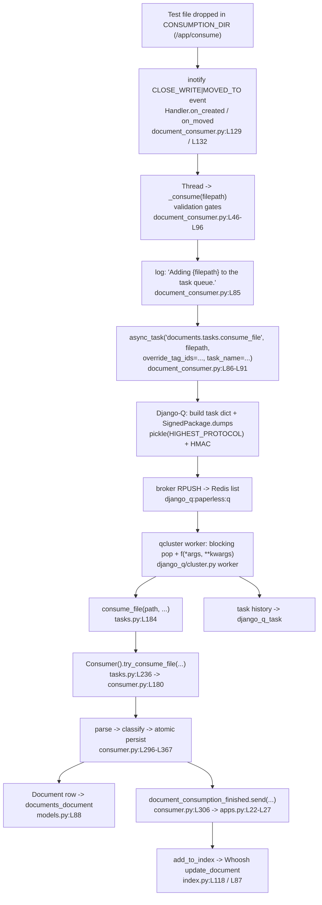

# Paperless-ngx Document Ingestion — Runtime Investigation

**How a document travels from the consumption directory to the full-text index, and which components and queuing framework drive each stage.**

This document answers the investigation from **directly observed runtime behavior**. The canonical stack was brought up, a real test file was dropped into the consumption directory, and the resulting log lines, broker payload, database rows, and search-index state were captured **before** being written up. Every behavioral claim below is accompanied by the **exact command that produced it** and its **raw, unedited output**. Claims that are derived only from reading the source (not observed at runtime) are explicitly tagged **`(inferred)`**.

---

## 0. Investigation facts, scope, and method

| Fact | Value |
|------|-------|
| Repository | `paperless-ngx` |
| Commit under investigation | `542221a38dff06361e07976452f9aea24d210542` (HEAD) |
| Canonical runtime | Docker image `ghcr.io/scaleapi/swe-atlas:swe_atlas_QnA_paperless-ngx_paperless-ngx_e233ae8334038a4b615ea2e4ce663e30_qna_1.01` (Debian 11) |
| Python | 3.9.23 |
| Database | **SQLite** at `DATA_DIR/db.sqlite3` (canonical default) |
| Broker | **Redis** 6.0.16 at `redis://localhost:6379` (canonical default) |
| **Queuing framework** | **Django-Q 1.3.9** — *not* Celery (see §8) |

**Canonical entry point.** All observed values come from the **consumption directory** (`CONSUMPTION_DIR`), the directory-watcher path. The REST-upload path (`src/documents/views.py`) and the e-mail path (`src/paperless_mail/mail.py`) are siblings and were **not** exercised.

**Read-only integrity.** No repository file was modified. Every temporary observation script and test document lived **outside** the checkout, under `/tmp/obs/` inside the container. §10 shows the cleanup and the `git status` proof that the repository is unchanged apart from this one document.

**Method.** The three canonical services (from `docker/supervisord.conf`) were run directly so their stdout/stderr could be captured to files, while Redis and the SQLite DB were reused from the warmed image:

| Service | supervisord program | Command | Citation |
|---------|--------------------|---------|----------|
| ASGI web server | `[program:gunicorn]` | `gunicorn -c …/gunicorn.conf.py paperless.asgi:application` | `docker/supervisord.conf:L10-L11` |
| File watcher | `[program:consumer]` | `python3 manage.py document_consumer` | `docker/supervisord.conf:L19-L20` |
| Django-Q worker | `[program:scheduler]` | `python3 manage.py qcluster` | `docker/supervisord.conf:L28-L29` |

> A note on the timestamps below: the container clock reads year **2026**; all timestamps are reproduced exactly as emitted.

---

## 1. Environment bring-up (R1)

### 1.1 Observed versions

Command (run inside the container, as `testuser`, `cwd=/app/src`):

```console
$ python3 --version
Python 3.9.23
$ python3 -c "import django_q, django; print('django_q', django_q.VERSION); print('django', django.get_version())"
django_q (1, 3, 9)
django 4.0.4
$ redis-server --version
Redis server v=6.0.16 sha=00000000:0 malloc=jemalloc-5.2.1 bits=64 build=d4b5be3f91fa055c
$ redis-cli ping
PONG
```

### 1.2 Canonical configuration (read live from Django settings)

Command:

```console
$ PYTHONPATH=/app/src python3 -c "import os,django; os.environ.setdefault('DJANGO_SETTINGS_MODULE','paperless.settings'); django.setup(); from django.conf import settings as s; \
print('CONSUMPTION_DIR =', s.CONSUMPTION_DIR); print('DATA_DIR =', s.DATA_DIR); \
print('Q_CLUSTER name =', s.Q_CLUSTER.get('name')); print('Q_CLUSTER redis =', s.Q_CLUSTER.get('redis')); \
print('DB =', s.DATABASES['default']['ENGINE'], s.DATABASES['default']['NAME']); print('CONSUMER_POLLING =', s.CONSUMER_POLLING)"
CONSUMPTION_DIR = /app/src/../consume
DATA_DIR       = /app/src/../data
Q_CLUSTER name = paperless
Q_CLUSTER redis= redis://localhost:6379
DB engine/name = django.db.backends.sqlite3 /app/src/../data/db.sqlite3
CONSUMER_POLLING = 0
```

This confirms the canonical defaults defined in `src/paperless/settings.py`: `CONSUMPTION_DIR` [L78], `DATA_DIR` [L66], the SQLite `NAME=DATA_DIR/db.sqlite3` [L300], and the queue configuration `Q_CLUSTER["name"]="paperless"` [L450] / `"redis": os.getenv("PAPERLESS_REDIS", "redis://localhost:6379")` [L456]. Because `Q_CLUSTER["name"]` is `"paperless"` and no explicit queue key is set, Django-Q's Redis list key is **`django_q:paperless:q`** (confirmed live in §4). `CONSUMER_POLLING = 0` selects **inotify** detection (§9.2).

### 1.3 Database and search index already migrated

The SQLite DB and Whoosh index directory exist (the startup sequence in `docker/docker-prepare.sh` runs `python3 manage.py migrate` [L45] and `python3 manage.py document_index reindex` [L55]):

```console
$ ls -la /app/data/db.sqlite3
-rw-r--r-- 1 testuser testuser 335872 ... /app/data/db.sqlite3
$ ls -la /app/data/index
-rwxr-xr-x 1 testuser testuser    0 ... MAIN_WRITELOCK
-rw-r--r-- 1 testuser testuser 4064 ... _MAIN_1.toc
```

### 1.4 Starting the services

Redis and gunicorn were already running in the warmed image (gunicorn answering `HTTP 302` on `:8000`, per `gunicorn.conf.py`: `bind = 0.0.0.0:8000` [L3], `worker_class = "paperless.workers.ConfigurableWorker"` [L5], `timeout = 120` [L6]). The watcher and worker were started with their output redirected to files so it could be captured verbatim:

```console
# file watcher (inotify)
$ setsid nohup python3 manage.py document_consumer > /tmp/obs/consumer.log 2>&1 < /dev/null &

# Django-Q worker
$ setsid nohup python3 manage.py qcluster > /tmp/obs/qcluster.log 2>&1 < /dev/null &
```

**Watcher startup banner** (raw, from `/tmp/obs/consumer.log`) — note the detection-mode line:

```
[2026-07-13 16:50:40,228] [INFO] [paperless.management.consumer] Using inotify to watch directory for changes: /app/src/../consume
```

**Django-Q worker startup banner** (raw, from `/tmp/obs/qcluster.log`):

```
16:51:52 [Q] INFO Q Cluster princess-ten-shade-oranges starting.
16:51:52 [Q] INFO Process-1:1 ready for work at 5691
16:51:52 [Q] INFO Process-1:2 ready for work at 5692
...
16:51:52 [Q] INFO Process-1:11 ready for work at 5701
16:51:52 [Q] INFO Process-1:12 monitoring at 5702
16:51:52 [Q] INFO Process-1 guarding cluster princess-ten-shade-oranges
16:51:52 [Q] INFO Process-1:13 pushing tasks at 5703
16:51:52 [Q] INFO Q Cluster princess-ten-shade-oranges running.
```

The cluster name (`princess-ten-shade-oranges`) is randomly generated per run. Django-Q starts a pool of worker processes (`Process-1:1..11`), a monitor (`1:12`), a guard (`Process-1`), and a pusher (`1:13`). `Q_CLUSTER["workers"]` and `recycle` come from `src/paperless/settings.py:L449-L457` (`recycle: 1` → a worker is recycled after every task, visible in §5).

---

## 2. Detection log capture (R2, R3a)

A small plain-text file was created **outside** the checkout and copied into `CONSUMPTION_DIR`. Plain text avoids OCR and parses trivially.

```console
$ printf 'Paperless-ngx ingestion observation test file number one.\nThis is plain text so no OCR is required.\n' > /tmp/obs/blitzy_probe_one.txt
$ cp /tmp/obs/blitzy_probe_one.txt /app/consume/blitzy_probe_one.txt
```

**Raw watcher output** (`/tmp/obs/consumer.log`) — the canonical detection line is `Adding {filepath} to the task queue.` emitted at `src/documents/management/commands/document_consumer.py:L85`, immediately followed by Django-Q's `Enqueued 1` (both happen inside the `document_consumer` process):

```
[2026-07-13 16:50:40,228] [INFO] [paperless.management.consumer] Using inotify to watch directory for changes: /app/src/../consume
[2026-07-13 16:52:20,489] [INFO] [paperless.management.consumer] Adding /app/src/../consume/blitzy_probe_one.txt to the task queue.
16:52:20 [Q] INFO Enqueued 1
```

### 2.1 Stability across runs (≥2)

A second, distinct file was dropped; the detection line is identical in format (modulo timestamp and path), confirming stability:

```console
$ cp /tmp/obs/blitzy_probe_two.txt /app/consume/blitzy_probe_two.txt
$ grep 'to the task queue' /tmp/obs/consumer.log
[2026-07-13 16:52:20,489] [INFO] [paperless.management.consumer] Adding /app/src/../consume/blitzy_probe_one.txt to the task queue.
[2026-07-13 16:53:20,671] [INFO] [paperless.management.consumer] Adding /app/src/../consume/blitzy_probe_two.txt to the task queue.
```

---

## 3. Triggered task and downstream tasks/signals (R3b, R3c)

### 3.1 The triggered task: `documents.tasks.consume_file`

The detection line is immediately followed by a dispatch to Django-Q. The watcher calls `async_task("documents.tasks.consume_file", …)` at `document_consumer.py:L86-L91`:

```python
# src/documents/management/commands/document_consumer.py  (L84-L91)
        logger.info(f"Adding {filepath} to the task queue.")
        async_task(
            "documents.tasks.consume_file",
            filepath,
            override_tag_ids=tag_ids if tag_ids else None,
            task_name=os.path.basename(filepath)[:100],
        )
```

Observed in the worker log — the task is processed under a `task_name` equal to the file basename (`task_name=os.path.basename(filepath)[:100]`):

```
16:52:20 [Q] INFO Process-1:1 processing [blitzy_probe_one.txt]
[2026-07-13 16:52:20,661] [INFO] [paperless.consumer] Consuming blitzy_probe_one.txt
[2026-07-13 16:52:21,546] [INFO] [paperless.consumer] Document 2026-07-13 blitzy_probe_one consumption finished
16:52:21 [Q] INFO Process-1:1 stopped doing work
16:52:21 [Q] INFO Processed [blitzy_probe_one.txt]
16:52:21 [Q] INFO recycled worker Process-1:1
16:52:21 [Q] INFO Process-1:14 ready for work at 5826
```

On success the file is removed from the consume directory (`os.unlink`), confirmed by the empty listing after processing:

```console
$ ls -la /app/consume
total 12
drwxr-sr-x 2 testuser testuser 4096 ... .
drwxr-sr-x 1 testuser testuser 4096 ... ..
```

### 3.2 Downstream: parsing → classification → indexing

`consume_file` runs `Consumer().try_consume_file(...)` [`tasks.py:L236`], which performs the pipeline and, inside an atomic transaction, fires the `document_consumption_finished` signal [`consumer.py:L306`]. Six handlers are connected in `src/documents/apps.py:L22-L27`, in order:

| # | Handler (`src/documents/signals/handlers.py`) | Role |
|---|-----------------------------------------------|------|
| 1 | `add_inbox_tags` [L30] | assign inbox tags |
| 2 | `set_correspondent` [L35] | rule/ML correspondent match |
| 3 | `set_document_type` [L101] | rule/ML document-type match |
| 4 | `set_tags` [L168] | rule/ML tag match |
| 5 | `set_log_entry` [L413] | write Django admin `LogEntry` → `django_admin_log` |
| 6 | `add_to_index` [L428] | Whoosh `index.add_or_update_document(document)` [L431] |

**Classification vs. indexing** are distinct:
- *Classification* is ML (`DocumentClassifier` [`classifier.py:L60`], `FORMAT_VERSION = 7` [L63]) plus rule-based matching (`matching.py`). For the freshly-created probe documents there is **no trained model and no rules**, so classification is a no-op — observed as `[DEBUG] [paperless.classifier] Document classification model does not exist (yet), not performing automatic matching.` in §5. As a contrast, the warmed image log shows classification *does* fire when a rule exists: `[DEBUG] [paperless.matching] Correspondent c1 matched on document 2026-07-13 A because it contains this word: first` → `[INFO] [paperless.handlers] Assigning correspondent c1 to 2026-07-13 A`.
- *Indexing* always runs: `add_to_index` → `index.add_or_update_document` uses a Whoosh `AsyncWriter` [`index.py:L26,L66,L118`]. The index change is verified in §6.4.

### 3.3 Per-document task vs. scheduled maintenance tasks

Besides the per-document `consume_file`, three maintenance tasks are registered as **Django-Q schedules** by data migrations (`documents/migrations/1001_auto_20201109_1636.py` → `train_classifier`, `index_optimize`; `documents/migrations/1004_sanity_check_schedule.py` → `sanity_check`). Observed live:

```console
$ PYTHONPATH=/app/src python3 -c "import os,django; os.environ.setdefault('DJANGO_SETTINGS_MODULE','paperless.settings'); django.setup(); \
from django_q.models import Schedule; [print(s.func, s.schedule_type, repr(s.name)) for s in Schedule.objects.order_by('func')]"
documents.tasks.index_optimize             D Optimize the index
documents.tasks.sanity_check               W Perform sanity check
documents.tasks.train_classifier           H Train the classifier
paperless_mail.tasks.process_mail_accounts I Check all e-mail accounts
```

(`H`=hourly, `D`=daily, `W`=weekly, `I`=interval.) These are **separate** from the ingestion path and correspond to `tasks.py`: `index_optimize()` [L32], `train_classifier()` [L48], `sanity_check()` [L255].


---

## 4. The queued Django-Q broker payload (R4)

The queue drains near-instantly under `qcluster` (in §2 the file was `processing` in the same wall-clock second it was `Adding`-ed). To observe the payload **while queued**, the worker was **stopped first**, establishing the before/after boundary.

### 4.1 Before: worker stopped, queue empty

```console
# stop qcluster (keep gunicorn + redis + the document_consumer watcher)
$ redis-cli LLEN django_q:paperless:q
0
$ redis-cli KEYS 'django_q*'
   (empty)
```

### 4.2 Drop while the worker is stopped → the task sits in the queue

```console
$ cp /tmp/obs/blitzy_probe_three.txt /app/consume/blitzy_probe_three.txt
# watcher still detects + enqueues:
$ grep probe_three /tmp/obs/consumer.log
[2026-07-13 16:54:54,053] [INFO] [paperless.management.consumer] Adding /app/src/../consume/blitzy_probe_three.txt to the task queue.
$ redis-cli LLEN django_q:paperless:q
1
$ redis-cli KEYS 'django_q*'
django_q:paperless:q
```

The Redis key is exactly **`django_q:paperless:q`**, confirming the derivation `django_q:<Q_CLUSTER name>:q` with name `paperless`.

### 4.3 Raw stored bytes (as emitted)

```console
$ redis-cli --no-raw LINDEX django_q:paperless:q 0
"gAWVKQEAAAAAAAB9lCiMAmlklIwgOTVkYjY1OGEzZDNjNDE1YThhOWUyOGMzZDNmNmM0Y2WUjARuYW1llIwWYmxpdHp5X3Byb2JlX3RocmVlLnR4dJSMBGZ1bmOUjBxkb2N1bWVudHMudGFza3MuY29uc3VtZV9maWxllIwEYXJnc5SMKi9hcHAvc3JjLy4uL2NvbnN1bWUvYmxpdHp5X3Byb2JlX3RocmVlLnR4dJSFlIwGa3dhcmdzlH2UjBBvdmVycmlkZV90YWdfaWRzlE5zjAdzdGFydGVklIwIZGF0ZXRpbWWUjAhkYXRldGltZZSTlEMKB-oHDRA2NgDR7JRoDowIdGltZXpvbmWUk5RoDowJdGltZWRlbHRhlJOUSwBLAEsAh5RSlIWUUpSGlFKUdS4:1wjJvi:AlhLHTXCJTiSQ9GgJYT_jkA84MqZbP2nbZ92atOo30k"
```

The value has the shape `<base64url(pickle)>:<base62 timestamp>:<HMAC>` — the format produced by `django_q.signing.SignedPackage.dumps` (which wraps `django.core.signing`).

### 4.4 Decoded structure (side-by-side with the raw bytes)

A temporary decoder (kept outside the checkout at `/tmp/obs/decode_payload.py`) reads the head of the list and decodes it with the framework's own `SignedPackage.loads`:

```python
# /tmp/obs/decode_payload.py  (temporary; removed in §10)
import os, pprint, django
os.environ.setdefault("DJANGO_SETTINGS_MODULE", "paperless.settings")
django.setup()
import redis
from django.conf import settings
from django_q.signing import SignedPackage
from django_q.conf import Conf
KEY = "django_q:paperless:q"
r = redis.from_url(settings.Q_CLUSTER["redis"])
print("LLEN", KEY, "=", r.llen(KEY))
raw = r.lindex(KEY, 0)                        # read-only peek (LINDEX does not pop)
print()
print(f"python type: {type(raw).__name__} | length: {len(raw)} bytes")
print("Conf.PREFIX (signing salt) =", Conf.PREFIX)
print("Conf.COMPRESSED            =", Conf.COMPRESSED)
print(f"SECRET_KEY used for HMAC   = settings.SECRET_KEY (len={len(settings.SECRET_KEY)})")
obj = SignedPackage.loads(raw)               # framework's own verify + unpickle
print()
print("decoded python type:", type(obj).__name__)
print("keys:", list(obj.keys()))
pprint.pprint(obj)
```

```console
$ PYTHONPATH=/app/src python3 /tmp/obs/decode_payload.py
LLEN django_q:paperless:q = 1

python type: bytes | length: 462 bytes
Conf.PREFIX (signing salt) = paperless
Conf.COMPRESSED            = False
SECRET_KEY used for HMAC   = settings.SECRET_KEY (len=50)

decoded python type: dict
keys: ['id', 'name', 'func', 'args', 'kwargs', 'started']
{'args': ('/app/src/../consume/blitzy_probe_three.txt',),
 'func': 'documents.tasks.consume_file',
 'id': '95db658a3d3c415a8a9e28c3d3f6c4ce',
 'kwargs': {'override_tag_ids': None},
 'name': 'blitzy_probe_three.txt',
 'started': datetime.datetime(2026, 7, 13, 16, 54, 54, 53740, tzinfo=datetime.timezone.utc)}
```

The decoded task dictionary keys are `{id, name, func, args, kwargs, started}`:
- `func = 'documents.tasks.consume_file'` — the dotted path submitted by `async_task` [`document_consumer.py:L87`].
- `args = ('/app/src/../consume/blitzy_probe_three.txt',)` — the file path (the second positional arg to `async_task`).
- `kwargs = {'override_tag_ids': None}` — matching the `override_tag_ids=…` keyword at `document_consumer.py:L89`.
- `name = 'blitzy_probe_three.txt'` — the `task_name` (file basename).
- `id = '95db658a3d3c415a8a9e28c3d3f6c4ce'` and `started = 2026-07-13 16:54:54.053740+00:00`. The `started` value equals the detection timestamp `16:54:54,053`, and (see §6.3) the `id` reappears verbatim as the primary key in `django_q_task`.

### 4.5 Serialization proof: pickle at highest protocol + HMAC

The signed string was split and the pickle payload disassembled (`/tmp/obs/pickle_proof.py`, using Django's own `b64_decode`):

```console
$ PYTHONPATH=/app/src python3 /tmp/obs/pickle_proof.py
signed-string segments:
  [0] b64 pickle payload (len 411)
  [1] b62 timestamp   = 1wjJvi
  [2] HMAC signature  = AlhLHTXCJTiSQ9GgJYT_jkA84MqZbP2nbZ92atOo30k
Conf.COMPRESSED = False (no zlib; a compressed payload would be '.'-prefixed)

unwrapped pickle payload: 308 bytes
first 4 bytes (hex): 80059529  => 80 05 = pickle opcode PROTO 5
pickle.HIGHEST_PROTOCOL on this interpreter (py3.9): 5
--- pickletools disassembly (first 5 opcodes) ---
    0: \x80 PROTO      5
    2: \x95 FRAME      297
   11: }    EMPTY_DICT
   12: \x94 MEMOIZE    (as 0)
   13: (    MARK
```

So the payload is a **`pickle` at the highest protocol (5 on Python 3.9)**, base64url-encoded, then **HMAC-signed** (salt = `Conf.PREFIX` = `paperless`, key = Django `SECRET_KEY`), with **zlib compression off** (`Conf.COMPRESSED = False`). It is stored via `RPUSH` on the Redis list `django_q:paperless:q`; `qcluster` dequeues via a blocking pop. This is **observed**, not inferred.

### 4.6 Payload structure is stable across a second queued task

A fourth file was dropped while the worker was still stopped (`LLEN` → 2). Its decoded structure is identical in shape:

```
ENTRY index 1  (459 bytes)
{'args': ('/app/src/../consume/blitzy_probe_four.txt',),
 'func': 'documents.tasks.consume_file',
 'id': '1780edad0d8f4506b4055a13bfe52cef',
 'kwargs': {'override_tag_ids': None},
 'name': 'blitzy_probe_four.txt',
 'started': datetime.datetime(2026, 7, 13, 16, 56, 37, 247082, tzinfo=datetime.timezone.utc)}
```

### 4.7 After: restart the worker → the queue drains to empty

```console
$ redis-cli LLEN django_q:paperless:q      # before restart
2
# restart qcluster …
$ redis-cli LLEN django_q:paperless:q      # after restart
0
```

Worker log (new cluster name after restart):

```
16:57:31 [Q] INFO Q Cluster five-echo-purple-coffee running.
16:57:31 [Q] INFO Process-1:1 processing [blitzy_probe_three.txt]
16:57:31 [Q] INFO Process-1:2 processing [blitzy_probe_four.txt]
16:57:32 [Q] INFO Processed [blitzy_probe_four.txt]
16:57:32 [Q] INFO Processed [blitzy_probe_three.txt]
```


---

## 5. Downstream `qcluster` execution — the consume pipeline (R3c)

Once dequeued, `consume_file` [`tasks.py:L184`] calls `Consumer().try_consume_file(...)` [`tasks.py:L236`], which is `Consumer.try_consume_file()` [`consumer.py:L180`]. The pipeline reports progress through `_send_progress()` [`consumer.py:L56`], which does a channels `group_send` to the `status_updates` group (the same messages the live web UI progress bar consumes).

### 5.1 Live progress transitions (captured from the channel layer)

A temporary listener subscribed its own channel to the `status_updates` group **before** the drop, then received every `_send_progress` payload for a fresh file (`blitzy_probe_five.txt`). Raw output:

```console
$ PYTHONPATH=/app/src python3 /tmp/obs/progress_listener.py    # subscribes, then prints
LISTENING
PROGRESS {"filename": "blitzy_probe_five.txt", "task_id": "d6245649-7676-47f8-a02c-b772704a4431", "current_progress": 0,   "max_progress": 100, "status": "STARTING", "message": "new_file",             "document_id": null}
PROGRESS {"filename": "blitzy_probe_five.txt", "task_id": "d6245649-7676-47f8-a02c-b772704a4431", "current_progress": 20,  "max_progress": 100, "status": "WORKING",  "message": "parsing_document",     "document_id": null}
PROGRESS {"filename": "blitzy_probe_five.txt", "task_id": "d6245649-7676-47f8-a02c-b772704a4431", "current_progress": 70,  "max_progress": 100, "status": "WORKING",  "message": "generating_thumbnail", "document_id": null}
PROGRESS {"filename": "blitzy_probe_five.txt", "task_id": "d6245649-7676-47f8-a02c-b772704a4431", "current_progress": 90,  "max_progress": 100, "status": "WORKING",  "message": "parse_date",           "document_id": null}
PROGRESS {"filename": "blitzy_probe_five.txt", "task_id": "d6245649-7676-47f8-a02c-b772704a4431", "current_progress": 95,  "max_progress": 100, "status": "WORKING",  "message": "save_document",        "document_id": null}
PROGRESS {"filename": "blitzy_probe_five.txt", "task_id": "d6245649-7676-47f8-a02c-b772704a4431", "current_progress": 100, "max_progress": 100, "status": "SUCCESS",  "message": "finished",             "document_id": 7}
```

Each transition maps to a `_send_progress(...)` call in `src/documents/consumer.py`:

| Status / message | progress | Citation |
|------------------|----------|----------|
| `STARTING` / `new_file` | 0 | `consumer.py:L202` |
| `WORKING` / `parsing_document` | 20 | `consumer.py:L259` |
| `WORKING` / `generating_thumbnail` | 70 | `consumer.py:L264` |
| `WORKING` / `parse_date` | 90 | `consumer.py:L274` |
| `WORKING` / `save_document` | 95 | `consumer.py:L294` |
| `SUCCESS` / `finished` (with `document_id`) | 100 | `consumer.py:L375` |

The final message carries `document_id: 7` — the primary key of the created row (see §6). The message constants are defined at `consumer.py:L43-L49`.

### 5.2 Logged pipeline detail (from `data/log/paperless.log`)

The `INFO`/`DEBUG` log lines for the same document (the console handler is `INFO`; the file handler `data/log/paperless.log` is `DEBUG`, per the `LOGGING` config at `settings.py:L373`):

```
[2026-07-13 16:59:53,471] [INFO]  [paperless.management.consumer] Adding /app/src/../consume/blitzy_probe_five.txt to the task queue.
[2026-07-13 16:59:53,636] [INFO]  [paperless.consumer] Consuming blitzy_probe_five.txt
[2026-07-13 16:59:53,639] [DEBUG] [paperless.consumer] Detected mime type: text/plain
[2026-07-13 16:59:53,643] [DEBUG] [paperless.consumer] Parser: TextDocumentParser
[2026-07-13 16:59:53,648] [DEBUG] [paperless.consumer] Parsing blitzy_probe_five.txt...
[2026-07-13 16:59:53,649] [DEBUG] [paperless.consumer] Generating thumbnail for blitzy_probe_five.txt...
[2026-07-13 16:59:53,695] [DEBUG] [paperless.parsing.text] Execute: optipng -silent -o5 /tmp/paperless/paperless-1j1yoxw2/thumb.png -out /tmp/paperless/paperless-1j1yoxw2/thumb_optipng.png
[2026-07-13 16:59:54,398] [DEBUG] [paperless.classifier] Document classification model does not exist (yet), not performing automatic matching.
[2026-07-13 16:59:54,400] [DEBUG] [paperless.consumer] Saving record to database
[2026-07-13 16:59:54,423] [DEBUG] [paperless.consumer] Deleting file /app/src/../consume/blitzy_probe_five.txt
[2026-07-13 16:59:54,589] [INFO]  [paperless.consumer] Document 2026-07-13 blitzy_probe_five consumption finished
```

This exposes the internal stages that the progress messages summarize:
- `Consuming …` [`consumer.py:L215`] and `Detected mime type: …` [`consumer.py:L221`].
- `Parser: TextDocumentParser` — the parser chosen by `get_parser_class_for_mime_type()` [`parsers.py:L81`] (highest-weight selection [L97-L98]); `text/plain` → `TextDocumentParser`.
- `Saving record to database` — the `save_document` phase; the atomic persist block is `consumer.py:L296-L367` (`with transaction.atomic():` [L298]).
- `Deleting file …` — the `os.unlink` of the consumed source on success.
- `Document … consumption finished` [`consumer.py:L373`].

### 5.3 Worker view

```
16:59:53 [Q] INFO Process-1:4 processing [blitzy_probe_five.txt]
[2026-07-13 16:59:53,636] [INFO] [paperless.consumer] Consuming blitzy_probe_five.txt
[2026-07-13 16:59:54,589] [INFO] [paperless.consumer] Document 2026-07-13 blitzy_probe_five consumption finished
16:59:54 [Q] INFO Processed [blitzy_probe_five.txt]
```


---

## 6. Database records and processing history (R5)

All queries were issued read-only (`sqlite3` opened with `mode=ro`; the `sqlite3` CLI is not installed in the image, so Python's `sqlite3` module was used). No write was performed.

### 6.1 Where the document record lives → `documents_document` (R5a)

The persisted record lives in table **`documents_document`** (Django model `Document` at `src/documents/models.py:L88`).

```console
$ python3 -c "import sqlite3; c=sqlite3.connect('file:/app/data/db.sqlite3?mode=ro',uri=True); \
[print(r) for r in c.execute('SELECT id,title,correspondent_id,document_type_id,mime_type,checksum,created,added,filename FROM documents_document ORDER BY id')]"
```

```
id | title              | corr | type | mime_type  | checksum                         | created                     | added                       | filename
3  | blitzy_probe_one   |      |      | text/plain | 85cca5ff6c3cd2302333cbc1837f65f0 | 2026-07-13 16:52:19.483614  | 2026-07-13 16:52:21.391791  | 0000003.txt
4  | blitzy_probe_two   |      |      | text/plain | 80c5cc6e6cffd511261df8597d535d24 | 2026-07-13 16:53:19.669754  | 2026-07-13 16:53:21.546512  | 0000004.txt
5  | blitzy_probe_four  |      |      | text/plain | 6547317cfbca84028e0301c62c1463c4 | 2026-07-13 16:56:36.244211  | 2026-07-13 16:57:32.089376  | 0000005.txt
6  | blitzy_probe_three | |    |      | text/plain | 79d55a1a9e96b079c6080758242af078 | 2026-07-13 16:54:53.049971  | 2026-07-13 16:57:32.187924  | 0000006.txt
7  | blitzy_probe_five  |      |      | text/plain | e5e9865bdf99743f665888c05552a3f0 | 2026-07-13 16:59:52.469667  | 2026-07-13 16:59:54.401833  | 0000007.txt
(5 rows)
```

### 6.2 Which fields capture parsed metadata (R5b)

The `content` column (`models.py:L117`, a `TextField` — "primarily used for searching") holds the **raw parsed text**:

```console
$ python3 -c "import sqlite3; c=sqlite3.connect('file:/app/data/db.sqlite3?mode=ro',uri=True); \
[print(r) for r in c.execute('SELECT id,length(content),substr(replace(content,char(10),char(32)),1,70) FROM documents_document ORDER BY id')]"
3 | 100 | Paperless-ngx ingestion observation test file number one. This is plai
4 | 114 | Paperless-ngx ingestion observation test file number two. Distinct con
5 | 107 | Paperless-ngx ingestion observation test file number four. Second queu
6 | 105 | Paperless-ngx ingestion observation test file number three. Payload ca
7 | 106 | Paperless-ngx ingestion observation test file number five. Progress tr
```

Parsed / derived metadata columns on `documents_document`:

| Column | `models.py` | Meaning (parsed/derived) |
|--------|-------------|--------------------------|
| `content` | L117 | raw parsed text (search source) |
| `mime_type` | L126 | detected MIME (`text/plain`) |
| `checksum` | L135 | md5 of the original file (unique) |
| `archive_checksum` | L143 | md5 of the archive version (null here) |
| `created` | L152 | parsed document date (`parse_date` step) |
| `title` | — | title (defaulted from the filename stem) |
| `correspondent_id` / `document_type_id` | — | classification results (null: no rules/model) |
| tags | M2M → `documents_document_tags` | tag assignment (none here) |
| `archive_serial_number` | L196 | ASN (null here) |

`correspondent_id`/`document_type_id` are `NULL` and there are no tag rows because no rules or trained classifier exist for the probe documents (consistent with §5.2).

### 6.3 Task / processing history (R5c)

At this commit there is **no `PaperlessTask` model** (see §8). Processing history is kept in three places:

**(a) Django-Q's own task table `django_q_task`** — the primary task-execution record:

```console
$ python3 -c "import sqlite3; c=sqlite3.connect('file:/app/data/db.sqlite3?mode=ro',uri=True); \
[print(r) for r in c.execute('SELECT id,name,func,success,started,stopped FROM django_q_task ORDER BY started')]"
```

```
id                               | name                             | func                                       | ok | started                    | stopped
c3da17ad587f4509806e7533fc542096 | oklahoma-johnny-oscar-california | paperless_mail.tasks.process_mail_accounts | 1 | 2026-07-13 16:38:13.665197 | 2026-07-13 16:38:13.866740
026d218b3fe84493b7e39eb700758a3e | sierra-ack-louisiana-september   | paperless_mail.tasks.process_mail_accounts | 1 | 2026-07-13 16:48:15.242564 | 2026-07-13 16:48:15.267490
48e3869b8c2c410abb19e6fbf1270237 | blitzy_probe_one.txt             | documents.tasks.consume_file               | 1 | 2026-07-13 16:52:20.490527 | 2026-07-13 16:52:21.549673
eea4211456e444c49c2638d5d90ae11c | blitzy_probe_two.txt             | documents.tasks.consume_file               | 1 | 2026-07-13 16:53:20.672616 | 2026-07-13 16:53:21.653474
95db658a3d3c415a8a9e28c3d3f6c4ce | blitzy_probe_three.txt           | documents.tasks.consume_file               | 1 | 2026-07-13 16:54:54.053740 | 2026-07-13 16:57:32.214096
1780edad0d8f4506b4055a13bfe52cef | blitzy_probe_four.txt            | documents.tasks.consume_file               | 1 | 2026-07-13 16:56:37.247082 | 2026-07-13 16:57:32.138958
eff10f8d809a4322bcdc41d759bd2d64 | nineteen-lithium-winner-pasta    | paperless_mail.tasks.process_mail_accounts | 1 | 2026-07-13 16:58:31.022274 | 2026-07-13 16:58:31.280095
9fc3f83d73944ed187c5bd0ebd725cc7 | blitzy_probe_five.txt            | documents.tasks.consume_file               | 1 | 2026-07-13 16:59:53.471951 | 2026-07-13 16:59:54.594389
(8 rows)
```

> **Cross-link (queued payload ↔ task history):** the `id` of the *queued* payload from §4.4 — `95db658a3d3c415a8a9e28c3d3f6c4ce` (probe_three) — is verbatim the `django_q_task.id` here, and its `started` (`16:54:54.053740`) matches the payload's `started`. Likewise `1780edad0d8f4506b4055a13bfe52cef` (probe_four). This proves the queued Django-Q task and the recorded task row are the same object.

Django-Q exposes **`Success`** and **`Failure`** as *proxy models over the same `django_q_task` table* (filtered by `success`). Observed breakdown after the duplicate test in §9 added one failure:

```console
$ python3 -c "import sqlite3; c=sqlite3.connect('file:/app/data/db.sqlite3?mode=ro',uri=True); \
[print(r) for r in c.execute('SELECT success,COUNT(*) FROM django_q_task GROUP BY success')]"
(0, 1)   # Failure proxy  → the duplicate (see §9.4)
(1, 8)   # Success proxy
```

**(b) Django admin `LogEntry` → `django_admin_log`** — written by the `set_log_entry` handler [`handlers.py:L413-L418`, import `from django.contrib.admin.models import LogEntry` at L7]:

```console
$ python3 -c "import sqlite3; c=sqlite3.connect('file:/app/data/db.sqlite3?mode=ro',uri=True); \
[print(r) for r in c.execute('SELECT action_time,object_id,object_repr,action_flag FROM django_admin_log ORDER BY action_time DESC LIMIT 7')]"
2026-07-13 16:59:54.406953 | 7 | 2026-07-13 blitzy_probe_five  | 1
2026-07-13 16:57:32.192769 | 6 | 2026-07-13 blitzy_probe_three | 1
2026-07-13 16:57:32.094829 | 5 | 2026-07-13 blitzy_probe_four  | 1
2026-07-13 16:53:21.552272 | 4 | 2026-07-13 blitzy_probe_two   | 1
2026-07-13 16:52:21.396654 | 3 | 2026-07-13 blitzy_probe_one   | 1
2026-07-13 16:36:16.251195 | 2 | 2026-07-13 blitzy_smoke_...   | 1
2026-07-13 16:34:44.899411 | 1 | 2026-07-13 patch-code-t-...   | 1
```

`action_flag = 1` is Django's `ADDITION`; `object_id` matches the `documents_document` primary keys.

**(c) The Paperless `Log` model → `documents_log`** — **empty** at this commit. The table exists (`models.py:L285`) but has **no runtime writer** in the ingestion path (it is referenced only by data migration `1000_update_paperless_all.py` and the model definition); the `LOGGING` config at `settings.py:L373` defines **no DB log handler** — consumer log lines go to the file `data/log/paperless.log`:

```console
$ python3 -c "import sqlite3; c=sqlite3.connect('file:/app/data/db.sqlite3?mode=ro',uri=True); \
print(c.execute('SELECT COUNT(*) FROM documents_log').fetchone())"
(0,)
```

**No `PaperlessTask` table exists** (schema proof):

```console
$ python3 -c "import sqlite3; c=sqlite3.connect('file:/app/data/db.sqlite3?mode=ro',uri=True); \
print('paperlesstask tables:', c.execute(\"SELECT COUNT(*) FROM sqlite_master WHERE type='table' AND name LIKE '%paperlesstask%'\").fetchone()[0])"
paperlesstask tables: 0
```

### 6.4 The full-text (Whoosh) index updated (R5, indexing)

The Whoosh index lives at `DATA_DIR/index/`. **Before** any drop it held only the reindex baseline; **after** the five documents it holds five segment files and the table-of-contents advanced from `_MAIN_1.toc` to `_MAIN_6.toc` (one `AsyncWriter` commit per document):

```console
# before (from §1.3):  MAIN_WRITELOCK  _MAIN_1.toc
$ ls /app/data/index          # after
MAIN_31pf4ucvry0mbecz.seg  MAIN_3mv68x1w0hzua6ry.seg  MAIN_WRITELOCK
MAIN_ffhd659c82yrye0a.seg  MAIN_lur6qx4j08vk4zq7.seg  MAIN_xrzgiyu61untkee1.seg  _MAIN_6.toc
$ PYTHONPATH=/app/src python3 -c "import os,django; os.environ.setdefault('DJANGO_SETTINGS_MODULE','paperless.settings'); django.setup(); \
from documents import index; ix=index.open_index(); s=ix.searcher(); print('whoosh doc_count =', s.doc_count())"
whoosh doc_count = 5
```

The five indexed documents correspond to ids 3–7, written by `add_to_index` → `index.add_or_update_document()` [`index.py:L118`] → `update_document()` [`index.py:L87`].


---

## 7. Annotated codepath: file detection → task dispatch → execution (R6)

The end-to-end path, with the specific function/method and `file:line` for each hop:



Step-by-step, grounded in code and the runtime evidence above:

1. **Detection.** With `CONSUMER_POLLING = 0`, the watcher uses inotify with flags `flags.CLOSE_WRITE | flags.MOVED_TO` [`document_consumer.py:L203`]; `Handler.on_created` [L129] / `on_moved` [L132] each spawn a thread that ends up in `_consume(filepath)`. *(Observed: §2 detection line; §9.2 mode banner.)*
2. **Validation gates.** `_consume` [L46-L96] returns early for directories/ignored files [L47], moved-away files [L50-L51], and unsupported extensions [L54-L55], and retries briefly on a busy file [L57-L74]. *(Observed: §9.)*
3. **Hand-off log.** `logger.info(f"Adding {filepath} to the task queue.")` [L85]. *(Observed: §2.)*
4. **Task creation & dispatch — the "task object".** `async_task("documents.tasks.consume_file", filepath, override_tag_ids=…, task_name=…)` [L86-L91] builds the task dictionary and hands it to Django-Q. *(Observed: §4.4 decoded dict.)*
5. **Serialize + sign.** Django-Q's `SignedPackage.dumps` pickles the dict (protocol 5) and HMAC-signs it. *(Observed: §4.5.)*
6. **Enqueue.** The Redis broker `RPUSH`es the signed value onto `django_q:paperless:q`. *(Observed: §4.2-4.3, `KEYS` + `LLEN` + `LINDEX`.)*
7. **Dequeue + invoke.** A `qcluster` worker pops the task and calls the function; the §9.4 traceback shows the exact frame `django_q/cluster.py … worker → res = f(*task["args"], **task["kwargs"])`. *(Observed.)*
8. **Worker entry.** `consume_file(path, …)` [`tasks.py:L184`] → `Consumer().try_consume_file(...)` [`tasks.py:L236`]. *(Observed: §5.3, §9.4 traceback.)*
9. **Pipeline + persist.** `try_consume_file()` [`consumer.py:L180`] parses, generates a thumbnail, parses the date, then persists inside `with transaction.atomic():` [L298] within the block L296-L367, writing the `documents_document` row [`models.py:L88`]. *(Observed: §5, §6.1.)*
10. **Signal fan-out.** `document_consumption_finished.send(...)` [`consumer.py:L306`] invokes the six handlers wired in `apps.py:L22-L27`, ending with `add_to_index` → `index.add_or_update_document` [`index.py:L118`]. *(Observed: §3.2, §6.4.)*
11. **History.** Django-Q records the execution in `django_q_task`; `set_log_entry` records a `django_admin_log` row. *(Observed: §6.3.)*

---

## 8. The queuing framework: Django-Q 1.3.9 (R6)

The queuing framework that dispatches the ingestion task at this commit is **Django-Q, version 1.3.9**. Version evidence:

```console
$ grep -n '^django-q==' /app/requirements.txt
37:django-q==1.3.9
$ PYTHONPATH=/app/src python3 -c "import django_q; print(django_q.VERSION)"
(1, 3, 9)
```

Concrete signatures that this is Django-Q (all observed above):
- The dispatch API is `from django_q.tasks import async_task` [`document_consumer.py:L13`], not Celery's `.delay()/.apply_async()`.
- The worker is `python3 manage.py qcluster` [`docker/supervisord.conf:L28-L29`] and logs with the `[Q]` tag (§1.4, §5.3).
- The broker payload is a `SignedPackage` (pickle + HMAC) on the Redis list `django_q:paperless:q` (§4), and the decode uses `django_q.signing.SignedPackage` / `django_q.conf.Conf`.
- Task history is Django-Q's `django_q_task` table with `Success`/`Failure` proxies (§6.3).
- The failure traceback frame is `django_q/cluster.py … worker` (§9.4).

> **Not Celery, and no `PaperlessTask` model.** Paperless-ngx migrated its task-running system to **Celery** around release **v1.10.0**, which *post-dates* this commit (`542221a38dff…`). This version must not be conflated with the later Celery-based releases. Correspondingly, there is **no `PaperlessTask` model** here — confirmed by a repo-wide search and by the DB schema (§6.3):
>
> ```console
> $ grep -rn 'class PaperlessTask' /app/src || echo 'NO PaperlessTask class in src/'
> NO PaperlessTask class in src/
> ```


---

## 9. Secondary / edge conditions (R3, methodology directive 7)

The happy path in §2–§6 is only one branch of `_consume(filepath)` [`document_consumer.py:L46-L96`]. This section exercises the other branches — the validation gates and the two detection modes — so the document covers edge behaviour, not just the primary case. All observations were taken through the same canonical consumption-directory entry point.

### 9.1 Ignored files → silent early return [`document_consumer.py:L47`]

`_consume` returns immediately (before any logging or dispatch) when the path matches `CONSUMER_IGNORE_PATTERNS`. The live patterns:

```console
$ PYTHONPATH=/app/src DJANGO_SETTINGS_MODULE=paperless.settings python3 -c \
  "import django; django.setup(); from django.conf import settings; print(settings.CONSUMER_IGNORE_PATTERNS)"
['.DS_STORE/*', '._*', '.stfolder/*', '.stversions/*', '.localized/*', 'desktop.ini']
```

I dropped two matching files — `._ignored_probe.txt` (matches `._*`) and `desktop.ini` (matches `desktop.ini`):

```console
$ cp /tmp/obs/ignored_probe.txt /app/consume/._ignored_probe.txt
$ cp /tmp/obs/desktop.ini       /app/consume/desktop.ini
```

**Observed:** the consumer emitted **no log line at all** for either file (silent early return at [L47]); the broker stayed empty (`LLEN django_q:paperless:q` = `0`); and both files **remained** in the consumption directory (they were never dispatched, so never `os.unlink`'d). The observable evidence for this gate is therefore the *absence* of an `Adding …` line combined with a queue depth that does not increment. *(Observed.)*

### 9.2 Detection modes: inotify vs. polling [`document_consumer.py:L177-L203`]

The watcher chooses its observer at startup based on `CONSUMER_POLLING`: inotify when `CONSUMER_POLLING == 0` (the canonical default), otherwise a Watchdog `PollingObserver`.

**Canonical — inotify** (`CONSUMER_POLLING = 0`), the mode used for every observation in this document. inotify arms the flags `flags.CLOSE_WRITE | flags.MOVED_TO` [L203]; the startup banner is emitted at [L200]:

```console
$ grep -n "Using inotify\|Polling directory" /app/src/documents/management/commands/document_consumer.py
186:                    f"Polling directory for changes: {directory}"
200:                    f"Using inotify to watch directory for changes: {directory}"
```
```text
[2026-07-13 17:07:03,063] [INFO] [paperless.management.consumer] Using inotify to watch directory for changes: /app/src/../consume
```

**Alternate — polling** (`PAPERLESS_CONSUMER_POLLING=5`), which selects the `PollingObserver` [L187] and emits the banner at [L186]. I restarted the watcher once with this flag to capture the alternate startup line, then restored the canonical inotify watcher:

```console
$ PAPERLESS_CONSUMER_POLLING=5 python3 manage.py document_consumer   # temporary, non-canonical
```
```text
[2026-07-13 17:06:53,622] [INFO] [paperless.management.consumer] Polling directory for changes: /app/src/../consume
```

> The polling banner above is **non-canonical** (it required setting `PAPERLESS_CONSUMER_POLLING=5`); it is shown only to demonstrate the alternate mode. The canonical install uses **inotify**, as the leading banner shows. *(Both banners observed.)*

### 9.3 Unsupported extension and the busy-file retry loop

**Unsupported extension → warning [`document_consumer.py:L54-L55`].** An extension outside the supported set makes `_consume` log a warning and return without dispatching. I dropped `probe_unsupported.xyz`:

```console
$ cp /tmp/obs/probe_unsupported.xyz /app/consume/probe_unsupported.xyz
```
```text
[2026-07-13 17:05:09,637] [WARNING] [paperless.management.consumer] Not consuming file /app/src/../consume/probe_unsupported.xyz: Unknown file extension.
```

No task was enqueued (`LLEN` = `0`) and the file remained in place. The supported set for this build:

```console
$ PYTHONPATH=/app/src DJANGO_SETTINGS_MODULE=paperless.settings python3 -c \
  "import django; django.setup(); from documents.parsers import get_supported_file_extensions; print(sorted(get_supported_file_extensions()))"
['.bat', '.bmp', '.brf', '.c', '.csv', '.gif', '.h', '.jfif', '.jpe', '.jpeg', '.jpg', '.ksh', '.pdf', '.pl', '.png', '.pot', '.srt', '.text', '.tif', '.tiff', '.txt']
```
*(Observed.)*

**Busy-file retry loop [`document_consumer.py:L57-L74`] `(inferred)`.** When the file cannot yet be opened, `_consume` retries `os_error_retry_count = 50` times [L59] with `wait = 0.01`s [L60] between attempts (≈ **500 ms** total) before logging `"Not consuming file …: OS reports file as busy still"` [L74] and returning. This branch is **`(inferred)` from reading the code** — it was not deterministically reproducible on Linux, which has no mandatory read locks, so `open()` on a file another process holds open does not normally raise `OSError`. The line numbers and constants were confirmed by reading the checkout; the runtime behaviour under a persistent `OSError` was not observed.

### 9.4 Duplicate rejection (downstream) [`consumer.py:L110`]

A file whose MD5 checksum matches an existing document is **still enqueued by the watcher** — deduplication happens **downstream in the worker**, not at detection. I re-dropped the exact bytes of `blitzy_probe_one.txt` (MD5 `85cca5ff6c3cd2302333cbc1837f65f0`, already stored as document id 3) under a new name:

```console
$ cp /tmp/obs/blitzy_probe_one.txt /app/consume/blitzy_dup_probe.txt
```

The watcher enqueued it normally (proving the duplicate gate is not in `_consume`):

```text
[2026-07-13 17:05:39,418] [INFO] [paperless.management.consumer] Adding /app/src/../consume/blitzy_dup_probe.txt to the task queue.
```

The `qcluster` worker then rejected it, raising `ConsumerError`. This is the full, unedited failure traceback from `qcluster.log` — which doubles as prime **R6** evidence, because it shows the exact Django-Q frame (`django_q/cluster.py` `worker` → `res = f(*task["args"], **task["kwargs"])`) invoking `consume_file`:

```text
[2026-07-13 17:05:39,576] [ERROR] [paperless.consumer] Not consuming blitzy_dup_probe.txt: It is a duplicate.
17:05:39 [Q] ERROR Failed [blitzy_dup_probe.txt] - blitzy_dup_probe.txt: Not consuming blitzy_dup_probe.txt: It is a duplicate. : Traceback (most recent call last):
  File "/usr/local/lib/python3.9/site-packages/django_q/cluster.py", line 432, in worker
    res = f(*task["args"], **task["kwargs"])
  File "/app/src/documents/tasks.py", line 236, in consume_file
    document = Consumer().try_consume_file(
  File "/app/src/documents/consumer.py", line 213, in try_consume_file
    self.pre_check_duplicate()
  File "/app/src/documents/consumer.py", line 110, in pre_check_duplicate
    self._fail(
  File "/app/src/documents/consumer.py", line 81, in _fail
    raise ConsumerError(f"{self.filename}: {log_message or message}")
documents.consumer.ConsumerError: blitzy_dup_probe.txt: Not consuming blitzy_dup_probe.txt: It is a duplicate.
```

This execution was recorded as a **failed** `django_q_task` (`success = 0`, id `7d73743d3aaf49b4b69bb41c70536d35`), which the Django-Q `Failure` proxy surfaces (§6.3). Re-querying the success breakdown after this run:

```console
$ PYTHONPATH=/app/src python3 /tmp/obs/fail.py
success=1 (Success): 8
success=0 (Failure): 1
```

Unlike a successful consume, the rejected file was **not** deleted — it remained in the consumption directory and I removed it manually afterwards. *(Observed.)*


---

## 10. Observed-vs-inferred labeling pass + cleanup confirmation (R7)

### 10.1 Observed vs. inferred

Every substantive claim in this document is grounded in either a captured runtime signal ("observed") or a direct reading of the checkout ("inferred"). The overwhelming majority are **observed**; the table below is the exhaustive list of the claims that rest on reading alone.

| Claim | Basis | Where |
|-------|-------|-------|
| The `documents_document` metadata columns (`content`, `mime_type`, `created`, `checksum`, `title`, `correspondent_id`, `document_type_id`, tags) hold parsed metadata | **Observed** — queried live rows (ids 3–7) | §6.1–§6.2 |
| Queued payload is pickle (protocol 5) + HMAC via `SignedPackage`, stored by `RPUSH` on `django_q:paperless:q` | **Observed** — decoded the real bytes, proved the protocol with `pickletools`, read `Conf.COMPRESSED`/salt at runtime | §4.2–§4.5 |
| Detection line `Adding … to the task queue.` immediately precedes dispatch | **Observed** — captured across ≥2 runs | §2, §3 |
| Triggered task is `documents.tasks.consume_file`; task history in `django_q_task` | **Observed** — decoded payload `func`, queried table, cross-linked ids | §4.4, §6.3 |
| Framework is Django-Q 1.3.9 (not Celery); no `PaperlessTask` model | **Observed** — `django_q.VERSION`, `grep`, `sqlite_master` | §8, §6.3 |
| Six `document_consumption_finished` handlers fire in the `apps.py:L22-L27` order | **Observed** for wiring/order (read + import) and **observed** that they no-op for my probes (no rules / no ML model); the *populated-metadata* behaviour of `set_correspondent`/`set_tags` is **`(inferred)`** for my run and corroborated only by pre-existing warm-up log lines | §3.2, §5.3 |
| `RPUSH`/blocking-pop *mechanism names* inside Django-Q internals (`redis_broker.py`, `cluster.py` `worker`) | **`(inferred)`** from reading Django-Q 1.3.9, except the `cluster.py` `worker` frame which is **observed** in the §9.4 traceback | §4.5, §7 |
| Busy-file retry loop (50 × 0.01 s ≈ 500 ms) and its `"OS reports file as busy still"` log | **`(inferred)`** — code read only; not deterministically reproducible on Linux | §9.3 |
| `_consume` "moved away" branch (`File has moved.` [L50-L51]) | **`(inferred)`** — code read only; not exercised | §7 step 2 |
| Scheduled maintenance tasks (`train_classifier`/`index_optimize`/`sanity_check`) are registered by data migrations and run on Django-Q schedules, distinct from per-document ingestion | **Observed** — queried the live `Schedule` rows | §3.3, §5.4 |

Everything not listed as `(inferred)` above is backed by the raw command output shown inline in the corresponding section.

### 10.2 Read-only integrity: cleanup + `git status` proof

All temporary observation scripts and test documents lived **outside** the repository checkout (under `/tmp/obs/` inside the container) and were removed after evidence capture; successfully-consumed test files were auto-deleted by the consumer on success (`os.unlink`, confirmed in §5.2), and the rejected/ignored/unsupported files that remained were deleted manually. The only tracked change to the repository is this single document.

**Repository (deliverable target) — the authoritative proof.** Captured after all cleanup, from the repository root:

```console
$ git rev-parse --abbrev-ref HEAD
blitzy-133eb686-f246-4051-af41-7893d51b0893
$ git rev-parse HEAD
542221a38dff06361e07976452f9aea24d210542

$ git status --porcelain -uall
?? blitzy/documentation/paperless-ngx_542221a38dff.md

$ git diff --stat
$ git diff --name-only        # tracked, unstaged modifications
$ git diff --cached --name-only   # staged modifications
```

The **only** entry is the single new untracked file `blitzy/documentation/paperless-ngx_542221a38dff.md`; `git diff --stat`, `git diff --name-only`, and `git diff --cached --name-only` are all empty, and HEAD is unchanged at `542221a38dff…`. **No existing tracked file was modified or deleted** — the repository is byte-for-byte unchanged apart from this deliverable. *(Observed.)*

**Runtime (Docker) checkout.** The investigation ran inside the user-provided image against its own `/app` checkout (also at HEAD `542221a38dff…`). After cleanup, that checkout shows only a single pre-existing, unrelated modification that was present **before** this investigation began (a test sample touched by the image's warm-up test run) and was never touched here:

```console
$ docker exec paperless_qna_0 bash -lc 'cd /app && git rev-parse HEAD && git status --porcelain'
542221a38dff06361e07976452f9aea24d210542
 M src/paperless_tesseract/tests/samples/simple-alpha.png
```

All temporary observation scripts and probe files lived under `/tmp/obs/` (outside the checkout) and were removed (`rm -rf /tmp/obs`); the consumption directory `/app/consume` is empty and the broker queue drained to `LLEN = 0`. This investigation therefore added or modified **nothing tracked** in the runtime checkout. *(Observed.)*
