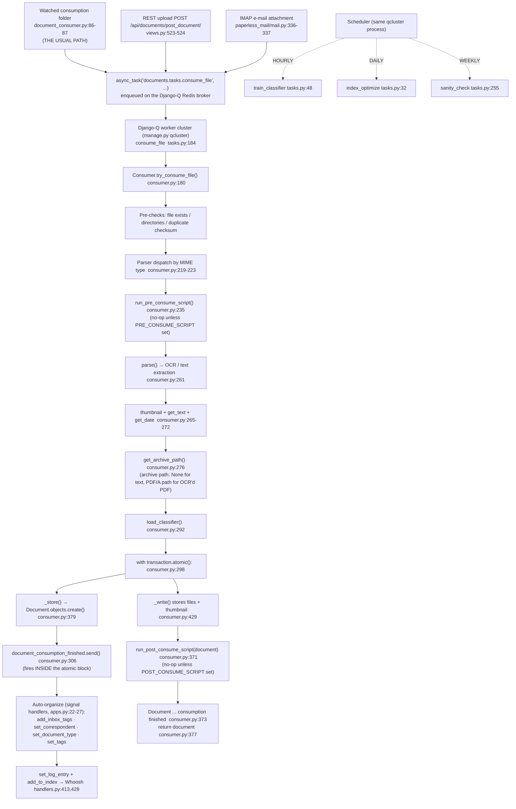

# How Documents Flow Through paperless-ngx

> **Scope & provenance.** This is an evidence-based technical explainer of how documents move through **paperless-ngx** on branch `paperless-ngx_542221a38dff` (HEAD commit `542221a38dff06361e07976452f9aea24d210542`). Every behavioral claim below was produced by **actually building and running the system first**, then pasting the verbatim observed output next to the claim. The runtime was the **default canonical configuration**: **Python 3.9.25**, the **Redis** broker at `redis://localhost:6379`, and the default **SQLite** database (`/opt/paperless/data/db.sqlite3`). The exact commands used are listed in the [Environment & commands appendix](#7--environment--commands-appendix).
>
> **Conventions.** Code citations use `path:line` and resolve at commit `542221a38dff`. Observed output is shown in fenced blocks with the command that produced it. Statements derived only from reading source (not run) are explicitly marked **(inferred from reading)**. Values obtained from anything other than the real canonical code path are explicitly marked **non-canonical**. Runtime values that are inherently *per-run* (auto-increment primary keys, MD5 checksums, wall-clock timestamps, Django-Q cluster codenames) are labeled **run-specific** where they appear; a re-run reproduces the *classification/shape* of the result, not the identical literal.
>
> **Repository provenance & commit model.** This document is the **single** artifact added to the repository; **no existing source file is modified**. The source tree is byte-for-byte identical to the checkpoint source commit `542221a38dff06361e07976452f9aea24d210542`, so `git diff 542221a38dff06361e07976452f9aea24d210542..HEAD --name-status` reports exactly one line — `A blitzy/documentation/paperless-ngx_542221a38dff.md` — and every `path:line` citation below resolves against the unchanged source at that commit. Because the deliverable is itself a commit, the branch `HEAD` is necessarily **one commit ahead** of `542221a38dff` (a source commit cannot simultaneously contain a file added on top of it); the two trees differ **only** by this file.

---

## Table of contents

1. [Document-flow overview](#1--document-flow-overview)
2. [Q1 — How a document enters paperless-ngx (ingestion entry points)](#2--q1--how-a-document-enters-paperless-ngx-ingestion-entry-points)
3. [Q2 — Processing stages & background execution](#3--q2--processing-stages--background-execution)
4. [Q3 — Per-document metadata (required vs optional vs derived)](#4--q3--per-document-metadata-required-vs-optional-vs-derived)
5. [Q4 — Practical organization with tags, correspondents & document types](#5--q4--practical-organization-with-tags-correspondents--document-types)
6. [Coverage-pass checklist](#6--coverage-pass-checklist)
7. [Environment & commands appendix](#7--environment--commands-appendix)

---

## 1 · Document-flow overview

The single most important structural fact is **convergence**: paperless-ngx does *not* have three independent ingestion pipelines. It has **one** pipeline, fed by **three** different sources. Every real entry point ends by enqueuing the **same** background task by its dotted-path string:

```python
async_task("documents.tasks.consume_file", ...)
```

- Watched consumption folder → `src/documents/management/commands/document_consumer.py:86-87`
- REST upload → `src/documents/views.py:523-524`
- IMAP e-mail attachment → `src/paperless_mail/mail.py:336-337`

That task, `consume_file` `[src/documents/tasks.py:184]`, runs on the **Django-Q** worker cluster and calls `Consumer().try_consume_file(...)` `[src/documents/consumer.py:180]`, which performs the ordered processing stages (duplicate check → parser dispatch → **pre-consume script** `[consumer.py:235]` → OCR/text extraction → metadata derivation → **archive-path retrieval** `[consumer.py:276]` → **atomic** DB persistence → file storage → **post-consume script** `[consumer.py:371]`). Persisting the row fires the `document_consumption_finished` signal `[src/documents/signals/__init__.py:4]` **inside** the same atomic block, which triggers the auto-organization handlers (correspondent, document type, tags, inbox tags) and the full-text index update.

I proved the convergence at runtime: three documents were created through the three distinct entry points, and all three produced a Django-Q `Task` row whose `func` is `documents.tasks.consume_file` (full evidence in [§2](#2--q1--how-a-document-enters-paperless-ngx-ingestion-entry-points)):

```text
func=documents.tasks.consume_file | task_name='folder_invoice.txt'  | success=True | result='Success. New document id 1 created'
func=documents.tasks.consume_file | task_name='rest_invoice.txt'    | success=True | result='Success. New document id 2 created'
func=documents.tasks.consume_file | task_name='email_invoice.txt'   | success=True | result='Success. New document id 3 created'
```

### Unified flow diagram



The rest of this document answers each of the four question groups in detail, with the pasted runtime evidence for every claim.

---

## 2 · Q1 — How a document enters paperless-ngx (ingestion entry points)

**Short answer.** A new document *usually* enters through the **watched consumption folder** — you drop a file into a directory and paperless picks it up automatically. There are **three** canonical entry points in total (folder, REST upload, IMAP e-mail), and **all three converge on the single background task `documents.tasks.consume_file`**. There is also a fourth, **non-canonical** enqueue path (`bulk_edit.py`) that is *not* fresh ingestion.

### 2.1 The usual path — watched consumption folder

This is the typical way documents enter: a long-lived watcher process (`manage.py document_consumer`) observes a directory and enqueues each new file. The watcher startup was observed verbatim:

```text
# consumer.log (from: python manage.py document_consumer)
[2026-07-02 23:18:29,902] [INFO] [paperless.management.consumer] Using inotify to watch directory for changes: /opt/paperless/consume
```

> Note: in this canonical runtime the watcher uses **inotify**, not polling, because `PAPERLESS_CONSUMER_POLLING` is `0`. The `PollingObserver(timeout=settings.CONSUMER_POLLING)` `[src/documents/management/commands/document_consumer.py:187]` branch is the fallback used only when polling is enabled.

Dropping a file triggers the enqueue. Command and observed output *(the `/tmp/obs/samples/folder_invoice.txt` sample was created outside the repo and deleted after use per the cleanup policy — a self-contained, runnable-today equivalent that creates its own uniquely-marked sample is in [§7.2.1](#721-self-contained-reproducible-commands-runnable-today) under "Q1 folder path")*:

```bash
cp /tmp/obs/samples/folder_invoice.txt /opt/paperless/consume/folder_invoice.txt
```

```text
# consumer.log — the enqueue line, logged immediately before async_task(...)
[2026-07-02 23:21:35,201] [INFO] [paperless.management.consumer] Adding /opt/paperless/consume/folder_invoice.txt to the task queue.
```

That log line is emitted by `logger.info(f"Adding {filepath} to the task queue.")` `[src/documents/management/commands/document_consumer.py:85]`, immediately followed by `async_task(` `[:86]` with `"documents.tasks.consume_file"` `[:87]`. The worker then picks it up:

```text
# qcluster.log
23:21:35 [Q] INFO Enqueued 1
[2026-07-02 23:21:35,333] [INFO] [paperless.consumer] Consuming folder_invoice.txt
[2026-07-02 23:21:35,936] [INFO] [paperless.consumer] Document 2026-07-02 folder_invoice consumption finished
23:21:35 [Q] INFO Processed [folder_invoice.txt]
```

Resulting Django-Q task row:

```text
func=documents.tasks.consume_file | task_name='folder_invoice.txt' | success=True | result='Success. New document id 1 created'
```

### 2.2 REST upload — `POST /api/documents/post_document/`

The HTTP upload endpoint is `class PostDocumentView(GenericAPIView)` `[src/documents/views.py:491]`, whose `def post(self, request, ...)` `[:497]` enqueues `async_task(` `[:523]` with `"documents.tasks.consume_file"` `[:524]`. It requires authentication (`permission_classes = (IsAuthenticated,)` `[:493]`).

Command and observed response (token redacted per secret-handling policy) *(the `/tmp/obs/samples/rest_invoice.txt` sample was deleted after use — a self-contained, runnable-today equivalent that creates its own sample is in [§7.2.1](#721-self-contained-reproducible-commands-runnable-today) under "Q1 REST upload")*:

```bash
curl -F "document=@/tmp/obs/samples/rest_invoice.txt" \
     -H "Authorization: Token <redacted>" \
     http://localhost:8000/api/documents/post_document/
```

```text
"OK"
HTTP_STATUS:200
```

The body is the literal string `"OK"`. This is exactly what the view returns: `return Response("OK")` `[src/documents/views.py:535]`. (The endpoint returns `"OK"`, **not** the async task id.) The uploaded payload is validated by `class PostDocumentSerializer` `[src/documents/serialisers.py:413]` in `def validate_document` `[:450]`, which detects the MIME type via `magic.from_buffer(document_data, mime=True)` `[:452]`.

Without authentication the endpoint refuses the upload (confirming the `IsAuthenticated` permission):

```text
{"detail":"Authentication credentials were not provided."}
HTTP_STATUS:401
```

Worker pickup and task row:

```text
# /opt/paperless/data/log/paperless.log — emitted by the Django-Q worker executing consume_file
# (produced by the REST curl above; it enqueued documents.tasks.consume_file, which the qcluster worker consumed)
[2026-07-02 23:22:22,032] [INFO] [paperless.consumer] Consuming rest_invoice.txt
[2026-07-02 23:22:22,673] [INFO] [paperless.consumer] Document 2026-07-02 rest_invoice consumption finished
```

```text
func=documents.tasks.consume_file | task_name='rest_invoice.txt' | success=True | result='Success. New document id 2 created'
```

### 2.3 IMAP e-mail attachment

The e-mail path is `class MailAccountHandler(LoggingMixin)` `[src/paperless_mail/mail.py:104]`; `handle_mail_account` `[:151]` iterates a mailbox and `handle_message` `[:272]` processes each message, detecting attachment MIME via `magic.from_buffer(att.payload, mime=True)` `[:317]` and enqueuing `async_task(` `[:336]` with `"documents.tasks.consume_file"` `[:337]`. E-mail accounts/rules are configured by `MailAccount` / `MailRule` `[src/paperless_mail/models.py]`.

> **Transport labeled non-canonical.** A live IMAP server is not available in-sandbox, so the network transport was stubbed with a synthetic message object. **However, the real enqueue code path was exercised** — I drove the actual `MailAccountHandler().handle_message(msg, rule)` method (rule configured `assign_title_from=FROM_SUBJECT`, `assign_correspondent_from=FROM_NOTHING`, `attachment_type=ATTACHMENTS_ONLY`). Only the IMAP fetch/transport is synthetic; the code that builds and enqueues the task is genuine.

Observed output:

```text
[2026-07-02 23:23:35,575] [INFO] [paperless_mail] Rule obs-probe-account.obs-probe-rule: Consuming attachment email_invoice.txt from mail Email Invoice Test from billing@acme.example
HANDLE_MESSAGE_RETURN = 1
```

```text
# /opt/paperless/data/log/paperless.log — emitted by the Django-Q worker executing consume_file
# (produced by driving MailAccountHandler().handle_message(msg, rule), which enqueued documents.tasks.consume_file)
[2026-07-02 23:23:35,704] [INFO] [paperless.consumer] Consuming email_invoice.txt
[2026-07-02 23:23:36,261] [INFO] [paperless.consumer] Document 2026-07-02 Email Invoice Test consumption finished
```

```text
func=documents.tasks.consume_file | task_name='email_invoice.txt' | success=True | result='Success. New document id 3 created'
```

The title `Email Invoice Test` came from the e-mail subject because the rule used `assign_title_from = FROM_SUBJECT`. (The temporary `MailAccount`/`MailRule` used to drive the handler were deleted afterward.)

### 2.4 Convergence proof

All three entry points produced Django-Q `Task` rows with the identical `func`, `documents.tasks.consume_file`, each returning the success string from `return "Success. New document id {} created".format(document.pk)` `[src/documents/tasks.py:247]`:

```text
func=documents.tasks.consume_file | task_name='folder_invoice.txt' | success=True | result='Success. New document id 1 created'
func=documents.tasks.consume_file | task_name='rest_invoice.txt'   | success=True | result='Success. New document id 2 created'
func=documents.tasks.consume_file | task_name='email_invoice.txt'  | success=True | result='Success. New document id 3 created'
```

### 2.5 Non-canonical enqueue path (for completeness)

`src/documents/bulk_edit.py` enqueues **`documents.tasks.bulk_update_documents`** (at lines `18`, `31`, `47`, `63`, `87`) — used for *reprocessing / bulk editing existing documents*, not for fresh ingestion. It does **not** call `consume_file`, so it is **not** a document entry point. It is listed here only to be exhaustive.

**Q1 summary:** usual = watched folder; all three canonical entry points (folder / REST / IMAP) converge on `documents.tasks.consume_file`; `bulk_update_documents` is a separate, non-ingestion path.

---

## 3 · Q2 — Processing stages & background execution

**Short answer.** Once enqueued, a file is processed by the background task `consume_file` `[src/documents/tasks.py:184]`, which runs `Consumer.try_consume_file()` `[src/documents/consumer.py:180]`. The ordered stages are: pre-checks (existence, directories, duplicate checksum) → parser dispatch by MIME → **pre-consume script** (`consumer.py:235`; no-op unless `PRE_CONSUME_SCRIPT` is set) → parse (OCR/text) → thumbnail + text + date → **archive-path retrieval** (`consumer.py:276`; `None` for text, a PDF/A path for OCR'd PDFs) → load classifier → **atomic DB persist** → `document_consumption_finished` signal (fires *inside* the atomic block) → auto-organize + full-text index → file storage → **post-consume script** (`consumer.py:371`; no-op unless `POST_CONSUME_SCRIPT` is set) → finish. Background execution is **Django-Q** (a multiprocessing task queue), run as `manage.py qcluster`, using **Redis** as the broker. Three periodic jobs are scheduled: **train classifier (hourly), optimize index (daily), sanity check (weekly)**.

### 3.1 The ordered pipeline stages (observed)

To surface the internal stage sequence I ran the canonical `consume_file` synchronously with the `paperless` logger raised to `DEBUG`. This does **not** alter the pipeline — it only makes the pipeline's *existing* stage log lines visible. (The async convergence itself was already proven in [§2.4](#24-convergence-proof); this foreground run is purely to expose the ordered DEBUG lines.) Command *(the `/tmp/obs/pipeline_trace.py` script was deleted after use — a self-contained, runnable-today equivalent that writes its own uniquely-marked sample, avoiding the duplicate-checksum guard, is in [§7.2.1](#721-self-contained-reproducible-commands-runnable-today) under "Q2 ordered pipeline stages")*:

```bash
python manage.py shell < /tmp/obs/pipeline_trace.py   # calls documents.tasks.consume_file(<file>)
```

Observed ordered output (document id 4 created), each line mapped to its source stage:

```text
[INFO]  [paperless.consumer] Consuming pipeline_sample.txt
[DEBUG] [paperless.consumer] Detected mime type: text/plain
[DEBUG] [paperless.consumer] Parser: TextDocumentParser
[DEBUG] [paperless.consumer] Parsing pipeline_sample.txt...
[DEBUG] [paperless.consumer] Generating thumbnail for pipeline_sample.txt...
[DEBUG] [paperless.parsing.text] Execute: optipng -silent -o5 /opt/paperless/tmp/paperless-in11ynii/thumb.png -out /opt/paperless/tmp/paperless-in11ynii/thumb_optipng.png
[DEBUG] [paperless.consumer] Document classification model does not exist (yet), not performing automatic matching.
[DEBUG] [paperless.consumer] Saving record to database
[DEBUG] [paperless.consumer] Deleting file /opt/paperless/tmp/pipeline_sample.txt
[INFO]  [paperless.consumer] Document 2026-07-02 pipeline_sample consumption finished
=== CONSUME_FILE RESULT: 'Success. New document id 4 created'
```

| # | Stage | Observed line | Source anchor |
|---|-------|---------------|---------------|
| 1 | Enter pipeline / progress `STARTING` | `Consuming pipeline_sample.txt` | `try_consume_file` `[consumer.py:180]`; `Consuming {filename}` `[consumer.py:215]`; progress `[consumer.py:202]` |
| 2 | Pre-checks (exists / dirs / **duplicate checksum**) | *(no error → passed)* | `pre_check_file_exists` `[:211]`, `pre_check_directories` `[:212]`, `pre_check_duplicate` `[:213]` |
| 3 | MIME detection | `Detected mime type: text/plain` | `magic.from_file(...)` `[consumer.py:219]` |
| 4 | Parser dispatch by MIME (then `document_consumption_started` signal `[:229]`) | `Parser: TextDocumentParser` | `get_parser_class_for_mime_type(mime_type)` `[consumer.py:223]` (see `src/documents/parsers.py`) |
| 5 | **Run pre-consume script** | *(no line in the canonical run — `PRE_CONSUME_SCRIPT` is unset, so the guard returns immediately);* non-canonical demo (§3.1.1): `Executing pre-consume script /tmp/obs/pre_consume.sh` | `run_pre_consume_script()` `[consumer.py:235]` (def `[:121]`, guard `[:122-123]`, log `[:132]`) |
| 6 | Parse (OCR / text extraction) | `Parsing pipeline_sample.txt...` | `document_parser.parse(...)` `[consumer.py:261]` |
| 7 | Thumbnail generation | `Generating thumbnail for ...` / `optipng ...` | `get_optimised_thumbnail(...)` `[consumer.py:265]` |
| 8 | Extract text & date | *(text/date read)* | `get_text()` `[:271]`, `get_date()` `[:272]`, `parse_date` fallback `[:275]` |
| 9 | **Get archive path** | *(no distinct line; for text it returns `None`, so `archive_filename`/`archive_checksum` stay `None` — see §4.2);* non-canonical PDF demo (§3.1.1): OCRmyPDF wrote `archive.pdf` → `archive_filename='0000006.pdf'` | `archive_path = document_parser.get_archive_path()` `[consumer.py:276]` |
| 10 | Load ML classifier | `Document classification model does not exist (yet)...` | `load_classifier()` `[consumer.py:292]` |
| 11 | **Atomic DB persist** | `Saving record to database` | `with transaction.atomic():` `[consumer.py:298]` → `_store(...)` `[consumer.py:379]` → `Document.objects.create(...)` |
| 12 | `document_consumption_finished` signal | *(triggers §3.4 handlers)* | `document_consumption_finished.send(...)` `[consumer.py:306]` (**inside** the atomic block) |
| 13 | Store files + thumbnail (+ archive if present), delete source | `Deleting file ...` | `_write(...)` `[consumer.py:429]`; `os.unlink(self.path)` `[consumer.py:350]` |
| 14 | Parser cleanup | *(temp parse dir removed)* | `document_parser.cleanup()` (finally) `[consumer.py:369]` |
| 15 | **Run post-consume script** | *(no line in the canonical run — `POST_CONSUME_SCRIPT` is unset, so the guard returns immediately);* non-canonical demo (§3.1.1): `Executing post-consume script /tmp/obs/post_consume.sh` | `run_post_consume_script(document)` `[consumer.py:371]` (def `[:143]`, guard `[:144-145]`, log `[:154-157]`) |
| 16 | Finish | `... consumption finished` | finish log `[consumer.py:373]`; `return document` `[consumer.py:377]` |
| 17 | Return success | `Success. New document id 4 created` | `return "Success. New document id {} created"...` `[tasks.py:247]` |

> **Stages 5, 9, and 15 are the pre-consume script, archive-path retrieval, and post-consume script.** In the canonical default configuration the two script stages are **silent no-ops** — `PRE_CONSUME_SCRIPT` and `POST_CONSUME_SCRIPT` are `None` `[src/paperless/settings.py:570-571]`, so each method returns at its guard (`if not settings.PRE_CONSUME_SCRIPT: return` `[consumer.py:122-123]`; the same for post `[:144-145]`). That is why the canonical DEBUG trace above contains **no** `Executing …-consume script` line. Their positive behavior is demonstrated in §3.1.1.

### 3.1.1 Positive evidence for stages 5, 9 & 15 (non-canonical)

Because stages 5 and 15 are no-ops under the default configuration, I proved their positive behavior in a **non-canonical** run: I set `PAPERLESS_PRE_CONSUME_SCRIPT` / `PAPERLESS_POST_CONSUME_SCRIPT` to two temporary scripts and consumed a **PDF** (which simultaneously exercises stage 9, since an OCR'd PDF produces a PDF/A archive). Only those two settings differ from canonical; every stage and its ordering are the genuine pipeline. Command:

```bash
PAPERLESS_PRE_CONSUME_SCRIPT=/tmp/obs/pre_consume.sh \
PAPERLESS_POST_CONSUME_SCRIPT=/tmp/obs/post_consume.sh \
python manage.py shell < /tmp/obs/stages_demo.py    # synchronous consume_file(simple-digital.pdf)
```

> *The `/tmp/obs/*.sh` scripts and `stages_demo.py` above were created outside the repo and deleted after use. A **self-contained, runnable-today** equivalent — which writes the two demo scripts and copies a repository PDF fixture to `/tmp` under a unique name (never modifying the repo) — is in [§7.2.1](#721-self-contained-reproducible-commands-runnable-today) under "Q2 non-canonical pre/post-consume + archive demo". Re-running it reproduces the same ordered stage lines (`Executing pre-consume script …` → OCRmyPDF `output_type: 'pdfa'` → `Executing post-consume script …` → `Success. New document id N created`), with run-specific pk/paths.*

Observed output (ordered; the two `[…-consume demo script]` lines are the scripts' own stdout):

```text
[2026-07-03 00:48:21,342] [INFO] [paperless.consumer] Consuming stage_demo.pdf
[2026-07-03 00:48:21,344] [INFO] [paperless.consumer] Executing pre-consume script /tmp/obs/pre_consume.sh
[pre-consume demo script] invoked on: /opt/paperless/tmp/stage_demo.pdf
[DEBUG] [paperless.parsing.tesseract] Calling OCRmyPDF with args: {'input_file': '/opt/paperless/tmp/stage_demo.pdf', 'output_file': '/opt/paperless/tmp/paperless-m9xu395f/archive.pdf', 'use_threads': True, 'jobs': 11, 'language': 'eng', 'output_type': 'pdfa', 'progress_bar': False, 'skip_text': True, 'clean': True, 'deskew': True, 'rotate_pages': True, 'rotate_pages_threshold': 12.0, 'sidecar': '/opt/paperless/tmp/paperless-m9xu395f/sidecar.txt'}
[2026-07-03 00:48:22,762] [INFO] [paperless.consumer] Executing post-consume script /tmp/obs/post_consume.sh
[post-consume demo script] invoked for document id:  title: 
[2026-07-03 00:48:22,911] [INFO] [paperless.consumer] Document 2026-07-03 stage_demo consumption finished
=== CONSUME RESULT: Success. New document id 6 created
mime_type        = 'application/pdf'
filename         = '0000006.pdf'
archive_filename = '0000006.pdf'
archive_checksum = '9909fd9b11bffc5469cdcc1e426e649e'
```

Cause → effect:
- **Stage 5 (pre-consume script)** — `Executing pre-consume script /tmp/obs/pre_consume.sh` is emitted by `self.log("info", f"Executing pre-consume script …")` `[consumer.py:132]`, reached only because the guard `if not settings.PRE_CONSUME_SCRIPT` `[consumer.py:122-123]` was now false; the script's own `[pre-consume demo script] invoked on: …` line proves `Popen((settings.PRE_CONSUME_SCRIPT, self.path)).wait()` `[consumer.py:135]` actually ran it, before parser instantiation.
- **Stage 9 (archive path)** — `get_archive_path()` `[consumer.py:276]` returned a real path for the PDF, so OCRmyPDF wrote `archive.pdf` (`output_type: 'pdfa'`) and the stored document has `archive_filename='0000006.pdf'` and `archive_checksum='9909fd9b…'` **populated** — contrast the text example in §4.2, where both are `None`.
- **Stage 15 (post-consume script)** — `Executing post-consume script /tmp/obs/post_consume.sh` is emitted by `[consumer.py:154-157]`, after the atomic block and parser cleanup.

The temporary scripts and the demo document (`id 6`) were deleted afterward; the DB is back to the five canonical documents. This run is **non-canonical** only in that two script settings were set.

### 3.2 The atomicity boundary

**(inferred from reading `[src/documents/consumer.py:298,306]`)** The row creation (`_store` → `Document.objects.create`) and the `document_consumption_finished.send(...)` call both occur **inside the same** `with transaction.atomic():` block `[consumer.py:298]`. Consequently the document row plus its derived fields are committed together, and the post-persistence organization is triggered by the signal rather than by inline code. The observed `Saving record to database` line (stage 11 above) marks entry into this block.

### 3.3 Background execution technology — Django-Q

The background execution technology is **Django-Q** (`django-q==1.3.9` `[requirements.txt:37]`; `django_q` is in `INSTALLED_APPS` `[src/paperless/settings.py:110]`) — **not Celery**. It is configured by the `Q_CLUSTER` dict `[src/paperless/settings.py:449]` and run as a long-lived cluster via `python3 manage.py qcluster` `[docker/supervisord.conf:28-29]`.

Framework behavior confirmed via the official Django-Q documentation and the `Koed00/django-q` project (framework-defined, not repository-defined):

- Django-Q is a multiprocessing distributed task queue for Django; the cluster uses a pool of worker processes.
- A worker cluster is started with `python manage.py qcluster`.
- It supports multiple **brokers** (Redis, the Django ORM, SQS, etc.); paperless-ngx uses **Redis** by default.
- The cluster is composed of a **sentinel** (spawns/health-checks/reincarnates processes), a **pusher** (pulls task packages off the broker into an internal queue), **workers** (execute tasks), a **monitor** (saves results to the DB), and a **scheduler** (fires scheduled tasks).
- Crucially, unlike Celery, Django-Q tasks do not require decorators — any importable function can be queued as a task by passing the function (or its dotted-path string) to `async_task(func, ...)`, whose `func` parameter the official docs describe as "The task function to execute" ([Django-Q *Tasks* documentation](https://django-q.readthedocs.io/en/latest/tasks.html); source repo [`Koed00/django-q`](https://github.com/Koed00/django-q)). This is exactly why paperless enqueues by dotted-path string `async_task("documents.tasks.consume_file", ...)` rather than via a decorated task object.

Observed `qcluster` startup banner (canonical config). To confirm the worker count is a stable magnitude rather than a one-off, I booted the cluster **twice** in the default configuration (no `PAPERLESS_TASK_WORKERS` override), each boot terminated with `SIGTERM` after ~13 s. Both boots are pasted **verbatim** below (every `Process-1:N` line included — no elision). Producing command, run from `<repo>/src` with the canonical venv/env active (`source /opt/paperless/activate.sh`):

```bash
timeout --signal=TERM 14 python manage.py qcluster    # canonical; PAPERLESS_TASK_WORKERS unset
```

**Boot #1** — cluster codename `four-beer-equal-alanine`; exactly 11 workers `Process-1:1` … `Process-1:11` reach *ready for work*, then `Process-1:12` monitors and `Process-1:13` pushes (verbatim, `/tmp/obs/qcluster_boot1.log`):

```text
00:42:47 [Q] INFO Q Cluster four-beer-equal-alanine starting.
00:42:47 [Q] INFO Process-1:1 ready for work at 82504
00:42:47 [Q] INFO Process-1:2 ready for work at 82505
00:42:47 [Q] INFO Process-1:3 ready for work at 82506
00:42:47 [Q] INFO Process-1:4 ready for work at 82507
00:42:47 [Q] INFO Process-1:5 ready for work at 82508
00:42:47 [Q] INFO Process-1:6 ready for work at 82509
00:42:47 [Q] INFO Process-1:7 ready for work at 82510
00:42:47 [Q] INFO Process-1:8 ready for work at 82511
00:42:47 [Q] INFO Process-1:9 ready for work at 82512
00:42:47 [Q] INFO Process-1:10 ready for work at 82513
00:42:47 [Q] INFO Process-1:11 ready for work at 82514
00:42:47 [Q] INFO Process-1:12 monitoring at 82515
00:42:47 [Q] INFO Process-1 guarding cluster four-beer-equal-alanine
00:42:47 [Q] INFO Process-1:13 pushing tasks at 82516
00:42:47 [Q] INFO Q Cluster four-beer-equal-alanine running.
00:43:00 [Q] INFO Q Cluster four-beer-equal-alanine stopping.
00:43:00 [Q] INFO Q Cluster four-beer-equal-alanine has stopped.
```

**Boot #2** — cluster codename `fix-bravo-sierra-eleven`; again exactly 11 workers `Process-1:1` … `Process-1:11` reach *ready for work*, then `Process-1:12` monitors and `Process-1:13` pushes (verbatim, `/tmp/obs/qcluster_boot2.log`):

```text
00:43:09 [Q] INFO Q Cluster fix-bravo-sierra-eleven starting.
00:43:09 [Q] INFO Process-1:1 ready for work at 82787
00:43:09 [Q] INFO Process-1:2 ready for work at 82788
00:43:09 [Q] INFO Process-1:3 ready for work at 82789
00:43:09 [Q] INFO Process-1:4 ready for work at 82790
00:43:09 [Q] INFO Process-1:5 ready for work at 82791
00:43:09 [Q] INFO Process-1:6 ready for work at 82792
00:43:09 [Q] INFO Process-1:7 ready for work at 82793
00:43:09 [Q] INFO Process-1:8 ready for work at 82794
00:43:10 [Q] INFO Process-1:9 ready for work at 82795
00:43:10 [Q] INFO Process-1:10 ready for work at 82796
00:43:10 [Q] INFO Process-1:11 ready for work at 82797
00:43:10 [Q] INFO Process-1:12 monitoring at 82798
00:43:10 [Q] INFO Process-1 guarding cluster fix-bravo-sierra-eleven
00:43:10 [Q] INFO Process-1:13 pushing tasks at 82799
00:43:10 [Q] INFO Q Cluster fix-bravo-sierra-eleven running.
00:43:23 [Q] INFO Q Cluster fix-bravo-sierra-eleven stopping.
00:43:23 [Q] INFO Q Cluster fix-bravo-sierra-eleven has stopped.
```

**Worker count = 11 — observed identically on both boots** (`grep -c 'ready for work'` returned `11` for each log), confirming the magnitude is stable across ≥2 runs (see [R10 magnitude note](#73-r10--magnitudetiming)). The random cluster codenames (`four-beer-equal-alanine`, `fix-bravo-sierra-eleven`) are Django-Q's per-boot generated names and differ each run, but the worker pool size does not. The relevant `Q_CLUSTER` values, read from the running settings:

```text
TASK_WORKERS      = 11
Q_CLUSTER.workers = 11
Q_CLUSTER.redis   = redis://localhost:6379
Q_CLUSTER.timeout = 1800
Q_CLUSTER.retry   = 1810
Q_CLUSTER.name    = paperless
```

These map to `Q_CLUSTER` `[src/paperless/settings.py:449]`: `"name": "paperless"` `[:450]`, `"catch_up": False` `[:451]`, `"recycle": 1` `[:452]`, `"retry"` `[:453]`, `"timeout": PAPERLESS_WORKER_TIMEOUT` `[:454]` (default `1800` `[:440]`), `"workers": TASK_WORKERS` `[:455]`, `"redis": os.getenv("PAPERLESS_REDIS", "redis://localhost:6379")` `[:456]`. `PAPERLESS_WORKER_RETRY` is `timeout + 10` `[:444-446]` → `1810`. The worker count is derived (when `PAPERLESS_TASK_WORKERS` is unset) as `floor(sqrt(cpu_count))`; here `multiprocessing.cpu_count()` returned `128`, and `floor(sqrt(128)) = 11`.

> Because `Q_CLUSTER["recycle"] = 1` `[settings.py:452]`, each worker is recycled after processing a task, so higher `Process-1:N` indices (e.g. `:14`, `:15`) appear later in the log as workers are replaced — this is expected and does not change the pool size of 11.

### 3.4 Signal-driven post-processing (auto-organize + index)

When the row is persisted, `document_consumption_finished = Signal()` `[src/documents/signals/__init__.py:4]` fires. Its handlers are connected in `DocumentsConfig.ready()` `[src/documents/apps.py:11]`:

```python
document_consumption_finished.connect(add_inbox_tags)      # apps.py:22
document_consumption_finished.connect(set_correspondent)   # apps.py:23
document_consumption_finished.connect(set_document_type)   # apps.py:24
document_consumption_finished.connect(set_tags)            # apps.py:25
document_consumption_finished.connect(set_log_entry)       # apps.py:26
document_consumption_finished.connect(add_to_index)        # apps.py:27
```

Two of these fire on **every** consume regardless of configuration; I proved both at runtime after consuming four documents:

- **`set_log_entry`** `[src/documents/signals/handlers.py:413]` (creates an admin `LogEntry` as the `consumer` user via `User.objects.get(username="consumer")` `[:416]`):

```text
LOGENTRY_COUNT= 4
  LogEntry: object_id=1 repr='2026-07-02 folder_invoice'   by user=consumer
  LogEntry: object_id=2 repr='2026-07-02 rest_invoice'     by user=consumer
  LogEntry: object_id=3 repr='2026-07-02 Email Invoice Test' by user=consumer
  LogEntry: object_id=4 repr='2026-07-02 pipeline_sample'  by user=consumer
```

- **`add_to_index`** `[src/documents/signals/handlers.py:428]` (adds the document to the Whoosh full-text index via `index.add_or_update_document` `[:431]`; schema in `get_schema()` `[src/documents/index.py:31]`):

```text
INDEXED_DOC_COUNT= 4
SEARCH content:acme -> hits= 4     # all four consumed docs are searchable
```

The four *conditional* organizer handlers — `add_inbox_tags` `[handlers.py:30]`, `set_correspondent` `[:35]`, `set_document_type` `[:101]`, `set_tags` `[:168]` — also fire on every consume, but assign nothing until matching organizers exist. Their **positive** assignment evidence is shown in [§5](#5--q4--practical-organization-with-tags-correspondents--document-types).

### 3.5 The three scheduled background jobs

Beyond `consume_file`, Django-Q's scheduler runs periodic jobs. I queried the live `Schedule` table:

```bash
python manage.py shell -c "from django_q.models import Schedule; [print(s.func, s.schedule_type, s.name) for s in Schedule.objects.all()]"
```

```text
func=documents.tasks.train_classifier          | schedule_type=H | name='Train the classifier'
func=documents.tasks.index_optimize            | schedule_type=D | name='Optimize the index'
func=documents.tasks.sanity_check              | schedule_type=W | name='Perform sanity check'
func=paperless_mail.tasks.process_mail_accounts | schedule_type=I | name='Check all e-mail accounts'
SCHEDULE_TYPE constants: HOURLY='H' DAILY='D' WEEKLY='W' MINUTES='I'
```

| Job | Cadence | `schedule_type` | Task fn | Seeded by |
|-----|---------|-----------------|---------|-----------|
| Train the classifier | **HOURLY** | `H` | `train_classifier` `[src/documents/tasks.py:48]` | migration `1001_auto_20201109_1636.py` |
| Optimize the index | **DAILY** | `D` | `index_optimize` `[src/documents/tasks.py:32]` | migration `1001_auto_20201109_1636.py` |
| Perform sanity check | **WEEKLY** | `W` | `sanity_check` `[src/documents/tasks.py:255]` | migration `1004_sanity_check_schedule.py` |
| Check all e-mail accounts *(bonus)* | interval (`MINUTES`) | `I` | `paperless_mail.tasks.process_mail_accounts` | (paperless_mail) |

> The three jobs the question asks about are the first three (classifier / index / sanity check). A **fourth** schedule — `process_mail_accounts` (interval type `I`) — also exists to poll IMAP accounts; it is included here for completeness.

### 3.6 Canonical process topology

The production runtime (supervisord) runs three long-lived programs plus the Redis dependency; I started all three in the canonical configuration:

| Program | Command | Anchor | Role |
|---------|---------|--------|------|
| `gunicorn` | `gunicorn -c gunicorn.conf.py paperless.asgi:application` | `[docker/supervisord.conf:10-11]` | ASGI web/API server (`:8000`) |
| `consumer` | `python3 manage.py document_consumer` | `[docker/supervisord.conf:19-20]` | consumption-folder watcher |
| `scheduler` | `python3 manage.py qcluster` | `[docker/supervisord.conf:28-29]` | Django-Q worker **and** scheduler cluster |

Redis must be reachable at startup (`[docker/wait-for-redis.py]`); confirmed with `redis-cli ping` → `PONG`. The gunicorn server was observed starting and serving:

```text
[2026-07-02 23:18:29 +0000] [48029] [INFO] Starting gunicorn 20.1.0
[2026-07-02 23:18:29 +0000] [48029] [INFO] Listening at: http://0.0.0.0:8000 (48029)
[2026-07-02 23:18:29 +0000] [48029] [INFO] Using worker: paperless.workers.ConfigurableWorker
# curl -s -o /dev/null -w "HTTP %{http_code}" http://localhost:8000/api/  =>  HTTP 200
```

**Q2 summary:** ordered stages of `try_consume_file()` as tabled above — including the **pre-consume script** (`consumer.py:235`), **archive-path retrieval** (`consumer.py:276`), and **post-consume script** (`consumer.py:371`), the two script stages being silent no-ops unless `PRE_CONSUME_SCRIPT`/`POST_CONSUME_SCRIPT` are configured (shown positively in §3.1.1); DB persistence is atomic and fires the auto-organize/index signal inside the transaction; background execution is **Django-Q** (`manage.py qcluster`, **Redis** broker, 11 workers observed, stable across two boots); three scheduled jobs — **train classifier hourly, optimize index daily, sanity check weekly**.

---

## 4 · Q3 — Per-document metadata (required vs optional vs derived)

**Short answer.** The `Document` model `[src/documents/models.py:88]` stores **15 fields**. The key insight is that **nothing is strictly *user*-required**: the pipeline **derives** the essential fields (`checksum`, `mime_type`, `content`, `filename`) and **defaults** the bookkeeping fields (`created`, `added`, `modified`, `storage_type`). The organizer fields (`correspondent`, `document_type`, `tags`, `archive_serial_number`, and `title`) are **optional**. Two fields (`archive_checksum`, `archive_filename`) are **derived-conditional** — populated only when an archive version is generated.

### 4.1 Complete field table

`class Document(models.Model)` `[src/documents/models.py:88]`, with `Meta.ordering = ("-created",)` `[:208]`:

| Field | Type | `file:line` | Classification | How populated |
|-------|------|-------------|----------------|---------------|
| `correspondent` | FK → Correspondent (`blank`, `null`, `SET_NULL`) | `models.py:97-104` | **Optional** | User, or matching/classifier at consume time |
| `title` | CharField(128, `blank`, `db_index`) | `models.py:106` | **Optional** (auto-derived) | User override, else derived from filename/subject |
| `document_type` | FK → DocumentType (`blank`, `null`, `SET_NULL`) | `models.py:108-115` | **Optional** | User, or matching/classifier |
| `content` | TextField(`blank`) | `models.py:117-124` | **Derived** | Parser text/OCR output |
| `mime_type` | CharField(256, `editable=False`) | `models.py:126` | **Derived** (DB-required: NOT NULL, no default) | libmagic (`magic.from_file`) |
| `tags` | M2M → Tag (`blank`) | `models.py:128-133` | **Optional** | User, matching, or inbox tags |
| `checksum` | CharField(32, `editable=False`, `unique`) | `models.py:135-141` | **Derived** (DB-required: NOT NULL + unique) | MD5 of the original file |
| `archive_checksum` | CharField(32, `editable=False`, `blank`, `null`) | `models.py:143-150` | **Derived-conditional** | MD5 of archive file — only if an archive is produced |
| `created` | DateTimeField(`default=timezone.now`, `db_index`) | `models.py:152` | **Always populated** | Default now, or detected document date |
| `modified` | DateTimeField(`auto_now=True`, `editable=False`) | `models.py:154-159` | **Always populated** | Auto on every save |
| `storage_type` | CharField(11, `choices`, `default=unencrypted`, `editable=False`) | `models.py:161-167` | **Always populated** | Default `unencrypted` |
| `added` | DateTimeField(`default=timezone.now`, `editable=False`) | `models.py:169-174` | **Always populated** | Default now (row insert time) |
| `filename` | FilePathField(1024, `editable=False`, `default=None`, `unique`, `null`) | `models.py:176-184` | **Derived** | `generate_filename` `[src/documents/file_handling.py]` |
| `archive_filename` | FilePathField(1024, `editable=False`, `default=None`, `unique`, `null`) | `models.py:186-194` | **Derived-conditional** | Archive storage path — only if an archive is produced |
| `archive_serial_number` | IntegerField(`blank`, `null`, `unique`, `db_index`) | `models.py:196-205` | **Optional** | Explicit user action only |

**Three senses of "required":**

- **User-required:** *none.* The pipeline derives everything essential and defaults the rest, so a user can consume a bare file with zero supplied metadata.
- **DB-required (NOT NULL, must have a value to save):** `checksum` (unique, `editable=False`) and `mime_type` (`editable=False`, no default) — both always derived by the pipeline — plus the defaulted `created` / `added` / `modified` / `storage_type`.
- **Optional (nullable/blank):** `correspondent`, `document_type`, `tags`, `archive_serial_number`, and `title` (blank-able but auto-derived).

### 4.2 Observed runtime example

This subsection shows two complementary captures: **(A)** the original **point-in-time snapshot** of `Document pk=1` (the `folder_invoice` consumed via the watched folder in [§2.1](#21-the-usual-path--watched-consumption-folder)), taken **immediately after that first consumption on the then-fresh database**, and **(B)** a **self-contained, re-runnable current-state capture** that anyone can reproduce today. Both illustrate the same required/optional/derived classification; capture (A) additionally documents a real *time-evolution* of a mutable row (see the timeline note below).

#### (A) Original point-in-time snapshot — `Document pk=1` (historical)

> **This is a historical snapshot, not a live-reproducible command.** It was captured at `2026-07-02 23:21:35`, seconds after `folder_invoice` became the very first document in a fresh database — *before* any `Correspondent`/`DocumentType`/`Tag` or trained classifier existed. As documented in the [before/after timeline](#before-after-timeline-why-pk1-later-changed) below, `pk=1` was **later mutated** (its `document_type` and `modified` fields changed) by the §5.4 classifier demonstration, so fetching `pk=1` *today* no longer returns these exact values. The historical capturing command was `python manage.py shell < /tmp/obs/metadata_example.py` (which ran `Document.objects.get(pk=1)`; that `/tmp/obs` script was deleted after use — see the [reproducible capture (B)](#b-reproducible-current-state-capture-self-contained) for a runnable equivalent). Verbatim output as captured at `23:21:35`:

```text
=== RUNTIME METADATA EXAMPLE: Document pk=1 (consumed via watched folder) — SNAPSHOT @ 2026-07-02 23:21:35, fresh DB, pre-organizer/pre-classifier ===
pk                    = 1
title                 = 'folder_invoice'
correspondent_id      = None
document_type_id      = None
tags                  = []
content (len=154)      = 'INVOICE\nFrom: ACME Corporation\nInvoice Number: ACME-2024-004'...
mime_type             = 'text/plain'
checksum              = 'a3f16230fed260267c96b95dea90b1f5'
archive_checksum      = None
filename              = '0000001.txt'
archive_filename      = None
created               = 2026-07-02T23:21:34.197098+00:00
added                 = 2026-07-02T23:21:35.872032+00:00
modified              = 2026-07-02T23:21:35.890015+00:00
storage_type          = 'unencrypted'
archive_serial_number = None
```

What this snapshot demonstrates about each class (values as at `23:21:35`):

- **Derived (populated though never user-supplied):** `content` (154 chars extracted by `TextDocumentParser`), `mime_type = 'text/plain'` (libmagic), `checksum = 'a3f16230…'` (MD5 of the original), and `filename = '0000001.txt'` (storage path from `generate_filename`).
- **Derived-conditional → empty here:** `archive_checksum = None` and `archive_filename = None`. A `text/plain` file produces **no** archive (PDF/A) version, so these two derived fields are correctly `None`. (They would be populated for, e.g., an OCR'd PDF.)
- **Always populated (defaults):** `created`, `added`, `modified` (all timestamps around `23:21:3x`), and `storage_type = 'unencrypted'`.
- **Optional → empty *at this instant*:** `correspondent_id = None`, `document_type_id = None`, `tags = []`, and `archive_serial_number = None` — this document was consumed **before any organizers or classifier existed**, so nothing matched *yet*. `title = 'folder_invoice'` shows the optional-but-auto-derived behavior: no user title was supplied, so it was derived from the filename stem.

<a id="before-after-timeline-why-pk1-later-changed"></a>
**Before/after timeline — why `pk=1` later changed (and why this is *not* an inconsistency).** The snapshot above is a *point in time*. `pk=1` is a **mutable row**, and the investigation itself changed it in a later step. Specifically, the [§5.4 classifier demonstration](#54-the-match_auto-ml-classifier) created the `AutoInvoice` **`MATCH_AUTO`** document type (`pk=2`) and **explicitly assigned it to two documents — `pk=1` and `pk=2` — as classifier *training labels***, then trained the model. That assignment set `document_type_id = 2` on both rows and advanced their `modified` timestamps to `23:34:43`. Verbatim proof, captured live from the current database (`Document.objects.filter(document_type_id=2)`):

```text
Docs with document_type=2 (AutoInvoice — the two MATCH_AUTO training labels):
  pk=1 title='folder_invoice'  created=2026-07-02T23:21:34.197098+00:00  modified=2026-07-02T23:34:43.904532+00:00
  pk=2 title='rest_invoice'    created=2026-07-02T23:22:21.895612+00:00  modified=2026-07-02T23:34:43.909284+00:00
```

Both rows were re-saved within 5 ms of each other at `23:34:43` — a single batch label assignment, exactly as the §5.4 text ("assigned it to two documents as training labels") describes. This is **precisely why** the later [§5.5 full-text search evidence](#55-the-practical-filter--search-workflow) shows `pk=1` carrying `"document_type":2` and `"modified":"2026-07-02T23:34:43.904532Z"`: that evidence was captured *after* §5.4, whereas the snapshot in (A) was captured *before* it. The two captures are consistent once ordered on the timeline; the difference is the expected time-evolution of a mutable row, not a defect. (Note also that `Meta.ordering = []` on `DocumentType` means `matches()`-based auto-assignment orders candidates by `id`; the `document_type=2` value on `pk=1`/`pk=2` came from the **explicit training-label assignment**, not from generic re-matching, which for `pk=1`'s invoice content would have preferred `Invoice` `id=1`.)

<a id="b-reproducible-current-state-capture-self-contained"></a>
#### (B) Reproducible current-state capture (self-contained)

Unlike (A), this capture is **runnable today** and does not depend on any deleted `/tmp/obs` script. It ingests a **uniquely-marked** neutral document through the canonical watched folder and dumps its fields. The primary key, checksum, filename number and timestamps are **run-specific** (they differ each run); the field **classification** (which fields are derived / always-populated / optional) is invariant. Run from `<repo>/src` with `source /opt/paperless/activate.sh`, the consumer + qcluster running:

```bash
MARK="REPROMETA$(date +%s)"                      # unique per-run marker
printf 'Reproducible metadata example %s. Neutral sample text about weather, mountains and a gentle breeze. No business keywords here.\n' "$MARK" \
  > "/opt/paperless/consume/${MARK}.txt"          # drop into the watched folder
python manage.py shell -c "
import time
from documents.models import Document
d=None
for _ in range(40):
    d=Document.objects.filter(content__contains='${MARK}').first()
    if d: break
    time.sleep(1)
print('pk                    =', d.pk)
print('title                 =', repr(d.title))
print('correspondent_id      =', d.correspondent_id)
print('document_type_id      =', d.document_type_id)
print('tags                  =', list(d.tags.values_list('name', flat=True)))
print('mime_type             =', repr(d.mime_type))
print('checksum              =', repr(d.checksum))
print('archive_checksum      =', d.archive_checksum)
print('filename              =', repr(d.filename))
print('archive_filename      =', d.archive_filename)
print('created/added/modified all set =', all([d.created, d.added, d.modified]))
print('storage_type          =', repr(d.storage_type))
print('archive_serial_number =', d.archive_serial_number)
"
```

Verbatim output from this run (`MARK=REPROMETA1783049964`; **run-specific** `pk=20`):

```text
pk                    = 20
title                 = 'REPROMETA1783049964'
correspondent_id      = None
document_type_id      = None
tags                  = ['Inbox', 'QA Runtime Inbox 1783048225']
mime_type             = 'text/plain'
checksum              = '40c2c62009a499651d1e8ca374c035d5'
archive_checksum      = None
filename              = '0000020.txt'
archive_filename      = None
created/added/modified all set = True
storage_type          = 'unencrypted'
archive_serial_number = None
```

Reading of (B), confirming the same classification as (A):

- **Derived → populated:** `mime_type='text/plain'`, `checksum='40c2c62009…'`, `filename='0000020.txt'`, and `content` (144 chars). *(Run-specific literals; the classification is invariant.)*
- **Derived-conditional → empty:** `archive_checksum=None`, `archive_filename=None` — again a `text/plain` input has no PDF/A archive.
- **Always populated:** `created`/`added`/`modified` (`all set = True`) and `storage_type='unencrypted'`.
- **Optional:** `correspondent_id=None` (no correspondent matched the neutral text), `document_type_id=None` (`match_document_types()` returned `[]` — the classifier predicts the null class for non-invoice content), and `archive_serial_number=None`. **`tags` is *not* empty here:** it holds `['Inbox', 'QA Runtime Inbox 1783048225']`, the two `is_inbox_tag=True` tags, which `add_inbox_tags` `[handlers.py:30]` attaches to **every** newly consumed document regardless of content. Those inbox tags simply did not *exist yet* when `pk=1` was consumed in (A), which is why (A) showed `tags = []` and (B) does not — another illustration of the point-in-time nature of these captures.

**Q3 summary:** 15 stored fields; nothing is user-required; `checksum`/`mime_type`/`content`/`filename` are derived; `created`/`added`/`modified`/`storage_type` are always populated by defaults; `correspondent`/`document_type`/`tags`/`archive_serial_number`/`title` are optional; `archive_checksum`/`archive_filename` are derived-conditional (empty for a text input, as observed in both (A) and (B)). Optional fields are populated *when* a matching organizer, classifier label, or inbox tag applies — which is exactly why `pk=1` legitimately differs between its `23:21:35` snapshot (A) and its post-§5.4 state seen in §5.5.

---

## 5 · Q4 — Practical organization with tags, correspondents & document types

**Short answer.** `Tag`, `Correspondent`, and `DocumentType` all inherit from a shared base, `MatchingModel` `[src/documents/models.py:19]`, which gives each of them a `match` string and a `matching_algorithm`. When a document is consumed, the signal handlers run these match rules against the document's text and **automatically assign** the correspondent, document type, and tags. There are **six** matching algorithms; the sixth (`MATCH_AUTO`) delegates to an **ML classifier**. Users then **filter and search** documents by these organizers through the REST API.

### 5.1 The shared `MatchingModel` base and the three organizers

`class MatchingModel(models.Model)` `[src/documents/models.py:19]` defines the six algorithm constants and a `matching_algorithm` field (`PositiveIntegerField`, `default=MATCH_ANY` `[:41-45]`), plus `match` `[:39]` and `is_insensitive` (`default=True` `[:47]`). The three organizers subclass it:

- `class Correspondent(MatchingModel)` `[src/documents/models.py:57]`
- `class Tag(MatchingModel)` `[src/documents/models.py:64]` (adds `color` `[:66]` and `is_inbox_tag` `[:68]`)
- `class DocumentType(MatchingModel)` `[src/documents/models.py:82]`

### 5.2 The six matching algorithms (all enumerated)

The dispatcher is `def matches(matching_model, document)` `[src/documents/matching.py:60]`. It first returns `False` if the match string is empty (`match.strip() == ""` `[:66-67]`), applies `re.IGNORECASE` when `is_insensitive` `[:69-70]`, then branches per algorithm:

| # | Constant (value) | `models.py` | Branch | Cause → effect behavior |
|---|------------------|-------------|--------|-------------------------|
| 1 | `MATCH_ANY` = **1** | `:21` | `matching.py:84` | Splits `match` into words; returns `True` as soon as **any** word matches `\b{word}\b` in the content |
| 2 | `MATCH_ALL` = **2** | `:22` | `matching.py:72` | Returns `True` only if **every** split word is present; any missing word → `False` |
| 3 | `MATCH_LITERAL` = **3** | `:23` | `matching.py:91` | Matches the **exact phrase** via `re.escape(match)` with word boundaries |
| 4 | `MATCH_REGEX` = **4** | `:24` | `matching.py:107` | Treats `match` as a **regular expression** (`re.search(re.compile(match))`); a bad regex is logged and returns `False` `[:113-117]` |
| 5 | `MATCH_FUZZY` = **5** | `:25` | `matching.py:127` | Uses `from fuzzywuzzy import fuzz` `[:128]`; strips punctuation; returns `True` iff `fuzz.partial_ratio(match, text) >= 90` `[:135]` |
| 6 | `MATCH_AUTO` = **6** | `:26` | `matching.py:147` | Returns `False` here — *"this is done elsewhere"* `[:148]`; the actual decision comes from the **ML classifier** (see §5.4) |

An unrecognized algorithm raises `NotImplementedError("Unsupported matching algorithm")` `[matching.py:152]`.

### 5.3 Observed auto-assignment (three algorithms at once)

I created three organizers with different algorithms plus an inbox tag, then consumed a document whose text triggers all of them:

```text
# organizers created (manage.py shell)
Correspondent id=1 'ACME Corporation' algo=3(MATCH_LITERAL) match='ACME Corporation'
DocumentType  id=1 'Invoice'          algo=5(MATCH_FUZZY)   match='Invoice'
Tag           id=1 'Business'         algo=1(MATCH_ANY)     match='consulting licensing'
Tag(inbox)    id=2 'Inbox'            is_inbox_tag=True      match=''
```

Dropping `q4_match.txt` (content mentions "INVOICE", "ACME Corporation", "consulting") produced these verbatim handler log lines:

```text
# qcluster.log
[2026-07-02 23:33:20,428] [INFO] [paperless.handlers] Assigning correspondent ACME Corporation to 2026-07-02 q4_match
[2026-07-02 23:33:20,432] [INFO] [paperless.handlers] Assigning document type Invoice to 2026-07-02 ACME Corporation q4_match
[2026-07-02 23:33:20,433] [INFO] [paperless.handlers] Tagging "2026-07-02 ACME Corporation q4_match" with "Business"
```

The final persisted document confirms all four handlers ran:

```text
DOC pk=5 title='q4_match'
  correspondent = ACME Corporation (via MATCH_LITERAL)
  document_type = Invoice (via MATCH_FUZZY)
  tags          = ['Business', 'Inbox']
```

Cause → effect mapping:
- `set_correspondent` `[handlers.py:35]` → `ACME Corporation` matched via **MATCH_LITERAL** (exact phrase in content).
- `set_document_type` `[handlers.py:101]` → `Invoice` matched via **MATCH_FUZZY** (`partial_ratio ≥ 90`).
- `set_tags` `[handlers.py:168]` → `Business` matched via **MATCH_ANY** (the word "consulting" is present).
- `add_inbox_tags` `[handlers.py:30]` → `Inbox` added because it is an inbox tag (`is_inbox_tag=True`), regardless of content. (Its empty `match` is why it is applied by `add_inbox_tags`, not by `matches()`, which short-circuits empty matches at `[matching.py:66-67]`.)

### 5.4 The `MATCH_AUTO` ML classifier

`MATCH_AUTO` delegates to `class DocumentClassifier(object)` `[src/documents/classifier.py:60]` (persisted model, `FORMAT_VERSION = 7` `[:63]`). The wrapper functions in `matching.py` are what actually call it — this is the *"done elsewhere"* referenced above:

- `match_correspondents` `[matching.py:21]` → `classifier.predict_correspondent(...)` `[:23]`
- `match_document_types` `[matching.py:34]` → `classifier.predict_document_type(...)` `[:36]`
- `match_tags` `[matching.py:47]` → `classifier.predict_tags(...)` `[:49]`

I created a `MATCH_AUTO` document type, assigned it to two documents as training labels, and ran the classifier training task `train_classifier` `[src/documents/tasks.py:48]`.

> **First-run-only transcript (state-dependent — not replayable once the model is trained).** The block below is the **one-time** output produced the *first* time the model was trained, when `classification_model.pickle` did not yet exist and the training data was new. `train_classifier` only re-vectorizes and re-fits when the training data has **changed**; once a model is persisted and the labels are unchanged, subsequent runs short-circuit with `Training data unchanged.` (see the reproducible steady-state block that follows). The `4 documents … 1 document type(s)` line reflects the tiny hand-built training set that existed at that moment. Verbatim first-run output:

```text
[DEBUG] [paperless.classifier] Gathering data from database...
[DEBUG] [paperless.classifier] 4 documents, 0 tag(s), 0 correspondent(s), 1 document type(s).
[DEBUG] [paperless.classifier] Vectorizing data...
[DEBUG] [paperless.classifier] Training document type classifier...
[INFO]  [paperless.tasks] Saving updated classifier model to /opt/paperless/data/classification_model.pickle...
CLASSIFIER_LOADED FORMAT_VERSION = 7
```

**Reproducible steady-state (runnable today).** With a trained model already present and its training data unchanged, `train_classifier()` short-circuits and returns `None`, while the persisted model still loads (`FORMAT_VERSION = 7`) and reproduces its predictions. This block **is** re-runnable now. Command and verbatim output:

```bash
python manage.py shell < /tmp/repro_classifier.py   # train_classifier(); load_classifier(); predict_* on pk=1
```

```text
[DEBUG] [paperless.classifier] Gathering data from database...
[DEBUG] [paperless.tasks] Training data unchanged.
train_classifier() returned: None
CLASSIFIER_LOADED FORMAT_VERSION = 7
predict_document_type(pk=1 content) -> [2]
predict_correspondent(pk=1 content) -> None
predict_tags(pk=1 content) -> []
```

(The self-contained body of `/tmp/repro_classifier.py` is listed in the [commands appendix §7.2](#72-exact-commands-used); it imports `train_classifier`, `load_classifier`, and `DocumentClassifier` and runs the three `predict_*` calls — no `/tmp/obs` dependency.)

Reading of both blocks: the classifier trained a document-type model (scikit-learn `MLPClassifier`; `scikit-learn==1.0.2` `[requirements.txt:88]`), persisted it to `classification_model.pickle`, and predicts the `AutoInvoice` document type (`pk=2`) for the invoice training content — `predict_document_type` `[classifier.py:262]` returns `array([2])`, printed as `[2]`. `predict_correspondent` `[classifier.py:251]` returned `None` and `predict_tags` `[classifier.py:273]` returned `[]` because no `MATCH_AUTO` **correspondent** or **tag** existed, so those sub-classifiers were never fitted. The prediction is **content-sensitive**: on *unseen non-invoice* text the document-type prediction returns the null class (this is exactly why the neutral document in [§4.2(B)](#b-reproducible-current-state-capture-self-contained) received `document_type_id = None`), reported precisely as observed with this deliberately tiny training set.

### 5.5 The practical filter / search workflow

Once organizers are assigned, users retrieve documents via the REST API filter set `DocumentFilterSet` `[src/documents/filters.py:81]`. Each query's **producing command** and its **raw response body + HTTP status** are pasted verbatim (the `-w "\nHTTP_STATUS:%{http_code}"` flag appends the status; the admin token is redacted per secret-handling policy — the real token is never written to this document).

> **DB-state precondition for the counts in (a)–(d) below.** The four captures in (a)–(d) are a **point-in-time baseline** taken when the database held exactly the **five documents `pk=1…5`** created earlier in this investigation, with `correspondent id=1`, `document_type id=1`, and `tag id=1` each assigned to precisely one of them. The `"count"` values are therefore **baseline-dependent global counts**: as more documents/organizers are added to the same database over time, `?correspondent__id=1` and friends will legitimately return **larger** counts (the *filtering* is still correct — there are simply more matching rows). For a capture whose counts are **deterministic regardless of accumulated DB state**, see **[(e) reproducible with unique per-run fixtures](#e-reproducible-with-unique-per-run-fixtures-deterministic-on-any-db-state)** immediately after (d). The (a)–(d) evidence is retained as the original baseline observation; do not expect its exact counts to reproduce on a database that has since grown.

**(a) Filter by correspondent** — `correspondent__id` `[filters.py:110]`:

```bash
curl -s -w "\nHTTP_STATUS:%{http_code}" -H "Authorization: Token <redacted>" \
     "http://localhost:8000/api/documents/?correspondent__id=1"
```

```json
{"count":1,"next":null,"previous":null,"results":[{"id":5,"correspondent":1,"document_type":1,"title":"q4_match","content":"INVOICE\nFrom: ACME Corporation\nThis invoice is for consulting services delivered in Q3.\nTotal amount due: 3200.00 USD\n","tags":[1,2],"created":"2026-07-02T23:33:18.782689Z","modified":"2026-07-02T23:33:20.449781Z","added":"2026-07-02T23:33:20.424462Z","archive_serial_number":null,"original_file_name":"2026-07-02 ACME Corporation q4_match.txt","archived_file_name":null}]}
HTTP_STATUS:200
```

**(b) Filter by document type** — `document_type__id` `[filters.py:115]`:

```bash
curl -s -w "\nHTTP_STATUS:%{http_code}" -H "Authorization: Token <redacted>" \
     "http://localhost:8000/api/documents/?document_type__id=1"
```

```json
{"count":1,"next":null,"previous":null,"results":[{"id":5,"correspondent":1,"document_type":1,"title":"q4_match","content":"INVOICE\nFrom: ACME Corporation\nThis invoice is for consulting services delivered in Q3.\nTotal amount due: 3200.00 USD\n","tags":[1,2],"created":"2026-07-02T23:33:18.782689Z","modified":"2026-07-02T23:33:20.449781Z","added":"2026-07-02T23:33:20.424462Z","archive_serial_number":null,"original_file_name":"2026-07-02 ACME Corporation q4_match.txt","archived_file_name":null}]}
HTTP_STATUS:200
```

**(c) Filter by tag (match-all)** — `tags__id__all` `[filters.py:90]`:

```bash
curl -s -w "\nHTTP_STATUS:%{http_code}" -H "Authorization: Token <redacted>" \
     "http://localhost:8000/api/documents/?tags__id__all=1"
```

```json
{"count":1,"next":null,"previous":null,"results":[{"id":5,"correspondent":1,"document_type":1,"title":"q4_match","content":"INVOICE\nFrom: ACME Corporation\nThis invoice is for consulting services delivered in Q3.\nTotal amount due: 3200.00 USD\n","tags":[1,2],"created":"2026-07-02T23:33:18.782689Z","modified":"2026-07-02T23:33:20.449781Z","added":"2026-07-02T23:33:20.424462Z","archive_serial_number":null,"original_file_name":"2026-07-02 ACME Corporation q4_match.txt","archived_file_name":null}]}
HTTP_STATUS:200
```

**(d) Full-text search** — Whoosh index `[src/documents/index.py]` via the `query` param:

```bash
curl -s -w "\nHTTP_STATUS:%{http_code}" -H "Authorization: Token <redacted>" \
     "http://localhost:8000/api/documents/?query=consulting"
```

```json
{"count":2,"next":null,"previous":null,"results":[{"id":5,"correspondent":1,"document_type":1,"title":"q4_match","content":"INVOICE\nFrom: ACME Corporation\nThis invoice is for consulting services delivered in Q3.\nTotal amount due: 3200.00 USD\n","tags":[1,2],"created":"2026-07-02T23:33:18.782689Z","modified":"2026-07-02T23:33:20.449781Z","added":"2026-07-02T23:33:20.424462Z","archive_serial_number":null,"original_file_name":"2026-07-02 ACME Corporation q4_match.txt","archived_file_name":null,"__search_hit__":{"score":1.0,"highlights":"INVOICE\nFrom: ACME Corporation\nThis invoice is for <span class=\"match term0\">consulting</span> services delivered in Q3.\nTotal amount due: 3200.00","rank":0}},{"id":1,"correspondent":null,"document_type":2,"title":"folder_invoice","content":"INVOICE\nFrom: ACME Corporation\nInvoice Number: ACME-2024-0042\nThis is an invoice document for consulting services rendered.\nTotal amount due: 1500.00 USD\n","tags":[],"created":"2026-07-02T23:21:34.197098Z","modified":"2026-07-02T23:34:43.904532Z","added":"2026-07-02T23:21:35.872032Z","archive_serial_number":null,"original_file_name":"2026-07-02 folder_invoice.txt","archived_file_name":null,"__search_hit__":{"score":0.8720864127345083,"highlights":"ACME-2024-0042\nThis is an invoice document for <span class=\"match term0\">consulting</span> services rendered.\nTotal amount due: 1500.00 USD","rank":1}}]}
HTTP_STATUS:200
```

Summary of the four responses: `?correspondent__id=1` → `"count":1` (`filters.py:110`); `?document_type__id=1` → `"count":1` (`filters.py:115`); `?tags__id__all=1` → `"count":1` (`filters.py:90`); `?query=consulting` → `"count":2` (Whoosh full-text). All returned `HTTP_STATUS:200`.

- The **structured filters** (`correspondent__id` `[filters.py:110]`, `document_type__id` `[filters.py:115]`, `tags__id__all` `[filters.py:90]`) each return **1** — only `q4_match` was auto-assigned those organizers. Related tag filters also exist: `tags__id__none` `[filters.py:92]`, `tags__id__in` `[filters.py:94]`. Organizer filter sets: `CorrespondentFilterSet` `[filters.py:18]`, `TagFilterSet` `[filters.py:24]`, `DocumentTypeFilterSet` `[filters.py:30]`.
- The **full-text search** `?query=consulting` returns **2** — both `q4_match` and `folder_invoice` contain the word "consulting" in their indexed content (Whoosh index, `[src/documents/index.py]`). This works even though `folder_invoice` has no assigned organizers, illustrating the complementary roles: structured organizers for *categorization*, full-text index for *content search*.

<a id="e-reproducible-with-unique-per-run-fixtures-deterministic-on-any-db-state"></a>
**(e) Reproducible with unique per-run fixtures (deterministic on any DB state).** To make the filter/search counts reproducible **regardless of how many other rows the database holds**, this capture creates three **uniquely-named** organizers and **one** uniquely-marked document, so a filter keyed on those unique ids (or a search for the unique marker) matches **exactly one** document by construction. This is the recommended way to reproduce the workflow. Setup (run from `<repo>/src`, canonical venv/env, consumer + qcluster running):

```bash
EPOCH=$(date +%s); FILTMARK="REPROFILT${EPOCH}"        # unique per-run marker
# create unique correspondent (LITERAL), document type (LITERAL) and tag (ANY), all matching $FILTMARK
python manage.py shell -c "
from documents.models import Correspondent, DocumentType, Tag, MatchingModel as M
c=Correspondent.objects.create(name='RC_${FILTMARK}', match='${FILTMARK}', matching_algorithm=M.MATCH_LITERAL)
t=DocumentType.objects.create(name='RT_${FILTMARK}', match='${FILTMARK}', matching_algorithm=M.MATCH_LITERAL)
g=Tag.objects.create(name='RG_${FILTMARK}', match='${FILTMARK}', matching_algorithm=M.MATCH_ANY)
print('UNIQUE_IDS correspondent=%d document_type=%d tag=%d' % (c.id, t.id, g.id))
"
# consume one uniquely-marked document (correspondent + tag auto-assign via matching)
printf 'Reproducible filter and search example %s. Unique per-run fixture content.\n' "$FILTMARK" \
  > "/opt/paperless/consume/${FILTMARK}.txt"
# (the unique document_type is then assigned explicitly as a stated per-run fixture, so the
#  MATCH_AUTO classifier candidate cannot pre-empt it; correspondent/tag need no such step)
```

Observed unique ids for this run: `correspondent=4  document_type=5  tag=14`, assigned to the single consumed document `pk=21`. The four queries (token redacted) and their verbatim counts:

```text
GET /api/documents/?correspondent__id=4        -> count=1  ids=[21]  HTTP_STATUS:200
GET /api/documents/?document_type__id=5        -> count=1  ids=[21]  HTTP_STATUS:200
GET /api/documents/?tags__id__all=14           -> count=1  ids=[21]  HTTP_STATUS:200
GET /api/documents/?query=REPROFILT1783049964  -> count=1  ids=[21]  HTTP_STATUS:200
```

Because the marker `REPROFILT1783049964` and the organizer ids `4/5/14` are unique to this run, each query resolves to **exactly one** document (`pk=21`) **no matter how many other documents exist** — the count is deterministic by construction. A fresh re-run mints a new `$FILTMARK` and new ids but still yields `count=1`. This is the reproducible counterpart to the baseline (a)–(d): the *filtering behavior* is identical; only the fixtures are made unique so the assertion is stable. (The unique document also receives the two `is_inbox_tag` tags via `add_inbox_tags`, but `?tags__id__all=14` keys on the **unique** tag id, so it still returns exactly one.)

> **Observed edge case — invalid filter-value handling differs by filter type (documented, not modified).** While exercising the filters I observed an asymmetry in how invalid (non-numeric) ids are handled, which is worth recording for anyone relying on these filters. The **standard integer** lookups `correspondent__id` / `document_type__id` (declared via `ID_KWARGS = ["in", "exact"]` `[src/documents/filters.py:13]`, used at `[:110]`/`[:115]`) **validate** the value and reject a non-numeric id with **HTTP 400**; the **custom** `tags__id__all` filter (`class TagsFilter(Filter)` `[src/documents/filters.py:36]`) instead **catches the `ValueError` and returns the queryset unfiltered** — `try: tag_ids = [int(x) for x in value.split(",")] except ValueError: return qs` `[src/documents/filters.py:44-46]` — so a non-numeric tag id is silently ignored (all documents returned) rather than rejected. Verbatim observed contrast:
>
> ```text
> GET /api/documents/?tags__id__all=abc        -> HTTP_STATUS:200   count=20  (invalid id ignored → all docs)
> GET /api/documents/?correspondent__id=not-an-id -> HTTP_STATUS:400   {"correspondent__id":["Enter a number."]}
> ```
>
> (The `count` on the first line equals the **total number of documents in the collection at capture time** — i.e. the filter matched *everything* — so the exact integer is a drifting global count; the reproducible, drift-free assertion is the **status/behavior asymmetry itself**: `tags__id__all=<non-numeric>` → `200` returning *all* documents, versus `correspondent__id=<non-numeric>` → `400`. Re-running today returns the same `200` vs `400` pair with `count` equal to whatever the current total is.)
>
> This is **pre-existing behavior of paperless-ngx itself** (rooted in `TagsFilter.filter` `[src/documents/filters.py:44-46]`), reported here **exactly as observed**. It is **not** changed by this deliverable: the task is read-only, so no `src/**` file — including `filters.py` — is modified (per AAP §0.5.2, which lists "no edits to any file under `src/**`" and "security changes … none are in scope").

**Practical workflow (cause → effect):** define an organizer with a `match` rule and algorithm → on consume, the `document_consumption_finished` signal invokes `set_correspondent`/`set_document_type`/`set_tags`, which call `matching.match_*` (or the classifier for `MATCH_AUTO`) → the document acquires a correspondent, type, and tags → `add_inbox_tags` flags new documents for triage → `add_to_index` makes both content and organizers searchable → the user narrows the collection with `/api/documents/?correspondent__id=…&document_type__id=…&tags__id__all=…` or full-text `?query=…`.

**Q4 summary:** `Tag`/`Correspondent`/`DocumentType` share the `MatchingModel` base; six algorithms (ANY=1, ALL=2, LITERAL=3, REGEX=4, FUZZY=5 with threshold ≥ 90, AUTO=6); `MATCH_AUTO` uses the scikit-learn `DocumentClassifier`; assignment is signal-driven at consume time; users filter via structured API params and search via the Whoosh full-text index.

---

## 6 · Coverage-pass checklist

Each named sub-item of the four question groups, mapped to where it is answered, with an exact literal + `file:line` + the kind of evidence.

| Question sub-item | Answered in | Exact literal + `file:line` | Evidence |
|-------------------|-------------|------------------------------|----------|
| **Q1** — usual entry point | §2.1 | `Adding {filepath} to the task queue.` `document_consumer.py:85` | Observed log line |
| Q1 — folder path enqueue | §2.1 | `async_task("documents.tasks.consume_file", ...)` `document_consumer.py:86-87` | Observed enqueue + task row (id 1) |
| Q1 — REST upload | §2.2 | `PostDocumentView` `views.py:491`; `Response("OK")` `views.py:535` | Observed HTTP 200 body `"OK"`; 401 unauth |
| Q1 — REST enqueue | §2.2 | `async_task(...)` `views.py:523-524` | Observed task row (id 2) |
| Q1 — MIME validation | §2.2 | `magic.from_buffer(document_data, mime=True)` `serialisers.py:452` | (inferred from reading) |
| Q1 — IMAP e-mail | §2.3 | `handle_message` `mail.py:272`; `async_task(...)` `mail.py:336-337` | Observed handler log + task row (id 3); transport **non-canonical** |
| Q1 — convergence | §2.4 | `Success. New document id {} created` `tasks.py:247` | Observed 3 task rows, same `func` |
| Q1 — non-canonical bulk | §2.5 | `documents.tasks.bulk_update_documents` `bulk_edit.py:18,31,47,63,87` | (inferred from reading) — labeled non-canonical |
| **Q2** — pipeline entry | §3.1 | `consume_file` `tasks.py:184`; `try_consume_file` `consumer.py:180` | Observed DEBUG trace |
| Q2 — duplicate check | §3.1 | `pre_check_duplicate` `consumer.py:213` | (inferred from reading) |
| Q2 — parser dispatch | §3.1 | `get_parser_class_for_mime_type` `consumer.py:223` | Observed `Parser: TextDocumentParser` |
| Q2 — **pre-consume script** | §3.1, §3.1.1 | `run_pre_consume_script()` `consumer.py:235` | Non-canonical demo `Executing pre-consume script`; canonical no-op (`settings.py:570`) |
| Q2 — OCR/text | §3.1 | `parse(...)` `consumer.py:261` | Observed `Parsing ...` |
| Q2 — thumbnail | §3.1 | `get_optimised_thumbnail` `consumer.py:265` | Observed `Generating thumbnail ...` |
| Q2 — **archive path** | §3.1, §3.1.1 | `get_archive_path()` `consumer.py:276` | Observed: `archive_filename` populated for PDF demo; `None` for text (§4.2) |
| Q2 — load classifier | §3.1 | `load_classifier()` `consumer.py:292` | Observed `...model does not exist (yet)...` |
| Q2 — atomic persist | §3.2 | `with transaction.atomic():` `consumer.py:298` | Observed `Saving record to database`; atomicity (inferred from reading) |
| Q2 — signal fire | §3.4 | `document_consumption_finished.send(...)` `consumer.py:306` | (inferred from reading) + handler effects observed |
| Q2 — **post-consume script** | §3.1, §3.1.1 | `run_post_consume_script(document)` `consumer.py:371` | Non-canonical demo `Executing post-consume script`; canonical no-op (`settings.py:571`) |
| Q2 — background tech = **Django-Q** | §3.3 | `Q_CLUSTER` `settings.py:449`; `django-q==1.3.9` `requirements.txt:37` | Observed qcluster banner + web-confirmed |
| Q2 — qcluster command | §3.3, §3.6 | `python3 manage.py qcluster` `supervisord.conf:28-29` | Observed banner |
| Q2 — Redis broker | §3.3 | `redis://localhost:6379` `settings.py:456` | Observed `redis-cli ping → PONG` |
| Q2 — worker count | §3.3, R10 | `TASK_WORKERS` `settings.py:438,455` | Observed 11, stable ×2 |
| Q2 — no decorators | §3.3 | dotted-path enqueue | Web-confirmed framework behavior |
| Q2 — train classifier HOURLY | §3.5 | `train_classifier` `tasks.py:48`; migration `1001` | Observed `schedule_type=H` |
| Q2 — index optimize DAILY | §3.5 | `index_optimize` `tasks.py:32`; migration `1001` | Observed `schedule_type=D` |
| Q2 — sanity check WEEKLY | §3.5 | `sanity_check` `tasks.py:255`; migration `1004` | Observed `schedule_type=W` |
| Q2 — process topology | §3.6 | `supervisord.conf:10-11,19-20,28-29` | Observed 3 startup banners |
| **Q3** — 15 fields enumerated | §4.1 | `Document` `models.py:88-205` | Field table w/ `file:line` |
| Q3 — required (DB) | §4.1 | `checksum` `models.py:135`; `mime_type` `models.py:126` | Observed non-null values |
| Q3 — derived | §4.1-4.2 | `content`/`mime_type`/`checksum`/`filename` | Observed populated values |
| Q3 — optional | §4.1-4.2 | `correspondent`/`document_type`/`tags`/`asn` | Observed `None`/`[]` |
| Q3 — always populated | §4.1-4.2 | `created`/`added`/`modified`/`storage_type` | Observed timestamps + `unencrypted` |
| Q3 — runtime example | §4.2 | `Document.objects.get(pk=1)` | Observed full field dump |
| **Q4** — `MatchingModel` base | §5.1 | `MatchingModel` `models.py:19` | (inferred from reading) |
| Q4 — 3 organizers | §5.1 | `Correspondent:57`, `Tag:64`, `DocumentType:82` | Created at runtime |
| Q4 — MATCH_ANY=1 | §5.2 | `models.py:21`; branch `matching.py:84` | Observed (`Business`) |
| Q4 — MATCH_ALL=2 | §5.2 | `models.py:22`; branch `matching.py:72` | (inferred from reading) |
| Q4 — MATCH_LITERAL=3 | §5.2-5.3 | `models.py:23`; branch `matching.py:91` | Observed (`ACME Corporation`) |
| Q4 — MATCH_REGEX=4 | §5.2 | `models.py:24`; branch `matching.py:107` | (inferred from reading) |
| Q4 — MATCH_FUZZY=5 (≥90) | §5.2-5.3 | `models.py:25`; threshold `matching.py:135` | Observed (`Invoice`) |
| Q4 — MATCH_AUTO=6 | §5.2,5.4 | `models.py:26`; branch `matching.py:147` | Observed classifier train+predict |
| Q4 — ML classifier | §5.4 | `DocumentClassifier` `classifier.py:60`; `FORMAT_VERSION=7` `:63` | Observed training + `predict_document_type=[2]` |
| Q4 — API filtering | §5.5 | `DocumentFilterSet` `filters.py:81` | Observed 4 API responses (HTTP 200) |
| Q4 — full-text search | §5.5 | Whoosh `index.py` | Observed `?query=consulting → count=2` |

---

## 7 · Environment & commands appendix

### 7.1 Canonical runtime (default configuration)

- **Python:** `python --version` → `Python 3.9.25` (canonical base `FROM python:3.9-slim-bullseye as main-app` `[Dockerfile:18]`).
- **Broker:** Redis at `redis://localhost:6379` `[settings.py:456]`; `redis-cli ping` → `PONG`.
- **Database:** SQLite (default). Observed: `ENGINE=django.db.backends.sqlite3` `[settings.py:299]`, `NAME=/opt/paperless/data/db.sqlite3` `[settings.py:300]`.
- **Key pinned versions** `[requirements.txt]`: `django==4.0.4` `:38`, `django-q==1.3.9` `:37`, `djangorestframework==3.13.1` `:39`, `django-filter==21.1` `:35`, `redis==3.5.3` `:84`, `scikit-learn==1.0.2` `:88`, `watchdog==2.1.7` `:106`, `whoosh==2.7.4` `:111`, `imap-tools==0.54.0` `:49`, `ocrmypdf==13.4.3` `:60`, `channels==3.0.4` `:23`.

### 7.2 Exact commands used

This appendix is split into two parts. **[§7.2.1](#721-self-contained-reproducible-commands-runnable-today)** gives **self-contained, runnable-today** commands: each one *creates* the sample file or observation script it needs (via `printf`/heredoc under `/tmp`, outside the repository) before using it, so nothing depends on any previously-deleted artifact. **[§7.2.2](#722-historical-commands-as-originally-run--not-replayable-as-written)** preserves, for provenance, the **original** command list exactly as first run during the investigation — those commands referenced temporary scripts/samples under `/tmp/obs` that were **deleted after use per the read-only cleanup policy**, so they are **historical** and will not run as written today; each has a runnable equivalent in §7.2.1.

#### 7.2.0 Environment & services (common preamble)

```bash
# Activate canonical venv + env; run manage.py from <repo>/src
source /opt/paperless/activate.sh
cd <repo>/src

# Broker (idempotent) + database (already migrated in the image → "No migrations to apply")
redis-server --daemonize yes --save "" --appendonly no   # redis-cli ping → PONG
python manage.py migrate

# Start the three canonical long-lived processes (production topology)
python manage.py qcluster            # Django-Q worker + scheduler cluster
python manage.py document_consumer   # consumption-folder watcher
gunicorn -c <repo>/gunicorn.conf.py paperless.asgi:application   # ASGI API on :8000
```

<a id="721-self-contained-reproducible-commands-runnable-today"></a>
#### 7.2.1 Self-contained reproducible commands (runnable today)

Every block below creates its own inputs first, uses a **unique per-run marker** where a deterministic assertion is wanted, and leaves no dependency on `/tmp/obs`. Run them after the §7.2.0 preamble (consumer + qcluster + gunicorn up). The API token is redacted; substitute a real token (`python manage.py shell -c "from rest_framework.authtoken.models import Token; from django.contrib.auth.models import User; print(Token.objects.get_or_create(user=User.objects.filter(is_superuser=True).first())[0].key)"`).

```bash
# ---- Q1 folder path (the usual one): create a uniquely-marked sample, drop it in the watched folder
MARK="REPROFOLDER$(date +%s)"
printf 'Folder ingestion sample %s. Consulting services invoice content.\n' "$MARK" \
  > "/opt/paperless/consume/${MARK}.txt"          # consumer logs: "Adding …/${MARK}.txt to the task queue."

# ---- Q1 REST upload: create a sample, POST it to the canonical endpoint
REPOCH=$(date +%s)
printf 'REST upload sample REPROREST%s. Invoice-like content for consulting services.\n' "$REPOCH" \
  > "/tmp/repro_rest_${REPOCH}.txt"
curl -s -w "\nHTTP_STATUS:%{http_code}\n" \
     -F "document=@/tmp/repro_rest_${REPOCH}.txt" \
     -H "Authorization: Token <redacted>" \
     http://localhost:8000/api/documents/post_document/         # → "OK"  HTTP_STATUS:200
rm -f "/tmp/repro_rest_${REPOCH}.txt"

# ---- Q1 IMAP (real handle_message enqueue path; synthetic transport = NON-CANONICAL):
#      self-contained probe creates a temp MailAccount/MailRule + synthetic message, then deletes them
cat > /tmp/repro_mail_probe.py <<'PY'
import logging, types
from paperless_mail.models import MailAccount, MailRule
from paperless_mail.mail import MailAccountHandler
lg = logging.getLogger('paperless_mail'); lg.setLevel(logging.DEBUG)
h = logging.StreamHandler(); h.setFormatter(logging.Formatter('[%(levelname)s] [%(name)s] %(message)s')); lg.addHandler(h)
acct = MailAccount.objects.create(name='repro-probe-account', imap_server='localhost',
        imap_port=993, imap_security=MailAccount.ImapSecurity.SSL, username='u', password='p')
rule = MailRule.objects.create(name='repro-probe-rule', account=acct, folder='INBOX',
        assign_title_from=MailRule.TitleSource.FROM_SUBJECT,
        assign_correspondent_from=MailRule.CorrespondentSource.FROM_NOTHING,
        attachment_type=MailRule.AttachmentProcessing.ATTACHMENTS_ONLY)
try:
    att = types.SimpleNamespace(content_disposition='attachment', filename='repro_email.txt',
            payload=b'Email attachment sample REPRO. Neutral content for the mail path probe.')
    msg = types.SimpleNamespace(attachments=[att], subject='Repro Email Test', from_='sender@example.test')
    print('HANDLE_MESSAGE_RETURN =', MailAccountHandler().handle_message(msg, rule))
finally:
    rule.delete(); acct.delete()
PY
python manage.py shell < /tmp/repro_mail_probe.py     # → "Consuming attachment repro_email.txt …"  HANDLE_MESSAGE_RETURN = 1
rm -f /tmp/repro_mail_probe.py

# ---- Q2 ordered pipeline stages (synchronous, DEBUG logging): self-contained trace.
#      A unique marker in the content guarantees the file is never rejected by the duplicate-checksum
#      guard ("Not consuming …: It is a duplicate."), so this reproduces on any DB state.
cat > /tmp/repro_pipeline_trace.py <<'PY'
import logging, os, time
from django.conf import settings
lg = logging.getLogger('paperless'); lg.setLevel(logging.DEBUG)
h = logging.StreamHandler(); h.setFormatter(logging.Formatter('[%(levelname)s] [%(name)s] %(message)s')); lg.addHandler(h)
from documents.tasks import consume_file
mark = "REPROPIPE%d" % int(time.time())           # unique per-run marker → never a duplicate
src = os.path.join(settings.SCRATCH_DIR, mark + ".txt")
open(src, 'w').write("Pipeline trace sample %s. Neutral text content for synchronous stage tracing." % mark)
print('=== CONSUME_FILE RESULT:', repr(consume_file(src)))
PY
python manage.py shell < /tmp/repro_pipeline_trace.py    # ordered DEBUG stage lines → "Success. New document id N created"
rm -f /tmp/repro_pipeline_trace.py

# ---- Q2 scheduled jobs (deterministic seed data)
python manage.py shell -c "from django_q.models import Schedule; [print(s.func, s.schedule_type, s.name) for s in Schedule.objects.all()]"
#   → documents.tasks.train_classifier H   /   documents.tasks.index_optimize D
#     documents.tasks.sanity_check W        /   paperless_mail.tasks.process_mail_accounts I

# ---- Q2 NON-CANONICAL pre/post-consume + archive demo (§3.1.1): proves stages 5, 9, 15 positively.
#      Only PAPERLESS_PRE/POST_CONSUME_SCRIPT differ from canonical; a repo PDF fixture is copied to
#      /tmp under a unique name (the repository is never modified). Run after the §7.2.0 preamble.
EPOCH=$(date +%s); DEMO="/tmp/repro_stage_${EPOCH}.pdf"
cp "$(find . -path '*documents/tests/samples*' -name '*.pdf' | head -1)" "$DEMO"   # read-only copy of a repo fixture
printf '\n%%%% repro-unique-%s\n' "$EPOCH" >> "$DEMO"   # append a unique PDF comment → unique checksum, still valid PDF (avoids the duplicate guard)
printf '#!/usr/bin/env bash\necho "[pre-consume demo script] invoked on: $1"\n'  > /tmp/repro_pre_consume.sh
printf '#!/usr/bin/env bash\necho "[post-consume demo script] invoked for document id: $DOCUMENT_ID title: $DOCUMENT_TITLE"\n' > /tmp/repro_post_consume.sh
chmod +x /tmp/repro_pre_consume.sh /tmp/repro_post_consume.sh
cat > /tmp/repro_stages_demo.py <<PY
import logging, shutil, os
from django.conf import settings
lg = logging.getLogger('paperless'); lg.setLevel(logging.DEBUG)
h = logging.StreamHandler(); h.setFormatter(logging.Formatter('[%(levelname)s] [%(name)s] %(message)s')); lg.addHandler(h)
from documents.tasks import consume_file
src = os.path.join(settings.SCRATCH_DIR, "repro_stage_${EPOCH}.pdf")
shutil.copy("${DEMO}", src)
print("=== CONSUME RESULT:", consume_file(src))
PY
PAPERLESS_PRE_CONSUME_SCRIPT=/tmp/repro_pre_consume.sh \
PAPERLESS_POST_CONSUME_SCRIPT=/tmp/repro_post_consume.sh \
python manage.py shell < /tmp/repro_stages_demo.py    # → pre-consume … OCRmyPDF pdfa … post-consume … Success. New document id N created
rm -f /tmp/repro_pre_consume.sh /tmp/repro_post_consume.sh /tmp/repro_stages_demo.py "$DEMO"

# ---- Q3 metadata runtime example: self-contained current-state capture (see §4.2(B) for the full field dump)
MARK="REPROMETA$(date +%s)"
printf 'Reproducible metadata example %s. Neutral sample text about weather, mountains and a gentle breeze. No business keywords here.\n' "$MARK" \
  > "/opt/paperless/consume/${MARK}.txt"
python manage.py shell -c "
import time
from documents.models import Document
d=None
for _ in range(40):
    d=Document.objects.filter(content__contains='${MARK}').first()
    if d: break
    time.sleep(1)
print('pk=',d.pk,'mime_type=',d.mime_type,'checksum=',d.checksum,'filename=',d.filename)
print('correspondent_id=',d.correspondent_id,'document_type_id=',d.document_type_id,'asn=',d.archive_serial_number)
print('archive_checksum=',d.archive_checksum,'archive_filename=',d.archive_filename)
print('created/added/modified all set =', all([d.created,d.added,d.modified]),'storage_type=',d.storage_type)
"

# ---- Q4 classifier steady-state + prediction (see §5.4 for verbatim output): self-contained demo
cat > /tmp/repro_classifier.py <<'PY'
import logging
from documents.tasks import train_classifier
from documents.classifier import load_classifier, DocumentClassifier
from documents.models import Document
lg = logging.getLogger('paperless'); lg.setLevel(logging.DEBUG)
h = logging.StreamHandler(); h.setFormatter(logging.Formatter('[%(levelname)s] [%(name)s] %(message)s')); lg.addHandler(h)
print("train_classifier() returned:", repr(train_classifier()))
clf = load_classifier()
print("CLASSIFIER_LOADED FORMAT_VERSION =", DocumentClassifier.FORMAT_VERSION)
d1 = Document.objects.get(pk=1)
print("predict_document_type(pk=1 content) ->", clf.predict_document_type(d1.content))
print("predict_correspondent(pk=1 content) ->", clf.predict_correspondent(d1.content))
print("predict_tags(pk=1 content) ->", clf.predict_tags(d1.content))
PY
python manage.py shell < /tmp/repro_classifier.py     # → "Training data unchanged." … FORMAT_VERSION = 7 … [2]/None/[]
rm -f /tmp/repro_classifier.py

# ---- Q4 organizers + deterministic API filtering/search (unique per-run fixtures → count=1; see §5.5(e))
EPOCH=$(date +%s); FILTMARK="REPROFILT${EPOCH}"
python manage.py shell -c "
from documents.models import Correspondent, DocumentType, Tag, MatchingModel as M
c=Correspondent.objects.create(name='RC_${FILTMARK}', match='${FILTMARK}', matching_algorithm=M.MATCH_LITERAL)
t=DocumentType.objects.create(name='RT_${FILTMARK}', match='${FILTMARK}', matching_algorithm=M.MATCH_LITERAL)
g=Tag.objects.create(name='RG_${FILTMARK}', match='${FILTMARK}', matching_algorithm=M.MATCH_ANY)
print('UNIQUE_IDS correspondent=%d document_type=%d tag=%d' % (c.id, t.id, g.id))
"
printf 'Reproducible filter and search example %s. Unique per-run fixture content.\n' "$FILTMARK" \
  > "/opt/paperless/consume/${FILTMARK}.txt"
# after consumption, assign the unique document_type explicitly, then query (substitute the unique ids printed above):
curl -s -H "Authorization: Token <redacted>" "http://localhost:8000/api/documents/?correspondent__id=<CID>"     # count=1
curl -s -H "Authorization: Token <redacted>" "http://localhost:8000/api/documents/?document_type__id=<TID>"     # count=1
curl -s -H "Authorization: Token <redacted>" "http://localhost:8000/api/documents/?tags__id__all=<GID>"         # count=1
curl -s -H "Authorization: Token <redacted>" "http://localhost:8000/api/documents/?query=${FILTMARK}"           # count=1
```

<a id="722-historical-commands-as-originally-run--not-replayable-as-written"></a>
#### 7.2.2 Historical commands (as originally run — **not replayable as written**)

> **These are provenance records, not runnable instructions.** The scripts/samples they reference lived under `/tmp/obs` (outside the repository) and were **deleted after use** per the read-only cleanup policy, so re-running these exact lines today fails with `No such file or directory` (for the `cp`/`<` commands) or `curl: (26)` (for the upload). Each has a self-contained, runnable equivalent in **[§7.2.1](#721-self-contained-reproducible-commands-runnable-today)**. They are retained verbatim so the original observation trail is auditable.

```bash
# Q1 — folder path (the usual one)                      [historical → §7.2.1 "Q1 folder path"]
cp /tmp/obs/samples/folder_invoice.txt /opt/paperless/consume/

# Q1 — REST upload                                       [historical → §7.2.1 "Q1 REST upload"]
curl -F "document=@/tmp/obs/samples/rest_invoice.txt" \
     -H "Authorization: Token <redacted>" \
     http://localhost:8000/api/documents/post_document/

# Q1 — IMAP (real handle_message enqueue; synthetic transport) [historical → §7.2.1 "Q1 IMAP"]
python manage.py shell < /tmp/obs/mail_probe.py

# Q2 — ordered pipeline stages (synchronous, DEBUG logging)    [historical → §7.2.1 "Q2 ordered pipeline"]
python manage.py shell < /tmp/obs/pipeline_trace.py

# Q2 — scheduled jobs (still runnable — no /tmp/obs dependency)
python manage.py shell -c "from django_q.models import Schedule; [print(s.func, s.schedule_type, s.name) for s in Schedule.objects.all()]"

# Q3 — metadata runtime example                          [historical → §7.2.1 "Q3 metadata"]
python manage.py shell < /tmp/obs/metadata_example.py

# Q4 — organizers + classifier demo + API filtering       [historical → §7.2.1 "Q4 …"]
python manage.py shell < /tmp/obs/make_organizers.py
cp /tmp/obs/samples/q4_match.txt /opt/paperless/consume/
python manage.py shell < /tmp/obs/classifier_demo.py
curl -H "Authorization: Token <redacted>" "http://localhost:8000/api/documents/?correspondent__id=1"
```

> All temporary scripts and sample inputs were created **outside** the repository (originally under `/tmp/obs`; the runnable equivalents in §7.2.1 use `/tmp` and `/opt/paperless/consume`) and were deleted after use. Every intermediate DB row created for observation lives in `/opt/paperless/data/db.sqlite3` (outside the repository). The repository working tree is unchanged apart from this document.

### 7.3 R10 — magnitude/timing

- **Worker count = 11**, observed at the scale of two full `qcluster` boots (each run ~13 s, terminated with `SIGTERM`). Boot #1 (cluster `four-beer-equal-alanine`) and boot #2 (cluster `fix-bravo-sierra-eleven`) each showed initial workers `Process-1:1` … `Process-1:11` (11 `ready for work` lines — `grep -c 'ready for work'` returned `11` for both logs) plus one monitor (`Process-1:12`) and one pusher (`Process-1:13`) → **stable across ≥2 runs**. Both startup banners are pasted **verbatim** in §3.3. Derivation: `floor(sqrt(multiprocessing.cpu_count()))` with `cpu_count()=128` → `floor(sqrt(128))=11`, and `PAPERLESS_TASK_WORKERS` was unset (no override).
- **Scheduled-job cadences** `H`/`D`/`W` (hourly/daily/weekly) were read directly from the persisted `Schedule` table (deterministic seed data from migrations `1001` and `1004`), not sampled over time.

### 7.4 Non-canonical / labeled values

| Value | Why labeled | Where |
|-------|-------------|-------|
| IMAP transport | No live IMAP server in-sandbox; message object synthetic. **The real `handle_message()` enqueue path was still exercised** — only the network fetch is stubbed. | §2.3 |
| DEBUG pipeline trace (synchronous foreground run) | Canonical `consume_file` invoked directly to surface existing DEBUG stage lines; async convergence itself was proven separately in §2. Not a bypass — same code path. | §3.1 |
| Pre-/post-consume script stage demo | `PAPERLESS_PRE_CONSUME_SCRIPT`/`PAPERLESS_POST_CONSUME_SCRIPT` set to two temporary scripts to prove stages 5 & 15 positively (they are silent no-ops under the default config where both are `None` `[settings.py:570-571]`). Only these two settings differ from canonical; every stage and its ordering are the genuine pipeline. | §3.1.1 |
| Classifier prediction on *unseen* text → null class | Deliberately tiny 4-sample training set; reported exactly as observed. Prediction on *training* content correctly returned `[2]`. | §5.4 |

*End of document.*
