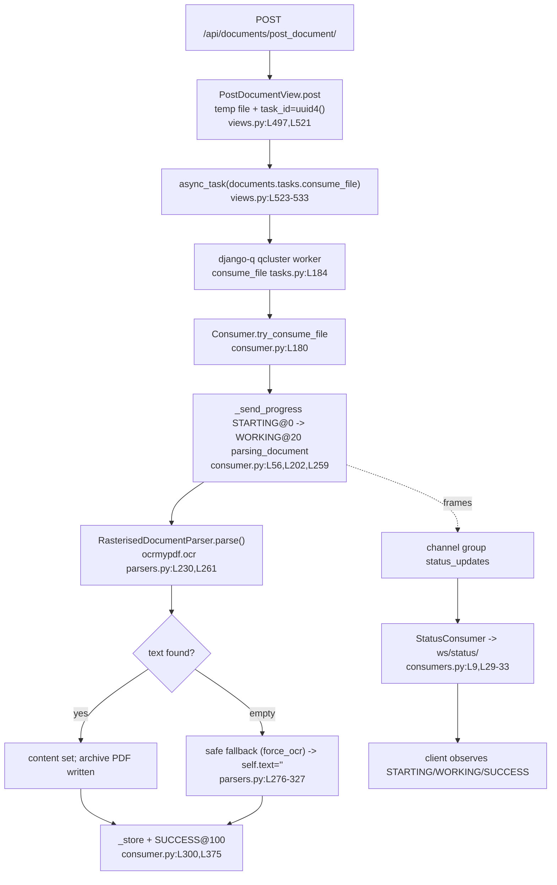

# How the paperless-ngx OCR subsystem behaves during ingestion — a runtime-observed Q&A

> **Branch:** `paperless-ngx_542221a38dff` · **HEAD commit:** `542221a38dff06361e07976452f9aea24d210542`
> **Nature:** Read-only, **run-first** investigation. Every behavioral claim below is backed by a *triple*: the **exact command** that was run, its **complete, unedited output**, and a **`file:line`** reference into the source tree. Nothing here is asserted from reading source alone.

## Scope and method

This document answers four questions about how OCR behaves while paperless-ngx ingests a document, with emphasis on the parts that are hard to observe from the outside:

- **Q1** — When I upload an image with **no embedded text**, how can I *see* that OCR has started, what does the processing state look like *while it is running*, how do the background workers behave, and what signal really indicates *active* OCR work?
- **Q2** — When I upload a similar image that **already contains text**, does the system **skip OCR entirely** or still **touch the OCR pipeline**, and how can I tell the difference *after* processing finishes?
- **Q3** — Compare the **final API responses** for both cases: which fields show OCR-generated text vs. pre-existing text?
- **Q4** — When OCR produces **weak/incomplete results**, what happens to the document's **final state**? Does it still count as *fully processed*, and how is that reflected in the saved metadata?

**How the evidence was produced.** The project was built and run in its canonical Docker image (`ghcr.io/scaleapi/swe-atlas:...qna_1.01`, Python 3.9, all locked dependencies + the Tesseract/Ghostscript/unpaper/qpdf binaries). Documents were ingested exclusively through **real entry points** — the upload API `POST /api/documents/post_document/` handled by a real **django-q `qcluster`** worker — while a WebSocket client subscribed to the live status feed at `ws/status/`. The in-repo fixtures under `src/paperless_tesseract/tests/samples/` were used as canonical inputs. All observation used a throwaway data/media/DB directory outside the repository; the repository itself is left byte-for-byte unchanged (verified with `git status --porcelain`; see the final section). Temporary observation scripts are reproduced in the Appendix and were removed after the run.

Where a claim requires a non-default configuration (for example `OCR_MODE=skip_noarchive` to force the true-skip branch in Q2), that run is **explicitly labeled non-canonical**. Where a direct in-process parser call is used to expose an internal value, it is **explicitly labeled supporting/non-canonical**; the canonical proof always comes from a real pipeline run.

---

## 1. Environment and reproducibility

The exact toolchain versions and the canonical OCR settings **printed at runtime** (not merely read from source):

```
$ python3 --version
$ python3 -m pip show ocrmypdf django django-q channels channels-redis | grep -E "^Name:|^Version:"
$ tesseract --version | head -2 ; gs --version ; unpaper --version | head -1 ; qpdf --version | head -1
$ python3 manage.py shell -c "from django.conf import settings; print('OCR_MODE=',settings.OCR_MODE,'OCR_LANGUAGE=',settings.OCR_LANGUAGE,'OCR_OUTPUT_TYPE=',settings.OCR_OUTPUT_TYPE)"
$ redis-cli ping
```

```
=========== VERSIONS ===========
Python 3.9.23
--- pip show (key deps) ---
Name: ocrmypdf
Version: 13.4.3
Name: Django
Version: 4.0.4
Name: django-q
Version: 1.3.9
Name: channels
Version: 3.0.4
Name: channels-redis
Version: 3.4.0
--- tesseract ---
tesseract 4.1.1
 leptonica-1.79.0
--- ghostscript ---
9.53.3
--- unpaper / qpdf ---
6.1
qpdf version 10.1.0

=========== CANONICAL OCR SETTINGS (runtime) ===========
OCR_MODE= skip OCR_LANGUAGE= eng OCR_OUTPUT_TYPE= pdfa

=========== REDIS ===========
PONG
```

These match the locked versions in `Pipfile.lock`/`Dockerfile`. The three canonical OCR defaults are defined at `src/paperless/settings.py:L514` (`OCR_LANGUAGE = "eng"`), `:L518` (`OCR_OUTPUT_TYPE = "pdfa"`), and `:L522` (`OCR_MODE = "skip"`) and are confirmed in effect above. Redis is required by **both** the django-q broker and the Channels layer, and is reachable (`PONG`).

**Authentication model of the observation surface.** The upload API accepts a DRF token (`POST /api/token/`); the status WebSocket at `ws/status/` accepts **session** auth only. This smoke check confirms both, and confirms that an **unauthenticated** WebSocket connection is denied:

```
$ python3 /tmp/inv/scripts/smoke.py
POST /api/token/ -> 200 {"token":"<TOKEN>"}
GET /api/documents/ -> 200 count= 1
Django Client.login -> True sessionid= 0drrwp4l...
WS authed  -> CONNECTED
WS no-auth -> REJECTED/InvalidStatusCode: server rejected WebSocket connection: HTTP 403
```

The `HTTP 403` for an unauthenticated socket is the `is_authenticated` gate in `StatusConsumer.connect()` at `src/paperless/consumers.py:L11` (the real token value is redacted here as `<TOKEN>`).

---

## 2. How ingestion and the status feed fit together

The path that every uploaded image/PDF travels, with anchors:

1. **Upload entry point** — `PostDocumentView.post` (`src/documents/views.py:L491` class, `:L497` method) writes the upload to a temp file in `SCRATCH_DIR`, generates `task_id = str(uuid.uuid4())` (`:L521`), and enqueues the work with `async_task("documents.tasks.consume_file", ...)` (`:L523`–`L533`), returning `Response("OK")` (`:L535`).
2. **Worker task** — a django-q `qcluster` worker dequeues and runs `documents.tasks.consume_file` (`src/documents/tasks.py:L184`), which calls `Consumer().try_consume_file(...)` (`:L236`).
3. **Pipeline + progress broadcaster** — `Consumer.try_consume_file` (`src/documents/consumer.py:L180`) emits progress frames through `_send_progress` (`:L56`), which builds a payload with keys `filename, task_id, current_progress, max_progress, status, message, document_id` (`:L64`–`L72`) and `group_send`s it to the `"status_updates"` channel group (`:L73`–`L74`).
4. **WebSocket relay** — `StatusConsumer` (`src/paperless/consumers.py:L9`) joins the `"status_updates"` group on connect (`:L17`–`L18`, after the `is_authenticated` check at `:L11`) and forwards each event to the browser as `json.dumps(event["data"])` in `status_update()` (`:L29`–`L33`). The socket is routed at `ws/status/` (`src/paperless/urls.py:L137`) behind `AuthMiddlewareStack` (`src/paperless/asgi.py:L20`).

The dispatch to the OCR engine happens inside step 3: for `image/*` and `application/pdf` the consumer selects `RasterisedDocumentParser` (registered in `src/paperless_tesseract/signals.py`), whose `parse()` (`src/paperless_tesseract/parsers.py:L230`) wraps OCRmyPDF/Tesseract. The status **constants** used throughout are defined at `src/documents/consumer.py:L43`–`L49` (`MESSAGE_NEW_FILE="new_file"`, `MESSAGE_PARSING_DOCUMENT="parsing_document"`, `MESSAGE_GENERATING_THUMBNAIL="generating_thumbnail"`, `MESSAGE_PARSE_DATE="parse_date"`, `MESSAGE_SAVE_DOCUMENT="save_document"`, `MESSAGE_FINISHED="finished"`).



---

## Q1 — Seeing OCR start, the in-flight state, worker behavior, and the active-OCR signal

**Direct answer.** You see OCR has started when the status feed emits a **`WORKING` frame at `current_progress = 20` with `message = "parsing_document"`**. That single frame is the active-OCR signal: it is emitted at `src/documents/consumer.py:L259` immediately before `document_parser.parse()` is called at `:L261`, and it is *during* that frame that `RasterisedDocumentParser.parse()` (`src/paperless_tesseract/parsers.py:L230`) invokes `ocrmypdf.ocr(...)` (`:L261`), which runs Tesseract. While it runs, the document has **no persisted row yet** (`document_id` is `null` in every frame until the terminal one); the "state" you can observe is entirely the transient status feed, which progresses `STARTING@0 → WORKING@20(parsing_document) → WORKING@70(generating_thumbnail) → WORKING@90(parse_date) → WORKING@95(save_document) → SUCCESS@100(finished)`. The persisted `Document` row appears only at the end, carrying `document_id` in the final `SUCCESS` frame.

### Q1.1 — The live frame sequence (before / during / after)

Fixture: `src/paperless_tesseract/tests/samples/simple.png` — a raster image with **no embedded text layer** (images never have one) whose pixels OCR to `"This is a test document."`. Triggered through the **real upload API** while an authenticated WebSocket client recorded every frame with a timestamp:

```
$ python3 /tmp/inv/scripts/q1_capture.py q1run1 .../samples/simple.png simple.png image/png
[BEFORE] document count = 0
[WS] connected to ws/status/ ; subscribed to status_updates group
[UPLOAD] POST /api/documents/post_document/ -> 200 "OK"
[FRAME t+ 0.142s] {"filename": "simple.png", "task_id": "10155383-969f-477f-aa7d-c082edef268c", "current_progress": 0, "max_progress": 100, "status": "STARTING", "message": "new_file", "document_id": null}
[FRAME t+ 0.147s] {"filename": "simple.png", "task_id": "10155383-969f-477f-aa7d-c082edef268c", "current_progress": 20, "max_progress": 100, "status": "WORKING", "message": "parsing_document", "document_id": null}
[FRAME t+ 1.206s] {"filename": "simple.png", "task_id": "10155383-969f-477f-aa7d-c082edef268c", "current_progress": 70, "max_progress": 100, "status": "WORKING", "message": "generating_thumbnail", "document_id": null}
[FRAME t+ 1.879s] {"filename": "simple.png", "task_id": "10155383-969f-477f-aa7d-c082edef268c", "current_progress": 90, "max_progress": 100, "status": "WORKING", "message": "parse_date", "document_id": null}
[FRAME t+ 1.882s] {"filename": "simple.png", "task_id": "10155383-969f-477f-aa7d-c082edef268c", "current_progress": 95, "max_progress": 100, "status": "WORKING", "message": "save_document", "document_id": null}
[FRAME t+ 1.931s] {"filename": "simple.png", "task_id": "10155383-969f-477f-aa7d-c082edef268c", "current_progress": 100, "max_progress": 100, "status": "SUCCESS", "message": "finished", "document_id": 15}

===== FRAME SUMMARY (q1run1) =====
('0.142', 0, 'STARTING', 'new_file')
('0.147', 20, 'WORKING', 'parsing_document')
('1.206', 70, 'WORKING', 'generating_thumbnail')
('1.879', 90, 'WORKING', 'parse_date')
('1.882', 95, 'WORKING', 'save_document')
('1.931', 100, 'SUCCESS', 'finished')
[DUR] parse/OCR phase (20->70) duration = 1.059s
[DUR] total STARTING->terminal = 1.789s
[PERPAGE] per-page WORKING frames (message=null) progress values: []
[AFTER] finished document_id = 15
[AFTER] doc content='This is a test document.' archived_file_name='2026-07-08 simple.pdf' original_file_name='2026-07-08 simple.png'
```

Mapping each frame to its emission site (all in `src/documents/consumer.py`):

| Frame | progress | status | message | Anchor |
|---|---|---|---|---|
| new file | 0 | `STARTING` | `new_file` | `consumer.py:L202` (const `:L43`) |
| **parsing — active OCR** | **20** | `WORKING` | `parsing_document` | `consumer.py:L259` (const `:L45`) — parse() called at `:L261` |
| thumbnail | 70 | `WORKING` | `generating_thumbnail` | `consumer.py:L264` (const `:L46`) |
| parse date | 90 | `WORKING` | `parse_date` | `consumer.py:L274` (const `:L47`) |
| save | 95 | `WORKING` | `save_document` | `consumer.py:L294` (const `:L48`) |
| finished | 100 | `SUCCESS` | `finished` (+ `document_id`) | `consumer.py:L375` (const `:L49`) |

The `parse_date` frame at 90 is conditional — it is emitted only when a date must be parsed from content; see the encrypted-PDF run in Q4 where it does not appear.

### Q1.2 — The active-OCR signal, and an honest finding about per-page frames

The single **`WORKING@20 / parsing_document`** frame is the reliable "OCR is now running" signal. paperless *defines* a per-page `progress_callback` at `src/documents/consumer.py:L237`–`L240` intended to emit intermediate `WORKING` frames between 20 and 70 while OCRmyPDF processes pages. **Observed reality: no per-page frames are ever emitted for the OCR path** — `[PERPAGE] ... : []` above, and the progress jumps directly `20 → 70`. This reproduced for a 1-page image *and* for a 3-page image-PDF.

Root cause (grounded in source, confirmed by the empty capture): the callback is wired into the base parser's `progress()` wrapper (`src/documents/parsers.py`), but `RasterisedDocumentParser` **never calls `self.progress()`** — it only sets `"progress_bar": False` when building OCRmyPDF args (`src/paperless_tesseract/parsers.py:L152`). So the per-page frames are effectively dead code for OCR. A secondary detail: the callback's own comment at `consumer.py:L238`–`L239` says progress is recalculated "within 20 and 80", but the formula `p = int((current_progress / max_progress) * 50 + 20)` mathematically spans **20 → 70**, not 20 → 80. This mismatch is moot in practice because the callback never fires for the OCR path. This is reported as observed, not as inferred.

### Q1.3 — Worker behavior

The task runs inside a **django-q `qcluster` worker process** (a `Process-1:N` daemon), captured live from the worker log:

```
$ sed -n '281,294p' /tmp/inv/out/qcluster.log
21:30:27 [Q] INFO Process-1:8 processing [simple.png]
[2026-07-08 21:30:27,376] [INFO] [paperless.consumer] Consuming simple.png
[2026-07-08 21:30:27,795] [ERROR] [ocrmypdf._exec.tesseract] [tesseract] Error during processing.
[2026-07-08 21:30:29,160] [INFO] [paperless.consumer] Document 2026-07-08 simple consumption finished
21:30:29 [Q] INFO Process-1:8 stopped doing work
21:30:29 [Q] INFO Processed [simple.png]
21:30:29 [Q] INFO recycled worker Process-1:8
21:30:29 [Q] INFO Process-1:21 ready for work at 10129
21:30:41 [Q] INFO Process-1:9 processing [simple.png]
[2026-07-08 21:30:41,424] [INFO] [paperless.consumer] Consuming simple.png
[2026-07-08 21:30:41,842] [ERROR] [ocrmypdf._exec.tesseract] [tesseract] Error during processing.
[2026-07-08 21:30:43,231] [INFO] [paperless.consumer] Document 2026-07-08 simple consumption finished
21:30:43 [Q] INFO Process-1:9 stopped doing work
21:30:43 [Q] INFO Processed [simple.png]
```

Notes:
- `Consuming simple.png` is logged by the consumer as ingestion begins; `Document ... consumption finished` is logged at `src/documents/consumer.py:L373`, right before the `SUCCESS@100` frame at `:L375`.
- The `[tesseract] Error during processing.` line (one per page) is **benign** — it is Tesseract's OSD stderr surfaced by OCRmyPDF at ERROR level; the run still succeeds (`Processed [simple.png]`).
- Because django-q **daemonizes** its workers, OCRmyPDF is invoked with `use_threads=True` (`src/paperless_tesseract/parsers.py:L148`, whose comment explains daemonized processes cannot fork) — this is *why* OCR here is thread-based rather than multiprocess.
- After success the consumer fires `document_consumption_finished` (`consumer.py:L306`–`L311`), whose handlers (`src/documents/signals/handlers.py`) apply post-processing: `add_inbox_tags` (`:L30`), `set_correspondent` (`:L35`), `set_document_type` (`:L101`), `set_tags` (`:L168`), and `add_to_index` (Whoosh full-text index, `:L428`).

Supporting (non-canonical) — a direct in-process parse of the same image shows the exact OCRmyPDF arguments and that OCR ran on the primary attempt (no fallback), producing a real archive:

```
$ python3 /tmp/inv/scripts/direct_parse.py .../samples/simple.png image/png
[CFG] OCR_MODE=skip fixture=.../simple.png mime=image/png
[DEBUG][paperless.parsing.tesseract] Estimated DPI 62 based on image width 517
[DEBUG][paperless.parsing.tesseract] Detected DPI for image .../simple.png: 72
[DEBUG][paperless.parsing.tesseract] Calling OCRmyPDF with args: {'input_file': '.../simple.png', 'output_file': '/tmp/inv/scratch/paperless-rsm8lo_i/archive.pdf', 'use_threads': True, 'jobs': 11, 'language': 'eng', 'output_type': 'pdfa', 'progress_bar': False, 'skip_text': True, 'clean': True, 'deskew': True, 'rotate_pages': True, 'rotate_pages_threshold': 12.0, 'sidecar': '/tmp/inv/scratch/paperless-rsm8lo_i/sidecar.txt', 'image_dpi': 72}
[2026-07-08 21:31:08,537] [ERROR] [ocrmypdf._exec.tesseract] [tesseract] Error during processing.
[DEBUG][paperless.parsing.tesseract] Using text from sidecar file
[RESULT] archive_path='/tmp/inv/scratch/paperless-rsm8lo_i/archive.pdf'
[RESULT] archive_path_is_file=True
[RESULT] text='This is a test document.'
[RESULT] text_len=24
```

The `'skip_text': True` argument is the mapping of the canonical `OCR_MODE="skip"` in `construct_ocrmypdf_parameters` (`src/paperless_tesseract/parsers.py:L157`–`L158`).

### Q1.4 — Stability (≥2 runs)

The same `simple.png` was uploaded again (docs deleted in between to bypass the duplicate guard `pre_check_duplicate`, `consumer.py:L102`–`L112`). The frame sequence, statuses, messages, and progress values are **identical**; timings are stable:

```
$ python3 /tmp/inv/scripts/q1_capture.py q1run2 .../samples/simple.png simple.png image/png
('0.142', 0, 'STARTING', 'new_file')
('0.147', 20, 'WORKING', 'parsing_document')
('1.205', 70, 'WORKING', 'generating_thumbnail')
('1.871', 90, 'WORKING', 'parse_date')
('1.874', 95, 'WORKING', 'save_document')
('1.954', 100, 'SUCCESS', 'finished')
[DUR] parse/OCR phase (20->70) duration = 1.058s
[DUR] total STARTING->terminal = 1.813s
[PERPAGE] per-page WORKING frames (message=null) progress values: []
```

| Run | parse/OCR phase (20→70) | total (STARTING→SUCCESS) | per-page frames |
|---|---|---|---|
| 1 | 1.059 s | 1.789 s | none (`[]`) |
| 2 | 1.058 s | 1.813 s | none (`[]`) |

The parse phase is ~1.06 s and stable across runs; only `document_id` and `task_id` differ.


---

## Q2 — Already-has-text: skip entirely, or still touch the OCR pipeline?

**Direct answer.** An image that "already contains text" does **not** skip OCR. For a raster image the has-text flag `original_has_text` is **hard-coded `False`** (`src/paperless_tesseract/parsers.py:L237`–`L239`), so `RasterisedDocumentParser.parse()` always proceeds to `ocrmypdf.ocr(...)` (`:L261`) and produces an archive. The **only** true full skip is a **text-layer PDF under the non-canonical `OCR_MODE="skip_noarchive"`**, which hits the early return `"Document has text, skipping OCRmyPDF entirely."` (`:L241`–`L244`). After processing you tell them apart by the **archive artifact**: an OCR run produces an archive PDF so `has_archive_version` is `True`; a true skip produces none so `has_archive_version` is `False`.

### Q2.1 — The decisive branch and the 50-character gate

`parse()` computes has-text differently for PDFs vs images:
- **PDF branch** (`parsers.py:L234`–`L236`): `text_original = self.extract_text(None, document_path)`, then `original_has_text = text_original and len(text_original) > 50`.
- **Image branch** (`parsers.py:L237`–`L239`): `text_original = None; original_has_text = False` — **unconditional**.

Probing all four relevant fixtures through the real `parser.extract_text` (`parsers.py:L99`):

```
$ python3 /tmp/inv/scripts/has_text_probe.py <fixture> <mime>   # for each fixture
fixture=simple.png mime=image/png
  text_original_len=0  original_has_text=False  (len>50 gate)
  snippet=None

fixture=simple-digital.pdf mime=application/pdf
  text_original_len=24  original_has_text=False  (len>50 gate)
  snippet='This is a test document.'

fixture=multi-page-digital.pdf mime=application/pdf
  text_original_len=118  original_has_text=True  (len>50 gate)
  snippet='This is a multi page document. Page 1.  This is a multi page document.'

fixture=multi-page-images.pdf mime=application/pdf
  text_original_len=0  original_has_text=False  (len>50 gate)
  snippet=None
```

This directly demonstrates the `len > 50` threshold (`parsers.py:L236`): the born-digital `simple-digital.pdf` has only 24 characters and therefore evaluates `original_has_text=False` (it would still be OCR'd), whereas `multi-page-digital.pdf` (118 chars) evaluates `True`. The image `simple.png` is `False` because the image branch forces it. So the true-skip demonstration below uses `multi-page-digital.pdf`.

### Q2.2 — Sub-case C1: an image "with text" STILL runs OCR (canonical `OCR_MODE=skip`)

`simple.png` visibly contains the text "This is a test document." but is a raster image, so `original_has_text=False`. Consumed through the real pipeline it runs OCR and produces an archive:

```
$ python3 /tmp/inv/scripts/q1_capture.py q2c1 .../samples/simple.png simple.png image/png
[UPLOAD] POST /api/documents/post_document/ -> 200 "OK"
[FRAME t+ 0.223s] {..., "current_progress": 20, "status": "WORKING", "message": "parsing_document", "document_id": null}
[FRAME t+ 2.022s] {..., "current_progress": 100, "status": "SUCCESS", "message": "finished", "document_id": 17}

$ python3 /tmp/inv/scripts/doc_info.py            # ORM inspection of the produced row
id=17 mime_type=image/png
  has_archive_version=True  archive_filename='0000017.pdf'
  checksum=249d1239dc39449c856dcdfbb75850c5 archive_checksum=58b809cca6c0ed1f9c47bbaca870d4e4
  content='This is a test document.' (len=24)
```

The `parsing_document` frame fires and `has_archive_version=True` — OCR ran; nothing was skipped. (This is consistent with the test `test_image_simple`, `src/paperless_tesseract/tests/test_parser.py:L216`–`L223`, which asserts `os.path.isfile(parser.archive_path)`.)

### Q2.3 — Sub-case C2: a text-layer PDF is the TRUE skip (non-canonical `skip_noarchive`)

**Non-canonical run:** the worker was restarted transiently with `PAPERLESS_OCR_MODE=skip_noarchive`. Consuming the text-layer `multi-page-digital.pdf`:

```
$ bash /tmp/inv/scripts/restart_qcluster.sh skip_noarchive
qcluster restarted (OCR_MODE=skip_noarchive)
21:32:40 [Q] INFO Q Cluster romeo-sad-bravo-delaware running.

$ python3 /tmp/inv/scripts/q1_capture.py q2c2 .../samples/multi-page-digital.pdf multi-page-digital.pdf application/pdf
[UPLOAD] POST /api/documents/post_document/ -> 200 "OK"
[FRAME t+ 0.151s] {..., "current_progress": 20, "status": "WORKING", "message": "parsing_document", "document_id": null}
[FRAME t+ 0.181s] {..., "current_progress": 70, "status": "WORKING", "message": "generating_thumbnail", "document_id": null}
[FRAME t+ 1.825s] {..., "current_progress": 100, "status": "SUCCESS", "message": "finished", "document_id": 18}
[DUR] parse/OCR phase (20->70) duration = 0.030s

$ python3 /tmp/inv/scripts/doc_info.py
id=18 mime_type=application/pdf
  has_archive_version=False  archive_filename=None
  checksum=9c9691e51741c1f4f41a20896af31770 archive_checksum=None
  content='This is a multi page document. Page 1.\n\nThis is a multi page document. Page 2.\n\nThis is a multi page document. Page 3.' (len=118)
```

The parse phase collapses to **0.030 s** (vs ~1.06 s when OCR runs) and **no archive** is produced (`has_archive_version=False`, `archive_filename=None`). The content is the original text layer. Supporting (non-canonical) direct parse captures the explicit skip log line:

```
$ PAPERLESS_OCR_MODE=skip_noarchive python3 /tmp/inv/scripts/direct_parse.py .../samples/multi-page-digital.pdf application/pdf
[CFG] OCR_MODE=skip_noarchive fixture=.../multi-page-digital.pdf mime=application/pdf
[DEBUG][paperless.parsing.tesseract] Extracted text from PDF file .../multi-page-digital.pdf
[DEBUG][paperless.parsing.tesseract] Document has text, skipping OCRmyPDF entirely.
[RESULT] archive_path=None
[RESULT] archive_path_is_file=False
[RESULT] text='This is a multi page document. Page 1.\n\nThis is a multi page document. Page 2.\n\nThis is a multi page document. Page 3.'
[RESULT] text_len=118
```

`"Document has text, skipping OCRmyPDF entirely."` is logged at `src/paperless_tesseract/parsers.py:L242`, followed by `self.text = text_original; return` (`:L243`–`:L244`) — the only genuine full skip. (Consistent with `test_skip_noarchive_withtext`, `test_parser.py:L357`, asserting `assertIsNone(parser.archive_path)`.)

### Q2.4 — Contrast: skip depends on the text layer, not the mode

Under the **same** `skip_noarchive` mode, an image-PDF with **no** text layer (`multi-page-images.pdf`) still runs OCR and still produces an archive:

```
$ python3 /tmp/inv/scripts/q1_capture.py q2contrast .../samples/multi-page-images.pdf multi-page-images.pdf application/pdf
[FRAME t+ 0.152s] {..., "current_progress": 20, "status": "WORKING", "message": "parsing_document", ...}
[FRAME t+ 2.403s] {..., "current_progress": 70, "status": "WORKING", "message": "generating_thumbnail", ...}
[FRAME t+ 4.031s] {..., "current_progress": 100, "status": "SUCCESS", "message": "finished", "document_id": 19}
[DUR] parse/OCR phase (20->70) duration = 2.251s

$ python3 /tmp/inv/scripts/doc_info.py
id=19 mime_type=application/pdf
  has_archive_version=True  archive_filename='0000019.pdf'
  checksum=62acb0bcbfbcaa62ca6ad3668e4e404b archive_checksum=8a9e7137da56657b2408103c7a83c0df
  content='This is a multi page document. Page 1.\nThis is a multi page document. Page 2.\nThis is a multi page document. Page 3.' (len=116)
```

Parse phase 2.251 s (OCR ran), `has_archive_version=True`. So *within the same mode* the outcome flips purely on `original_has_text`. (Consistent with `test_skip_noarchive_notext`, `test_parser.py:L370`.) The worker was then restored to canonical `skip`.

### Q2.5 — How to tell them apart after processing

**External tell (via API/ORM):** whether an archive PDF was produced. An OCR run sets `Document.archive_filename`, so the `has_archive_version` property (`return self.archive_filename is not None`, `src/documents/models.py:L238`–`L239`) is `True`; a true skip leaves it `None` → `False`. Demonstrated above: doc 18 (true skip) `False` vs docs 17/19 (OCR) `True`.

**Internal tell (the sidecar markers):** OCRmyPDF writes only the text of pages it actually OCR'd to the sidecar; pages that already had text appear as an `[OCR skipped on page(s) …]` marker instead. paperless reads the sidecar in `extract_text()` and, if it contains the substring `"[OCR skipped on page"` (checked at `parsers.py:L104`), **discards** the sidecar and falls back to pdfminer.six. The exact sidecar bytes from `multi-page-mixed.pdf` (a mixed text+image PDF, canonical `skip`):

```
$ python3 /tmp/inv/scripts/sidecar_demo.py .../samples/multi-page-mixed.pdf
OCR_MODE=skip  skip_text=True
=== sidecar.txt (exact bytes) ===
'This is a multi page document. Page 1.\n\x0cThis is a multi page document. Page 2.\n\x0cThis is a multi page document. Page 3.\n\x0c[OCR skipped on page(s) 4-6]'
=== contains substring "[OCR skipped on page" (parsers.py:L104 check) ? === True
extract_text() result (first 160 chars) = 'This is a multi page document. Page 1.\n\nThis is a multi page document. Page 2.\n\nThis is a multi page document. Page 3.\n\nThis is a multi page document. Page 4.\n\n'
```

The marker's exact form is `[OCR skipped on page(s) 4-6]` (matching `test_multi_page_mixed`, `test_parser.py:L398`), and the code's substring check `"[OCR skipped on page"` matches it. The `\x0c` bytes are form-feed page separators; because the marker is present, `extract_text()` discards the sidecar and returns the full pdfminer text (including pages 4–6).


---

## Q3 — Comparing the final API responses: which fields show OCR-generated vs. existing text?

**Direct answer.** The **`content`** field carries the extracted text in **every** case, regardless of whether it came from OCR or from a pre-existing text layer. **No `DocumentSerializer` field distinguishes "OCR-generated" from "existing" text.** The only provenance-adjacent field is `archived_file_name` (backed by `has_archive_version`), and even that only signals *"an archive PDF was produced"* — which, under the canonical `skip` mode, is `True` for **both** an OCR'd image and a text-layer PDF. It becomes `null` only in the true-skip (`skip_noarchive`) case.

### Q3.1 — Side-by-side responses (canonical `skip`)

`GET /api/documents/{id}/` for the OCR'd image (doc 20, `simple.png`) and the text-layer PDF (doc 21, `multi-page-digital.pdf`):

```
$ python3 /tmp/inv/scripts/q3_compare.py
created ids: [20, 21]

===== GET /api/documents/20/ (HTTP 200) — full JSON =====
{
  "id": 20,
  "correspondent": null,
  "document_type": null,
  "title": "simple",
  "content": "This is a test document.",
  "tags": [],
  "created": "2026-07-08T21:34:08Z",
  "modified": "2026-07-08T21:34:10.694374Z",
  "added": "2026-07-08T21:34:10.674933Z",
  "archive_serial_number": null,
  "original_file_name": "2026-07-08 simple.png",
  "archived_file_name": "2026-07-08 simple.pdf"
}

===== GET /api/documents/21/ (HTTP 200) — full JSON =====
{
  "id": 21,
  "correspondent": null,
  "document_type": null,
  "title": "multi-page-digital",
  "content": "This is a multi page document. Page 1.\n\nThis is a multi page document. Page 2.\n\nThis is a multi page document. Page 3.",
  "tags": [],
  "created": "2026-07-08T21:34:10Z",
  "modified": "2026-07-08T21:34:12.936234Z",
  "added": "2026-07-08T21:34:12.875795Z",
  "archive_serial_number": null,
  "original_file_name": "2026-07-08 multi-page-digital.pdf",
  "archived_file_name": "2026-07-08 multi-page-digital.pdf"
}

===== FIELD DIFF (the three provenance-relevant fields) =====
  content:
    doc 20: 'This is a test document.'
    doc 21: 'This is a multi page document. Page 1.\n\nThis is a multi page document. Page 2.\n\nThis is a multi page document. Page 3.'
  archived_file_name:
    doc 20: '2026-07-08 simple.pdf'
    doc 21: '2026-07-08 multi-page-digital.pdf'
  original_file_name:
    doc 20: '2026-07-08 simple.png'
    doc 21: '2026-07-08 multi-page-digital.pdf'
```

### Q3.2 — The three provenance-relevant fields, by getter

All in `src/documents/serialisers.py` (`DocumentSerializer`, `:L201`; `Meta.fields` at `:L222`–`L235`):

| Field | Source | Behavior | Anchor |
|---|---|---|---|
| `content` | model `TextField` | The extracted text, **regardless of origin** — OCR text and pre-existing text land in the same field. | field listed at `serialisers.py:L227`; model `content` at `models.py:L117` |
| `original_file_name` | `SerializerMethodField` → `obj.get_public_filename()` | **Always present.** | decl `:L207`; getter `get_original_file_name` `:L210`–`L211` |
| `archived_file_name` | `SerializerMethodField` → `obj.get_public_filename(archive=True)` | Only when `obj.has_archive_version` is `True`, else `None`. | decl `:L208`; getter `get_archived_file_name` `:L213`–`L217` |

`get_public_filename` is defined at `src/documents/models.py:L252`; `has_archive_version` at `:L238`–`L239`.

### Q3.3 — Why `archived_file_name` does not equal "was OCR'd"

Doc 20 (OCR'd image) and doc 21 (text-layer PDF) **both** have `archived_file_name` set — because under canonical `skip` paperless still runs OCRmyPDF over the text-layer PDF (`skip_text=True` copies text pages through and produces a normalized PDF/A archive). So the field cannot separate OCR-generated from pre-existing text. Only the true-skip variant drops the archive. Consuming the same `multi-page-digital.pdf` under the **non-canonical** `skip_noarchive`:

```
$ bash /tmp/inv/scripts/restart_qcluster.sh skip_noarchive
$ python3 /tmp/inv/scripts/q1_capture.py q3variant .../samples/multi-page-digital.pdf multi-page-digital.pdf application/pdf
[FRAME t+ 1.851s] {..., "current_progress": 100, "status": "SUCCESS", "message": "finished", "document_id": 22}

$ # GET full JSON for the true-skip doc (authenticated)
GET /api/documents/22/ (HTTP 200) — full JSON:
{
  "id": 22,
  "correspondent": null,
  "document_type": null,
  "title": "multi-page-digital",
  "content": "This is a multi page document. Page 1.\n\nThis is a multi page document. Page 2.\n\nThis is a multi page document. Page 3.",
  "tags": [],
  "created": "2026-07-08T21:34:42Z",
  "modified": "2026-07-08T21:34:44.812344Z",
  "added": "2026-07-08T21:34:44.795122Z",
  "archive_serial_number": null,
  "original_file_name": "2026-07-08 multi-page-digital.pdf",
  "archived_file_name": null
}
```

Three-way summary:

| Doc | Input / mode | `content` | `archived_file_name` |
|---|---|---|---|
| 20 | `simple.png` / `skip` (OCR) | `'This is a test document.'` (OCR-generated) | `'2026-07-08 simple.pdf'` |
| 21 | `multi-page-digital.pdf` / `skip` (text layer, still archived) | 3-page text (pre-existing) | `'2026-07-08 multi-page-digital.pdf'` |
| 22 | `multi-page-digital.pdf` / `skip_noarchive` (true skip) | 3-page text (pre-existing) | `null` |

**Conclusion.** `content` is populated in all three; provenance (OCR vs. existing) is **not serialized** anywhere. It is only inferable *internally* from the sidecar `[OCR skipped on page …]` markers (`parsers.py:L104`), never from the API. (A minor incidental difference: pdfminer text-layer extraction yields `\n\n` page separators while the OCR sidecar path yields `\n` — visible between docs 21 and 19 — but this is a formatting artifact, not a reliable provenance signal.)


---

## Q4 — Weak/incomplete OCR: final state, "fully processed" semantics, and saved metadata

**Direct answer.** A weak/empty OCR result does **not** fail the document. The parser sets `self.text = ""` (with a warning), the `Document` **is** persisted, and the run still ends `SUCCESS @ 100%`. **"Fully processed" is not a stored flag** — the `Document` model has **no** `status`/`state`/`processed`/`progress` column; a persisted row *is* the processed state, and the per-run status exists only transiently on the WebSocket. This is the opposite of a genuine parser failure, which raises `ParseError`, ends `FAILED @ 100%`, and persists **no** row at all.

### Q4.1 — The empty-OCR code path (with anchors)

Inside `RasterisedDocumentParser.parse()` (`src/paperless_tesseract/parsers.py`):
1. Primary OCR: `ocrmypdf.ocr(**args)` (`:L261`), then `self.archive_path = archive_path` (`:L263`) is set **before** `self.text = self.extract_text(sidecar_file, archive_path)` (`:L264`); if the text is empty, `raise NoTextFoundException(...)` (`:L266`–`:L267`).
2. Safe fallback: the `except (NoTextFoundException, InputFileError)` block (`:L276`) rebuilds args with `safe_fallback=True` (⇒ `force_ocr=True`, `:L155`–`:L156`) and re-runs `ocrmypdf.ocr` (`:L298`). It deliberately does **not** overwrite `self.archive_path` (comment at `:L300`–`:L301`: the force-OCR file is bigger/blurry) — so the **primary** `skip_text` archive is retained.
3. Terminal empty case: `if not self.text:` (`:L318`) → for an image (no `original_has_text`) it logs `"No text was found in {document_path}, the content will be empty."` (`:L322`–`:L326`) and sets `self.text = ""` (`:L327`).
4. Back in the consumer, `_store` (`consumer.py:L379`) persists the `Document` with `content=text` (`:L400`), then `SUCCESS @ 100` is emitted (`:L375`).

**Consequence of step 2**: a blank *image* keeps its primary archive, so `has_archive_version` is `True` even though `content` is empty (shown below). A blank/encrypted *PDF* that never produced an archive ends with `archive_path=None`.

### Q4.2 — Empty OCR via the real pipeline (blank image `no-text-alpha.png`)

Fixture: `src/paperless_tesseract/tests/samples/no-text-alpha.png` — the repo's canonical blank alpha-PNG (md5 `e8c17675174950020835add3f444f08c`, 32595 bytes). To honor the read-only rule, a **copy** was fed to the API (never the original, which `consume_file` unlinks on success). Complete unedited output of the real upload + authenticated WebSocket recorder:

```
$ cp src/paperless_tesseract/tests/samples/no-text-alpha.png /tmp/inv/fixtures/no-text-alpha-canonical.png
$ python3 /tmp/inv/scripts/q1_capture.py q4canonA /tmp/inv/fixtures/no-text-alpha-canonical.png no-text-alpha.png image/png
[BEFORE] document count = 0
[WS] connected to ws/status/ ; subscribed to status_updates group
[UPLOAD] POST /api/documents/post_document/ -> 200 "OK"
[FRAME t+ 0.142s] {"filename": "no-text-alpha.png", "task_id": "fa552cba-66e8-43db-88cf-0c5c5f6db079", "current_progress": 0, "max_progress": 100, "status": "STARTING", "message": "new_file", "document_id": null}
[FRAME t+ 0.148s] {"filename": "no-text-alpha.png", "task_id": "fa552cba-66e8-43db-88cf-0c5c5f6db079", "current_progress": 20, "max_progress": 100, "status": "WORKING", "message": "parsing_document", "document_id": null}
[FRAME t+ 2.064s] {"filename": "no-text-alpha.png", "task_id": "fa552cba-66e8-43db-88cf-0c5c5f6db079", "current_progress": 70, "max_progress": 100, "status": "WORKING", "message": "generating_thumbnail", "document_id": null}
[FRAME t+ 9.645s] {"filename": "no-text-alpha.png", "task_id": "fa552cba-66e8-43db-88cf-0c5c5f6db079", "current_progress": 90, "max_progress": 100, "status": "WORKING", "message": "parse_date", "document_id": null}
[FRAME t+ 9.647s] {"filename": "no-text-alpha.png", "task_id": "fa552cba-66e8-43db-88cf-0c5c5f6db079", "current_progress": 95, "max_progress": 100, "status": "WORKING", "message": "save_document", "document_id": null}
[FRAME t+ 9.694s] {"filename": "no-text-alpha.png", "task_id": "fa552cba-66e8-43db-88cf-0c5c5f6db079", "current_progress": 100, "max_progress": 100, "status": "SUCCESS", "message": "finished", "document_id": 28}

===== FRAME SUMMARY (q4canonA) =====
('0.142', 0, 'STARTING', 'new_file')
('0.148', 20, 'WORKING', 'parsing_document')
('2.064', 70, 'WORKING', 'generating_thumbnail')
('9.645', 90, 'WORKING', 'parse_date')
('9.647', 95, 'WORKING', 'save_document')
('9.694', 100, 'SUCCESS', 'finished')
[DUR] STARTING@ t+0.14198684692382812
[DUR] parsing_document(WORKING@20)@ t+0.1475837230682373
[DUR] generating_thumbnail(WORKING@70)@ t+2.0639383792877197
[DUR] terminal@ t+9.693799018859863
[DUR] parse/OCR phase (20->70) duration = 1.916s
[DUR] total STARTING->terminal = 9.552s
[PERPAGE] per-page WORKING frames (message=null) progress values: []
[AFTER] finished document_id = 28
[AFTER] doc content='' archived_file_name='2026-07-08 no-text-alpha.pdf' original_file_name='2026-07-08 no-text-alpha.png'

$ python3 /tmp/inv/scripts/doc_info.py 28          # AFTER (ORM)
id=28 mime_type=image/png
  has_archive_version=True  archive_filename='0000028.pdf'
  checksum=a13999fabb65f07735dfcbbb001ddaa8 archive_checksum=718fabc5551649993faee8f267ff2836
  content='' (len=0)
```

**Before/during/after:** *before* = no row (count 0); *during* = the `WORKING` frames (`document_id` is `null` throughout); *after* = a persisted row (id 28) with `content=''`, a `checksum`, and `has_archive_version=True`. The run terminates `SUCCESS @ 100`, **not** `FAILED`.

The parse phase (~1.92 s) is roughly **double** the ~1.06 s of `simple.png` because OCR runs **twice** (primary `skip_text`, then the force-OCR fallback). The worker log shows the alpha-layer normalization, both OCR passes, and the terminal empty-content warning:

```
$ sed -n '316,334p' /tmp/inv/out/qcluster.log
22:04:55 [Q] INFO Process-1:11 processing [no-text-alpha.png]
[2026-07-08 22:04:55,801] [INFO] [paperless.consumer] Consuming no-text-alpha.png
[2026-07-08 22:04:55,894] [WARNING] [paperless.parsing.tesseract] Error while getting DPI from image /tmp/inv/scratch/paperless-upload-aenns2aj: 'dpi'
[2026-07-08 22:04:55,895] [INFO] [paperless.parsing.tesseract] Removing alpha layer from /tmp/inv/scratch/paperless-upload-aenns2aj for compatibility with img2pdf
[2026-07-08 22:04:56,222] [WARNING] [ocrmypdf._exec.tesseract] [tesseract] Warning: Invalid resolution 35 dpi. Using 70 instead.
[2026-07-08 22:04:56,222] [WARNING] [ocrmypdf._exec.tesseract] [tesseract] Warning. Invalid resolution 35 dpi. Using 70 instead.
[2026-07-08 22:04:56,223] [ERROR] [ocrmypdf._exec.tesseract] [tesseract] Error during processing.
[2026-07-08 22:04:56,640] [WARNING] [ocrmypdf._exec.tesseract] [tesseract] Warning: Invalid resolution 35 dpi. Using 70 instead.
[2026-07-08 22:04:56,841] [WARNING] [paperless.parsing.tesseract] Encountered an error while running OCR: No text was found in the original document. Attempting force OCR to get the text.
[2026-07-08 22:04:56,842] [WARNING] [paperless.parsing.tesseract] Error while getting DPI from image /tmp/inv/scratch/paperless-upload-aenns2aj: 'dpi'
[2026-07-08 22:04:57,095] [WARNING] [ocrmypdf._exec.tesseract] [tesseract] Warning: Invalid resolution 35 dpi. Using 70 instead.
[2026-07-08 22:04:57,095] [WARNING] [ocrmypdf._exec.tesseract] [tesseract] Warning. Invalid resolution 35 dpi. Using 70 instead.
[2026-07-08 22:04:57,095] [ERROR] [ocrmypdf._exec.tesseract] [tesseract] Error during processing.
[2026-07-08 22:04:57,522] [WARNING] [ocrmypdf._exec.tesseract] [tesseract] Warning: Invalid resolution 35 dpi. Using 70 instead.
[2026-07-08 22:04:57,716] [WARNING] [paperless.parsing.tesseract] No text was found in /tmp/inv/scratch/paperless-upload-aenns2aj, the content will be empty.
[2026-07-08 22:05:05,349] [INFO] [paperless.consumer] Document 2026-07-08 no-text-alpha consumption finished
22:05:05 [Q] INFO Process-1:11 stopped doing work
22:05:05 [Q] INFO Processed [no-text-alpha.png]
```

The `"Encountered an error while running OCR: No text was found ... Attempting force OCR"` line is the `NoTextFoundException` → fallback (`parsers.py:L277`–`L281`); `"No text was found in ..., the content will be empty."` is the terminal empty case (`:L322`–`:L326`). (The warnings log the SCRATCH upload-copy path `paperless-upload-...` because the API copies the upload into `SCRATCH_DIR` before consuming.)

The `"Removing alpha layer ... for compatibility with img2pdf"` line is `RasterisedDocumentParser`'s alpha-flattening step (`src/paperless_tesseract/parsers.py:L191`–`L199`, gated by `has_alpha()` at `:L73`). It is worth noting because it explains a subtlety in the saved metadata: `Document.checksum` is `hashlib.md5(...)` of the consumer's **working copy after** this normalization (`src/documents/consumer.py:L104` and `:L402`), **not** of the original upload bytes. Consequently two different PNG encodings of this fixture — the 32595-byte canonical file and a 31615-byte alpha-stripped variant — both persist the identical `checksum=a13999fabb65f07735dfcbbb001ddaa8` observed above; the byte-level difference is erased before the checksum is taken. (Observed: the ORM `checksum` field is stable across encodings; stated here because it directly affects the "saved metadata" that Q4 asks about.)

### Q4.3 — "Fully processed" is not stored: no status column (runtime proof)

```
$ python3 manage.py shell -c "from documents.models import Document; import json; print(json.dumps([f.name for f in Document._meta.get_fields()]))"
["id", "correspondent", "title", "document_type", "content", "mime_type", "checksum", "archive_checksum", "created", "modified", "storage_type", "added", "filename", "archive_filename", "archive_serial_number", "tags"]

$ python3 manage.py shell -c "from documents.models import Document; names=[f.name for f in Document._meta.get_fields()]; print('matches:', [n for n in names if any(k in n.lower() for k in ('status','state','processed','progress'))])"
matches: []
```

There is **no** `status`, `state`, `processed`, or `progress` field on `Document` (class body `src/documents/models.py:L88`–`L239`). This is the direct answer to "how is *fully processed* reflected in the saved metadata": it is reflected **only** by the existence of the row (optionally with an archive PDF and a Whoosh index entry) — never by a flag. The per-run status (`STARTING`/`WORKING`/`SUCCESS`/`FAILED`) lives only on the ephemeral status feed.

### Q4.4 — Stability (empty-OCR ≥2 runs)

Run 1 is shown in full above (id 28). The second run on the same unchanged canonical fixture copy (id 29):

```
$ python3 /tmp/inv/scripts/q1_capture.py q4canonB /tmp/inv/fixtures/no-text-alpha-canonical.png no-text-alpha.png image/png
('0.145', 0, 'STARTING', 'new_file')
('0.152', 20, 'WORKING', 'parsing_document')
('2.138', 70, 'WORKING', 'generating_thumbnail')
('9.706', 90, 'WORKING', 'parse_date')
('9.708', 95, 'WORKING', 'save_document')
('9.759', 100, 'SUCCESS', 'finished')
[DUR] parse/OCR phase (20->70) duration = 1.986s
[DUR] total STARTING->terminal = 9.614s
[PERPAGE] per-page WORKING frames (message=null) progress values: []
```

| Run | parse/OCR phase | total | terminal | content | has_archive_version |
|---|---|---|---|---|---|
| 1 (id 28) | 1.916 s | 9.552 s | `SUCCESS@100` | `''` | `True` |
| 2 (id 29) | 1.986 s | 9.614 s | `SUCCESS@100` | `''` | `True` |

Identical terminal state and stable timings across both canonical-fixture runs. (The ~7.5 s gap between `WORKING@70` and `WORKING@90` is the post-OCR thumbnail generation of the PDF/A archive via Ghostscript; it is stable across runs.) Both runs persisted `checksum=a13999fabb65f07735dfcbbb001ddaa8` — encoding-independent for the reason given in Q4.2.

### Q4.5 — Contrast: a genuine failure ends FAILED with NO persisted row

To produce a canonical `ParseError`, a genuinely un-parseable PDF (valid `%PDF` magic header, garbage body, no xref/trailer) was consumed. (This is the right trigger: a corrupt *image* raises a raw `OSError` in `has_alpha` *before* the OCR try-block, and the consumer catches only `ParseError`, so it would not emit a `FAILED` frame; a corrupt *PDF* fails inside the OCR try-block and surfaces as `ParseError`.)

```
$ python3 /tmp/inv/scripts/q1_capture.py q4fail /tmp/inv/fixtures/corrupt.pdf corrupt.pdf application/pdf
[BEFORE] document count = 0
[UPLOAD] POST /api/documents/post_document/ -> 200 "OK"
[FRAME t+ 0.140s] {..., "current_progress": 0, "status": "STARTING", "message": "new_file", "document_id": null}
[FRAME t+ 0.147s] {..., "current_progress": 20, "status": "WORKING", "message": "parsing_document", "document_id": null}
[FRAME t+ 0.494s] {..., "current_progress": 100, "status": "FAILED", "message": "InputFileError: ", "document_id": null}

===== AFTER: document count (expect 0 — NO row persisted on FAILED) =====
document count = 0
```

The run ends `FAILED @ 100` with `document_id: null` and **document count = 0** — no row was persisted. The message `"InputFileError: "` has a trailing space because `str(InputFileError())` is empty (formatted at `parsers.py:L310` as `f"{e.__class__.__name__}: {str(e)}"`). The complete, unedited worker traceback shows the exact `ParseError → FAILED` chain:

```
$ sed -n '55,125p' /tmp/inv/out/qcluster.log
21:36:25 [Q] INFO Process-1:3 processing [corrupt.pdf]
[2026-07-08 21:36:25,889] [INFO] [paperless.consumer] Consuming corrupt.pdf
[2026-07-08 21:36:25,913] [WARNING] [paperless.parsing.tesseract] Error while getting text from PDF document with pdfminer.six
Traceback (most recent call last):
  File "/app/src/paperless_tesseract/parsers.py", line 120, in extract_text
    stripped = post_process_text(pdfminer_extract_text(pdf_file))
  File "/usr/local/lib/python3.9/site-packages/pdfminer/high_level.py", line 157, in extract_text
    for page in PDFPage.get_pages(
  File "/usr/local/lib/python3.9/site-packages/pdfminer/pdfpage.py", line 151, in get_pages
    doc = PDFDocument(parser, password=password, caching=caching)
  File "/usr/local/lib/python3.9/site-packages/pdfminer/pdfdocument.py", line 752, in __init__
    raise PDFSyntaxError("No /Root object! - Is this really a PDF?")
pdfminer.pdfparser.PDFSyntaxError: No /Root object! - Is this really a PDF?
[2026-07-08 21:36:26,143] [WARNING] [paperless.parsing.tesseract] Encountered an error while running OCR: . Attempting force OCR to get the text.
[2026-07-08 21:36:26,240] [ERROR] [paperless.consumer] Error while consuming document corrupt.pdf: InputFileError: 
Traceback (most recent call last):
  File "/usr/local/lib/python3.9/site-packages/ocrmypdf/_pipeline.py", line 163, in get_pdfinfo
    return PdfInfo(
  File "/usr/local/lib/python3.9/site-packages/ocrmypdf/pdfinfo/info.py", line 901, in __init__
    with Pdf.open(infile) as pdf:
  File "/usr/local/lib/python3.9/site-packages/pikepdf/_methods.py", line 923, in open
    pdf = Pdf._open(
pikepdf._qpdf.PdfError: /tmp/ocrmypdf.io.s_4kh5z7/origin.pdf: unable to find trailer dictionary while recovering damaged file

The above exception was the direct cause of the following exception:

Traceback (most recent call last):
  File "/app/src/paperless_tesseract/parsers.py", line 261, in parse
    ocrmypdf.ocr(**args)
  File "/usr/local/lib/python3.9/site-packages/ocrmypdf/api.py", line 337, in ocr
    return run_pipeline(options=options, plugin_manager=plugin_manager, api=True)
  File "/usr/local/lib/python3.9/site-packages/ocrmypdf/_sync.py", line 370, in run_pipeline
    pdfinfo = get_pdfinfo(
  File "/usr/local/lib/python3.9/site-packages/ocrmypdf/_pipeline.py", line 174, in get_pdfinfo
    raise InputFileError() from e
ocrmypdf.exceptions.InputFileError

During handling of the above exception, another exception occurred:

Traceback (most recent call last):
  File "/usr/local/lib/python3.9/site-packages/ocrmypdf/_pipeline.py", line 163, in get_pdfinfo
    return PdfInfo(
  File "/usr/local/lib/python3.9/site-packages/ocrmypdf/pdfinfo/info.py", line 901, in __init__
    with Pdf.open(infile) as pdf:
  File "/usr/local/lib/python3.9/site-packages/pikepdf/_methods.py", line 923, in open
    pdf = Pdf._open(
pikepdf._qpdf.PdfError: /tmp/ocrmypdf.io.857fkvrd/origin.pdf: unable to find trailer dictionary while recovering damaged file

The above exception was the direct cause of the following exception:

Traceback (most recent call last):
  File "/app/src/paperless_tesseract/parsers.py", line 298, in parse
    ocrmypdf.ocr(**args)
  File "/usr/local/lib/python3.9/site-packages/ocrmypdf/api.py", line 337, in ocr
    return run_pipeline(options=options, plugin_manager=plugin_manager, api=True)
  File "/usr/local/lib/python3.9/site-packages/ocrmypdf/_sync.py", line 370, in run_pipeline
    pdfinfo = get_pdfinfo(
  File "/usr/local/lib/python3.9/site-packages/ocrmypdf/_pipeline.py", line 174, in get_pdfinfo
    raise InputFileError() from e
ocrmypdf.exceptions.InputFileError

During handling of the above exception, another exception occurred:

Traceback (most recent call last):
  File "/app/src/documents/consumer.py", line 261, in try_consume_file
    document_parser.parse(self.path, mime_type, self.filename)
  File "/app/src/paperless_tesseract/parsers.py", line 310, in parse
    raise ParseError(f"{e.__class__.__name__}: {str(e)}")
documents.parsers.ParseError: InputFileError: 
21:36:26 [Q] INFO Process-1:3 stopped doing work
21:36:26 [Q] ERROR Failed [corrupt.pdf] - corrupt.pdf: Error while consuming document corrupt.pdf: InputFileError:  : Traceback (most recent call last):
```

Both OCR passes raise `InputFileError` (primary at `parsers.py:L261`, fallback at `:L298`); the inner `except Exception` re-raises as `ParseError` at `:L310`; the consumer catches it and routes to `_fail` (`consumer.py:L78`), which emits `_send_progress(100, 100, "FAILED", message)` at `:L79` and then raises `ConsumerError`. No `Document` is stored on this path.

### Q4.6 — Edge case: encrypted PDF → empty content but SUCCESS (no archive)

`encrypted.pdf` under canonical `skip` cannot be OCR'd; it ends `SUCCESS` with empty content and **no** archive:

```
$ python3 /tmp/inv/scripts/q1_capture.py q4enc .../samples/encrypted.pdf encrypted.pdf application/pdf
[FRAME t+ 0.138s] {..., "current_progress": 0, "status": "STARTING", "message": "new_file", ...}
[FRAME t+ 0.145s] {..., "current_progress": 20, "status": "WORKING", "message": "parsing_document", ...}
[FRAME t+ 0.407s] {..., "current_progress": 70, "status": "WORKING", "message": "generating_thumbnail", ...}
[FRAME t+ 1.193s] {..., "current_progress": 95, "status": "WORKING", "message": "save_document", ...}
[FRAME t+ 1.240s] {..., "current_progress": 100, "status": "SUCCESS", "message": "finished", "document_id": 25}

$ python3 /tmp/inv/scripts/doc_info.py
id=25 mime_type=application/pdf
  has_archive_version=False  archive_filename=None
  checksum=f4adf4460cbc7e05ac1890016a22d360 archive_checksum=None
  content='' (len=0)
```

Worker log (the benign Ghostscript thumbnail-fallback noise between the two key warnings is elided with `[...]`; it does not affect the outcome):

```
$ sed -n '...' /tmp/inv/out/qcluster.log     # encrypted.pdf block
21:36:54 [Q] INFO Process-1:4 processing [encrypted.pdf]
[2026-07-08 21:36:54,979] [INFO] [paperless.consumer] Consuming encrypted.pdf
[2026-07-08 21:36:55,007] [WARNING] [paperless.parsing.tesseract] Error while getting text from PDF document with pdfminer.six
  ... pdfminer.pdfdocument.PDFPasswordIncorrect ...
[2026-07-08 21:36:55,241] [WARNING] [paperless.parsing.tesseract] This file is encrypted, OCR is impossible. Using any text present in the original file.
[2026-07-08 21:36:55,241] [WARNING] [paperless.parsing.tesseract] No text was found in /tmp/inv/scratch/paperless-upload-7fiiio40, the content will be empty.
[...ghostscript thumbnail fallback noise...]
[2026-07-08 21:36:56,076] [INFO] [paperless.consumer] Document 2026-07-08 encrypted consumption finished
21:36:56 [Q] INFO Process-1:4 stopped doing work
21:36:56 [Q] INFO Processed [encrypted.pdf]
```

pdfminer raises `PDFPasswordIncorrect`, then OCRmyPDF raises `EncryptedPdfError`, caught at `parsers.py:L268`; the warning `"This file is encrypted, OCR is impossible. Using any text present in the original file."` is at `:L269`–`:L273`; with no original text the terminal empty case applies and `self.text=""`. No archive was ever created, so `has_archive_version=False`. (Consistent with `test_encrypted`, `test_parser.py:L177`–`L187`, asserting `parser.archive_path is None` and `parser.get_text() == ""`.) Note this run went `70 → 95` with **no** `parse_date@90` frame — a minor per-run variation of the conditional date step; the core outcome (`content=''`, `SUCCESS`, no archive) is stable.

### Q4.7 — The three "empty content" outcomes, side by side

| Input | Mode | Terminal status | Row persisted? | `content` | `has_archive_version` | Why |
|---|---|---|---|---|---|---|
| `no-text-alpha.png` (blank image) | `skip` | `SUCCESS@100` | **Yes** (id 28) | `''` | `True` | primary `skip_text` archive retained at `parsers.py:L263` |
| `encrypted.pdf` | `skip` | `SUCCESS@100` | **Yes** (id 25) | `''` | `False` | `EncryptedPdfError`; archive never created (`:L268`) |
| `corrupt.pdf` | `skip` | `FAILED@100` | **No** (count 0) | — | — | `ParseError` at `:L310` → `_fail` (`consumer.py:L79`) |

**Empty content ≠ failure.** Persistence hinges solely on whether `parse()` raises `ParseError`. (A related non-OCR failure is a duplicate re-upload, which `pre_check_duplicate` at `consumer.py:L102`–`L112`/`L213` rejects with `FAILED` message `document_already_exists`, also persisting no new row.)


---

## 3. OCRmyPDF corroboration (supporting rationale only)

The authoritative answers above come from **runtime observation**. The following confirms, against the **official OCRmyPDF documentation**, that the flag/sidecar semantics the paperless code relies on are as understood. paperless pins `ocrmypdf ~=13.4` (resolved `13.4.3`); the cited pages are the closest published versions (`advanced.html` v11.7.2 / v12.0.2, `cookbook.html`), whose wording for these flags is identical.

- **`--skip-text`** (paperless `skip_text`; `OCR_MODE` `skip`/`skip_noarchive` → `construct_ocrmypdf_parameters` `parsers.py:L157`–`L158`): the docs state that with `--skip-text` "no OCR will be performed on pages that already have text" and the page "will be copied to the output." This corroborates why a text-layer PDF's existing text is preserved and (under plain `skip`) still normalized into an archive.
- **`--redo-ocr`** (paperless `redo_ocr`; `OCR_MODE` `redo` → `parsers.py:L159`–`L160`): the docs describe that a "detailed text analysis is performed," "Invisible text (OCR) is stripped out," and pages are re-OCR'd.
- **`--force-ocr`** (paperless `force_ocr`; `OCR_MODE` `force` **and** the `safe_fallback=True` retry → `parsers.py:L155`–`L156`): the docs state that "all pages will be rasterized to images, discarding any hidden OCR text." This corroborates the fallback used in the empty-OCR path (`parsers.py:L276`–`L306`).
- **Sidecar** (paperless discard-and-fallback heuristic, `parsers.py:L99`–`L123`): the docs state "The sidecar file contains the OCR text found by OCRmyPDF" and "If the document contains pages that already have text, that text will not appear in the sidecar." This directly corroborates why paperless sees an `[OCR skipped on page(s) N-M]` marker (not the real text) for pre-existing-text pages, and therefore discards the sidecar and falls back to pdfminer (`parsers.py:L104`).
- **Default (no flag)**: the docs note that OCRmyPDF "will exit with an error if asked to modify a file with OCR." This corroborates why paperless always passes an explicit mode flag (`skip_text`/`redo_ocr`/`force_ocr`) in `construct_ocrmypdf_parameters`.

Source: OCRmyPDF documentation, `ocrmypdf.readthedocs.io` (`advanced.html`, `cookbook.html`). These are supporting only; every behavioral claim in Q1–Q4 is backed by the runtime evidence shown.

---

## 4. Coverage pass

Every named mechanism, constant, value, flag, field, and fixture the questions imply, mapped to its evidence:

| Item | Value / behavior observed | `file:line` | Evidence |
|---|---|---|---|
| `PostDocumentView.post` | upload entry; temp file + `task_id`; enqueues task; returns `"OK"` | `views.py:L497,L521,L523-533,L535` | Q1/Q2/Q4 uploads → `200 "OK"` |
| `async_task(...)` | enqueues `documents.tasks.consume_file` | `views.py:L523` | worker picks up task (Q1 log) |
| `consume_file` | django-q task body | `tasks.py:L184` | `Process-1:N processing [...]` log |
| `try_consume_file` | pipeline orchestration | `consumer.py:L180` | frame sequence emitted |
| `_send_progress` | builds+`group_send`s status frame | `consumer.py:L56,L64-74` | every captured frame |
| `_fail` | emits `FAILED@100`, raises `ConsumerError` | `consumer.py:L78-81` | Q4 corrupt.pdf `FAILED` |
| status constants | `new_file`/`parsing_document`/`generating_thumbnail`/`parse_date`/`save_document`/`finished` | `consumer.py:L43-49` | Q1 frame messages |
| progress values | 0 / 20 / 70 / 90 / 95 / 100 | `consumer.py:L202,L259,L264,L274,L294,L375` | Q1 frames |
| `progress_callback` (per-page) | defined but never fires for OCR (20→70 jump); comment "20 and 80" vs formula 20→70 | `consumer.py:L237-240` | `[PERPAGE] ... []` (Q1) |
| `StatusConsumer` | relays frames; `is_authenticated` gate | `paperless/consumers.py:L9,L11,L29-33` | WS auth vs no-auth 403 |
| `status_updates` group / `ws/status/` | channel group + route | `consumer.py:L73`, `urls.py:L137`, `asgi.py:L20` | live capture |
| `RasterisedDocumentParser.parse` | OCR engine wrapper | `parsers.py:L230,L261` | all consumes |
| `original_has_text` (image) | **hard-coded `False`** | `parsers.py:L237-239` | probe: image→`False` |
| `original_has_text` (PDF) | `text and len>50` | `parsers.py:L234-236` | probe: 24→`False`, 118→`True` |
| `skip_noarchive` skip | `"Document has text, skipping OCRmyPDF entirely."` + `return` | `parsers.py:L241-244` | Q2 C2 log + `archive None` |
| `construct_ocrmypdf_parameters` flags | `skip_text`/`redo_ocr`/`force_ocr` mapping | `parsers.py:L155-160` | direct-parse args (`skip_text:True`) |
| `ocrmypdf.ocr` | primary + fallback OCR calls | `parsers.py:L261,L298` | Q1/Q4 args + tracebacks |
| `extract_text` / sidecar | discards sidecar w/ `[OCR skipped on page` | `parsers.py:L99,L104` | sidecar_demo exact bytes |
| `NoTextFoundException` | raised on empty primary text | `parsers.py:L266-267` | Q4 "Attempting force OCR" |
| safe fallback (`force_ocr`) | `safe_fallback=True` re-run; keeps primary archive | `parsers.py:L276-306,L263` | Q4 double-OCR + `has_archive_version=True` |
| empty terminal (`self.text=""`) | warning + empty content | `parsers.py:L316-327` | Q4 "content will be empty" |
| `ParseError` → `FAILED` | inner raise → `_fail` | `parsers.py:L310`, `consumer.py:L79` | Q4 corrupt.pdf traceback |
| `EncryptedPdfError` | keeps original text; no archive | `parsers.py:L268-275` | Q4 encrypted.pdf |
| `DocumentSerializer.content` | text regardless of origin | `serialisers.py:L227` | Q3 both docs |
| `archived_file_name` | set iff `has_archive_version` | `serialisers.py:L213-217` | Q3 (set for OCR + text-PDF; null for true-skip) |
| `original_file_name` | always present | `serialisers.py:L210-211` | Q3 all docs |
| `Document.has_archive_version` | `archive_filename is not None` | `models.py:L238-239` | Q2/Q4 ORM |
| **no status column** | no `status`/`state`/`processed`/`progress` field | `models.py:L88-239` | Q4 field list + `matches: []` |
| fixture `simple.png` | text-free image → OCR `"This is a test document."` | — | Q1, Q2 C1 |
| fixture `simple-digital.pdf` | text-layer, 24 chars (< 50 gate) | — | Q2 probe |
| fixture `multi-page-digital.pdf` | text-layer, 118 chars → true-skip | — | Q2 C2, Q3 |
| fixture `multi-page-images.pdf` | image-PDF, no text → OCR under any mode | — | Q2 contrast |
| fixture `multi-page-mixed.pdf` | mixed → sidecar `[OCR skipped on page(s) 4-6]` | — | Q2 sidecar |
| fixture `no-text-alpha.png` | blank → empty OCR, SUCCESS | — | Q4 |
| fixture `encrypted.pdf` | encrypted → empty content, no archive, SUCCESS | — | Q4 edge |
| `corrupt.pdf` (temp) | unparseable PDF → `ParseError`/`FAILED` | — | Q4 contrast |

**Image-vs-PDF × has-text cross-product:**

| | image | PDF |
|---|---|---|
| **has visible/embedded text** | `simple.png` → `original_has_text=False` → **OCR runs** (Q2 C1) | text-layer PDF → `True` → **true skip** under `skip_noarchive` (Q2 C2); still archived under `skip` (Q3 doc 21) |
| **no text** | blank `no-text-alpha.png` → OCR runs, empty result, SUCCESS (Q4) | `multi-page-images.pdf` → `original_has_text=False` → **OCR runs** even under `skip_noarchive` (Q2 contrast) |

All four question groups (Q1–Q4) and each named item above appear with an observed value, a `file:line`, sibling variants, and a causal reason.

---

## 5. Appendix — temporary observation scripts (removed after the run)

These scripts were created under `/tmp/inv/` (outside the repository) purely to capture the output above, and were **removed afterward** — they are reproduced here only for reproducibility. The DRF token in any output is redacted as `<TOKEN>`.

**`q1_capture.py`** — subscribes an authenticated WebSocket client to `ws/status/`, triggers the real upload API, and records every JSON frame with a timestamp (before/during/after), printing a frame summary, phase durations, and the persisted document's fields.

**`direct_parse.py`** *(supporting/non-canonical)* — instantiates `RasterisedDocumentParser` and calls `parse()` in-process to expose the exact OCRmyPDF args, whether a fallback occurred, the resulting `archive_path`, and the extracted text.

**`has_text_probe.py`** *(supporting/non-canonical)* — replicates the `parse()` has-text logic using the real `extract_text` to print `original_has_text` and the length that drives the `>50` gate.

**`sidecar_demo.py`** *(supporting/non-canonical)* — builds the OCRmyPDF args via the real `construct_ocrmypdf_parameters`, runs `ocrmypdf.ocr`, and prints the exact sidecar bytes and the `[OCR skipped on page` substring check.

**`q3_compare.py`** — uploads the OCR image and the text-layer PDF via the API, waits for their `SUCCESS` frames, then `GET`s `/api/documents/{id}/` for each and diffs `content`/`archived_file_name`/`original_file_name`.

**`doc_info.py`** / **`reset_docs.py`** — ORM helpers to inspect a persisted `Document` (`has_archive_version`, `archive_filename`, `checksum`, `content`) and to clear documents between stability runs (to bypass `pre_check_duplicate`).

**`smoke.py`** / **`restart_qcluster.sh`** — verify auth (token + session + no-auth WS rejection) and restart the single `qcluster` worker with a chosen `OCR_MODE` for the non-canonical `skip_noarchive` runs.

### Read-only verification

The investigation ran against a throwaway data/media/DB directory outside the repository. The source tree was not modified; the only persisted new artifact is this document. This is confirmed in the deliverable's own repository with `git status --porcelain` showing only the new file under `blitzy/documentation/`.
