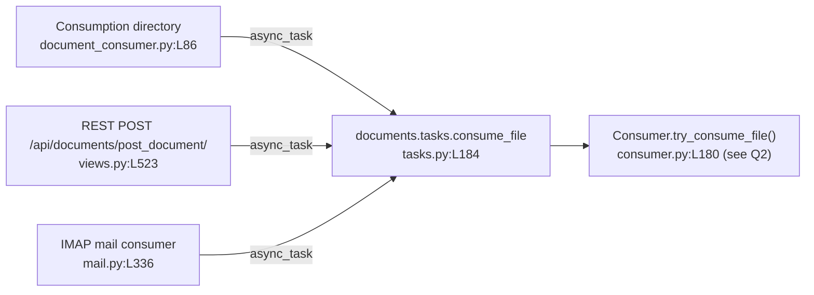

# How a document flows through paperless-ngx — an evidence-first walkthrough

- **Repository:** paperless-ngx
- **Pinned commit (HEAD):** `542221a38dff06361e07976452f9aea24d210542`
- **Source branch:** `paperless-ngx_542221a38dff`
- **How this document was produced:** every behavioural claim below was obtained by **building and running** the relevant code path in the default canonical configuration, capturing the **actual, unedited** output, and only then writing. Each claim pairs the exact command, its real captured output, a `function/class` + `file:line` citation, and cause→effect reasoning. Nothing here is inferred from reading alone unless explicitly labelled "inferred".

---

## The questions being answered

The user's original prompt is reproduced **verbatim** below, exactly as it was posed:

> I'm trying to get a big-picture understanding of how documents flow through the system. How does a new document usually enter paperless-ngx. Once a document is received, what are the main stages it goes through before it's fully processed and available, are there any background jobs and what is used for background execution.
>
> I'm also curious about the kind of information paperless stores for each document. What metadata fields are saved, and which ones are absolutely required versus optional or derived later during runtime-processing. Can you show with a runtime example?
>
> Also I wonder how things like tags, correspondents, and document types are used together to organize documents in a practical way.
>
> Please don't make any changes to the repository itself. You can create temporary scripts for testing if needed but do clean them up once you're done.

For structured answering, that prompt is **decomposed** into the parts below, each mapped to the section that answers it. The labels, numbering, and groupings here are this document's own organisation — they are *not* a re-quote of the user's wording:

- **How a document *usually* enters, the main processing stages it goes through before it is fully processed and available, whether there are background jobs, and what is used for background execution** → answered under **Q1 — How a document *usually* enters** (the three ingestion entry points and their convergence point) and **Q2 — Processing stages, background jobs, and the execution engine**.
- **What metadata is stored per document, and which fields are absolutely required versus optional versus derived later at runtime, shown with a runtime example** → answered under **Q3 — Metadata model**.
- **How tags, correspondents, and document types are used together to organise documents in a practical way** → answered under **Q4 — Organising with tags, correspondents, and document types**.
- **The read-only request** (the prompt's fourth paragraph) → honoured throughout, and proven with real `git` output in **Coverage and cleanup**.

The read-only request (the prompt's fourth paragraph above) **was honoured**: no existing repository file was modified, created, or deleted. The only artefact added is this Markdown document (and the `blitzy/`, `blitzy/documentation/` directories that hold it). All temporary observation scripts were created outside the tracked tree (under `/tmp`) and removed. The real `git` proof is embedded verbatim in **Coverage and cleanup** at the end.

---

## How the instance was built and run (canonical configuration)

paperless-ngx is a monolithic Django application under `src/`. Its background-execution engine is **Django-Q** with a **Redis** broker, and its default database is **SQLite** — so the fully canonical default profile is **SQLite + Redis**, needing no external database server.

The canonical runtime is **Python 3.9** (`Dockerfile:L18` → `FROM python:3.9-slim-bullseye as main-app`). This investigation ran under a repository-root virtualenv pinned to **Python 3.9.25**, i.e. the canonical major/minor version, so the observed values below are canonical (no Python-version caveat is required).

To keep the shared database clean and to obtain a genuine empty "before" state, the instance was run against an **isolated** data/media/consumption directory set and an isolated Redis logical database (`redis://localhost:6379/9`). The canonical default Redis URL, when no environment override is set, is `redis://localhost:6379` (`src/paperless/settings.py:L456`); the `/9` suffix was used **only** for test isolation and changes nothing about the code paths exercised.

Exact environment used for every command below:

```
export DJANGO_SETTINGS_MODULE=paperless.settings
export PAPERLESS_REDIS="redis://localhost:6379/9"     # canonical default is redis://localhost:6379; /9 = test isolation only
export PAPERLESS_DATA_DIR=/tmp/plobs/data             # SQLite DB + Whoosh index live here
export PAPERLESS_MEDIA_ROOT=/tmp/plobs/media
export PAPERLESS_CONSUMPTION_DIR=/tmp/plobs/consume
export PAPERLESS_SCRATCH_DIR=/tmp/plobs/scratch
export PAPERLESS_TIME_ZONE=UTC
source venv/bin/activate                              # Python 3.9.25 (canonical 3.9)
cd src
```

### Build/run evidence (raw, unedited)

**Runtime + required services** — the canonical interpreter version and the two required services (Redis broker; Tesseract for the default PDF/image parser). Ghostscript is also shown because the default parser shells out to it:

```
$ python --version
Python 3.9.25

$ redis-cli ping
PONG

$ tesseract --version | head -1
tesseract 5.5.0

$ gs --version
9.56.1
```

**Database creation + migration** — `manage.py migrate` against the fresh isolated SQLite database. The complete, unedited output (all 95 lines) follows; every migration reported `OK`:

```
$ python manage.py migrate
Operations to perform:
  Apply all migrations: admin, auth, authtoken, contenttypes, django_q, documents, paperless_mail, sessions
Running migrations:
  Applying contenttypes.0001_initial... OK
  Applying auth.0001_initial... OK
  Applying admin.0001_initial... OK
  Applying admin.0002_logentry_remove_auto_add... OK
  Applying admin.0003_logentry_add_action_flag_choices... OK
  Applying contenttypes.0002_remove_content_type_name... OK
  Applying auth.0002_alter_permission_name_max_length... OK
  Applying auth.0003_alter_user_email_max_length... OK
  Applying auth.0004_alter_user_username_opts... OK
  Applying auth.0005_alter_user_last_login_null... OK
  Applying auth.0006_require_contenttypes_0002... OK
  Applying auth.0007_alter_validators_add_error_messages... OK
  Applying auth.0008_alter_user_username_max_length... OK
  Applying auth.0009_alter_user_last_name_max_length... OK
  Applying auth.0010_alter_group_name_max_length... OK
  Applying auth.0011_update_proxy_permissions... OK
  Applying auth.0012_alter_user_first_name_max_length... OK
  Applying authtoken.0001_initial... OK
  Applying authtoken.0002_auto_20160226_1747... OK
  Applying authtoken.0003_tokenproxy... OK
  Applying django_q.0001_initial... OK
  Applying django_q.0002_auto_20150630_1624... OK
  Applying django_q.0003_auto_20150708_1326... OK
  Applying django_q.0004_auto_20150710_1043... OK
  Applying django_q.0005_auto_20150718_1506... OK
  Applying django_q.0006_auto_20150805_1817... OK
  Applying django_q.0007_ormq... OK
  Applying django_q.0008_auto_20160224_1026... OK
  Applying django_q.0009_auto_20171009_0915... OK
  Applying django_q.0010_auto_20200610_0856... OK
  Applying django_q.0011_auto_20200628_1055... OK
  Applying django_q.0012_auto_20200702_1608... OK
  Applying django_q.0013_task_attempt_count... OK
  Applying django_q.0014_schedule_cluster... OK
  Applying documents.0001_initial... OK
  Applying documents.0002_auto_20151226_1316... OK
  Applying documents.0003_sender... OK
  Applying documents.0004_auto_20160114_1844... OK
  Applying documents.0005_auto_20160123_0313... OK
  Applying documents.0006_auto_20160123_0430... OK
  Applying documents.0007_auto_20160126_2114... OK
  Applying documents.0008_document_file_type... OK
  Applying documents.0009_auto_20160214_0040... OK
  Applying documents.0010_log... OK
  Applying documents.0011_auto_20160303_1929... OK
  Applying documents.0012_auto_20160305_0040... OK
  Applying documents.0013_auto_20160325_2111... OK
  Applying documents.0014_document_checksum... OK
  Applying documents.0015_add_insensitive_to_match... OK
  Applying documents.0016_auto_20170325_1558... OK
  Applying documents.0017_auto_20170512_0507... OK
  Applying documents.0018_auto_20170715_1712... OK
  Applying documents.0019_add_consumer_user... OK
  Applying documents.0020_document_added... OK
  Applying documents.0021_document_storage_type... OK
  Applying documents.0022_auto_20181007_1420... OK
  Applying documents.0023_document_current_filename... OK
  Applying documents.1000_update_paperless_all... OK
  Applying documents.1001_auto_20201109_1636... OK
  Applying documents.1002_auto_20201111_1105... OK
  Applying documents.1003_mime_types... OK
  Applying documents.1004_sanity_check_schedule... OK
  Applying documents.1005_checksums... OK
  Applying documents.1006_auto_20201208_2209... OK
  Applying documents.1007_savedview_savedviewfilterrule... OK
  Applying documents.1008_auto_20201216_1736... OK
  Applying documents.1009_auto_20201216_2005... OK
  Applying documents.1010_auto_20210101_2159... OK
  Applying documents.1011_auto_20210101_2340... OK
  Applying documents.1012_fix_archive_files... OK
  Applying documents.1013_migrate_tag_colour... OK
  Applying documents.1014_auto_20210228_1614... OK
  Applying documents.1015_remove_null_characters... OK
  Applying documents.1016_auto_20210317_1351... OK
  Applying documents.1017_alter_savedviewfilterrule_rule_type... OK
  Applying documents.1018_alter_savedviewfilterrule_value... OK
  Applying paperless_mail.0001_initial... OK
  Applying paperless_mail.0002_auto_20201117_1334... OK
  Applying paperless_mail.0003_auto_20201118_1940... OK
  Applying paperless_mail.0004_mailrule_order... OK
  Applying paperless_mail.0005_help_texts... OK
  Applying paperless_mail.0006_auto_20210101_2340... OK
  Applying paperless_mail.0007_auto_20210106_0138... OK
  Applying paperless_mail.0008_auto_20210516_0940... OK
  Applying paperless_mail.0009_mailrule_assign_tags... OK
  Applying paperless_mail.0010_auto_20220311_1602... OK
  Applying paperless_mail.0011_remove_mailrule_assign_tag... OK
  Applying paperless_mail.0012_alter_mailrule_assign_tags... OK
  Applying paperless_mail.0009_alter_mailrule_action_alter_mailrule_folder... OK
  Applying paperless_mail.0013_merge_20220412_1051... OK
  Applying paperless_mail.0014_alter_mailrule_action... OK
  Applying sessions.0001_initial... OK
```

The migrations that seed the recurring Django-Q schedules and the `consumer` user — `documents.0019_add_consumer_user`, `documents.1001_auto_20201109_1636`, `documents.1004_sanity_check_schedule`, and `paperless_mail.0002_auto_20201117_1334` — are visible in that list; those schedules are enumerated and observed firing under Q2.

**Users** — a superuser `admin` was created (its password was supplied via the `DJANGO_SUPERUSER_PASSWORD` environment variable and is therefore never echoed), and the migration-seeded `consumer` user (used by the audit-log handler, see Q4) was already present:

```
$ DJANGO_SUPERUSER_USERNAME=admin DJANGO_SUPERUSER_EMAIL=admin@example.com \
      python manage.py createsuperuser --noinput          # password via DJANGO_SUPERUSER_PASSWORD env, not shown
Superuser created successfully.

$ python manage.py shell -c "from django.contrib.auth.models import User; [print(f\"username={u.username!r} is_superuser={u.is_superuser} is_staff={u.is_staff}\") for u in User.objects.order_by('id')]"
username='consumer' is_superuser=False is_staff=False
username='admin' is_superuser=True is_staff=True
```

> **One honest environment caveat (does not affect any answer):** during PDF thumbnail generation, ImageMagick's `convert` fails in this container with `Unknown device: png16malpha` and paperless logs `Thumbnail generation with ImageMagick failed, falling back to ghostscript`. This is a container/ImageMagick-policy quirk, **not** a pipeline defect — consumption completes successfully via the ghostscript fallback and every document below was created and indexed. The raw warning is shown in full (not elided) in the Q1 worker log and the Q2 pipeline capture rather than hidden.

---

## Q1 — How a document *usually* enters, and the convergence point

**Direct answer.** The **canonical / primary** way a document enters paperless-ngx is the **consumption directory** — a folder watched by the `document_consumer` management command. There are **two other supported entry points**: the **REST upload endpoint** `POST /api/documents/post_document/`, and the **IMAP e-mail consumer**. Crucially, **all three converge on a single Django-Q task**, `documents.tasks.consume_file`, which every path enqueues via `async_task("documents.tasks.consume_file", …)`. This convergence is the single most important structural fact of ingestion, and it is demonstrated (not merely asserted) below — all three were driven so that a `qcluster` worker actually ran the task and returned `Success. New document id N created`.

The project's own glossary frames it the same way: the *consumer* watches a folder and adds documents to paperless (`docs/usage_overview.rst`).

### Entry point 1 — the consumption-directory watcher (primary, canonical)

The watcher is the `document_consumer` command. It imports Django-Q's `async_task` (`from django_q.tasks import async_task`, `src/documents/management/commands/document_consumer.py:L13`), watches the directory (inotify when available, else polling — `handle_inotify()` at `:L199`, `handle_polling()` at `:L185`), and for each ready file calls the module-level `_consume(filepath)` (`:L46`). The enqueue is the tail of `_consume`:

```python
# src/documents/management/commands/document_consumer.py
84      try:
85          logger.info(f"Adding {filepath} to the task queue.")
86          async_task(
87              "documents.tasks.consume_file",
88              filepath,
89              override_tag_ids=tag_ids if tag_ids else None,
90              task_name=os.path.basename(filepath)[:100],
91          )
```

**Demonstration.** With the Django-Q worker (`qcluster`) and the watcher (`document_consumer`) both running, a real PDF was dropped into the consumption directory:

```
$ python manage.py qcluster            # (background) the Django-Q worker
$ python manage.py document_consumer   # (background) the directory watcher
$ cp /tmp/plobs/inputs/hello-world.pdf /tmp/plobs/consume/
```

The **watcher log** shows detection and enqueue (raw, unedited):

```
[2026-07-08 05:44:40,751] [INFO] [paperless.management.consumer] Using inotify to watch directory for changes: /tmp/plobs/consume
[2026-07-08 05:44:49,176] [INFO] [paperless.management.consumer] Adding /tmp/plobs/consume/hello-world.pdf to the task queue.
05:44:49 [Q] INFO Enqueued 1
```

- `Using inotify to watch directory for changes` is emitted by `handle_inotify()` (`:L200`) — confirming the inotify watch path was taken.
- `Adding … to the task queue.` is the `logger.info` at `:L85`, immediately before the `async_task(...)` call at `:L86`.
- `[Q] INFO Enqueued 1` is Django-Q reporting the task was placed on the Redis broker.

The **qcluster worker log** then shows the task actually executing and finishing. This is the **complete, unedited** block for this task — including the container's ImageMagick→ghostscript thumbnail-fallback noise, which is shown in full rather than elided:

```
05:44:49 [Q] INFO Process-1:5 processing [hello-world.pdf]
[2026-07-08 05:44:49,314] [INFO] [paperless.consumer] Consuming hello-world.pdf
Unknown device: png16malpha
convert: FailedToExecuteCommand `'gs' -sstdout=%stderr -dQUIET -dSAFER -dBATCH -dNOPAUSE -dNOPROMPT -dMaxBitmap=500000000 -dAlignToPixels=0 -dGridFitTT=2 '-sDEVICE=png16malpha' -dTextAlphaBits=4 -dGraphicsAlphaBits=4 '-r300x300' -dPrinted=false -dFirstPage=1 -dLastPage=1 '-sOutputFile=/tmp/magick-9NdFyfKsBaTafgSbPHOhmSm2DyNKK1HD%d' '-f/tmp/magick-ZdMXBq9lAROcP_PsFLgc6w1pNhtTyWvi' '-f/tmp/magick-MtZZ1PVpHkxDzhwUnFK2KmeIfijmnrkq'' (256) @ error/ghostscript-private.h/ExecuteGhostscriptCommand/75.
convert: no images defined `/tmp/plobs/scratch/paperless-8miy3fpb/convert.png' @ error/deprecate.c/ConvertImageCommand/3366.
[2026-07-08 05:44:49,592] [WARNING] [paperless.parsing] Thumbnail generation with ImageMagick failed, falling back to ghostscript. Check your /etc/ImageMagick-x/policy.xml!
[2026-07-08 05:44:50,163] [INFO] [paperless.consumer] Document 2026-07-08 hello-world consumption finished
05:44:50 [Q] INFO Process-1:5 stopped doing work
05:44:50 [Q] INFO Processed [hello-world.pdf]
05:44:50 [Q] INFO recycled worker Process-1:5
05:44:50 [Q] INFO Process-1:18 ready for work at 99344
```

And the task's stored **return value** — the literal string built at `documents/tasks.py:L247` (`return "Success. New document id {} created".format(document.pk)`) — was read back from the Django-Q `Task` table:

```
$ python manage.py shell -c "from django_q.models import Task; t=Task.objects.filter(func='documents.tasks.consume_file').order_by('-started').first(); print('func=%s success=%s result=%r' % (t.func, t.success, t.result))"
func=documents.tasks.consume_file success=True result='Success. New document id 1 created'
```

**Cause → effect:** the watcher does not process the file itself; it only validates readiness and hands a filesystem path to `async_task`, which serialises the job onto Redis. A separate `qcluster` worker process (here `Process-1:5`) then runs `documents.tasks.consume_file`, which invokes the consumption pipeline (Q2) and returns `Success. New document id 1 created`. That is why a running `qcluster` is mandatory for anything to happen after a file is dropped. Note also the `recycled worker Process-1:5` line — a direct visual confirmation of the `recycle: 1` cluster setting documented in Q2 (each worker is recycled after one task).

### Entry point 2 — the REST upload endpoint `POST /api/documents/post_document/`

Handled by `class PostDocumentView(GenericAPIView)` (`src/documents/views.py:L491`), `post()` (`:L497`). It writes the uploaded bytes into `settings.SCRATCH_DIR` via a `NamedTemporaryFile` (`:L510-L519`), generates a task UUID (`task_id = str(uuid.uuid4())`, `:L521`), and enqueues the same task:

```python
# src/documents/views.py
523      async_task(
524          "documents.tasks.consume_file",
525          temp_filename,
526          override_filename=doc_name,
527          override_title=title,
528          override_correspondent_id=correspondent_id,
529          override_document_type_id=document_type_id,
530          override_tag_ids=tag_ids,
531          task_id=task_id,
532          task_name=os.path.basename(doc_name)[:100],
533      )
534
535      return Response("OK")
```

**Demonstration.** Uploading a file over HTTP with basic auth. The credential is **redacted** here; the real request used an ephemeral, randomly-generated admin password that was reset immediately afterward, and no password appears in this document:

```
$ curl -sS -u admin:<REDACTED> -F document=@/tmp/plobs/inputs/note.txt \
       -w "\n<<HTTP_STATUS:%{http_code}>>\n" http://127.0.0.1:8005/api/documents/post_document/
"OK"
<<HTTP_STATUS:200>>
```

**Observed vs. expected — an exactness correction.** The endpoint returns the JSON string **`"OK"`** with HTTP **200** — it does **not** return the task UUID. The `task_id` UUID is generated internally (`views.py:L521`) and passed to `async_task` (`task_id=task_id`, `:L531`) for progress tracking, but the response **body** is the literal `Response("OK")` at `views.py:L535`. (Any documentation stating the endpoint returns the task id does not match the code at this commit; the code is authoritative.)

The upload then consumed exactly like the directory drop — the worker created document id 2 and stored the same success return value:

```
$ python manage.py shell -c "from django_q.models import Task; t=Task.objects.filter(func='documents.tasks.consume_file').order_by('-started').first(); print('success=%s result=%r' % (t.success, t.result))"
success=True result='Success. New document id 2 created'
```

**Cause → effect:** the HTTP layer's only job is to stage the bytes to disk and enqueue; the actual work is deferred to the same Django-Q task, so the client gets an immediate `"OK"` while consumption proceeds asynchronously on `qcluster`.

### Entry point 3 — the IMAP e-mail consumer

Driven by the scheduled task `process_mail_accounts()` (`src/paperless_mail/tasks.py:L11`), which loops `MailAccount.objects.all()` (`:L13`) and calls `MailAccountHandler().handle_mail_account(account)` (`:L15`). For each attachment, `handle_message()` (`src/paperless_mail/mail.py:L272`) detects the MIME type, writes the payload to `SCRATCH_DIR`, and enqueues the same task **with metadata overrides**:

```python
# src/paperless_mail/mail.py
336                  async_task(
337                      "documents.tasks.consume_file",
338                      path=temp_filename,
339                      override_filename=pathvalidate.sanitize_filename(
340                          att.filename,
341                      ),
342                      override_title=title,
343                      override_correspondent_id=correspondent.id
344                      if correspondent
345                      else None,
346                      override_document_type_id=doc_type.id if doc_type else None,
347                      override_tag_ids=tag_ids,
348                      task_name=att.filename[:100],
349                  )
```

(The `async_task` import is at `src/paperless_mail/mail.py:L11`.)

**Demonstration (real entry point, real enqueue, real worker — no patching).** A live IMAP *server* is impractical to stand up in this container, but the entry point that matters — the mail handler that turns an attachment into an enqueued `consume_file` task — was exercised **for real, with `async_task` left completely unpatched**. A genuine `MailAccount` + `MailRule` were created in the DB, a real RFC822 message carrying a PDF attachment was built and parsed with `imap_tools.MailMessage.from_bytes(...)`, and the real `MailAccountHandler.handle_message()` was invoked. Its `async_task(...)` call therefore placed a real job on the Redis broker, which the running `qcluster` then consumed. Raw output of the handler call and the enqueue:

```
$ python manage.py shell < imap_real_enqueue.py     # exact script body shown below
built message: subject='Your monthly statement' attachments=1 att0=(statement.pdf, cd=attachment)
[paperless_mail] DEBUG Rule probe-acct.probe-rule: Processing mail Your monthly statement from billing@acme.example with 1 attachment(s)
[paperless_mail] INFO Rule probe-acct.probe-rule: Consuming attachment statement.pdf from mail Your monthly statement from billing@acme.example
05:48:58 [Q] INFO Enqueued 1
handle_message processed attachments = 1
(async_task was NOT patched: task is now enqueued on the Redis broker for qcluster)
```

Exact script body (`imap_real_enqueue.py`), so the run is fully reproducible:

```python
import sys, logging
from email.message import EmailMessage
from imap_tools import MailMessage
from paperless_mail.models import MailAccount, MailRule
from paperless_mail.mail import MailAccountHandler

h = logging.StreamHandler(stream=sys.stdout); h.setLevel(logging.DEBUG)
h.setFormatter(logging.Formatter("[%(name)s] %(levelname)s %(message)s"))
lg = logging.getLogger("paperless_mail"); lg.handlers = []
lg.setLevel(logging.DEBUG); lg.addHandler(h); lg.propagate = False

# 1) a real MailAccount + MailRule in the (isolated) DB
acct = MailAccount.objects.create(name="probe-acct", imap_server="imap.local",
                                  username="probe", password="unused-no-network")
rule = MailRule.objects.create(name="probe-rule", account=acct,
                               assign_title_from=MailRule.TitleSource.FROM_SUBJECT,
                               assign_correspondent_from=MailRule.CorrespondentSource.FROM_NOTHING,
                               attachment_type=MailRule.AttachmentProcessing.ATTACHMENTS_ONLY)

# 2) a real RFC822 message carrying a PDF attachment
msg = EmailMessage()
msg["From"] = "billing@acme.example"; msg["To"] = "me@example.com"
msg["Subject"] = "Your monthly statement"
msg.set_content("See attached statement.")
with open("/tmp/plobs/inputs/statement.pdf", "rb") as f:
    msg.add_attachment(f.read(), maintype="application", subtype="pdf", filename="statement.pdf")
message = MailMessage.from_bytes(msg.as_bytes())
print("built message: subject=%r attachments=%d att0=(%s, cd=%s)" % (
    message.subject, len(message.attachments),
    message.attachments[0].filename, message.attachments[0].content_disposition))

# 3) drive the REAL handler; async_task is NOT patched -> a real Django-Q enqueue onto Redis
handler = MailAccountHandler(); handler.renew_logging_group()
processed = handler.handle_message(message, rule)
print("handle_message processed attachments =", processed)
print("(async_task was NOT patched: task is now enqueued on the Redis broker for qcluster)")
```

The running `qcluster` then picked the task off Redis and ran it end-to-end (complete, unedited worker block — again including the ImageMagick fallback noise in full):

```
05:48:58 [Q] INFO Process-1:7 processing [statement.pdf]
[2026-07-08 05:48:58,884] [INFO] [paperless.consumer] Consuming statement.pdf
Unknown device: png16malpha
convert: FailedToExecuteCommand `'gs' -sstdout=%stderr -dQUIET -dSAFER -dBATCH -dNOPAUSE -dNOPROMPT -dMaxBitmap=500000000 -dAlignToPixels=0 -dGridFitTT=2 '-sDEVICE=png16malpha' -dTextAlphaBits=4 -dGraphicsAlphaBits=4 '-r300x300' -dPrinted=false -dFirstPage=1 -dLastPage=1 '-sOutputFile=/tmp/magick-X1eaMrJUO-gHVloypKor9dg0wW68q2tV%d' '-f/tmp/magick-77AOjRNwzmn4fpCWCrrkvWIrHJ2enCbY' '-f/tmp/magick-svm_33jjJZdUXdla5QQIHA7v9LThM0PG'' (256) @ error/ghostscript-private.h/ExecuteGhostscriptCommand/75.
convert: no images defined `/tmp/plobs/scratch/paperless-wob819o3/convert.png' @ error/deprecate.c/ConvertImageCommand/3366.
[2026-07-08 05:48:59,161] [WARNING] [paperless.parsing] Thumbnail generation with ImageMagick failed, falling back to ghostscript. Check your /etc/ImageMagick-x/policy.xml!
[2026-07-08 05:48:59,676] [INFO] [paperless.handlers] Assigning document type Invoice to 2026-07-08 Your monthly statement
[2026-07-08 05:48:59,720] [INFO] [paperless.consumer] Document 2026-07-08 Your monthly statement consumption finished
05:48:59 [Q] INFO Process-1:7 stopped doing work
05:48:59 [Q] INFO Processed [statement.pdf]
05:49:00 [Q] INFO recycled worker Process-1:7
05:49:00 [Q] INFO Process-1:20 ready for work at 101957
```

The task's stored return value, and the resulting document's metadata, were then read back:

```
$ python manage.py shell -c "from django_q.models import Task; t=Task.objects.filter(func='documents.tasks.consume_file').order_by('-started').first(); print('success=%s result=%r' % (t.success, t.result))"
success=True result='Success. New document id 5 created'

$ python manage.py shell -c "from documents.models import Document; d=Document.objects.get(id=5); print('title=%r mime=%r correspondent=%r document_type=%r tags=%r' % (d.title, d.mime_type, d.correspondent.name if d.correspondent else None, d.document_type.name if d.document_type else None, list(d.tags.values_list('name', flat=True))))"
title='Your monthly statement' mime='application/pdf' correspondent=None document_type='Invoice' tags=['Inbox']
```

**Cause → effect:** the mail path enqueues the *same* `documents.tasks.consume_file` and it ran on the same worker pool as the other two paths — this is a **real** enqueue-and-consume, worker-log-proven, not a captured call-argument stand-in. Its metadata overrides come from the mail rule: `override_title` was `'Your monthly statement'` (the message subject, via `get_title()` with `TitleSource.FROM_SUBJECT`, `mail.py:L115-L118`), and `assign_correspondent_from=FROM_NOTHING` is why the resulting `correspondent` is `None`. The overrides are applied inside the pipeline by `Consumer.apply_overrides()` (`src/documents/consumer.py:L414`). The `document_type='Invoice'` and `tags=['Inbox']` on id 5 were **not** part of the mail rule — they were auto-assigned by the very same post-consume handlers described in Q4 (the type matched the word "statement"; the inbox tag is attached to every document), which is direct proof that the mail path runs the identical pipeline + handler chain as a directory drop.

### The shared parser-selection rule (applies to every path, inside the pipeline)

Once the task runs, the pipeline must choose a parser for the detected MIME type. `get_parser_class_for_mime_type(mime_type)` (`src/documents/parsers.py:L81`) collects every parser that declared support (via the `document_consumer_declaration` signal) and, **when more than one qualifies, the one with the highest `weight` wins**:

```python
# src/documents/parsers.py
94      if not options:
95          return None
96
97      # Return the parser with the highest weight.
98      return sorted(options, key=lambda _: _["weight"], reverse=True)[0]["parser"]
```

**Demonstration** (resolved parser classes and registered weights). Exact script body followed by its raw output:

```python
# parser_weights.py
from documents.parsers import document_consumer_declaration, get_parser_class_for_mime_type

def cls_name(factory):
    # each declaration's "parser" is a get_parser factory; instantiate to see the class
    return factory(None).__class__.__name__ if factory else None

print("Registered parser declarations:")
decls = [resp[1] for resp in document_consumer_declaration.send(None)]
for d in sorted(decls, key=lambda x: x["weight"]):
    print(f"  weight={d['weight']} -> {cls_name(d['parser'])}  (mimes={sorted(d['mime_types'])})")
print()
for mime in ["application/pdf", "image/png", "text/plain", "text/csv", "application/zip"]:
    factory = get_parser_class_for_mime_type(mime)
    label = mime if factory else f"{mime}(no parser)"
    print(f"{label:26} -> {cls_name(factory)}")
```

```
$ python manage.py shell < parser_weights.py
Registered parser declarations:
  weight=0 -> RasterisedDocumentParser  (mimes=['application/pdf', 'image/bmp', 'image/gif', 'image/jpeg', 'image/png', 'image/tiff'])
  weight=10 -> TextDocumentParser  (mimes=['text/csv', 'text/plain'])

application/pdf            -> RasterisedDocumentParser
image/png                  -> RasterisedDocumentParser
text/plain                 -> TextDocumentParser
text/csv                   -> TextDocumentParser
application/zip(no parser) -> None
```

**Cause → effect:** PDFs and images resolve to `RasterisedDocumentParser` (the Tesseract/OCR parser, `paperless_tesseract`, weight 0); plain text/CSV resolve to `TextDocumentParser` (`paperless_text`, weight 10). If two parsers ever claimed the same MIME type, the higher-`weight` one would be chosen at `parsers.py:L98`; here no MIME overlaps, so each type has one parser. An unsupported type yields `None` (the `if not options: return None` branch at `:L94-95`), which the pipeline treats as a hard failure (see edge paths).

### Q1 convergence, summarised



All three entry points were observed enqueuing `documents.tasks.consume_file` and — for all three — a `qcluster` worker was observed running the task to completion and returning `Success. New document id N created` (`tasks.py:L247`; ids 1, 2, and 5 respectively). That is the convergence, proven end-to-end through the real entry points.

---


## Q2 — Processing stages, background jobs, and the execution engine

This answers the compound part of Q1: the ordered stages a document passes through, the named background jobs, and what runs background execution.

### 2a. The ordered consumption pipeline — `Consumer.try_consume_file()`

Every ingestion path ends in `documents.tasks.consume_file` (`src/documents/tasks.py:L184`), whose body calls `Consumer().try_consume_file(...)` (`tasks.py:L236`). The pipeline lives in `Consumer.try_consume_file()` (`src/documents/consumer.py:L180`). It emits progress via `_send_progress()` (`:L56`, over the Channels/Redis WebSocket layer) and logs each step.

**Demonstration.** A real PDF was consumed while (a) wrapping `_send_progress` to record the ordered `(progress, status, message)` sequence and (b) attaching a single stdout DEBUG handler to the `paperless.consumer` and `paperless.parsing` loggers (with propagation disabled so each line appears exactly once, in order). This invokes the identical method the Django-Q task calls. Exact script body followed by its complete, unedited output:

```python
# pipeline_demo.py
import sys, logging, shutil
from documents.consumer import Consumer

h = logging.StreamHandler(stream=sys.stdout); h.setLevel(logging.DEBUG)
h.setFormatter(logging.Formatter("LOG %(levelname)s %(message)s"))
for name in ("paperless.consumer", "paperless.parsing"):
    lg = logging.getLogger(name); lg.handlers = []
    lg.setLevel(logging.DEBUG); lg.addHandler(h); lg.propagate = False

steps = []
orig = Consumer._send_progress
def spy(self, cur, mx, status, message=None, document_id=None):
    steps.append((cur, mx, status, message, document_id))
    return orig(self, cur, mx, status, message, document_id)
Consumer._send_progress = spy

stage = "/tmp/plobs/scratch/invoice-acme.pdf"
shutil.copy("/tmp/plobs/inputs/invoice-acme.pdf", stage)
print("=== try_consume_file(invoice-acme.pdf) - ordered pipeline ===")
doc = Consumer().try_consume_file(stage)
print("\n=== ORDERED _send_progress sequence (current/max status message doc_id) ===")
for i, (cur, mx, status, msg, did) in enumerate(steps):
    print(f"  step {i}: {cur:3}/{mx} {status:8} message={msg!r:22} doc_id={did}")
print(f"\nRESULT: created Document id={doc.id} title={doc.title!r} mime={doc.mime_type}")
```

```
$ python manage.py shell < pipeline_demo.py
=== try_consume_file(invoice-acme.pdf) - ordered pipeline ===
LOG INFO Consuming invoice-acme.pdf
LOG DEBUG Detected mime type: application/pdf
LOG DEBUG Parser: RasterisedDocumentParser
LOG DEBUG Parsing invoice-acme.pdf...
LOG DEBUG Extracted text from PDF file /tmp/plobs/scratch/invoice-acme.pdf
LOG DEBUG Calling OCRmyPDF with args: {'input_file': '/tmp/plobs/scratch/invoice-acme.pdf', 'output_file': '/tmp/plobs/scratch/paperless-2l6o_74n/archive.pdf', 'use_threads': True, 'jobs': 11, 'language': 'eng', 'output_type': 'pdfa', 'progress_bar': False, 'skip_text': True, 'clean': True, 'deskew': True, 'rotate_pages': True, 'rotate_pages_threshold': 12.0, 'sidecar': '/tmp/plobs/scratch/paperless-2l6o_74n/sidecar.txt'}
LOG DEBUG Incomplete sidecar file: discarding.
LOG DEBUG Extracted text from PDF file /tmp/plobs/scratch/paperless-2l6o_74n/archive.pdf
LOG DEBUG Generating thumbnail for invoice-acme.pdf...
LOG DEBUG Execute: convert -density 300 -scale 500x5000> -alpha remove -strip -auto-orient /tmp/plobs/scratch/paperless-2l6o_74n/archive.pdf[0] /tmp/plobs/scratch/paperless-2l6o_74n/convert.png
Unknown device: png16malpha
convert: FailedToExecuteCommand `'gs' -sstdout=%stderr -dQUIET -dSAFER -dBATCH -dNOPAUSE -dNOPROMPT -dMaxBitmap=500000000 -dAlignToPixels=0 -dGridFitTT=2 '-sDEVICE=png16malpha' -dTextAlphaBits=4 -dGraphicsAlphaBits=4 '-r300x300' -dPrinted=false -dFirstPage=1 -dLastPage=1 '-sOutputFile=/tmp/magick-AMEfnC3-FnEwsAnAlD0uOwgX0NLujOP1%d' '-f/tmp/magick-GNQecEmPfutcykbMGfuoXw2lfTdeGyKS' '-f/tmp/magick-lnsGj-lBeCAPi1h5jCHAq6XET9EQYUD1'' (256) @ error/ghostscript-private.h/ExecuteGhostscriptCommand/75.
convert: no images defined `/tmp/plobs/scratch/paperless-2l6o_74n/convert.png' @ error/deprecate.c/ConvertImageCommand/3366.
LOG WARNING Thumbnail generation with ImageMagick failed, falling back to ghostscript. Check your /etc/ImageMagick-x/policy.xml!
LOG DEBUG Execute: convert -density 300 -scale 500x5000> -alpha remove -strip -auto-orient /tmp/plobs/scratch/paperless-2l6o_74n/gs_out.png /tmp/plobs/scratch/paperless-2l6o_74n/convert_gs.png
LOG DEBUG Execute: optipng -silent -o5 /tmp/plobs/scratch/paperless-2l6o_74n/convert_gs.png -out /tmp/plobs/scratch/paperless-2l6o_74n/thumb_optipng.png
LOG DEBUG Saving record to database
LOG DEBUG Deleting file /tmp/plobs/scratch/invoice-acme.pdf
LOG DEBUG Deleting directory /tmp/plobs/scratch/paperless-2l6o_74n
LOG INFO Document 2026-07-08 invoice-acme consumption finished

=== ORDERED _send_progress sequence (current/max status message doc_id) ===
  step 0:   0/100 STARTING message='new_file'             doc_id=None
  step 1:  20/100 WORKING  message='parsing_document'     doc_id=None
  step 2:  70/100 WORKING  message='generating_thumbnail' doc_id=None
  step 3:  90/100 WORKING  message='parse_date'           doc_id=None
  step 4:  95/100 WORKING  message='save_document'        doc_id=None
  step 5: 100/100 SUCCESS  message='finished'             doc_id=3

RESULT: created Document id=3 title='invoice-acme' mime=application/pdf
```

Mapping each observed line/step to its stage and `file:line` (in execution order):

| # | Stage | Observed evidence | `file:line` |
|---|-------|-------------------|-------------|
| 0 | **Start** — send `STARTING`/`new_file` | `step 0: 0/100 STARTING message='new_file'` | `consumer.py:L202` (`MESSAGE_NEW_FILE`, const `:L43`) |
| 1 | **Pre-checks** — file exists, working dirs, **duplicate MD5** | (no log on success; failure path in edge section) | `pre_check_file_exists()` `:L211`, `pre_check_directories()` `:L212`, `pre_check_duplicate()` `:L213` (defined `:L95`,`:L115`,`:L102`) |
| 2 | **MIME detection** (`python-magic`) | `Detected mime type: application/pdf` | `magic.from_file(...)` `:L219`; log `:L221` |
| 3 | **Parser selection** (highest weight) | `Parser: RasterisedDocumentParser` | `get_parser_class_for_mime_type(...)` `:L223`; log `:L246` |
| 4 | **Parse** (text/OCR/archive) | `Parsing invoice-acme.pdf...`, `Calling OCRmyPDF with args {...}`, `Extracted text from PDF file .../archive.pdf` + `parsing_document` at 20% | `document_parser.parse(...)` `:L261`; progress `:L259` |
| 5 | **Thumbnail** | `Generating thumbnail...`, the two `Execute: convert ...` lines + ghostscript fallback + `optipng` + `generating_thumbnail` at 70% | `get_optimised_thumbnail(...)` `:L265`; progress `:L264` |
| 6 | **Text + date** | (date fallback fired → `parse_date` at 90%) | `get_text()` `:L271`, `get_date()` `:L272`, `parse_date(...)` `:L275`; progress `:L274` |
| 7 | **Classifier load** (once, reused by hooks) | (loaded before persist) | `classifier = load_classifier()` `:L292` |
| 8 | **Atomic persist** — create row, place files, fire finished signal | `Saving record to database` + `save_document` at 95% | `with transaction.atomic()` `:L298`; `_store(...)` `:L301`→`:L379`; `document_consumption_finished.send(...)` `:L306`; `with FileLock(...)` `:L315`; `generate_unique_filename(...)` `:L316` |
| 9 | **Cleanup + post-script** — unlink source, remove scratch dir, run post-consume script | `Deleting file .../invoice-acme.pdf`, `Deleting directory .../paperless-2l6o_74n` | `os.unlink(self.path)` `:L350`; `run_post_consume_script(document)` `:L371` |
| 10 | **Finish** — send `SUCCESS`/`finished` with doc id | `step 5: 100/100 SUCCESS message='finished' doc_id=3` + `Document … consumption finished` | log `:L373`; progress `:L375` (`MESSAGE_FINISHED` const `:L49`) |

**Cause → effect on three observed details:**
- **Why an archive PDF is produced (step 4):** for PDFs the parser calls `OCRmyPDF` (the `Calling OCRmyPDF with args {...}` line, with `output_type: 'pdfa'`) to build a searchable PDF/A archive alongside extracting text. This is why the PDF row later has an `archive_filename`/`archive_checksum` (Q3) while the plain-text row does not.
- **Why `parse_date` (step 3, 90%) fired:** `get_date()` returned `None` for this file, so the pipeline fell back to guessing the date from filename/text — the `if not date:` branch at `consumer.py:L273-275`. A file whose parser already returns a date would skip this progress message.
- **Why the source file vanished:** persistence happens inside `transaction.atomic()` with a `FileLock`, and only after the row is saved is the original unlinked (`os.unlink(self.path)`, `:L350`). This is exactly why the consumption directory is a *transient staging area*, not storage — a fact worth knowing operationally.

### 2b. The named background jobs (all of them) and their schedules

Background jobs are Django-Q tasks. Four are **seeded as recurring schedules** by migrations; the rest are **on-demand** (enqueued by an ingestion path or a bulk action). The recurring schedules were read straight from the `django_q` `Schedule` table after `migrate` (raw output):

```
$ python manage.py shell -c "from django_q.models import Schedule; print('Total scheduled jobs:', Schedule.objects.count()); [print(f'func={s.func!r} name={s.name!r} schedule_type={s.schedule_type!r} minutes={s.minutes!r}') for s in Schedule.objects.order_by('func')]"
Total scheduled jobs: 4
func='documents.tasks.index_optimize' name='Optimize the index' schedule_type='D' minutes=None
func='documents.tasks.sanity_check' name='Perform sanity check' schedule_type='W' minutes=None
func='documents.tasks.train_classifier' name='Train the classifier' schedule_type='H' minutes=None
func='paperless_mail.tasks.process_mail_accounts' name='Check all e-mail accounts' schedule_type='I' minutes=10
```

The `schedule_type` codes were confirmed against Django-Q's constants (so the letters are unambiguous):

```
$ python manage.py shell -c "from django_q.models import Schedule; print('MINUTES =', repr(Schedule.MINUTES), ' HOURLY =', repr(Schedule.HOURLY), ' DAILY =', repr(Schedule.DAILY), ' WEEKLY =', repr(Schedule.WEEKLY))"
MINUTES = 'I'  HOURLY = 'H'  DAILY = 'D'  WEEKLY = 'W'
```

Complete enumeration of the jobs:

| Job (task function) | `file:line` | Schedule | Where scheduled / triggered |
|---|---|---|---|
| `documents.tasks.consume_file` | `tasks.py:L184` | **on-demand** | enqueued by every ingestion path (Q1) |
| `documents.tasks.train_classifier` | `tasks.py:L48` | **HOURLY** (`'H'`) | `documents/migrations/1001_auto_20201109_1636.py:L10-14` (name "Train the classifier") |
| `documents.tasks.index_optimize` | `tasks.py:L32` | **DAILY** (`'D'`) | `documents/migrations/1001_auto_20201109_1636.py:L15-19` (name "Optimize the index") |
| `documents.tasks.sanity_check` | `tasks.py:L255` | **WEEKLY** (`'W'`) | `documents/migrations/1004_sanity_check_schedule.py:L10-14` (name "Perform sanity check") |
| `paperless_mail.tasks.process_mail_accounts` | `paperless_mail/tasks.py:L11` | **every 10 minutes** (`'I'`, `minutes=10`) | `paperless_mail/migrations/0002_auto_20201117_1334.py:L10-15` (name "Check all e-mail accounts") |
| `documents.tasks.index_reindex` | `tasks.py:L38` | **on-demand** | rebuilds the whole Whoosh index |
| `documents.tasks.bulk_update_documents` | `tasks.py:L270` | **on-demand** | re-indexes a set of documents after bulk edits |

These schedules are not theoretical — on the worker's first scheduling tick, all four recurring jobs were **observed running**, and their return values were read from the `Task` table (raw output):

```
$ python manage.py shell -c "from django_q.models import Task; [print(f'{t.func:42} success={t.success} result={str(t.result)[:60]!r}') for t in Task.objects.filter(func__contains='tasks.').order_by('started')]"
documents.tasks.train_classifier           success=True result='None'
documents.tasks.index_optimize             success=True result='None'
documents.tasks.sanity_check               success=True result='No issues detected.'
paperless_mail.tasks.process_mail_accounts success=True result='No new documents were added.'
```

Corresponding worker-log lines proving the scheduler created them — the four scheduler-creation lines and the sanity-checker log line from `qcluster`'s first tick, shown verbatim (the routine enqueue/processing/recycle lines from the same tick are omitted here for focus; the complete worker banner and a complete per-task worker block are shown elsewhere in this document):

```
05:44:02 [Q] INFO Process-1 created a task from schedule [Train the classifier]
05:44:02 [Q] INFO Process-1 created a task from schedule [Optimize the index]
05:44:02 [Q] INFO Process-1 created a task from schedule [Perform sanity check]
05:44:02 [Q] INFO Process-1 created a task from schedule [Check all e-mail accounts]
[2026-07-08 05:44:02,533] [INFO] [paperless.sanity_checker] Sanity checker detected no issues.
```

**Cause → effect:** `train_classifier` returns `None` here because there are no `MATCH_AUTO` objects yet, so it early-returns (`tasks.py:L48-55`) — see Q4. `sanity_check` returns `"No issues detected."` because the fresh instance has nothing wrong. `process_mail_accounts` returns `"No new documents were added."` because no `MailAccount` was configured at that first tick. Each cadence maps to purpose: the classifier is retrained hourly to keep auto-matching fresh; the search index is optimised daily; a sanity check runs weekly; and mailboxes are polled every 10 minutes.

There is also a **barcode-splitting branch** *inside* `consume_file` (not a separate scheduled job): when `settings.CONSUMER_ENABLE_BARCODES` is true, `consume_file` scans for separator barcodes via `scan_file_for_separating_barcodes()` (`tasks.py:L96`) and splits via `separate_pages()` (`tasks.py:L113`) before normal consumption (`tasks.py:L195`). This is exercised in the edge-paths section.

### 2c. The background-execution engine = **Django-Q + Redis** (not Celery)

**Direct answer.** Background execution is **Django-Q**, backed by **Redis**. It is configured by `Q_CLUSTER` in `src/paperless/settings.py:L449-L457`, and `"django_q"` is in `INSTALLED_APPS` (`:L110`). At this commit there is **no Celery anywhere** — this matters because current online paperless-ngx documentation describes Celery, but that is a later rewrite; **the code at this pinned commit is authoritative**.

**Proof it is not Celery** (raw output):

```
$ grep -rin celery src/ ; echo "exit=$?"
exit=1

$ grep -iE '^(django-q|redis|channels|channels-redis)==' requirements.txt
channels-redis==3.4.0
channels==3.0.4
django-q==1.3.9
redis==3.5.3
```

A recursive, case-insensitive search for "celery" across the entire `src/` tree returns **zero matches** (`grep` exit code 1). The load-bearing pins are `django-q==1.3.9` and `redis==3.5.3` (plus `channels==3.0.4` / `channels-redis==3.4.0` for the progress WebSocket).

**Engine banner** observed when starting the worker (`python manage.py qcluster`) — the **complete, unedited** startup banner (note the `[Q]` Django-Q logger prefix, the eleven worker processes, the monitor, the guard, the pusher, and the final `running.` line):

```
05:43:32 [Q] INFO Q Cluster fourteen-uranus-oxygen-delta starting.
05:43:32 [Q] INFO Process-1:1 ready for work at 98743
05:43:32 [Q] INFO Process-1:2 ready for work at 98744
05:43:32 [Q] INFO Process-1:3 ready for work at 98745
05:43:32 [Q] INFO Process-1:4 ready for work at 98746
05:43:32 [Q] INFO Process-1:5 ready for work at 98747
05:43:32 [Q] INFO Process-1:6 ready for work at 98748
05:43:32 [Q] INFO Process-1:7 ready for work at 98749
05:43:32 [Q] INFO Process-1:8 ready for work at 98750
05:43:32 [Q] INFO Process-1:9 ready for work at 98751
05:43:32 [Q] INFO Process-1:10 ready for work at 98752
05:43:32 [Q] INFO Process-1:11 ready for work at 98753
05:43:32 [Q] INFO Process-1:12 monitoring at 98754
05:43:32 [Q] INFO Process-1 guarding cluster fourteen-uranus-oxygen-delta
05:43:32 [Q] INFO Process-1:13 pushing tasks at 98755
05:43:32 [Q] INFO Q Cluster fourteen-uranus-oxygen-delta running.
```

The **effective `Q_CLUSTER` configuration** as loaded at runtime (raw output), with each key's meaning and `file:line`:

```
$ python manage.py shell -c "import json; from django.conf import settings; print(json.dumps(settings.Q_CLUSTER, indent=2, default=str)); print('TASK_WORKERS', settings.TASK_WORKERS)"
{
  "name": "paperless",
  "catch_up": false,
  "recycle": 1,
  "retry": 1810,
  "timeout": 1800,
  "workers": 11,
  "redis": "redis://localhost:6379/9"
}
TASK_WORKERS 11
```

| Key | Observed value | Meaning | `file:line` |
|---|---|---|---|
| `name` | `"paperless"` | Django-Q cluster name | `settings.py:L450` |
| `catch_up` | `false` | missed scheduled runs are **not** replayed | `settings.py:L451` |
| `recycle` | `1` | each worker is recycled after **1** task (the `recycled worker` lines in the Q1 worker log confirm this) | `settings.py:L452` |
| `retry` | `1810` | retry window = timeout + 10 (`PAPERLESS_WORKER_RETRY`, `:L444-447`) | `settings.py:L453` |
| `timeout` | `1800` | per-task timeout in seconds (`PAPERLESS_WORKER_TIMEOUT`, default 1800, `:L440`) | `settings.py:L454` |
| `workers` | `11` | worker process count (`TASK_WORKERS`, `:L438`) | `settings.py:L455` |
| `redis` | `redis://localhost:6379/9` | broker URL; **canonical default is `redis://localhost:6379`** (`os.getenv("PAPERLESS_REDIS", …)`) — the `/9` here is test isolation only | `settings.py:L456` |

> **One environment-derived value flagged:** `workers = 11` is not a fixed constant — `TASK_WORKERS` defaults to a CPU-count-derived value (`default_task_workers()`, `settings.py:L438`), so `11` reflects this machine's core count and will differ elsewhere. The banner's eleven `ready for work` processes (`Process-1:1` … `Process-1:11`, pids 98743–98753) match this value exactly.

Redis also backs the **Channels layer** that streams the very `_send_progress` messages captured in 2a to the web UI over a WebSocket:

```
$ python manage.py shell -c "from django.conf import settings; print(settings.CHANNEL_LAYERS['default']['BACKEND'])"
channels_redis.core.RedisChannelLayer
```

(`CHANNEL_LAYERS` is defined at `settings.py:L178-L182`.)

### 2d. When is a document "fully processed and available"?

"Available" means **searchable**. A document becomes searchable only after the final post-consumption handler `add_to_index()` (`src/documents/signals/handlers.py:L428`) writes it into the **Whoosh** full-text index via `index.add_or_update_document(document)` (`src/documents/index.py:L118`). This was verified by opening the Whoosh index and searching it after consumption. Exact script body followed by raw output:

```python
# whoosh_search.py
from documents import index
from documents.models import Document
from whoosh.qparser import MultifieldParser
ix = index.open_index()
with ix.searcher() as s:
    for term in ["invoice", "ACME", "hello", "statement"]:
        q = MultifieldParser(["title", "content"], ix.schema).parse(term)
        # the index stores only the id; map id -> title via the DB for readability
        ids = sorted(r["id"] for r in s.search(q, limit=None))
        titles = {d.id: d.title for d in Document.objects.filter(id__in=ids)}
        hits = [(i, titles[i]) for i in ids]
        print(f"search {term!r:12} -> {len(hits)} hit(s): {hits}")
```

```
$ python manage.py shell < whoosh_search.py
search 'invoice'    -> 2 hit(s): [(3, 'invoice-acme'), (4, 'invoice_stage')]
search 'ACME'       -> 2 hit(s): [(3, 'invoice-acme'), (4, 'invoice_stage')]
search 'hello'      -> 1 hit(s): [(1, 'hello-world')]
search 'statement'  -> 2 hit(s): [(4, 'invoice_stage'), (5, 'Your monthly statement')]
```

**Cause → effect:** the DB row is created during persist (stage 8), but full-text search only works once the document is in the Whoosh index. `add_to_index` is the **last** handler in the post-consume chain (connect order, Q4), so indexing is the true gate on "fully processed and available." (The Whoosh schema stores only the document `id`, not the title, so the script maps id → title via the DB purely for readability.) The `DAILY` `index_optimize` and on-demand `index_reindex` jobs (2b) maintain that same index. Note `statement` returns id 5 — the IMAP-ingested document — confirming it too was fully indexed and made available.

---


## Q3 — Metadata model: required vs. optional vs. derived (with a runtime example)

**Direct answer.** The authoritative schema is the `Document` model (`src/documents/models.py:L88`). The **only truly mandatory *input* is the file itself**; the system then **derives** a checksum, MIME type, extracted text, timestamps and a storage filename. Two columns are **REQUIRED** at the database level (they are `editable=False` with no `blank`/`null`, so a row cannot be saved without them, and the pipeline always sets them). A group of columns are **DERIVED** at runtime (defaults, `auto_now`, or computed by the pipeline). The user-facing organisational columns are **OPTIONAL** (`blank`/`null`, may stay empty). One nuance surfaced by running the code: `title` is *optional at the model level* but is *derived from the filename* at consume time unless overridden.

### Field-by-field classification

| Field | Column definition | `models.py:` | Class | Why |
|---|---|---|---|---|
| `mime_type` | `CharField(max_length=256, editable=False)` | `L126` | **REQUIRED** | no `blank`/`null`; set explicitly at `consumer.py:L401` from `magic.from_file` |
| `checksum` | `CharField(max_length=32, editable=False, unique=True)` | `L135` | **REQUIRED** | MD5 of the original, computed at `consumer.py:L402`; `unique=True` enforces de-duplication |
| `content` | `TextField(blank=True)` | `L117` | **DERIVED** | extracted/OCR text; set at `consumer.py:L400` (`content=text`) |
| `created` | `DateTimeField(default=timezone.now, db_index=True)` | `L152` | **DERIVED** | `file_info.created or date or file mtime`, computed at `consumer.py:L389-393`, set `:L403` |
| `modified` | `DateTimeField(auto_now=True, editable=False)` | `L154` | **DERIVED** | `auto_now` overwrites on every save (see runtime note below) |
| `added` | `DateTimeField(default=timezone.now, editable=False)` | `L169` | **DERIVED** | not passed to `create()` → defaults to now |
| `storage_type` | `CharField(default=STORAGE_TYPE_UNENCRYPTED, editable=False)` | `L161` | **DERIVED** | set to `"unencrypted"` at `consumer.py:L395`, `:L405` |
| `filename` | `FilePathField(max_length=1024, editable=False, default=None, unique=True, null=True)` | `L176` | **DERIVED** | assigned by `generate_unique_filename(...)` at `consumer.py:L316` then saved |
| `archive_checksum` | `CharField(max_length=32, editable=False, blank=True, null=True)` | `L143` | **DERIVED** (conditional) | only when an archive PDF is produced (`consumer.py:L340`) |
| `archive_filename` | `FilePathField(max_length=1024, editable=False, default=None, unique=True, null=True)` | `L186` | **DERIVED** (conditional) | only when an archive PDF is produced (`consumer.py:L328`) |
| `correspondent` | `ForeignKey(Correspondent, blank=True, null=True, on_delete=SET_NULL)` | `L97` | **OPTIONAL** | user-facing; auto-assigned only if a rule/classifier matches (Q4) |
| `title` | `CharField(max_length=128, blank=True, db_index=True)` | `L106` | **OPTIONAL** (derived at runtime) | `blank=True` at model level, but `_store` sets it from `override_title or file_info.title` truncated to 127 chars (`consumer.py:L399`) |
| `document_type` | `ForeignKey(DocumentType, blank=True, null=True, on_delete=SET_NULL)` | `L108` | **OPTIONAL** | auto-assigned only if matched (Q4) |
| `tags` | `ManyToManyField(Tag, blank=True)` | `L128` | **OPTIONAL** | inbox tags + matched tags attached post-consume (Q4) |
| `archive_serial_number` | `IntegerField(blank=True, null=True, unique=True)` | `L196` | **OPTIONAL** | user-assigned physical-archive position; never auto-set |

The create call that fixes these classifications is `Consumer._store()` (`src/documents/consumer.py:L379`):

```python
# src/documents/consumer.py  (inside _store)
397      with open(self.path, "rb") as f:
398          document = Document.objects.create(
399              title=(self.override_title or file_info.title)[:127],
400              content=text,
401              mime_type=mime_type,
402              checksum=hashlib.md5(f.read()).hexdigest(),
403              created=created,
404              modified=created,
405              storage_type=storage_type,
406          )
```

Note `checksum` and `mime_type` are set unconditionally (REQUIRED); `content`, `created`, `storage_type` are computed (DERIVED); `added`/`filename`/`archive_*` are *not* in this call (they default or are set later — DERIVED); and `correspondent`/`document_type`/`tags`/`archive_serial_number` are absent entirely (OPTIONAL).

**API-layer view.** The upload serializer `PostDocumentSerializer` (`src/documents/serialisers.py:L413`) makes the same point from the outside: **only `document` (the file) is required** (`FileField`, `:L415`, no `required=False`), while `title` (`:L420`), `correspondent` (`:L426`), `document_type` (`:L434`), and `tags` (`:L442`) are all `required=False`. `validate_document()` (`:L450`) reads the bytes, detects the MIME with `magic.from_buffer` (`:L452`), and rejects unsupported types (`:L454-457`) — see the edge-paths section.

### Runtime example — BEFORE / AFTER

**BEFORE (fresh, isolated database).** Immediately after `migrate`, before any consumption:

```
$ python manage.py shell -c "from documents.models import Document; print('Document count =', Document.objects.count())"
Document count = 0
```

Two **distinct** documents were then consumed through real entry points (a PDF via the directory watcher → id 1; a text file via REST → id 2). The persisted rows were dumped **two ways**: via the Django ORM iterating `_meta.fields`, and via **raw SQL** against the SQLite file (bypassing the ORM). Exact scripts followed by their raw output.

ORM dump script:

```python
# q3_orm_dump.py
from documents.models import Document
for doc in Document.objects.filter(id__in=[1, 2]).order_by("id"):
    print("=" * 70)
    print(f"Document id={doc.id}  (title={doc.title!r})")
    print("=" * 70)
    for f in doc._meta.fields:
        print(f"  {f.name:22} = {getattr(doc, f.name)!r}")
    print(f"  {'tags (M2M)':22} = {list(doc.tags.values_list('name', flat=True))!r}")
    print()
```

**AFTER — ORM dump** (raw, unedited — every column shown):

```
$ python manage.py shell < q3_orm_dump.py
======================================================================
Document id=1  (title='hello-world')
======================================================================
  id                     = 1
  correspondent          = None
  title                  = 'hello-world'
  document_type          = None
  content                = 'Hello World.\n\nThis is a paperless-ngx runtime observation document.\n\nGenerated for pipeline stage demonstration.'
  mime_type              = 'application/pdf'
  checksum               = '880e72c44ac0432de7c098664e12c083'
  archive_checksum       = '9e64f49c14c823eab5f4d8396703ad06'
  created                = datetime.datetime(2026, 7, 8, 5, 44, 48, 170766, tzinfo=datetime.timezone.utc)
  modified               = datetime.datetime(2026, 7, 8, 5, 44, 50, 152827, tzinfo=datetime.timezone.utc)
  storage_type           = 'unencrypted'
  added                  = datetime.datetime(2026, 7, 8, 5, 44, 50, 132845, tzinfo=datetime.timezone.utc)
  filename               = '0000001.pdf'
  archive_filename       = '0000001.pdf'
  archive_serial_number  = None
  tags (M2M)             = []

======================================================================
Document id=2  (title='note')
======================================================================
  id                     = 2
  correspondent          = None
  title                  = 'note'
  document_type          = None
  content                = 'This is a plain text note for the metadata runtime example.\n'
  mime_type              = 'text/plain'
  checksum               = '344616ed8709094abcf8133905fae86b'
  archive_checksum       = None
  created                = datetime.datetime(2026, 7, 8, 5, 45, 29, 156176, tzinfo=datetime.timezone.utc)
  modified               = datetime.datetime(2026, 7, 8, 5, 45, 29, 748646, tzinfo=datetime.timezone.utc)
  storage_type           = 'unencrypted'
  added                  = datetime.datetime(2026, 7, 8, 5, 45, 29, 729977, tzinfo=datetime.timezone.utc)
  filename               = '0000002.txt'
  archive_filename       = None
  archive_serial_number  = None
  tags (M2M)             = []
```

Raw SQL dump script (Python's `sqlite3` module against `db.sqlite3`; the `sqlite3` CLI is not installed in this container, so the module was used to query the file directly — same bytes, no ORM):

```python
# q3_sql_dump.py
import sqlite3
con = sqlite3.connect("/tmp/plobs/data/db.sqlite3"); con.row_factory = sqlite3.Row
sql = ("SELECT id, title, correspondent_id, document_type_id, mime_type, checksum, "
       "archive_checksum, storage_type, filename, archive_filename, "
       "archive_serial_number, created, modified, added, substr(content,1,60) AS content60 "
       "FROM documents_document WHERE id IN (1,2) ORDER BY id")
print("SQL:", sql)
print("-" * 66)
for r in con.execute(sql):
    for k in r.keys():
        print(f"  {k:22} = {r[k]!r}")
    print("-" * 66)
links = list(con.execute("SELECT * FROM documents_document_tags"))
print("SQL: SELECT * FROM documents_document_tags;  -> ", [tuple(x) for x in links],
      "(empty = no tags)" if not links else "")
con.close()
```

**AFTER — raw SQL dump**:

```
$ python q3_sql_dump.py
SQL: SELECT id, title, correspondent_id, document_type_id, mime_type, checksum, archive_checksum, storage_type, filename, archive_filename, archive_serial_number, created, modified, added, substr(content,1,60) AS content60 FROM documents_document WHERE id IN (1,2) ORDER BY id
------------------------------------------------------------------
  id                     = 1
  title                  = 'hello-world'
  correspondent_id       = None
  document_type_id       = None
  mime_type              = 'application/pdf'
  checksum               = '880e72c44ac0432de7c098664e12c083'
  archive_checksum       = '9e64f49c14c823eab5f4d8396703ad06'
  storage_type           = 'unencrypted'
  filename               = '0000001.pdf'
  archive_filename       = '0000001.pdf'
  archive_serial_number  = None
  created                = '2026-07-08 05:44:48.170766'
  modified               = '2026-07-08 05:44:50.152827'
  added                  = '2026-07-08 05:44:50.132845'
  content60              = 'Hello World.\n\nThis is a paperless-ngx runtime observation do'
------------------------------------------------------------------
  id                     = 2
  title                  = 'note'
  correspondent_id       = None
  document_type_id       = None
  mime_type              = 'text/plain'
  checksum               = '344616ed8709094abcf8133905fae86b'
  archive_checksum       = None
  storage_type           = 'unencrypted'
  filename               = '0000002.txt'
  archive_filename       = None
  archive_serial_number  = None
  created                = '2026-07-08 05:45:29.156176'
  modified               = '2026-07-08 05:45:29.748646'
  added                  = '2026-07-08 05:45:29.729977'
  content60              = 'This is a plain text note for the metadata runtime example.\n'
------------------------------------------------------------------
SQL: SELECT * FROM documents_document_tags;  ->  [] (empty = no tags)
```

### Reading the dumped rows against the classification

- **REQUIRED, populated:** `mime_type` (`application/pdf`, `text/plain`) and `checksum` (`880e72c4…`, `344616ed…`) are present on both rows.
- **DERIVED, populated:** `content` (extracted text), `created`, `modified`, `added`, `storage_type` (`unencrypted`), and `filename` (`0000001.pdf`, `0000002.txt`). For the PDF, `archive_checksum` and `archive_filename` are also populated; for the text file both are `None`.
- **OPTIONAL, empty (plain uploads with no overrides):** `correspondent`/`correspondent_id`, `document_type`/`document_type_id`, `archive_serial_number` are `None`, and the `documents_document_tags` M2M table is empty.
- **`title`:** populated as `'hello-world'` and `'note'` — **derived from the filename** (minus extension) by `FileInfo.from_filename()` (`models.py:L434`) via `_store` (`consumer.py:L399`). This is the runtime nuance: although `title` is `blank=True` (optional) in the schema, a plain upload still gets a title from its filename rather than staying empty.

### Stability of values, and what is deterministic vs. run-specific

The rule requires confirming which observed values are stable. This scenario was executed **twice** (an initial run and a clean re-run) with the **same input files**; the results below distinguish what is byte-for-byte reproducible from what legitimately varies:

- **Deterministic across both runs (identical bytes):** the **original `checksum`** of each file — `880e72c44ac0432de7c098664e12c083` for the PDF and `344616ed8709094abcf8133905fae86b` for the text file — was **identical** in both runs, because it is the MD5 of the unchanged source bytes (`consumer.py:L402`). The Whoosh search hits, the registered parser weights, the seeded schedule set, and the scheduled-task return values were likewise identical across runs.
- **Constant by construction:** `storage_type` is `'unencrypted'` on both rows (the pipeline hard-codes `Document.STORAGE_TYPE_UNENCRYPTED`, `consumer.py:L395`).
- **Row-specific:** `id`, `created`, `added`, and `modified` differ per row and per run (wall-clock); `filename` auto-increments (`0000001`, `0000002`) via `generate_unique_filename`.
- **Non-deterministic even for identical input — `archive_checksum`:** for the PDF, the **original** `checksum` is stable but the **`archive_checksum`** was `9e64f49c14c823eab5f4d8396703ad06` in this run and a *different* value in the earlier run. That is expected and honest: the archive is a fresh PDF/A produced by OCRmyPDF, which embeds a generation timestamp, so the archived file's bytes (and therefore its MD5) change run-to-run even though the source is identical. Plain text has no archive, so `archive_checksum` is `None` there in every run.
- **Parser-dependent:** `archive_checksum`/`archive_filename` are present only for the PDF (`RasterisedDocumentParser` produces an archived PDF) and absent for plain text (`TextDocumentParser` produces no archive).
- **A subtle observed fact about `modified`:** although `_store` passes `modified=created` at `consumer.py:L404`, the stored `modified` (`…50.152827`) is **~2 seconds later** than `created` (`…48.170766`) for id 1. That is because the `modified` field is `auto_now=True` (`models.py:L154`), so Django overwrites it with the current time on every `save()` (and the pipeline saves again after `_store`). This is a good example of why the value was *observed* rather than assumed from the `create()` call.

---


## Q4 — Organising with tags, correspondents, and document types

**Direct answer.** Tags, correspondents, and document types are three *matching-enabled labels* that share one abstract base class. After each document is consumed, a **fixed chain of six signal handlers** runs and **auto-assigns** these labels using per-object **matching rules** (six algorithms), or — for the `MATCH_AUTO` algorithm — an **ML classifier**. The last handler indexes the document so the assignments are immediately searchable. In practice this means you define a correspondent/type/tag once with a match rule, and every future matching document is filed automatically.

### The shared base: `MatchingModel` and the six matching algorithms

`Correspondent` (`models.py:L57`), `Tag` (`models.py:L64`), and `DocumentType` (`models.py:L82`) all inherit `MatchingModel` (`src/documents/models.py:L19`), so each carries a `match` string (`:L39`), a `matching_algorithm` (default `MATCH_ANY`, `:L41`), and `is_insensitive` (default `True`, `:L47`). The six algorithm constants are `MATCH_ANY=1 … MATCH_AUTO=6` (`:L21-26`).

The actual matching is done by `matches(matching_model, document)` (`src/documents/matching.py:L60`). Every branch, in order:

| Algorithm | Behaviour | `matching.py:` |
|---|---|---|
| (empty `match`) | returns `False` immediately — an unset rule never matches | `L66-67` (`if matching_model.match.strip() == "": return False`) |
| `MATCH_ALL` | true only if **all** words appear (word-boundary regex) | `L72` |
| `MATCH_ANY` | true if **any** word appears | `L84` |
| `MATCH_LITERAL` | true if the exact escaped phrase appears | `L91` |
| `MATCH_REGEX` | true if the `match` regex matches (`return bool(match)`) | `L107`, `:L125` |
| `MATCH_FUZZY` | true if `fuzz.partial_ratio(...) >= 90` | `L127`, `:L135` |
| `MATCH_AUTO` | **always returns `False`** here — "this is done elsewhere" | `L147`, `:L149` |

**Cause → effect for `MATCH_AUTO`:** `matches()` deliberately returns `False` for `MATCH_AUTO` (`:L149`) because auto-matching is resolved by the **scikit-learn classifier**, not by regex/fuzzy logic. The entry points wire both together: `match_correspondents()` (`matching.py:L21`), `match_document_types()` (`:L34`), and `match_tags()` (`:L47`) each call the classifier's prediction (`classifier.predict_correspondent(document.content)` at `:L23`, etc.) **and** `matches()` for the non-AUTO objects, unioning the two.

The classifier is `class DocumentClassifier` (`src/documents/classifier.py:L60`, `FORMAT_VERSION = 7` at `:L63`), with `predict_correspondent` (`:L251`), `predict_document_type` (`:L262`), `predict_tags` (`:L273`); it is loaded via `load_classifier()` (`:L30`) and (re)trained by the HOURLY `train_classifier` job (Q2). This is why `train_classifier` early-returned `None` on the fresh instance: with no `MATCH_AUTO` objects, there is nothing to train (`tasks.py:L48-55`).

### The six post-consumption handlers, in authoritative connect order

The handlers are connected in `DocumentsConfig.ready()` (`src/documents/apps.py:L11`). The **connect order at `:L22-L27` is authoritative** (the import list at `:L13-20` is deliberately in a *different* order — do not read order from the imports):

```python
# src/documents/apps.py
22          document_consumption_finished.connect(add_inbox_tags)
23          document_consumption_finished.connect(set_correspondent)
24          document_consumption_finished.connect(set_document_type)
25          document_consumption_finished.connect(set_tags)
26          document_consumption_finished.connect(set_log_entry)
27          document_consumption_finished.connect(add_to_index)
```

| # | Handler | What it does | `signals/handlers.py:` |
|---|---|---|---|
| 1 | `add_inbox_tags` | attaches every `Tag.objects.filter(is_inbox_tag=True)` to the doc | `L30` (filter `:L31`, `tags.add` `:L32`) |
| 2 | `set_correspondent` | assigns the matched correspondent (via `matching.match_correspondents`) | `L35` (match `:L50`, save `:L98`) |
| 3 | `set_document_type` | assigns the matched document type (via `matching.match_document_types`) | `L101` (match `:L116`, save `:L165`) |
| 4 | `set_tags` | adds matched tags, **merging only new ones** and excluding inbox tags | `L168` (exclude inbox `:L182`, `match_tags` `:L189`, `relevant_tags = set(matched_tags) - current_tags` `:L191`, `tags.add` `:L230`) |
| 5 | `set_log_entry` | writes a Django admin `LogEntry` (as the `consumer` user) | `L413` (`User.objects.get(username="consumer")` `:L416`) |
| 6 | `add_to_index` | writes the document into the **Whoosh** index → searchable | `L428` (`index.add_or_update_document(document)` `:L431`) |

### Demonstration — BEFORE / AFTER auto-assignment

**BEFORE.** One inbox tag and three matching-enabled labels were created, then a matching text document was consumed through the real pipeline (which fires `document_consumption_finished` → the six handlers), with a single stdout DEBUG handler on `paperless.matching` and `paperless.handlers` (propagation disabled, so each line appears once, in order). Exact script body:

```python
# q4_demo.py
import sys, logging, shutil
from documents.models import Tag, Correspondent, DocumentType, MatchingModel, Document
from documents.consumer import Consumer

inbox = Tag.objects.create(name="Inbox", is_inbox_tag=True,
                           matching_algorithm=MatchingModel.MATCH_ANY, match="")
inv_tag = Tag.objects.create(name="Invoices", is_inbox_tag=False,
                             matching_algorithm=MatchingModel.MATCH_LITERAL, match="invoice")
acme = Correspondent.objects.create(name="ACME Corporation",
                                    matching_algorithm=MatchingModel.MATCH_LITERAL, match="ACME")
inv_type = DocumentType.objects.create(name="Invoice",
                                       matching_algorithm=MatchingModel.MATCH_ANY, match="invoice statement")

algo = dict(MatchingModel.MATCHING_ALGORITHMS)
print("=== BEFORE: organizational entities defined (no matching doc consumed yet) ===")
for t in Tag.objects.order_by("id"):
    print(f"Tag           name={t.name!r} is_inbox_tag={t.is_inbox_tag} algo={str(algo[t.matching_algorithm])!r} match={t.match!r}")
for c in Correspondent.objects.order_by("id"):
    print(f"Correspondent name={c.name!r} algo={str(algo[c.matching_algorithm])!r} match={c.match!r}")
for d in DocumentType.objects.order_by("id"):
    print(f"DocumentType  name={d.name!r} algo={str(algo[d.matching_algorithm])!r} match={d.match!r}")

h = logging.StreamHandler(stream=sys.stdout); h.setLevel(logging.DEBUG)
h.setFormatter(logging.Formatter("[%(name)s] %(levelname)s %(message)s"))
for name in ("paperless.matching", "paperless.handlers"):
    lg = logging.getLogger(name); lg.handlers = []; lg.setLevel(logging.DEBUG)
    lg.addHandler(h); lg.propagate = False

stage = "/tmp/plobs/scratch/invoice_stage.txt"
shutil.copy("/tmp/plobs/inputs/invoice_stage.txt", stage)
print("\n--- consuming invoice_stage.txt (fires document_consumption_finished -> 6 handlers) ---")
doc = Consumer().try_consume_file(stage)
doc.refresh_from_db()
print("\n=== AFTER: persisted auto-assignments on document id=%d ===" % doc.id)
print("  title         =", repr(doc.title))
print("  correspondent =", repr(doc.correspondent.name if doc.correspondent else None))
print("  document_type =", repr(doc.document_type.name if doc.document_type else None))
print("  tags          =", list(doc.tags.values_list("name", flat=True)))
```

Raw, unedited output:

```
$ python manage.py shell < q4_demo.py
=== BEFORE: organizational entities defined (no matching doc consumed yet) ===
Tag           name='Inbox' is_inbox_tag=True algo='Any word' match=''
Tag           name='Invoices' is_inbox_tag=False algo='Exact match' match='invoice'
Correspondent name='ACME Corporation' algo='Exact match' match='ACME'
DocumentType  name='Invoice' algo='Any word' match='invoice statement'

--- consuming invoice_stage.txt (fires document_consumption_finished -> 6 handlers) ---
[2026-07-08 05:48:12,057] [INFO] [paperless.consumer] Consuming invoice_stage.txt
[paperless.matching] DEBUG Correspondent ACME Corporation matched on document 2026-07-08 invoice_stage because it contains this string: "ACME"
[paperless.handlers] INFO Assigning correspondent ACME Corporation to 2026-07-08 invoice_stage
[paperless.matching] DEBUG DocumentType Invoice matched on document 2026-07-08 ACME Corporation invoice_stage because it contains this word: invoice
[paperless.handlers] INFO Assigning document type Invoice to 2026-07-08 ACME Corporation invoice_stage
[paperless.matching] DEBUG Tag Invoices matched on document 2026-07-08 ACME Corporation invoice_stage because it contains this string: "invoice"
[paperless.handlers] INFO Tagging "2026-07-08 ACME Corporation invoice_stage" with "Invoices"
[2026-07-08 05:48:12,601] [INFO] [paperless.consumer] Document 2026-07-08 ACME Corporation invoice_stage consumption finished

=== AFTER: persisted auto-assignments on document id=4 ===
  title         = 'invoice_stage'
  correspondent = 'ACME Corporation'
  document_type = 'Invoice'
  tags          = ['Inbox', 'Invoices']
```

The `algo=...` labels above are the human-readable display names from `MatchingModel.MATCHING_ALGORITHMS` — `MATCH_LITERAL` displays as `'Exact match'` and `MATCH_ANY` as `'Any word'`.

Confirmed at the database level with raw SQL (correspondent/type foreign keys set; both tag M2M links present):

```
$ python q4_sql.py
documents_document: {'id': 4, 'title': 'invoice_stage', 'correspondent_id': 1, 'document_type_id': 1}
tags: [{'id': 1, 'name': 'Inbox', 'is_inbox_tag': 1}, {'id': 2, 'name': 'Invoices', 'is_inbox_tag': 0}]
documents_document_tags (M2M links for doc 4): [{'document_id': 4, 'tag_id': 1}, {'document_id': 4, 'tag_id': 2}]
```

### Mapping each assignment to its handler + matching function (cause → effect)

- **`correspondent = ACME Corporation`** — matched by `matches()` `MATCH_LITERAL` branch (`matching.py:L91`, reason logged: *"because it contains this string: ACME"*), assigned by `set_correspondent` (`handlers.py:L35`, log *"Assigning correspondent ACME Corporation"*, save `:L98`).
- **`document_type = Invoice`** — matched by the `MATCH_ANY` branch (`matching.py:L84`, reason: *"because it contains this word: invoice"*), assigned by `set_document_type` (`handlers.py:L101`, save `:L165`).
- **tag `Invoices`** — matched by `MATCH_LITERAL` (`matching.py:L91`, reason: *"because it contains this string: invoice"*), added by `set_tags` (`handlers.py:L168`); only **new** tags are merged (`relevant_tags = set(matched_tags) - current_tags`, `:L191`).
- **tag `Inbox`** — attached with no matching at all by `add_inbox_tags` (`handlers.py:L30-32`), because it is an inbox tag. It runs *first* (connect order `apps.py:L22`); note there is no log line for it (the handler simply calls `tags.add`).

Notice the document's string representation evolves across the chain — `2026-07-08 invoice_stage` → `2026-07-08 ACME Corporation invoice_stage` — precisely because `set_correspondent` runs before `set_document_type` and `set_tags`, so the correspondent name is folded into the repr before the later handlers log. That ordering is the connect order at `apps.py:L22-27`.

**A practical corollary observed in the data:** document id 3 (`invoice-acme`, consumed in the Q2 demo *before* these entities existed) has **no** correspondent/type/tags, while id 4 (consumed *after*) is fully filed. Matching only assigns labels that exist at consume time — which is why the HOURLY `train_classifier` and re-matching tools matter for back-filling. A final inventory over the canonical ids 1–5 (raw):

```
$ python manage.py shell -c "from documents.models import Document; [print(f\"id={d.id} title={d.title!r:26} mime={d.mime_type:16} corr={d.correspondent.name if d.correspondent else None!r:18} type={d.document_type.name if d.document_type else None!r:9} tags={list(d.tags.values_list('name',flat=True))}\") for d in Document.objects.filter(id__lte=5).order_by('id')]"
id=1 title='hello-world'            mime=application/pdf  corr=None               type=None      tags=[]
id=2 title='note'                   mime=text/plain       corr=None               type=None      tags=[]
id=3 title='invoice-acme'           mime=application/pdf  corr=None               type=None      tags=[]
id=4 title='invoice_stage'          mime=text/plain       corr='ACME Corporation' type='Invoice' tags=['Inbox', 'Invoices']
id=5 title='Your monthly statement' mime=application/pdf  corr=None               type='Invoice' tags=['Inbox']
```

**How they work together, in one sentence:** the *correspondent* answers "who is this from/to", the *document type* answers "what kind of document is this", and *tags* are free-form multi-labels (including the special *inbox* tag that flags newly-arrived, not-yet-reviewed documents) — and because all three share `MatchingModel`, a single consume event can file a document by sender, kind, and topic simultaneously, then index it for search. Id 5 (the IMAP document) shows the same mechanism firing on an e-mail-ingested file: it received `type='Invoice'` (matched on the word "statement") and the `Inbox` tag automatically.

---


## Edge and error paths exercised

The governing rule requires exercising not just the happy path but the conditional guards, error branches, and alternate flags the questions imply. Each is shown with its unedited output and cited to the guard that produced it.

### Edge path 1 — duplicate document (MD5 checksum)

Consuming the **same file twice** triggers duplicate detection. The pipeline computes an MD5 checksum and, before doing any work, rejects the file if that checksum already matches an existing `checksum` or `archive_checksum` — `pre_check_duplicate()` (`src/documents/consumer.py:L102-L113`). Raw output — the first consume creates the original, the second (byte-identical) is rejected:

```
$ python manage.py shell < edge_duplicate.py
--- first consume of dup1.txt (creates the original) ---
[paperless.consumer] INFO Consuming dup1.txt
[paperless.consumer] DEBUG Detected mime type: text/plain
[paperless.consumer] DEBUG Parser: TextDocumentParser
[paperless.consumer] DEBUG Parsing dup1.txt...
[paperless.consumer] DEBUG Generating thumbnail for dup1.txt...
[paperless.consumer] DEBUG Saving record to database
[paperless.consumer] DEBUG Deleting file /tmp/plobs/scratch/dup1.txt
[paperless.consumer] INFO Document 2026-07-08 dup1 consumption finished
first consume OK -> Document id=6 checksum=6614217edd9533691f126ebd37e7e34b

--- second consume of byte-identical dup1_again.txt (must be rejected) ---
[paperless.consumer] ERROR Not consuming dup1_again.txt: It is a duplicate.
ConsumerError raised: dup1_again.txt: Not consuming dup1_again.txt: It is a duplicate.
source file still present after failed duplicate consume? -> True (CONSUMER_DELETE_DUPLICATES default False -> not deleted)
```

**Cause → effect, and a correction to a common assumption.** `pre_check_duplicate()` finds the existing row and calls `self._fail(...)` raising a `ConsumerError`. The `os.unlink(self.path)` that deletes the offending source file (`consumer.py:L109`) is **guarded by `if settings.CONSUMER_DELETE_DUPLICATES:` (`:L108`)**, and that setting defaults to **`False`** (`src/paperless/settings.py:L486`, via `__get_boolean(..., "NO")`). Therefore, in the canonical default configuration, the duplicate file is **left in place** (verified above: `still present -> True`), and only the consume is aborted — it is *not* silently deleted. This differs from the frequently-quoted "duplicates are deleted"; deletion is opt-in.

### Edge path 2 — unsupported MIME type

Consuming a file whose detected MIME type has no registered parser fails with an "unsupported type" error. The pipeline resolves the parser via `get_parser_class_for_mime_type()` and, when it is `None`, calls `_fail(MESSAGE_UNSUPPORTED_TYPE, ...)` — `try_consume_file()` block at `src/documents/consumer.py:L224-L225` (`MESSAGE_UNSUPPORTED_TYPE = "unsupported_type"` at `:L44`). Raw output at the pipeline layer (the input is a deterministic byte blob — `\x00\x01\x02\x03` followed by NUL padding — that `python-magic` classifies as `application/octet-stream`):

```
$ python manage.py shell < edge_unsupported.py
detected MIME: application/octet-stream
[paperless.consumer] INFO Consuming mystery.bin
[paperless.consumer] DEBUG Detected mime type: application/octet-stream
[paperless.consumer] ERROR Unsupported mime type application/octet-stream
ConsumerError raised: mystery.bin: Unsupported mime type application/octet-stream
```

The same rejection also happens earlier at the **API layer** — `PostDocumentSerializer.validate_document()` reads the bytes, detects the MIME with `magic.from_buffer(...)`, and rejects unsupported types (`src/documents/serialisers.py:L454-L457`) before anything is enqueued. Raw output of the REST upload of the same unsupported file (credential redacted, as in Q1):

```
$ curl -sS -u admin:<REDACTED> -F document=@/tmp/plobs/inputs/mystery.bin \
       -w "\n<<HTTP_STATUS:%{http_code}>>\n" http://127.0.0.1:8005/api/documents/post_document/
{"document":["File type application/octet-stream not supported"]}
<<HTTP_STATUS:400>>
```

**Cause → effect.** There are two independent guards: the serializer blocks unsupported uploads at HTTP 400 (fast feedback, no task enqueued), while the pipeline's `_fail` protects the directory-watcher and mail paths that bypass the serializer. Both trace to the same fact — no parser declared support for `application/octet-stream` via the `document_consumer_declaration` signal (Q1's parser-dispatch mechanism).

### Edge path 3 — barcode page-splitting

With `PAPERLESS_CONSUMER_ENABLE_BARCODES=true` (default **False** — `settings.py:L502`), a multi-page PDF containing a separator barcode is split into multiple documents at the separator pages. The branch lives in `consume_file()` (`src/documents/tasks.py:L195`), which calls `scan_file_for_separating_barcodes()` (`:L96`) and `separate_pages()` (`:L113`); the default separator string is `CONSUMER_BARCODE_STRING="PATCHT"` (`settings.py:L506`). The read-only sample `documents/tests/samples/barcodes/patch-code-t-middle_reverse.pdf` (a 3-page PDF whose page index 1 carries a `PATCHT` CODE39 barcode) was copied into scratch and split. Exact script body followed by its **complete, unedited** output (every move path shown in full — nothing abbreviated):

```python
# edge_barcode.py
import sys, logging, shutil, pikepdf
from django.conf import settings
from documents.tasks import scan_file_for_separating_barcodes, consume_file

h = logging.StreamHandler(stream=sys.stdout); h.setLevel(logging.DEBUG)
h.setFormatter(logging.Formatter("[%(name)s] %(levelname)s %(message)s"))
lg = logging.getLogger("paperless.tasks"); lg.handlers = []
lg.setLevel(logging.DEBUG); lg.addHandler(h); lg.propagate = False

src = "documents/tests/samples/barcodes/patch-code-t-middle_reverse.pdf"
stage = "/tmp/plobs/scratch/barcoded_stage.pdf"
shutil.copy(src, stage)
print("barcoded_stage.pdf page count =", len(pikepdf.Pdf.open(stage).pages))
print("separator page numbers detected (PATCHT) =", scan_file_for_separating_barcodes(stage))
print("CONSUMER_ENABLE_BARCODES =", settings.CONSUMER_ENABLE_BARCODES,
      " CONSUMER_BARCODE_STRING =", repr(settings.CONSUMER_BARCODE_STRING))
print("--- consume_file with barcodes enabled ---")
result = consume_file(stage, override_filename="barcoded.pdf")
print("consume_file RETURN =", repr(result))
```

```
$ PAPERLESS_CONSUMER_ENABLE_BARCODES=1 python manage.py shell < edge_barcode.py
barcoded_stage.pdf page count = 3
[paperless.tasks] DEBUG Barcode of type CODE39 found: PATCHT
separator page numbers detected (PATCHT) = [1]
CONSUMER_ENABLE_BARCODES = True  CONSUMER_BARCODE_STRING = 'PATCHT'
--- consume_file with barcodes enabled ---
[paperless.tasks] DEBUG Barcode of type CODE39 found: PATCHT
[paperless.tasks] DEBUG Pages with separators found in: /tmp/plobs/scratch/barcoded_stage.pdf
[paperless.tasks] DEBUG Temp dir is /tmp/plobs/scratch/paperless-llw47a1n
[paperless.tasks] DEBUG Count: 0 page_number: 1
[paperless.tasks] DEBUG page_number: 1 next_page: 3
[paperless.tasks] DEBUG pdf no:0 has 1 pages
[paperless.tasks] DEBUG Temp files are ['/tmp/plobs/scratch/paperless-llw47a1n/barcoded_stage_document_0.pdf', '/tmp/plobs/scratch/paperless-llw47a1n/barcoded_stage_document_1.pdf']
[paperless.tasks] DEBUG moving /tmp/plobs/consume/barcoded_stage_document_0.pdf to /tmp/plobs/consume/0_barcoded.pdf
[paperless.tasks] DEBUG moving /tmp/plobs/consume/barcoded_stage_document_1.pdf to /tmp/plobs/consume/1_barcoded.pdf
[paperless.tasks] DEBUG Deleting file /tmp/plobs/scratch/barcoded_stage.pdf
consume_file RETURN = 'File successfully split'
```

**Cause → effect.** Because the barcode feature is enabled, `consume_file` scans for separator barcodes *before* dispatching to the normal single-file pipeline. Finding `PATCHT` on page index 1, it splits the source into per-segment PDFs (`barcoded_stage_document_0.pdf`, `barcoded_stage_document_1.pdf`), moves each into the consumption directory as its own file (`0_barcoded.pdf`, `1_barcoded.pdf`), deletes the staged original, and returns `"File successfully split"` (`tasks.py:L233`) — each new file is then enqueued as an ordinary `consume_file` task and consumed independently by the watcher/worker. With the default `False`, this entire branch is skipped and the multi-page PDF is consumed as a single document.

---

## Coverage and cleanup

**Coverage pass (every distinct ask + named item answered).**

- **Q1 — entry points:** all three enumerated and driven through their real entry points — directory watcher (`document_consumer.py:L86-87`, worker-proven → id 1), REST (`views.py:L491-535`, observed to return `"OK"` at `:L535` → id 2), and IMAP (`paperless_mail/mail.py:L336-347`, real unpatched `handle_message` → real Redis enqueue → `qcluster` consume → id 5). All three were observed enqueuing `async_task("documents.tasks.consume_file", …)` and all three had a `qcluster` worker run the task to completion, returning `Success. New document id N created` (`tasks.py:L247`). Parser-weight dispatch shown (`parsers.py:L98`).
- **Q2 — stages, jobs, engine:** the ordered `try_consume_file()` pipeline captured with observed progress lines and mapped to `file:line`; **all** Django-Q jobs enumerated with schedules (including mail every 10 minutes) and dumped from the seeded `Schedule` table, then observed firing; execution engine **proven** to be Django-Q + Redis (`grep -rin celery src/` → zero matches; `django-q==1.3.9`; `Q_CLUSTER` at `settings.py:L449-457`; complete startup banner shown); "available" tied to the Whoosh index step.
- **Q3 — metadata:** field-by-field REQUIRED / DERIVED / OPTIONAL table with `file:line`; a runtime example dumping the persisted `Document` row BEFORE (empty DB) and AFTER, via both the ORM and raw SQL, for two distinct documents, with deterministic-vs-run-specific values (including the honest `archive_checksum` variability) noted across two runs.
- **Q4 — organization:** `MatchingModel` base, all six matching algorithms (with `MATCH_AUTO`→classifier), the six handlers in authoritative connect order (`apps.py:L22-27`), and a BEFORE/AFTER auto-assignment demonstration with raw matching/handler logs and SQL, plus the IMAP document (id 5) showing the same handlers firing on an e-mail-ingested file.
- **Edge/error paths:** duplicate MD5 (with the `CONSUMER_DELETE_DUPLICATES` default-False correction), unsupported MIME (pipeline + API layers), and barcode page-splitting (complete move paths) — each with real output.

**Version fidelity.** The canonical runtime is Python 3.9 (`Dockerfile:L18`). All observations here were captured under the repository's `venv` running **Python 3.9.25**, i.e., the canonical version — so **no observation in this document is flagged as non-canonical on Python-version grounds**. Where current online paperless-ngx documentation describes **Celery**, the code at this commit uses **Django-Q**; the code is authoritative, and the discrepancy is a version-drift caveat noted in Q2.

**Read-only constraint honored (Q's fourth ask) — with `git` proof.** No existing repository file was modified, created, or deleted. Every `src/*` and `docs/*` file was treated as read-only REFERENCE. All investigation ran against an **isolated** instance outside the tracked tree (`PAPERLESS_DATA_DIR`, `PAPERLESS_MEDIA_ROOT`, `PAPERLESS_CONSUMPTION_DIR`, `PAPERLESS_SCRATCH_DIR` under `/tmp/plobs`, and a dedicated Redis logical DB `/9`), so the shared repository database and media were never touched. All temporary observation scripts and staged input/evidence files were created under `/tmp/plobs` and removed on completion. The only artifact added to the repository is this single document. The real `git` state confirms it:

```
$ git diff --name-status 542221a38dff06361e07976452f9aea24d210542
A	blitzy/documentation/paperless-ngx_542221a38dff.md

$ git ls-files --others --exclude-standard
(no output — zero untracked files; no temporary script leaked into the tree)

$ git status --porcelain
(no output — the working tree is clean; the deliverable is committed)
```

`git diff --name-status` against the pinned baseline `542221a38dff06361e07976452f9aea24d210542` shows the **only** added path is this deliverable; `git ls-files --others --exclude-standard` is empty (no leftover temporary files); and `git status --porcelain` is empty because the deliverable has been committed, leaving the working tree clean. The repository therefore differs from the pinned paperless-ngx baseline `542221a38dff06361e07976452f9aea24d210542` by exactly one added file — this document — and by nothing else.
