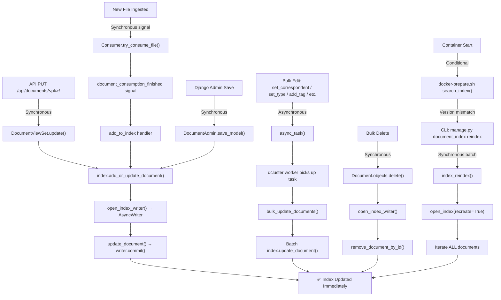
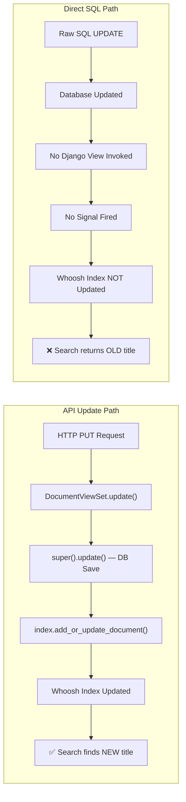
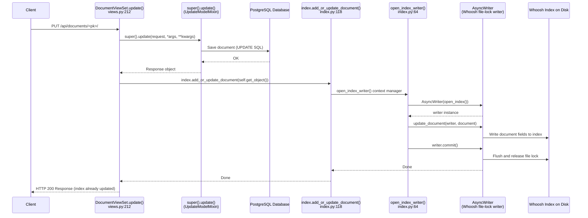

# Paperless-NGX Search Index Synchronization: Technical Investigation

## Overview

This document provides code-backed answers to five questions about how the Paperless-NGX Whoosh search index stays (or does not stay) synchronized with the database at runtime. Every answer is derived exclusively from source code analysis of the repository — no assumptions are made. Each answer traces a specific code path through identified source files with line number citations, and includes the rationale and reasoning chain behind the conclusion.

**Scope:** All answers reference the Python backend source code in `src/documents/` and the Docker infrastructure in `docker/`. The Angular frontend (`src-ui/`) is not analyzed as all five questions pertain to backend search index behavior.

**Audience:** Developers onboarding to the Paperless-NGX codebase who need to understand when and how the Whoosh search index is updated, and what happens when it is not.

---

## Architecture Context

Before diving into the specific questions, three foundational components must be understood: the Whoosh search engine, the Django-Q background task system, and the Django signal system for documents.

### Whoosh Full-Text Search Engine

Paperless-NGX uses the **Whoosh** pure-Python full-text search library (version ~2.7.4, per `Pipfile`). The Whoosh index lives on disk at `INDEX_DIR`, defined in `src/paperless/settings.py` line 73 as:

```python
INDEX_DIR = os.path.join(DATA_DIR, "index")
```

Source: `src/paperless/settings.py:73`

The index schema is defined in `src/documents/index.py`, function `get_schema()` (lines 31–49), with these fields:

| Field | Whoosh Type | Notes |
|-------|------------|-------|
| `id` | NUMERIC(stored=True, unique=True) | Primary key |
| `title` | TEXT(sortable=True) | Document title |
| `content` | TEXT | Full document text |
| `asn` | NUMERIC(sortable=True) | Archive serial number |
| `correspondent` | TEXT(sortable=True) | Correspondent name |
| `correspondent_id` | NUMERIC | Correspondent foreign key |
| `has_correspondent` | BOOLEAN | Filter flag |
| `tag` | KEYWORD(commas=True, scorable=True, lowercase=True) | Tag names |
| `tag_id` | KEYWORD(commas=True, scorable=True) | Tag IDs |
| `has_tag` | BOOLEAN | Filter flag |
| `type` | TEXT(sortable=True) | Document type name |
| `type_id` | NUMERIC | Document type foreign key |
| `has_type` | BOOLEAN | Filter flag |
| `created` | DATETIME(sortable=True) | Creation date |
| `modified` | DATETIME(sortable=True) | Last modified date |
| `added` | DATETIME(sortable=True) | Date added to system |

Source: `src/documents/index.py:31-49`

**CRITICAL CLARIFICATION:** The `AsyncWriter` imported on line 26 of `src/documents/index.py` (`from whoosh.writing import AsyncWriter`) is a **Whoosh concurrency mechanism** for safe concurrent writes via file locking. It is **NOT** an asynchronous/background-task mechanism. It operates synchronously within the calling thread. This distinction is critical for understanding all five answers in this document.

Source: `src/documents/index.py:26`

### Django-Q Background Task Workers

The `qcluster` process (Django-Q task worker) is one of three supervised processes in the Docker container, defined in `docker/supervisord.conf`:

| Process | Command | Line | Role |
|---------|---------|------|------|
| `gunicorn` | `gunicorn -c /usr/src/paperless/gunicorn.conf.py paperless.asgi:application` | 11 | ASGI web server |
| `consumer` | `python3 manage.py document_consumer` | 20 | Directory watcher for file ingestion |
| `scheduler` | `python3 manage.py qcluster` | 29 | Django-Q background task worker |

Source: `docker/supervisord.conf:10-35`

The Django-Q cluster configuration is in `src/paperless/settings.py` lines 449–457:

```python
Q_CLUSTER = {
    "name": "paperless",
    "catch_up": False,
    "recycle": 1,
    "retry": PAPERLESS_WORKER_RETRY,
    "timeout": PAPERLESS_WORKER_TIMEOUT,
    "workers": TASK_WORKERS,
    "redis": os.getenv("PAPERLESS_REDIS", "redis://localhost:6379"),
}
```

Source: `src/paperless/settings.py:449-457`

Tasks are dispatched to the `qcluster` worker via `async_task()` from `django_q.tasks` (imported in `src/documents/bulk_edit.py` line 4). This function enqueues a task to the Redis broker, which the `qcluster` worker picks up and executes.

### Django Signal System for Documents

Custom signals are defined in `src/documents/signals/__init__.py` (lines 1–5):

```python
document_consumption_started = Signal()
document_consumption_finished = Signal()
document_consumer_declaration = Signal()
```

Source: `src/documents/signals/__init__.py:1-5`

Signal handler registration happens in `src/documents/apps.py`, method `DocumentsConfig.ready()` (lines 11–27):

```python
def ready(self):
    from .signals import document_consumption_finished
    from .signals.handlers import (
        add_inbox_tags, set_log_entry, set_correspondent,
        set_document_type, set_tags, add_to_index,
    )
    document_consumption_finished.connect(add_inbox_tags)
    document_consumption_finished.connect(set_correspondent)
    document_consumption_finished.connect(set_document_type)
    document_consumption_finished.connect(set_tags)
    document_consumption_finished.connect(set_log_entry)
    document_consumption_finished.connect(add_to_index)
```

Source: `src/documents/apps.py:11-27`

**KEY FINDING:** The `add_to_index` handler is connected **ONLY** to `document_consumption_finished` (line 27). It is **NOT** connected to Django's built-in `post_save` signal. This means `add_to_index` only fires during initial document ingestion — not during API-driven updates.

The `update_filename_and_move_files` handler IS connected to both `m2m_changed` (line 310: `@receiver(models.signals.m2m_changed, sender=Document.tags.through)`) and `post_save` (line 311: `@receiver(models.signals.post_save, sender=Document)`) via decorators in `src/documents/signals/handlers.py`, but this handler only manages file renaming and moving — it does **NOT** update the Whoosh index.

Source: `src/documents/signals/handlers.py:310-312`

The `cleanup_document_deletion` handler is connected to `post_delete` (`src/documents/signals/handlers.py` line 233: `@receiver(models.signals.post_delete, sender=Document)`), and handles file cleanup on deletion — it also does **NOT** update the Whoosh index.

Source: `src/documents/signals/handlers.py:233-234`

---

## Q1: API Title Change and Search Visibility

### Question

When a document's title is changed through the REST API, does the updated title appear in Whoosh search results immediately within the same HTTP request cycle, or does a background worker process the index update asynchronously?

### Answer

The updated title appears in Whoosh search results **immediately within the same HTTP request cycle**. The index update is performed synchronously inside the API view — no background worker is involved.

### Rationale and Code-Path Trace

**Step 1 — The REST API endpoint.** The PUT endpoint for documents is handled by `DocumentViewSet.update()` in `src/documents/views.py` lines 212–217:

```python
def update(self, request, *args, **kwargs):
    response = super(DocumentViewSet, self).update(request, *args, **kwargs)
    from documents import index
    index.add_or_update_document(self.get_object())
    return response
```

Source: `src/documents/views.py:212-217`

The call to `super().update()` invokes Django REST Framework's `UpdateModelMixin.update()`, which validates the request data and saves the document to the database. Then — critically — `index.add_or_update_document()` is called on line 216 **before** `return response` on line 217. This means the index update happens within the HTTP request processing, not after it.

**Step 2 — The index update function.** `add_or_update_document()` is defined in `src/documents/index.py` lines 118–120:

```python
def add_or_update_document(document):
    with open_index_writer() as writer:
        update_document(writer, document)
```

Source: `src/documents/index.py:118-120`

**Step 3 — The index writer context manager.** `open_index_writer()` is defined in `src/documents/index.py` lines 64–74:

```python
@contextmanager
def open_index_writer(optimize=False):
    writer = AsyncWriter(open_index())
    try:
        yield writer
    except Exception as e:
        logger.exception(str(e))
        writer.cancel()
    finally:
        writer.commit(optimize=optimize)
```

Source: `src/documents/index.py:64-74`

The `AsyncWriter` created on line 66 is Whoosh's concurrency-safe writer — it uses file locking internally to allow safe concurrent writes. It is **not** an asynchronous background mechanism. The `writer.commit()` call on line 74 executes synchronously in the calling thread, flushing all changes to disk.

**Step 4 — The document update operation.** `update_document()` is defined in `src/documents/index.py` lines 87–107. It calls `writer.update_document()` with all document fields (title, content, correspondent, tags, type, dates, ASN, etc.).

Source: `src/documents/index.py:87-107`

**Conclusion:** By the time `return response` is reached on line 217 of `views.py`, the following has already happened synchronously within the same thread:
1. The document was saved to the database (`super().update()`)
2. The Whoosh index was opened (`open_index()`)
3. An `AsyncWriter` was created (file-locking concurrency writer)
4. The document's fields were written to the index (`update_document()`)
5. The writer was committed to disk (`writer.commit()`)

The updated title is therefore searchable immediately. No Django-Q task, no background worker, no asynchronous processing is involved.

### Source Citations

- `src/documents/views.py:212-217` — `DocumentViewSet.update()` method
- `src/documents/index.py:118-120` — `add_or_update_document()` function
- `src/documents/index.py:64-74` — `open_index_writer()` context manager
- `src/documents/index.py:87-107` — `update_document()` function
- `src/documents/index.py:26` — `AsyncWriter` import (Whoosh concurrency mechanism)

---

## Q2: Background Worker Behavior During API Updates

### Question

What happens in the Django-Q (`qcluster`) background task worker process when a document is modified via the API — does a task get enqueued, or does the index update complete entirely within the API request?

### Answer

The index update completes **entirely within the API request**. No Django-Q task is enqueued for single-document API updates. The `qcluster` worker is not involved in API-driven document modifications.

### Rationale and Code-Path Trace

To understand why the `qcluster` worker is not involved, we must contrast the API update path against other update paths that **do** use the worker.

#### Path A — Synchronous API Update (DocumentViewSet)

`DocumentViewSet.update()` (`src/documents/views.py:212-217`) directly calls `index.add_or_update_document()`. There is no `async_task()` call anywhere in this code path. The entire operation — database save, index open, document write, index commit — completes within the HTTP request handler thread.

Source: `src/documents/views.py:212-217`

Similarly, `DocumentViewSet.destroy()` (`src/documents/views.py:219-223`) directly calls `index.remove_document_from_index()` synchronously before delegating to `super().destroy()`:

```python
def destroy(self, request, *args, **kwargs):
    from documents import index
    index.remove_document_from_index(self.get_object())
    return super(DocumentViewSet, self).destroy(request, *args, **kwargs)
```

Source: `src/documents/views.py:219-223`

#### Path B — Asynchronous Bulk Edit Operations (CONTRAST)

All bulk operations in `src/documents/bulk_edit.py` **do** use `async_task()` to enqueue deferred index updates to the `qcluster` worker:

- `set_correspondent()` line 18: `async_task("documents.tasks.bulk_update_documents", document_ids=affected_docs)`
- `set_document_type()` line 31: same pattern
- `add_tag()` line 47: same pattern
- `remove_tag()` line 63: same pattern
- `modify_tags()` line 87: same pattern

Source: `src/documents/bulk_edit.py:18,31,47,63,87`

The target of these async tasks is `documents.tasks.bulk_update_documents` (`src/documents/tasks.py:270-280`), which iterates over the document IDs, fires `post_save` signals for file renaming, and batch-updates the Whoosh index:

```python
def bulk_update_documents(document_ids):
    documents = Document.objects.filter(id__in=document_ids)
    ix = index.open_index()
    for doc in documents:
        post_save.send(Document, instance=doc, created=False)
    with AsyncWriter(ix) as writer:
        for doc in documents:
            index.update_document(writer, doc)
```

Source: `src/documents/tasks.py:270-280`

The one exception is the `delete()` function (`src/documents/bulk_edit.py:92-101`), which synchronously deletes documents from the database and then synchronously removes them from the index — it does NOT use `async_task`.

Source: `src/documents/bulk_edit.py:92-101`

#### Path C — Signal-Driven Indexing During Document Consumption (CONTRAST)

When a new document is ingested via the consumption pipeline, `Consumer.try_consume_file()` (`src/documents/consumer.py:306-311`) fires the `document_consumption_finished` signal:

```python
document_consumption_finished.send(
    sender=self.__class__,
    document=document,
    logging_group=self.logging_group,
    classifier=classifier,
)
```

Source: `src/documents/consumer.py:306-311`

The `add_to_index` handler (`src/documents/signals/handlers.py:428-431`) is connected to this signal (`src/documents/apps.py:27`) and calls `index.add_or_update_document()`. This handler is ONLY connected to `document_consumption_finished` — NOT to `post_save`. Therefore, it only fires during initial document ingestion, not during API-driven updates.

Source: `src/documents/signals/handlers.py:428-431`, `src/documents/apps.py:27`

#### Path D — Django Admin (CONTRAST)

`DocumentAdmin.save_model()` (`src/documents/admin.py:85-89`) directly calls `index.add_or_update_document(obj)` synchronously, but with a notable ordering difference from the API path: the index update occurs **before** the database save (`super().save_model()` at line 89), whereas in the API path (`views.py:212-217`) the database save (`super().update()`) happens **first** and the index update follows. This means that if the database save fails in the admin path, the Whoosh index would temporarily contain data that was never persisted. `DocumentAdmin.delete_model()` (`src/documents/admin.py:79-83`) calls `index.remove_document_from_index(obj)` synchronously. `DocumentAdmin.delete_queryset()` (`src/documents/admin.py:70-77`) opens a writer and removes all documents from the index in a batch.

Source: `src/documents/admin.py:70-89`

### All Index Update Code Paths — Flowchart



### Source Citations

- `src/documents/views.py:212-217` — Synchronous API update path
- `src/documents/views.py:219-223` — Synchronous API delete path
- `src/documents/bulk_edit.py:18,31,47,63,87` — Async bulk edit paths
- `src/documents/bulk_edit.py:92-101` — Synchronous bulk delete
- `src/documents/tasks.py:270-280` — `bulk_update_documents()` task
- `src/documents/consumer.py:306-311` — Consumption signal emission
- `src/documents/signals/handlers.py:428-431` — `add_to_index` handler
- `src/documents/apps.py:27` — Signal registration
- `src/documents/admin.py:70-89` — Admin index operations

---

## Q3: Direct SQL Modification and Index Staleness

### Question

If a document's title is changed directly in the database via raw SQL (bypassing Django ORM signals), does the search index remain stale? Can the document be found by the new title?

### Answer

Yes, the search index remains **stale**. The document **cannot** be found by the new title — only by the old title that was last written to the Whoosh index.

### Rationale and Code-Path Trace

To understand why raw SQL changes leave the index stale, we must examine every mechanism that can trigger a Whoosh index update and verify that raw SQL bypasses all of them.

**Bypass Point 1 — Django signal bypass.** Raw SQL bypasses the Django ORM entirely. Django's `post_save` signal — which `update_filename_and_move_files` listens to (`src/documents/signals/handlers.py:311`) — will NOT fire. However, even if it did fire, `update_filename_and_move_files` only handles file renaming and moving. It does **not** update the Whoosh index.

Source: `src/documents/signals/handlers.py:310-312`

**Bypass Point 2 — Explicit view-level index call bypass.** The `DocumentViewSet.update()` method (`src/documents/views.py:216`) contains an explicit call to `index.add_or_update_document()`. This call exists in the Django view code, not in a signal handler. Raw SQL operations do not go through Django views, so this call is never reached.

Source: `src/documents/views.py:216`

**Bypass Point 3 — No `post_save` → index connection.** The `add_to_index` handler (`src/documents/signals/handlers.py:428-431`) is connected **ONLY** to `document_consumption_finished` (`src/documents/apps.py:27`), **NOT** to `post_save`. Even if a `post_save` signal somehow fired (which it does not for raw SQL), it would not trigger any index updating.

Source: `src/documents/apps.py:27`, `src/documents/signals/handlers.py:428-431`

**Bypass Point 4 — No automatic periodic reconciliation.** There is no background job, cron task, or periodic timer that compares the database state with the Whoosh index state. The only automatic reconciliation happens at container startup (see Q4).

**Complete list of index update triggers — all bypassed by raw SQL:**

| Trigger | How It Updates the Index | Bypassed by Raw SQL? |
|---------|--------------------------|---------------------|
| `DocumentViewSet.update()` | Explicit `index.add_or_update_document()` call | ✅ Yes — raw SQL skips Django views |
| `DocumentViewSet.destroy()` | Explicit `index.remove_document_from_index()` call | ✅ Yes — raw SQL skips Django views |
| `document_consumption_finished` signal | `add_to_index` handler calls `index.add_or_update_document()` | ✅ Yes — raw SQL skips Django signals |
| Bulk edit `async_task` | `bulk_update_documents()` task | ✅ Yes — raw SQL skips bulk edit API |
| `DocumentAdmin.save_model()` | Explicit `index.add_or_update_document()` call | ✅ Yes — raw SQL skips Django admin |
| `manage.py document_index reindex` | Full index rebuild | ❌ No — this is a manual recovery mechanism |
| `docker-prepare.sh search_index()` | Conditional full reindex on startup | ❌ No — this is an automatic startup check |

**Conclusion:** Raw SQL bypasses every automatic index update path. The Whoosh index retains the old title until one of the two recovery mechanisms (manual reindex or container restart) is invoked.

### API vs. Direct SQL Comparison



### Source Citations

- `src/documents/views.py:212-217` — Explicit index update in API view
- `src/documents/signals/handlers.py:310-312` — `post_save` handler (file moves only, not index)
- `src/documents/signals/handlers.py:428-431` — `add_to_index` handler
- `src/documents/apps.py:27` — `add_to_index` connected only to `document_consumption_finished`
- `src/documents/admin.py:85-89` — Admin save with explicit index update

---

## Q4: Forced Index Reconciliation

### Question

Is there a mechanism to force the system to reconcile the Whoosh index with the current database state, and what observable effect does this have on the worker logs and task queue?

### Answer

Yes. The `manage.py document_index reindex` management command forces a full reconciliation by destroying and rebuilding the entire Whoosh index from all database records. Additionally, the `docker-prepare.sh` startup script performs an automatic conditional reindex when the index version sentinel file is missing or outdated.

### Rationale and Code-Path Trace

#### Mechanism 1 — CLI Management Command

The CLI command is defined in `src/documents/management/commands/document_index.py` lines 20–25:

```python
def handle(self, *args, **options):
    with transaction.atomic():
        if options["command"] == "reindex":
            index_reindex(progress_bar_disable=options["no_progress_bar"])
        elif options["command"] == "optimize":
            index_optimize()
```

Source: `src/documents/management/commands/document_index.py:20-25`

The command supports two subcommands: `reindex` (full rebuild) and `optimize` (segment merging). Both run within a database transaction via `transaction.atomic()`.

**The reindex function** is `index_reindex()` in `src/documents/tasks.py` lines 38–45:

```python
def index_reindex(progress_bar_disable=False):
    documents = Document.objects.all()
    ix = index.open_index(recreate=True)
    with AsyncWriter(ix) as writer:
        for document in tqdm.tqdm(documents, disable=progress_bar_disable):
            index.update_document(writer, document)
```

Source: `src/documents/tasks.py:38-45`

This function:
1. Fetches **ALL** `Document` objects from the database.
2. Calls `open_index(recreate=True)` — when `recreate=True`, `open_index()` in `src/documents/index.py:52-61` skips the `exists_in()` check and falls through to `create_in()`, which creates a fresh empty index with the correct schema.
3. Iterates through every document, calling `update_document()` for each one.
4. Uses `tqdm` for an optional progress bar.

**The optimize function** is `index_optimize()` in `src/documents/tasks.py` lines 32–35:

```python
def index_optimize():
    ix = index.open_index()
    writer = AsyncWriter(ix)
    writer.commit(optimize=True)
```

Source: `src/documents/tasks.py:32-35`

This opens the existing index and commits with `optimize=True` to merge Whoosh segments. It does NOT rebuild content — it only defragments the index files.

**Observable effects of `manage.py document_index reindex`:**
- **Console output:** A `tqdm` progress bar showing document-by-document reindexing (unless `--no-progress-bar` is passed).
- **Log output:** Any errors during `open_index()` would be logged via `logger.exception()` (`src/documents/index.py:57`).
- **No Django-Q task queue involvement:** The reindex runs synchronously within the management command process. No `async_task()` is called. The `qcluster` worker is not involved.
- **After completion:** Any SQL-only changes, missing documents, or stale entries are reconciled because the entire index is rebuilt from the current database state.

#### Mechanism 2 — Startup Reconciliation

The `search_index()` function in `docker/docker-prepare.sh` lines 49–58 provides automatic reconciliation on container startup:

```bash
search_index() {
    index_version=1
    index_version_file=/usr/src/paperless/data/.index_version
    if [[ (! -f "$index_version_file") || $(<$index_version_file) != "$index_version" ]]; then
        echo "Search index out of date. Updating..."
        python3 manage.py document_index reindex
        echo $index_version | tee $index_version_file >/dev/null
    fi
}
```

Source: `docker/docker-prepare.sh:49-58`

On every container start:
1. Checks if the `.index_version` sentinel file exists and matches the expected version (currently `1`).
2. If missing or outdated → runs `manage.py document_index reindex`.
3. Writes the current version to the sentinel file after successful reindex.

This runs during `docker-prepare.sh`'s `do_work()` flow (line 75), which executes **before** supervisord starts `gunicorn`, `consumer`, and `qcluster`. The observable effect is a console message: `"Search index out of date. Updating..."` followed by the reindex progress.

Source: `docker/docker-prepare.sh:66-81`

### Source Citations

- `src/documents/management/commands/document_index.py:20-25` — CLI command handler
- `src/documents/tasks.py:38-45` — `index_reindex()` function
- `src/documents/tasks.py:32-35` — `index_optimize()` function
- `src/documents/index.py:52-61` — `open_index(recreate=True)` behavior
- `src/documents/index.py:57` — Exception logging during index open
- `docker/docker-prepare.sh:49-58` — Startup index version check
- `docker/docker-prepare.sh:66-81` — `do_work()` execution flow

---

## Q5: Index Corruption and Self-Healing

### Question

If the Whoosh index files are deleted or corrupted while documents exist in the database, what recovery mechanism exists, how long does reconstruction take for a small document set, and can the system self-heal or is manual intervention required?

### Answer

Recovery mechanisms exist at two levels: (1) the `open_index()` function's exception handler provides **partial automatic recovery** by creating a new empty index at runtime, and (2) the `docker-prepare.sh` startup script provides **full recovery** by triggering a complete reindex on container restart. For a small document set (fewer than ~100 documents), reconstruction takes seconds. The system **partially** self-heals — a corrupted index is auto-replaced with an empty one at runtime (preventing crashes), but full content repopulation requires either a container restart or manual `manage.py document_index reindex`.

### Rationale and Code-Path Trace

#### Mechanism 1 — Runtime Exception Handling (`open_index()`)

The `open_index()` function in `src/documents/index.py` lines 52–61 contains an exception handler that catches corruption:

```python
def open_index(recreate=False):
    try:
        if exists_in(settings.INDEX_DIR) and not recreate:
            return open_dir(settings.INDEX_DIR, schema=get_schema())
    except Exception:
        logger.exception("Error while opening the index, recreating.")
    if not os.path.isdir(settings.INDEX_DIR):
        os.makedirs(settings.INDEX_DIR, exist_ok=True)
    return create_in(settings.INDEX_DIR, get_schema())
```

Source: `src/documents/index.py:52-61`

**How it works:**
- If `exists_in()` or `open_dir()` throws ANY exception (corrupted segment files, missing metadata, I/O errors, etc.), the exception is caught and logged via `logger.exception()`.
- The code falls through to `create_in()`, which creates a brand new empty index with the correct schema.
- If the index directory itself has been deleted, `os.makedirs()` on line 60 recreates the directory before `create_in()` is called.

**CRITICAL LIMITATION:** This creates an **EMPTY** index. Existing documents in the database will NOT appear in search results until they are individually re-indexed. The system gracefully degrades (no crash, no 500 error) but search results will be incomplete or empty.

**What this means at runtime:**
- If the index is corrupted while the application is running, the next search or index write operation triggers `open_index()`, which detects the corruption, logs the error, and creates a fresh empty index.
- Search results will be empty until documents are re-added to the index.
- New document consumption WILL add new documents to the index (via the `add_to_index` handler connected to `document_consumption_finished`).
- API updates to existing documents WILL add those specific documents back to the index (via `DocumentViewSet.update()` → `add_or_update_document()`), but only for documents that are explicitly updated by a user.
- Documents that are not individually touched remain invisible to search.

#### Mechanism 2 — Startup Recovery (`docker-prepare.sh`)

The `search_index()` function in `docker/docker-prepare.sh` lines 49–58 (detailed in Q4) checks the `.index_version` sentinel file on every container start.

Source: `docker/docker-prepare.sh:49-58`

If the sentinel file is missing — which happens if the data volume is cleaned or the index directory is deleted — the version check fails (`(! -f "$index_version_file")` evaluates to true). This triggers `python3 manage.py document_index reindex`, which performs a **FULL rebuild** of the index from all database records via `index_reindex()` (`src/documents/tasks.py:38-45`).

**Important nuance:** If only the index files within `INDEX_DIR` are corrupted or deleted but the `.index_version` sentinel file (located at `/usr/src/paperless/data/.index_version`, outside the index directory) is still intact with the correct version, the startup script will NOT trigger a reindex. In this scenario, the runtime `open_index()` exception handler (Mechanism 1) will create an empty index, but full recovery requires manual intervention via `manage.py document_index reindex`.

#### Mechanism 3 — Manual Recovery

An administrator can run `manage.py document_index reindex` at any time to force a full rebuild. This is the most reliable and fastest path to recovery without waiting for a container restart or relying on the sentinel file being absent.

#### Reconstruction Time

For a small document set (e.g., fewer than 100 documents), reconstruction is nearly instantaneous — typically completing in seconds. The `index_reindex()` function iterates over `Document.objects.all()` and calls `update_document()` for each document. Each `update_document()` call (`src/documents/index.py:87-107`) writes a single document's fields to the Whoosh index and fetches related objects:

```python
tags = ",".join([t.name for t in doc.tags.all()])
tags_ids = ",".join([str(t.id) for t in doc.tags.all()])
```

Source: `src/documents/index.py:88-89`

The primary bottleneck is disk I/O (writing to the Whoosh index files) and database queries for each document's tag and correspondent relationships. For large document sets (thousands of documents), the time scales linearly. The `tqdm` progress bar provides real-time visibility into progress.

#### Self-Healing Assessment Summary

| Recovery Level | Mechanism | Trigger | Result | Human Intervention? |
|---------------|-----------|---------|--------|-------------------|
| **Partial (Runtime)** | `open_index()` exception handler | Corrupted index detected during read/write | Empty index created — no crash, but search is empty | No — automatic, but incomplete |
| **Full (Restart)** | `docker-prepare.sh` `search_index()` | Container restart with missing/outdated sentinel file | Complete index rebuilt from all database records | No — automatic on restart (if sentinel is missing) |
| **Full (Manual)** | `manage.py document_index reindex` | Administrator runs command | Complete index rebuilt from all database records | Yes — requires CLI access |

**Bottom line:** The system is NOT fully self-healing at runtime. If the index is corrupted mid-operation, the system degrades gracefully (empty search results, no crashes) but does NOT automatically initiate a full reindex. A container restart (which may or may not trigger reindex depending on the sentinel file) or a manual `manage.py document_index reindex` command is required for complete recovery.

### Source Citations

- `src/documents/index.py:52-61` — `open_index()` exception handler and index recreation
- `src/documents/index.py:59-60` — Directory recreation for deleted index
- `src/documents/index.py:87-107` — `update_document()` with tag/correspondent queries
- `src/documents/tasks.py:38-45` — `index_reindex()` full rebuild
- `docker/docker-prepare.sh:49-58` — Startup index version check
- `src/documents/signals/handlers.py:428-431` — `add_to_index` for new consumption
- `src/documents/views.py:212-217` — API update re-adds individual documents

---

## Summary

### Findings Summary

| Question | Answer Summary | Sync/Async | Worker Involved | Index Update Mechanism |
|----------|---------------|------------|-----------------|----------------------|
| **Q1: API Title Change** | Title searchable immediately within same HTTP request | Synchronous | None | `DocumentViewSet.update()` → `index.add_or_update_document()` |
| **Q2: Worker Behavior** | No Django-Q task enqueued for API updates | Synchronous | None (contrast: `bulk_edit` uses `async_task`) | Direct call in view code |
| **Q3: Raw SQL Bypass** | Index remains stale, document not findable by new title | N/A | N/A | No mechanism triggered — all update paths bypassed |
| **Q4: Forced Reconciliation** | `manage.py document_index reindex` rebuilds entire index | Synchronous (CLI) | None | `index_reindex()` → `open_index(recreate=True)` + iterate all docs |
| **Q5: Corruption Recovery** | Empty index created at runtime; full recovery on restart or manual reindex | Partial auto / Manual | None | `open_index()` exception handler + `docker-prepare.sh` startup check |

### All Discovered Index Update Code Paths

| Code Path | Trigger | Sync/Async | Source File | Key Line(s) |
|-----------|---------|------------|-------------|-------------|
| API Document Update | `PUT /api/documents/<pk>/` | Synchronous | `src/documents/views.py` | 212–217 |
| API Document Delete | `DELETE /api/documents/<pk>/` | Synchronous | `src/documents/views.py` | 219–223 |
| Document Consumption | New file ingested via consumer | Synchronous (signal) | `src/documents/signals/handlers.py` | 428–431 |
| Bulk Edit Operations | Bulk correspondent/type/tag change | Asynchronous (`async_task`) | `src/documents/bulk_edit.py` | 18, 31, 47, 63, 87 |
| Bulk Delete | Bulk document deletion | Synchronous | `src/documents/bulk_edit.py` | 92–101 |
| Django Admin Save | Admin panel document save | Synchronous | `src/documents/admin.py` | 85–89 |
| Django Admin Delete (single) | Admin panel single delete | Synchronous | `src/documents/admin.py` | 79–83 |
| Django Admin Delete (batch) | Admin panel batch delete | Synchronous | `src/documents/admin.py` | 70–77 |
| CLI Full Reindex | `manage.py document_index reindex` | Synchronous (batch) | `src/documents/tasks.py` | 38–45 |
| CLI Optimize | `manage.py document_index optimize` | Synchronous | `src/documents/tasks.py` | 32–35 |
| Container Startup Check | Docker container start | Synchronous (batch, conditional) | `docker/docker-prepare.sh` | 49–58 |

### API Update Sequence Diagram


