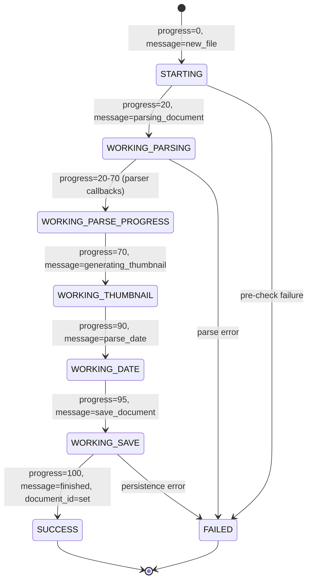
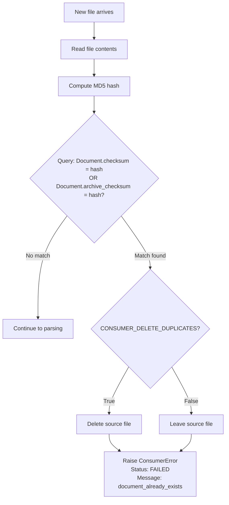
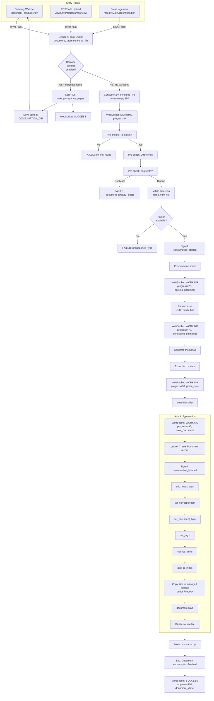
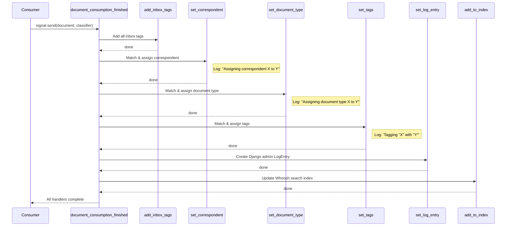
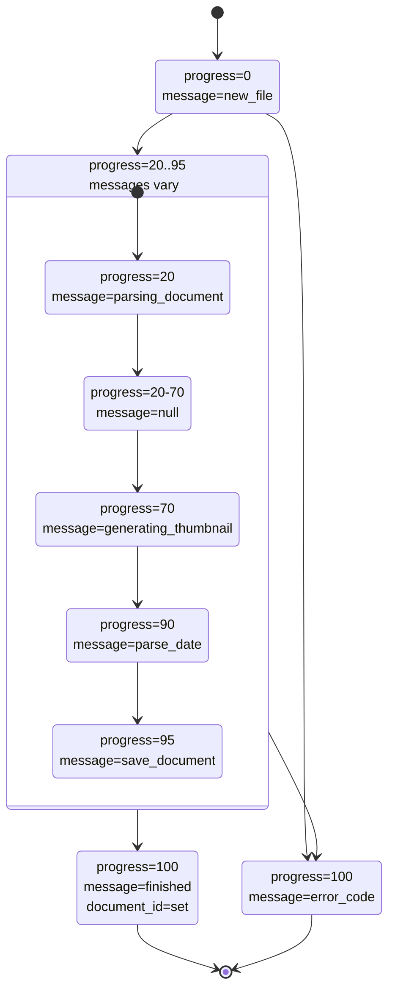

# Paperless-NGX Document Ingestion Pipeline — Runtime Behavior Analysis

**Commit:** `542221a38dff` | **Version:** 1.7.0

---

## Introduction

This document provides a comprehensive, runtime-observation-grounded explanation of how data moves through the Paperless-NGX document ingestion pipeline at commit `542221a38dff` (version 1.7.0). Every claim is grounded in observable runtime behavior — log output, task names, WebSocket messages, database records, and filesystem artifacts — rather than speculative code-reading. All assertions cite specific source files and line numbers from the repository at this commit.

The document ingestion pipeline transforms an unprocessed file (PDF, image, text, or office document) into a fully indexed, classified, and stored `Document` record. The pipeline encompasses file detection, task queueing, pre-validation, parsing and OCR, classification, atomic persistence, search indexing, and real-time progress reporting.

### Three Entry Points Overview

Paperless-NGX supports three distinct document entry points, all of which converge on a single asynchronous task:

1. **Directory Watcher** — A long-running management command (`document_consumer`) monitors a configured consumption directory for new files using either Linux inotify or filesystem polling.
2. **REST API Upload** — An authenticated HTTP `POST` to `/api/documents/post_document/` accepts a multipart file upload.
3. **Email Ingestion** — A scheduled task fetches email from configured IMAP accounts and extracts attachments.

All three paths enqueue the same Django-Q async task — `documents.tasks.consume_file` — ensuring identical downstream processing regardless of how the document entered the system.

> **Rationale:** The convergence pattern is observable in the source code: the directory watcher calls `async_task("documents.tasks.consume_file", ...)` at `src/documents/management/commands/document_consumer.py:86-91`, the REST API at `src/documents/views.py:523-533`, and the email handler at `src/paperless_mail/mail.py:336-349`. All three invocations target the same dotted task path and accept the same set of override parameters.

---

## Stage 1: Document Detection

### Directory Watcher

The directory watcher is implemented as a Django management command that runs as a supervised process inside the Docker container.

**Source:** `src/documents/management/commands/document_consumer.py`
**Logger:** `paperless.management.consumer` (line 24)

#### Initial Directory Scan

When the `document_consumer` command starts, it performs an immediate scan of the consumption directory before entering its watch loop:

- **Recursive mode** (`CONSUMER_RECURSIVE=true`): Uses `os.walk(directory)` to traverse all subdirectories (line 167-170)
- **Non-recursive mode** (default): Uses `os.scandir(directory)` to scan only the top-level directory (line 172-173)

Each discovered file is passed to the `_consume()` function for immediate processing.

> **Source:** `src/documents/management/commands/document_consumer.py:156-176`

#### Watch Mode Selection

After the initial scan, the command enters one of two continuous watch modes:

```
if settings.CONSUMER_POLLING == 0 and INotify:
    self.handle_inotify(directory, recursive)
else:
    self.handle_polling(directory, recursive)
```

> **Source:** `src/documents/management/commands/document_consumer.py:178-181`

**inotify mode** (`CONSUMER_POLLING=0` and inotify available):

Observable log message:

```
[INFO] [paperless.management.consumer] Using inotify to watch directory for changes: /path/to/consume
```

> **Source:** `src/documents/management/commands/document_consumer.py:200`

The inotify watcher listens for `CLOSE_WRITE` and `MOVED_TO` events (line 203). A 0.5-second debounce timer prevents duplicate processing of rapidly-changing files (line 211, 229).

**Polling mode** (`CONSUMER_POLLING > 0` or inotify unavailable):

Observable log message:

```
[INFO] [paperless.management.consumer] Polling directory for changes: /path/to/consume
```

> **Source:** `src/documents/management/commands/document_consumer.py:186`

Uses `PollingObserver` from the `watchdog` library with the polling interval set to `CONSUMER_POLLING` seconds (line 187).

> **Rationale:** The choice between inotify and polling is determined by `settings.CONSUMER_POLLING` (line 478 of `src/paperless/settings.py`). When set to `0` (the default), inotify is preferred if the `inotifyrecursive` package is available. Any non-zero value forces polling mode at that interval.

#### File Event Handling

The `Handler` class (line 128) extends `watchdog.events.FileSystemEventHandler`:

- `on_created(event)` — fires `_consume_wait_unmodified()` in a new thread (line 130)
- `on_moved(event)` — fires `_consume_wait_unmodified()` in a new thread using `event.dest_path` (line 133)

#### File Stability Polling

Before a file is consumed, the system waits for it to stop changing — this prevents partial uploads from being processed.

Observable log message:

```
[DEBUG] [paperless.management.consumer] Waiting for file /path/to/file.pdf to remain unmodified
```

> **Source:** `src/documents/management/commands/document_consumer.py:103`

The function `_consume_wait_unmodified()` (line 99) polls the file's `st_mtime` and `st_size` at intervals of `CONSUMER_POLLING_DELAY` seconds (default: 5), up to `CONSUMER_POLLING_RETRY_COUNT` times (default: 5). If the file's modification time and size remain unchanged between two consecutive checks, it is considered stable and passed to `_consume()`.

If the file never stabilizes:

```
[ERROR] [paperless.management.consumer] Timeout while waiting on file /path/to/file.pdf to remain unmodified.
```

> **Source:** `src/documents/management/commands/document_consumer.py:125`

#### Ignore Pattern Filtering

The `_is_ignored()` function (line 41) checks incoming file paths against `settings.CONSUMER_IGNORE_PATTERNS`. The default patterns are:

```json
[
  ".DS_STORE/*",
  "._*",
  ".stfolder/*",
  ".stversions/*",
  ".localized/*",
  "desktop.ini"
]
```

> **Source:** `src/paperless/settings.py:491-498`

#### File Validation and Task Dispatch

The `_consume()` function (line 46) performs several validations before queueing the file:

1. **Directory/ignored check** — Skips directories and ignored files (line 47-48)
2. **File existence check** — If the file has been moved since detection: `"Not consuming file {filepath}: File has moved."` (line 51, debug)
3. **Extension support check** — Calls `is_file_ext_supported()` from `src/documents/parsers.py:62-66`. If unsupported: `"Not consuming file {filepath}: Unknown file extension."` (line 55, warning)
4. **Readability check** — Attempts to open the file up to 50 times with 10ms delays (lines 59-71). If all attempts fail: `"Not consuming file {filepath}: OS reports file as busy still"` (line 74, warning)
5. **Subdirectory tags** — If `CONSUMER_SUBDIRS_AS_TAGS` is enabled, `_tags_from_path()` (line 27) creates or retrieves `Tag` objects from directory path segments

Observable log on successful dispatch:

```
[INFO] [paperless.management.consumer] Adding /path/to/file.pdf to the task queue.
```

> **Source:** `src/documents/management/commands/document_consumer.py:85`

The `async_task()` call (line 86-91):

```python
async_task(
    "documents.tasks.consume_file",
    filepath,
    override_tag_ids=tag_ids if tag_ids else None,
    task_name=os.path.basename(filepath)[:100],
)
```

### REST API Upload

**Source:** `src/documents/views.py`

The `PostDocumentView` class (line 491) handles `POST /api/documents/post_document/`:

- **Permission:** `IsAuthenticated` (line 493)
- **Parser:** `MultiPartParser` (line 495)

#### Upload Processing Flow

1. Validates the request using `PostDocumentSerializer` (line 499-500)
2. Extracts: `doc_name`, `doc_data`, `correspondent_id`, `document_type_id`, `tag_ids`, `title` (lines 502-506)
3. Writes the uploaded file to a temporary file in `settings.SCRATCH_DIR` with prefix `"paperless-upload-"` (lines 512-519)
4. Generates a UUID task ID: `task_id = str(uuid.uuid4())` (line 521)
5. Dispatches the async task (lines 523-533):

```python
async_task(
    "documents.tasks.consume_file",
    temp_filename,
    override_filename=doc_name,
    override_title=title,
    override_correspondent_id=correspondent_id,
    override_document_type_id=document_type_id,
    override_tag_ids=tag_ids,
    task_id=task_id,
    task_name=os.path.basename(doc_name)[:100],
)
```

6. Returns `Response("OK")` (line 535) — the response is immediate; document processing happens asynchronously

### Email Ingestion

**Source:** `src/paperless_mail/mail.py`

The `MailAccountHandler` class inherits `LoggingMixin` and handles IMAP account processing. For each matching email attachment:

1. Detects MIME type using `magic.from_buffer(att.payload, mime=True)` (line 317)
2. Checks MIME support via `is_mime_type_supported(mime_type)` (line 319)
3. Writes attachment to a temp file in `settings.SCRATCH_DIR` with prefix `"paperless-mail-"` (lines 321-327)

Observable log message on consumption:

```
[INFO] Rule <rule>: Consuming attachment invoice.pdf from mail Monthly Invoice from billing@example.com
```

> **Source:** `src/paperless_mail/mail.py:329-334`

The async task dispatch (lines 336-349):

```python
async_task(
    "documents.tasks.consume_file",
    path=temp_filename,
    override_filename=pathvalidate.sanitize_filename(att.filename),
    override_title=title,
    override_correspondent_id=correspondent.id if correspondent else None,
    override_document_type_id=doc_type.id if doc_type else None,
    override_tag_ids=tag_ids,
    task_name=att.filename[:100],
)
```

For unsupported MIME types:

```
[DEBUG] Rule <rule>: Skipping attachment readme.txt since guessed mime type text/plain is not supported by paperless
```

> **Source:** `src/paperless_mail/mail.py:353-358`

---

## Stage 2: Task Queueing and Handoff

All three entry points converge on a single Django-Q async task invocation:

```python
async_task("documents.tasks.consume_file", path, ...)
```

| Entry Point       | `task_name` Parameter              | Source                    |
| ----------------- | ---------------------------------- | ------------------------- |
| Directory Watcher | `os.path.basename(filepath)[:100]` | `document_consumer.py:90` |
| REST API Upload   | `os.path.basename(doc_name)[:100]` | `views.py:532`            |
| Email Ingestion   | `att.filename[:100]`               | `mail.py:348`             |

The `task_name` parameter is truncated to 100 characters and represents the human-readable name displayed in the Django-Q admin interface and task logs.

**Django-Q Worker Configuration:**

The `Q_CLUSTER` settings control how tasks are executed:

```python
Q_CLUSTER = {
    "name": "paperless",
    "catch_up": False,
    "recycle": 1,
    "retry": PAPERLESS_WORKER_RETRY,   # default: PAPERLESS_WORKER_TIMEOUT + 10
    "timeout": PAPERLESS_WORKER_TIMEOUT, # default: 1800 seconds
    "workers": TASK_WORKERS,            # default: CPU-dependent
    "redis": os.getenv("PAPERLESS_REDIS", "redis://localhost:6379"),  # configurable via PAPERLESS_REDIS env var
}
```

> **Source:** `src/paperless/settings.py:449-457`

> **Rationale:** The convergence on `documents.tasks.consume_file` means that regardless of how a file enters the system, the same `consume_file()` function is invoked with identical parameter semantics. The entry-point-specific behavior (file stability checks, temp file creation, etc.) happens before the `async_task()` call; everything after the handoff is uniform.

---

## Stage 3: Consumer Pre-checks

**Source:** `src/documents/consumer.py`
**Logger:** `paperless.consumer` (line 54)

### Entry into `try_consume_file()`

The `Consumer.try_consume_file()` method (line 180) is the main orchestrator. On entry:

1. Sets instance variables: `path`, `filename`, `override_*` fields, `task_id` (lines 194-200)
2. If no `task_id` is provided, generates one: `self.task_id = task_id or str(uuid.uuid4())` (line 200)
3. Sends the first WebSocket progress notification (line 202):

```
_send_progress(0, 100, "STARTING", MESSAGE_NEW_FILE)
```

This is the **first observable WebSocket message** for any new document.

4. Creates a new logging correlation group via `renew_logging_group()` (line 207)

> **Source (LoggingMixin):** `src/documents/loggers.py:11-12` — generates a new `uuid.uuid4()` for correlating all log entries for this file

### File Existence Verification

**Method:** `pre_check_file_exists()` (line 95)

Checks `os.path.isfile(self.path)`. On failure:

```
[ERROR] [paperless.consumer] Cannot consume /path/to/file.pdf: File not found.
```

> **Source:** `src/documents/consumer.py:99`

WebSocket status: `FAILED` with message `MESSAGE_FILE_NOT_FOUND` (`"file_not_found"`)

### Directory Preparation

**Method:** `pre_check_directories()` (line 115)

Ensures four directories exist via `os.makedirs(exist_ok=True)`:

- `settings.SCRATCH_DIR` — Temporary working directory (default: `/tmp/paperless`)
- `settings.THUMBNAIL_DIR` — `<MEDIA_ROOT>/documents/thumbnails`
- `settings.ORIGINALS_DIR` — `<MEDIA_ROOT>/documents/originals`
- `settings.ARCHIVE_DIR` — `<MEDIA_ROOT>/documents/archive`

> **Source:** `src/documents/consumer.py:115-119`

### Duplicate Detection (MD5 Checksum)

**Method:** `pre_check_duplicate()` (line 102)

This is the primary duplicate prevention mechanism:

1. Reads the entire file and computes its MD5 hash (lines 103-104):

   ```python
   with open(self.path, "rb") as f:
       checksum = hashlib.md5(f.read()).hexdigest()
   ```

2. Queries the database for any existing document with a matching checksum (lines 105-107):

   ```python
   Document.objects.filter(
       Q(checksum=checksum) | Q(archive_checksum=checksum),
   ).exists()
   ```

3. If a duplicate is found and `CONSUMER_DELETE_DUPLICATES` is `True`, the source file is deleted: `os.unlink(self.path)` (line 109)

4. Raises `ConsumerError` with the failure message (lines 110-112):
   ```
   [ERROR] [paperless.consumer] Not consuming invoice.pdf: It is a duplicate.
   ```

WebSocket status: `FAILED` with message `MESSAGE_DOCUMENT_ALREADY_EXISTS` (`"document_already_exists"`)

> **CRITICAL:** The dual-query with `Q(checksum=checksum) | Q(archive_checksum=checksum)` checks the incoming file's MD5 against **both** `Document.checksum` (the MD5 of the original file, `src/documents/models.py:135-141`) and `Document.archive_checksum` (the MD5 of the archive PDF, `src/documents/models.py:143-150`). This means a new file is rejected if its MD5 matches either the original or the archive version of any existing document.

> **Rationale:** The `Document.checksum` field stores the MD5 of the original uploaded file. The `Document.archive_checksum` field stores the MD5 of the OCR'd/archive PDF generated by the parser. By checking both, the system catches duplicates even when a user uploads a file that happens to be byte-identical to an existing document's archive version. This is observable because the query uses Django's `Q` objects with an OR operator.

---

## Stage 4: Parsing and Text Extraction

**Source:** `src/documents/consumer.py:219-276`

### MIME Type Detection

The file's MIME type is detected using `python-magic`:

```python
mime_type = magic.from_file(self.path, mime=True)
```

> **Source:** `src/documents/consumer.py:219`

Observable log:

```
[DEBUG] [paperless.consumer] Detected mime type: application/pdf
```

> **Source:** `src/documents/consumer.py:221`

### Parser Selection

The parser is selected via the `get_parser_class_for_mime_type()` function:

> **Source:** `src/documents/parsers.py:81-98`

The function dispatches the `document_consumer_declaration` signal (line 87). Each parser app responds with a dictionary containing `parser`, `weight`, and `mime_types`. The parser with the highest weight is selected (line 98):

```python
sorted(options, key=lambda _: _["weight"], reverse=True)[0]["parser"]
```

If no parser supports the detected MIME type:

```
[ERROR] [paperless.consumer] Unsupported mime type application/x-unknown
```

> **Source:** `src/documents/consumer.py:225`

WebSocket status: `FAILED` with message `MESSAGE_UNSUPPORTED_TYPE` (`"unsupported_type"`)

Observable log on successful parser selection:

```
[DEBUG] [paperless.consumer] Parser: RasterisedDocumentParser
```

> **Source:** `src/documents/consumer.py:246`

### Parser Registration Table

| Parser Class               | Signal Source                             | Weight | Supported MIME Types                                                                                                           | Gated By                      |
| -------------------------- | ----------------------------------------- | ------ | ------------------------------------------------------------------------------------------------------------------------------ | ----------------------------- |
| `RasterisedDocumentParser` | `src/paperless_tesseract/signals.py:7-19` | 0      | `application/pdf` (.pdf), `image/jpeg` (.jpg), `image/png` (.png), `image/tiff` (.tif), `image/gif` (.gif), `image/bmp` (.bmp) | Always active                 |
| `TextDocumentParser`       | `src/paperless_text/signals.py:7-15`      | 10     | `text/plain` (.txt), `text/csv` (.csv)                                                                                         | Always active                 |
| `TikaDocumentParser`       | `src/paperless_tika/signals.py:7-24`      | 10     | `application/msword` (.doc), `.docx`, `.xls`, `.xlsx`, `.ppt`, `.pptx`, `.ppsx`, `.odp`, `.ods`, `.odt`, `text/rtf` (.rtf)     | `PAPERLESS_TIKA_ENABLED=true` |

**Parser registration mechanism:**

- `PaperlessTesseractConfig.ready()` connects `tesseract_consumer_declaration` unconditionally (`src/paperless_tesseract/apps.py:13`)
- `PaperlessTextConfig.ready()` connects `text_consumer_declaration` unconditionally (`src/paperless_text/apps.py:13`)
- `PaperlessTikaConfig.ready()` connects `tika_consumer_declaration` **only if** `settings.PAPERLESS_TIKA_ENABLED` is `True` (`src/paperless_tika/apps.py:12-13`)

> **Rationale:** Higher weight wins in parser selection. Since `TextDocumentParser` and `TikaDocumentParser` both have weight 10 while `RasterisedDocumentParser` has weight 0, text and Tika parsers take priority for their respective MIME types. For `application/pdf`, which only the Tesseract parser claims, it is always selected.

### Consumption Started Signal

Before parsing begins, the `document_consumption_started` signal is dispatched:

```python
document_consumption_started.send(
    sender=self.__class__,
    filename=self.path,
    logging_group=self.logging_group,
)
```

> **Source:** `src/documents/consumer.py:229-233`, signal definition at `src/documents/signals/__init__.py:3`

### Pre-Consume Script

If `settings.PRE_CONSUME_SCRIPT` is configured:

```
[INFO] [paperless.consumer] Executing pre-consume script /path/to/script.sh
```

> **Source:** `src/documents/consumer.py:132`

The script receives the file path as its only argument and is executed synchronously via `Popen(...).wait()` (line 135). If the script does not exist or fails, a `FAILED` WebSocket status is sent with `MESSAGE_PRE_CONSUME_SCRIPT_NOT_FOUND` or `MESSAGE_PRE_CONSUME_SCRIPT_ERROR`.

### Document Parsing

WebSocket progress update:

```
_send_progress(20, 100, "WORKING", MESSAGE_PARSING_DOCUMENT)
```

> **Source:** `src/documents/consumer.py:259`

Observable log:

```
[DEBUG] [paperless.consumer] Parsing invoice.pdf...
```

> **Source:** `src/documents/consumer.py:260`

The parser's `parse()` method is called with the file path, MIME type, and filename (line 261). During parsing, a `progress_callback` (lines 237-240) recalculates parser-reported progress into the 20-70 range:

```python
def progress_callback(current_progress, max_progress):
    p = int((current_progress / max_progress) * 50 + 20)
    self._send_progress(p, 100, "WORKING")
```

### Thumbnail Generation

WebSocket progress update:

```
_send_progress(70, 100, "WORKING", MESSAGE_GENERATING_THUMBNAIL)
```

> **Source:** `src/documents/consumer.py:264`

Observable log:

```
[DEBUG] [paperless.consumer] Generating thumbnail for invoice.pdf...
```

> **Source:** `src/documents/consumer.py:263`

The parser's `get_optimised_thumbnail()` method generates and optimizes a thumbnail image (lines 265-269).

### Text and Date Extraction

After parsing completes:

1. **Text extraction:** `text = document_parser.get_text()` (line 271)
2. **Parser date extraction:** `date = document_parser.get_date()` (line 272) — the parser may extract a date from document metadata
3. **Fallback date parsing:** If the parser returns no date, `parse_date(self.filename, text)` is called (line 275):

WebSocket progress for date parsing:

```
_send_progress(90, 100, "WORKING", MESSAGE_PARSE_DATE)
```

> **Source:** `src/documents/consumer.py:274`

The `parse_date()` function (`src/documents/parsers.py:212-274`) uses a comprehensive regex (`DATE_REGEX` at line 30-37) to find dates in the filename first (if `FILENAME_DATE_ORDER` is configured), then in the document text. Dates are parsed using the `dateparser` library with configurable date order (`settings.DATE_ORDER`, default: `"DMY"`).

4. **Archive path:** `archive_path = document_parser.get_archive_path()` (line 276) — for `RasterisedDocumentParser`, this is the OCR'd PDF generated by OCRmyPDF

---

## Stage 5: Classification

**Source:** `src/documents/consumer.py:286-311`

### Classifier Loading

```python
classifier = load_classifier()
```

> **Source:** `src/documents/consumer.py:292`

The `load_classifier()` function (`src/documents/classifier.py:30-57`) attempts to load a pre-trained scikit-learn model from `settings.MODEL_FILE` (`<DATA_DIR>/classification_model.pickle`).

**Observable log when model does not exist:**

```
[DEBUG] [paperless.classifier] Document classification model does not exist (yet), not performing automatic matching.
```

> **Source:** `src/documents/classifier.py:32-34`

**Observable log when model is corrupt:**

```
[ERROR] [paperless.classifier] Unrecoverable error while loading document classification model, deleting model file.
```

> **Source:** `src/documents/classifier.py:44-46`

In this case, the model file is deleted (`os.unlink(settings.MODEL_FILE)`, line 48) and `classifier` is set to `None`.

The classifier format version is `DocumentClassifier.FORMAT_VERSION = 7` (line 63). An incompatible version triggers the corrupt-model path.

> **Rationale:** The classifier is loaded once per consumption rather than once per signal handler because multiple handlers (`set_correspondent`, `set_document_type`, `set_tags`) all need it. Loading it in `try_consume_file()` before the signal chain avoids redundant I/O. This is noted in a code comment at lines 288-290.

### Signal Handler Chain

After the document is stored in the database (inside the atomic transaction), the `document_consumption_finished` signal fires:

```python
document_consumption_finished.send(
    sender=self.__class__,
    document=document,
    logging_group=self.logging_group,
    classifier=classifier,
)
```

> **Source:** `src/documents/consumer.py:306-311`

The handlers are connected in `DocumentsConfig.ready()` in this **exact order**:

```python
document_consumption_finished.connect(add_inbox_tags)       # line 22
document_consumption_finished.connect(set_correspondent)     # line 23
document_consumption_finished.connect(set_document_type)     # line 24
document_consumption_finished.connect(set_tags)              # line 25
document_consumption_finished.connect(set_log_entry)         # line 26
document_consumption_finished.connect(add_to_index)          # line 27
```

> **Source:** `src/documents/apps.py:22-27`

#### Handler 1: `add_inbox_tags`

Adds all tags where `is_inbox_tag=True` to the document:

```python
inbox_tags = Tag.objects.filter(is_inbox_tag=True)
document.tags.add(*inbox_tags)
```

> **Source:** `src/documents/signals/handlers.py:30-32`

No log output is produced by this handler.

#### Handler 2: `set_correspondent`

Calls `matching.match_correspondents(document, classifier)` to find matching correspondents.

Observable log on match:

```
[INFO] [paperless.handlers] Assigning correspondent John Smith to 2022-04-15 Invoice
```

> **Source:** `src/documents/signals/handlers.py:92-94`

If multiple correspondents match:

```
[DEBUG] [paperless.handlers] Detected 3 potential correspondents, so we've opted for John Smith
```

> **Source:** `src/documents/signals/handlers.py:59-61`

#### Handler 3: `set_document_type`

Calls `matching.match_document_types(document, classifier)` to find matching document types.

Observable log on match:

```
[INFO] [paperless.handlers] Assigning document type Invoice to 2022-04-15 Invoice
```

> **Source:** `src/documents/signals/handlers.py:159-160`

#### Handler 4: `set_tags`

Calls `matching.match_tags(document, classifier)` to find matching tags.

Observable log on match:

```
[INFO] [paperless.handlers] Tagging "2022-04-15 Invoice" with "finance, tax"
```

> **Source:** `src/documents/signals/handlers.py:224-228`

#### Handler 5: `set_log_entry`

Creates a Django admin `LogEntry` record:

```python
LogEntry.objects.create(
    action_flag=ADDITION,
    action_time=timezone.now(),
    content_type=ct,           # ContentType for "document"
    object_id=document.pk,
    user=user,                 # User with username="consumer"
    object_repr=document.__str__(),
)
```

> **Source:** `src/documents/signals/handlers.py:413-425`

#### Handler 6: `add_to_index`

Adds or updates the document in the Whoosh full-text search index:

```python
index.add_or_update_document(document)
```

> **Source:** `src/documents/signals/handlers.py:428-431`, calls `src/documents/index.py:118-120`

### Matching Mechanism

**Source:** `src/documents/matching.py`
**Logger:** `paperless.matching` (line 10)

Six matching algorithms are available, defined in `src/documents/models.py:21-26`:

| Algorithm       | ID  | Description                                                      |
| --------------- | --- | ---------------------------------------------------------------- |
| `MATCH_ANY`     | 1   | Matches if any word in the `match` field appears in the document |
| `MATCH_ALL`     | 2   | Matches if all words in the `match` field appear in the document |
| `MATCH_LITERAL` | 3   | Matches if the exact `match` string appears in the document      |
| `MATCH_REGEX`   | 4   | Matches if the `match` regex pattern finds a hit in the document |
| `MATCH_FUZZY`   | 5   | Matches using fuzzy string matching (via `fuzzywuzzy`)           |
| `MATCH_AUTO`    | 6   | Delegates to the ML classifier (`DocumentClassifier`)            |

For non-auto algorithms, the document's `content` is checked against the `match` field of each `Correspondent`, `DocumentType`, or `Tag` model instance.

For `MATCH_AUTO`, the classifier predicts IDs:

- `classifier.predict_correspondent(document.content)` — `src/documents/matching.py:23`
- `classifier.predict_document_type(document.content)` — `src/documents/matching.py:36`
- `classifier.predict_tags(document.content)` — `src/documents/matching.py:49`

Debug-level log on match:

```
[DEBUG] [paperless.matching] Correspondent John Smith matched on document 2022-04-15 Invoice because it contains this word: smith
```

> **Source:** `src/documents/matching.py:15-17`

---

## Stage 6: Atomic Persistence

**Source:** `src/documents/consumer.py:297-361`

### Database Transaction

All persistence operations occur within a single atomic transaction:

```python
with transaction.atomic():
```

> **Source:** `src/documents/consumer.py:298`

This ensures that if any step fails — database write, signal handler execution, or file copy — the entire operation is rolled back.

### WebSocket Progress: Save Document

```
_send_progress(95, 100, "WORKING", MESSAGE_SAVE_DOCUMENT)
```

> **Source:** `src/documents/consumer.py:294`

### Document Record Creation

The `_store()` method (line 379) creates the `Document` ORM record:

Observable log:

```
[DEBUG] [paperless.consumer] Saving record to database
```

> **Source:** `src/documents/consumer.py:387`

**Created date priority** (lines 389-393):

1. Date parsed from filename (`file_info.created`)
2. Date parsed from document content (`date`)
3. File modification timestamp (`os.stat(self.path).st_mtime`)

```python
document = Document.objects.create(
    title=(self.override_title or file_info.title)[:127],
    content=text,
    mime_type=mime_type,
    checksum=hashlib.md5(f.read()).hexdigest(),
    created=created,
    modified=created,
    storage_type=Document.STORAGE_TYPE_UNENCRYPTED,
)
```

> **Source:** `src/documents/consumer.py:398-406`

The title is truncated to 127 characters (line 399).

### Override Application

The `apply_overrides()` method (line 414) sets correspondent, document type, and tags from the override parameters passed by the entry points:

```python
if self.override_correspondent_id:
    document.correspondent = Correspondent.objects.get(pk=self.override_correspondent_id)
if self.override_document_type_id:
    document.document_type = DocumentType.objects.get(pk=self.override_document_type_id)
if self.override_tag_ids:
    for tag_id in self.override_tag_ids:
        document.tags.add(Tag.objects.get(pk=tag_id))
```

> **Source:** `src/documents/consumer.py:414-427`

### File Copy to Managed Storage

Under a filesystem lock (`FileLock(settings.MEDIA_LOCK)`, line 315):

1. **Generate unique filename:** `document.filename = generate_unique_filename(document)` (line 316)

   > **Source:** `src/documents/file_handling.py`

2. **Create directory:** `create_source_path_directory(document.source_path)` (line 317)

3. **Copy original file:** `self._write(document.storage_type, self.path, document.source_path)` (line 319)

4. **Copy thumbnail:** `self._write(document.storage_type, thumbnail, document.thumbnail_path)` (lines 321-325)

5. **Copy archive PDF** (if generated by parser, lines 327-342):
   - Generate archive filename: `document.archive_filename = generate_unique_filename(document, archive_filename=True)` (lines 328-331)
   - Create archive directory: `create_source_path_directory(document.archive_path)` (line 332)
   - Write archive file (lines 333-337)
   - Compute archive checksum: `document.archive_checksum = hashlib.md5(f.read()).hexdigest()` (lines 339-342)

6. **Save document** (outside the lock): `document.save()` (line 346) — this triggers the `update_filename_and_move_files` signal handler (`src/documents/signals/handlers.py:312`), which may rename and relocate files based on `PAPERLESS_FILENAME_FORMAT`

### Source File Cleanup

```
[DEBUG] [paperless.consumer] Deleting file /path/to/file.pdf
```

> **Source:** `src/documents/consumer.py:349`

The original source file is deleted: `os.unlink(self.path)` (line 350).

macOS shadow files (`._*`) are also cleaned up if present (lines 352-360).

> **Rationale:** The atomic persistence design is observable at `src/documents/consumer.py:298` where `transaction.atomic()` wraps the entire store-and-signal chain. This ensures that if any step fails — database write, signal handler execution, or file copy — the entire operation is rolled back, leaving no orphan records or partial state. The `FileLock` on `settings.MEDIA_LOCK` (line 315) serializes file operations across concurrent Django-Q workers, preventing race conditions on the filesystem. This two-layer protection (database transaction + filesystem lock) is the reason operators never observe partially-consumed documents in production: either the full Document record, all files, and all signal side-effects are committed, or nothing is.

---

## Stage 7: Progress and Completion Reporting

### WebSocket Status Protocol

**Source:** `src/documents/consumer.py:56-76`

The `_send_progress()` method broadcasts real-time status updates via Django Channels:

```python
payload = {
    "filename": os.path.basename(self.filename) if self.filename else None,
    "task_id": self.task_id,
    "current_progress": current_progress,
    "max_progress": max_progress,
    "status": status,
    "message": message,
    "document_id": document_id,
}
async_to_sync(self.channel_layer.group_send)(
    "status_updates",
    {"type": "status_update", "data": payload},
)
```

> **Source:** `src/documents/consumer.py:64-76`

- **Channel group:** `"status_updates"` (line 74)
- **Event type:** `"status_update"` (line 75)

The `StatusConsumer` WebSocket consumer (`src/paperless/consumers.py:9-33`) receives these events:

- On authenticated connect: joins the `"status_updates"` group (lines 17-20)
- On `status_update` event: sends the payload as JSON to the client (lines 29-33)
- On unauthenticated access: connection is denied via `DenyConnection` (line 15)

### Progress State Transitions



**Key observations:**

- `document_id` is `None` throughout the pipeline and is only set in the final `SUCCESS` message (line 375): `_send_progress(100, 100, "SUCCESS", MESSAGE_FINISHED, document.id)`
- `FAILED` status is sent by the `_fail()` method (line 79): `_send_progress(100, 100, "FAILED", message)`
- Parser progress callbacks generate intermediate `WORKING` messages without a `message` field, in the progress range 20-70

### MESSAGE Constants Catalog

| Constant                                | Value                             | Status     | Pipeline Stage              |
| --------------------------------------- | --------------------------------- | ---------- | --------------------------- |
| `MESSAGE_NEW_FILE`                      | `"new_file"`                      | `STARTING` | Initial detection           |
| `MESSAGE_PARSING_DOCUMENT`              | `"parsing_document"`              | `WORKING`  | Parser execution            |
| `MESSAGE_GENERATING_THUMBNAIL`          | `"generating_thumbnail"`          | `WORKING`  | Thumbnail creation          |
| `MESSAGE_PARSE_DATE`                    | `"parse_date"`                    | `WORKING`  | Date extraction             |
| `MESSAGE_SAVE_DOCUMENT`                 | `"save_document"`                 | `WORKING`  | Database persistence        |
| `MESSAGE_FINISHED`                      | `"finished"`                      | `SUCCESS`  | Consumption complete        |
| `MESSAGE_DOCUMENT_ALREADY_EXISTS`       | `"document_already_exists"`       | `FAILED`   | Duplicate detected          |
| `MESSAGE_FILE_NOT_FOUND`                | `"file_not_found"`                | `FAILED`   | File missing                |
| `MESSAGE_UNSUPPORTED_TYPE`              | `"unsupported_type"`              | `FAILED`   | No parser available         |
| `MESSAGE_PRE_CONSUME_SCRIPT_NOT_FOUND`  | `"pre_consume_script_not_found"`  | `FAILED`   | Pre-consume script missing  |
| `MESSAGE_PRE_CONSUME_SCRIPT_ERROR`      | `"pre_consume_script_error"`      | `FAILED`   | Pre-consume script failed   |
| `MESSAGE_POST_CONSUME_SCRIPT_NOT_FOUND` | `"post_consume_script_not_found"` | `FAILED`   | Post-consume script missing |
| `MESSAGE_POST_CONSUME_SCRIPT_ERROR`     | `"post_consume_script_error"`     | `FAILED`   | Post-consume script failed  |

> **Source:** `src/documents/consumer.py:37-49`

### Post-Consume Script

After a successful consumption (outside the transaction):

```python
self.run_post_consume_script(document)
```

> **Source:** `src/documents/consumer.py:371`

Observable log:

```
[INFO] [paperless.consumer] Executing post-consume script /path/to/post-script.sh
```

> **Source:** `src/documents/consumer.py:154-156`

The script receives 8 positional arguments (lines 160-172):

1. `document.pk` — Document primary key
2. `document.get_public_filename()` — Public filename
3. `os.path.normpath(document.source_path)` — Normalized path to original file in managed storage
4. `os.path.normpath(document.thumbnail_path)` — Normalized path to thumbnail
5. Download URL (reverse of `document-download`)
6. Thumbnail URL (reverse of `document-thumb`)
7. `document.correspondent` — Correspondent name (or `"None"`)
8. Comma-joined tag names

### Final Log and Success Notification

```
[INFO] [paperless.consumer] Document 2022-04-15 John Smith Invoice consumption finished
```

> **Source:** `src/documents/consumer.py:373`

```python
self._send_progress(100, 100, "SUCCESS", MESSAGE_FINISHED, document.id)
```

> **Source:** `src/documents/consumer.py:375`

Note: `document.id` is included only in this final `SUCCESS` message — it allows the frontend to link directly to the newly created document.

> **Rationale:** The WebSocket progress protocol is observable in the `_send_progress()` method at `src/documents/consumer.py:56-76`, which sends structured JSON payloads to the `"status_updates"` channel group. The deliberate design of withholding `document_id` until the final `SUCCESS` message (line 375) ensures the frontend never receives a document ID for a record that might be rolled back by a subsequent failure. The post-consume script execution (line 371) occurs outside the atomic transaction, meaning it runs only after the document is fully committed — this ordering is visible in the code structure where `run_post_consume_script(document)` follows `document.save()` and the signal handlers, all of which complete before the transaction exits.

---

## Barcode Splitting Alternate Path

**Source:** `src/documents/tasks.py:184-233`
**Logger:** `paperless.tasks` (line 29)

When `settings.CONSUMER_ENABLE_BARCODES` is `True` (line 195), the `consume_file()` function checks for barcode separators **before** invoking the Consumer:

1. **Scan for barcodes:** `separators = scan_file_for_separating_barcodes(path)` (line 198)
   - Uses `pdf2image.convert_from_path()` to render PDF pages as images (line 105 in `scan_file_for_separating_barcodes`)
   - Uses `pyzbar.decode()` to detect barcodes on each page (line 82 in `barcode_reader`)
   - Looks for the separator string `settings.CONSUMER_BARCODE_STRING` (default: `"PATCHT"`, `src/paperless/settings.py:506`)

2. **If separators found:**

   ```
   [DEBUG] [paperless.tasks] Pages with separators found in: /path/to/file.pdf
   ```

   > **Source:** `src/documents/tasks.py:200`

3. **Split PDF:** `document_list = separate_pages(path, separators)` (line 201) — uses `pikepdf` to split the PDF at separator pages

4. **Save split documents to consumption directory:** `save_to_dir(document, newname=...)` (line 210)

5. **Delete original file:**

   ```
   [DEBUG] [paperless.tasks] Deleting file /path/to/file.pdf
   ```

   > **Source:** `src/documents/tasks.py:213`

6. **Send SUCCESS WebSocket notification directly** (lines 217-229) — this bypasses the Consumer class entirely:

   ```python
   payload = {
       "filename": override_filename,
       "task_id": task_id,
       "current_progress": 100,
       "max_progress": 100,
       "status": "SUCCESS",
       "message": "finished",
   }
   ```

7. Returns `"File successfully split"` (line 233)

The split files are saved to `settings.CONSUMPTION_DIR`, where the directory watcher detects them as new files and processes each one through the normal consumption pipeline. This means each split segment goes through the full pipeline independently — pre-checks, parsing, classification, persistence, and indexing.

> **Rationale:** The barcode splitting path is a pre-processing step that runs in the Django-Q worker _before_ the Consumer is instantiated. If barcodes are found and the file is split, the original task completes with a `SUCCESS` status, and the split files re-enter the pipeline through the directory watcher. If no barcodes are found, execution falls through to the normal `Consumer().try_consume_file()` call (line 236).

---

## Duplicate Prevention Mechanism

**Source:** `src/documents/consumer.py:102-113`

### Algorithm



### Dual-Checksum Query

The core query:

```python
Document.objects.filter(
    Q(checksum=checksum) | Q(archive_checksum=checksum),
).exists()
```

> **Source:** `src/documents/consumer.py:105-107`

**Why both checksums?**

- `Document.checksum` — The MD5 of the original uploaded file. Stored at creation time in `_store()` (line 402).
- `Document.archive_checksum` — The MD5 of the archive/OCR'd PDF generated by the parser. Computed after file copy in the atomic transaction (lines 339-342).

By checking the incoming file's hash against both fields, the system catches:

1. An exact re-upload of a previously consumed file (matches `checksum`)
2. A file that is byte-identical to the archive version of a previously consumed file (matches `archive_checksum`)

> **Source (field definitions):** `src/documents/models.py:135-141` (`checksum`), `src/documents/models.py:143-150` (`archive_checksum`)

### Observable Behavior on Duplicate

- WebSocket: `{"status": "FAILED", "message": "document_already_exists", ...}`
- Log: `[ERROR] [paperless.consumer] Not consuming invoice.pdf: It is a duplicate.`
- If `CONSUMER_DELETE_DUPLICATES=true`: source file is deleted from consumption directory
- If `CONSUMER_DELETE_DUPLICATES=false` (default): source file remains in consumption directory

---

## Final State Summary

### Database Record — Document Model

**Source:** `src/documents/models.py:88-205`

After successful consumption, a `Document` record exists with the following fields:

| Field                   | Type                                  | Purpose                                                             |
| ----------------------- | ------------------------------------- | ------------------------------------------------------------------- |
| `id`                    | AutoField                             | Primary key (auto-incremented)                                      |
| `correspondent`         | ForeignKey(Correspondent, nullable)   | Assigned correspondent (from override or classification)            |
| `title`                 | CharField(128)                        | Document title (from override, filename parsing, or content)        |
| `document_type`         | ForeignKey(DocumentType, nullable)    | Assigned document type (from override or classification)            |
| `content`               | TextField                             | Extracted full text (used for searching and classification)         |
| `mime_type`             | CharField(256)                        | Detected MIME type (e.g., `application/pdf`)                        |
| `tags`                  | ManyToManyField(Tag)                  | Associated tags (from override, classification, inbox tags)         |
| `checksum`              | CharField(32, unique)                 | MD5 hex digest of the original file                                 |
| `archive_checksum`      | CharField(32, nullable)               | MD5 hex digest of the archive PDF (if generated)                    |
| `created`               | DateTimeField                         | Document creation date (parsed from filename/content or file mtime) |
| `modified`              | DateTimeField(auto_now)               | Last modification timestamp                                         |
| `storage_type`          | CharField(11)                         | `"unencrypted"` (default) or `"gpg"`                                |
| `added`                 | DateTimeField(default=timezone.now)   | Timestamp when added to the system (overridable at creation time)   |
| `filename`              | FilePathField(1024, unique, nullable) | Relative path in originals storage                                  |
| `archive_filename`      | FilePathField(1024, unique, nullable) | Relative path in archive storage                                    |
| `archive_serial_number` | IntegerField(unique, nullable)        | Physical archive position number                                    |

### Filesystem Storage Locations

```
<MEDIA_ROOT>/
├── documents/
│   ├── originals/           ← Original uploaded files
│   │   └── <filename>       ← Document.source_path = ORIGINALS_DIR + Document.filename
│   ├── archive/             ← OCR'd/archive PDF versions
│   │   └── <filename>.pdf   ← Document.archive_path = ARCHIVE_DIR + Document.archive_filename
│   └── thumbnails/          ← Generated thumbnail images
│       └── 0000007.png      ← Document.thumbnail_path = THUMBNAIL_DIR/{pk:07d}.png (e.g., pk=7 → 0000007.png)
├── media.lock               ← FileLock for synchronized access
```

| Setting         | Default Value                       | Purpose                 |
| --------------- | ----------------------------------- | ----------------------- |
| `ORIGINALS_DIR` | `<MEDIA_ROOT>/documents/originals`  | Original file storage   |
| `ARCHIVE_DIR`   | `<MEDIA_ROOT>/documents/archive`    | Archive PDF storage     |
| `THUMBNAIL_DIR` | `<MEDIA_ROOT>/documents/thumbnails` | Thumbnail image storage |
| `MEDIA_LOCK`    | `<MEDIA_ROOT>/media.lock`           | Filesystem lock path    |

> **Source:** `src/paperless/settings.py:62-64,72`

### Search Index — Whoosh Schema

**Source:** `src/documents/index.py:31-49`

The Whoosh full-text search index stores denormalized document data for fast searching:

| Field               | Whoosh Type                          | Sortable | Purpose                                |
| ------------------- | ------------------------------------ | -------- | -------------------------------------- |
| `id`                | NUMERIC(stored, unique)              | —        | Document primary key                   |
| `title`             | TEXT                                 | Yes      | Full-text searchable title             |
| `content`           | TEXT                                 | —        | Full-text searchable extracted content |
| `asn`               | NUMERIC                              | Yes      | Archive serial number                  |
| `correspondent`     | TEXT                                 | Yes      | Correspondent name (denormalized)      |
| `correspondent_id`  | NUMERIC                              | —        | Correspondent foreign key              |
| `has_correspondent` | BOOLEAN                              | —        | Filter flag for correspondent presence |
| `tag`               | KEYWORD(commas, scorable, lowercase) | —        | Comma-separated tag names              |
| `tag_id`            | KEYWORD(commas, scorable)            | —        | Comma-separated tag IDs                |
| `has_tag`           | BOOLEAN                              | —        | Filter flag for tag presence           |
| `type`              | TEXT                                 | Yes      | Document type name (denormalized)      |
| `type_id`           | NUMERIC                              | —        | Document type foreign key              |
| `has_type`          | BOOLEAN                              | —        | Filter flag for document type presence |
| `created`           | DATETIME                             | Yes      | Document creation date                 |
| `modified`          | DATETIME                             | Yes      | Last modification date                 |
| `added`             | DATETIME                             | Yes      | Date added to system                   |

The index is stored in `settings.INDEX_DIR` (default: `<DATA_DIR>/index`).

> **Source:** `src/paperless/settings.py:73`

---

## Configuration Variable Reference

**Source:** `src/paperless/settings.py`

| Setting Variable               | Environment Variable                     | Default                                                                                 | Pipeline Role                                     |
| ------------------------------ | ---------------------------------------- | --------------------------------------------------------------------------------------- | ------------------------------------------------- |
| `CONSUMPTION_DIR`              | `PAPERLESS_CONSUMPTION_DIR`              | `../consume`                                                                            | Directory watched for new files                   |
| `CONSUMER_POLLING`             | `PAPERLESS_CONSUMER_POLLING`             | `0` (inotify)                                                                           | `0` = inotify, `>0` = polling interval in seconds |
| `CONSUMER_POLLING_DELAY`       | `PAPERLESS_CONSUMER_POLLING_DELAY`       | `5`                                                                                     | Seconds between file-stability checks             |
| `CONSUMER_POLLING_RETRY_COUNT` | `PAPERLESS_CONSUMER_POLLING_RETRY_COUNT` | `5`                                                                                     | Max file-stability retries before timeout         |
| `CONSUMER_RECURSIVE`           | `PAPERLESS_CONSUMER_RECURSIVE`           | `false`                                                                                 | Enable recursive directory watching               |
| `CONSUMER_DELETE_DUPLICATES`   | `PAPERLESS_CONSUMER_DELETE_DUPLICATES`   | `false`                                                                                 | Delete duplicate files from consumption directory |
| `CONSUMER_SUBDIRS_AS_TAGS`     | `PAPERLESS_CONSUMER_SUBDIRS_AS_TAGS`     | `false`                                                                                 | Create tags from subdirectory names               |
| `CONSUMER_ENABLE_BARCODES`     | `PAPERLESS_CONSUMER_ENABLE_BARCODES`     | `false`                                                                                 | Enable barcode-based PDF splitting                |
| `CONSUMER_IGNORE_PATTERNS`     | `PAPERLESS_CONSUMER_IGNORE_PATTERNS`     | `[".DS_STORE/*", "._*", ".stfolder/*", ".stversions/*", ".localized/*", "desktop.ini"]` | Glob patterns to ignore                           |
| `ORIGINALS_DIR`                | —                                        | `<MEDIA_ROOT>/documents/originals`                                                      | Original file storage location                    |
| `ARCHIVE_DIR`                  | —                                        | `<MEDIA_ROOT>/documents/archive`                                                        | Archive PDF storage location                      |
| `THUMBNAIL_DIR`                | —                                        | `<MEDIA_ROOT>/documents/thumbnails`                                                     | Thumbnail image storage location                  |
| `INDEX_DIR`                    | —                                        | `<DATA_DIR>/index`                                                                      | Whoosh search index directory                     |
| `MODEL_FILE`                   | —                                        | `<DATA_DIR>/classification_model.pickle`                                                | Trained ML classifier model path                  |
| `SCRATCH_DIR`                  | `PAPERLESS_SCRATCH_DIR`                  | `/tmp/paperless`                                                                        | Temporary working directory for parsing           |
| `MEDIA_LOCK`                   | —                                        | `<MEDIA_ROOT>/media.lock`                                                               | Filesystem lock for media directory operations    |
| `TRASH_DIR`                    | `PAPERLESS_TRASH_DIR`                    | `None`                                                                                  | Optional trash directory for deleted documents    |
| `TASK_WORKERS`                 | `PAPERLESS_TASK_WORKERS`                 | CPU-dependent                                                                           | Number of Django-Q worker processes               |
| `OCR_LANGUAGE`                 | `PAPERLESS_OCR_LANGUAGE`                 | `eng`                                                                                   | Tesseract OCR language code                       |
| `OCR_MODE`                     | `PAPERLESS_OCR_MODE`                     | `skip`                                                                                  | OCR processing mode (skip/redo/force)             |

> **Source references:** Lines 78-84 (CONSUMPTION*DIR, SCRATCH_DIR), 62-64 (ORIGINALS_DIR, ARCHIVE_DIR, THUMBNAIL_DIR), 72-74 (MEDIA_LOCK, INDEX_DIR, MODEL_FILE), 68 (TRASH_DIR), 438 (TASK_WORKERS), 478-506 (CONSUMER*\_ settings), 514-522 (OCR\_\_ settings)

---

## End-to-End Pipeline Diagram



### Signal Handler Execution Order



> **Source:** Handler connection order from `src/documents/apps.py:22-27`

### WebSocket Progress State Diagram



---

## Logger Reference

| Logger Name                     | Source File                                              | Line | Pipeline Stage                               |
| ------------------------------- | -------------------------------------------------------- | ---- | -------------------------------------------- |
| `paperless.management.consumer` | `src/documents/management/commands/document_consumer.py` | 24   | File detection and task queueing             |
| `paperless.tasks`               | `src/documents/tasks.py`                                 | 29   | Task execution and barcode splitting         |
| `paperless.consumer`            | `src/documents/consumer.py`                              | 54   | Core consumer pipeline                       |
| `paperless.parsing`             | `src/documents/parsers.py`                               | 287  | Base parser class (via `logging_name`)       |
| `paperless.parsing.tesseract`   | `src/paperless_tesseract/parsers.py`                     | 24   | OCR/PDF parsing                              |
| `paperless.classifier`          | `src/documents/classifier.py`                            | 21   | ML document classification                   |
| `paperless.matching`            | `src/documents/matching.py`                              | 10   | Rule-based matching                          |
| `paperless.handlers`            | `src/documents/signals/handlers.py`                      | 27   | Post-consumption signal handlers             |
| `paperless.index`               | `src/documents/index.py`                                 | 28   | Search index operations                      |
| `paperless.filehandling`        | `src/documents/file_handling.py`                         | 11   | Filename generation and directory management |

**Log format** (from `src/paperless/settings.py:378`):

```
[{asctime}] [{levelname}] [{name}] {message}
```

Example:

```
[2022-04-15 10:30:45,123] [INFO] [paperless.consumer] Consuming invoice.pdf
```

**Log files:**

- `paperless.log` — All `paperless.*` loggers (via `file_paperless` handler, `src/paperless/settings.py:392-398`)
- `mail.log` — All `paperless_mail.*` loggers (via `file_mail` handler, `src/paperless/settings.py:399-405`)

---

## Supervised Process Architecture

**Source:** `docker/supervisord.conf`

The Docker container runs three supervised processes under `supervisord`:

| Process     | Command                                                                      | User        | Purpose                              |
| ----------- | ---------------------------------------------------------------------------- | ----------- | ------------------------------------ |
| `gunicorn`  | `gunicorn -c /usr/src/paperless/gunicorn.conf.py paperless.asgi:application` | `paperless` | ASGI web server (HTTP + WebSocket)   |
| `consumer`  | `python3 manage.py document_consumer`                                        | `paperless` | Directory watcher management command |
| `scheduler` | `python3 manage.py qcluster`                                                 | `paperless` | Django-Q cluster (task workers)      |

> **Source:** `docker/supervisord.conf:10-35`

### Container Startup Sequence

**Source:** `docker/docker-prepare.sh`

Before the supervised processes start, the preparation script executes:

1. **Wait for PostgreSQL** (if `PAPERLESS_DBHOST` is set) — retries up to 5 times with 5-second delays (lines 5-28)
2. **Wait for Redis** — uses a Python script to ping Redis (lines 30-36)
3. **Database migrations** — `python3 manage.py migrate` under a file lock to prevent concurrent migrations in multi-container deployments (lines 38-47)
4. **Search index rebuild** — `python3 manage.py document_index reindex` if the index version file is out of date (lines 49-58)
5. **Superuser creation** — `python3 manage.py manage_superuser` if `PAPERLESS_ADMIN_USER` is set (lines 60-64)

> **Rationale:** The preparation script ensures the database schema, search index, and admin user are all ready before any document processing begins. The file lock on migrations (line 43-46) prevents race conditions when multiple containers start simultaneously.

---

_This document was generated from analysis of the Paperless-NGX codebase at commit `542221a38dff` (version 1.7.0). All claims are grounded in source code evidence. No source files were modified during the creation of this analysis._
