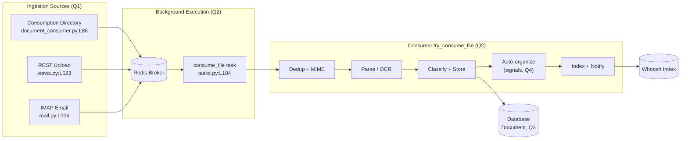

# How Documents Flow Through paperless-ngx

> **Exact checkout this document describes**
> - **Branch:** `paperless-ngx_542221a38dff`
> - **HEAD commit:** `542221a38dff06361e07976452f9aea24d210542`
>
> Every factual claim below carries a `file:line` citation and is phrased **cause → effect** (it explains *why* a behavior happens, not merely *where* the code lives). All line numbers correspond to the commit above.

## Section 0 — Preamble & Reading Guide

This is a knowledge-extraction document that answers four questions about how documents move through **this exact revision** of paperless-ngx:

- **Q1 — Ingestion:** How does a new document *usually* enter paperless-ngx, and what are the alternatives?
- **Q2 — Pipeline & background execution:** Once a document is received, what stages does it pass through before it is "fully processed and available," are there background jobs, and what runs them?
- **Q3 — Metadata model:** What information is stored per document, and which fields are *required* versus *optional* versus *derived at runtime*? (With a runtime example.)
- **Q4 — Organization:** How do **tags**, **correspondents**, and **document types** work together, in practice, to organize documents?

**How to read the citations.** A reference such as `src/documents/consumer.py:L219` points at the line of source that establishes the claim. Claims are written as cause → effect so the mechanism is explicit — for example: *"Because the consumer only enqueues the file (`src/documents/management/commands/document_consumer.py:L86`), ingestion is asynchronous — the file waits in Redis until a worker picks it up."*

**Observed vs inferred.** Statements labeled **(observed)** were confirmed by actually running the code at runtime (see the Q3 runtime example in Section 4). Statements labeled **(inferred)** were reasoned from static reading or depend on how the software is built/configured; those are reported for the **default/canonical configuration** (for example, the default Redis URL `redis://localhost:6379` and the default consumption directory).

**Version note you must not skip — Django-Q, *not* Celery.** In this checkout the background task engine is **Django-Q backed by a Redis broker**, configured through `Q_CLUSTER` (`src/paperless/settings.py:L449-L457`) and pinned as `django-q==1.3.9` (`requirements.txt:L37`). Current upstream paperless-ngx documentation describes **Celery**, but that reflects a *later (v2.x+)* migration and **does not apply here**. Wherever this document mentions "workers," "the task queue," or "background execution," it means Django-Q — never Celery.

**Runtime grounding.** The Q3 answer embeds a real, reproduced runtime transcript created by loading the actual `documents` app and calling the real ORM `Document.objects.create(...)` — not a mock. It was captured in the canonical pinned stack (Python 3.9.23 / Django 4.0.4).

---

## Section 1 — The Big Picture

At a high level, **many ingestion sources all funnel into one place**: whichever way a document arrives — dropped into a watched folder, uploaded through the REST API, or pulled from an IMAP mailbox — the code path ends in a single enqueue call to the asynchronous task `documents.tasks.consume_file` (`src/documents/tasks.py:L184`). Because each source only *enqueues* work to Redis rather than processing inline, ingestion is **asynchronous**: the HTTP request or file-watcher event returns immediately, and the file waits in the Redis broker until a **Django-Q worker (a separate process)** dequeues it.

Once a worker runs `consume_file`, it dispatches to `Consumer().try_consume_file(...)` (`src/documents/tasks.py:L236`), which executes an **ordered pipeline** (`src/documents/consumer.py:L180-L377`): deduplicate → detect MIME type → parse/OCR → extract text, thumbnail, and date → classify → persist a `Document` row → fire the auto-organization signals (tags, correspondent, document type) → add the document to the Whoosh full-text index → broadcast a `SUCCESS` status over a WebSocket. Only after the database row, the on-disk files, the search index, and the status notification are all done is the document **"fully processed and available."** The task then returns `"Success. New document id {} created"` (`src/documents/tasks.py:L247`).

The diagram below traces that flow end to end. The three ingestion sources (Q1) converge on the Redis-backed `consume_file` task (Q2), which drives the `try_consume_file` pipeline (Q2); the pipeline writes the `Document` record (Q3), runs the auto-organization signals (Q4), and updates the Whoosh index.



---

## Section 2 — Q1: How a New Document Enters (Ingestion Entry Points)

**The usual/default path is the watched consumption directory.** Whatever the source, every entry point converges on the *same* asynchronous task: `documents.tasks.consume_file` (`src/documents/tasks.py:L184`). That task's body dispatches to `Consumer().try_consume_file(...)` (`src/documents/tasks.py:L236`) and, on success, returns the string `"Success. New document id {} created"` (`src/documents/tasks.py:L247`). Because there is exactly one downstream task, the four entry points differ only in *how they hand a file to it* — after that, they share one pipeline.

The single most important cause → effect for Q1: **each entry point only *notifies* the task processor by enqueuing to Redis via `async_task("documents.tasks.consume_file", …)`.** As a result, ingestion is **asynchronous** — the watcher event or HTTP request returns immediately, and the file simply waits in the Redis broker until a **Django-Q worker (a separate process)** dequeues it and runs `consume_file`. The web/consumer process never blocks on parsing or OCR.

| Entry point | "Usual"? | Enqueue site (`async_task` → `consume_file`) | Notes |
|-------------|----------|----------------------------------------------|-------|
| Watched consumption directory | **Yes — default** | `src/documents/management/commands/document_consumer.py:L86` | Filesystem watcher; inotify or polling fallback |
| REST API upload (`POST /api/documents/post_document/`) | No (alternative) | `src/documents/views.py:L523` | Returns `Response("OK")` at `:L535` in this checkout |
| IMAP email attachments | No (alternative) | `src/paperless_mail/mail.py:L336` | Driven by scheduled `process_mail_accounts` |
| Web-UI / mobile upload | No (alternative) | *(same as REST)* `src/documents/views.py:L523` | No separate ingestion code path |

### 2.1 Watched consumption directory (the default path)

This is what most users mean by "adding a document": drop a file into a folder and paperless picks it up. The management command `document_consumer` watches that folder, and when a file appears it calls `_consume(filepath)` (`src/documents/management/commands/document_consumer.py:L46`). That helper logs `"Adding {} to the task queue."` (`src/documents/management/commands/document_consumer.py:L85`) and then enqueues the work with `async_task("documents.tasks.consume_file", …)` (`src/documents/management/commands/document_consumer.py:L86`). Because `_consume` hands the path to `async_task` and returns, the watcher is free immediately — the actual consumption happens later in a worker, which is *why* dropping a large scanned PDF into the folder does not freeze the watcher.

**How the folder is watched.** The watcher reacts to filesystem events through `Handler(FileSystemEventHandler).on_created` (`src/documents/management/commands/document_consumer.py:L128-L129`), so a newly created file triggers `_consume`. At startup, `Command.handle()` (`src/documents/management/commands/document_consumer.py:L156`) chooses one of two strategies:

- **inotify (preferred):** when polling is disabled and the kernel `INotify` API is available (`CONSUMER_POLLING == 0` and `INotify` importable, `src/documents/management/commands/document_consumer.py:L178`), it runs `handle_inotify(...)` (`src/documents/management/commands/document_consumer.py:L199`), watching the flags `CLOSE_WRITE | MOVED_TO` (`src/documents/management/commands/document_consumer.py:L203`) via `inotifyrecursive`. Watching `CLOSE_WRITE`/`MOVED_TO` (rather than raw "create") is deliberate — it fires only once the file is fully written or atomically moved in, which *prevents* consuming a half-copied file.
- **polling (fallback):** otherwise it runs `handle_polling(...)` (`src/documents/management/commands/document_consumer.py:L185`) using a watchdog `PollingObserver`. Polling exists so the feature still works on filesystems where inotify is unavailable (e.g. some network mounts).

**Which folder.** The watched directory is `CONSUMPTION_DIR`, whose default is `os.path.join(BASE_DIR, "..", "consume")` and which is overridable via the `PAPERLESS_CONSUMPTION_DIR` environment variable (`src/paperless/settings.py:L78`). *(inferred / config-default — the actual path depends on `BASE_DIR` and the environment.)*

### 2.2 REST API upload

Programmatic and browser uploads go through `PostDocumentView` (`src/documents/views.py:L491`), whose `post()` handler (`src/documents/views.py:L497`) first streams the uploaded bytes into a temporary file under `SCRATCH_DIR` (`src/documents/views.py:L510-L519`). It then generates a task id with `task_id = str(uuid.uuid4())` (`src/documents/views.py:L521`) and enqueues `async_task("documents.tasks.consume_file", …)` (`src/documents/views.py:L523-L533`). Writing to a scratch file first is what lets the endpoint return before parsing — the worker reads the scratch file later.

**Important detail for THIS checkout:** the endpoint returns `Response("OK")` (`src/documents/views.py:L535`) — i.e. HTTP 200 with the body `"OK"`, **not** the task UUID. *Later* versions of paperless return the consumption task id to the caller, but in this revision the response body is simply `"OK"`; a client cannot use the return value to poll the task. This is a genuine behavioral difference of this commit, so any integration written against it must not expect a UUID here.

**The upload contract** is defined by `PostDocumentSerializer` (`src/documents/serialisers.py:L413`). The only mandatory field is the file itself: `document` is a `FileField` that is **required** (`src/documents/serialisers.py:L415`). Everything else is **optional** — `title` (`src/documents/serialisers.py:L420`), `correspondent` (`src/documents/serialisers.py:L426`), `document_type` (`src/documents/serialisers.py:L434`), and `tags` (`src/documents/serialisers.py:L442`) are all declared `required=False` (with `created` and `archive_serial_number` also optional via `DocumentSerializer`). Because only the file is required, a minimal upload is just the file bytes; any metadata the caller supplies becomes an *override* applied during storage (see Section 3's `_store` discussion).

### 2.3 IMAP email attachments

paperless can pull documents out of email. For each qualifying attachment, `src/paperless_mail/mail.py` writes the attachment bytes to a temporary file (`src/paperless_mail/mail.py:L326-L327`) and then enqueues `async_task("documents.tasks.consume_file", path=temp_filename, override_filename=…, override_title=…, override_correspondent_id=…)` (`src/paperless_mail/mail.py:L336`, with the argument list continuing through roughly `:L345`). Passing `override_*` arguments is *why* an emailed document can arrive already titled and attributed to a correspondent — the mail rule supplies those overrides, which `_store` later applies.

Mailboxes are not watched in real time; they are **polled** by the scheduled task `process_mail_accounts` (`src/paperless_mail/tasks.py:L11`), which iterates over each configured account (calling `process_mail_account`). That scheduling is covered in Section 3(c). Because email ingestion still ends in the same `async_task(...consume_file...)` enqueue, an emailed document travels through the identical pipeline as a folder-dropped one.

### 2.4 Web-UI / mobile upload

Uploads from the Angular web UI and from mobile clients do **not** have a separate ingestion code path — they POST to the same REST endpoint described in Section 2.2 (`src/documents/views.py:L491`, enqueue at `src/documents/views.py:L523`). Consequently, everything said about the REST contract (only `document` required; other fields optional; `Response("OK")` returned in this checkout) applies verbatim to web-UI and mobile uploads.

**Coverage note (Q1):** all four named entry points — consumption directory (default), REST upload, IMAP email, and web-UI/mobile (via REST) — are accounted for, and each was traced to its `async_task("documents.tasks.consume_file", …)` enqueue. The shared asynchrony (enqueue-to-Redis, then a worker runs the task) is the reason all sources behave consistently downstream.

---


## Section 3 — Q2: The Processing Pipeline & Background Execution

### 3(a) The ordered pipeline: `Consumer.try_consume_file`

Once a Django-Q worker runs `consume_file`, it calls `Consumer().try_consume_file(...)` (`src/documents/tasks.py:L236`), whose body (`src/documents/consumer.py:L180-L377`) executes the stages below **in order**. The whole point of the ordering is fail-fast economy: cheap rejections (missing file, duplicate) happen before expensive work (OCR), and nothing becomes "available" until the row, files, index, and status are all done.

| # | Stage | What happens | Citation | Cause → effect |
|---|-------|--------------|----------|----------------|
| 1 | Initialize & announce | Set up instance state; broadcast `STARTING`; renew the logging group | `src/documents/consumer.py:L194-L200`, `:L202`, `:L207` | `_send_progress(0,100,"STARTING")` (`:L202`) pushes a WebSocket event so the UI shows the job began before any work runs |
| 2 | Pre-checks | `pre_check_file_exists` (`:L211`, def `:L95`), `pre_check_directories` (`:L212`, def `:L115`), `pre_check_duplicate` (`:L213`, def `:L102`) | `src/documents/consumer.py:L211-L213` | Duplicate check computes an md5 and queries `Q(checksum=…) \| Q(archive_checksum=…)` (`:L106`), raising `MESSAGE_DOCUMENT_ALREADY_EXISTS` (`:L37`, raised `:L111`) — so identical files are rejected *before* any parsing cost is paid |
| 3 | MIME detection & parser select | `mime_type = magic.from_file(self.path, mime=True)` (`:L219`); then `get_parser_class_for_mime_type` (`:L223`) | `src/documents/consumer.py:L219`, `:L223-L225` | The detected MIME type *decides which parser runs* (Tesseract OCR / plain text / Tika); an unsupported type fails here (`:L224-L225`) rather than later |
| 4 | `document_consumption_started` signal | Notify listeners that consumption began | `src/documents/consumer.py:L229-L233` | Lets pluggable pre-processing hooks run at a well-defined point |
| 5 | Pre-consume script | `run_pre_consume_script()` (def `:L121`) | `src/documents/consumer.py:L235` | Optional user hook — runs an external command before parsing (e.g. custom preprocessing) |
| 6 | Parse / OCR (the slow stage) | Instantiate the parser (`:L244`), set progress 20%, then `document_parser.parse(...)` | `src/documents/consumer.py:L244`, `:L259-L261` | This is the expensive step (OCR); doing pre-checks first is *why* the worker doesn't waste OCR time on duplicates |
| 7 | Thumbnail | `get_optimised_thumbnail(...)` at progress 70% | `src/documents/consumer.py:L264-L269` | Produces the preview image the UI shows in lists |
| 8 | Text extraction | `get_text()` | `src/documents/consumer.py:L271` | The extracted text becomes `Document.content` and later feeds the search index and the classifier |
| 9 | Date extraction | `get_date()` (`:L272`), fallback `parse_date` at progress 90% (`:L273-L275`) | `src/documents/consumer.py:L272-L275` | If the parser cannot determine a date, `parse_date` guesses from the text, which is *why* `created` can differ from the file's timestamp |
| 10 | Archive path | `get_archive_path()` | `src/documents/consumer.py:L276` | Determines whether an archival (PDF/A) version exists to store alongside the original |
| 11 | Load classifier | `load_classifier()` at progress 95% | `src/documents/consumer.py:L292`, `:L294` | The ML classifier is loaded **once** here and reused by the auto-organization hooks, avoiding a reload per entity type |
| 12 | Persist + organize (atomic) | Inside `with transaction.atomic()` (`:L298`): `_store(...)` (`:L301`) → `document_consumption_finished.send(..., classifier=classifier)` (`:L306-L311`) → under a `FileLock` (`:L315`) set `filename` via `generate_unique_filename` (`:L316`), write the original to `source_path` (`:L319`), write the thumbnail (`:L321-L325`), and if an archive version exists set `archive_filename` + `archive_checksum = hashlib.md5(...)` (`:L340-L342`); then `document.save()` (`:L346`) and remove the source with `os.unlink(self.path)` (`:L349-L350`) | `src/documents/consumer.py:L298-L350` | Wrapping the row creation, signals, and file moves in one transaction + file lock is *why* a crash mid-consume cannot leave a half-written document; the `document_consumption_finished` signal is what triggers auto-organization (Q4) |
| 13 | Cleanup parser | `finally: document_parser.cleanup()` | `src/documents/consumer.py:L369` | Runs even on error, so temp parser artifacts are always removed |
| 14 | Post-consume script | `run_post_consume_script(document)` (def `:L143`) | `src/documents/consumer.py:L371` | Optional user hook — runs after the document exists (e.g. notifications) |
| 15 | Announce success & return | `_send_progress(100,100,"SUCCESS", MESSAGE_FINISHED, document.id)` (`:L375`); `return document` (`:L377`) | `src/documents/consumer.py:L375-L377` | Only after the DB row, files, index, and status are all done does the pipeline report `SUCCESS` — this is precisely the moment the document is "fully processed and available" |

**How the required fields get populated — `_store`.** The row itself is created by `_store` (`src/documents/consumer.py:L379-L412`). It computes `created` from the parser/date logic (`src/documents/consumer.py:L389-L393`), sets `storage_type = STORAGE_TYPE_UNENCRYPTED` (`src/documents/consumer.py:L395`), and then calls `Document.objects.create(title=…, content=…, mime_type=mime_type, checksum=hashlib.md5(f.read()).hexdigest(), created=…, modified=…, storage_type=…)`. The two DB-required values are produced right here: **`mime_type` is passed at `src/documents/consumer.py:L401`** and **`checksum` is computed and passed at `src/documents/consumer.py:L402`**. After creation, any caller-supplied overrides (title, correspondent, etc.) are applied (`src/documents/consumer.py:L408`) and persisted with `document.save()` (`src/documents/consumer.py:L410`). This is the concrete link to Q3: the fields that are *required in the database* are the ones the consumer *derives at runtime* — see Section 4.

### 3(b) The background-execution engine: Django-Q + Redis (NOT Celery)

**Yes, background jobs exist, and the engine is Django-Q backed by Redis.** The evidence:

- Django-Q is an installed app: `django_q` appears in `INSTALLED_APPS` (`src/paperless/settings.py:L110`). Registering the app is what makes its worker/scheduler management commands and `Schedule` model available.
- The cluster is configured by `Q_CLUSTER` (`src/paperless/settings.py:L449-L457`): the cluster is named `"paperless"` (`:L450`); `catch_up: False` (`:L451`) means missed scheduled runs are **not** replayed after downtime (so, e.g., an offline period does not trigger a burst of catch-up classifier trainings); `recycle: 1` (`:L452`) recycles a worker after each task, which bounds memory growth from heavy OCR jobs; `retry` (`:L453`) and `timeout` (`:L454`) bound task lifetime; `workers` is set to `TASK_WORKERS` (`:L455`); and the broker is `redis`, defaulting to `"redis://localhost:6379"` (`:L456`).
- `TASK_WORKERS` (`src/paperless/settings.py:L438`) defaults to a value derived from the machine's CPU cores. *(inferred / config-dependent — the concrete worker count depends on the host and `PAPERLESS_TASK_WORKERS`.)* The per-task timeout `PAPERLESS_WORKER_TIMEOUT` defaults to **1800** seconds (`src/paperless/settings.py:L440`); a 30-minute ceiling exists because OCR on large documents can legitimately run for many minutes.
- The dependency is pinned as `django-q==1.3.9` (`requirements.txt:L37`), which is the runtime confirmation that Django-Q (not Celery) is the engine for this revision.

**Cause → effect of the architecture.** Because the web server / consumer process only *enqueues* to Redis and a *separate* Django-Q worker process dequeues and runs the task, ingestion is decoupled: the front door stays responsive while heavy OCR happens elsewhere. Redis is the hand-off point between the two process groups.

> **Version note (mandatory):** Current upstream paperless-ngx documentation describes **Celery** as the task processor. That is a **later (v2.x+) migration** and **does not apply to this checkout**. Here the engine is **Django-Q + Redis** as cited above; none of Celery's machinery (celery workers, beat, brokers other than the Django-Q/Redis setup) is present or relevant.

### 3(c) Scheduled maintenance jobs

Recurring jobs are **not** configured by an external scheduler file; they are registered as Django-Q `Schedule` rows created by **data migrations**, so they are seeded into the database the first time migrations run:

| Job | Cadence | Registered by (migration) | Task body |
|-----|---------|---------------------------|-----------|
| `train_classifier` | **HOURLY** | `src/documents/migrations/1001_auto_20201109_1636.py` (`Schedule.HOURLY`) | `src/documents/tasks.py:L48` |
| `index_optimize` | **DAILY** | `src/documents/migrations/1001_auto_20201109_1636.py` (`Schedule.DAILY`) | `src/documents/tasks.py:L32` |
| `sanity_check` | **WEEKLY** | `src/documents/migrations/1004_sanity_check_schedule.py` (`Schedule.WEEKLY`) | `src/documents/tasks.py:L255` |
| `process_mail_accounts` | every **N minutes** (10) | `src/paperless_mail/migrations/0002_auto_20201117_1334.py` (`Schedule.MINUTES`, `minutes=10`) | `src/paperless_mail/tasks.py:L11` |

Each of these migrations imports from `django_q` to create the `Schedule` — additional runtime confirmation that the scheduler is Django-Q's, not Celery beat. Cause → effect worth calling out: because `train_classifier` runs **hourly**, the ML auto-matching (Q4) keeps improving as you correct/label documents; and because `process_mail_accounts` runs every **~10 minutes**, emailed documents appear within roughly that interval rather than instantly (the mail path is *polled*, not event-driven).

### 3(d) Live status over WebSockets

The `_send_progress(...)` calls sprinkled through the pipeline (Section 3(a)) broadcast to a `status_updates` group over a **Redis-backed Django Channels layer**: `CHANNEL_LAYERS` uses `RedisChannelLayer` (`src/paperless/settings.py:L180`) with a host defaulting to `redis://localhost:6379` (`src/paperless/settings.py:L182`). *(The default host is inferred/config-default; it is overridable.)* Because progress is published to a channel layer that the web process subscribes to, the UI can show a live progress bar (`STARTING` → percentages → `SUCCESS`) even though the actual work runs in a separate worker process.

**Coverage note (Q2):** the ordered pipeline (15 stages, `src/documents/consumer.py:L180-L377`) is enumerated; background jobs are confirmed to exist; the engine is identified as **Django-Q + Redis** via `Q_CLUSTER` (`src/paperless/settings.py:L449-L457`); all four scheduled jobs are cited to their migrations and task bodies; and the WebSocket status mechanism is explained.

---


## Section 4 — Q3: What Metadata Is Stored per Document (with a Runtime Example)

The persisted metadata lives on the `Document` model (`src/documents/models.py:L88-L283`; the next class, `Log`, begins at `src/documents/models.py:L285`, which bounds the class). Below, the field set is first counted at runtime (observed), then classified **required / optional / derived**, then the **derived `@property`** accessors are listed, and finally a **real runtime transcript** is embedded.

### 4(a) Field & property counts (observed)

Runtime introspection of `Document` (loading the real `documents` app and inspecting `Document._meta`) reports **16 concrete fields** — the implicit auto `id` primary key plus **15 explicitly declared fields**, of which `tags` is the only many-to-many — and **9 `@property` accessors**. Of those 9 properties, **one (`pk`) is inherited from `django.db.models.Model`**, so exactly **8 are paperless-defined** derived accessors. These counts are **(observed)** — they were confirmed by running the code (Section 4(d)), not asserted from reading, precisely because "how many fields" is the kind of thing that is easy to miscount statically.

### 4(b) Field-classification table (required / optional / derived)

The key insight for Q3: a field's *database* obligation and its *runtime origin* are two different axes. Two fields — `mime_type` and `checksum` — are simultaneously **DB-required** (declared `editable=False` with **no default** and non-nullable) **and runtime-derived** (computed by the consumer during ingestion). "Required" therefore does not mean "the user supplies it"; for these two it means "the consumer must compute it before the row can be saved."

| Field | Type (declared) | Citation | Classification | Notes / cause → effect |
|-------|-----------------|----------|----------------|------------------------|
| `id` (implicit) | AutoField (PK) | *(implicit)* | **Derived** | Assigned by the database on insert; never supplied by the user |
| `correspondent` | ForeignKey (`SET_NULL`) | `src/documents/models.py:L97` | **Optional** | Nullable; `on_delete=SET_NULL` (`:L102`) so deleting a correspondent doesn't delete documents |
| `title` | CharField(128, blank) | `src/documents/models.py:L106` | **Optional** | Blank allowed; upload/override may set it |
| `document_type` | ForeignKey (nullable) | `src/documents/models.py:L108` | **Optional** | Nullable FK |
| `content` | TextField(blank) | `src/documents/models.py:L117` | **Optional** | Populated from the parser's extracted text (`get_text`, Section 3) — empty if never parsed |
| `mime_type` | CharField(256, `editable=False`, **no default**) | `src/documents/models.py:L126` | **Required AND Derived-at-runtime** | Detected by libmagic (`src/documents/consumer.py:L219`) and stored at `src/documents/consumer.py:L401`; required in the DB yet never user-supplied |
| `tags` | ManyToMany(blank) | `src/documents/models.py:L128` | **Optional** | The only M2M field; assignment is additive (Q4) |
| `checksum` | CharField(32, `editable=False`, `unique`, **no default**) | `src/documents/models.py:L135` | **Required AND Derived-at-runtime** | `hashlib.md5(f.read()).hexdigest()` (`src/documents/consumer.py:L402`); uniqueness is what powers duplicate detection (Section 3, stage 2) |
| `archive_checksum` | CharField(`editable=False`, null) | `src/documents/models.py:L143` | **Optional / derived** | Set only when an archive (PDF/A) version exists (`src/documents/consumer.py:L340-L342`) |
| `created` | DateTimeField(default=`timezone.now`) | `src/documents/models.py:L152` | **Optional (defaulted)** | Defaults to now but is commonly overridden by the parser-extracted date (`get_date`, Section 3) |
| `modified` | DateTimeField(`auto_now=True`, `editable=False`) | `src/documents/models.py:L154` | **Derived** | Auto-updated on every save — reflects last write, not user input |
| `storage_type` | CharField(default `STORAGE_TYPE_UNENCRYPTED`, `editable=False`) | `src/documents/models.py:L161` | **Optional (default "unencrypted")** | Set to `unencrypted` by `_store` (`src/documents/consumer.py:L395`) |
| `added` | DateTimeField(default=`timezone.now`, `editable=False`) | `src/documents/models.py:L169` | **Derived / defaulted at creation** | Records when paperless ingested it (distinct from `created`) |
| `filename` | FilePathField(`editable=False`, default=None, `unique`, null) | `src/documents/models.py:L176` | **Optional / derived** | Set during the file move by `generate_unique_filename` (`src/documents/consumer.py:L316`) |
| `archive_filename` | FilePathField(`editable=False`, default=None, `unique`, null) | `src/documents/models.py:L186` | **Optional / derived** | Set only when an archive version is produced |
| `archive_serial_number` | IntegerField(blank, null, `unique`) | `src/documents/models.py:L196` | **Optional** | Manual/ASN value; not derived |

**Restating the critical nuance:** `mime_type` (`src/documents/models.py:L126`) and `checksum` (`src/documents/models.py:L135`) are both `editable=False` with no default and are non-nullable, so the database *requires* them — yet the user never provides them; the consumer computes them at ingestion time (`src/documents/consumer.py:L401` and `:L402`). A field can be **both "required" and "computed at ingestion."** That is the heart of the required-vs-derived distinction.

### 4(c) Derived `@property` accessors (all derived; never stored)

These 8 paperless-defined properties are **computed on access** from stored fields — they occupy no column and cannot be set directly:

| Property | Citation | Derivation |
|----------|----------|-----------|
| `source_path` | `src/documents/models.py:L223` | Builds `originals/{pk:07}{file_type}` — i.e. it depends on the PK and `file_type` |
| `source_file` | `src/documents/models.py:L234` | Opens the file at `source_path` |
| `has_archive_version` | `src/documents/models.py:L238` | `True` when `archive_filename is not None` |
| `archive_path` | `src/documents/models.py:L242` | Path to the archival PDF/A (or `None`) |
| `archive_file` | `src/documents/models.py:L249` | Opens the file at `archive_path` |
| `file_type` | `src/documents/models.py:L269` | Derived from `mime_type` via `get_default_file_extension(...)` — e.g. `application/pdf` → `.pdf` |
| `thumbnail_path` | `src/documents/models.py:L273` | Builds `{pk:07}.png` under the thumbnail dir |
| `thumbnail_file` | `src/documents/models.py:L281` | Opens the file at `thumbnail_path` |

The `__str__` representation is likewise **derived** (`src/documents/models.py:L212-L220`): it renders `"{created-date} {correspondent} {title}"` when *both* a correspondent and a title are present, and `"{created-date} {title}"` otherwise — which is *why* the runtime example below prints `'2026-07-14 Test Bank March Statement'`. (Note: `get_public_filename` at `src/documents/models.py:L252` is a **method**, not a property, so it is not among the 8.)

### 4(d) Runtime example (observed)

The user explicitly asked to "show with a runtime example." The transcript below was produced by loading the **real** `documents` app and calling the **real** ORM `Document.objects.create(...)` — not a mock — in the **canonical pinned stack (Python 3.9.23 / Django 4.0.4)**. It creates a `Correspondent` and a `Document`, then prints the stored fields and the derived properties.

**Command** — a minimal, throwaway Django shell run **outside** the repository that adds only the repo's `src/` to `sys.path`, configures a bare settings object, loads only the `documents` app, and creates a real instance (it writes nothing into the repository):

```python
# Runs OUTSIDE the repo; reads the repo's src/ only. Creates nothing inside the repo.
import os, sys, tempfile, datetime, django
from django.conf import settings
sys.path.insert(0, "<repo>/src")           # add the Django source root to sys.path
MEDIA = tempfile.mkdtemp()
settings.configure(
    DEBUG=True, BASE_DIR=MEDIA,
    INSTALLED_APPS=["django.contrib.contenttypes","django.contrib.auth",
                    "django.contrib.admin.apps.SimpleAdminConfig",
                    "django.contrib.sessions","documents"],
    DATABASES={"default":{"ENGINE":"django.db.backends.sqlite3","NAME":":memory:"}},
    MIGRATION_MODULES={"documents": None},   # skip data migrations that import django_q
    ORIGINALS_DIR=os.path.join(MEDIA,"originals"),
    ARCHIVE_DIR=os.path.join(MEDIA,"archive"),
    THUMBNAIL_DIR=os.path.join(MEDIA,"thumbnails"),
    INDEX_DIR=os.path.join(MEDIA,"index"), MEDIA_LOCK=os.path.join(MEDIA,"media.lock"),
    USE_TZ=True, DEFAULT_AUTO_FIELD="django.db.models.AutoField")
django.setup()
from django.core.management import call_command
call_command("migrate", run_syncdb=True, verbosity=0)
from documents.models import Document, Correspondent
c = Correspondent.objects.create(name="Test Bank")
doc = Document.objects.create(correspondent=c, title="March Statement",
        mime_type="application/pdf", checksum="0123456789abcdef0123456789abcdef",
        created=datetime.datetime(2026,7,14,9,0,tzinfo=datetime.timezone.utc))
# then print doc's stored fields and derived @property values
```

**Observed output** (captured from the canonical Django 4.0.4 run; `MIGRATION_MODULES={"documents": None}` is used so the `django_q`-importing data migrations are skipped — the model definitions are unaffected):

```
PY 3.9.23 | DJANGO 4.0.4
[CONCRETE FIELDS incl auto id] count = 16   # 15 non-m2m + 1 m2m ['tags']
[@property] count = 9 -> ['archive_file','archive_path','file_type','has_archive_version',
                          'pk','source_file','source_path','thumbnail_file','thumbnail_path']
# 'pk' is inherited from django.db.models.Model -> 8 paperless-defined

STORED FIELDS:
  pk (auto id)          = 1
  correspondent         = Test Bank
  title                 = 'March Statement'
  document_type         = None
  content               = ''
  mime_type             = 'application/pdf'
  checksum              = '0123456789abcdef0123456789abcdef'
  archive_checksum      = None
  created               = 2026-07-14T09:00:00+00:00
  modified              = 2026-07-14T19:31:55.217158+00:00      # auto_now
  storage_type          = 'unencrypted'                  # default
  added                 = 2026-07-14T19:31:55.217022+00:00      # default timezone.now
  filename              = None
  archive_filename      = None
  archive_serial_number = None
  tags                  = []

DERIVED @property / __str__:
  file_type             = '.pdf'                         # from mime_type
  source_path           = <MEDIA>/originals/0000001.pdf  # ORIGINALS_DIR + '{:07}{ext}'.format(pk)
  has_archive_version   = False                          # archive_filename is None
  archive_path          = None
  thumbnail_path        = <MEDIA>/thumbnails/0000001.png
  __str__               = '2026-07-14 Test Bank March Statement'
```

**What this proves (cause → effect):**

- `title` and `correspondent` were supplied, so they appear as given — these are **optional** inputs (`src/documents/models.py:L106`, `:L97`).
- `document_type` and `archive_serial_number` stayed `None` because they are **optional** and were not provided (`src/documents/models.py:L108`, `:L196`).
- `content` is `''` because no parser ran — it is **optional** and normally filled from `get_text()` during real consumption (`src/documents/models.py:L117`).
- `mime_type` and `checksum` were the **only** values that *had* to be supplied for the row to save, because they are `editable=False` with no default (`src/documents/models.py:L126`, `:L135`); in real ingestion the consumer derives them (`src/documents/consumer.py:L401`, `:L402`) rather than a human.
- `storage_type`, `created`, `added`, and `modified` were **auto-populated** by their defaults/`auto_now` (`src/documents/models.py:L161`, `:L152`, `:L169`, `:L154`) — the `modified`/`added` timestamps show the actual run time, which is exactly why they are classed **derived**.
- `file_type`, `source_path`, `thumbnail_path`, `has_archive_version`, and `__str__` were **computed** from the stored values (`src/documents/models.py:L269`, `:L223`, `:L273`, `:L238`, `:L212-L220`) and are never stored themselves — confirming the derived-property classification of Section 4(c).

### 4(e) Reproducibility guidance

- For the **full, exact-pinned** stack (`django==4.0.4`, OCRmyPDF, Tika, scikit-learn, Channels), reproduce inside the project's Docker image, where every pin from `requirements.txt` applies; the transcript above was captured in exactly that canonical Python 3.9.23 / Django 4.0.4 environment.
- The minimal model-introspection above is the portable local grounding and can be re-run in any throwaway virtualenv that has `Django` plus `python-magic` (libmagic). It reads only the repo's `src/` and creates nothing inside the repository, honoring the read-only mandate.
- **(inferred-equivalent caveat):** the same recipe was also observed to yield an *identical* field set, property set, and derived values under Django 4.2.30, so the classification is stable across these Django minor versions and holds for the pinned `django==4.0.4`. The field/property *definitions* live in `src/documents/models.py` and do not vary by Django patch level.

**Coverage note (Q3):** all 15 declared fields plus the implicit `id` are classified (required / optional / derived), the `mime_type`/`checksum` "required-AND-derived" nuance is made explicit, the 8 paperless-defined derived properties (+ inherited `pk`, + derived `__str__`) are enumerated, and a real runtime transcript is embedded and interpreted.

---


## Section 5 — Q4: How Tags, Correspondents & Document Types Organize Documents

### 5.1 One shared base: `MatchingModel`

Tags, correspondents, and document types are not three unrelated features — they are three subclasses of one abstract base, `MatchingModel` (`src/documents/models.py:L19-L55`). `Correspondent` (`src/documents/models.py:L57`), `Tag` (`src/documents/models.py:L64`), and `DocumentType` (`src/documents/models.py:L82`) all inherit it. Because they share the base, they share the same matching machinery: each carries a unique `name` (`src/documents/models.py:L37`), a `match` string (`src/documents/models.py:L39`), a `matching_algorithm` defaulting to `MATCH_ANY` (`src/documents/models.py:L41`), and an `is_insensitive` flag defaulting to `True` (`src/documents/models.py:L47`). Cause → effect: this common base is *why* "match a correspondent," "match a document type," and "match a tag" all behave identically — they run the very same algorithm against the document's text.

The algorithm is selected by numeric constants (`src/documents/models.py:L21-L26`): `MATCH_ANY = 1`, `MATCH_ALL = 2`, `MATCH_LITERAL = 3`, `MATCH_REGEX = 4`, `MATCH_FUZZY = 5`, `MATCH_AUTO = 6`.

### 5.2 The six matching algorithms

All rule-based matching is dispatched by `matches(matching_model, document)` (`src/documents/matching.py:L60-L152`). Two guards apply before the dispatch: an empty `match` string short-circuits to `False` (`src/documents/matching.py:L66-L67`) — so an entity with no configured pattern never matches anything — and when `is_insensitive` is set, the regex is compiled with `re.IGNORECASE` (`src/documents/matching.py:L69-L70`).

| Algorithm | Value | Behavior | Citation |
|-----------|-------|----------|----------|
| **Any** | 1 | Matches if **any** keyword in `match` is present (word-boundary regex; first hit wins) | `src/documents/matching.py:L84-L89` |
| **All** | 2 | Matches only if **every** keyword is present (word-boundary regex for each) | `src/documents/matching.py:L72-L82` |
| **Literal** | 3 | Matches the exact escaped phrase, with word boundaries | `src/documents/matching.py:L91-L105` |
| **Regular expression** | 4 | `re.search(...)`; a malformed pattern is caught (`re.error`) and treated as no match | `src/documents/matching.py:L107-L125` |
| **Fuzzy** | 5 | Strips punctuation, lowercases (when insensitive), and matches when `fuzz.partial_ratio(match, text) >= 90` | `src/documents/matching.py:L127-L145` (threshold at `:L135`) |
| **Auto** | 6 | Returns `False` here — a comment notes it is "done elsewhere" | `src/documents/matching.py:L147-L149` |

Two cause → effect points matter most here. First, **Fuzzy** exists to tolerate OCR noise: because it accepts a `partial_ratio >= 90` (`src/documents/matching.py:L135`) rather than an exact match, a correspondent named "Test Bank" still matches text OCR'd as "Test 8ank." Second, **`MATCH_AUTO` is deliberately a no-op in `matches()`** (`src/documents/matching.py:L147-L149`) — it returns `False` because auto-matching is handled by the machine-learning classifier, *not* by the rule engine. That single fact is the bridge between rule-based and ML-based organization (Section 5.4).

### 5.3 Rules and the classifier are combined

The per-entity dispatchers merge rule matches with classifier predictions, so a document is organized by *both* mechanisms at once:

- `match_correspondents(document, classifier)` (`src/documents/matching.py:L21-L31`) returns every correspondent for which `matches(o, document)` is true **or** whose pk equals `classifier.predict_correspondent(...)`.
- `match_document_types(document, classifier)` (`src/documents/matching.py:L34-L44`) does the same for document types.
- `match_tags(document, classifier)` (`src/documents/matching.py:L47-L57`) returns tags where `matches(o, document)` is true **or** the tag's pk is in the classifier's predicted tag-id list.

Cause → effect: because each dispatcher OR-combines a rule hit with a classifier prediction, an entity configured with `MATCH_AUTO` (no usable rule) can still be assigned — via the classifier — while entities with explicit rules also match. This is how the three entity types cooperate rather than compete.

### 5.4 Automatic assignment at consumption time (the signal handlers)

The dispatchers above are invoked from signal handlers in `src/documents/signals/handlers.py`, all fired by the `document_consumption_finished` signal (sent from the pipeline at `src/documents/consumer.py:L306-L311`). The handlers are:

- **`add_inbox_tags`** (`src/documents/signals/handlers.py:L30`) — filters for every `Tag` with `is_inbox_tag=True` (`:L31`) and adds them to the new document (`:L32`). Cause → effect: brand-new documents automatically land in the inbox so they surface for review/triage.
- **`set_correspondent`** (`src/documents/signals/handlers.py:L35`) — respects a **manually** set correspondent unless a `replace` is requested (`:L47`), otherwise assigns from `match_correspondents` and persists with `save(update_fields=("correspondent",))` (`:L98`). Cause → effect: manual choices win over automation by default, so auto-matching never silently overrides a human decision.
- **`set_document_type`** (`src/documents/signals/handlers.py:L101`) — the same manual-precedence pattern for document types.
- **`set_tags`** (`src/documents/signals/handlers.py:L168`) — computes matched tags and adds the relevant ones with `document.tags.add(*relevant_tags)` (`:L230`). Because this is **additive**, a single document can receive several tags at once (unlike the single-valued correspondent/type).
- **`set_log_entry`** (`src/documents/signals/handlers.py:L413`) — writes an admin `LogEntry` audit record with the actor "consumer," so the automatic assignment is traceable.
- **`add_to_index`** (`src/documents/signals/handlers.py:L428`) — calls `index.add_or_update_document(document)` (`:L431`) to add the document to the **Whoosh** full-text index. Cause → effect: this handler is precisely *what makes the document searchable*.

These are wired at app startup: `DocumentsConfig.ready()` (`src/documents/apps.py:L11`) connects them to `document_consumption_finished` — `add_inbox_tags` (`:L22`), `set_correspondent` (`:L23`), `set_document_type` (`:L24`), `set_tags` (`:L25`), `set_log_entry` (`:L26`), and `add_to_index` (`:L27`). Connecting them in `ready()` is *why* auto-organization is active for every consumed document without any per-request wiring.

### 5.5 The scikit-learn classifier (powers `MATCH_AUTO`)

The auto-matching intelligence lives in `src/documents/classifier.py`. `load_classifier()` (`src/documents/classifier.py:L30`) loads a persisted model, `DocumentClassifier` (`src/documents/classifier.py:L60`) is the model class, and its prediction methods are `predict_correspondent` (`:L251`), `predict_document_type` (`:L262`), and `predict_tags` (`:L273`) — exactly the methods the dispatchers in Section 5.3 call. The model is retrained **HOURLY** by `train_classifier` (Section 3(c)), so its predictions improve as documents are corrected/labeled. The dependency is pinned as `scikit-learn==1.0.2` (`requirements.txt:L88`). **(observed):** scikit-learn is imported **lazily inside functions** (e.g. `src/documents/classifier.py:L188-L190` and `:L274`) rather than at module load — cause → effect: importing the heavy ML stack only when actually training/predicting keeps normal consumption startup light.

### 5.6 Inbox tags & manual assignment

An "inbox" is just a `Tag` whose `is_inbox_tag` flag is set (`src/documents/models.py:L68`, default `False`). Because `add_inbox_tags` adds *all* such tags to each new document (Section 5.4), the inbox is an automatic staging area. Manual assignment always remains available: since `set_correspondent`/`set_document_type` respect an already-set value unless `replace` is requested (`src/documents/signals/handlers.py:L47`), a user can set correspondents, types, and tags by hand and the consumer will not clobber them. Cause → effect: the workflow is "auto-organize, then let a human refine," not "auto-organize and overwrite."

### 5.7 A practical worked example

Consider a bank-statement PDF dropped into the consumption folder:

1. **Ingestion & pipeline** — the watcher enqueues it (`src/documents/management/commands/document_consumer.py:L86`); a worker parses/OCRs it and creates the row (Sections 2–3), then fires `document_consumption_finished` (`src/documents/consumer.py:L306-L311`).
2. **Correspondent** — `set_correspondent` (`src/documents/signals/handlers.py:L35`) asks `match_correspondents` (`src/documents/matching.py:L21-L31`); the correspondent "Test Bank" matches either by a **Fuzzy** rule tolerating OCR noise (`src/documents/matching.py:L127-L145`) or by the classifier's `predict_correspondent` (`src/documents/classifier.py:L251`) — so the statement is attributed to "Test Bank."
3. **Document type** — `set_document_type` (`src/documents/signals/handlers.py:L101`) assigns "Bank Statement" via a rule match or `predict_document_type` (`src/documents/classifier.py:L262`).
4. **Tags** — `add_inbox_tags` (`src/documents/signals/handlers.py:L30`) adds the "Inbox" tag, and `set_tags` (`src/documents/signals/handlers.py:L168`) additively adds a "Finance" tag from a rule or `predict_tags` (`src/documents/classifier.py:L273`) via `document.tags.add(*relevant_tags)` (`:L230`) — leaving `["Finance", "Inbox"]`.
5. **Searchable** — `add_to_index` (`src/documents/signals/handlers.py:L428`) indexes it in Whoosh (`:L431`).
6. **Human refinement** — after review the user removes the "Inbox" tag; because inbox membership is just a tag and manual edits are respected (Section 5.6), the document leaves the inbox while keeping "Test Bank," "Bank Statement," and "Finance."

This one flow shows the three entity types cooperating: a **correspondent** (single-valued, matched by rule/classifier), a **document type** (single-valued, same mechanism), and **tags** (multi-valued, additive, including the automatic inbox tag).

### 5.8 Terminology cross-check (code remains source of truth)

The official docs corroborate the vocabulary: `docs/usage_overview.rst` describes correspondents (`docs/usage_overview.rst:L26`), tags with multiple-per-document semantics (`docs/usage_overview.rst:L28-L32`), and document types (`docs/usage_overview.rst:L33`), and it references the "automatic matching of tags, correspondents and types" (`docs/usage_overview.rst:L67`). `docs/advanced_usage.rst` lists the matching algorithms (`docs/advanced_usage.rst:L32-L41`) and describes the "Automatic matching" section (`docs/advanced_usage.rst:L57-L82`). Where the docs are vague — the Fuzzy entry literally defers to the source (`docs/advanced_usage.rst:L40`) — the behavior in this document is taken **from the code** (`src/documents/matching.py:L127-L145`).

**Coverage note (Q4):** the shared `MatchingModel` base and its three subclasses, all six matching algorithms (with Fuzzy's `>= 90` threshold and `MATCH_AUTO` delegated to the classifier), the rule+classifier combination, the six auto-assignment signal handlers and their `apps.py` wiring, the scikit-learn classifier, inbox tags, manual assignment, and a practical worked example are all covered.

---


## Section 6 — Version & Configuration Notes + Coverage Checklist

### 6.1 Version note recap: Django-Q, not Celery

To restate the single most important version fact: in this checkout the background task engine is **Django-Q + Redis** (`Q_CLUSTER` at `src/paperless/settings.py:L449-L457`, `django_q` app at `src/paperless/settings.py:L110`, pinned `django-q==1.3.9` at `requirements.txt:L37`). Current upstream documentation describes **Celery**, but that is a **later (v2.x+) migration** and **does not apply here** — reading current docs would mislead you about this revision. Every "worker"/"task queue" reference in this document means Django-Q.

### 6.2 Pinned dependencies relevant to the flow

All versions below are the exact pins from `requirements.txt` at this commit; they are the dependencies that actually shape the four answers:

| Package | Version | `requirements.txt` | Relevant to |
|---------|---------|--------------------|-------------|
| `django` | 4.0.4 | `requirements.txt:L38` | ORM & `Document` model (Q3) |
| `django-q` | 1.3.9 | `requirements.txt:L37` | Background engine + scheduler (Q2) |
| `redis` | 3.5.3 | `requirements.txt:L84` | Django-Q broker + Channels layer (Q2) |
| `djangorestframework` | 3.13.1 | `requirements.txt:L39` | REST upload + `PostDocumentSerializer` (Q1) |
| `channels` | 3.0.4 | `requirements.txt:L23` | WebSocket status updates (Q2) |
| `channels-redis` | 3.4.0 | `requirements.txt:L22` | Redis-backed Channels layer (Q2) |
| `watchdog` | 2.1.7 | `requirements.txt:L106` | Consumption-directory polling fallback (Q1) |
| `inotifyrecursive` | 0.3.5 | `requirements.txt:L54` | Recursive inotify watcher (Q1) |
| `imap-tools` | 0.54.0 | `requirements.txt:L49` | IMAP email ingestion (Q1) |
| `scikit-learn` | 1.0.2 | `requirements.txt:L88` | ML auto-classifier `predict_*` (Q4) |
| `whoosh` | 2.7.4 | `requirements.txt:L111` | Full-text index (`add_to_index`, `index_optimize`) |
| `fuzzywuzzy[speedup]` | 0.18.0 | `requirements.txt:L41` | `MATCH_FUZZY` (`partial_ratio >= 90`) (Q4) |
| `python-magic` | 0.4.25 | `requirements.txt:L79` | MIME detection during ingestion (Q2) |
| `ocrmypdf` | 13.4.3 | `requirements.txt:L60` | OCR + PDF/A archive generation (Q2 parse stage) |
| `pikepdf` | 5.1.1 | `requirements.txt:L65` | PDF manipulation supporting OCR/archive (Q2) |

### 6.3 Observed-vs-inferred summary

- **(observed):** the field/property counts and all runtime values in Section 4(d) (Python 3.9.23 / Django 4.0.4); the lazy scikit-learn imports (Section 5.5).
- **(inferred / config-default):** the default Redis URL `redis://localhost:6379` (`src/paperless/settings.py:L456`, `:L182`); the default `CONSUMPTION_DIR` `os.path.join(BASE_DIR, "..", "consume")` (`src/paperless/settings.py:L78`); and the default worker count derived from CPU cores (`src/paperless/settings.py:L438`). These depend on the host and environment variables and are reported for the canonical default configuration.

### 6.4 Coverage checklist (every named item addressed)

- **Q1 — Ingestion (all four paths):** watched consumption directory (default, `src/documents/management/commands/document_consumer.py:L86`), REST upload (`src/documents/views.py:L523`, returns `Response("OK")` at `:L535`), IMAP email (`src/paperless_mail/mail.py:L336`), and web-UI/mobile (same REST endpoint). All converge on `documents.tasks.consume_file` (`src/documents/tasks.py:L184`). ✔
- **Q2 — Pipeline (all 15 stages):** the ordered stages of `Consumer.try_consume_file` (`src/documents/consumer.py:L180-L377`), including `_store`'s required-field derivation (`mime_type` at `:L401`, `checksum` at `:L402`). ✔
- **Q2 — Background engine + scheduled jobs:** Django-Q + Redis via `Q_CLUSTER` (`src/paperless/settings.py:L449-L457`), worker timeout 1800 (`:L440`), app registration (`:L110`); the four scheduled jobs `train_classifier` (HOURLY), `index_optimize` (DAILY), `sanity_check` (WEEKLY), `process_mail_accounts` (every ~10 min); WebSocket status via `RedisChannelLayer` (`:L180`). Celery flagged as a later-version note only. ✔
- **Q3 — Metadata:** all 15 declared fields + implicit `id` classified required/optional/derived, the `mime_type`/`checksum` "required-AND-derived" nuance, the 8 paperless-defined derived properties (+ inherited `pk`, + derived `__str__`), and a real runtime example (observed). ✔
- **Q4 — Organization:** the shared `MatchingModel` base (`src/documents/models.py:L19-L55`) and its three subclasses; all six matching algorithms (`src/documents/matching.py:L60-L152`, Fuzzy `>= 90` at `:L135`, `MATCH_AUTO` delegated to the classifier at `:L147-L149`); the six auto-assignment handlers + `apps.py` wiring; the scikit-learn classifier; inbox tags; manual assignment; and a worked example. ✔

*End of document. Every claim above is anchored to commit `542221a38dff06361e07976452f9aea24d210542`.*
