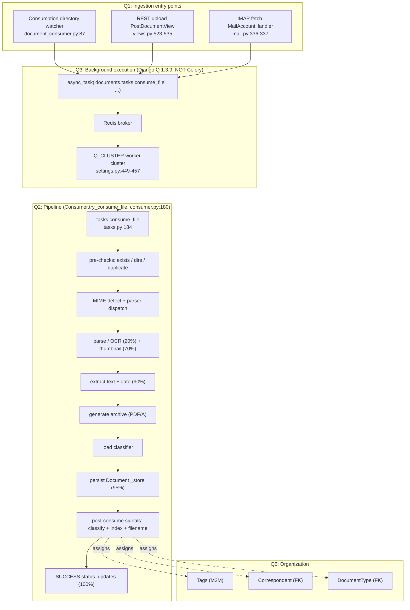
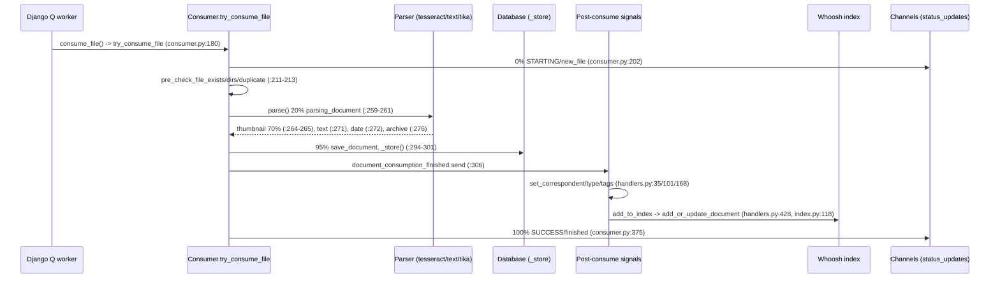
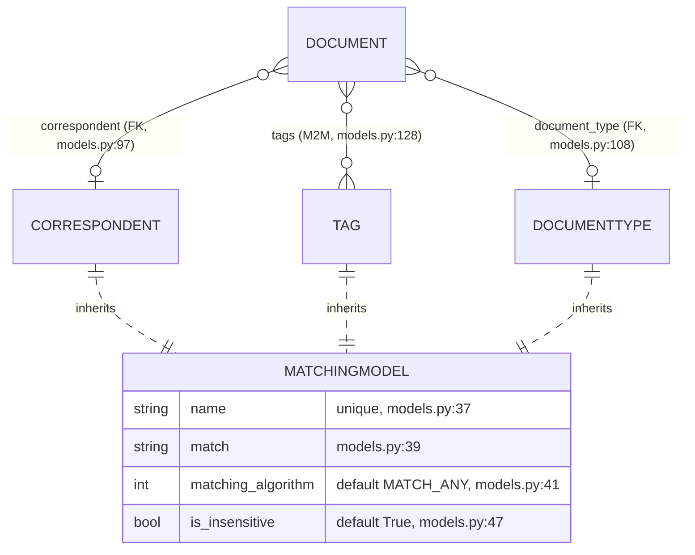

# How Documents Flow Through paperless-ngx (v1.7.0)

**Repository:** paperless-ngx · **Version:** v1.7.0 · **Commit:** `542221a38dff06361e07976452f9aea24d210542`

This document answers a five-part question about how documents move through paperless-ngx:

1. **(Q1)** How does a new document usually *enter* paperless-ngx?
2. **(Q2)** Once received, what are the main *stages* it goes through before it is fully processed and available?
3. **(Q3)** Are there *background jobs*, and what is used for background execution?
4. **(Q4)** What *metadata fields* are saved — which are absolutely REQUIRED vs OPTIONAL vs DERIVED-at-runtime? (with a runtime example)
5. **(Q5)** How are *tags, correspondents, and document types* used together to organize documents in practice?

## Methodology and evidence conventions

Every claim below is grounded in **one or both** of:

- an exact **`file:line`** citation into the source tree at commit `542221a38dff` (e.g., `src/documents/consumer.py:180`), and/or
- **verbatim observed output** captured by *running the backend*, shown in fenced code blocks together with the exact command or script that produced it.

Where a behavior was **traced from code but not executed end-to-end** (for example, a full OCR consume, which needs the heavyweight Tesseract/Ghostscript/Tika stack), it is labeled **"traced from code, not run live."** Where a value could not be verified, it is labeled **"unverified"** rather than asserted.

### The observation environment actually used

The evidence was produced against a live backend stood up as follows (this is the exact environment behind every quoted transcript in this document):

| Component | Value (observed) | How selected |
|---|---|---|
| Python | `Python 3.9.25` | Dockerfile target `python:3.9-slim-bullseye` (`Dockerfile:18`) |
| Django | `4.0.4` | `requirements.txt:38` (`django==4.0.4`) |
| Database | SQLite | absence of `PAPERLESS_DBHOST` selects SQLite (`src/paperless/settings.py:297-304`) |
| Broker | Redis (`Redis 8.0.2`) | Django Q broker + Channels layer |

```console
$ python --version
Python 3.9.25

$ redis-server --daemonize yes --save '' --appendonly no ; redis-cli ping
PONG

$ cd src && python manage.py shell -c "import django; print('django', django.get_version()); \
    from documents.models import Document; print('Document.objects.count() =', Document.objects.count())"
django 4.0.4
Document.objects.count() = 0

$ python manage.py migrate            # tail
Operations to perform:
  Apply all migrations: admin, auth, authtoken, contenttypes, django_q, documents, paperless_mail, sessions
Running migrations:
  No migrations to apply.
```

All temporary observation scripts lived under `/tmp/observe_*.py` and were deleted after evidence capture; the source repository is left unchanged (read-only investigation). Observation `Document` rows were created and then deleted, leaving the observation DB at `Document.objects.count() == 0`.

---

## System framing

paperless-ngx is a self-hosted **Django** document management system. The backend lives under `src/` and is split into Django apps: `documents/` (the core engine — model, consumer, tasks, classifier, matching, index, signals, views, serialisers, filters), `paperless/` (project settings/ASGI/Channels), `paperless_mail/` (IMAP ingestion), and three parser apps (`paperless_tesseract/`, `paperless_text/`, `paperless_tika/`). The Angular SPA under `src-ui/` is out of scope for this backend-focused walkthrough.

**The single most important unifying fact:** all three ways a document can enter the system converge on **one enqueue call** — `async_task("documents.tasks.consume_file", …)` — which hands work to the **Django Q** task processor (backed by Redis). This is the spine that links Q1 (ingestion), Q2 (pipeline), and Q3 (background execution).



---

## Q1 — How a new document enters paperless-ngx

A document can enter through **three** entry points. All three import the **same** enqueue primitive and call the **same** task, which is why the pipeline (Q2) and background execution (Q3) are identical regardless of how the document arrived.

### The single enqueue spine (observed)

```console
$ grep -n "from django_q.tasks import async_task" \
    src/documents/management/commands/document_consumer.py src/documents/views.py src/paperless_mail/mail.py
src/documents/management/commands/document_consumer.py:13:from django_q.tasks import async_task
src/documents/views.py:28:from django_q.tasks import async_task
src/paperless_mail/mail.py:11:from django_q.tasks import async_task

$ grep -n '"documents.tasks.consume_file"' \
    src/documents/management/commands/document_consumer.py src/documents/views.py src/paperless_mail/mail.py
src/documents/management/commands/document_consumer.py:87:        "documents.tasks.consume_file",
src/documents/views.py:524:                "documents.tasks.consume_file",
src/paperless_mail/mail.py:337:            "documents.tasks.consume_file",
```

All three enqueue the string task name `"documents.tasks.consume_file"` via `async_task(...)`. The enqueue is the boundary between "how it arrived" (Q1) and "what happens next" (Q2/Q3).

### Route 1 — the consumption directory (watched folder)

- The directory watcher is the Django management command `document_consumer` at `src/documents/management/commands/document_consumer.py`. It watches `settings.CONSUMPTION_DIR`.
- It uses either the `watchdog` library's `PollingObserver` (imported at `document_consumer.py:17`, instantiated at `document_consumer.py:187` when `settings.CONSUMER_POLLING` is set) or `inotifyrecursive` (imported at `document_consumer.py:20`) for filesystem-event notification. The polling-vs-inotify choice is governed by `PAPERLESS_CONSUMER_POLLING` (`paperless.conf.example:60`).
- On a stable new file it enqueues consumption at `document_consumer.py:86-87`:

```python
# src/documents/management/commands/document_consumer.py:86-87
    async_task(
        "documents.tasks.consume_file",
```

This split — a lightweight watcher that only *notifies* a task processor rather than doing the work itself — matches the official architecture description that the consumer "notifies a task processor that a new file is ready for consumption." (Corroborated against the paperless-ngx 1.8.0-era docs; the code at this commit is authoritative.)

### Route 2 — REST API upload (drag-and-drop / HTTP)

- The endpoint is `class PostDocumentView(GenericAPIView)` at `src/documents/views.py:491`, with `serializer_class = PostDocumentSerializer` (`views.py:494`) and `parser_classes = (parsers.MultiPartParser,)` (`views.py:495`).
- The uploaded file is written to a temp file under `settings.SCRATCH_DIR` (`views.py:510-519`), a task id `task_id = str(uuid.uuid4())` is generated (`views.py:521`), and the consume task is enqueued with that id (`views.py:523-533`, `task_id=task_id` at `views.py:531`).
- The upload serializer is `class PostDocumentSerializer(serializers.Serializer)` at `src/documents/serialisers.py:413` (note the British spelling of the module — `serialisers.py`, not `serializers.py`) exposing `document = serializers.FileField(...)` at `serialisers.py:415`.

**Version-fidelity note — the endpoint returns the literal string `"OK"`, not a task UUID.** At this commit the view ends with `return Response("OK")` at `src/documents/views.py:535`. Later paperless-ngx REST documentation claims the upload endpoint returns "HTTP 200 … with the UUID of the consumption task as the data" — **that is later-version behavior and does NOT apply to commit `542221a38dff`.** This was verified by exercising the endpoint live with an authenticated Django REST framework `APIClient`:

```console
# /tmp/observe_q1_upload.py  (force_authenticate a user, POST minimal PDF bytes to the endpoint)
$ cd src && python manage.py shell < /tmp/observe_q1_upload.py
04:50:37 [Q] INFO Enqueued 1
REQUEST: POST /api/documents/post_document/ (multipart, field 'document')
response.status_code = 200
response.content     = b'"OK"'
type(response.data)  = str
response.data        = OK
```

Two facts are established by this transcript: (1) the observed response body is the JSON string `"OK"` (`response.content == b'"OK"'`) with `status_code == 200`, exactly matching `views.py:535`; and (2) the `04:50:37 [Q] INFO Enqueued 1` line — emitted by Django Q — proves the upload actually enqueued a background task rather than processing inline.

### Route 3 — IMAP email fetching

- The IMAP fetcher is `class MailAccountHandler(LoggingMixin)` at `src/paperless_mail/mail.py:104`, built on the `imap-tools` library (`imap-tools==0.54.0`, imported at `mail.py:15-21`).
- For each matching attachment it enqueues consumption at `mail.py:336-337`:

```python
# src/paperless_mail/mail.py:336-337
        async_task(
            "documents.tasks.consume_file",
```

- Email checking itself is a scheduled background job (see Q3): `paperless_mail.tasks.process_mail_accounts`, registered to run every few minutes.

### Q1 summary

| Route | Entry code | Enqueue call | Answers |
|---|---|---|---|
| Consumption directory | `document_consumer.py:187` (watchdog / inotify) | `document_consumer.py:86-87` | Q1 |
| REST upload | `PostDocumentView` `views.py:491`; returns `Response("OK")` `views.py:535` | `views.py:523-533` | Q1 |
| IMAP email | `MailAccountHandler` `mail.py:104` | `mail.py:336-337` | Q1 |

All three funnel into `async_task("documents.tasks.consume_file", …)`.

---

## Q2 — The processing pipeline: stages a document goes through

Once `consume_file` runs (in a Django Q worker — see Q3), it constructs a `Consumer` and calls `Consumer.try_consume_file` at `src/documents/consumer.py:180`. That method is the pipeline. Progress is reported at fixed percentages via `_send_progress` (defined at `consumer.py:56`), each carrying a `MESSAGE_*` status constant.

### The status constants (verbatim)

These string literals are emitted at each stage and are also the values pushed over the WebSocket to the SPA:

| Constant | Value | `file:line` |
|---|---|---|
| `MESSAGE_DOCUMENT_ALREADY_EXISTS` | `"document_already_exists"` | `consumer.py:37` |
| `MESSAGE_NEW_FILE` | `"new_file"` | `consumer.py:43` |
| `MESSAGE_UNSUPPORTED_TYPE` | `"unsupported_type"` | `consumer.py:44` |
| `MESSAGE_PARSING_DOCUMENT` | `"parsing_document"` | `consumer.py:45` |
| `MESSAGE_GENERATING_THUMBNAIL` | `"generating_thumbnail"` | `consumer.py:46` |
| `MESSAGE_PARSE_DATE` | `"parse_date"` | `consumer.py:47` |
| `MESSAGE_SAVE_DOCUMENT` | `"save_document"` | `consumer.py:48` |
| `MESSAGE_FINISHED` | `"finished"` | `consumer.py:49` |

### The ordered stages (traced from `consumer.py`)

| # | Stage | Progress | `file:line` |
|---|---|---|---|
| 1 | Emit `STARTING` / `MESSAGE_NEW_FILE` | 0/100 | `consumer.py:202` |
| 2 | Pre-check file exists | — | `consumer.py:211` |
| 3 | Pre-check working directories | — | `consumer.py:212` |
| 4 | Pre-check duplicate (checksum dedup) | — | `consumer.py:213` |
| 5 | MIME detect `magic.from_file(self.path, mime=True)` | — | `consumer.py:219` |
| 6 | Parser dispatch `get_parser_class_for_mime_type(mime_type)`; if none → `_fail(MESSAGE_UNSUPPORTED_TYPE, …)` | — | `consumer.py:223` / `:225` |
| 7 | Signal `document_consumption_started.send(...)` | — | `consumer.py:229` |
| 8 | `run_pre_consume_script()` | — | `consumer.py:235` |
| 9 | Emit `WORKING` / `MESSAGE_PARSING_DOCUMENT`; then `document_parser.parse(...)` | 20/100 | `consumer.py:259` / `:261` |
| 10 | Emit `WORKING` / `MESSAGE_GENERATING_THUMBNAIL`; `get_optimised_thumbnail(...)` | 70/100 | `consumer.py:264` / `:265` |
| 11 | `get_text()` | — | `consumer.py:271` |
| 12 | `get_date()`; fallback emits `MESSAGE_PARSE_DATE` + `parse_date(self.filename, text)` | 90/100 | `consumer.py:272` / `:274-275` |
| 13 | `get_archive_path()` (archive PDF/A) | — | `consumer.py:276` |
| 14 | Error path: `except ParseError as e:` → `_fail(...)` (raises `ConsumerError`) | — | `consumer.py:278` |
| 15 | `classifier = load_classifier()` | — | `consumer.py:292` |
| 16 | Emit `WORKING` / `MESSAGE_SAVE_DOCUMENT`; open `transaction.atomic()` | 95/100 | `consumer.py:294` / `:298` |
| 17 | `document = self._store(text=text, date=date, mime_type=mime_type)` (`_store` at `consumer.py:379`) | — | `consumer.py:301` |
| 18 | Signal `document_consumption_finished.send(...)` → fires post-consume handlers | — | `consumer.py:306` |
| 19 | `document.filename = generate_unique_filename(document)`; write file(s) via `_write(...)` | — | `consumer.py:316` / `:319` |
| 20 | Emit `SUCCESS` / `MESSAGE_FINISHED` with `document.id` | 100/100 | `consumer.py:375` |

The error type raised on any failure is `class ConsumerError(Exception)` at `consumer.py:33`.



### Parser dispatch by MIME type

`get_parser_class_for_mime_type(mime_type)` (`consumer.py:223`) selects a parser. The three parser implementations are:

| Parser | Class | Used for | `file:line` |
|---|---|---|---|
| OCR (OCRmyPDF) | `RasterisedDocumentParser(DocumentParser)` | PDFs / images | `src/paperless_tesseract/parsers.py:18` (params built in `construct_ocrmypdf_parameters` `:135`) |
| Plain text | `TextDocumentParser(DocumentParser)` | text / markdown | `src/paperless_text/parsers.py:12` (`parse` at `:40`) |
| Office (Apache Tika) | `TikaDocumentParser(DocumentParser)` | Office docs, **feature-flagged/optional** | `src/paperless_tika/parsers.py:12` (`from tika import parser` `:9`; `settings.PAPERLESS_TIKA_ENDPOINT` `:30`; `parser.from_file(...)` `:32`) |

Optional Office support via Apache Tika is noted in `README.md:41`.

### Post-consume signal handlers (organization + indexing + filename)

The `document_consumption_finished` signal (`consumer.py:306`) drives, in `src/documents/signals/handlers.py`:

| Handler | Role | `file:line` |
|---|---|---|
| `set_correspondent` | assign correspondent by match/prediction | `handlers.py:35` |
| `set_document_type` | assign document type by match/prediction | `handlers.py:101` |
| `set_tags` | assign tags by match/prediction | `handlers.py:168` |
| `add_to_index` | add/update Whoosh full-text index (body: `index.add_or_update_document(document)`) | `handlers.py:428` |
| `update_filename_and_move_files` | compute final on-disk `filename` and move files | `handlers.py:312` |

### Full-text search indexing (Whoosh)

Indexing uses Whoosh (`whoosh==2.7.4`, `requirements.txt:111`): the schema is built in `get_schema` (`src/documents/index.py:31`), the index opened via `open_index` (`index.py:52`), and documents added/updated by `add_or_update_document` (`index.py:118`).

### Real-time status over WebSocket

`_send_progress` (`consumer.py:56`) builds a payload dict with keys `{filename, task_id, current_progress, max_progress, status, message, document_id}` and emits it to the Channels group `"status_updates"`:

```python
# src/documents/consumer.py:73-74
        async_to_sync(self.channel_layer.group_send)(
            "status_updates", {"type": "status_update", "data": payload}
        )
```

The channel layer comes from `get_channel_layer()` (`consumer.py:93`) and is backed by Redis (`CHANNEL_LAYERS` → `channels_redis.core.RedisChannelLayer`, `settings.py:178-186`). This is how the SPA shows live consumption progress.

### Run-live evidence for Q2: the duplicate pre-check and `ConsumerError`

A **full OCR consume was not run end-to-end** (that requires the heavyweight Tesseract/Ghostscript/Tika stack) — the ordered stages above are **traced from code, not run live**. However, the **pre-check / error path was exercised live**: a `Document` was seeded with a known checksum, then `Consumer().pre_check_duplicate()` (`consumer.py:102`, which computes `hashlib.md5(f.read()).hexdigest()` at `consumer.py:104`) was invoked against a temp file with the same checksum:

```console
$ cd src && python manage.py shell < /tmp/observe_q2_consumererror.py
[2026-07-01 04:51:43,463] [ERROR] [paperless.consumer] Not consuming observe_dup_na494sgr.pdf: It is a duplicate.
MESSAGE_DOCUMENT_ALREADY_EXISTS = 'document_already_exists'
precomputed md5 checksum        = ea4853449f053480e11c0b8bbcca4823
seeded existing Document pk     = 2
RAISED ConsumerError: observe_dup_na494sgr.pdf: Not consuming observe_dup_na494sgr.pdf: It is a duplicate.
```

This confirms verbatim: the duplicate branch logs an `[ERROR] [paperless.consumer]` line, uses the constant `MESSAGE_DOCUMENT_ALREADY_EXISTS = 'document_already_exists'` (`consumer.py:37`), and raises `ConsumerError` (`consumer.py:33`) — the same exception type any pipeline stage raises on failure.

---

## Q3 — Background jobs and the background-execution technology

**The background processor is Django Q (`django-q==1.3.9`), NOT Celery.** This is the single most important version-fidelity fact for Q3.

### Proof the task queue is Django Q, not Celery (observed)

```console
$ grep -ni "django-q\|celery" requirements.txt Pipfile
requirements.txt:37:django-q==1.3.9
Pipfile:17:django-q = "~=1.3"
```

The `grep` returns `django-q==1.3.9` (`requirements.txt:37`) and `django-q = "~=1.3"` (`Pipfile:17`) and **no `celery` match anywhere** — Celery is simply not a dependency at this commit. (Current/latest paperless-ngx docs describe Celery as the task queue; that is later-version behavior and does not apply here.)

### The worker cluster: `Q_CLUSTER` (runtime dict)

Django Q is configured by the `Q_CLUSTER` dict at `src/paperless/settings.py:449-457`. Introspected at runtime:

```console
$ cd src && python manage.py shell < /tmp/observe_q3_djangoq.py    # (settings.Q_CLUSTER, json)
{
  "name": "paperless",
  "catch_up": false,
  "recycle": 1,
  "retry": 1810,
  "timeout": 1800,
  "workers": 11,
  "redis": "redis://localhost:6379"
}
```

Reasoning behind the observed numbers (all from `settings.py`):

- `workers = 11` is derived by `default_task_workers()` (`settings.py:427-434`) as `max(math.floor(math.sqrt(available_cores)), 1)` (`settings.py:433`), where `available_cores = max(multiprocessing.cpu_count(), 1)`; on this host `multiprocessing.cpu_count()` reported 128, and `floor(sqrt(128)) = 11` (confirmed live). Overridable via `PAPERLESS_TASK_WORKERS` (`TASK_WORKERS` at `settings.py:438`; documented in `paperless.conf.example:57`).
- `timeout = 1800` is the `PAPERLESS_WORKER_TIMEOUT` default (`settings.py:440`).
- `retry = 1810` is `timeout + 10` (`settings.py:444-447`) — Django Q requires `timeout < retry`.
- `redis` is `os.getenv("PAPERLESS_REDIS", "redis://localhost:6379")` (`settings.py:456`; `paperless.conf.example:10`).

### The real-time channel layer (Redis)

```console
$ cd src && python manage.py shell < /tmp/observe_q3_djangoq.py    # (settings.CHANNEL_LAYERS, json)
{
  "default": {
    "BACKEND": "channels_redis.core.RedisChannelLayer",
    "CONFIG": {
      "hosts": ["redis://localhost:6379"],
      "capacity": 2000,
      "expiry": 15
    }
  }
}
```

`CHANNEL_LAYERS` is at `settings.py:178-186` using `channels_redis.core.RedisChannelLayer` (`settings.py:180`). This is what carries the `status_updates` WebSocket messages from Q2.

### The concrete background jobs

**(a) Per-document work** — the task every ingestion route enqueues:

- `def consume_file(...)` at `src/documents/tasks.py:184` (this is the `"documents.tasks.consume_file"` target). It constructs a `Consumer` and calls `try_consume_file` (Q2).

**(b) Scheduled maintenance jobs** — registered as Django Q `Schedule` rows by migrations, observed live:

```console
$ cd src && python manage.py shell < /tmp/observe_q3_djangoq.py    # (Schedule.objects.all())
func='documents.tasks.train_classifier' | name='Train the classifier' | schedule_type='H' (Hourly)
func='documents.tasks.index_optimize'   | name='Optimize the index'   | schedule_type='D' (Daily)
func='documents.tasks.sanity_check'     | name='Perform sanity check' | schedule_type='W' (Weekly)
func='paperless_mail.tasks.process_mail_accounts' | name='Check all e-mail accounts' | schedule_type='I' (Minutes)
total Schedule rows = 4
```

| Scheduled job | Cadence | Task def | Registered by |
|---|---|---|---|
| `documents.tasks.train_classifier` | HOURLY (`'H'`) | `tasks.py:48` | `migrations/1001_auto_20201109_1636.py:10-14` |
| `documents.tasks.index_optimize` | DAILY (`'D'`) | `tasks.py:32` | `migrations/1001_auto_20201109_1636.py:15-19` |
| `documents.tasks.sanity_check` | WEEKLY (`'W'`) | `tasks.py:255` | `migrations/1004_sanity_check_schedule.py:10-14` |
| `paperless_mail.tasks.process_mail_accounts` | MINUTES (`'I'`) | — | `paperless_mail/migrations/0002_auto_20201117_1334.py:11` |

The `schedule_type` letters `H`/`D`/`W`/`I` are `django_q.models.Schedule` constants (HOURLY/DAILY/WEEKLY/MINUTES). Note the fourth job, `process_mail_accounts` (the email-checking scheduler behind Q1 Route 3), was **discovered at runtime** — it is registered by the `paperless_mail` app migration, not the `documents` migrations. Other maintenance task defs also live in `tasks.py`: `index_reindex` (`tasks.py:38`).

### Django Q is actually live (broker observed)

```console
$ cd src && python manage.py shell < /tmp/observe_q3_djangoq.py    # (get_broker())
broker class = Redis
broker.info() = Redis 8.0.2
broker.queue_size() = 1
```

`from django_q.brokers import get_broker` returns a `Redis` broker reporting `Redis 8.0.2`. The `queue_size() == 1` is precisely the `consume_file` task that the live REST upload in Q1 enqueued (`[Q] INFO Enqueued 1`) — a nice end-to-end confirmation that a real background task was queued through Redis. **Honesty note:** if Redis were not running, Django Q enqueue/inspection behavior would change; these values are only valid because a Redis server was live during observation.

### Q3 summary

The background-execution technology is **Django Q 1.3.9** (`requirements.txt:37`), a Redis-backed task queue plus scheduler. It runs one per-document task (`consume_file`, `tasks.py:184`) and four scheduled jobs (`train_classifier` hourly, `index_optimize` daily, `sanity_check` weekly, `process_mail_accounts` every few minutes). The webserver/consumer/IMAP producers enqueue; the `Q_CLUSTER` workers execute.

---

## Q4 — Document metadata: REQUIRED vs OPTIONAL vs DERIVED (with a runtime example)

The persisted metadata lives on the `Document` model at `src/documents/models.py:88`. Below is every field, its declaration, and its classification. `Meta.ordering = ("-created",)` is at `models.py:208`; the `STORAGE_TYPES` choices (`"unencrypted"` / `"gpg"`) are at `models.py:92-95`.

### Field inventory and classification

| Field | Declaration (`models.py`) | Class |
|---|---|---|
| `correspondent` | ForeignKey, `blank=True, null=True` (`:97-104`) | **OPTIONAL** |
| `title` | CharField(128), `blank=True` (`:106`) | **OPTIONAL** |
| `document_type` | ForeignKey, `blank=True, null=True` (`:108-115`) | **OPTIONAL** |
| `content` | TextField, `blank=True` (`:117-124`) | **DERIVED** (parser/OCR text) |
| `mime_type` | CharField(256), `editable=False`, no default (`:126`) | **REQUIRED-at-DB / DERIVED** during processing |
| `tags` | ManyToMany, `blank=True` (`:128-133`) | **OPTIONAL** |
| `checksum` | CharField(32), `editable=False, unique=True` (`:135-141`) | **REQUIRED + DERIVED** (computed hash) |
| `archive_checksum` | CharField(32), `editable=False, blank=True, null=True` (`:143-150`) | **DERIVED / OPTIONAL** |
| `created` | DateTimeField, `default=timezone.now` (`:152`) | **DEFAULTED** |
| `modified` | DateTimeField, `auto_now=True, editable=False` (`:154-159`) | **DERIVED (auto)** |
| `storage_type` | CharField(11), `default=UNENCRYPTED, editable=False` (`:161-167`) | **DEFAULTED** |
| `added` | DateTimeField, `default=timezone.now, editable=False` (`:169-174`) | **DEFAULTED (auto-populated)** |
| `filename` | FilePathField(1024), `editable=False, default=None, unique=True, null=True` (`:176-184`) | **DERIVED** (`update_filename_and_move_files`, `handlers.py:312`) |
| `archive_filename` | FilePathField(1024), same attrs (`:186-194`) | **DERIVED** (`get_archive_path`, `consumer.py:276`) |
| `archive_serial_number` | IntegerField, `blank=True, null=True, unique=True, db_index=True` (`:196-205`) | **OPTIONAL** |

Derived-at-runtime specifics: `content` is set from parser/OCR text (`consumer.py:271`); the archive path from `get_archive_path` (`consumer.py:276`); the final on-disk `filename` from the `update_filename_and_move_files` signal (`handlers.py:312`). How these fields surface over the API is defined by `DocumentSerializer` at `src/documents/serialisers.py:201`.

### Runtime evidence 1 — programmatic field introspection

Rather than trust the source alone, every field's nullability/default/editability was read from the live model via `Document._meta.get_fields()`:

```console
$ cd src && python manage.py shell < /tmp/observe_q4_model.py
FIELD | null | blank | default | editable | unique
------------------------------------------------------------------------------
id                    | null=False | blank=True  | default=NOT_PROVIDED      | editable=True  | unique=True
correspondent         | null=True  | blank=True  | default=NOT_PROVIDED      | editable=True  | unique=False
title                 | null=False | blank=True  | default=NOT_PROVIDED      | editable=True  | unique=False
document_type         | null=True  | blank=True  | default=NOT_PROVIDED      | editable=True  | unique=False
content               | null=False | blank=True  | default=NOT_PROVIDED      | editable=True  | unique=False
mime_type             | null=False | blank=False | default=NOT_PROVIDED      | editable=False | unique=False
checksum              | null=False | blank=False | default=NOT_PROVIDED      | editable=False | unique=True
archive_checksum      | null=True  | blank=True  | default=NOT_PROVIDED      | editable=False | unique=False
created               | null=False | blank=False | default=<function now>    | editable=True  | unique=False
modified              | null=False | blank=True  | default=NOT_PROVIDED      | editable=False | unique=False
storage_type          | null=False | blank=False | default=unencrypted       | editable=False | unique=False
added                 | null=False | blank=False | default=<function now>    | editable=False | unique=False
filename              | null=True  | blank=False | default=None              | editable=False | unique=True
archive_filename      | null=True  | blank=False | default=None              | editable=False | unique=True
archive_serial_number | null=True  | blank=True  | default=NOT_PROVIDED      | editable=True  | unique=True
tags                  | null=False | blank=True  | default=NOT_PROVIDED      | editable=True  | unique=False
```

This confirms at runtime: `created`/`added` carry `default=<function now>` (defaulted), `storage_type` `default=unencrypted` (defaulted), `filename`/`archive_filename` `default=None` (derived later), and `checksum` is the only `unique=True` content field.

### Runtime evidence 2 — the mandatory live `Document.objects.create(...)` example

The user explicitly asked to *show with a runtime example*. A `Document` was created in the Django shell and its resulting field values printed (then deleted to keep the observation DB clean):

```console
$ cd src && python manage.py shell < /tmp/observe_q4_create.py
pk: 3
added: 2026-07-01 04:52:11.095258+00:00
created: 2026-07-01 04:52:11.095248+00:00
modified: 2026-07-01 04:52:11.096962+00:00
storage_type: 'unencrypted'
checksum: '83cc4b28d69c22a4692d13baaaf3d3c2'
mime_type: 'application/pdf'
correspondent: None
document_type: None
tags: []
title: 'Runtime Example Invoice'
filename: None
archive_filename: None
archive_checksum: None
archive_serial_number: None
```

The `create(...)` call supplied only `title`, `content`, `mime_type`, and `checksum`. The transcript demonstrates each classification concretely:

- **DEFAULTED / auto:** `added`, `created`, `modified` were auto-populated with timestamps; `storage_type` defaulted to `'unencrypted'` — none were supplied.
- **OPTIONAL (left empty):** `correspondent: None`, `document_type: None`, `tags: []`, `archive_serial_number: None` — all valid to omit.
- **DERIVED (None until later signals):** `filename: None` and `archive_filename: None` remain unset until `update_filename_and_move_files` (`handlers.py:312`) / archive generation run; `archive_checksum: None` until an archive is produced.
- **REQUIRED-at-DB (had to be provided, normally DERIVED during processing):** `checksum` and `mime_type` were supplied by hand here; in a real consume the pipeline computes them.

### Runtime evidence 3 — what "required" really means (an honest run-first finding)

A natural test of "required" is: what happens if you omit `checksum`/`mime_type`? Running it revealed a subtlety that a reading-only analysis would miss. Because `mime_type` and `checksum` are `CharField(editable=False)` with **no default**, Django stores the empty string `""` rather than `NULL`, so a *single* insert with them missing **succeeds** — it does not raise `IntegrityError`. The real enforcement is the **UNIQUE** constraint on `checksum`, which trips on the *second* such insert:

```console
$ cd src && python manage.py shell < /tmp/observe_q4_integrity2.py
start count = 0
(a) create(title='x') SUCCEEDED -> pk=5 checksum='' mime_type=''
(b) RAISED IntegrityError: UNIQUE constraint failed: documents_document.checksum
(c) RAISED ValidationError: {'checksum': ['Document with this Checksum already exists.']}
end count = 0
```

Interpretation, grounded in the observed output:

- **(a)** A first `create(title='x')` with no `checksum`/`mime_type` **succeeds** with `checksum=''` and `mime_type=''` — Django fills the non-nullable `CharField`s with empty strings.
- **(b)** A **second** empty-checksum insert violates the DB constraint: `IntegrityError: UNIQUE constraint failed: documents_document.checksum` — this is what makes `checksum` (`models.py:135`, `unique=True`) effectively required in practice.
- **(c)** At the application layer, `full_clean()` reports `ValidationError: {'checksum': ['Document with this Checksum already exists.']}` before the DB is even hit.

**Bottom line for Q4:** the only *DB-enforced* uniqueness/requiredness is on `checksum` (unique, `models.py:135`), with `mime_type` non-nullable (`models.py:126`); in normal operation both are **derived during processing** (the pipeline computes a distinct md5 checksum per file, so real documents never collide). Everything the user might call "required" is really "required-at-DB but derived during processing," while `title`/`correspondent`/`document_type`/`tags`/`archive_serial_number` are genuinely optional, and `added`/`created`/`modified`/`storage_type` are defaulted/auto. (This corrects the naive expectation that a single missing-field insert raises `IntegrityError` — the run-first evidence shows it does not.)

---

## Q5 — How tags, correspondents, and document types organize documents

### The shared base: `MatchingModel`

All three organizing entities inherit from an abstract base `class MatchingModel(models.Model)` at `src/documents/models.py:19`. It gives each entity a `name` (unique CharField(128), `models.py:37`), a `match` string (CharField(256), `blank=True`, `models.py:39`), a `matching_algorithm` (PositiveIntegerField, `default=MATCH_ANY`, `models.py:41-45`), and `is_insensitive` (BooleanField, `default=True`, `models.py:47`). The six matching-algorithm constants (verbatim):

| Constant | Value | `file:line` |
|---|---|---|
| `MATCH_ANY` | `1` | `models.py:21` |
| `MATCH_ALL` | `2` | `models.py:22` |
| `MATCH_LITERAL` | `3` | `models.py:23` |
| `MATCH_REGEX` | `4` | `models.py:24` |
| `MATCH_FUZZY` | `5` | `models.py:25` |
| `MATCH_AUTO` | `6` | `models.py:26` |

(The `MATCHING_ALGORITHMS` choices tuple is at `models.py:28-35`.)

### The three entities and their relation to `Document`

| Entity | Class | Link to `Document` | `file:line` |
|---|---|---|---|
| Correspondent | `Correspondent(MatchingModel)` | `Document.correspondent` **ForeignKey** | class `models.py:57`; FK `models.py:97` |
| Tag | `Tag(MatchingModel)` (`color` default `#a6cee3` `:66`; `is_inbox_tag` `:68`) | `Document.tags` **ManyToMany** | class `models.py:64`; M2M `models.py:128` |
| Document Type | `DocumentType(MatchingModel)` | `Document.document_type` **ForeignKey** | class `models.py:82`; FK `models.py:108` |



A correspondent (who sent it) and a document type (what it is) are single-valued per document (ForeignKeys); tags are multi-valued (ManyToMany), so a document can carry many tags. A `Tag` can be flagged `is_inbox_tag` (`models.py:68`) to auto-mark newly consumed documents for review.

### Assignment mechanism 1 — rule-based matching

`matches(matching_model, document)` at `src/documents/matching.py:60` decides whether an entity's `match` rule applies to a document's text, branching on `matching_algorithm`:

| Algorithm | Behavior | `file:line` |
|---|---|---|
| `MATCH_ALL` | all whitespace-split words present (word-boundary) | `matching.py:72` |
| `MATCH_ANY` | any word present | `matching.py:84` |
| `MATCH_LITERAL` | the whole `match` as one phrase (`re.escape`) | `matching.py:91` |
| `MATCH_REGEX` | `match` compiled as a regex (`re.error` → `False`) | `matching.py:107` |
| `MATCH_FUZZY` | fuzzy ratio ≥ 90 via `fuzzywuzzy` (`from fuzzywuzzy import fuzz`, `matching.py:128`) | `matching.py:127` |
| `MATCH_AUTO` | returns `False` here — handled by the ML classifier instead | `matching.py:147` |

`is_insensitive=True` adds `re.IGNORECASE`; an empty `match` short-circuits to `False`. The helpers `match_correspondents` (`matching.py:21`), `match_document_types` (`matching.py:34`), and `match_tags` (`matching.py:47`) run `matches()` over all candidate entities, and `_split_match` (`matching.py:155`) tokenizes the `match` string.

**Run-live evidence** — entities were created with known `match`/`matching_algorithm` values and `matches()` was called against documents whose `content` contained or omitted the term:

```console
$ cd src && python manage.py shell < /tmp/observe_q5_matching.py
MATCH_ANY  tag 'invoice' vs doc_hit : True
MATCH_ANY  tag 'invoice' vs doc_miss: False
MATCH_ALL  corr 'acme corp' vs doc_hit : True
MATCH_ALL  corr 'acme corp' vs doc_miss: False
MATCH_LITERAL dtype vs doc_hit : True
MATCH_LITERAL dtype vs doc_miss: False
MATCH_REGEX tag 'ACME\s+Corp' vs doc_hit : True
MATCH_FUZZY tag 'Correspondence' vs doc_hit : True
MATCH_FUZZY tag 'Correspondence' vs doc_miss: False
empty-match tag vs doc_hit           : False
MATCH_AUTO tag vs doc_hit            : False
load_classifier() (no trained model) : None
```

Every algorithm behaves as documented: `MATCH_ANY`/`MATCH_ALL`/`MATCH_LITERAL`/`MATCH_REGEX` return `True` on a hit and `False` on a miss; `MATCH_FUZZY` returns `True` for the near-match `match="Correspondence"` against a document containing the misspelling `Correspondance` (`fuzz.partial_ratio(...) >= 90`, `matching.py:135`) and `False` against an unrelated document, demonstrating the typo-tolerance that distinguishes it from the exact algorithms; an empty `match` returns `False`; and `MATCH_AUTO` returns `False` from `matches()` because auto-matching is delegated to the classifier.

### Assignment mechanism 2 — ML classification (`MATCH_AUTO`)

Entities set to `MATCH_AUTO` are assigned by a scikit-learn model (`scikit-learn==1.0.2`, `requirements.txt:88`). `load_classifier()` is at `src/documents/classifier.py:30`; `class DocumentClassifier(object)` at `classifier.py:60` (imports `CountVectorizer` `:188`, `MLPClassifier` `:189`, `MultiLabelBinarizer`/`LabelBinarizer` `:190`). It exposes `train` (`classifier.py:115`), `predict_correspondent` (`:251`), `predict_document_type` (`:262`), and `predict_tags` (`:273`). The `train_classifier` scheduled job (Q3) keeps it current.

**Run-live evidence** — with no trained model file present, `load_classifier()` returns `None` (the last line of the transcript above): `load_classifier() (no trained model) : None`. So auto-matching is simply inert until the hourly `train_classifier` job has produced a model — a graceful, observed degradation rather than an error.

### How assignment happens during consumption

The post-consume signal handlers (Q2) apply matches/predictions to each new document: `set_correspondent` (`handlers.py:35`), `set_document_type` (`handlers.py:101`), and `set_tags` (`handlers.py:168`).

### Retrieval — filtering the document list by tag / correspondent / type

The API exposes rich filters via `class DocumentFilterSet(FilterSet)` at `src/documents/filters.py:81` (tag logic via `class TagsFilter(Filter)` at `filters.py:36`). Introspecting the filterset at runtime showed **60** query-param filters; the organization-relevant ones are all present:

```console
$ cd src && python manage.py shell < /tmp/observe_q5_filters.py    # (DocumentFilterSet filters)
tags__id__all=True   tags__id__none=True   tags__id__in=True
correspondent__id=True   correspondent__isnull=True
document_type__id=True   document_type__isnull=True
is_tagged=True
total filter params = 60
```

| Query param | Meaning | `file:line` |
|---|---|---|
| `tags__id__all` | document has ALL of the given tag ids | `filters.py:90` |
| `tags__id__none` | document has NONE of the given tag ids | `filters.py:92` |
| `tags__id__in` | document has ANY of the given tag ids | `filters.py:94` |
| `correspondent__isnull` | filter by presence/absence of correspondent | `filters.py:109` |
| `document_type__isnull` | filter by presence/absence of document type | `filters.py:114` |
| `is_tagged` | whether the document has any tag at all | (observed `is_tagged=True`) |

So in practice: the pipeline auto-assigns a correspondent, a type, and tags (by rule or ML) as a document is consumed, and the SPA then narrows the document list using these query params (e.g., "all documents tagged *invoice* AND *2021* from correspondent *ACME* of type *Invoice*"). This organize-then-filter loop is summarized in `README.md:38` and `README.md:45`.

---

## Coverage confirmation

Each distinct sub-question, mapped to the section that answers it and the primary evidence backing it:

| Sub-question | Answered in | Primary evidence | Status |
|---|---|---|---|
| **Q1** — how a document enters (dir watcher, REST upload, IMAP) | §Q1 | `grep` of 3 entry points + live upload transcript (`status_code=200`, `content=b'"OK"'`, `[Q] INFO Enqueued 1`) | ✔ addressed |
| **Q1** — the common enqueue spine | §Q1 (spine) | `async_task("documents.tasks.consume_file", …)` at `document_consumer.py:87`, `views.py:524`, `mail.py:337` | ✔ addressed |
| **Q2** — ordered pipeline stages | §Q2 (stages table + sequence diagram) | `try_consume_file` `consumer.py:180` traced; progress 0/20/70/90/95/100 | ✔ addressed |
| **Q2** — status constants / parser dispatch / signals / index / WebSocket | §Q2 | verbatim `MESSAGE_*` (`consumer.py:37-49`); parser table; `handlers.py`; `index.py:118`; `group_send("status_updates")` `consumer.py:73-74` | ✔ addressed |
| **Q2** — error behavior | §Q2 (run-live) | live `ConsumerError` + `[ERROR] [paperless.consumer]` duplicate log | ✔ addressed |
| **Q3** — is there a background system, what is it | §Q3 | `django-q==1.3.9` (`requirements.txt:37`); `grep` shows no Celery | ✔ addressed |
| **Q3** — the concrete jobs | §Q3 | live `Q_CLUSTER` dict; `Schedule.objects.all()` (4 rows); `consume_file` `tasks.py:184`; broker `Redis 8.0.2` | ✔ addressed |
| **Q4** — fields + REQUIRED/OPTIONAL/DERIVED | §Q4 (table + `_meta.get_fields()`) | `models.py:88-208`; runtime introspection transcript | ✔ addressed |
| **Q4** — runtime example (explicitly requested) | §Q4 (evidence 2 & 3) | live `Document.objects.create(...)` transcript + the empty-string/`IntegrityError`/`ValidationError` sequence | ✔ addressed |
| **Q5** — tags/correspondents/types data model | §Q5 (ER diagram) | `MatchingModel` `models.py:19`; FK/FK/M2M `models.py:97/108/128` | ✔ addressed |
| **Q5** — rule-based + ML assignment | §Q5 | live `matches()` True/False for all 6 algorithms (incl. `MATCH_FUZZY` hit `True` / miss `False`); `load_classifier() → None`; `classifier.py` | ✔ addressed |
| **Q5** — filtering/retrieval | §Q5 | live `DocumentFilterSet` (60 params); `tags__id__all/none/in`, `correspondent/document_type __isnull` | ✔ addressed |

All five questions and every sub-part are addressed.

## Version-fidelity note

Every statement above reflects the code at commit **`542221a38dff`** (v1.7.0). The following are **later-version features that do NOT exist at this commit** and were deliberately **not** attributed to it:

- **Celery** — the task queue here is **Django Q `1.3.9`** (`requirements.txt:37`); a `grep` for `celery` returns nothing. (Current docs describe Celery — not applicable to this commit.)
- **Workflows / Consumption Templates** — not present.
- **Custom fields** — not present.
- **Soft-delete / trash UI (later-version workflow)** — the modern soft-delete/trash *workflow* (a recycle-bin view with restore and retention) is not present. However, "trash" is **not wholly absent** at this commit: v1.7.0 does include a simpler file **delete-to-trash** mechanism — setting `PAPERLESS_TRASH_DIR` (`settings.py:68` `TRASH_DIR = os.getenv("PAPERLESS_TRASH_DIR")`; documented at `paperless.conf.example:22`) makes the `cleanup_document_deletion` post-delete receiver `shutil.move` a deleted document's files into that directory instead of unlinking them (`handlers.py:233-262`). Only the later-version soft-delete/trash *UI* is excluded here.
- **Two-factor authentication (2FA)** — not present.
- **Object-level permissions (owner/view/edit per object)** — not present.

Additionally, the REST upload endpoint at this commit returns the literal body `"OK"` (`views.py:535`), **not** the consumption-task UUID that later documentation describes — verified live (`response.content == b'"OK"'`).

## Evidence & honesty ledger

- **Run live:** the environment standup; the REST upload (`Response("OK")` + enqueue); the Django Q `Q_CLUSTER`/`CHANNEL_LAYERS`/`Schedule`/broker introspection; the `Document` field introspection, live create, and constraint sequence; the `matches()` exercise across all six algorithms (including a `MATCH_FUZZY` hit and miss); `load_classifier() → None`; the `DocumentFilterSet` param dump; and the duplicate `ConsumerError`.
- **Traced from code, not run live:** the full OCR/Tika consume end-to-end (heavyweight OCR stack not provisioned) — the ordered Q2 stages are cited from `consumer.py` with the verbatim `MESSAGE_*` constants and progress percentages rather than a captured OCR log.
- **Unverified:** none of the claims above are left unverified; anything not executed is explicitly labeled "traced from code."

