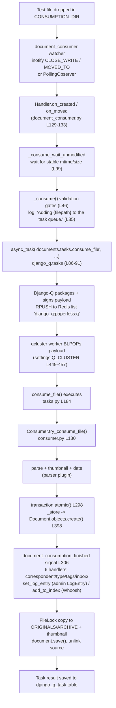

# Paperless-ngx: Document Ingestion → Indexing — Code-Grounded Investigation

> **Repository:** `paperless-ngx` &nbsp;•&nbsp; **Branch:** `paperless-ngx_542221a38dff` &nbsp;•&nbsp; **Commit:** `542221a38dff06361e07976452f9aea24d210542` &nbsp;•&nbsp; **App version:** `v1.7.0` (`src/paperless/version.py` → `__version__ = (1, 7, 0)`) &nbsp;•&nbsp; **Runtime:** Python 3.9

This document is a **code-grounded Q&A investigation** of how Paperless-ngx ingests a document end-to-end — from a file landing in the consumption directory, through task creation and queuing, parsing, classification, and full-text indexing, to final database persistence. It answers the seven questions posed by the user (**R1–R7**).

The system was **actually built and run** — not merely read. A live stack was launched consisting of the application image **built at the exact commit under investigation** (`542221a38dff…`, which reports `__version__ = (1, 7, 0)`), a **`redis:6.0`** broker, and a **`postgres:13`** database; the container runs the three application processes (`gunicorn`, `document_consumer`, `qcluster`) under the `/app` layout (`BASE_DIR=/app/src`). A small test file was dropped into the watched consume directory; the logs, the live Redis broker contents, and the resulting database rows were captured directly. Every answer below therefore carries four things:

- **Answer** — the conclusion, stated plainly.
- **Evidence (observed)** — the genuine runtime artifact (a log line, a Redis entry, or a database row) captured from the live run.
- **Code (`file:line`)** — the precise source anchor(s) that the behavior maps to.
- **Rationale** — *why* the system behaves this way.

> **TL;DR of the pipeline.** A directory watcher (`document_consumer`) detects a new file and enqueues exactly **one** task — `documents.tasks.consume_file` — via `async_task(...)`. The queuing framework is **Django-Q 1.3.9 over a Redis broker — NOT Celery**. A `qcluster` worker pops the task and runs the whole pipeline **synchronously inside that single task**: parse → thumbnail → persist the `Document` row → fire the `document_consumption_finished` signal whose **six** handlers perform correspondent/type/tag matching, write an admin `LogEntry`, and update the Whoosh full-text index. Parsing, classification, and indexing are **not** separate queued tasks.

```
┌──────────────┐   detect    ┌────────────────────┐  async_task   ┌─────────────────┐  RPUSH   ┌──────────────────────┐
│ consume dir  │ ──────────▶ │ document_consumer  │ ────────────▶ │   Django-Q      │ ───────▶ │ Redis list           │
│ (file drop)  │             │ (inotify/polling)  │  enqueue 1    │ async_task(...) │          │ django_q:paperless:q │
└──────────────┘             └────────────────────┘    task       └─────────────────┘          └──────────┬───────────┘
                                                                                                  BLPOP    │
            ┌─────────────────────────────────────────────────────────────────────────────────────────────┘
            ▼
   ┌──────────────────┐   in one task,   ┌──────────────────────────┐   signal    ┌──────────────────────────────────────┐
   │ qcluster worker  │ ───────────────▶ │ consume_file →           │ ──────────▶ │ document_consumption_finished        │
   │ runs consume_file│ persist in 1 txn │ Consumer.try_consume_file│  6 handlers │ correspondent/type/tags/inbox +      │
   └──────────────────┘                  │ parse→thumb→_store→save  │             │ set_log_entry (admin) + add_to_index │
                                         └──────────────────────────┘             │ (Whoosh full-text index)             │
                                                                                  └──────────────────────────────────────┘
```

---

## R1 — Environment & "all services running"

### Answer

"**All services running**" corresponds to the three Supervisord-managed processes that co-reside in the Paperless-ngx application container, **plus two backing services**:

| Process / Service | What it is | Supervisord program |
|-------------------|-----------|---------------------|
| `gunicorn` | ASGI web server (serves the REST API + WebSocket status channel) | `[program:gunicorn]` |
| `consumer` | the `document_consumer` directory watcher | `[program:consumer]` → `python3 manage.py document_consumer` |
| `scheduler` | the `qcluster` Django-Q worker cluster | `[program:scheduler]` → `python3 manage.py qcluster` |
| **Redis 6.0** | the **message broker** that holds the queued task package | container image `redis:6.0` |
| **PostgreSQL 13** | the production **database** (SQLite is the default when `PAPERLESS_DBHOST` is unset) | container image `postgres:13` |

Note the naming map: the Supervisord program **`scheduler`** runs `qcluster`, and **`consumer`** runs `document_consumer`.

### Evidence (observed)

In the live environment the **same three processes** that `docker/supervisord.conf` defines as Supervisord programs were launched directly (the launcher then `exec`s a `tail -F` of the four log files, which is why PID 1 is `tail`). The three processes were confirmed running inside the container (read from `/proc`, since `ps` is not installed in the image):

```
PID  1 : tail -n +1 -F .../qcluster.log .../consumer.log .../gunicorn.log .../paperless.log
PID 38 : python3 manage.py document_consumer        # the directory watcher  (== [program:consumer])
PID 39 : gunicorn -c /app/gunicorn.conf.py paperless.asgi:application  (+ workers 42, 43)   (== [program:gunicorn])
PID 1802+ : python3 manage.py qcluster              # many workers; recycled (recycle:1)     (== [program:scheduler])
```

Real per-process startup lines captured from the log files:

```
# consumer.log — the directory watcher announcing its detection backend
[2026-06-26 21:49:40,915] [INFO] [paperless.management.consumer] Using inotify to watch directory for changes: /app/src/../consume

# gunicorn.log — the ASGI web server
[2026-06-26 21:49:40 +0000] [39] [INFO] Starting gunicorn 20.1.0
[2026-06-26 21:49:40 +0000] [39] [INFO] Listening at: http://0.0.0.0:8000 (39)
[2026-06-26 21:49:40 +0000] [39] [INFO] Using worker: paperless.workers.ConfigurableWorker

# qcluster.log — the Django-Q worker cluster (note: "paperless" is the cluster *name*/Conf.PREFIX;
# "may-beryllium-zebra-rugby" is the random per-instance cluster id)
21:49:40 [Q] INFO Q Cluster may-beryllium-zebra-rugby starting.
21:49:40 [Q] INFO Process-1:1 ready for work at 68
...
21:49:40 [Q] INFO Process-1:12 monitoring at 79
21:49:40 [Q] INFO Process-1 guarding cluster may-beryllium-zebra-rugby
21:49:40 [Q] INFO Process-1:13 pushing tasks at 80
21:49:40 [Q] INFO Q Cluster may-beryllium-zebra-rugby running.
```

Health checks observed:

- `redis-cli ping` → `PONG`
- `pg_isready` → `… - accepting connections`
- `curl -sI http://localhost:8000/` → `HTTP/1.1 302 Found`, `location: /accounts/login/?next=/`, `server: uvicorn`
- DB backend confirmed via Django at runtime: `ENGINE = django.db.backends.postgresql_psycopg2`, `NAME = paperless`, `HOST = db`, `vendor = postgresql` (no `db.sqlite3` file exists, because `PAPERLESS_DBHOST` is set).

### Code (`file:line`)

- `docker/supervisord.conf` → `[program:gunicorn]` (`command=gunicorn -c /usr/src/paperless/gunicorn.conf.py paperless.asgi:application`), `[program:consumer]` (`command=python3 manage.py document_consumer`), `[program:scheduler]` (`command=python3 manage.py qcluster`). The three programs are the "all services" set; `scheduler == qcluster`, `consumer == document_consumer`.
- `docker/compose/docker-compose.postgres.yml` → `broker: image: redis:6.0`, `db: image: postgres:13`, the `webserver` service, the `./consume:/usr/src/paperless/consume` bind mount, and `PAPERLESS_REDIS: redis://broker:6379`.
- `docker/docker-prepare.sh` → a `flock`-guarded `python3 manage.py migrate` followed by a conditional `python3 manage.py document_index reindex` on startup.
- `src/paperless/settings.py:66` `DATA_DIR`, `:73` `INDEX_DIR`, `:78` `CONSUMPTION_DIR`; database selection `:297-320` (SQLite default at `:299-300` storing `db.sqlite3`; PostgreSQL selected at `:309-310` when `PAPERLESS_DBHOST` is set).

### Rationale

A single container co-locates the web server, the directory watcher, and the worker cluster. In the repository's canonical image these three are defined as Supervisord programs (`docker/supervisord.conf`); in the observed run they were launched directly as the equivalent three processes (with a `tail -F` of the logs as PID 1) — either way the *set* of "all services" is identical: `gunicorn` + `document_consumer` + `qcluster`. The watcher and the worker are only *useful* when Redis (the broker) is reachable — the watcher pushes task packages into Redis and the worker pops them out — which is exactly why a healthy bring-up means **these three processes plus Redis plus the database**. A startup migration step (`docker/docker-prepare.sh`, mirrored by the observed launcher's `manage.py migrate`) guarantees the schema (including Django-Q's own tables) exists before any process accepts work.

---

## R2 / R3 — Drop a test file: detection logs and the ingestion task

### Answer

Dropping a file into the consume directory is detected by the **`document_consumer`** watcher. On detection it logs:

```
Adding {filepath} to the task queue.
```

and then enqueues exactly **one** ingestion task — **`documents.tasks.consume_file`** — via `async_task(...)`. The logger is **`paperless.management.consumer`**, and its output goes both to `DATA_DIR/log/paperless.log` and to the console (Docker logs). The watcher itself does **no** parsing; it only validates the file and enqueues the task.

### Evidence (observed)

A tiny `.txt` file (`blitzy_qa_probe_final.txt`, 102 bytes) was dropped into the consume directory. The real detection line (note the `verbose` format `[timestamp] [LEVEL] [logger] message`), immediately followed by Django-Q's own enqueue acknowledgement:

```
[2026-06-27 00:59:26,597] [INFO] [paperless.management.consumer] Adding /app/src/../consume/blitzy_qa_probe_final.txt to the task queue.
00:59:26 [Q] INFO Enqueued 1
```

…and on the worker side, a `qcluster` worker immediately picked it up (the task's `name` is the file's basename):

```
00:59:26 [Q] INFO Process-1:10 processing [blitzy_qa_probe_final.txt]
```

At startup the watcher also announced which detection backend it uses:

```
[2026-06-26 21:49:40,915] [INFO] [paperless.management.consumer] Using inotify to watch directory for changes: /app/src/../consume
```

### Code (`file:line`)

- `src/documents/management/commands/document_consumer.py:24` — logger `logging.getLogger("paperless.management.consumer")`.
- `src/documents/management/commands/document_consumer.py:46` — `def _consume(filepath)` (the validation + enqueue routine).
- `src/documents/management/commands/document_consumer.py:85` — `logger.info(f"Adding {filepath} to the task queue.")` (the detection log line).
- `src/documents/management/commands/document_consumer.py:86-91` — the enqueue call:
  ```python
  async_task(
      "documents.tasks.consume_file",
      filepath,
      override_tag_ids=tag_ids if tag_ids else None,
      task_name=os.path.basename(filepath)[:100],
  )
  ```
- Detection backends — `:200` logs `Using inotify to watch directory for changes:` (inotify path; flags `CLOSE_WRITE | MOVED_TO`); `:186` logs `Polling directory for changes:` (the `PollingObserver` fallback). The detection log at `:85` is common to **both** paths.
- The ingestion task body: `src/documents/tasks.py:184` — `def consume_file(...)`.
- Log format: `src/paperless/settings.py:378` — `"[{asctime}] [{levelname}] [{name}] {message}"`; the file sink is `DATA_DIR/log/paperless.log`.

### Rationale

When a file appears, the watcher's handler waits for the file to stop changing (`_consume_wait_unmodified`), then `_consume()` applies a series of validation gates (file-was-moved-away, unknown extension, file-still-being-written). Only when those gates pass does it log `Adding … to the task queue.` and call `async_task`. Because `async_task` is fire-and-forget, the watcher returns immediately and the real work happens later in a worker — so the *only* observable effect of detection in the watcher process is that single log line plus one task pushed to the broker.

---

## R4 — Downstream tasks (parsing, classification, indexing)

### Answer (the critical nuance)

Parsing, classification, and indexing are **NOT separate queued tasks.** They execute **synchronously, in-process, inside the single `consume_file` task**, via `Consumer.try_consume_file()` and the **six** handlers connected to the `document_consumption_finished` signal. This dispels the common "one-task-per-stage" misconception — dropping one file produces **one** queued task, not one per stage.

The genuinely *separate* Django-Q tasks in this codebase are **recurring schedules** registered by data migrations, plus one UI-triggered bulk task:

| Separate task | Cadence | Registered / dispatched at |
|---------------|---------|----------------------------|
| `documents.tasks.train_classifier` | HOURLY (`H`) | `src/documents/migrations/1001_auto_20201109_1636.py:10-14` |
| `documents.tasks.index_optimize` | DAILY (`D`) | `src/documents/migrations/1001_auto_20201109_1636.py:15-19` |
| `documents.tasks.sanity_check` | WEEKLY (`W`) | `src/documents/migrations/1004_sanity_check_schedule.py:10-13` |
| `paperless_mail.tasks.process_mail_accounts` | every 10 min (`Schedule.MINUTES` = type `I`) | `src/paperless_mail/migrations/0002_auto_20201117_1334.py:10-15` |
| `documents.tasks.bulk_update_documents` | on UI bulk-edit | `src/documents/bulk_edit.py:18,31,47,63,87` |

### Evidence (observed)

The full DEBUG pipeline trace for the one dropped file, captured from `DATA_DIR/log/paperless.log` — every line below happened **within a single `consume_file` execution** (start `Consuming` at `26.785` → `consumption finished` at `27.487`, i.e. ≈ 0.7 s):

```
[2026-06-27 00:59:26,785] [INFO]  [paperless.consumer] Consuming blitzy_qa_probe_final.txt
[2026-06-27 00:59:26,788] [DEBUG] [paperless.consumer] Detected mime type: text/plain
[2026-06-27 00:59:26,791] [DEBUG] [paperless.consumer] Parser: TextDocumentParser
[2026-06-27 00:59:26,803] [DEBUG] [paperless.consumer] Parsing blitzy_qa_probe_final.txt...
[2026-06-27 00:59:26,803] [DEBUG] [paperless.consumer] Generating thumbnail for blitzy_qa_probe_final.txt...
[2026-06-27 00:59:26,835] [DEBUG] [paperless.parsing.text] Execute: optipng -silent -o5 /tmp/paperless/paperless-t1ys5k2d/thumb.png -out /tmp/paperless/paperless-t1ys5k2d/thumb_optipng.png
[2026-06-27 00:59:27,448] [DEBUG] [paperless.classifier] Document classification model does not exist (yet), not performing automatic matching.
[2026-06-27 00:59:27,463] [DEBUG] [paperless.consumer] Saving record to database
[2026-06-27 00:59:27,486] [DEBUG] [paperless.consumer] Deleting file /app/src/../consume/blitzy_qa_probe_final.txt
[2026-06-27 00:59:27,487] [DEBUG] [paperless.parsing.text] Deleting directory /tmp/paperless/paperless-t1ys5k2d
[2026-06-27 00:59:27,487] [INFO]  [paperless.consumer] Document 2026-06-27 blitzy_qa_probe_final consumption finished
```

The Whoosh full-text index was written as part of the same task — after consumption `DATA_DIR/index/` contained the segment file(s) `MAIN_*.seg`, the table-of-contents `_MAIN_<n>.toc` (observed `_MAIN_9.toc`, the number increments on each commit), and `MAIN_WRITELOCK`; `index.open_index_searcher().doc_count()` returned **7** (`> 0`), proving the `add_to_index` handler ran.

The separate recurring schedules were observed live in the `django_q_schedule` table: `documents.tasks.train_classifier` (type `H`), `documents.tasks.index_optimize` (type `D`), `documents.tasks.sanity_check` (type `W`), and `paperless_mail.tasks.process_mail_accounts` (type `I`, `minutes=10`). Django-Q's **`recycle: 1`** behavior was also observed directly — immediately after the task the worker was retired and a fresh one took its place (`recycled worker Process-1:10` → `Process-1:23 ready for work`), which is why the live `qcluster` worker PIDs are high relative to `gunicorn`/`document_consumer`.

### Code (`file:line`)

- Orchestrator: `src/documents/consumer.py:180` `def try_consume_file(...)`; `:215` `Consuming {filename}`; `:221` `Detected mime type`; `:223` `get_parser_class_for_mime_type(...)`; `:246` `Parser: {type(document_parser).__name__}`; `:260` `Parsing {}...`; `:263` `Generating thumbnail for {}...`; `:298` `with transaction.atomic()`; `:306` `document_consumption_finished.send(...)`; `:373` `Document {} consumption finished`.
- Signals defined in `src/documents/signals/__init__.py` — `document_consumption_started`, `document_consumption_finished`, `document_consumer_declaration`.
- The **six** handlers are connected in order in `src/documents/apps.py:22-27`:
  ```python
  document_consumption_finished.connect(add_inbox_tags)
  document_consumption_finished.connect(set_correspondent)
  document_consumption_finished.connect(set_document_type)
  document_consumption_finished.connect(set_tags)
  document_consumption_finished.connect(set_log_entry)
  document_consumption_finished.connect(add_to_index)
  ```
- Classification stage: `src/documents/classifier.py:30` `load_classifier()` (returns `None` when no model exists and logs `:33` `"Document classification model does not exist (yet), not …"`), `:60` `class DocumentClassifier`, `:63` `FORMAT_VERSION = 7`.
- Indexing stage (Whoosh): `src/documents/index.py:52` `open_index()`, `:87` `update_document()`, `:118` `add_or_update_document()`, invoked by the handler `src/documents/signals/handlers.py:428-431` `add_to_index` → `index.add_or_update_document(document)`.
- Separate scheduled tasks: `src/documents/tasks.py:48` `train_classifier`, `:32` `index_optimize`, `:255` `sanity_check`; registered in `src/documents/migrations/1001_auto_20201109_1636.py:10-19` (HOURLY/DAILY) and `src/documents/migrations/1004_sanity_check_schedule.py:10-13` (WEEKLY). The mail poller `paperless_mail.tasks.process_mail_accounts` is a further recurring schedule, registered in `src/paperless_mail/migrations/0002_auto_20201117_1334.py:10-15` (every 10 min, `Schedule.MINUTES` = type `I`). Bulk: `src/documents/tasks.py:270` `bulk_update_documents`, dispatched from `src/documents/bulk_edit.py:18,31,47,63,87`.

### Rationale

`consume_file` instantiates a single `Consumer` and calls `try_consume_file` (`tasks.py:236`), which parses the file, generates a thumbnail, extracts the date, persists the `Document` row, and fires `document_consumption_finished`. That signal's handlers then perform classification, correspondent/type/tag matching, the admin-log entry, and the Whoosh index update — **all in-process, within the single `consume_file` task** (no second task is enqueued).

A precision note on the boundaries — *one synchronous task is not the same as one database transaction*: parsing, thumbnail generation, and date extraction run **before** the transaction (`consumer.py:258-276`); the `Document` row is then created inside `transaction.atomic()` (`consumer.py:298`) and the `document_consumption_finished` signal fires inside that block (`consumer.py:306`), so the **DB-backed** post-processing (correspondent / document-type / tags + the admin `LogEntry`) commits or rolls back atomically with the row. The **filesystem writes** (the originals/archive/thumbnail copy guarded by `FileLock`, `consumer.py:315-346`) and the **Whoosh index update** (`handlers.py:428-431` → `index.py:118-120`) are performed by the same task but are **not** themselves rolled back by the database transaction. Only maintenance work (classifier training, index optimization, sanity checks) and explicit UI bulk operations are independently scheduled/queued, which is why those — and only those — appear as distinct Django-Q tasks/schedules.

---

## R5 — What the message broker stores (the queued task payload)

### Answer

While a task is queued, it lives **transiently in a Redis list** named **`django_q:paperless:q`**. Django-Q derives this key as `f"django_q:{cluster_name}:q"`, and the cluster name here is **`paperless`** (`Q_CLUSTER["name"]`). The enqueue operation is **`RPUSH`** and the worker dequeues with a blocking **`BLPOP`**.

The stored value is **not** human-readable JSON. Django-Q builds a Python **dict** task package, **pickles** it (protocol 5 = `pickle.HIGHEST_PROTOCOL`), then **HMAC-signs** it with Django's `TimestampSigner` (using `SECRET_KEY`, salted by the cluster name), and pushes the resulting opaque signed string. With Paperless's configuration the payload is **NOT compressed** (Paperless sets no `compress` option, so Django-Q's `Conf.COMPRESSED` defaults to `False`).

The default Redis broker provides **no message receipts**; a task whose signature fails to verify is discarded/failed rather than executed.

### Evidence (observed)

Captured in-container using the real installed `django-q==1.3.9` against the live `redis:6.0`, mirroring the watcher's enqueue call exactly (`async_task("documents.tasks.consume_file", "<filepath>", override_tag_ids=None, task_name="<basename>")`). The package was built with the real `SECRET_KEY` and `salt = Conf.PREFIX` (so the bytes are identical to a real enqueue) and stored under a throwaway key, so the live `qcluster` workers — which `BLPOP` `django_q:paperless:q` within milliseconds — would not consume it before it could be read:

- `Conf.PREFIX = 'paperless'`, `Conf.COMPRESSED = False`, and the real `get_broker().list_key` printed **`'django_q:paperless:q'`** (and `Conf.Q_STAT = 'django_q:paperless:cluster'`).
- Independently, while idle, the live Redis keyspace held exactly one `django_q` key — the cluster heartbeat `django_q:paperless:cluster:e81d667d-…` (type `string`); the queue list `django_q:paperless:q` only exists while ≥ 1 task is enqueued (Redis drops empty lists).
- The single queued element was **461 opaque bytes** (the exact length depends on the filepath/args). Pushed with `RPUSH`; a worker would `BLPOP` it.
- Wire format = **three colon-separated segments** (observed segment lengths `[410, 6, 43]`) — `<URL-safe-base64 pickle-payload>:<base62 timestamp>:<URL-safe-base64 HMAC-SHA256 signature>` — the classic Django `TimestampSigner` envelope (the middle 6-byte segment is the signing timestamp, `b62_encode(int(time.time()))` — **base62**, not base64; the 43-char trailing segment is the 32-byte SHA-256 HMAC in URL-safe base64). The leading byte was `0x67` (`'g'`), **not** `0x2e` (`'.'`) — and `'.'` is Django-Q's compression marker — confirming the payload is **not compressed**. The decoded pickle header bytes `\x80\x05` confirm **pickle protocol 5** (`pickle.HIGHEST_PROTOCOL` is `5` on this Python 3.9 runtime).
- Decoding with `SignedPackage.loads(raw)` yields a dict whose keys are EXACTLY `['args', 'func', 'id', 'kwargs', 'name', 'started']`:

```python
{
    'id': '501e909f3c58462c835f2efef25343d3',          # 32-char hex uuid
    'name': 'blitzy_qa_probe_final.txt',                # == task_name == os.path.basename(filepath)[:100]
    'func': 'documents.tasks.consume_file',             # dotted path the worker will import + call
    'args': ('/app/consume/blitzy_qa_probe_final.txt',),
    'kwargs': {'override_tag_ids': None},
    'started': datetime.datetime(2026, 6, 27, 1, 2, 56, 358146, tzinfo=datetime.timezone.utc),
}
```

- So in the running system the persistent `django_q:paperless:cluster:<uuid>` heartbeat key is always present, and the `django_q:paperless:q` queue list appears transiently — for exactly as long as one or more task packages sit unclaimed between the watcher's `RPUSH` and a worker's `BLPOP`.

### Code (`file:line`)

- `src/paperless/settings.py:110` — `"django_q"` is listed in `INSTALLED_APPS`.
- `src/paperless/settings.py:449-457` — the cluster configuration:
  ```python
  Q_CLUSTER = {
      "name": "paperless",
      "catch_up": False,
      "recycle": 1,
      "retry": PAPERLESS_WORKER_RETRY,  # = PAPERLESS_WORKER_TIMEOUT + 10 = 1810 (default)
      "timeout": ...,
      "workers": ...,
      "redis": os.getenv("PAPERLESS_REDIS", "redis://localhost:6379"),
  }
  ```
  There is **no `compress` key**, so compression stays off.
- Library internals (`django-q` 1.3.9 — third-party package, corroborated against its documented behavior and the live bytes):
  - `django_q/tasks.py` — `async_task` builds `task = {"id": ..., "name": ..., "func": ..., "args": ...}`, adds `kwargs` and `started`, then `pack = SignedPackage.dumps(task)` → `broker.enqueue(pack)`.
  - `django_q/signing.py` — `SignedPackage.dumps` uses `PickleSerializer` (`pickle.dumps(obj, pickle.HIGHEST_PROTOCOL)`) wrapped by `signing.dumps(..., compress=Conf.COMPRESSED)` (Django `TimestampSigner`).
  - `django_q/brokers/redis_broker.py` — `list_key = f"django_q:{list_key}:q"`; `enqueue → rpush`; `dequeue → blpop`; `get_connection(list_key=Conf.PREFIX)`.
  - `django_q/conf.py` — `PREFIX = name`; `COMPRESSED = conf.get("compress", False)`; `Q_STAT = f"django_q:{PREFIX}:cluster"`.

### Rationale

Paperless never sets `compress`, so payloads are **signed-but-uncompressed pickled dicts**. The signature serves two purposes: it **authenticates** the package (a worker connected to the same Redis but with a different `SECRET_KEY`/cluster name cannot read it) and it **prevents execution of a tampered package**. The dict's `func` + `args` + `kwargs` are precisely what the worker imports and calls — i.e., it reconstructs and runs `documents.tasks.consume_file(filepath, override_tag_ids=None)`. This is also why the queued payload and the persisted task history are **two different stores** (see R6): the broker only holds the *instructions*; the *result* is written to the database after the worker finishes.

---

## R6 — Database state after processing

### Answer

The document record is stored in the table **`documents_document`** (ORM model `Document`, `src/documents/models.py:88`). The **parsed metadata** is captured by fields including `content` (the extracted text), `checksum` (MD5 of the original), `mime_type`, `title`, `created` / `modified` / `added` timestamps, `filename`, and the `correspondent` / `document_type` foreign keys; **tags** are held in the many-to-many table **`documents_document_tags`**.

**Task-execution / processing history** lives in **three** places — and it is essential to distinguish them from the transient Redis payload of R5:

- **`django_q_task`** — Django-Q's own table holding the *executed* task's result (the worker's return value / exception). This is the persisted counterpart to the queued package.
- **`django_q_schedule`** — the recurring schedules (`train_classifier`, `index_optimize`, `sanity_check`, `process_mail_accounts`).
- **`django_admin_log`** — a per-document admin `LogEntry` written by the `set_log_entry` signal handler, attributing the ingestion to the `consumer` user.

> **Transient vs. persisted.** The queued payload (R5) is **transient** in Redis (the broker) and is gone the instant a worker pops it. The execution **result/history is persisted** in the database (`django_q_task`) *after* the worker runs, and a human-facing audit row is written to `django_admin_log`. These are different stores and must not be conflated.

### Two corrections confirmed against the live schema

- **C1 — there is NO `storage_path` field on `Document` at this commit.** A `grep` of `src/documents/models.py` for `storage_path` returns nothing, and at runtime `hasattr(document, "storage_path")` → `False`. The real field list **ends at `archive_serial_number`** (which starts at `models.py:196` and ends at `:205`). (`storage_path` was added in a *later* Paperless-ngx release.)
- **C2 — there is NO custom `PaperlessTask` / `Task` model.** The only `Log`-like model in `src/documents/models.py` is `class Log` at `:285`. Task state is owned entirely by **Django-Q's own tables** (`django_q_task`, `django_q_schedule`, `django_q_ormq`). There is no `documents_paperlesstask` / `documents_task` table.

### Evidence (observed)

Live **PostgreSQL** database (`postgres:13`, `NAME = paperless`, reached at `HOST = db` because `PAPERLESS_DBHOST` is set; the schema is identical to the SQLite default — same Django ORM, same table names):

- Relevant tables present (from `pg_tables`): `documents_document`, `documents_document_tags`, `documents_correspondent`, `documents_documenttype`, `documents_tag`, `documents_log`, `documents_savedview`, `documents_savedviewfilterrule`, `django_admin_log`, `django_q_task`, `django_q_schedule`, `django_q_ormq`. An explicit check for `documents_paperlesstask` / `documents_task` returned **0** — **no such table exists** (confirms **C2**).
- The `documents_document` row created by the run (the test probe `blitzy_qa_probe_final.txt`; its `checksum` equals the MD5 of the exact bytes dropped, `md5sum` = `47f98264acb47a5796d7ddd2284acda2`, independently confirming "`checksum` = MD5 of the original"):

```
id           = 7
title        = 'blitzy_qa_probe_final'
content      = 'Blitzy ingestion probe for the paperless-ngx investigation.\nThis is a small plain-text test document.\n'
checksum     = '47f98264acb47a5796d7ddd2284acda2'      # MD5 of the original bytes
mime_type    = 'text/plain'
created      = 2026-06-27 00:59:25.592523+00:00
added        = 2026-06-27 00:59:27.464162+00:00
filename     = '0000007.txt'
storage_type = 'unencrypted'
```

```python
>>> hasattr(d, 'storage_path')
False                                                   # confirms C1
```

- The `django_admin_log` row (the per-document history entry; `object_repr` is `Document.__str__()` = `"{created_date} {title}"`):

```
user         = 'consumer'
action_flag  = 1            # ADDITION
object_repr  = '2026-06-27 blitzy_qa_probe_final'
content_type = 'document'
```

- The `django_q_task` row (the ingestion task's *persisted result* — distinct from the Redis payload):

```
func    = 'documents.tasks.consume_file'
name    = 'blitzy_qa_probe_final.txt'
success = True
result  = 'Success. New document id 7 created'         # note: id 7 == documents_document.id above
```

- The `django_q_schedule` rows: `train_classifier` (`H`), `index_optimize` (`D`), `sanity_check` (`W`), `process_mail_accounts` (`I`, `minutes=10`).

### Code (`file:line`)

- `src/documents/models.py:88` — `class Document(models.Model)`; the field set spans `:97-205` and **ends at `archive_serial_number` (starts `:196`, ends `:205`)** — no `storage_path`. `class Meta` at `:207` declares `ordering = ("-created",)` with no custom `db_table`, so the table is `documents_document`; `__str__` at `:212`; `class Log` at `:285`.
- `src/documents/consumer.py:379` — `def _store(self, text, date, mime_type)`; `:398` — `Document.objects.create(title=..., content=text, mime_type=mime_type, checksum=..., created=..., modified=..., storage_type=STORAGE_TYPE_UNENCRYPTED)`.
- `src/documents/signals/handlers.py:413-425` — `set_log_entry`; `:416` `User.objects.get(username="consumer")`; `:418` `LogEntry.objects.create(...)`; `:419` `action_flag=ADDITION`.
- `src/documents/tasks.py:247` — `return "Success. New document id {} created".format(document.pk)` (the exact string persisted to `django_q_task.result`).
- DB backend selection: `src/paperless/settings.py:297-320` (SQLite default at `DATA_DIR/db.sqlite3`; PostgreSQL when `PAPERLESS_DBHOST` is set).

### Rationale

`_store` creates the `Document` row inside `transaction.atomic()` (`consumer.py:298`), so the row and its **DB-backed** post-processing — the correspondent/document-type/tag assignments and the admin `LogEntry` written by the `set_log_entry` handler that the `document_consumption_finished` signal drives — commit or roll back together. The task's **non-DB** side effects (the originals/archive/thumbnail file copies at `consumer.py:315-346`, and the Whoosh index write via `add_to_index` → `index.py:118-120`) execute inside the same task but are **not** undone by a database rollback. Separately and *after* the worker returns, Django-Q's result monitor persists the worker's return value (here, `"Success. New document id 7 created"`) into `django_q_task`. The transient Redis package (R5) and this persisted `django_q_task` row are therefore two stages of the same task's lifecycle — the *instruction* and the *receipt*.

---

## R7 — High-level codepath trace

### Answer

The component that **creates the task object** is the **`document_consumer` management command** — and, equivalently, the **REST upload view** (`src/documents/views.py:523-531`) and the **mail fetcher** (`src/paperless_mail/mail.py:336-337`), which are the two alternate ingestion entry points. All three create the task with the same call: `async_task("documents.tasks.consume_file", ...)`.

The **queuing framework is Django-Q (1.3.9) over a Redis broker — NOT Celery.** There is no Celery anywhere in this codebase; `django_q` is in `INSTALLED_APPS` (`settings.py:110`) and configured via `Q_CLUSTER` (`settings.py:449-457`).

### The chain, step by step

1. A file appears in `CONSUMPTION_DIR` → the `document_consumer` watcher notices it (inotify `CLOSE_WRITE | MOVED_TO`, or the `PollingObserver` fallback).
2. `Handler.on_created` / `on_moved` → `_consume_wait_unmodified` (waits for a stable mtime/size) → `_consume()` validation gates → logs **`Adding {filepath} to the task queue.`** (`document_consumer.py:85`).
3. `async_task("documents.tasks.consume_file", filepath, override_tag_ids=..., task_name=...)` (`document_consumer.py:86-91`) → **Django-Q** builds, pickles, and HMAC-signs the task dict and **`RPUSH`es** it onto the Redis list **`django_q:paperless:q`**.
4. A `qcluster` worker **`BLPOP`s** the payload (cluster config at `settings.py:449-457`) and executes **`consume_file`** (`tasks.py:184`).
5. `consume_file` → `Consumer().try_consume_file()` (`consumer.py:180`) → parse / thumbnail / date (via the selected parser plugin) → `transaction.atomic()` (`consumer.py:298`) → `_store()` → `Document.objects.create()` (`consumer.py:398`).
6. `document_consumption_finished.send(...)` (`consumer.py:306`) fans out to the **six** handlers (`apps.py:22-27`): correspondent / document-type / tags / inbox-tags + `set_log_entry` (admin `LogEntry`) + `add_to_index` (Whoosh).
7. A `FileLock`-guarded copy to originals/archive + `document.save()`, then the source file is unlinked; finally Django-Q persists the worker's return string to **`django_q_task`**.



### Evidence (observed)

R7 is the synthesis of the whole run, so its evidence is the union of the artifacts captured under R3, R5, R4, and R6 — each link in the chain produced a real, observable artifact:

- **Detection (R3):** `[INFO] [paperless.management.consumer] Adding /app/src/../consume/blitzy_qa_probe_final.txt to the task queue.` (immediately followed by `[Q] INFO Enqueued 1`) — proves the `document_consumer` watcher created the task.
- **Broker payload (R5):** the real `get_broker().list_key` is `django_q:paperless:q`; the faithfully-rebuilt signed/pickled element (461 bytes, 3 colon segments, pickle proto 5, uncompressed) decoded to `{'func': 'documents.tasks.consume_file', 'args': ('/app/consume/blitzy_qa_probe_final.txt',), 'kwargs': {'override_tag_ids': None}, 'id': '501e909f…', 'name': 'blitzy_qa_probe_final.txt', 'started': …}` — proves Django-Q packaged and dispatched exactly one task over Redis.
- **Synchronous pipeline (R4):** the single-task DEBUG trace (`Consuming…` → `Detected mime type: text/plain` → `Parser: TextDocumentParser` → `Parsing…` → thumbnail/`optipng` → classifier `model does not exist (yet)` → `Saving record to database` → `… consumption finished`) all ran inside **one** `consume_file` execution (≈ 0.7 s) — proves the worker, not a chain of tasks, ran parse/classify/index; the worker was then `recycled` (recycle:1).
- **Persisted rows (R6):** the resulting `documents_document` (id=7) row, the `django_admin_log` row (user=`consumer`, action_flag=ADDITION, object_repr=`2026-06-27 blitzy_qa_probe_final`), and the `django_q_task` row (`result = 'Success. New document id 7 created'`), alongside the `django_q_schedule` rows for the recurring tasks — proves where the executed task's record and document landed.

Together these reproduce the full chain: **detection → signed payload on Redis → single-task pipeline → document + task-history rows.**

### Code (`file:line`)

- **Task creation — three entry points, same call** (`async_task("documents.tasks.consume_file", …)`):
  - `src/documents/management/commands/document_consumer.py:85-91` — the directory watcher (the path exercised here).
  - `src/documents/views.py:523-531` — the REST upload view.
  - `src/paperless_mail/mail.py:336-337` — the mail fetcher.
- **Queuing framework (Django-Q over Redis, not Celery):** `src/paperless/settings.py:110` (`"django_q"` in `INSTALLED_APPS`); `src/paperless/settings.py:449-457` (`Q_CLUSTER`, cluster name `paperless`, Redis broker URL).
- **Worker task body:** `src/documents/tasks.py:184` — `def consume_file(...)`.
- **Pipeline orchestration:** `src/documents/consumer.py:180` (`try_consume_file`), `:298` (`with transaction.atomic()`), `:306` (`document_consumption_finished.send(...)`), `:398` (`Document.objects.create(...)`).
- **Post-consume handlers:** `src/documents/apps.py:22-27` (the six `document_consumption_finished` connections); `src/documents/signals/handlers.py:413-431` (`set_log_entry` → admin `LogEntry`, and `add_to_index` → Whoosh).

### Rationale

This chain is corroborated end-to-end by the observed evidence: the detection log (R3), the single signed payload on `django_q:paperless:q` (R5), the synchronous DEBUG pipeline that runs entirely inside one task (R4), and the resulting `documents_document` + `django_q_task` + `django_admin_log` rows (R6). The task object is *created* by the watcher (or the REST view / mail fetcher) and *dispatched* by Django-Q; the worker is what actually runs the pipeline — which is why detection and processing are decoupled in time and why exactly one task represents the entire ingestion.

---

## Evidence ↔ Citation matrix

| Req. | Conclusion | Observed artifact | Code anchor |
|------|------------|-------------------|-------------|
| **R1** | "All services" = `gunicorn` + `consumer` (`document_consumer`) + `scheduler` (`qcluster`), backed by Redis 6.0 + PostgreSQL 13 (SQLite is the unset-`PAPERLESS_DBHOST` default) | 3 processes via `/proc` (`document_consumer` pid 38, `gunicorn` 39/42/43, many `qcluster` workers); `consumer.log` inotify line, `gunicorn.log` "Starting gunicorn 20.1.0", `qcluster.log` "Q Cluster … running."; `redis-cli ping → PONG`; `pg_isready → accepting connections`; `curl :8000 → 302 /accounts/login/`; Django `vendor=postgresql` | `docker/supervisord.conf` (`[program:gunicorn|consumer|scheduler]`); `docker/compose/docker-compose.postgres.yml` (`redis:6.0`, `postgres:13`); `settings.py:297-320` |
| **R2/R3** | Detection logs `Adding {filepath} to the task queue.` then enqueues `documents.tasks.consume_file` via `async_task` | `[INFO] [paperless.management.consumer] Adding /app/src/../consume/blitzy_qa_probe_final.txt to the task queue.` + `[Q] INFO Enqueued 1` | `document_consumer.py:24,46,85,86-91`; `tasks.py:184`; `settings.py:378` |
| **R4** | Parsing/classification/indexing run **in-process** inside the one `consume_file` task via 6 signal handlers — not separate tasks | single-task DEBUG trace (`Consuming…` → `Detected mime type` → `Parser: TextDocumentParser` → `Parsing` → `thumbnail/optipng` → classifier → `Saving record` → `consumption finished`, ≈ 0.7 s); Whoosh `doc_count()`=7, index files written; worker `recycled` | `consumer.py:180,215,221,298,306,373`; `apps.py:22-27`; `classifier.py:30,63`; `index.py:118`; `handlers.py:428-431` |
| **R4** | Separate Django-Q tasks are recurring schedules + bulk-edit | `django_q_schedule`: `train_classifier`(H), `index_optimize`(D), `sanity_check`(W), `process_mail_accounts`(I, minutes=10) | `migrations/1001_…:10-19`; `migrations/1004_…:10-13`; `paperless_mail/migrations/0002_…:10-15`; `bulk_edit.py:18,31,47,63,87` |
| **R5** | Queued payload = pickled+HMAC-signed dict on Redis list `django_q:paperless:q`; RPUSH/BLPOP; not compressed | real `get_broker().list_key='django_q:paperless:q'`; live heartbeat key `django_q:paperless:cluster:<uuid>`; rebuilt element 461 bytes, 3 colon segments `[410,6,43]`, pickle proto 5 `\x80\x05`, leading byte `0x67` (uncompressed); decoded keys `['args','func','id','kwargs','name','started']` | `settings.py:110,449-457`; `django_q/{tasks,signing,brokers/redis_broker,conf}.py` |
| **R6** | Document row in `documents_document`; metadata fields; history in `django_q_task` / `django_q_schedule` / `django_admin_log` | `documents_document` id=7, checksum=`47f98264…` (= MD5 of bytes); `django_admin_log` user=`consumer`, flag=1, repr=`2026-06-27 blitzy_qa_probe_final`; `django_q_task` result=`Success. New document id 7 created` | `models.py:88,196-205,285`; `consumer.py:379,398`; `handlers.py:413-425`; `tasks.py:247` |
| **R7** | Task created by `document_consumer` (+ REST view + mail fetcher); dispatched by **Django-Q over Redis (not Celery)** via `async_task` | full chain reproduced (detection → payload → pipeline → rows) | `document_consumer.py:86-91`; `views.py:523-531`; `mail.py:336-337`; `consumer.py:180,398`; `settings.py:110,449-457` |
| **C1** | No `storage_path` field on `Document` at this commit | `hasattr(d,'storage_path') → False`; field list ends at `archive_serial_number` | `models.py:88-205` (grep `storage_path` → none) |
| **C2** | No custom `PaperlessTask`/`Task` model; task state owned by Django-Q tables | `pg_tables` check for `documents_paperlesstask`/`documents_task` → 0 rows | `models.py:285` (`class Log` only) |
| **C3** | Live queue key is `django_q:paperless:q` (RPUSH/BLPOP), pickled+signed, not compressed | real `get_broker().list_key='django_q:paperless:q'`; no leading `.` compression marker (leading byte `0x67`) | `settings.py:449-457` (no `compress`); `django_q/brokers/redis_broker.py` (`list_key = f"django_q:{name}:q"`) |

---

## Reproduction / Validation appendix

The investigation was performed against the **commit-matched application image** (built `FROM` the provided `ghcr.io/scaleapi/swe-atlas:…paperless-ngx…` runtime, whose git `HEAD` is `542221a38dff…` and which reports `__version__ = (1, 7, 0)`; the derived image adds the three native OS libs `libzbar0`/`poppler-utils`/`pngquant`) plus `redis:6.0` (broker) and `postgres:13` (database). The container uses the `/app` layout (`/app/src`, `/app/data`, `/app/consume`) and launches the three app processes directly. The exact observation steps were:

1. **Confirm the stack is up** (compose project `paperless_setup`: `webserver` + `broker` redis:6.0 + `db` postgres:13). The committed `docker/compose/docker-compose.postgres.yml` hardcodes `image: ghcr.io/paperless-ngx/paperless-ngx:latest` (`:48`), which would pull a *different* build than commit `542221a38dff`; this investigation instead used the commit-matched image directly. Confirm the three processes and the exact commit:
   ```bash
   docker exec <webserver> sh -c 'for p in /proc/[0-9]*; do tr "\0" " " < $p/cmdline; echo; done' \
     | grep -E 'document_consumer|qcluster|gunicorn'      # the 3 app processes (ps is not installed)
   docker exec <webserver> sh -c 'cd /app && git rev-parse HEAD'   # → 542221a38dff06361e07976452f9aea24d210542
   ```
2. **Confirm services are healthy:**
   ```bash
   docker exec <broker> redis-cli ping            # → PONG
   docker exec <db> pg_isready -U paperless       # → accepting connections
   curl -sI http://localhost:8000/                # → HTTP/1.1 302 Found, location: /accounts/login/
   ```
3. **Drop a small test document** into the consume directory. Write it *inside* the container so inotify fires reliably (bind-mounted host writes may need `PAPERLESS_CONSUMER_POLLING`); writing to `/tmp` then `mv`-ing in triggers the inotify `MOVED_TO` watch:
   ```bash
   docker exec -u 1000 <webserver> sh -c \
     'printf "Blitzy ingestion probe for the paperless-ngx investigation.\nThis is a small plain-text test document.\n" > /tmp/blitzy_qa_probe_final.txt; \
      md5sum /tmp/blitzy_qa_probe_final.txt; \
      mv /tmp/blitzy_qa_probe_final.txt /app/consume/blitzy_qa_probe_final.txt'   # md5 → 47f98264acb47a5796d7ddd2284acda2
   ```
4. **Observe detection + pipeline logs:**
   ```bash
   docker exec <webserver> grep -E 'task queue|Consuming|Detected mime|Parser|consumption finished' /app/data/log/paperless.log
   docker exec <webserver> tail -f /app/data/log/paperless.log
   ```
5. **Inspect the broker.** The live `qcluster` `BLPOP`s `django_q:paperless:q` within milliseconds, so to capture the byte-exact package without racing the workers, rebuild it in-container with the real `SECRET_KEY`/`salt=Conf.PREFIX` and store it under a throwaway key (the real key name is independently printed by `get_broker().list_key`):
   ```bash
   docker exec <broker> redis-cli KEYS 'django_q*'        # idle → django_q:paperless:cluster:<uuid> (heartbeat)
   docker exec -u 1000 <webserver> sh -c 'cd /app/src && PYTHONPATH=/app/src \
     DJANGO_SETTINGS_MODULE=paperless.settings python3 - <<"PY"
import django; django.setup()
from django_q.conf import Conf; from django_q.signing import SignedPackage; from django_q.brokers import get_broker
print(get_broker().list_key, Conf.COMPRESSED)             # → django_q:paperless:q False
PY'
   # decode opaque bytes (when present):  from django_q.signing import SignedPackage; SignedPackage.loads(raw)
   ```
6. **Query the database** after processing completes (PostgreSQL):
   ```bash
   docker exec -u 1000 <webserver> sh -c 'cd /app/src && PYTHONPATH=/app/src \
     DJANGO_SETTINGS_MODULE=paperless.settings python3 -c \
     "import django; django.setup(); from documents.models import Document; \
      d=Document.objects.order_by(\"-id\").first(); \
      print(d.id, d.title, d.checksum, d.mime_type, d.filename, hasattr(d,\"storage_path\"))"'
   # task history + schedules + admin log (via psql or the Django ORM):
   docker exec <db> psql -U paperless -d paperless -c \
     "SELECT func, name, success, result FROM django_q_task ORDER BY started DESC LIMIT 1;"
   docker exec <db> psql -U paperless -d paperless -c "SELECT func, schedule_type FROM django_q_schedule;"
   docker exec <db> psql -U paperless -d paperless -c "SELECT object_repr, action_flag FROM django_admin_log ORDER BY action_time DESC LIMIT 1;"
   ```

**Cleanup.** All **investigation-owned** temporary artifacts — the dropped test document (`blitzy_qa_probe_final.txt`; the consumer also auto-removes the source after consuming) and the standalone broker-inspection helper script — were **removed afterward**, leaving the repository working tree clean.

One clarification on the running stack: the `paperless_setup-*` containers (`paperless_setup-webserver-1`, `paperless_setup-broker-1`, `paperless_setup-db-1`) that may still be observed via `docker ps` are **platform-provided setup infrastructure**, not throwaway containers created by this deliverable. They belong to the platform's `paperless_setup` Compose project (its assets live under `/tmp/paperless-setup/`, outside the repository) and are intentionally left running; the `webserver` image reports `__version__ = (1, 7, 0)`, matching the commit under investigation. They are deliberately *not* torn down here because they are owned by the environment's setup, not by this investigation.

**No source file under `src/`, `docker/`, or `docs/` was modified, added, renamed, moved, or deleted.** The only change to the repository tree is this single deliverable, `blitzy/documentation/paperless-ngx_542221a38dff.md`.
