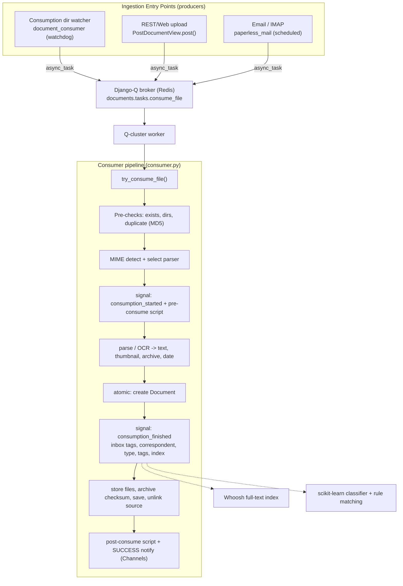

# How documents flow through paperless-ngx (commit `542221a38dff`)

This document answers five "big-picture" questions about how documents move through
**paperless-ngx**, pinned to commit
`542221a38dff06361e07976452f9aea24d210542`:

1. How does a new document usually *enter* paperless-ngx?
2. Once received, what are the main *stages* a document goes through before it is fully
   processed and available — and are there background jobs?
3. What is used for *background execution*?
4. What *metadata fields* are saved, and which are absolutely required versus optional
   or derived later during runtime processing (shown with a runtime example)?
5. How are *tags*, *correspondents*, and *document types* used together to organize
   documents in a practical way?

**How to read this document**

- **Code is the source of truth.** Every substantive claim carries a precise citation of
  the form `path:Lline` (file plus line number) at the commit above. Where current online
  documentation disagrees with the code at this commit (most notably **Django-Q vs.
  Celery**), the code wins and this document follows the code.
- **Findings are code-derived**, and the metadata answer is backed by a **reproduced
  runtime example** captured from the project's pinned runtime.
- **Rationale is included.** Each section ends with a short *Thinking / why* note that
  explains the reasoning behind the conclusion, not just the conclusion itself.
- **Scope caveat.** All findings pertain specifically to commit `542221a38dff` and must
  **not** be generalized to other versions of paperless-ngx. (For example, the project
  later migrated its task queue to Celery; see §7.)
- Citations beginning with `docs/` refer to the project's own Sphinx documentation and are
  used **only as secondary corroboration**; the code prevails on every conflict.

## Table of contents

1. [Overview, scope, and the end-to-end flow](#1-overview-scope-and-the-end-to-end-flow)
2. [How a document enters (Q1)](#2-how-a-document-enters-q1)
3. [Processing stages: the consumer pipeline (Q2)](#3-processing-stages-the-consumer-pipeline-q2)
4. [Background jobs and execution engine (Q3)](#4-background-jobs-and-execution-engine-q3)
5. [Document metadata fields, required vs optional vs derived (Q3 metadata)](#5-document-metadata-fields-required-vs-optional-vs-derived-q3-metadata)
6. [Tags, correspondents, and document types (Q4)](#6-tags-correspondents-and-document-types-q4)
7. [Methodology and rationale](#7-methodology-and-rationale)

---

## 1. Overview, scope, and the end-to-end flow

paperless-ngx is built around a **producer/consumer** architecture. There are exactly
**three** ways a document usually enters the system, and all three are *producers* that
enqueue **the same** background task — `documents.tasks.consume_file` — onto a **Django-Q**
task queue backed by a **Redis** broker. A Django-Q cluster worker later picks up that task
and runs the heavy lifting in `Consumer.try_consume_file()`
(`src/documents/consumer.py:L180`).

The end-to-end flow is:

1. **Ingest (produce).** The consumption-directory watcher
   (`src/documents/management/commands/document_consumer.py:L86-L91`), the REST/web upload
   endpoint (`src/documents/views.py:L523-L533`), or the email/IMAP fetcher
   (`src/paperless_mail/mail.py:L336-L337`) calls
   `async_task("documents.tasks.consume_file", ...)`.
2. **Dispatch.** Django-Q persists the task and a cluster worker dequeues it; the task
   function `consume_file` (`src/documents/tasks.py:L184`) ultimately invokes
   `Consumer().try_consume_file(...)` (`src/documents/tasks.py:L236-L244`).
3. **Process (consume).** The consumer runs an ordered pipeline
   (`src/documents/consumer.py:L180-L377`): pre-checks and duplicate detection → MIME
   detection and parser selection → `document_consumption_started` signal and the
   pre-consume script → parse/OCR producing text, a thumbnail, an optional archive file,
   and a date → an **atomic** block that creates the `Document` row → the
   `document_consumption_finished` signal that assigns inbox tags / correspondent / type /
   tags and indexes the document → file storage, archive checksum, save, and unlink of the
   source → the post-consume script and a final **SUCCESS** notification broadcast over the
   Channels group `status_updates`.

The diagram below summarizes this flow (it reflects the code at commit `542221a38dff`):



**Thinking / why.** The entire system is a producer/consumer architecture, so the two
questions "how does a document enter?" and "what happens next?" have crisp, verifiable
answers in the code: "how a document enters" is *exactly* the set of call sites that
enqueue `consume_file`, and "what happens next" is *exactly* the linear body of
`try_consume_file()`. Framing the whole answer around that one task is what makes every
claim below checkable against a specific line of source.

---

## 2. How a document enters (Q1)

There are exactly **three** ways a document usually enters paperless-ngx. All three are
*producers*: each one enqueues the **same** Django-Q task,
`documents.tasks.consume_file`, via `from django_q.tasks import async_task`. Identifying
the three `async_task("documents.tasks.consume_file", ...)` call sites therefore answers
the question exhaustively and from code.

### 2.1 Consumption-directory watcher (file dropped into a folder)

- **File:** `src/documents/management/commands/document_consumer.py`.
- It imports the task dispatcher at `src/documents/management/commands/document_consumer.py:L13`
  (`from django_q.tasks import async_task`).
- The `_consume()` helper enqueues the task at
  `src/documents/management/commands/document_consumer.py:L86-L91`:
  `async_task("documents.tasks.consume_file", filepath, override_tag_ids=..., task_name=...)`.
- **File detection** uses the `watchdog` library (imports at
  `src/documents/management/commands/document_consumer.py:L16-L17`). It prefers recursive
  inotify via `inotifyrecursive`, imported inside a `try/except` so the module degrades
  gracefully when inotify is unavailable
  (`src/documents/management/commands/document_consumer.py:L19-L22`). The observer is
  selected at `src/documents/management/commands/document_consumer.py:L178-L181` — inotify
  when `CONSUMER_POLLING == 0`, otherwise a `PollingObserver`
  (`src/documents/management/commands/document_consumer.py:L187`).
- It supports **sub-directories-as-tags**: `_tags_from_path()`
  (`src/documents/management/commands/document_consumer.py:L27-L38`) walks the directory
  tree and gets/creates a `Tag` per folder; it is gated by the `CONSUMER_SUBDIRS_AS_TAGS`
  setting (`src/documents/management/commands/document_consumer.py:L79`, used at
  `L80`). Ignore patterns are handled by `_is_ignored()`
  (`src/documents/management/commands/document_consumer.py:L41-L43`), and an extension gate
  `is_file_ext_supported(...)` filters unsupported files
  (`src/documents/management/commands/document_consumer.py:L54`).
- The management `Command` docstring describes the watcher as an "infinite loop" that
  consumes what it can from the consumption directory
  (`src/documents/management/commands/document_consumer.py:L136-L140`).

### 2.2 REST / web upload (API and the Angular drag-and-drop UI)

- **File:** `src/documents/views.py`.
- It imports the dispatcher at `src/documents/views.py:L28`.
- The endpoint is `class PostDocumentView(GenericAPIView)` (`src/documents/views.py:L491`)
  with `serializer_class = PostDocumentSerializer` (`src/documents/views.py:L494`) and a
  `post()` handler (`src/documents/views.py:L497`).
- The handler ensures the scratch directory exists
  (`os.makedirs(settings.SCRATCH_DIR, exist_ok=True)`, `src/documents/views.py:L510`),
  writes the uploaded bytes to a `NamedTemporaryFile` in that directory
  (`src/documents/views.py:L512-L519`, with the temp path captured at
  `src/documents/views.py:L519`), and then enqueues the task at
  `src/documents/views.py:L523-L533`:
  `async_task("documents.tasks.consume_file", temp_filename, override_filename=...,
  override_title=..., override_correspondent_id=..., override_document_type_id=...,
  override_tag_ids=..., task_id=..., task_name=...)`.
- This is the path used by the Angular single-page-application's drag-and-drop upload and
  by any REST API client.

### 2.3 Email / IMAP (the mail consumer)

- **File:** `src/paperless_mail/mail.py`.
- It imports the dispatcher at `src/paperless_mail/mail.py:L11`.
- For each qualifying attachment it enqueues the task at
  `src/paperless_mail/mail.py:L336-L337`:
  `async_task("documents.tasks.consume_file", path=temp_filename, override_filename=..., ...)`.
- Unlike the other two entry points, the mail consumer is itself driven by a **scheduled**
  background job that polls configured mail accounts every 10 minutes (see
  [§4](#4-background-jobs-and-execution-engine-q3)).

**Thinking / why.** The word "usually" in the question maps directly to the set of
*producers* of `consume_file`. By enumerating the three
`async_task("documents.tasks.consume_file", ...)` call sites, we answer the question from
the code rather than by assumption. The shared hand-off to Django-Q is the design choice
that **decouples ingestion from processing**: producers only have to drop a file path onto
the queue, and a single consumer implementation handles every source identically.

> **Secondary corroboration (docs, not authoritative).** The project documentation states
> the consumer watches a specified folder and adds documents from it
> (`docs/usage_overview.rst:L17-L18`), and describes the mail-consumer workflow
> (`docs/usage_overview.rst:L131-L163`). The code above prevails on any conflict.

---


## 3. Processing stages: the consumer pipeline (Q2)

Once a worker dequeues `consume_file`, all of the real work happens in
`Consumer.try_consume_file()` (`src/documents/consumer.py:L180`). The cleanest way to
enumerate the "main stages" is to follow the **live progress checkpoints** the consumer
itself emits — they are an intrinsic, code-defined stage boundary.

### 3.1 Live status mechanism

Before the stages, note how progress is reported. `_send_progress()`
(`src/documents/consumer.py:L56`) broadcasts each status update to the Channels group
`status_updates` via `async_to_sync(self.channel_layer.group_send)(...)`
(`src/documents/consumer.py:L73-L74`); this is what drives the live progress bar in the UI.
On failure, `_fail()` (`src/documents/consumer.py:L78-L81`) sends a terminal **FAILED**
status and then raises a `ConsumerError`.

### 3.2 The ordered pipeline (keyed to progress percentages)

- **0% — STARTING.** `_send_progress(0, 100, "STARTING", MESSAGE_NEW_FILE)`
  (`src/documents/consumer.py:L202`).
- **Pre-checks** (`src/documents/consumer.py:L211-L213`):
  - the file exists (`pre_check_file_exists`, `src/documents/consumer.py:L95`);
  - the working directories exist (`pre_check_directories`,
    `src/documents/consumer.py:L115-L119`);
  - **duplicate detection** (`pre_check_duplicate`, `src/documents/consumer.py:L102-L113`):
    it computes the MD5 of the file's bytes and filters existing documents with
    `Q(checksum=checksum) | Q(archive_checksum=checksum)`
    (`src/documents/consumer.py:L105-L107`); if `CONSUMER_DELETE_DUPLICATES` is set it
    unlinks the incoming file (`src/documents/consumer.py:L108-L109`); then it calls
    `_fail(...)`, which raises (`src/documents/consumer.py:L110-L113`).
- **MIME detection + parser selection.** `mime_type = magic.from_file(self.path, mime=True)`
  (`src/documents/consumer.py:L219`) detects the type via `python-magic`;
  `parser_class = get_parser_class_for_mime_type(mime_type)`
  (`src/documents/consumer.py:L223`) selects the parser. This is a **fail-fast** point: if
  no parser is registered for the MIME type, the consumer raises `MESSAGE_UNSUPPORTED_TYPE`
  (`src/documents/consumer.py:L224-L225`).
- **`document_consumption_started` signal + pre-consume script.** The started signal is
  sent at `src/documents/consumer.py:L229`; the user's pre-consume script (if any) runs via
  `run_pre_consume_script()` (`src/documents/consumer.py:L235`). A `progress_callback`
  remaps the parser's own progress with `int((current_progress / max_progress) * 50 + 20)`
  (`src/documents/consumer.py:L237-L240`), i.e. parser progress is reported within the
  20–70 band.
- **20% — PARSING.** `_send_progress(20, 100, "WORKING", MESSAGE_PARSING_DOCUMENT)`
  (`src/documents/consumer.py:L259`), then `document_parser.parse(...)`
  (`src/documents/consumer.py:L261`) extracts the document (OCR happens here for the
  Tesseract parser).
- **70% — GENERATING_THUMBNAIL.**
  `_send_progress(70, 100, "WORKING", MESSAGE_GENERATING_THUMBNAIL)`
  (`src/documents/consumer.py:L264`), then `get_optimised_thumbnail(...)`
  (`src/documents/consumer.py:L265`). The parsed text and date are read next via
  `get_text()` (`src/documents/consumer.py:L271`) and `get_date()`
  (`src/documents/consumer.py:L272`).
- **90% — PARSE_DATE (only when the parser returned no date).** Guarded by `if not date:`
  (`src/documents/consumer.py:L273`); it sends the checkpoint
  (`src/documents/consumer.py:L274`) and falls back to `parse_date(self.filename, text)`
  (`src/documents/consumer.py:L275`). The archive path is obtained with
  `get_archive_path()` (`src/documents/consumer.py:L276`). Parser errors are caught here,
  the parser is cleaned up, and `_fail` is raised
  (`src/documents/consumer.py:L278-L284`).
- **Load the classifier.** `classifier = load_classifier()`
  (`src/documents/consumer.py:L292`) is loaded once and passed to the post-consume hooks
  so they do not each reload it.
- **95% — SAVE_DOCUMENT.** `_send_progress(95, 100, "WORKING", MESSAGE_SAVE_DOCUMENT)`
  (`src/documents/consumer.py:L294`).
- **Atomic persistence.** `with transaction.atomic():` (`src/documents/consumer.py:L298`)
  wraps the database insert **and** the file writes so they commit together or not at all.
  Inside the block:
  - `document = self._store(text=text, date=date, mime_type=mime_type)` performs the DB
    INSERT (`src/documents/consumer.py:L301`);
  - the `document_consumption_finished` signal fires
    (`src/documents/consumer.py:L306`, sent with `document=...` and `classifier=...`),
    which is where inbox tags, correspondent, document type, tags, and the full-text index
    are applied (see [§6](#6-tags-correspondents-and-document-types-q4));
  - a media write lock is taken with `FileLock(settings.MEDIA_LOCK)`
    (`src/documents/consumer.py:L315`); the final storage filename is computed via
    `generate_unique_filename(document)` (`src/documents/consumer.py:L316`); the original
    file is written (`_write`, `src/documents/consumer.py:L319`); the thumbnail is written
    (`src/documents/consumer.py:L321-L325`); and if an archive file exists, its
    `archive_filename` is set (`src/documents/consumer.py:L328`), the archive is written
    (`src/documents/consumer.py:L333-L337`), and its checksum is computed
    (`document.archive_checksum = hashlib.md5(...)`, `src/documents/consumer.py:L339-L342`);
  - `document.save()` persists the storage fields (`src/documents/consumer.py:L346`);
  - the source file is unlinked (`src/documents/consumer.py:L350`) and any shadow files are
    cleaned up (`src/documents/consumer.py:L352-L360`).
- **Rollback on error.** Any exception inside the block triggers `_fail(...)`, and because
  the work was wrapped in `transaction.atomic()`, the INSERT is **rolled back**
  (`src/documents/consumer.py:L362-L367`); the `finally` clause calls
  `document_parser.cleanup()` (`src/documents/consumer.py:L368-L369`).
- **Post-consume script.** `run_post_consume_script(document)`
  (`src/documents/consumer.py:L371`).
- **100% — SUCCESS.** `_send_progress(100, 100, "SUCCESS", MESSAGE_FINISHED, document.id)`
  (`src/documents/consumer.py:L375`), and the document is returned
  (`src/documents/consumer.py:L377`).

### 3.3 What `_store()` actually writes

The DB INSERT itself lives in `_store()` (begins `src/documents/consumer.py:L379`). It
derives a `FileInfo` from the filename (`src/documents/consumer.py:L383`), computes the
`created` date as `file_info.created or date or <file mtime>`
(`src/documents/consumer.py:L389-L393`), sets
`storage_type = Document.STORAGE_TYPE_UNENCRYPTED` (`src/documents/consumer.py:L395`), and
then calls `Document.objects.create(...)` (`src/documents/consumer.py:L398-L406`) with
`title=(self.override_title or file_info.title)[:127]`
(`src/documents/consumer.py:L399`), `content=text` (`src/documents/consumer.py:L400`),
`mime_type=mime_type` (`src/documents/consumer.py:L401`),
`checksum=hashlib.md5(<original bytes>).hexdigest()` (`src/documents/consumer.py:L402`),
`created=created` (`src/documents/consumer.py:L403`), `modified=created`
(`src/documents/consumer.py:L404`), and `storage_type=storage_type`
(`src/documents/consumer.py:L405`). It then applies any caller-supplied overrides
(`apply_overrides(document)`, `src/documents/consumer.py:L408`) and saves
(`src/documents/consumer.py:L410`). This call site is the key to the metadata answer in
[§5](#5-document-metadata-fields-required-vs-optional-vs-derived-q3-metadata).

### 3.4 The checkpoint ladder, summarized

```
0  STARTING
20 PARSING
70 GENERATING_THUMBNAIL
90 PARSE_DATE          (only when the parser returned no embedded date)
95 SAVE_DOCUMENT
100 SUCCESS
```

### 3.5 Edge cases worth calling out

- **Duplicate detection** rejects a file whose MD5 matches an existing document's
  `checksum` **or** `archive_checksum` (`src/documents/consumer.py:L102-L113`).
- **Unsupported MIME types fail fast** before any parsing work
  (`src/documents/consumer.py:L224-L225`).
- **Transactional persistence** means a failure in a post-consume hook or during file
  writes rolls back the database insert, so paperless never ends up with a half-created
  document (`src/documents/consumer.py:L298`, `src/documents/consumer.py:L362-L367`).

**Thinking / why.** The progress percentages are not cosmetic — they are emitted by the
consumer itself, so keying the narrative to them yields stages that are *provably* the real
ones rather than an arbitrary grouping. The single most important correctness insight is
the `transaction.atomic()` wrapper around both the INSERT *and* the file writes: the
database row and the files on disk commit together or not at all, which is what guarantees
the system's consistency under failure.

---


## 4. Background jobs and execution engine (Q3)

**Yes — background jobs exist, and they are executed by Django-Q** (a Python task queue
with a built-in scheduler), using **Redis** as the broker. At this commit the engine is
**Django-Q, not Celery** (see the evidence callout in §4.4 and the discrepancy note in
[§7](#7-methodology-and-rationale)).

### 4.1 The Q-cluster configuration

The cluster is configured by the `Q_CLUSTER` dictionary in `src/paperless/settings.py:L449-L457`:

- `name: "paperless"` (`src/paperless/settings.py:L450`)
- `catch_up: False` (`src/paperless/settings.py:L451`)
- `recycle: 1` (`src/paperless/settings.py:L452`)
- `retry: PAPERLESS_WORKER_RETRY` (`src/paperless/settings.py:L453`)
- `timeout: PAPERLESS_WORKER_TIMEOUT` (`src/paperless/settings.py:L454`)
- `workers: TASK_WORKERS` (`src/paperless/settings.py:L455`)
- `redis: os.getenv("PAPERLESS_REDIS", "redis://localhost:6379")`
  (`src/paperless/settings.py:L456`)

Supporting knobs: `TASK_WORKERS` (`src/paperless/settings.py:L438`),
`PAPERLESS_WORKER_TIMEOUT` defaulting to `1800` seconds
(`src/paperless/settings.py:L440`), the worker retry computed as the timeout plus 10s
(`src/paperless/settings.py:L444-L447`), and `THREADS_PER_WORKER`
(`src/paperless/settings.py:L469-L472`). The default database is SQLite at
`src/paperless/settings.py:L297-L302` (`ENGINE` at `L299`, `NAME` `db.sqlite3` at `L300`),
with PostgreSQL used when `PAPERLESS_DBHOST` is set
(`src/paperless/settings.py:L304-L315`).

### 4.2 The task inventory

The background task functions live in `src/documents/tasks.py`:

| Task function | Definition | Purpose |
|---|---|---|
| `index_optimize` | `src/documents/tasks.py:L32` | Optimize the Whoosh full-text index |
| `index_reindex` | `src/documents/tasks.py:L38` | Rebuild the full-text index |
| `train_classifier` | `src/documents/tasks.py:L48` | (Re)train the scikit-learn auto-matching classifier |
| `consume_file` | `src/documents/tasks.py:L184` | Ingest a single file; barcode-split path at `L195-L233`, otherwise `Consumer().try_consume_file(...)` at `src/documents/tasks.py:L236-L244` |
| `sanity_check` | `src/documents/tasks.py:L255` | Verify integrity of stored documents |
| `bulk_update_documents` | `src/documents/tasks.py:L270` | Re-index a batch of documents after bulk edits |

### 4.3 Event-driven vs. scheduled tasks

- **Event-driven:** `consume_file` is enqueued on demand by the three entry points in
  [§2](#2-how-a-document-enters-q1).
- **Scheduled:** the periodic jobs are registered by **data migrations** that import
  `from django_q.models import Schedule` and `from django_q.tasks import schedule`:
  - `train_classifier` **hourly** and `index_optimize` **daily** —
    `src/documents/migrations/1001_auto_20201109_1636.py:L10-L19` (`Schedule.HOURLY` at
    `L13`, `Schedule.DAILY` at `L18`; the `django_q` imports are at `L5-L6`).
  - `sanity_check` **weekly** —
    `src/documents/migrations/1004_sanity_check_schedule.py:L10-L14` (`Schedule.WEEKLY` at
    `L13`; imports at `L5-L6`).
  - `paperless_mail.tasks.process_mail_accounts` **every 10 minutes** —
    `src/paperless_mail/migrations/0002_auto_20201117_1334.py:L10-L15` (`Schedule.MINUTES`
    at `L13`, `minutes=10` at `L14`; imports at `L5-L6`). This is the scheduler that drives
    the email/IMAP entry point from [§2.3](#2-how-a-document-enters-q1).

### 4.4 Evidence: Django-Q, not Celery (at this commit)

> **Why this matters:** current online paperless-ngx documentation references **Celery**
> (and Flower), which would mislead a reader. Celery was adopted in a **later** release; at
> commit `542221a38dff` the engine is unambiguously **Django-Q**. The code is authoritative:
>
> - `Pipfile` pins `django-q = "~=1.3"` (`Pipfile:L17`) and `django = "~=4.0"`
>   (`Pipfile:L13`).
> - `requirements.txt` pins `django-q==1.3.9` (`requirements.txt:L37`), `django==4.0.4`
>   (`requirements.txt:L38`), `redis==3.5.3` (`requirements.txt:L84`),
>   `scikit-learn==1.0.2` (`requirements.txt:L88`), and `whoosh==2.7.4`
>   (`requirements.txt:L111`).
> - The base image is `FROM python:3.9-slim-bullseye as main-app` (`Dockerfile:L18`).
> - Tests run under `[tool:pytest]` (`src/setup.cfg:L8`) with
>   `DJANGO_SETTINGS_MODULE=paperless.settings` (`src/setup.cfg:L9`).
> - A search for "celery" across `Pipfile`, `requirements.txt`, and `Pipfile.lock` returns
>   **zero** matches, while all three ingestion entry points
>   ([§2](#2-how-a-document-enters-q1)) and all three schedule migrations (§4.3) import from
>   `django_q`.

**Thinking / why.** The user explicitly asked "what is used for background execution." The
safest, code-grounded way to answer is to read the dependency manifests and the actual
imports at this commit rather than trust external docs that describe a later version. Those
manifests and imports are unambiguous, so — per the code-as-truth rule — the answer is
**Django-Q with a Redis broker**.

---


## 5. Document metadata fields, required vs optional vs derived (Q3 metadata)

The persisted metadata lives on the `Document` model
(`src/documents/models.py:L88-L205`). At the **model layer**, "required" is not about
forms — it is determined by the database constraints (NULL / UNIQUE) and field defaults.
Reading the model that way, the fields fall into three buckets:

- **Required, but derived at runtime** — `NOT NULL` with no default, and not user-supplied:
  the consumer computes them.
- **Auto-populated by a model default** — present on every row without anyone supplying
  them.
- **Optional / nullable / assigned later** — may be empty, `NULL`, or filled by a
  post-consume step.

### 5.1 Field-by-field classification

| Field | Type / key attributes | Classification | Citation |
|---|---|---|---|
| `mime_type` | `CharField(max_length=256, editable=False)`, NOT NULL, no default | **Required — DERIVED at runtime** (via `python-magic`, consumer `L219`) | `src/documents/models.py:L126` |
| `checksum` | `CharField(max_length=32, editable=False, unique=True)`, NOT NULL, no default | **Required — DERIVED at runtime** (MD5 in `_store`, consumer `L402`) | `src/documents/models.py:L135-L141` |
| `created` | `DateTimeField(default=timezone.now, db_index=True)` | Auto-populated default | `src/documents/models.py:L152` |
| `modified` | `DateTimeField(auto_now=True, editable=False)` | Auto-populated default | `src/documents/models.py:L154-L159` |
| `storage_type` | `CharField(default='unencrypted', editable=False, max_length=11)` | Auto-populated default | `src/documents/models.py:L161-L167` |
| `added` | `DateTimeField(default=timezone.now, editable=False)` | Auto-populated default | `src/documents/models.py:L169-L174` |
| `correspondent` | `ForeignKey(..., null=True, blank=True, on_delete=SET_NULL)` | Optional / assigned later | `src/documents/models.py:L97-L104` |
| `title` | `CharField(max_length=128, blank=True, db_index=True)` | Optional | `src/documents/models.py:L106` |
| `document_type` | `ForeignKey(..., null=True, blank=True, on_delete=SET_NULL)` | Optional / assigned later | `src/documents/models.py:L108-L115` |
| `content` | `TextField(blank=True)` | Optional — filled from parse | `src/documents/models.py:L117-L124` |
| `tags` | `ManyToManyField(..., blank=True)` | Optional — assigned post-consume | `src/documents/models.py:L128-L133` |
| `archive_checksum` | `CharField(max_length=32, editable=False, blank=True, null=True)` | Optional / derived if archive exists | `src/documents/models.py:L143-L150` |
| `filename` | `FilePathField(max_length=1024, editable=False, default=None, unique=True, null=True)` | Optional — assigned at storage | `src/documents/models.py:L176-L184` |
| `archive_filename` | `FilePathField(max_length=1024, editable=False, default=None, unique=True, null=True)` | Optional — assigned at storage | `src/documents/models.py:L186-L194` |
| `archive_serial_number` | `IntegerField(blank=True, null=True, unique=True, db_index=True)` | Optional | `src/documents/models.py:L196-L205` |

The key observation: at the model layer only **two** fields are `NOT NULL` *without* a
default — `mime_type` (`src/documents/models.py:L126`) and `checksum`
(`src/documents/models.py:L135-L141`) — and **both are derived at consume time**, never
typed in by a user. `mime_type` is detected with `python-magic`
(`src/documents/consumer.py:L219`) and `checksum` is the MD5 computed in `_store`
(`src/documents/consumer.py:L402`).

### 5.2 API-level corroboration

The REST serializers agree with this picture. `DocumentSerializer`
(`src/documents/serialisers.py:L201`) exposes the organizational fields as nullable/optional:
`correspondent = CorrespondentField(allow_null=True)`
(`src/documents/serialisers.py:L203`), `tags = TagsField(many=True)`
(`src/documents/serialisers.py:L204`), and
`document_type = DocumentTypeField(allow_null=True)`
(`src/documents/serialisers.py:L205`).

For uploads, `PostDocumentSerializer` (`src/documents/serialisers.py:L413`) declares
`document = serializers.FileField(...)` (`src/documents/serialisers.py:L415-L418`), while
`title` (`src/documents/serialisers.py:L420-L424`), `correspondent`
(`src/documents/serialisers.py:L426-L432`), `document_type`
(`src/documents/serialisers.py:L434-L440`), and `tags`
(`src/documents/serialisers.py:L442-L448`) are all explicitly `required=False`.

> **Accuracy note.** The uploaded `document` field is required by **DRF's default**
> behavior — a `FileField` is required unless `required=False` is passed — and there is
> **no explicit `required=True` kwarg** at `src/documents/serialisers.py:L415-L418`. In
> other words, "the file is mandatory on upload" is true, but it is enforced by the
> framework default, not by an explicit flag in the code.

### 5.3 Runtime example

The transcript below was produced in the project's **pinned runtime** — the
`python:3.9-slim-bullseye` image (python 3.9.23), Django 4.0.4 — exercising the **real**
`documents.models.Document` with the **real** migrations applied to the default **SQLite**
database. It was run against a throwaway temporary copy of the runtime data directory so
the source repository stayed pristine (a `git status --porcelain` over the source repo was
empty before and after). It isolates the two derived fields and the
`UNIQUE`-versus-`NOT NULL` distinction that pure model reading would miss.

```text
=== ENVIRONMENT ===
python : 3.9.23
django : 4.0.4
engine : default(sqlite3)

=== CASE 1: create with the two DERIVED fields (checksum + mime_type) ===
md5(b'demo') = fe01ce2a7fbac8fafaed7c982a04e229
SUCCESS -> pk = 1
  title              = ''
  content            = ''
  mime_type          = 'application/pdf'
  checksum           = 'fe01ce2a7fbac8fafaed7c982a04e229'
  archive_checksum   = None
  correspondent_id   = None
  document_type_id   = None
  storage_type       = 'unencrypted'
  created            = 2026-06-26T20:16:54.318132+00:00 tzinfo= UTC
  added              = 2026-06-26T20:16:54.318142+00:00 tzinfo= UTC
  modified           = 2026-06-26T20:16:54.318324+00:00 tzinfo= UTC
  filename           = None
  archive_filename   = None
  archive_serial_no  = None
  tags.count()       = 0

=== CASE 2: bare create() — no fields supplied at all ===
SUCCESS -> pk = 2
  checksum     = ''  (CharField default '')
  mime_type    = ''  (CharField default '')
  title        = ''
  storage_type = 'unencrypted'

=== CASE 3: a SECOND bare create() — empty '' checksum collides on UNIQUE ===
IntegrityError: UNIQUE constraint failed: documents_document.checksum

=== CASE 4: duplicate EXPLICIT checksum (same md5 as CASE 1) ===
IntegrityError: UNIQUE constraint failed: documents_document.checksum

=== FINAL ROW COUNT ===
Document.objects.count() = 2
```

### 5.4 Interpreting the transcript

- **CASE 1** shows that supplying *only* the two derived fields (`checksum` and
  `mime_type`) is sufficient to create a document. Everything else auto-fills: strings
  default to `''` (`title`, `content`), foreign keys default to `None`
  (`correspondent_id`, `document_type_id`), timestamps default to "now"
  (`created`, `added`, `modified`), and `storage_type` defaults to `'unencrypted'`.
- **CASE 2** reveals a subtlety: a *bare* `create()` does **not** raise a `NOT NULL`
  error, because Django supplies `''` for `CharField`s, and an empty string still satisfies
  the column's `NOT NULL` constraint.
- **CASE 3** and **CASE 4** show what the *real* gate is — the **UNIQUE** constraint on
  `checksum`. You cannot persist two documents without distinct, real checksums: two empty
  strings collide (CASE 3), and two identical MD5s collide (CASE 4).

The conclusion is precise: the de-facto requiredness of `checksum` is enforced by its
**UNIQUE** constraint, `mime_type` is **NOT NULL**, and **both are derived at consume time
and never user-supplied at the model layer**. This is exactly why the consumer always
computes an MD5 and runs `pre_check_duplicate` before doing any work
(`src/documents/consumer.py:L102-L113`).

**Thinking / why.** "Required vs optional vs derived" only has a precise answer at the
*constraint* level, and a runtime example is the proof. The example was deliberately
chosen to isolate the two derived fields and to surface the `UNIQUE`-versus-`NOT NULL`
distinction that reading the model alone would miss — a bare `create()` succeeding once but
failing the second time is the clearest possible demonstration of why the checksum (not a
form field) is the true gate.

---


## 6. Tags, correspondents, and document types (Q4)

Tags, correspondents, and document types are **the same machinery wearing three hats**.
They all subclass one abstract base, `MatchingModel`, so understanding the base explains
all three at once.

### 6.1 The shared abstract base, `MatchingModel`

`MatchingModel` (`src/documents/models.py:L19-L54`) defines the matching vocabulary and the
common fields:

- Six matching algorithms: `MATCH_ANY = 1` (`src/documents/models.py:L21`),
  `MATCH_ALL = 2` (`L22`), `MATCH_LITERAL = 3` (`L23`), `MATCH_REGEX = 4` (`L24`),
  `MATCH_FUZZY = 5` (`L25`), and `MATCH_AUTO = 6` (`L26`), exposed as the
  `MATCHING_ALGORITHMS` choices tuple (`src/documents/models.py:L28-L35`).
- Common fields: `name = CharField(max_length=128, unique=True)`
  (`src/documents/models.py:L37`), `match = CharField(max_length=256, blank=True)`
  (`src/documents/models.py:L39`),
  `matching_algorithm = PositiveIntegerField(default=MATCH_ANY)`
  (`src/documents/models.py:L41-L45`), and
  `is_insensitive = BooleanField(default=True)` (`src/documents/models.py:L47`).
- `class Meta` marks it `abstract = True` and orders by `name`
  (`src/documents/models.py:L49-L51`).

### 6.2 The three primitives

Each primitive inherits everything above:

- **`Correspondent`** (`src/documents/models.py:L57-L61`) — answers "who sent / is
  associated with this document?".
- **`Tag`** (`src/documents/models.py:L64-L79`) — adds `color`
  (`CharField(max_length=7, default="#a6cee3")`, `src/documents/models.py:L66`) and the
  important `is_inbox_tag` flag (`BooleanField(default=False, ...)`,
  `src/documents/models.py:L68-L75`), whose help text states that all newly consumed
  documents are tagged with inbox tags.
- **`DocumentType`** (`src/documents/models.py:L82-L85`) — answers "what kind of document
  is this?".

### 6.3 Rule-based matching plus ML, unioned

The matching engine lives in `src/documents/matching.py`. The three public wrappers consult
the ML classifier **first**, then union its prediction with rule-based matches:

- `match_correspondents` (`src/documents/matching.py:L21`) calls
  `classifier.predict_correspondent(...)` (`src/documents/matching.py:L23`);
- `match_document_types` (`src/documents/matching.py:L34`) calls
  `classifier.predict_document_type(...)` (`src/documents/matching.py:L36`);
- `match_tags` (`src/documents/matching.py:L47`) calls `classifier.predict_tags(...)`
  (`src/documents/matching.py:L49`).

The per-item rule engine is `matches(matching_model, document)`
(`src/documents/matching.py:L60`). It guards against an empty `match`
(`src/documents/matching.py:L66-L67`), honors case-insensitivity by adding
`re.IGNORECASE` (`src/documents/matching.py:L69-L70`), and then implements each algorithm:
`MATCH_ALL` (`src/documents/matching.py:L72-L82`), `MATCH_ANY`
(`src/documents/matching.py:L84-L89`), `MATCH_LITERAL`
(`src/documents/matching.py:L91-L105`), `MATCH_REGEX`
(`src/documents/matching.py:L107-L125`), and `MATCH_FUZZY`
(`src/documents/matching.py:L127-L145`, using `from fuzzywuzzy import fuzz`
(`src/documents/matching.py:L128`) and a `fuzz.partial_ratio(...) >= 90` threshold
(`src/documents/matching.py:L135`)). `MATCH_AUTO`
(`src/documents/matching.py:L147-L149`) returns `False` here on purpose, because automatic
matching is delegated entirely to the classifier. A helper `_split_match`
(`src/documents/matching.py:L155-L171`) tokenizes the `match` string.

### 6.4 The ML classifier

The classifier is implemented in `src/documents/classifier.py`: `load_classifier`
(`src/documents/classifier.py:L30`), the `DocumentClassifier` class
(`src/documents/classifier.py:L60`), and its `train` method
(`src/documents/classifier.py:L115`). It is a scikit-learn pipeline built from a
`CountVectorizer` (`src/documents/classifier.py:L188`, `L194`), `MLPClassifier` instances
(`src/documents/classifier.py:L189`, `L219`, `L227`, `L238`), and a
`MultiLabelBinarizer`/`LabelBinarizer` (`src/documents/classifier.py:L190`, `L211`,
`L216`). Its prediction methods are `predict_correspondent`
(`src/documents/classifier.py:L251`), `predict_document_type`
(`src/documents/classifier.py:L262`), and `predict_tags`
(`src/documents/classifier.py:L273`). It is retrained **hourly** by the `train_classifier`
schedule (see [§4.3](#4-background-jobs-and-execution-engine-q3)).

### 6.5 Where assignment actually happens: post-consume signals

Automatic organization is wired up as signal handlers. In `DocumentsConfig.ready()`
(`src/documents/apps.py:L11`), the following handlers are connected to the
`document_consumption_finished` signal: `add_inbox_tags` (`src/documents/apps.py:L22`),
`set_correspondent` (`src/documents/apps.py:L23`), `set_document_type`
(`src/documents/apps.py:L24`), `set_tags` (`src/documents/apps.py:L25`), `set_log_entry`
(`src/documents/apps.py:L26`), and `add_to_index` (`src/documents/apps.py:L27`). Recall
that this signal is fired from inside the consumer's atomic block
(`src/documents/consumer.py:L306`).

The handler bodies are in `src/documents/signals/handlers.py`:

- `add_inbox_tags` (`src/documents/signals/handlers.py:L30-L32`) selects
  `Tag.objects.filter(is_inbox_tag=True)` (`src/documents/signals/handlers.py:L31`) and
  attaches them with `document.tags.add(*inbox_tags)`
  (`src/documents/signals/handlers.py:L32`) — i.e. **every newly consumed document gets
  all inbox tags**.
- `set_correspondent` (`src/documents/signals/handlers.py:L35`) runs
  `matching.match_correspondents(...)` (`src/documents/signals/handlers.py:L50`) and assigns
  `document.correspondent` (`src/documents/signals/handlers.py:L97`).
- `set_document_type` (`src/documents/signals/handlers.py:L101`) runs
  `matching.match_document_types(...)` (`src/documents/signals/handlers.py:L116`) and
  assigns `document.document_type` (`src/documents/signals/handlers.py:L164`).
- `set_tags` (`src/documents/signals/handlers.py:L168`) runs `matching.match_tags(...)`
  (`src/documents/signals/handlers.py:L189`) and adds them with
  `document.tags.add(*relevant_tags)` (`src/documents/signals/handlers.py:L230`).
- `add_to_index` (`src/documents/signals/handlers.py:L428`) imports the index module
  (`from documents import index`, `src/documents/signals/handlers.py:L429`) and calls
  `index.add_or_update_document(document)` (`src/documents/signals/handlers.py:L431`).

### 6.6 Full-text index and parser registration

The full-text index is Whoosh-based (`src/documents/index.py`): imports at
`src/documents/index.py:L9-L26`, an `AsyncWriter` (`src/documents/index.py:L66`),
`update_document` (`src/documents/index.py:L87`), `add_or_update_document`
(`src/documents/index.py:L118`), and `remove_document_from_index`
(`src/documents/index.py:L123`). Parsers self-register through a signal: `parsers.py`
imports `document_consumer_declaration` (`src/documents/parsers.py:L13`), each parser app
responds to it (`src/documents/parsers.py:L48`, `L71`, `L87`),
`get_parser_class_for_mime_type` (`src/documents/parsers.py:L81`) resolves the parser for a
MIME type, and `parse_date` (`src/documents/parsers.py:L212`) is the date fallback used by
the consumer.

### 6.7 How they work together in practice

A user (or admin) defines tags, correspondents, and document types, each with a `match`
pattern and a `matching_algorithm`. From there:

- **Manual assignment** is always possible through the API/UI (the serializers in
  [§5.2](#5-document-metadata-fields-required-vs-optional-vs-derived-q3-metadata) accept
  these fields directly).
- **Automatic assignment** happens at consume time. When
  `document_consumption_finished` fires, the document first receives **all inbox tags**
  (`is_inbox_tag=True`), then `set_correspondent`, `set_document_type`, and `set_tags` run
  the matching engine — the classifier's prediction **unioned** with rule-based matches —
  to attach the right correspondent, type, and tags; finally the document is added to the
  Whoosh full-text index so it becomes searchable.

In day-to-day use the roles are intuitive: the **inbox tag** is a "needs triage" flag on
every fresh document; **correspondents** answer "who sent it"; **document types** answer
"what kind is it"; and **tags** are free-form, cross-cutting labels. Because all three share
`MatchingModel`, the same six algorithms (any/all/literal/regex/fuzzy/auto) apply uniformly
to each.

**Thinking / why.** The unifying insight is the single abstract `MatchingModel`: tags,
correspondents, and document types are literally the same matching machinery with different
subclasses, so explaining the base once explains all three. Automatic organization is then
just the classifier-plus-rules union invoked by the post-consume signal handlers — which is
why the answer to "how are they used together" is really "the consumer fires one signal,
and a chain of handlers applies the inbox tag, the matched metadata, and the index entry."

> **Secondary corroboration (docs, not authoritative).** The documentation describes
> matching tags/correspondents/types and gives the `bc hydro` literal example
> (`docs/advanced_usage.rst:L10-L18`), lists the six algorithms
> (`docs/advanced_usage.rst:L32-L42`), and explains the automatic-matching mode
> (`docs/advanced_usage.rst:L55-L61`). The code prevails on any conflict.

---


## 7. Methodology and rationale

- **Code is the source of truth.** Every substantive claim in this document is cited to
  `path:Lline` at commit `542221a38dff06361e07976452f9aea24d210542`. Conclusions are derived
  from reading the source at that commit, not from assumptions or from external
  documentation. Where the project's own `docs/*.rst` are cited, they are used only as
  secondary corroboration.

- **The Django-Q vs. Celery discrepancy is resolved in favor of the code.** The *current*
  paperless-ngx online documentation references **Celery** (and Flower), but Celery was
  adopted in a **later** release — the project migrated from Django-Q to Celery *after* this
  commit. At commit `542221a38dff`, the manifests pin `django-q==1.3.9`
  (`requirements.txt:L37`; `Pipfile:L17`) and the code imports
  `from django_q.tasks import async_task` (the three entry points in
  [§2](#2-how-a-document-enters-q1)) and `from django_q.models import Schedule` (the three
  schedule migrations in [§4.3](#4-background-jobs-and-execution-engine-q3)). The authoritative
  evidence for *this* commit is therefore the manifest-plus-imports set cited in
  [§4.4](#4-background-jobs-and-execution-engine-q3), and this document states **Django-Q**.

- **How the runtime example was produced.** The transcript in
  [§5.3](#5-document-metadata-fields-required-vs-optional-vs-derived-q3-metadata) was
  produced against the **real** `documents.models.Document` with the **real** migrations
  applied to the default **SQLite** database, inside the project's pinned
  `python:3.9-slim-bullseye` runtime (python 3.9.23 / Django 4.0.4). It was run against a
  throwaway temporary data directory (a fresh SQLite file) so the source repository was
  never modified; the temporary environment was deleted afterward, and a
  `git status --porcelain` over the source confirmed it stayed pristine. The only addition
  to the repository is this single document.

- **Scope caveat.** All findings pertain specifically to commit `542221a38dff` and must not
  be generalized to other versions of paperless-ngx. Later releases change at least the
  background-execution engine (Celery) and may change model fields, the pipeline, and the
  matching internals described here.

