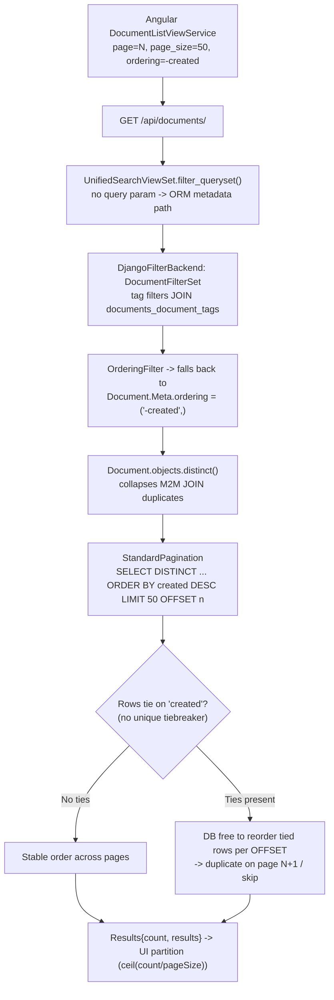

# Why the paperless-ngx documents list can feel "haunted" during normal browsing

> **Investigation type:** Root-cause / diagnostic Q&A (read-only). No source file is changed by this analysis.
>
> **Pinned commit:** All evidence in this document is drawn from the paperless-ngx source tree at **HEAD `542221a38dff06361e07976452f9aea24d210542`** (branch `paperless-ngx_542221a38dff`). Every claim is anchored to a specific `file:line` in that checked-out source. Where line numbers are cited, they refer to this exact commit.

**Bottom line, stated up front:** the "haunting" is **Hypothesis 3** — the ordering is *quietly unstable when multiple rows tie on the primary sort key*. The documents list is ordered only by the non-unique timestamp `created` (`src/documents/models.py:207-208`), and **neither the backend viewset nor the Angular frontend appends a unique tiebreaker** (such as `id`/`pk`) to that order. When several documents share the same `created` value, SQL is free to arrange those tied rows differently for each `LIMIT`/`OFFSET` window, so a document sitting on a page boundary can land on **two neighboring pages** (a *duplicate*) while another tied row gets pushed out of every window (a *skip*) — even though nobody edited anything and the visible sort field never changed. Hypothesis 1 is only *partially* true (it explains intra-query duplication that is collapsed before paging, not the cross-page effect), and Hypothesis 2 is *false*.

---

## Section 1 — The question and the symptoms (verbatim)

The reported behavior, in the user's own words:

> "the same document show up twice across neighboring pages or disappear for a page and then come back even though nobody is editing anything and the sort order looks unchanged."

The three hypotheses the user asked to be adjudicated, verbatim:

> "Is the backend producing duplicates that get collapsed somewhere later, is pagination happening before any de duplication, or is the ordering quietly unstable when multiple rows tie on the primary sort key?"

The premise the user asked to be tested, verbatim:

> "It gets stranger when the viewer is not an all powerful admin and visibility is shaped by sharing rules, because the glitch seems to depend on what the user is allowed to see rather than what exists."

The methodological request, verbatim:

> "I want to watch what the API actually returns across consecutive page requests, and line that up with what the UI thinks pagination means until the exact condition that destabilizes the list becomes clear."

**Answer preview (developed with evidence in the sections that follow):**

- **Duplicate symptom** — the same document on pages *N* and *N+1* — and **skip symptom** — a document missing from a page then reappearing — are two faces of *one* cause: a **non-deterministic total order on ties**. The list is sorted by `created` alone, which is not unique; the database may legitimately place tied rows in a different relative order for each offset window, so boundary rows duplicate or vanish.
- **Hypothesis 1** ("duplicates collapsed later") is **partially true** but is **not** the cross-page cause: tag filters do multiply rows through a many-to-many JOIN, but those duplicates are collapsed *within the same query*, before the page slice is taken.
- **Hypothesis 2** ("pagination before de-duplication") is **false**: within the single SQL statement, `DISTINCT` is applied before `LIMIT`/`OFFSET` extracts the page.
- **Hypothesis 3** ("unstable ordering on ties") is **true** and is the **root cause**.
- The **"sharing rules" premise does not hold for this code version**: there is no object-level / per-user visibility layer here; every authenticated user receives the same document set. The symptom varies with *which filters are active* and with the *unstable tie-break*, not with per-user visibility. (See Section 5 — this is also the single most important assumption to confirm with the user.)

---

## Section 2 — The request lifecycle for `/api/documents/`

This section traces a *filtered browse* (paging the documents view with a couple of common filters enabled, and **no** full-text `query`) from the Angular service down to the SQL page slice, anchoring each hop to a `file:line`.

1. **The Angular list service issues the request.** `DocumentListViewService` requests a page with `page=N`, `page_size=50` (default), and `ordering=-created` (default). The default sort state is `sortField: 'created'` (`src-ui/src/app/services/document-list-view.service.ts:93`) with `sortReverse: true` (`...:94`); the page size comes from `currentPageSize = this.settings.get(SETTINGS_KEYS.DOCUMENT_LIST_SIZE)` (`...:73`), whose default value is `50` (`src-ui/src/app/services/settings.service.ts:39` defines the key, `...:68` sets `default: 50`). The single `ordering` query parameter is built by `getOrderingQueryParam()`, which returns `(sortReverse ? '-' : '') + sortField` — **one field, with no tiebreaker** (`src-ui/src/app/services/rest/abstract-paperless-service.ts:24-30`). `list()` attaches `page`, `page_size`, and `ordering` to the request (`...:32-58`, specifically `page` at L41, `page_size` at L44, `ordering` at L48).

2. **Routing.** `GET /api/documents/` is served by `UnifiedSearchViewSet`, registered via `api_router.register(r"documents", UnifiedSearchViewSet)` (`src/paperless/urls.py:32`).

3. **The viewset selects the ORM metadata path (not full-text).** `UnifiedSearchViewSet` (`src/documents/views.py:377-426`) extends `DocumentViewSet`. For a filtered browse there is no `query` or `more_like_id` parameter, so `_is_search_request()` (`...:388-392`) is `False`. Consequently `filter_queryset()` takes its `else` branch and delegates to `super().filter_queryset()` — the ordinary ORM path (`...:410-411`) — and `list()` likewise calls `super().list(request)` (`...:426`), i.e., the standard DRF *filter → paginate* pipeline. (The Whoosh full-text branch at `...:394-409` / `...:417-424` is **not** taken here; see *Edge cases*.)

4. **Filter backends run.** `DocumentViewSet` (class at `src/documents/views.py:172`) declares `filter_backends = (DjangoFilterBackend, SearchFilter, OrderingFilter)` (`...:184`) with `filterset_class = DocumentFilterSet` (`...:185`). Tag filters traverse the `Document`↔`Tag` many-to-many relation — see `TagsFilter` (`src/documents/filters.py:42-58`) and `DocumentFilterSet` (`...:81-117`).

5. **Ordering falls back to the model default.** Because the client supplies only the non-unique `-created` field (and no secondary key), `OrderingFilter` produces an order with no unique tiebreaker; the queryset is ordered by the model default `Document.Meta.ordering = ("-created",)` (`src/documents/models.py:207-208`). The viewset's `ordering_fields` (`src/documents/views.py:187-196`) enumerates the sortable columns but sets **no default secondary sort**.

6. **De-duplication happens inside the queryset.** `get_queryset()` returns `Document.objects.distinct()` (`src/documents/views.py:198-199`), which collapses the row multiplication introduced by the M2M JOIN — *within the query*.

7. **Pagination slices with `LIMIT`/`OFFSET`.** `StandardPagination` (`src/paperless/views.py:8-11`) is a DRF `PageNumberPagination` with `page_size = 25`, `page_size_query_param = "page_size"`, and `max_page_size = 100000`. Page-number pagination compiles to SQL `LIMIT`/`OFFSET`.

8. **The response envelope.** The endpoint returns the pagination contract the UI consumes: `Results<T> { count: number; results: T[] }` (`src-ui/src/app/data/results.ts:1-5`).

9. **The API ↔ UI correlation point (where the mismatch lives).** `reload()` (`src-ui/src/app/services/document-list-view.service.ts:133-150`) calls `documentService.listFiltered(currentPage, currentPageSize, sortField, sortReverse, filterRules)` (`...:138-145`) and, on success, sets `collectionSize = result.count` (`...:149`) and `documents = result.results` (`...:150`). The UI then computes `getLastPage() = Math.ceil(this.collectionSize / this.currentPageSize)` (`...:276-278`). In other words, **the UI assumes the result set is a fixed, stable partition of `count` rows over the page size** — each page a disjoint, exhaustive slice of one global order. That is exactly the guarantee the backend does **not** provide when rows tie on `created`.



---

## Section 3 — The SQL shape and the order of operations within one statement

For a single filtered page request, the ORM emits approximately:

```sql
SELECT DISTINCT documents_document.*
FROM documents_document
[LEFT/INNER JOIN documents_document_tags ... for tag filters]
WHERE <filter predicates>
ORDER BY documents_document.created DESC
LIMIT 50 OFFSET n;
```

The decisive point is the **logical order of evaluation inside this one statement**:

1. The `FROM`/`JOIN` and `WHERE` produce the candidate rows (tag JOINs may multiply a document into several rows).
2. `DISTINCT` is then applied to that result set, **collapsing the duplicates** introduced by the JOIN.
3. `ORDER BY created DESC` arranges the **already-de-duplicated** rows.
4. `LIMIT`/`OFFSET` finally extracts the page window from that arranged set.

So **de-duplication happens before the page slice is taken**, not after. This single fact disposes of Hypotheses 1 and 2 as *cross-page* causes (developed in Section 4): there is no point in the pipeline where a still-duplicated set is being paginated. `StandardPagination` (`src/paperless/views.py:8-11`) operates on the already-`distinct()` queryset returned by `get_queryset()` (`src/documents/views.py:198-199`) and shaped by `filter_queryset()` (`src/documents/views.py:394-411`); it never sees the pre-`DISTINCT` rows.

What `DISTINCT` does **not** do is impose a *unique* order. It guarantees each document appears at most once *within a single result set*; it does **not** guarantee that two *separately executed* statements (page *N* and page *N+1*, each a distinct `LIMIT`/`OFFSET` query) will arrange tied rows the same way. That gap is the subject of Hypothesis 3.

---

## Section 4 — Verdicts on the three hypotheses

Each hypothesis is answered point-by-point, with code evidence and the reasoning that connects it to the symptom.

### H1 — "Is the backend producing duplicates that get collapsed somewhere later?" — **PARTIALLY TRUE, but not the cross-page cause**

Tag-based filtering *does* multiply `Document` rows, because it traverses the `Document`↔`Tag` many-to-many relation. In `TagsFilter.filter()` (`src/documents/filters.py:42`), the "all of these tags" / "in this list" handling joins through the tag relation: the in-list branch is `qs.filter(tags__id__in=tag_ids).distinct()` (`...:52`), and the "match every tag" path applies a per-tag loop of `qs.filter(tags__id=tag_id)` (`...:54-58`). A JOIN across a M2M table can return the same document once per matching tag row.

However, those duplicates are collapsed **within the same query**, in two complementary places:

- the queryset itself is `Document.objects.distinct()` (`src/documents/views.py:198-199`), and
- the in-list tag filter appends its own `.distinct()` (`src/documents/filters.py:52`).

Because (per Section 3) `DISTINCT` precedes `LIMIT`/`OFFSET`, the page slice is taken from a set in which each document already appears exactly once. Therefore H1 explains *intra-query* row multiplication and its collapse — but it **cannot** explain the same document appearing on **two neighboring pages**, which is a phenomenon *across* two separate page queries.

### H2 — "Is pagination happening before any de-duplication?" — **FALSE**

Within one `SELECT DISTINCT ... ORDER BY ... LIMIT/OFFSET` statement, `DISTINCT` applies to the result set **before** `LIMIT`/`OFFSET` extracts the window (Section 3). Operationally, `StandardPagination` (`src/paperless/views.py:8-11`) paginates the queryset returned by `get_queryset()`/`filter_queryset()`, which is **already** `Document.objects.distinct()` (`src/documents/views.py:198-199`). De-duplication therefore *precedes* pagination; pagination is never slicing a still-duplicated set. H2 is false.

### H3 — "Is the ordering quietly unstable when multiple rows tie on the primary sort key?" — **TRUE. This is the root cause.**

The default order is `("-created",)` over a **non-unique** timestamp (`src/documents/models.py:207-208`), and **no unique tiebreaker is appended anywhere along the path**:

- The viewset's `ordering_fields` (`src/documents/views.py:187-196`) lists sortable fields (`id`, `title`, `correspondent__name`, `document_type__name`, `created`, `modified`, `added`, `archive_serial_number`) but defines **no default secondary sort**; nothing forces `id`/`pk` onto the end of the `ORDER BY`.
- The frontend sends a **single** `ordering` field with no tiebreaker — `getOrderingQueryParam()` returns `(sortReverse ? '-' : '') + sortField`, one field only (`src-ui/src/app/services/rest/abstract-paperless-service.ts:24-30`).

When several documents share the same `created` value — common in practice for **bulk imports** or **same-moment consumption**, where many documents are created within the same instant — SQL does **not** guarantee a stable relative order among the tied rows. The database is free to arrange tied rows differently for each `LIMIT`/`OFFSET` window (the optimizer may even pick a different plan per offset; see the PostgreSQL reference in Section 7). The consequences at a page boundary:

- a tied document that was the last row of page *N* may be re-placed into the first row of page *N+1* → it appears on **both** pages (**duplicate**); and
- to make room, another tied document that "should" have started page *N+1* is pushed out of that window entirely → it is **skipped**, only to reappear on a later reload when the order shuffles again.

All of this happens with **no edits** and with the *visible* sort field (`created`) unchanged — exactly the user's report. This is the destabilizing condition the user set out to find.

### Edge case — the same instability under other sort fields

The tie problem is not specific to `created`. The other user-selectable sort columns in `ordering_fields` (`src/documents/views.py:187-196`) — notably `title`, `correspondent__name`, and `document_type__name` — are likewise **non-unique**, so sorting by any of them reproduces the same boundary duplicate/skip behavior whenever values tie, for the same reason: a single non-unique key with no appended tiebreaker.

---

## Section 5 — Reconciling the "sharing rules / what the user is allowed to see" premise

The user suspected the glitch "seems to depend on what the user is allowed to see rather than what exists" — i.e., that per-user *sharing rules* shape the result and somehow drive the instability. **For this code version, that premise does not hold**, and it is worth stating the divergence plainly.

In this commit the documents endpoint applies only `permission_classes = (IsAuthenticated,)` (`src/documents/views.py:183`) and returns the **same** `Document.objects.distinct()` set to **every** authenticated user (`...:198-199`). There is **no object-level / per-user visibility layer** in this version:

- A repository-wide search of `src/` for object-permission primitives — `guardian`, `assign_perm`, `get_objects_for_user`, `has_object_permission`, a per-document `owner`, or any object-permission machinery — returns **no matches**.
- The Technical Specification (§6.2.3.3) confirms that all document-related models are shared across all authenticated users in this version.

Therefore the instability **cannot be *caused* by per-user sharing rules in this codebase** — there are none to apply.

**Reframing what actually varies the symptom.** Two real factors modulate how often and how visibly the glitch appears, and neither is per-user visibility:

1. **Which filters are active.** A filter (tags, correspondent, type, date range, title/content) changes the *candidate set* and therefore the *distribution of tied `created` values* near any given page boundary. Some filtered views happen to cluster many same-`created` documents around an offset; others do not. This is almost certainly why the user perceives the glitch as depending on "what you can see" — the *filtered view* differs, so the tie density at the boundary differs — when in fact it depends on the **filter**, not on the **viewer**.
2. **The unstable tie-break.** Given ties at a boundary, the missing unique `ORDER BY` tiebreaker is what lets the rows shuffle between page requests (Section 4, H3).

**The single most important assumption to confirm with the user (explicit limitation).** This analysis is pinned to HEAD `542221a38dff`. If the user's *live* environment is a **newer paperless-ngx release that *does* include a permission/sharing layer**, then a permission filter would add further JOINs (e.g., joining an object-permissions or owner relation) to the documents query. Those extra JOINs would tend to **increase the frequency of ties / row multiplicity**, which would make the glitch *look* permission-dependent — because turning sharing on or off changes the candidate set and the tie distribution. **But even then, the fundamental destabilizer remains the missing unique `ORDER BY` tiebreaker, not the permission check itself.** Confirming which paperless-ngx version the user is actually running is the #1 follow-up: the *cause* identified here (unstable ordering on ties) is invariant across versions, but the *presence of a sharing layer* changes only how strongly the symptom correlates with visibility.

---

## Section 6 — The conceptual remedy (described, explicitly **not** implemented)

> **No fix is applied by this investigation.** No code is written, no manifest is changed, and no source file is modified. Per the governing project rule (`SWE-AtlasQnA-Repo`) and the repository-immutability constraint, the deliverable is this analysis document only. The remedy below is described **conceptually**, to close the loop on the root cause; it is *not* committed anywhere.

**Primary remedy — append a unique tiebreaker to the sort.** Extending the order from a single non-unique key to a key plus a unique column — conceptually `ORDER BY created DESC, id DESC` (or `pk`) — produces a **total order**. With a total order, two distinct documents can never tie, so each `LIMIT`/`OFFSET` window partitions the result set **deterministically**: page *N* and page *N+1* become disjoint and exhaustive, and the boundary duplicate/skip behavior disappears. This is the established database practice for offset pagination over a non-unique sort key (see Section 7).

**More robust alternative for large offsets — keyset / "seek" pagination.** Instead of `LIMIT`/`OFFSET`, carry the last row's sort key forward and ask for rows *after* it, e.g. conceptually:

```sql
SELECT ...
WHERE (created, id) < (:last_created, :last_id)
ORDER BY created DESC, id DESC
LIMIT :n;
```

This both fixes the stability problem (the tuple `(created, id)` is unique) and avoids the cost of skipping ever-larger offsets. Its known trade-offs are that you cannot jump to an arbitrary page number and that reversing direction requires reversing the comparison and the sort.

**Where a fix would conceptually live (descriptive only — not changed):**

- the **viewset's default ordering** for the documents endpoint (so the server always appends `id`/`pk` to whatever sort the client requests) — i.e., around `DocumentViewSet`'s ordering configuration (`src/documents/views.py:187-196`);
- the **model default**, `Document.Meta.ordering` (`src/documents/models.py:207-208`), if the deterministic order should hold for *all* default queries, not just the API; and/or
- the **frontend ordering parameter**, where `getOrderingQueryParam()` builds a single field (`src-ui/src/app/services/rest/abstract-paperless-service.ts:24-30`), if the tiebreaker were to be requested explicitly by the client.

Of these, appending the tiebreaker on the **server** (viewset or model) is the most reliable, because it guarantees a total order regardless of what any client sends. Again: this is *analysis*, not a change — nothing here is implemented.

---

## Section 7 — Summary and external references

**Recap of the verdicts:**

| Hypothesis | Verdict | Why |
|------------|---------|-----|
| **H1** — duplicates collapsed later | **Partially true** (intra-query only) | Tag M2M JOINs multiply rows (`src/documents/filters.py:42-58`), but `.distinct()` collapses them *before* the page slice (`src/documents/views.py:198-199`; `src/documents/filters.py:52`). Not the cross-page cause. |
| **H2** — pagination before de-duplication | **False** | `DISTINCT` precedes `LIMIT`/`OFFSET` inside one statement; `StandardPagination` paginates the already-`distinct()` queryset (`src/paperless/views.py:8-11`). |
| **H3** — unstable ordering on ties | **TRUE — root cause** | Order is `("-created",)`, non-unique (`src/documents/models.py:207-208`), with no tiebreaker in the viewset (`src/documents/views.py:187-196`) or frontend (`src-ui/src/app/services/rest/abstract-paperless-service.ts:24-30`); tied rows reshuffle per `OFFSET` window. |

The core mismatch is a **contract gap**: the backend yields a **non-deterministic total order on ties**, while the frontend assumes a **deterministic partition** — `getLastPage() = Math.ceil(collectionSize / currentPageSize)` (`src-ui/src/app/services/document-list-view.service.ts:276-278`) treats `count` rows as a fixed, disjoint, exhaustive set of pages. When ties exist and no unique tiebreaker is appended, that assumption breaks, producing duplicates and skips at page boundaries.

The "sharing rules" premise does not apply to this version (no object-level permission layer; `permission_classes = (IsAuthenticated,)` at `src/documents/views.py:183`); the symptom tracks **active filters** and the **unstable tie-break**, not per-user visibility (Section 5).

### External references (corroboration only; the primary determination is grounded in the source above)

**(a) PostgreSQL official documentation — §7.6 "LIMIT and OFFSET"** — <https://www.postgresql.org/docs/current/queries-limit.html> (version-pinned mirror for the production database: <https://www.postgresql.org/docs/14/queries-limit.html>). This is the primary external citation. It establishes that one must "use an ORDER BY clause that constrains the result rows into a unique order"; otherwise the returned subset is unpredictable. It further notes (paraphrased) that the optimizer accounts for `LIMIT` when planning, so different `LIMIT`/`OFFSET` values are likely to yield **different plans and therefore different row orders**, and that selecting different subsets this way gives inconsistent results unless a predictable order is enforced — explicitly framing this as **expected SQL behavior, not a bug**. This is precisely why tied-on-`created` rows can reorder between consecutive page requests in paperless-ngx.

**(b) Canonical remedy — keyset/seek pagination and a unique tiebreaker** — Markus Winand, <https://use-the-index-luke.com/no-offset> (and the related discussion at <https://use-the-index-luke.com/sql/partial-results/fetch-next-page>). Winand's guidance is that "OFFSET doesn't deliver stable results and makes the query slow," and that paging requires a deterministic sort order; when the chosen sort key is not unique, you extend the `ORDER BY` with a unique column (typically the **primary key**) to obtain a deterministic row sequence — i.e., the `created, id` pattern described in Section 6. The seek method (carrying the last key forward in a `WHERE` clause) is the more robust alternative for deep pagination. Appending the primary key as a tiebreaker to a non-unique sort key is widely recommended practice across database engineering write-ups.

**(c) Secondary effect — concurrent inserts/deletes shifting `OFFSET` windows (acknowledged, but *not* the primary cause here).** Independently of ties, offset pagination can produce duplicates or skips when rows are **inserted or deleted mid-traversal**: an insertion above the current window shifts every later row down by one, so a boundary row can repeat on the next page (and a deletion can cause a skip). This is a real, well-documented offset-pagination hazard, but it is **not** the primary cause in this report, because the user explicitly states **"nobody is editing anything"** — the list destabilizes with a static dataset, which points squarely at the tie-ordering cause (H3), not at concurrent mutation.

---

## Appendix A — Temporary observation procedure (ephemeral; not committed)

To honor the user's request to *"watch what the API actually returns across consecutive page requests, and line that up with what the UI thinks pagination means,"* the behavior can be corroborated empirically with a **temporary, non-committed** procedure:

1. Issue successive authenticated calls `GET /api/documents/?page=N&page_size=M&ordering=-created` for `N = 1, 2, 3, …` (optionally with a tag/correspondent filter active to concentrate same-`created` rows).
2. Collect the `results[].id` set returned for each page, and read `count` once.
3. Diff the `id` sets across each page boundary:
   - an `id` that appears on **both** page *N* and page *N+1* is a **duplicate**;
   - an `id` that appears on **neither** page *N* nor page *N+1*, yet is fewer than `count` rows in, is a **skip**.
4. Cross-check against the UI's own partition assumption: the UI expects exactly `ceil(count / page_size)` disjoint pages (`src-ui/src/app/services/document-list-view.service.ts:276-278`). Any boundary duplicate or skip is a direct, observable violation of that assumption.

Re-running the same page a few times (especially under PostgreSQL, where the planner may legitimately choose different plans per `LIMIT`/`OFFSET`) can surface the reshuffling of tied rows directly.

> **Cleanup / immutability:** any script written to perform the steps above is strictly **ephemeral** — it is used only for live observation and is **removed afterward**. No such script, fixture, or helper is committed; the source repository is left byte-for-byte unchanged. This document is the only artifact produced.

---

## Appendix B — Edge cases and scope boundaries

- **The full-text search path is out of scope for this symptom.** When a `query` or `more_like_id` parameter is present, `_is_search_request()` (`src/documents/views.py:388-392`) is `True`, and `UnifiedSearchViewSet` takes the Whoosh branch — building a `DelayedFullTextQuery`/`DelayedMoreLikeThisQuery` (`...:394-409`) and opening the index searcher in `list()` (`...:417-424`). In that mode the UI sorts by relevance (`sortField = 'score'`), and the result order is governed by the search index, **not** by the SQL `ORDER BY` tie-break analyzed here. The "haunted" filtered-browse scenario is the **ORM metadata path** (no `query`), which is the focus of this document.
- **Ties under other sort fields** (covered in Section 4): `title`, `correspondent__name`, and `document_type__name` are also non-unique (`src/documents/views.py:187-196`), so the same instability applies when sorting by them.
- **Concurrent inserts/deletes** (covered in Section 7c): a genuine but *secondary* offset-pagination hazard, ruled out as the primary cause here because no edits are occurring.

---

*End of investigation. Source repository unchanged; this Markdown document is the sole deliverable.*
