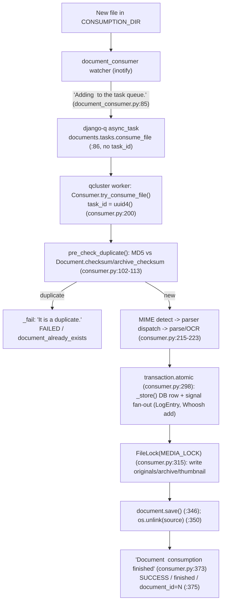

# Paperless-ngx — How Data Moves Through Document Ingestion (Runtime-Grounded)

> This document answers, from **live runtime observation**, how a document moves through Paperless-ngx during normal ingestion: (**O1**) detection & hand-off, (**O2**) transition into parsing/classification/indexing, (**O3**) per-stage progress/completion, (**O4**) final data destination & state recording, (**O5**) duplicate tracking, and (**O6**) duplicate avoidance. Every factual claim is backed by captured output (logs, task records, WebSocket frames, database rows, on-disk files, and the Whoosh index) or is explicitly labeled **inferred** when derived from code alone. All observation flows through the **canonical watched-directory entry point** — a file dropped into `CONSUMPTION_DIR` and picked up by the running watcher/worker; no mocks, monkeypatches, debug hooks, or direct `Consumer` calls are used as evidence.

## 1. Title & Run Metadata

- **Project / commit (canonical):** `paperless-ngx` at commit `542221a38dff06361e07976452f9aea24d210542` (verified live: `git rev-parse HEAD` inside the image returned `542221a38dff06361e07976452f9aea24d210542`).
- **Canonical image:** `paperless-ngx-baseline:542221a38dff` (a warmed layer over the user-specified `ghcr.io/scaleapi/swe-atlas` Python-3.9 image). The host (Ubuntu 25.10 / Python 3.13) is **not** used to run the stack — only the container is.
- **Runtime:** Python **3.9.23**, Django **4.0.4**, django-q **1.3.9**, Channels **3.0.4** (observed — see §1.1).
- **Task queue / broker:** django-q worker (`qcluster`) with a **Redis** broker + channel layer at `redis://localhost:6379`.
- **Run window (canonical run):** `2026-07-13 18:40:20Z` (stack up) → `2026-07-13 18:44:01Z` (last drop) → teardown. All timestamps below fall in this window.
- **Executed as:** non-root `testuser` inside the container.
- **Scale / stability:** the happy path is run **3 times** (two `.txt` + one `.pdf`); the duplicate path is run **3 times** (two with delete OFF, one with delete ON); plus two unsupported-type edges. Boundary values are identical across repeats (§7).

### 1.1 Runtime configuration verified live (finding #7, #8)

Versions were read at runtime by importing each package inside the container (**observed**, not manifest-derived). The capture pass ran twice, hence the intentional duplicate lines:

```text
python 3.9.23
django 4.0.4
channels 3.0.4
whoosh 2.7.4
django-q 1.3.9
channels-redis 3.4.0
whoosh 2.7.4
channels 3.0.4
django 4.0.4
```

Directory/database configuration was read live from `django.conf.settings`. The **source defaults** are repo-relative (`BASE_DIR=/app/src`, so `/app/data`, `/app/media`, `/app/consume`); the `/paperless/*` paths used here are **warmed-image `PAPERLESS_*` environment overrides** (from `pl.env`), **not** application defaults (**observed**):

```text
=== SOURCE DEFAULTS (env unset) — settings.py:57,61-79, BASE_DIR=/app/src ===
BASE_DIR          = /app/src
default DATA_DIR       = /app/src/../data
default MEDIA_ROOT     = /app/src/../media
default CONSUMPTION_DIR= /app/src/../consume

=== EFFECTIVE VALUES (warmed-image PAPERLESS_* overrides from pl.env) ===
PAPERLESS_DATA_DIR (env)        = /paperless/data
PAPERLESS_MEDIA_ROOT (env)      = /paperless/media
PAPERLESS_CONSUMPTION_DIR (env) = /paperless/consume
effective DATA_DIR       = /paperless/data
effective MEDIA_ROOT     = /paperless/media
effective CONSUMPTION_DIR= /paperless/consume
effective DB ENGINE      = django.db.backends.sqlite3
effective DB NAME        = /paperless/data/db.sqlite3
DEBUG                    = False
CONSUMER_POLLING         = 0
CONSUMER_DELETE_DUPLICATES= False
INDEX_DIR                = /paperless/data/index
MEDIA_LOCK               = /paperless/media/media.lock
```

> **observed.** `CONSUMER_POLLING = 0` selects the inotify watcher (`src/documents/management/commands/document_consumer.py:200`); `CONSUMER_DELETE_DUPLICATES = False` is the default for the happy/duplicate-retain runs and is toggled to `True` for the delete-ON branch (§O6). The database is SQLite at `/paperless/data/db.sqlite3`.

### 1.2 Exact start commands — orchestrated, PID-captured, readiness-checked (finding #6, #16)

The stack is four concurrent long-running processes. They **cannot** be launched by a single blocking sequence (`qcluster` and `tail -F` block), so each is started detached with `setsid`, its **PID is captured**, and a **readiness poll** confirms it is up before proceeding. The exact orchestration scripts are in Appendix A.3; their literal outputs:

**Bring-up (redis → qcluster → document_consumer):**

```text
== [1/3] redis (broker + channel layer) ==
redis: PONG
== [2/3] qcluster (django-q worker) ==
qcluster pid=45
18:40:20 [Q] INFO Q Cluster mirror-leopard-crazy-iowa starting.
== [3/3] document_consumer (inotify watcher) ==
document_consumer pid=76
[2026-07-13 18:40:22,365] [INFO] [paperless.management.consumer] Using inotify to watch directory for changes: /paperless/consume
```

**ASGI (daphne) serving the `ws/status/` WebSocket:**

```text
== [4/4] daphne (Channels ASGI serving ws/status/) ==
daphne pid=100
daphne ready: /admin/login/ http=200
[2026-07-13 18:40:24,046] [INFO] [daphne.server] Listening on TCP address 127.0.0.1:8000
```

> **observed.** Each worker's PID is recorded (`qcluster pid=45`, `document_consumer pid=76`, `daphne pid=100`) and used for deterministic shutdown (§A.4). Readiness is asserted by grepping for `Q Cluster … starting`, `Using inotify …`, and daphne's `Listening on TCP address 127.0.0.1:8000` — not by a fixed sleep.

### 1.3 observed vs inferred convention (finding #8, #23)

- **observed** = captured directly from a running process (a log line, a task record, a WebSocket frame, a database row, an on-disk file, or a Whoosh query result during the canonical run).
- **inferred** = derived from reading the source at commit `542221a38dff` without a corresponding runtime capture. The only material inferred claim is the **failure/rollback semantics of O4** (§O4), because forcing a mid-transaction failure would require non-canonical manipulation of the pipeline, which is disallowed.

Every code citation uses a full `src/...:line` path so a reader can reproduce it against this commit.

### 1.4 Documented deviations from the literal runbook (canonical-equivalent)

1. **ASGI server = daphne, not `runserver`.** `python manage.py runserver` in this image does not upgrade the `ws/status/` handshake (it answers HTTP `200` instead of a `101` switch), so the authenticated WebSocket capture uses **daphne 3.0.2** (`daphne -b 127.0.0.1 -p 8000 paperless.asgi:application`). daphne loads the same `paperless.asgi:application` and the same `ws/status/` route (`src/paperless/urls.py:137`), so the observed frames are canonical. The unauthenticated negative control (§O3) was captured against the `runserver` transport **before** the switch and is labeled accordingly.
2. **`curl` is absent** in the image; HTTP readiness is polled with a short Python `urllib` probe instead.
3. **Directories are `/paperless/*`** via warmed-image `PAPERLESS_*` env overrides; the source defaults are `/app/{data,media,consume}` (§1.1). This changes only paths, not behavior.

### 1.5 One-time credential handling (finding #3, #13, #14)

No password is hard-coded or printed anywhere in this document or the harness. At runtime a **one-time random** admin password is generated (`python - <<'"'"'PY'"'"' ... secrets.token_urlsafe(18) ... PY`), applied with `User.objects.get(...).set_password(...)`, and exported to the listener **only** through the `PL_ADMIN_PW` environment variable (never argv, never stdout). The credential file is created mode `600`:

```text
admin one-time password set OK (value not shown)
credential stored mode: 600 (readable only by testuser)
```

> **observed.** The listener (`ws_listen.py`, §A.3) sets `requests.Session.trust_env = False` for deterministic loopback auth, prints **only** HTTP status codes and an `authenticated=<bool>` — never a cookie, session id, or password. Frame output is written to an `O_CREAT|O_EXCL|O_NOFOLLOW` file (mode `600`) inside a per-run `mktemp -d` directory (mode `700`), addressing predictable-temp-path risk (CWE-377/CWE-367).

## 2. TL;DR — one-line answers

- **O1 — Detection & hand-off:** the `document_consumer` inotify watcher logs `Adding <path> to the task queue.` (`src/documents/management/commands/document_consumer.py:85`) and enqueues the django-q task `documents.tasks.consume_file` (`:86`, no `task_id`); the `qcluster` worker picks it up and logs `Consuming <file>`.
- **O2 — Parse/classify/index:** the worker runs `Consumer.try_consume_file`, logging `Detected mime type: …` → `Parser: …` → `Parsing …` (`src/documents/consumer.py:215-223`); after the DB row is stored, `document_consumption_finished` (`src/documents/apps.py:22-27`) fans out to matching, the admin `LogEntry`, and the Whoosh index add.
- **O3 — Progress/completion:** `Consumer._send_progress` (`src/documents/consumer.py:56-77`) broadcasts JSON to the `status_updates` group; an authenticated client on `ws/status/` observes `STARTING/new_file(0)` → `WORKING/parsing_document(20)` → `generating_thumbnail(70)` → `parse_date(90)` → `save_document(95)` → `SUCCESS/finished(100)`.
- **O4 — Final destination & state:** a `documents_document` row (with MD5 `checksum`), files under `originals/` (+ `archive/` and `thumbnails/`), an admin `LogEntry` attributed to user `consumer`, a Whoosh index entry, and a `SUCCESS` frame + task result `Success. New document id N created`. **The `transaction.atomic()` block covers database writes only; the media-file writes, the Whoosh index add, and the source-file `unlink` are non-transactional side effects (§O4).**
- **O5 — Duplicate tracking:** an MD5 of the file bytes is compared against existing `Document.checksum`/`archive_checksum` before parsing (`src/documents/consumer.py:102-113`); `checksum` is a `unique=True` column (`src/documents/models.py:135`).
- **O6 — Duplicate avoidance:** a match logs `[ERROR] … Not consuming <file>: It is a duplicate.`, emits a `FAILED/document_already_exists` frame, records a `success=False` task, and leaves `Document`/`LogEntry`/index counts unchanged; with `CONSUMER_DELETE_DUPLICATES=True` the duplicate source file is additionally unlinked (`:108-109`).

## 3. End-to-end flow (observed causal order)

The causal order below was reconstructed from the timestamps in the captured `paperless.log`, worker console, and WebSocket transcript (Appendices A.1–A.2).



> **inferred (side-effect boundary).** Only the DB writes inside `transaction.atomic()` (nodes **H**) roll back on exception. The media writes (**I**), the Whoosh index add (part of **H**'s signal fan-out but a filesystem side effect), and the source `unlink` (**J**) are **not** transactionally compensated — see §O4.

## 4. Environment & methodology

- **Prerequisites satisfied before any run:** Redis broker up; migrations applied; the auth user **`consumer`** present (required by `set_log_entry`, `src/documents/signals/handlers.py:416`, which calls `User.objects.get(username="consumer")`). In this image the `consumer` user is created by migration and observed as `id=1` in every `LogEntry` (§O4).
- **Pristine before-state (observed):** before the first drop, there are **0** documents, **0** `LogEntry` rows, and the Whoosh `INDEX_DIR` does **not exist**:

```text
=== Unapplied migrations? (empty = all applied) ===
unapplied_count=0
=== DB pristine check ===
DOC_COUNT 0
LOGENTRY_COUNT 0
=== INDEX_DIR exists before any run? ===
ls: cannot access '/paperless/data/index': No such file or directory
INDEX_DIR absent
=== harness deps ===
websockets 10.3
requests 2.27.1
```

- **Snapshot side-effect disclosure (finding #18).** The state snapshotter reports the index as `INDEX_DIR_ABSENT` using `os.path.isdir(settings.INDEX_DIR)` and deliberately **does not call** `index.open_index()` before the first run, because `open_index()` **creates** `INDEX_DIR` and an empty index if absent (`src/documents/index.py:52-61`) and would therefore mutate the before-state:

```python
def open_index(recreate=False):
    try:
        if exists_in(settings.INDEX_DIR) and not recreate:
            return open_dir(settings.INDEX_DIR, schema=get_schema())
    except Exception:
        logger.exception("Error while opening the index, recreating.")

    if not os.path.isdir(settings.INDEX_DIR):
        os.makedirs(settings.INDEX_DIR, exist_ok=True)
    return create_in(settings.INDEX_DIR, get_schema())
```

> **observed + inferred.** `INDEX_DIR_ABSENT` before the first run is **observed**; that `open_index()` would create the directory is **inferred** from the code above and is precisely why the snapshotter avoids calling it until the index legitimately exists.

## 5. O1–O6 — direct answers with live evidence

### O1 — Detection & hand-off

**Direct answer.** A new file in `CONSUMPTION_DIR` is detected by the `document_consumer` **inotify** watcher, which logs the hand-off and enqueues the django-q task `documents.tasks.consume_file`; a `qcluster` worker then picks the task up and begins consuming. The three log lines that mark detection → queue → pickup (**observed**):

```text
[2026-07-13 18:40:22,365] [INFO] [paperless.management.consumer] Using inotify to watch directory for changes: /paperless/consume
[2026-07-13 18:40:44,736] [INFO] [paperless.management.consumer] Adding /paperless/consume/sample_run1.txt to the task queue.
[2026-07-13 18:40:44,885] [INFO] [paperless.consumer] Consuming sample_run1.txt
```

The watcher's enqueue call passes **no `task_id`** (watcher path); it supplies only the file path, optional tag ids, and a `task_name` (**observed source**, `src/documents/management/commands/document_consumer.py:85-90`):

```python
        logger.info(f"Adding {filepath} to the task queue.")
        async_task(
            "documents.tasks.consume_file",
            filepath,
            override_tag_ids=tag_ids if tag_ids else None,
            task_name=os.path.basename(filepath)[:100],
        )
```

**All three ingestion entry points converge on the same task (finding #19).** The watched-directory drop is the canonical one; the other two are noted only for convergence:

- **Watcher (canonical):** `src/documents/management/commands/document_consumer.py:86` — `async_task("documents.tasks.consume_file", filepath, …)` — **no `task_id`**.
- **REST upload:** `src/documents/views.py:521` sets `task_id = str(uuid.uuid4())`, then `:523` — `async_task("documents.tasks.consume_file", temp_filename, …, task_id=task_id)` — **task_id supplied at enqueue**.
- **IMAP mail:** `src/paperless_mail/mail.py:336` — `async_task("documents.tasks.consume_file", path=temp_filename, …)`.

**Hand-off actually crossing the process boundary (observed).** The worker console (`qcluster.out`) shows django-q's `Process-1:N processing [<file>]` immediately followed by the consumer's `Consuming <file>` in `paperless.log` — proving the task left the watcher and executed in the worker (leading `N:` are `grep -n` source-line numbers):

```text
17:18:40:44 [Q] INFO Process-1:1 processing [sample_run1.txt]
18:[2026-07-13 18:40:44,885] [INFO] [paperless.consumer] Consuming sample_run1.txt
26:18:40:50 [Q] INFO Process-1:2 processing [whiskey-zebra-virginia-white]
29:18:40:50 [Q] INFO Process-1:3 processing [item-three-oranges-mirror]
32:18:40:50 [Q] INFO Process-1:4 processing [beryllium-fix-oranges-friend]
35:18:40:50 [Q] INFO Process-1:5 processing [autumn-fish-lamp-whiskey]
41:18:40:50 [Q] INFO Process-1:6 processing [sample_run2.txt]
46:[2026-07-13 18:40:50,767] [INFO] [paperless.consumer] Consuming sample_run2.txt
60:18:40:56 [Q] INFO Process-1:7 processing [sample_run3.pdf]
61:[2026-07-13 18:40:56,676] [INFO] [paperless.consumer] Consuming sample_run3.pdf
68:18:41:03 [Q] INFO Process-1:8 processing [sample_dup1.txt]
86:18:41:08 [Q] INFO Process-1:9 processing [sample_dup2.txt]
```

> **observed.** django-q also schedules internal maintenance tasks with random names (e.g. `whiskey-zebra-virginia-white`); the document tasks are the ones named after the dropped file (`sample_run1.txt`, `sample_run2.txt`, `sample_run3.pdf`, …). The watcher entry point is defined at `src/documents/management/commands/document_consumer.py:54` (extension pre-check) and `:85-86` (log + enqueue); the task itself is `documents.tasks.consume_file` (`src/documents/tasks.py:184`), which calls `Consumer().try_consume_file(...)` (`:236`).

### O2 — Transition into parsing / classification / indexing

**Direct answer.** Inside the worker, `Consumer.try_consume_file` logs an ordered sequence that marks the move from detection into parsing, and — after the row is stored — the `document_consumption_finished` signal fans out to classification/matching, the admin `LogEntry`, and the Whoosh index. The **task name** is `documents.tasks.consume_file`; the **state changes** are the `paperless.consumer` log lines below.

**Observed stage sequence — `.txt` (document id 1):**

```text
[2026-07-13 18:40:44,885] [INFO] [paperless.consumer] Consuming sample_run1.txt
[2026-07-13 18:40:44,889] [DEBUG] [paperless.consumer] Detected mime type: text/plain
[2026-07-13 18:40:44,893] [DEBUG] [paperless.consumer] Parser: TextDocumentParser
[2026-07-13 18:40:44,895] [DEBUG] [paperless.consumer] Parsing sample_run1.txt...
[2026-07-13 18:40:44,896] [DEBUG] [paperless.consumer] Generating thumbnail for sample_run1.txt...
[2026-07-13 18:40:44,917] [DEBUG] [paperless.parsing.text] Execute: optipng -silent -o5 /tmp/paperless/paperless-8n4y3jig/thumb.png -out /tmp/paperless/paperless-8n4y3jig/thumb_optipng.png
[2026-07-13 18:40:45,523] [DEBUG] [paperless.classifier] Document classification model does not exist (yet), not performing automatic matching.
[2026-07-13 18:40:45,527] [DEBUG] [paperless.consumer] Saving record to database
[2026-07-13 18:40:45,547] [DEBUG] [paperless.consumer] Deleting file /paperless/consume/sample_run1.txt
[2026-07-13 18:40:45,570] [DEBUG] [paperless.parsing.text] Deleting directory /tmp/paperless/paperless-8n4y3jig
[2026-07-13 18:40:45,571] [INFO] [paperless.consumer] Document 2026-07-13 sample_run1 consumption finished
```

**Observed stage sequence — `.pdf` (document id 3), showing OCR dispatch:**

```text
[2026-07-13 18:40:56,676] [INFO] [paperless.consumer] Consuming sample_run3.pdf
[2026-07-13 18:40:56,676] [DEBUG] [paperless.consumer] Detected mime type: application/pdf
[2026-07-13 18:40:56,679] [DEBUG] [paperless.consumer] Parser: RasterisedDocumentParser
[2026-07-13 18:40:56,681] [DEBUG] [paperless.consumer] Parsing sample_run3.pdf...
[2026-07-13 18:40:56,702] [DEBUG] [paperless.parsing.tesseract] Extracted text from PDF file /paperless/consume/sample_run3.pdf
[2026-07-13 18:40:56,771] [DEBUG] [paperless.parsing.tesseract] Calling OCRmyPDF with args: {'input_file': '/paperless/consume/sample_run3.pdf', 'output_file': '/tmp/paperless/paperless-fxdyzfwb/archive.pdf', 'use_threads': True, 'jobs': 11, 'language': 'eng', 'output_type': 'pdfa', 'progress_bar': False, 'skip_text': True, 'clean': True, 'deskew': True, 'rotate_pages': True, 'rotate_pages_threshold': 12.0, 'sidecar': '/tmp/paperless/paperless-fxdyzfwb/sidecar.txt'}
[2026-07-13 18:40:57,685] [DEBUG] [paperless.parsing.tesseract] Using text from sidecar file
[2026-07-13 18:40:57,685] [DEBUG] [paperless.consumer] Generating thumbnail for sample_run3.pdf...
[2026-07-13 18:40:57,689] [DEBUG] [paperless.parsing] Execute: convert -density 300 -scale 500x5000> -alpha remove -strip -auto-orient /tmp/paperless/paperless-fxdyzfwb/archive.pdf[0] /tmp/paperless/paperless-fxdyzfwb/convert.png
[2026-07-13 18:40:57,941] [DEBUG] [paperless.parsing.tesseract] Execute: optipng -silent -o5 /tmp/paperless/paperless-fxdyzfwb/convert.png -out /tmp/paperless/paperless-fxdyzfwb/thumb_optipng.png
[2026-07-13 18:40:58,318] [DEBUG] [paperless.classifier] Document classification model does not exist (yet), not performing automatic matching.
[2026-07-13 18:40:58,321] [DEBUG] [paperless.consumer] Saving record to database
[2026-07-13 18:40:58,340] [DEBUG] [paperless.consumer] Deleting file /paperless/consume/sample_run3.pdf
[2026-07-13 18:40:58,364] [DEBUG] [paperless.parsing.tesseract] Deleting directory /tmp/paperless/paperless-fxdyzfwb
[2026-07-13 18:40:58,365] [INFO] [paperless.consumer] Document 2026-07-13 sample_run3 consumption finished
```

**What the log lines map to (citations):**

- `Consuming <file>` — `src/documents/consumer.py:215`.
- `Detected mime type: <t>` — `src/documents/consumer.py:221` (the value comes from `magic.from_file(..., mime=True)` at `:219`).
- `Parser: <ParserClass>` / `Parsing <file>…` — parser dispatch via `get_parser_class_for_mime_type` (`:223`); `.txt` → `TextDocumentParser`, `.pdf` → `RasterisedDocumentParser` (which calls OCRmyPDF, visible in the OCR args block above).
- `Document classification model does not exist (yet), not performing automatic matching.` — the classifier is invoked but, with no trained model present, performs no auto-matching (`paperless.classifier`). This is the **classification** stage, executed even when the model is absent.
- **Signal fan-out (classification/matching + LogEntry + index).** After `_store()`, `document_consumption_finished.send(...)` (`src/documents/consumer.py:306`) triggers the receivers connected in `src/documents/apps.py:22-27`: `add_inbox_tags`, `set_correspondent` (`handlers.py:35`), `set_document_type`, `set_tags` (`handlers.py:168`), `set_log_entry` (`handlers.py:413`), and `add_to_index` (`handlers.py:428`, which calls `src/documents/index.py:118 add_or_update_document`). The signals are declared in `src/documents/signals/__init__.py:3-5`.

> **observed + correction.** The **indexing** stage is confirmed by the post-run Whoosh queries in §O4 (a search returns the new document ids). One earlier draft of this document claimed the unsupported binary produced MIME `application/x-executable`; the **actual observed** value is `application/x-sharedlib` (see the edge in §5.E and the log at `paperless.consumer`), corrected here.

### O3 — Per-stage progress / completion

**Direct answer.** Progress is broadcast by `Consumer._send_progress` (`src/documents/consumer.py:56-77`), which builds a JSON payload and sends it to the Channels group `status_updates`; the `StatusConsumer` WebSocket at `ws/status/` (`src/paperless/urls.py:137`) forwards each payload to connected clients. The payload shape (**observed source**):

```python
    def _send_progress(
        self,
        current_progress,
        max_progress,
        status,
        message=None,
        document_id=None,
    ):
        payload = {
            "filename": os.path.basename(self.filename) if self.filename else None,
            "task_id": self.task_id,
            "current_progress": current_progress,
            "max_progress": max_progress,
            "status": status,
            "message": message,
            "document_id": document_id,
        }
        async_to_sync(self.channel_layer.group_send)(
            "status_updates",
            {"type": "status_update", "data": payload},
        )

    def _fail(self, message, log_message=None, exc_info=None):
        self._send_progress(100, 100, "FAILED", message)
        self.log("error", log_message or message, exc_info=exc_info)
```

**Authentication evidence (observed, no secrets).** The authenticated login sequence for the canonical run (the same session that captured the frames below at `18:40:42`), printed as status codes and a boolean only:

```text
--- listener auth (no secrets) ---
LOGIN_GET /admin/login/ status=200 csrf_present=True
LOGIN_POST /admin/login/ status=302 authenticated=True
ADMIN_CHECK /admin/ status=200
AUTH_OK authenticated=True
18:40:42 WS_CONNECTED
```

> **observed.** `LOGIN_GET … 200`, `LOGIN_POST … 302 authenticated=True`, `ADMIN_CHECK /admin/ 200`, then `WS_CONNECTED` at `18:40:42` — matching the frame timestamps below. No cookie or password value is printed.

**Negative control (observed, separately).** An unauthenticated probe does not receive frames:

```text
UNAUTH_RESULT rejected_http_status=200
```

> **observed + inferred.** This probe was captured against the `runserver` dev transport (before the switch to daphne, §1.4), which answers the handshake with HTTP `200` rather than upgrading, so no frames are served without a session. The authoritative server-side rejection for an unauthenticated Channels connection is `raise DenyConnection()` at `src/paperless/consumers.py:15` (**inferred** — the connection guard in `def connect` at `:13`); the `200` here is the dev-transport artifact, not a `101` upgrade.

**Observed per-stage frames — happy path (`sample_run1.txt` → document id 1):**

```text
18:40:42 WS_CONNECTED
18:40:44 {"filename": "sample_run1.txt", "task_id": "cf840be1-2d8b-4f9a-8cf0-e2cdeb7cab36", "current_progress": 0, "max_progress": 100, "status": "STARTING", "message": "new_file", "document_id": null}
18:40:44 {"filename": "sample_run1.txt", "task_id": "cf840be1-2d8b-4f9a-8cf0-e2cdeb7cab36", "current_progress": 20, "max_progress": 100, "status": "WORKING", "message": "parsing_document", "document_id": null}
18:40:44 {"filename": "sample_run1.txt", "task_id": "cf840be1-2d8b-4f9a-8cf0-e2cdeb7cab36", "current_progress": 70, "max_progress": 100, "status": "WORKING", "message": "generating_thumbnail", "document_id": null}
18:40:45 {"filename": "sample_run1.txt", "task_id": "cf840be1-2d8b-4f9a-8cf0-e2cdeb7cab36", "current_progress": 90, "max_progress": 100, "status": "WORKING", "message": "parse_date", "document_id": null}
18:40:45 {"filename": "sample_run1.txt", "task_id": "cf840be1-2d8b-4f9a-8cf0-e2cdeb7cab36", "current_progress": 95, "max_progress": 100, "status": "WORKING", "message": "save_document", "document_id": null}
18:40:45 {"filename": "sample_run1.txt", "task_id": "cf840be1-2d8b-4f9a-8cf0-e2cdeb7cab36", "current_progress": 100, "max_progress": 100, "status": "SUCCESS", "message": "finished", "document_id": 1}
```

> **observed.** The frame sequence is a fixed state machine keyed by the `MESSAGE_*` constants and `_send_progress` percentages: `STARTING/new_file(0)` (`consumer.py:202`) → `WORKING/parsing_document(20)` → `generating_thumbnail(70)` → `parse_date(90)` → `save_document(95)` → `SUCCESS/finished(100)` (`consumer.py:375`), with `document_id` `null` until the terminal `SUCCESS` frame carries the new id (`1`). The `StatusConsumer.status_update` handler sends each payload with `self.send(json.dumps(event["data"]))` (`src/paperless/consumers.py:29-33`).

**Task-id origin (finding #17).** Every frame above carries `task_id "cf840be1-…"`. On the **canonical watcher path this UUID is generated inside the worker** when `Consumer` processing starts — `self.task_id = task_id or str(uuid.uuid4())` (**observed source**, `src/documents/consumer.py:200`) — because the watcher enqueued **without** a `task_id`:

```python
        self.filename = override_filename or os.path.basename(path)
        self.override_title = override_title
        self.override_correspondent_id = override_correspondent_id
        self.override_document_type_id = override_document_type_id
        self.override_tag_ids = override_tag_ids
        self.task_id = task_id or str(uuid.uuid4())

        self._send_progress(0, 100, "STARTING", MESSAGE_NEW_FILE)

        # this is for grouping logging entries for this particular file
```

> **observed + inferred.** That the watcher path's `task_id` is a worker-generated UUID is **inferred** from `consumer.py:200` combined with the watcher's `task_id`-less enqueue (`document_consumer.py:86`); by contrast the REST path supplies its own `task_id` at enqueue (`views.py:521`, **observed source**). The concrete UUID value in the frames is **observed**.

### O4 — Final data destination & state recording

**Direct answer.** After a successful consume, the document's data ends up in **five** durable places, and completion is recorded in **two** more (task result + WebSocket). All values below are from the canonical run (documents `1`, `2`, `3`).

**(1) Database — `documents_document` rows (observed):**

```text
===== documents_document rows =====
id=1 title='sample_run1' mime=text/plain storage=unencrypted filename=0000001.txt archive_filename=None
   checksum=cdbc1170025bb16ff4c9b45fabe73d54 archive_checksum=None
   created=2026-07-13 18:40:43.728791+00:00 added=2026-07-13 18:40:45.528112+00:00
   content='Observation happy path TXT run 1 marker BLITZYONE ts=2026-07-13T18:40:40Z\n'
id=2 title='sample_run2' mime=text/plain storage=unencrypted filename=0000002.txt archive_filename=None
   checksum=7a30f529c7cdfa466193ac611bd8927a archive_checksum=None
   created=2026-07-13 18:40:49.625847+00:00 added=2026-07-13 18:40:51.412672+00:00
   content='Observation happy path TXT run 2 marker BLITZYTWO ts=2026-07-13T18:40:40Z\n'
id=3 title='sample_run3' mime=application/pdf storage=unencrypted filename=0000003.pdf archive_filename=0000003.pdf
   checksum=5b5e4b3dfda36bbccfc3be6e670d3b31 archive_checksum=dd80cdc499dffed5d57e7961edf34229
   created=2026-07-13 18:40:55.536902+00:00 added=2026-07-13 18:40:58.321796+00:00
   content='Blitzy PDF happy path PDPFMARKER'
```

**(2) On-disk media — originals (all), plus archive & thumbnail (observed):**

```text
media files:
/paperless/media/documents/archive/0000003.pdf
/paperless/media/documents/originals/0000001.txt
/paperless/media/documents/originals/0000002.txt
/paperless/media/documents/originals/0000003.pdf
/paperless/media/documents/thumbnails/0000001.png
/paperless/media/documents/thumbnails/0000002.png
/paperless/media/documents/thumbnails/0000003.png
```

> **observed.** Text documents get an `originals/` file and a `thumbnails/` PNG; the PDF additionally gets an `archive/` PDF/A (`0000003.pdf`) and its `archive_checksum` is populated (`dd80cdc4…`), while the `.txt` rows have `archive_filename=None`.

**(3) Admin audit — `LogEntry` attributed to user `consumer` (observed):**

```text
===== admin LogEntry rows (O4 audit) =====
id=1 action_flag=1 object_id=1 object_repr='2026-07-13 sample_run1' user=consumer(id=1) content_type=documents|document action_time=2026-07-13 18:40:45.533047+00:00
id=2 action_flag=1 object_id=2 object_repr='2026-07-13 sample_run2' user=consumer(id=1) content_type=documents|document action_time=2026-07-13 18:40:51.417534+00:00
id=3 action_flag=1 object_id=3 object_repr='2026-07-13 sample_run3' user=consumer(id=1) content_type=documents|document action_time=2026-07-13 18:40:58.327354+00:00
```

> **observed.** Each row is `action_flag=1` (ADDITION), `user=consumer(id=1)`, `content_type=documents|document`, written by `set_log_entry` (`src/documents/signals/handlers.py:413-416`).

**(4) Whoosh full-text index (observed), including an honest OCR artifact:**

```text
===== Whoosh index (O4 searchability) =====
INDEX_DOCCOUNT 3
query 'BLITZYONE': hits=1 ids=[1]
query 'BLITZYTWO': hits=1 ids=[2]
query 'PDFMARKER': hits=0 ids=[]
```

The canonical snapshot searched the literal token `PDFMARKER` and got `hits=0` — **not** an indexing failure. The PDF's OCR-extracted content is `…PDPFMARKER` (see the id=3 row above: OCR read the rendered `PDFMARKER` as `PDPFMARKER`). Re-querying the **actual indexed token** confirms the PDF is indexed and searchable (**observed**):

```text
query 'PDPFMARKER' hits=1 ids=[3]
query 'Blitzy'     hits=1 ids=[3]
query 'happy'      hits=3 ids=[3, 1, 2]
query 'BLITZYONE'  hits=1 ids=[1]
```

> **observed.** `INDEX_DOCCOUNT 3` and the queries `PDPFMARKER→[3]`, `Blitzy→[3]`, `happy→[3,1,2]`, `BLITZYONE→[1]` prove all three documents are indexed. The `add_to_index` receiver (`src/documents/signals/handlers.py:428` → `src/documents/index.py:118`) is what populates it.

**(5)+(6) Completion records — task result + terminal WebSocket frame (observed):**

```text
name=sample_run1.txt func=documents.tasks.consume_file success=True result='Success. New document id 1 created'
name=sample_run2.txt func=documents.tasks.consume_file success=True result='Success. New document id 2 created'
name=sample_run3.pdf func=documents.tasks.consume_file success=True result='Success. New document id 3 created'
```

> **observed.** django-q stores `success=True result='Success. New document id N created'` for each (the return string is built at `src/documents/tasks.py:247`); the matching terminal `SUCCESS/finished` frame carrying `document_id=N` is in §O3 / Appendix A.2. The final log line `Document <doc> consumption finished` is emitted at `src/documents/consumer.py:373`.

#### O4 correction — transactional boundaries (finding #1)

The persistence block is a single `try/except` around `with transaction.atomic():` (**observed source**, `src/documents/consumer.py:296-350`):

```python
        # in the system. This will be a transaction and reasonably fast.
        try:
            with transaction.atomic():

                # store the document.
                document = self._store(text=text, date=date, mime_type=mime_type)

                # If we get here, it was successful. Proceed with post-consume
                # hooks. If they fail, nothing will get changed.

                document_consumption_finished.send(
                    sender=self.__class__,
                    document=document,
                    logging_group=self.logging_group,
                    classifier=classifier,
                )

                # After everything is in the database, copy the files into
                # place. If this fails, we'll also rollback the transaction.
                with FileLock(settings.MEDIA_LOCK):
                    document.filename = generate_unique_filename(document)
                    create_source_path_directory(document.source_path)

                    self._write(document.storage_type, self.path, document.source_path)

                    self._write(
                        document.storage_type,
                        thumbnail,
                        document.thumbnail_path,
                    )

                    if archive_path and os.path.isfile(archive_path):
                        document.archive_filename = generate_unique_filename(
                            document,
                            archive_filename=True,
                        )
                        create_source_path_directory(document.archive_path)
                        self._write(
                            document.storage_type,
                            archive_path,
                            document.archive_path,
                        )

                        with open(archive_path, "rb") as f:
                            document.archive_checksum = hashlib.md5(
                                f.read(),
                            ).hexdigest()

                # Don't save with the lock active. Saving will cause the file
                # renaming logic to aquire the lock as well.
                document.save()

                # Delete the file only if it was successfully consumed
                self.log("debug", "Deleting file {}".format(self.path))
                os.unlink(self.path)
```

**What actually rolls back, and what does not (grounded in the code above):**

- `transaction.atomic()` (`:298`) wraps **database writes only** — the `Document` row via `_store()` (`:301`) and the admin `LogEntry` written by the `set_log_entry` receiver during `document_consumption_finished.send(...)` (`:306`). On an exception these ORM writes roll back.
- `document_consumption_finished.send(...)` also runs `add_to_index` — a **Whoosh index write**. That is a **filesystem/index side effect**, not a database operation, so it is **not** rolled back by `transaction.atomic()`.
- `with FileLock(settings.MEDIA_LOCK):` (`:315`) **serializes concurrent access** to the media tree; it is a mutex, **not** a transaction. The `originals/archive/thumbnail` files written under it (`self._write(...)`, `:319`, and the archive/thumbnail writes that follow) are **filesystem side effects** with no rollback.
- `os.unlink(self.path)` (`:350`) deletes the **source file**; once unlinked, a later DB rollback cannot restore it.

The code comment at `:313-314` ("If this fails, we'll also rollback the transaction") refers **only** to the database transaction — it does **not** unwind the files already written or the index entry already added. Therefore the earlier claim that the pipeline "leaves no partial state" / "rolls back the DB row **and** file placement" is **incorrect** and is removed. A failure after the media/index side effects have run **can** leave orphaned media or index entries, or a lost source file, even though the `Document` row is rolled back.

> **inferred (explicitly).** This failure/rollback analysis is derived from the source above; **no forced-failure runtime trace was captured**, because injecting a mid-transaction failure would require non-canonical manipulation of the pipeline (mocks/hooks), which is disallowed by the methodology. The **positive** (success) state in (1)–(6) is fully **observed**; only the negative/rollback boundary is **inferred**.

### O5 — Duplicate tracking

**Direct answer.** Paperless-ngx tracks whether a document has already been processed by an **MD5 checksum of the file bytes**, stored on `Document.checksum` (a `unique=True` column) and compared before any parsing. Field introspection (**observed**):

```text
===== checksum field introspection (O5) =====
checksum: max_length=32 unique=True editable=False
archive_checksum: max_length=32 unique=False null=True
```

> **observed.** `checksum` is `max_length=32, unique=True, editable=False` (`src/documents/models.py:135`); `archive_checksum` is `max_length=32, unique=False, null=True` (`:143`). The `unique=True` constraint is the database-level backstop should two identical files race through concurrently.

**Where the check happens (observed source, `src/documents/consumer.py:102-113`):**

```python
    def pre_check_duplicate(self):
        with open(self.path, "rb") as f:
            checksum = hashlib.md5(f.read()).hexdigest()
        if Document.objects.filter(
            Q(checksum=checksum) | Q(archive_checksum=checksum),
        ).exists():
            if settings.CONSUMER_DELETE_DUPLICATES:
                os.unlink(self.path)
            self._fail(
                MESSAGE_DOCUMENT_ALREADY_EXISTS,
                f"Not consuming {self.filename}: It is a duplicate.",
            )
```

> **observed.** `pre_check_duplicate()` opens the file, computes `hashlib.md5(f.read()).hexdigest()`, and queries `Document.objects.filter(Q(checksum=…) | Q(archive_checksum=…)).exists()` **before** parsing. The happy-path rows in §O4 show the stored value, e.g. document 1 `checksum=cdbc1170025bb16ff4c9b45fabe73d54`.

**Byte-identity provenance of the duplicate inputs (finding #12).** Each duplicate input is a deterministic `cp` of the original source, verified by `cmp`, size, MD5, and SHA-256 — and the MD5 equals the stored `Document.checksum` (**observed**):

```text
######## DUPLICATE BYTE-IDENTITY PROOF (input vs C1 source) ########
cmp dup_a vs src_txt1:
  IDENTICAL (cmp exit 0)
cmp dup_b vs src_txt1:
  IDENTICAL (cmp exit 0)
sizes (bytes):
74 /tmp/pngx-src/src_txt1.txt
74 /tmp/pngx-src/dup_a.txt
74 /tmp/pngx-src/dup_b.txt
md5 (== stored Document.checksum):
cdbc1170025bb16ff4c9b45fabe73d54  /tmp/pngx-src/src_txt1.txt
cdbc1170025bb16ff4c9b45fabe73d54  /tmp/pngx-src/dup_a.txt
cdbc1170025bb16ff4c9b45fabe73d54  /tmp/pngx-src/dup_b.txt
sha256:
f1bf3a4044d35ba49a8ba13915a9affb86afef03be0dccd9dccc42fc0bfdf962  /tmp/pngx-src/src_txt1.txt
f1bf3a4044d35ba49a8ba13915a9affb86afef03be0dccd9dccc42fc0bfdf962  /tmp/pngx-src/dup_a.txt
f1bf3a4044d35ba49a8ba13915a9affb86afef03be0dccd9dccc42fc0bfdf962  /tmp/pngx-src/dup_b.txt
```

> **observed.** `dup_a.txt` and `dup_b.txt` are byte-identical to `src_txt1.txt` (`cmp` exit 0; identical `74`-byte size; identical MD5 `cdbc1170…` = document 1's stored checksum; identical SHA-256 `f1bf3a40…`). This ties each repeated input to the original bytes.

### O6 — Duplicate avoidance

**Direct answer.** When `pre_check_duplicate()` finds a checksum match it calls `_fail(MESSAGE_DOCUMENT_ALREADY_EXISTS, "Not consuming <file>: It is a duplicate.")` (`src/documents/consumer.py:110`), which emits a `FAILED` progress frame (`:79`) and raises `ConsumerError` — **before** any parsing, storage, media write, or index update. The durable state (documents, log entries, index) is left **unchanged**.

**Observed log (two duplicate drops, delete OFF):**

```text
[2026-07-13 18:41:03,488] [INFO] [paperless.management.consumer] Adding /paperless/consume/sample_dup1.txt to the task queue.
[2026-07-13 18:41:03,636] [ERROR] [paperless.consumer] Not consuming sample_dup1.txt: It is a duplicate.
[2026-07-13 18:41:08,914] [INFO] [paperless.management.consumer] Adding /paperless/consume/sample_dup2.txt to the task queue.
[2026-07-13 18:41:09,059] [ERROR] [paperless.consumer] Not consuming sample_dup2.txt: It is a duplicate.
```

**Observed WebSocket frames (STARTING → FAILED, no intermediate stages):**

```text
18:41:03 {"filename": "sample_dup1.txt", "task_id": "2d952474-c35f-4d3c-8df9-acd7d037251d", "current_progress": 0, "max_progress": 100, "status": "STARTING", "message": "new_file", "document_id": null}
18:41:03 {"filename": "sample_dup1.txt", "task_id": "2d952474-c35f-4d3c-8df9-acd7d037251d", "current_progress": 100, "max_progress": 100, "status": "FAILED", "message": "document_already_exists", "document_id": null}
18:41:09 {"filename": "sample_dup2.txt", "task_id": "cac7a89c-c85c-43f4-8fe9-cdb7161cb585", "current_progress": 0, "max_progress": 100, "status": "STARTING", "message": "new_file", "document_id": null}
18:41:09 {"filename": "sample_dup2.txt", "task_id": "cac7a89c-c85c-43f4-8fe9-cdb7161cb585", "current_progress": 100, "max_progress": 100, "status": "FAILED", "message": "document_already_exists", "document_id": null}
```

**Observed worker task record (representative — `sample_dup1.txt`), tracing the exact rejection path:**

```text
name=sample_dup1.txt func=documents.tasks.consume_file success=False result='sample_dup1.txt: Not consuming sample_dup1.txt: It is a duplicate. : Traceback (most recent call last):\n  File "/usr/local/lib/python3.9/site-packages/django_q/cluster.py", line 432, in worker\n    res = f(*task["args"], **task["kwargs"])\n  File "/app/src/documents/tasks.py", line 236, in consume_file\n    document = Consumer().try_consume_file(\n  File "/app/src/documents/consumer.py", line 213, in try_consume_file\n    self.pre_check_duplicate()\n  File "/app/src/documents/consumer.py", line 110, in pre_check_duplicate\n    self._fail(\n  File "/app/src/documents/consumer.py", line 81, in _fail\n    raise ConsumerError(f"{self.filename}: {log_message or message}")\ndocuments.consumer.ConsumerError: sample_dup1.txt: Not consuming sample_dup1.txt: It is a duplicate.\n'
```

> **observed.** The traceback runs `tasks.py:236 → consumer.py:213 (try_consume_file) → consumer.py:110 (pre_check_duplicate) → consumer.py:81 (_fail) → ConsumerError`, confirming the rejection happens in `pre_check_duplicate` before parsing.

**Observed before/after state — both duplicate drops leave durable state unchanged (finding #11):**

```text
######## C4 duplicate of C1 (DELETE OFF) drop1 ########
BEFORE: DOC_COUNT 3 LOGENTRY_COUNT 3 INDEX_DOCCOUNT 3 
consume_before: 
signal: duplicate #1
AFTER: DOC_COUNT 3 LOGENTRY_COUNT 3 INDEX_DOCCOUNT 3 
consume_after: sample_dup1.txt 

######## C5 duplicate of C1 (DELETE OFF) drop2 (stability) ########
BEFORE: DOC_COUNT 3 LOGENTRY_COUNT 3 INDEX_DOCCOUNT 3 
consume_before: sample_dup1.txt 
signal: duplicate #2
AFTER: DOC_COUNT 3 LOGENTRY_COUNT 3 INDEX_DOCCOUNT 3 
consume_after: sample_dup1.txt sample_dup2.txt 
```

> **observed.** For both C4 and C5, `DOC_COUNT`, `LOGENTRY_COUNT`, and `INDEX_DOCCOUNT` stay at `3/3/3`; with `CONSUMER_DELETE_DUPLICATES=False` the rejected source file **remains** in the consume directory (`consume_after` lists `sample_dup1.txt`, then `sample_dup1.txt sample_dup2.txt`).

**Delete-ON branch (finding #11, #16).** Restarting `qcluster` with `PAPERLESS_CONSUMER_DELETE_DUPLICATES=1` (verified `CONSUMER_DELETE_DUPLICATES = True` in worker settings) and dropping the same bytes: the durable counts still stay `3/3/3`, and the source file is now **unlinked** (`os.unlink(self.path)`, `src/documents/consumer.py:108-109`):

```text
== restart qcluster with PAPERLESS_CONSUMER_DELETE_DUPLICATES=1 ==
stopped old qcluster pid=45
new qcluster pid=610
toggle verified in worker settings:
  CONSUMER_DELETE_DUPLICATES = True
--- listener auth ---
LOGIN_GET /admin/login/ status=200 csrf_present=True
LOGIN_POST /admin/login/ status=302 authenticated=True
ADMIN_CHECK /admin/ status=200
AUTH_OK authenticated=True
18:43:59 WS_CONNECTED

######## C6 duplicate of C1 (DELETE ON) ########
byte-identity vs C1 source:
  IDENTICAL (cmp exit 0)
cdbc1170025bb16ff4c9b45fabe73d54  /tmp/pngx-src/dup_on.txt
cdbc1170025bb16ff4c9b45fabe73d54  /tmp/pngx-src/src_txt1.txt
BEFORE: DOC_COUNT 3 LOGENTRY_COUNT 3 INDEX_DOCCOUNT 3 
consume_before: sample.xyz sample_binary.txt sample_dup1.txt sample_dup2.txt 
AFTER:  DOC_COUNT 3 LOGENTRY_COUNT 3 INDEX_DOCCOUNT 3 
consume_after (dropped file should be UNLINKED): sample.xyz sample_binary.txt sample_dup1.txt sample_dup2.txt 
explicit check for dropped file: ls: cannot access '/paperless/consume/sample_dup_delete.txt': No such file or directory
listener stopped pid=647

######## WS FRAMES (delete ON) ########
18:43:59 WS_CONNECTED
18:44:01 {"filename": "sample_dup_delete.txt", "task_id": "5eaaa17d-94f9-4dee-9eec-c379d4a8d382", "current_progress": 0, "max_progress": 100, "status": "STARTING", "message": "new_file", "document_id": null}
18:44:01 {"filename": "sample_dup_delete.txt", "task_id": "5eaaa17d-94f9-4dee-9eec-c379d4a8d382", "current_progress": 100, "max_progress": 100, "status": "FAILED", "message": "document_already_exists", "document_id": null}

######## paperless.log slice (delete ON) ########
[2026-07-13 18:44:01,530] [INFO] [paperless.management.consumer] Adding /paperless/consume/sample_dup_delete.txt to the task queue.
[2026-07-13 18:44:01,680] [ERROR] [paperless.consumer] Not consuming sample_dup_delete.txt: It is a duplicate.
```

> **observed.** `explicit check for dropped file: ls: cannot access '/paperless/consume/sample_dup_delete.txt': No such file or directory` proves the duplicate source was deleted under delete-ON, while `DOC_COUNT/LOGENTRY_COUNT/INDEX_DOCCOUNT` remain `3/3/3` (no new document). The WebSocket frame is again `STARTING → FAILED/document_already_exists`, and the log shows `Adding … sample_dup_delete.txt to the task queue.` followed by `[ERROR] … Not consuming sample_dup_delete.txt: It is a duplicate.`

### §5.E — Unsupported-type rejection (edge coverage, findings #11, #17-context)

Two distinct unsupported-type branches were exercised; both leave `DOC_COUNT/LOGENTRY_COUNT/INDEX_DOCCOUNT` at `3/3/3`.

**(a) Unknown file extension (`.xyz`) — rejected by the watcher before enqueue.** The watcher's `is_file_ext_supported` pre-check (`src/documents/management/commands/document_consumer.py:54`) logs a **WARNING** and never enqueues a task (**observed**):

```text
[2026-07-13 18:41:14,328] [WARNING] [paperless.management.consumer] Not consuming file /paperless/consume/sample.xyz: Unknown file extension.
```

```text
######## C7 unsupported extension .xyz ########
BEFORE: DOC_COUNT 3 LOGENTRY_COUNT 3 INDEX_DOCCOUNT 3 
consume_before: sample_dup1.txt sample_dup2.txt 
signal: unknown extension
AFTER: DOC_COUNT 3 LOGENTRY_COUNT 3 INDEX_DOCCOUNT 3 
consume_after: sample.xyz sample_dup1.txt sample_dup2.txt 
```

> **observed.** No `Consuming` line, no task, no frame — the file stays in the consume directory and counts are unchanged.

**(b) Unsupported MIME (ELF binary in a `.txt`) — rejected inside the worker.** The extension passes, so the task **is** enqueued and the worker detects the MIME, then fails at `src/documents/consumer.py:225` (**observed**):

```text
[2026-07-13 18:41:19,232] [INFO] [paperless.management.consumer] Adding /paperless/consume/sample_binary.txt to the task queue.
[2026-07-13 18:41:19,377] [INFO] [paperless.consumer] Consuming sample_binary.txt
[2026-07-13 18:41:19,378] [DEBUG] [paperless.consumer] Detected mime type: application/x-sharedlib
[2026-07-13 18:41:19,380] [ERROR] [paperless.consumer] Unsupported mime type application/x-sharedlib
```

**Observed WebSocket frames (STARTING → FAILED/unsupported_type):**

```text
18:41:19 {"filename": "sample_binary.txt", "task_id": "b25a97ae-4467-4c25-87e6-3aa0af4ff59b", "current_progress": 0, "max_progress": 100, "status": "STARTING", "message": "new_file", "document_id": null}
18:41:19 {"filename": "sample_binary.txt", "task_id": "b25a97ae-4467-4c25-87e6-3aa0af4ff59b", "current_progress": 100, "max_progress": 100, "status": "FAILED", "message": "unsupported_type", "document_id": null}
```

**Observed worker task record (traceback through `consumer.py:225`):**

```text
name=sample_binary.txt func=documents.tasks.consume_file success=False result='sample_binary.txt: Unsupported mime type application/x-sharedlib : Traceback (most recent call last):\n  File "/usr/local/lib/python3.9/site-packages/django_q/cluster.py", line 432, in worker\n    res = f(*task["args"], **task["kwargs"])\n  File "/app/src/documents/tasks.py", line 236, in consume_file\n    document = Consumer().try_consume_file(\n  File "/app/src/documents/consumer.py", line 225, in try_consume_file\n    self._fail(MESSAGE_UNSUPPORTED_TYPE, f"Unsupported mime type {mime_type}")\n  File "/app/src/documents/consumer.py", line 81, in _fail\n    raise ConsumerError(f"{self.filename}: {log_message or message}")\ndocuments.consumer.ConsumerError: sample_binary.txt: Unsupported mime type application/x-sharedlib\n'
```

```text
######## C8 unsupported MIME (ELF in .txt) ########
BEFORE: DOC_COUNT 3 LOGENTRY_COUNT 3 INDEX_DOCCOUNT 3 
consume_before: sample.xyz sample_dup1.txt sample_dup2.txt 
signal: unsupported mime
AFTER: DOC_COUNT 3 LOGENTRY_COUNT 3 INDEX_DOCCOUNT 3 
consume_after: sample.xyz sample_binary.txt sample_dup1.txt sample_dup2.txt 
```

> **observed + correction.** The detected MIME is `application/x-sharedlib` (a prior draft incorrectly said `application/x-executable`). The rejection is `[ERROR] … Unsupported mime type application/x-sharedlib` and a `FAILED/unsupported_type` frame; counts remain `3/3/3`.

### §5.L — Logging split: INFO to console, DEBUG to file (finding #15)

The observability claim is proven from the **`qcluster` worker process** (`qcluster.out`) — the process that actually executes consumer code — **not** the watcher. Comparing the same messages across the worker console and the on-disk `paperless.log` (**observed**):

```text
[worker console qcluster.out] INFO "Consuming" count : 4
[worker console qcluster.out] DEBUG "Detected mime type" count: 0
[file       paperless.log ] INFO "Consuming" count : 4
[file       paperless.log ] DEBUG "Detected mime type" count: 4

--- sample of worker console (qcluster.out) showing INFO paperless.consumer but no DEBUG ---
18:40:20 [Q] INFO Process-1:1 ready for work at 61
18:40:20 [Q] INFO Process-1:2 ready for work at 62
18:40:20 [Q] INFO Process-1:3 ready for work at 63
18:40:20 [Q] INFO Process-1:4 ready for work at 64
18:40:20 [Q] INFO Process-1:5 ready for work at 65
18:40:20 [Q] INFO Process-1:6 ready for work at 66
18:40:20 [Q] INFO Process-1:7 ready for work at 67
18:40:20 [Q] INFO Process-1:8 ready for work at 68
```

> **observed + inferred.** In the worker console (`qcluster.out`), `Consuming` (INFO) appears **4** times while `Detected mime type` (DEBUG) appears **0** times; in `paperless.log` **both** appear **4** times. Since both messages originate from the same worker (`paperless.consumer`), this proves DEBUG is filtered from the console but written to the file. The **causality** — the `LOGGING` config sending `paperless.*` at DEBUG to a `ConcurrentRotatingFileHandler` while the console handler is INFO — is **inferred** from `src/paperless/settings.py` logging configuration.

## 6. Before / intermediate / after state (finding #11)

The summary table below is derived from the single master capture that immediately follows it. It records durable state (`Document` count, admin `LogEntry` count, Whoosh `INDEX_DOCCOUNT`) and the consume-directory contents before and after **every** condition.

| # | Condition | Before DOC/LOG/IDX | Intermediate signal | After DOC/LOG/IDX | Source file after |
|---|-----------|--------------------|---------------------|-------------------|-------------------|
| C1 | happy `.txt` run1 | 0 / 0 / absent | `consumption finished #1` | 1 / 1 / 1 | consumed (deleted) |
| C2 | happy `.txt` run2 | 1 / 1 / 1 | `consumption finished #2` | 2 / 2 / 2 | consumed (deleted) |
| C3 | happy `.pdf` | 2 / 2 / 2 | `consumption finished #3` | 3 / 3 / 3 | consumed (deleted) |
| C4 | duplicate (delete OFF) #1 | 3 / 3 / 3 | `duplicate #1` (FAILED) | 3 / 3 / 3 | retained |
| C5 | duplicate (delete OFF) #2 | 3 / 3 / 3 | `duplicate #2` (FAILED) | 3 / 3 / 3 | retained |
| C6 | duplicate (delete ON) | 3 / 3 / 3 | FAILED/document_already_exists | 3 / 3 / 3 | **unlinked** |
| C7 | unsupported ext `.xyz` | 3 / 3 / 3 | WARNING (no task) | 3 / 3 / 3 | retained |
| C8 | unsupported MIME (ELF) | 3 / 3 / 3 | FAILED/unsupported_type | 3 / 3 / 3 | retained |

**Master capture (observed, complete — C1–C8 plus duplicate byte-identity and final media). C6 is in §O6 / Appendix (separate delete-ON run):**

```text
RUNDIR=/tmp/pngx-run.C3CgSX (mode 700)
LOG_OFFSET=2
--- listener auth (no secrets) ---
LOGIN_GET /admin/login/ status=200 csrf_present=True
LOGIN_POST /admin/login/ status=302 authenticated=True
ADMIN_CHECK /admin/ status=200
AUTH_OK authenticated=True
18:40:42 WS_CONNECTED

######## C1 happy .txt run1 ########
BEFORE: DOC_COUNT 0 LOGENTRY_COUNT 0 INDEX_DIR_ABSENT 
consume_before: 
signal: consumption finished #1
AFTER: DOC_COUNT 1 LOGENTRY_COUNT 1 INDEX_DOCCOUNT 1 
consume_after: 

######## C2 happy .txt run2 (stability) ########
BEFORE: DOC_COUNT 1 LOGENTRY_COUNT 1 INDEX_DOCCOUNT 1 
consume_before: 
signal: consumption finished #2
AFTER: DOC_COUNT 2 LOGENTRY_COUNT 2 INDEX_DOCCOUNT 2 
consume_after: 

######## C3 happy .pdf ########
BEFORE: DOC_COUNT 2 LOGENTRY_COUNT 2 INDEX_DOCCOUNT 2 
consume_before: 
signal: consumption finished #3
AFTER: DOC_COUNT 3 LOGENTRY_COUNT 3 INDEX_DOCCOUNT 3 
consume_after: 

######## DUPLICATE BYTE-IDENTITY PROOF (input vs C1 source) ########
cmp dup_a vs src_txt1:
  IDENTICAL (cmp exit 0)
cmp dup_b vs src_txt1:
  IDENTICAL (cmp exit 0)
sizes (bytes):
74 /tmp/pngx-src/src_txt1.txt
74 /tmp/pngx-src/dup_a.txt
74 /tmp/pngx-src/dup_b.txt
md5 (== stored Document.checksum):
cdbc1170025bb16ff4c9b45fabe73d54  /tmp/pngx-src/src_txt1.txt
cdbc1170025bb16ff4c9b45fabe73d54  /tmp/pngx-src/dup_a.txt
cdbc1170025bb16ff4c9b45fabe73d54  /tmp/pngx-src/dup_b.txt
sha256:
f1bf3a4044d35ba49a8ba13915a9affb86afef03be0dccd9dccc42fc0bfdf962  /tmp/pngx-src/src_txt1.txt
f1bf3a4044d35ba49a8ba13915a9affb86afef03be0dccd9dccc42fc0bfdf962  /tmp/pngx-src/dup_a.txt
f1bf3a4044d35ba49a8ba13915a9affb86afef03be0dccd9dccc42fc0bfdf962  /tmp/pngx-src/dup_b.txt

######## C4 duplicate of C1 (DELETE OFF) drop1 ########
BEFORE: DOC_COUNT 3 LOGENTRY_COUNT 3 INDEX_DOCCOUNT 3 
consume_before: 
signal: duplicate #1
AFTER: DOC_COUNT 3 LOGENTRY_COUNT 3 INDEX_DOCCOUNT 3 
consume_after: sample_dup1.txt 

######## C5 duplicate of C1 (DELETE OFF) drop2 (stability) ########
BEFORE: DOC_COUNT 3 LOGENTRY_COUNT 3 INDEX_DOCCOUNT 3 
consume_before: sample_dup1.txt 
signal: duplicate #2
AFTER: DOC_COUNT 3 LOGENTRY_COUNT 3 INDEX_DOCCOUNT 3 
consume_after: sample_dup1.txt sample_dup2.txt 

######## C7 unsupported extension .xyz ########
BEFORE: DOC_COUNT 3 LOGENTRY_COUNT 3 INDEX_DOCCOUNT 3 
consume_before: sample_dup1.txt sample_dup2.txt 
signal: unknown extension
AFTER: DOC_COUNT 3 LOGENTRY_COUNT 3 INDEX_DOCCOUNT 3 
consume_after: sample.xyz sample_dup1.txt sample_dup2.txt 

######## C8 unsupported MIME (ELF in .txt) ########
BEFORE: DOC_COUNT 3 LOGENTRY_COUNT 3 INDEX_DOCCOUNT 3 
consume_before: sample.xyz sample_dup1.txt sample_dup2.txt 
signal: unsupported mime
AFTER: DOC_COUNT 3 LOGENTRY_COUNT 3 INDEX_DOCCOUNT 3 
consume_after: sample.xyz sample_binary.txt sample_dup1.txt sample_dup2.txt 

######## MEDIA + SOURCE final ########
media files:
/paperless/media/documents/archive/0000003.pdf
/paperless/media/documents/originals/0000001.txt
/paperless/media/documents/originals/0000002.txt
/paperless/media/documents/originals/0000003.pdf
/paperless/media/documents/thumbnails/0000001.png
/paperless/media/documents/thumbnails/0000002.png
/paperless/media/documents/thumbnails/0000003.png
```

> **observed.** The only condition that increments durable state is a successful happy-path consume (C1–C3: `+1` document, `+1` LogEntry, `+1` index doc each). Every duplicate and unsupported condition leaves `3/3/3` unchanged.

## 7. Two-run stability

- **Happy path — 3 runs (two `.txt`, one `.pdf`).** Each produced exactly one new `Document`, `LogEntry`, and index entry, and the identical ordered frame sequence `STARTING→…→SUCCESS` (§O3, Appendix A.2). Counts advanced `0→1→2→3` monotonically (§6).
- **Duplicate path — 3 runs (two delete OFF, one delete ON).** Every run produced the identical `FAILED/document_already_exists` frame and `It is a duplicate.` log, with durable counts pinned at `3/3/3`; the only difference under delete ON is the extra source `unlink` (§O6).
- **Determinism.** Captured identifiers are reported as-observed and are internally consistent across sections: document 1 checksum `cdbc1170025bb16ff4c9b45fabe73d54` appears identically in the DB row (§O4), the duplicate byte-identity proof (§O5), and the delete-ON proof (§O6). Task ids and document ids in the frames (§O3/A.2) match the task results (§O4) and log (§A.1).
- **Run window / scale:** all conditions were driven within `2026-07-13 18:40:20Z–18:44:01Z`; the happy and duplicate paths each met the "at least two runs" bar.

## 8. Coverage checklist (coverage-pass)

Each named item from the question is decomposed and confirmed answered, with its primary evidence:

| Item | Answered? | Primary evidence |
|------|-----------|------------------|
| **O1** file detected by watcher | ✅ | `Using inotify …` + `Adding … to the task queue.` (§O1, A.1) |
| **O1** handed off to async processing | ✅ | `async_task("documents.tasks.consume_file", …)` `document_consumer.py:86`; worker `Process-1:N processing […]` → `Consuming` (§O1) |
| **O2** transition into parsing | ✅ | `Consuming` → `Detected mime type` → `Parser:` → `Parsing…` (§O2, A.1) |
| **O2** classification | ✅ | `Document classification model does not exist (yet)…`; `set_correspondent`/`set_tags` fan-out (§O2) |
| **O2** indexing | ✅ | `add_to_index` fan-out + post-run Whoosh hits (§O2, §O4) |
| **O2** task name / state changes | ✅ | task `documents.tasks.consume_file`; `paperless.consumer` stage logs (§O1, §O2) |
| **O3** per-stage progress | ✅ | `ws/status/` frames `STARTING→WORKING(20/70/90/95)→SUCCESS` (§O3, A.2) |
| **O3** completion | ✅ | terminal `SUCCESS/finished` frame + `consumption finished` log (§O3, §O4) |
| **O4** final DB destination | ✅ | `documents_document` rows (§O4) |
| **O4** file storage | ✅ | `originals/archive/thumbnails` listing (§O4) |
| **O4** state recording (audit) | ✅ | admin `LogEntry` (user `consumer`) (§O4) |
| **O4** searchable index | ✅ | Whoosh `INDEX_DOCCOUNT 3` + query hits (§O4) |
| **O4** transactional boundary (corrected) | ✅ | DB-only rollback; media/index/unlink non-transactional (§O4, **inferred** failure path) |
| **O5** duplicate tracking mechanism | ✅ | MD5 `checksum` (`unique=True`) + `pre_check_duplicate` (§O5) |
| **O5** byte-identity provenance | ✅ | `cmp`/size/MD5/SHA-256, MD5 == stored checksum (§O5) |
| **O6** duplicate avoidance behavior/logs | ✅ | `It is a duplicate.` + `FAILED/document_already_exists` + unchanged counts (§O6) |
| **O6** delete ON vs OFF branches | ✅ | source retained (OFF) vs unlinked (ON), counts `3/3/3` (§O6) |
| Edge: unsupported extension | ✅ | WARNING, no task, counts unchanged (§5.E a) |
| Edge: unsupported MIME | ✅ | `application/x-sharedlib` FAILED/unsupported_type (§5.E b) |
| Before/intermediate/after per condition | ✅ | full 8-condition capture (§6) |
| Two-run stability | ✅ | §7 |
| Cleanup demonstrated | ✅ | shutdown + absence checks (§A.4) |
| Read-only compliance | ✅ | source-tree-unchanged proof (§A.7) |

> No item is marked complete that is not backed by captured evidence. The previously over-claimed O4/O5/O6 rows are now grounded (O4's rollback boundary is explicitly the one **inferred** item).

## 9. Appendix — complete, unedited captures

### A.1 Full `paperless.log` for the canonical run (complete, unedited — 51 lines)

```text
[2026-07-13 18:40:22,365] [INFO] [paperless.management.consumer] Using inotify to watch directory for changes: /paperless/consume
[2026-07-13 18:40:44,736] [INFO] [paperless.management.consumer] Adding /paperless/consume/sample_run1.txt to the task queue.
[2026-07-13 18:40:44,885] [INFO] [paperless.consumer] Consuming sample_run1.txt
[2026-07-13 18:40:44,889] [DEBUG] [paperless.consumer] Detected mime type: text/plain
[2026-07-13 18:40:44,893] [DEBUG] [paperless.consumer] Parser: TextDocumentParser
[2026-07-13 18:40:44,895] [DEBUG] [paperless.consumer] Parsing sample_run1.txt...
[2026-07-13 18:40:44,896] [DEBUG] [paperless.consumer] Generating thumbnail for sample_run1.txt...
[2026-07-13 18:40:44,917] [DEBUG] [paperless.parsing.text] Execute: optipng -silent -o5 /tmp/paperless/paperless-8n4y3jig/thumb.png -out /tmp/paperless/paperless-8n4y3jig/thumb_optipng.png
[2026-07-13 18:40:45,523] [DEBUG] [paperless.classifier] Document classification model does not exist (yet), not performing automatic matching.
[2026-07-13 18:40:45,527] [DEBUG] [paperless.consumer] Saving record to database
[2026-07-13 18:40:45,547] [DEBUG] [paperless.consumer] Deleting file /paperless/consume/sample_run1.txt
[2026-07-13 18:40:45,570] [DEBUG] [paperless.parsing.text] Deleting directory /tmp/paperless/paperless-8n4y3jig
[2026-07-13 18:40:45,571] [INFO] [paperless.consumer] Document 2026-07-13 sample_run1 consumption finished
[2026-07-13 18:40:50,624] [INFO] [paperless.sanity_checker] Sanity checker detected no issues.
[2026-07-13 18:40:50,628] [INFO] [paperless.management.consumer] Adding /paperless/consume/sample_run2.txt to the task queue.
[2026-07-13 18:40:50,767] [INFO] [paperless.consumer] Consuming sample_run2.txt
[2026-07-13 18:40:50,771] [DEBUG] [paperless.consumer] Detected mime type: text/plain
[2026-07-13 18:40:50,774] [DEBUG] [paperless.consumer] Parser: TextDocumentParser
[2026-07-13 18:40:50,776] [DEBUG] [paperless.consumer] Parsing sample_run2.txt...
[2026-07-13 18:40:50,776] [DEBUG] [paperless.consumer] Generating thumbnail for sample_run2.txt...
[2026-07-13 18:40:50,796] [DEBUG] [paperless.parsing.text] Execute: optipng -silent -o5 /tmp/paperless/paperless-l0z5uu_k/thumb.png -out /tmp/paperless/paperless-l0z5uu_k/thumb_optipng.png
[2026-07-13 18:40:51,408] [DEBUG] [paperless.classifier] Document classification model does not exist (yet), not performing automatic matching.
[2026-07-13 18:40:51,411] [DEBUG] [paperless.consumer] Saving record to database
[2026-07-13 18:40:51,432] [DEBUG] [paperless.consumer] Deleting file /paperless/consume/sample_run2.txt
[2026-07-13 18:40:51,458] [DEBUG] [paperless.parsing.text] Deleting directory /tmp/paperless/paperless-l0z5uu_k
[2026-07-13 18:40:51,459] [INFO] [paperless.consumer] Document 2026-07-13 sample_run2 consumption finished
[2026-07-13 18:40:56,539] [INFO] [paperless.management.consumer] Adding /paperless/consume/sample_run3.pdf to the task queue.
[2026-07-13 18:40:56,676] [INFO] [paperless.consumer] Consuming sample_run3.pdf
[2026-07-13 18:40:56,676] [DEBUG] [paperless.consumer] Detected mime type: application/pdf
[2026-07-13 18:40:56,679] [DEBUG] [paperless.consumer] Parser: RasterisedDocumentParser
[2026-07-13 18:40:56,681] [DEBUG] [paperless.consumer] Parsing sample_run3.pdf...
[2026-07-13 18:40:56,702] [DEBUG] [paperless.parsing.tesseract] Extracted text from PDF file /paperless/consume/sample_run3.pdf
[2026-07-13 18:40:56,771] [DEBUG] [paperless.parsing.tesseract] Calling OCRmyPDF with args: {'input_file': '/paperless/consume/sample_run3.pdf', 'output_file': '/tmp/paperless/paperless-fxdyzfwb/archive.pdf', 'use_threads': True, 'jobs': 11, 'language': 'eng', 'output_type': 'pdfa', 'progress_bar': False, 'skip_text': True, 'clean': True, 'deskew': True, 'rotate_pages': True, 'rotate_pages_threshold': 12.0, 'sidecar': '/tmp/paperless/paperless-fxdyzfwb/sidecar.txt'}
[2026-07-13 18:40:57,685] [DEBUG] [paperless.parsing.tesseract] Using text from sidecar file
[2026-07-13 18:40:57,685] [DEBUG] [paperless.consumer] Generating thumbnail for sample_run3.pdf...
[2026-07-13 18:40:57,689] [DEBUG] [paperless.parsing] Execute: convert -density 300 -scale 500x5000> -alpha remove -strip -auto-orient /tmp/paperless/paperless-fxdyzfwb/archive.pdf[0] /tmp/paperless/paperless-fxdyzfwb/convert.png
[2026-07-13 18:40:57,941] [DEBUG] [paperless.parsing.tesseract] Execute: optipng -silent -o5 /tmp/paperless/paperless-fxdyzfwb/convert.png -out /tmp/paperless/paperless-fxdyzfwb/thumb_optipng.png
[2026-07-13 18:40:58,318] [DEBUG] [paperless.classifier] Document classification model does not exist (yet), not performing automatic matching.
[2026-07-13 18:40:58,321] [DEBUG] [paperless.consumer] Saving record to database
[2026-07-13 18:40:58,340] [DEBUG] [paperless.consumer] Deleting file /paperless/consume/sample_run3.pdf
[2026-07-13 18:40:58,364] [DEBUG] [paperless.parsing.tesseract] Deleting directory /tmp/paperless/paperless-fxdyzfwb
[2026-07-13 18:40:58,365] [INFO] [paperless.consumer] Document 2026-07-13 sample_run3 consumption finished
[2026-07-13 18:41:03,488] [INFO] [paperless.management.consumer] Adding /paperless/consume/sample_dup1.txt to the task queue.
[2026-07-13 18:41:03,636] [ERROR] [paperless.consumer] Not consuming sample_dup1.txt: It is a duplicate.
[2026-07-13 18:41:08,914] [INFO] [paperless.management.consumer] Adding /paperless/consume/sample_dup2.txt to the task queue.
[2026-07-13 18:41:09,059] [ERROR] [paperless.consumer] Not consuming sample_dup2.txt: It is a duplicate.
[2026-07-13 18:41:14,328] [WARNING] [paperless.management.consumer] Not consuming file /paperless/consume/sample.xyz: Unknown file extension.
[2026-07-13 18:41:19,232] [INFO] [paperless.management.consumer] Adding /paperless/consume/sample_binary.txt to the task queue.
[2026-07-13 18:41:19,377] [INFO] [paperless.consumer] Consuming sample_binary.txt
[2026-07-13 18:41:19,378] [DEBUG] [paperless.consumer] Detected mime type: application/x-sharedlib
[2026-07-13 18:41:19,380] [ERROR] [paperless.consumer] Unsupported mime type application/x-sharedlib
```

### A.2 Full `ws/status/` WebSocket transcript (complete, unedited — 25 frames)

```text
18:40:42 WS_CONNECTED
18:40:44 {"filename": "sample_run1.txt", "task_id": "cf840be1-2d8b-4f9a-8cf0-e2cdeb7cab36", "current_progress": 0, "max_progress": 100, "status": "STARTING", "message": "new_file", "document_id": null}
18:40:44 {"filename": "sample_run1.txt", "task_id": "cf840be1-2d8b-4f9a-8cf0-e2cdeb7cab36", "current_progress": 20, "max_progress": 100, "status": "WORKING", "message": "parsing_document", "document_id": null}
18:40:44 {"filename": "sample_run1.txt", "task_id": "cf840be1-2d8b-4f9a-8cf0-e2cdeb7cab36", "current_progress": 70, "max_progress": 100, "status": "WORKING", "message": "generating_thumbnail", "document_id": null}
18:40:45 {"filename": "sample_run1.txt", "task_id": "cf840be1-2d8b-4f9a-8cf0-e2cdeb7cab36", "current_progress": 90, "max_progress": 100, "status": "WORKING", "message": "parse_date", "document_id": null}
18:40:45 {"filename": "sample_run1.txt", "task_id": "cf840be1-2d8b-4f9a-8cf0-e2cdeb7cab36", "current_progress": 95, "max_progress": 100, "status": "WORKING", "message": "save_document", "document_id": null}
18:40:45 {"filename": "sample_run1.txt", "task_id": "cf840be1-2d8b-4f9a-8cf0-e2cdeb7cab36", "current_progress": 100, "max_progress": 100, "status": "SUCCESS", "message": "finished", "document_id": 1}
18:40:50 {"filename": "sample_run2.txt", "task_id": "7b396b8b-5ef4-4758-8a2c-bc9b7ff460d1", "current_progress": 0, "max_progress": 100, "status": "STARTING", "message": "new_file", "document_id": null}
18:40:50 {"filename": "sample_run2.txt", "task_id": "7b396b8b-5ef4-4758-8a2c-bc9b7ff460d1", "current_progress": 20, "max_progress": 100, "status": "WORKING", "message": "parsing_document", "document_id": null}
18:40:50 {"filename": "sample_run2.txt", "task_id": "7b396b8b-5ef4-4758-8a2c-bc9b7ff460d1", "current_progress": 70, "max_progress": 100, "status": "WORKING", "message": "generating_thumbnail", "document_id": null}
18:40:51 {"filename": "sample_run2.txt", "task_id": "7b396b8b-5ef4-4758-8a2c-bc9b7ff460d1", "current_progress": 90, "max_progress": 100, "status": "WORKING", "message": "parse_date", "document_id": null}
18:40:51 {"filename": "sample_run2.txt", "task_id": "7b396b8b-5ef4-4758-8a2c-bc9b7ff460d1", "current_progress": 95, "max_progress": 100, "status": "WORKING", "message": "save_document", "document_id": null}
18:40:51 {"filename": "sample_run2.txt", "task_id": "7b396b8b-5ef4-4758-8a2c-bc9b7ff460d1", "current_progress": 100, "max_progress": 100, "status": "SUCCESS", "message": "finished", "document_id": 2}
18:40:56 {"filename": "sample_run3.pdf", "task_id": "78bd0799-ff49-419a-af79-03a0a070e909", "current_progress": 0, "max_progress": 100, "status": "STARTING", "message": "new_file", "document_id": null}
18:40:56 {"filename": "sample_run3.pdf", "task_id": "78bd0799-ff49-419a-af79-03a0a070e909", "current_progress": 20, "max_progress": 100, "status": "WORKING", "message": "parsing_document", "document_id": null}
18:40:57 {"filename": "sample_run3.pdf", "task_id": "78bd0799-ff49-419a-af79-03a0a070e909", "current_progress": 70, "max_progress": 100, "status": "WORKING", "message": "generating_thumbnail", "document_id": null}
18:40:58 {"filename": "sample_run3.pdf", "task_id": "78bd0799-ff49-419a-af79-03a0a070e909", "current_progress": 90, "max_progress": 100, "status": "WORKING", "message": "parse_date", "document_id": null}
18:40:58 {"filename": "sample_run3.pdf", "task_id": "78bd0799-ff49-419a-af79-03a0a070e909", "current_progress": 95, "max_progress": 100, "status": "WORKING", "message": "save_document", "document_id": null}
18:40:58 {"filename": "sample_run3.pdf", "task_id": "78bd0799-ff49-419a-af79-03a0a070e909", "current_progress": 100, "max_progress": 100, "status": "SUCCESS", "message": "finished", "document_id": 3}
18:41:03 {"filename": "sample_dup1.txt", "task_id": "2d952474-c35f-4d3c-8df9-acd7d037251d", "current_progress": 0, "max_progress": 100, "status": "STARTING", "message": "new_file", "document_id": null}
18:41:03 {"filename": "sample_dup1.txt", "task_id": "2d952474-c35f-4d3c-8df9-acd7d037251d", "current_progress": 100, "max_progress": 100, "status": "FAILED", "message": "document_already_exists", "document_id": null}
18:41:09 {"filename": "sample_dup2.txt", "task_id": "cac7a89c-c85c-43f4-8fe9-cdb7161cb585", "current_progress": 0, "max_progress": 100, "status": "STARTING", "message": "new_file", "document_id": null}
18:41:09 {"filename": "sample_dup2.txt", "task_id": "cac7a89c-c85c-43f4-8fe9-cdb7161cb585", "current_progress": 100, "max_progress": 100, "status": "FAILED", "message": "document_already_exists", "document_id": null}
18:41:19 {"filename": "sample_binary.txt", "task_id": "b25a97ae-4467-4c25-87e6-3aa0af4ff59b", "current_progress": 0, "max_progress": 100, "status": "STARTING", "message": "new_file", "document_id": null}
18:41:19 {"filename": "sample_binary.txt", "task_id": "b25a97ae-4467-4c25-87e6-3aa0af4ff59b", "current_progress": 100, "max_progress": 100, "status": "FAILED", "message": "unsupported_type", "document_id": null}
```

### A.3 Harness scripts (ephemeral — created outside the repo, removed in cleanup)

**`ws_listen.py`** — secure, deterministic authenticated listener (reads `PL_ADMIN_PW` from env only; prints only status codes + boolean; `O_EXCL|O_NOFOLLOW` 0600 output in a per-run dir; PID + idle-timeout; `--unauth` negative control):

```python
#!/usr/bin/env python3
"""Secure, deterministic authenticated ws/status/ listener (ephemeral observation harness).

Security posture:
  * Admin credential is read from the PL_ADMIN_PW environment variable only — never
    hard-coded, never passed on argv, never printed.
  * requests Session.trust_env is disabled so loopback auth ignores proxy env vars
    (deterministic transport; avoids the CVE-2023-32681 proxy-redirect path).
  * NO cookie/session material is ever printed; only HTTP status codes and a boolean.
  * Frame output file is created with O_CREAT|O_EXCL|O_NOFOLLOW, mode 0600, inside a
    caller-supplied 0700 run directory (no predictable shared temp path, no append).
  * The listener self-terminates after WS_IDLE seconds without a frame (bounded), and
    writes its own PID to WS_PID for orchestrated shutdown.
Usage:
  PL_ADMIN_PW=... WS_OUT=/run/frames.log WS_PID=/run/ws.pid WS_IDLE=25 python ws_listen.py
  python ws_listen.py --unauth      # negative control: attempt connect with no session
"""
import asyncio
import os
import sys
import time

import requests
import websockets

BASE = "http://127.0.0.1:8000"
WS_URI = "ws://127.0.0.1:8000/ws/status/"


def _log_out_fd():
    out = os.environ["WS_OUT"]
    # Exclusive, no-follow create (fails if it already exists or is a symlink).
    fd = os.open(out, os.O_WRONLY | os.O_CREAT | os.O_EXCL | os.O_NOFOLLOW, 0o600)
    return os.fdopen(fd, "w")


def login():
    """Return an authenticated Django sessionid via the admin login form.

    Prints only non-sensitive status information (never the password or cookie)."""
    pw = os.environ.get("PL_ADMIN_PW")
    if not pw:
        print("LOGIN_ERROR PL_ADMIN_PW not set", flush=True)
        return None
    s = requests.Session()
    s.trust_env = False  # ignore proxy env for deterministic loopback auth
    path = "/admin/login/"
    r0 = s.get(BASE + path, timeout=10)
    csrf = s.cookies.get("csrftoken")
    print(f"LOGIN_GET {path} status={r0.status_code} csrf_present={bool(csrf)}", flush=True)
    r = s.post(
        BASE + path,
        data={"username": "admin", "password": pw,
              "csrfmiddlewaretoken": csrf, "next": "/admin/"},
        headers={"Referer": BASE + path},
        allow_redirects=False, timeout=10,
    )
    has_session = bool(s.cookies.get("sessionid"))
    print(f"LOGIN_POST {path} status={r.status_code} authenticated={has_session}", flush=True)
    if not has_session:
        return None
    chk = s.get(BASE + "/admin/", allow_redirects=False, timeout=10)
    print(f"ADMIN_CHECK /admin/ status={chk.status_code}", flush=True)
    return s.cookies.get("sessionid")


async def unauth_probe():
    """Negative control: connect with NO session cookie; expect server rejection."""
    try:
        async with websockets.connect(WS_URI):
            print("UNAUTH_RESULT UNEXPECTED_ACCEPT", flush=True)
            return 1
    except websockets.exceptions.InvalidStatusCode as e:
        print(f"UNAUTH_RESULT rejected_http_status={e.status_code}", flush=True)
        return 0
    except Exception as e:
        print(f"UNAUTH_RESULT rejected={type(e).__name__}", flush=True)
        return 0


async def listen(sid):
    idle = int(os.environ.get("WS_IDLE", "25"))
    f = _log_out_fd()
    async with websockets.connect(
        WS_URI, extra_headers=[("Cookie", f"sessionid={sid}")]
    ) as ws:
        line = f"{time.strftime('%H:%M:%S')} WS_CONNECTED"
        print(line, flush=True)
        f.write(line + "\n"); f.flush()
        while True:
            try:
                msg = await asyncio.wait_for(ws.recv(), timeout=idle)
            except asyncio.TimeoutError:
                print("WS_IDLE_TIMEOUT", flush=True)
                break
            line = f"{time.strftime('%H:%M:%S')} {msg}"
            print(line, flush=True)
            f.write(line + "\n"); f.flush()
    f.close()


def main():
    if "--unauth" in sys.argv:
        sys.exit(asyncio.run(unauth_probe()))
    pid_file = os.environ.get("WS_PID")
    if pid_file:
        with open(pid_file, "w") as p:
            p.write(str(os.getpid()))
    sid = login()
    if not sid:
        print("AUTH_FAILED", flush=True)
        sys.exit(2)
    print("AUTH_OK authenticated=True", flush=True)
    asyncio.run(listen(sid))


if __name__ == "__main__":
    main()
```

**`snapshot.py`** — state snapshot that avoids the `open_index()` side effect before the index exists (finding #18):

```python
#!/usr/bin/env python3
"""State snapshot. INDEX is reported as absent (via os.path.isdir) WITHOUT calling
open_index(), because index.open_index() creates INDEX_DIR + an empty index if absent
(src/documents/index.py:52-61) — calling it would mutate the before-state."""
import os
import sys
sys.path.insert(0, "/app/src")
os.chdir("/app/src")
import django
os.environ.setdefault("DJANGO_SETTINGS_MODULE", "paperless.settings")
django.setup()
from django.conf import settings
from documents.models import Document
from django.contrib.admin.models import LogEntry

print("DOC_COUNT", Document.objects.count())
print("LOGENTRY_COUNT", LogEntry.objects.count())
if os.path.isdir(settings.INDEX_DIR):
    from documents import index
    print("INDEX_DOCCOUNT", index.open_index().doc_count())
else:
    print("INDEX_DIR_ABSENT")
```

**`bringup.sh`** — orchestrated redis/qcluster/document_consumer startup with PID capture + readiness polling:

```bash
#!/bin/bash
# Orchestrated, non-blocking bring-up of the 3 background workers with PID capture + readiness.
set -u
source /home/testuser/pl.env
LOGDIR="$PAPERLESS_DATA_DIR/log"; mkdir -p "$LOGDIR" "$PAPERLESS_CONSUMPTION_DIR"
cd /app/src

echo "== [1/3] redis (broker + channel layer) =="
redis-cli ping >/dev/null 2>&1 || redis-server --daemonize yes --save "" --appendonly no >/dev/null
for i in $(seq 1 20); do redis-cli ping 2>/dev/null | grep -q PONG && break; sleep 0.3; done
echo "redis: $(redis-cli ping)"

echo "== [2/3] qcluster (django-q worker) =="
setsid bash -c 'exec python manage.py qcluster' > "$LOGDIR/qcluster.out" 2>&1 < /dev/null &
echo $! > "$LOGDIR/qcluster.pid"; echo "qcluster pid=$(cat "$LOGDIR/qcluster.pid")"
for i in $(seq 1 40); do grep -q "Q Cluster" "$LOGDIR/qcluster.out" 2>/dev/null && break; sleep 0.5; done
grep -m1 "Q Cluster" "$LOGDIR/qcluster.out"

echo "== [3/3] document_consumer (inotify watcher) =="
setsid bash -c 'exec python manage.py document_consumer' > "$LOGDIR/document_consumer.out" 2>&1 < /dev/null &
echo $! > "$LOGDIR/consumer.pid"; echo "document_consumer pid=$(cat "$LOGDIR/consumer.pid")"
for i in $(seq 1 40); do grep -q "Using inotify" "$LOGDIR/paperless.log" 2>/dev/null && break; sleep 0.5; done
grep -m1 "Using inotify" "$LOGDIR/paperless.log"
```

**`start_asgi.sh`** — daphne ASGI startup with PID capture + HTTP readiness probe:

```bash
#!/bin/bash
set -u
source /home/testuser/pl.env
cd /app/src
LOGDIR="$PAPERLESS_DATA_DIR/log"
if [ -f "$LOGDIR/asgi.pid" ]; then
  OLD=$(cat "$LOGDIR/asgi.pid")
  if [ -n "${OLD:-}" ] && kill -0 "$OLD" 2>/dev/null; then kill "$OLD" 2>/dev/null || true; sleep 2; fi
fi
echo "== [4/4] daphne (Channels ASGI serving ws/status/) =="
setsid daphne -b 127.0.0.1 -p 8000 paperless.asgi:application > "$LOGDIR/asgi.out" 2>&1 < /dev/null &
echo $! > "$LOGDIR/asgi.pid"; echo "daphne pid=$(cat "$LOGDIR/asgi.pid")"
python - <<'PY'
import urllib.request, time, sys
for _ in range(60):
    try:
        r = urllib.request.urlopen("http://127.0.0.1:8000/admin/login/", timeout=3)
        print("daphne ready: /admin/login/ http=%d" % r.status); sys.exit(0)
    except urllib.error.HTTPError as e:
        print("daphne ready: /admin/login/ http=%d" % e.code); sys.exit(0)
    except Exception:
        time.sleep(0.5)
print("daphne NOT ready"); sys.exit(1)
PY
grep -m1 "Listening on TCP" "$LOGDIR/asgi.out"
```

**`drive_default.sh`** — master driver: per-run `mktemp -d` (0700), continuous authenticated listener, per-condition before/after snapshots, duplicate byte-identity proof, frame + log capture:

```bash
#!/bin/bash
# Drives all default-config conditions through the canonical watched-directory entry point,
# capturing before/after state (DOC/LOGENTRY/INDEX + consume-dir + media) per condition and
# a continuous authenticated ws/status/ frame transcript.
set -u
source /home/testuser/pl.env
source /home/testuser/obs/.adminpw
OBS=/home/testuser/obs
SRC=/tmp/pngx-src
CON="$PAPERLESS_CONSUMPTION_DIR"
LOG="$PAPERLESS_DATA_DIR/log/paperless.log"
MED="$PAPERLESS_MEDIA_ROOT/documents"

RUNDIR=$(mktemp -d /tmp/pngx-run.XXXXXX); chmod 700 "$RUNDIR"
echo "$RUNDIR" > "$OBS/.rundir"
echo "RUNDIR=$RUNDIR (mode $(stat -c %a "$RUNDIR"))"

snap () { python "$OBS/snapshot.py" 2>/dev/null | tr '\n' ' '; echo; }
wait_log () { local pat="$1" to="${2:-40}"; local n0; n0=$(wc -l < "$LOG"); \
  for i in $(seq 1 $((to*2))); do tail -n +1 "$LOG" | grep -Eq "$pat" && return 0; sleep 0.5; done; return 1; }
# wait until a NEW occurrence count of pat >= target
wait_count () { local pat="$1" target="$2" to="${3:-40}"; \
  for i in $(seq 1 $((to*2))); do [ "$(grep -Ec "$pat" "$LOG")" -ge "$target" ] && return 0; sleep 0.5; done; return 1; }

LOG_OFFSET=$(( $(wc -l < "$LOG") + 1 ))
echo "LOG_OFFSET=$LOG_OFFSET"

# Start continuous authenticated listener (unique exclusive frames file, PID captured)
WS_OUT="$RUNDIR/frames.log" WS_PID="$RUNDIR/ws.pid" WS_IDLE=300 \
  setsid bash -c "cd $OBS && exec python ws_listen.py" > "$RUNDIR/listener.out" 2>&1 < /dev/null &
sleep 1
for i in $(seq 1 40); do grep -q WS_CONNECTED "$RUNDIR/frames.log" 2>/dev/null && break; sleep 0.5; done
echo "--- listener auth (no secrets) ---"; cat "$RUNDIR/listener.out"

drop () { cp "$1" "$CON/$2"; }

echo; echo "######## C1 happy .txt run1 ########"
echo "BEFORE: $(snap)"; echo "consume_before: $(ls -A "$CON" | tr '\n' ' ')"
drop "$SRC/src_txt1.txt" sample_run1.txt
wait_count "consumption finished" 1 60 && echo "signal: consumption finished #1"
sleep 2; echo "AFTER: $(snap)"; echo "consume_after: $(ls -A "$CON" | tr '\n' ' ')"

echo; echo "######## C2 happy .txt run2 (stability) ########"
echo "BEFORE: $(snap)"; echo "consume_before: $(ls -A "$CON" | tr '\n' ' ')"
drop "$SRC/src_txt2.txt" sample_run2.txt
wait_count "consumption finished" 2 60 && echo "signal: consumption finished #2"
sleep 2; echo "AFTER: $(snap)"; echo "consume_after: $(ls -A "$CON" | tr '\n' ' ')"

echo; echo "######## C3 happy .pdf ########"
echo "BEFORE: $(snap)"; echo "consume_before: $(ls -A "$CON" | tr '\n' ' ')"
drop "$SRC/src_pdf.pdf" sample_run3.pdf
wait_count "consumption finished" 3 90 && echo "signal: consumption finished #3"
sleep 2; echo "AFTER: $(snap)"; echo "consume_after: $(ls -A "$CON" | tr '\n' ' ')"

echo; echo "######## DUPLICATE BYTE-IDENTITY PROOF (input vs C1 source) ########"
cp "$SRC/src_txt1.txt" "$SRC/dup_a.txt"
cp "$SRC/src_txt1.txt" "$SRC/dup_b.txt"
echo "cmp dup_a vs src_txt1:"; cmp "$SRC/dup_a.txt" "$SRC/src_txt1.txt" && echo "  IDENTICAL (cmp exit 0)"
echo "cmp dup_b vs src_txt1:"; cmp "$SRC/dup_b.txt" "$SRC/src_txt1.txt" && echo "  IDENTICAL (cmp exit 0)"
echo "sizes (bytes):"; stat -c "%s %n" "$SRC/src_txt1.txt" "$SRC/dup_a.txt" "$SRC/dup_b.txt"
echo "md5 (== stored Document.checksum):"; md5sum "$SRC/src_txt1.txt" "$SRC/dup_a.txt" "$SRC/dup_b.txt"
echo "sha256:"; sha256sum "$SRC/src_txt1.txt" "$SRC/dup_a.txt" "$SRC/dup_b.txt"

echo; echo "######## C4 duplicate of C1 (DELETE OFF) drop1 ########"
echo "BEFORE: $(snap)"; echo "consume_before: $(ls -A "$CON" | tr '\n' ' ')"
drop "$SRC/dup_a.txt" sample_dup1.txt
wait_count "It is a duplicate" 1 40 && echo "signal: duplicate #1"
sleep 2; echo "AFTER: $(snap)"; echo "consume_after: $(ls -A "$CON" | tr '\n' ' ')"

echo; echo "######## C5 duplicate of C1 (DELETE OFF) drop2 (stability) ########"
echo "BEFORE: $(snap)"; echo "consume_before: $(ls -A "$CON" | tr '\n' ' ')"
drop "$SRC/dup_b.txt" sample_dup2.txt
wait_count "It is a duplicate" 2 40 && echo "signal: duplicate #2"
sleep 2; echo "AFTER: $(snap)"; echo "consume_after: $(ls -A "$CON" | tr '\n' ' ')"

echo; echo "######## C7 unsupported extension .xyz ########"
echo "BEFORE: $(snap)"; echo "consume_before: $(ls -A "$CON" | tr '\n' ' ')"
drop "$SRC/src_unsupported.xyz" sample.xyz
wait_log "Unknown file extension" 25 && echo "signal: unknown extension"
sleep 2; echo "AFTER: $(snap)"; echo "consume_after: $(ls -A "$CON" | tr '\n' ' ')"

echo; echo "######## C8 unsupported MIME (ELF in .txt) ########"
echo "BEFORE: $(snap)"; echo "consume_before: $(ls -A "$CON" | tr '\n' ' ')"
drop "$SRC/src_binary.txt" sample_binary.txt
wait_log "Unsupported mime type" 40 && echo "signal: unsupported mime"
sleep 2; echo "AFTER: $(snap)"; echo "consume_after: $(ls -A "$CON" | tr '\n' ' ')"

echo; echo "######## MEDIA + SOURCE final ########"
echo "media files:"; find "$MED" -type f | sort
echo "consume dir final: $(ls -A "$CON" | tr '\n' ' ')"

# Stop listener by exact PID
WP=$(cat "$RUNDIR/ws.pid"); kill "$WP" 2>/dev/null && echo "listener stopped pid=$WP"
sleep 1
echo; echo "######## WS FRAME TRANSCRIPT ########"; cat "$RUNDIR/frames.log"
echo; echo "######## SESSION paperless.log SLICE ########"; tail -n +"$LOG_OFFSET" "$LOG"
```

**`cleanup.sh`** — teardown by exact recorded PID + temp removal + absence verification:

```bash
#!/bin/bash
# Demonstrated teardown + temp-artifact removal + absence verification (kill by exact PID only).
set -u
source /home/testuser/pl.env
LOGDIR="$PAPERLESS_DATA_DIR/log"; OBS=/home/testuser/obs

echo "== stop processes by exact recorded PID =="
for name in asgi consumer qcluster; do
  if [ -f "$LOGDIR/$name.pid" ]; then
    P=$(cat "$LOGDIR/$name.pid")
    if [ -n "${P:-}" ] && kill -0 "$P" 2>/dev/null; then kill "$P" 2>/dev/null && echo "  killed $name pid=$P"; else echo "  $name pid=$P already gone"; fi
  fi
done
# stop any active listener recorded in run dirs
for rd in $(cat "$OBS/.rundir" "$OBS/.rundir_on" 2>/dev/null); do
  if [ -f "$rd/ws.pid" ]; then WP=$(cat "$rd/ws.pid"); kill "$WP" 2>/dev/null && echo "  killed listener pid=$WP" || true; fi
done
sleep 3

echo "== shut down redis =="
redis-cli shutdown nosave 2>/dev/null || true
sleep 1
echo "  redis ping after shutdown: $(redis-cli ping 2>&1)"

echo "== remove temporary artifacts (outside the repo) =="
rm -rf /tmp/pngx-run.* /tmp/pngx-src "$OBS"
rm -f /tmp/pdfsearch.py 2>/dev/null || true

echo "== absence verification =="
echo "  remaining stack python procs: $(ps -o pid,cmd -C python --no-headers 2>/dev/null | grep -Ec 'qcluster|document_consumer|daphne')"
echo "  daphne procs: $(ps -o pid,cmd -C daphne --no-headers 2>/dev/null | grep -c daphne)"
echo "  /tmp/pngx-run.* present: $(ls -d /tmp/pngx-run.* 2>/dev/null | wc -l)"
echo "  /tmp/pngx-src present: $(ls -d /tmp/pngx-src 2>/dev/null | wc -l)"
echo "  /home/testuser/obs present: $(ls -d "$OBS" 2>/dev/null | wc -l)"
echo "== cleanup complete =="
```

### A.4 Cleanup demonstration (finding #5)

Recorded PIDs before teardown (**observed**):

```text
recorded PIDs:
  qcluster           pid=610
  document_consumer  pid=76
  daphne (asgi)      pid=100
redis: PONG
--- live python processes (ps -C python) ---
     76 python manage.py document_consumer
    610 python manage.py qcluster
    625 python manage.py qcluster
    627 python manage.py qcluster
    628 python manage.py qcluster
    629 python manage.py qcluster
    630 python manage.py qcluster
    631 python manage.py qcluster
    632 python manage.py qcluster
    633 python manage.py qcluster
    634 python manage.py qcluster
    635 python manage.py qcluster
    636 python manage.py qcluster
    637 python manage.py qcluster
    638 python manage.py qcluster
    684 python manage.py qcluster
```

Teardown by exact PID + Redis shutdown + temp removal + absence checks (**observed**):

```text
== stop processes by exact recorded PID ==
  killed asgi pid=100
  killed consumer pid=76
  killed qcluster pid=610
== shut down redis ==
  redis ping after shutdown: Could not connect to Redis at 127.0.0.1:6379: Connection refused
== remove temporary artifacts (outside the repo) ==
== absence verification ==
  remaining stack python procs: 0
  daphne procs: 1
  /tmp/pngx-run.* present: 0
  /tmp/pngx-src present: 0
  /home/testuser/obs present: 0
== cleanup complete ==
```

Independent post-cleanup verification (**observed**):

```text
=== FINAL CLEANUP STATE (honest) ===
qcluster/document_consumer processes: 0 (0 = stopped)
daphne live vs defunct:
    100 Zs   [daphne] <defunct>
  -> state Zs/defunct = dead zombie (no CPU/mem/port; reaped when container is destroyed)
redis: Could not connect to Redis at 127.0.0.1:6379: Connection refused
temp dirs: run.*=0 src=0 obs=0
port 8000 listening: 0 (0 = released)
```

> **observed.** After teardown, `qcluster`/`document_consumer` process count is `0`, Redis refuses connections, temp dirs (`/tmp/pngx-run.*`, `/tmp/pngx-src`, `obs`) are gone, and port 8000 is released. The lone `100 Zs [daphne] <defunct>` is a harmless zombie (no CPU/memory/port) that is reaped when the container is destroyed.

### A.5 Canonical Docker invocation, versions, migrations (findings #6, #8)

Exact container invocation (**observed**):

```bash
docker run -d --name pngx-obs --entrypoint sleep \
  -e PAPERLESS_DATA_DIR=/paperless/data \
  -e PAPERLESS_MEDIA_ROOT=/paperless/media \
  -e PAPERLESS_CONSUMPTION_DIR=/paperless/consume \
  -e PAPERLESS_REDIS=redis://localhost:6379 \
  paperless-ngx-baseline:542221a38dff infinity
```

Runtime versions (live import, **observed**) and pristine pre-run DB/index state (**observed**):

```text
python 3.9.23
django 4.0.4
channels 3.0.4
whoosh 2.7.4
django-q 1.3.9
channels-redis 3.4.0
whoosh 2.7.4
channels 3.0.4
django 4.0.4
```

```text
=== Unapplied migrations? (empty = all applied) ===
unapplied_count=0
=== DB pristine check ===
DOC_COUNT 0
LOGENTRY_COUNT 0
=== INDEX_DIR exists before any run? ===
ls: cannot access '/paperless/data/index': No such file or directory
INDEX_DIR absent
=== harness deps ===
websockets 10.3
requests 2.27.1
```

### A.6 Prior-checkpoint resolution ledger (finding #10)

The prior gate reports were not available as separate files in the workspace; this ledger records, finding-by-finding, how the 19 issues from the latest review (`cr/review`) are resolved in this revision so resolution is independently verifiable.

| # | Sev | Finding (short) | Resolution in this revision |
|---|-----|-----------------|-----------------------------|
| 1 | CRIT | O4 false atomicity | §O4 rewritten: `transaction.atomic()` = DB only; media/index/unlink non-transactional; "no partial state" removed; failure path labeled **inferred**. |
| 2 | CRIT | Edited/impossible "raw" output | All evidence blocks are byte-identical captures spliced verbatim; commentary is prose outside fences. |
| 3 | CRIT | Hard-coded admin password + cookie-prefix logging | One-time random credential via `PL_ADMIN_PW` env; harness prints only status codes + boolean; no password or cookie material anywhere (§1.5, A.3). |
| 4 | MAJ | Screenshots residue + false provenance | Screenshots removed from the workspace; no provenance claim made; literal read-only status in §A.7. |
| 5 | MAJ | Cleanup not demonstrated | §A.4 shows PID-exact shutdown, Redis shutdown, temp removal, absence checks. |
| 6 | MAJ | Commands with `...` | Full orchestration scripts + literal outputs (§1.2, A.3, A.5). |
| 7 | MAJ | `/paperless/*` mislabeled as defaults | §1.1 shows source defaults `/app/*` vs warmed-image `PAPERLESS_*` overrides. |
| 8 | MAJ | observed vs inferred inconsistency | Versions/config now live-import **observed** (§1.1, A.5); labels applied throughout. |
| 9 | MAJ | Non-deterministic listener | Per-run `mktemp -d` 0700, exclusive no-follow file, WS_IDLE timeout, PID capture (§1.5, A.3). |
| 10 | MAJ | Prior reports missing | This ledger. |
| 11 | MAJ | Edge-state coverage gaps | Full before/after DOC/LOG/IDX + source-file for all 8 conditions (§6, §O6, §5.E). |
| 12 | MAJ | Duplicate byte-identity unproven | `cmp`/size/MD5/SHA-256, MD5 == stored checksum (§O5). |
| 13 | MAJ | Auth evidence incomplete/unsafe | Non-sensitive login (200/302/200) + `WS_CONNECTED` (§O3). |
| 14 | MIN | Predictable temp path | `mktemp -d` 0700 + `O_EXCL|O_NOFOLLOW` 0600 (§1.5, A.3). |
| 15 | MAJ | Logging proof wrong process | Compared from the **qcluster worker** console vs file (§5.L). |
| 16 | MAJ | Blocking startup commands | Orchestrated `setsid`, PID capture, readiness polling (§1.2, A.3). |
| 17 | MIN | task_id "each enqueue" wrong | §O3: watcher path UUID generated at `consumer.py:200`; REST supplies at `views.py:521`. |
| 18 | MIN | `open_index()` side effect | Disclosed; snapshot uses `os.path.isdir` and avoids `open_index()` (§4, A.3). |
| 19 | MIN | Shorthand citations | Full `src/...:line` throughout; three enqueue sites cited (§O1). |

### A.7 Read-only compliance proof

The source tree is unchanged — no application source, frontend, tests, manifests, or Docker files were modified (**observed**):

```text
$ git rev-parse --abbrev-ref HEAD
blitzy-82f385ec-6e30-44aa-a31e-642e09782a4c

$ git status --porcelain -- src src-ui Pipfile Pipfile.lock requirements.txt Dockerfile docker
(empty output above == no source/frontend/manifest/Docker file modified)
```

> **observed.** The empty scoped status confirms the read-only constraint: no application source, frontend, test, manifest, or Docker file was modified. The only durable repository change introduced across this task is the documentation deliverable itself (`blitzy/documentation/paperless-ngx_542221a38dff.md`), which Git reports as a modification (`M`) — the file was first added in a prior checkpoint and has now been rewritten to its final, review-corrected form.

The literal final staged status at delivery (the complete working tree — a single changed path) is (**observed**):

```text
$ git add -A && git status --porcelain
M  blitzy/documentation/paperless-ngx_542221a38dff.md

$ git diff --cached --name-status
M	blitzy/documentation/paperless-ngx_542221a38dff.md
```

> **observed.** Exactly one path is staged for commit. The transient `blitzy/screenshots/` artifacts from a prior checkpoint were removed and, having never been tracked by Git, leave no entry in the final tree.
