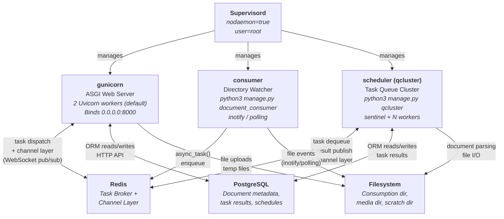
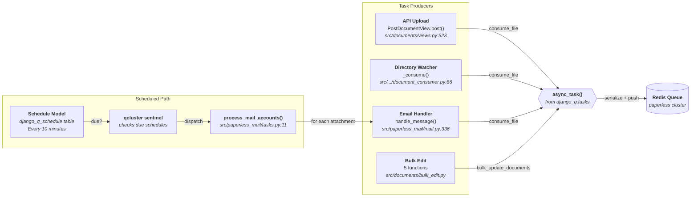
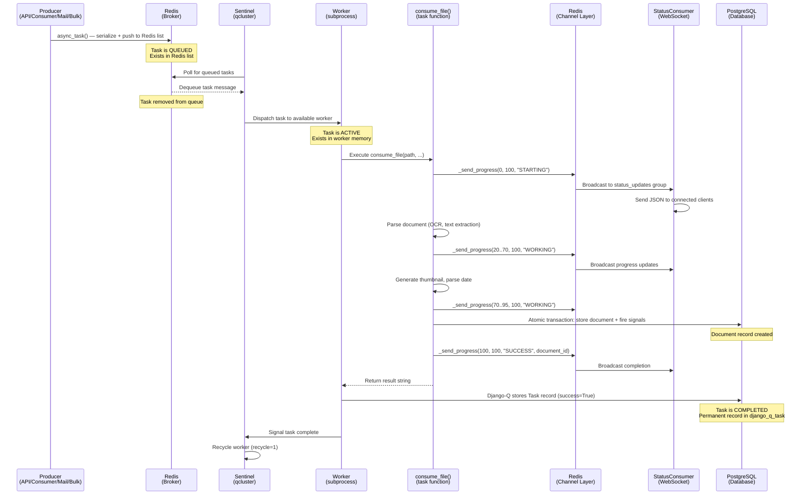
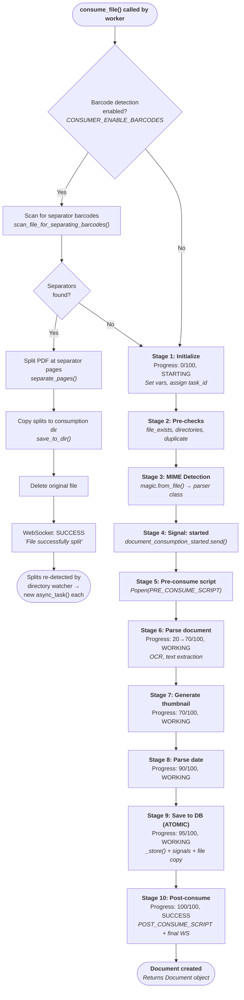

# Background Processing in paperless-ngx: A Technical Deep-Dive

This document traces the complete lifecycle of asynchronous jobs in paperless-ngx — from the
moment a background task is created, through its journey in the task queue, its execution by a
worker process, and finally to the point where its outcome can be inspected after completion.
Every claim in this document is grounded in direct analysis of the repository source code. File
paths and line numbers are cited so that each assertion can be independently verified against the
codebase.

The goal is not merely to list configuration knobs, but to explain *why* the system behaves the
way it does at runtime, connecting architectural decisions to observable behavior. If you have
ever wondered what happens behind the scenes when you upload a document, how the system tells the
difference between work that is waiting and work that is actively being processed, or where to
look to find out what happened to a given job — this document provides the answers.

---

## Terminology

paperless-ngx overloads several common terms. To prevent confusion, the following definitions
apply throughout this document:

| Term | Definition |
|------|-----------|
| **consumer** (lowercase) | The directory watcher process managed by Supervisord. Runs `python3 manage.py document_consumer`. Its job is to detect new files in the consumption directory and enqueue them for processing. Source: `docker/supervisord.conf:20` |
| **`Consumer`** (capitalized) | The Python class `documents.consumer.Consumer` that implements the multi-stage document ingestion pipeline. Instantiated inside a worker process when a `consume_file` task executes. Source: `src/documents/consumer.py:52` |
| **task** | A Django-Q unit of work dispatched via `async_task()`. Represents a single function call to be executed asynchronously by a worker. Each task is serialized and pushed to a Redis list. |
| **worker** | A Django-Q subprocess spawned by the `qcluster` management command. Workers dequeue tasks from Redis and execute the target function in an isolated process. The number of workers is controlled by `TASK_WORKERS`. Source: `src/paperless/settings.py:438` |
| **sentinel** | The Django-Q internal monitor/manager process running inside `qcluster`. The sentinel polls Redis for queued tasks, dispatches them to available workers, monitors worker health, and handles timeouts. |
| **pipeline** | The multi-stage ingestion workflow within `Consumer.try_consume_file()`. Encompasses file validation, parsing, thumbnail generation, database storage, signal-driven post-processing, and WebSocket progress broadcasting. Source: `src/documents/consumer.py:180` |
| **broker** | Redis — used as the task queue transport by Django-Q and as the WebSocket channel layer by Django Channels. A single Redis instance serves both roles. Source: `src/paperless/settings.py:182,456` |
| **channel layer** | The Django Channels Redis backend (`channels_redis.core.RedisChannelLayer`) that enables broadcasting WebSocket messages to connected clients via Redis pub/sub. Source: `src/paperless/settings.py:178-187` |

---

## Table of Contents

- [Terminology](#terminology)
- [Runtime Service Topology](#runtime-service-topology)
  - [The Three Managed Processes](#the-three-managed-processes)
  - [Redis as Central Communication Hub](#redis-as-central-communication-hub)
  - [Startup Readiness Sequence](#startup-readiness-sequence)
- [How Background Jobs Are Created](#how-background-jobs-are-created)
  - [Entry Point 1: API Upload (PostDocumentView)](#entry-point-1-api-upload-postdocumentview)
  - [Entry Point 2: Directory Watcher (document_consumer)](#entry-point-2-directory-watcher-document_consumer)
  - [Entry Point 3: Email Ingestion (MailAccountHandler)](#entry-point-3-email-ingestion-mailaccounthandler)
  - [Entry Point 4: Bulk Edit Operations (bulk_edit)](#entry-point-4-bulk-edit-operations-bulk_edit)
  - [Scheduled Recurring Tasks](#scheduled-recurring-tasks)
  - [Complete Call Site Summary](#complete-call-site-summary)
- [Task Lifecycle: From Queue to Completion](#task-lifecycle-from-queue-to-completion)
  - [Django-Q Cluster Architecture](#django-q-cluster-architecture)
  - [Queued vs. Actively Processing](#queued-vs-actively-processing)
  - [Q_CLUSTER Configuration Explained](#q_cluster-configuration-explained)
  - [The Timeout-Retry Relationship](#the-timeout-retry-relationship)
- [The Document Ingestion Pipeline](#the-document-ingestion-pipeline)
  - [Entry Point — consume_file()](#entry-point--consume_file)
  - [Pipeline Stages](#pipeline-stages)
  - [WebSocket Progress Broadcasting](#websocket-progress-broadcasting)
  - [The Barcode Splitting Recursive Pattern](#the-barcode-splitting-recursive-pattern)
- [Signal-Driven Post-Processing](#signal-driven-post-processing)
  - [The Six Handlers](#the-six-handlers)
  - [Transactional Guarantees](#transactional-guarantees)
  - [Classifier Sharing](#classifier-sharing)
- [Where Task State Is Stored](#where-task-state-is-stored)
  - [Django-Q ORM Models](#django-q-orm-models)
  - [Redis Transient State](#redis-transient-state)
  - [Database Persistent State](#database-persistent-state)
  - [State-to-Storage Mapping](#state-to-storage-mapping)
- [Observing What Happened to a Job](#observing-what-happened-to-a-job)
  - [Real-Time: WebSocket status_updates](#real-time-websocket-status_updates)
  - [Post-Hoc: Querying the Task Model](#post-hoc-querying-the-task-model)
  - [Logs: paperless.log and mail.log](#logs-paperlesslog-and-maillog)
- [Source Code Reference Map](#source-code-reference-map)

---

## Runtime Service Topology

Inside the Docker container, **Supervisord** runs in the foreground (`nodaemon=true`) as the
top-level process manager. It is responsible for starting, monitoring, and restarting exactly
three long-running child processes. These three processes — plus a shared Redis instance and a
shared PostgreSQL database — constitute the complete runtime architecture of paperless-ngx.

> **Source:** `docker/supervisord.conf:1-2` — `[supervisord]` section with `nodaemon=true`

The rationale for this design is containment: a single Docker container hosts the entire
application stack (minus external infrastructure), and Supervisord ensures that if any process
crashes, it is restarted automatically. All three processes run as the `paperless` user (not
root), following the principle of least privilege.

> **Source:** `docker/supervisord.conf:8,12,21,30` — `user=root` for supervisord itself,
> `user=paperless` for all child processes

### The Three Managed Processes

| Process Name | Supervisord Section | Command | Role | Key Source Files |
|---|---|---|---|---|
| `gunicorn` | `[program:gunicorn]` (line 10) | `gunicorn -c /usr/src/paperless/gunicorn.conf.py paperless.asgi:application` | Runs the Django ASGI application via Gunicorn with the Uvicorn worker class. Handles all HTTP API requests and WebSocket connections. Binds to `0.0.0.0:8000` by default with 2 web server workers. | `gunicorn.conf.py`, `src/paperless/asgi.py` |
| `consumer` | `[program:consumer]` (line 19) | `python3 manage.py document_consumer` | The directory watcher. Monitors the consumption directory for new files using inotify (Linux native, preferred) or polling (fallback via watchdog library). When a new file is detected and stabilized, it enqueues the file as a background task via `async_task()`. | `src/documents/management/commands/document_consumer.py` |
| `scheduler` | `[program:scheduler]` (line 28) | `python3 manage.py qcluster` | Starts the Django-Q cluster process. Internally spawns a **sentinel** process (the task manager) and a configurable pool of **worker** processes. Workers dequeue tasks from Redis and execute them. The cluster also handles scheduled recurring tasks such as the periodic mail account check. | `src/paperless/settings.py:449-457` |

> **Source:** `docker/supervisord.conf:10-35` — All three `[program:*]` sections

**Gunicorn Configuration Details:**

The Gunicorn server is configured through `gunicorn.conf.py` at the repository root:

| Setting | Value | Source |
|---------|-------|--------|
| `bind` | `0.0.0.0:{PAPERLESS_PORT}` (default: `8000`) | `gunicorn.conf.py:3` |
| `workers` | `int(PAPERLESS_WEBSERVER_WORKERS)` (default: `2`) | `gunicorn.conf.py:4` |
| `worker_class` | `paperless.workers.ConfigurableWorker` (Uvicorn ASGI) | `gunicorn.conf.py:5` |
| `timeout` | `120` seconds | `gunicorn.conf.py:6` |

The `worker_class` is set to `paperless.workers.ConfigurableWorker`, which is a Uvicorn-based
ASGI worker. This is critical because paperless-ngx uses Django Channels for WebSocket support,
and Channels requires an ASGI server — a plain WSGI server like the default Gunicorn sync worker
would not support WebSocket connections. The ASGI application itself is defined in
`src/paperless/asgi.py` and uses a `ProtocolTypeRouter` to multiplex HTTP and WebSocket traffic:

```
application = ProtocolTypeRouter({
    "http": get_asgi_application(),
    "websocket": AuthMiddlewareStack(URLRouter(websocket_urlpatterns)),
})
```

> **Source:** `src/paperless/asgi.py:17-22`

This means HTTP requests are handled by Django's standard request/response cycle, while WebSocket
connections at `ws/status/$` are routed through the `AuthMiddlewareStack` to the
`StatusConsumer` class, which broadcasts real-time task progress updates.

> **Source:** `src/paperless/urls.py:136-138` — `websocket_urlpatterns = [re_path(r"ws/status/$", StatusConsumer.as_asgi())]`

### Redis as Central Communication Hub

A single Redis instance serves a **dual role** in the paperless-ngx architecture:

**Role 1: Django-Q Task Broker**

Tasks dispatched via `async_task()` are serialized (using Python's `pickle` protocol) and pushed
onto Redis lists. The `qcluster` sentinel process polls these lists to dequeue tasks and
dispatch them to worker processes. The broker URL is configured in the `Q_CLUSTER` dictionary:

```python
Q_CLUSTER = {
    ...
    "redis": os.getenv("PAPERLESS_REDIS", "redis://localhost:6379"),
}
```

> **Source:** `src/paperless/settings.py:449-457` — `Q_CLUSTER` configuration block

**Role 2: Django Channels WebSocket Layer**

Real-time status updates — such as document ingestion progress — are published to the
`status_updates` channel group via the Redis-backed channel layer. The channel layer
configuration uses the same `PAPERLESS_REDIS` environment variable:

```python
CHANNEL_LAYERS = {
    "default": {
        "BACKEND": "channels_redis.core.RedisChannelLayer",
        "CONFIG": {
            "hosts": [os.getenv("PAPERLESS_REDIS", "redis://localhost:6379")],
            "capacity": 2000,
            "expiry": 15,
        },
    },
}
```

> **Source:** `src/paperless/settings.py:178-187` — `CHANNEL_LAYERS` configuration

The `capacity: 2000` setting means the channel layer can buffer up to 2,000 messages before
dropping the oldest ones. The `expiry: 15` setting means messages older than 15 seconds are
automatically discarded. These values are deliberately set higher than the Channels defaults
(100 capacity, 60 second expiry) because document ingestion generates frequent progress updates
that need to be delivered promptly, and the short expiry ensures stale messages don't accumulate.

**Why a single Redis instance for both roles?** This is a pragmatic design choice: both the task
broker and the channel layer require a fast, in-memory message transport, and using a single
Redis instance minimizes infrastructure complexity for the common single-container deployment.
The `PAPERLESS_REDIS` environment variable controls the connection URL for both roles, ensuring
they always point to the same instance.

### Startup Readiness Sequence

Before Supervisord starts the three application processes, the `docker/docker-prepare.sh` script
executes a carefully ordered startup sequence to ensure all infrastructure dependencies are
available and the database is in a consistent state:

| Step | Function | What It Does | Source |
|------|----------|-------------|--------|
| 1 | `wait_for_postgres()` | Retries `pg_isready` up to 5 times with 5-second intervals. Only runs if `PAPERLESS_DBHOST` is set (i.e., when using an external PostgreSQL database). | `docker/docker-prepare.sh:5-28` |
| 2 | `wait_for_redis()` | Invokes `docker/wait-for-redis.py`, which creates a `Redis.from_url()` connection using `PAPERLESS_REDIS` (default: `redis://localhost:6379`) and retries `ping()` up to 5 times with 5-second intervals. Exits with `os.EX_UNAVAILABLE` on failure. | `docker/docker-prepare.sh:30-36`, `docker/wait-for-redis.py:14-42` |
| 3 | `migrations()` | Runs `python3 manage.py migrate` under a `flock` advisory lock (`/usr/src/paperless/data/migration_lock`) to prevent multiple containers from running migrations simultaneously. This is critical in multi-replica deployments. | `docker/docker-prepare.sh:38-47` |
| 4 | `search_index()` | Checks `/usr/src/paperless/data/.index_version` against a hardcoded version number. If they don't match, runs `python3 manage.py document_index reindex` to rebuild the Whoosh search index. This ensures the index schema is compatible after upgrades. | `docker/docker-prepare.sh:49-58` |
| 5 | `superuser()` | If `PAPERLESS_ADMIN_USER` is set, runs `python3 manage.py manage_superuser` to create or update the admin user. | `docker/docker-prepare.sh:60-64` |

All five steps are orchestrated by the `do_work()` function at line 66 of `docker-prepare.sh`,
which is called at the end of the script (line 81). Only after `do_work()` completes
successfully does Supervisord start the three application processes.

> **Source:** `docker/docker-prepare.sh:66-81`

The **rationale** for this ordering is dependency-driven:
- PostgreSQL must be reachable before migrations can run.
- Redis must be reachable before the task queue or channel layer can function.
- Migrations must complete before any Django process accesses the database.
- The search index must be current before documents can be queried.
- The superuser must exist before the admin interface can be used.

### Runtime Process Topology Diagram



---

## How Background Jobs Are Created

paperless-ngx uses Django-Q's `async_task()` function as the **sole mechanism** for dispatching
background work. The import path is:

```python
from django_q.tasks import async_task
```

Each `async_task()` call serializes the target function name and its arguments using Python's
`pickle` protocol, then pushes the serialized message onto a Redis list keyed by the cluster
name (in this case, `"paperless"`). The message remains in Redis until a `qcluster` worker
picks it up for execution.

There are **four distinct producer modules** in the codebase that call `async_task()`, generating
a total of **eight distinct call sites**. Additionally, one **scheduled recurring task** is
registered via a Django migration. This section documents each producer in detail.

### Entry Point 1: API Upload (PostDocumentView)

**Location:** `src/documents/views.py:491-535`
**Trigger:** A user uploads a document via `POST /api/documents/post_document/`
**Pattern:** Fire-and-forget — the HTTP response returns immediately while processing happens in the background

When a user uploads a document through the REST API, the `PostDocumentView.post()` method
handles the request. The flow is:

1. **Validate input** (line 499-500): The request data is validated through `PostDocumentSerializer`,
   extracting the document file, optional correspondent, document type, tags, and title.

2. **Save to temp file** (lines 510-519): The uploaded file content is written to a temporary file
   in `SCRATCH_DIR` (default: `/tmp/paperless`) with a `paperless-upload-` prefix. The file's
   modification time is set to the current time to aid date detection later.

3. **Generate task ID** (line 521): A UUID is generated (`str(uuid.uuid4())`) to serve as the
   unique identifier for this task. This UUID can later be used to track the task's progress
   through WebSocket updates and to query its result in the database.

4. **Dispatch async task** (lines 523-533):

```python
async_task(
    "documents.tasks.consume_file",
    temp_filename,
    override_filename=doc_name,
    override_title=title,
    override_correspondent_id=correspondent_id,
    override_document_type_id=document_type_id,
    override_tag_ids=tag_ids,
    task_id=task_id,
    task_name=os.path.basename(doc_name)[:100],
)
```

> **Source:** `src/documents/views.py:523-533`

5. **Return immediately** (line 535): The view returns `Response("OK")` without waiting for the
   document to be consumed. The client can monitor progress via the WebSocket `status_updates`
   channel using the `task_id`.

**Key design rationale:** The fire-and-forget pattern is essential because document ingestion
(which involves OCR, text extraction, thumbnail generation, and classifier-based matching) can
take anywhere from a few seconds to 30 minutes. Blocking the HTTP request for that duration
would cause timeouts and a poor user experience. By returning immediately and providing a
WebSocket-based progress channel, the frontend can show a progress bar while the background
worker handles the heavy lifting.

### Entry Point 2: Directory Watcher (document_consumer)

**Location:** `src/documents/management/commands/document_consumer.py:46-97`
**Trigger:** A new file appears in the consumption directory
**Pattern:** Event-driven — the watcher detects filesystem events and enqueues tasks

The directory watcher is a long-running Django management command (`python3 manage.py
document_consumer`) that monitors the consumption directory for new files. It supports two
detection modes:

1. **inotify (Linux native):** If the `inotifyrecursive` package is available and
   `CONSUMER_POLLING` is set to 0, the watcher uses Linux's inotify subsystem for efficient,
   event-driven file detection. It watches for `CLOSE_WRITE` and `MOVED_TO` events with a
   0.5-second debounce to handle files that are still being written.
   Source: `src/documents/management/commands/document_consumer.py:199-240`

2. **Polling (fallback):** If inotify is unavailable (non-Linux systems or explicit
   configuration), the watcher falls back to `watchdog.observers.polling.PollingObserver`,
   which periodically scans the directory for changes.
   Source: `src/documents/management/commands/document_consumer.py:185-197`

When a new file is detected and stabilized, the `_consume()` function is called:

1. **Filter** (lines 47-56): Directories, ignored files (matching `CONSUMER_IGNORE_PATTERNS`),
   moved files, and files with unsupported extensions are skipped.

2. **Readability check** (lines 62-75): The file is opened in read mode up to 50 times with
   10ms intervals (total: 500ms) to handle files that may still be locked by the OS during a
   write or copy operation.

3. **Optional tag extraction** (lines 77-82): If `CONSUMER_SUBDIRS_AS_TAGS` is enabled, the
   `_tags_from_path()` function walks up the directory tree from the file to `CONSUMPTION_DIR`,
   creating or looking up a `Tag` for each intermediate directory name.
   Source: `src/documents/management/commands/document_consumer.py:27-38`

4. **Dispatch async task** (lines 86-91):

```python
async_task(
    "documents.tasks.consume_file",
    filepath,
    override_tag_ids=tag_ids if tag_ids else None,
    task_name=os.path.basename(filepath)[:100],
)
```

> **Source:** `src/documents/management/commands/document_consumer.py:86-91`

5. **Error handling** (lines 92-96): All exceptions are caught to prevent the consumer from
   crashing. This is critical because the consumer is a long-running process — a single failed
   file should not bring down the entire directory watching service.

**Key design rationale:** The consumer deliberately does NOT process the document itself. It
only enqueues the file path as a task, delegating the actual work to a `qcluster` worker. This
separation ensures that:
- The consumer remains responsive to new file events.
- Multiple documents can be processed in parallel by multiple workers.
- A crash during document processing doesn't affect the file watcher.

### Entry Point 3: Email Ingestion (MailAccountHandler)

**Location:** `src/paperless_mail/mail.py:272-360`
**Trigger:** The scheduled `process_mail_accounts` task (or manual invocation) processes email
**Pattern:** Iterative — each email attachment generates a separate background task

When the scheduled mail check runs (every 10 minutes, see [Scheduled Recurring
Tasks](#scheduled-recurring-tasks)), the `MailAccountHandler.handle_message()` method processes
each email message. For each attachment:

1. **Filter by disposition** (lines 291-302): If the mail rule is set to
   `ATTACHMENTS_ONLY`, inline attachments (those without `content_disposition == "attachment"`)
   are skipped.

2. **Filter by filename pattern** (lines 304-311): If the rule has a
   `filter_attachment_filename`, only attachments matching the glob pattern are processed.

3. **Detect MIME type** (line 317): The attachment's MIME type is detected using `python-magic`
   on the raw payload bytes (`magic.from_buffer(att.payload, mime=True)`), rather than trusting
   the email's declared content type.

4. **Save to temp file** (lines 321-327): The attachment payload is written to a temporary file
   in `SCRATCH_DIR` with a `paperless-mail-` prefix.

5. **Dispatch async task** (lines 336-349):

```python
async_task(
    "documents.tasks.consume_file",
    path=temp_filename,
    override_filename=pathvalidate.sanitize_filename(att.filename),
    override_title=title,
    override_correspondent_id=correspondent.id if correspondent else None,
    override_document_type_id=doc_type.id if doc_type else None,
    override_tag_ids=tag_ids,
    task_name=att.filename[:100],
)
```

> **Source:** `src/paperless_mail/mail.py:336-349`

**Key design rationale:** Email processing is itself a background task (triggered by the
scheduled `process_mail_accounts` function running inside a `qcluster` worker). When it finds
attachments to consume, it dispatches *additional* background tasks for each attachment. This
creates a two-level task hierarchy:
- Level 1: `process_mail_accounts` (scheduled, runs every 10 minutes)
- Level 2: `consume_file` (one per email attachment, dispatched by Level 1)

This design prevents a single large email batch from blocking the mail processing task for an
extended period. Each attachment is independently queued and can be processed in parallel by
different workers.

### Entry Point 4: Bulk Edit Operations (bulk_edit)

**Location:** `src/documents/bulk_edit.py`
**Trigger:** A user performs a bulk edit action through the REST API
**Pattern:** Update-then-reindex — the database is updated immediately, then a background task
re-indexes the affected documents

The bulk edit module contains five functions that follow an identical pattern:

1. **Apply the change directly** to the database using Django ORM queries.
2. **Dispatch a background task** to re-index the affected documents in the Whoosh search index
   and trigger any related `post_save` signal handlers.

The five bulk edit functions and their `async_task()` call sites:

**`set_correspondent(doc_ids, correspondent)`** — Line 18:
Updates the `correspondent` field on all matching documents, then dispatches:
```python
async_task("documents.tasks.bulk_update_documents", document_ids=affected_docs)
```
> **Source:** `src/documents/bulk_edit.py:10-20`

**`set_document_type(doc_ids, document_type)`** — Line 31:
Updates the `document_type` field on all matching documents, then dispatches:
```python
async_task("documents.tasks.bulk_update_documents", document_ids=affected_docs)
```
> **Source:** `src/documents/bulk_edit.py:23-33`

**`add_tag(doc_ids, tag)`** — Line 47:
Creates `Document.tags.through` relationship records for the tag, then dispatches:
```python
async_task("documents.tasks.bulk_update_documents", document_ids=affected_docs)
```
> **Source:** `src/documents/bulk_edit.py:36-49`

**`remove_tag(doc_ids, tag)`** — Line 63:
Deletes the matching `Document.tags.through` relationship records, then dispatches:
```python
async_task("documents.tasks.bulk_update_documents", document_ids=affected_docs)
```
> **Source:** `src/documents/bulk_edit.py:52-65`

**`modify_tags(doc_ids, add_tags, remove_tags)`** — Line 87:
Removes specified tags and adds new ones using bulk operations, then dispatches:
```python
async_task("documents.tasks.bulk_update_documents", document_ids=affected_docs)
```
> **Source:** `src/documents/bulk_edit.py:68-89`

All five functions dispatch the same target task: `"documents.tasks.bulk_update_documents"`.
This task function (defined at `src/documents/tasks.py:270-281`) performs two actions for each
affected document:
1. Sends a `post_save` signal (line 276) to trigger any registered signal handlers.
2. Updates the document's entry in the Whoosh full-text search index (lines 278-280).

**Key design rationale:** The database update is applied synchronously (within the HTTP request)
so that the change is immediately visible to subsequent API calls. The search index update is
deferred to a background task because reindexing can be slow for large document sets, and a
stale search index is acceptable for a brief period. This provides a responsive user experience
while maintaining eventual consistency.

### Scheduled Recurring Tasks

In addition to the on-demand `async_task()` calls above, paperless-ngx registers one
**scheduled recurring task** via a Django migration:

**Mail Fetching Schedule:**

```python
schedule(
    "paperless_mail.tasks.process_mail_accounts",
    name="Check all e-mail accounts",
    schedule_type=Schedule.MINUTES,
    minutes=10,
)
```

> **Source:** `src/paperless_mail/migrations/0002_auto_20201117_1334.py:9-15`

This migration creates a `Schedule` record in the database (`django_q_schedule` table) that
instructs the `qcluster` scheduler to run `process_mail_accounts` every 10 minutes. The
reverse migration (line 18-19) removes the schedule by deleting the matching `Schedule` object.

When the schedule fires, the `process_mail_accounts()` function in `src/paperless_mail/tasks.py`
iterates over all `MailAccount` objects in the database and calls
`MailAccountHandler().handle_mail_account()` on each one:

```python
def process_mail_accounts():
    total_new_documents = 0
    for account in MailAccount.objects.all():
        try:
            total_new_documents += MailAccountHandler().handle_mail_account(account)
        except MailError:
            logger.exception(f"Error while processing mail account {account}")
    ...
```

> **Source:** `src/paperless_mail/tasks.py:11-22`

**How Django-Q handles schedules:** The `qcluster` sentinel periodically checks the `Schedule`
table for tasks that are due. When a schedule's next run time has passed, the sentinel creates
a new task for the scheduled function and places it in the Redis queue for worker execution.
The `catch_up: False` setting in `Q_CLUSTER` means that if the system was down and missed a
scheduled run, it does NOT attempt to execute all missed runs upon restart — it simply resumes
the normal schedule.

> **Source:** `src/paperless/settings.py:451` — `"catch_up": False`

### Complete Call Site Summary

The following table maps every `async_task()` call site in the codebase:

| # | Module | Function | Line | Task Target | Key Arguments |
|---|--------|----------|------|-------------|---------------|
| 1 | `src/documents/views.py` | `PostDocumentView.post()` | 523 | `documents.tasks.consume_file` | path, filename, title, correspondent_id, document_type_id, tag_ids, task_id |
| 2 | `src/documents/management/commands/document_consumer.py` | `_consume()` | 86 | `documents.tasks.consume_file` | filepath, tag_ids |
| 3 | `src/paperless_mail/mail.py` | `MailAccountHandler.handle_message()` | 336 | `documents.tasks.consume_file` | path, filename, title, correspondent_id, document_type_id, tag_ids |
| 4 | `src/documents/bulk_edit.py` | `set_correspondent()` | 18 | `documents.tasks.bulk_update_documents` | document_ids |
| 5 | `src/documents/bulk_edit.py` | `set_document_type()` | 31 | `documents.tasks.bulk_update_documents` | document_ids |
| 6 | `src/documents/bulk_edit.py` | `add_tag()` | 47 | `documents.tasks.bulk_update_documents` | document_ids |
| 7 | `src/documents/bulk_edit.py` | `remove_tag()` | 63 | `documents.tasks.bulk_update_documents` | document_ids |
| 8 | `src/documents/bulk_edit.py` | `modify_tags()` | 87 | `documents.tasks.bulk_update_documents` | document_ids |

**Plus one scheduled task (not a direct `async_task()` call):**

| | `src/paperless_mail/migrations/0002_auto_20201117_1334.py` | `add_schedules()` | 10 | `paperless_mail.tasks.process_mail_accounts` | (none — scheduled every 10 minutes) |

### Task Dispatch Convergence Diagram



---

## Task Lifecycle: From Queue to Completion

This section explains what happens between the moment a task is enqueued and the moment its
result can be inspected. Understanding this lifecycle is key to answering the question: *"How
does the system tell the difference between work that is waiting and work that is actively
being processed?"*

### Django-Q Cluster Architecture

Running `python3 manage.py qcluster` (the `scheduler` process in Supervisord) starts the
Django-Q cluster. This is not a single process but a **process tree**:

1. **The cluster process** — the top-level process started by the management command.
2. **The sentinel** — a child process spawned by the cluster. The sentinel is the "brain" of the
   task queue. It is responsible for:
   - Polling Redis for queued tasks.
   - Dispatching tasks to available workers.
   - Monitoring worker health (detecting timeouts, crashes).
   - Handling worker recycling (restarting workers after task completion).
   - Checking the `Schedule` table for due recurring tasks.
3. **N worker processes** — child processes spawned by the sentinel, where N is the value of
   `TASK_WORKERS`. Each worker is an independent Python process that can execute one task at a
   time.

The number of worker processes is determined by the `TASK_WORKERS` setting:

```python
def default_task_workers() -> int:
    available_cores = max(multiprocessing.cpu_count(), 1)
    try:
        if available_cores < 4:
            return available_cores
        return max(math.floor(math.sqrt(available_cores)), 1)
    except NotImplementedError:
        return 1

TASK_WORKERS = __get_int("PAPERLESS_TASK_WORKERS", default_task_workers())
```

> **Source:** `src/paperless/settings.py:427-438`

The default scaling formula is:
- On systems with fewer than 4 CPU cores: one worker per core.
- On systems with 4+ CPU cores: `floor(sqrt(cpu_count))` workers.

This means:
- 1 core → 1 worker
- 2 cores → 2 workers
- 4 cores → 2 workers
- 9 cores → 3 workers
- 16 cores → 4 workers

The rationale for the square-root scaling is explained in the settings file comments
(lines 419-424): paperless-ngx has multiple levels of concurrency (workers processing
documents in parallel, each document using multiple threads for OCR). The square-root formula
balances parallel document processing against per-document thread utilization without exceeding
the total CPU count.

Each worker also gets a thread allocation:

```python
def default_threads_per_worker(task_workers) -> int:
    available_cores = max(multiprocessing.cpu_count(), 1)
    try:
        return max(math.floor(available_cores / task_workers), 1)
    except NotImplementedError:
        return 1

THREADS_PER_WORKER = os.getenv(
    "PAPERLESS_THREADS_PER_WORKER",
    default_threads_per_worker(TASK_WORKERS),
)
```

> **Source:** `src/paperless/settings.py:460-472`

### Queued vs. Actively Processing

A task moves through four distinct states during its lifecycle:

**1. Queued (Waiting)**

The task has been serialized and pushed to a Redis list by `async_task()`, but no worker has
picked it up yet. In this state:
- The task exists as a serialized message in a Redis list.
- If Django-Q's admin integration is enabled, the task is also mirrored in the `OrmQ` model
  (`django_q_ormq` table) for admin panel visibility.
- The task is invisible to workers until the sentinel dequeues it.

**2. Active (Processing)**

The sentinel has dequeued the task from Redis and dispatched it to an available worker process.
In this state:
- The task is no longer in the Redis queue (it has been removed).
- The worker process is executing the target function (e.g., `consume_file()`).
- Real-time progress is broadcast via `_send_progress()` through the WebSocket channel layer.
- The task exists only in the worker's process memory — there is no persistent record of an
  "active" state.

**3. Succeeded**

The worker completed the target function without raising an exception. In this state:
- Django-Q writes a `Task` record to the database (`django_q_task` table) with `success=True`.
- The `result` field contains the return value of the target function.
- The `started` and `stopped` timestamps record execution duration.

**4. Failed**

The worker raised an exception, was killed due to a timeout, or crashed. In this state:
- Django-Q writes a `Task` record to the database with `success=False`.
- The `result` field contains the exception information.
- If the task timed out and `retry` seconds have elapsed, the sentinel may re-queue the task.

**The key insight:** There is no persistent "active" state. If you query the database for a
task and find no `Task` record, the task is either still queued in Redis or currently being
processed by a worker. The only way to observe active processing in real-time is through the
WebSocket `status_updates` channel, which receives progress broadcasts from the worker.

### Q_CLUSTER Configuration Explained

The `Q_CLUSTER` dictionary in `src/paperless/settings.py:449-457` controls all aspects of the
Django-Q task queue:

```python
Q_CLUSTER = {
    "name": "paperless",
    "catch_up": False,
    "recycle": 1,
    "retry": PAPERLESS_WORKER_RETRY,
    "timeout": PAPERLESS_WORKER_TIMEOUT,
    "workers": TASK_WORKERS,
    "redis": os.getenv("PAPERLESS_REDIS", "redis://localhost:6379"),
}
```

| Setting | Default Value | Environment Variable | Meaning |
|---------|--------------|---------------------|---------|
| `name` | `"paperless"` | — | Cluster name. Used as a namespace prefix for Redis keys, allowing multiple Django-Q clusters to share a single Redis instance without interference. |
| `catch_up` | `False` | — | When `False`, overdue scheduled tasks are NOT executed upon cluster restart. This prevents a cascade of missed mail checks from running simultaneously after an outage. |
| `recycle` | `1` | — | The number of tasks a worker process handles before being terminated and replaced with a fresh process. Set to `1` — meaning **every worker is recycled after every single task**. |
| `retry` | `1810` | `PAPERLESS_WORKER_RETRY` | If a task result is not recorded within this many seconds, the sentinel assumes the worker died and re-queues the task. Default: `PAPERLESS_WORKER_TIMEOUT + 10`. Source: `src/paperless/settings.py:444-447` |
| `timeout` | `1800` (30 minutes) | `PAPERLESS_WORKER_TIMEOUT` | If a task runs longer than this many seconds, the sentinel kills the worker process. Source: `src/paperless/settings.py:440` |
| `workers` | `sqrt(cpu_count)` | `PAPERLESS_TASK_WORKERS` | Number of parallel worker processes. Source: `src/paperless/settings.py:438` |
| `redis` | `redis://localhost:6379` | `PAPERLESS_REDIS` | URL of the Redis broker. Source: `src/paperless/settings.py:456` |

**Why `recycle: 1` is critical:**

Document parsing involves heavy native libraries — Tesseract for OCR, Ghostscript for PDF
rendering, ImageMagick for image conversion. These libraries can leak memory over time,
especially when processing large or complex documents. By setting `recycle: 1`, every worker
process is terminated and replaced after completing a single task. This ensures that memory
leaks from one document's parsing cannot accumulate across multiple documents.

The tradeoff is a small overhead for process creation on every task, but this is negligible
compared to the seconds-to-minutes duration of document parsing tasks. For a task that takes
30 seconds to complete, the ~100ms cost of spawning a new process is irrelevant.

> **Source:** `src/paperless/settings.py:452` — `"recycle": 1`

### The Timeout-Retry Relationship

The `timeout` and `retry` settings work together as a safety net:

1. **Timeout** (`1800` seconds = 30 minutes): If a worker takes longer than this to complete a
   task, the sentinel sends a `SIGKILL` to the worker process. The task is considered failed.

2. **Retry** (`1810` seconds = 30 minutes + 10 seconds): If the sentinel has not received a
   task result within this many seconds of dispatching the task, it assumes the worker died
   (possibly from an OOM kill or other external cause) and re-queues the task.

The 10-second gap between `timeout` and `retry` is deliberate:

```python
PAPERLESS_WORKER_RETRY: Final[int] = __get_int(
    "PAPERLESS_WORKER_RETRY",
    PAPERLESS_WORKER_TIMEOUT + 10,
)
```

> **Source:** `src/paperless/settings.py:444-447`

The rationale (documented in the code comment at line 442): `retry` must be strictly greater
than `timeout`. If they were equal, the sentinel might re-queue a task at the exact moment
the timeout fires, potentially causing the task to run twice. The 10-second buffer ensures
the timeout has time to kill the worker and record the failure before the retry mechanism
kicks in.

### Task Lifecycle Sequence Diagram



---

## The Document Ingestion Pipeline

When a `consume_file` task is picked up by a worker, it executes the multi-stage document
ingestion pipeline. This section traces the complete code path from task entry point to
final document creation.

### Entry Point — consume_file()

The `consume_file()` function at `src/documents/tasks.py:184-253` is the entry point for all
document consumption tasks. Its signature:

```python
def consume_file(
    path,
    override_filename=None,
    override_title=None,
    override_correspondent_id=None,
    override_document_type_id=None,
    override_tag_ids=None,
    task_id=None,
):
```

> **Source:** `src/documents/tasks.py:184-192`

The function has **two code paths** based on the `CONSUMER_ENABLE_BARCODES` setting:

**Path A — Barcode Detection (lines 195-233):**

If `settings.CONSUMER_ENABLE_BARCODES` is `True`, the function first scans the document for
separator barcodes before attempting normal consumption. If separator barcodes are found:

1. `scan_file_for_separating_barcodes(path)` converts each page to an image and scans for
   barcodes matching `CONSUMER_BARCODE_STRING`. Returns a list of page numbers where
   separator barcodes were found. Source: `src/documents/tasks.py:96-110`

2. `separate_pages(path, separators)` splits the PDF at the separator pages using pikepdf,
   creating individual PDF files in `SCRATCH_DIR`. Source: `src/documents/tasks.py:113-161`

3. Each split document is copied to the consumption directory via `save_to_dir()`.
   Source: `src/documents/tasks.py:164-181`

4. The original file is deleted (line 214).

5. A WebSocket completion message is sent directly (lines 217-232) — not through the
   `Consumer` class, but via a direct `get_channel_layer().group_send()` call.

6. The function returns `"File successfully split"` (line 233).

The split documents will be re-detected by the directory watcher and enqueued as new,
individual tasks. This creates a **recursive multi-task pattern**: one upload can produce
N independent consumption tasks.

**Path B — Normal Consumption (lines 236-252):**

If barcodes are not enabled or no separators are found:

```python
document = Consumer().try_consume_file(
    path,
    override_filename=override_filename,
    override_title=override_title,
    override_correspondent_id=override_correspondent_id,
    override_document_type_id=override_document_type_id,
    override_tag_ids=override_tag_ids,
    task_id=task_id,
)
```

> **Source:** `src/documents/tasks.py:236-244`

This instantiates the `Consumer` class and invokes `try_consume_file()`, which runs the
full multi-stage pipeline.

### Pipeline Stages

The `Consumer.try_consume_file()` method at `src/documents/consumer.py:180-377` implements a
10-stage pipeline. Each stage performs a specific task and, where appropriate, broadcasts a
progress update via `_send_progress()`:

| Stage | Progress | Status | Message | What Happens | Source Lines |
|-------|----------|--------|---------|-------------|-------------|
| **1. Initialize** | 0/100 | `STARTING` | `MESSAGE_NEW_FILE` | Sets instance variables (`path`, `filename`, `override_*`, `task_id`). If no `task_id` was provided, generates a UUID. Sends the first progress broadcast. | `consumer.py:194-202` |
| **2. Pre-checks** | — | — | — | Runs three validation checks: `pre_check_file_exists()` verifies the file is on disk (line 211). `pre_check_directories()` ensures scratch, thumbnail, originals, and archive directories exist (line 212). `pre_check_duplicate()` computes the file's MD5 checksum and checks for existing documents with the same checksum (line 213). | `consumer.py:211-213` |
| **3. MIME Detection** | — | — | — | Uses `python-magic` (`magic.from_file()`) to detect the file's MIME type. Looks up the appropriate parser class via `get_parser_class_for_mime_type()`. If no parser supports the MIME type, the pipeline fails with `MESSAGE_UNSUPPORTED_TYPE`. | `consumer.py:219-225` |
| **4. Signal: Started** | — | — | — | Sends the `document_consumption_started` signal to notify any listeners that processing has begun. Passes the file path and logging group. | `consumer.py:229-233` |
| **5. Pre-consume Script** | — | — | — | If `PRE_CONSUME_SCRIPT` is configured, runs it as a subprocess via `Popen` and waits for completion. The script receives the file path as an argument. Failures are caught and reported. | `consumer.py:235` (calls `run_pre_consume_script()` at lines 121-141) |
| **6. Parse Document** | 20→70/100 | `WORKING` | `MESSAGE_PARSING_DOCUMENT` | The core parsing step. Calls `document_parser.parse(self.path, mime_type, self.filename)`. For PDF documents, this typically involves Tesseract OCR and text extraction. A `progress_callback` maps parser progress (0-100%) to the 20-70% range of the overall pipeline. | `consumer.py:258-261` |
| **7. Generate Thumbnail** | 70/100 | `WORKING` | `MESSAGE_GENERATING_THUMBNAIL` | Calls `document_parser.get_optimised_thumbnail()` to create a thumbnail image for the document. | `consumer.py:263-269` |
| **8. Parse Date** | 90/100 | `WORKING` | `MESSAGE_PARSE_DATE` | If the parser did not extract a date, falls back to `parse_date(self.filename, text)` which attempts to find a date in the filename or document text. | `consumer.py:273-276` |
| **9. Save to Database** | 95/100 | `WORKING` | `MESSAGE_SAVE_DOCUMENT` | **Atomic transaction** (lines 298-361): Creates the `Document` record via `_store()`. Fires `document_consumption_finished` signal (triggers 6 handlers — see [Signal-Driven Post-Processing](#signal-driven-post-processing)). Copies files to permanent storage under `FileLock(settings.MEDIA_LOCK)`. Saves the document. Deletes the original file. | `consumer.py:294-361` |
| **10. Post-consume** | 100/100 | `SUCCESS` | `MESSAGE_FINISHED` | Runs `POST_CONSUME_SCRIPT` if configured (with document ID, filename, paths, correspondent, and tags as arguments). Logs completion. Sends the final WebSocket progress message with `document_id` included in the payload. | `consumer.py:371-377` |

> **Source:** `src/documents/consumer.py:180-377` — complete `try_consume_file()` method

**Error handling throughout the pipeline:**

If any stage fails, the `_fail()` method (line 78) is called, which:
1. Sends a progress update with `status="FAILED"` and the error message.
2. Logs the error at the `error` level.
3. Raises a `ConsumerError` exception, which propagates up to the Django-Q worker.

This ensures that failures are visible both in real-time (via WebSocket) and post-hoc (via the
`Task` model's `success=False` record in the database).

### WebSocket Progress Broadcasting

Every progress update in the pipeline is sent via `Consumer._send_progress()`:

```python
def _send_progress(self, current_progress, max_progress, status, message=None, document_id=None):
    payload = {
        "filename": os.path.basename(self.filename) if self.filename else None,
        "task_id": self.task_id,
        "current_progress": current_progress,
        "max_progress": max_progress,
        "status": status,
        "message": message,
        "document_id": document_id,
    }
    async_to_sync(self.channel_layer.group_send)(
        "status_updates",
        {"type": "status_update", "data": payload},
    )
```

> **Source:** `src/documents/consumer.py:56-76`

**Payload structure:**

| Field | Type | Description |
|-------|------|-------------|
| `filename` | `string \| null` | The basename of the file being processed. Null if not yet set. |
| `task_id` | `string` | UUID identifying this specific task. Matches the `task_id` parameter from `async_task()` or a generated UUID. |
| `current_progress` | `integer` | Current progress value (0-100). |
| `max_progress` | `integer` | Maximum progress value (always 100 in the current implementation). |
| `status` | `string` | One of: `"STARTING"`, `"WORKING"`, `"SUCCESS"`, `"FAILED"`. |
| `message` | `string \| null` | A message constant indicating the current pipeline stage (e.g., `"new_file"`, `"parsing_document"`, `"finished"`). |
| `document_id` | `integer \| null` | The primary key of the created `Document` record. Only set in the final `SUCCESS` message. |

**Progress distribution across the pipeline:**

| Pipeline Stage | Progress Range | Duration (typical) |
|---------------|----------------|-------------------|
| Initialize | 0% | Instant |
| Pre-checks through pre-consume script | 0-20% | Seconds |
| Parse document (OCR) | 20-70% | Seconds to minutes |
| Generate thumbnail | 70% | Seconds |
| Parse date | 90% | Instant |
| Save to database | 95% | Seconds |
| Post-consume | 100% | Seconds |

The `progress_callback` passed to the document parser (line 237-240) maps the parser's
internal progress (0-100%) to the 20-70% range of the overall pipeline:

```python
def progress_callback(current_progress, max_progress):
    p = int((current_progress / max_progress) * 50 + 20)
    self._send_progress(p, 100, "WORKING")
```

> **Source:** `src/documents/consumer.py:237-240`

This means the parsing step (which includes OCR) gets 50 percentage points of the progress bar,
reflecting the fact that it is by far the longest stage in the pipeline.

**How the payload reaches the client:**

1. `_send_progress()` calls `async_to_sync(self.channel_layer.group_send)("status_updates", ...)`
2. The channel layer (backed by Redis) broadcasts the message to all members of the
   `status_updates` group.
3. `StatusConsumer.status_update()` (at `src/paperless/consumers.py:29-33`) receives the event
   and calls `self.send(json.dumps(event["data"]))` to push the JSON payload to the WebSocket.
4. The frontend JavaScript receives the JSON and updates the progress bar accordingly.

### The Barcode Splitting Recursive Pattern

When `CONSUMER_ENABLE_BARCODES` is enabled and a document contains separator barcodes, the
system creates a **recursive multi-task pattern**:

1. **Original upload** arrives (via API, directory watcher, or email).
2. **Task 1** runs `consume_file()`, which detects separator barcodes.
3. The document is split into N separate PDF files via `separate_pages()`.
   Source: `src/documents/tasks.py:113-161`
4. Each split file is copied to the consumption directory via `save_to_dir()`.
   Source: `src/documents/tasks.py:164-181`
5. The original file is deleted (line 214).
6. The **directory watcher** detects the N new files and creates N new `async_task()` calls.
7. **Tasks 2..N+1** each run `consume_file()` on one split file, this time following the
   normal consumption path (no barcodes in the individual splits).

This means a single document upload can fan out into multiple independent background tasks.
The user sees a `SUCCESS` status for the original upload (indicating the split was successful),
followed by N individual task progress updates as each split document is consumed.

### Ingestion Pipeline Flowchart



---

## Signal-Driven Post-Processing

When a document reaches Stage 9 (Save to Database) of the ingestion pipeline, the
`document_consumption_finished` signal is fired **inside an atomic database transaction**.
This triggers six signal handlers that perform automatic metadata assignment and indexing.

These handlers are **not separate background tasks** — they run synchronously within the
same worker process that is executing the `consume_file` task. This is an important distinction:
the signal handlers add no additional load to the task queue, but they do extend the execution
time of the `consume_file` task.

### Signal Definitions

Three domain-specific signals are defined in `src/documents/signals/__init__.py`:

```python
document_consumption_started = Signal()   # line 3
document_consumption_finished = Signal()  # line 4
document_consumer_declaration = Signal()  # line 5
```

> **Source:** `src/documents/signals/__init__.py:1-5`

The `document_consumption_finished` signal is the one that triggers post-processing. It is
fired at `src/documents/consumer.py:306-311` with the following keyword arguments:

```python
document_consumption_finished.send(
    sender=self.__class__,
    document=document,
    logging_group=self.logging_group,
    classifier=classifier,
)
```

### The Six Handlers

All six handlers are connected in `DocumentsConfig.ready()` at `src/documents/apps.py:11-29`:

| # | Handler | Connection Order | Source | What It Does |
|---|---------|-----------------|--------|-------------|
| 1 | `add_inbox_tags` | First | `src/documents/signals/handlers.py:30-32` | Queries all `Tag` objects where `is_inbox_tag=True` and adds them to the document via `document.tags.add(*inbox_tags)`. This is how the "inbox" tagging feature works — newly consumed documents automatically receive all inbox tags. |
| 2 | `set_correspondent` | Second | `src/documents/signals/handlers.py:35-98` | Runs `matching.match_correspondents(document, classifier)` to find potential correspondents using the classifier (ML-based) or pattern matching. If a match is found and the document doesn't already have a correspondent, assigns it and saves. |
| 3 | `set_document_type` | Third | `src/documents/signals/handlers.py:101-165` | Runs `matching.match_document_types(document, classifier)` with the same logic as correspondent matching. Assigns the first matching document type if the document doesn't already have one. |
| 4 | `set_tags` | Fourth | `src/documents/signals/handlers.py:168-230` | Runs `matching.match_tags(document, classifier)` to find matching tags. Adds any matched tags that the document doesn't already have. Unlike correspondent and document type, a document can have multiple tags, so all matches are added. |
| 5 | `set_log_entry` | Fifth | `src/documents/signals/handlers.py:413-425` | Creates a Django admin `LogEntry` record with `action_flag=ADDITION` for the new document, attributed to the `consumer` user. This provides an audit trail visible in the Django admin interface. |
| 6 | `add_to_index` | Sixth (last) | `src/documents/signals/handlers.py:428-431` | Calls `index.add_or_update_document(document)` to add the document to the Whoosh full-text search index. This makes the document immediately searchable after consumption. |

> **Source:** `src/documents/apps.py:22-27` — Signal handler registration

### Transactional Guarantees

The signal is fired at `consumer.py:306` inside an `atomic()` transaction block that was opened
at `consumer.py:298`:

```python
with transaction.atomic():
    document = self._store(text=text, date=date, mime_type=mime_type)
    document_consumption_finished.send(
        sender=self.__class__,
        document=document,
        logging_group=self.logging_group,
        classifier=classifier,
    )
    # ... file copy operations ...
    document.save()
```

> **Source:** `src/documents/consumer.py:298-346`

This means all six signal handlers execute within the same database transaction. The
implications are:

1. **Atomicity:** If any handler fails (e.g., the classifier crashes or the index update fails),
   the entire transaction is rolled back. The document record, tag assignments, correspondent
   assignment, document type assignment, log entry, and index update are all undone. The file
   is NOT moved to permanent storage.

2. **Consistency:** The document and all its metadata are either fully saved or not saved at all.
   There is no intermediate state where a document exists in the database without its tags or
   without being indexed.

3. **Performance:** All six handlers run sequentially within a single database connection. This
   is efficient because it avoids the overhead of separate transactions and network round trips.

### Classifier Sharing

The document classifier is loaded once before the transaction begins:

```python
classifier = load_classifier()  # line 292
```

> **Source:** `src/documents/consumer.py:292`

This single classifier instance is passed to `document_consumption_finished.send()` as a keyword
argument and is used by the `set_correspondent`, `set_document_type`, and `set_tags` handlers.
The rationale (noted in the code comment at lines 288-290): loading the classifier requires
reading and deserializing a potentially large pickle file from disk
(`settings.MODEL_FILE = data/classification_model.pickle`). Loading it once and sharing it
avoids tripling the I/O cost.

---

## Where Task State Is Stored

This section answers the question: *"Where does the task state end up being stored?"* The answer
involves both transient (Redis) and persistent (database) storage, depending on the task's
current lifecycle state.

### Django-Q ORM Models

Django-Q defines three key database models that store task-related state:

**1. `OrmQ` (`django_q_ormq` table)**

Mirrors the Redis queue state for admin panel visibility. When a task is enqueued via
`async_task()`, Django-Q may create an `OrmQ` record representing the queued task. This
provides a database-queryable view of the queue contents, useful for monitoring and debugging.
Once the task is picked up by a worker, the `OrmQ` record is removed.

**2. `Task` (`django_q_task` table)**

Stores the **result** of every completed task (both successful and failed). This is the
permanent record of what happened. Key fields:

| Field | Description |
|-------|-------------|
| `id` | Auto-incrementing primary key |
| `name` | Human-readable task name (from `task_name` parameter) |
| `func` | Dotted path of the target function (e.g., `"documents.tasks.consume_file"`) |
| `args` | Pickled positional arguments |
| `kwargs` | Pickled keyword arguments |
| `result` | Pickled return value (on success) or exception info (on failure) |
| `started` | Timestamp when the worker began executing the task |
| `stopped` | Timestamp when the task completed |
| `success` | Boolean — `True` if the function returned without exception, `False` otherwise |
| `attempt_count` | Number of times this task has been attempted (incremented on retry) |

**3. `Schedule` (`django_q_schedule` table)**

Stores recurring task definitions. The `qcluster` sentinel checks this table periodically
to determine if any scheduled tasks are due. The mail fetching schedule is the only schedule
registered by paperless-ngx:

```python
schedule(
    "paperless_mail.tasks.process_mail_accounts",
    name="Check all e-mail accounts",
    schedule_type=Schedule.MINUTES,
    minutes=10,
)
```

> **Source:** `src/paperless_mail/migrations/0002_auto_20201117_1334.py:10-15`

### Redis Transient State

While a task is queued and not yet picked up by a worker, it exists primarily as a serialized
message in a Redis list. Redis provides:

- **Fast enqueue/dequeue:** `LPUSH` to add a task, `BRPOP` to dequeue it.
- **Persistence:** Redis can be configured for AOF or RDB persistence, but by default in
  many Docker setups, Redis data is ephemeral. If Redis restarts, queued tasks may be lost.
- **Atomicity:** The `BRPOP` operation ensures exactly-once dequeue semantics — only one
  sentinel picks up each task.

Once the sentinel dequeues a task and dispatches it to a worker, the task message is removed
from the Redis list. At this point, the task state exists only in the worker's process memory.

### Database Persistent State

After a task completes (whether successfully or not), Django-Q writes a `Task` record to the
PostgreSQL database. This is the **permanent, authoritative record** of what happened to the
task. Key characteristics:

- **Survives restarts:** Unlike Redis queue state, database records persist across Redis
  restarts, application restarts, and container restarts.
- **Queryable:** Standard Django ORM queries can be used to search, filter, and aggregate
  task results.
- **Auditable:** The `started`, `stopped`, `success`, and `attempt_count` fields provide a
  complete audit trail.

### State-to-Storage Mapping

| Task State | Primary Storage | Secondary Storage | Persistent? | Queryable via ORM? |
|------------|----------------|-------------------|-------------|-------------------|
| **Queued** (waiting for worker) | Redis list | `OrmQ` table (mirror) | Semi-persistent (depends on Redis config) | Yes (via `OrmQ`) |
| **Active** (being processed) | Worker process memory | — | No | No (only via WebSocket) |
| **Completed** (success) | `Task` table in database | — | Yes | Yes |
| **Failed** (error/timeout) | `Task` table in database | — | Yes | Yes |
| **Scheduled** (recurring) | `Schedule` table in database | — | Yes | Yes |

The key takeaway: **the only reliable post-hoc record of a task's outcome is the `Task` table
in the database.** Redis state is transient, and the worker's process memory is gone after the
worker exits. For real-time observation during execution, the WebSocket `status_updates` channel
is the only option.

---

## Observing What Happened to a Job

This section explains the three mechanisms for observing task outcomes: real-time WebSocket
updates, post-hoc database queries, and log file inspection.

### Real-Time: WebSocket status_updates

During task execution, the `Consumer._send_progress()` method broadcasts progress updates to
all connected WebSocket clients. Here is the complete communication chain:

**1. The StatusConsumer WebSocket handler:**

```python
class StatusConsumer(WebsocketConsumer):
    def _authenticated(self):
        return "user" in self.scope and self.scope["user"].is_authenticated

    def connect(self):
        if not self._authenticated():
            raise DenyConnection()
        else:
            async_to_sync(self.channel_layer.group_add)(
                "status_updates", self.channel_name,
            )
            raise AcceptConnection()

    def disconnect(self, close_code):
        async_to_sync(self.channel_layer.group_discard)(
                "status_updates", self.channel_name,
        )

    def status_update(self, event):
        if not self._authenticated():
            self.close()
        else:
            self.send(json.dumps(event["data"]))
```

> **Source:** `src/paperless/consumers.py:1-33`

**2. Connection flow:**

| Step | Component | Action |
|------|-----------|--------|
| 1 | Client (browser) | Opens WebSocket to `ws://host/ws/status/` |
| 2 | `src/paperless/asgi.py:20` | `ProtocolTypeRouter` routes to `AuthMiddlewareStack(URLRouter(...))` |
| 3 | `src/paperless/urls.py:137` | URL pattern `ws/status/$` matches, routes to `StatusConsumer` |
| 4 | `StatusConsumer.connect()` | Checks authentication. If authenticated, adds `self.channel_name` to the `"status_updates"` group in the Redis channel layer. |
| 5 | Worker process | During task execution, `_send_progress()` calls `channel_layer.group_send("status_updates", ...)` |
| 6 | Redis channel layer | Broadcasts the message to all channels in the `status_updates` group |
| 7 | `StatusConsumer.status_update()` | Receives the event and sends `json.dumps(event["data"])` to the WebSocket |
| 8 | Client (browser) | Receives JSON payload, updates UI |

**3. Authentication requirement:**

WebSocket connections must be authenticated. The `AuthMiddlewareStack` in `src/paperless/asgi.py:20`
wraps the URL router with Django's authentication middleware, which populates `self.scope["user"]`.
`StatusConsumer.connect()` checks `self.scope["user"].is_authenticated` and raises `DenyConnection()`
for unauthenticated users.

**4. JSON payload example (during parsing):**

```json
{
    "filename": "invoice-2024.pdf",
    "task_id": "a1b2c3d4-e5f6-7890-abcd-ef1234567890",
    "current_progress": 45,
    "max_progress": 100,
    "status": "WORKING",
    "message": "parsing_document",
    "document_id": null
}
```

**5. JSON payload example (on completion):**

```json
{
    "filename": "invoice-2024.pdf",
    "task_id": "a1b2c3d4-e5f6-7890-abcd-ef1234567890",
    "current_progress": 100,
    "max_progress": 100,
    "status": "SUCCESS",
    "message": "finished",
    "document_id": 42
}
```

### Post-Hoc: Querying the Task Model

After a task completes, its result is permanently stored in the `django_q_task` database table.
You can query it using the Django shell or the Django admin interface.

**Access via Django shell:**

```bash
python3 manage.py shell
```

```python
from django_q.models import Task

# Find all consumption tasks
Task.objects.filter(func='documents.tasks.consume_file')

# Find successful tasks
Task.objects.filter(func='documents.tasks.consume_file', success=True)

# Find failed tasks
Task.objects.filter(func='documents.tasks.consume_file', success=False)

# Get the most recently completed task
Task.objects.filter(func='documents.tasks.consume_file').latest('stopped')

# Find a specific task by name
Task.objects.filter(name__contains='invoice')

# Find bulk update tasks
Task.objects.filter(func='documents.tasks.bulk_update_documents')

# Find scheduled mail processing tasks
Task.objects.filter(func='paperless_mail.tasks.process_mail_accounts')
```

**Key fields to inspect:**

| Field | What It Tells You |
|-------|------------------|
| `success` | `True` if the task completed without exception, `False` otherwise |
| `result` | The return value (on success) or exception information (on failure). For `consume_file`, a successful result is a string like `"Success. New document id 42 created"`. |
| `started` | When the worker began executing the task |
| `stopped` | When the task finished (succeeded or failed) |
| `stopped - started` | Total execution duration |
| `args` | The positional arguments passed to the task function (pickled) |
| `kwargs` | The keyword arguments passed to the task function (pickled) |
| `attempt_count` | How many times the task was attempted (incremented if retried after timeout) |

**Querying the schedule:**

```python
from django_q.models import Schedule

# View all registered schedules
Schedule.objects.all()

# Check the mail fetching schedule
Schedule.objects.filter(func='paperless_mail.tasks.process_mail_accounts').first()
```

**Querying the queue (queued but not yet processed):**

```python
from django_q.models import OrmQ

# View tasks currently in the queue
OrmQ.objects.all()
```

### Logs: paperless.log and mail.log

paperless-ngx maintains two dedicated log files for background processing, both configured with
multi-process safe rotation:

**1. `paperless.log`**

- **Location:** `{LOGGING_DIR}/paperless.log` (default: `{DATA_DIR}/log/paperless.log`)
- **Logger name:** `paperless`
- **Level:** `DEBUG`
- **Handler:** `ConcurrentRotatingFileHandler` — safe for use across multiple processes
  (Gunicorn workers, qcluster workers, and the consumer all write to this file).
- **Contents:** All general processing logs including consumer pipeline messages, task execution
  logs, classifier operations, and error diagnostics.

> **Source:** `src/paperless/settings.py:392-398` — `file_paperless` handler,
> `src/paperless/settings.py:409` — `paperless` logger

**2. `mail.log`**

- **Location:** `{LOGGING_DIR}/mail.log` (default: `{DATA_DIR}/log/mail.log`)
- **Logger name:** `paperless_mail`
- **Level:** `DEBUG`
- **Handler:** `ConcurrentRotatingFileHandler`
- **Contents:** Mail account processing logs including IMAP connections, message processing,
  attachment handling, and mail-specific errors.

> **Source:** `src/paperless/settings.py:399-405` — `file_mail` handler,
> `src/paperless/settings.py:410` — `paperless_mail` logger

**Log rotation settings:**

| Setting | Default | Environment Variable | Source |
|---------|---------|---------------------|--------|
| Max file size | 1 MB (`1024 * 1024`) | `PAPERLESS_LOGROTATE_MAX_SIZE` | `src/paperless/settings.py:370` |
| Max backup files | 20 | `PAPERLESS_LOGROTATE_MAX_BACKUPS` | `src/paperless/settings.py:371` |

Both handlers use `concurrent_log_handler.ConcurrentRotatingFileHandler`, which is specifically
designed for multi-process environments. This is critical because multiple processes (Gunicorn
workers, qcluster workers, the directory consumer) all write to the same log file. Standard
Python `RotatingFileHandler` is not safe for multi-process use and could cause log corruption.

> **Source:** `src/paperless/settings.py:373-412` — Complete `LOGGING` configuration

---

## Source Code Reference Map

The following table provides a comprehensive reference of every source file relevant to
background processing in paperless-ngx, organized by subsystem:

### Process Management and Infrastructure

| File | Key Elements | Role in Background Processing |
|------|-------------|-------------------------------|
| `docker/supervisord.conf` | Three `[program:*]` sections: `gunicorn`, `consumer`, `scheduler` | Defines the three runtime processes that constitute the paperless-ngx application. Supervisord manages their lifecycle (start, monitor, restart). Source lines: 10, 19, 28. |
| `docker/docker-prepare.sh` | `wait_for_postgres()`, `wait_for_redis()`, `migrations()`, `search_index()`, `superuser()`, `do_work()` | Startup readiness sequence — ensures PostgreSQL and Redis are reachable, database migrations are applied, and the search index is current before Supervisord starts the application processes. Source lines: 5-81. |
| `docker/wait-for-redis.py` | `Redis.from_url()`, ping retry loop (5 attempts × 5 seconds) | Redis health check during startup. Uses the `PAPERLESS_REDIS` environment variable. Source lines: 14-42. |
| `gunicorn.conf.py` | `bind`, `workers`, `worker_class`, `timeout` | ASGI web server configuration. Configures Gunicorn with Uvicorn workers for ASGI support (HTTP + WebSocket). Source lines: 1-6. |

### Core Configuration

| File | Key Elements | Role in Background Processing |
|------|-------------|-------------------------------|
| `src/paperless/settings.py` | `Q_CLUSTER` (line 449), `CHANNEL_LAYERS` (line 178), `TASK_WORKERS` (line 438), `PAPERLESS_WORKER_TIMEOUT` (line 440), `PAPERLESS_WORKER_RETRY` (line 444), `THREADS_PER_WORKER` (line 469), `LOGGING` (line 373) | Central configuration hub for the task queue (Django-Q broker settings), WebSocket channel layer (Redis backend), worker scaling (CPU-based formulas), and logging (multi-process safe rotation). |

### ASGI and WebSocket Routing

| File | Key Elements | Role in Background Processing |
|------|-------------|-------------------------------|
| `src/paperless/asgi.py` | `ProtocolTypeRouter`, `AuthMiddlewareStack`, `URLRouter` | ASGI application entry point. Routes HTTP traffic to Django and WebSocket traffic to the `StatusConsumer` via `AuthMiddlewareStack`. Source lines: 17-22. |
| `src/paperless/urls.py` | `websocket_urlpatterns = [re_path(r"ws/status/$", StatusConsumer.as_asgi())]` | Maps the `ws/status/` WebSocket endpoint to the `StatusConsumer` class. Source line: 136-138. |
| `src/paperless/consumers.py` | `StatusConsumer` class with `connect()`, `disconnect()`, `status_update()` methods | WebSocket handler that joins the `status_updates` channel group and forwards task progress payloads to authenticated clients as JSON. Source lines: 9-33. |

### Task Dispatch (Producers)

| File | Key Elements | Role in Background Processing |
|------|-------------|-------------------------------|
| `src/documents/views.py` | `PostDocumentView.post()` — `async_task()` at line 523 | API upload task dispatch. Saves uploaded file to temp directory, generates a UUID task ID, enqueues `consume_file` task, returns `Response("OK")` immediately. Source lines: 491-535. |
| `src/documents/management/commands/document_consumer.py` | `_consume()` — `async_task()` at line 86, `Command.handle()`, `handle_inotify()`, `handle_polling()` | Directory watcher task dispatch. Detects new files via inotify or polling, validates readability, optionally extracts tags from subdirectory paths, enqueues `consume_file` task. Source lines: 46-241. |
| `src/paperless_mail/mail.py` | `MailAccountHandler.handle_message()` — `async_task()` at line 336 | Email ingestion task dispatch. Processes email attachments, validates MIME types, saves to temp files, enqueues `consume_file` task for each supported attachment. Source lines: 272-360. |
| `src/documents/bulk_edit.py` | `set_correspondent()` (line 18), `set_document_type()` (line 31), `add_tag()` (line 47), `remove_tag()` (line 63), `modify_tags()` (line 87) | Bulk edit task dispatch. Each function applies database changes synchronously then enqueues `bulk_update_documents` for background reindexing. Source lines: 1-102. |

### Task Execution (Workers)

| File | Key Elements | Role in Background Processing |
|------|-------------|-------------------------------|
| `src/documents/tasks.py` | `consume_file()` (line 184), `bulk_update_documents()` (line 270), `index_optimize()` (line 32), `index_reindex()` (line 38), `train_classifier()` (line 48), `sanity_check()` (line 255), `barcode_reader()` (line 75), `scan_file_for_separating_barcodes()` (line 96), `separate_pages()` (line 113), `save_to_dir()` (line 164) | Task function definitions — the code that Django-Q workers execute. Contains the document consumption entry point, barcode detection/splitting logic, index management, and classifier training functions. Source lines: 1-281. |
| `src/documents/consumer.py` | `Consumer` class: `try_consume_file()` (line 180), `_send_progress()` (line 56), `_fail()` (line 78), `_store()` (line 379), `pre_check_*()` methods, `run_pre/post_consume_script()` | Ingestion pipeline implementation. The 10-stage document processing pipeline with WebSocket progress broadcasting, pre/post-consume scripts, MIME detection, and atomic database storage. Source lines: 1-432. |

### Signal-Driven Post-Processing

| File | Key Elements | Role in Background Processing |
|------|-------------|-------------------------------|
| `src/documents/apps.py` | `DocumentsConfig.ready()` — connects 6 handlers to `document_consumption_finished` | Signal registration. Connects post-consumption handlers in a specific order: inbox tags → correspondent → document type → tags → log entry → search index. Source lines: 11-29. |
| `src/documents/signals/__init__.py` | `document_consumption_started`, `document_consumption_finished`, `document_consumer_declaration` | Signal definitions. Three Django signals used for lifecycle notifications during document processing. Source lines: 1-5. |
| `src/documents/signals/handlers.py` | `add_inbox_tags` (line 30), `set_correspondent` (line 35), `set_document_type` (line 101), `set_tags` (line 168), `set_log_entry` (line 413), `add_to_index` (line 428) | Signal handler implementations. Automatic metadata assignment (inbox tags, correspondent, document type, tags), audit logging, and search index updates — all running within the atomic consumption transaction. Source lines: 1-431. |

### Scheduled Tasks (Mail)

| File | Key Elements | Role in Background Processing |
|------|-------------|-------------------------------|
| `src/paperless_mail/tasks.py` | `process_mail_accounts()` (line 11), `process_mail_account()` (line 25) | Scheduled mail processing functions. `process_mail_accounts()` iterates all `MailAccount` objects and processes each one, handling errors per-account to prevent one failure from stopping the entire batch. Source lines: 1-31. |
| `src/paperless_mail/migrations/0002_auto_20201117_1334.py` | `schedule("paperless_mail.tasks.process_mail_accounts", ..., schedule_type=Schedule.MINUTES, minutes=10)` | Registers the recurring mail check schedule in the `django_q_schedule` table via Django migration. Runs every 10 minutes. Includes a reverse migration that removes the schedule. Source lines: 1-29. |

---

*This document was generated through direct analysis of the paperless-ngx repository source code.
All file paths, line numbers, and configuration values were verified against the codebase at the
time of writing. No source files were modified in the creation of this document.*
